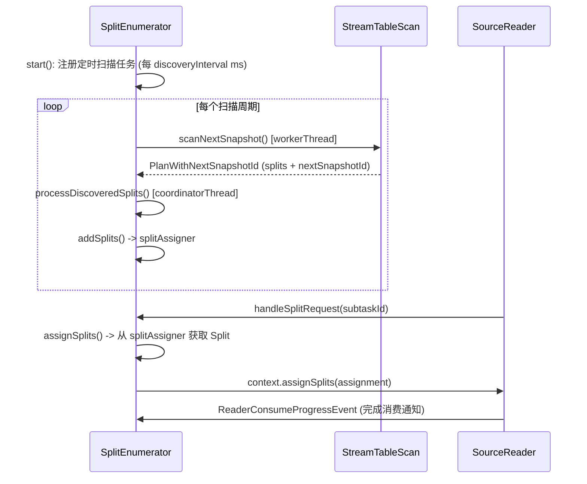
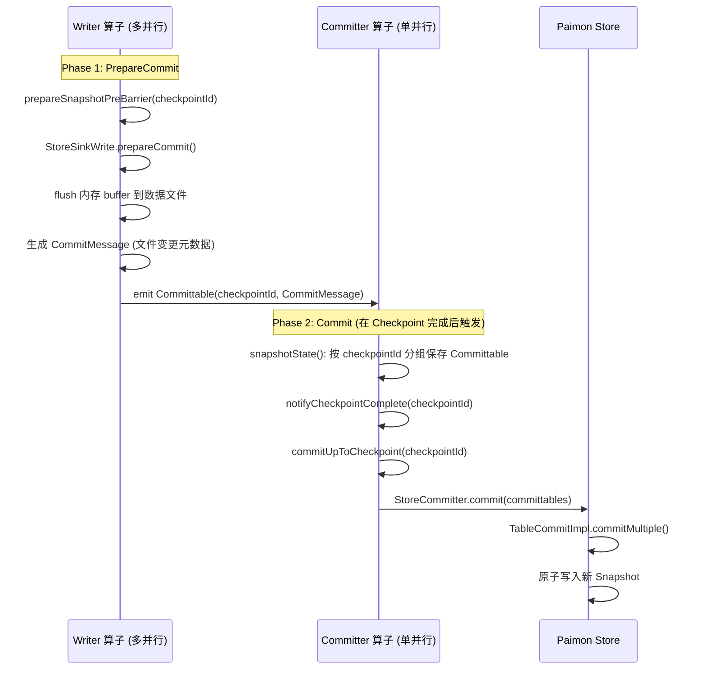

# Apache Paimon Flink 集成源码深度分析

> 基于 Paimon 1.5-SNAPSHOT 源码，commit: 7c93bd720
> 分析日期: 2026-04-15

---

## 目录

- [1. 模块结构与版本适配策略](#1-模块结构与版本适配策略)
  - [1.1 子模块全景](#11-子模块全景)
  - [1.2 版本适配策略](#12-版本适配策略)
  - [1.3 依赖层次](#13-依赖层次)
- [2. Flink Source 连接器体系](#2-flink-source-连接器体系)
  - [2.1 继承层次与职责划分](#21-继承层次与职责划分)
  - [2.2 FlinkSource 基类](#22-flinksource-基类)
  - [2.3 StaticFileStoreSource 批量读取](#23-staticfilestoresource-批量读取)
  - [2.4 ContinuousFileStoreSource 流式读取](#24-continuousfilestoresource-流式读取)
  - [2.5 ContinuousFileSplitEnumerator 增量扫描核心](#25-continuousfilesplitEnumerator-增量扫描核心)
  - [2.6 FileStoreSourceReader 读取端](#26-filestoresourcereader-读取端)
  - [2.7 FlinkSourceBuilder 构建决策树](#27-flinksourcebuilder-构建决策树)
  - [2.8 反压机制与流量控制](#28-反压机制与流量控制)
- [3. Flink Sink 连接器体系](#3-flink-sink-连接器体系)
  - [3.1 完整算子拓扑](#31-完整算子拓扑)
  - [3.2 FlinkSink 基类核心逻辑](#32-flinksink-基类核心逻辑)
  - [3.3 FlinkSinkBuilder 根据 BucketMode 分发](#33-flinksinkbuilder-根据-bucketmode-分发)
  - [3.4 Writer 算子继承链](#34-writer-算子继承链)
  - [3.5 StoreSinkWrite 策略体系](#35-storeSinkwrite-策略体系)
- [4. Checkpoint 提交机制与 Exactly-Once 语义](#4-checkpoint-提交机制与-exactly-once-语义)
  - [4.1 两阶段提交流程](#41-两阶段提交流程)
  - [4.2 CommitterOperator 状态管理](#42-committeroperator-状态管理)
  - [4.3 StoreCommitter 实际提交](#43-storecommitter-实际提交)
  - [4.4 关键约束与设计决策](#44-关键约束与设计决策)
  - [4.5 状态恢复机制](#45-状态恢复机制)
- [5. CDC 同步体系](#5-cdc-同步体系)
  - [5.1 支持的 CDC 源类型](#51-支持的-cdc-源类型)
  - [5.2 SynchronizationActionBase 架构](#52-synchronizationactionbase-架构)
  - [5.3 表级 CDC 同步流程](#53-表级-cdc-同步流程)
  - [5.4 库级 CDC 同步流程](#54-库级-cdc-同步流程)
  - [5.5 Schema 自动演进机制](#55-schema-自动演进机制)
  - [5.6 CDC 拓扑图](#56-cdc-拓扑图)
- [6. Flink SQL 集成](#6-flink-sql-集成)
  - [6.1 FlinkTableFactory 体系](#61-flinktablefactory-体系)
  - [6.2 FlinkCatalog 桥接](#62-flinkcatalog-桥接)
  - [6.3 Procedure 体系](#63-procedure-体系)
- [7. Dedicated Compaction](#7-dedicated-compaction)
  - [7.1 架构设计](#71-架构设计)
  - [7.2 CompactorSourceBuilder](#72-compactorsourcebuilder)
  - [7.3 CompactorSinkBuilder](#73-compactorsinkbuilder)
- [8. Lookup Join 机制](#8-lookup-join-机制)
  - [8.1 FileStoreLookupFunction](#81-filestorelookupfunction)
  - [8.2 LookupTable 体系](#82-lookuptable-体系)
  - [8.3 FullCacheLookupTable 全量缓存](#83-fullcachelookuptable-全量缓存)
  - [8.4 PrimaryKeyPartialLookupTable 部分缓存](#84-primarykeypartiallookuptable-部分缓存)
  - [8.5 缓存刷新机制](#85-缓存刷新机制)
  - [8.6 Bucket 感知 Shuffle](#86-bucket-感知-shuffle)
- [9. 与 Iceberg Flink Sink 对比](#9-与-iceberg-flink-sink-对比)

---

## 1. 模块结构与版本适配策略

### 1.1 子模块全景

Paimon 的 Flink 集成位于 `paimon-flink/` 目录下，采用分层模块化架构：

```
paimon-flink/                          (聚合 POM)
  |
  +-- paimon-flink1-common/            (Flink 1.x 公共代码，编译于 Flink 1.20.1)
  +-- paimon-flink2-common/            (Flink 2.x 公共代码，编译于 Flink 2.2.0，仅 flink2 Profile)
  +-- paimon-flink-common/             (Flink 通用核心代码，依赖于上层 flinkx-common)
  +-- paimon-flink-action/             (Action 命令行工具)
  +-- paimon-flink-cdc/                (CDC 同步模块)
  |
  +-- paimon-flink-1.16/               (Flink 1.16 版本适配)
  +-- paimon-flink-1.17/               (Flink 1.17 版本适配)
  +-- paimon-flink-1.18/               (Flink 1.18 版本适配)
  +-- paimon-flink-1.19/               (Flink 1.19 版本适配)
  +-- paimon-flink-1.20/               (Flink 1.20 版本适配)
  +-- paimon-flink-2.0/                (Flink 2.0 版本适配)
  +-- paimon-flink-2.1/                (Flink 2.1 版本适配)
  +-- paimon-flink-2.2/                (Flink 2.2 版本适配)
```

源码路径: `paimon-flink/pom.xml` (L36-L41)

**为什么这样组织**: 将核心逻辑集中在 `paimon-flink-common` 中，版本特定的适配代码放在对应的 `paimon-flink-X.Y` 模块中。这样做的好处是：避免代码重复，核心逻辑只写一次；新增 Flink 版本时只需新建一个薄适配层模块；版本间的行为差异可以通过条件编译或覆写隔离。

### 1.2 版本适配策略

Paimon 通过 Maven Profile 机制管理 Flink 版本矩阵：

| Profile   | Flink 版本范围       | 公共模块依赖                  | 默认激活 |
|-----------|--------------------|-----------------------------|---------|
| `flink1`  | 1.16, 1.17, 1.18, 1.19, 1.20 | `paimon-flink1-common` (Flink 1.20.1 编译) | 是       |
| `flink2`  | 2.0, 2.1, 2.2     | `paimon-flink2-common` (Flink 2.2.0 编译)  | 否       |

源码路径: `pom.xml` (L453-L485)

**关键设计决策**：

1. **`paimon-flink1-common` 固定编译于 Flink 1.20.1**: 这是 Flink 1.x 的最高版本，其 API 是所有 1.x 版本的超集。低版本 Flink (如 1.16) 的适配模块通过 shade 或桥接类处理缺失的 API。

2. **`paimon-flink-common` 是版本无关的抽象**: 它依赖 `${paimon-flinkx-common}` 变量，在不同 Profile 下解析为 `paimon-flink1-common` 或 `paimon-flink2-common`。

3. **Flink 2.x 需要 Java 11 以上**，而 Paimon 整体基于 JDK 8。因此 `flink2` Profile 不是默认激活的。

### 1.3 依赖层次

```
paimon-bundle (uber-jar，包含 core + common + format)
    ^
    |
paimon-flink1-common / paimon-flink2-common (Flink 版本公共)
    ^
    |
paimon-flink-common (核心逻辑: Source/Sink/Catalog/Lookup/Procedure)
    ^                ^
    |                |
paimon-flink-cdc   paimon-flink-action
(CDC 同步)          (命令行 Action)
    ^
    |
paimon-flink-X.Y (版本适配 + Bundle 打包)
```

**为什么依赖 `paimon-bundle` 而不是 `paimon-core`**: Bundle 是 Paimon 的 shaded uber-jar，包含了 core + common + format + 所有 shaded 依赖（Guava、Jackson 等），避免与 Flink 运行时的依赖冲突。这是 Flink Connector 的标准做法。

---

## 2. Flink Source 连接器体系

### 2.1 继承层次与职责划分

```
Source<RowData, FileStoreSourceSplit, PendingSplitsCheckpoint>  (Flink API 接口)
  |
  FlinkSource (抽象类)
  |  职责: 创建 SourceReader (统一的读取端)、定义序列化器
  |  源码: paimon-flink-common/.../flink/source/FlinkSource.java
  |
  +-- StaticFileStoreSource          // Bounded: 批量一次性读取
  |   源码: .../flink/source/StaticFileStoreSource.java
  |
  +-- ContinuousFileStoreSource      // Unbounded: 流式增量读取
  |   源码: .../flink/source/ContinuousFileStoreSource.java
  |
  +-- AlignedContinuousFileStoreSource  // 对齐 Checkpoint 的流式读取
      源码: .../flink/source/align/AlignedContinuousFileStoreSource.java
```

**为什么区分 Static 和 Continuous**: Flink Source API 要求明确 `Boundedness`。批模式一次性扫描 Snapshot 产生所有 Split；流模式持续监控新 Snapshot 产生增量 Split。两者的 SplitEnumerator 行为完全不同，分开实现更清晰。

### 2.2 FlinkSource 基类

源码路径: `paimon-flink/paimon-flink-common/src/main/java/org/apache/paimon/flink/source/FlinkSource.java`

```java
public abstract class FlinkSource
        implements Source<RowData, FileStoreSourceSplit, PendingSplitsCheckpoint> {

    protected final ReadBuilder readBuilder;   // Paimon 读取构建器 (封装 filter/projection)
    @Nullable protected final Long limit;       // 行数限制 (支持 LIMIT N 下推)
    @Nullable protected final NestedProjectedRowData rowData;  // 嵌套投影 (嵌套类型列裁剪)
    protected final boolean blobAsDescriptor;   // Blob 作为描述符模式
}
```

**核心方法 `createReader()` (L65-L83)**:

1. 从 Flink 配置中获取 `tmp.dirs` 创建 Paimon `IOManager` (用于本地临时文件存储)
2. 创建 `FlinkMetricRegistry` 将 Paimon 指标桥接到 Flink 指标体系
3. 通过 `readBuilder.newRead()` 创建 `TableRead`，这是 Paimon Core 的实际读取器
4. 将所有组件组装为 `FileStoreSourceReader`

**设计决策**: FlinkSource 通过 `ReadBuilder` 桥接 Paimon Core 的读取能力。`ReadBuilder` 是可序列化的，包含了 Filter、Projection、Limit 等所有读取配置。这样 FlinkSource 可以安全地序列化/反序列化到 TaskManager。

### 2.3 StaticFileStoreSource 批量读取

源码路径: `paimon-flink/paimon-flink-common/src/main/java/org/apache/paimon/flink/source/StaticFileStoreSource.java`

```java
public class StaticFileStoreSource extends FlinkSource {
    private final int splitBatchSize;                // 每批分配的 Split 数量
    private final SplitAssignMode splitAssignMode;   // FAIR 或 PREEMPTIVE
    @Nullable private final DynamicPartitionFilteringInfo dynamicPartitionFilteringInfo;

    @Override
    public Boundedness getBoundedness() {
        return Boundedness.BOUNDED;  // 固定为有界
    }
}
```

**Split 生成流程 (`getSplits()` L92-L101)**:

```
readBuilder.newScan()          // 创建 InnerTableScan
    -> scan.plan()             // 扫描当前 Snapshot，获取所有 DataSplit
    -> splitGenerator.createSplits(plan)  // 将 DataSplit 包装为 FileStoreSourceSplit
```

**两种 Split 分配模式 (`createSplitAssigner()` L103-L117)**:

| 模式 | 实现类 | 行为 | 适用场景 |
|------|--------|------|---------|
| `FAIR` | `PreAssignSplitAssigner` | 按 task 预先均匀分配 Split | 数据分布均匀，避免数据倾斜 |
| `PREEMPTIVE` | `FIFOSplitAssigner` | 先到先得 (FIFO) | 数据分布不均，快任务可多处理 |

**为什么默认是 FAIR**: 预分配保证了每个 TaskManager 的工作量大致均等，避免出现部分 task 空闲、部分 task 过载的情况。当用户确认数据倾斜场景时可以切换到 PREEMPTIVE。

### 2.4 ContinuousFileStoreSource 流式读取

源码路径: `paimon-flink/paimon-flink-common/src/main/java/org/apache/paimon/flink/source/ContinuousFileStoreSource.java`

```java
public class ContinuousFileStoreSource extends FlinkSource {
    protected final Map<String, String> options;
    protected final boolean unordered;  // 是否支持无序读取

    @Override
    public Boundedness getBoundedness() {
        // 如果配置了 scan.bounded.watermark，则为有界
        Long boundedWatermark = CoreOptions.fromMap(options).scanBoundedWatermark();
        return boundedWatermark != null ? Boundedness.BOUNDED : Boundedness.CONTINUOUS_UNBOUNDED;
    }
}
```

**`restoreEnumerator()` 流程 (L80-L96)**:

1. 从 checkpoint 恢复 `nextSnapshotId` 和残留 `splits`
2. 创建 `StreamTableScan` 并调用 `scan.restore(nextSnapshotId)` 恢复扫描位置
3. 构建 `ContinuousFileSplitEnumerator`

**`unordered` 的判定逻辑** (来自 `FlinkSourceBuilder.unordered()` L101-L118):
- 只有 Append-only 表 (无主键) 才可以无序读取
- `BUCKET_UNAWARE` 模式默认无序
- `HASH_FIXED` 模式需要 `bucket-append-ordered=false` 才无序
- 有主键的表**永远有序**，因为 CDC changelog 依赖顺序

**为什么有主键表必须有序**: Paimon 的 changelog 语义依赖 Snapshot 的提交顺序。如果乱序读取，下游可能先看到 UPDATE_AFTER 再看到 UPDATE_BEFORE，导致数据不一致。

### 2.5 ContinuousFileSplitEnumerator 增量扫描核心

源码路径: `paimon-flink/paimon-flink-common/src/main/java/org/apache/paimon/flink/source/ContinuousFileSplitEnumerator.java`

这是 Paimon 流式读取的核心组件，运行在 Flink JobManager 上。

**核心状态**:

```java
protected final StreamTableScan scan;                        // 流式扫描器
protected final SplitAssigner splitAssigner;                  // Split 分配器
protected final Set<Integer> readersAwaitingSplit;             // 等待 Split 的 Reader
protected final ConsumerProgressCalculator consumerProgressCalculator;  // 消费进度追踪
@Nullable protected Long nextSnapshotId;                       // 下一个要扫描的快照 ID
private long handledSnapshotCount = 0;                         // 已处理的快照数
private final int maxSnapshotCount;                            // 最大在途快照数
```

**工作流程**:



**`scanNextSnapshot()` 方法详解 (L231-L252)**:

```java
protected synchronized Optional<PlanWithNextSnapshotId> scanNextSnapshot() {
    // 流量控制 1: 如果积压的 Split 超过限制，不再扫描
    if (splitAssigner.numberOfRemainingSplits() >= splitMaxNum) {
        return Optional.empty();
    }
    // 流量控制 2: 如果在途快照数超过限制，不再扫描
    if (maxSnapshotCount > 0 && handledSnapshotCount >= maxSnapshotCount) {
        return Optional.empty();
    }
    TableScan.Plan plan = scan.plan();  // 执行增量扫描
    Long nextSnapshotId = scan.checkpoint();
    return Optional.of(new PlanWithNextSnapshotId(plan, nextSnapshotId));
}
```

**Split 分配的 Bucket 感知** (`assignSuggestedTask()` L328-L365):

```java
protected int assignSuggestedTask(DataSplit split) {
    int parallelism = context.currentParallelism();
    int bucketId = split.bucket();
    if (shuffleBucketWithPartition) {
        // 同时考虑分区和 bucket 的 hash，更均匀
        return ChannelComputer.select(split.partition(), bucketId, parallelism);
    } else {
        // 只按 bucket hash
        return ChannelComputer.select(bucketId, parallelism);
    }
}
```

**为什么按 Bucket 分配 Split**: 保证同一个 Bucket 的数据始终发往同一个 Reader task，这对于有主键的表很重要——同一个 Key 的 INSERT/UPDATE/DELETE 事件必须由同一个 task 有序处理。

**Consumer 进度追踪与 Checkpoint**:

`snapshotState()` (L203-L216) 中，Enumerator 通过 `ConsumerProgressCalculator` 追踪各 Reader 的消费进度。在 `notifyCheckpointComplete()` (L219-L224) 时，将最小消费进度通知给 `StreamTableScan`，实现 Consumer 位点记录。

### 2.6 FileStoreSourceReader 读取端

源码路径: `paimon-flink/paimon-flink-common/src/main/java/org/apache/paimon/flink/source/FileStoreSourceReader.java`

```java
public class FileStoreSourceReader
        extends SingleThreadMultiplexSourceReaderBase<
                RecordIterator<RowData>, RowData, FileStoreSourceSplit, FileStoreSourceSplitState> {
```

**为什么继承 `SingleThreadMultiplexSourceReaderBase`**: 这是 Flink 提供的基类，用单线程复用方式读取多个 Split。好处是：不需要为每个 Split 创建独立线程，减少资源消耗；Split 之间的切换是顺序的，保证了同一 task 内的有序性。

**关键行为**:

1. **`start()` (L76-L80)**: 如果当前没有分配的 Split，主动向 Enumerator 请求
2. **`onSplitFinished()` (L83-L104)**: 完成一个 Split 后:
   - 如果没有更多已分配的 Split，请求新的
   - 将已完成 Split 的最大 snapshotId 通过 `ReaderConsumeProgressEvent` 上报给 Enumerator

**读取内部使用 `FileStoreSourceSplitReader`**: 它将 `FileStoreSourceSplit` 转换为 Paimon `TableRead` 可处理的 Split，执行实际的文件读取。

### 2.7 FlinkSourceBuilder 构建决策树

源码路径: `paimon-flink/paimon-flink-common/src/main/java/org/apache/paimon/flink/source/FlinkSourceBuilder.java`

`FlinkSourceBuilder.build()` (L308-L337) 的决策逻辑:

```
build():
  |
  +-- if (sourceBounded) {                       // 批模式
  |     if (SCAN_DEDICATED_SPLIT_GENERATION) {
  |         return buildDedicatedSplitGenSource(bounded=true)   // 独立 Split 生成
  |     }
  |     return buildStaticFileSource()            // 标准批量读取
  |   }
  |
  +-- streamingReadingValidate(table)             // 流模式校验
  |
  +-- if (SOURCE_CHECKPOINT_ALIGN_ENABLED) {
  |     return buildAlignedContinuousFileSource() // 对齐 Checkpoint 模式
  |   }
  |
  +-- if (CONSUMER_ID + EXACTLY_ONCE) {
  |     return buildDedicatedSplitGenSource(bounded=false)  // Consumer 精确一次
  |   }
  |
  +-- return buildContinuousFileSource()          // 标准流式读取
```

**`buildDedicatedSplitGenSource()` (L339-L365)**: 使用 `MonitorSource` 模式——Split 生成和数据读取分离到不同的算子中。这在两个场景下需要：(1) 批模式下支持动态 Split 生成；(2) 流模式下 Consumer 精确一次语义要求更严格的 Split 管理。

**关键校验逻辑**:

- Consumer ID 必须配合 `consumer.expiration-time` 使用 (L312-L318)，防止 Consumer 留下过多快照导致文件系统风险
- 流式对齐模式 (`AlignedContinuousFileStoreSource`) 要求严格的 Checkpoint 配置 (L367-L392)

### 2.8 反压机制与流量控制

Paimon Source 的反压控制体现在多个层次：

**1. Enumerator 层 (ContinuousFileSplitEnumerator)**:
- `splitMaxNum = context.currentParallelism() * splitMaxPerTask`: 限制积压的 Split 总量
- `maxSnapshotCount`: 限制在途快照数，控制扫描节奏
- 当积压达到限制时，`scanNextSnapshot()` 直接返回 `Optional.empty()`

**2. Reader 层**:
- `SingleThreadMultiplexSourceReaderBase` 内置了单线程模型，天然限制了读取速率
- `RecordLimiter` 实现 LIMIT N 语义，到达限制后停止读取

**3. 配置参数**:

| 参数 | 默认值 | 作用 |
|------|--------|------|
| `continuous.discovery-interval` | 10s | 扫描新 Snapshot 的间隔 |
| `scan.max-splits-per-task` | 10 | 每个 task 最大积压 Split 数 |
| `scan.max-snapshot-count` | - | 最大在途快照数 |

---

## 3. Flink Sink 连接器体系

### 3.1 完整算子拓扑

```
数据输入流 (DataStream<T>)
    |
    | [可选] LocalMergeOperator (本地预合并)
    |
    v
+--------------------------------------------------------------+
| Writer 算子 (RowDataStoreWriteOperator / CdcRecordStoreWriteOperator) |
| 并行度 = 上游并行度                                             |
| 职责: 写数据到本地 LSM + prepareCommit (flush 文件)             |
+--------------------------------------------------------------+
    |
    | DataStream<Committable>
    | [可选] ChangelogCompactCoordinator -> ChangelogCompactWorker -> ChangelogSort
    |
    v
+--------------------------------------------------------------+
| Global Committer 算子 (CommitterOperator)                     |
| 并行度 = 1, setMaxParallelism(1)                              |
| 职责: 收集所有 Writer 的 Committable, 原子提交 Snapshot          |
+--------------------------------------------------------------+
    |
    v
DiscardingSink (丢弃，终结拓扑)
```

源码路径: `paimon-flink/paimon-flink-common/src/main/java/org/apache/paimon/flink/sink/FlinkSink.java`

**为什么 Committer 并行度必须为 1 (L228-L229)**: Paimon 的每个 Checkpoint 只能产生一个 Snapshot。如果有多个 Committer 并发提交，会导致竞争条件。全局唯一的 Committer 确保了原子性。

**为什么最后是 `DiscardingSink` (L243)**: `CommitterOperator` 本身是一个 `OneInputStreamOperator`，不是 Sink。Flink 要求 DAG 必须以 Sink 结尾，所以需要一个 `DiscardingSink` 来满足拓扑要求。Committable 数据在 CommitterOperator 中已经被消费。

### 3.2 FlinkSink 基类核心逻辑

源码路径: `paimon-flink/paimon-flink-common/src/main/java/org/apache/paimon/flink/sink/FlinkSink.java` (L72)

**`sinkFrom()` 两步走 (L97-L102)**:

```java
public DataStreamSink<?> sinkFrom(DataStream<T> input, String initialCommitUser) {
    // Step 1: 实际写入，不产生 Snapshot
    DataStream<Committable> written = doWrite(input, initialCommitUser, null);
    // Step 2: 提交 Committable，生成新的 Snapshot
    return doCommit(written, initialCommitUser);
}
```

**`doWrite()` 方法详解 (L125-L187)**:

1. 创建 `StoreSinkWrite.Provider` —— 根据表配置选择写入策略
2. 用 `createWriteOperatorFactory()` 创建 Writer 算子（由子类实现）
3. 将 Writer 算子挂接到输入流
4. 配置 Managed Memory、Slot Sharing Group
5. 如果启用了 `PRECOMMIT_COMPACT` (针对有主键表)，增加 Changelog Compact 算子链

**`doCommit()` 方法详解 (L189-L244)**:

1. 检查 Checkpoint 配置（流模式必须开启 Checkpoint + EXACTLY_ONCE）
2. 创建 `CommitterOperatorFactory`
3. 可选包装 `AutoTagForSavepointCommitterOperatorFactory` (Savepoint 自动打 Tag)
4. 可选包装 `BatchWriteGeneratorTagOperatorFactory` (批模式自动打 Tag)
5. 设置并行度为 1
6. 可选禁用算子链 (`SINK_COMMITTER_OPERATOR_CHAINING`)

**资源隔离配置**: FlinkSink 支持为 Writer 和 Committer 分别配置 CPU 和内存：

```java
configureSlotSharingGroup(written, SINK_WRITER_CPU, SINK_WRITER_MEMORY);
configureSlotSharingGroup(committed, SINK_COMMITTER_CPU, SINK_COMMITTER_MEMORY);
```

### 3.3 FlinkSinkBuilder 根据 BucketMode 分发

源码路径: `paimon-flink/paimon-flink-common/src/main/java/org/apache/paimon/flink/sink/FlinkSinkBuilder.java`

`FlinkSinkBuilder.build()` (L207-L243) 的核心决策:

```java
BucketMode bucketMode = table.bucketMode();
switch (bucketMode) {
    case POSTPONE_MODE:   return buildPostponeBucketSink(input);
    case HASH_FIXED:      return buildForFixedBucket(input);
    case HASH_DYNAMIC:    return buildDynamicBucketSink(input, false);
    case KEY_DYNAMIC:     return buildDynamicBucketSink(input, true);
    case BUCKET_UNAWARE:  return buildUnawareBucketSink(input);
}
```

| BucketMode | Sink 实现 | 数据分发策略 | 适用场景 |
|------------|----------|-------------|---------|
| `HASH_FIXED` | `FixedBucketSink` | `hash(partition, bucket) % parallelism` | 固定 Bucket 数，最稳定 |
| `HASH_DYNAMIC` | `RowDynamicBucketSink` | `HashBucketAssignerOperator` 动态分配 | 数据量变化大，Bucket 自动扩缩 |
| `KEY_DYNAMIC` | `GlobalDynamicBucketSink` | `GlobalIndexAssigner` 全局索引 | 跨分区 Upsert |
| `BUCKET_UNAWARE` | `RowAppendTableSink` | 无分发 / Hash 分区 | Append-only 表 |
| `POSTPONE_MODE` | `PostponeBucketSink` | 延迟分配 Bucket | 新增模式 |

**`buildForFixedBucket()` 的优化 (L272-L287)**: 如果非分区表的 bucket 数小于输入并行度，自动将 Writer 并行度降为 bucket 数，避免空闲 task 浪费资源。

**Local Merge 优化 (L217-L226)**: 如果表启用了 `local-merge-enabled` 且有主键，在 Writer 前插入 `LocalMergeOperator`。它在本地将同 Key 的多条记录预合并后再发送给 Writer，减少跨网络的数据量。

### 3.4 Writer 算子继承链

```
AbstractStreamOperator<OUT>
  |
  PrepareCommitOperator<IN, OUT>           (抽象)
  |  职责: 内存池管理、prepareSnapshotPreBarrier 触发提交
  |  源码: .../flink/sink/PrepareCommitOperator.java
  |
  +-- TableWriteOperator<IN>               (抽象)
  |     职责: 初始化 StoreSinkWrite、状态恢复、commitUser 管理
  |     源码: .../flink/sink/TableWriteOperator.java
  |
  +-- RowDataStoreWriteOperator            (具体)
        职责: processElement -> write.write(row)
        源码: .../flink/sink/RowDataStoreWriteOperator.java
```

**PrepareCommitOperator 的关键方法 (`prepareSnapshotPreBarrier()` L93-L98)**:

```java
@Override
public void prepareSnapshotPreBarrier(long checkpointId) throws Exception {
    if (!endOfInput) {
        emitCommittables(false, checkpointId);
    }
}
```

**为什么在 `prepareSnapshotPreBarrier` 中触发提交**: 这是 Flink Checkpoint 机制中 Barrier 到达算子之前的回调。在此时将内存中的数据 flush 到文件，生成 `CommitMessage`，确保 Barrier 之前的所有数据都已持久化。

**内存管理 (`setup()` L68-L90)**: 支持两种内存模式:
- **Managed Memory**: 使用 Flink 的 `MemoryManager` 分配内存，由 Flink 统一管理
- **Heap Memory**: 使用 JVM 堆内存，根据 `write-buffer-size` 和 `page-size` 配置

**TableWriteOperator 的初始化 (`initializeState()` L75-L97)**:

1. 计算 `StateValueFilter` —— 基于 `ChannelComputer.select(partition, bucket, numTasks)` 确定哪些 state 属于当前 subtask
2. 通过 `StoreSinkWrite.Provider` 创建具体的 `StoreSinkWrite` 实例
3. 设置 `WriteRestore` (协调模式下从 Coordinator 恢复)
4. 创建 `ConfigRefresher` 支持运行时配置热更新

### 3.5 StoreSinkWrite 策略体系

源码路径: `paimon-flink/paimon-flink-common/src/main/java/org/apache/paimon/flink/sink/StoreSinkWrite.java`

```
StoreSinkWrite (接口)
  |  核心方法: write(), compact(), prepareCommit(), replace()
  |
  +-- StoreSinkWriteImpl                    // 默认实现
  |     源码: .../flink/sink/StoreSinkWriteImpl.java
  |
  +-- GlobalFullCompactionSinkWrite         // 全局 Full Compaction
  |     源码: .../flink/sink/GlobalFullCompactionSinkWrite.java
  |
  +-- LookupSinkWrite                       // Lookup changelog 模式
        源码: .../flink/sink/LookupSinkWrite.java
```

**策略选择逻辑 (`createWriteProvider()` L100-L187)**:

```
if (writeOnly) {
    waitCompaction = false   // 只写不压缩
    -> StoreSinkWriteImpl
}

if (changelogProducer == FULL_COMPACTION || deltaCommits >= 0) {
    -> GlobalFullCompactionSinkWrite(deltaCommits)
}

if (needLookup) {     // changelog-producer = lookup
    -> LookupSinkWrite
}

default:
    -> StoreSinkWriteImpl
```

**StoreSinkWriteImpl** (L47-L187):
- 持有 `TableWriteImpl<?>` (Paimon Core 的写入器)
- `write()` → `write.writeAndReturn(rowData)`
- `prepareCommit()` → `write.prepareCommit(waitCompaction, checkpointId)` → 返回 `CommitMessage` 列表

**GlobalFullCompactionSinkWrite** (L53-L276):
- 继承 `StoreSinkWriteImpl`
- 额外追踪 `writtenBuckets` (每个 checkpoint 写入了哪些 partition+bucket)
- 在 `isFullCompactedIdentifier(checkpointId, deltaCommits)` 为 true 时，对所有写过的 bucket 执行 full compaction
- **为什么需要全局 Full Compaction**: changelog-producer = full_compaction 模式需要周期性地对所有 bucket 做全量压缩来产生 changelog。通过 `deltaCommits` 控制压缩频率（每 N 个 checkpoint 压缩一次）。

**LookupSinkWrite** (L34-L92):
- 继承 `StoreSinkWriteImpl`
- 恢复时从 state 中读取 `activeBuckets`，对每个 bucket 触发 compact（恢复 lookup 缓存）
- `snapshotState()` 时保存当前活跃的 partition+bucket 列表
- **为什么恢复时要 compact**: Lookup changelog 模式依赖本地 LSM 树的 lookup 能力来产生完整的 changelog (旧值 + 新值)。重启后需要重建这些 lookup 缓存。

---

## 4. Checkpoint 提交机制与 Exactly-Once 语义

### 4.1 两阶段提交流程



### 4.2 CommitterOperator 状态管理

源码路径: `paimon-flink/paimon-flink-common/src/main/java/org/apache/paimon/flink/sink/CommitterOperator.java`

**核心状态结构**:

```java
// 按 checkpointId 分组的 GlobalCommitT (ManifestCommittable)
protected final NavigableMap<Long, GlobalCommitT> committablesPerCheckpoint;
// 输入缓冲区
private final Deque<CommitT> inputs = new ArrayDeque<>();
```

**`processElement()` (L221-L224)**: 只做两件事——转发元素和缓存输入。

```java
public void processElement(StreamRecord<CommitT> element) {
    output.collect(element);      // 转发给下游 (DiscardingSink)
    this.inputs.add(element.getValue());  // 缓存到输入队列
}
```

**`snapshotState()` (L164-L168)**: Checkpoint Barrier 到达时:

1. `pollInputs()` —— 将输入队列中的 Committable 按 checkpointId 分组，合并为 `ManifestCommittable`
2. 通过 `committableStateManager.snapshotState()` 持久化到 state

**`pollInputs()` (L240-L276)**: 使用 `committer.groupByCheckpoint(inputs)` 将 Committable 分组，然后 `committer.combine()` 合并为 `GlobalCommitT`。对于 `END_INPUT_CHECKPOINT_ID` (Long.MAX_VALUE) 有特殊处理——允许合并而不报错，因为多个有界输入可能在不同时间结束。

**`notifyCheckpointComplete()` (L190-L193)**: Checkpoint 完成时触发实际提交:

```java
public void notifyCheckpointComplete(long checkpointId) throws Exception {
    super.notifyCheckpointComplete(checkpointId);
    commitUpToCheckpoint(endInput ? END_INPUT_CHECKPOINT_ID : checkpointId);
}
```

**`commitUpToCheckpoint()` (L195-L218)**: 提取 `<= checkpointId` 的所有 committables，调用 `committer.commit()` 或 `committer.filterAndCommit()`。

### 4.3 StoreCommitter 实际提交

源码路径: `paimon-flink/paimon-flink-common/src/main/java/org/apache/paimon/flink/sink/StoreCommitter.java`

```java
public class StoreCommitter implements Committer<Committable, ManifestCommittable> {
    private final TableCommitImpl commit;           // Paimon Core 的提交器
    @Nullable private final CommitterMetrics committerMetrics;  // 提交指标
    private final CommitListeners commitListeners;   // 提交监听器
}
```

**`combine()` (L80-L96)**: 将多个 `Committable` 合并为一个 `ManifestCommittable`:

```java
public ManifestCommittable combine(long checkpointId, long watermark, List<Committable> committables) {
    ManifestCommittable manifestCommittable = new ManifestCommittable(checkpointId, watermark);
    for (Committable committable : committables) {
        manifestCommittable.addFileCommittable(committable.commitMessage());
    }
    return manifestCommittable;
}
```

**`commit()` (L99-L104)**: 调用 `commit.commitMultiple(committables, false)`，这最终调用 Paimon Core 的 `FileStoreCommit` 执行原子 Snapshot 提交。

**`filterAndCommit()` (L107-L117)**: 用于 `endInput` 场景（批作业结束时），会检查 Snapshot 是否已存在以避免重复提交。

### 4.4 关键约束与设计决策

源码: `FlinkSink.assertStreamingConfiguration()` (L264-L273)

```java
public static void assertStreamingConfiguration(StreamExecutionEnvironment env) {
    checkArgument(!env.getCheckpointConfig().isUnalignedCheckpointsEnabled(), ...);
    checkArgument(checkpointingMode == CheckpointingMode.EXACTLY_ONCE, ...);
}
```

| 约束 | 原因 |
|------|------|
| **不支持 Unaligned Checkpoint** | Unaligned Checkpoint 允许 Barrier 越过数据。如果 Committer 在 Barrier 到达时提交，可能包含还未被 Writer flush 的数据，破坏一致性 |
| **必须 EXACTLY_ONCE** | AT_LEAST_ONCE 模式下 Barrier 可以被超越，导致同一条数据可能出现在不同 Checkpoint 的 Committable 中 |
| **Committer 并行度为 1** | 保证每个 Checkpoint 只产生一个 Snapshot，避免并发写 Manifest 的冲突 |

### 4.5 状态恢复机制

**commitUser 的持久化** (CommitterOperator L129-L131 / TableWriteOperator L111-L121):

```java
commitUser = StateUtils.getSingleValueFromState(
    context, "commit_user_state", String.class, initialCommitUser);
```

**为什么 commitUser 必须跨重启一致**: Paimon 使用 `commitUser` 标识提交者。重启后如果 commitUser 变化，新的 Committer 无法继续之前的未完成提交（orphan commit cleanup 依赖 commitUser 匹配）。注释明确指出不能用 Job ID 作为 commitUser，因为从 Savepoint 恢复时 Job ID 会变化。

**Writer 状态恢复**: `StoreSinkWriteImpl.replace()` (L173-L182) 支持 Schema 变更时的热替换:

```java
public void replace(FileStoreTable newTable) throws Exception {
    List<? extends FileStoreWrite.State<?>> states = write.checkpoint();
    write.close();
    write = newTableWrite(newTable);
    write.restore((List) states);
}
```

---

## 5. CDC 同步体系

### 5.1 支持的 CDC 源类型

| 源类型 | 表级同步 | 库级同步 | 数据格式 |
|--------|---------|---------|---------|
| **MySQL** | `MySqlSyncTableAction` | `MySqlSyncDatabaseAction` | Debezium CDC |
| **PostgreSQL** | `PostgresSyncTableAction` | - | Debezium CDC |
| **MongoDB** | `MongoDBSyncTableAction` | `MongoDBSyncDatabaseAction` | MongoDB ChangeStream |
| **Kafka** | `KafkaSyncTableAction` | `KafkaSyncDatabaseAction` | Canal/Debezium JSON |
| **Pulsar** | `PulsarSyncTableAction` | `PulsarSyncDatabaseAction` | Canal/Debezium JSON |

源码路径: `paimon-flink/paimon-flink-cdc/src/main/java/org/apache/paimon/flink/action/cdc/`

### 5.2 SynchronizationActionBase 架构

源码路径: `paimon-flink/paimon-flink-cdc/src/main/java/org/apache/paimon/flink/action/cdc/SynchronizationActionBase.java`

```
ActionBase
  |
  SynchronizationActionBase (抽象)
  |  职责: 构建 CDC 数据流、创建数据库、配置 Watermark
  |
  +-- SyncTableActionBase (抽象)
  |     职责: 单表同步，创建/校验目标表，CdcSinkBuilder 构建 Sink
  |     |
  |     +-- MySqlSyncTableAction
  |     +-- KafkaSyncTableAction
  |     +-- ...
  |
  +-- SyncDatabaseActionBase (抽象)
        职责: 库级同步，表名映射/过滤，FlinkCdcSyncDatabaseSinkBuilder
        |
        +-- MySqlSyncDatabaseAction
        +-- KafkaSyncDatabaseAction
        +-- ...
```

**`build()` 方法核心流程 (L131-L143)**:

```java
public void build() throws Exception {
    syncJobHandler.checkRequiredOption();       // 校验必须的源配置
    catalog.createDatabase(database, true);     // 创建目标数据库 (如果不存在)
    beforeBuildingSourceSink();                 // 子类钩子: 创建/校验目标表

    DataStream<RichCdcMultiplexRecord> input =
        buildDataStreamSource(buildSource())    // 1. 构建 CDC 数据源
            .flatMap(recordParse())             // 2. 解析为 RichCdcMultiplexRecord
            .name("Parse");

    EventParser.Factory<RichCdcMultiplexRecord> parserFactory = buildEventParserFactory();
    buildSink(input, parserFactory);            // 3. 构建 Paimon Sink
}
```

**`run()` 方法 (L238-L244)**: 自动启用 Checkpoint (默认 3 分钟间隔)，然后调用 `build()` + `execute()`。

### 5.3 表级 CDC 同步流程

源码路径: `paimon-flink/paimon-flink-cdc/src/main/java/org/apache/paimon/flink/action/cdc/SyncTableActionBase.java`

**`beforeBuildingSourceSink()` (L114-L149)**: 最关键的表准备逻辑:

```
1. 尝试获取目标 Paimon 表
   |
   +-- 表存在:
   |     - alterTableOptions() 更新动态配置
   |     - retrieveSchema() 从源获取 Schema
   |     - buildComputedColumns() 构建计算列
   |     - assertSchemaCompatible() 检查兼容性
   |
   +-- 表不存在:
         - retrieveSchema() 从源获取 Schema
         - buildPaimonSchema() 构建 Paimon Schema
         - catalog.createTable() 自动创建表
```

**`buildSink()` (L163-L179)**: 使用 `CdcSinkBuilder` 构建 Sink:

```java
new CdcSinkBuilder<RichCdcMultiplexRecord>()
    .withInput(input)
    .withParserFactory(parserFactory)   // 事件解析器
    .withTable(fileStoreTable)          // 目标 Paimon 表
    .withIdentifier(new Identifier(database, table))
    .withTypeMapping(typeMapping)        // 类型映射
    .withCatalogLoader(catalogLoader())  // Catalog 加载器 (用于 Schema 演进)
    .build();
```

### 5.4 库级 CDC 同步流程

源码路径: `paimon-flink/paimon-flink-cdc/src/main/java/org/apache/paimon/flink/action/cdc/SyncDatabaseActionBase.java`

**关键配置**:

| 配置 | 作用 |
|------|------|
| `includingTables` / `excludingTables` | 正则过滤要同步的表 |
| `includingDbs` / `excludingDbs` | 正则过滤要同步的数据库 (多库场景) |
| `tablePrefix` / `tableSuffix` | 目标表名前缀/后缀 |
| `tableMapping` | 精确表名映射 |
| `mergeShards` | 是否合并分库分表 |
| `mode` (COMBINED) | 多表 Sink 模式 |

**`buildSink()` (L242-L271)**: 使用 `FlinkCdcSyncDatabaseSinkBuilder`:

```java
new FlinkCdcSyncDatabaseSinkBuilder<RichCdcMultiplexRecord>()
    .withInput(input)
    .withParserFactory(parserFactory)
    .withCatalogLoader(catalogLoader())
    .withDatabase(database)
    .withTables(tables)              // 已知的表列表
    .withMode(mode)                  // COMBINED 模式: 复用 Sink 算子
    .withTableOptions(tableConfig)
    .withEagerInit(eagerInit)        // 是否预创建所有表
    .withTableFilter(new TableFilter(...))
    .build();
```

**为什么库级同步使用 `FlinkCdcSyncDatabaseSinkBuilder` 而不是为每个表创建独立 Sink**: 在 COMBINED 模式下，所有表共享一套 Writer + Committer 算子，通过 `RichCdcMultiplexRecord` 中的表名进行路由。这大幅减少了算子数量和资源消耗。对于运行时新增的表，会动态扩展 Writer 的处理能力。

### 5.5 Schema 自动演进机制

在 CDC 同步过程中，Paimon 支持自动适配源端的 Schema 变更:

**支持的演进操作**:
- **添加新列** (ADD COLUMN): 检测到 CDC 记录中出现未知字段时，自动向 Paimon 表添加列
- **类型提升** (Type Promotion): 如 INT -> BIGINT, FLOAT -> DOUBLE
- **不支持**: 删除列、重命名列、类型降级

**演进触发路径**:

```
RichCdcMultiplexRecordEventParser.parseRecord()
    -> 检测到新字段或类型变更
    -> 生成 SchemaChange 列表
    -> CdcSinkBuilder 中的 SchemaEvolutionClient 处理
    -> catalog.alterTable() 原子修改 Schema
    -> StoreSinkWrite.replace(newTable) 热替换 Writer
```

**为什么用 `replace()` 热替换而不是重启**: CDC 同步作业通常长期运行。通过 `TableWriteImpl.checkpoint()` + `restore()` 机制，可以在不丢失内存状态的情况下平滑切换到新 Schema 的 Writer。

### 5.6 CDC 拓扑图

**表级同步拓扑**:


**库级同步拓扑 (COMBINED 模式)**:


---

## 6. Flink SQL 集成

### 6.1 FlinkTableFactory 体系

```
DynamicTableSourceFactory / DynamicTableSinkFactory  (Flink SPI 接口)
  |
  AbstractFlinkTableFactory (抽象)
  |  职责: 创建 DataTableSource / FlinkTableSink、Table 加载
  |  源码: .../flink/AbstractFlinkTableFactory.java
  |
  +-- FlinkTableFactory (具体)
        职责: 支持 AUTO_CREATE 自动建表
        源码: .../flink/FlinkTableFactory.java
```

源码路径: `paimon-flink/paimon-flink-common/src/main/java/org/apache/paimon/flink/FlinkTableFactory.java`

**`createDynamicTableSource()` (AbstractFlinkTableFactory L85-L100)**:

```java
public DynamicTableSource createDynamicTableSource(Context context) {
    Table table = getPaimonTable(origin, context);
    boolean unbounded = (RUNTIME_MODE == STREAMING);
    if (origin instanceof SystemCatalogTable) {
        return new SystemTableSource(table, unbounded, context.getObjectIdentifier());
    } else {
        return new DataTableSource(context.getObjectIdentifier(), table, unbounded, context);
    }
}
```

**AUTO_CREATE 功能** (FlinkTableFactory L64-L83): 如果表选项中设置了 `auto-create = true`，在首次访问时自动创建 Paimon 表。这对于 Flink SQL 中直接 CREATE TABLE 并立即使用的场景很方便。

### 6.2 FlinkCatalog 桥接

`FlinkCatalog` (位于 `paimon-flink-common`) 实现了 Flink 的 `Catalog` 接口，将所有 DDL 操作桥接到 Paimon 的 `Catalog` API:

| Flink Catalog API | Paimon Catalog API |
|---|---|
| `createDatabase()` | `catalog.createDatabase()` |
| `createTable()` | `catalog.createTable()` |
| `alterTable()` | `catalog.alterTable()` |
| `getTable()` | `catalog.getTable()` → 包装为 Flink `CatalogTable` |
| `listTables()` | `catalog.listTables()` |

### 6.3 Procedure 体系

Paimon 提供了大量 Flink SQL Procedure，分为以下几类:

**Snapshot 管理**:

| Procedure | 功能 |
|-----------|------|
| `ExpireSnapshotsProcedure` | 过期快照 |
| `ExpireChangelogsProcedure` | 过期 Changelog |
| `RollbackToProcedure` | 回滚到指定快照 |
| `RollbackToTimestampProcedure` | 回滚到指定时间戳 |
| `RollbackToWatermarkProcedure` | 回滚到指定 Watermark |

**Tag 管理**:

| Procedure | 功能 |
|-----------|------|
| `CreateTagProcedure` | 创建 Tag |
| `CreateTagFromTimestampProcedure` | 从时间戳创建 Tag |
| `CreateTagFromWatermarkProcedure` | 从 Watermark 创建 Tag |
| `DeleteTagProcedure` | 删除 Tag |
| `RenameTagProcedure` | 重命名 Tag |
| `ReplaceTagProcedure` | 替换 Tag |
| `ExpireTagsProcedure` | 过期 Tag |

**分支管理**:

| Procedure | 功能 |
|-----------|------|
| `CreateBranchProcedure` | 创建分支 |
| `DeleteBranchProcedure` | 删除分支 |
| `RenameBranchProcedure` | 重命名分支 |
| `FastForwardProcedure` | 快进分支 |

**Compaction**:

| Procedure | 功能 |
|-----------|------|
| `CompactProcedure` | 单表 Compaction |
| `CompactDatabaseProcedure` | 库级 Compaction |
| `CompactManifestProcedure` | Manifest 文件 Compaction |

**数据管理**:

| Procedure | 功能 |
|-----------|------|
| `MergeIntoProcedure` | MERGE INTO 操作 |
| `DropPartitionProcedure` | 删除分区 |
| `MarkPartitionDoneProcedure` | 标记分区完成 |
| `PurgeFilesProcedure` | 清理文件 |
| `RemoveOrphanFilesProcedure` | 清理孤儿文件 |
| `RemoveUnexistingFilesProcedure` | 清理不存在的文件引用 |

**其他**:

| Procedure | 功能 |
|-----------|------|
| `RepairProcedure` | 修复元数据 |
| `CloneProcedure` | 克隆表 |
| `CopyFilesProcedure` | 复制文件 |
| `MigrateTableProcedure` | 迁移表 (从 Hive/Iceberg) |
| `MigrateDatabaseProcedure` | 迁移数据库 |
| `QueryServiceProcedure` | 启动查询服务 |
| `RescaleProcedure` | 调整 Bucket 数 |
| `RewriteFileIndexProcedure` | 重写文件索引 |
| `VectorSearchProcedure` | 向量搜索 |

---

## 7. Dedicated Compaction

### 7.1 架构设计

Dedicated Compaction 允许将 Compaction 从写入作业中剥离为独立作业:

```
写入作业 (write-only = true):
  数据流 -> Writer (只写不压缩) -> Committer -> Snapshot

            Paimon 表 (共享存储)

Compaction 作业 (独立部署):
  CompactorSource -> CompactorSink -> Committer -> Compact Snapshot
```

**为什么需要 Dedicated Compaction**:
1. **资源隔离**: Compaction 是 CPU/IO 密集型操作，可能影响写入吞吐
2. **弹性伸缩**: Compaction 作业可以独立调整并行度
3. **错误隔离**: Compaction 失败不影响写入作业

### 7.2 CompactorSourceBuilder

源码路径: `paimon-flink/paimon-flink-common/src/main/java/org/apache/paimon/flink/source/CompactorSourceBuilder.java`

**核心逻辑**: 使用 `CompactBucketsTable` (系统表) 扫描需要 Compaction 的 Bucket:

```java
private Source<RowData, ?, ?> buildSource(CompactBucketsTable compactBucketsTable) {
    if (isContinuous) {
        // 流模式: stream-scan-mode = compact-bucket-table
        return new ContinuousFileStoreSource(readBuilder, options, null);
    } else {
        // 批模式: scan.mode = latest-full, batch-scan-mode = compact
        return new StaticFileStoreSource(readBuilder, null, ...);
    }
}
```

**批/流模式差异**:

| 模式 | 配置 | 行为 |
|------|------|------|
| 批 (batch) | `scan.mode=latest-full, batch-scan-mode=compact` | 一次性扫描所有需要 compact 的文件 |
| 流 (continuous) | `stream-scan-mode=compact-bucket-table` | 持续监控新 Snapshot，发现需要 compact 的 bucket |

**`partitionIdleTime` 优化** (L128-L143): 批模式下支持按分区空闲时间过滤，只 compact 超过指定时间未更新的分区。

### 7.3 CompactorSinkBuilder

源码路径: `paimon-flink/paimon-flink-common/src/main/java/org/apache/paimon/flink/sink/CompactorSinkBuilder.java`

```java
public DataStreamSink<?> build() {
    BucketMode bucketMode = table.bucketMode();
    switch (bucketMode) {
        case HASH_FIXED:
        case HASH_DYNAMIC:
            return buildForBucketAware();
        default:
            throw new UnsupportedOperationException(...);
    }
}
```

**`buildForBucketAware()` (L63-L72)**: 使用 `BucketsRowChannelComputer` 按 partition+bucket 分发，然后交给 `CompactorSink` (继承 `FlinkSink`)。

**`CompactorSink`** 内部使用 `StoreCompactOperator` 执行实际的 Compaction，最后通过 `CommitterOperator` 提交 Compact 结果。

---

## 8. Lookup Join 机制

### 8.1 FileStoreLookupFunction

源码路径: `paimon-flink/paimon-flink-common/src/main/java/org/apache/paimon/flink/lookup/FileStoreLookupFunction.java`

```java
public class FileStoreLookupFunction implements Serializable, Closeable {
    private final FileStoreTable table;
    @Nullable private final PartitionLoader partitionLoader;   // 分区加载器
    private final List<String> projectFields;                  // 投影字段
    private final List<String> joinKeys;                       // Join 键
    @Nullable private final Predicate predicate;               // 过滤条件
    @Nullable private final ShuffleStrategy strategy;          // Bucket Shuffle 策略
    private transient LookupTable lookupTable;                 // 缓存表
}
```

**`open()` 方法的 LookupTable 选择逻辑 (L182-L234)**:

```
if (LOOKUP_CACHE_MODE == AUTO && joinKeys == primaryKeys) {
    if (远程查询服务可用) {
        -> PrimaryKeyPartialLookupTable.createRemoteTable()   // 远程查询
    } else {
        try -> PrimaryKeyPartialLookupTable.createLocalTable() // 本地 LSM Lookup
        catch -> fall through                                  // 不支持时降级
    }
}

if (lookupTable == null) {
    -> FullCacheLookupTable.create(context, lruCacheSize)     // 全量缓存
}
```

**`lookup()` 方法 (L278-L308)**:

```java
public Collection<RowData> lookup(RowData keyRow) {
    tryRefresh();  // 检查是否需要刷新缓存
    InternalRow key = new FlinkRowWrapper(keyRow);
    if (partitionLoader == null) {
        return lookupInternal(key);        // 无分区: 直接查找
    }
    // 有分区: 遍历所有活跃分区
    List<RowData> rows = new ArrayList<>();
    for (BinaryRow partition : partitions) {
        rows.addAll(lookupInternal(JoinedRow.join(key, partition)));
    }
    return rows;
}
```

### 8.2 LookupTable 体系

```
LookupTable (接口)
  |
  +-- FullCacheLookupTable (抽象)              // 全量加载到本地缓存
  |     |
  |     +-- PrimaryKeyLookupTable             // 有主键，joinKey = primaryKey
  |     +-- SecondaryIndexLookupTable         // 有主键，joinKey != primaryKey (需要二级索引)
  |     +-- NoPrimaryKeyLookupTable           // 无主键 (append-only 表)
  |
  +-- PrimaryKeyPartialLookupTable            // 部分缓存 (按需加载)
        |
        +-- LocalTable                        // 基于本地 LSM 树查询
        +-- RemoteTable                       // 基于远程查询服务
```

### 8.3 FullCacheLookupTable 全量缓存

源码路径: `paimon-flink/paimon-flink-common/src/main/java/org/apache/paimon/flink/lookup/FullCacheLookupTable.java`

**存储后端选择 (`createStateFactory()` L171-L179)**:

| LOOKUP_CACHE_MODE | 存储后端 | 特点 |
|-------------------|---------|------|
| `MEMORY` | `InMemoryStateFactory` | 纯内存，速度最快，受限于堆内存大小 |
| 默认 (RocksDB) | `RocksDBStateFactory` | 使用本地 RocksDB，支持大数据量 |

**`bootstrap()` 全量加载流程 (L181-L227)**:

1. 创建 `LookupStreamingReader` (带增量读取能力的读取器)
2. 如果 StateFactory 支持 `BulkLoad` (RocksDB):
   - 使用 `BinaryExternalSortBuffer` 先排序
   - 通过 `RocksDBBulkLoader` 批量写入
3. 如果不支持 BulkLoad (InMemory):
   - 直接调用 `doRefresh()` 逐行写入

**`refresh()` 增量刷新 (L230-L275)**:

支持同步和异步两种模式:

```java
if (refreshExecutor == null) {
    doRefresh();     // 同步刷新
} else {
    // 异步刷新: 提交到单线程池
    // 如果积压快照过多 (latestSnapshotId - nextSnapshotId > maxPendingSnapshotCount)
    // 则阻塞等待上一次刷新完成后同步执行
    refreshExecutor.submit(() -> doRefresh());
}
```

**`create()` 工厂方法 (L366-L377)**: 根据表特征选择实现:

| 条件 | 实现 |
|------|------|
| 无主键 | `NoPrimaryKeyLookupTable` |
| 有主键 + joinKey == primaryKey | `PrimaryKeyLookupTable` |
| 有主键 + joinKey != primaryKey | `SecondaryIndexLookupTable` |

### 8.4 PrimaryKeyPartialLookupTable 部分缓存

当 `LOOKUP_CACHE_MODE = AUTO` 且 join key 等于主键时，Paimon 优先使用部分缓存:

**RemoteTable 模式**: 通过 Paimon 的查询服务 (`paimon-service`) 远程查询，不需要本地缓存。

**LocalTable 模式**: 使用本地 `LocalQueryExecutor` 直接查询 LSM 树中的数据文件。按需读取，不需要全量加载。

**为什么部分缓存更高效**: 全量缓存需要在启动时加载整个表，对于大表来说耗时很长。部分缓存只在查询命中时加载对应的 Key，内存使用更少，启动更快。但它要求 join key 等于 primary key（否则无法直接定位数据）。

### 8.5 缓存刷新机制

源码: `FileStoreLookupFunction.tryRefresh()` (L339-L394)

```
tryRefresh():
  1. 检查刷新黑名单 (refreshBlacklist)
     -> 在指定时间段内跳过刷新
  
  2. 检查异步分区刷新是否完成
     -> 如果完成，原子切换到新的 LookupTable
  
  3. 刷新动态分区 (partitionLoader.checkRefresh())
     -> 如果分区发生变化，重新指定分区并刷新
  
  4. 刷新 Lookup Table (shouldRefreshLookupTable())
     -> 判断是否到达 refreshInterval
     -> 判断是否需要全量重加载 (shouldDoFullLoad())
     -> 执行 lookupTable.refresh() 或 重新 open()
```

**`shouldDoFullLoad()` (L401-L418)**: 当积压的快照数超过 `refreshFullThreshold` 时，重新全量加载而不是增量刷新。因为增量刷新在积压很多快照时可能比全量加载更慢。

**刷新黑名单**: 通过 `LOOKUP_REFRESH_TIME_PERIODS_BLACKLIST` 配置可以在指定时间段内禁止刷新，避免在业务高峰期触发大量 IO。

### 8.6 Bucket 感知 Shuffle

源码: `FileStoreLookupFunction.getRequireCachedBucketIds()` (L493-L509)

```java
protected Set<Integer> getRequireCachedBucketIds() {
    if (strategy == null) {
        return null;  // 不启用 Bucket 感知，缓存所有 Bucket
    }
    Integer indexOfThisSubtask = RuntimeContextUtils.getIndexOfThisSubtask(functionContext);
    Integer numberOfParallelSubtasks = RuntimeContextUtils.getNumberOfParallelSubtasks(functionContext);
    return strategy.getRequiredCacheBucketIds(indexOfThisSubtask, numberOfParallelSubtasks);
}
```

**为什么需要 Bucket 感知 Shuffle**: Flink Planner 可以根据 Lookup Join 的 join key 将数据按 Bucket 分发到不同的 subtask。这样每个 subtask 只需要缓存自己负责的 Bucket 数据，大幅减少内存使用。

**配置方式**: 通过 `ShuffleStrategy` 实现。当 `getRequireCachedBucketIds()` 返回非空时，`FullCacheLookupTable` 在 bootstrap 和 refresh 时只加载指定 Bucket 的数据。

---

## 9. 与 Iceberg Flink Sink 对比

| 维度 | Paimon | Iceberg |
|------|--------|---------|
| **Committer 并行度** | 强制为 1 (FlinkSink L228-L229) | 强制为 1 (IcebergFilesCommitter) |
| **提交触发** | `notifyCheckpointComplete(cpId)` (CommitterOperator L190) | `notifyCheckpointComplete(cpId)` |
| **数据 flush 时机** | `prepareSnapshotPreBarrier` (PrepareCommitOperator L93) | `prepareSnapshotPreBarrier` |
| **提交内容** | `ManifestCommittable` (CommitMessage 列表) | `WriteResult` (DataFile + DeleteFile) |
| **Unaligned Checkpoint** | 不支持 (FlinkSink L266) | 不支持 |
| **Checkpoint 模式** | 仅 EXACTLY_ONCE (FlinkSink L271) | 仅 EXACTLY_ONCE |
| **Compaction** | Writer 内置 LSM Compaction + 可选 Dedicated Compaction | 独立的 Compaction 作业或触发机制 |
| **Changelog 生成** | 内置多种 changelog-producer (input/lookup/full-compaction) | 不支持原生 changelog |
| **Streaming 写入** | 原生支持 (核心设计目标) | 支持但不是主要场景 |
| **Lookup Join** | 原生支持 (FullCache/PartialCache/Remote) | 不支持 |
| **Schema Evolution (CDC)** | 内置自动 Schema 演进 (ADD COLUMN / Type Promotion) | 需要外部工具 |
| **Bucket 模式** | 5 种模式 (Fixed/Dynamic/KeyDynamic/Unaware/Postpone) | 无 Bucket 概念 (分区内文件) |
| **状态恢复** | commitUser 持久化 + Writer State 恢复 | Committer State 恢复 |

**核心差异总结**:

1. **实时性**: Paimon 以实时湖仓为核心设计目标，提供了丰富的流式能力 (changelog producer, lookup join, CDC sync)。Iceberg 更侧重于批处理和 ACID 事务。

2. **Compaction 策略**: Paimon 的 LSM 结构使得 Compaction 可以与写入同时进行 (Writer 内置)，也可以拆分为独立作业。Iceberg 的 Compaction 通常是独立的后台操作。

3. **数据分发**: Paimon 通过 BucketMode 精确控制数据如何分布到文件中，而 Iceberg 依赖分区和排序。Bucket 机制使得 Paimon 可以实现更高效的点查和 Lookup Join。

4. **CDC 能力**: Paimon 内置了完整的 CDC 同步链路 (多种源、Schema 演进、多表同步)，这在 Iceberg 生态中需要借助额外工具（如 Flink CDC + Iceberg Connector 组合）。

---

> 本文档基于 Paimon 1.5-SNAPSHOT 源码分析，如有更新请以最新代码为准。
