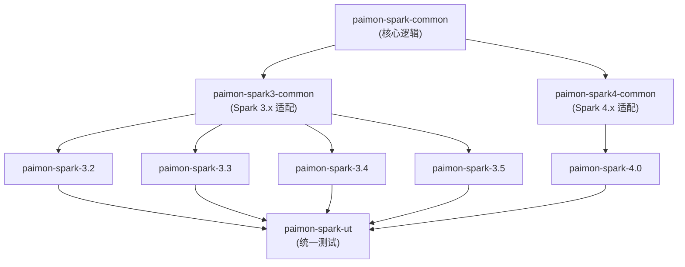
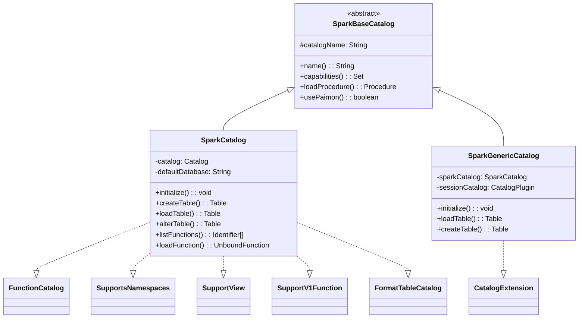
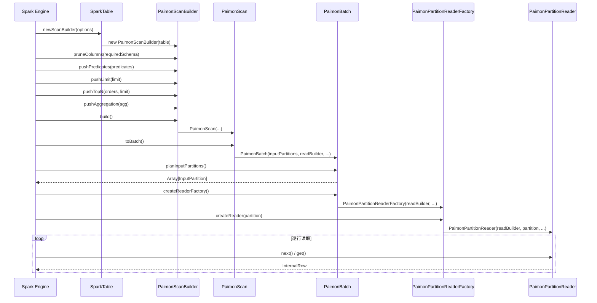
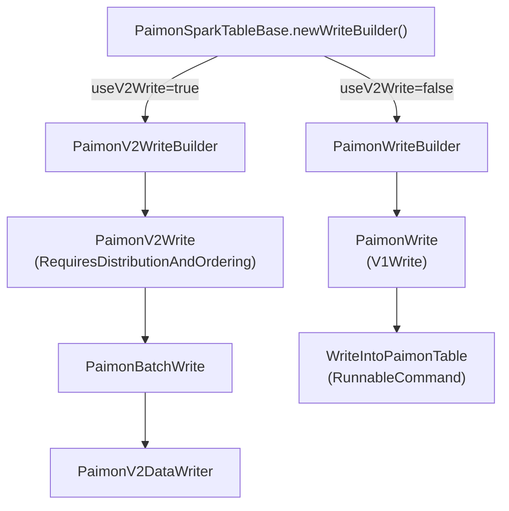
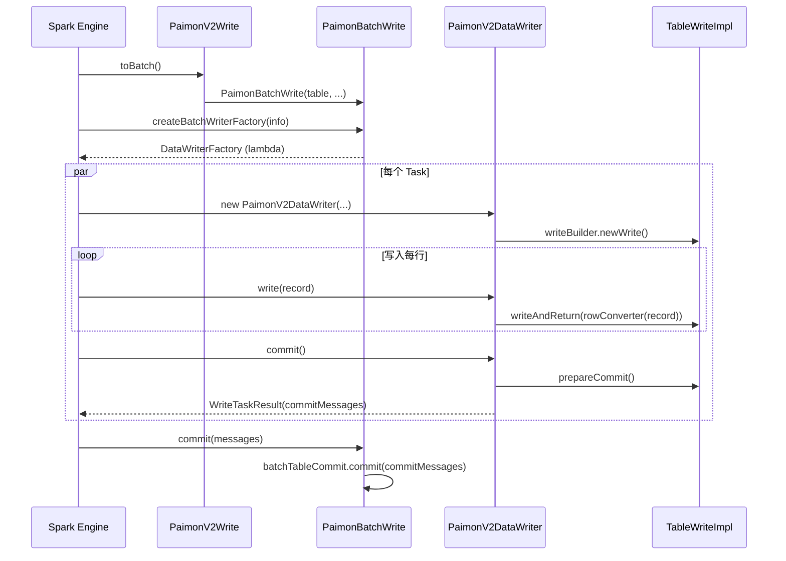
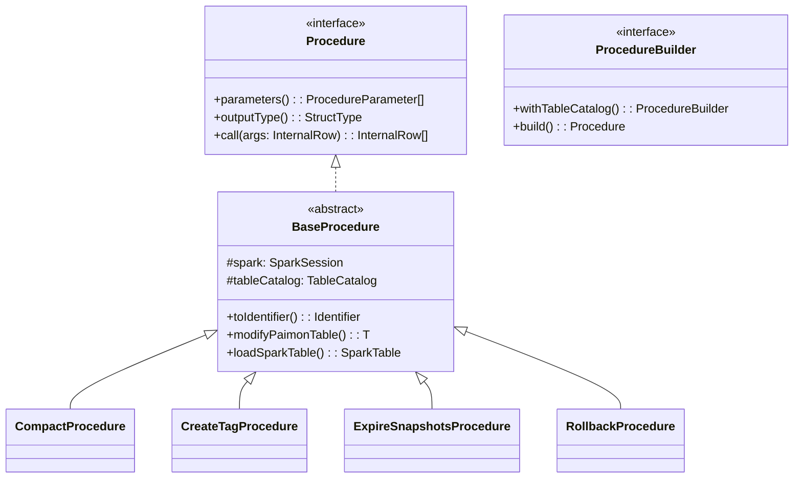
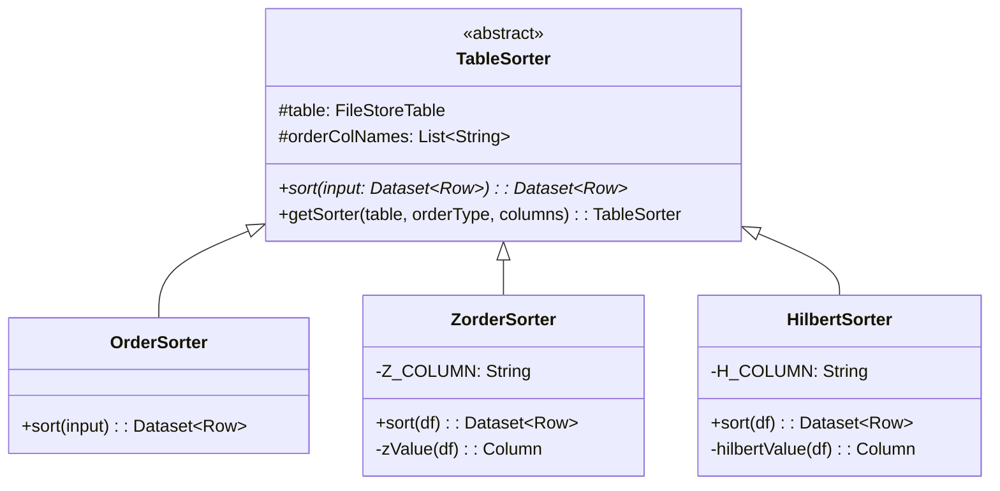
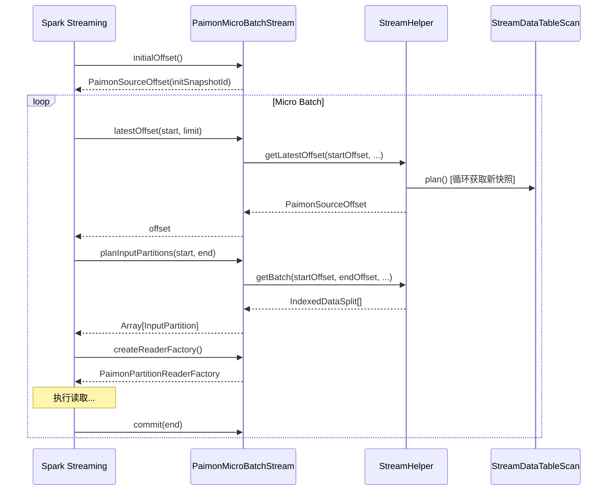

# Apache Paimon Spark 集成深度源码分析

> 基于 paimon 1.5-SNAPSHOT (master 分支, commit 7c93bd720)
> 分析日期: 2026-04-15

---

## 1. Spark 模块结构与版本适配架构

### 1.1 模块总览

```
paimon-spark/
  paimon-spark-common/       -- 核心共享代码 (Java + Scala 混合)
  paimon-spark3-common/      -- Spark 3.x 共享的适配层
  paimon-spark4-common/      -- Spark 4.x 共享的适配层
  paimon-spark-3.2/          -- Spark 3.2 版本特定代码
  paimon-spark-3.3/          -- Spark 3.3 版本特定代码
  paimon-spark-3.4/          -- Spark 3.4 版本特定代码
  paimon-spark-3.5/          -- Spark 3.5 版本特定代码
  paimon-spark-4.0/          -- Spark 4.0 版本特定代码
  paimon-spark-ut/           -- 统一测试模块 (Scala 测试)
  pom.xml                    -- 聚合 POM
```

### 1.2 分层依赖架构



**为什么这么设计？**
- **最大化代码复用**: `paimon-spark-common` 包含所有跨版本共享的核心逻辑（Catalog、DataSource V2 接口、Procedure、排序器、写入器等），无论 Spark 版本如何，这些代码只写一遍。
- **最小化版本差异**: Spark 3.x 与 4.x 之间有 API 不兼容变化（如 `InternalRow` 接口变化、`MergeIntoTable` 签名差异、Variant 类型支持等）。通过 `paimon-spark3-common` 和 `paimon-spark4-common` 两个中间层隔离这些差异。
- **版本特定模块极简**: 例如 `paimon-spark-3.5` 只有 1 个文件 (`MergePaimonScalarSubqueries.scala`)，`paimon-spark-3.4` 只有 6 个文件，说明版本间差异已被上层模块充分抽象。

### 1.3 SparkShim 机制 -- 版本适配的核心

```
SparkShim (trait, paimon-spark-common)
  ├── Spark3Shim (paimon-spark3-common)
  └── Spark4Shim (paimon-spark4-common)
```

**源码位置**: `paimon-spark-common/.../shims/SparkShim.scala`

`SparkShim` 是一个 trait，声明了所有在 Spark 3 与 Spark 4 之间有不兼容实现的方法：

| 方法 | 作用 | 为什么需要适配 |
|------|------|---------------|
| `createSparkParser()` | 创建 SQL 解析器 | Spark 3/4 Parser API 签名不同 |
| `createSparkInternalRow()` | 创建内部行对象 | `InternalRow` 接口在 Spark 4 中变化 |
| `createSparkArrayData()` | 创建数组数据 | `ArrayData` 实现差异 |
| `createMergeIntoTable()` | 创建 MERGE INTO 逻辑计划 | Spark 4 增加了 `withSchemaEvolution` 参数 |
| `toPaimonVariant()` | Variant 类型转换 | Variant 是 Spark 4 新增类型 |
| `createCustomResolution()` | 创建版本特定分析规则 | 不同版本的 Catalyst 规则差异 |

**好处**: 运行时通过 `SparkShimLoader` (SPI 机制) 加载对应版本的 Shim 实现，主代码无需 `if-else` 判断版本号，同时每个版本的 shaded jar 只包含对应实现。

---

## 2. SparkCatalog 体系

### 2.1 类继承层次



### 2.2 SparkBaseCatalog -- 基座

**源码位置**: `paimon-spark-common/.../catalog/SparkBaseCatalog.java`

```java
public abstract class SparkBaseCatalog
        implements TableCatalog, SupportsNamespaces, ProcedureCatalog, WithPaimonCatalog {
    protected String catalogName;

    public Set<TableCatalogCapability> capabilities() {
        return Collections.singleton(SUPPORT_COLUMN_DEFAULT_VALUE);
    }

    public Procedure loadProcedure(Identifier identifier) throws NoSuchProcedureException {
        if (isSystemNamespace(identifier.namespace())) {
            ProcedureBuilder builder = SparkProcedures.newBuilder(identifier.name());
            if (builder != null) {
                return builder.withTableCatalog(this).build();
            }
        }
        throw new NoSuchProcedureException(identifier);
    }
}
```

**为什么这么做？**
- **Procedure 统一加载**: 不论使用 `SparkCatalog` 还是 `SparkGenericCatalog`，Procedure 的注册和加载逻辑完全一致，避免重复。
- **`ProcedureCatalog` 接口**: 这是 Paimon 自定义的接口，Spark 原生不提供 Procedure 概念，Paimon 借鉴 Iceberg 模式，通过 `CALL sys.xxx()` 语法调用。

### 2.3 SparkCatalog -- 独立 Paimon Catalog

**源码位置**: `paimon-spark-common/.../SparkCatalog.java`

**核心职责**: 作为一个独立的 Spark Catalog 实例（如 `spark_catalog` 以外的其他名称），只管理 Paimon 表。

**初始化流程** (`initialize()` 方法):
1. 调用 `checkRequiredConfigurations()` 校验必要配置
2. 通过 `CatalogContext.create()` + `CatalogFactory.createCatalog()` 创建底层 Paimon `Catalog` 实例
3. 读取 `default-database` 选项，默认为 `"default"`
4. 判断是否启用 V1 Function（仅 RESTCatalog 支持）
5. 若默认数据库不存在，自动创建

**loadTable 的多态分发**:

```java
protected Table loadSparkTable(Identifier ident, Map<String, String> extraOptions) {
    Table table = copyWithSQLConf(catalog.getTable(tblIdent), ...);
    if (table instanceof FormatTable) {
        return toSparkFormatTable(ident, (FormatTable) table);     // 格式表
    } else if (table instanceof IcebergTable) {
        return new SparkIcebergTable(table);                        // Iceberg 兼容表
    } else if (table instanceof LanceTable) {
        return new SparkLanceTable(table);                          // Lance 表
    } else if (table instanceof ObjectTable) {
        return new SparkObjectTable((ObjectTable) table);           // 对象表
    } else {
        return new SparkTable(table);                               // 标准 Paimon 表
    }
}
```

**为什么这么做？** Paimon 支持多种表类型，每种类型需要不同的 Spark Table 实现来提供不同的 capability（如 ObjectTable 只支持 `BATCH_READ`，SparkTable 支持读/写/流）。

**Time Travel 支持**:
- `loadTable(ident, version)`: 通过 `SCAN_VERSION` 选项实现版本查询
- `loadTable(ident, timestamp)`: 通过 `SCAN_TIMESTAMP_MILLIS` 实现时间旅行。注意 Spark 传入微秒，Paimon 使用毫秒，代码中做了 `/1000` 转换。

### 2.4 SparkGenericCatalog -- 混合 Catalog (CatalogExtension)

**源码位置**: `paimon-spark-common/.../SparkGenericCatalog.java`

**核心设计**: 实现 `CatalogExtension` 接口，用于替代 Spark 内置的 `spark_catalog`。它内部组合一个 `SparkCatalog` 和一个 `sessionCatalog`（委托 Catalog），实现"优先加载 Paimon 表，找不到再回退到 Session Catalog"的策略。

```java
public Table loadTable(Identifier ident) throws NoSuchTableException {
    try {
        return sparkCatalog.loadTable(ident);        // 先尝试 Paimon
    } catch (NoSuchTableException e) {
        return throwsOldIfExceptionHappens(           // 回退到 Session Catalog
            () -> asTableCatalog().loadTable(ident), e);
    }
}
```

**为什么这么做？**
- 用户可以在一个 Spark Session 中同时访问 Paimon 表和 Hive 表
- `createTable` 时根据 `provider` 属性决定：如果是 `paimon` 或未指定则用 Paimon 建表，否则委托给 Session Catalog

**自动配置填充** (`autoFillConfigurations()`):
- 如果未指定 `warehouse`，自动从 `spark.sql.warehouse.dir` 获取
- 如果未指定 `metastore`，检测 Spark 是否配置了 Hive，自动设为 `hive`
- 检测阿里云 EMR 环境，自动配置 DLF metastore
- 强制关闭 format table (`format-table.enabled = false`)

### 2.5 FormatTableCatalog -- 非 Paimon 格式表支持

**源码位置**: `paimon-spark-common/.../catalog/FormatTableCatalog.java`

通过 Paimon 的 `FormatTable` 抽象，可以在 Paimon Catalog 中管理 CSV、JSON、ORC、Parquet、Text 等原生格式表。加载时转换为 Spark 原生的 `FileTable` 实现（`PartitionedCSVTable`、`PartitionedParquetTable` 等），利用 Spark 原生读写能力。

**好处**: 用户可以在 Paimon Catalog 中统一管理各种格式的表，不用切换 Catalog。

### 2.6 SupportView -- 视图支持

**源码位置**: `paimon-spark-common/.../catalog/SupportView.java`

通过 `WithPaimonCatalog` 接口获取底层 Paimon Catalog 实例，代理视图的 CRUD 操作。视图存储时会以 `spark` 方言保存 SQL 文本，支持多方言（如 Flink 和 Spark 可以有不同的 SQL 表达）。

---

## 3. DataSource V2 读取

### 3.1 整体读取流程



### 3.2 类继承层次

```
BaseScan (trait)                    -- 基础 Scan 逻辑: 列裁剪/谓词/统计/指标
  └── PaimonBaseScan (abstract)     -- Paimon 特化: GlobalIndex查询/向量搜索/全文搜索/MicroBatch
        └── PaimonScan (case class) -- 最终 Scan: 桶分区/排序报告

PaimonBaseScanBuilder (abstract)    -- 基础下推: V2Filter/列裁剪/Limit
  └── PaimonScanBuilder             -- 聚合下推/TopN下推/build()
```

### 3.3 谓词下推 (Predicate Push Down)

**源码位置**: `PaimonBaseScanBuilder.scala` 的 `pushPredicates()` 方法

核心流程:
1. 将 Spark V2 `Predicate` 通过 `SparkV2FilterConverter` 转换为 Paimon `Predicate`
2. 使用 `PartitionPredicateVisitor` 区分分区谓词和数据谓词
3. 分区谓词通过 `splitPartitionPredicatesAndDataPredicates` 拆分后设置到 `pushedPartitionFilters`
4. 数据谓词设置到 `pushedDataFilters`，同时保留在 `postScan` 中（因为数据谓词不能保证完全由存储层过滤）
5. 不能转换的谓词也作为 `postScan` 返回

**SparkV2FilterConverter** (`SparkV2FilterConverter.scala`) 支持的谓词类型:

| Spark 谓词 | Paimon 谓词 |
|-----------|------------|
| `=` | `equal` |
| `<=>` | `isNull` 或 `isNotNull + equal` |
| `>`, `>=`, `<`, `<=` | `greaterThan`, `greaterOrEqual`, `lessThan`, `lessOrEqual` |
| `IN` | `in` |
| `IS_NULL`, `IS_NOT_NULL` | `isNull`, `isNotNull` |
| `AND`, `OR`, `NOT` | 组合谓词 |
| `STARTS_WITH`, `ENDS_WITH`, `CONTAINS` | `startsWith`, `endsWith`, `contains` |

**为什么分区谓词和数据谓词要分开处理？** 分区谓词可以在 Manifest 级别过滤，无需读取数据文件；数据谓词需要在文件级别使用统计信息过滤（min/max/bloom filter），但不能保证精确过滤所有不匹配行，所以同时保留在 postScan 中让 Spark 做二次过滤。

### 3.4 列裁剪 (Column Pruning)

```scala
override def pruneColumns(requiredSchema: StructType): Unit = {
    this.requiredSchema = requiredSchema
}
```

在 `BaseScan` 的 `readBuilder` 中:
```scala
val _readBuilder = table.newReadBuilder().withReadType(readTableRowType)
```

`readTableRowType` 通过 `SparkTypeUtils.prunePaimonRowType()` 将 Spark 的 `requiredSchema` 映射为 Paimon 的精简 `RowType`，只读取需要的列，减少 I/O。

### 3.5 聚合下推 (Aggregate Push Down)

**源码位置**: `PaimonScanBuilder.scala` 的 `pushAggregation()` 方法

当满足以下条件时可以做聚合下推:
- 表必须是 `FileStoreTable`
- 没有 post-scan 谓词
- `AggregatePushDownUtils.tryPushdownAggregation()` 成功

如果下推成功，返回 `PaimonLocalScan`（不读取数据文件，直接从统计信息中计算聚合结果），这是一种极端优化：例如 `SELECT COUNT(*) FROM table` 可以直接从 manifest 的统计信息得到结果，无需扫描任何数据文件。

### 3.6 TopN 下推

```scala
override def pushTopN(orders: Array[SortOrder], limit: Int): Boolean = {
    // 仅 FileStoreTable 且没有 post-scan 谓词时支持
    pushedTopN = Some(new TopN(sorts.asJava, limit))
    false  // 返回 false 表示 best-effort，Spark 仍做最终排序
}
```

**好处**: 存储层可以根据排序条件和限制数量优化扫描范围，减少需要读取的文件数。

### 3.7 Split 的 BinPacking 优化

**源码位置**: `BinPackingSplits.scala`

**问题**: Paimon 的 Split 粒度可能很小（单个数据文件），直接每个 Split 一个 Task 会导致过多小任务。

**解决方案**: BinPacking 算法将多个小 Split 合并为一个 `InputPartition`:

1. 区分可重排的 Split（`rawConvertible` 的 `DataSplit`）和不可重排的 Split
2. 对可重排 Split，计算 `maxSplitBytes`（取 `FILES_MAX_PARTITION_BYTES` 和每核平均字节数的较小值）
3. 按 partition + bucket 分组，将同组内的小文件打包到一个 `InputPartition` 中
4. 当累积大小超过 `maxSplitBytes` 时开始新的 partition

**为什么需要列裁剪感知？** `readRowSizeRatio` 参数会根据实际读取列数与总列数的比例调整文件大小估算，使得列裁剪后的 binpacking 更准确。

### 3.8 桶分区报告 (Bucketed Scan)

**源码位置**: `PaimonScan.scala`

当表使用 `HASH_FIXED` 桶模式且只有一个桶键时，`PaimonScan` 会：
1. 报告 `KeyGroupedPartitioning`，让 Spark 知道数据已按桶分区
2. 报告排序信息（`outputOrdering()`），当每个 InputPartition 只有一个 Split 且按主键排序时
3. 按桶号分组 Split 到 `PaimonBucketedInputPartition`

**好处**: Spark 可以利用分区信息避免不必要的 shuffle（如桶 Join），提高查询效率。`DisableUnnecessaryPaimonBucketedScan` 规则会在 AQE (Adaptive Query Execution) 阶段自动禁用不必要的桶扫描。

### 3.9 元数据列 (Metadata Columns)

`PaimonSparkTableBase` 实现了 `SupportsMetadataColumns`，暴露以下元数据列:

| 元数据列 | 条件 | 说明 |
|---------|------|------|
| `_row_id` | `rowTrackingEnabled` | 行级唯一标识 |
| `_sequence_number` | `rowTrackingEnabled` | 序列号 |
| `_file_path` | 始终可用 | 数据文件路径 |
| `_row_index` | 始终可用 | 文件内行索引 |
| `_partition` | 始终可用 | 分区值 |
| `_bucket` | 始终可用 | 桶号 |

---

## 4. DataSource V2 写入

### 4.1 写入架构概览 -- V1 Write vs V2 Write

Paimon 同时支持两种 Spark 写入模式:



#### V1 Write (旧模式)

**源码位置**: `PaimonWrite.scala`, `WriteIntoPaimonTable.scala`

```scala
class PaimonWrite extends V1Write {
    override def toInsertableRelation: InsertableRelation = {
        (data: DataFrame, overwrite: Boolean) => {
            WriteIntoPaimonTable(table, saveMode, data, options).run(data.sparkSession)
        }
    }
}
```

`WriteIntoPaimonTable` 是一个 `RunnableCommand`，在 Driver 端通过 `PaimonSparkWriter` 控制写入流程，在每个分区上使用 Paimon 的 `BatchTableWrite` 写入数据。

**为什么保留 V1 Write？** V1 Write 走的是 Spark 的旧写入路径，不需要 Spark 按特定 distribution 重新分布数据，Paimon 自己在 `PaimonSparkWriter` 中做分桶。这在某些场景下更灵活：
- 多桶键场景
- 非 DEFAULT 桶函数
- 聚类列（clustering columns）场景

#### V2 Write (新模式)

**源码位置**: `PaimonV2Write.scala`, `PaimonBatchWrite.scala`, `PaimonV2DataWriter.scala`

**启用条件** (在 `PaimonSparkTableBase.supportsV2Write` 中判断):
1. 桶函数类型为 `DEFAULT`
2. 表类型为 `FileStoreTable`
3. 桶模式为 `HASH_FIXED`（且 `BucketFunction.supportsTable` 通过）、`BUCKET_UNAWARE` 或 `POSTPONE_MODE`
4. 没有配置聚类列

**V2 Write 的核心优势 -- `RequiresDistributionAndOrdering`**:

```scala
class PaimonV2Write extends Write with RequiresDistributionAndOrdering {
    override def requiredDistribution(): Distribution = writeRequirement.distribution
    override def requiredOrdering(): Array[SortOrder] = writeRequirement.ordering
}
```

`PaimonWriteRequirement` 生成分布要求:

```scala
object PaimonWriteRequirement {
    def apply(table: FileStoreTable): PaimonWriteRequirement = {
        // HASH_FIXED: 按分区键 + bucket(桶键) 聚簇
        // BUCKET_UNAWARE/POSTPONE_MODE: 仅按分区键聚簇
        val distribution = Distributions.clustered(clusteringExpressions)
        PaimonWriteRequirement(distribution, EMPTY_ORDERING)
    }
}
```

**为什么这么做？** 通过声明 `RequiresDistributionAndOrdering`，Spark 会在写入前自动进行 shuffle，保证同一个分区+桶的数据发送到同一个 Writer Task。这避免了 V1 模式中 Paimon 自己做数据分桶的开销，同时利用 Spark 的 AQE 优化 shuffle。

### 4.2 V2 Write 的数据流



**关键细节**:
- `SparkInternalRowWrapper` 负责将 Spark 的 `InternalRow` 包装为 Paimon 的行格式，避免数据拷贝
- `useCommitCoordinator()` 返回 `false`，表示不需要 Spark 的协调器，因为 Paimon 自身保证原子提交
- `abort()` 时只关闭资源（TODO: 清理未提交文件）

### 4.3 Copy-on-Write 行级操作

对于 DELETE、UPDATE、MERGE INTO 等行级操作，当启用 V2 Write 时:

```scala
case class SparkTable(override val table: Table)
    extends PaimonSparkTableBase(table)
    with SupportsRowLevelOperations {

    override def newRowLevelOperationBuilder(info: RowLevelOperationInfo) = {
        table match {
            case t: FileStoreTable if useV2Write =>
                () => new PaimonSparkCopyOnWriteOperation(t, info)
        }
    }
}
```

`PaimonSparkCopyOnWriteOperation` 通过 `PaimonCopyOnWriteScan` 读取受影响的文件，然后在 commit 时同时提交新增文件和已删除文件的 `CommitMessage`。

### 4.4 Overwrite 模式

| 模式 | 行为 | 实现方式 |
|------|------|---------|
| InsertInto | 追加写入 | 不调用 `withOverwrite` |
| Overwrite(filter) | 按条件覆盖写入 | 转换 filter 为分区映射，传给 `BatchWriteBuilder.withOverwrite()` |
| DynamicOverWrite | 动态分区覆盖 | 设置 `CoreOptions.DYNAMIC_PARTITION_OVERWRITE` 为 true |
| Truncate | 全表覆盖 | `overwritePartitions = Map.empty` |

**V1 模式的动态分区覆盖**: 当 V2 Write 不支持时（表不包含 `OVERWRITE_DYNAMIC` capability），`PaimonAnalysis` 中的 `PaimonDynamicPartitionOverwrite` 匹配器会将 `OverwritePartitionsDynamic` 转换为 `PaimonDynamicPartitionOverwriteCommand`（V1 路径执行）。

---

## 5. SQL Extensions

### 5.1 PaimonSparkSessionExtensions -- 扩展注册中心

**源码位置**: `paimon-spark-common/.../extensions/PaimonSparkSessionExtensions.scala`

通过 `spark.sql.extensions=org.apache.paimon.spark.extensions.PaimonSparkSessionExtensions` 激活。

注册的扩展点总览:

```scala
class PaimonSparkSessionExtensions extends (SparkSessionExtensions => Unit) {
    override def apply(extensions: SparkSessionExtensions): Unit = {
        // 1. Parser 扩展 -- CALL 语句、TAG/BRANCH DDL
        extensions.injectParser { (_, parser) => SparkShimLoader.shim.createSparkParser(parser) }

        // 2. Analyzer 扩展 -- 列解析、MERGE INTO、UPDATE、DELETE、Procedure、View
        extensions.injectResolutionRule(spark => new PaimonAnalysis(spark))
        extensions.injectResolutionRule(spark => PaimonProcedureResolver(spark))
        extensions.injectResolutionRule(spark => PaimonViewResolver(spark))
        extensions.injectResolutionRule(spark => PaimonFunctionResolver(spark))
        extensions.injectResolutionRule(spark => PaimonIncompatibleResolutionRules(spark))
        extensions.injectResolutionRule(spark => RewriteUpsertTable(spark))

        // 3. Post-Hoc 分析 -- 函数替换、UPDATE/DELETE/MERGE INTO 重写
        extensions.injectPostHocResolutionRule(spark => ReplacePaimonFunctions(spark))
        extensions.injectPostHocResolutionRule(_ => PaimonUpdateTable)
        extensions.injectPostHocResolutionRule(_ => PaimonDeleteTable)
        extensions.injectPostHocResolutionRule(spark => PaimonMergeInto(spark))

        // 4. Table/Scalar 函数注入
        PaimonTableValuedFunctions.supportedFnNames.foreach { ... }
        BucketExpression.supportedFnNames.foreach { ... }

        // 5. 优化器规则
        extensions.injectOptimizerRule(_ => OptimizeMetadataOnlyDeleteFromPaimonTable)
        extensions.injectOptimizerRule(_ => MergePaimonScalarSubqueries)

        // 6. 物理计划策略
        extensions.injectPlannerStrategy(spark => PaimonStrategy(spark))
        extensions.injectPlannerStrategy(spark => OldCompatibleStrategy(spark))

        // 7. AQE 查询阶段准备
        extensions.injectQueryStagePrepRule(_ => DisableUnnecessaryPaimonBucketedScan)
    }
}
```

### 5.2 Parser 扩展 -- ANTLR 语法

Paimon 使用 ANTLR4 定义扩展语法（`PaimonSqlExtensionsParser`），通过 `PaimonSqlExtensionsAstBuilder` 将解析树转为逻辑计划。

支持的扩展 SQL 语句:

| SQL 语句 | 逻辑计划 |
|---------|---------|
| `CALL sys.xxx(...)` | `PaimonCallStatement` |
| `CREATE TAG ...` | `CreateOrReplaceTagCommand` |
| `DELETE TAG ...` | `DeleteTagCommand` |
| `RENAME TAG ...` | `RenameTagCommand` |
| `SHOW TAGS ...` | `ShowTagsCommand` |
| `CREATE/ALTER/DROP VIEW ...` | `PaimonViewCommand` 系列 |
| `CREATE/ALTER/DROP FUNCTION ...` | 函数相关命令 |

**为什么不用 Spark 原生语法？** Spark 不支持 `CALL` 语句和 Paimon 特有的 TAG/BRANCH DDL。通过 Parser 扩展注入，Paimon 在不修改 Spark 源码的情况下支持了这些语法。

### 5.3 关键 Analyzer 规则

#### PaimonAnalysis

**功能**: 处理写入时的列解析和类型对齐

- 检查写入查询的列数和类型是否与目标表匹配
- 支持按名称（byName）和按位置（byPosition）两种列匹配模式
- 支持嵌套 struct 类型的递归类型转换
- `mergeSchemaEnabled` 时跳过 schema 验证（后续在写入时合并 schema）

#### PaimonUpdateTable / PaimonDeleteTable / PaimonMergeInto

将 Spark 标准的 `UpdateTable`、`DeleteFromTable`、`MergeIntoTable` 转换为 Paimon 特有的命令（`UpdatePaimonTableCommand`、`DeleteFromPaimonTableCommand`、`MergeIntoPaimonTable`）。

#### RewriteUpsertTable

处理 Paimon 的 Upsert 语义：当目标表有主键时，INSERT INTO 行为变为 Upsert（相同主键的行会被更新）。

### 5.4 优化器规则

#### OptimizeMetadataOnlyDeleteFromPaimonTable

当 DELETE 条件只涉及分区列且可以完全确定分区时，直接通过 Manifest 元数据删除分区，无需扫描数据文件。

#### MergePaimonScalarSubqueries

合并多个对同一 Paimon 表的标量子查询，减少重复扫描。此规则在不同 Spark 版本中有不同实现（3.4、3.5 各有覆盖版本）。

### 5.5 PaimonStrategy -- 物理计划策略

将 Paimon 特有的逻辑计划节点（`PaimonCallCommand`、`CreateOrReplaceTagCommand`、`PaimonDropPartitions` 等）转换为对应的物理执行计划（`PaimonCallExec`、`CreateOrReplaceTagExec`、`PaimonDropPartitionsExec` 等）。

---

## 6. Procedures

### 6.1 Procedure 体系架构



### 6.2 完整 Procedure 列表

**源码位置**: `SparkProcedures.java`，共注册 **32 个** Procedure:

| 分类 | Procedure 名称 | 功能 |
|------|---------------|------|
| **快照管理** | `rollback` | 回滚到指定快照 |
| | `rollback_to_timestamp` | 回滚到指定时间戳的快照 |
| | `rollback_to_watermark` | 回滚到指定水位线 |
| | `expire_snapshots` | 过期旧快照 |
| **标签管理** | `create_tag` | 创建标签 |
| | `replace_tag` | 替换标签 |
| | `rename_tag` | 重命名标签 |
| | `create_tag_from_timestamp` | 从时间戳创建标签 |
| | `delete_tag` | 删除标签 |
| | `expire_tags` | 过期标签 |
| | `trigger_tag_automatic_creation` | 触发自动标签创建 |
| **分支管理** | `create_branch` | 创建分支 |
| | `delete_branch` | 删除分支 |
| | `rename_branch` | 重命名分支 |
| | `fast_forward` | 分支快进合并 |
| **Compaction** | `compact` | 表级压缩 |
| | `compact_database` | 数据库级压缩 |
| | `compact_manifest` | Manifest 文件压缩 |
| | `rescale` | 重新分桶 |
| **分区管理** | `expire_partitions` | 过期分区 |
| | `mark_partition_done` | 标记分区完成 |
| **数据清理** | `purge_files` | 清除所有文件 |
| | `remove_orphan_files` | 清除孤立文件 |
| | `remove_unexisting_files` | 清除不存在的文件引用 |
| **迁移** | `migrate_database` | 数据库迁移（如 Hive 到 Paimon） |
| | `migrate_table` | 表级迁移 |
| **函数管理** | `create_function` | 创建函数 |
| | `alter_function` | 修改函数 |
| | `drop_function` | 删除函数 |
| **其他** | `repair` | 修复表元数据 |
| | `reset_consumer` | 重置消费者 |
| | `clear_consumers` | 清除所有消费者 |
| | `alter_view_dialect` | 修改视图方言 |
| | `rewrite_file_index` | 重写文件索引 |
| | `copy` | 文件拷贝 |
| | `create_global_index` | 创建全局索引 |
| | `drop_global_index` | 删除全局索引 |

### 6.3 CompactProcedure 深度分析

**源码位置**: `CompactProcedure.java`

**调用语法**:
```sql
CALL sys.compact(
    table => 'db.table',
    partitions => 'p1=0,p2=0;p1=0,p2=1',
    compact_strategy => 'full|minor',
    order_strategy => 'order|zorder|hilbert',
    order_by => 'col1,col2',
    where => 'p1 > 0',
    options => 'key1=value1,key2=value2',
    partition_idle_time => '1d'
)
```

**执行策略根据桶模式分发**:

| 桶模式 | 无排序策略 | 有排序策略 |
|--------|----------|----------|
| `HASH_FIXED` / `HASH_DYNAMIC` | `compactAwareBucketTable()` | 不支持 |
| `BUCKET_UNAWARE` | `compactUnAwareBucketTable()` 或 `clusterIncrementalUnAwareBucketTable()` | `sortCompactUnAwareBucketTable()` |
| `POSTPONE_MODE` | `SparkPostponeCompactProcedure` | 不支持 |

**compactAwareBucketTable 的 Spark 分布式执行**:
1. 通过 `SnapshotReader` 获取所有 partition + bucket 对
2. 序列化为 `List<Pair<byte[], Integer>>`
3. 用 `javaSparkContext.parallelize()` 分发到集群
4. 每个 Task 创建 `BatchTableWrite` 执行 `write.compact(partition, bucket, fullCompact)`
5. 将 `CommitMessage` 序列化收集回 Driver
6. Driver 端 `BatchTableCommit.commit()` 原子提交

**为什么在 Spark 端做 Compaction？** 利用 Spark 集群的计算资源做分布式 Compaction，比单机 Compaction 效率高得多。

---

## 7. Sort & ZOrder

### 7.1 排序器体系



### 7.2 OrderSorter -- 线性排序

**源码位置**: `OrderSorter.java`

```java
public Dataset<Row> sort(Dataset<Row> input) {
    Column[] sortColumns = orderColNames.stream().map(input::col).toArray(Column[]::new);
    return input.repartitionByRange(sortColumns).sortWithinPartitions(sortColumns);
}
```

**步骤**: 按排序列做范围分区 -> 分区内排序。

**为什么用 `repartitionByRange` + `sortWithinPartitions` 而不是全局 `sort`？** 全局排序需要单个 reducer，无法并行化。范围分区保证相邻数据在同一分区内，分区内排序保证局部有序，最终写出的文件在同一分区下是全局有序的。

### 7.3 ZorderSorter -- Z-order 空间填充曲线

**源码位置**: `ZorderSorter.java`, `SparkZOrderUDF.java`

```java
public Dataset<Row> sort(Dataset<Row> df) {
    Column zColumn = zValue(df);
    Dataset<Row> zValueDF = df.withColumn(Z_COLUMN, zColumn);
    return zValueDF.repartitionByRange(zValueDF.col(Z_COLUMN))
                   .sortWithinPartitions(zValueDF.col(Z_COLUMN))
                   .drop(Z_COLUMN);
}
```

**Z-value 计算过程**:
1. 对每个排序列，通过 `sortedLexicographically()` 将值转为字节数组（确保字典序等于数值序）
2. 通过 `interleaveBytes()` 交错多列的字节位生成 Z-value

**为什么用 Z-order？** 线性排序只优化第一个排序列的数据局部性。Z-order 在多维度上同时保持数据局部性，使得涉及多列的查询都能受益于文件跳过（通过 min/max 统计信息过滤）。

### 7.4 HilbertSorter -- 希尔伯特曲线

**源码位置**: `HilbertSorter.java`, `SparkHilbertUDF.java`

与 ZorderSorter 结构类似，但使用希尔伯特空间填充曲线代替 Z-order 曲线。

**Hilbert vs Z-order 的区别**: 希尔伯特曲线在高维空间中的局部性保持优于 Z-order 曲线，相邻的曲线点在原始空间中也更倾向于相邻。但计算复杂度略高。

### 7.5 排序在 Compaction 中的应用

在 `CompactProcedure` 的 `sortCompactUnAwareBucketTable()` 中:

```java
TableSorter sorter = TableSorter.getSorter(table, orderType, sortColumns);
Dataset<Row> datasetForWrite = packedSplits.values().stream()
    .map(split -> {
        Dataset<Row> dataset = PaimonUtils.createDataset(spark(), ...);
        return sorter.sort(dataset);     // 每个分区独立排序
    })
    .reduce(Dataset::union)
    .orElse(null);
```

**流程**:
1. 按分区分组所有 DataSplit
2. 每个分区读取数据 -> 排序 -> 写回
3. 使用动态分区覆盖模式写入（只覆盖涉及到的分区）

---

## 8. 流式读取 (Micro-Batch)

### 8.1 流式读取架构

**源码位置**: `PaimonMicroBatchStream.scala`, `StreamHelper.scala`



### 8.2 Offset 管理

**PaimonSourceOffset** 包含:
- `snapshotId`: 快照 ID
- `index`: 在同一快照内的 Split 索引
- `scanSnapshot`: 是否需要扫描完整快照（vs 增量变更）

**初始 Offset 计算**:
```scala
lazy val initOffset: PaimonSourceOffset = {
    val initSnapshotId = Math.max(
        table.snapshotManager().earliestSnapshotId(),
        streamScanStartingContext.getSnapshotId)
    PaimonSourceOffset(initSnapshotId, INIT_OFFSET_INDEX, scanSnapshot)
}
```

### 8.3 流式读取限速 (Read Limits)

支持多种限速策略（可组合）:

| 配置项 | 功能 |
|-------|------|
| `read.stream.maxBytesPerTrigger` | 每批次最大字节数 |
| `read.stream.maxFilesPerTrigger` | 每批次最大文件数 |
| `read.stream.maxRowsPerTrigger` | 每批次最大行数 |
| `read.stream.minRowsPerTrigger` + `read.stream.maxTriggerDelayMs` | 最小行数 + 最大延迟组合 |

**`SupportsTriggerAvailableNow`**: 支持 Trigger.AvailableNow 模式，在 `prepareForTriggerAvailableNow()` 中记录当前最新 offset，后续只消费到这个 offset 就终止。

### 8.4 流式写入 -- PaimonSink

**源码位置**: `PaimonSink.scala`

```scala
class PaimonSink extends Sink with SchemaHelper {
    override def addBatch(batchId: Long, data: DataFrame): Unit = {
        val saveMode = if (outputMode == OutputMode.Complete()) {
            Overwrite(Some(AlwaysTrue))
        } else {
            InsertInto
        }
        WriteIntoPaimonTable(originTable, saveMode, newData, options, Some(batchId)).run(...)
    }
}
```

支持两种输出模式:
- **Append**: 追加写入
- **Complete**: 全表覆盖写入（适合聚合结果的窗口输出）

---

## 9. 与 Flink 集成的架构对比

### 9.1 Source/Sink 架构差异

| 维度 | Spark | Flink |
|------|-------|-------|
| **读取接口** | DataSource V2 (`Scan`/`Batch`/`PartitionReader`) | Flink Source (`SplitEnumerator`/`SourceReader`) |
| **写入接口** | V1Write (`RunnableCommand`) / V2Write (`BatchWrite`/`DataWriter`) | Flink Sink (`SinkWriter`/`Committer`/`GlobalCommitter`) |
| **流式读取** | `MicroBatchStream` (Spark Structured Streaming) | `SplitEnumerator` 持续发现新 Split |
| **流式写入** | `PaimonSink` (Spark Structured Streaming Sink) | 两阶段提交 (`SinkWriter` + `Committer`) |
| **并行度控制** | 由 Spark 的 `InputPartition` 数量决定 | 由 Flink 的算子并行度决定 |

### 9.2 Checkpoint vs Commit 机制

| 维度 | Spark | Flink |
|------|-------|-------|
| **事务保证** | Driver 端单点 `BatchTableCommit.commit()` | Flink Checkpoint 触发两阶段提交 |
| **Exactly-Once** | Micro-batch 的 batch ID 作为幂等标识 | Checkpoint 机制 + 两阶段提交保证 |
| **Commit 频率** | 每个 micro-batch 一次 | 每个 Checkpoint 一次 |
| **失败恢复** | Spark 重新执行失败的 batch | Flink 从最近 Checkpoint 恢复 |
| **Compact 触发** | 需手动调用 `CALL sys.compact()` 或独立任务 | 在 Flink Writer 中自动触发 Compaction |

**为什么 Spark 不像 Flink 那样自动 Compaction？** Spark 是批处理引擎，每个 Job 有明确的开始和结束。Flink 是长期运行的流处理引擎，可以在 Writer 中持续做后台 Compaction。Spark 需要通过独立的 Compaction 任务（`CALL sys.compact()`）来触发。

### 9.3 流式能力差异

| 能力 | Spark | Flink |
|------|-------|-------|
| **CDC 同步** | 不支持（无 MySQL CDC Source） | 支持 MySQL/Kafka CDC 同步 |
| **Changelog 生产** | 受限（仅读取 AuditLogTable） | 完整支持 (`input`/`lookup`/`full-compaction`) |
| **延迟** | Micro-batch 模式, 秒级～分钟级延迟 | 真正的流处理, 毫秒级延迟 |
| **Watermark 处理** | 有限支持 | 完整的 Flink Watermark 集成 |
| **Lookup Join** | 不支持 | 支持（通过 Lookup Table Source） |
| **Partial-Update** | 需通过 MERGE INTO 语句 | 原生 Partial-Update Merge Engine 支持 |

**Spark 的流式优势**:
- **Trigger.AvailableNow**: 适合"处理所有可用数据然后停止"的场景（如增量 ETL）
- **灵活的读取限速**: `maxBytesPerTrigger`/`maxFilesPerTrigger`/`maxRowsPerTrigger` 可组合
- **BinPacking**: 自动优化 Split 合并，减少小任务开销

**Flink 的流式优势**:
- **真正的流处理**: 低延迟, 持续运行
- **自动 Compaction**: Writer 内置 Compaction，无需独立任务
- **CDC 集成**: 完整的 CDC 数据同步管道
- **Changelog 读取**: 可以读取行级变更流

---

## 10. 设计决策总结

### 10.1 为什么混合使用 Java 和 Scala？

- **Java 部分**: Catalog 定义、Procedure 实现、排序器、工具类 -- 这些模块逻辑清晰、类型安全要求高，Java 更合适
- **Scala 部分**: Catalyst 规则、Table/Scan/Batch/Write 实现、commands -- 需要与 Spark 内部 API 深度交互（Spark 核心用 Scala 编写），使用 Scala 可以利用模式匹配、case class、隐式转换等特性简化代码

### 10.2 为什么有两种写入路径？

**V1 Write (旧路径)** 通过 `RunnableCommand` 在 Driver 端完全控制写入流程，Paimon 自己做数据分桶:
- 兼容所有桶模式
- 支持聚类列
- 不依赖 Spark 的 `RequiresDistributionAndOrdering`

**V2 Write (新路径)** 利用 Spark 的 `RequiresDistributionAndOrdering` 声明分布要求:
- 让 Spark 负责 shuffle，利用 AQE 优化
- 支持行级操作（Copy-on-Write）
- 更好的指标集成
- 但有更多的条件限制

### 10.3 为什么 `useCommitCoordinator()` 返回 false？

Paimon 的 `BatchTableCommit` 本身保证原子提交（通过 snapshot 机制），不需要 Spark 的 commit coordinator 做额外协调。如果某个 Task 失败，Spark 会自动重试该 Task，重复的 CommitMessage 不会导致数据不一致（Paimon 的 commit 是幂等的）。

### 10.4 CatalogExtension 模式的设计考量

`SparkGenericCatalog` 实现 `CatalogExtension` 而非直接替换 SessionCatalog：
- 保持对 Hive 表、临时表等非 Paimon 表的兼容
- "先 Paimon 后回退"的策略确保 Paimon 表优先，同时不丢失已有表的可用性
- `CREATE_UNDERLYING_SESSION_CATALOG` 选项允许显式创建底层 SessionCatalog（用于特殊场景）
