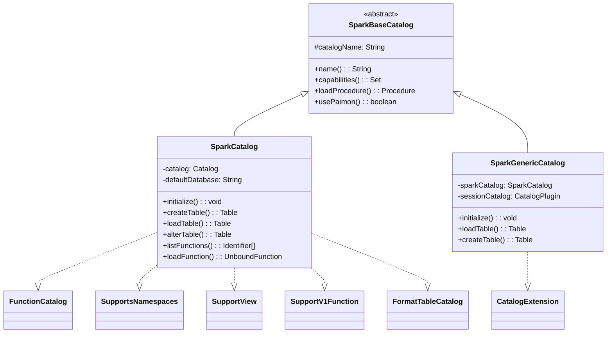
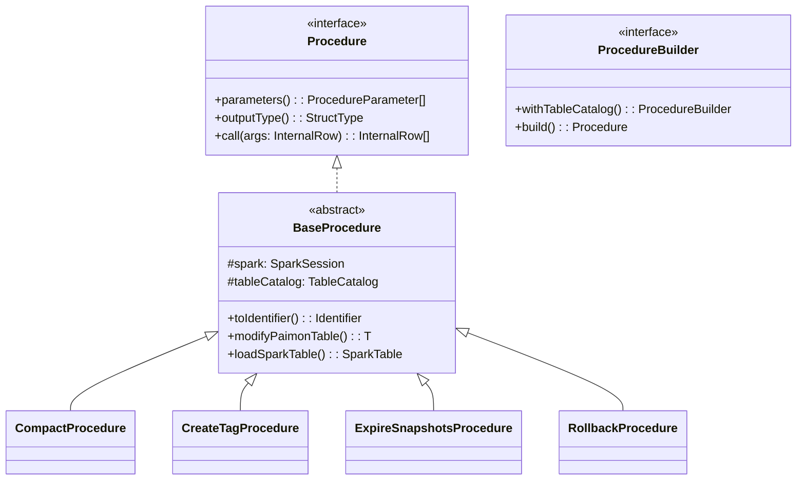

# Apache Paimon Spark 集成源码深度分析

> **版本**：1.5-SNAPSHOT　**源码模块**：`paimon-spark`（核心在 `paimon-spark-common`，版本适配在 `paimon-spark3-common`/`paimon-spark4-common` 与各版本模块）　**核对日期**：2026-06（基于 master `e76fc41b7`）

**一句话定位**：Paimon-Spark 集成把 Paimon 表"塞进"Spark 的 DataSource V2 + Catalyst 体系——用一套 Shim 抹平 Spark 3.2~4.1 的 API 断层，用 Catalog/Scan/Write 把 LSM 存储能力暴露成 Spark 表，用 SQL Extensions 注入 `CALL`/TAG/行级操作语法，用 37 个 Procedure 承载运维操作，用 Sort/Z-Order/Hilbert 把数据布局优化挂到 compaction 上。

读完本文你应能回答：① 为什么是"common + 3/4-common + 版本特定 + SPI Shim"四层而不是每版本一套，Shim 隔离了哪些 API；② `SparkCatalog` 与 `SparkGenericCatalog` 的"先 Paimon 后回退"委托模型差在哪、各自适用什么场景；③ V1Write（RunnableCommand 自管分桶）与 V2Write（`RequiresDistributionAndOrdering` 让 Spark shuffle）的边界条件与取舍；④ 谓词为什么要拆成 partitionFilter / dataFilter / postScan 三份，聚合下推如何做到"0 数据文件读取"；⑤ `PaimonSparkSessionExtensions` 在 Parser/Analyzer/PostHoc/Optimizer/Planner/AQE 六个扩展点各注入了什么，顺序为什么重要；⑥ `CompactProcedure` 如何按 BucketMode 分发、为什么在 Spark 端做分布式 compaction；⑦ 线性/Z-Order/Hilbert 三种排序在 Spark 侧的入口与适用维度；⑧ 哪些配置/用法会触发回退到 V1、产生小文件、或让 MOW 数据延迟可见。

> 阅读约定：本文每个机制按"① 要解决什么问题 → ② 设计原理与取舍 → ③ 关键源码（精选片段 + `路径:行号`）→ ④ 风险/陷阱/边界 → ⑤ 收益与代价"组织。源码行号以本次核对（master `e76fc41b7`）为准；与旧稿不符处用 `（已修正）` 标注。多维排序曲线（Z-Order/Hilbert）的**算法原理**由 `12` 号文档主讲，本篇只讲 Spark 侧入口与调用，重叠处交叉引用；文件索引（Bloom/Bitmap/BSI，下推过滤的物理依据）详见 `13`。

---

## 目录

- [1. 快速理解（核心问题 / 概念速查 / 高频陷阱）](#1-快速理解核心问题--概念速查--高频陷阱)
  - [1.1 核心问题：Paimon 要怎样"长进"Spark](#11-核心问题paimon-要怎样长进-spark)
  - [1.2 核心概念速查表](#12-核心概念速查表)
  - [1.3 高频生产陷阱](#13-高频生产陷阱)
- [2. 模块结构与 SparkShim 版本适配](#2-模块结构与-sparkshim-版本适配)
- [3. SparkCatalog 体系](#3-sparkcatalog-体系)
  - [3.1 类继承层次](#31-类继承层次)
  - [3.2 SparkBaseCatalog：Procedure 统一入口](#32-sparkbasecatalogprocedure-统一入口)
  - [3.3 SparkCatalog：独立 Paimon Catalog 与多态 loadTable](#33-sparkcatalog独立-paimon-catalog-与多态-loadtable)
  - [3.4 SparkGenericCatalog：CatalogExtension 委托模型](#34-sparkgenericcatalogcatalogextension-委托模型)
  - [3.5 FormatTable / View / Function 扩展](#35-formattable--view--function-扩展)
- [4. DataSource V2 读取与下推](#4-datasource-v2-读取与下推)
  - [4.1 读取链路与类继承](#41-读取链路与类继承)
  - [4.2 谓词下推：三份谓词的拆分](#42-谓词下推三份谓词的拆分)
  - [4.3 列裁剪](#43-列裁剪)
  - [4.4 聚合下推与 TopN 下推](#44-聚合下推与-topn-下推)
  - [4.5 BinPacking：小 Split 合并](#45-binpacking小-split-合并)
  - [4.6 桶分区报告与元数据列](#46-桶分区报告与元数据列)
- [5. DataSource V2 写入：V1Write vs V2Write](#5-datasource-v2-写入v1write-vs-v2write)
  - [5.1 两条写入路径与自动选择](#51-两条写入路径与自动选择)
  - [5.2 V2Write 与 RequiresDistributionAndOrdering](#52-v2write-与-requiresdistributionandordering)
  - [5.3 Copy-on-Write 行级操作](#53-copy-on-write-行级操作)
  - [5.4 Overwrite 四种模式](#54-overwrite-四种模式)
- [6. SQL Extensions：六个扩展点](#6-sql-extensions六个扩展点)
  - [6.1 PaimonSparkSessionExtensions 注册全景](#61-paimonsparksessionextensions-注册全景)
  - [6.2 Parser 扩展（ANTLR）](#62-parser-扩展antlr)
  - [6.3 关键 Analyzer / PostHoc 规则](#63-关键-analyzer--posthoc-规则)
  - [6.4 优化器与 Planner 规则](#64-优化器与-planner-规则)
- [7. Procedures：37 个运维操作](#7-procedures37-个运维操作)
  - [7.1 Procedure 体系与加载链路](#71-procedure-体系与加载链路)
  - [7.2 完整 Procedure 列表](#72-完整-procedure-列表)
  - [7.3 CompactProcedure：按 BucketMode 分发的分布式压缩](#73-compactprocedure按-bucketmode-分发的分布式压缩)
- [8. Sort / Z-Order / Hilbert 排序 Compact](#8-sort--z-order--hilbert-排序-compact)
  - [8.1 排序器体系](#81-排序器体系)
  - [8.2 三种排序的 Spark 侧实现](#82-三种排序的-spark-侧实现)
  - [8.3 排序如何挂到 compaction 上](#83-排序如何挂到-compaction-上)
- [9. 流式读写（Micro-Batch）](#9-流式读写micro-batch)
- [10. 与 Flink 集成的架构对比](#10-与-flink-集成的架构对比)
- [11. 测试框架（paimon-spark-ut）](#11-测试框架paimon-spark-ut)
- [12. 设计决策总结](#12-设计决策总结)

---

## 1. 快速理解（核心问题 / 概念速查 / 高频陷阱）

### 1.1 核心问题：Paimon 要怎样"长进"Spark

**① 要解决什么问题**

Spark 自己不认识 Paimon 表，也不支持 `CALL`、TAG、`MERGE INTO` 的 Paimon 语义。集成层要在**不改 Spark 源码**的前提下，把 Paimon 的 LSM 存储能力（带 bucket 分布、快照隔离、行级删除）映射成 Spark 能读能写的表，同时跨 Spark 3.2~4.1 多个不兼容大版本（4.0 起切到 Scala 2.13 + Java 17）只维护一套核心逻辑。

**② 设计原理与取舍**

Spark 提供了三套官方扩展点，Paimon 全部用上：

| Spark 扩展点 | Paimon 用它做什么 | 关键类 |
|---|---|---|
| **DataSource V2**（`TableCatalog`/`Scan`/`Write`） | 把 Paimon 表暴露成 Spark 表，读写都走 V2 接口 | `SparkCatalog`、`PaimonScan`、`PaimonV2Write` |
| **SessionExtensions**（Parser/Analyzer/Optimizer/Planner/AQE） | 注入 `CALL`/TAG 语法、行级操作重写、下推优化 | `PaimonSparkSessionExtensions` |
| **SPI（ServiceLoader）** | 运行时按 classpath 选择 Spark3Shim / Spark4Shim，编译期零反射 | `SparkShim`、`SparkShimLoader` |

一句话设计哲学：**核心逻辑写一次放在 `paimon-spark-common`，把所有"随 Spark 版本变"的 API 收进 `SparkShim` trait，用 SPI 在运行时选实现——版本差异隔离在垫片里，主代码里没有一句 `if (sparkVersion ...)`。**

代价是模块层级深（common → 3/4-common → 版本特定 → ut）、新人理解成本高；收益是修一个 bug 只改 common 一处、版本特定模块极薄。

**一次 SQL 的全生命周期（串起全文各章）**：以 `CALL sys.compact(...)` 和 `INSERT INTO pk_table SELECT ...` 为例——

```
读/写入口   SparkSource(shortName="paimon") / SparkCatalog.loadTable  →  SparkTable（§3）
SQL 扩展    PaimonSparkSessionExtensions 注入 Parser/Analyzer/Planner（§6）
            CALL 被解析成 PaimonCallStatement → PaimonCallCommand → PaimonCallExec（§6.4/§7.1）
读路径      ScanBuilder 下推谓词(三拆)/列裁剪/聚合/TopN（§4.2~4.4）→ PaimonScan
            BinPacking 合并小 Split（§4.5）→ PartitionReader 逐行出 InternalRow
写路径      useV2Write 判定（§5.1）→ V2 让 Spark 按 distribution shuffle（§5.2）
            或 V1 走 RunnableCommand 自管分桶；每 Task 出 CommitMessage
提交        Driver 端 BatchTableCommit.commit() 原子提交（§5.2，不用 Spark CommitCoordinator）
运维        compact 按 BucketMode 分发，parallelize 到集群分布式压缩（§7.3）
            带 order_strategy 时挂 Z-Order/Hilbert 排序重写文件（§8）
```

### 1.2 核心概念速查表

| 概念 | 一句话定义 | 关键源码 |
|------|-----------|---------|
| **SparkSource** | DataSource 注册入口，`shortName()="paimon"` | `SparkSource.scala:45`、`NAME` 在 `:131` |
| **SparkShim** | 收纳所有跨 Spark 版本不兼容 API 的 trait，SPI 选实现 | `org/apache/spark/sql/paimon/shims/SparkShim.scala:48` |
| **SparkShimLoader** | `ServiceLoader.load(SparkShim)` 单例加载，多于/少于 1 个都报错 | `SparkShimLoader.scala:28` |
| **SparkBaseCatalog** | 两个 Catalog 的公共基座，统一 `loadProcedure` | `SparkBaseCatalog.java:42` |
| **SparkCatalog** | 独立 Paimon Catalog，`loadSparkTable` 按表类型多态分发 | `SparkCatalog.java:759` |
| **SparkGenericCatalog** | `CatalogExtension`，替换 `spark_catalog`，先 Paimon 后回退 | `SparkGenericCatalog.java` |
| **PaimonScanBuilder** | 下推聚合/TopN，`build()` 产出 PaimonScan 或 PaimonLocalScan | `PaimonScanBuilder.scala:128` |
| **PaimonBaseScanBuilder** | 谓词三拆 + 列裁剪的公共逻辑 | `PaimonBaseScanBuilder.scala:65` |
| **PaimonSparkTableBase** | Spark 表基类，`useV2Write` 在此判定 | `PaimonSparkTableBase.scala:50` |
| **PaimonSparkSessionExtensions** | SQL 扩展注册中心，注入六类规则 | `extensions/PaimonSparkSessionExtensions.scala:34` |
| **SparkProcedures** | 37 个 Procedure 的注册表（ImmutableMap） | `SparkProcedures.java:85` |
| **TableSorter** | 排序器基类，`getSorter` 按 ORDER/ZORDER/HILBERT 分发 | `sort/TableSorter.java:65` |

> **路径修正（已修正）**：旧稿把 Shim 写成 `org.apache.paimon.spark.shims.SparkShim`，实际包名是 **`org.apache.spark.sql.paimon.shims`**；SPI 注册的实现类是 `org.apache.spark.sql.paimon.shims.Spark3Shim` / `Spark4Shim`。旧稿说 `SparkV2FilterConverter.scala` 在 `spark/spark/` 双层目录下，实际在 `org/apache/paimon/spark/SparkV2FilterConverter.scala`；`PaimonScanBuilder`/`PaimonBaseScanBuilder`/`PaimonScan` 在 `org/apache/paimon/spark/` 顶层而非 `read/` 子包（`BaseScan` 才在 `read/`）。

### 1.3 高频生产陷阱

**陷阱 1：`SparkCatalog` 与 `SparkGenericCatalog` 用途混淆。** 前者是独立 Catalog（用自定义名字，如 `paimon`），只管 Paimon 表；后者实现 `CatalogExtension` 用来**替换** `spark_catalog`，能同时访问 Paimon 表和 Hive 表（先查 Paimon 找不到再回退）。两者不要对同一个 catalog 名同时配置。`SparkGenericCatalog` 会强制关闭 `format-table.enabled` 以免与 Spark 原生格式表冲突（`SparkGenericCatalog.java` 的 `autoFillConfigurations`）。

**陷阱 2：以为配了 `spark.sql.extensions` 就万事大吉。** Extensions 只注入语法与规则；Procedure 的实际加载还要靠 Catalog（`SparkBaseCatalog.loadProcedure`，`:61`）。只配 extensions 不配 `SparkCatalog`/`SparkGenericCatalog`，`CALL` 能解析但找不到 Procedure。

**陷阱 3：误以为写入总走 V2。** `useV2Write` 需同时满足：`bucketFunctionType()==DEFAULT`、表是 `FileStoreTable`、BucketMode ∈ {HASH_FIXED（且 `BucketFunction.supportsTable`）, BUCKET_UNAWARE, POSTPONE_MODE（且未开 `postponeBatchWriteFixedBucket`）}、**且无聚类列**（`PaimonSparkTableBase.scala:55-69`）。任一不满足就静默回退 V1。多桶键、非 DEFAULT 桶函数、配了 clustering columns 都会回退——用户不易察觉。

**陷阱 4：动态分区覆盖配置不一致。** `INSERT OVERWRITE` 默认是静态覆盖（删全表/全分区）。要只覆盖涉及分区，需 `write.dynamic-partition-overwrite=true` 或 Spark 端 `spark.sql.sources.partitionOverwriteMode=dynamic`。V2 不支持动态覆盖时由 `PaimonDynamicPartitionOverwrite` 转回 V1 路径执行（§5.4）。

**陷阱 5：生产环境无脑 `CALL sys.compact(table=>'huge')`。** 不带 `partitions`/`where` 会扫全表所有 partition+bucket，可能跑数小时阻塞集群。务必按分区或时间增量压缩。`compact` 是分布式重操作（`parallelize` 到集群），`compact_manifest` 只合并 manifest、开销小，`rescale`（重分桶）会重写全部数据、开销极大。

**陷阱 6：对高基数 / 过多列做 Z-Order。** Z-Order/Hilbert 只在 2~4 列多维查询下有收益；列数过多时高维空间局部性退化、Z-value 计算昂贵，效果反而不如线性 ORDER。排序是**分区内**的，跨分区不保证顺序。排序原理见 `12`。

**陷阱 7：MOW（deletion-vectors）表"刚写的数据查不到"。** MOW 下 Level 0 文件要等 compaction 生成 deletion vector 后才对读可见（机制详见 `01` §7、`04`）。Spark 批写后若依赖独立异步 compaction，会出现可见延迟——这是存储层语义，不是 Spark 集成 bug。

**陷阱 8：流式读未配 checkpointLocation / 限速理解错。** 不配 checkpoint 重启会重读全部；`maxBytesPerTrigger`/`maxFilesPerTrigger`/`maxRowsPerTrigger` 是"满足任一即停"的关系，`minRowsPerTrigger` 必须与 `maxTriggerDelayMs` 成对出现，只配一个会直接报错（`PaimonMicroBatchStream.scala:86`）。

---

## 2. 模块结构与 SparkShim 版本适配

### ① 要解决什么问题

Spark 3.2/3.3/3.4/3.5/4.0/4.1 之间有大量不兼容：`InternalRow`/`ArrayData` 接口变化、`MergeIntoTable` 签名增减参数、Variant 是 4.0 新类型、4.1 把行级命令重写规则挪进了主 Resolution 批次。若每个版本一套完整代码，修一个 bug 要改 5+ 处。

### ② 设计原理与取舍

**四层 + SPI**：`paimon-spark-common`（核心，Java+Scala 混合，数百文件）→ `paimon-spark3-common` / `paimon-spark4-common`（两个分支的适配层）→ `paimon-spark-3.2…3.5 / 4.0 / 4.1`（版本特定，每个仅二三十文件）→ `paimon-spark-ut`（统一测试）。

把所有"随版本变"的方法收进 `SparkShim` trait（`SparkShim.scala:48` 起），由 `Spark3Shim`/`Spark4Shim` 实现，运行时用 SPI 选择：

```scala
// SparkShimLoader.scala:28-43（精选）
private lazy val sparkShim: SparkShim = loadSparkShim()
private def loadSparkShim(): SparkShim = {
  val shims = ServiceLoader.load(classOf[SparkShim]).asScala
  if (shims.isEmpty) throw new IllegalStateException("No available spark shim here.")
  else if (shims.size > 1) throw new IllegalStateException("Found more than one spark shim here.")
  // ...
}
```

每个版本的 shaded jar 里只有一个 SPI 文件（`META-INF/services/org.apache.spark.sql.paimon.shims.SparkShim`，内容是 `Spark3Shim` 或 `Spark4Shim`），所以"多于一个 shim"只会在错误地把两个版本 jar 混进 classpath 时发生——这条校验正是用来兜住"混用 jar"的事故。

**SparkShim 收纳的典型方法**（`SparkShim.scala`，核对）：`createSparkParser`(:50)、`createCustomResolution`(:52)、`createSparkInternalRow`(:54)、`createSparkArrayData`(:61)、`createMergeIntoTable`(:129)、`toPaimonVariant`(:200) 等。`classicApi`(:48) 抽象掉了 Spark 4 的 Classic/Connect API 分裂。

### ③ 一处值得看的真实复杂性：Spark 4.1 的反射加载

`PaimonSparkSessionExtensions.scala:82-131`（已修正：旧稿完全没提）用反射按需加载三条 Spark 4.1 专属规则（`Spark41UpdateTableRewrite`/`Spark41DeleteMetadataRestore`/`Spark41MergeIntoRewrite`）。原因是 4.1 把 `RewriteUpdateTable` 等挪进主 Resolution 批次并用 `resolveOperators` 短路 `analyzed=true` 节点，导致纯 append-only 表的 UPDATE/MERGE 子树被 Paimon 自己的规则提前标记为已分析、落到物理 planner 被拒。这三条规则的类体引用了 4.1-only 类型，因此不能被 `paimon-spark-common` 静态引用，只能 `SPARK_VERSION >= "4.1"` 门控 + 反射 + 捕获 `ClassNotFoundException`（spark3 构建下静默跳过）。这是"Shim 也兜不住、只能靠反射"的边界案例，值得作为版本适配复杂度的真实样本。

### ④ 风险 / 陷阱 / 边界

- Spark 4.x 必须 JDK ≥ 17、Scala 2.13；3.x 与 4.x 的 shaded jar 绝不能混用（会触发"多于一个 shim"）。
- 升级 Spark 大版本必须同步换 Paimon Spark 模块 jar，否则 SPI 找不到匹配 shim 直接启动失败。

### ⑤ 收益与代价

收益：核心逻辑单点维护、版本特定模块极薄、编译期类型安全无运行时反射开销（4.1 那三条规则是唯一例外）。代价：模块层级深、构建 profile（`spark3`/`spark4`/`scala-2.13`）多、调试要分清规则落在哪个模块。

---

## 3. SparkCatalog 体系

### ① 要解决什么问题

用户要在一个 Spark Session 里既访问 Paimon 表又访问已有 Hive 表，还要能 `CALL` Procedure、做 Time Travel、管理非 Paimon 格式表。纯独立 Catalog 无法访问 Hive 表，完全替换 SessionCatalog 又会丢 Spark 原生能力。

### ② 设计原理与取舍

两个 Catalog + 一个基座：

| 类 | Spark 接口 | 定位 | 适用 |
|---|---|---|---|
| `SparkBaseCatalog` | `TableCatalog`+`SupportsNamespaces`+`ProcedureCatalog`+`WithPaimonCatalog` | 公共基座，统一 Procedure 加载 | 抽象父类 |
| `SparkCatalog` | 上述 + `FunctionCatalog`/`SupportView`/`SupportV1Function`/`FormatTableCatalog` | 独立 Catalog，只管 Paimon | 纯 Paimon 场景 |
| `SparkGenericCatalog` | `CatalogExtension` | 替换 `spark_catalog`，委托回退 | Paimon+Hive 混合 |

一句话设计哲学：**用 `CatalogExtension` 的"先 Paimon、找不到再回退 SessionCatalog"实现渐进式迁移，不破坏既有 Hive 工作流。**

**两种部署配置（二选一，不要对同名 catalog 同时配）**：

```properties
# 方案 A：独立 Paimon Catalog（纯 Paimon 场景）
spark.sql.catalog.paimon=org.apache.paimon.spark.SparkCatalog
spark.sql.catalog.paimon.warehouse=/path/to/warehouse

# 方案 B：替换 spark_catalog（Paimon + Hive 混合场景）
spark.sql.catalog.spark_catalog=org.apache.paimon.spark.SparkGenericCatalog
spark.sql.catalog.spark_catalog.warehouse=/path/to/warehouse
```

无论哪种，要用 `CALL`/TAG/`MERGE INTO` 还得配 `spark.sql.extensions=org.apache.paimon.spark.extensions.PaimonSparkSessionExtensions`（§6）。

**Time Travel**：`VERSION AS OF`/`TIMESTAMP AS OF` 分别通过 `SCAN_VERSION`（`SparkCatalog.java:315`）和 `SCAN_TIMESTAMP_MILLIS`（`:337`）选项传给底层 `ReadBuilder`，写进临时 `extraOptions` 不污染原 Table 对象。注意 Spark 时间戳是微秒、Paimon 用毫秒，代码里做了换算。

### ④ 风险 / 陷阱 / 边界

- 两个 Catalog 互斥，混配会让"哪个表归谁"变得不可预测。
- `SupportV1Function`（V1 Function）只在 RESTCatalog 模式可用。
- `SparkGenericCatalog.autoFillConfigurations` 会自动补 `warehouse`（取 `spark.sql.warehouse.dir`）、探测 Hive 自动设 `metastore=hive`、探测阿里云 EMR 配 DLF，并**强制** `format-table.enabled=false`——这些隐式行为要在生产环境核对是否符合预期。
- 默认开启 `CachingCatalog`，多应用并发写同一表时缓存可能短暂不一致。

### ⑤ 收益与代价

收益：一套 Catalog 同时支撑独立/替换/混合三种使用模式，Procedure 统一加载，多种表类型透明。代价：配置组合多、隐式自动填充行为多，出错点集中在"配错 Catalog 类型/名字"。

### 3.1 类继承层次



### 3.2 SparkBaseCatalog：Procedure 统一入口

**源码**：`SparkBaseCatalog.java:42`（类声明）、`:61`（`loadProcedure`）

```java
// SparkBaseCatalog.java（精选）
public abstract class SparkBaseCatalog
        implements TableCatalog, SupportsNamespaces, ProcedureCatalog, WithPaimonCatalog {
    public Procedure loadProcedure(Identifier identifier) throws NoSuchProcedureException {
        if (isSystemNamespace(identifier.namespace())) {          // 仅 sys 命名空间
            ProcedureBuilder builder = SparkProcedures.newBuilder(identifier.name());
            if (builder != null) return builder.withTableCatalog(this).build();
        }
        throw new NoSuchProcedureException(identifier);
    }
}
```

`ProcedureCatalog` 是 Paimon 自定义接口（Spark 原生无 Procedure 概念，模式借鉴 Iceberg），放在基座保证 `SparkCatalog` 与 `SparkGenericCatalog` 共享同一套加载逻辑。`capabilities()`（`:56`）只声明 `SUPPORT_COLUMN_DEFAULT_VALUE`，让 Spark 支持列默认值。

### 3.3 SparkCatalog：独立 Paimon Catalog 与多态 loadTable

**源码**：`SparkCatalog.java`（`initialize`、`loadSparkTable` 在 `:759`）

`initialize()` 干五件事：校验必要配置 → `CatalogContext.create()`+`CatalogFactory.createCatalog()` 创建底层 Paimon `Catalog` → 读 `default-database`（默认 `"default"`）→ 判断是否启用 V1 Function（仅 RESTCatalog）→ 默认库不存在则建。

**核心是按表类型多态分发**（`loadSparkTable`，`:759-773`，已核对行号）：

```java
// SparkCatalog.java:766-774（精选）
if (table instanceof FormatTable)  return toSparkFormatTable(ident, (FormatTable) table);
else if (table instanceof IcebergTable) return new SparkIcebergTable(table);
else if (table instanceof LanceTable)   return new SparkLanceTable(table);
else if (table instanceof ObjectTable)  return new SparkObjectTable((ObjectTable) table);
else return new SparkTable(table);   // 标准 Paimon 表
```

为什么分发？不同表类型暴露的 capability 不同（如 `ObjectTable` 只支持 `BATCH_READ`，`SparkTable` 支持读/写/流），用不同的 Spark Table 包装类承载。

### 3.4 SparkGenericCatalog：CatalogExtension 委托模型

**源码**：`SparkGenericCatalog.java`

实现 `CatalogExtension` 替换内置 `spark_catalog`，内部组合一个 `SparkCatalog` 和一个委托 `sessionCatalog`，核心是"**先 Paimon、找不到再回退**"：

```java
// SparkGenericCatalog.java（精选）
public Table loadTable(Identifier ident) throws NoSuchTableException {
    try { return sparkCatalog.loadTable(ident); }                 // 先 Paimon
    catch (NoSuchTableException e) {
        return throwsOldIfExceptionHappens(                       // 回退 Session Catalog
            () -> asTableCatalog().loadTable(ident), e);
    }
}
```

`createTable` 按 `provider` 决定走向：`paimon` 或未指定走 Paimon，否则委托 SessionCatalog。`autoFillConfigurations()` 的隐式行为见 §3 的"风险/陷阱"。

### 3.5 FormatTable / View / Function 扩展

- **FormatTableCatalog**（`catalog/FormatTableCatalog.java`）：借 Paimon 的 `FormatTable` 抽象，在 Paimon Catalog 内管理 CSV/JSON/ORC/Parquet/Text 等原生格式表，加载时转成 Spark 原生 `FileTable`（`PartitionedCSVTable`/`PartitionedParquetTable` 等）复用 Spark 读写。好处：不切 Catalog 就能管多格式表。
- **SupportView**（`catalog/SupportView.java`）：经 `WithPaimonCatalog` 拿底层 Paimon Catalog 代理视图 CRUD；视图以 `spark` 方言保存 SQL 文本，支持多方言（Flink/Spark 各存各的）。
- **SupportV1Function**：仅 RESTCatalog 暴露 V1 Function。

---

## 4. DataSource V2 读取与下推

### ① 要解决什么问题

Spark 读 Paimon 表，要把 Paimon 存储侧的优化（分区裁剪、列裁剪、谓词下推、聚合下推、文件统计）暴露给 Catalyst，否则会"读所有文件所有列再在内存过滤聚合"。例：`SELECT COUNT(*) FROM t WHERE year=2024` 在有下推时只读 `year=2024` 分区、必要列，甚至直接从 manifest 统计返回 COUNT、0 数据文件读取。

### ② 设计原理与取舍

走 DataSource V2 的三层抽象：**Scan**（描述怎么扫——列/谓词/统计）→ **Batch**（描述扫什么——InputPartition 列表）→ **PartitionReader**（怎么逐行读出 InternalRow）。逻辑优化（裁剪/下推）落在 Scan 层，物理优化（BinPacking/桶分区）落在 Batch 层；`InputPartition` 只带 Split 的序列化信息，真正读取在 Task 端延迟执行。

一句话设计哲学：**能在存储层用 manifest 统计跳过的就别读进来，跳不干净的（数据谓词）就用 `postScan` 让 Spark 二次过滤兜底——既省 I/O 又保正确。**

下推按"渐进"顺序尝试：先聚合下推（成则 0 数据文件）→ 再 TopN 下推 → 都不行回退正常扫描。文件级跳过依赖 manifest 的 min/max/nullCount 与文件索引（Bloom/Bitmap/BSI，详见 `13`）。

### 4.1 读取链路与类继承

调用链：`SparkTable.newScanBuilder()` → `PaimonScanBuilder` 接受 `pruneColumns`/`pushPredicates`/`pushLimit`/`pushTopN`/`pushAggregation` → `build()` 出 `PaimonScan`（或聚合下推时的 `PaimonLocalScan`）→ `toBatch()` 出 `PaimonBatch` → `planInputPartitions()` 出 `Array[InputPartition]` → `PaimonPartitionReaderFactory` → `PaimonPartitionReader` 逐行出 `InternalRow`。

类继承（已核对包路径——这些类在 `org/apache/paimon/spark/` 顶层，`BaseScan` 在 `read/`）：

```
BaseScan (trait, read/BaseScan.scala)        列裁剪/谓词/统计/指标
  └─ PaimonBaseScan (abstract)               GlobalIndex/向量搜索/全文搜索/MicroBatch 特化
       └─ PaimonScan (case class, PaimonScan.scala)   桶分区报告/排序报告

PaimonBaseScanBuilder (abstract, :65 pushPredicates)  谓词三拆/列裁剪
  └─ PaimonScanBuilder (:43 pushTopN, :98 pushAggregation, :128 build)
```

### 4.2 谓词下推：三份谓词的拆分

**源码**：`PaimonBaseScanBuilder.scala:65`（`pushPredicates`）

核心是把传入的 Spark V2 `Predicate` 拆成**三份**而非两份：

```scala
// PaimonBaseScanBuilder.scala（流程精选）
val converter = SparkV2FilterConverter(newRowType)                 // :78
val partitionPredicateVisitor = new PartitionPredicateVisitor(partitionKeys)  // :79
// 1) 能转成 Paimon Predicate 且只涉及分区列 → pushedPartitionFilters（manifest 级裁剪，精确）
// 2) 能转成 Paimon Predicate 但涉及数据列  → pushedDataFilters（文件级跳过，不保证精确）
//                                          且同一谓词仍放进 postScan
// 3) 转不了的（UDF/子查询/复杂表达式）     → 直接进 postScan
```

| 谓词类别 | 去向 | 作用层 | 是否精确 |
|---|---|---|---|
| 分区谓词 | `pushedPartitionFilters`（`:106`） | manifest | 精确，无需 postScan |
| 数据谓词 | `pushedDataFilters`（`:109`）+ postScan | 文件 min/max/索引 | 不精确，需二次过滤 |
| 不可转换 | postScan（`:111`） | Spark 引擎 | —— |

为什么数据谓词要"既下推又保留"？文件级统计只能保证"这个文件**可能**有匹配行"，不能保证文件里每行都匹配，所以必须让 Spark 用 `postScan` 再过一遍。`SparkV2FilterConverter`（`org/apache/paimon/spark/SparkV2FilterConverter.scala`，已修正路径）支持 `=`/`<=>`/比较/`IN`/`IS [NOT] NULL`/`AND/OR/NOT`/`STARTS_WITH`/`ENDS_WITH`/`CONTAINS` 等到 Paimon `Predicate` 的映射。

### 4.3 列裁剪

`pruneColumns(requiredSchema)` 只记录所需 schema（`:61`）；真正生效在 `BaseScan` 构造 readBuilder 时把 Spark `requiredSchema` 经 `SparkTypeUtils.prunePaimonRowType()` 映射成精简的 Paimon `RowType`，`newReadBuilder().withReadType(...)` 只读需要的列。列裁剪比例还会反馈给 BinPacking 的文件大小估算（§4.5 的 `readRowSizeRatio`）。

### 4.4 聚合下推与 TopN 下推

**源码**：`PaimonScanBuilder.scala:98`（`pushAggregation`）、`:43`（`pushTopN`）

聚合下推条件（`:103-121`）：① 表是 `FileStoreTable` ② 无 post-scan 谓词 ③ `AggregatePushDownUtils.tryPushdownAggregation()` 成功。命中则返回 `PaimonLocalScan(agg.result(), ...)`——不读任何数据文件，直接从 manifest 统计算出聚合结果（如 `COUNT(*)`）。这是 Paimon 比 Delta 更激进的一点。

TopN 下推（`:43`）：仅 `FileStoreTable`（`:48`）支持，记录 `pushedTopN` 后返回 `false` 表示 best-effort——存储层据排序+limit 缩小扫描范围，Spark 仍做最终排序兜底。注意 `pushLimit` 也复用 `pushAggregation` 的完全下推逻辑（`:93-94`）。

### 4.5 BinPacking：小 Split 合并

**源码**：`read/BinPackingSplits.scala:38`（case class）、`:78`（`pack`）、`:100`（`packDataSplit`）

问题：Paimon 的 Split 粒度是单个数据文件，可能只有几 MB，一个 Split 一个 Task 会产生海量小任务。

```scala
// BinPackingSplits.scala（流程精选）
case class BinPackingSplits(coreOptions: CoreOptions, readRowSizeRatio: Double = 1.0)  // :38
def pack(splits: Array[Split]) =
  splits.partition { case s: DataSplit => s.rawConvertible() ... }  // :81 区分可重排/不可重排
// packDataSplit:
//   maxSplitBytes = min(FILES_MAX_PARTITION_BYTES, 每核平均字节)   // :101, :50
//   按 partition+bucket 分组，累积 size 超 maxSplitBytes 就开新 partition  // :144
//   size = fileSize * readRowSizeRatio + openCostInBytes          // :142（列裁剪感知）
```

`readRowSizeRatio` 按"实际读列数/总列数"修正文件大小估算，使列裁剪后的打包更准。只有 `rawConvertible` 的 `DataSplit`（可直接读原始文件、无需 merge）才参与重排打包。

### 4.6 桶分区报告与元数据列

**桶分区报告**（`PaimonScan.scala`）：当表为 `HASH_FIXED` 且单桶键时，`PaimonScan` 报告 `KeyGroupedPartitioning`（让 Spark 知道数据已按桶分区，可做 Bucket Join 免 shuffle），并在每个 InputPartition 仅含一个按主键排序的 Split 时报告 `outputOrdering()`，Split 按桶号分组进 `PaimonBucketedInputPartition`。`DisableUnnecessaryPaimonBucketedScan`（§6.4）在 AQE 阶段自动关掉不必要的桶扫描（查询不涉及桶键时桶扫描反而拖慢）。

**元数据列**（`PaimonSparkTableBase.metadataColumns`，`:111-129`，已核对）：

| 元数据列 | 条件 | 源码 |
|---|---|---|
| `_row_id` / `_sequence_number` | `rowTrackingEnabled()` | `:116-118` |
| `_file_path` / `_row_index` / `_partition` / `_bucket` | 始终可用 | `:121-128` |

---

## 5. DataSource V2 写入：V1Write vs V2Write

### ① 要解决什么问题

Spark 写 Paimon 表要满足两点：① 数据按 (partition, bucket) 正确分布——主键表相同主键必须落同一桶才能 upsert；② 多 Task 并发写要原子提交，不能部分成功。同时 Spark 是批引擎，写完就结束，不像 Flink 能在 writer 里持续后台 compaction。

### ② 设计原理与取舍

Paimon 提供**两条写入路径**，按表特征自动选：

| | V1Write | V2Write |
|---|---|---|
| 入口 | `WriteIntoPaimonTable`（`RunnableCommand`） | `PaimonV2Write`（`Write` + `RequiresDistributionAndOrdering`） |
| 分桶谁做 | Paimon 在 Driver 端自管（`PaimonSparkWriter`） | 声明 distribution，Spark 负责 shuffle |
| AQE | 不利用 | 利用 Spark AQE 优化 shuffle |
| 兼容性 | 全桶模式、多桶键、非 DEFAULT 桶函数、聚类列都支持 | 条件受限（见下） |
| 行级操作 | 经 PostHoc 重写走 V1 命令 | 支持 Copy-on-Write（`SupportsRowLevelOperations`） |

V2 启用条件（`PaimonSparkTableBase.scala:55-69`，已核对）：`bucketFunctionType()==DEFAULT` 且表是 `FileStoreTable` 且 BucketMode ∈ {`HASH_FIXED`（须 `BucketFunction.supportsTable`）, `BUCKET_UNAWARE`, `POSTPONE_MODE`（须未开 `postponeBatchWriteFixedBucket`）} 且**无聚类列**。任一不满足静默回退 V1。

```scala
// PaimonSparkTableBase.scala:50-69（精选）
lazy val useV2Write: Boolean = OptionUtils.useV2Write() && supportsV2Write
private def supportsV2Write: Boolean =
  coreOptions.bucketFunctionType() == BucketFunctionType.DEFAULT && {
    table match {
      case storeTable: FileStoreTable => storeTable.bucketMode() match {
        case HASH_FIXED => BucketFunction.supportsTable(storeTable)
        case BUCKET_UNAWARE => true
        case POSTPONE_MODE if !coreOptions.postponeBatchWriteFixedBucket() => true
        case _ => false }
      case _ => false }
  } && coreOptions.clusteringColumns().isEmpty
```

一句话设计哲学：**V1 是"Paimon 自管一切"的万能兜底，V2 是"把分布交给 Spark、换 AQE 优化和行级操作"的快路；用 `useV2Write` 自动选，用户无感知。原子性两条路都靠 Paimon 自己的 snapshot 提交，不依赖 Spark CommitCoordinator。**

### 5.1 两条写入路径与自动选择

`PaimonSparkTableBase.newWriteBuilder()`（`:143-150`，已核对）按 `useV2Write` 分发到 `PaimonV2WriteBuilder` 或 `PaimonWriteBuilder`：

```
newWriteBuilder()
  ├─ useV2Write=true  → PaimonV2WriteBuilder → PaimonV2Write → PaimonBatchWrite → PaimonV2DataWriter
  └─ useV2Write=false → PaimonWriteBuilder   → PaimonWrite(V1Write) → WriteIntoPaimonTable(RunnableCommand)
```

V1 路径（`write/PaimonWrite.scala`、`commands/WriteIntoPaimonTable.scala`）：`PaimonWrite extends V1Write`，`toInsertableRelation` 返回一个把数据交给 `WriteIntoPaimonTable.run()` 的闭包；后者在 Driver 端用 `PaimonSparkWriter` 自管分桶，每分区用 `BatchTableWrite` 写。保留它是因为多桶键 / 非 DEFAULT 桶函数 / 聚类列这些 V2 不支持的场景必须有兜底。

### 5.2 V2Write 与 RequiresDistributionAndOrdering

**源码**：`write/PaimonV2Write.scala`、`write/PaimonWriteRequirement.scala`、`write/PaimonBatchWrite.scala`、`write/PaimonV2DataWriter.scala`

V2 的关键是声明分布要求，让 Spark 在写前自动插 shuffle（`RepartitionByExpression`），把同一 (partition, bucket) 的数据汇到同一 Writer Task：

```scala
// PaimonV2Write（精选）
class PaimonV2Write extends Write with RequiresDistributionAndOrdering {
  override def requiredDistribution(): Distribution = writeRequirement.distribution
  override def requiredOrdering(): Array[SortOrder]  = writeRequirement.ordering
}
// PaimonWriteRequirement：HASH_FIXED 按 partition + bucket(桶键) 聚簇；
//                         BUCKET_UNAWARE/POSTPONE 仅按 partition 聚簇
```

数据流：`toBatch()` → `PaimonBatchWrite` → 每 Task 起 `PaimonV2DataWriter`（`writeBuilder.newWrite()`，逐行 `writeAndReturn`）→ `commit()` 出 `WriteTaskResult(commitMessages)` → Driver 端 `batchTableCommit.commit(messages)` 原子提交。

三个关键细节：① `SparkInternalRowWrapper` 把 Spark `InternalRow` 包成 Paimon 行、避免拷贝；② `useCommitCoordinator()` 返回 `false`——Paimon snapshot 提交本身幂等，Task 重试产生的重复 CommitMessage 不会破坏一致性，无需 Spark 协调器；③ `abort()` 目前只关资源（清理未提交文件是 TODO）。

### 5.3 Copy-on-Write 行级操作

DELETE/UPDATE/MERGE INTO 在 V2 下走 Copy-on-Write：`SparkTable` 混入 `SupportsRowLevelOperations`，`newRowLevelOperationBuilder` 在 `FileStoreTable && useV2Write` 时返回 `PaimonSparkCopyOnWriteOperation`。它通过 `PaimonCopyOnWriteScan` 读受影响文件 → 内存过滤/更新 → 写新文件 → commit 时同时提交新增与删除文件的 CommitMessage。不满足 V2 时，行级命令由 PostHoc 规则（§6.3）重写成 Paimon 的 V1 命令执行。

### 5.4 Overwrite 四种模式

| 模式 | 行为 | 实现 |
|---|---|---|
| InsertInto | 追加 | 不调用 `withOverwrite` |
| Overwrite(filter) | 按条件覆盖 | filter 转分区映射传 `BatchWriteBuilder.withOverwrite()` |
| DynamicOverWrite | 动态分区覆盖 | 设 `CoreOptions.DYNAMIC_PARTITION_OVERWRITE=true` |
| Truncate | 全表覆盖 | `overwritePartitions=Map.empty` |

V2 不支持动态覆盖（表无 `OVERWRITE_DYNAMIC` capability）时，`PaimonAnalysis` 里的 `PaimonDynamicPartitionOverwrite` 匹配器把 `OverwritePartitionsDynamic` 转成 `PaimonDynamicPartitionOverwriteCommand`（走 V1 路径）。注意 `INSERT OVERWRITE` 默认静态覆盖（删全表/全分区），要动态覆盖须配 `write.dynamic-partition-overwrite=true` 或 Spark `partitionOverwriteMode=dynamic`。

### ④ 风险 / 陷阱 / 边界

- V2 静默回退 V1：多桶键、非 DEFAULT 桶函数、聚类列、`POSTPONE_MODE` 开了 `postponeBatchWriteFixedBucket`——用户难察觉，性能/行为可能与预期不符。
- 桶数 / 分区数过多 → 小文件爆炸（小文件治理见 `11`）。
- 静态覆盖误删：以为只覆盖一个分区，实际删了全表（默认静态）。

### ⑤ 收益与代价

收益：两路互补（V1 全兼容、V2 快且支持行级操作），原子提交不依赖 Spark 协调器、Task 重试幂等安全。代价：两套代码路径维护成本高，回退逻辑隐蔽。

---

## 6. SQL Extensions：六个扩展点

### ① 要解决什么问题

Spark 原生 SQL 不认识 `CALL sys.xxx(...)`、`CREATE TAG`、Paimon 的 upsert 语义、`bucket()` 等函数。要在不改 Spark 源码的前提下补上这些能力，只能用 Spark 官方的 `SessionExtensions` 注入扩展。

### ② 设计原理与取舍

Spark 把扩展拆成六个注入点，Paimon 全用上，**顺序即语义**——解析 → 分析 → 后置分析 → 优化 → 物理计划 → AQE：

| 扩展点 | 注入方法 | Paimon 注入内容 |
|---|---|---|
| Parser | `injectParser` | `SparkShim.createSparkParser`（ANTLR 扩展语法）|
| Resolution | `injectResolutionRule` | `PaimonAnalysis`/`PaimonProcedureResolver`/`PaimonViewResolver`/`PaimonFunctionResolver`/`createCustomResolution`/`PaimonIncompatibleResolutionRules`/`RewriteUpsertTable`（+ Spark4.1 反射规则）|
| PostHoc | `injectPostHocResolutionRule` | `ReplacePaimonFunctions`/`PaimonPostHocResolutionRules`/`PaimonUpdateTable`/`PaimonDeleteTable`/`PaimonMergeInto` |
| 函数 | `injectTableFunction`/`injectFunction` | `PaimonTableValuedFunctions`、`BucketExpression` |
| Optimizer | `injectOptimizerRule` | `ReplacePaimonFunctions`、`OptimizeMetadataOnlyDeleteFromPaimonTable`、`MergePaimonScalarSubqueries` |
| Planner | `injectPlannerStrategy` | `PaimonStrategy`、`OldCompatibleStrategy` |
| AQE | `injectQueryStagePrepRule` | `DisableUnnecessaryPaimonBucketedScan` |

一句话设计哲学：**先解析语法、再解析语义、行级命令延到 PostHoc 重写成 Paimon 命令、下推优化进 Optimizer、Procedure 进 Planner——每个关注点落到 Spark 提供的恰当阶段，主代码零侵入。**

`CALL` 的四步链路：Parser 出 `PaimonCallStatement` → `PaimonProcedureResolver` 出 `PaimonCallCommand` → `PaimonStrategy` 出 `PaimonCallExec` → `procedure.call(args)` 返回 `InternalRow[]`。

### 6.1 PaimonSparkSessionExtensions 注册全景

**源码**：`extensions/PaimonSparkSessionExtensions.scala:34`（已核对，包名 `org.apache.paimon.spark.extensions`）

```scala
// PaimonSparkSessionExtensions.scala:36-112（精选，已按真实代码核对）
extensions.injectParser((_, parser) => SparkShimLoader.shim.createSparkParser(parser))   // :38
extensions.injectResolutionRule(new PaimonAnalysis(_))                                    // :41
extensions.injectResolutionRule(PaimonProcedureResolver(_))                               // :42
extensions.injectResolutionRule(PaimonViewResolver(_))                                    // :43
extensions.injectResolutionRule(PaimonFunctionResolver(_))                                // :44
extensions.injectResolutionRule(SparkShimLoader.shim.createCustomResolution(_))           // :45（版本特定规则）
extensions.injectResolutionRule(PaimonIncompatibleResolutionRules(_))                     // :46
extensions.injectResolutionRule(RewriteUpsertTable(_))                                    // :47
extensions.injectPostHocResolutionRule(ReplacePaimonFunctions(_))                         // :49
extensions.injectPostHocResolutionRule(PaimonPostHocResolutionRules(_))                   // :50
extensions.injectPostHocResolutionRule(_ => PaimonUpdateTable)                            // :52
extensions.injectPostHocResolutionRule(_ => PaimonDeleteTable)                            // :53
extensions.injectPostHocResolutionRule(PaimonMergeInto(_))                               // :54
// Spark 4.1 反射加载三条规则（:82-87，§2③）
PaimonTableValuedFunctions / BucketExpression 函数注入                                     // :90-99
extensions.injectOptimizerRule(ReplacePaimonFunctions(_))                                 // :102
extensions.injectOptimizerRule(_ => OptimizeMetadataOnlyDeleteFromPaimonTable)            // :103
extensions.injectOptimizerRule(_ => MergePaimonScalarSubqueries)                          // :104
extensions.injectPlannerStrategy(PaimonStrategy(_))                                       // :107
extensions.injectPlannerStrategy(OldCompatibleStrategy(_))                                // :109
extensions.injectQueryStagePrepRule(_ => DisableUnnecessaryPaimonBucketedScan)            // :112
```

> **已修正**：旧稿遗漏了 `createCustomResolution`（:45，由 Shim 提供版本特定 Resolution 规则）、`PaimonIncompatibleResolutionRules`、`PaimonPostHocResolutionRules`、以及 Optimizer 阶段也注入了 `ReplacePaimonFunctions`（:102），并把 Spark 4.1 那三条反射规则（§2③）完全漏掉了。

### 6.2 Parser 扩展（ANTLR）

Paimon 用 ANTLR4（`PaimonSqlExtensions.g4` → `PaimonSqlExtensionsParser`）定义扩展语法，`PaimonSqlExtensionsAstBuilder` 把解析树转逻辑计划。覆盖：

| SQL | 逻辑计划 |
|---|---|
| `CALL sys.xxx(...)` | `PaimonCallStatement` |
| `CREATE/DELETE/RENAME/SHOW TAG[S]` | `CreateOrReplaceTagCommand`/`DeleteTagCommand`/`RenameTagCommand`/`ShowTagsCommand` |
| `CREATE/ALTER/DROP VIEW` | `PaimonViewCommand` 系列 |
| `CREATE/ALTER/DROP FUNCTION` | 函数相关命令 |

Parser 由 `SparkShim.createSparkParser` 提供（3/4 的 ParserInterface 签名不同，所以收进 Shim）。

### 6.3 关键 Analyzer / PostHoc 规则

- **PaimonAnalysis**（Resolution）：写入时的列解析与类型对齐——校验列数/类型，支持 byName/byPosition、嵌套 struct 递归转换；`mergeSchemaEnabled` 时跳过校验留待写入合并。也承载 `PaimonDynamicPartitionOverwrite` 匹配（§5.4）。
- **RewriteUpsertTable**（Resolution）：目标表有主键时把 `INSERT INTO` 语义改成 upsert。
- **PaimonUpdateTable / PaimonDeleteTable / PaimonMergeInto**（PostHoc）：把 Spark 标准 `UpdateTable`/`DeleteFromTable`/`MergeIntoTable` 转成 Paimon 命令（`UpdatePaimonTableCommand`/`DeleteFromPaimonTableCommand`/`MergeIntoPaimonTable`）。放 PostHoc 是因为要在 Spark 完成标准分析后再接管。
- **ReplacePaimonFunctions**：把 Paimon 特有函数表达式替换为可执行实现，Resolution 后置 + Optimizer 两处都注入。

> **顺序要点**：行级命令重写放在 PostHoc 而非 Resolution；Spark 4.1 因把重写挪进主 Resolution 批次导致 append-only 表的 UPDATE/MERGE 被提前判定 analyzed、落到物理 planner 被拒，所以才需要 §2③ 的三条反射补丁规则。

### 6.4 优化器与 Planner 规则

- **OptimizeMetadataOnlyDeleteFromPaimonTable**（Optimizer）：DELETE 条件只涉及分区列且能完全确定分区时，直接经 manifest 元数据删分区，不扫数据文件；条件不满足回退全表扫描。
- **MergePaimonScalarSubqueries**（Optimizer）：合并对**同一** Paimon 表的多个标量子查询减少重复扫描；不同表不合并。3.4/3.5 各有覆盖版本。
- **PaimonStrategy**（Planner）：把 Paimon 逻辑节点（`PaimonCallCommand`/`CreateOrReplaceTagCommand`/`PaimonDropPartitions` 等）转物理执行计划（`PaimonCallExec` 等）。
- **DisableUnnecessaryPaimonBucketedScan**（AQE）：仅启用 AQE 时生效，自动关掉查询不涉及桶键时无谓的桶扫描（§4.6）。

### ④ 风险 / 陷阱 / 边界

只配 `spark.sql.extensions` 不配 Catalog → `CALL` 能解析但加载不到 Procedure（§3.2）。AQE 规则只在开 AQE 时生效。`OptimizeMetadataOnlyDeleteFromPaimonTable` 只在条件精确匹配分区时省扫描。

### ⑤ 收益与代价

收益：零侵入扩展出 Paimon 全套 SQL 能力；各关注点落在恰当阶段、可独立测试。代价：扩展点多、规则顺序敏感、跨版本（尤其 4.1）的规则交互极易踩坑，调试要先定位规则落在哪个阶段/模块。

---

## 7. Procedures：37 个运维操作

### ① 要解决什么问题

Paimon 表的运维（compaction、快照/标签/分区过期、孤立文件清理、迁移、回滚、重分桶）不是标准查询，而是管理操作。没有 Procedure，用户得写 Spark 程序手工调 `BatchTableWrite`/`BatchTableCommit`，繁琐易错。Procedure 让它们变成一条 `CALL`，且能借 Spark 集群分布式执行重活。

### ② 设计原理与取舍

Procedure 模式借鉴 Iceberg：`Procedure` 接口（`parameters()`/`outputType()`/`call(args): InternalRow[]`）→ `BaseProcedure` 抽象基类（持 `SparkSession`/`TableCatalog`，提供 `modifyPaimonTable`/`loadSparkTable` 等）→ 各具体 Procedure。注册在 `SparkProcedures` 的 `ImmutableMap`，由 `SparkBaseCatalog.loadProcedure`（§3.2）按 `sys` 命名空间加载。

调用支持位置参数和命名参数（推荐命名）：`CALL sys.compact(table=>'db.t', partitions=>'p1=0', compact_strategy=>'full')`。重活（compact/rescale/migrate）内部用 `javaSparkContext.parallelize()` 分发到集群，CommitMessage 收回 Driver 后 `BatchTableCommit.commit()` 原子提交。

一句话设计哲学：**把运维操作 SQL 化 + 分布式化——一条 `CALL` 触发，集群并行执行，Paimon snapshot 原子收尾。**

### 7.1 Procedure 体系与加载链路



### 7.2 完整 Procedure 列表

**源码**：`SparkProcedures.java:85-126`（`ImmutableMap` 注册），共 **37 个**（已核对 `grep -c procedureBuilders.put` = 37）：

| 分类 | Procedure 名称 | 功能 |
|------|---------------|------|
| **标签管理** | `create_tag` | 创建标签 |
| | `replace_tag` | 替换标签 |
| | `rename_tag` | 重命名标签 |
| | `create_tag_from_timestamp` | 从时间戳创建标签 |
| | `delete_tag` | 删除标签 |
| | `expire_tags` | 过期标签 |
| | `trigger_tag_automatic_creation` | 触发自动标签创建 |
| **分支管理** | `create_branch` | 创建分支 |
| | `delete_branch` | 删除分支 |
| | `rename_branch` | 重命名分支 |
| | `fast_forward` | 分支快进合并 |
| **全局索引** | `create_global_index` | 创建全局索引 |
| | `drop_global_index` | 删除全局索引 |
| **Compaction** | `compact` | 表级压缩 |
| | `compact_database` | 数据库级压缩 |
| | `compact_manifest` | Manifest 文件压缩 |
| | `rescale` | 重新分桶 |
| **分区管理** | `expire_partitions` | 过期分区 |
| | `mark_partition_done` | 标记分区完成 |
| **数据清理** | `purge_files` | 清除所有文件 |
| | `remove_orphan_files` | 清除孤立文件 |
| | `remove_unexisting_files` | 清除不存在的文件引用 |
| **迁移** | `migrate_database` | 数据库迁移（如 Hive 到 Paimon） |
| | `migrate_table` | 表级迁移 |
| **函数管理** | `create_function` | 创建函数 |
| | `alter_function` | 修改函数 |
| | `drop_function` | 删除函数 |
| **其他** | `repair` | 修复表元数据 |
| | `reset_consumer` | 重置消费者 |
| | `clear_consumers` | 清除所有消费者 |
| | `alter_view_dialect` | 修改视图方言 |
| | `rewrite_file_index` | 重写文件索引 |
| | `copy` | 文件拷贝 |
| | `rollback` | 回滚到指定快照 |
| | `rollback_to_timestamp` | 回滚到指定时间戳的快照 |
| | `rollback_to_watermark` | 回滚到指定水位线 |
| | `expire_snapshots` | 过期旧快照 |

### 7.3 CompactProcedure：按 BucketMode 分发的分布式压缩

**源码**：`procedure/CompactProcedure.java`（调用语法注释在 `:109`，分发逻辑在 `:248-296`，已核对）

```sql
CALL sys.compact(
    table => 'db.table', partitions => 'p1=0,p2=0;p1=0,p2=1',
    compact_strategy => 'full|minor', order_strategy => 'order|zorder|hilbert',
    order_by => 'col1,col2', where => 'p1 > 0',
    options => 'k1=v1,k2=v2', partition_idle_time => '1d')
```

按 `OrderType`（无序 NONE / 有序）和 BucketMode 双重分发（`:248-296`，已核对方法名）：

| BucketMode | 无排序策略（NONE） | 有排序策略（ZORDER/HILBERT/ORDER） |
|---|---|---|
| `HASH_FIXED` / `HASH_DYNAMIC` | `compactAwareBucketTable()`（`:262/:306`） | 不支持（排序 compact 仅限 unaware） |
| `BUCKET_UNAWARE` | `compactUnAwareBucketTable()`（`:277/:386`）或 `clusterIncrementalUnAwareBucketTable()`（`:274/:646`） | `sortCompactUnAwareBucketTable()`（`:293/:610`） |
| `POSTPONE_MODE` | `SparkPostponeCompactProcedure`（`:281`） | 不支持 |

`order_strategy="none"` 配 `order_by` 列会直接报错（`:167`）。

`compactAwareBucketTable` 的分布式执行（`:306-339`）：① `SnapshotReader` 取所有 (partition, bucket) 对 → ② 序列化为 `List<Pair<byte[], Integer>>` → ③ `javaSparkContext.parallelize(partitionBuckets, readParallelism)`（`:339`）分发 → ④ 每 Task 起 `BatchTableWrite` 执行 `write.compact(partition, bucket, fullCompact)` → ⑤ CommitMessage 收回 Driver → ⑥ `BatchTableCommit.commit()` 原子提交。

为什么在 Spark 端 compact？借集群算力做分布式压缩，远快于单机；且与表写入共用同一套原子提交。

### ④ 风险 / 陷阱 / 边界

- 不带 `partitions`/`where` 的全表 compact 会扫全部 partition+bucket，可能数小时阻塞集群。
- `expire_snapshots` 物理删文件、不可逆；`remove_orphan_files` 低峰期执行以免误删在写文件；`rescale` 重写全部数据、开销极大。
- 排序 compact（§8）仅 `BUCKET_UNAWARE` 支持。
- 并行度受 `spark.default.parallelism` 等影响，配错会资源浪费或 OOM。

### ⑤ 收益与代价

收益：运维 SQL 化、分布式化、原子提交；新增 Procedure 只需实现 `BaseProcedure` 并在 `SparkProcedures` 注册。代价：重操作消耗大量集群资源，需调度在低峰、按分区增量执行。

---

---

## 8. Sort / Z-Order / Hilbert 排序 Compact

### ① 要解决什么问题

文件内的物理行序决定查询能跳过多少文件——靠 manifest 的 min/max（依赖文件索引，见 `13`）。数据随机分布时几乎跳不掉；按查询列排好序，min/max 区间收窄、大量文件被跳过。但线性排序只优化第一列，多维查询（如 `user_id=? AND event_time IN [...]`）其余列仍随机。空间填充曲线（Z-Order/Hilbert）让多列同时保持局部性。

> 多维曲线的**算法原理**（位交错、Hilbert 递归映射、为什么保局部性）由 `12` 号文档主讲，本节只讲 **Spark 侧的排序器实现与调用入口**。

### ② 设计原理与取舍

三种策略，按查询维度选：

| 策略 | Spark 侧实现 | 适用 | 代价 |
|---|---|---|---|
| ORDER（线性） | `OrderSorter` | 单列/前缀查询为主 | 最低 |
| ZORDER | `ZorderSorter` + `SparkZOrderUDF` | 2~3 列多维查询 | 中（位交错 UDF） |
| HILBERT | `HilbertSorter` + `SparkHilbertUDF` | 3~4 列多维查询，局部性要求更高 | 高（曲线计算更贵） |

一句话设计哲学：**排序开销大，所以挂到 compaction（而非写入）上做——一次重写既合并小文件又重排物理布局，用 `repartitionByRange + sortWithinPartitions` 把全局有序拆成可并行的分区内有序。**

### 8.1 排序器体系

**源码**：`sort/TableSorter.java:30`（抽象基类）、`:65`（`getSorter` 分发）

```java
// TableSorter.java:65-72（精选）
public static TableSorter getSorter(..., OrderType orderType, List<String> columns) {
    switch (orderType) {
        case ORDER:   return new OrderSorter(...);    // :68
        case ZORDER:  return new ZorderSorter(...);   // :70
        case HILBERT: return new HilbertSorter(...);  // :72
    } ...
}
public abstract Dataset<Row> sort(Dataset<Row> input);  // :63
```

子类：`OrderSorter` / `ZorderSorter` / `HilbertSorter`，均实现 `sort(Dataset<Row>): Dataset<Row>`。

### 8.2 三种排序的 Spark 侧实现

**OrderSorter（线性）**（`sort/OrderSorter.java:38-40`，已核对）：

```java
public Dataset<Row> sort(Dataset<Row> input) {
    Column[] cols = orderColNames.stream().map(input::col).toArray(Column[]::new);
    return input.repartitionByRange(cols).sortWithinPartitions(cols);
}
```

为什么 `repartitionByRange + sortWithinPartitions` 而非全局 `sort`？全局排序要单 reducer 无法并行；范围分区让相邻 key 落同分区，分区内排序后，同一输出分区内即全局有序，且可并行。

**ZorderSorter**（`sort/ZorderSorter.java:42-48`，`Z_COLUMN="ZVALUE"` 在 `:34`，已核对）：先算 Z-value 列再按它范围分区+分区内排序，最后 drop 掉临时列：

```java
public Dataset<Row> sort(Dataset<Row> df) {           // :42
    Dataset<Row> zValueDF = df.withColumn(Z_COLUMN, zValue(df));
    return zValueDF.repartitionByRange(zValueDF.col(Z_COLUMN))   // :46
                   .sortWithinPartitions(zValueDF.col(Z_COLUMN))
                   .drop(Z_COLUMN);                               // :48
}
```

Z-value 计算（`zValue`，`:51-67`）：每列经 `sortedLexicographically()` 转为"字典序=数值序"的字节数组 → `SparkZOrderUDF.interleaveBytes()`（`:67`）位交错出 Z-value。**位交错/字典序保序的原理详见 `12`。**

**HilbertSorter**（`sort/HilbertSorter.java` + `SparkHilbertUDF.java`）：结构同 Zorder，把 `interleaveBytes` 换成 Hilbert 曲线映射。高维局部性优于 Z-Order，计算更贵。

### 8.3 排序如何挂到 compaction 上

排序只用于 `BUCKET_UNAWARE` 表的 compaction（`CompactProcedure.sortCompactUnAwareBucketTable`，`:610-624`，已核对）：

```java
// CompactProcedure.java:624 起（精选）
TableSorter sorter = TableSorter.getSorter(table, orderType, sortColumns);
// 按分区分组 packedSplits → 每分区 createDataset → sorter.sort(dataset) → union
// → 以动态分区覆盖写回（只覆盖涉及分区）
```

流程：按分区分组所有 DataSplit → 每分区读数据、排序、写回 → 动态分区覆盖提交。所以排序是**分区内**的，跨分区不保证序。

### ④ 风险 / 陷阱 / 边界

- 高基数 / 超过 4 列做 Z-Order：高维局部性退化、UDF 计算昂贵，可能不如线性。
- 数据倾斜会让排序后文件大小悬殊；排序需在内存缓存数据，量大可能 OOM。
- 排序 compact 仅 `BUCKET_UNAWARE` 支持（§7.3）；HASH 桶表不支持。

### ⑤ 收益与代价

收益：多维查询可借 min/max + 文件索引跳过大量文件（理想下减少 90%+ 扫描）。代价：排序 compact 是重操作，只宜按需/定期、低峰执行，不适合写入路径。

---

## 9. 流式读写（Micro-Batch）

### ① 要解决什么问题

实时场景要持续增量读 Paimon 新快照，而非每次全量扫；还要限速防止单批读太多 OOM。Spark Structured Streaming 是 Micro-Batch（秒级、非毫秒级），靠 Offset + checkpoint 做增量与 Exactly-Once。

### ② 设计原理与取舍

`PaimonMicroBatchStream` 实现 Spark `MicroBatchStream`：`initialOffset()` 定起点 → 循环 `latestOffset()` 发现新快照 → `planInputPartitions(start, end)` 切分 → reader 读取 → `commit(end)`。Offset 用 `PaimonSourceOffset(snapshotId, index, scanSnapshot)` 三元组定位"读到哪个快照的第几个 Split"。限速通过 `PaimonReadLimits` 实现"满足任一即停"。

一句话设计哲学：**用三元组 Offset 精确记录增量进度、交给 Spark checkpoint 持久化保 Exactly-Once；用多维限速把单批数据量压在内存可控范围。** 注意 Spark Micro-Batch 是秒级延迟、且不支持读 changelog 行级变更流（这是 Flink 的强项，见 §10）。

### 9.1 流式读取架构与 Offset

**源码**：`sources/PaimonMicroBatchStream.scala`、`sources/PaimonSourceOffset.scala:36`、`sources/StreamHelper.scala`

```scala
// PaimonSourceOffset.scala:36（已核对签名）
case class PaimonSourceOffset(snapshotId: Long, index: Long, scanSnapshot: Boolean)
//   snapshotId   当前读到的快照
//   index        该快照内已读的 Split 索引（从 0 起，:32 注释）
//   scanSnapshot 是否扫完整快照（vs 仅增量变更）

// initialOffset：从 earliestSnapshotId 与 streamScanStartingContext 取 max
//   PaimonSourceOffset(initSnapshotId, INIT_OFFSET_INDEX, scanSnapshot)  // :53
```

`SupportsTriggerAvailableNow` 在 `prepareForTriggerAvailableNow()` 记录当前最新 offset，使 `Trigger.AvailableNow` 消费到此即止（适合增量 ETL）。

### 9.2 限速（Read Limits）

**源码**：`sources/PaimonReadLimits.scala`、`PaimonMicroBatchStream.scala:86`

| 配置（`read.stream.*`） | 含义 |
|---|---|
| `maxBytesPerTrigger` / `maxFilesPerTrigger` / `maxRowsPerTrigger` | 每批上限，三者**满足任一即停** |
| `minRowsPerTrigger` + `maxTriggerDelayMs` | 最小行数 + 最大延迟，必须**成对**出现 |

只配 `minRowsPerTrigger` 或只配 `maxTriggerDelayMs` 会直接报错（`PaimonMicroBatchStream.scala:86`："Can't provide only one of read.stream.minRowsPerTrigger and read.stream.maxTriggerDelayMs."，已核对）。

### 9.3 流式写入 PaimonSink

**源码**：`sources/PaimonSink.scala`

```scala
// PaimonSink.addBatch（精选）：按 OutputMode 选 saveMode
val saveMode = if (outputMode == OutputMode.Complete()) Overwrite(Some(AlwaysTrue))
               else InsertInto
WriteIntoPaimonTable(originTable, saveMode, newData, options, Some(batchId)).run(...)
```

`batchId` 作为幂等标识参与提交。支持 `Append`（追加，默认）与 `Complete`（全表覆盖，适合窗口聚合结果）；不支持 `Update`。

### ④ 风险 / 陷阱 / 边界

- 不配 `checkpointLocation` 重启会重读全部数据。
- 默认从最早快照读，可用 `scan.snapshot-id`/`scan.timestamp-millis` 指定起点。
- Trigger 间隔过小 → 大量小批次开销；过大 → 延迟高。无限速 → 单批 OOM。
- Spark 侧不支持 changelog 读、CDC 源、Lookup Join（见 §10）。

### ⑤ 收益与代价

收益：与 Spark 生态无缝、SQL 友好、限速灵活、`Trigger.AvailableNow` 适配增量 ETL。代价：Micro-Batch 秒级延迟，毫秒级实时与 changelog 场景应用 Flink。

---

## 10. 与 Flink 集成的架构对比

### 10.1 Source/Sink 架构差异

| 维度 | Spark | Flink |
|------|-------|-------|
| **读取接口** | DataSource V2 (`Scan`/`Batch`/`PartitionReader`) | Flink Source (`SplitEnumerator`/`SourceReader`) |
| **写入接口** | V1Write (`RunnableCommand`) / V2Write (`BatchWrite`/`DataWriter`) | Flink Sink (`SinkWriter`/`Committer`/`GlobalCommitter`) |
| **流式读取** | `MicroBatchStream` (Spark Structured Streaming) | `SplitEnumerator` 持续发现新 Split |
| **流式写入** | `PaimonSink` (Spark Structured Streaming Sink) | 两阶段提交 (`SinkWriter` + `Committer`) |
| **并行度控制** | 由 Spark 的 `InputPartition` 数量决定 | 由 Flink 的算子并行度决定 |

### 10.2 Checkpoint vs Commit 机制

| 维度 | Spark | Flink |
|------|-------|-------|
| **事务保证** | Driver 端单点 `BatchTableCommit.commit()` | Flink Checkpoint 触发两阶段提交 |
| **Exactly-Once** | Micro-batch 的 batch ID 作为幂等标识 | Checkpoint 机制 + 两阶段提交保证 |
| **Commit 频率** | 每个 micro-batch 一次 | 每个 Checkpoint 一次 |
| **失败恢复** | Spark 重新执行失败的 batch | Flink 从最近 Checkpoint 恢复 |
| **Compact 触发** | 需手动调用 `CALL sys.compact()` 或独立任务 | 在 Flink Writer 中自动触发 Compaction |

**为什么 Spark 不像 Flink 那样自动 Compaction？** Spark 是批处理引擎，每个 Job 有明确的开始和结束。Flink 是长期运行的流处理引擎，可以在 Writer 中持续做后台 Compaction。Spark 需要通过独立的 Compaction 任务（`CALL sys.compact()`）来触发。

### 10.3 流式能力差异

| 能力 | Spark | Flink |
|------|-------|-------|
| **CDC 同步** | 不支持（无 MySQL CDC Source） | 支持 MySQL/Kafka CDC 同步 |
| **Changelog 生产** | 受限（仅读取 AuditLogTable） | 完整支持 (`input`/`lookup`/`full-compaction`) |
| **延迟** | Micro-batch 模式, 秒级～分钟级延迟 | 真正的流处理, 毫秒级延迟 |
| **Watermark 处理** | 有限支持 | 完整的 Flink Watermark 集成 |
| **Lookup Join** | 不支持 | 支持（通过 Lookup Table Source） |
| **Partial-Update** | 需通过 MERGE INTO 语句 | 原生 Partial-Update Merge Engine 支持 |

**Spark 的流式优势**:
- **Trigger.AvailableNow**: 适合"处理所有可用数据然后停止"的场景（如增量 ETL）
- **灵活的读取限速**: `maxBytesPerTrigger`/`maxFilesPerTrigger`/`maxRowsPerTrigger` 可组合
- **BinPacking**: 自动优化 Split 合并，减少小任务开销

**Flink 的流式优势**:
- **真正的流处理**: 低延迟, 持续运行
- **自动 Compaction**: Writer 内置 Compaction，无需独立任务
- **CDC 集成**: 完整的 CDC 数据同步管道
- **Changelog 读取**: 可以读取行级变更流

---

## 11. 测试框架（paimon-spark-ut）

### 11.1 测试模块结构

**源码位置**: `paimon-spark-ut/` 模块

```
paimon-spark-ut/
  src/test/scala/org/apache/paimon/spark/
    ├── PaimonSparkTestBase.scala          -- 基础测试类
    ├── sql/                               -- SQL 功能测试
    ├── rowops/                            -- 行级操作测试
    ├── predicate/                         -- 谓词下推测试
    ├── benchmark/                         -- 性能基准测试
    └── ...
```

### 11.2 测试框架选择

Paimon Spark 集成使用 **ScalaTest** 框架（通过 `scalatest-maven-plugin` 运行），而非 JUnit Surefire：

- **基础类**: `PaimonSparkTestBase` 继承 `QueryTest` 和 `SharedSparkSession`（Spark 官方测试基类）
- **测试方式**: 使用 Scala 的 `test()` 方法定义测试用例
- **Spark Session 管理**: `SharedSparkSession` 提供共享的 SparkSession，避免重复初始化
- **临时目录**: 通过 `tempDBDir` 和 `@TempDir` 管理临时文件

**为什么选择 ScalaTest？**
- Spark 核心代码用 Scala 编写，官方测试也使用 ScalaTest
- 与 Spark 内部 API 深度集成（如 Catalyst 规则、执行计划）
- 支持 Scala 特性（模式匹配、case class、隐式转换）

### 11.3 测试执行命令

```bash
# 运行单个 Scala 测试类
mvn -pl paimon-spark/paimon-spark-ut -am -Pfast-build -DfailIfNoTests=false \
  -DwildcardSuites=org.apache.paimon.spark.sql.WriteMergeSchemaTest \
  -Dtest=none test

# 注意: 使用 -DwildcardSuites 而非 -Dtest，因为 scalatest-maven-plugin 的参数不同
```

### 11.4 常见测试基类

| 基类 | 用途 |
|------|------|
| `PaimonSparkTestBase` | 通用测试基类，提供 Paimon Catalog、临时目录、SQL 执行 |
| `PaimonSparkTestWithRestCatalogBase` | 使用 REST Catalog 的测试 |
| `AnalyzeTableTestBase` | 表分析相关测试 |
| `DDLTestBase` | DDL 操作测试 |
| `DataFrameWriteTestBase` | DataFrame 写入测试 |
| `DeleteFromTableTestBase` | DELETE 操作测试 |

---

## 12. 设计决策总结

| 决策点 | 选择 | 取舍 / 代价 | 收益 |
|---|---|---|---|
| 版本适配 | 四层模块 + `SparkShim` trait + SPI（`ServiceLoader`） | 模块层级深、构建 profile 多；Spark 4.1 仍需反射补丁 | 核心逻辑单点维护，版本特定模块极薄，编译期零反射 |
| Java vs Scala 混用 | Catalog/Procedure/Sorter/工具用 Java；Catalyst 规则/Scan/Write/commands 用 Scala | 双语言心智负担 | Scala 与 Spark 内部 API（模式匹配/case class）天然契合，Java 处类型安全清晰 |
| Catalog 形态 | `SparkCatalog`（独立）+ `SparkGenericCatalog`（`CatalogExtension`） | 配置组合多、隐式自动填充行为多 | 同时支撑独立/替换/混合三模式，渐进式迁移不破坏 Hive 工作流 |
| 读下推 | 谓词三拆（partition/data/postScan）+ 聚合/TopN 渐进下推 | 下推逻辑复杂、调试难 | manifest 级精确裁剪 + 聚合 0 文件读取 + postScan 保正确 |
| 两条写入路径 | `useV2Write` 自动选 V1 / V2 | 两套代码路径、回退隐蔽 | V1 全兼容兜底，V2 借 AQE + 支持行级操作 |
| 提交协调 | `useCommitCoordinator()=false` | 依赖 Paimon commit 幂等性 | Task 重试安全，省去 Spark 协调器开销 |
| SQL 扩展 | `SessionExtensions` 六扩展点注入 | 扩展点多、规则顺序敏感、跨版本交互坑多 | 零侵入扩展全套 Paimon SQL 能力，关注点分层可测 |
| 运维 | 37 个 Procedure，重活 `parallelize` 分布式执行 | 重操作耗集群资源 | 一条 `CALL` 触发集群并行 + 原子收尾 |
| 数据布局 | Z-Order/Hilbert 排序挂到 compaction（仅 unaware 桶） | 排序重、仅按需执行 | 多维查询大幅减少文件扫描（原理见 `12`） |
| 流式 | `MicroBatchStream` + 三元组 Offset + checkpoint | 秒级延迟、无 changelog/CDC | 与 Spark 生态无缝、SQL 友好、`AvailableNow` 适配增量 ETL |

补充说明：

- **`SparkGenericCatalog` 用 `CatalogExtension` 而非直接替换 SessionCatalog**：保持对 Hive 表/临时表的兼容；"先 Paimon 后回退"保证 Paimon 表优先又不丢已有表；`CREATE_UNDERLYING_SESSION_CATALOG` 选项允许显式创建底层 SessionCatalog 供特殊场景。
- **Spark 与 Flink 的根本分工**：Spark 是批引擎（Job 有起止，compaction 靠独立 `CALL`），Flink 是常驻流引擎（Writer 内置后台 compaction、支持 CDC/changelog/Lookup Join）。选型按延迟与变更流需求决定。

---

> 交叉引用汇总：LSM/Compaction 基础与 MOW/DV 可见性见 `01`、`04`；多维排序曲线（Z-Order/Hilbert）算法原理见 `12`；文件索引（Bloom/Bitmap/BSI，下推过滤物理依据）见 `13`；小文件治理见 `11`；Tag/Branch 语义见 `17`/`41`；Flink 写入链路见 `15`。
