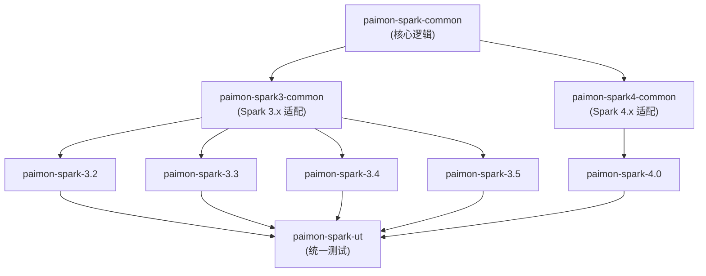
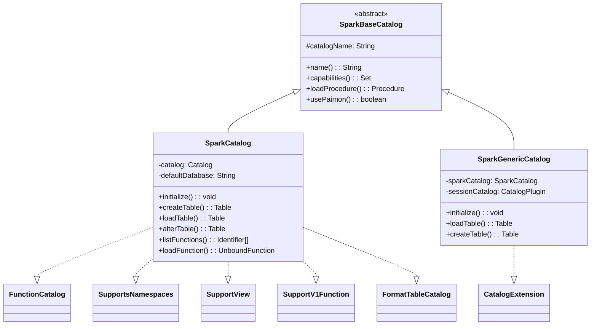
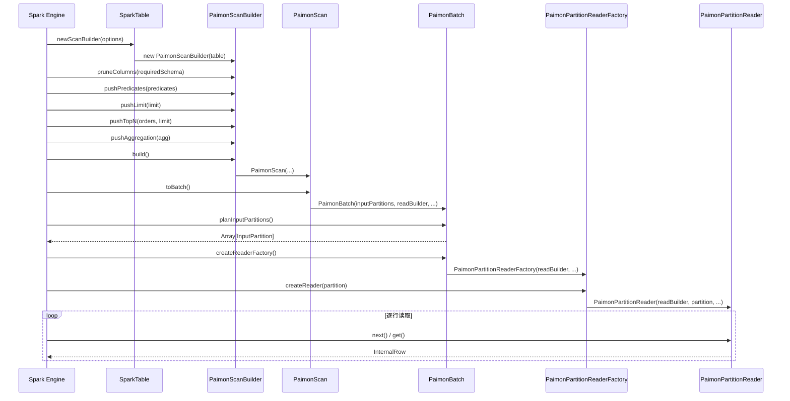
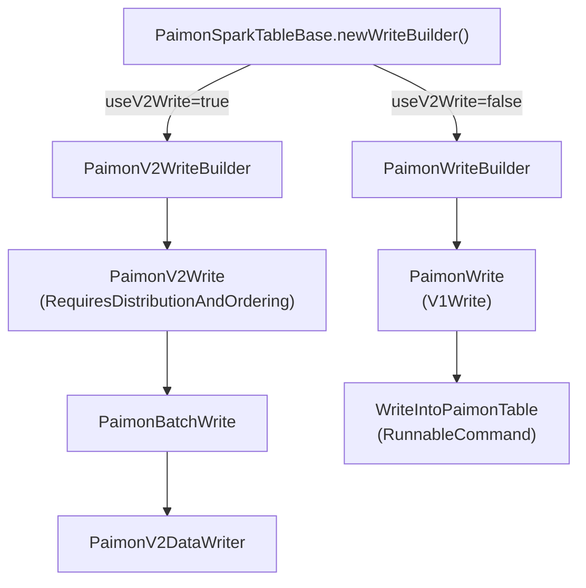
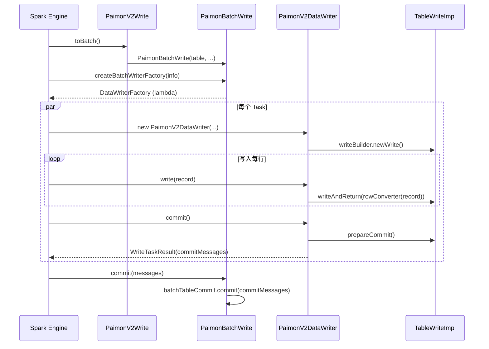
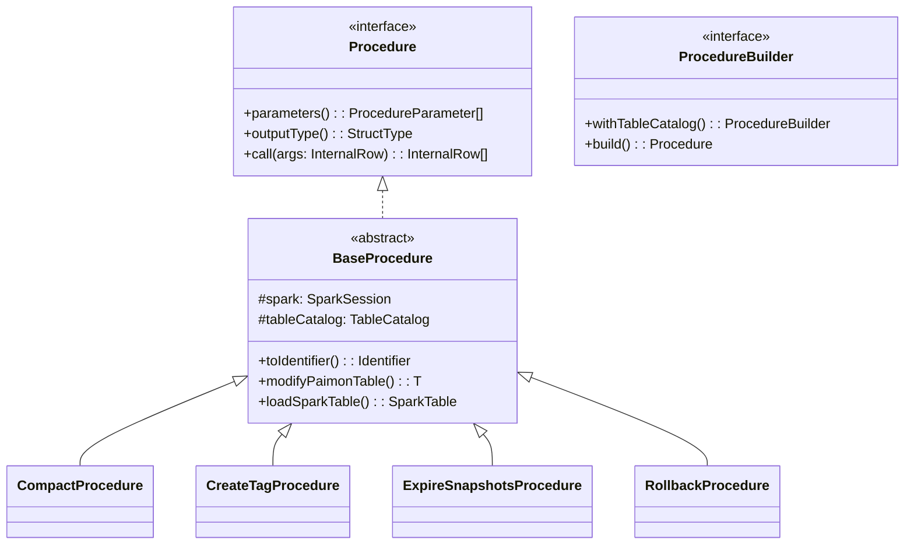
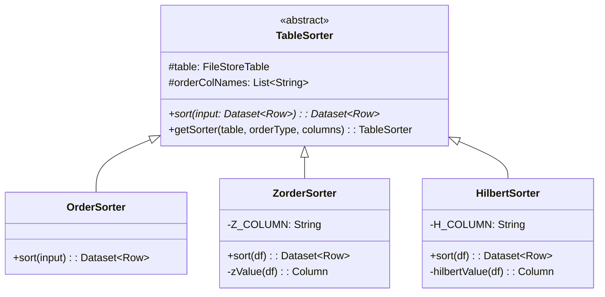
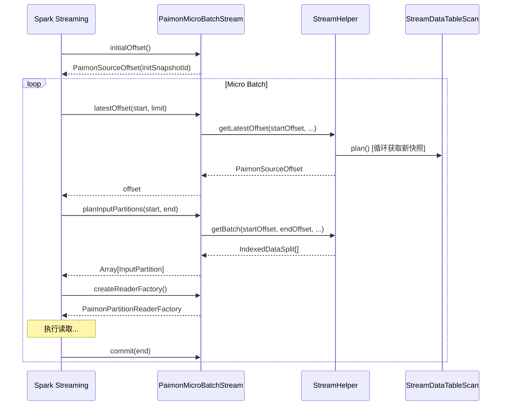

# Apache Paimon Spark 集成深度源码分析

> 基于 paimon 1.5-SNAPSHOT (master 分支, commit: 55f4fd175)
> 分析日期: 2026-04-22

---

## 1. Spark 模块结构与版本适配架构

### 解决什么问题

**核心业务问题**: Spark 从 3.2 到 4.0 跨越了多个大版本，每个版本的 API 都有不兼容变化（如 Spark 4.0 切换到 Scala 2.13 和 Java 17，`InternalRow` 接口变化，`MergeIntoTable` 签名变化等）。如果为每个版本都写一套完整代码，会导致代码重复率极高，维护成本爆炸。

**没有这个设计的后果**:
- 每个 Spark 版本都需要维护一套完整的 Catalog、DataSource、Procedure 代码
- 修复一个 bug 需要在 5 个版本模块中分别修改
- 新增功能需要在所有版本中重复实现
- 代码库膨胀到无法维护的程度

**实际场景**:
- 用户 A 使用 Spark 3.2 + Scala 2.12
- 用户 B 使用 Spark 3.5 + Scala 2.12
- 用户 C 使用 Spark 4.0 + Scala 2.13 + Java 17
- 三者需要使用同一套 Paimon 核心逻辑，但 Spark API 不兼容

### 有什么坑

**误区陷阱**:
- **误区**: 认为只需要为 Spark 3.x 和 4.x 各写一套代码即可
- **真相**: Spark 3.2/3.3/3.4/3.5 之间也有细微差异（如某些 API 在 3.4 才引入），需要版本特定模块处理

**错误配置**:
```xml
<!-- 错误: 同时依赖多个版本 -->
<dependency>
    <groupId>org.apache.paimon</groupId>
    <artifactId>paimon-spark-3.2</artifactId>
</dependency>
<dependency>
    <groupId>org.apache.paimon</groupId>
    <artifactId>paimon-spark-3.5</artifactId>
</dependency>
```
正确做法: 只依赖与你的 Spark 版本匹配的单个模块。

**生产环境注意事项**:
- 使用 Spark 4.0 时必须确保 JDK 版本 >= 17
- Spark 3.x 和 4.x 的 shaded jar 不能混用
- 升级 Spark 版本时必须同步升级 Paimon Spark 模块

**性能陷阱**:
- 不要在运行时通过反射判断 Spark 版本，会影响性能
- SparkShim 的 SPI 加载在类加载时完成，运行时无开销

### 核心概念解释

**SparkShim (Shim Layer)**:
- **定义**: Shim 是"垫片"的意思，在软件工程中指用于抹平不同版本 API 差异的适配层
- **作用**: 将版本特定的 API 调用封装在统一接口后面
- **实现**: 通过 Java SPI (Service Provider Interface) 机制在运行时加载对应版本的实现

**SPI (Service Provider Interface)**:
```java
// META-INF/services/org.apache.paimon.spark.shims.SparkShim
org.apache.paimon.spark.shims.Spark3Shim  // Spark 3.x 模块中
org.apache.paimon.spark.shims.Spark4Shim  // Spark 4.x 模块中
```
运行时通过 `ServiceLoader.load(SparkShim.class)` 自动加载正确的实现。

**分层依赖 vs 平铺依赖**:
- **平铺**: paimon-spark-3.2, paimon-spark-3.3, ... 各自独立，代码重复
- **分层**: common → 3-common/4-common → 版本特定，代码复用最大化

**与其他系统对比**:
- **Iceberg**: 使用类似的 Shim 机制适配 Spark 版本
- **Delta Lake**: 为每个 Spark 版本维护独立分支，代码重复度高
- **Hudi**: 使用 Maven Profile + 条件编译，但仍有较多重复代码

### 设计理念

**为什么这样设计**:
1. **最大化代码复用**: 核心逻辑（Catalog、DataSource、Procedure）占代码量的 90%，这些逻辑与 Spark 版本无关，应该只写一次
2. **最小化版本差异**: 只有真正不兼容的 API 才需要版本特定实现，通过 Shim 隔离
3. **编译时类型安全**: 不使用反射，所有版本适配在编译时确定，避免运行时错误
4. **独立打包**: 每个版本的 shaded jar 只包含对应版本的代码，不会膨胀

**权衡取舍**:
- **优势**: 代码维护成本低，新功能只需在 common 模块实现一次
- **劣势**: 模块结构复杂，新人理解成本高
- **取舍**: 牺牲初期理解成本，换取长期维护效率

**架构演进**:
- **早期**: 每个 Spark 版本独立模块，代码重复严重
- **中期**: 引入 paimon-spark-common，但版本差异仍在各模块中散落
- **现在**: 三层架构（common → 3-common/4-common → 版本特定），差异完全隔离

**业界对比**:
- **Iceberg 的做法**: 与 Paimon 类似，使用 Shim + 分层依赖
- **Delta Lake 的做法**: 为每个 Spark 版本维护独立代码库，通过 CI/CD 同步修改
- **Paimon 的优势**: 更激进的代码复用策略，版本特定模块极简（只有 20-30 个文件）

### 1.1 模块总览

**支持的 Spark 版本**: 3.2 ~ 3.5 (Scala 2.12) 和 4.0 (Scala 2.13, Java 17)

```
paimon-spark/
  paimon-spark-common/       -- 核心共享代码 (Java + Scala 混合)
  paimon-spark3-common/      -- Spark 3.x 共享的适配层 (Scala 2.12)
  paimon-spark4-common/      -- Spark 4.x 共享的适配层 (Scala 2.13)
  paimon-spark-3.2/          -- Spark 3.2 版本特定代码 (Scala 2.12)
  paimon-spark-3.3/          -- Spark 3.3 版本特定代码 (Scala 2.12)
  paimon-spark-3.4/          -- Spark 3.4 版本特定代码 (Scala 2.12)
  paimon-spark-3.5/          -- Spark 3.5 版本特定代码 (Scala 2.12)
  paimon-spark-4.0/          -- Spark 4.0 版本特定代码 (Scala 2.13, Java 17)
  paimon-spark-ut/           -- 统一测试模块 (Scala 测试)
  pom.xml                    -- 聚合 POM
```

### 1.2 分层依赖架构



**为什么这么设计？**
- **最大化代码复用**: `paimon-spark-common` 包含所有跨版本共享的核心逻辑（Catalog、DataSource V2 接口、Procedure、排序器、写入器等），无论 Spark 版本如何，这些代码只写一遍。
- **最小化版本差异**: Spark 3.x 与 4.x 之间有 API 不兼容变化（如 `InternalRow` 接口变化、`MergeIntoTable` 签名差异、Variant 类型支持等）。通过 `paimon-spark3-common` 和 `paimon-spark4-common` 两个中间层隔离这些差异。
- **版本特定模块极简**: 例如 `paimon-spark-3.5` 包含 24 个文件，`paimon-spark-3.4` 包含 31 个文件，相比 `paimon-spark-common` 的数百个文件，版本特定的差异已被上层模块充分抽象。

### 1.3 SparkShim 机制 -- 版本适配的核心

```
SparkShim (trait, paimon-spark-common)
  ├── Spark3Shim (paimon-spark3-common)
  └── Spark4Shim (paimon-spark4-common)
```

**源码位置**: `paimon-spark-common/.../shims/SparkShim.scala`

`SparkShim` 是一个 trait，声明了所有在 Spark 3 与 Spark 4 之间有不兼容实现的方法：

| 方法 | 作用 | 为什么需要适配 |
|------|------|---------------|
| `createSparkParser()` | 创建 SQL 解析器 | Spark 3/4 Parser API 签名不同 |
| `createSparkInternalRow()` | 创建内部行对象 | `InternalRow` 接口在 Spark 4 中变化 |
| `createSparkArrayData()` | 创建数组数据 | `ArrayData` 实现差异 |
| `createMergeIntoTable()` | 创建 MERGE INTO 逻辑计划 | Spark 4 增加了 `withSchemaEvolution` 参数 |
| `toPaimonVariant()` | Variant 类型转换 | Variant 是 Spark 4 新增类型 |
| `createCustomResolution()` | 创建版本特定分析规则 | 不同版本的 Catalyst 规则差异 |

**好处**: 运行时通过 `SparkShimLoader` (SPI 机制) 加载对应版本的 Shim 实现，主代码无需 `if-else` 判断版本号，同时每个版本的 shaded jar 只包含对应实现。

---

## 2. SparkCatalog 体系

### 解决什么问题

**核心业务问题**: Spark 用户需要在同一个 Session 中访问多种数据源（Paimon 表、Hive 表、临时表、视图等），同时需要支持 Paimon 特有的功能（Procedure、Time Travel、Format Table）。如果只提供一个独立的 Paimon Catalog，用户就无法访问已有的 Hive 表；如果完全替换 Spark 的 SessionCatalog，又会丢失 Spark 原生功能。

**没有这个设计的后果**:
- 用户必须在多个 Catalog 之间频繁切换：`USE CATALOG paimon_catalog` → `USE CATALOG spark_catalog`
- 无法在一条 SQL 中 JOIN Paimon 表和 Hive 表
- 已有的 Hive 表迁移到 Paimon 需要修改所有 SQL 语句
- Procedure 功能无法使用（Spark 原生不支持）

**实际场景**:
```sql
-- 场景 1: 混合查询 Paimon 表和 Hive 表
SELECT p.*, h.dim_value
FROM paimon_db.fact_table p
JOIN hive_db.dim_table h ON p.id = h.id;

-- 场景 2: 调用 Paimon Procedure 做 Compaction
CALL sys.compact(table => 'paimon_db.fact_table');

-- 场景 3: Time Travel 查询历史数据
SELECT * FROM paimon_db.fact_table VERSION AS OF 12345;
```

### 有什么坑

**误区陷阱**:
- **误区 1**: 认为 `SparkCatalog` 和 `SparkGenericCatalog` 可以同时配置
- **真相**: 两者是互斥的，`SparkGenericCatalog` 用于替换 `spark_catalog`，`SparkCatalog` 用于独立 Catalog

**错误配置**:
```properties
# 错误: 同时配置两种 Catalog
spark.sql.catalog.spark_catalog=org.apache.paimon.spark.SparkGenericCatalog
spark.sql.catalog.paimon=org.apache.paimon.spark.SparkCatalog
spark.sql.catalog.paimon.warehouse=/path/to/warehouse
# 问题: spark_catalog 已经是 Paimon，再配置独立 paimon catalog 会导致混淆
```

正确配置（二选一）:
```properties
# 方案 1: 独立 Paimon Catalog（推荐用于纯 Paimon 场景）
spark.sql.catalog.paimon=org.apache.paimon.spark.SparkCatalog
spark.sql.catalog.paimon.warehouse=/path/to/warehouse

# 方案 2: 替换 spark_catalog（推荐用于混合场景）
spark.sql.catalog.spark_catalog=org.apache.paimon.spark.SparkGenericCatalog
spark.sql.catalog.spark_catalog.warehouse=/path/to/warehouse
```

**生产环境注意事项**:
- 使用 `SparkGenericCatalog` 时，`format-table.enabled` 会被强制关闭，避免与 Spark 原生格式表冲突
- RESTCatalog 模式下才支持 V1 Function（`SupportV1Function` 接口）
- 阿里云 EMR 环境会自动检测并配置 DLF metastore，注意检查是否符合预期

**性能陷阱**:
- `CachingCatalog` 默认启用，但缓存可能导致元数据不一致（多个 Spark 应用同时写入时）
- Time Travel 查询会创建临时的 `extraOptions`，不会污染原始 Table 对象

### 核心概念解释

**Catalog vs CatalogExtension**:
- **Catalog**: Spark 的独立 Catalog 实现，完全独立管理一组表
- **CatalogExtension**: Spark 的 Catalog 扩展机制，可以"包装"另一个 Catalog，实现委托模式
- **关系**: `SparkCatalog` 实现 `TableCatalog`，`SparkGenericCatalog` 实现 `CatalogExtension`

**Procedure vs Function**:
- **Function**: 返回值的计算逻辑，可以在 SQL 表达式中使用（如 `SELECT bucket(id) FROM table`）
- **Procedure**: 执行操作的逻辑，通过 `CALL` 语句调用（如 `CALL sys.compact(...)`）
- **区别**: Procedure 可以修改表数据和元数据，Function 只能读取

**FormatTable**:
- **定义**: Paimon Catalog 中管理的非 Paimon 格式表（CSV、JSON、ORC、Parquet 等）
- **实现**: 通过 `FormatTable` 抽象层，转换为 Spark 原生的 `FileTable` 实现
- **好处**: 统一的 Catalog 管理，无需切换 Catalog 访问不同格式的表

**Time Travel 的两种模式**:
```sql
-- 模式 1: 按版本号（Snapshot ID）
SELECT * FROM table VERSION AS OF 12345;

-- 模式 2: 按时间戳
SELECT * FROM table TIMESTAMP AS OF '2024-01-01 00:00:00';
```
底层实现: 通过 `SCAN_VERSION` 或 `SCAN_TIMESTAMP_MILLIS` 选项传递给 `ReadBuilder`。

**与其他系统对比**:
- **Iceberg**: 也使用 CatalogExtension 模式，但 Procedure 实现方式不同（Iceberg 用 `StoredProcedure`）
- **Delta Lake**: 不支持 CatalogExtension，只能作为独立 Catalog
- **Hudi**: 不提供 Catalog 实现，依赖 Hive Metastore

### 设计理念

**为什么这样设计**:
1. **兼容性优先**: 通过 `CatalogExtension` 模式，Paimon 可以与 Spark 生态无缝集成，不破坏已有工作流
2. **渐进式迁移**: 用户可以先用 `SparkGenericCatalog` 混合访问 Paimon 和 Hive 表，逐步迁移
3. **功能扩展**: 通过 `ProcedureCatalog` 接口扩展 Spark 不支持的 Procedure 功能
4. **多态分发**: `loadTable` 根据表类型返回不同的 `SparkTable` 实现，支持多种表类型

**权衡取舍**:
- **优势**: 灵活性高，支持多种使用模式（独立 Catalog、替换 spark_catalog、混合使用）
- **劣势**: 配置复杂度高，用户容易配置错误
- **取舍**: 提供默认配置和自动检测（如 `autoFillConfigurations`），降低配置门槛

**架构演进**:
- **早期**: 只有 `SparkCatalog`，用户必须显式切换 Catalog
- **中期**: 引入 `SparkGenericCatalog`，支持替换 `spark_catalog`
- **现在**: 完善的委托模式，支持 Procedure、View、Function、FormatTable 等扩展功能

**业界对比**:
- **Iceberg 的做法**: 与 Paimon 类似，提供 `SparkCatalog` 和 `SparkSessionCatalog`（类似 `SparkGenericCatalog`）
- **Delta Lake 的做法**: 只提供独立 Catalog，不支持替换 `spark_catalog`
- **Paimon 的优势**: 更完善的委托模式，自动配置填充，更好的 Hive 兼容性

### 2.1 类继承层次



### 2.2 SparkBaseCatalog -- 基座

**源码位置**: `paimon-spark-common/.../catalog/SparkBaseCatalog.java`

```java
public abstract class SparkBaseCatalog
        implements TableCatalog, SupportsNamespaces, ProcedureCatalog, WithPaimonCatalog {
    protected String catalogName;

    public Set<TableCatalogCapability> capabilities() {
        return Collections.singleton(SUPPORT_COLUMN_DEFAULT_VALUE);
    }

    public Procedure loadProcedure(Identifier identifier) throws NoSuchProcedureException {
        if (isSystemNamespace(identifier.namespace())) {
            ProcedureBuilder builder = SparkProcedures.newBuilder(identifier.name());
            if (builder != null) {
                return builder.withTableCatalog(this).build();
            }
        }
        throw new NoSuchProcedureException(identifier);
    }
}
```

**为什么这么做？**
- **Procedure 统一加载**: 不论使用 `SparkCatalog` 还是 `SparkGenericCatalog`，Procedure 的注册和加载逻辑完全一致，避免重复。
- **`ProcedureCatalog` 接口**: 这是 Paimon 自定义的接口，Spark 原生不提供 Procedure 概念，Paimon 借鉴 Iceberg 模式，通过 `CALL sys.xxx()` 语法调用。

### 2.3 SparkCatalog -- 独立 Paimon Catalog

**源码位置**: `paimon-spark-common/.../SparkCatalog.java`

**核心职责**: 作为一个独立的 Spark Catalog 实例（如 `spark_catalog` 以外的其他名称），只管理 Paimon 表。

**初始化流程** (`initialize()` 方法):
1. 调用 `checkRequiredConfigurations()` 校验必要配置
2. 通过 `CatalogContext.create()` + `CatalogFactory.createCatalog()` 创建底层 Paimon `Catalog` 实例
3. 读取 `default-database` 选项，默认为 `"default"`
4. 判断是否启用 V1 Function（仅 RESTCatalog 支持）
5. 若默认数据库不存在，自动创建

**loadTable 的多态分发**:

```java
protected Table loadSparkTable(Identifier ident, Map<String, String> extraOptions) {
    Table table = copyWithSQLConf(catalog.getTable(tblIdent), ...);
    if (table instanceof FormatTable) {
        return toSparkFormatTable(ident, (FormatTable) table);     // 格式表
    } else if (table instanceof IcebergTable) {
        return new SparkIcebergTable(table);                        // Iceberg 兼容表
    } else if (table instanceof LanceTable) {
        return new SparkLanceTable(table);                          // Lance 表
    } else if (table instanceof ObjectTable) {
        return new SparkObjectTable((ObjectTable) table);           // 对象表
    } else {
        return new SparkTable(table);                               // 标准 Paimon 表
    }
}
```

**为什么这么做？** Paimon 支持多种表类型，每种类型需要不同的 Spark Table 实现来提供不同的 capability（如 ObjectTable 只支持 `BATCH_READ`，SparkTable 支持读/写/流）。

**Time Travel 支持**:
- `loadTable(ident, version)`: 通过 `SCAN_VERSION` 选项实现版本查询
- `loadTable(ident, timestamp)`: 通过 `SCAN_TIMESTAMP_MILLIS` 实现时间旅行。注意 Spark 传入微秒，Paimon 使用毫秒，代码中做了 `/1000` 转换。

### 2.4 SparkGenericCatalog -- 混合 Catalog (CatalogExtension)

**源码位置**: `paimon-spark-common/.../SparkGenericCatalog.java`

**核心设计**: 实现 `CatalogExtension` 接口，用于替代 Spark 内置的 `spark_catalog`。它内部组合一个 `SparkCatalog` 和一个 `sessionCatalog`（委托 Catalog），实现"优先加载 Paimon 表，找不到再回退到 Session Catalog"的策略。

```java
public Table loadTable(Identifier ident) throws NoSuchTableException {
    try {
        return sparkCatalog.loadTable(ident);        // 先尝试 Paimon
    } catch (NoSuchTableException e) {
        return throwsOldIfExceptionHappens(           // 回退到 Session Catalog
            () -> asTableCatalog().loadTable(ident), e);
    }
}
```

**为什么这么做？**
- 用户可以在一个 Spark Session 中同时访问 Paimon 表和 Hive 表
- `createTable` 时根据 `provider` 属性决定：如果是 `paimon` 或未指定则用 Paimon 建表，否则委托给 Session Catalog

**自动配置填充** (`autoFillConfigurations()`):
- 如果未指定 `warehouse`，自动从 `spark.sql.warehouse.dir` 获取
- 如果未指定 `metastore`，检测 Spark 是否配置了 Hive，自动设为 `hive`
- 检测阿里云 EMR 环境，自动配置 DLF metastore
- 强制关闭 format table (`format-table.enabled = false`)

### 2.5 FormatTableCatalog -- 非 Paimon 格式表支持

**源码位置**: `paimon-spark-common/.../catalog/FormatTableCatalog.java`

通过 Paimon 的 `FormatTable` 抽象，可以在 Paimon Catalog 中管理 CSV、JSON、ORC、Parquet、Text 等原生格式表。加载时转换为 Spark 原生的 `FileTable` 实现（`PartitionedCSVTable`、`PartitionedParquetTable` 等），利用 Spark 原生读写能力。

**好处**: 用户可以在 Paimon Catalog 中统一管理各种格式的表，不用切换 Catalog。

### 2.6 SupportView -- 视图支持

**源码位置**: `paimon-spark-common/.../catalog/SupportView.java`

通过 `WithPaimonCatalog` 接口获取底层 Paimon Catalog 实例，代理视图的 CRUD 操作。视图存储时会以 `spark` 方言保存 SQL 文本，支持多方言（如 Flink 和 Spark 可以有不同的 SQL 表达）。

---

## 3. DataSource V2 读取

### 解决什么问题

**核心业务问题**: Spark 需要高效读取 Paimon 表的数据，同时利用 Paimon 的存储优化（分区裁剪、列裁剪、谓词下推、聚合下推、文件统计信息）来减少 I/O 和计算量。如果不做这些优化，Spark 会读取所有数据文件的所有列，然后在内存中过滤和聚合，性能极差。

**没有这个设计的后果**:
```sql
-- 查询: 只需要 2024 年的数据，只需要 id 和 name 列，只需要 COUNT(*)
SELECT COUNT(*) FROM table WHERE year = 2024;

-- 没有优化: 读取所有年份、所有列、所有行，然后在 Spark 内存中过滤和聚合
-- 有优化: 只读取 year=2024 分区，只读取必要的列，直接从 Manifest 统计信息返回 COUNT
```

**实际场景**:
- **场景 1**: 大宽表查询（100 列），只需要 5 列 → 列裁剪减少 95% I/O
- **场景 2**: 分区表查询（1000 个分区），只需要 1 个分区 → 分区裁剪减少 99.9% 扫描
- **场景 3**: 聚合查询 `SELECT COUNT(*) FROM table` → 聚合下推，0 数据文件读取
- **场景 4**: TopN 查询 `SELECT * FROM table ORDER BY id LIMIT 100` → TopN 下推，提前终止扫描

### 有什么坑

**误区陷阱**:
- **误区 1**: 认为所有谓词都能下推到存储层
- **真相**: 只有能转换为 Paimon `Predicate` 的谓词才能下推，复杂表达式（如 UDF、子查询）无法下推

**错误配置**:
```properties
# 错误: 禁用列裁剪
spark.sql.optimizer.pruneColumns=false
# 后果: Paimon 仍会读取所有列，浪费 I/O

# 错误: 设置过大的 maxSplitBytes
spark.sql.files.maxPartitionBytes=10g
# 后果: 单个 Task 处理过多数据，可能 OOM
```

**生产环境注意事项**:
- **BinPacking 优化**: 小文件场景下，`FILES_MAX_PARTITION_BYTES` 配置不当会导致过多或过少的 Task
- **桶扫描**: `HASH_FIXED` 桶模式下，如果查询不涉及桶键，桶扫描反而会降低性能（AQE 会自动禁用）
- **聚合下推**: 只有 `FileStoreTable` 且没有 post-scan 谓词时才能下推，否则会回退到正常扫描

**性能陷阱**:
- **过度裁剪**: 如果查询需要多次访问同一表的不同列，列裁剪可能导致多次扫描
- **谓词顺序**: 分区谓词应该放在前面，数据谓词放在后面，利用短路求值
- **元数据列**: 访问 `_file_path`、`_row_index` 等元数据列会禁用某些优化

### 核心概念解释

**DataSource V2 的三层抽象**:
1. **Scan**: 描述"如何扫描"（列裁剪、谓词、统计信息）
2. **Batch**: 描述"扫描什么"（InputPartition 列表）
3. **PartitionReader**: 描述"如何读取"（逐行读取 InternalRow）

**谓词下推的两个阶段**:
```scala
// 阶段 1: Spark Optimizer 调用 pushPredicates
pushPredicates(Array(EqualTo("year", 2024), GreaterThan("id", 100)))

// 阶段 2: 区分分区谓词和数据谓词
partitionFilters = [EqualTo("year", 2024)]  // 在 Manifest 级别过滤
dataFilters = [GreaterThan("id", 100)]      // 在文件级别过滤（min/max/bloom filter）
postScan = [GreaterThan("id", 100)]         // Spark 二次过滤（因为数据谓词不保证精确）
```

**BinPacking 算法**:
- **问题**: Paimon 的 Split 粒度是单个数据文件，可能只有几 MB
- **解决**: 将多个小 Split 合并为一个 `InputPartition`，减少 Task 数量
- **策略**: 按 partition + bucket 分组，累积大小超过 `maxSplitBytes` 时开始新 partition

**桶分区报告 (Bucketed Scan)**:
```scala
// Spark 看到的分区信息
KeyGroupedPartitioning(
  clustering = Seq(bucket(hash(bucket_key))),  // 按桶键分区
  numPartitions = bucketNum                     // 桶数量
)
```
好处: Spark 可以利用这个信息做 Bucket Join，避免 shuffle。

**聚合下推的极端优化**:
```sql
-- 查询
SELECT COUNT(*) FROM table WHERE year = 2024;

-- 正常流程: 扫描所有数据文件 → 计数 → 返回
-- 聚合下推: 读取 Manifest 统计信息 → 累加 rowCount → 返回（0 数据文件读取）
```

**与其他系统对比**:
- **Parquet**: 支持列裁剪、谓词下推（通过 footer 的统计信息）
- **ORC**: 支持列裁剪、谓词下推、聚合下推（通过 stripe 统计信息）
- **Paimon**: 支持所有上述优化，额外支持 TopN 下推、桶分区报告、元数据列

### 设计理念

**为什么这样设计**:
1. **分层优化**: Scan 层做逻辑优化（列裁剪、谓词下推），Batch 层做物理优化（BinPacking、桶分区）
2. **延迟计算**: `InputPartition` 只包含 Split 的序列化信息，真正的读取在 Task 端执行
3. **统计信息驱动**: 利用 Manifest 的 min/max/nullCount 统计信息做文件级过滤
4. **渐进式下推**: 先尝试聚合下推，失败则尝试 TopN 下推，最后回退到正常扫描

**权衡取舍**:
- **优势**: 最大化利用 Paimon 的存储优化，减少 I/O 和计算量
- **劣势**: 复杂的下推逻辑增加了代码复杂度和调试难度
- **取舍**: 通过 `postScan` 机制保证正确性（存储层过滤不精确时，Spark 做二次过滤）

**架构演进**:
- **早期**: 只支持基本的列裁剪和分区裁剪
- **中期**: 引入谓词下推和 BinPacking 优化
- **现在**: 完整的下推体系（聚合、TopN、桶分区报告、元数据列）

**业界对比**:
- **Iceberg**: 支持类似的下推优化，但聚合下推实现方式不同（Iceberg 用 `DeleteFile` 机制）
- **Delta Lake**: 支持列裁剪和谓词下推，但不支持聚合下推和 TopN 下推
- **Paimon 的优势**: 更激进的下推策略，特别是聚合下推可以实现 0 数据文件读取

### 3.1 整体读取流程



### 3.2 类继承层次

```
BaseScan (trait)                    -- 基础 Scan 逻辑: 列裁剪/谓词/统计/指标
  └── PaimonBaseScan (abstract)     -- Paimon 特化: GlobalIndex查询/向量搜索/全文搜索/MicroBatch
        └── PaimonScan (case class) -- 最终 Scan: 桶分区/排序报告

PaimonBaseScanBuilder (abstract)    -- 基础下推: V2Filter/列裁剪/Limit
  └── PaimonScanBuilder             -- 聚合下推/TopN下推/build()
```

### 3.3 谓词下推 (Predicate Push Down)

**源码位置**: `PaimonBaseScanBuilder.scala` 的 `pushPredicates()` 方法

核心流程:
1. 将 Spark V2 `Predicate` 通过 `SparkV2FilterConverter` 转换为 Paimon `Predicate`
2. 使用 `PartitionPredicateVisitor` 区分分区谓词和数据谓词
3. 分区谓词通过 `splitPartitionPredicatesAndDataPredicates` 拆分后设置到 `pushedPartitionFilters`
4. 数据谓词设置到 `pushedDataFilters`，同时保留在 `postScan` 中（因为数据谓词不能保证完全由存储层过滤）
5. 不能转换的谓词也作为 `postScan` 返回

**SparkV2FilterConverter** (`paimon-spark-common/.../spark/SparkV2FilterConverter.scala`) 支持的谓词类型:

| Spark 谓词 | Paimon 谓词 |
|-----------|------------|
| `=` | `equal` |
| `<=>` | `isNull` 或 `isNotNull + equal` |
| `>`, `>=`, `<`, `<=` | `greaterThan`, `greaterOrEqual`, `lessThan`, `lessOrEqual` |
| `IN` | `in` |
| `IS_NULL`, `IS_NOT_NULL` | `isNull`, `isNotNull` |
| `AND`, `OR`, `NOT` | 组合谓词 |
| `STARTS_WITH`, `ENDS_WITH`, `CONTAINS` | `startsWith`, `endsWith`, `contains` |

**为什么分区谓词和数据谓词要分开处理？** 分区谓词可以在 Manifest 级别过滤，无需读取数据文件；数据谓词需要在文件级别使用统计信息过滤（min/max/bloom filter），但不能保证精确过滤所有不匹配行，所以同时保留在 postScan 中让 Spark 做二次过滤。

### 3.4 列裁剪 (Column Pruning)

```scala
override def pruneColumns(requiredSchema: StructType): Unit = {
    this.requiredSchema = requiredSchema
}
```

在 `BaseScan` 的 `readBuilder` 中:
```scala
val _readBuilder = table.newReadBuilder().withReadType(readTableRowType)
```

`readTableRowType` 通过 `SparkTypeUtils.prunePaimonRowType()` 将 Spark 的 `requiredSchema` 映射为 Paimon 的精简 `RowType`，只读取需要的列，减少 I/O。

### 3.5 聚合下推 (Aggregate Push Down)

**源码位置**: `PaimonScanBuilder.scala` 的 `pushAggregation()` 方法

当满足以下条件时可以做聚合下推:
- 表必须是 `FileStoreTable`
- 没有 post-scan 谓词
- `AggregatePushDownUtils.tryPushdownAggregation()` 成功

如果下推成功，返回 `PaimonLocalScan`（不读取数据文件，直接从统计信息中计算聚合结果），这是一种极端优化：例如 `SELECT COUNT(*) FROM table` 可以直接从 manifest 的统计信息得到结果，无需扫描任何数据文件。

### 3.6 TopN 下推

```scala
override def pushTopN(orders: Array[SortOrder], limit: Int): Boolean = {
    // 仅 FileStoreTable 且没有 post-scan 谓词时支持
    pushedTopN = Some(new TopN(sorts.asJava, limit))
    false  // 返回 false 表示 best-effort，Spark 仍做最终排序
}
```

**好处**: 存储层可以根据排序条件和限制数量优化扫描范围，减少需要读取的文件数。

### 3.7 Split 的 BinPacking 优化

**源码位置**: `paimon-spark-common/.../spark/read/BinPackingSplits.scala`

**问题**: Paimon 的 Split 粒度可能很小（单个数据文件），直接每个 Split 一个 Task 会导致过多小任务。

**解决方案**: BinPacking 算法将多个小 Split 合并为一个 `InputPartition`:

1. 区分可重排的 Split（`rawConvertible` 的 `DataSplit`）和不可重排的 Split
2. 对可重排 Split，计算 `maxSplitBytes`（取 `FILES_MAX_PARTITION_BYTES` 和每核平均字节数的较小值）
3. 按 partition + bucket 分组，将同组内的小文件打包到一个 `InputPartition` 中
4. 当累积大小超过 `maxSplitBytes` 时开始新的 partition

**为什么需要列裁剪感知？** `readRowSizeRatio` 参数会根据实际读取列数与总列数的比例调整文件大小估算，使得列裁剪后的 binpacking 更准确。

### 3.8 桶分区报告 (Bucketed Scan)

**源码位置**: `PaimonScan.scala`

当表使用 `HASH_FIXED` 桶模式且只有一个桶键时，`PaimonScan` 会：
1. 报告 `KeyGroupedPartitioning`，让 Spark 知道数据已按桶分区
2. 报告排序信息（`outputOrdering()`），当每个 InputPartition 只有一个 Split 且按主键排序时
3. 按桶号分组 Split 到 `PaimonBucketedInputPartition`

**好处**: Spark 可以利用分区信息避免不必要的 shuffle（如桶 Join），提高查询效率。`DisableUnnecessaryPaimonBucketedScan` 规则会在 AQE (Adaptive Query Execution) 阶段自动禁用不必要的桶扫描。

### 3.9 元数据列 (Metadata Columns)

`PaimonSparkTableBase` 实现了 `SupportsMetadataColumns`，暴露以下元数据列:

| 元数据列 | 条件 | 说明 |
|---------|------|------|
| `_row_id` | `rowTrackingEnabled` | 行级唯一标识 |
| `_sequence_number` | `rowTrackingEnabled` | 序列号 |
| `_file_path` | 始终可用 | 数据文件路径 |
| `_row_index` | 始终可用 | 文件内行索引 |
| `_partition` | 始终可用 | 分区值 |
| `_bucket` | 始终可用 | 桶号 |

---

## 4. DataSource V2 写入

### 解决什么问题

**核心业务问题**: Spark 写入 Paimon 表时，需要保证数据按分区和桶正确分布，同时保证写入的原子性和一致性。如果数据分布不正确，会导致查询时需要跨桶读取，性能极差；如果没有原子提交，会导致部分写入成功、部分失败，数据不一致。

**没有这个设计的后果**:
```scala
// 场景: 写入一个 HASH_FIXED 桶表（4 个桶）
// 没有正确分布: 每个 Task 写入的数据可能跨越多个桶
// Task 1 写入: bucket 0, 1, 2, 3
// Task 2 写入: bucket 0, 1, 2, 3
// Task 3 写入: bucket 0, 1, 2, 3
// 结果: 每个桶的数据分散在多个文件中，查询时需要读取所有文件

// 正确分布: 每个 Task 只写入一个桶
// Task 1 写入: bucket 0
// Task 2 写入: bucket 1
// Task 3 写入: bucket 2
// Task 4 写入: bucket 3
// 结果: 每个桶的数据集中在少数文件中，查询时只需读取对应桶的文件
```

**实际场景**:
- **场景 1**: 写入主键表，需要保证相同主键的数据在同一个桶中（否则无法做 Upsert）
- **场景 2**: 写入分区表，需要保证相同分区的数据在同一起（否则无法做分区覆盖）
- **场景 3**: 并发写入，需要保证原子提交（否则会出现部分写入成功、部分失败）
- **场景 4**: 行级操作（DELETE、UPDATE、MERGE INTO），需要读取受影响的文件并重写

### 有什么坑

**误区陷阱**:
- **误区 1**: 认为 V1 Write 和 V2 Write 功能完全相同
- **真相**: V2 Write 有更多限制（不支持多桶键、非 DEFAULT 桶函数、聚类列），但性能更好

**错误配置**:
```properties
# 错误: 强制使用 V2 Write，但表不支持
spark.sql.sources.useV1SourceList=
# 后果: 如果表有聚类列或多桶键，会回退到 V1 Write，但用户不知道

# 错误: 禁用动态分区覆盖
spark.sql.sources.partitionOverwriteMode=static
# 后果: OVERWRITE 会删除所有分区，而不是只删除涉及的分区
```

**生产环境注意事项**:
- **V2 Write 的启用条件**: 必须满足桶函数为 DEFAULT、桶模式为 HASH_FIXED/BUCKET_UNAWARE/POSTPONE_MODE、无聚类列
- **动态分区覆盖**: 需要设置 `write.dynamic-partition-overwrite=true` 或 Spark 配置 `partitionOverwriteMode=dynamic`
- **Commit Coordinator**: Paimon 不使用 Spark 的 Commit Coordinator，因为 Paimon 自身保证原子提交

**性能陷阱**:
- **V1 Write 的 shuffle**: V1 模式下，Paimon 在 `PaimonSparkWriter` 中做数据分桶，会引入额外的 shuffle
- **V2 Write 的 shuffle**: V2 模式下，Spark 根据 `RequiresDistributionAndOrdering` 做 shuffle，可以利用 AQE 优化
- **小文件问题**: 如果桶数过多或分区过多，会产生大量小文件，影响查询性能

### 核心概念解释

**V1 Write vs V2 Write**:
- **V1 Write**: 通过 `RunnableCommand` 在 Driver 端控制写入流程，Paimon 自己做数据分桶
- **V2 Write**: 通过 `RequiresDistributionAndOrdering` 声明分布要求，Spark 做 shuffle

**RequiresDistributionAndOrdering**:
```scala
class PaimonV2Write extends Write with RequiresDistributionAndOrdering {
    // 声明数据分布要求: 按分区键 + bucket(桶键) 聚簇
    override def requiredDistribution(): Distribution = 
        Distributions.clustered(partitionCols ++ bucketCols)
    
    // 声明排序要求: 通常为空（Paimon 内部排序）
    override def requiredOrdering(): Array[SortOrder] = EMPTY_ORDERING
}
```
Spark 会在写入前自动插入 `RepartitionByExpression` 算子，保证数据分布。

**Copy-on-Write 行级操作**:
```scala
// DELETE/UPDATE/MERGE INTO 的执行流程
1. PaimonCopyOnWriteScan 读取受影响的文件
2. 在内存中过滤/更新数据
3. 写入新文件
4. Commit 时同时提交新增文件和删除文件的 CommitMessage
```

**动态分区覆盖 vs 静态分区覆盖**:
```sql
-- 动态分区覆盖: 只覆盖涉及的分区
INSERT OVERWRITE TABLE table PARTITION (year, month)
SELECT * FROM source WHERE year = 2024;
-- 结果: 只删除 year=2024 的分区，其他分区不受影响

-- 静态分区覆盖: 删除所有分区
INSERT OVERWRITE TABLE table
SELECT * FROM source WHERE year = 2024;
-- 结果: 删除所有分区，然后写入 year=2024 的数据
```

**CommitMessage 的作用**:
- 每个 Task 写入完成后，返回 `CommitMessage`（包含新增文件、删除文件、统计信息）
- Driver 端收集所有 `CommitMessage`，调用 `BatchTableCommit.commit()` 原子提交
- 如果某个 Task 失败，Spark 会重试该 Task，重复的 `CommitMessage` 不会导致数据不一致

**与其他系统对比**:
- **Iceberg**: 也支持 V1 和 V2 两种写入模式，但 V2 模式的实现方式不同（Iceberg 用 `DistributionMode`）
- **Delta Lake**: 只支持 V1 写入模式，不支持 `RequiresDistributionAndOrdering`
- **Hudi**: 支持多种写入模式（COW、MOR），但不支持 Spark DataSource V2

### 设计理念

**为什么这样设计**:
1. **兼容性**: V1 Write 支持所有桶模式和配置，保证向后兼容
2. **性能**: V2 Write 利用 Spark 的 `RequiresDistributionAndOrdering` 和 AQE 优化，性能更好
3. **原子性**: 通过 Paimon 的 Snapshot 机制保证原子提交，不依赖 Spark 的 Commit Coordinator
4. **灵活性**: 支持多种覆盖模式（追加、静态覆盖、动态覆盖、Truncate）

**权衡取舍**:
- **优势**: 两种写入模式互补，V1 兼容性好，V2 性能好
- **劣势**: 两套代码路径增加了维护成本和理解难度
- **取舍**: 通过 `supportsV2Write` 自动选择合适的模式，用户无需关心

**架构演进**:
- **早期**: 只有 V1 Write，通过 `PaimonSparkWriter` 做数据分桶
- **中期**: 引入 V2 Write，支持 `RequiresDistributionAndOrdering`
- **现在**: 完善的两套写入路径，自动选择最优模式

**业界对比**:
- **Iceberg 的做法**: 与 Paimon 类似，支持 V1 和 V2 两种写入模式
- **Delta Lake 的做法**: 只支持 V1 写入模式，通过自定义 `OptimisticTransaction` 保证原子性
- **Paimon 的优势**: V2 Write 的条件判断更精细，自动选择逻辑更智能

### 4.1 写入架构概览 -- V1 Write vs V2 Write

Paimon 同时支持两种 Spark 写入模式:



#### V1 Write (旧模式)

**源码位置**: `paimon-spark-common/.../spark/write/PaimonWrite.scala`, `paimon-spark-common/.../spark/commands/WriteIntoPaimonTable.scala`

```scala
class PaimonWrite extends V1Write {
    override def toInsertableRelation: InsertableRelation = {
        (data: DataFrame, overwrite: Boolean) => {
            WriteIntoPaimonTable(table, saveMode, data, options).run(data.sparkSession)
        }
    }
}
```

`WriteIntoPaimonTable` 是一个 `RunnableCommand`，在 Driver 端通过 `PaimonSparkWriter` 控制写入流程，在每个分区上使用 Paimon 的 `BatchTableWrite` 写入数据。

**为什么保留 V1 Write？** V1 Write 走的是 Spark 的旧写入路径，不需要 Spark 按特定 distribution 重新分布数据，Paimon 自己在 `PaimonSparkWriter` 中做分桶。这在某些场景下更灵活：
- 多桶键场景
- 非 DEFAULT 桶函数
- 聚类列（clustering columns）场景

#### V2 Write (新模式)

**源码位置**: `PaimonV2Write.scala`, `PaimonBatchWrite.scala`, `PaimonV2DataWriter.scala`

**启用条件** (在 `PaimonSparkTableBase.supportsV2Write` 中判断):
1. 桶函数类型为 `DEFAULT`
2. 表类型为 `FileStoreTable`
3. 桶模式满足以下之一：
   - `HASH_FIXED`（且 `BucketFunction.supportsTable` 通过）
   - `BUCKET_UNAWARE`
   - `POSTPONE_MODE`（且 `postponeBatchWriteFixedBucket` 未启用）
4. 没有配置聚类列

**V2 Write 的核心优势 -- `RequiresDistributionAndOrdering`**:

```scala
class PaimonV2Write extends Write with RequiresDistributionAndOrdering {
    override def requiredDistribution(): Distribution = writeRequirement.distribution
    override def requiredOrdering(): Array[SortOrder] = writeRequirement.ordering
}
```

`PaimonWriteRequirement` 生成分布要求:

```scala
object PaimonWriteRequirement {
    def apply(table: FileStoreTable): PaimonWriteRequirement = {
        // HASH_FIXED: 按分区键 + bucket(桶键) 聚簇
        // BUCKET_UNAWARE/POSTPONE_MODE: 仅按分区键聚簇
        val distribution = Distributions.clustered(clusteringExpressions)
        PaimonWriteRequirement(distribution, EMPTY_ORDERING)
    }
}
```

**为什么这么做？** 通过声明 `RequiresDistributionAndOrdering`，Spark 会在写入前自动进行 shuffle，保证同一个分区+桶的数据发送到同一个 Writer Task。这避免了 V1 模式中 Paimon 自己做数据分桶的开销，同时利用 Spark 的 AQE 优化 shuffle。

### 4.2 V2 Write 的数据流



**关键细节**:
- `SparkInternalRowWrapper` 负责将 Spark 的 `InternalRow` 包装为 Paimon 的行格式，避免数据拷贝
- `useCommitCoordinator()` 返回 `false`，表示不需要 Spark 的协调器，因为 Paimon 自身保证原子提交
- `abort()` 时只关闭资源（TODO: 清理未提交文件）

### 4.3 Copy-on-Write 行级操作

对于 DELETE、UPDATE、MERGE INTO 等行级操作，当启用 V2 Write 时:

```scala
case class SparkTable(override val table: Table)
    extends PaimonSparkTableBase(table)
    with SupportsRowLevelOperations {

    override def newRowLevelOperationBuilder(info: RowLevelOperationInfo) = {
        table match {
            case t: FileStoreTable if useV2Write =>
                () => new PaimonSparkCopyOnWriteOperation(t, info)
        }
    }
}
```

`PaimonSparkCopyOnWriteOperation` 通过 `PaimonCopyOnWriteScan` 读取受影响的文件，然后在 commit 时同时提交新增文件和已删除文件的 `CommitMessage`。

### 4.4 Overwrite 模式

| 模式 | 行为 | 实现方式 |
|------|------|---------|
| InsertInto | 追加写入 | 不调用 `withOverwrite` |
| Overwrite(filter) | 按条件覆盖写入 | 转换 filter 为分区映射，传给 `BatchWriteBuilder.withOverwrite()` |
| DynamicOverWrite | 动态分区覆盖 | 设置 `CoreOptions.DYNAMIC_PARTITION_OVERWRITE` 为 true |
| Truncate | 全表覆盖 | `overwritePartitions = Map.empty` |

**V1 模式的动态分区覆盖**: 当 V2 Write 不支持时（表不包含 `OVERWRITE_DYNAMIC` capability），`PaimonAnalysis` 中的 `PaimonDynamicPartitionOverwrite` 匹配器会将 `OverwritePartitionsDynamic` 转换为 `PaimonDynamicPartitionOverwriteCommand`（V1 路径执行）。

---

## 5. SQL Extensions

### 解决什么问题

**核心业务问题**: Spark 原生 SQL 不支持 Paimon 特有的功能（CALL 语句、TAG/BRANCH DDL、行级操作的特殊语义、Procedure 调用等）。如果不扩展 Spark 的 SQL 解析和分析能力，用户就无法使用这些功能，或者需要通过复杂的 DataFrame API 来实现。

**没有这个设计的后果**:
```sql
-- 无法使用 Procedure
CALL sys.compact(table => 'db.table');  -- 语法错误

-- 无法使用 TAG 管理
CREATE TAG tag1 AS OF VERSION 12345;    -- 语法错误

-- UPDATE/DELETE/MERGE INTO 语义不正确
UPDATE table SET col = 1 WHERE id = 1;  -- 可能不支持或语义错误
```

**实际场景**:
- **场景 1**: 定期 Compaction，需要调用 `CALL sys.compact()`
- **场景 2**: 创建数据快照标签，需要 `CREATE TAG`
- **场景 3**: 行级更新，需要 `UPDATE` 语句
- **场景 4**: 复杂的 Upsert 逻辑，需要 `MERGE INTO` 语句
- **场景 5**: 使用 Paimon 特有函数（如 `bucket()`、`paimon_version()`）

### 有什么坑

**误区陷阱**:
- **误区 1**: 认为配置了 `spark.sql.extensions` 就能使用所有 Paimon 功能
- **真相**: 还需要配置正确的 Catalog（`SparkCatalog` 或 `SparkGenericCatalog`）

**错误配置**:
```properties
# 错误: 只配置了 extensions，没有配置 Catalog
spark.sql.extensions=org.apache.paimon.spark.extensions.PaimonSparkSessionExtensions
# 后果: CALL 语句可以解析，但找不到 Procedure

# 正确配置
spark.sql.extensions=org.apache.paimon.spark.extensions.PaimonSparkSessionExtensions
spark.sql.catalog.paimon=org.apache.paimon.spark.SparkCatalog
spark.sql.catalog.paimon.warehouse=/path/to/warehouse
```

**生产环境注意事项**:
- **Analyzer 规则顺序**: 多个 Analyzer 规则的顺序很重要，`PaimonAnalysis` 必须在 `PaimonProcedureResolver` 之前
- **Post-Hoc 规则**: `ReplacePaimonFunctions`、`PaimonUpdateTable` 等规则在 Post-Hoc 阶段执行，晚于普通 Analyzer 规则
- **AQE 规则**: `DisableUnnecessaryPaimonBucketedScan` 在 AQE 阶段执行，只有启用 AQE 才会生效

**性能陷阱**:
- **OptimizeMetadataOnlyDeleteFromPaimonTable**: 只有 DELETE 条件完全匹配分区时才能优化，否则会回退到全表扫描
- **MergePaimonScalarSubqueries**: 只合并对同一表的子查询，不同表的子查询不会合并

### 核心概念解释

**Spark SQL 的扩展点**:
1. **Parser 扩展**: 扩展 SQL 语法（如 `CALL`、`CREATE TAG`）
2. **Analyzer 扩展**: 扩展逻辑计划分析（如列解析、类型转换）
3. **Post-Hoc Analyzer 扩展**: 在普通 Analyzer 之后执行（如函数替换、命令重写）
4. **Optimizer 扩展**: 扩展优化规则（如元数据优化、子查询合并）
5. **Planner Strategy 扩展**: 扩展物理计划策略（如 Procedure 执行）
6. **AQE 扩展**: 扩展 Adaptive Query Execution 规则（如禁用不必要的桶扫描）

**ANTLR 语法扩展**:
```antlr4
// PaimonSqlExtensions.g4
statement
    : CALL multipartIdentifier '(' (callArgument (',' callArgument)*)? ')'  # call
    | CREATE TAG ...                                                         # createTag
    | DELETE TAG ...                                                         # deleteTag
    ;
```
通过 `PaimonSqlExtensionsAstBuilder` 将解析树转为逻辑计划。

**Analyzer 规则的执行顺序**:
```scala
// 1. Resolution 阶段
PaimonAnalysis              // 列解析、类型对齐
PaimonProcedureResolver     // Procedure 解析
PaimonViewResolver          // View 解析
PaimonFunctionResolver      // Function 解析
RewriteUpsertTable          // Upsert 重写

// 2. Post-Hoc Resolution 阶段
ReplacePaimonFunctions      // 函数替换
PaimonUpdateTable           // UPDATE 重写
PaimonDeleteTable           // DELETE 重写
PaimonMergeInto             // MERGE INTO 重写

// 3. Optimizer 阶段
OptimizeMetadataOnlyDeleteFromPaimonTable  // 元数据优化
MergePaimonScalarSubqueries                // 子查询合并

// 4. Planner 阶段
PaimonStrategy              // 物理计划策略

// 5. AQE 阶段
DisableUnnecessaryPaimonBucketedScan  // 禁用不必要的桶扫描
```

**Procedure 的调用流程**:
```scala
// 1. Parser 解析 CALL 语句 → PaimonCallStatement
CALL sys.compact(table => 'db.table')

// 2. PaimonProcedureResolver 解析 Procedure → PaimonCallCommand
PaimonCallCommand(procedure, args)

// 3. PaimonStrategy 转换为物理计划 → PaimonCallExec
PaimonCallExec(procedure, args)

// 4. 执行 Procedure
procedure.call(args) → InternalRow[]
```

**与其他系统对比**:
- **Iceberg**: 也使用 SQL Extensions 扩展 Spark，但 Procedure 实现方式不同（Iceberg 用 `StoredProcedure`）
- **Delta Lake**: 使用 SQL Extensions 扩展 `OPTIMIZE`、`VACUUM` 等命令，但不支持 `CALL` 语句
- **Hudi**: 不提供 SQL Extensions，依赖 DataFrame API

### 设计理念

**为什么这样设计**:
1. **非侵入式**: 通过 Spark 的扩展机制，不修改 Spark 源码即可扩展功能
2. **模块化**: 每个扩展点独立实现，易于维护和测试
3. **渐进式**: 先解析语法（Parser），再分析语义（Analyzer），最后优化执行（Optimizer/Planner）
4. **兼容性**: 扩展的语法和语义与 Spark 原生功能兼容，不破坏已有 SQL

**权衡取舍**:
- **优势**: 灵活性高，可以扩展任意功能
- **劣势**: 扩展点多，理解成本高，调试困难
- **取舍**: 通过清晰的分层和命名规范，降低理解成本

**架构演进**:
- **早期**: 只有 Parser 扩展，支持 `CALL` 语句
- **中期**: 引入 Analyzer 扩展，支持 UPDATE/DELETE/MERGE INTO
- **现在**: 完整的扩展体系，支持 Parser/Analyzer/Optimizer/Planner/AQE 所有扩展点

**业界对比**:
- **Iceberg 的做法**: 与 Paimon 类似，使用 SQL Extensions 扩展 Spark
- **Delta Lake 的做法**: 使用 SQL Extensions 扩展部分命令，但不支持 Procedure
- **Paimon 的优势**: 更完整的扩展体系，支持更多的 Paimon 特有功能

### 5.1 PaimonSparkSessionExtensions -- 扩展注册中心

**源码位置**: `paimon-spark-common/.../extensions/PaimonSparkSessionExtensions.scala`

通过 `spark.sql.extensions=org.apache.paimon.spark.extensions.PaimonSparkSessionExtensions` 激活。

注册的扩展点总览:

```scala
class PaimonSparkSessionExtensions extends (SparkSessionExtensions => Unit) {
    override def apply(extensions: SparkSessionExtensions): Unit = {
        // 1. Parser 扩展 -- CALL 语句、TAG/BRANCH DDL
        extensions.injectParser { (_, parser) => SparkShimLoader.shim.createSparkParser(parser) }

        // 2. Analyzer 扩展 -- 列解析、MERGE INTO、UPDATE、DELETE、Procedure、View
        extensions.injectResolutionRule(spark => new PaimonAnalysis(spark))
        extensions.injectResolutionRule(spark => PaimonProcedureResolver(spark))
        extensions.injectResolutionRule(spark => PaimonViewResolver(spark))
        extensions.injectResolutionRule(spark => PaimonFunctionResolver(spark))
        extensions.injectResolutionRule(spark => PaimonIncompatibleResolutionRules(spark))
        extensions.injectResolutionRule(spark => RewriteUpsertTable(spark))

        // 3. Post-Hoc 分析 -- 函数替换、UPDATE/DELETE/MERGE INTO 重写
        extensions.injectPostHocResolutionRule(spark => ReplacePaimonFunctions(spark))
        extensions.injectPostHocResolutionRule(_ => PaimonUpdateTable)
        extensions.injectPostHocResolutionRule(_ => PaimonDeleteTable)
        extensions.injectPostHocResolutionRule(spark => PaimonMergeInto(spark))

        // 4. Table/Scalar 函数注入
        PaimonTableValuedFunctions.supportedFnNames.foreach { ... }
        BucketExpression.supportedFnNames.foreach { ... }

        // 5. 优化器规则
        extensions.injectOptimizerRule(_ => OptimizeMetadataOnlyDeleteFromPaimonTable)
        extensions.injectOptimizerRule(_ => MergePaimonScalarSubqueries)

        // 6. 物理计划策略
        extensions.injectPlannerStrategy(spark => PaimonStrategy(spark))
        extensions.injectPlannerStrategy(spark => OldCompatibleStrategy(spark))

        // 7. AQE 查询阶段准备
        extensions.injectQueryStagePrepRule(_ => DisableUnnecessaryPaimonBucketedScan)
    }
}
```

### 5.2 Parser 扩展 -- ANTLR 语法

Paimon 使用 ANTLR4 定义扩展语法（`PaimonSqlExtensionsParser`），通过 `PaimonSqlExtensionsAstBuilder` 将解析树转为逻辑计划。

支持的扩展 SQL 语句:

| SQL 语句 | 逻辑计划 |
|---------|---------|
| `CALL sys.xxx(...)` | `PaimonCallStatement` |
| `CREATE TAG ...` | `CreateOrReplaceTagCommand` |
| `DELETE TAG ...` | `DeleteTagCommand` |
| `RENAME TAG ...` | `RenameTagCommand` |
| `SHOW TAGS ...` | `ShowTagsCommand` |
| `CREATE/ALTER/DROP VIEW ...` | `PaimonViewCommand` 系列 |
| `CREATE/ALTER/DROP FUNCTION ...` | 函数相关命令 |

**为什么不用 Spark 原生语法？** Spark 不支持 `CALL` 语句和 Paimon 特有的 TAG/BRANCH DDL。通过 Parser 扩展注入，Paimon 在不修改 Spark 源码的情况下支持了这些语法。

### 5.3 关键 Analyzer 规则

#### PaimonAnalysis

**功能**: 处理写入时的列解析和类型对齐

- 检查写入查询的列数和类型是否与目标表匹配
- 支持按名称（byName）和按位置（byPosition）两种列匹配模式
- 支持嵌套 struct 类型的递归类型转换
- `mergeSchemaEnabled` 时跳过 schema 验证（后续在写入时合并 schema）

#### PaimonUpdateTable / PaimonDeleteTable / PaimonMergeInto

将 Spark 标准的 `UpdateTable`、`DeleteFromTable`、`MergeIntoTable` 转换为 Paimon 特有的命令（`UpdatePaimonTableCommand`、`DeleteFromPaimonTableCommand`、`MergeIntoPaimonTable`）。

#### RewriteUpsertTable

处理 Paimon 的 Upsert 语义：当目标表有主键时，INSERT INTO 行为变为 Upsert（相同主键的行会被更新）。

### 5.4 优化器规则

#### OptimizeMetadataOnlyDeleteFromPaimonTable

当 DELETE 条件只涉及分区列且可以完全确定分区时，直接通过 Manifest 元数据删除分区，无需扫描数据文件。

#### MergePaimonScalarSubqueries

合并多个对同一 Paimon 表的标量子查询，减少重复扫描。此规则在不同 Spark 版本中有不同实现（3.4、3.5 各有覆盖版本）。

### 5.5 PaimonStrategy -- 物理计划策略

将 Paimon 特有的逻辑计划节点（`PaimonCallCommand`、`CreateOrReplaceTagCommand`、`PaimonDropPartitions` 等）转换为对应的物理执行计划（`PaimonCallExec`、`CreateOrReplaceTagExec`、`PaimonDropPartitionsExec` 等）。

---

## 6. Procedures

### 解决什么问题

**核心业务问题**: Paimon 表需要定期维护操作（Compaction、快照过期、孤立文件清理、分区管理等），这些操作不是标准的 SQL 查询，而是管理命令。如果没有 Procedure 机制，用户需要编写复杂的 Spark 应用程序或使用命令行工具，操作繁琐且容易出错。

**没有这个设计的后果**:
```scala
// 没有 Procedure: 需要编写 Spark 应用程序
val table = catalog.getTable(Identifier.create("db", "table"))
val write = table.newBatchWriteBuilder().newWrite()
// ... 复杂的 Compaction 逻辑
write.compact(partition, bucket, fullCompact)
val commitMessages = write.prepareCommit()
table.newBatchWriteBuilder().newCommit().commit(commitMessages)

// 有 Procedure: 一条 SQL 搞定
CALL sys.compact(table => 'db.table');
```

**实际场景**:
- **场景 1**: 每天凌晨做全表 Compaction，减少小文件
- **场景 2**: 每周清理 30 天前的快照，释放存储空间
- **场景 3**: 每月清理孤立文件（未被任何快照引用的文件）
- **场景 4**: 创建数据快照标签，用于审计和回滚
- **场景 5**: 迁移 Hive 表到 Paimon

### 有什么坑

**误区陷阱**:
- **误区 1**: 认为 Procedure 是轻量级操作，可以频繁调用
- **真相**: Compaction、迁移等 Procedure 是重量级操作，会消耗大量计算资源

**错误配置**:
```sql
-- 错误: 在生产环境做全表 Compaction，没有指定分区
CALL sys.compact(table => 'huge_table');
-- 后果: 扫描所有分区，可能运行数小时，阻塞其他任务

-- 正确: 指定分区或使用 where 条件
CALL sys.compact(
    table => 'huge_table',
    where => 'dt >= "2024-01-01"'
);
```

**生产环境注意事项**:
- **Compaction 的并行度**: 由 Spark 的 `spark.default.parallelism` 控制，设置不当会导致资源浪费或 OOM
- **快照过期**: `expire_snapshots` 会物理删除文件，操作不可逆，务必确认快照不再需要
- **孤立文件清理**: `remove_orphan_files` 可能误删正在写入的文件，建议在低峰期执行
- **迁移操作**: `migrate_table` 会修改表元数据，建议先在测试环境验证

**性能陷阱**:
- **全表 Compaction**: 如果表很大，全表 Compaction 会非常慢，建议按分区增量 Compaction
- **Manifest Compaction**: `compact_manifest` 只合并 Manifest 文件，不合并数据文件，开销较小
- **Rescale**: 重新分桶会重写所有数据，开销极大，只在必要时使用

### 核心概念解释

**Procedure vs Command**:
- **Procedure**: 通过 `CALL` 语句调用，返回结果集（`InternalRow[]`）
- **Command**: 通过 DDL/DML 语句调用（如 `CREATE TABLE`、`INSERT INTO`），不返回结果集
- **区别**: Procedure 更灵活，可以有复杂的参数和返回值

**Procedure 的参数传递**:
```sql
-- 位置参数
CALL sys.compact('db.table', 'p1=0,p2=0');

-- 命名参数（推荐）
CALL sys.compact(
    table => 'db.table',
    partitions => 'p1=0,p2=0',
    compact_strategy => 'full'
);
```

**Compaction 的三种策略**:
1. **Full Compaction**: 合并所有文件（包括已排序的文件）
2. **Minor Compaction**: 只合并小文件，保留大文件
3. **Auto**: 根据文件大小和数量自动选择策略

**快照管理的三个 Procedure**:
- `expire_snapshots`: 删除旧快照及其引用的文件
- `rollback`: 回滚到指定快照（保留快照，但修改当前版本指针）
- `rollback_to_timestamp`: 回滚到指定时间戳的快照

**标签 vs 分支**:
- **标签 (Tag)**: 只读的快照引用，用于标记重要版本（如发布版本、审计点）
- **分支 (Branch)**: 可写的快照引用，用于隔离开发（如特性分支、实验分支）

**与其他系统对比**:
- **Iceberg**: 使用 `StoredProcedure` 实现类似功能，但参数传递方式不同
- **Delta Lake**: 使用 `OPTIMIZE`、`VACUUM` 等命令，不支持 `CALL` 语句
- **Hudi**: 使用 Spark 应用程序或命令行工具，没有 SQL 接口

### 设计理念

**为什么这样设计**:
1. **SQL 化**: 通过 `CALL` 语句调用，用户无需编写代码，降低使用门槛
2. **分布式执行**: Procedure 内部使用 Spark 的分布式能力（如 `parallelize`），利用集群资源
3. **原子提交**: Procedure 的修改通过 Paimon 的 Snapshot 机制原子提交，保证一致性
4. **可扩展**: 通过 `ProcedureBuilder` 模式，易于添加新的 Procedure

**权衡取舍**:
- **优势**: 易用性高，用户只需一条 SQL 即可完成复杂操作
- **劣势**: Procedure 的实现复杂，调试困难
- **取舍**: 通过清晰的参数定义和错误提示，降低使用难度

**架构演进**:
- **早期**: 只有少数 Procedure（compact、expire_snapshots）
- **中期**: 引入标签、分支、全局索引等 Procedure
- **现在**: 完整的 Procedure 体系，覆盖所有维护操作（37 个 Procedure）

**业界对比**:
- **Iceberg 的做法**: 与 Paimon 类似，使用 Procedure 实现维护操作
- **Delta Lake 的做法**: 使用专用命令（`OPTIMIZE`、`VACUUM`），不支持通用 Procedure
- **Paimon 的优势**: 更完整的 Procedure 体系，支持更多的维护操作

### 6.1 Procedure 体系架构



### 6.2 完整 Procedure 列表

**源码位置**: `SparkProcedures.java`，共注册 **37 个** Procedure:

| 分类 | Procedure 名称 | 功能 |
|------|---------------|------|
| **标签管理** | `create_tag` | 创建标签 |
| | `replace_tag` | 替换标签 |
| | `rename_tag` | 重命名标签 |
| | `create_tag_from_timestamp` | 从时间戳创建标签 |
| | `delete_tag` | 删除标签 |
| | `expire_tags` | 过期标签 |
| | `trigger_tag_automatic_creation` | 触发自动标签创建 |
| **分支管理** | `create_branch` | 创建分支 |
| | `delete_branch` | 删除分支 |
| | `rename_branch` | 重命名分支 |
| | `fast_forward` | 分支快进合并 |
| **全局索引** | `create_global_index` | 创建全局索引 |
| | `drop_global_index` | 删除全局索引 |
| **Compaction** | `compact` | 表级压缩 |
| | `compact_database` | 数据库级压缩 |
| | `compact_manifest` | Manifest 文件压缩 |
| | `rescale` | 重新分桶 |
| **分区管理** | `expire_partitions` | 过期分区 |
| | `mark_partition_done` | 标记分区完成 |
| **数据清理** | `purge_files` | 清除所有文件 |
| | `remove_orphan_files` | 清除孤立文件 |
| | `remove_unexisting_files` | 清除不存在的文件引用 |
| **迁移** | `migrate_database` | 数据库迁移（如 Hive 到 Paimon） |
| | `migrate_table` | 表级迁移 |
| **函数管理** | `create_function` | 创建函数 |
| | `alter_function` | 修改函数 |
| | `drop_function` | 删除函数 |
| **其他** | `repair` | 修复表元数据 |
| | `reset_consumer` | 重置消费者 |
| | `clear_consumers` | 清除所有消费者 |
| | `alter_view_dialect` | 修改视图方言 |
| | `rewrite_file_index` | 重写文件索引 |
| | `copy` | 文件拷贝 |
| | `rollback` | 回滚到指定快照 |
| | `rollback_to_timestamp` | 回滚到指定时间戳的快照 |
| | `rollback_to_watermark` | 回滚到指定水位线 |
| | `expire_snapshots` | 过期旧快照 |

### 6.3 CompactProcedure 深度分析

**源码位置**: `CompactProcedure.java`

**调用语法**:
```sql
CALL sys.compact(
    table => 'db.table',
    partitions => 'p1=0,p2=0;p1=0,p2=1',
    compact_strategy => 'full|minor',
    order_strategy => 'order|zorder|hilbert',
    order_by => 'col1,col2',
    where => 'p1 > 0',
    options => 'key1=value1,key2=value2',
    partition_idle_time => '1d'
)
```

**执行策略根据桶模式分发**:

| 桶模式 | 无排序策略 | 有排序策略 |
|--------|----------|----------|
| `HASH_FIXED` / `HASH_DYNAMIC` | `compactAwareBucketTable()` | 不支持 |
| `BUCKET_UNAWARE` | `compactUnAwareBucketTable()` 或 `clusterIncrementalUnAwareBucketTable()` | `sortCompactUnAwareBucketTable()` |
| `POSTPONE_MODE` | `SparkPostponeCompactProcedure` | 不支持 |

**compactAwareBucketTable 的 Spark 分布式执行**:
1. 通过 `SnapshotReader` 获取所有 partition + bucket 对
2. 序列化为 `List<Pair<byte[], Integer>>`
3. 用 `javaSparkContext.parallelize()` 分发到集群
4. 每个 Task 创建 `BatchTableWrite` 执行 `write.compact(partition, bucket, fullCompact)`
5. 将 `CommitMessage` 序列化收集回 Driver
6. Driver 端 `BatchTableCommit.commit()` 原子提交

**为什么在 Spark 端做 Compaction？** 利用 Spark 集群的计算资源做分布式 Compaction，比单机 Compaction 效率高得多。

---

## 7. Sort & ZOrder

### 解决什么问题

**核心业务问题**: 数据的物理布局（文件内的行顺序）直接影响查询性能。如果数据是随机分布的，查询时需要扫描所有文件；如果数据按查询常用的列排序，可以利用文件的 min/max 统计信息跳过大量文件。对于多维查询（涉及多个列的过滤条件），线性排序只能优化第一个列，其他列仍然是随机分布的。

**没有这个设计的后果**:
```sql
-- 场景: 大宽表，经常按 user_id 和 event_time 查询
SELECT * FROM events 
WHERE user_id = 12345 AND event_time BETWEEN '2024-01-01' AND '2024-01-31';

-- 没有排序: 扫描所有文件（1000 个文件）
-- 线性排序 (ORDER BY user_id): 只扫描 user_id=12345 的文件（10 个文件），但仍需扫描这 10 个文件的所有行
-- Z-order 排序: 只扫描 user_id=12345 且 event_time 在范围内的文件（2 个文件）
```

**实际场景**:
- **场景 1**: 用户行为分析表，经常按 user_id 和 event_time 查询
- **场景 2**: 订单表，经常按 order_id 和 create_time 查询
- **场景 3**: 日志表，经常按 log_level 和 timestamp 查询
- **场景 4**: IoT 数据表，经常按 device_id 和 timestamp 查询

### 有什么坑

**误区陷阱**:
- **误区 1**: 认为 Z-order 排序总是比线性排序好
- **真相**: Z-order 排序只在多维查询场景下有优势，单列查询时线性排序更好

**错误配置**:
```sql
-- 错误: 对高基数列做 Z-order 排序
CALL sys.compact(
    table => 'table',
    order_strategy => 'zorder',
    order_by => 'id,name,email,phone'  -- 4 个高基数列
);
-- 后果: Z-value 计算开销大，排序效果差（高维空间的局部性保持困难）

-- 正确: 选择 2-3 个常用的查询列
CALL sys.compact(
    table => 'table',
    order_strategy => 'zorder',
    order_by => 'user_id,event_time'  -- 2 个常用列
);
```

**生产环境注意事项**:
- **排序列的选择**: 应该选择查询最频繁的列，且列的基数不宜过高（避免过度分散）
- **排序开销**: Z-order 和 Hilbert 排序的计算开销比线性排序大，适合在 Compaction 时使用，不适合在写入时使用
- **分区内排序**: 排序是分区内的，不同分区之间不保证顺序

**性能陷阱**:
- **过多排序列**: Z-order 排序的列数不宜超过 4 个，否则高维空间的局部性保持效果差
- **数据倾斜**: 如果某个排序列的值分布极不均匀，排序后的文件大小会差异很大
- **内存开销**: 排序需要在内存中缓存数据，如果数据量大，可能 OOM

### 核心概念解释

**空间填充曲线 (Space-Filling Curve)**:
- **定义**: 将多维空间映射到一维空间的曲线，保持空间局部性（相邻的多维点在一维空间中也相邻）
- **Z-order 曲线**: 通过交错多维坐标的二进制位生成一维值
- **Hilbert 曲线**: 通过递归分割空间生成一维值，局部性保持优于 Z-order

**Z-order 的计算过程**:
```
// 示例: 2 维空间，坐标 (x=5, y=3)
x = 5 = 0b101
y = 3 = 0b011

// 交错二进制位: y[2] x[2] y[1] x[1] y[0] x[0]
z = 0b011101 = 29

// 结果: (5, 3) 映射到 z=29
```

**线性排序 vs Z-order 排序 vs Hilbert 排序**:
| 排序方式 | 优势 | 劣势 | 适用场景 |
|---------|------|------|---------|
| 线性排序 | 简单快速，第一列局部性最好 | 其他列随机分布 | 单列查询为主 |
| Z-order | 多列局部性较好，计算简单 | 高维空间局部性差 | 2-3 列的多维查询 |
| Hilbert | 多列局部性最好 | 计算复杂，开销大 | 3-4 列的多维查询 |

**排序在 Compaction 中的应用**:
```scala
// 流程
1. 读取分区的所有数据文件
2. 按排序策略排序（ORDER/ZORDER/HILBERT）
3. 写回新文件（覆盖原分区）
4. 原子提交（删除旧文件，添加新文件）
```

**与其他系统对比**:
- **Databricks Delta Lake**: 支持 Z-order 排序（通过 `OPTIMIZE ZORDER BY` 命令）
- **Iceberg**: 不支持 Z-order 排序，只支持线性排序
- **Hudi**: 支持 Z-order 排序（通过 `hoodie.layout.optimize.strategy=z-order`）

### 设计理念

**为什么这样设计**:
1. **多维查询优化**: Z-order 和 Hilbert 排序在多维查询场景下显著提升性能
2. **灵活性**: 提供三种排序策略，用户根据查询模式选择
3. **分区内排序**: 排序是分区内的，避免跨分区排序的开销
4. **Compaction 集成**: 排序与 Compaction 结合，一次操作完成数据合并和排序

**权衡取舍**:
- **优势**: 多维查询性能显著提升（可减少 90% 以上的文件扫描）
- **劣势**: 排序开销大，不适合频繁执行
- **取舍**: 在 Compaction 时排序，而不是在写入时排序，平衡性能和开销

**架构演进**:
- **早期**: 只支持线性排序
- **中期**: 引入 Z-order 排序
- **现在**: 支持三种排序策略（ORDER/ZORDER/HILBERT）

**业界对比**:
- **Databricks 的做法**: Z-order 排序是 Delta Lake 的核心优化，广泛应用于生产环境
- **Iceberg 的做法**: 不支持 Z-order 排序，依赖分区裁剪和列裁剪
- **Paimon 的优势**: 支持三种排序策略，更灵活

### 7.1 排序器体系



### 7.2 OrderSorter -- 线性排序

**源码位置**: `OrderSorter.java`

```java
public Dataset<Row> sort(Dataset<Row> input) {
    Column[] sortColumns = orderColNames.stream().map(input::col).toArray(Column[]::new);
    return input.repartitionByRange(sortColumns).sortWithinPartitions(sortColumns);
}
```

**步骤**: 按排序列做范围分区 -> 分区内排序。

**为什么用 `repartitionByRange` + `sortWithinPartitions` 而不是全局 `sort`？** 全局排序需要单个 reducer，无法并行化。范围分区保证相邻数据在同一分区内，分区内排序保证局部有序，最终写出的文件在同一分区下是全局有序的。

### 7.3 ZorderSorter -- Z-order 空间填充曲线

**源码位置**: `ZorderSorter.java`, `SparkZOrderUDF.java`

```java
public Dataset<Row> sort(Dataset<Row> df) {
    Column zColumn = zValue(df);
    Dataset<Row> zValueDF = df.withColumn(Z_COLUMN, zColumn);
    return zValueDF.repartitionByRange(zValueDF.col(Z_COLUMN))
                   .sortWithinPartitions(zValueDF.col(Z_COLUMN))
                   .drop(Z_COLUMN);
}
```

**Z-value 计算过程**:
1. 对每个排序列，通过 `sortedLexicographically()` 将值转为字节数组（确保字典序等于数值序）
2. 通过 `interleaveBytes()` 交错多列的字节位生成 Z-value

**为什么用 Z-order？** 线性排序只优化第一个排序列的数据局部性。Z-order 在多维度上同时保持数据局部性，使得涉及多列的查询都能受益于文件跳过（通过 min/max 统计信息过滤）。

### 7.4 HilbertSorter -- 希尔伯特曲线

**源码位置**: `HilbertSorter.java`, `SparkHilbertUDF.java`

与 ZorderSorter 结构类似，但使用希尔伯特空间填充曲线代替 Z-order 曲线。

**Hilbert vs Z-order 的区别**: 希尔伯特曲线在高维空间中的局部性保持优于 Z-order 曲线，相邻的曲线点在原始空间中也更倾向于相邻。但计算复杂度略高。

### 7.5 排序在 Compaction 中的应用

在 `CompactProcedure` 的 `sortCompactUnAwareBucketTable()` 中:

```java
TableSorter sorter = TableSorter.getSorter(table, orderType, sortColumns);
Dataset<Row> datasetForWrite = packedSplits.values().stream()
    .map(split -> {
        Dataset<Row> dataset = PaimonUtils.createDataset(spark(), ...);
        return sorter.sort(dataset);     // 每个分区独立排序
    })
    .reduce(Dataset::union)
    .orElse(null);
```

**流程**:
1. 按分区分组所有 DataSplit
2. 每个分区读取数据 -> 排序 -> 写回
3. 使用动态分区覆盖模式写入（只覆盖涉及到的分区）

---

## 8. 流式读取 (Micro-Batch)

### 解决什么问题

**核心业务问题**: 实时数据处理场景下，需要持续读取 Paimon 表的增量数据（新写入的快照），而不是每次都全量扫描。如果没有流式读取能力，用户只能定期运行批处理任务，延迟高且资源浪费；如果没有限速机制，单次读取过多数据会导致内存溢出或处理延迟。

**没有这个设计的后果**:
```scala
// 没有流式读取: 定期批处理
while (true) {
    val df = spark.read.format("paimon").load("/path/to/table")
    df.filter($"timestamp" > lastTimestamp).write.format("sink").save()
    Thread.sleep(60000)  // 每分钟运行一次
}
// 问题: 延迟高（最少 1 分钟），资源浪费（每次全量扫描）

// 有流式读取: Structured Streaming
spark.readStream.format("paimon").load("/path/to/table")
    .writeStream.format("sink").start()
// 优势: 低延迟（秒级），增量读取（只读新快照）
```

**实际场景**:
- **场景 1**: 实时数仓，Flink 写入 Paimon，Spark 流式读取做 ETL
- **场景 2**: 实时报表，Paimon 作为数据湖，Spark 流式读取做聚合
- **场景 3**: 数据同步，Paimon 作为中间层，Spark 流式读取同步到下游系统
- **场景 4**: 增量 ETL，每天凌晨处理前一天的新数据

### 有什么坑

**误区陷阱**:
- **误区 1**: 认为 Spark Structured Streaming 是真正的流处理
- **真相**: Spark Structured Streaming 是 Micro-Batch 模式，有秒级延迟，不是毫秒级

**错误配置**:
```properties
# 错误: 设置过大的 maxBytesPerTrigger
spark.sql.streaming.paimon.read.stream.maxBytesPerTrigger=10g
# 后果: 单次读取过多数据，可能 OOM 或处理延迟

# 错误: 同时设置多个限速参数，但没有理解组合逻辑
spark.sql.streaming.paimon.read.stream.maxBytesPerTrigger=1g
spark.sql.streaming.paimon.read.stream.maxFilesPerTrigger=1000
spark.sql.streaming.paimon.read.stream.maxRowsPerTrigger=1000000
# 问题: 三个条件是 OR 关系，满足任一条件就停止，可能不符合预期
```

**生产环境注意事项**:
- **Checkpoint 位置**: 必须配置 `checkpointLocation`，否则重启后会重新读取所有数据
- **初始 Offset**: 默认从最早的快照开始读取，可以通过 `scan.snapshot-id` 或 `scan.timestamp-millis` 指定起始位置
- **限速策略**: 根据下游处理能力设置合理的限速参数，避免背压或资源浪费
- **Trigger 模式**: `Trigger.AvailableNow` 适合增量 ETL，`Trigger.ProcessingTime` 适合实时处理

**性能陷阱**:
- **过小的 Trigger 间隔**: 如果 Trigger 间隔过小（如 1 秒），但每次只有少量数据，会导致大量小批次，开销大
- **过大的 Trigger 间隔**: 如果 Trigger 间隔过大（如 10 分钟），延迟高，不适合实时场景
- **没有限速**: 如果不设置限速参数，单次可能读取大量数据，导致 OOM

### 核心概念解释

**Micro-Batch vs 真正的流处理**:
- **Micro-Batch**: 将流数据切分为小批次，每个批次作为一个 Spark Job 执行（Spark Structured Streaming）
- **真正的流处理**: 逐条处理数据，无批次概念（Flink）
- **区别**: Micro-Batch 有秒级延迟，真正的流处理有毫秒级延迟

**Offset 管理**:
```scala
case class PaimonSourceOffset(
    snapshotId: Long,      // 快照 ID
    index: Long,           // 快照内的 Split 索引
    scanSnapshot: Boolean  // 是否扫描完整快照
)
```
- `snapshotId`: 当前读取到的快照 ID
- `index`: 在同一快照内，已读取的 Split 数量
- `scanSnapshot`: 是否需要扫描完整快照（vs 只读增量变更）

**限速策略的组合逻辑**:
```scala
// 满足任一条件就停止当前批次
if (bytesRead >= maxBytesPerTrigger ||
    filesRead >= maxFilesPerTrigger ||
    rowsRead >= maxRowsPerTrigger) {
    break
}

// 特殊: minRowsPerTrigger + maxTriggerDelayMs 组合
if (rowsRead >= minRowsPerTrigger || 
    elapsedTime >= maxTriggerDelayMs) {
    break
}
```

**Trigger 模式**:
- **ProcessingTime**: 固定时间间隔触发（如每 10 秒）
- **AvailableNow**: 处理所有可用数据后停止（适合增量 ETL）
- **Continuous**: 连续处理模式（Spark 3.x 实验性功能，Paimon 不支持）

**流式写入的输出模式**:
- **Append**: 追加写入（默认）
- **Complete**: 全表覆盖写入（适合聚合结果）
- **Update**: 更新模式（Paimon 不支持）

**与其他系统对比**:
- **Flink**: 真正的流处理，毫秒级延迟，支持 Changelog 读取
- **Spark Structured Streaming**: Micro-Batch 模式，秒级延迟，不支持 Changelog 读取
- **Kafka**: 消息队列，毫秒级延迟，但不支持 SQL 查询

### 设计理念

**为什么这样设计**:
1. **增量读取**: 通过 Offset 管理，只读取新快照，避免重复读取
2. **限速机制**: 通过多种限速策略，控制单次读取的数据量，避免 OOM 和背压
3. **Checkpoint 集成**: 利用 Spark 的 Checkpoint 机制，保证 Exactly-Once 语义
4. **灵活的 Trigger**: 支持多种 Trigger 模式，适应不同场景

**权衡取舍**:
- **优势**: 易用性高，与 Spark 生态无缝集成，支持 SQL 查询
- **劣势**: Micro-Batch 模式有秒级延迟，不适合毫秒级实时场景
- **取舍**: 牺牲延迟，换取易用性和 SQL 能力

**架构演进**:
- **早期**: 只支持基本的流式读取，没有限速机制
- **中期**: 引入限速机制（maxBytesPerTrigger、maxFilesPerTrigger）
- **现在**: 完整的流式读取体系，支持多种限速策略和 Trigger 模式

**业界对比**:
- **Iceberg 的做法**: 与 Paimon 类似，支持 Spark Structured Streaming
- **Delta Lake 的做法**: 与 Paimon 类似，支持 Spark Structured Streaming
- **Paimon 的优势**: 更灵活的限速策略（支持 minRowsPerTrigger + maxTriggerDelayMs 组合）

### 8.1 流式读取架构

**源码位置**: `paimon-spark-common/.../spark/sources/PaimonMicroBatchStream.scala`, `paimon-spark-common/.../spark/sources/StreamHelper.scala`



### 8.2 Offset 管理

**PaimonSourceOffset** 包含:
- `snapshotId`: 快照 ID
- `index`: 在同一快照内的 Split 索引
- `scanSnapshot`: 是否需要扫描完整快照（vs 增量变更）

**初始 Offset 计算**:
```scala
lazy val initOffset: PaimonSourceOffset = {
    val initSnapshotId = Math.max(
        table.snapshotManager().earliestSnapshotId(),
        streamScanStartingContext.getSnapshotId)
    PaimonSourceOffset(initSnapshotId, INIT_OFFSET_INDEX, scanSnapshot)
}
```

### 8.3 流式读取限速 (Read Limits)

支持多种限速策略（可组合）:

| 配置项 | 功能 |
|-------|------|
| `read.stream.maxBytesPerTrigger` | 每批次最大字节数 |
| `read.stream.maxFilesPerTrigger` | 每批次最大文件数 |
| `read.stream.maxRowsPerTrigger` | 每批次最大行数 |
| `read.stream.minRowsPerTrigger` + `read.stream.maxTriggerDelayMs` | 最小行数 + 最大延迟组合 |

**`SupportsTriggerAvailableNow`**: 支持 Trigger.AvailableNow 模式，在 `prepareForTriggerAvailableNow()` 中记录当前最新 offset，后续只消费到这个 offset 就终止。

### 8.4 流式写入 -- PaimonSink

**源码位置**: `paimon-spark-common/.../spark/sources/PaimonSink.scala`

```scala
class PaimonSink extends Sink with SchemaHelper {
    override def addBatch(batchId: Long, data: DataFrame): Unit = {
        val saveMode = if (outputMode == OutputMode.Complete()) {
            Overwrite(Some(AlwaysTrue))
        } else {
            InsertInto
        }
        WriteIntoPaimonTable(originTable, saveMode, newData, options, Some(batchId)).run(...)
    }
}
```

支持两种输出模式:
- **Append**: 追加写入
- **Complete**: 全表覆盖写入（适合聚合结果的窗口输出）

---

## 9. 与 Flink 集成的架构对比

### 9.1 Source/Sink 架构差异

| 维度 | Spark | Flink |
|------|-------|-------|
| **读取接口** | DataSource V2 (`Scan`/`Batch`/`PartitionReader`) | Flink Source (`SplitEnumerator`/`SourceReader`) |
| **写入接口** | V1Write (`RunnableCommand`) / V2Write (`BatchWrite`/`DataWriter`) | Flink Sink (`SinkWriter`/`Committer`/`GlobalCommitter`) |
| **流式读取** | `MicroBatchStream` (Spark Structured Streaming) | `SplitEnumerator` 持续发现新 Split |
| **流式写入** | `PaimonSink` (Spark Structured Streaming Sink) | 两阶段提交 (`SinkWriter` + `Committer`) |
| **并行度控制** | 由 Spark 的 `InputPartition` 数量决定 | 由 Flink 的算子并行度决定 |

### 9.2 Checkpoint vs Commit 机制

| 维度 | Spark | Flink |
|------|-------|-------|
| **事务保证** | Driver 端单点 `BatchTableCommit.commit()` | Flink Checkpoint 触发两阶段提交 |
| **Exactly-Once** | Micro-batch 的 batch ID 作为幂等标识 | Checkpoint 机制 + 两阶段提交保证 |
| **Commit 频率** | 每个 micro-batch 一次 | 每个 Checkpoint 一次 |
| **失败恢复** | Spark 重新执行失败的 batch | Flink 从最近 Checkpoint 恢复 |
| **Compact 触发** | 需手动调用 `CALL sys.compact()` 或独立任务 | 在 Flink Writer 中自动触发 Compaction |

**为什么 Spark 不像 Flink 那样自动 Compaction？** Spark 是批处理引擎，每个 Job 有明确的开始和结束。Flink 是长期运行的流处理引擎，可以在 Writer 中持续做后台 Compaction。Spark 需要通过独立的 Compaction 任务（`CALL sys.compact()`）来触发。

### 9.3 流式能力差异

| 能力 | Spark | Flink |
|------|-------|-------|
| **CDC 同步** | 不支持（无 MySQL CDC Source） | 支持 MySQL/Kafka CDC 同步 |
| **Changelog 生产** | 受限（仅读取 AuditLogTable） | 完整支持 (`input`/`lookup`/`full-compaction`) |
| **延迟** | Micro-batch 模式, 秒级～分钟级延迟 | 真正的流处理, 毫秒级延迟 |
| **Watermark 处理** | 有限支持 | 完整的 Flink Watermark 集成 |
| **Lookup Join** | 不支持 | 支持（通过 Lookup Table Source） |
| **Partial-Update** | 需通过 MERGE INTO 语句 | 原生 Partial-Update Merge Engine 支持 |

**Spark 的流式优势**:
- **Trigger.AvailableNow**: 适合"处理所有可用数据然后停止"的场景（如增量 ETL）
- **灵活的读取限速**: `maxBytesPerTrigger`/`maxFilesPerTrigger`/`maxRowsPerTrigger` 可组合
- **BinPacking**: 自动优化 Split 合并，减少小任务开销

**Flink 的流式优势**:
- **真正的流处理**: 低延迟, 持续运行
- **自动 Compaction**: Writer 内置 Compaction，无需独立任务
- **CDC 集成**: 完整的 CDC 数据同步管道
- **Changelog 读取**: 可以读取行级变更流

---

## 10. Scala 测试框架

### 10.1 测试模块结构

**源码位置**: `paimon-spark-ut/` 模块

```
paimon-spark-ut/
  src/test/scala/org/apache/paimon/spark/
    ├── PaimonSparkTestBase.scala          -- 基础测试类
    ├── sql/                               -- SQL 功能测试
    ├── rowops/                            -- 行级操作测试
    ├── predicate/                         -- 谓词下推测试
    ├── benchmark/                         -- 性能基准测试
    └── ...
```

### 10.2 测试框架选择

Paimon Spark 集成使用 **ScalaTest** 框架（通过 `scalatest-maven-plugin` 运行），而非 JUnit Surefire：

- **基础类**: `PaimonSparkTestBase` 继承 `QueryTest` 和 `SharedSparkSession`（Spark 官方测试基类）
- **测试方式**: 使用 Scala 的 `test()` 方法定义测试用例
- **Spark Session 管理**: `SharedSparkSession` 提供共享的 SparkSession，避免重复初始化
- **临时目录**: 通过 `tempDBDir` 和 `@TempDir` 管理临时文件

**为什么选择 ScalaTest？**
- Spark 核心代码用 Scala 编写，官方测试也使用 ScalaTest
- 与 Spark 内部 API 深度集成（如 Catalyst 规则、执行计划）
- 支持 Scala 特性（模式匹配、case class、隐式转换）

### 10.3 测试执行命令

```bash
# 运行单个 Scala 测试类
mvn -pl paimon-spark/paimon-spark-ut -am -Pfast-build -DfailIfNoTests=false \
  -DwildcardSuites=org.apache.paimon.spark.sql.WriteMergeSchemaTest \
  -Dtest=none test

# 注意: 使用 -DwildcardSuites 而非 -Dtest，因为 scalatest-maven-plugin 的参数不同
```

### 10.4 常见测试基类

| 基类 | 用途 |
|------|------|
| `PaimonSparkTestBase` | 通用测试基类，提供 Paimon Catalog、临时目录、SQL 执行 |
| `PaimonSparkTestWithRestCatalogBase` | 使用 REST Catalog 的测试 |
| `AnalyzeTableTestBase` | 表分析相关测试 |
| `DDLTestBase` | DDL 操作测试 |
| `DataFrameWriteTestBase` | DataFrame 写入测试 |
| `DeleteFromTableTestBase` | DELETE 操作测试 |

---

## 11. 设计决策总结

### 11.1 为什么混合使用 Java 和 Scala？

- **Java 部分**: Catalog 定义、Procedure 实现、排序器、工具类 -- 这些模块逻辑清晰、类型安全要求高，Java 更合适
- **Scala 部分**: Catalyst 规则、Table/Scan/Batch/Write 实现、commands -- 需要与 Spark 内部 API 深度交互（Spark 核心用 Scala 编写），使用 Scala 可以利用模式匹配、case class、隐式转换等特性简化代码

### 11.2 为什么有两种写入路径？

**V1 Write (旧路径)** 通过 `RunnableCommand` 在 Driver 端完全控制写入流程，Paimon 自己做数据分桶:
- 兼容所有桶模式
- 支持聚类列
- 不依赖 Spark 的 `RequiresDistributionAndOrdering`

**V2 Write (新路径)** 利用 Spark 的 `RequiresDistributionAndOrdering` 声明分布要求:
- 让 Spark 负责 shuffle，利用 AQE 优化
- 支持行级操作（Copy-on-Write）
- 更好的指标集成
- 但有更多的条件限制

### 11.3 为什么 `useCommitCoordinator()` 返回 false？

Paimon 的 `BatchTableCommit` 本身保证原子提交（通过 snapshot 机制），不需要 Spark 的 commit coordinator 做额外协调。如果某个 Task 失败，Spark 会自动重试该 Task，重复的 CommitMessage 不会导致数据不一致（Paimon 的 commit 是幂等的）。

### 11.4 CatalogExtension 模式的设计考量

`SparkGenericCatalog` 实现 `CatalogExtension` 而非直接替换 SessionCatalog：
- 保持对 Hive 表、临时表等非 Paimon 表的兼容
- "先 Paimon 后回退"的策略确保 Paimon 表优先，同时不丢失已有表的可用性
- `CREATE_UNDERLYING_SESSION_CATALOG` 选项允许显式创建底层 SessionCatalog（用于特殊场景）
