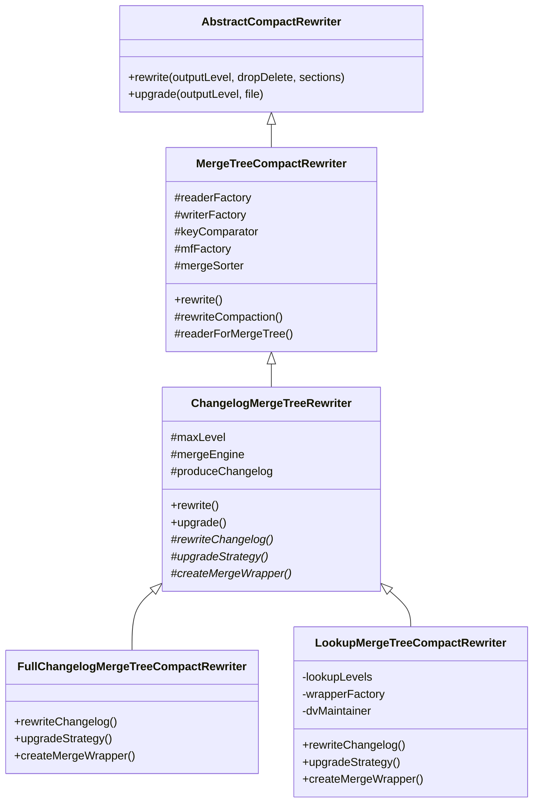

# Apache Paimon Merge 引擎与聚合函数源码深度分析

> **版本**：1.5-SNAPSHOT　**源码模块**：`paimon-core`（`mergetree.compact` 与 `mergetree.compact.aggregate`；枚举与配置在 `paimon-api` 的 `CoreOptions`）　**核对日期**：2026-06

**一句话定位**：Merge Engine 决定"同一主键的多条版本如何合并成一条结果"——它把 LSM Merge-Tree 这一套通用存储引擎，按配置变身为去重表、宽表拼接表、预聚合表或首行去重表，是 Paimon 主键表语义正确性的核心开关。

读完本文你应能回答：① 四种 merge engine（deduplicate / partial-update / aggregation / first-row）各自的合并语义、适用场景与默认值是什么；② 合并到底发生在**读路径**还是 **compaction**，两者结果会不会不一致；③ partial-update 的 sequence-group 为什么能解决多源乱序，没有它会错在哪；④ aggregation 哪些函数支持 retract、`max`/`min` 为什么不支持、`ignore-retract` 与 `remove-record-on-delete` 如何取舍；⑤ first-row 为什么必须配 lookup、`containsHighLevel` 标记在解决什么；⑥ MergeFunction / Wrapper / FieldAggregator 三层为什么用策略 + 装饰器 + SPI，组合爆炸是怎么被避免的；⑦ 对象复用约束（"第三个 add 覆盖第一个"）在代码里意味着什么、踩坑长什么样。

> 阅读约定：本文每个机制按"① 要解决什么问题 → ② 设计原理与取舍 → ③ 关键源码（精选片段 + `路径:行号`）→ ④ 风险/陷阱/边界 → ⑤ 收益与代价"组织。源码行号以本次核对为准；与旧稿不符处用 `（已修正）` 标注。
>
> **交叉引用约定**：LSM/Compaction 基础详见 `01` §3/§8、`23`；DeletionVector 机制详见 `04`、`01` §7.2，本文只讲与 lookup changelog 的协同；**Changelog 产生机制由 `24` 主讲**，本文 §8 只讲 merge engine 视角的四种 producer 语义差异；partial-update 的局部列更新被 `14`（CDC/局部列更新）引用。

---

## 目录

- [1. 快速理解（核心问题 / 概念速查 / 高频陷阱）](#1-快速理解核心问题--概念速查--高频陷阱)
  - [1.1 核心问题：一套 LSM 如何承载四种合并语义](#11-核心问题一套-lsm-如何承载四种合并语义)
  - [1.2 核心概念速查表](#12-核心概念速查表)
  - [1.3 高频生产陷阱](#13-高频生产陷阱)
  - [1.4 合并发生在哪里：读路径 vs compaction](#14-合并发生在哪里读路径-vs-compaction)
- [2. MergeFunction 三层接口体系](#2-mergefunction-三层接口体系)
  - [2.1 三个接口：MergeFunction / Factory / Wrapper](#21-三个接口mergefunction--factory--wrapper)
  - [2.2 对象复用约束（最易踩的坑）](#22-对象复用约束最易踩的坑)
- [3. 四种 MergeEngine 实现](#3-四种-mergeengine-实现)
  - [3.1 Deduplicate 去重引擎](#31-deduplicate-去重引擎)
  - [3.2 PartialUpdate 部分更新引擎](#32-partialupdate-部分更新引擎)
  - [3.3 Aggregation 聚合引擎](#33-aggregation-聚合引擎)
  - [3.4 FirstRow 首行引擎](#34-firstrow-首行引擎)
  - [3.5 四种引擎对比总览](#35-四种引擎对比总览)
- [4. MergeEngine 的选择与创建流程](#4-mergeengine-的选择与创建流程)
- [5. LookupMergeFunction 包装机制](#5-lookupmergefunction-包装机制)
- [6. 内置聚合函数体系](#6-内置聚合函数体系)
  - [6.1 FieldAggregator 抽象基类](#61-fieldaggregator-抽象基类)
  - [6.2 内置聚合函数清单与 retract 支持](#62-内置聚合函数清单与-retract-支持)
  - [6.3 FieldIgnoreRetractAgg 装饰器](#63-fieldignoreretractagg-装饰器让不可逆函数也能容忍回撤)
  - [6.4 SPI 注册与扩展](#64-spi-注册与扩展)
- [7. PartialUpdate Sequence Group 详解](#7-partialupdate-sequence-group-详解)
  - [7.1 问题：全局序列号下的多源乱序覆盖](#71-问题全局序列号下的多源乱序覆盖)
  - [7.2 配置与解析校验](#72-配置与解析校验)
  - [7.3 更新逻辑 updateWithSequenceGroup](#73-更新逻辑-updatewithsequencegroup)
  - [7.4 回撤逻辑 retractWithSequenceGroup 与部分删除](#74-回撤逻辑-retractwithsequencegroup-与部分删除)
  - [7.5 Sequence Group 中的聚合函数](#75-sequence-group-中的聚合函数)
- [8. Changelog 四种 producer（merge engine 视角）](#8-changelog-四种-producermerge-engine-视角)
  - [8.1 NONE / INPUT：不经合并的两端](#81-none--input不经合并的两端)
  - [8.2 FULL_COMPACTION：合并到最高层时产 changelog](#82-full_compaction合并到最高层时产-changelog)
  - [8.3 LOOKUP：涉及 L0 的 compaction 即产 changelog](#83-lookup涉及-l0-的-compaction-即产-changelog)
  - [8.4 四种 producer 对比与 row-deduplicate](#84-四种-producer-对比与-row-deduplicate)
- [9. MergeFunctionWrapper 与 Changelog 生成](#9-mergefunctionwrapper-与-changelog-生成)
  - [9.1 ReducerMergeFunctionWrapper](#91-reducermergefunctionwrapper单条记录直返优化)
  - [9.2 FullChangelogMergeFunctionWrapper](#92-fullchangelogmergefunctionwrapperfull-compaction-产-changelog)
  - [9.3 LookupChangelogMergeFunctionWrapper](#93-lookupchangelogmergefunctionwrapperlookup-产-changelog)
  - [9.4 FirstRowMergeFunctionWrapper](#94-firstrowmergefunctionwrapperfirst-row-专用仅产-insert)
- [10. CompactRewriter 体系](#10-compactrewriter-体系)
- [11. 跨分区更新](#11-跨分区更新)
- [12. SortMergeReader 多路归并](#12-sortmergereader-多路归并)
- [13. 设计决策总结](#13-设计决策总结)

---

## 1. 快速理解（核心问题 / 概念速查 / 高频陷阱）

### 1.1 核心问题：一套 LSM 如何承载四种合并语义

**① 要解决什么问题**

主键表里同一主键会被反复写。在 LSM Merge-Tree 中（详见 `01` §3），同一主键的多个版本散落在不同 Level、不同文件里。读取或 compaction 时，必须把"同 key 的多条 KeyValue"折叠成一条。但"折叠"的语义随业务千差万别：

| 业务场景 | 想要的语义 | merge engine |
|---|---|---|
| CDC 入湖（订单状态流转）| 留最新一条 | `deduplicate`（默认）|
| 多源宽表拼接（画像：基础源+行为源+风控源各更新几列）| 每列取各自最新非 null 值 | `partial-update` |
| 实时指标预聚合（PV 累加、UV bitmap 合并）| 每列按聚合函数累计 | `aggregation` |
| 日志/事件去重（只关心首次出现）| 留第一条，忽略后续 | `first-row` |

如果存储层不支持这些语义，业务就得在计算层用 state 维护，或者每查一次全量重算——延迟和成本都不可接受。

**② 设计原理与取舍：策略 + 装饰 + SPI，避免组合爆炸**

Paimon 把"合并"抽象成 `MergeFunction` 接口（策略模式），四种引擎是四个实现；把"顺带产生 changelog"抽象成 `MergeFunctionWrapper`（装饰器模式），与引擎正交；把聚合函数做成 `FieldAggregator` + Java SPI（开放扩展）。

一句话设计哲学：**合并语义、changelog 产生、聚合算子是三个正交维度，分别用策略 / 装饰 / SPI 解耦，让 N×M×K 的组合只需 N+M+K 个类。** 4 种引擎 × 4 种 changelog producer 若硬编码需 16 个类，现在 4+4 个类加组合即可。

代价是：① 概念多、学习曲线陡（用户要同时理解 merge-engine、sequence-group、changelog-producer 三套配置才能配对）；② 对象在引擎间高频复用以省 GC，带来"引用安全"这一类隐蔽陷阱（见 §2.2）。

**③ 与其他湖格式的定位差异**

Hudi 靠自定义 `Payload`（写 Java）实现非去重语义；Iceberg/Delta 存储层只有去重，partial-update / 预聚合要在计算层做。Paimon 是少数在存储层用配置就能切换四种语义、且支持字段级序列号（sequence-group）的格式——这是它在多源融合、实时数仓预聚合场景的核心竞争力。

### 1.2 核心概念速查表

| 概念 | 一句话定义 | 关键源码 |
|---|---|---|
| **MergeFunction** | 折叠同 key 多版本的接口：`reset` / `add(kv)` / `getResult` / `requireCopy` | `MergeFunction.java:37` |
| **MergeFunctionFactory** | 创建 MergeFunction 的工厂，`create(readType)` 支持列裁剪、`adjustReadType` 声明需补读的列 | `MergeFunctionFactory.java` |
| **MergeFunctionWrapper** | 在 MergeFunction 外再套一层，返回类型可换成 `ChangelogResult`，正交叠加 changelog 生成 | `MergeFunctionWrapper.java` |
| **MergeEngine** | 四种合并语义枚举，`merge-engine` 选择 | `CoreOptions.java:3910`（已修正）|
| **Deduplicate** | 留 sequence 最大的一条 | `DeduplicateMergeFunction.java:32` |
| **PartialUpdate** | 每列取最新非 null，配 sequence-group 做字段级序列控制 | `PartialUpdateMergeFunction.java` |
| **Aggregation** | 每列用一个 `FieldAggregator` 累计 | `AggregateMergeFunction.java:49` |
| **FirstRow** | 留第一条，默认拒绝 DELETE，`requireCopy=true` | `FirstRowMergeFunction.java:32` |
| **FieldAggregator** | 单字段聚合算子基类：`agg` / `retract` / `aggReversed` / `reset` | `FieldAggregator.java:26` |
| **Sequence Group** | 把列分组、每组配独立序列字段，只有该组序列更大才更新该组列 | `PartialUpdateMergeFunction.java:190` |
| **LookupMergeFunction** | lookup compaction 下的包装：只把 L0 + 最低高层记录喂给真正的 MergeFunction | `LookupMergeFunction.java:130` |
| **ChangelogProducer** | none / input / full-compaction / lookup 四种 changelog 产生策略 | `CoreOptions.java:4051`（已修正）|

> **路径修正**：`MergeEngine` / `ChangelogProducer` 枚举、`lookupStrategy()` 都在 **`paimon-api` 的 `CoreOptions`**；旧稿标的行号（3807 / 3948 / 3112）已过时，现为 3910 / 4051 / 3193（已修正）。

### 1.3 高频生产陷阱

**陷阱 1：把 merge-engine 当成 changelog 的保证。** `merge-engine` 决定"数据怎么合"，`changelog-producer` 决定"变更日志怎么产"，两者完全正交。配了 `deduplicate` 不等于下游能拿到准确的 UPDATE_BEFORE/AFTER——那要靠 `changelog-producer=lookup`/`full-compaction`。详见 §8 与 `24`。

**陷阱 2：partial-update 多源用单一全局序列号。** 用一个 `sequence.field` 时，源 B 推一条大序列号会把源 A 后到的小序列号"压制"，导致源 A 的列永远更新不上。必须为每个源配独立 `fields.<seq>.sequence-group`（见 §7.1 的乱序反例）。

**陷阱 3：aggregation 对 `max`/`min` 这类不可逆函数依赖 retract。** `sum`/`product`/`collect` 等能精确回撤（减/除/移除元素），但 `max`/`min`/`first_value` 等**无法从聚合结果还原**，`FieldAggregator.retract` 默认抛 `UnsupportedOperationException`（`FieldAggregator.java:47`）。上游有 DELETE/UPDATE_BEFORE 时，要么用 `fields.<f>.ignore-retract=true`（接受不精确），要么用 `aggregation.remove-record-on-delete=true`（整行删）——两者互斥（`FieldAggregatorFactory` 里 `checkState`）。

**陷阱 4：first-row 用在需要更新的场景。** first-row 只保留首条、忽略后续，且默认**拒绝 DELETE**（`FirstRowMergeFunction.java:56` 直接抛异常）。用它做维表/可更新表会"改不动"。它适合"只关心第一次出现"的去重，且必须配 lookup 才能正确产 INSERT changelog（见 §3.4）。

**陷阱 5：partial-update 给每个字段都显式配 `last_non_null_value`。** 这本就是 partial-update 的默认行为，显式配置反而为每列实例化一个 `FieldAggregator`，白增内存/CPU。只给真正需要聚合（sum 等）的字段配。

**陷阱 6：聚合函数没放进 sequence group。** 除 `last_non_null_value` 外，partial-update 里任何聚合函数都必须落在某个 sequence-group 内，否则 `getAggFuncName` 的 `checkArgument` 直接报错（`PartialUpdateMergeFunction.java:680`）。原因：聚合在乱序下需要序列号保护才语义正确。

**陷阱 7：误以为合并只在 compaction 发生。** 合并同时发生在**读路径**（merge-on-read）和 **compaction**（见 §1.4）。两处用的是同一套 MergeFunction，但 lookup/first-row 的 changelog 只在 compaction 产生；读路径只产生数据结果不产 changelog。

### 1.4 合并发生在哪里：读路径 vs compaction

这是理解全篇的关键。同一套 `MergeFunction` 在两个时机被调用，结果**最终一致**，但触发条件和副产物不同：

| 维度 | 读路径（merge-on-read）| compaction |
|---|---|---|
| 触发 | 每次查询，对扫到的多个 SortedRun 现场归并 | 后台异步/同步，把多层文件合并写回 |
| 谁驱动 | `SortMergeReader` + `ReducerMergeFunctionWrapper`（§12、§9）| `MergeTreeCompactRewriter` 系列（§10）|
| 产出 | 只产合并后的数据行，**不产 changelog** | 可同时产数据文件 + changelog 文件 |
| 副作用 | 无 | lookup 模式生成 changelog、DV 模式生成 deletion vector、文件 upgrade |
| 谁能跳过合并 | 单 SortedRun 命中时走 raw read（详见 `01` §5.4）| `ReducerMergeFunctionWrapper` 单条记录直返 |

要点：**changelog 是 compaction 的副产物**，不是读路径的产物。所以 `changelog-producer=lookup`/`full-compaction` 的延迟，本质受 compaction 频率支配（详见 §8 与 `24`）。first-row / deletion-vector 的"可见性"也因此依赖 compaction——L0 文件在 compaction 前对这两类语义不可见。

---

## 2. MergeFunction 三层接口体系

### 2.1 三个接口：MergeFunction / Factory / Wrapper

**① 要解决什么问题**：让"去重/拼接/聚合/首行"四种算法、"列裁剪"优化、"产 changelog"三件事互不耦合，且新增任一维度不改其余代码。

**② 设计原理**：三个接口各管一件事。

`MergeFunction<T>`（`MergeFunction.java:37`）——核心策略，四个方法：

```java
public interface MergeFunction<T> {
    void reset();           // 换 key 前必须调用，清空上一个 key 的累积状态
    void add(KeyValue kv);  // 按序喂入同一 key 的各版本
    T getResult();          // 取合并结果
    boolean requireCopy();  // 是否需要拷贝输入 kv（见 §2.2）
}
```

泛型 `<T>` 不是花架子：四种 `MergeFunction` 实现都返回 `KeyValue`，但 Wrapper 把 `T` 换成 `ChangelogResult`（数据 + changelog 列表），这正是 changelog 生成与数据合并解耦的支点。

`MergeFunctionFactory<T>`（`MergeFunctionFactory.java`）——`create(@Nullable RowType readType)` 让引擎按"实际读的列"重映射字段索引（列裁剪）；`adjustReadType(RowType)` 让引擎声明"我还需要补读哪些列"。**partial-update 必须靠它把 sequence 字段加回读列**——否则裁剪掉序列字段后无法判断新旧。

`MergeFunctionWrapper<T>`（`MergeFunctionWrapper.java`）——同样是 `reset`/`add`/`getResult`，但 `getResult` 可返回 `@Nullable T`（null 表示这条 key 无输出）。四个实现见 §9。

**③ 收益**：策略 + 工厂 + 装饰三件套让"四引擎 × 四 changelog"组合只需 4+4 个类；列裁剪与语义正确性兼得。**代价**：`reset` 漏调会把上个 key 的状态混进当前 key（有状态聚合器尤甚）；这是接口契约必须遵守的隐性约束。

### 2.2 对象复用约束（最易踩的坑）

**① 问题**：compaction 每秒处理百万级记录，若每条 `add` 都 new 对象，GC 直接拖垮吞吐。Paimon 选择在迭代器层复用 `KeyValue` 与其内部 `InternalRow`。

**② 契约**（`MergeFunction.java:26-33` 的 JavaDoc 原文）：

- **不要把 `KeyValue` / `InternalRow` 引用存进 List**：前两个 add 进来的对象是安全的，但第三个对象的引用可能覆盖第一个。
- **可以安全保存字段级引用**（`BinaryString`、`Decimal` 等）：字段不复用对象。

所以四种引擎的写法都是"把需要的字段值拷进自己的 `GenericRow`"，而非攒 KeyValue 列表。`first-row` 是例外：它要长期持有"第一条"的整行引用，无法只存字段，于是 `requireCopy()` 返回 `true`（`FirstRowMergeFunction.java:76`），由上游对输入做拷贝；其余三种返回 `false`。

**③ 风险/陷阱**：自定义或阅读源码时，看到 `kvList.add(kv)` 这类写法基本是 bug——第三条起会读到错乱数据。判断一个引擎是否需要 `requireCopy=true`，标准就是"它是否需要跨多次 add 持有某条 KeyValue 的整体引用"。

**④ 收益与代价**：显著降低 GC、提升 compaction 吞吐；代价是把"引用生命周期"变成隐性契约，阅读/扩展代码时必须时刻警惕。

---

## 3. 四种 MergeEngine 实现

`merge-engine` 在 `CoreOptions.MergeEngine`（`CoreOptions.java:3910`，已修正）定义为四值枚举：

```java
public enum MergeEngine implements DescribedEnum {
    DEDUPLICATE("deduplicate", "De-duplicate and keep the last row."),
    PARTIAL_UPDATE("partial-update", "Partial update non-null fields."),
    AGGREGATE("aggregation", "Aggregate fields with same primary key."),
    FIRST_ROW("first-row", "De-duplicate and keep the first row.");
}
```

下面逐个走五段式。读完应能一眼判断：给定业务该选哪种、配错会怎样。

### 3.1 Deduplicate 去重引擎

**源码**：`DeduplicateMergeFunction.java:32`

**① 语义**：同 key 多版本里，留 sequence 最大的一条（输入已按 sequence 升序喂入，所以"最后 add 的就是最新")。这是默认 merge engine，对应"CDC 入湖只要最新状态"。

**② 实现极简**——核心就两行：

```java
public void add(KeyValue kv) {
    if (ignoreDelete && kv.valueKind().isRetract()) return; // 配了 ignore-delete 才跳过回撤
    latestKv = kv;                                          // 否则始终覆盖为最新
}
public KeyValue getResult() { return latestKv; }
public boolean requireCopy() { return false; }  // 只持有最后一条引用，无需拷贝
```

注意 `DeduplicateMergeFunction.java:49` 的注释：0.7- 版本即使配了 ignore-delete 也可能把 DELETE 写进数据文件，所以这里仍要兜底判断 `isRetract()`。

输入 `(pk=1,seq=1)→(pk=1,seq=3)→(pk=1,seq=5)`，结果取 seq=5 那条（哪怕它的某些字段是 null——deduplicate 是整行替换，不做字段级保护，这点与 partial-update 截然不同）。

**③ 陷阱**：
- `ignore-delete=true`（`CoreOptions.IGNORE_DELETE`）会吞掉 DELETE，下游永远看不到删除——只在"上游 DELETE 是噪声"时才开。
- deduplicate 整行替换，所以**它无法做局部列更新**；想"后到的 null 不覆盖已有值"必须改用 partial-update。

**④ 收益与代价**：实现最轻、CPU 最省、`requireCopy=false` 无拷贝开销；代价是语义最弱，多源/聚合一概不支持。

### 3.2 PartialUpdate 部分更新引擎

**源码**：`PartialUpdateMergeFunction.java`（关键方法 `add:122` / `updateNonNullFields:177` / `updateWithSequenceGroup:190` / `retractWithSequenceGroup:271`）。本引擎是 §7 的主角，这里讲基本模式，sequence-group 细节见 §7。`14`（局部列更新/CDC）会引用本节。

**① 问题**：多个数据源各自只写宽表的几列（画像：基础源写 name/age、行为源写 tags、风控源写 score），每条输入大量字段是 null。要的是"非 null 才覆盖、null 不抹掉已有值"。

**② 设计**：维护一个 `GenericRow row` 作累加器，逐字段"非 null 覆盖"：

```java
private void updateNonNullFields(KeyValue kv) {
    for (int i = 0; i < getters.length; i++) {
        Object field = getters[i].getFieldOrNull(kv.value());
        if (field != null) {
            row.setField(i, field);  // 仅非 null 覆盖；null 保留旧值
        }
    }
}
```

`(name=Alice,_,_) → (_,age=25,_) → (_,_,city=Beijing)` 合并出 `(Alice,25,Beijing)`。这条"null 即不更新"的语义，和 deduplicate 的整行替换是本质区别。

**③ 关键设计点：删除有三种互斥策略**（构造期 `checkState` 校验，见 §7.2）：

| 策略 | 配置 | 语义 |
|---|---|---|
| 忽略删除 | `ignore-delete=true` | 丢弃所有回撤记录，宽表只增不删 |
| 整行删除 | `partial-update.remove-record-on-delete=true` | 收到 DELETE 删整行（`add:146`）|
| 按源删除 | `partial-update.remove-record-on-sequence-group=<seq>` | 只有指定源的 DELETE 才删整行（见 §7.4）|

为什么要三种：维表拼接通常不希望某个源的删除波及整行（忽略）；CDC 主源的删除应清空整行（整行删）；多主多从场景只允许"权威源"删（按源删）。三者**不能同时启用**——语义会冲突。

**④ 陷阱**：
- **null 无法显式置空**：基本模式下 null 永远当作"不更新"，想把字段真正设回 null 得靠 sequence-group + 序列字段（见 §7.4 普通字段回撤置 null）。
- 多源**必须**配 sequence-group，否则全局序列号会让源间互相压制（§7.1）。
- 字段越多 `add` 越慢（每条都遍历全字段），千列宽表考虑垂直拆分。

**⑤ 收益与代价**：原生支持多源拼接，是 Paimon 相对 Iceberg/Delta 的独特能力；代价是配置复杂、全字段遍历的 CPU 开销。

### 3.3 Aggregation 聚合引擎

**源码**：`AggregateMergeFunction.java:49`，每字段一个 `FieldAggregator`（§6）。

**① 问题**：实时指标想在存储层就把 PV 累加、UV bitmap 求并，而不是每次查询全量重算。

**② 设计**：`add` 对每个字段调用对应聚合器的 `agg`（或回撤时 `retract`）：

```java
public void add(KeyValue kv) {
    latestKv = kv;
    currentDeleteRow = removeRecordOnDelete && kv.valueKind() == RowKind.DELETE;
    if (currentDeleteRow) { row = new GenericRow(...); initRow(row, kv.value()); return; }
    boolean isRetract = kv.valueKind().isRetract();
    for (int i = 0; i < getters.length; i++) {
        Object acc = getters[i].getFieldOrNull(row);
        Object in  = getters[i].getFieldOrNull(kv.value());
        row.setField(i, isRetract ? aggregators[i].retract(acc, in) : aggregators[i].agg(acc, in));
    }
}
```

**字段→聚合函数的选择**（`AggregateMergeFunction.getAggFuncName:179`，已核对）：① sequence 字段 → `last_value`（只覆盖不聚合）；② 主键字段 → `primary-key`（恒取最新）；③ 用户 `fields.<f>.aggregate-function`；④ `fields.default-aggregate-function`；⑤ 都没配 → `last_non_null_value`（最终默认）。

为什么默认 `last_non_null_value` 而非 `last_value`：避免后到的 null 抹掉已聚合的有效值——和 partial-update 的直觉一致。

**③ 陷阱（重点）：retract 支持是分函数的**。`isRetract` 分支会调 `FieldAggregator.retract`，但基类默认抛 `UnsupportedOperationException`（`FieldAggregator.java:47`）。`sum`/`product`/`collect`/`merge_map` 等覆写了 retract（减/除/移除元素），而 `max`/`min`/`first_value`/`rbm*`/`*_sketch` 等**不可逆**，没覆写。所以：

- 上游有 DELETE/UPDATE_BEFORE 且字段聚合函数不支持 retract → 运行时抛异常。
- 解法二选一：`fields.<f>.ignore-retract=true`（接受不精确，回撤被丢弃）或 `aggregation.remove-record-on-delete=true`（DELETE 整行删，`add:84`）。二者互斥。
- 即便支持 retract 的函数也有坑：`product` 回撤是除法，输入为 0 会除零异常（见 §6.2）。

**④ 收益与代价**：把聚合下沉到存储层，查询直接读结果；代价是 retract 语义受限于函数可逆性，是 aggregation 区别于其它引擎最容易出错的点。

### 3.4 FirstRow 首行引擎

**源码**：`FirstRowMergeFunction.java:32`

**① 问题**：日志/事件去重只想保留"第一次出现"，后续重复全部丢弃，并且只在首次触发下游。

**② 设计**：

```java
public void add(KeyValue kv) {
    if (kv.valueKind().isRetract()) {           // 默认拒绝 DELETE/UPDATE_BEFORE
        if (ignoreDelete) return;
        else throw new IllegalArgumentException("First row merge engine can not accept DELETE...");
    }
    if (first == null) this.first = kv;          // 只记第一条
    if (kv.level() > 0) containsHighLevel = true; // 标记：候选里有高层记录
}
public boolean requireCopy() { return true; }    // 跨多次 add 持有 first，必须拷贝
```

两个关键设计：
- **`requireCopy()=true`**：first 要长期持有，受对象复用约束（§2.2），必须拷贝，否则会被后续 add 覆盖。这是四引擎里唯一返回 true 的。
- **`containsHighLevel` 标记**：高层（level>0）记录代表"这个 key 已经持久化存在过"。该标记交给 `FirstRowMergeFunctionWrapper`（§9）判断要不要产 INSERT changelog——若候选里已有高层记录，说明不是首次，不产 changelog。

`(seq=1,level=2) → (seq=3,level=0) → (seq=5,level=0)` 结果取第一条 `seq=1`，且因含 level=2 记录而 `containsHighLevel=true`。

**③ 陷阱**：
- **默认拒绝删除**：直接抛异常，不是静默忽略。要容忍 DELETE 得显式配 `ignore-delete`。
- **必须配 lookup**：first-row 的"是否首次"判断要查更高层是否已存在该 key，所以它强制走 lookup（`LookupStrategy.isFirstRow → needLookup`，§5）。不配 lookup 无法正确产 INSERT changelog，下游会重复处理。
- **不适合可更新表**：只留首条、忽略一切后续更新，用错场景会"改不动"。

**④ 收益与代价**：高效的"仅首次触发"语义（lookup 只需返回 boolean，传输量极小，见 §9）；代价是只读不更、删除受限，场景很专一。

### 3.5 四种引擎对比总览

| 维度 | Deduplicate | PartialUpdate | Aggregation | FirstRow |
|------|-------------|---------------|-------------|----------|
| **配置值** | `deduplicate`（默认）| `partial-update` | `aggregation` | `first-row` |
| **合并语义** | 整行替换为最新 | 逐字段非 null 覆盖 | 逐字段聚合 | 留第一条 |
| **保留哪条** | sequence 最大 | 各字段最新非 null | 累加结果 | sequence 最小（首条）|
| **requireCopy** | false | false | false | **true** |
| **删除处理** | ignore-delete | 三种互斥策略（§3.2）| ignore-retract / 整行删 | 默认抛异常，需 ignore-delete |
| **retract 支持** | 整行替换天然支持 | 序列字段置 null / 聚合字段 retract | **取决于聚合函数可逆性** | 不支持 |
| **Sequence Group** | 不适用 | 支持（§7）| 不适用（用 sequence.field）| 不适用 |
| **是否强制 lookup** | 否 | 否 | 否 | **是** |
| **典型场景** | CDC 入湖 | 多源宽表拼接 | 实时预聚合 | 日志/事件去重 |

一句话选型：**只要最新→deduplicate；多源拼列→partial-update；要累计→aggregation；只要首次→first-row。**

---

## 4. MergeEngine 的选择与创建流程

**① 谁来选**：`PrimaryKeyTableUtils.createMergeFunctionFactory`（`PrimaryKeyTableUtils.java:58`，已核对）读 `merge-engine` 配置，switch 出对应工厂：

```java
switch (mergeEngine) {
    case DEDUPLICATE:     return DeduplicateMergeFunction.factory(conf);
    case PARTIAL_UPDATE:  return PartialUpdateMergeFunction.factory(conf, rowType, primaryKeys);
    case AGGREGATE:       return AggregateMergeFunction.factory(conf, rowType, primaryKeys);
    case FIRST_ROW:       return FirstRowMergeFunction.factory(conf);
}
```

**② 何时再套一层 lookup 包装**：`PrimaryKeyFileStoreTable.java:83-85`——若 `needLookup()`，把工厂包进 `LookupMergeFunction.wrap`：

```java
MergeFunctionFactory<KeyValue> mfFactory = PrimaryKeyTableUtils.createMergeFunctionFactory(tableSchema);
if (options.needLookup()) {
    mfFactory = LookupMergeFunction.wrap(mfFactory, options, keyType, rowType);
}
```

**③ 为什么要包装**：lookup compaction 只合并涉及 L0 的部分层，更高层的历史值要靠 lookup 现查补齐（见 §5）。但 first-row 在 `wrap` 里被显式跳过——它有专门的 wrapper（§3.4 / §5）。

整条链路：`merge-engine` 配置 → 选基础工厂（4 选 1）→ `needLookup()` 决定是否套 `LookupMergeFunction` → 交给 `KeyValueFileStore` 在读路径/compaction 中调用。

---

## 5. LookupMergeFunction 包装机制

**① 要解决什么问题**：标准（full）compaction 会把同 key 的**所有层**一起归并，成本极高。lookup compaction 只合并涉及 L0 的少数层，那"更高层的历史值"从哪来？答案：现场 lookup 查出来补进合并。`LookupMergeFunction` 就是这套"先缓冲候选、再挑出必要的高层记录喂给真正引擎"的包装器。

**② 设计原理**（`LookupMergeFunction.java`，`wrap:130`）：

```java
public void add(KeyValue kv) {
    if (kv.level() == 0) containLevel0 = true;
    candidates.put(kv);                 // 所有候选先进缓冲，不立即合并
}
public KeyValue getResult() {
    mergeFunction.reset();
    KeyValue highLevel = pickHighLevel();   // 选 level 最低的那条高层记录
    // 只把 L0 记录 + 选中的那条高层记录喂给真正的 MergeFunction
    ... if (kv.level() <= 0 || kv == highLevel) mergeFunction.add(kv); ...
    return mergeFunction.getResult();
}
```

**关键决策：`pickHighLevel` 选 level 最低的高层记录**。在 LSM 里 level 越低越新，最低的高层记录就是"上一次 compaction 合出来的最新已确认状态"，用它当历史基准最准确。其余更高层记录因为更旧，可以不参与本轮合并。

**③ FirstRow 的特殊豁免**（`LookupMergeFunction.java:135`）：

```java
if (wrapped.create() instanceof FirstRowMergeFunction) {
    return wrapped;   // first-row 不套 LookupMergeFunction
}
```

first-row 只留首条、不与历史值"合并"，它要的只是"这个 key 在更高层是否已存在"（boolean），由 `FirstRowMergeFunctionWrapper` 单独处理（§9）。所以这里直接返回原工厂。

**④ 候选缓冲防 OOM**：候选用 `KeyValueBuffer.createHybridBuffer`（`LookupMergeFunction.java:52`）——量小走内存 List，超阈值切到磁盘二进制缓冲。否则热点 key 的海量候选会撑爆堆。

**⑤ 何时启用 lookup：LookupStrategy**（`paimon-api/.../lookup/LookupStrategy.java:24`，已核对）：

```java
needLookup = produceChangelog || deletionVector || isFirstRow || forceLookup;
```

四个触发源（`CoreOptions.lookupStrategy()` 在 `CoreOptions.java:3193`，已修正——旧稿标 3112）：

| 触发条件 | 配置 | 为什么需要 lookup |
|---|---|---|
| 产 lookup changelog | `changelog-producer=lookup` | 要查历史值算出 UPDATE_BEFORE |
| deletion vector | `deletion-vectors.enabled=true` | lookup 到旧记录位置后标记删除（见 §8.3 协同）|
| first-row | `merge-engine=first-row` | 查 key 是否已存在以决定是否产 INSERT |
| 强制 | `force-lookup=true` | 显式开启 |

**收益与代价**：lookup 用"现查少量历史"换掉"全层合并"，大幅降低 compaction 成本同时拿到准确 changelog/DV；代价是维护 lookup 索引（内存/IO，见 §8.4 陷阱）。

---

## 6. 内置聚合函数体系

### 6.1 FieldAggregator 抽象基类

**① 角色**：aggregation 引擎（§3.3）和 partial-update 的聚合字段（§7.5）都靠它——每个聚合字段一个 `FieldAggregator` 实例。

**② 接口**（`FieldAggregator.java:26`，已核对）：

```java
public abstract class FieldAggregator implements Serializable {
    public abstract Object agg(Object accumulator, Object inputField);    // 正向聚合
    public Object aggReversed(Object acc, Object in) { return agg(in, acc); } // 反向：默认交换参数
    public void reset() {}                                                 // 有状态聚合器需覆写
    public Object retract(Object acc, Object retractField) {               // 回撤：默认不支持
        throw new UnsupportedOperationException("... does not support retraction ...");
    }
}
```

**③ 三个非显然的方法**：
- **`retract`**：默认抛 `UnsupportedOperationException`（第 47 行）。这就是 §3.3 陷阱的根源——只有覆写了 retract 的函数才能精确回撤。
- **`aggReversed`**：partial-update + sequence-group 下，新记录序列号**小于**旧记录时调用，把"新值当 acc、旧值当 input"。对 `sum` 这类可交换函数无差别；对 `collect` 这类非交换函数有差别（`FieldCollectAgg.java:86` 覆写 `aggReversed` 直接调 `agg`，因为 acc 已去重，省一次去重）。
- **`reset`**：有状态聚合器（`first_value`/`first_non_null_value`）靠它在换 key 时清 `initialized` 标记，由 MergeFunction.reset 级联触发。

### 6.2 内置聚合函数清单与 retract 支持

> SPI 服务文件里注册了 **22** 个工厂（`META-INF/services/org.apache.paimon.factories.Factory`，已核对计数），其中 `first_not_null_value` 是 `first_non_null_value` 的旧名兼容工厂（`FieldFirstNonNullValueAggLegacyFactory`），底层是同一实现，故独立语义为 21 种，外加内部专用的 `primary-key`。

| 标识名 | 实现类 | 类型约束 | retract | 说明 |
|--------|--------|---------|---------|------|
| `sum` | `FieldSumAgg` | 数值 | ✅ 减法 | 累加；retract 是减法 |
| `product` | `FieldProductAgg` | 数值 | ✅ 除法 | 累乘；**retract 除法，除数为 0 会抛异常** |
| `max` | `FieldMaxAgg` | 可比较 | ❌ | 取最大；不可逆 |
| `min` | `FieldMinAgg` | 可比较 | ❌ | 取最小；不可逆 |
| `last_value` | `FieldLastValueAgg` | 任意 | ✅ 置 null | 取最后值（含 null）|
| `last_non_null_value` | `FieldLastNonNullValueAgg` | 任意 | ✅ 条件置 null | 取最后非 null；**partial-update/aggregation 的默认**|
| `first_value` | `FieldFirstValueAgg` | 任意 | ❌ | 取第一个值（**有状态**）|
| `first_non_null_value` | `FieldFirstNonNullValueAgg` | 任意 | ❌ | 取第一个非 null（**有状态**）|
| `listagg` | `FieldListaggAgg` | `VARCHAR` | ❌ | 字符串拼接（可配分隔符/去重）|
| `bool_and` / `bool_or` | `FieldBoolAndAgg`/`FieldBoolOrAgg` | `BOOLEAN` | ❌ | 布尔与/或 |
| `collect` | `FieldCollectAgg` | `ARRAY<T>` | ✅ 移除元素 | 收集成数组（可去重）|
| `merge_map` | `FieldMergeMapAgg` | `MAP<K,V>` | ✅ 按 key 移除 | 合并 Map，同 key 后者覆盖 |
| `merge_map_with_keytime` | `FieldMergeMapWithKeyTimeAgg` | `MAP<K,ROW>` | ❌ | 按时间戳合并，value=null 删 key |
| `nested_update` | `FieldNestedUpdateAgg` | `ARRAY<ROW>` | ✅ 按 key/全匹配 | 嵌套表整行更新 |
| `nested_partial_update` | `FieldNestedPartialUpdateAgg` | `ARRAY<ROW>` | ❌ | 嵌套表非 null 部分更新 |
| `rbm32` / `rbm64` | `FieldRoaringBitmap32Agg`/`64Agg` | `VARBINARY` | ❌ | RoaringBitmap OR 合并 |
| `hll_sketch` / `theta_sketch` | `FieldHllSketchAgg`/`FieldThetaSketchAgg` | `VARBINARY` | ❌ | HLL/Theta sketch union（近似基数）|
| `primary-key` | `FieldPrimaryKeyAgg` | 任意 | — | 内部专用，主键字段恒取最新 |

**核心要点：retract 支持是分函数的，这决定了能否用在有 DELETE 的流上。**

- **可逆**（覆写了 retract）：`sum`/`product`/`last_value`/`last_non_null_value`/`collect`/`merge_map`/`nested_update`。它们能精确回撤。
- **不可逆**（用基类默认 retract，会抛异常）：`max`/`min`/`first_*`/`listagg`/`bool_*`/`rbm*`/`*_sketch` 等。聚合结果丢失了还原所需信息（如 max 减一个值无法还原次大值）。

几个值得记的实现细节：
- `sum.agg` 遵循 SQL NULL 语义——acc 或 in 为 null 时返回非 null 的那个；retract 时若 acc 为 null 而 in 非 null，返回 `negative(in)`（"减一个值"语义）。
- `last_value` vs `last_non_null_value`：前者让 null 覆盖有效值（`agg` 直接返回 in），后者忽略 null 输入（`in==null?acc:in`）。这正是 aggregation 默认选后者的原因——防止 null 抹掉已聚合值。
- `first_value`/`first_non_null_value` 有状态，靠 `initialized` 标记 + `reset()` 工作；这也是它们不支持 retract 的间接原因。
- `nested_update`/`nested_partial_update`：嵌套表（`ARRAY<ROW>`）场景，可配 `nested-key`（按子表主键更新行）；前者整行替换、后者非 null 部分更新。注意防数组无限增长（用 nested-key 去重）。

### 6.3 FieldIgnoreRetractAgg 装饰器：让不可逆函数也能容忍回撤

**① 问题**：上游偶有 DELETE，但字段用的是不可逆函数（如 `max`），又不想整行删。

**② 设计**（`FieldIgnoreRetractAgg.java`，装饰器）：

```java
public Object agg(Object acc, Object in) { return aggregator.agg(acc, in); } // 正向透传
public Object retract(Object acc, Object retractField) { return acc; }       // 回撤直接吞掉
```

配 `fields.<f>.ignore-retract=true` 即给该字段套上这个装饰器（创建逻辑见 §6.4）。回撤被静默丢弃——结果不再精确，但不会抛异常、不会整行删。

**③ 取舍**：正交组合，任意聚合函数 × 是否忽略回撤都能搭配，无需改聚合函数本身。代价是 ignore-retract 与 `aggregation.remove-record-on-delete` 语义冲突，**两者互斥**（§6.4 的 `checkState`）。

### 6.4 SPI 注册与扩展

**① 为什么用 SPI 而非 if-else/Map**：聚合需求因业务而异，内置函数覆盖不全。SPI 让用户**不改 Paimon 源码**就能加自定义聚合：实现 `FieldAggregatorFactory`、在 `META-INF/services` 注册即可（开放-封闭原则）。

**② 接口**（`aggregate/factory/FieldAggregatorFactory.java`）：`create(DataType, CoreOptions, String field)` + 继承自 `Factory` 的 `identifier()`（返回 "sum"、"max" 等唯一名）。22 个工厂与 `CatalogFactory` 等共用同一个 `org.apache.paimon.factories.Factory` 服务文件。

**③ 发现 + 装饰流程**（静态 `FieldAggregatorFactory.create`）：

```java
static FieldAggregator create(DataType fieldType, String fieldName, String aggFuncName, CoreOptions options) {
    FieldAggregatorFactory factory = FactoryUtil.discoverFactory(..., FieldAggregatorFactory.class, aggFuncName);
    if (factory == null) throw new RuntimeException("Use unsupported aggregation: " + aggFuncName);
    boolean removeRecordOnRetract = options.aggregationRemoveRecordOnDelete();
    boolean fieldIgnoreRetract    = options.fieldAggIgnoreRetract(fieldName);
    Preconditions.checkState(!(removeRecordOnRetract && fieldIgnoreRetract), ...); // 二者互斥
    FieldAggregator aggregator = factory.create(fieldType, options, fieldName);
    return fieldIgnoreRetract ? new FieldIgnoreRetractAgg(aggregator) : aggregator; // 按需套装饰器
}
```

要点：① 经 `ServiceLoader` 按 `identifier()` 匹配 `aggFuncName`；② 未知函数名直接抛异常；③ `ignore-retract` 在此处把聚合器包进 `FieldIgnoreRetractAgg`（§6.3）；④ 它与 `remove-record-on-delete` 互斥校验也在这里。

---

## 7. PartialUpdate Sequence Group 详解

> 本节是 partial-update 的核心，`14`（局部列更新）会引用。源码集中在 `PartialUpdateMergeFunction.java`。

### 7.1 问题：全局序列号下的多源乱序覆盖

**① 要解决什么问题**：多源宽表里每个源更新频率/时序不同，且单源内还可能乱序。若全表共用一个序列号，会出现"快源的序列号压制慢源的列"。

用画像表举例（源 A 管 name/age，源 B 管 tags），用**单一全局** `version`：

```
t1 源A {name=Alice, age=25, version=100}
t2 源B {tags=[vip], version=200}
t3 源A {name=Bob, age=26, version=150}   <- 源A的真实较新更新，但 version 150 < 200
```

结果 t3 被判定为"旧"（150 < 200）整体忽略，name 永远停在 Alice——**源 A 的更新被源 B 的序列号压死了**。根因：用一个序列号去比较本应彼此独立的两个源。

**② 解法**：把列分组，每组配**独立**序列字段（`version_a` 管 name/age，`version_b` 管 tags），只有该组自己的序列号更大才更新该组列。这样源 A 的乱序只在 A 组内比较，与 B 组互不干涉。这是 Paimon 相对 Hudi（仅全局序列号）/ Iceberg / Delta 的独特能力。

### 7.2 配置与解析校验

配置格式：`fields.<序列字段>.sequence-group = <受保护列1>,<受保护列2>,...`。一个组可有多个序列字段（按字典序比较），由 `FieldsComparator`（Janino 代码生成，避免反射）实现比较。

解析在 `PartialUpdateMergeFunction.Factory` 构造器（约 `:392` 起），核心校验（行号已重新核对）：

| 校验 | 源码行 | 说明 |
|---|---|---|
| `remove-record-on-delete` 与 `ignore-delete` 互斥 | `:451` checkState | 删除语义冲突 |
| `remove-record-on-sequence-group` 与 `ignore-delete` 互斥 | `:460` checkState | 同上 |
| `remove-record-on-delete` 与 sequence-group 互斥 | `:469` checkState | 整行删与字段级序列冲突 |
| `remove-record-on-sequence-group` 指定的字段必须是序列字段 | `:478` checkState | 配错指向受保护列会报错 |
| 聚合函数（除 `last_non_null_value`）必须在某 sequence-group 内 | `getAggFuncName:680` checkArgument | 见 §7.5 |
| 同一字段不能属于多个 group | 解析期校验 | name 同时归 a、b 组会报错 |

> 旧稿标的 428/454/473/482 行号已过时；现为 451/460/469/478（已修正）。

### 7.3 更新逻辑 updateWithSequenceGroup

**源码**：`PartialUpdateMergeFunction.updateWithSequenceGroup:190`（已核对）。按字段索引从小到大遍历，每字段取出其 `seqComparator` 与 `aggregator`：

```java
if (seqComparator == null) {                 // 无序列组保护
    if (aggregator != null) row.setField(i, aggregator.agg(acc, field)); // 聚合
    else if (field != null) row.setField(i, field);                      // 非 null 覆盖
} else {                                      // 受序列组保护
    if (isEmptySequenceGroup(kv, seqComparator, ...)) continue;          // 序列字段全 null → 跳过整组
    if (seqComparator.compare(kv.value(), row) >= 0) {                   // 新记录序列号 >= 当前
        if (是序列字段本身) { /* 更新该组所有序列字段 */ }
        else row.setField(i, aggregator == null ? field : aggregator.agg(acc, field));
    } else if (aggregator != null) {          // 序列号更小但有聚合器
        row.setField(i, aggregator.aggReversed(acc, field));            // 反向聚合
    }
}
```

两个非显然的设计：

- **`isEmptySequenceGroup`：序列字段全 null 就跳过整组**。原因：序列字段全 null 表示"该源这条没发数据"，若不跳过，会用 null 把这一组已有的有效值抹掉。它用 `boolean[]` 缓存（`:249`）避免对同组重复判定。
- **序列号更小仍调 `aggReversed`**。原因：聚合字段（如 sum）即使乱序到达，累计值也该被算进去——只是参数要反过来（旧值当 acc）。对 `sum` 无差别，对 `collect` 这类非交换函数差别明显（§6.1）。这正是 §3.2 说的"普通字段乱序丢弃、聚合字段乱序仍累计"的分水岭。

### 7.4 回撤逻辑 retractWithSequenceGroup 与部分删除

**源码**：`retractWithSequenceGroup:271`（已核对）。回撤（DELETE/UPDATE_BEFORE）时的字段级行为：

```java
if (seqComparator.compare(kv.value(), row) >= 0) {
    if (是序列字段) {
        if (kv.valueKind() == DELETE && sequenceGroupPartialDelete.contains(field)) {
            currentDeleteRow = true;                 // 该序列字段被指定为"可删整行"→ 整行删
            row = new GenericRow(...); initRow(row, kv.value()); return;
        }
        // 否则只更新序列字段
    } else {
        row.setField(i, aggregator == null ? null            // 普通字段：回撤即置 null
                                           : aggregator.retract(acc, in)); // 聚合字段：回撤
    }
} else if (aggregator != null) {
    row.setField(i, aggregator.retract(acc, in));            // 序列号更小但聚合字段仍回撤
}
```

要点：
- **普通受保护字段的回撤是"置 null"**——这是 partial-update 唯一能把字段真正设回 null 的途径（基本模式下 null 永远当"不更新"，§3.2）。
- **聚合字段的回撤受函数可逆性约束**（§3.3/§6.2）：不可逆函数会抛异常，需 ignore-retract。
- **`sequenceGroupPartialDelete`（按源删整行）**：`partial-update.remove-record-on-sequence-group=<seq>` 指定哪些组的 DELETE 触发整行删。语义：只有"权威源"的删除能清空整行，其他源的 DELETE 只回撤本组列。这正是 §3.2 三种删除策略里最精细的一种。

### 7.5 Sequence Group 中的聚合函数

**源码**：`PartialUpdateMergeFunction.getAggFuncName:657`（已核对，旧稿标 660）。字段→聚合函数的判定，与 aggregation 引擎类似但多一条强制校验：

```java
if (sequenceFields.contains(fieldName)) return null;          // 序列字段：不聚合
if (primaryKeys.contains(fieldName))   return "primary-key";  // 主键：恒取最新
String aggFuncName = options.fieldAggFunc(fieldName);         // 用户配置
if (aggFuncName == null) aggFuncName = options.fieldsDefaultFunc();
if (aggFuncName != null) {
    checkArgument(                                            // 关键校验（:680）
        aggFuncName.equals("last_non_null_value")
            || fieldsProtectedBySequenceGroup.contains(fieldName),
        "Must use sequence group for aggregation functions...");
}
```

**为什么聚合必须在 sequence group 内（`last_non_null_value` 除外）**：聚合在乱序下要靠序列号决定 `agg` 还是 `aggReversed`（§7.3），没有序列号保护就无法判断顺序，结果不确定。而 `last_non_null_value` 本就是 partial-update 的默认语义、不依赖序列排序，故豁免。

典型组合配置：

```sql
WITH (
  'merge-engine' = 'partial-update',
  'fields.version_a.sequence-group' = 'name,address',
  'fields.version_b.sequence-group' = 'age,total_amount',
  'fields.total_amount.aggregate-function' = 'sum',                       -- 在 b 组保护下做 SUM
  'partial-update.remove-record-on-sequence-group' = 'version_a'          -- 只有 a 源能删整行
)
```

**风险/陷阱**：① 组过多 → 每组都建 `FieldsComparator`+`FieldAggregator`，内存/CPU 上升，按业务合理分组；② 大字段放进受序列保护组，每次比较都读它影响性能；③ 聚合 + 乱序会触发 `aggReversed` 额外计算。**收益**：多源乱序下字段级准确性，是其它湖格式做不到的。

---

## 8. Changelog 四种 producer（merge engine 视角）

> **Changelog 产生机制由 `24` 主讲**。本节只从 merge engine 视角讲清"四种 producer 的语义差异、与哪种引擎搭配、谁产 changelog"；触发时机/全量压缩细节请看 `24`、`01` §8.6。

**核心问题**：下游要增量消费变更（INSERT/UPDATE_BEFORE/UPDATE_AFTER/DELETE 四种 RowKind），而不是每次全量扫描。Paimon 用 `changelog-producer` 控制如何产生这套 changelog。

`ChangelogProducer` 枚举（`CoreOptions.java:4051`，已修正——旧稿标 3948）：

```java
public enum ChangelogProducer {
    NONE("none", ...), INPUT("input", ...),
    FULL_COMPACTION("full-compaction", ...), LOOKUP("lookup", ...);
}
```

**与 merge engine 的关系（本篇重点）**：changelog 的"准确性"取决于它记录的是**原始输入**还是**合并后状态**——这正是 merge engine 介入的地方：

- **NONE / INPUT 不经过合并**：NONE 不产 changelog；INPUT 在 flush 时把"原始输入行"直接双写（`MergeTreeWriter` 处理，不走 compaction 的 MergeFunction）。所以 INPUT 只对 deduplicate 准确——partial-update/aggregation 的原始输入（部分列、增量值）≠ 最终状态，下游会拿到错的 changelog。
- **FULL_COMPACTION / LOOKUP 经过合并**：在 compaction 里用 `MergeFunctionWrapper`（§9）把合并后的"前后状态"算成 changelog，因此对所有四种引擎都准确。

### 8.1 NONE / INPUT：不经合并的两端

- **NONE（默认）**：不产 changelog 文件，流读只能消费快照间 delta。最省，适合批查询/数仓分层、下游不需要精确 CDC 的场景。
- **INPUT**：flush 时双写原始输入到 changelog 文件，延迟最低（不等 compaction）。**只对 deduplicate 准确**——这是它最大的限制。适合 MySQL binlog 直接入湖这类"输入即最终态"的场景。

### 8.2 FULL_COMPACTION：合并到最高层时产 changelog

**源码**：`FullChangelogMergeTreeCompactRewriter.java`，仅当输出到最高层才产：

```java
protected boolean rewriteChangelog(int outputLevel, boolean dropDelete, ...) {
    boolean changelog = outputLevel == maxLevel;
    if (changelog) Preconditions.checkArgument(dropDelete, ...); // 全量压缩必 drop delete
    return changelog;
}
```

用 `FullChangelogMergeFunctionWrapper`（§9.2）以"最高层旧记录 vs 合并新结果"算 changelog。对所有引擎准确，计算成本远低于 lookup；代价是 changelog 只在 full compaction 时产生，延迟受全量压缩频率支配（可能小时级，触发机制见 `24`、`01` §8.2 的 EarlyFullCompaction）。适合准实时报表。

### 8.3 LOOKUP：涉及 L0 的 compaction 即产 changelog

**源码**：`LookupMergeTreeCompactRewriter.java`，条件是 `outputLevel>0 且 sections 含 L0`（`rewriteLookupChangelog`）。

由 `LookupChangelogMergeFunctionWrapper`（§9.3）算 changelog：拿高层记录或 lookup 结果当 BEFORE、合并结果当 AFTER，按 BEFORE/AFTER 的有无与是否相等产 INSERT / DELETE / UPDATE_BEFORE+AFTER。因为每次涉及 L0 的 compaction（频率远高于 full compaction）都会产，所以延迟低、对所有引擎准确——这是 Paimon 流式场景推荐模式，也是其相对其它湖格式的独特能力。代价是要维护 lookup 索引（内存/IO）。

**与 DeletionVector 协同**（详见 `04`）：同时开 DV + lookup changelog 时，lookup 到旧记录后除用于 changelog 对比，还会 `deletionVectorsMaintainer.notifyNewDeletion()` 把旧记录物理位置标记为删。

### 8.4 四种 producer 对比与 row-deduplicate

| 维度 | NONE | INPUT | FULL_COMPACTION | LOOKUP |
|---|---|---|---|---|
| changelog 来源 | 无 | 原始输入双写 | full compaction 时计算 | 涉及 L0 的 compaction lookup 计算 |
| 是否经合并 | — | 否 | 是 | 是 |
| 延迟 | — | 最低（flush）| 高（依赖全量压缩）| 低（增量压缩）|
| 准确性 | — | **仅 deduplicate** | 所有引擎 | 所有引擎 |
| 额外开销 | 无 | 双写存储 | 全量压缩计算 | lookup 索引内存/IO |
| 适合引擎 | 所有 | deduplicate | 所有 | 所有（推荐）|
| 配置值 | `none`（默认）| `input` | `full-compaction` | `lookup` |

**row-deduplicate**（`changelog-producer.row-deduplicate`，`CoreOptions.java:922`）：合并前后值相等时不产 UPDATE_BEFORE/AFTER，靠 `RecordEqualiser`（Janino 代码生成）比较。可配 `changelog-producer.row-deduplicate-ignore-fields`（`CoreOptions.java:929`）排除大字段（如 JSON）以省比较开销。仅 full-compaction / lookup 适用。

**选型一句话**：批查询→none；deduplicate + binlog 直入且要极低延迟→input；准实时报表能容忍延迟→full-compaction；流式且要准确低延迟→lookup（默认推荐）。

---

## 9. MergeFunctionWrapper 与 Changelog 生成

**Wrapper 是 §8 四种 producer 的实现机制**：它包在 MergeFunction 外、把返回类型从 `KeyValue` 换成 `ChangelogResult`（数据 + changelog 列表），从而在合并的同时算出 changelog。四个实现各对应一种场景——这就是策略 × 装饰正交解耦的落地（§2.1）。

### 9.1 ReducerMergeFunctionWrapper：单条记录直返优化

**源码**：`ReducerMergeFunctionWrapper.java`。它不产 changelog，是**读路径和普通 compaction**（none 模式）的默认 wrapper。

```java
public void add(KeyValue kv) {
    if (initialKv == null) initialKv = kv;          // 第一条只暂存，不进 MergeFunction
    else { if (!isInitialized) { merge(initialKv); isInitialized = true; } merge(kv); }
}
public KeyValue getResult() {
    return isInitialized ? mergeFunction.getResult() : initialKv;  // 只有一条时直返，跳过合并
}
```

**为什么这个优化值钱**：LSM 中大量 key 在单次合并里只来自一个 SortedRun（只出现一次），跳过 `reset/add/getResult` 整条调用链能显著省方法调用和对象创建。`MergeTreeCompactRewriter.rewriteCompaction` 默认用它。

### 9.2 FullChangelogMergeFunctionWrapper：full-compaction 产 changelog

**源码**：`FullChangelogMergeFunctionWrapper.java`，配合 §8.2。以 `topLevelKv`（最高层记录 = 上次 full compaction 结果）当"旧值"，合并结果当"新值"算 changelog：

```java
if (topLevelKv == null) {                        // 无历史
    if (merged.isAdd()) addChangelog(INSERT, merged);
} else if (!merged.isAdd()) {                     // 有历史 + 结果是删
    addChangelog(DELETE, topLevelKv);
} else if (!valueEqualiser.equals(topLevelKv.value(), merged.value())) { // 有历史 + 值变
    addChangelog(UPDATE_BEFORE, topLevelKv);
    addChangelog(UPDATE_AFTER, merged);
}
return reusedResult.setResultIfNotRetract(merged);
```

两个要点：① **只有 maxLevel 的记录算"旧值"**——其它层是中间态不算；② **`setResultIfNotRetract`**：full compaction 必 dropDelete，但 MergeFunction 可能返回 DELETE，此方法确保 DELETE 不作为数据输出（只当 changelog 参考）。

### 9.3 LookupChangelogMergeFunctionWrapper：lookup 产 changelog

**源码**：`LookupChangelogMergeFunctionWrapper.java`，配合 §8.3。它包的是 `LookupMergeFunction`（§5）：

```java
public ChangelogResult getResult() {
    KeyValue highLevel = mergeFunction.pickHighLevel();      // 先看候选里有无高层记录
    if (highLevel == null) {                                 // 没有就 lookup
        T lookupResult = lookup.apply(mergeFunction.key());
        if (lookupResult != null) {
            if (lookupStrategy.deletionVector)               // DV 模式：标记旧记录位置为删
                deletionVectorsMaintainer.notifyNewDeletion(fileName, rowPosition);
            highLevel = extractKeyValue(lookupResult);
            mergeFunction.insertInto(highLevel, comparator); // 插回候选参与合并
        }
    }
    KeyValue result = mergeFunction.getResult();
    if (containLevel0 && lookupStrategy.produceChangelog)    // 仅含 L0 且要 changelog 才产
        setChangelog(highLevel, result);                     // before=highLevel, after=result
    return reusedResult.setResult(result);
}
```

`setChangelog(before, after)` 按 before/after 的 isAdd 与值是否相等产 INSERT / DELETE / UPDATE_BEFORE+AFTER（逻辑与 §9.2 同构）。

两个要点：① **lookup 与 DV 复用同一次查询**——查到旧记录既用于 changelog 对比，又标记其物理位置删除（§8.3 协同）；② lookup 回来的记录要按序列号插回候选（`createSequenceComparator`：先比用户序列字段、再比系统 sequenceNumber），保证合并顺序正确。

### 9.4 FirstRowMergeFunctionWrapper：first-row 专用，仅产 INSERT

**源码**：`FirstRowMergeFunctionWrapper.java`，配合 §3.4。

```java
public ChangelogResult getResult() {
    KeyValue result = mergeFunction.getResult();
    if (mergeFunction.containsHighLevel)          // 候选含高层 → key 已存在 → 不产 changelog
        return reusedResult.setResult(result);
    if (contains.test(result.key()))              // lookup 发现更高层已有 → 不产、且不输出
        return reusedResult;                       // 空结果
    return reusedResult.setResult(result).addChangelog(result); // 全新 key → 产 INSERT
}
```

**关键设计：`contains` 返回 `Boolean` 而非 `KeyValue`**。first-row 只关心"这个 key 在更高层是否已存在"，不关心值，所以 lookup 只传 boolean——数据传输量比 §9.3 的 KeyValue lookup 小得多。这呼应 §5 中"first-row 不套 LookupMergeFunction、走专用 wrapper"的设计。

---

## 10. CompactRewriter 体系

**定位**：CompactRewriter 是 compaction 时"读多个 SortedRun → 用 §9 的 Wrapper 合并 → 写数据文件 +（可选）changelog 文件"的执行器。它用**模板方法模式**把"骨架流程相同、判断条件不同"的 full/lookup changelog 统一起来——这就是 §8 的四种 producer 在 compaction 端的落地。

### 10.1 继承层次



### 10.2 ChangelogMergeTreeRewriter

**源码路径**: `paimon-core/.../compact/ChangelogMergeTreeRewriter.java`

模板方法模式，定义了 Compaction + Changelog 的骨架流程:

```java
@Override
public CompactResult rewrite(int outputLevel, boolean dropDelete, List<List<SortedRun>> sections) {
    if (rewriteChangelog(outputLevel, dropDelete, sections)) {
        return rewriteOrProduceChangelog(outputLevel, sections, dropDelete, true);
    } else {
        return rewriteCompaction(outputLevel, dropDelete, sections);
    }
}
```

`rewriteOrProduceChangelog` 的核心流程:
```java
private CompactResult rewriteOrProduceChangelog(...) {
    iterator = readerForMergeTree(sections, createMergeWrapper(outputLevel)).toCloseableIterator();
    compactFileWriter = writerFactory.createRollingMergeTreeFileWriter(outputLevel, FileSource.COMPACT);
    changelogFileWriter = writerFactory.createRollingChangelogFileWriter(outputLevel);

    while (iterator.hasNext()) {
        ChangelogResult result = iterator.next();
        // 数据文件写入
        if (compactFileWriter != null && result.result() != null && (!dropDelete || result.result().isAdd())) {
            compactFileWriter.write(result.result());
        }
        // changelog 文件写入
        if (produceChangelog) {
            for (KeyValue kv : result.changelogs()) {
                changelogFileWriter.write(kv);
            }
        }
    }
    return new CompactResult(before, after, changelogFiles);
}
```

**三个抽象方法由子类实现**:
- `rewriteChangelog()`: 判断当前 Compaction 是否需要产生 changelog
- `upgradeStrategy()`: 判断 Level 提升时的策略
- `createMergeWrapper()`: 创建对应的 MergeFunctionWrapper

**UpgradeStrategy 枚举**:
```java
protected enum UpgradeStrategy {
    NO_CHANGELOG_NO_REWRITE(false, false),     // 直接升级，不重写不产生changelog
    CHANGELOG_NO_REWRITE(true, false),          // 产生changelog但不重写文件
    CHANGELOG_WITH_REWRITE(true, true);         // 产生changelog并重写文件
}
```

### 10.3 FullChangelogMergeTreeCompactRewriter

**源码路径**: `paimon-core/.../compact/FullChangelogMergeTreeCompactRewriter.java`

简单直接的实现:
```java
protected boolean rewriteChangelog(...) { return outputLevel == maxLevel; }
protected UpgradeStrategy upgradeStrategy(int outputLevel, DataFileMeta file) {
    return outputLevel == maxLevel ? CHANGELOG_NO_REWRITE : NO_CHANGELOG_NO_REWRITE;
}
protected MergeFunctionWrapper<ChangelogResult> createMergeWrapper(int outputLevel) {
    return new FullChangelogMergeFunctionWrapper(mfFactory.create(), maxLevel, valueEqualiser);
}
```

### 10.4 LookupMergeTreeCompactRewriter

**源码路径**: `paimon-core/.../compact/LookupMergeTreeCompactRewriter.java`

升级策略比 Full Compaction 更复杂:

```java
@Override
protected UpgradeStrategy upgradeStrategy(int outputLevel, DataFileMeta file) {
    if (file.level() != 0) return NO_CHANGELOG_NO_REWRITE;

    // Level-0 文件格式与目标层不同 -> 必须重写
    if (!level2FileFormat.apply(file.level()).equals(level2FileFormat.apply(outputLevel)))
        return CHANGELOG_WITH_REWRITE;

    // DV 模式下有删除行 -> 必须重写(drop delete)
    if (dvMaintainer != null && file.deleteRowCount().map(cnt -> cnt > 0).orElse(true))
        return CHANGELOG_WITH_REWRITE;

    // 输出到最高层 -> changelog 但不重写
    if (outputLevel == maxLevel) return CHANGELOG_NO_REWRITE;

    // Deduplicate 无序列字段 -> changelog 但不重写
    if (mergeEngine == MergeEngine.DEDUPLICATE && noSequenceField)
        return CHANGELOG_NO_REWRITE;

    // 其他引擎 -> 必须重写(因为 lookup 可能改变合并结果)
    return CHANGELOG_WITH_REWRITE;
}
```

**为什么 Deduplicate + 无序列字段可以不重写?** Deduplicate 只保留最新记录，如果没有用户定义的序列字段，则按系统 sequence number 排序。Level 升级不会改变"最新"的判定结果，因此不需要重新执行合并计算。

**与 DeletionVector 的集成**:
```java
@Override
protected void notifyRewriteCompactBefore(List<DataFileMeta> files) {
    if (dvMaintainer != null) {
        files.forEach(file -> dvMaintainer.removeDeletionVectorOf(file.fileName()));
    }
}

@Override
protected List<DataFileMeta> notifyRewriteCompactAfter(List<DataFileMeta> files) {
    if (remoteLookupFileManager != null) {
        // 为新文件生成远程 lookup 文件
        return files.stream().map(f -> remoteLookupFileManager.genRemoteLookupFile(f)).collect(...);
    }
    return files;
}
```

**MergeFunctionWrapperFactory 体系**: LookupMergeTreeCompactRewriter 内部定义了两个 Factory:

1. **`LookupMergeFunctionWrapperFactory`**: 用于 Deduplicate/PartialUpdate/Aggregation 引擎
   - 创建 `LookupChangelogMergeFunctionWrapper`
   - lookup 返回 `KeyValue` 或 `PositionedKeyValue`(带文件位置)

2. **`FirstRowMergeFunctionWrapperFactory`**: 专用于 FirstRow 引擎
   - 创建 `FirstRowMergeFunctionWrapper`
   - lookup 仅返回 `Boolean`(key 是否存在)

**收益与代价**：模板方法让新增 changelog 模式只需实现 `rewriteChangelog`/`upgradeStrategy`/`createMergeWrapper` 三个钩子，避免复制"读-合并-写"骨架；upgrade 策略把"能只改 level 就不重写文件"的优化（如 deduplicate 无序列字段、输出到 maxLevel）做到了细粒度，省下大量 compaction IO。代价是 lookup 路径要额外维护 lookupLevels / dvMaintainer / remoteLookupFileManager，复杂度明显高于 full。

---

## 11. 跨分区更新

### 11.1 判定条件

**源码路径**: `paimon-api/.../schema/TableSchema.java` (第 200 行)

```java
public boolean crossPartitionUpdate() {
    if (primaryKeys.isEmpty() || partitionKeys.isEmpty()) {
        return false;
    }
    return notContainsAll(primaryKeys, partitionKeys);
    // 当主键不完全包含分区键时，同一主键可能出现在不同分区
}
```

**为什么这意味着跨分区更新?** 如果主键包含所有分区键，则相同主键的记录一定在同一分区内。反之，相同主键的记录可能因为分区字段值不同而分布在不同分区中。当记录的分区字段值变化时(如用户搬家导致城市字段变化)，需要先删除旧分区中的记录，再在新分区中插入。

**对 BucketMode 的影响** (源码路径: `KeyValueFileStore.java` 第 97 行):
```java
if (crossPartitionUpdate) {
    return BucketMode.KEY_DYNAMIC;  // 跨分区更新使用 KEY_DYNAMIC 模式
} else {
    return BucketMode.HASH_DYNAMIC; // 普通动态分桶
}
```

### 11.2 GlobalIndexAssigner 机制

> 跨分区更新与 BucketMode（KEY_DYNAMIC）的关系详见 `01` §10.3、CDC 集成详见 `14`；本节聚焦它对 merge 语义的影响。

**源码路径**: `paimon-core/.../crosspartition/GlobalIndexAssigner.java`

核心职责: 为跨分区更新的记录分配正确的 bucket，并生成 UPDATE_BEFORE 记录。

```
全局索引 (基于 RocksDB):
   primary_key --> (partition, bucket)

处理流程:
1. 新记录到来，提取主键
2. 查询全局索引: 此主键之前在哪个 (partition, bucket)?
3. 如果之前存在且分区变化:
   a. 生成 DELETE 记录写入旧 (partition, bucket)
   b. 更新索引指向新 (partition, bucket)
   c. 生成 INSERT 记录写入新 (partition, bucket)
4. 如果之前存在且分区未变化:
   a. 直接写入原 (partition, bucket)
5. 如果之前不存在:
   a. 在索引中注册新 (partition, bucket)
   b. 生成 INSERT 记录写入新 (partition, bucket)
```

**为什么使用 RocksDB 而非内存 Map?** 全局索引可能非常大(全表所有主键的映射)，内存放不下。RocksDB 提供了磁盘 + 缓存的混合存储，支持大规模索引。

**配置参数**:
- `cross-partition-upsert.index-ttl`: 索引条目的过期时间，防止索引无限增长（`CoreOptions.java:1824`，已修正）
- `cross-partition-upsert.bootstrap-parallelism`: 启动时初始化索引的并行度（`CoreOptions.java:1833`，已修正）

**Schema 校验约束**（`SchemaValidation.java`）：跨分区更新场景不能使用 `sequence.field`——全局索引无法保证不同分区间的序列号有序性。这也呼应 §7：跨分区的乱序问题靠全局索引而非 sequence-group 解决。

**好处**: 使 Paimon 能支持分区变更（如用户从城市 A 搬到城市 B）等业务场景，这是许多其他数据湖格式不支持的能力。代价是需要维护额外的全局索引，启动时需要 bootstrap（从已有数据构建索引），大表首次启动有明显延迟。

---

## 12. SortMergeReader 多路归并

> 多路归并是 merge engine 在**读路径和 compaction**的共同前置（§1.4）：它把 N 个有序 SortedRun 按 key 归并成单流，再逐 key 喂给 MergeFunction(Wrapper)。LSM/Compaction 基础详见 `01` §5；这里只讲归并算法本身。

**① 要解决什么问题**：compaction/读取常涉及十几到几十个有序文件（L0 多个 + 高层各一），需按 key 有序地多路归并，且不能一次性把所有数据读进内存（会 OOM）。

**② 两种实现，按 `sort-engine` 选**（`SortMergeReader.createSortMergeReader`）：

| 维度 | MinHeap | LoserTree（默认）|
|---|---|---|
| 数据结构 | `PriorityQueue`（对象引用堆）| 败者树（连续数组）|
| 单次 pop 比较 | O(log n) | O(log n)，但比较次数更少、更稳定 |
| Cache 友好性 | 较差（指针跳转）| 较好（数组连续）|
| batch | 多 batch，可渐进释放内存 | 单 batch，一次处理完 |
| 比较器方向 | `compare(e1, e2)` | **`compare(e2, e1)`（反向）** |

默认 `LOSER_TREE`（`CoreOptions.SORT_ENGINE` 默认值，`CoreOptions.java:603`，已核对）。原因：败者树数组结构对现代 CPU cache 更友好，多路归并是 compaction 关键路径，比较更省。

**③ 排序键三段式**（MinHeap 比较器 `SortMergeReaderWithMinHeap.java:56`）：先按**用户 key** → 再按**用户定义序列字段**（若有）→ 最后按**系统 sequenceNumber**。这保证同 key 的版本按时间有序进入 MergeFunction，合并语义才成立。

**④ 防 OOM：MergeSorter**（`mergetree/MergeSorter.java`）在 SortMergeReader 之上加 spill——参与合并的数据超内存阈值时先落磁盘临时排序文件再归并，避免大规模 compaction OOM。

**⑤ 风险/陷阱**：① 归并路数越多峰值内存/比较越多，靠 compaction 策略（`num-sorted-run.*`，详见 `01` §1.3 陷阱 7）控制；② LoserTree 比较器方向是反的（`compare(e2,e1)`），自定义时极易写反；③ key 是复合主键时每次比较多字段，用代码生成比较器避免反射。

### 12.1 MinHeap 实现

**源码路径**: `paimon-core/.../compact/SortMergeReaderWithMinHeap.java`

使用 `PriorityQueue` (最小堆) 进行多路归并:

```java
// 堆中元素的比较规则 (第 56 行):
(e1, e2) -> {
    int result = userKeyComparator.compare(e1.kv.key(), e2.kv.key());
    if (result != 0) return result;
    if (userDefinedSeqComparator != null) {
        result = userDefinedSeqComparator.compare(e1.kv.value(), e2.kv.value());
        if (result != 0) return result;
    }
    return Long.compare(e1.kv.sequenceNumber(), e2.kv.sequenceNumber());
}
```

**排序规则**: 先按用户 key -> 再按用户定义序列号 -> 最后按系统 sequence number。这保证了相同 key 的记录按时间顺序排列，MergeFunction 可以按序处理。

**批处理机制**: MinHeap 实现将读取分为多个 batch。核心在 `SortMergeIterator.nextImpl()`:

```java
// 将之前 poll 出的元素放回或标记为待重新获取
for (Element element : polled) {
    if (element.update()) {     // 尝试获取下一条记录
        minHeap.offer(element); // 还有数据，放回堆
    } else {
        element.iterator.releaseBatch(); // batch 耗尽，释放资源
        nextBatchReaders.add(element.reader); // 等待下一轮 readBatch
    }
}
if (!nextBatchReaders.isEmpty()) {
    return false;  // 有 reader 需要重新获取 batch，结束当前迭代
}

// 从堆顶取出所有相同 key 的元素
mergeFunctionWrapper.reset();
InternalRow key = minHeap.peek().kv.key();
while (!minHeap.isEmpty() && userKeyComparator.compare(key, minHeap.peek().kv.key()) == 0) {
    Element element = minHeap.poll();
    mergeFunctionWrapper.add(element.kv);
    polled.add(element);
}
```

### 12.2 LoserTree 实现

**源码路径**: `paimon-core/.../compact/SortMergeReaderWithLoserTree.java`

使用败者树(Loser Tree)进行多路归并:

```java
// 注意比较器方向是反的 (e2, e1)，因为败者树内部需要 "倒序" 比较
this.loserTree = new LoserTree<>(
    readers,
    (e1, e2) -> userKeyComparator.compare(e2.key(), e1.key()),
    createSequenceComparator(userDefinedSeqComparator)
);
```

**与 MinHeap 的关键区别**: LoserTree 只产生一个 batch，所有数据在一次迭代中完成:

```java
/** Compared with heapsort, LoserTree will only produce one batch. */
@Nullable
@Override
public RecordIterator<T> readBatch() throws IOException {
    loserTree.initializeIfNeeded();
    return loserTree.peekWinner() == null ? null : new SortMergeIterator();
}
```

LoserTree 的 SortMergeIterator 合并逻辑:
```java
@Nullable
@Override
public T next() throws IOException {
    while (true) {
        loserTree.adjustForNextLoop();
        KeyValue winner = loserTree.popWinner();
        if (winner == null) return null;

        mergeFunctionWrapper.reset();
        mergeFunctionWrapper.add(winner);

        // 继续 pop 所有相同 key 的 winner
        while (loserTree.peekWinner() != null) {
            mergeFunctionWrapper.add(loserTree.popWinner());
        }
        T result = mergeFunctionWrapper.getResult();
        if (result != null) return result;
    }
}
```

### 12.3 工厂入口

`SortMergeReader.createSortMergeReader`（`SortMergeReader.java`）按 `sort-engine` 二选一：

```java
switch (sortEngine) {
    case MIN_HEAP:   return new SortMergeReaderWithMinHeap<>(...);
    case LOSER_TREE: return new SortMergeReaderWithLoserTree<>(...);
}
```

两者算法复杂度同为 O(log n)/pop，选型差异（cache 友好性、batch 策略、默认值）见 §12 开头对比表。MergeSorter 的 spill 角色见 §12 第④点。

---

## 13. 设计决策总结

| 决策点 | 选择 | 取舍 / 代价 | 收益 |
|---|---|---|---|
| 合并语义如何解耦 | MergeFunction 策略模式 + MergeFunctionWrapper 装饰器模式 | 概念多、学习曲线陡 | 4 引擎 × 4 changelog 组合只需 4+4 个类，而非 16 个 |
| 高吞吐下的 GC | MergeFunction 内部复用 `KeyValue`/`GenericRow` | "引用安全"成隐性契约，第三个 add 覆盖第一个（§2.2）| 显著降 GC、提 compaction 吞吐 |
| 聚合算子扩展 | `FieldAggregator` + Java SPI 注册 | 多一层工厂发现 | 用户加 JAR 即扩展自定义聚合，不改源码（OCP）|
| 多源乱序 | partial-update 的字段级 sequence-group | 配置复杂、每组建比较器/聚合器 | 每源独立序列控制各自列，业界独有能力 |
| retract 是否精确 | 分函数实现（sum/collect 可逆；max/min 不可逆抛异常）+ ignore-retract 装饰器 | 不可逆函数遇 DELETE 要么不精确要么整行删 | 可逆函数精确回撤；不可逆函数可显式降级 |
| changelog 延迟 vs 成本 | none / input / full-compaction / lookup 四档 | 配错引擎×producer 会得到错的 changelog（input 仅 dedup 准）| 从批到流全覆盖，lookup 兼顾低延迟与准确 |
| 多路归并算法 | 默认 LoserTree（可切 MinHeap）| LoserTree 单 batch 内存占用偏高 | 数组结构 cache 友好，compaction 关键路径更省 |
| 跨分区 upsert | RocksDB 全局索引 + GlobalIndexAssigner | 维护额外索引、启动需 bootstrap | 支持分区变更（用户搬家改城市分区）等其它格式不支持的场景 |
| compaction + changelog 复用 | `ChangelogMergeTreeRewriter` 模板方法 | lookup 路径要额外维护 lookupLevels/dvMaintainer | 新增 changelog 模式只实现三个钩子，骨架复用 |

**贯穿全篇的一条主线**：merge engine 把"同 key 多版本如何折叠"做成可插拔策略，changelog 把"折叠的前后状态如何记录"做成正交装饰，聚合把"单字段如何累计"做成可扩展 SPI——三层正交解耦，是 Paimon 能用一套 LSM 同时承载去重/拼接/聚合/首行四种语义的根本原因。
