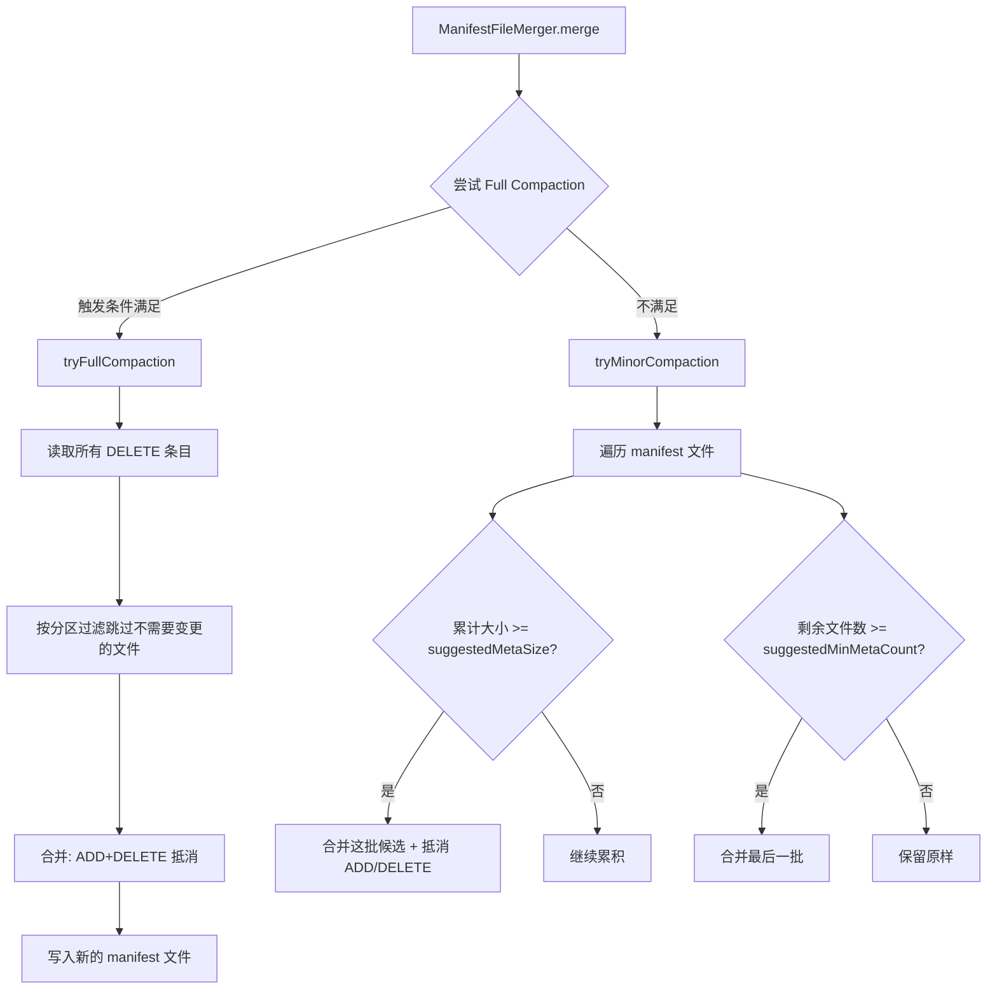
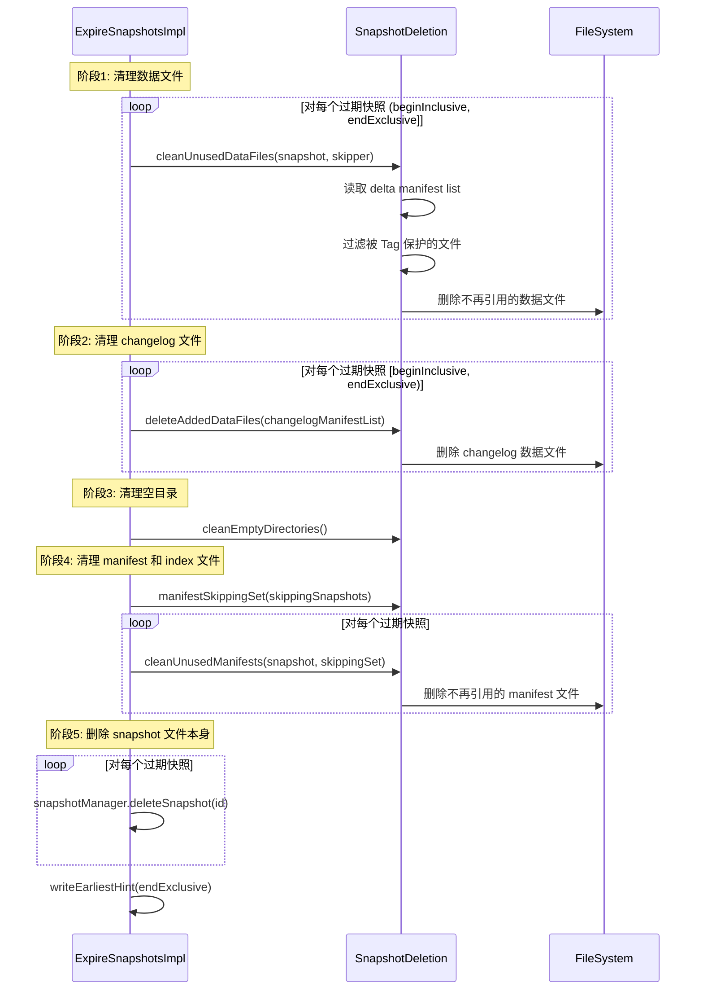
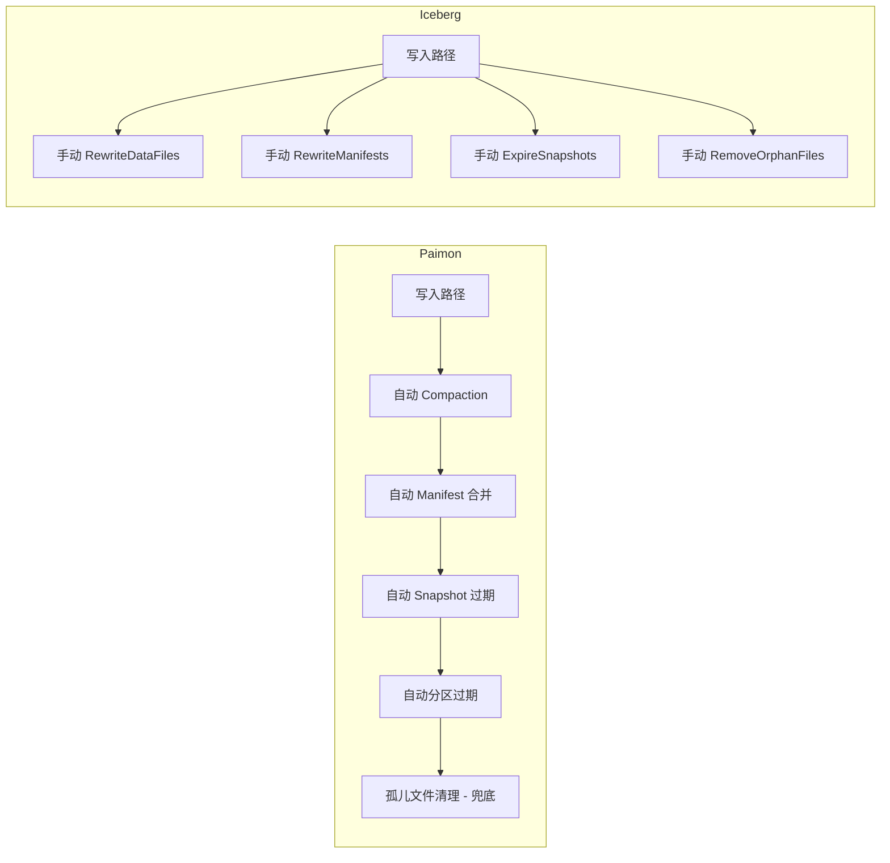

# Apache Paimon 小文件治理机制深度分析

> **版本**：1.5-SNAPSHOT　**源码模块**：`paimon-core`（配置项定义在 `paimon-api` 的 `CoreOptions`）　**核对日期**：2026-06

**一句话定位**：小文件治理是 Paimon"流式写得快"的必然代价的回收侧——LSM 顺序追加和高频 checkpoint 必然产出大量小文件，本文讲清这些文件**从哪来、危害是什么、用哪几条机制（Compaction / Manifest 合并 / Snapshot/分区/Tag 过期 / 孤儿清理）收敛、以及配错会出什么事**。

读完本文你应能回答：① 小文件到底有哪几个来源，各占多少（数据文件 / Level-0 / manifest / changelog / DV）；② 为什么调大 `target-file-size` 治不了小文件，真正该调什么；③ 主键表 UniversalCompaction 的三级触发各在权衡什么，`compaction.small-file-ratio` 为什么是 0.7；④ 反压（stop-trigger）何时介入、为什么 checkpoint 阶段更激进；⑤ Append 表为什么用 BinPacking + 年龄机制，没有反压会怎样；⑥ manifest 的 Minor/Full 两级合并分别清理什么；⑦ Snapshot/分区/Tag 过期与孤儿清理各自负责回收哪类文件、为什么孤儿清理不能自动化；⑧ 不同写入形态（高频小批 / 低频大批 / CDC）该怎么配。

> 阅读约定：本文每个机制按"① 要解决什么问题 → ② 设计原理与取舍（含对比表）→ ③ 关键源码（精选片段 + `路径:行号`）→ ④ 风险/陷阱/边界 → ⑤ 收益与代价"组织。源码行号以本次核对为准；与旧稿不符处用 `（已修正）` 标注。
> **本文是"小文件治理"的主讲文档**（10、23 引用本文）。Compaction 的**全链路执行细节**（CompactManager 状态机、CompactTask 归并、IntervalPartition 分区）主讲是 **23-Compaction 全链路**，本文只讲"触发条件与合并策略"，执行细节处一律标注"详见 23"。LSM 基础结构（Level/SortedRun/Levels）主讲是 **01-核心存储引擎**。

---

## 目录

- [1. 快速理解（成因 / 概念 / 陷阱）](#1-快速理解成因--概念--陷阱)
  - [1.1 核心问题：小文件从哪来、为什么治不掉](#11-核心问题小文件从哪来为什么治不掉)
  - [1.2 五类小文件来源速查表](#12-五类小文件来源速查表)
  - [1.3 核心概念速查表](#13-核心概念速查表)
  - [1.4 高频生产陷阱](#14-高频生产陷阱)
- [2. 小文件的六大来源](#2-小文件的六大来源)
- [3. 主键表数据文件治理：UniversalCompaction](#3-主键表数据文件治理universalcompaction)
  - [3.1 三级触发逻辑](#31-三级触发逻辑)
  - [3.2 EarlyFullCompaction：提前全量合并](#32-earlyfullcompaction提前全量合并)
  - [3.3 minFileSize：小文件重写 vs 大文件升级](#33-minfilesize小文件重写-vs-大文件升级)
  - [3.4 异步 Compaction 与反压](#34-异步-compaction-与反压)
- [4. Append 表数据文件治理：BinPacking + 年龄机制](#4-append-表数据文件治理binpacking--年龄机制)
- [5. Manifest 文件合并：Minor + Full 两级](#5-manifest-文件合并minor--full-两级)
- [6. Snapshot 过期清理](#6-snapshot-过期清理)
- [7. 分区过期](#7-分区过期)
- [8. Tag 对存储的影响与过期](#8-tag-对存储的影响与过期)
- [9. 孤儿文件清理（兜底）](#9-孤儿文件清理兜底)
- [10. 配置调优与诊断](#10-配置调优与诊断)
  - [10.1 关键配置项全景表](#101-关键配置项全景表)
  - [10.2 三种写入形态的推荐配置](#102-三种写入形态的推荐配置)
  - [10.3 诊断方法：系统表自查](#103-诊断方法系统表自查)
- [11. 与 Iceberg 治理理念对比](#11-与-iceberg-治理理念对比)
- [12. 设计决策总结](#12-设计决策总结)

---

## 1. 快速理解（成因 / 概念 / 陷阱）

### 1.1 核心问题：小文件从哪来、为什么治不掉

**① 要解决什么问题**

Paimon 把流式 upsert 落到只能顺序追加的对象存储上（原理见 01-核心存储引擎），代价是"写"会持续产出文件：每次 checkpoint flush 一批数据成 Level-0 文件、每次 commit 产出 manifest、INPUT changelog 模式再翻一倍、MOW 表还有 DV 索引文件。当 checkpoint 间隔短、单次吞吐低时，单个文件远小于 `target-file-size`（主键表默认 128 MB），KB～MB 级小文件就会堆积。

小文件不治理的三个硬伤：

- **读放大**：Level-0 每个文件是一个独立 SortedRun，读取要把所有 Level-0 文件连同高层一起归并。文件从 10 涨到 100，归并路数同步翻 10 倍。
- **元数据压力**：HDFS NameNode 每文件约 150 字节常驻内存；对象存储按请求计费，海量小文件让 LIST/GET/HEAD 请求数与成本飙升。
- **格式失效**：Parquet/ORC 的列式压缩、谓词下推、统计信息都依赖文件足够大，KB 级文件几乎享受不到列式收益。

**② 设计原理与取舍**

关键认知：**小文件是 LSM 写入模型的结构性产物，不是 bug。** Paimon 的选择是"让写入路径自己持续回收"——把 Compaction、manifest 合并、过期清理都内置进写入/commit 流程，而不是像 Iceberg 那样留给外部维护作业（对比见 §11）。一句话设计哲学：**写入侧持续产出 + 存储引擎自治回收，用可调的写放大换取免运维的布局健康度。**

为什么调大 `target-file-size` 治不了小文件——这是最常见的误解：

| 想法 | 实际效果 | 正确做法 |
|------|---------|---------|
| 调大 `target-file-size` | 它是 RollingFileWriter 的**滚动上限**，不是下限。一次 flush 只有 1 MB，文件就是 1 MB，无论 target 多大 | 增大 `write-buffer-size` 让单次 flush 攒更多数据；或拉长 checkpoint 间隔 |
| 关掉 Compaction 提速 | Level-0 无限堆积，读性能指数级退化 | 用 `write-only` + Dedicated Compaction 解耦，而非关闭 |
| 只盯数据文件 | manifest / changelog / DV 同样在堆 | 全链路治理：见 §5～§9 |

**一份数据从写入到回收的全生命周期（串起全文）**：

```
1. checkpoint flush      WriteBuffer 排序合并 → Level-0 数据文件（§2.1）
                         INPUT changelog 模式同时双写 changelog 文件（§2.4）
2. commit                产出 delta manifest + manifest list（§2.5）；顺带 Minor/Full 合并旧 manifest（§5）
3. compaction 异步        UniversalCompaction 三级触发选 run（§3.1），小文件 rewrite、大文件 upgrade 免重写（§3.3）
                         run 数超 stop-trigger → 反压阻塞写入（§3.4）
4. snapshot 过期          commit 时检查，回收不再被引用的数据/manifest 文件（§6）
5. 分区/Tag 过期          按时间批量删整分区（§7）；Tag 阻止其引用快照被回收（§8）
6. 孤儿清理（手动兜底）   清理从未被任何快照引用的残留文件（§9）
```

### 1.2 五类小文件来源速查表

| 来源 | 产生时机 | 增长速率 | 治理机制 | 详见 |
|------|---------|---------|---------|------|
| **Level-0 数据文件** | 每次 flush（checkpoint / buffer 满） | 高（× 分区 × bucket） | UniversalCompaction | §3 |
| **Append 数据文件** | 每次 flush | 高（无层级、无反压） | BinPacking + 年龄机制 | §4 |
| **Changelog 文件** | INPUT 模式每次 flush 额外一份 | 与数据文件同步翻倍 | changelog 独立过期 | §2.4、§6 |
| **Manifest 文件** | 每次 commit（写 + compaction） | 高（高频 commit） | Minor + Full 合并 | §5 |
| **DV 索引文件** | MOW 表 compaction 生成 | 中（随删除量） | compaction 顺带清理 | §4、04-DV 文档 |

### 1.3 核心概念速查表

| 概念 | 一句话定义 | 关键源码 |
|------|-----------|---------|
| **Level-0** | LSM 特殊层，每文件一个独立 SortedRun、key 范围可重叠；用 TreeSet 按 maxSequenceNumber 降序组织 | `Levels.java:43`、`Levels.java:59`（已修正：旧稿写 39-80） |
| **SortedRun** | key 区间互不重叠、按 minKey 有序的文件集合；读取需归并所有 SortedRun | 详见 01-核心存储引擎 |
| **UniversalCompaction** | 主键表合并策略，三级触发（空间放大 / 大小比例 / 文件数），借鉴 RocksDB | `mergetree/compact/UniversalCompaction.java:67`（已修正路径与行号） |
| **minFileSize** | compaction 时小于它的文件重写、大于它的只升 level；= `target × small-file-ratio` | `CoreOptions.java:3042`（已修正算法） |
| **stop-trigger** | SortedRun 数超过它就反压阻塞写入；默认 `compaction-trigger + 3` | `MergeTreeCompactManager.java:109` |
| **BinPacking** | Append 表合并策略，按大小装箱 + 年龄机制兜底 | `append/AppendCompactCoordinator.java:343` |
| **ManifestFileMerger** | manifest 两级合并：Minor 物理合并、Full 抵消 ADD/DELETE | `operation/ManifestFileMerger.java:62` |
| **孤儿文件** | 从未被任何 snapshot/tag/changelog 引用的残留文件 | `operation/OrphanFilesClean.java:86` |

### 1.4 高频生产陷阱

**陷阱 1：调大 `target-file-size` 期望减少小文件。** 它是滚动上限不是下限，单次 flush 数据量小则文件依旧小。真正该调 `write-buffer-size`（默认 256 MB，`CoreOptions.java:657`）或降低 checkpoint 频率。

**陷阱 2：把 `num-sorted-run.compaction-trigger` 调到极大以"提速"。** 等同关闭 compaction，Level-0 无限堆积，查询从毫秒退化到分钟。提速应走 `write-only` + Dedicated Compaction（§3.4）。

**陷阱 3：触发阈值调到极小（如 2）造成写放大。** 阈值越小越频繁合并，同一份数据被反复重写。默认 5（`CoreOptions.java:759`）是写/读放大的平衡点。

**陷阱 4：`compaction.max-size-amplification-percent` 设太大致存储翻倍。** 默认 200（`CoreOptions.java:812`），允许 2 倍空间放大。注意其描述限定 "for changelog mode table"——它和 `compaction.size-ratio` 主要作用于产 changelog 的表。

**陷阱 5：INPUT changelog 模式只治数据文件、忘了 changelog。** 每次 flush 额外产一份 changelog，文件数翻倍。需用 `changelog.num-retained.min/max` 或 `changelog.time-retained` 控制其生命周期（§6 的 changelogDecoupled）。

**陷阱 6：`write-only=true` 却没起独立 Compaction 作业。** 小文件无限堆积。write-only 必须配套独立 compact 作业（§3.4）。

**陷阱 7：Append 表误以为不需要 compaction。** Append 表无主键不去重，但 BinPacking 的目的是合并小文件为大文件；且 Append 表**没有反压**（§4），文件数完全靠 compaction 跟上，落后则全表扫描退化。

**陷阱 8：分区/Tag 过期"自动"的误解。** 过期检查只在**有新 commit 时**触发；长时间无写入则不执行。Tag 还会阻止其引用快照被回收（§8）。

---

## 2. 小文件的六大来源

理解来源是治理的前提。六类来源中**数据文件（Level-0）是主战场**，其余在各自章节细讲，本节只做来源全景与"为什么产生"。

| 来源 | 一句话成因 | 治理章节 |
|------|-----------|---------|
| 流式 flush 的 Level-0 文件 | checkpoint/buffer 满触发 flush，单次数据量 < target | §3 |
| Append 表平铺文件 | 同上，但无 LSM 层级 | §4 |
| Manifest + ManifestList | 每次 commit 记录文件增删 | §5 |
| Changelog 文件 | INPUT 模式双写 | §6（过期） |
| DV 索引文件 | MOW 表逐 bucket 维护删除位图 | 04-DV 文档 |
| Compaction 残留 | 任务取消/失败留下未提交文件 | §9（孤儿清理） |

### 2.1 流式写入：每次 checkpoint 产出 Level-0 文件

**① 要解决什么问题。** 流式语义要求数据低延迟可见且持久——Flink 每次 checkpoint 调 `prepareCommit()` 触发 `flushWriteBuffer()`，把内存里的排序缓冲落成 Level-0 文件。这是低延迟的代价，无法回避，只能事后回收。

**② 设计原理。** flush 时按 key 排序 + MergeFunction 合并同 key（主键表去重），再用 RollingFileWriter 滚动落盘；若是 INPUT changelog 模式，同一批数据再写一份 changelog 文件。关键点：**每个 partition-bucket 组合独立 flush**，所以文件数 ≈ checkpoint 次数 × 活跃分区数 × bucket 数，乘法增长。

**③ 关键源码**（`MergeTreeWriter.flushWriteBuffer()`，`mergetree/MergeTreeWriter.java:209`，已修正：旧稿行号区间不准且把反压判断画在方法外）：

```java
private void flushWriteBuffer(boolean waitForLatestCompaction, boolean forcedFullCompaction)
        throws Exception {
    if (writeBuffer.size() > 0) {
        if (compactManager.shouldWaitForLatestCompaction()) {
            waitForLatestCompaction = true;        // run 数超 stop-trigger，flush 前先反压
        }
        // INPUT 模式额外建一个 changelog writer，与数据 writer 一起接收同一批排序结果
        final RollingFileWriter<KeyValue, DataFileMeta> changelogWriter =
                changelogProducer == ChangelogProducer.INPUT
                        ? writerFactory.createRollingChangelogFileWriter(0) : null;
        final RollingFileWriter<KeyValue, DataFileMeta> dataWriter =
                writerFactory.createRollingMergeTreeFileWriter(0, FileSource.APPEND);
        try {
            writeBuffer.forEach(keyComparator, mergeFunction,
                    changelogWriter == null ? null : changelogWriter::write, dataWriter::write);
        } finally { /* clear buffer, close writers */ }
        for (DataFileMeta fileMeta : dataWriter.result()) {
            newFiles.add(fileMeta);
            compactManager.addNewFile(fileMeta);   // 新文件进 Level-0
        }
    }
    trySyncLatestCompaction(waitForLatestCompaction);
    compactManager.triggerCompaction(forcedFullCompaction);   // 尝试触发异步 compaction
}
```

要点（已修正：反压判断 `shouldWaitForLatestCompaction()` 就在 `flushWriteBuffer` 方法内，第 212 行，旧稿把它画在方法外）：

- **每个 partition-bucket 组合独立 flush**，文件数 ≈ checkpoint 次数 × 活跃分区数 × bucket 数，乘法增长。
- INPUT changelog 模式同一批数据**双写**——数据文件 + changelog 文件，文件数翻倍（changelog 治理见 §6）。
- flush 末尾 `addNewFile` 把新文件登记进 Level-0，并 `triggerCompaction` 触发异步合并——这就是 §3 的入口。

**⑤ 收益与代价**：及时 flush 换来低延迟可见与持久性，是流式处理的基本要求；代价就是小文件，由 §3 起的各机制回收。

### 2.2 RollingFileWriter：target-file-size 是上限不是下限

文件大小由 `RollingFileWriterImpl`（`io/RollingFileWriterImpl.java:64`）控制：每写入 `CHECK_ROLLING_RECORD_CNT`（1000）条采样检查一次当前文件是否达到 `targetFileSize`，达到则关闭、下条写入开新文件。

```java
private boolean rollingFile(boolean forceCheck) throws IOException {
    return currentWriter.reachTargetSize(
            forceCheck || recordCount % CHECK_ROLLING_RECORD_CNT == 0, targetFileSize);
}
```

`target-file-size`（`CoreOptions.java:714`）无硬编码默认值，由 `targetFileSize(hasPrimaryKey)`（`CoreOptions.java:2959`）决定：主键表 `VALUE_128_MB`、Append 表 `VALUE_256_MB`。**这是滚动上限**——它只决定单文件"长到多大就切下一个"，决定不了"flush 的数据不够时文件有多小"。所以 §1.4 陷阱 1 成立：治小文件要调 `write-buffer-size` 而非 `target-file-size`。

### 2.3 Level-0 的特殊性

Level-0 是 LSM 唯一允许 key 范围重叠的层：**每个文件就是一个独立 SortedRun**，读取要把所有 Level-0 文件归并。`Levels` 用 `TreeSet` 组织 Level-0（`mergetree/Levels.java:43`、比较器在 `Levels.java:59`，已修正：旧稿写 39-80 行区间且只说"按 maxSequenceNumber 降序"），实际比较器是：先按 `maxSequenceNumber` 降序（新数据在前），相同再依次比 `minSequenceNumber`、`creationTime`、`fileName`，以保证多写入端产生相同 maxSeq 时 TreeSet 不会误去重。Level-0 文件越多读放大越严重——这是 §3 反压机制要守住的核心指标（LSM 层级结构详见 01-核心存储引擎）。

### 2.4 Manifest / Changelog / DV 的来源

- **Manifest + ManifestList**：每次 commit（含写入与 compaction）产出 delta manifest（记录文件增删）与 manifest list（索引）。高频 commit 快速累积，治理见 §5。
- **Changelog 文件**：INPUT 模式每次 flush 额外一份；其生命周期可与 snapshot 解耦，治理见 §6 的 changelogDecoupled。
- **DV 索引文件**：MOW 表逐 bucket 维护删除位图，随删除量增长，由 compaction 顺带清理（机制主讲见 04-DeletionVectors 文档）。

---

## 3. 主键表数据文件治理：UniversalCompaction

**① 要解决什么问题。** 流式写入持续产 Level-0 小文件，不合并会导致：读放大（N 个 Level-0 = N 路归并）、空间放大（同 key 多版本 + tombstone 占空间）、写入阻塞（run 数超 stop-trigger 触发反压）。Compaction 是把这些代价异步收敛的核心机制。

**② 设计原理与取舍——为什么是 Universal 而不是 Leveled。**

| 维度 | Leveled Compaction | Universal Compaction（Paimon 主键表） |
|------|--------------------|---------------------------------------|
| 层间约束 | 严格维护层间大小比例 | 不强制比例，按触发条件灵活选 run |
| 写放大 | 高（层间合并要读下层重叠文件重写） | 低（可只合并部分 SortedRun） |
| 空间放大 | 低 | 较高，靠 `max-size-amplification-percent` 控制 |
| 流式适配 | 一般 | 好（文件数触发能快速响应小文件堆积） |

一句话设计哲学：**牺牲一点空间放大，换最低写放大 + 对流式小文件最快的响应。** Universal 借鉴自 RocksDB，但 Paimon 把它内置进写入路径并加了 EarlyFullCompaction、DV/过期记录联动等分布式适配。

> Compaction 的**执行链路**（CompactManager 状态机、CompactTask 如何归并、IntervalPartition 怎么切区间、CompactUnit/dropDelete 的传播）**全链路详见 23-Compaction 文档**，本节只讲"选哪些文件合并"的策略。

### 3.1 三级触发逻辑

**③ 关键源码**（`UniversalCompaction.pick()`，`mergetree/compact/UniversalCompaction.java:67`，已修正路径——旧稿写 `compact/`，实际在 `mergetree/compact/`）：

```java
public Optional<CompactUnit> pick(int numLevels, List<LevelSortedRun> runs) {
    int maxLevel = numLevels - 1;
    // 0 提前全量（可选）：时间间隔 / 总大小 / 增量大小触发
    if (earlyFullCompact != null) {
        Optional<CompactUnit> unit = earlyFullCompact.tryFullCompact(numLevels, runs);
        if (unit.isPresent()) return unit;
    }
    // 1 空间放大
    CompactUnit unit = pickForSizeAmp(maxLevel, runs);
    if (unit != null) return Optional.of(unit);
    // 2 大小比例
    unit = pickForSizeRatio(maxLevel, runs);
    if (unit != null) return Optional.of(unit);
    // 3 文件数：超过 trigger 才合并 (runs.size - trigger + 1) 个候选
    if (runs.size() > numRunCompactionTrigger) {
        int candidateCount = runs.size() - numRunCompactionTrigger + 1;
        return Optional.ofNullable(pickForSizeRatio(maxLevel, runs, candidateCount));
    }
    return Optional.empty();
}
```

三级按优先级递减——先解决最贵的问题（空间放大→存储成本），再读性能（比例不合理），最后才是文件数上限：

| 级别 | 触发条件 | 目的 | 配置项（默认值 / 源码） |
|------|---------|------|------------------------|
| 0 提前全量 | 时间间隔/总大小/增量大小 任一满足 | 定期全量合并清 tombstone、保读优化系统表时效 | `compaction.optimization-interval`/`compaction.total-size-threshold`/`compaction.incremental-size-threshold`（均无默认，`CoreOptions.java:867/875/882`） |
| 1 空间放大 | 候选总大小占比超过 maxSizeAmp | 控制空间放大 | `compaction.max-size-amplification-percent`（200，`CoreOptions.java:812`） |
| 2 大小比例 | 相邻 SortedRun 大小比例不合理 | 维持层间梯度优化读 | `compaction.size-ratio`（1，`CoreOptions.java:827`） |
| 3 文件数 | `runs.size() > trigger` | 控制读放大上限 | `num-sorted-run.compaction-trigger`（5，`CoreOptions.java:759`） |

> 注意（易被忽视）：级别 1、2 两个配置项的官方描述都限定 "for changelog mode table"——它们主要作用于会产 changelog 的表；文件数触发（级别 3）才是通用兜底。

**④ 风险 / 陷阱。** trigger 调太小（如 2）→ 同份数据被反复重写，写放大飙升；调太大 → 约等于不合并，Level-0 堆积、读退化。`max-size-amplification-percent` 调太大 → 存储翻倍。

**⑤ 收益与代价。** 三级策略让一个引擎同时覆盖"控成本 / 控读放大 / 控文件数"，免人工干预；代价是 compaction 持续占 CPU/IO，且参数耦合较深（trigger 同时影响合并频率、层数 `numLevels=trigger+1`、归并 run 数，详见 01-核心存储引擎 §1.3 陷阱 7）。

### 3.2 EarlyFullCompaction：提前全量合并

**① 要解决什么问题。** 仅靠空间放大触发全量合并可能数小时才发生一次——对"小表想尽快收敛"或"读优化系统表要时效"的场景太慢。EarlyFullCompaction 提供三个**主动**触发全量合并的维度。

**③ 关键源码**（`tryFullCompact()`，`mergetree/compact/EarlyFullCompaction.java:86`，已修正路径——旧稿写 `compact/`）：

```java
public Optional<CompactUnit> tryFullCompact(int numLevels, List<LevelSortedRun> runs) {
    if (runs.size() == 1) return Optional.empty();   // 只有一个 run，无需合并
    int maxLevel = numLevels - 1;
    if (fullCompactionInterval != null
            && (lastFullCompaction == null
                || currentTimeMillis() - lastFullCompaction > fullCompactionInterval)) {
        updateLastFullCompaction();                  // 距上次满间隔 → 全量
        return Optional.of(CompactUnit.fromLevelRuns(maxLevel, runs));
    }
    if (totalSizeThreshold != null && totalSize(runs) < totalSizeThreshold) {
        updateLastFullCompaction();                  // 小表：总大小低于阈值 → 全量
        return Optional.of(CompactUnit.fromLevelRuns(maxLevel, runs));
    }
    if (incrementalSizeThreshold != null && incrementalSize(runs) > incrementalSizeThreshold) {
        updateLastFullCompaction();                  // 非 maxLevel 增量超阈值 → 全量
        return Optional.of(CompactUnit.fromLevelRuns(maxLevel, runs));
    }
    return Optional.empty();
}
```

三条触发：① 距上次全量超 `optimization-interval`；② 总大小小于 `total-size-threshold`（小表快速收敛）；③ 非 maxLevel 增量超 `incremental-size-threshold`。**已修正**：旧稿漏写每次命中都会调 `updateLastFullCompaction()` 刷新计时点，这决定了间隔触发不会连续放炮。

**④ 风险。** `changelog-producer=full-compaction` 模式下 changelog 只在全量合并时产出——若只靠空间放大（默认）触发，changelog 延迟可能达数小时。需配 `compaction.optimization-interval`，否则改用 `input`/`lookup` 模式（详见 24-Changelog 文档）。

**⑤ 收益与代价。** 用主动触发换更可控的 changelog 延迟和空间回收节奏；代价是更频繁的全量重写带来额外写放大。

### 3.3 minFileSize：小文件重写 vs 大文件升级

**① 要解决什么问题。** Compaction 不应该对已经够大的文件做无谓 I/O——它们只需要"逻辑上移层"，内容不必重写。如何区分"该重写的小文件"和"只需升 level 的大文件"？靠 `minFileSize` 阈值。

**③ 关键源码**（`MergeTreeCompactTask.doCompact()`，`mergetree/compact/MergeTreeCompactTask.java:82`，已修正路径与行号）：

```java
for (List<SortedRun> section : partitioned) {     // IntervalPartition 切出的区间
    if (section.size() > 1) {
        candidate.add(section);                   // 区间内有重叠 → 必须归并
    } else {
        for (DataFileMeta file : section.get(0).files()) {
            if (file.fileSize() < minFileSize) {
                candidate.add(singletonList(SortedRun.fromSingle(file)));  // 小文件随前面一起重写
            } else {
                rewrite(candidate, result);       // 先把攒着的小文件重写
                upgrade(file, result);            // 大文件只改 level，不重写内容
            }
        }
    }
}
rewrite(candidate, result);
```

`minFileSize` 由 `compactionFileSize()` 计算（`CoreOptions.java:3042`，**已修正**：旧稿写死 `target / 10 * 7`，现版本改为 `target × COMPACTION_SMALL_FILE_RATIO`）：

```java
public long compactionFileSize(boolean hasPrimaryKey) {
    return (long) (targetFileSize(hasPrimaryKey) * options.get(COMPACTION_SMALL_FILE_RATIO));
}
```

`compaction.small-file-ratio` 默认 0.7（`CoreOptions.java:728`），即主键表 ≈ 128 MB × 0.7 = 89.6 MB。**为什么是 0.7 而非 1.0**：压缩率不可精确预估，rolling 写出的文件常比 `target-file-size` 略小，若用 1.0 当阈值，这些"差一点"的文件会被反复判为小文件重写。0.7 留出容差，避免反复重写同一文件（源码注释明确此意图）。

**⑤ 收益与代价。** 大文件 upgrade 只改元数据 level 字段、几乎零 I/O，小文件顺带在 compaction 中被合并、无需专门作业；代价是引入一个需要理解的隐藏阈值（IntervalPartition、upgrade 与 dropDelete 的完整执行语义详见 23-Compaction 文档）。

### 3.4 异步 Compaction 与反压

**① 要解决什么问题。** 若 compaction 与写入同步执行，I/O 密集的 compaction（数秒～数分钟）会阻塞写入线程、拖垮 checkpoint。但纯异步又有反向风险：compaction 跟不上时 Level-0 无限堆积、读崩溃。所以需要"异步执行 + 必要时反压"两手。

**② 设计原理与取舍——单任务飞行 + 双档反压。**

| 设计点 | 选择 | 取舍 |
|--------|------|------|
| 执行模型 | 单任务飞行（一个 bucket 同时只跑一个 compaction） | 简化并发控制、保 Levels 状态一致；代价是多 bucket 表 compaction 吞吐受限 |
| 反压触发 | run 数超 `stop-trigger` 才阻塞写入 | 平时不挡写、紧急时刹车；代价是 Level-0 可短暂超 trigger |
| checkpoint 阶段 | 阈值再 +1（更激进） | 防"写成功但 compaction 阶段反复 failover 导致 Level-0 持续涨" |
| 资源隔离 | `write-only` + 独立 compact 作业（Dedicated） | 写/合并独立扩缩容、延迟更稳；代价是多一个作业要运维 |

**③ 关键源码**（反压判断，`MergeTreeCompactManager.java:109`）：

```java
public boolean shouldWaitForLatestCompaction() {
    return levels.numberOfSortedRuns() > numSortedRunStopTrigger;          // 平时档
}
public boolean shouldWaitForPreparingCheckpoint() {
    return levels.numberOfSortedRuns() > (long) numSortedRunStopTrigger + 1; // checkpoint 档 +1
}
```

`numSortedRunStopTrigger` 默认 `compaction-trigger + 3`（`CoreOptions.java:3068`，无显式默认值，由 `num-sorted-run.stop-trigger` 覆盖），即默认 5+3=8。前者在 `flushWriteBuffer` 入口判断（§2.1 源码第 212 行），后者在 `prepareCommit`（`MergeTreeWriter.java:262`）判断——checkpoint 阶段那行注释明确：写成功但 compaction 阶段反复重启会让 Level-0 越堆越多，多等一档可避免。

**④ 风险 / 陷阱。**
- 误以为"异步=不影响写入"：异步仍抢 CPU/IO，且 run 数超 stop-trigger 照样反压。现象是"写入突然卡住、checkpoint 超时"，根因常是 compaction 落后。解法：增大 `write-buffer-size` 降低 flush 频率，或拆 Dedicated Compaction。
- `write-only=true` 却忘了起独立 compact 作业 → 小文件无限堆积。
- MOW（deletion-vectors）表 Level-0 需 compaction 生成 DV 后才对读可见，强行纯异步会导致"刚写的数据查不到"（详见 01-核心存储引擎 §1.3 陷阱 8）。

**⑤ 收益与代价。** 写入延迟稳定 + 读放大有反压兜底；代价是单任务模型限制并发、异步结果有延迟、需额外线程池。Dedicated Compaction 是生产推荐形态（CompactManager/CompactFutureManager 的状态机细节详见 23-Compaction 文档）。

---

## 4. Append 表数据文件治理：BinPacking + 年龄机制

**① 要解决什么问题。** Append 表（无主键）没有 LSM 层级，文件平铺，且**没有反压机制**——主键表靠 stop-trigger 守住读放大，Append 表的文件数完全靠 compaction 跟上写入。低吞吐稀疏写入下，少量小文件可能长期凑不够一个合并批次；unaware-bucket 模式更是所有数据进同一逻辑桶、文件数无层级上限。查询无 key 范围过滤，必须扫全部文件，落后即退化。

**② 设计原理与取舍——为什么用 BinPacking + 年龄机制而非 LSM。**

| 维度 | LSM（主键表） | BinPacking + 年龄机制（Append 表） |
|------|--------------|-----------------------------------|
| 是否需要排序 | 需要（按 key） | 不需要（无主键） |
| 合并触发 | 三级触发 + 反压 | 大小装箱 + 文件数 + 年龄兜底 |
| 协调粒度 | 每 bucket 独立 | 全局协调（`AppendCompactCoordinator` 扫所有分区） |
| 稀疏分区 | 反压不适用 | 年龄机制强制兜底合并 |

一句话哲学：**Append 没有 key 排序约束，合并就退化为"把小文件按大小装箱凑大"，再用年龄机制确保冷分区也终会被合并。**

**③ 关键源码**（`AppendCompactCoordinator`，`append/AppendCompactCoordinator.java`）。装箱判定（`FileBin`，行 `343`）：

```java
private boolean enoughContent() {              // 行 364
    return bin.size() > 1 && totalFileSize >= targetFileSize * 2;  // ≥2 文件且总大小 ≥ 2×target
}
private boolean enoughInputFiles() {           // 行 368
    return bin.size() >= minFileNum;           // 文件数达 compaction.min.file-num（默认 5）
}
public void addFile(DataFileMeta file) {       // 行 359
    totalFileSize += file.fileSize() + openFileCost;  // 计入打开文件的固定代价
    bin.add(file);
}
```

哪些文件该进合并（`shouldCompact`，行 `486`）：`file.fileSize() < compactionFileSize`（小于 target × small-file-ratio）**或** 删除比例过高（`tooHighDeleteRatio`，行 `490`，删除行数超 `rowCount × compaction.delete-ratio-threshold`，默认 0.2 触发 DV 清理重写）。

年龄机制（常量在 `AppendCompactCoordinator.java:72-73`，已修正：`REMOVE_AGE=10`、`COMPACT_AGE=5`）：每轮扫描未能装箱则 `age++`；`age > COMPACT_AGE(5)` 且待合并文件 >1 时强制合并；`age > REMOVE_AGE(10)` 则把该分区从内存移除避免泄漏（行 `249`、`261`）。

**④ 风险 / 陷阱。**
- `compaction.min.file-num` 设太大（如 100）→ 低吞吐场景要数小时/数天才攒够，文件数长期高位。靠年龄机制兜底但延迟仍大；该参数默认 5（`CoreOptions.java:892`）通常无需调大。
- 误以为 Append 表不需要 compaction → 合并目的是"小文件变大文件"，不做则全表扫描、列式压缩失效。
- DV 模式忘配清理（`compaction.delete-ratio-threshold` 设到 1.0）→ DV 文件持续堆积，读时数据 + DV 双倍打开开销。
- 年龄移除副作用：被移除的分区下次写入要重新扫描，有冷启动开销。
- `compaction.file-num-limit`（默认 100000，`CoreOptions.java:900`）限制单次扫描文件数，防 unaware-bucket 表 compaction OOM。

**⑤ 收益与代价。** 实现简单、装箱灵活、年龄机制保证冷分区终被合并；代价是无 key 过滤（查询扫全表）、无反压（文件数失控风险更高）、全局协调在超多分区时可能成为瓶颈。`openFileCost`（默认 4 MB）让装箱把"打开文件的固定代价"计入，对象存储下可适当调大。

---

## 5. Manifest 文件合并：Minor + Full 两级

**① 要解决什么问题。** 每次 commit（写入或 compaction）产出一个 delta manifest + manifest list。高频 commit 快速堆积 manifest 小文件，带来三害：① Snapshot 恢复/scan 要加载全部 manifest，文件越多越慢（每个 manifest 一次对象存储 GET）；② `$files`/`$manifests` 等系统表查询随文件数线性变慢；③ 同一数据文件的 ADD/DELETE 条目散落多个 manifest，冗余占空间。

**② 设计原理与取舍——为什么两级。**

| 级别 | 触发与动作 | 开销 | 是否抵消 ADD/DELETE |
|------|-----------|------|---------------------|
| **Minor** | 每次 commit 累积 manifest 到 `manifest.target-file-size`（8 MB）就物理合并一批；或剩余文件数达 `manifest.merge-min-count`（30） | 低，可高频跑 | 否，仅物理合并 |
| **Full** | 需变更的 manifest 总大小达 `manifest.full-compaction-threshold-size`（16 MB）才触发 | 高 | 是，读所有 DELETE 条目抵消对应 ADD |

manifest 三层结构：`Snapshot → ManifestList（base + delta + 可选 changelog）→ ManifestFile（ADD/DELETE 条目）`。Full Compaction 的关键优化是**分区过滤**——只有含 DELETE 条目的分区需要重写，无关分区的 manifest 直接复用，对多分区表大幅省 I/O。一句话哲学：**高频小步（Minor 控数量）+ 低频大步（Full 清冗余），用 commit 的原子性顺带完成，免独立维护作业。**

**③ 关键源码**：见 §5.1。

**④ 风险 / 陷阱。**
- 误以为 manifest 小就不用管：8640 个 × 10 KB = 86 MB，但读 8640 次 GET 的延迟远大于读 1 个 86 MB 文件，且 inode/请求成本与大小无关。
- `manifest.target-file-size` 调太大（如 128 MB）→ Minor 要攒到 128 MB 才合并，低吞吐下文件数长期高位，拖慢 Snapshot 恢复。保持默认 8 MB。
- 频繁手动 `compactManifest()`：它用激进参数（`minCount=1, sizeTrigger=1`）合并一切可合并项，频繁调用引发大量 I/O 和乐观锁冲突，影响正常 commit。
- 分区过滤只对多分区表有效；单分区表 Full Compaction 仍要全读。

**⑤ 收益与代价。** 两级 + 分区过滤让 manifest 数量与冗余都自动收敛、无需独立作业；代价是 Full Compaction 对大表（百万级文件）可能耗时数分钟，且过程走乐观锁、并发 commit 可能冲突重试。

### 5.1 ManifestFileMerger 的合并逻辑

**源码位置**: `ManifestFileMerger.java` (operation/ManifestFileMerger.java)

Manifest 文件的合并分为两级:



#### 5.1.1 Minor Compaction（`ManifestFileMerger.tryMinorCompaction()`，`operation/ManifestFileMerger.java:101`）

```java
private static List<ManifestFileMeta> tryMinorCompaction(
        List<ManifestFileMeta> input, ..., long suggestedMetaSize, int suggestedMinMetaCount, ...) {
    List<ManifestFileMeta> candidates = new ArrayList<>();
    long totalSize = 0;
    for (ManifestFileMeta manifest : input) {
        totalSize += manifest.fileSize();
        candidates.add(manifest);
        if (totalSize >= suggestedMetaSize) {       // 达到目标大小（默认 8 MB）
            mergeCandidates(candidates, ...);        // 合并这批小文件
            candidates.clear();
            totalSize = 0;
        }
    }
    if (candidates.size() >= suggestedMinMetaCount) { // 剩余文件数 >= 30
        mergeCandidates(candidates, ...);
    } else {
        result.addAll(candidates);                     // 保留原样
    }
}
```

#### 5.1.2 Full Compaction（`ManifestFileMerger.tryFullCompaction()`，`operation/ManifestFileMerger.java:158`）

```java
public static Optional<List<ManifestFileMeta>> tryFullCompaction(
        List<ManifestFileMeta> inputs, ..., long suggestedMetaSize, long sizeTrigger, ...) {
    // 1. 判断是否需要全量合并
    Filter<ManifestFileMeta> mustChange =
            file -> file.numDeletedFiles() > 0 || file.fileSize() < suggestedMetaSize;
    
    long totalDeltaFileSize = 0;
    for (ManifestFileMeta file : inputs) {
        if (mustChange.test(file)) {
            totalDeltaFileSize += file.fileSize();
        }
    }
    if (totalDeltaFileSize < sizeTrigger) return Optional.empty(); // 16 MB 默认阈值
    
    // 2. 读取所有 DELETE 条目
    Set<FileEntry.Identifier> deleteEntries = FileEntry.readDeletedEntries(manifestFile, inputs, ...);
    
    // 3. 按分区过滤: 与删除条目无关的 manifest 文件可以跳过
    PartitionPredicate predicate = ...; // 基于删除条目的分区集合构建过滤器
    
    // 4. 合并: 跳过 DELETE 条目，过滤已删除的 ADD 条目
    for (ManifestFileMeta file : toBeMerged) {
        for (ManifestEntry entry : manifestFile.read(file.fileName(), file.fileSize())) {
            if (entry.kind() == FileKind.DELETE) continue;       // 跳过 DELETE
            if (deleteEntries.contains(entry.identifier())) {
                requireChange = true;                             // 被删除的 ADD 也跳过
            } else {
                entries.add(entry);                               // 保留有效 ADD
            }
        }
    }
}
```

两段源码对应 §5② 的两级：Minor 累计到 `suggestedMetaSize`（默认 8 MB）就物理合并一批、剩余数达 `suggestedMinMetaCount`（默认 30）也合并；Full 先用 `mustChange`（含 DELETE 或文件偏小）算出需变更总量，达 `sizeTrigger`（默认 16 MB）才启动，再读全部 DELETE 条目、按分区过滤、抵消 ADD/DELETE。

### 5.2 配置项

| 配置项 | 默认值 / 源码 | 作用 |
|--------|--------------|------|
| `manifest.target-file-size` | 8 MB（`CoreOptions.java:454`） | Manifest 目标大小，Minor 合并的累积阈值 |
| `manifest.merge-min-count` | 30（`CoreOptions.java:467`） | Minor 中剩余文件数达此值时触发合并 |
| `manifest.full-compaction-threshold-size` | 16 MB（`CoreOptions.java:460`） | Full 触发阈值（需变更文件总大小） |

### 5.3 compactManifest()：手动激进合并

正常 commit 路径里 `ManifestFileMerger.merge()` 用配置默认值被调用。独立的 `compactManifest()`（`FileStoreCommitImpl`）用于手动触发，参数更激进——`suggestedMinMetaCount=1`、`sizeTrigger=1`，即"只要有变更就做 full compaction、合并一切可合并项"，并以乐观锁 + 重试处理并发。正因激进，**不应每次 commit 后手动调用**（见 §5④）。

---

## 6. Snapshot 过期清理

**① 要解决什么问题。** 每次 commit 产生一个 Snapshot，旧 Snapshot 引用的数据/manifest 文件即使已被新 compaction 替换也不能删——只要还有 Snapshot 引用它。不清理则空间无限膨胀（30 天 × 10 s checkpoint ≈ 26 万快照）。但又不能乱删：正在被查询、被下游消费、被 Tag 引用的快照都得保住。所以过期是"在多重保护下回收不再被引用文件"的核心机制。

**② 设计原理与取舍——多重保护下的范围计算。** 过期不是简单删最老的，而是先算出一个安全的可过期区间 `[earliest, maxExclusive)`，由四个约束取交集：

| 约束 | 配置 / 来源（默认值） | 作用 |
|------|----------------------|------|
| 至少保留 | `snapshot.num-retained.min`（10，`CoreOptions.java:498`） | 最高优先级，无论如何留够 N 个 |
| 最多保留 | `snapshot.num-retained.max`（MAX_INT，`CoreOptions.java:506`） | 超过才开始候选过期 |
| 时间保留 | `snapshot.time-retained`（1h，`CoreOptions.java:513`） | 未到期的不删，遇到即停 |
| 单次上限 | `snapshot.expire.limit`（50，`CoreOptions.java:545`） | 一次最多删 N 个，防 commit 卡顿 |
| Consumer | `ConsumerManager.minNextSnapshot()` | 下游正在消费位点之前不删 |
| Tag | 被 Tag 引用的快照及其文件不删（§8） | 长期保留 |

一句话哲学：**过期是把数量/时间/消费位点/Tag 四类约束取最严交集，宁可少删不可误删。** 与 Iceberg 需手动 `ExpireSnapshots` 不同，Paimon 在每次 commit 顺带触发——代价是过期跑在 commit 路径上、且长时间无 commit 则不执行。

**③ 关键源码**：见 §6.1。

**④ 风险 / 陷阱。**
- `snapshot.time-retained` 设太短（如 5min）→ 时间旅行失败、慢消费者读的快照被删（FileNotFound）、甚至 compaction 引用的旧文件被删。
- Consumer 未正确注册 → 保护失效，消费中的快照被回收。用 `StreamingReadBuilder` 续读模式或显式注册 `ConsumerManager`。
- `snapshot.expire.limit` 设太大（如 10000）→ 单次删太多文件，commit 超时、对象存储 DELETE 限流。
- 长时间无 commit → 过期不触发（它挂在 commit 路径上）。

**⑤ 收益与代价。** 多重保护 + 自动触发 + 分阶段清理，安全且免运维；代价是逻辑复杂、过期占 commit 延迟、Consumer 保护依赖外部正确注册。

---

### 6.1 ExpireSnapshotsImpl 的实现

**源码位置**: `ExpireSnapshotsImpl.java` (table/ExpireSnapshotsImpl.java)

#### 6.1.1 过期范围计算（`ExpireSnapshotsImpl.expire()`，`table/ExpireSnapshotsImpl.java:99`）

```java
public int expire() {
    int retainMax = expireConfig.getSnapshotRetainMax();
    int retainMin = expireConfig.getSnapshotRetainMin();
    int maxDeletes = expireConfig.getSnapshotMaxDeletes();
    long olderThanMills = System.currentTimeMillis() - expireConfig.getSnapshotTimeRetain().toMillis();

    // 计算应该保留的最小 snapshotId
    long min = Math.max(latestSnapshotId - retainMax + 1, earliest);

    // 计算最大可过期的 snapshotId（排他）
    long maxExclusive = latestSnapshotId - retainMin + 1;

    // 保护: consumer 正在读取的 snapshot 不能删除
    maxExclusive = Math.min(maxExclusive, consumerManager.minNextSnapshot().orElse(Long.MAX_VALUE));

    // 保护: 一次最多删除 maxDeletes 个（默认 50）
    maxExclusive = Math.min(maxExclusive, earliest + maxDeletes);

    // 时间保留: 遇到未过期的 snapshot 立即停止
    for (long id = min; id < maxExclusive; id++) {
        Snapshot snapshot = snapshotManager.tryGetSnapshot(id);
        if (olderThanMills <= snapshot.timeMillis()) {
            return expireUntil(earliest, id);  // 此 snapshot 未过期，到此为止
        }
    }
    return expireUntil(earliest, maxExclusive);
}
```

**交互逻辑**（参数默认值见 §6② 表）：`retainMin` 先划出不可过期范围 → `retainMax` 从最老的开始候选 → 循环中遇到 `timeMillis` 未到期的快照立即 `break`（时间过滤优先于数量）→ `expireLimit` 限制单次数量 → `consumer.minNextSnapshot()` 保护正在消费的位点。`expireUntil()`（`table/ExpireSnapshotsImpl.java:163`）执行实际清理。

### 6.2 文件清理流程

**源码位置**: `ExpireSnapshotsImpl.java` (table/ExpireSnapshotsImpl.java)



**关键设计细节**:
- **Tag 保护**: 被 Tag 引用的快照中的数据文件不会被删除。通过 `createDataFileSkipperForTags` 构建跳过集合
- **Changelog 解耦**: 当 `changelogDecoupled = true` 时，snapshot 过期不会删除 APPEND 类型的数据文件，这些文件由独立的 Changelog 过期机制管理
- **并行删除**: 使用 `fileExecutor` 并行执行文件删除操作
- **Manifest 跳过集**: 需要被后续 snapshot/tag 引用的 manifest 文件不会被删除

### 6.3 SnapshotDeletion、ChangelogDeletion、TagDeletion 的职责分工

| 类 | 继承自 | 负责清理的内容 |
|---|--------|---------------|
| `SnapshotDeletion` | `FileDeletionBase<Snapshot>` | 普通快照过期时的数据文件、manifest 文件、index 文件、统计文件 |
| `ChangelogDeletion` | `FileDeletionBase<Changelog>` | Changelog 独立过期时的 changelog 数据文件和 manifest |
| `TagDeletion` | `FileDeletionBase<Snapshot>` | Tag 删除时的数据文件清理（需要检查其他 Tag/Snapshot 是否仍引用） |

三者共享 `FileDeletionBase` 的通用逻辑：manifest 读取、数据文件路径构建、并行文件删除等。

**为什么这么做**: 快照、Changelog、Tag 三种生命周期可以独立管理。例如，Changelog 可以比 Snapshot 保留更长时间（用于 CDC 消费），Tag 可以有独立的 TTL。分离的删除器避免了复杂的条件判断。

---

## 7. 分区过期

**① 要解决什么问题。** 按时间分区的表（按天/小时），历史分区不再查询却仍占空间。仅靠 Snapshot 过期不够——若某分区的文件一直被最新 Snapshot 引用，它永远不会被回收。分区过期提供**按业务语义批量删整分区**的能力：一次释放 GB～TB，满足合规保留期，减少分区数加速裁剪。

**② 设计原理与取舍。** 通过 `commit.dropPartitions()` 整体删分区，远比逐文件清理高效。两种策略选时间来源：

| 策略 | 时间来源 | 适用 |
|------|---------|------|
| `values-time`（默认，`CoreOptions.java:1140`） | 解析分区值（`dt=2024-01-01`→该日 0 点） | 分区值即时间且格式统一 |
| `update-time` | 分区最后更新时间（文件修改时间） | 分区值非时间或格式不一 |

为降开销，检查不在每次 commit 都做：`partition.expiration-check-interval`（默认 1h，`CoreOptions.java:1162`）控制最小间隔；过期分区多时 `partition.expiration-batch-size` 分多次 commit 删。一句话哲学：**用业务时间语义批量回收整分区，对象存储下比逐文件删高效一个量级。**

**③ 关键源码**：见 §7.1。

**④ 风险 / 陷阱。**
- 以为配了 `partition.expiration-time` 就自动删——它只在**有 commit 时**检查，长期无写入则不执行（同 §6）。
- `values-time` 下分区值格式不统一（`2024-01-01` vs `20240101`）→ 部分分区解析失败不过期，或解析错误误删。
- `partition.end-input-to-done-trigger=true` 后只有收到 `end-input`（批结束）才触发——流式作业永远收不到，导致永不过期。
- 删除不可逆，时区解析依赖系统时区，跨时区部署要注意。

**⑤ 收益与代价。** 批量高效、语义清晰、双策略适配；代价是依赖 commit 触发、values-time 受分区值格式约束、误配可能删错数据。

---

### 7.1 PartitionExpire 的实现

**源码位置**: `PartitionExpire.expire()` (operation/PartitionExpire.java:140)

```java
List<Map<String, String>> expire(LocalDateTime now, long commitIdentifier) {
    // 1. 检查是否到达检查间隔
    if (checkInterval.isZero()
            || now.isAfter(lastCheck.plus(checkInterval))
            || (endInputCheckPartitionExpire && Long.MAX_VALUE == commitIdentifier)) {
        // 2. 计算过期时间点
        List<Map<String, String>> expired = doExpire(now.minus(expirationTime), commitIdentifier);
        lastCheck = now;
        return expired;
    }
    return null;
}

private List<Map<String, String>> doExpire(LocalDateTime expireDateTime, long commitIdentifier) {
    // 3. 策略选择过期分区
    List<PartitionEntry> partitionEntries = strategy.selectExpiredPartitions(scan, expireDateTime);
    // 4. 转换分区值
    List<Map<String, String>> expired = convertToPartitionString(expiredPartValues);
    // 5. 批量删除（支持按 expireBatchSize 分批多次 commit）
    if (expireBatchSize > 0 && expireBatchSize < expired.size()) {
        Lists.partition(expired, expireBatchSize).forEach(b -> doBatchExpire(b, commitIdentifier));
    } else {
        doBatchExpire(expired, commitIdentifier);
    }
    return expired;
}
```

构造时还用 `ThreadLocalRandom` 随机化首次检查时间（`PartitionExpire.java:83`），避免多并行任务同时扫分区。

### 7.2 配置项

| 配置项 | 默认值 / 源码 | 作用 |
|--------|--------------|------|
| `partition.expiration-time` | 无默认（不启用，`CoreOptions.java:1155`） | 分区最大存活时间 |
| `partition.expiration-check-interval` | 1 hour（`CoreOptions.java:1162`） | 检查最小间隔 |
| `partition.expiration-strategy` | values-time（`CoreOptions.java:1140`） | 时间来源策略 |

---

## 8. 孤儿文件清理（兜底）

**① 要解决什么问题。** 孤儿文件 = **从未被任何 snapshot/tag/changelog 引用过**的文件。来源：写入/commit 失败（commit 两阶段，先写文件再更新 manifest，中途失败留残文件）、compaction 失败或被取消（`CompactFutureManager.cancelCompaction()` 注释明确可能留孤儿）、并发乐观锁冲突失败方、bug。关键区别：**Snapshot 过期只清理"曾被引用、现不再被引用"的文件，孤儿文件从未被引用，过期机制碰不到它**——所以需要一个独立的兜底清理。

**② 设计原理与取舍——为什么不自动化。** 判定靠差集：`所有物理文件 - 所有被引用文件 = 孤儿`，再按修改时间 < `olderThanMillis` 过滤。

| 设计点 | 选择 | 原因 |
|--------|------|------|
| 触发方式 | 手动 Procedure，不自动跑 | 差集判定若扫描不完整可能误删；扫全量文件 + 全量快照开销大；用户需自选低峰期 |
| 安全期 | 默认 1 天（`OrphanFilesClean.java:465`） | 正在写/commit/compaction 的文件修改时间是"现在"，1 天缓冲保证进行中的操作完成，不被误判为孤儿 |
| 执行模式 | LOCAL（小表）/ DISTRIBUTED（Flink 并行，大表） | 大表文件多，需分布式扫描 |
| dry-run | 支持，只统计不删 | 删除不可逆，先评估影响 |

一句话哲学：**孤儿清理是"差集 + 时间安全期"的危险但必要的兜底，宁可手动也不自动，宁可留几天也不误删。**

**③ 关键源码**：见 §8.2。

**④ 风险 / 陷阱。**
- 以为 Snapshot 过期会顺带清孤儿——不会，必须手动 `remove_orphan_files`。
- `olderThanMillis` 设太短（如 1 小时）→ 正在 commit/compaction 的中间文件被误删，写入/合并失败。推荐至少 1 天，保守 3-7 天。
- 生产直接删不 dry-run → 配错可能删大量文件且不可恢复。规范：先 dry-run（第三参数 `true`）确认再实删。

**⑤ 收益与代价。** 兜底回收所有残留、释放空间，dry-run + 安全期 + 重试（`READ_FILE_RETRY_NUM=3`，`OrphanFilesClean.java:90`）降风险；代价是不自动、扫描开销大（大表数小时）、安全期需在"风险/及时性"间权衡。

---

### 8.1 孤儿文件产生的原因

孤儿文件是指**不被任何 Snapshot、Tag、Changelog 引用的文件**，产生原因包括:

1. **写入失败**: 数据文件已写入但 commit 未成功（如网络超时）
2. **Compaction 失败**: Compaction 输出文件已写完但结果未被应用
3. **Compaction 取消**: 作业取消时正在执行的 Compaction 任务（`CompactFutureManager.cancelCompaction()` 注释明确提到可能留下孤儿文件）
4. **并发冲突**: 多个作业同时提交导致的乐观锁冲突

### 8.2 OrphanFilesClean 的实现

**源码位置**: `OrphanFilesClean.java` (operation/OrphanFilesClean.java:86)

```java
public abstract class OrphanFilesClean implements Serializable {
    protected final long olderThanMillis;  // 默认: 当前时间 - 1 天
    protected final boolean dryRun;         // 是否仅模拟运行

    // 安全获取所有快照（含 snapshot + tag + changelog）
    protected Set<Snapshot> safelyGetAllSnapshots(String branch) throws IOException {
        Set<Snapshot> readSnapshots = new HashSet<>(snapshotManager.safelyGetAllSnapshots());
        readSnapshots.addAll(tagManager.taggedSnapshots());
        readSnapshots.addAll(changelogManager.safelyGetAllChangelogs());
        return readSnapshots;
    }

    // 收集所有被引用的文件（manifest、index、statistics）
    protected void collectWithoutDataFile(String branch, Snapshot snapshot,
            Consumer<String> usedFileConsumer, Consumer<String> manifestConsumer) {
        // 收集 changelog manifest list
        // 收集 delta manifest list
        // 收集 base manifest list
        // 收集所有 manifest 文件名
        // 收集 index 文件
        // 收集 statistics 文件
    }

    // 列出所有数据目录
    protected List<Path> listPaimonFileDirs() {
        // manifest 目录 + index 目录 + statistics 目录 + 数据文件目录（递归遍历分区）
    }
}
```

### 8.3 RemoveOrphanFiles Procedure

**Flink 调用方式**（最后一个参数 `true` 为 dry-run）:
```sql
CALL sys.remove_orphan_files('database.table')                          -- 删一天前孤儿
CALL sys.remove_orphan_files('database.table', '2023-12-31 23:59:59')   -- 自定义时间阈值
CALL sys.remove_orphan_files('database.*', '2023-12-31 23:59:59')       -- 整库
CALL sys.remove_orphan_files('database.table', '2023-12-31 23:59:59', true)  -- dry-run
```

两种执行模式：`DISTRIBUTED`（`FlinkOrphanFilesClean`，Flink 并行扫，大表）/ `LOCAL`（`LocalOrphanFilesClean`，单机，小表）。清理流程对应 §8②：收集 snapshot+tag+changelog 引用集 → 扫文件系统 → 差集 → 按 `olderThanMillis` 过滤 → 删（或 dry-run 仅统计）。支持多分支（branches）清理。

---

## 9. Tag 对存储的影响与过期

> Tag 的完整机制（创建/分支/Consumer 关系）主讲见 **17-时间旅行与版本管理**；本节只讲 Tag 与"小文件/存储治理"的交集：它如何阻止回收、以及如何过期。

**① 要解决什么问题（治理视角）。** Tag 是对 Snapshot 的具名长期引用（每日/月末快照、发布点）。但 Tag 会**阻止其引用的 Snapshot 及全部数据/manifest 文件被回收**——即使这些数据已被新 compaction 替换成更大的文件，旧文件因 Tag 引用仍不能删。Tag 越多、留得越久，存储膨胀越严重，所以 Tag 需要自己的过期机制。

**② 设计原理与取舍。**

| 维度 | 设计 | 取舍 |
|------|------|------|
| Tag 占用 | 本体几 KB，但锁住整条引用链的数据文件 | 长期保留能力 vs 存储成本 |
| 自动创建 | `tag.creation-period`（DAILY，`CoreOptions.java:1713`）周期生成 | 免遗漏 vs 易累积 |
| 过期方式 | per-tag TTL + 全局 olderThan + 数量上限三选 | 灵活 vs 复杂 |
| 删除安全 | `TagDeletion` 只删**独占引用**的文件（不被其他 tag/snapshot 引用） | 安全 vs 需扫全部 tag/snapshot |

一句话哲学：**Tag 用"具名 + 自动 + TTL"换长期可追溯，但必须配 TTL/数量上限，否则就是存储黑洞。**

**③ 关键源码**：见 §9.3。

**④ 风险 / 陷阱。**
- 以为 Tag 不占空间——本体小，但锁住的数据文件可能已被新 compaction 替换却删不掉，存储翻倍。
- 临时 Tag 用后忘删 → 永久阻止 Snapshot 过期。
- `tag.default-time-retained=365d` + `tag.creation-period=DAILY` → 一年攒 365 个 Tag，存储爆炸。需配合理 TTL 或 `tag.num-retained-max`。

**⑤ 收益与代价。** 长期可追溯 + 自动生命周期 + 独占删除安全；代价是阻止回收增加存储、TTL 需谨慎配、TagDeletion 要扫全部 tag/snapshot 开销大。

---

### 9.1 Tag 对存储空间的影响

Tag 本质上是对某个 Snapshot 的**具名引用**。一个 Tag 会阻止其引用的 Snapshot 及其数据文件被过期清理。这意味着:

- 如果一个 Tag 引用了旧 Snapshot，那么该 Snapshot 的 manifest 引用的所有数据文件都会被保留
- 这些数据文件可能已经被新的 Compaction 替换为更大的文件，但旧文件因 Tag 引用仍不能删除
- **Tag 越多、保留时间越长，存储空间膨胀越严重**

### 9.2 Tag TTL 机制

| 配置项 | 默认值 / 源码 | 作用 |
|--------|--------------|------|
| `tag.default-time-retained` | 无默认（`CoreOptions.java:1745`） | 自动创建 Tag 的默认保留时间 |
| `tag.num-retained-max` | 无默认（`CoreOptions.java:1738`） | 自动创建 Tag 的最大保留数量 |
| `tag.creation-period` | DAILY（`CoreOptions.java:1713`） | 自动创建周期 |

### 9.3 TagTimeExpire 的实现

**源码位置**: `TagTimeExpire.expire()` (tag/TagTimeExpire.java:61)

```java
public List<String> expire() {
    List<Pair<Tag, String>> tags = tagManager.tagObjects();
    List<String> expired = new ArrayList<>();
    
    for (Pair<Tag, String> pair : tags) {
        Tag tag = pair.getLeft();
        String tagName = pair.getRight();
        LocalDateTime createTime = tag.getTagCreateTime();
        Duration timeRetained = tag.getTagTimeRetained();
        
        // 没有显式设置过期时间的 tag，尝试从文件修改时间推断
        if (createTime == null || timeRetained == null) {
            if (olderThanTime != null) {
                FileStatus tagFileStatus = snapshotManager.fileIO()
                        .getFileStatus(tagManager.tagPath(tagName));
                createTime = DateTimeUtils.toLocalDateTime(
                        tagFileStatus.getModificationTime());
            } else {
                continue;  // 无法判断，跳过
            }
        }
        
        boolean isReachTimeRetained =
                timeRetained != null && LocalDateTime.now().isAfter(createTime.plus(timeRetained));
        boolean isOlderThan = olderThanTime != null && olderThanTime.isAfter(createTime);
        
        if (isReachTimeRetained || isOlderThan) {
            tagManager.deleteTag(tagName, tagDeletion, snapshotManager, callbacks);
            expired.add(tagName);
        }
    }
    return expired;
}
```

两种过期判断：① 自身 TTL（`timeRetained` 到期）；② 全局 `olderThan`。对没设 TTL 的历史 Tag，用文件修改时间兜底，确保不会永久保留。命中即 `tagManager.deleteTag(...)`，由 `TagDeletion` 只清理被该 Tag 独占引用的数据文件。

---

## 10. 配置调优与诊断

### 10.1 关键配置项全景表

| 配置项 | 默认值 | 说明 | 调优方向 |
|--------|--------|------|----------|
| **写入相关** | | | |
| `target-file-size` | 主键表 128 MB / Append 表 256 MB | 单个数据文件的目标大小 | 增大可减少文件数，但影响内存 |
| `write-buffer-size` | 256 MB | 写缓冲区大小 | 增大可让 flush 写出更大的文件 |
| `write-only` | false | 是否仅写入不 Compact | 生产环境推荐用 Dedicated Compaction |
| **Compaction 相关** | | | |
| `num-sorted-run.compaction-trigger` | 5 | 触发 Compaction 的 SortedRun 数量 | 减小更激进合并，增大减少写放大 |
| `num-sorted-run.stop-trigger` | trigger + 3 = 8 | 写入反压的 SortedRun 数量 | 与 trigger 保持 2-3 的差距 |
| `compaction.max-size-amplification-percent` | 200 | 空间放大触发全量合并的比例 | 减小可更积极地回收空间 |
| `compaction.size-ratio` | 1 | Size Ratio 合并的比例触发值 | 增大可更积极地合并 |
| `compaction.optimization-interval` | 无默认值 | 定期全量 Compaction 间隔 | 设置后定期做全量合并 |
| `commit.force-compact` | false | 每次 commit 前是否强制等待 Compaction | 牺牲写入延迟换文件整洁 |
| **Append 表专用** | | | |
| `compaction.min.file-num` | 5 | 触发合并的最小文件数 | 减小可更积极合并 |
| `compaction.file-num-limit` | 100,000 | 扫描文件数上限 | 防止 OOM |
| `compaction.delete-ratio-threshold` | 0.2 | DV 删除比例超过此值时触发合并 | 调小可更积极清理 DV |
| **Manifest 相关** | | | |
| `manifest.target-file-size` | 8 MB | Manifest 文件目标大小 | |
| `manifest.merge-min-count` | 30 | Minor Compaction 最小文件数 | 减小可更频繁合并 |
| `manifest.full-compaction-threshold-size` | 16 MB | Full Compaction 触发阈值 | |
| **过期清理** | | | |
| `snapshot.num-retained.min` | 10 | 最少保留快照数 | |
| `snapshot.num-retained.max` | MAX_INT | 最多保留快照数 | 生产应设置合理值 |
| `snapshot.time-retained` | 1 hour | 快照保留时间 | |
| `snapshot.expire.limit` | 50 | 单次最多过期快照数 | |
| `partition.expiration-time` | 无默认值 | 分区过期时间 | |
| `tag.default-time-retained` | 无默认值 | Tag 默认保留时间 | |

### 10.2 三种写入形态的推荐配置

#### 场景 1: 高频小批量写入（10s Checkpoint，低吞吐）

```properties
# 问题：每次 Checkpoint flush 的数据量远小于 target-file-size，产生大量 KB 级小文件
# 策略：增大写缓冲区 + 积极 Compaction + 低 Checkpoint 频率

write-buffer-size = 512mb
num-sorted-run.compaction-trigger = 3
num-sorted-run.stop-trigger = 6
compaction.optimization-interval = 30min
snapshot.time-retained = 30min
snapshot.num-retained.min = 5
```

**思路**: 增大缓冲区让 flush 产生的文件更大；降低 compaction 触发阈值让小文件更快被合并；定期全量合并清理碎片。

#### 场景 2: 低频大批量写入（批处理/小时级调度）

```properties
# 问题：单次写入数据量大，但频率低，小文件不是主要问题
# 策略：适当调大 target-file-size，保留默认 Compaction 策略

target-file-size = 256mb
commit.force-compact = true
snapshot.num-retained.max = 50
snapshot.time-retained = 24h
```

**思路**: 批量写入本身产生的文件较大，重点是 commit 后强制等待 Compaction 完成，确保数据整洁。

#### 场景 3: 流式 CDC 同步

```properties
# 问题：CDC 数据持续流入，涉及大量 update/delete，DV/changelog 文件多
# 策略：启用 Dedicated Compaction + 适当的 changelog 保留

write-only = true
# 单独启动 Compaction 作业

num-sorted-run.compaction-trigger = 5
compaction.optimization-interval = 1h
compaction.max-size-amplification-percent = 150
changelog-producer = input
snapshot.time-retained = 2h
partition.expiration-time = 7d
partition.expiration-check-interval = 1h
tag.default-time-retained = 3d
```

**思路**: CDC 场景写入量稳定但持续，使用 Dedicated Compaction 解耦写入和合并。定期全量 Compaction 清理 DV 和已删除记录。分区和 Tag 自动过期防止存储膨胀。

### 10.3 诊断方法：系统表自查

#### 使用 $files 系统表检查数据文件

```sql
-- 查看每个分区/bucket 的文件数和大小分布
SELECT partition, bucket, 
       COUNT(*) AS file_count, 
       SUM(file_size_in_bytes) AS total_size,
       AVG(file_size_in_bytes) AS avg_size,
       MIN(file_size_in_bytes) AS min_size,
       MAX(file_size_in_bytes) AS max_size
FROM my_table$files 
GROUP BY partition, bucket
ORDER BY file_count DESC;

-- 查找小文件（小于 target-file-size 的 10%）
SELECT partition, bucket, file_path, file_size_in_bytes, level
FROM my_table$files
WHERE file_size_in_bytes < 12800000  -- 12.8 MB = 128 MB * 10%
ORDER BY file_size_in_bytes;

-- 查看 Level-0 文件数量（主键表）
SELECT partition, bucket, COUNT(*) AS level0_count
FROM my_table$files
WHERE level = 0
GROUP BY partition, bucket
HAVING COUNT(*) > 5;
```

#### 使用 $manifests 系统表检查 Manifest 文件

```sql
-- 查看 manifest 文件数量和大小
SELECT COUNT(*) AS manifest_count, 
       SUM(file_size) AS total_size,
       AVG(file_size) AS avg_size,
       SUM(num_deleted_files) AS total_deleted_entries
FROM my_table$manifests;
```

#### 使用 $snapshots 系统表检查快照

```sql
-- 查看快照数量和时间范围
SELECT COUNT(*) AS snapshot_count,
       MIN(commit_time) AS earliest,
       MAX(commit_time) AS latest
FROM my_table$snapshots;

-- 查看最近快照的提交频率
SELECT id, commit_kind, commit_time, total_record_count, delta_record_count
FROM my_table$snapshots
ORDER BY id DESC
LIMIT 20;
```

---

## 11. 与 Iceberg 治理理念对比

### 11.1 数据文件 Compaction

| 维度 | Paimon | Iceberg |
|------|--------|---------|
| **Compaction 触发方式** | **自动内置**：写入流程中自动触发 UniversalCompaction | **手动/外部**：需要单独调用 `RewriteDataFiles` Action |
| **Compaction 时机** | 每次 flush 后检查，异步执行 | 由用户/调度系统按需触发 |
| **算法** | LSM-Tree Universal Compaction（多级触发） | 基于 BinPacking 的文件重组 |
| **反压机制** | 内置 `shouldWaitForLatestCompaction` 自动反压 | 无内置反压，写入和 Compaction 完全独立 |
| **流式场景** | 原生支持，自动 Compaction | 需要额外的调度系统定期触发 |

**本质差异**: Paimon 将 Compaction 视为存储引擎的**核心职责**，内置到写入路径中。Iceberg 将 Compaction 视为**维护操作**，留给用户自行管理。Paimon 的方式对流式场景更友好，但增加了写入路径的复杂性；Iceberg 的方式更灵活，但需要额外的运维工作。

### 11.2 Manifest 合并

| 维度 | Paimon | Iceberg |
|------|--------|---------|
| **合并方式** | 每次 commit 自动 Minor/Full Compaction | 需要手动调用 `RewriteManifests` Action |
| **合并策略** | 两级策略：Minor（累积到 8 MB 合并）+ Full（变更达到 16 MB 时全量合并） | 基于文件大小的简单合并 |
| **ADD/DELETE 抵消** | Full Compaction 自动消除 ADD/DELETE 对 | RewriteManifests 也会消除无效条目 |
| **自动化程度** | 完全自动，无需人工干预 | 需要手动触发或设置自动化任务 |

**本质差异**: Paimon 在每次 commit 中"顺带"完成 manifest 合并，利用了 commit 的原子性保证一致性。Iceberg 的 RewriteManifests 是独立操作，需要额外的原子性保证。

### 11.3 快照过期

| 维度 | Paimon | Iceberg |
|------|--------|---------|
| **过期触发** | 每次 commit 后自动检查并执行 | 需要手动调用 `ExpireSnapshots` Action |
| **保留策略** | 数量保留（min/max）+ 时间保留 + Consumer 保护 | 时间保留 + 引用保护 |
| **安全机制** | `snapshot.expire.limit` 限制单次删除数 | `maxSnapshotAgeMs` / `minSnapshotsToKeep` |
| **Changelog** | 可独立管理 Changelog 生命周期（changelogDecoupled） | 依赖 Snapshot 生命周期 |

### 11.4 两者在小文件治理理念上的本质差异



| 理念 | Paimon | Iceberg |
|------|--------|---------|
| **设计哲学** | **存储引擎自治**：Compaction 是写入的一部分，存储引擎自动管理数据布局 | **格式中立**：格式层只负责读写，数据布局优化留给上层调度 |
| **运维负担** | 低：配置好参数后自动运行 | 高：需要设置独立的维护作业（如 Spark 定时任务） |
| **流式友好度** | 高：LSM-Tree 天然适配流式写入+自动 Compaction | 中：需要额外的 Compaction 调度适配流式场景 |
| **灵活性** | 中：Compaction 策略与存储引擎绑定 | 高：可以用任何引擎执行 Compaction，策略可定制 |
| **读性能保证** | 内置反压机制保证读放大在可控范围 | 不保证，依赖外部维护的及时性 |
| **写放大** | 由 Universal Compaction 策略控制，可调节但无法完全避免 | 由 Compaction 频率决定，不 Compact 则无写放大 |

**总结**: Paimon 的小文件治理是**主动式**的——存储引擎自身持续维护数据布局的健康度，代价是增加了写入路径的复杂性和一定的写放大。Iceberg 的小文件治理是**被动式**的——提供了一套工具集，由用户按需使用，优点是灵活性高、写入路径简单，缺点是需要额外的运维工作来保证数据布局不退化。

对于**流式 Lakehouse** 场景（高频低延迟写入 + 即时查询），Paimon 的自动化治理显著降低了运维成本。对于**批处理为主**的数据湖场景，Iceberg 的灵活性可能更有优势。

---

## 12. 设计决策总结

| 决策点 | 选择 | 取舍 / 代价 | 收益 |
|--------|------|------------|------|
| 主键表合并策略 | UniversalCompaction 三级触发 | 空间放大较高，需 `max-size-amplification-percent` 控 | 写放大最低、对流式小文件响应最快 |
| 小文件判定阈值 | `target × small-file-ratio`（0.7） | 引入隐藏阈值需理解 | 避免压缩误差导致"差一点"的文件被反复重写 |
| 大文件处理 | upgrade 只改 level、不重写 | 需 IntervalPartition 配合 | 几乎零 I/O 完成"移层" |
| 异步 + 反压 | 单任务飞行 + stop-trigger 双档 | 多 bucket 合并吞吐受限、Level-0 可短暂超标 | 写入延迟稳定 + 读放大有刹车 |
| Append 表合并 | BinPacking + 年龄机制 | 无 key 过滤、无反压 | 实现简单、冷分区也终会被合并 |
| Manifest 合并 | Minor + Full 两级 + 分区过滤 | Full 对大表耗时、走乐观锁可能冲突 | 数量与冗余双收敛、随 commit 免独立作业 |
| Snapshot 过期 | 多约束取最严交集 + commit 触发 | 逻辑复杂、占 commit 延迟、依赖 Consumer 正确注册 | 安全免误删、自动化 |
| 分区过期 | 按业务时间批量删整分区 | 依赖 commit 触发、受分区值格式约束 | 比逐文件删高效一个量级 |
| Tag 过期 | per-tag TTL + olderThan + 数量上限 | 阻止回收增加存储、删除需扫全部 tag/snapshot | 长期可追溯 + 独占删除安全 |
| 孤儿清理 | 手动 Procedure + 安全期 + dry-run | 不自动、扫描开销大 | 兜底回收残留、最低误删风险 |
| 整体哲学 | 存储引擎自治，治理内置写入/commit 路径 | 写入路径更复杂、有一定写放大 | 流式场景免运维、读放大可控 |
