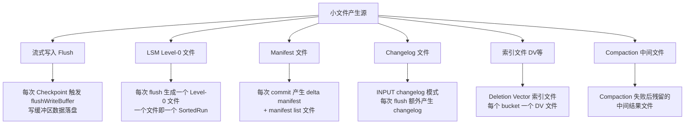
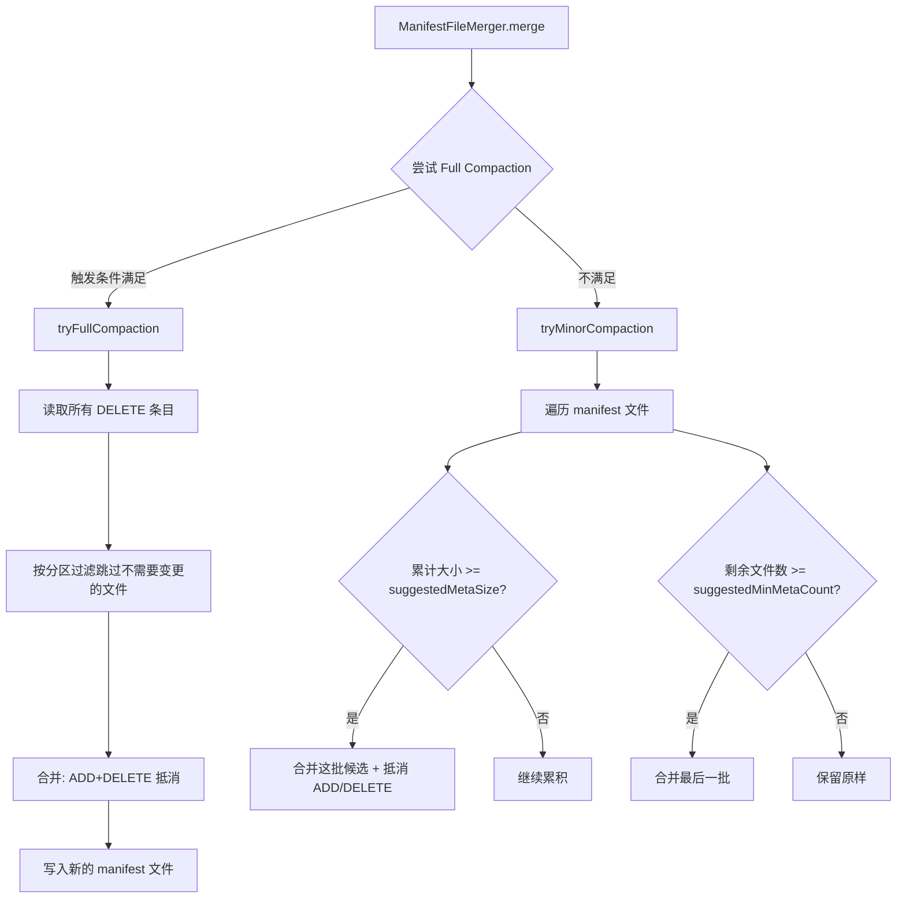
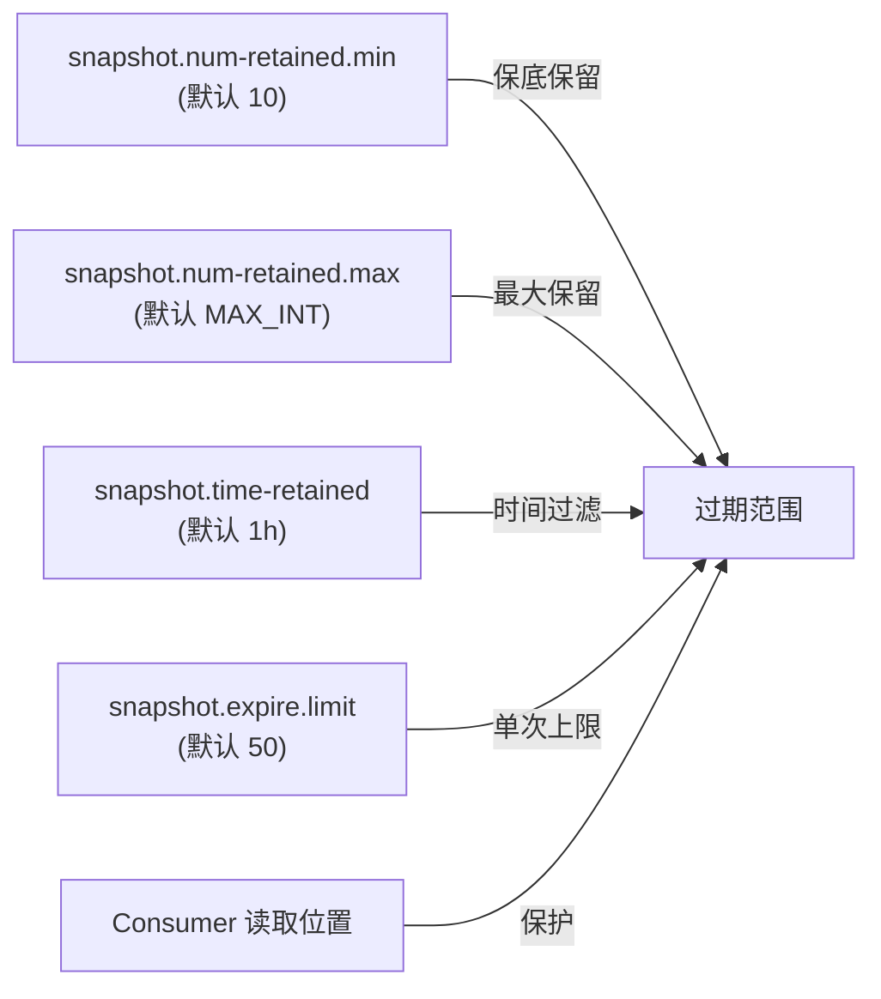
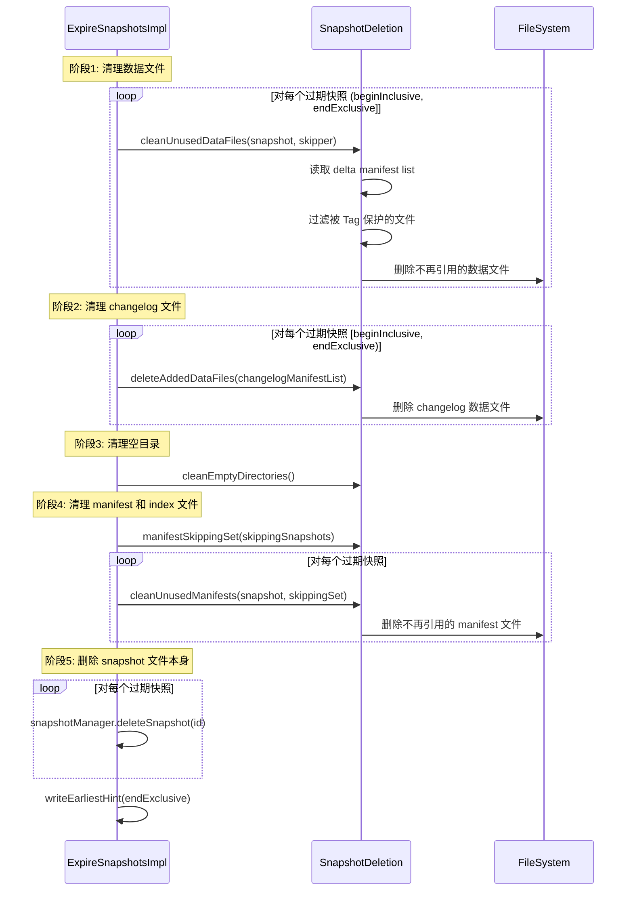
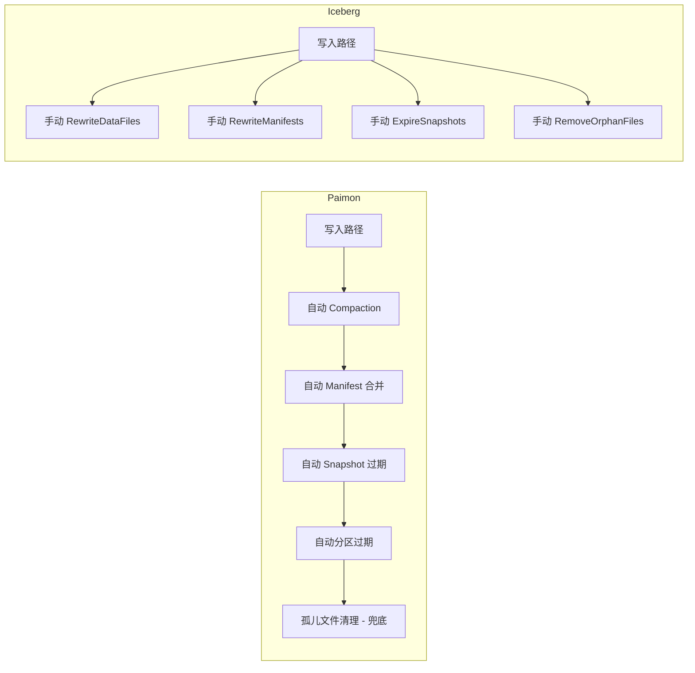

# Apache Paimon 小文件问题成因与治理机制深度分析

> 基于 Paimon 1.5-SNAPSHOT 源码分析，commit: 55f4fd175
> 分析日期: 2026-04-21

---

## 1. 小文件问题的根源分析

### 解决什么问题

**核心业务问题**: 在流式写入场景下,Paimon 每次 Checkpoint 都会将写缓冲区的数据 flush 到磁盘,产生新的数据文件。如果 Checkpoint 间隔短(如 10 秒)且数据吞吐量低,每次 flush 的数据量远小于目标文件大小(128 MB),就会产生大量 KB 级的小文件。

**没有这个设计的后果**: 
- **读性能崩溃**: LSM-Tree 的 Level-0 层每个文件都是独立的 SortedRun,读取时需要合并所有 Level-0 文件。如果 Level-0 有 100 个小文件,每次查询都要打开 100 个文件进行归并排序,读放大严重。
- **元数据爆炸**: HDFS NameNode 需要为每个文件维护元数据(约 150 字节/文件)。100 万个小文件会占用约 150 MB 内存,大规模集群会导致 NameNode OOM。
- **文件系统压力**: 对象存储(如 S3)按请求次数计费,小文件导致 LIST/HEAD 请求数暴增,成本飙升。

**实际场景**:
```java
// 场景: Flink CDC 同步 MySQL binlog 到 Paimon
// Checkpoint 间隔: 10 秒
// 数据吞吐: 100 条/秒,每条 1 KB
// 每次 flush 数据量: 10 秒 * 100 条/秒 * 1 KB = 1 MB
// 产生的文件大小: 1 MB << 128 MB (目标大小)
// 结果: 每 10 秒产生 1 个 1 MB 的小文件,1 小时产生 360 个小文件
```

### 有什么坑

**误区 1: 认为增大 target-file-size 可以解决小文件问题**
```properties
# 错误配置
target-file-size = 1gb  # 期望产生更大的文件
```
**真相**: `target-file-size` 只是目标值,不是最小值。如果一次 flush 的数据量只有 1 MB,无论 target 设置多大,产生的文件仍然是 1 MB。正确做法是增大 `write-buffer-size` 或降低 Checkpoint 频率。

**误区 2: 关闭 Compaction 以提升写入性能**
```properties
# 危险配置
num-sorted-run.compaction-trigger = 999999  # 几乎不触发 Compaction
```
**后果**: Level-0 文件数无限增长,读性能指数级下降。生产环境曾出现 Level-0 累积 5000+ 文件,单次查询耗时从毫秒级退化到分钟级。

**误区 3: INPUT changelog 模式下忽略 changelog 文件**
```java
// 启用 INPUT changelog 模式
table.set("changelog-producer", "input");
```
**陷阱**: 每次 flush 会产生**两份文件**:数据文件 + changelog 文件。如果只关注数据文件的 Compaction,changelog 文件会持续堆积。需要配置 `changelog.num-retained.min/max` 控制 changelog 生命周期。

**生产环境注意事项**:
- **分区 × bucket 乘法效应**: 如果表有 100 个分区、每个分区 10 个 bucket,每次 Checkpoint 最多产生 1000 个文件(每个 partition-bucket 组合一个文件)。
- **Compaction 延迟**: 异步 Compaction 有延迟,在高峰期可能跟不上写入速度。需要监控 `levels.numberOfSortedRuns()` 指标,接近 `stop-trigger` 时说明 Compaction 压力大。

### 核心概念解释

**LSM-Tree (Log-Structured Merge-Tree)**:
- 一种写优化的数据结构,将随机写转换为顺序写。数据先写入内存(MemTable),达到阈值后 flush 到磁盘成为不可变文件(SSTable)。
- Paimon 的 LSM-Tree 分为多层(Level-0, Level-1, ..., Level-max),Level-0 的文件可能有 Key 范围重叠,高层文件则按 Key 范围分区且不重叠。

**SortedRun**:
- 一组按 Key 排序的数据文件。在 Level-0,每个文件是一个独立的 SortedRun;在高层,同一层的所有文件组成一个 SortedRun。
- 读取时需要合并所有 SortedRun,因此 SortedRun 数量直接影响读放大。

**Flush vs Compaction**:
- **Flush**: 将内存中的写缓冲区(WriteBuffer)持久化到磁盘,产生新的 Level-0 文件。触发时机:Checkpoint、缓冲区满、手动触发。
- **Compaction**: 将多个小文件合并为大文件,同时消除重复 Key 和删除标记。触发时机:SortedRun 数量超过阈值、空间放大超标、定期触发。

**与其他系统对比**:
| 系统 | 小文件产生原因 | 治理方式 |
|------|---------------|---------|
| **Paimon** | LSM-Tree flush + 流式 Checkpoint | 自动 Compaction(内置于写入路径) |
| **Iceberg** | 批量写入的文件大小控制不当 | 手动 RewriteDataFiles Action |
| **Hudi** | MOR 表的 delta log 累积 | Compaction(异步或同步) |
| **Delta Lake** | 流式写入的 micro-batch | Auto Compaction(可选) |

### 设计理念

**为什么 Paimon 选择 LSM-Tree 而不是 Copy-on-Write**:

1. **流式写入友好**: LSM-Tree 的顺序写特性天然适配流式场景。每次 Checkpoint 只需追加新文件,无需读取旧文件,写入延迟稳定。
2. **更新性能**: 对于主键表,LSM-Tree 通过 merge-on-read 实现高效更新。相比 Copy-on-Write(如 Iceberg 的 MOR 表),避免了每次更新都重写整个文件。
3. **写放大可控**: 通过 Universal Compaction 策略,可以在写放大和读放大之间找到平衡点。

**权衡取舍**:
- **优势**: 写入吞吐高、延迟低、支持高频更新
- **代价**: 需要后台 Compaction 线程、读取时需要合并多个文件、存储空间有放大

**架构演进**:
- **早期版本**: Compaction 与写入同步执行,写入延迟不稳定
- **当前版本**: 异步 Compaction + 反压机制,写入和 Compaction 解耦,同时通过 `shouldWaitForLatestCompaction` 防止 Level-0 爆炸
- **未来方向**: Dedicated Compaction 模式(write-only + 独立 Compaction 作业)成为生产环境推荐方案

**业界对比**:
- **RocksDB**: Paimon 的 Universal Compaction 借鉴自 RocksDB,但针对分布式存储做了优化(如分区过滤、manifest 合并)
- **Iceberg**: Iceberg 将 Compaction 视为维护操作,留给用户管理。Paimon 将其视为存储引擎核心职责,自动化程度更高。

---

Paimon 作为基于 LSM-Tree 的湖格式存储，其写入模型天然会产生大量小文件。理解小文件的产生机制是治理的前提。

### 1.1 小文件产生的场景全景



### 1.2 流式写入：每次 Checkpoint 产生文件

**源码位置**: `MergeTreeWriter.flushWriteBuffer()` (MergeTreeWriter.java:209-249)

```java
private void flushWriteBuffer(boolean waitForLatestCompaction, boolean forcedFullCompaction)
        throws Exception {
    if (writeBuffer.size() > 0) {
        // 创建 RollingFileWriter，level = 0，来源标记为 APPEND
        final RollingFileWriter<KeyValue, DataFileMeta> dataWriter =
                writerFactory.createRollingMergeTreeFileWriter(0, FileSource.APPEND);

        // 如果是 INPUT changelog 模式，还会额外创建一个 changelog writer
        final RollingFileWriter<KeyValue, DataFileMeta> changelogWriter =
                changelogProducer == ChangelogProducer.INPUT
                        ? writerFactory.createRollingChangelogFileWriter(0) : null;
        try {
            writeBuffer.forEach(keyComparator, mergeFunction,
                    changelogWriter == null ? null : changelogWriter::write,
                    dataWriter::write);
        } finally {
            writeBuffer.clear();
            if (changelogWriter != null) changelogWriter.close();
            dataWriter.close();
        }
        // 新文件加入 Level-0
        for (DataFileMeta fileMeta : dataWriter.result()) {
            newFiles.add(fileMeta);
            compactManager.addNewFile(fileMeta);
        }
    }
    // flush 完成后尝试触发 compaction
    trySyncLatestCompaction(waitForLatestCompaction);
    compactManager.triggerCompaction(forcedFullCompaction);
}
```

**为什么这么做**: 流式场景下，Flink 每次 Checkpoint 都会调用 `prepareCommit()`，进而触发 `flushWriteBuffer()`。写缓冲区（`SortBufferWriteBuffer`，默认 256 MB）中的数据被排序、合并后写入 Level-0 文件。这意味着:

- **Checkpoint 间隔越短，产生的小文件越多**。例如 10 秒 Checkpoint 间隔 + 低吞吐量 = 大量 KB 级小文件。
- 每个 partition-bucket 组合独立 flush，分区越多、bucket 越多，文件数呈乘法增长。
- INPUT changelog 模式下，每次 flush 会**额外产生一份 changelog 文件**，文件数翻倍。

**好处**: 及时 flush 保证了数据的持久性和低延迟可见性，是流式处理的基本要求。

### 1.3 LSM Level-0 文件特性

**源码位置**: `Levels.java` (mergetree/Levels.java:39-80)

Level-0 是 LSM-Tree 的特殊层：**每个文件都是一个独立的 SortedRun**。这意味着:
- Level-0 的文件之间可能存在 Key 范围重叠
- 读取时需要合并所有 Level-0 文件 + 高层文件，文件越多读放大越严重
- Level-0 文件数直接影响读取性能

`Levels` 类使用 `TreeSet` 按 `maxSequenceNumber` 降序组织 Level-0 文件，保证了新数据优先被读到。

### 1.4 RollingFileWriter 的文件大小控制

**源码位置**: `RollingFileWriterImpl.java` (io/RollingFileWriterImpl.java:38-176)

```java
public class RollingFileWriterImpl<T, R> implements RollingFileWriter<T, R> {
    private final long targetFileSize;  // 目标文件大小
    
    private boolean rollingFile(boolean forceCheck) throws IOException {
        // 每写入 1000 条记录检查一次（CHECK_ROLLING_RECORD_CNT = 1000）
        return currentWriter.reachTargetSize(
                forceCheck || recordCount % CHECK_ROLLING_RECORD_CNT == 0, targetFileSize);
    }
    
    public void write(T row) throws IOException {
        if (currentWriter == null) openCurrentWriter();
        currentWriter.write(row);
        recordCount += 1;
        if (rollingFile(false)) {
            closeCurrentWriter();  // 关闭当前文件，下次写入时打开新文件
        }
    }
}
```

**目标文件大小默认值** (`CoreOptions.java`):
- 主键表: `128 MB`（`VALUE_128_MB`）
- Append-only 表: `256 MB`（`VALUE_256_MB`）
- 通过 `target-file-size` 配置项调整

**为什么这么做**: RollingFileWriter 通过采样检查（每 1000 条）判断是否达到目标大小，达到后关闭当前文件并在下次写入时创建新文件。这保证了单个文件不会过大，同时避免了过于频繁的大小检查开销。

**好处**: 
- 控制单文件大小，避免 ORC/Parquet 文件过大导致内存压力
- 采样检查而非逐条检查，降低了性能开销
- 但在流式场景下，如果一次 flush 的数据量远小于 target-file-size，产出的文件仍然是小文件

### 1.5 Manifest 和 Changelog 小文件

每次 commit 会产生:
- **delta manifest 文件**: 记录本次 commit 新增/删除的数据文件元信息
- **manifest list 文件**: 索引所有 manifest 文件
- **changelog manifest** (如果启用 changelog): 记录变更日志文件

高频 commit（例如每秒一次 Checkpoint）会快速积累大量 manifest 小文件。

### 1.6 索引文件（Deletion Vector）

Deletion Vector 以 bitmap 形式记录每个数据文件中被删除的行。每个 bucket 维护独立的 DV 索引文件，随着数据更新和删除操作增多，DV 文件数量也会增长。

---

## 2. 数据文件的小文件治理

### 2.1 Compaction 机制(主键表)

### 解决什么问题

**核心业务问题**: 流式写入持续产生 Level-0 小文件,如果不及时合并,会导致:
1. **读放大爆炸**: 查询需要打开并合并所有 Level-0 文件。100 个 Level-0 文件意味着每次查询要做 100 路归并排序。
2. **空间放大**: 相同 Key 的多个版本分散在不同文件中,删除标记(tombstone)也占用空间,实际存储空间远大于有效数据。
3. **写入阻塞**: Level-0 文件数超过 `stop-trigger` 后,写入线程被强制阻塞等待 Compaction 完成,导致 Checkpoint 超时。

**没有这个设计的后果**:
```java
// 生产环境真实案例
// 场景: 电商订单表,高峰期 10 万 TPS 写入
// 未配置 Compaction: Level-0 累积 3000+ 文件
// 查询延迟: 从 50ms 退化到 30 秒
// 根因: 每次查询打开 3000 个文件,文件系统 inode 缓存失效,大量磁盘 I/O
```

**实际场景**:
- **CDC 同步**: MySQL binlog 持续写入,每秒产生 1 个小文件,1 小时 3600 个文件
- **IoT 数据**: 传感器数据高频写入,每个设备一个 bucket,设备数 × 文件数呈乘法增长
- **实时数仓**: 多张维表 JOIN 后写入事实表,查询需要读取所有 Level-0 文件

### 有什么坑

**误区 1: 认为 Compaction 越频繁越好**
```properties
# 错误配置
num-sorted-run.compaction-trigger = 2  # 2 个文件就触发合并
```
**后果**: 写放大严重。假设每次 flush 产生 1 MB 文件,触发阈值为 2,则:
- 第 1 次 flush: 1 MB
- 第 2 次 flush: 1 MB,触发 Compaction,合并为 2 MB
- 第 3 次 flush: 1 MB,与 2 MB 合并为 3 MB
- 第 4 次 flush: 1 MB,与 3 MB 合并为 4 MB
- 累计写入: 1 + 1 + 2 + 1 + 3 + 1 + 4 = 13 MB,写放大 = 13 / 4 = 3.25 倍

**误区 2: 忽略 Size Amplification 参数**
```properties
# 危险配置
compaction.max-size-amplification-percent = 500  # 允许 5 倍空间放大
```
**后果**: 存储成本失控。如果有效数据 100 GB,允许 5 倍放大意味着可能占用 500 GB 存储空间。对象存储按容量计费,成本直接翻 5 倍。

**误区 3: 在 Compaction 高峰期手动触发全量合并**
```sql
-- 危险操作
CALL sys.compact('my_table', '', '', '', 'full');  -- 强制全量合并
```
**后果**: 全量 Compaction 会读取所有文件并重写,I/O 压力巨大。如果在业务高峰期执行,可能导致:
- 写入线程被反压阻塞
- 磁盘 I/O 打满,影响其他作业
- Compaction 任务 OOM(需要同时打开所有文件)

**生产环境注意事项**:
- **监控 SortedRun 数量**: 通过 `$files` 系统表监控 `level = 0` 的文件数,接近 `stop-trigger` 时需要介入
- **Compaction 线程池大小**: 默认单线程执行 Compaction,对于多 bucket 表,可以考虑增加 `compaction.max-parallel-compactions`
- **内存配置**: Compaction 需要同时打开多个文件,每个文件的 Reader 占用内存。大文件 Compaction 可能导致 OOM。

### 核心概念解释

**Universal Compaction**:
- 一种 LSM-Tree 的 Compaction 策略,源自 RocksDB。与 Leveled Compaction 不同,Universal Compaction 不严格维护层间大小比例,而是根据多个触发条件灵活选择合并范围。
- 优势: 写放大更低,适合写多读少的场景
- 劣势: 空间放大可能更高,需要通过 `max-size-amplification-percent` 控制

**三级触发逻辑**:
1. **Size Amplification(空间放大)**: 候选文件总大小 / 最大层大小 > 阈值,触发全量合并
2. **Size Ratio(大小比例)**: 相邻 SortedRun 的大小比例不合理,触发部分合并
3. **File Number(文件数量)**: SortedRun 数量超过阈值,触发合并

**CompactUnit**:
- Compaction 的执行单元,包含:
  - `outputLevel`: 合并后文件的目标层级
  - `files`: 参与合并的文件列表
  - `dropDelete`: 是否丢弃删除标记(只有全量合并到 maxLevel 时才为 true)

**与其他系统对比**:
| 系统 | Compaction 策略 | 触发方式 | 写放大 | 空间放大 |
|------|----------------|---------|--------|---------|
| **Paimon** | Universal Compaction | 自动(三级触发) | 中等 | 可控(max-size-amplification-percent) |
| **RocksDB** | Universal / Leveled | 自动 | Leveled 高 / Universal 低 | Universal 高 / Leveled 低 |
| **Iceberg** | BinPacking | 手动触发 | 低(按需合并) | 高(不合并则持续增长) |
| **Hudi** | Inline / Async | 可配置 | 中等 | 中等 |

### 设计理念

**为什么选择 Universal Compaction 而不是 Leveled Compaction**:

1. **写放大更低**: Leveled Compaction 在层间合并时,需要读取下一层的所有重叠文件并重写。Universal Compaction 可以只合并部分 SortedRun,减少不必要的重写。
2. **适配流式场景**: 流式写入的特点是持续产生小文件,Universal Compaction 的文件数量触发机制能快速响应。
3. **灵活性**: 三级触发逻辑提供了多个调优维度,可以根据业务特点(读多写多、存储成本敏感度)灵活配置。

**权衡取舍**:
- **优势**: 
  - 写放大低,适合高吞吐写入
  - 自动化程度高,无需人工干预
  - 反压机制保证读性能不会无限退化
- **代价**:
  - 空间放大可能较高(需要配置 max-size-amplification-percent)
  - Compaction 过程中占用 CPU 和 I/O 资源
  - 单任务飞行模型限制了并发度(同一 bucket 同时只能有一个 Compaction 任务)

**架构演进**:
- **早期版本**: 只有文件数量触发,容易导致空间放大
- **当前版本**: 三级触发 + EarlyFullCompaction + pickFullCompaction,覆盖了各种场景
- **未来方向**: 
  - 支持多任务并发 Compaction(目前是单任务飞行)
  - 基于 Cost-Based 的 Compaction 策略选择(根据读写比例动态调整)

**业界对比**:
- **RocksDB**: Paimon 的 Universal Compaction 直接借鉴自 RocksDB,但做了分布式存储的适配:
  - 增加了分区过滤优化
  - 支持 Deletion Vector 的清理
  - 与 Snapshot 过期联动
- **Iceberg**: Iceberg 的 BinPacking 策略更简单,只按文件大小打包合并,没有层级概念。优点是灵活,缺点是需要外部调度。

---

Paimon 的主键表使用 **Universal Compaction** 策略，借鉴自 RocksDB。

#### 2.1.1 三级触发逻辑

**源码位置**: `UniversalCompaction.pick()` (compact/UniversalCompaction.java:67-107)

```java
public Optional<CompactUnit> pick(int numLevels, List<LevelSortedRun> runs) {
    int maxLevel = numLevels - 1;

    // 第 0 级: 提前触发全量 Compaction（可选）
    if (earlyFullCompact != null) {
        Optional<CompactUnit> unit = earlyFullCompact.tryFullCompact(numLevels, runs);
        if (unit.isPresent()) return unit;
    }

    // 第 1 级: 检查空间放大（Size Amplification）
    CompactUnit unit = pickForSizeAmp(maxLevel, runs);
    if (unit != null) return Optional.of(unit);

    // 第 2 级: 检查大小比例（Size Ratio）
    unit = pickForSizeRatio(maxLevel, runs);
    if (unit != null) return Optional.of(unit);

    // 第 3 级: 检查文件数量（File Number）
    if (runs.size() > numRunCompactionTrigger) {
        int candidateCount = runs.size() - numRunCompactionTrigger + 1;
        return Optional.ofNullable(pickForSizeRatio(maxLevel, runs, candidateCount));
    }
    return Optional.empty();
}
```

**三级触发的详细机制:**

| 级别 | 触发条件 | 目的 | 配置项 |
|------|---------|------|--------|
| 0 | 时间间隔/总大小/增量大小阈值 | 定期做全量 Compaction，清理删除标记 | `compaction.optimization-interval`、`compaction.total-size-threshold`、`compaction.incremental-size-threshold` |
| 1 | `候选文件总大小 * 100 > maxSizeAmp * 最大层大小` | 控制空间放大，防止存储空间浪费 | `compaction.max-size-amplification-percent` (默认 200) |
| 2 | 相邻 SortedRun 大小比例不符合条件 | 维持层间大小梯度，优化读性能 | `compaction.size-ratio` (默认 1) |
| 3 | `runs.size() > numRunCompactionTrigger` | 限制 SortedRun 数量，控制读放大 | `num-sorted-run.compaction-trigger` (默认 5) |

**为什么这么做**: 三级策略按照优先级递减排列。空间放大是最紧急的问题（存储成本），其次是读性能（比例不合理），最后才是文件数量上限。这种分层设计平衡了写放大和读放大。

**好处**:
- 空间放大检查防止存储翻倍
- Size Ratio 检查维持层间数据量的合理比例
- 文件数量限制保证读取性能不会无限退化

#### 2.1.2 EarlyFullCompaction（提前全量合并）

**源码位置**: `EarlyFullCompaction.java` (compact/EarlyFullCompaction.java)

```java
public Optional<CompactUnit> tryFullCompact(int numLevels, List<LevelSortedRun> runs) {
    if (runs.size() == 1) return Optional.empty();  // 只有一层无需合并
    int maxLevel = numLevels - 1;
    
    // 触发条件1: 时间间隔到达
    if (fullCompactionInterval != null) {
        if (lastFullCompaction == null
                || currentTimeMillis() - lastFullCompaction > fullCompactionInterval) {
            return Optional.of(CompactUnit.fromLevelRuns(maxLevel, runs));
        }
    }
    // 触发条件2: 总大小低于阈值（小表快速合并）
    if (totalSizeThreshold != null) {
        long totalSize = runs.stream().mapToLong(r -> r.run().totalSize()).sum();
        if (totalSize < totalSizeThreshold) {
            return Optional.of(CompactUnit.fromLevelRuns(maxLevel, runs));
        }
    }
    // 触发条件3: 增量数据超过阈值
    if (incrementalSizeThreshold != null) {
        long incrementalSize = runs.stream()
                .filter(r -> r.level() != maxLevel)
                .mapToLong(r -> r.run().totalSize()).sum();
        if (incrementalSize > incrementalSizeThreshold) {
            return Optional.of(CompactUnit.fromLevelRuns(maxLevel, runs));
        }
    }
    return Optional.empty();
}
```

**为什么这么做**: `EarlyFullCompaction` 针对的场景是：小表或需要频繁做全量合并的场景。通过时间间隔、总大小阈值、增量大小阈值三个维度，让用户可以灵活控制全量合并的触发频率。

**好处**: 定期全量合并可以彻底清理已删除的数据和旧版本记录，释放存储空间，并优化后续读取性能。

#### 2.1.3 pickFullCompaction（强制全量合并）

**源码位置**: `CompactStrategy.java` (compact/CompactStrategy.java)

```java
static Optional<CompactUnit> pickFullCompaction(
        int numLevels, List<LevelSortedRun> runs,
        @Nullable RecordLevelExpire recordLevelExpire,
        @Nullable BucketedDvMaintainer dvMaintainer,
        boolean forceRewriteAllFiles) {
    int maxLevel = numLevels - 1;
    
    // 特殊情况：只有 maxLevel 的文件
    if (runs.size() == 1 && runs.get(0).level() == maxLevel) {
        List<DataFileMeta> filesToBeCompacted = new ArrayList<>();
        for (DataFileMeta file : runs.get(0).run().files()) {
            if (forceRewriteAllFiles) {
                filesToBeCompacted.add(file);  // 强制重写所有文件
            } else if (recordLevelExpire != null && recordLevelExpire.isExpireFile(file)) {
                filesToBeCompacted.add(file);  // 包含过期记录的文件
            } else if (dvMaintainer != null
                    && dvMaintainer.deletionVectorOf(file.fileName()).isPresent()) {
                filesToBeCompacted.add(file);  // 包含 DV 的文件
            }
        }
        if (filesToBeCompacted.isEmpty()) return Optional.empty();
        return Optional.of(CompactUnit.fromFiles(maxLevel, filesToBeCompacted, true));
    }
    // 多层文件时，全部合并到 maxLevel
    return Optional.of(CompactUnit.fromLevelRuns(maxLevel, runs));
}
```

**为什么这么做**: 全量合并是用户主动触发的（如 `CALL compact()`），它考虑了三种需要重写的场景：强制重写、记录级过期、DV 清理。对于只剩 maxLevel 的数据，不会做无意义的全量重写。

**好处**: 精准判断哪些文件需要重写，避免了不必要的 I/O 开销。

#### 2.1.4 minFileSize 参数对小文件合并的作用

**源码位置**: `MergeTreeCompactTask.java` (compact/MergeTreeCompactTask.java)

```java
protected CompactResult doCompact() throws Exception {
    List<List<SortedRun>> candidate = new ArrayList<>();
    CompactResult result = new CompactResult();

    for (List<SortedRun> section : partitioned) {
        if (section.size() > 1) {
            candidate.add(section);  // 有重叠的 section 必须合并
        } else {
            SortedRun run = section.get(0);
            for (DataFileMeta file : run.files()) {
                if (file.fileSize() < minFileSize) {
                    // 小文件：加入候选列表，随前面的文件一起重写
                    candidate.add(singletonList(SortedRun.fromSingle(file)));
                } else {
                    // 大文件：直接升级 level，不重写内容
                    rewrite(candidate, result);
                    upgrade(file, result);
                }
            }
        }
    }
    rewrite(candidate, result);  // 处理剩余候选
    return result;
}
```

**minFileSize 的计算** (`CoreOptions.compactionFileSize()`):

```java
public long compactionFileSize(boolean hasPrimaryKey) {
    return targetFileSize(hasPrimaryKey) / 10 * 7;  // target 的 70%
}
```

即默认主键表为 `128 MB * 0.7 ≈ 89.6 MB`，Append 表为 `256 MB * 0.7 ≈ 179.2 MB`。

**为什么这么做**: Compaction 时，大于 `minFileSize` 的文件只做 level 升级（元数据修改），不重写文件内容。小于阈值的文件则被合并重写为更大的文件。70% 的阈值设计是为了容忍压缩率误差——压缩后的文件可能比 targetFileSize 略小，这不应该被误判为"小文件"而反复重写。

**好处**: 
- 避免对已经足够大的文件做无谓的 I/O
- level 升级（upgrade）只修改元数据中的 level 字段，开销极低
- 小文件在 compaction 过程中被"顺带"合并，无需专门的小文件合并任务

### 2.2 异步 Compaction

### 解决什么问题

**核心业务问题**: 如果 Compaction 与写入同步执行,会导致:
1. **写入延迟抖动**: Compaction 是 I/O 密集型操作,可能耗时数秒到数分钟。同步执行会阻塞写入线程,导致 Checkpoint 超时。
2. **吞吐量下降**: 写入线程被 Compaction 占用,无法接收新数据,整体吞吐量受限于 Compaction 速度。
3. **资源竞争**: 写入和 Compaction 争抢 CPU、内存、磁盘 I/O,导致两者性能都下降。

**没有这个设计的后果**:
```java
// 同步 Compaction 的问题示例
// 场景: 每次 flush 产生 10 MB 文件,Compaction 耗时 5 秒
// Checkpoint 间隔: 10 秒
// 时间线:
// T0: flush 10 MB,触发 Compaction(阻塞 5 秒)
// T5: Compaction 完成,继续写入
// T10: 下一次 Checkpoint,flush 10 MB,又触发 Compaction(阻塞 5 秒)
// 结果: 50% 的时间在等待 Compaction,写入吞吐量减半
```

**实际场景**:
- **流式 ETL**: Flink 作业从 Kafka 读取数据写入 Paimon,如果 Compaction 阻塞写入,会导致 Kafka 消费延迟累积
- **实时大屏**: 数据写入后需要立即可查,同步 Compaction 会延长数据可见性延迟
- **多表并发写入**: 一个 Flink 作业写入多张表,如果每张表的 Compaction 都阻塞写入,整体延迟会累加

### 有什么坑

**误区 1: 认为异步 Compaction 不会影响写入**
```properties
# 错误理解
write-only = false  # 启用异步 Compaction,认为写入不受影响
```
**真相**: 异步 Compaction 虽然不阻塞写入,但仍然会:
- 消耗 CPU 和 I/O 资源,与写入竞争
- 当 SortedRun 数量超过 `stop-trigger` 时,触发反压,强制阻塞写入
- Compaction 失败(如 OOM)会导致小文件持续堆积

**误区 2: 忽略反压机制的存在**
```java
// 生产环境案例
// 配置: num-sorted-run.compaction-trigger = 5, stop-trigger = 8
// 现象: 写入突然卡住,Checkpoint 超时
// 根因: Level-0 文件数达到 8,触发反压,写入被阻塞等待 Compaction
// 解决: 增大 write-buffer-size,减少 flush 频率
```

**误区 3: 在 write-only 模式下不启动 Compaction 作业**
```properties
# 危险配置
write-only = true  # 只写入,不 Compact
# 但忘记启动独立的 Compaction 作业
```
**后果**: 小文件无限堆积,最终导致:
- 读性能崩溃(需要打开数千个文件)
- 元数据爆炸(NameNode OOM)
- 存储空间浪费(大量重复数据和删除标记)

**生产环境注意事项**:
- **监控 Compaction 延迟**: 通过 Flink Metrics 监控 `compactionTime`,如果持续增长说明 Compaction 跟不上写入速度
- **Compaction 失败告警**: Compaction 异常(如 OOM、磁盘满)不会直接导致写入失败,但会导致小文件堆积,需要设置告警
- **资源隔离**: 生产环境推荐使用 Dedicated Compaction 模式,将写入和 Compaction 部署在不同的机器上

### 核心概念解释

**CompactFutureManager**:
- 管理异步 Compaction 任务的生命周期。核心方法:
  - `submitCompaction()`: 提交 Compaction 任务到线程池
  - `innerGetCompactionResult()`: 非阻塞获取 Compaction 结果
  - `shouldWaitForLatestCompaction()`: 判断是否需要阻塞等待 Compaction 完成

**单任务飞行模型(Single Task In-Flight)**:
- 同一时刻,一个 bucket 只能有一个 Compaction 任务在运行。新的 Compaction 请求会等待当前任务完成。
- 原因: 避免多个 Compaction 任务同时修改 Levels 状态,导致文件冲突和数据不一致。

**反压机制(Back Pressure)**:
- 当 SortedRun 数量超过 `stop-trigger` 时,写入线程被强制阻塞,等待 Compaction 完成。
- 目的: 防止 Level-0 文件数无限增长,保证读性能不会崩溃。
- 触发条件:
  - `shouldWaitForLatestCompaction()`: `runs > stop-trigger`
  - `shouldWaitForPreparingCheckpoint()`: `runs > stop-trigger + 1`(Checkpoint 阶段更激进)

**Dedicated Compaction 模式**:
- 将写入和 Compaction 完全分离:
  - **Writer 作业**: 设置 `write-only = true`,只负责写入
  - **Compaction 作业**: 独立的 Flink 作业,调用 `CompactAction`
- 优势: 资源隔离、独立扩缩容、写入延迟更稳定

**与其他系统对比**:
| 系统 | Compaction 执行方式 | 反压机制 | 资源隔离 |
|------|-------------------|---------|---------|
| **Paimon** | 异步(单任务飞行) | 内置(stop-trigger) | 支持(Dedicated Compaction) |
| **RocksDB** | 异步(多线程) | 内置(level0_slowdown_writes_trigger) | 不支持(嵌入式) |
| **Iceberg** | 外部调度 | 无(写入和 Compaction 完全独立) | 天然隔离 |
| **Hudi** | Inline / Async | 可配置(hoodie.compact.inline.max.delta.commits) | 支持(Async Compaction) |

### 设计理念

**为什么选择单任务飞行模型而不是多任务并发**:

1. **状态一致性**: Compaction 需要修改 Levels 的文件列表。多任务并发会导致:
   - 文件冲突: 两个任务可能选择相同的文件进行合并
   - 状态不一致: Levels 的 SortedRun 数量和文件列表可能不匹配
2. **简化实现**: 单任务模型无需复杂的锁机制,代码更简洁,bug 更少
3. **资源可控**: 避免多个 Compaction 任务同时执行导致 I/O 和内存压力过大

**权衡取舍**:
- **优势**:
  - 写入和 Compaction 解耦,写入延迟更稳定
  - 反压机制保证读性能不会无限退化
  - 单任务模型简化了并发控制
- **代价**:
  - 单任务模型限制了 Compaction 吞吐量(对于多 bucket 表,可能成为瓶颈)
  - 异步执行导致 Compaction 结果有延迟,Level-0 文件数可能短暂超过 trigger
  - 需要额外的线程池资源

**架构演进**:
- **早期版本**: 同步 Compaction,写入延迟不稳定
- **当前版本**: 异步 Compaction + 单任务飞行 + 反压机制
- **未来方向**:
  - 支持多任务并发 Compaction(通过文件锁或乐观锁)
  - 基于机器学习的 Compaction 调度(预测写入高峰,提前触发 Compaction)
  - 更细粒度的反压控制(按分区或 bucket 独立反压)

**业界对比**:
- **RocksDB**: RocksDB 支持多线程并发 Compaction(`max_background_compactions`),但需要复杂的锁机制。Paimon 选择单任务模型是因为分布式存储的文件操作成本更高,多任务并发的收益不明显。
- **Iceberg**: Iceberg 的 Compaction 完全外部化,写入和 Compaction 天然隔离。Paimon 的异步模型是一种折中方案,既保证了写入性能,又自动化了 Compaction。

---

#### 2.2.1 CompactFutureManager 线程池模型

**源码位置**: `CompactFutureManager.java` (compact/CompactFutureManager.java)

```java
public abstract class CompactFutureManager implements CompactManager {
    protected Future<CompactResult> taskFuture;
    
    // 非阻塞获取结果
    protected final Optional<CompactResult> innerGetCompactionResult(boolean blocking) {
        if (taskFuture != null) {
            if (blocking || taskFuture.isDone()) {
                CompactResult result = obtainCompactResult();
                taskFuture = null;
                return Optional.of(result);
            }
        }
        return Optional.empty();
    }
}
```

**MergeTreeCompactManager 的提交方式** (compact/MergeTreeCompactManager.java):

```java
private void submitCompaction(CompactUnit unit, boolean dropDelete) {
    CompactTask task = new MergeTreeCompactTask(...);
    // 通过 ExecutorService 提交到独立线程池异步执行
    taskFuture = executor.submit(task);
}
```

**为什么这么做**: Compaction 是 CPU 和 I/O 密集型操作。异步执行使得数据写入不被 Compaction 阻塞，writer 可以继续接收新数据。同时，采用**单任务飞行模型**（同一时刻只有一个 Compaction 任务在运行），避免了资源竞争和文件冲突。

**好处**:
- 写入和 Compaction 解耦，降低写入延迟
- 单任务飞行保证了 Levels 状态的一致性
- 非阻塞结果获取让 writer 在 Compaction 完成时才合并结果

#### 2.2.2 反压机制 (shouldWaitForLatestCompaction)

**源码位置**: `MergeTreeCompactManager.java` (compact/MergeTreeCompactManager.java)

```java
@Override
public boolean shouldWaitForLatestCompaction() {
    return levels.numberOfSortedRuns() > numSortedRunStopTrigger;
}

@Override
public boolean shouldWaitForPreparingCheckpoint() {
    return levels.numberOfSortedRuns() > (long) numSortedRunStopTrigger + 1;
}
```

`numSortedRunStopTrigger` 默认值 = `num-sorted-run.compaction-trigger + 3 = 8`。

**在 MergeTreeWriter.flushWriteBuffer() 中的应用** (MergeTreeWriter.java):

```java
if (compactManager.shouldWaitForLatestCompaction()) {
    waitForLatestCompaction = true;  // 强制阻塞等待 compaction 完成
}
```

**为什么这么做**: 当 SortedRun 数量超过停止阈值时，说明 Compaction 跟不上写入速度。此时强制等待 Compaction 完成后再继续写入，形成**反压**。这是一种流量控制机制，防止 Level-0 文件无限堆积。

**好处**:
- 防止 Level-0 文件数爆炸导致读性能崩溃
- 自动调节写入速度与 Compaction 速度的平衡
- `shouldWaitForPreparingCheckpoint` 额外加了 1 的容差，在 Checkpoint 阶段更积极地等待，避免写入失败后 Level-0 文件持续增长

#### 2.2.3 Dedicated Compaction 模式

Paimon 支持 **write-only** 模式，将写入和 Compaction 完全分离:

- **Writer 作业**: 设置 `write-only = true`，只负责写入数据，不执行 Compaction
- **Compaction 作业**: 独立的 Flink 作业，专门执行 Compaction

**为什么这么做**: 在生产环境中，写入和 Compaction 共享资源会导致:
- Compaction 高峰期写入延迟抖动
- 资源配比难以优化（写入需要内存，Compaction 需要 I/O 和 CPU）

**好处**: 
- 写入和 Compaction 独立扩缩容
- 写入延迟更稳定
- Compaction 作业可以使用更便宜的机器资源

### 2.3 Append 表的小文件治理

### 解决什么问题

**核心业务问题**: Append 表(无主键表)没有 LSM-Tree 的层级结构,所有文件都是平铺的。小文件问题更加严重:
1. **无法利用 Key 范围过滤**: 主键表可以根据查询条件的 Key 范围跳过部分文件,Append 表必须扫描所有文件。
2. **Deletion Vector 碎片化**: 使用 DV 模式时,每次删除操作都会产生新的 DV 索引文件,文件数呈指数增长。
3. **Unaware-bucket 模式的文件爆炸**: 不分 bucket 的表,所有数据写入同一个逻辑分区,文件数量无上限。

**没有这个设计的后果**:
```java
// 生产环境案例
// 场景: 日志表(Append-only),每秒写入 1000 条,Checkpoint 10 秒
// 1 小时产生文件数: 3600 秒 / 10 秒 = 360 个文件
// 1 天产生文件数: 360 * 24 = 8640 个文件
// 查询延迟: SELECT COUNT(*) 需要打开 8640 个文件,耗时 30+ 秒
// 根因: 无 Key 范围过滤,必须全表扫描
```

**实际场景**:
- **日志表**: 应用日志、审计日志、访问日志等,只追加不更新,文件数随时间线性增长
- **事件流**: Kafka 数据直接写入 Paimon,每个 Kafka partition 对应一个 bucket,partition 数 × 文件数
- **DV 模式的更新表**: 使用 Deletion Vector 实现 merge-on-read,每次删除产生新的 DV 文件

### 有什么坑

**误区 1: 认为 Append 表不需要 Compaction**
```properties
# 错误理解
# Append 表没有主键,不需要合并重复数据,所以不需要 Compaction
```
**真相**: Append 表的 Compaction 目的是**合并小文件为大文件**,而不是消除重复数据。不 Compact 的后果:
- 查询需要打开数千个小文件,I/O 放大严重
- 文件系统元数据压力大
- Parquet/ORC 的列式存储优势无法发挥(小文件的压缩率低)

**误区 2: 将 compaction.min.file-num 设置过大**
```properties
# 错误配置
compaction.min.file-num = 100  # 期望累积更多文件再合并
```
**后果**: 文件数长期维持在高位。BinPacking 策略需要累积 100 个文件才触发合并,在低吞吐场景下可能需要数小时甚至数天。正确做法是配合年龄机制(`COMPACT_AGE = 5`),即使文件数不够也会强制合并。

**误区 3: 忽略 DV 模式的 Compaction**
```properties
# 启用 DV 模式
deletion-vectors.enabled = true
# 但未配置 DV 清理
compaction.delete-ratio-threshold = 1.0  # 永远不触发 DV 清理
```
**后果**: DV 文件持续堆积,每个数据文件对应一个 DV 索引文件。查询时需要:
1. 读取数据文件
2. 读取 DV 文件
3. 应用 DV 过滤
双倍的文件打开开销,查询延迟翻倍。

**生产环境注意事项**:
- **监控文件数**: 通过 `$files` 系统表监控每个分区的文件数,超过 1000 需要介入
- **年龄机制的副作用**: 年龄超过 `REMOVE_AGE = 10` 的分区会被从内存移除,下次写入时需要重新扫描,有性能开销
- **openFileCost 参数**: 默认 4 MB,表示打开一个文件的固定开销。对于对象存储(S3),这个值可能需要调大(如 8 MB)

### 核心概念解释

**BinPacking 策略**:
- 一种文件打包算法,将多个小文件按大小排序后装箱,目标是让每个箱子的总大小接近 `targetFileSize`。
- 触发条件:
  1. 累积到 `2 * targetFileSize` 时打包
  2. 文件数达到 `minFileNum`(默认 5)时打包
  3. 年龄超过 `COMPACT_AGE = 5` 时强制打包

**年龄机制(Age Mechanism)**:
- 每次扫描时,未能打包的文件年龄 +1。年龄超过阈值后:
  - `COMPACT_AGE = 5`: 强制合并,即使文件数和大小都不够
  - `REMOVE_AGE = 10`: 从内存移除,避免内存泄漏
- 目的: 保证即使是稀疏写入的分区,小文件最终也会被合并

**AppendCompactCoordinator**:
- Append 表的 Compaction 协调器,负责:
  - 扫描所有分区的文件
  - 按 BinPacking 策略打包文件
  - 提交 Compaction 任务
- 与主键表的 `MergeTreeCompactManager` 不同,它是**全局协调**的,而不是按 bucket 独立执行

**Deletion Vector 清理**:
- 当数据文件的删除比例超过 `compaction.delete-ratio-threshold`(默认 0.2)时,触发 Compaction 重写该文件,同时清理 DV。
- 重写后的文件不再有 DV,查询性能提升。

**与其他系统对比**:
| 系统 | Append 表 Compaction 策略 | 触发方式 | DV 支持 |
|------|--------------------------|---------|---------|
| **Paimon** | BinPacking + 年龄机制 | 自动(每次 commit 检查) | 支持(DV 清理集成在 Compaction 中) |
| **Iceberg** | BinPacking | 手动(RewriteDataFiles) | 不支持(V2 表使用 position delete 文件) |
| **Hudi** | 按文件大小合并 | Inline / Async | 不支持(MOR 表使用 log 文件) |
| **Delta Lake** | Auto Compaction | 自动(可选) | 不支持(使用 deletion vector 但无自动清理) |

### 设计理念

**为什么 Append 表不使用 LSM-Tree**:

1. **无需 Key 排序**: Append 表没有主键,数据无需按 Key 排序。LSM-Tree 的层级结构和 Key 范围分区对 Append 表没有意义。
2. **简化实现**: 平铺的文件结构更简单,无需维护 Levels 状态,Compaction 逻辑也更直观。
3. **灵活性**: BinPacking 策略可以根据文件大小灵活打包,而 LSM-Tree 的层级合并有固定的规则。

**权衡取舍**:
- **优势**:
  - 实现简单,代码量少,bug 少
  - BinPacking 策略灵活,适应各种文件大小分布
  - 年龄机制保证稀疏写入的分区也能被合并
- **代价**:
  - 无法利用 Key 范围过滤,查询必须扫描所有文件
  - 文件数控制完全依赖 Compaction,不像主键表有 `stop-trigger` 反压
  - 全局协调的 Compaction 可能成为瓶颈(需要扫描所有分区)

**架构演进**:
- **早期版本**: 只有简单的文件数量触发,容易导致小文件堆积
- **当前版本**: BinPacking + 年龄机制 + DV 清理,覆盖了各种场景
- **未来方向**:
  - 支持分区级别的 Compaction 优先级(热分区优先合并)
  - 基于查询模式的 Compaction 优化(频繁查询的分区优先合并)
  - 更智能的 BinPacking 算法(考虑文件的时间局部性)

**业界对比**:
- **Iceberg**: Iceberg 的 Append 表 Compaction 也使用 BinPacking,但需要手动触发。Paimon 的自动化程度更高。
- **Hudi**: Hudi 的 MOR 表使用 log 文件存储增量数据,Compaction 时将 log 合并到 base 文件。Paimon 的 Append 表更简单,没有 base/log 的区分。
- **Delta Lake**: Delta Lake 的 Auto Compaction 也是自动触发,但策略较简单,没有年龄机制。

---

#### 2.3.1 AppendOnlyWriter 的写入和 Compaction

**源码位置**: `AppendOnlyWriter.java` (append/AppendOnlyWriter.java)

AppendOnlyWriter 的 flush 和 compaction 流程与 MergeTreeWriter 类似：

```java
void flush(boolean waitForLatestCompaction, boolean forcedFullCompaction) throws Exception {
    List<DataFileMeta> flushedFiles = sinkWriter.flush();  // 将写缓冲区落盘
    flushedFiles.forEach(compactManager::addNewFile);       // 新文件通知 CompactManager
    trySyncLatestCompaction(waitForLatestCompaction);        // 同步等待（如需）
    compactManager.triggerCompaction(forcedFullCompaction);   // 触发 Compaction
    newFiles.addAll(flushedFiles);
}
```

#### 2.3.2 AppendCompactCoordinator 的 BinPacking 策略

**源码位置**: `AppendCompactCoordinator.java` (append/AppendCompactCoordinator.java)

Append 表（尤其是 unaware-bucket 模式）使用 `AppendCompactCoordinator` 进行 Compaction 协调:

```java
// 判断文件是否需要参与 compaction
private boolean shouldCompact(BinaryRow partition, DataFileMeta file) {
    return file.fileSize() < compactionFileSize  // 文件小于阈值（target 的 70%）
            || tooHighDeleteRatio(partition, file); // 或删除比例过高
}
```

**FileBin 打包逻辑** (SubCoordinator 内部类):

```java
private class FileBin {
    List<DataFileMeta> bin = new ArrayList<>();
    long totalFileSize = 0;

    public void addFile(DataFileMeta file) {
        totalFileSize += file.fileSize() + openFileCost;  // 计入打开文件的代价
        bin.add(file);
    }

    private boolean enoughContent() {
        return bin.size() > 1 && totalFileSize >= targetFileSize * 2;  // 至少2个文件，总大小 >= 2*target
    }

    private boolean enoughInputFiles() {
        return bin.size() >= minFileNum;  // 默认 >= 5 个文件
    }
}
```

**年龄机制**:
```java
private List<List<DataFileMeta>> agePack() {
    List<List<DataFileMeta>> packed = pack(toCompact);
    if (packed.isEmpty()) {
        // 未达到打包条件，增加年龄
        if (++age > COMPACT_AGE && toCompact.size() > 1) {  // COMPACT_AGE = 5
            // 老化超过 5 次扫描，强制合并
            List<DataFileMeta> all = new ArrayList<>(toCompact);
            toCompact.clear();
            packed = Collections.singletonList(all);
        }
    }
    return packed;
}
```

超过 `REMOVE_AGE = 10` 次扫描后，单个文件分区会被从内存移除以避免内存泄漏。

**为什么这么做**: Append 表没有主键和 LSM 层级概念，Compaction 本质上是**将多个小文件合并为大文件**。BinPacking 策略将小文件按大小排序后装箱：
1. 累积到 `2 * targetFileSize` 时打包为一个 Compaction 任务
2. 如果文件数达到 `minFileNum`（默认 5），即使总大小不够也打包
3. 文件如果长期凑不够一个包（年龄超过 5 次扫描），强制合并

**好处**:
- 有序打包减少了随机 I/O
- 年龄机制保证了即使是稀疏写入的分区，小文件最终也会被合并
- `openFileCost` 参数（默认 4 MB）让打包策略考虑了文件打开开销
- DV 模式下按 index 文件分组，避免产生重复的删除文件

---

## 3. Manifest 文件的合并

### 解决什么问题

**核心业务问题**: 每次 commit 都会产生一个 delta manifest 文件,记录本次新增/删除的数据文件。高频 commit(如每秒一次)会快速积累大量 manifest 小文件:
1. **Snapshot 恢复慢**: 读取 Snapshot 时需要加载所有 manifest 文件,文件数越多,启动延迟越长。
2. **元数据查询慢**: 系统表(如 `$files`、`$manifests`)需要扫描所有 manifest,查询延迟随文件数线性增长。
3. **ADD/DELETE 冗余**: 同一个数据文件可能在不同 manifest 中出现多次 ADD 和 DELETE 条目,浪费存储空间。

**没有这个设计的后果**:
```java
// 生产环境案例
// 场景: 实时数仓,Checkpoint 间隔 10 秒
// 1 小时产生 manifest 数: 3600 秒 / 10 秒 = 360 个
// 1 天产生 manifest 数: 360 * 24 = 8640 个
// Snapshot 恢复时间: 需要读取 8640 个 manifest 文件,耗时 30+ 秒
// 根因: 每个 manifest 文件需要一次 S3 GET 请求,8640 次请求串行执行
```

**实际场景**:
- **流式 ETL**: Flink 作业持续写入,每次 Checkpoint 产生一个 manifest
- **多表写入**: 一个作业写入 10 张表,每次 Checkpoint 产生 10 个 manifest
- **Compaction 频繁**: 每次 Compaction 也会产生 manifest(记录文件的删除和新增)

### 有什么坑

**误区 1: 认为 manifest 文件很小,不需要合并**
```properties
# 错误理解
# manifest 文件只有几 KB,不像数据文件有 GB 级别,所以不重要
```
**真相**: manifest 文件虽小,但数量多。8640 个 manifest 文件,即使每个只有 10 KB,总大小也有 86 MB。更重要的是:
- 文件系统的元数据开销(inode)与文件大小无关
- 对象存储的 LIST/GET 请求按次数计费,小文件成本更高
- 读取 8640 个文件的延迟远大于读取 1 个 86 MB 的文件

**误区 2: 手动触发 compactManifest 过于频繁**
```sql
-- 错误操作
-- 每次 commit 后都手动触发 manifest 合并
CALL sys.compact_manifest('my_table');
```
**后果**: `compactManifest()` 使用激进参数(`sizeTrigger=1`),会合并所有可合并的 manifest。频繁调用会导致:
- 大量的文件读写 I/O
- 乐观锁冲突(多个 compactManifest 并发执行)
- 影响正常的 commit 性能

**误区 3: 将 manifest.target-file-size 设置过大**
```properties
# 错误配置
manifest.target-file-size = 128mb  # 期望减少 manifest 文件数
```
**后果**: Minor Compaction 需要累积到 128 MB 才触发,在低吞吐场景下可能需要数小时。manifest 文件数长期维持在高位,影响 Snapshot 恢复性能。推荐保持默认值 8 MB。

**生产环境注意事项**:
- **监控 manifest 文件数**: 通过 `$manifests` 系统表监控文件数,超过 1000 需要介入
- **Full Compaction 的 I/O 开销**: Full Compaction 会读取所有 manifest 并重写,对于大表(数百万文件)可能耗时数分钟
- **分区过滤优化**: Full Compaction 的分区过滤只对多分区表有效,单分区表无法受益

### 核心概念解释

**Manifest 文件的层次结构**:
```
Snapshot
  ├── changelogManifestList (可选,记录 changelog 文件)
  ├── deltaManifestList (本次 commit 的变更)
  └── baseManifestList (上一次 Full Compaction 的结果)

ManifestList 文件
  ├── manifest-1 (记录 partition-1 的文件变更)
  ├── manifest-2 (记录 partition-2 的文件变更)
  └── ...

Manifest 文件
  ├── ADD entry (新增的数据文件)
  ├── DELETE entry (删除的数据文件)
  └── ...
```

**Minor Compaction vs Full Compaction**:
- **Minor Compaction**: 
  - 每次 commit 时自动执行
  - 只合并累积到 `manifest.target-file-size`(默认 8 MB)的小 manifest
  - 不消除 ADD/DELETE 对,只是物理合并文件
  - 开销低,适合高频执行
- **Full Compaction**:
  - 当需要变更的文件总大小达到 `manifest.full-compaction-threshold-size`(默认 16 MB)时触发
  - 读取所有 DELETE 条目,消除 ADD/DELETE 对
  - 使用分区过滤优化,只处理涉及删除的分区
  - 开销高,但彻底清理冗余

**ADD/DELETE 抵消**:
```java
// 示例: 一个数据文件的生命周期
// Commit 1: ADD file-1.parquet (manifest-1)
// Commit 2: Compaction 删除 file-1,新增 file-2 (manifest-2)
//   - DELETE file-1.parquet
//   - ADD file-2.parquet
// Full Compaction 后:
//   - file-1 的 ADD 和 DELETE 抵消,不再出现在 manifest 中
//   - 只保留 file-2 的 ADD
```

**分区过滤优化**:
- Full Compaction 时,只有包含 DELETE 条目的分区需要重写。
- 对于多分区表,如果只有少数分区有删除操作,大部分 manifest 可以直接复用,大幅减少 I/O。

**与其他系统对比**:
| 系统 | Manifest 合并策略 | 触发方式 | ADD/DELETE 抵消 |
|------|------------------|---------|----------------|
| **Paimon** | Minor + Full 两级 | 自动(每次 commit) | 支持(Full Compaction) |
| **Iceberg** | 简单合并 | 手动(RewriteManifests) | 支持 |
| **Hudi** | 无 manifest 概念 | N/A | N/A(使用 timeline) |
| **Delta Lake** | Checkpoint | 自动(每 10 次 commit) | 支持 |

### 设计理念

**为什么需要两级合并策略**:

1. **频率 vs 开销的平衡**: 
   - Minor Compaction 开销低,可以每次 commit 都执行,保证 manifest 文件数不会快速增长
   - Full Compaction 开销高,只在必要时执行,彻底清理冗余
2. **增量 vs 全量的权衡**:
   - Minor Compaction 是增量的,只处理新增的 manifest,不影响历史数据
   - Full Compaction 是全量的,需要读取所有 manifest,但清理效果最好
3. **自动化 vs 可控性**:
   - 自动 Minor Compaction 保证了基本的文件数控制
   - 手动 `compactManifest()` 提供了更激进的清理能力

**权衡取舍**:
- **优势**:
  - 两级策略平衡了合并频率和开销
  - 自动化程度高,无需人工干预
  - 分区过滤优化对多分区表效果显著
  - ADD/DELETE 抵消防止 manifest 无限膨胀
- **代价**:
  - Full Compaction 的 I/O 开销较大(需要读取所有 manifest)
  - 分区过滤优化对单分区表无效
  - 乐观锁机制可能导致并发冲突(多个 commit 同时执行)

**架构演进**:
- **早期版本**: 只有简单的文件数量触发,容易导致 manifest 膨胀
- **当前版本**: Minor + Full 两级策略 + 分区过滤优化
- **未来方向**:
  - 支持并行 Full Compaction(按分区并行处理)
  - 基于 Cost-Based 的合并策略(根据查询模式决定合并频率)
  - 增量 ADD/DELETE 抵消(在 Minor Compaction 中也消除部分冗余)

**业界对比**:
- **Iceberg**: Iceberg 的 manifest 合并需要手动触发,策略较简单。Paimon 的两级策略更自动化。
- **Delta Lake**: Delta Lake 使用 Checkpoint 机制,每 10 次 commit 自动合并 transaction log。Paimon 的策略更灵活(基于文件大小而非固定次数)。
- **Hudi**: Hudi 使用 timeline 机制,没有独立的 manifest 文件,无需合并。但 timeline 本身也会膨胀,需要定期清理。

---

### 3.1 ManifestFileMerger 的合并逻辑

**源码位置**: `ManifestFileMerger.java` (operation/ManifestFileMerger.java)

Manifest 文件的合并分为两级:



#### 3.1.1 Minor Compaction

```java
private static List<ManifestFileMeta> tryMinorCompaction(
        List<ManifestFileMeta> input, ..., long suggestedMetaSize, int suggestedMinMetaCount, ...) {
    List<ManifestFileMeta> candidates = new ArrayList<>();
    long totalSize = 0;
    for (ManifestFileMeta manifest : input) {
        totalSize += manifest.fileSize();
        candidates.add(manifest);
        if (totalSize >= suggestedMetaSize) {       // 达到目标大小（默认 8 MB）
            mergeCandidates(candidates, ...);        // 合并这批小文件
            candidates.clear();
            totalSize = 0;
        }
    }
    if (candidates.size() >= suggestedMinMetaCount) { // 剩余文件数 >= 30
        mergeCandidates(candidates, ...);
    } else {
        result.addAll(candidates);                     // 保留原样
    }
}
```

#### 3.1.2 Full Compaction

```java
public static Optional<List<ManifestFileMeta>> tryFullCompaction(
        List<ManifestFileMeta> inputs, ..., long suggestedMetaSize, long sizeTrigger, ...) {
    // 1. 判断是否需要全量合并
    Filter<ManifestFileMeta> mustChange =
            file -> file.numDeletedFiles() > 0 || file.fileSize() < suggestedMetaSize;
    
    long totalDeltaFileSize = 0;
    for (ManifestFileMeta file : inputs) {
        if (mustChange.test(file)) {
            totalDeltaFileSize += file.fileSize();
        }
    }
    if (totalDeltaFileSize < sizeTrigger) return Optional.empty(); // 16 MB 默认阈值
    
    // 2. 读取所有 DELETE 条目
    Set<FileEntry.Identifier> deleteEntries = FileEntry.readDeletedEntries(manifestFile, inputs, ...);
    
    // 3. 按分区过滤: 与删除条目无关的 manifest 文件可以跳过
    PartitionPredicate predicate = ...; // 基于删除条目的分区集合构建过滤器
    
    // 4. 合并: 跳过 DELETE 条目，过滤已删除的 ADD 条目
    for (ManifestFileMeta file : toBeMerged) {
        for (ManifestEntry entry : manifestFile.read(file.fileName(), file.fileSize())) {
            if (entry.kind() == FileKind.DELETE) continue;       // 跳过 DELETE
            if (deleteEntries.contains(entry.identifier())) {
                requireChange = true;                             // 被删除的 ADD 也跳过
            } else {
                entries.add(entry);                               // 保留有效 ADD
            }
        }
    }
}
```

**为什么这么做**: 
- **Minor Compaction** 在每次 commit 时运行，只合并累积到一定大小的小 manifest 文件，开销较低
- **Full Compaction** 在累积变更达到 16 MB 阈值时触发，会读取并消除所有 ADD/DELETE 对，彻底清理 manifest 中的冗余信息
- 分区过滤优化让 Full Compaction 只处理涉及删除操作的分区，大幅减少 I/O

**好处**:
- 两级合并策略平衡了合并频率和开销
- Full Compaction 的 ADD/DELETE 抵消机制防止 manifest 文件无限膨胀
- 分区过滤优化对多分区表效果显著

### 3.2 配置项

| 配置项 | 默认值 | 作用 |
|--------|--------|------|
| `manifest.target-file-size` | `8 MB` | Manifest 文件的目标大小。Minor Compaction 的合并阈值 |
| `manifest.merge-min-count` | `30` | Minor Compaction 中，剩余文件数达到此值时触发合并 |
| `manifest.full-compaction-threshold-size` | `16 MB` | Full Compaction 的触发阈值（需要变更的文件总大小） |

### 3.3 compactManifest() 在 commit 过程中的调用

**源码位置**: `FileStoreCommitImpl.java` (operation/FileStoreCommitImpl.java)

在正常 commit 流程中（`FileStoreCommitImpl.java`），`ManifestFileMerger.merge()` 在每次提交时被调用，参数使用的是配置项中的默认值。

独立的 `compactManifest()` 方法则用于**手动触发的 manifest 合并**:

```java
public void compactManifest() {
    while (true) {
        boolean success = compactManifestOnce();
        if (success) break;
        // 重试直到成功或超时
    }
}

private boolean compactManifestOnce() {
    // 使用更激进的参数: suggestedMinMetaCount=1, sizeTrigger=1
    // 即合并所有可以合并的 manifest 文件
    mergeAfterManifests = ManifestFileMerger.merge(
            mergeBeforeManifests, manifestFile,
            options.manifestTargetSize().getBytes(),
            1,    // suggestedMinMetaCount = 1，更激进
            1,    // sizeTrigger = 1，只要有变更就做 full compaction
            partitionType, options.scanManifestParallelism());
}
```

**为什么这么做**: 手动 compactManifest 使用更激进的参数（`minCount=1, sizeTrigger=1`），确保所有可合并的 manifest 都被处理。它采用乐观锁+重试的方式处理并发冲突。

---

## 4. Snapshot 过期清理

### 解决什么问题

**核心业务问题**: 每次 commit 都会产生一个新的 Snapshot 文件。如果不定期清理,会导致:
1. **存储空间膨胀**: 旧 Snapshot 引用的数据文件无法删除,即使这些数据已被新的 Compaction 替换。
2. **元数据爆炸**: Snapshot 文件本身占用空间,更重要的是它们引用的 manifest 文件也无法删除。
3. **时间旅行成本**: 保留过多历史 Snapshot 会增加存储成本,但实际业务可能只需要最近几小时的数据。

**没有这个设计的后果**:
```java
// 生产环境案例
// 场景: 实时数仓,Checkpoint 间隔 10 秒,运行 30 天
// Snapshot 数量: 30 天 * 24 小时 * 3600 秒 / 10 秒 = 259,200 个
// 每个 Snapshot 引用的数据文件: 平均 1000 个
// 如果不过期,需要保留的文件数: 259,200 * 1000 = 2.59 亿个文件
// 实际有效数据: 可能只有 100 万个文件(经过 Compaction 合并)
// 空间放大: 259 倍
```

**实际场景**:
- **流式 ETL**: 持续写入,每次 Checkpoint 产生 Snapshot,需要定期清理旧 Snapshot
- **时间旅行查询**: 业务需要查询最近 24 小时的历史数据,超过 24 小时的 Snapshot 可以删除
- **CDC 消费**: 下游消费者需要从特定 Snapshot 开始读取,正在消费的 Snapshot 不能删除

### 有什么坑

**误区 1: 将 snapshot.time-retained 设置过短**
```properties
# 危险配置
snapshot.time-retained = 5min  # 只保留 5 分钟
```
**后果**: 
- 时间旅行查询失败(无法查询 5 分钟前的数据)
- 下游消费者可能正在读取的 Snapshot 被删除,导致消费失败
- Compaction 过程中引用的旧文件被删除,导致 Compaction 失败

**误区 2: 忽略 Consumer 保护机制**
```java
// 场景: Flink 消费 Paimon 表,消费速度慢
// 配置: snapshot.time-retained = 1h
// 现象: 消费者读取的 Snapshot 被过期删除,抛出 FileNotFoundException
// 根因: 消费者未正确注册到 ConsumerManager
```
**解决**: 使用 `StreamingReadBuilder.withContinuousMode()` 或手动调用 `ConsumerManager.registerConsumer()`。

**误区 3: 将 snapshot.expire.limit 设置过大**
```properties
# 错误配置
snapshot.expire.limit = 10000  # 一次删除 10000 个 Snapshot
```
**后果**: 
- 单次过期耗时过长,可能导致 commit 超时
- 大量文件删除操作并发执行,文件系统压力大
- 对象存储的 DELETE 请求数暴增,可能触发限流

**生产环境注意事项**:
- **监控 Snapshot 数量**: 通过 `$snapshots` 系统表监控 Snapshot 数量,异常增长需要介入
- **Consumer 注册**: 确保所有下游消费者正确注册,避免正在使用的 Snapshot 被删除
- **Tag 保护**: 被 Tag 引用的 Snapshot 不会被过期,需要定期清理不需要的 Tag
- **过期延迟**: Snapshot 过期是在 commit 时触发的,如果长时间没有 commit,过期不会执行

### 核心概念解释

**Snapshot 的生命周期**:
```
创建 → 活跃(被查询/消费) → 候选过期(超过 time-retained) → 过期删除
  ↓
保护机制:
  - num-retained.min: 至少保留 N 个
  - Consumer: 正在消费的不删除
  - Tag: 被 Tag 引用的不删除
```

**三个保留参数的交互**:
- `snapshot.num-retained.min`(默认 10): **最高优先级**,无论何时至少保留 10 个
- `snapshot.num-retained.max`(默认 MAX_INT): 超过此值后开始候选过期
- `snapshot.time-retained`(默认 1 小时): 时间未到的不过期

**过期范围计算**:
```java
// 伪代码
long min = max(latestSnapshotId - retainMax + 1, earliest);
long maxExclusive = latestSnapshotId - retainMin + 1;
maxExclusive = min(maxExclusive, consumerManager.minNextSnapshot());
maxExclusive = min(maxExclusive, earliest + expireLimit);

for (long id = min; id < maxExclusive; id++) {
    if (snapshot.timeMillis() > olderThanMillis) {
        break;  // 遇到未过期的 Snapshot,停止
    }
    expireSnapshot(id);
}
```

**文件清理的五个阶段**:
1. **数据文件清理**: 删除不再被任何 Snapshot 引用的数据文件(跳过被 Tag 保护的)
2. **Changelog 文件清理**: 删除 changelog 数据文件
3. **空目录清理**: 删除空的分区目录
4. **Manifest 和索引文件清理**: 删除不再被引用的 manifest、index、statistics 文件
5. **Snapshot 文件删除**: 删除 Snapshot 文件本身,更新 earliest hint

**ConsumerManager 保护机制**:
- 下游消费者通过 `ConsumerManager.registerConsumer()` 注册
- 消费者定期更新 `nextSnapshot`(下一个要消费的 Snapshot ID)
- 过期时,`minNextSnapshot()` 之前的 Snapshot 不会被删除

**与其他系统对比**:
| 系统 | Snapshot 过期策略 | 触发方式 | Consumer 保护 |
|------|------------------|---------|--------------|
| **Paimon** | 数量 + 时间 + Consumer | 自动(每次 commit) | 支持(ConsumerManager) |
| **Iceberg** | 时间 + 引用保护 | 手动(ExpireSnapshots) | 不支持(需要外部协调) |
| **Hudi** | 时间 + 数量 | 自动(Cleaner) | 支持(HoodieTimeline) |
| **Delta Lake** | 时间 | 手动(VACUUM) | 不支持 |

### 设计理念

**为什么需要多重保护机制**:

1. **数量保留(min/max)**: 保证即使时间很短,也至少保留 N 个 Snapshot,避免误删
2. **时间保留**: 支持时间旅行查询,满足业务对历史数据的需求
3. **Consumer 保护**: 防止删除正在被消费的 Snapshot,保证下游作业不中断
4. **Tag 保护**: 支持长期保留特定 Snapshot(如每日快照),不受时间限制
5. **单次限制(expire.limit)**: 避免一次性删除过多文件,导致系统压力

**权衡取舍**:
- **优势**:
  - 多重保护机制保证安全性,不会误删正在使用的 Snapshot
  - 自动化程度高,无需人工干预
  - 灵活的保留策略,适应不同业务需求
  - 分阶段清理,逻辑清晰,易于调试
- **代价**:
  - 多重保护机制增加了复杂性
  - 过期逻辑在 commit 路径中执行,可能影响 commit 延迟
  - Consumer 保护依赖外部注册,如果消费者未正确注册,保护失效

**架构演进**:
- **早期版本**: 只有简单的数量保留,容易误删
- **当前版本**: 多重保护 + 分阶段清理 + Consumer 保护
- **未来方向**:
  - 支持异步过期(将过期逻辑从 commit 路径中移出)
  - 基于存储成本的智能过期(根据存储空间使用率动态调整保留策略)
  - 更细粒度的 Consumer 保护(按分区或 bucket 独立保护)

**业界对比**:
- **Iceberg**: Iceberg 的 ExpireSnapshots 需要手动触发,灵活但需要运维。Paimon 的自动过期更省心。
- **Hudi**: Hudi 的 Cleaner 也是自动触发,但策略较简单。Paimon 的多重保护机制更完善。
- **Delta Lake**: Delta Lake 的 VACUUM 需要手动触发,且没有 Consumer 保护,容易误删。

---

### 4.1 ExpireSnapshotsImpl 的实现

**源码位置**: `ExpireSnapshotsImpl.java` (table/ExpireSnapshotsImpl.java)

#### 4.1.1 过期范围计算

```java
public int expire() {
    int retainMax = expireConfig.getSnapshotRetainMax();
    int retainMin = expireConfig.getSnapshotRetainMin();
    int maxDeletes = expireConfig.getSnapshotMaxDeletes();
    long olderThanMills = System.currentTimeMillis() - expireConfig.getSnapshotTimeRetain().toMillis();

    // 计算应该保留的最小 snapshotId
    long min = Math.max(latestSnapshotId - retainMax + 1, earliest);

    // 计算最大可过期的 snapshotId（排他）
    long maxExclusive = latestSnapshotId - retainMin + 1;

    // 保护: consumer 正在读取的 snapshot 不能删除
    maxExclusive = Math.min(maxExclusive, consumerManager.minNextSnapshot().orElse(Long.MAX_VALUE));

    // 保护: 一次最多删除 maxDeletes 个（默认 50）
    maxExclusive = Math.min(maxExclusive, earliest + maxDeletes);

    // 时间保留: 遇到未过期的 snapshot 立即停止
    for (long id = min; id < maxExclusive; id++) {
        Snapshot snapshot = snapshotManager.tryGetSnapshot(id);
        if (olderThanMills <= snapshot.timeMillis()) {
            return expireUntil(earliest, id);  // 此 snapshot 未过期，到此为止
        }
    }
    return expireUntil(earliest, maxExclusive);
}
```

#### 4.1.2 三个参数的交互关系



| 参数 | 默认值 | 优先级/作用 |
|------|--------|------------|
| `snapshot.num-retained.min` | 10 | **最高优先级**，无论何时至少保留 10 个快照 |
| `snapshot.num-retained.max` | Integer.MAX_VALUE | 快照数超过此值后开始候选过期 |
| `snapshot.time-retained` | 1 hour | 时间未到的快照不过期（即使超过 max 数量限制） |
| `snapshot.expire.limit` | 50 | 一次最多过期 50 个快照，避免大批量删除造成卡顿 |

**交互逻辑**: `retainMin` 先划出不可过期的范围 → `retainMax` 从最老的开始候选 → `timeRetain` 过滤候选中未到期的 → `expireLimit` 限制单次数量 → `consumer` 保护正在使用的快照。

**为什么这么做**: 多重保护机制确保:
- 不会误删正在被查询的快照
- 不会一次性删除过多文件导致文件系统压力
- 时间保留和数量保留双重控制，适应不同业务场景

### 4.2 文件清理流程

**源码位置**: `ExpireSnapshotsImpl.java` (table/ExpireSnapshotsImpl.java)



**关键设计细节**:
- **Tag 保护**: 被 Tag 引用的快照中的数据文件不会被删除。通过 `createDataFileSkipperForTags` 构建跳过集合
- **Changelog 解耦**: 当 `changelogDecoupled = true` 时，snapshot 过期不会删除 APPEND 类型的数据文件，这些文件由独立的 Changelog 过期机制管理
- **并行删除**: 使用 `fileExecutor` 并行执行文件删除操作
- **Manifest 跳过集**: 需要被后续 snapshot/tag 引用的 manifest 文件不会被删除

### 4.3 SnapshotDeletion、ChangelogDeletion、TagDeletion 的职责分工

| 类 | 继承自 | 负责清理的内容 |
|---|--------|---------------|
| `SnapshotDeletion` | `FileDeletionBase<Snapshot>` | 普通快照过期时的数据文件、manifest 文件、index 文件、统计文件 |
| `ChangelogDeletion` | `FileDeletionBase<Changelog>` | Changelog 独立过期时的 changelog 数据文件和 manifest |
| `TagDeletion` | `FileDeletionBase<Snapshot>` | Tag 删除时的数据文件清理（需要检查其他 Tag/Snapshot 是否仍引用） |

三者共享 `FileDeletionBase` 的通用逻辑：manifest 读取、数据文件路径构建、并行文件删除等。

**为什么这么做**: 快照、Changelog、Tag 三种生命周期可以独立管理。例如，Changelog 可以比 Snapshot 保留更长时间（用于 CDC 消费），Tag 可以有独立的 TTL。分离的删除器避免了复杂的条件判断。

---

## 5. 分区过期

### 解决什么问题

**核心业务问题**: 对于按时间分区的表(如按天、按小时分区),历史分区的数据通常不再需要查询,但仍然占用存储空间。分区过期提供了**批量删除**的能力:
1. **存储成本优化**: 删除整个分区比逐个删除文件高效得多,一次操作可以释放 GB 甚至 TB 级别的空间。
2. **合规性要求**: 某些业务(如日志、审计)有数据保留期限要求,超过期限必须删除。
3. **查询性能**: 减少分区数量可以加速分区裁剪,提升查询性能。

**没有这个设计的后果**:
```java
// 生产环境案例
// 场景: 日志表,按天分区,保留 30 天
// 不使用分区过期,依赖 Snapshot 过期:
//   - Snapshot 过期只删除不再被引用的文件
//   - 如果某个分区的文件一直被最新 Snapshot 引用,永远不会被删除
//   - 结果: 历史分区持续占用空间,存储成本失控
// 使用分区过期:
//   - 直接删除整个分区,无论文件是否被引用
//   - 30 天前的分区一次性删除,存储空间立即释放
```

**实际场景**:
- **日志表**: 应用日志、访问日志,按天分区,保留 7-30 天
- **事实表**: 订单表、交易表,按月分区,保留 12 个月
- **临时表**: 中间结果表,按小时分区,保留 24 小时

### 有什么坑

**误区 1: 认为分区过期会自动触发**
```properties
# 错误理解
partition.expiration-time = 7d  # 设置后就会自动删除 7 天前的分区
```
**真相**: 分区过期只在**有新 commit 时**才会检查。如果表长时间没有写入,过期不会执行。需要:
- 定期写入数据(即使是空 commit)
- 或使用独立的过期作业(如 Flink 定时任务)

**误区 2: 分区值格式不匹配**
```sql
-- 错误示例
CREATE TABLE logs (
    dt STRING,  -- 分区字段类型为 STRING
    ...
) PARTITIONED BY (dt);

-- 插入数据时使用不同格式
INSERT INTO logs PARTITION (dt='2024-01-01') ...;  -- 格式 1
INSERT INTO logs PARTITION (dt='20240101') ...;    -- 格式 2
```
**后果**: `partition.expiration-strategy = values-time` 依赖分区值解析时间。格式不一致会导致:
- 部分分区无法解析时间,不会被过期
- 或解析错误,导致误删

**误区 3: 忽略 end-input 检查**
```properties
# 配置
partition.end-input-to-done-trigger = true
```
**陷阱**: 启用后,只有在作业接收到 `end-input` 信号(如批作业结束)时才会触发分区过期。流式作业永远不会收到 `end-input`,导致分区过期永远不执行。

**生产环境注意事项**:
- **监控过期执行**: 通过日志监控分区过期是否正常执行,避免配置错误导致不生效
- **分批删除**: 使用 `partition.expiration-batch-size` 控制单次删除的分区数,避免一次性删除过多导致 commit 超时
- **时区问题**: 分区值的时间解析依赖系统时区,跨时区部署需要注意

### 核心概念解释

**分区过期策略**:
- `values-time`(默认): 从分区值中解析时间,如 `dt=2024-01-01` 解析为 2024-01-01 00:00:00
- `update-time`: 使用分区的最后更新时间(文件修改时间)

**过期时间计算**:
```java
// 当前时间 - expiration-time = 过期时间点
LocalDateTime expireDateTime = now.minus(expirationTime);

// 对于 values-time 策略
// 分区值解析的时间 < expireDateTime 则过期
```

**检查间隔**:
- `partition.expiration-check-interval`(默认 1 小时): 两次检查的最小间隔
- 目的: 避免每次 commit 都扫描所有分区,降低开销

**分批删除**:
- `partition.expiration-batch-size`: 单次最多删除的分区数
- 如果过期分区数超过此值,会分多次 commit 删除
- 目的: 避免单次 commit 删除过多分区导致超时

**与其他系统对比**:
| 系统 | 分区过期支持 | 触发方式 | 策略 |
|------|------------|---------|------|
| **Paimon** | 支持 | 自动(每次 commit 检查) | values-time / update-time |
| **Iceberg** | 不支持 | N/A(需要手动 DELETE) | N/A |
| **Hudi** | 支持 | 自动(Cleaner) | 基于时间 |
| **Delta Lake** | 不支持 | N/A(需要手动 DELETE) | N/A |

### 设计理念

**为什么需要分区过期而不是只依赖 Snapshot 过期**:

1. **效率**: 分区过期是批量操作,一次删除整个分区的所有文件。Snapshot 过期是逐文件检查,效率低。
2. **语义清晰**: 分区过期的语义是"删除 N 天前的数据",与业务需求直接对应。Snapshot 过期的语义是"删除不再被引用的文件",间接。
3. **合规性**: 某些业务有明确的数据保留期限,分区过期可以保证合规。

**权衡取舍**:
- **优势**:
  - 批量删除效率高,一次操作释放大量空间
  - 语义清晰,易于理解和配置
  - 支持两种策略(values-time / update-time),适应不同场景
  - 分批删除避免单次操作过大
- **代价**:
  - 依赖 commit 触发,长时间无写入则不执行
  - values-time 策略依赖分区值格式,格式不一致会出问题
  - 删除是不可逆的,误配置可能导致数据丢失

**架构演进**:
- **早期版本**: 不支持分区过期,只能手动删除
- **当前版本**: 支持两种策略 + 分批删除 + 检查间隔控制
- **未来方向**:
  - 支持更灵活的过期策略(如保留最近 N 个分区)
  - 支持异步过期(独立的过期作业,不依赖 commit)
  - 支持分区级别的 TTL(每个分区独立设置过期时间)

**业界对比**:
- **Hudi**: Hudi 的分区过期也是自动触发,但策略较简单。Paimon 的两种策略更灵活。
- **Iceberg/Delta Lake**: 不支持分区过期,需要手动执行 DELETE 语句。Paimon 的自动化程度更高。

---

### 5.1 PartitionExpire 的实现

**源码位置**: `PartitionExpire.java` (operation/PartitionExpire.java)

```java
List<Map<String, String>> expire(LocalDateTime now, long commitIdentifier) {
    // 1. 检查是否到达检查间隔
    if (checkInterval.isZero()
            || now.isAfter(lastCheck.plus(checkInterval))
            || (endInputCheckPartitionExpire && Long.MAX_VALUE == commitIdentifier)) {
        // 2. 计算过期时间点
        List<Map<String, String>> expired = doExpire(now.minus(expirationTime), commitIdentifier);
        lastCheck = now;
        return expired;
    }
    return null;
}

private List<Map<String, String>> doExpire(LocalDateTime expireDateTime, long commitIdentifier) {
    // 3. 使用策略选择过期分区
    List<PartitionEntry> partitionEntries = strategy.selectExpiredPartitions(scan, expireDateTime);
    
    // 4. 转换分区值并限制数量
    List<Map<String, String>> expired = convertToPartitionString(expiredPartValues);
    
    // 5. 批量删除分区（支持分批）
    if (expireBatchSize > 0 && expireBatchSize < expired.size()) {
        Lists.partition(expired, expireBatchSize).forEach(
                batch -> doBatchExpire(batch, commitIdentifier));
    } else {
        doBatchExpire(expired, commitIdentifier);
    }
    return expired;
}
```

### 5.2 partition.expiration-time 的使用

| 配置项 | 默认值 | 作用 |
|--------|--------|------|
| `partition.expiration-time` | 无默认值（不启用） | 分区的最大存活时间。分区时间从分区值提取 |
| `partition.expiration-check-interval` | `1 hour` | 分区过期检查间隔 |
| `partition.expiration-strategy` | `values-time` | 过期策略：基于分区值解析时间 vs 基于最后更新时间 |

**为什么这么做**: 分区过期是批量删除的有效手段。对于按时间分区的表（如按天分区），到期的历史分区通过 `commit.dropPartitions()` 整体删除，这比逐个文件清理高效得多。

**好处**:
- 整个分区的数据一次性删除，效率远高于记录级或文件级清理
- 支持分批删除（`expireBatchSize`），避免单次删除过多分区导致 commit 超时
- 随机化初始检查时间（`ThreadLocalRandom`），避免多个并行任务同时检查

---

## 6. 孤儿文件清理

### 解决什么问题

**核心业务问题**: 孤儿文件是指**不被任何 Snapshot、Tag、Changelog 引用的文件**。产生原因包括:
1. **写入失败**: 数据文件已写入但 commit 未成功(如网络超时、乐观锁冲突)
2. **Compaction 失败**: Compaction 输出文件已写完但结果未被应用(如作业取消、OOM)
3. **并发冲突**: 多个作业同时提交导致的乐观锁冲突,失败方的文件成为孤儿
4. **Bug**: 代码 bug 导致文件泄漏

**没有这个设计的后果**:
```java
// 生产环境案例
// 场景: 高并发写入,每天 100 次 commit 失败
// 每次失败产生孤儿文件: 平均 10 个,每个 100 MB
// 1 天产生孤儿文件: 100 * 10 * 100 MB = 100 GB
// 1 个月产生孤儿文件: 100 GB * 30 = 3 TB
// 存储成本: 3 TB * $0.023/GB/月 = $70/月(仅孤儿文件)
```

**实际场景**:
- **高并发写入**: 多个 Flink 作业同时写入同一张表,乐观锁冲突频繁
- **不稳定网络**: 对象存储网络抖动,导致 commit 超时
- **作业频繁重启**: Flink 作业频繁失败重启,每次重启可能留下孤儿文件

### 有什么坑

**误区 1: 认为孤儿文件会自动清理**
```properties
# 错误理解
# Snapshot 过期会清理所有不需要的文件,包括孤儿文件
```
**真相**: Snapshot 过期只清理**曾经被引用但现在不再被引用**的文件。孤儿文件从未被任何 Snapshot 引用,不会被 Snapshot 过期清理。必须手动调用 `remove_orphan_files`。

**误区 2: 将 olderThanMillis 设置过短**
```sql
-- 危险操作
CALL sys.remove_orphan_files('my_table', '2024-01-01 23:59:59');  -- 删除 1 小时前的孤儿文件
```
**后果**: 正在写入但尚未 commit 的文件也是"未被引用"的,如果安全期过短,可能误删:
- 正在执行的 Compaction 的输出文件
- 正在 commit 的数据文件(commit 是两阶段的:先写文件,再更新 manifest)
- 导致写入失败或 Compaction 失败

**误区 3: 在生产环境直接执行,不使用 dry-run**
```sql
-- 危险操作
CALL sys.remove_orphan_files('my_database.*');  -- 直接删除所有表的孤儿文件
```
**后果**: 如果配置错误(如 olderThanMillis 过短),可能误删大量文件,导致:
- 数据丢失
- 查询失败
- 无法恢复(文件已物理删除)

**正确做法**: 先使用 dry-run 模式评估影响
```sql
-- 安全操作
CALL sys.remove_orphan_files('my_table', '2024-01-01 00:00:00', true);  -- dry-run
-- 检查输出,确认无误后再执行
CALL sys.remove_orphan_files('my_table', '2024-01-01 00:00:00', false);
```

**生产环境注意事项**:
- **定期执行**: 建议每周或每月执行一次,避免孤儿文件累积
- **监控孤儿文件数量**: 通过 dry-run 模式监控孤儿文件数量,异常增长需要排查根因
- **安全期设置**: 推荐至少 1 天,保守场景可以设置 3-7 天
- **分布式执行**: 对于大表,使用 DISTRIBUTED 模式,利用 Flink 并行扫描

### 核心概念解释

**孤儿文件的判定**:
```java
// 伪代码
Set<String> referencedFiles = collectAllReferencedFiles();  // 收集所有被引用的文件
Set<String> allFiles = listAllFiles();                      // 扫描文件系统
Set<String> orphanFiles = allFiles - referencedFiles;       // 差集 = 孤儿文件

// 过滤: 只删除修改时间早于 olderThanMillis 的文件
orphanFiles = orphanFiles.filter(f -> f.modificationTime < olderThanMillis);
```

**引用文件的收集范围**:
- **Snapshot**: 所有 Snapshot 引用的数据文件、manifest 文件、index 文件、statistics 文件
- **Tag**: 所有 Tag 引用的文件(Tag 本质上是对 Snapshot 的引用)
- **Changelog**: 所有 Changelog 引用的文件

**两种执行模式**:
- **LOCAL**: 本地单机执行,适合小表(文件数 < 10 万)
- **DISTRIBUTED**: 使用 Flink 分布式执行,适合大表(文件数 > 10 万)

**安全期(olderThanMillis)**:
- 默认值: 当前时间 - 1 天
- 目的: 保护正在进行中的操作(写入、Compaction)
- 原理: 正在写入的文件修改时间是"现在",1 天的缓冲期足够完成任何操作

**Dry-run 模式**:
- 只统计孤儿文件数量和大小,不实际删除
- 输出示例:
  ```
  Orphan files: 1234
  Total size: 12.3 GB
  ```

**与其他系统对比**:
| 系统 | 孤儿文件清理 | 触发方式 | 安全期 |
|------|------------|---------|--------|
| **Paimon** | 支持 | 手动(Procedure) | 默认 1 天 |
| **Iceberg** | 支持 | 手动(RemoveOrphanFiles) | 默认 3 天 |
| **Hudi** | 支持 | 手动(Cleaner) | 可配置 |
| **Delta Lake** | 支持 | 手动(VACUUM) | 默认 7 天 |

### 设计理念

**为什么孤儿文件清理不能自动化**:

1. **安全性**: 孤儿文件的判定依赖"差集"逻辑,如果扫描不完整(如文件系统故障),可能误删。手动触发让用户有机会检查。
2. **性能开销**: 扫描所有文件和所有 Snapshot 的开销很大,自动执行会影响正常的读写性能。
3. **灵活性**: 不同业务对孤儿文件的容忍度不同,手动触发让用户可以选择执行时机(如低峰期)。

**权衡取舍**:
- **优势**:
  - 彻底清理孤儿文件,释放存储空间
  - Dry-run 模式提供安全保障
  - 支持分布式执行,适应大表
  - 重试机制处理瞬态文件系统错误
- **代价**:
  - 需要手动触发,不够自动化
  - 扫描开销大,对大表可能耗时数小时
  - 安全期设置需要权衡(过短有风险,过长清理不及时)

**架构演进**:
- **早期版本**: 不支持孤儿文件清理,只能手动删除
- **当前版本**: 支持 LOCAL/DISTRIBUTED 两种模式 + dry-run + 重试机制
- **未来方向**:
  - 支持增量扫描(只扫描新增的文件)
  - 支持自动化执行(如定期任务,但需要更严格的安全检查)
  - 支持孤儿文件的"软删除"(先标记,延迟删除)

**业界对比**:
- **Iceberg**: Iceberg 的 RemoveOrphanFiles 默认安全期 3 天,比 Paimon 更保守。
- **Delta Lake**: Delta Lake 的 VACUUM 默认安全期 7 天,最保守。但 VACUUM 同时清理孤儿文件和过期文件,逻辑更复杂。
- **Hudi**: Hudi 的 Cleaner 可以配置自动执行,但默认是手动触发。

**为什么 Paimon 选择 1 天作为默认安全期**:
- **写入操作**: 正常的写入操作(flush + commit)在秒级完成,1 天足够
- **Compaction 操作**: 即使是大规模 Compaction,通常也在小时级完成,1 天足够
- **异常场景**: 如果作业卡住超过 1 天,说明已经出现严重问题,需要人工介入
- **存储成本**: 1 天的孤儿文件累积量可控,不会造成显著的存储浪费

---

### 6.1 孤儿文件产生的原因

孤儿文件是指**不被任何 Snapshot、Tag、Changelog 引用的文件**，产生原因包括:

1. **写入失败**: 数据文件已写入但 commit 未成功（如网络超时）
2. **Compaction 失败**: Compaction 输出文件已写完但结果未被应用
3. **Compaction 取消**: 作业取消时正在执行的 Compaction 任务（`CompactFutureManager.cancelCompaction()` 注释明确提到可能留下孤儿文件）
4. **并发冲突**: 多个作业同时提交导致的乐观锁冲突

### 6.2 OrphanFilesClean 的实现

**源码位置**: `OrphanFilesClean.java` (operation/OrphanFilesClean.java)

```java
public abstract class OrphanFilesClean implements Serializable {
    protected final long olderThanMillis;  // 默认: 当前时间 - 1 天
    protected final boolean dryRun;         // 是否仅模拟运行

    // 安全获取所有快照（含 snapshot + tag + changelog）
    protected Set<Snapshot> safelyGetAllSnapshots(String branch) throws IOException {
        Set<Snapshot> readSnapshots = new HashSet<>(snapshotManager.safelyGetAllSnapshots());
        readSnapshots.addAll(tagManager.taggedSnapshots());
        readSnapshots.addAll(changelogManager.safelyGetAllChangelogs());
        return readSnapshots;
    }

    // 收集所有被引用的文件（manifest、index、statistics）
    protected void collectWithoutDataFile(String branch, Snapshot snapshot,
            Consumer<String> usedFileConsumer, Consumer<String> manifestConsumer) {
        // 收集 changelog manifest list
        // 收集 delta manifest list
        // 收集 base manifest list
        // 收集所有 manifest 文件名
        // 收集 index 文件
        // 收集 statistics 文件
    }

    // 列出所有数据目录
    protected List<Path> listPaimonFileDirs() {
        // manifest 目录 + index 目录 + statistics 目录 + 数据文件目录（递归遍历分区）
    }
}
```

### 6.3 RemoveOrphanFiles Procedure

**Flink 调用方式**:
```sql
-- 删除一天前的孤儿文件
CALL sys.remove_orphan_files('database.table')

-- 自定义时间阈值
CALL sys.remove_orphan_files('database.table', '2023-12-31 23:59:59')

-- 清理数据库下所有表
CALL sys.remove_orphan_files('database.*', '2023-12-31 23:59:59')

-- dry-run 模式（只统计不删除）
CALL sys.remove_orphan_files('database.table', '2023-12-31 23:59:59', true)
```

支持两种执行模式:
- **DISTRIBUTED**: 使用 Flink 分布式执行（`FlinkOrphanFilesClean`），适合大规模数据
- **LOCAL**: 本地单机执行（`LocalOrphanFilesClean`），适合小表

**核心清理流程**:
1. 收集所有 snapshot + tag + changelog 引用的文件集合
2. 扫描文件系统中的所有文件
3. 差集 = 孤儿文件
4. 过滤: 只删除修改时间早于 `olderThanMillis` 的文件（默认 1 天前）
5. 执行删除（或 dry-run 模式仅统计）

**为什么设置 1 天的安全期**: 正在写入但尚未 commit 的文件也是"未被引用"的，但它们不是孤儿文件。1 天的缓冲期保证了这些正在进行中的操作有足够时间完成。

**好处**:
- 异常情况下的最后防线，兜底清理所有残留文件
- dry-run 模式让用户可以先评估影响再执行
- 重试机制（`READ_FILE_RETRY_NUM = 3`）处理瞬态文件系统错误
- 支持多分支（branches）清理

---

## 7. Tag 管理与存储优化

### 解决什么问题

**核心业务问题**: Tag 是对 Snapshot 的**具名引用**,用于长期保留特定时间点的数据(如每日快照、月末快照)。但 Tag 会阻止 Snapshot 过期,导致:
1. **存储空间膨胀**: 被 Tag 引用的 Snapshot 及其数据文件永远不会被删除,即使这些数据已被新的 Compaction 替换。
2. **文件碎片化**: 旧 Snapshot 的小文件无法被 Compaction 合并,长期存在。
3. **成本失控**: 如果每天创建一个 Tag 并永久保留,1 年会累积 365 个 Tag,存储空间可能是有效数据的数十倍。

**没有这个设计的后果**:
```java
// 生产环境案例
// 场景: 订单表,每天自动创建一个 Tag(用于月末对账)
// 配置: 未设置 Tag TTL
// 运行 1 年后:
//   - Tag 数量: 365 个
//   - 每个 Tag 引用的数据: 平均 1 TB
//   - 总存储空间: 365 TB
//   - 有效数据: 10 TB(经过 Compaction 合并)
//   - 空间放大: 36.5 倍
//   - 存储成本: 365 TB * $0.023/GB/月 = $8,600/月
```

**实际场景**:
- **每日快照**: 用于数据恢复、审计、对账
- **版本发布**: 每次发布前创建 Tag,用于回滚
- **数据交付**: 为下游系统创建 Tag,保证数据一致性

### 有什么坑

**误区 1: 认为 Tag 不占用存储空间**
```sql
-- 错误理解
CREATE TAG my_table.daily_snapshot_20240101;  -- Tag 只是一个引用,不占空间
```
**真相**: Tag 本身只是一个小文件(几 KB),但它引用的 Snapshot 及其数据文件会被保留。如果 Tag 引用的是旧 Snapshot,这些数据文件可能已被新的 Compaction 替换,但因为 Tag 引用而无法删除,导致存储翻倍。

**误区 2: 手动创建 Tag 后忘记删除**
```sql
-- 常见操作
CREATE TAG my_table.temp_tag;  -- 临时 Tag,用于测试
-- 测试完成后忘记删除
-- 结果: temp_tag 永久保留,阻止 Snapshot 过期
```

**误区 3: 将 tag.default-time-retained 设置过长**
```properties
# 错误配置
tag.default-time-retained = 365d  # 保留 1 年
tag.creation-period = DAILY        # 每天创建
# 结果: 1 年累积 365 个 Tag,存储空间爆炸
```

**生产环境注意事项**:
- **监控 Tag 数量**: 通过 `$tags` 系统表监控 Tag 数量,异常增长需要介入
- **定期清理**: 对于临时 Tag,使用后立即删除
- **合理设置 TTL**: 根据业务需求设置合理的 TTL,如每日快照保留 30 天,月末快照保留 12 个月
- **Tag 命名规范**: 使用统一的命名规范(如 `daily_YYYYMMDD`),便于批量管理

### 核心概念解释

**Tag 的本质**:
- Tag 是一个指向 Snapshot 的指针,包含:
  - `snapshotId`: 引用的 Snapshot ID
  - `tagName`: Tag 名称
  - `createTime`: 创建时间
  - `timeRetained`: 保留时间(可选)

**Tag 对 Snapshot 过期的影响**:
```java
// Snapshot 过期时的保护逻辑
Set<Long> taggedSnapshotIds = tagManager.taggedSnapshots().stream()
    .map(Snapshot::id)
    .collect(Collectors.toSet());

for (DataFileMeta file : snapshot.dataFiles()) {
    if (taggedSnapshotIds.contains(file.snapshotId())) {
        skip(file);  // 跳过被 Tag 保护的文件
    } else {
        delete(file);
    }
}
```

**Tag 自动创建**:
- `tag.creation-period`: 创建周期(DAILY / HOURLY / WEEKLY / MONTHLY)
- `tag.default-time-retained`: 自动创建的 Tag 的默认 TTL
- `tag.num-retained-max`: 自动创建的 Tag 的最大保留数量

**Tag 过期策略**:
1. **自身 TTL**: Tag 创建时指定了 `timeRetained`,到期自动删除
2. **全局 olderThan**: 管理员指定的统一过期时间(如删除 30 天前的所有 Tag)
3. **数量限制**: 超过 `num-retained-max` 后,删除最老的 Tag

**TagDeletion 的清理逻辑**:
- 删除 Tag 时,需要检查被引用的数据文件是否还被其他 Tag 或 Snapshot 引用
- 只删除**独占引用**的文件(只被这个 Tag 引用,不被其他 Tag/Snapshot 引用)

**与其他系统对比**:
| 系统 | Tag 支持 | 自动创建 | TTL 支持 |
|------|---------|---------|---------|
| **Paimon** | 支持 | 支持(可配置周期) | 支持(per-tag TTL + 全局 olderThan) |
| **Iceberg** | 支持(Branch/Tag) | 不支持 | 支持(per-tag TTL) |
| **Hudi** | 支持(Savepoint) | 不支持 | 不支持 |
| **Delta Lake** | 不支持 | N/A | N/A |

### 设计理念

**为什么需要 Tag 而不是只依赖 Snapshot**:

1. **语义清晰**: Snapshot 是自动产生的,Tag 是人工标记的,语义更明确(如"月末快照"、"版本 1.0")。
2. **长期保留**: Snapshot 会被自动过期,Tag 可以长期保留(通过 TTL 控制)。
3. **命名友好**: Snapshot 只有 ID(数字),Tag 有名称(字符串),更易于管理。

**权衡取舍**:
- **优势**:
  - 支持长期保留特定时间点的数据
  - 自动创建 + TTL 机制,减少人工干预
  - TagDeletion 只删除独占引用的文件,安全性高
  - 灵活的过期策略(per-tag TTL + 全局 olderThan + 数量限制)
- **代价**:
  - Tag 会阻止 Snapshot 过期,增加存储成本
  - 需要合理配置 TTL,否则存储空间失控
  - TagDeletion 需要扫描所有 Tag 和 Snapshot,开销较大

**架构演进**:
- **早期版本**: 不支持 Tag,只能通过 Snapshot ID 引用历史数据
- **当前版本**: 支持 Tag + 自动创建 + TTL + TagDeletion
- **未来方向**:
  - 支持 Tag 的增量备份(只备份 Tag 引用的增量数据)
  - 支持 Tag 的分层存储(冷 Tag 迁移到低成本存储)
  - 支持 Tag 的权限控制(只有特定用户可以创建/删除 Tag)

**业界对比**:
- **Iceberg**: Iceberg 的 Branch/Tag 机制更复杂,支持分支管理。Paimon 的 Tag 更简单,专注于快照保留。
- **Hudi**: Hudi 的 Savepoint 类似 Tag,但不支持 TTL,需要手动管理。
- **Delta Lake**: 不支持 Tag,只能通过时间旅行查询访问历史数据。

**为什么 Paimon 选择自动创建 + TTL 的设计**:
1. **自动化**: 手动创建 Tag 容易遗漏,自动创建保证了每日/每周快照的连续性。
2. **成本控制**: TTL 机制防止 Tag 无限累积,自动清理过期 Tag。
3. **灵活性**: 支持 per-tag TTL,不同 Tag 可以有不同的保留时间(如每日快照 30 天,月末快照 12 个月)。

---

### 7.1 Tag 对存储空间的影响

Tag 本质上是对某个 Snapshot 的**具名引用**。一个 Tag 会阻止其引用的 Snapshot 及其数据文件被过期清理。这意味着:

- 如果一个 Tag 引用了旧 Snapshot，那么该 Snapshot 的 manifest 引用的所有数据文件都会被保留
- 这些数据文件可能已经被新的 Compaction 替换为更大的文件，但旧文件因 Tag 引用仍不能删除
- **Tag 越多、保留时间越长，存储空间膨胀越严重**

### 7.2 Tag TTL 机制

| 配置项 | 默认值 | 作用 |
|--------|--------|------|
| `tag.default-time-retained` | 无默认值 | 自动创建的 Tag 的默认保留时间 |
| `tag.num-retained-max` | 无默认值 | 自动创建的 Tag 的最大保留数量 |
| `tag.creation-period` | `DAILY` | 自动创建 Tag 的周期 |

### 7.3 TagTimeExpire 的实现

**源码位置**: `TagTimeExpire.java` (tag/TagTimeExpire.java)

```java
public List<String> expire() {
    List<Pair<Tag, String>> tags = tagManager.tagObjects();
    List<String> expired = new ArrayList<>();
    
    for (Pair<Tag, String> pair : tags) {
        Tag tag = pair.getLeft();
        String tagName = pair.getRight();
        LocalDateTime createTime = tag.getTagCreateTime();
        Duration timeRetained = tag.getTagTimeRetained();
        
        // 没有显式设置过期时间的 tag，尝试从文件修改时间推断
        if (createTime == null || timeRetained == null) {
            if (olderThanTime != null) {
                FileStatus tagFileStatus = snapshotManager.fileIO()
                        .getFileStatus(tagManager.tagPath(tagName));
                createTime = DateTimeUtils.toLocalDateTime(
                        tagFileStatus.getModificationTime());
            } else {
                continue;  // 无法判断，跳过
            }
        }
        
        boolean isReachTimeRetained =
                timeRetained != null && LocalDateTime.now().isAfter(createTime.plus(timeRetained));
        boolean isOlderThan = olderThanTime != null && olderThanTime.isAfter(createTime);
        
        if (isReachTimeRetained || isOlderThan) {
            tagManager.deleteTag(tagName, tagDeletion, snapshotManager, callbacks);
            expired.add(tagName);
        }
    }
    return expired;
}
```

**为什么这么做**: Tag 过期有两种判断方式:
1. **自身 TTL**: Tag 创建时指定了 `timeRetained`，到期自动删除
2. **全局 olderThan**: 管理员指定的统一过期时间

对于没有设置 TTL 的历史 Tag（旧版本创建的），通过文件修改时间兜底，确保不会永远保留。

**好处**:
- 自动化的 Tag 生命周期管理，无需人工干预
- 灵活的过期策略（逐 Tag 的 TTL + 全局 olderThan）
- Tag 删除时会通过 `TagDeletion` 清理只被该 Tag 独占引用的数据文件

---

## 8. 配置调优总结

### 8.1 防止小文件的关键配置项

| 配置项 | 默认值 | 说明 | 调优方向 |
|--------|--------|------|----------|
| **写入相关** | | | |
| `target-file-size` | 主键表 128 MB / Append 表 256 MB | 单个数据文件的目标大小 | 增大可减少文件数，但影响内存 |
| `write-buffer-size` | 256 MB | 写缓冲区大小 | 增大可让 flush 写出更大的文件 |
| `write-only` | false | 是否仅写入不 Compact | 生产环境推荐用 Dedicated Compaction |
| **Compaction 相关** | | | |
| `num-sorted-run.compaction-trigger` | 5 | 触发 Compaction 的 SortedRun 数量 | 减小更激进合并，增大减少写放大 |
| `num-sorted-run.stop-trigger` | trigger + 3 = 8 | 写入反压的 SortedRun 数量 | 与 trigger 保持 2-3 的差距 |
| `compaction.max-size-amplification-percent` | 200 | 空间放大触发全量合并的比例 | 减小可更积极地回收空间 |
| `compaction.size-ratio` | 1 | Size Ratio 合并的比例触发值 | 增大可更积极地合并 |
| `compaction.optimization-interval` | 无默认值 | 定期全量 Compaction 间隔 | 设置后定期做全量合并 |
| `commit.force-compact` | false | 每次 commit 前是否强制等待 Compaction | 牺牲写入延迟换文件整洁 |
| **Append 表专用** | | | |
| `compaction.min.file-num` | 5 | 触发合并的最小文件数 | 减小可更积极合并 |
| `compaction.file-num-limit` | 100,000 | 扫描文件数上限 | 防止 OOM |
| `compaction.delete-ratio-threshold` | 0.2 | DV 删除比例超过此值时触发合并 | 调小可更积极清理 DV |
| **Manifest 相关** | | | |
| `manifest.target-file-size` | 8 MB | Manifest 文件目标大小 | |
| `manifest.merge-min-count` | 30 | Minor Compaction 最小文件数 | 减小可更频繁合并 |
| `manifest.full-compaction-threshold-size` | 16 MB | Full Compaction 触发阈值 | |
| **过期清理** | | | |
| `snapshot.num-retained.min` | 10 | 最少保留快照数 | |
| `snapshot.num-retained.max` | MAX_INT | 最多保留快照数 | 生产应设置合理值 |
| `snapshot.time-retained` | 1 hour | 快照保留时间 | |
| `snapshot.expire.limit` | 50 | 单次最多过期快照数 | |
| `partition.expiration-time` | 无默认值 | 分区过期时间 | |
| `tag.default-time-retained` | 无默认值 | Tag 默认保留时间 | |

### 8.2 不同场景的推荐配置

#### 场景 1: 高频小批量写入（10s Checkpoint，低吞吐）

```properties
# 问题：每次 Checkpoint flush 的数据量远小于 target-file-size，产生大量 KB 级小文件
# 策略：增大写缓冲区 + 积极 Compaction + 低 Checkpoint 频率

write-buffer-size = 512mb
num-sorted-run.compaction-trigger = 3
num-sorted-run.stop-trigger = 6
compaction.optimization-interval = 30min
snapshot.time-retained = 30min
snapshot.num-retained.min = 5
```

**思路**: 增大缓冲区让 flush 产生的文件更大；降低 compaction 触发阈值让小文件更快被合并；定期全量合并清理碎片。

#### 场景 2: 低频大批量写入（批处理/小时级调度）

```properties
# 问题：单次写入数据量大，但频率低，小文件不是主要问题
# 策略：适当调大 target-file-size，保留默认 Compaction 策略

target-file-size = 256mb
commit.force-compact = true
snapshot.num-retained.max = 50
snapshot.time-retained = 24h
```

**思路**: 批量写入本身产生的文件较大，重点是 commit 后强制等待 Compaction 完成，确保数据整洁。

#### 场景 3: 流式 CDC 同步

```properties
# 问题：CDC 数据持续流入，涉及大量 update/delete，DV/changelog 文件多
# 策略：启用 Dedicated Compaction + 适当的 changelog 保留

write-only = true
# 单独启动 Compaction 作业

num-sorted-run.compaction-trigger = 5
compaction.optimization-interval = 1h
compaction.max-size-amplification-percent = 150
changelog.producer = input
snapshot.time-retained = 2h
partition.expiration-time = 7d
partition.expiration-check-interval = 1h
tag.default-time-retained = 3d
```

**思路**: CDC 场景写入量稳定但持续，使用 Dedicated Compaction 解耦写入和合并。定期全量 Compaction 清理 DV 和已删除记录。分区和 Tag 自动过期防止存储膨胀。

### 8.3 小文件问题的诊断和排查方法

#### 使用 $files 系统表检查数据文件

```sql
-- 查看每个分区/bucket 的文件数和大小分布
SELECT partition, bucket, 
       COUNT(*) AS file_count, 
       SUM(file_size_in_bytes) AS total_size,
       AVG(file_size_in_bytes) AS avg_size,
       MIN(file_size_in_bytes) AS min_size,
       MAX(file_size_in_bytes) AS max_size
FROM my_table$files 
GROUP BY partition, bucket
ORDER BY file_count DESC;

-- 查找小文件（小于 target-file-size 的 10%）
SELECT partition, bucket, file_path, file_size_in_bytes, level
FROM my_table$files
WHERE file_size_in_bytes < 12800000  -- 12.8 MB = 128 MB * 10%
ORDER BY file_size_in_bytes;

-- 查看 Level-0 文件数量（主键表）
SELECT partition, bucket, COUNT(*) AS level0_count
FROM my_table$files
WHERE level = 0
GROUP BY partition, bucket
HAVING COUNT(*) > 5;
```

#### 使用 $manifests 系统表检查 Manifest 文件

```sql
-- 查看 manifest 文件数量和大小
SELECT COUNT(*) AS manifest_count, 
       SUM(file_size) AS total_size,
       AVG(file_size) AS avg_size,
       SUM(num_deleted_files) AS total_deleted_entries
FROM my_table$manifests;
```

#### 使用 $snapshots 系统表检查快照

```sql
-- 查看快照数量和时间范围
SELECT COUNT(*) AS snapshot_count,
       MIN(commit_time) AS earliest,
       MAX(commit_time) AS latest
FROM my_table$snapshots;

-- 查看最近快照的提交频率
SELECT id, commit_kind, commit_time, total_record_count, delta_record_count
FROM my_table$snapshots
ORDER BY id DESC
LIMIT 20;
```

---

## 9. 与 Iceberg 小文件治理的对比

### 9.1 数据文件 Compaction

| 维度 | Paimon | Iceberg |
|------|--------|---------|
| **Compaction 触发方式** | **自动内置**：写入流程中自动触发 UniversalCompaction | **手动/外部**：需要单独调用 `RewriteDataFiles` Action |
| **Compaction 时机** | 每次 flush 后检查，异步执行 | 由用户/调度系统按需触发 |
| **算法** | LSM-Tree Universal Compaction（多级触发） | 基于 BinPacking 的文件重组 |
| **反压机制** | 内置 `shouldWaitForLatestCompaction` 自动反压 | 无内置反压，写入和 Compaction 完全独立 |
| **流式场景** | 原生支持，自动 Compaction | 需要额外的调度系统定期触发 |

**本质差异**: Paimon 将 Compaction 视为存储引擎的**核心职责**，内置到写入路径中。Iceberg 将 Compaction 视为**维护操作**，留给用户自行管理。Paimon 的方式对流式场景更友好，但增加了写入路径的复杂性；Iceberg 的方式更灵活，但需要额外的运维工作。

### 9.2 Manifest 合并

| 维度 | Paimon | Iceberg |
|------|--------|---------|
| **合并方式** | 每次 commit 自动 Minor/Full Compaction | 需要手动调用 `RewriteManifests` Action |
| **合并策略** | 两级策略：Minor（累积到 8 MB 合并）+ Full（变更达到 16 MB 时全量合并） | 基于文件大小的简单合并 |
| **ADD/DELETE 抵消** | Full Compaction 自动消除 ADD/DELETE 对 | RewriteManifests 也会消除无效条目 |
| **自动化程度** | 完全自动，无需人工干预 | 需要手动触发或设置自动化任务 |

**本质差异**: Paimon 在每次 commit 中"顺带"完成 manifest 合并，利用了 commit 的原子性保证一致性。Iceberg 的 RewriteManifests 是独立操作，需要额外的原子性保证。

### 9.3 快照过期

| 维度 | Paimon | Iceberg |
|------|--------|---------|
| **过期触发** | 每次 commit 后自动检查并执行 | 需要手动调用 `ExpireSnapshots` Action |
| **保留策略** | 数量保留（min/max）+ 时间保留 + Consumer 保护 | 时间保留 + 引用保护 |
| **安全机制** | `snapshot.expire.limit` 限制单次删除数 | `maxSnapshotAgeMs` / `minSnapshotsToKeep` |
| **Changelog** | 可独立管理 Changelog 生命周期（changelogDecoupled） | 依赖 Snapshot 生命周期 |

### 9.4 两者在小文件治理理念上的本质差异



| 理念 | Paimon | Iceberg |
|------|--------|---------|
| **设计哲学** | **存储引擎自治**：Compaction 是写入的一部分，存储引擎自动管理数据布局 | **格式中立**：格式层只负责读写，数据布局优化留给上层调度 |
| **运维负担** | 低：配置好参数后自动运行 | 高：需要设置独立的维护作业（如 Spark 定时任务） |
| **流式友好度** | 高：LSM-Tree 天然适配流式写入+自动 Compaction | 中：需要额外的 Compaction 调度适配流式场景 |
| **灵活性** | 中：Compaction 策略与存储引擎绑定 | 高：可以用任何引擎执行 Compaction，策略可定制 |
| **读性能保证** | 内置反压机制保证读放大在可控范围 | 不保证，依赖外部维护的及时性 |
| **写放大** | 由 Universal Compaction 策略控制，可调节但无法完全避免 | 由 Compaction 频率决定，不 Compact 则无写放大 |

**总结**: Paimon 的小文件治理是**主动式**的——存储引擎自身持续维护数据布局的健康度，代价是增加了写入路径的复杂性和一定的写放大。Iceberg 的小文件治理是**被动式**的——提供了一套工具集，由用户按需使用，优点是灵活性高、写入路径简单，缺点是需要额外的运维工作来保证数据布局不退化。

对于**流式 Lakehouse** 场景（高频低延迟写入 + 即时查询），Paimon 的自动化治理显著降低了运维成本。对于**批处理为主**的数据湖场景，Iceberg 的灵活性可能更有优势。
