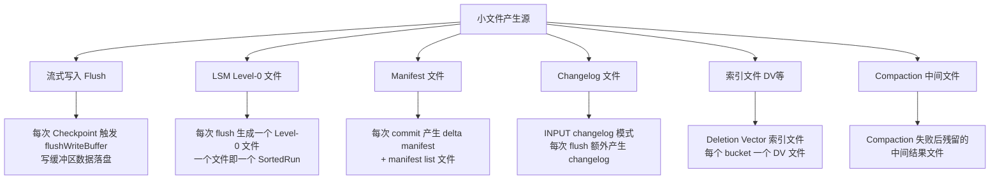
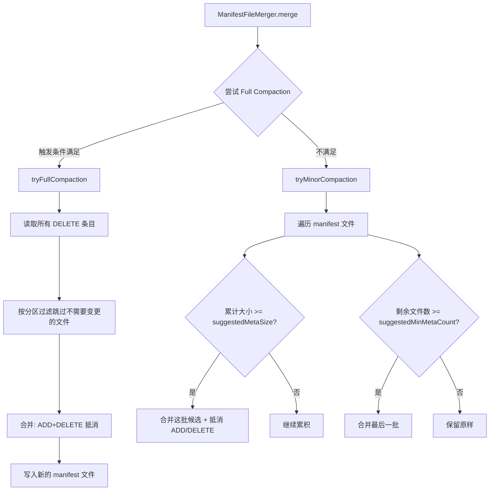
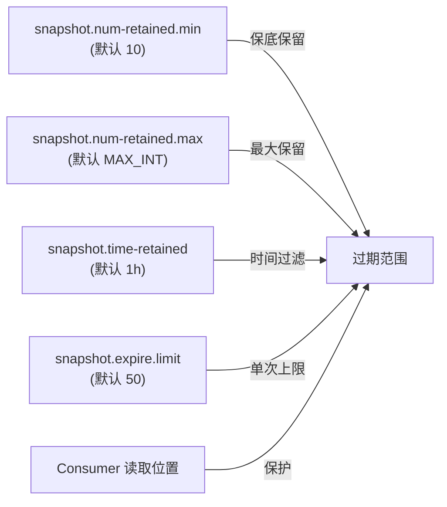
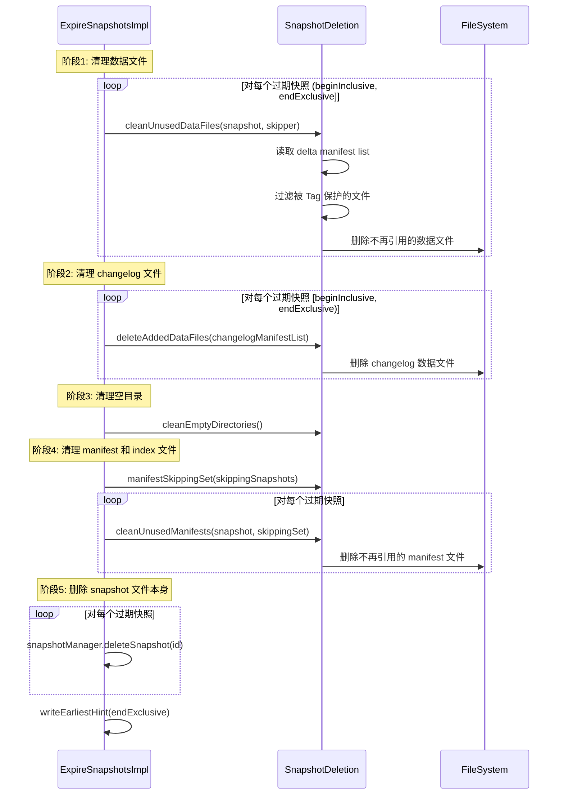
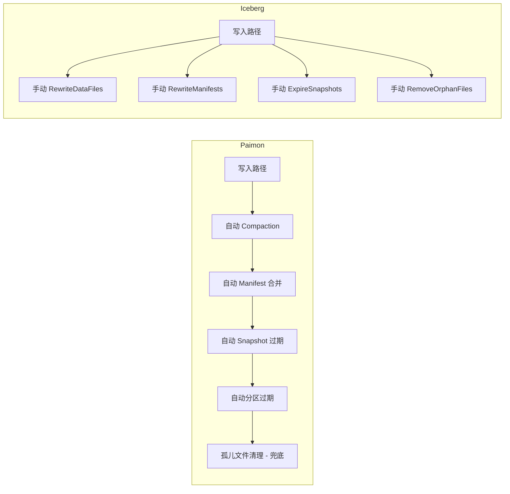

# Apache Paimon 小文件问题成因与治理机制深度分析

> 基于 Paimon 1.5-SNAPSHOT 源码分析，commit: 55f4fd175
> 分析日期: 2026-04-21

---

## 1. 小文件问题的根源分析

Paimon 作为基于 LSM-Tree 的湖格式存储，其写入模型天然会产生大量小文件。理解小文件的产生机制是治理的前提。

### 1.1 小文件产生的场景全景



### 1.2 流式写入：每次 Checkpoint 产生文件

**源码位置**: `MergeTreeWriter.flushWriteBuffer()` (MergeTreeWriter.java:209-249)

```java
private void flushWriteBuffer(boolean waitForLatestCompaction, boolean forcedFullCompaction)
        throws Exception {
    if (writeBuffer.size() > 0) {
        // 创建 RollingFileWriter，level = 0，来源标记为 APPEND
        final RollingFileWriter<KeyValue, DataFileMeta> dataWriter =
                writerFactory.createRollingMergeTreeFileWriter(0, FileSource.APPEND);

        // 如果是 INPUT changelog 模式，还会额外创建一个 changelog writer
        final RollingFileWriter<KeyValue, DataFileMeta> changelogWriter =
                changelogProducer == ChangelogProducer.INPUT
                        ? writerFactory.createRollingChangelogFileWriter(0) : null;
        try {
            writeBuffer.forEach(keyComparator, mergeFunction,
                    changelogWriter == null ? null : changelogWriter::write,
                    dataWriter::write);
        } finally {
            writeBuffer.clear();
            if (changelogWriter != null) changelogWriter.close();
            dataWriter.close();
        }
        // 新文件加入 Level-0
        for (DataFileMeta fileMeta : dataWriter.result()) {
            newFiles.add(fileMeta);
            compactManager.addNewFile(fileMeta);
        }
    }
    // flush 完成后尝试触发 compaction
    trySyncLatestCompaction(waitForLatestCompaction);
    compactManager.triggerCompaction(forcedFullCompaction);
}
```

**为什么这么做**: 流式场景下，Flink 每次 Checkpoint 都会调用 `prepareCommit()`，进而触发 `flushWriteBuffer()`。写缓冲区（`SortBufferWriteBuffer`，默认 256 MB）中的数据被排序、合并后写入 Level-0 文件。这意味着:

- **Checkpoint 间隔越短，产生的小文件越多**。例如 10 秒 Checkpoint 间隔 + 低吞吐量 = 大量 KB 级小文件。
- 每个 partition-bucket 组合独立 flush，分区越多、bucket 越多，文件数呈乘法增长。
- INPUT changelog 模式下，每次 flush 会**额外产生一份 changelog 文件**，文件数翻倍。

**好处**: 及时 flush 保证了数据的持久性和低延迟可见性，是流式处理的基本要求。

### 1.3 LSM Level-0 文件特性

**源码位置**: `Levels.java` (mergetree/Levels.java:39-80)

Level-0 是 LSM-Tree 的特殊层：**每个文件都是一个独立的 SortedRun**。这意味着:
- Level-0 的文件之间可能存在 Key 范围重叠
- 读取时需要合并所有 Level-0 文件 + 高层文件，文件越多读放大越严重
- Level-0 文件数直接影响读取性能

`Levels` 类使用 `TreeSet` 按 `maxSequenceNumber` 降序组织 Level-0 文件，保证了新数据优先被读到。

### 1.4 RollingFileWriter 的文件大小控制

**源码位置**: `RollingFileWriterImpl.java` (io/RollingFileWriterImpl.java:38-176)

```java
public class RollingFileWriterImpl<T, R> implements RollingFileWriter<T, R> {
    private final long targetFileSize;  // 目标文件大小
    
    private boolean rollingFile(boolean forceCheck) throws IOException {
        // 每写入 1000 条记录检查一次（CHECK_ROLLING_RECORD_CNT = 1000）
        return currentWriter.reachTargetSize(
                forceCheck || recordCount % CHECK_ROLLING_RECORD_CNT == 0, targetFileSize);
    }
    
    public void write(T row) throws IOException {
        if (currentWriter == null) openCurrentWriter();
        currentWriter.write(row);
        recordCount += 1;
        if (rollingFile(false)) {
            closeCurrentWriter();  // 关闭当前文件，下次写入时打开新文件
        }
    }
}
```

**目标文件大小默认值** (`CoreOptions.java`):
- 主键表: `128 MB`（`VALUE_128_MB`）
- Append-only 表: `256 MB`（`VALUE_256_MB`）
- 通过 `target-file-size` 配置项调整

**为什么这么做**: RollingFileWriter 通过采样检查（每 1000 条）判断是否达到目标大小，达到后关闭当前文件并在下次写入时创建新文件。这保证了单个文件不会过大，同时避免了过于频繁的大小检查开销。

**好处**: 
- 控制单文件大小，避免 ORC/Parquet 文件过大导致内存压力
- 采样检查而非逐条检查，降低了性能开销
- 但在流式场景下，如果一次 flush 的数据量远小于 target-file-size，产出的文件仍然是小文件

### 1.5 Manifest 和 Changelog 小文件

每次 commit 会产生:
- **delta manifest 文件**: 记录本次 commit 新增/删除的数据文件元信息
- **manifest list 文件**: 索引所有 manifest 文件
- **changelog manifest** (如果启用 changelog): 记录变更日志文件

高频 commit（例如每秒一次 Checkpoint）会快速积累大量 manifest 小文件。

### 1.6 索引文件（Deletion Vector）

Deletion Vector 以 bitmap 形式记录每个数据文件中被删除的行。每个 bucket 维护独立的 DV 索引文件，随着数据更新和删除操作增多，DV 文件数量也会增长。

---

## 2. 数据文件的小文件治理

### 2.1 Compaction 机制（主键表）

Paimon 的主键表使用 **Universal Compaction** 策略，借鉴自 RocksDB。

#### 2.1.1 三级触发逻辑

**源码位置**: `UniversalCompaction.pick()` (compact/UniversalCompaction.java:67-107)

```java
public Optional<CompactUnit> pick(int numLevels, List<LevelSortedRun> runs) {
    int maxLevel = numLevels - 1;

    // 第 0 级: 提前触发全量 Compaction（可选）
    if (earlyFullCompact != null) {
        Optional<CompactUnit> unit = earlyFullCompact.tryFullCompact(numLevels, runs);
        if (unit.isPresent()) return unit;
    }

    // 第 1 级: 检查空间放大（Size Amplification）
    CompactUnit unit = pickForSizeAmp(maxLevel, runs);
    if (unit != null) return Optional.of(unit);

    // 第 2 级: 检查大小比例（Size Ratio）
    unit = pickForSizeRatio(maxLevel, runs);
    if (unit != null) return Optional.of(unit);

    // 第 3 级: 检查文件数量（File Number）
    if (runs.size() > numRunCompactionTrigger) {
        int candidateCount = runs.size() - numRunCompactionTrigger + 1;
        return Optional.ofNullable(pickForSizeRatio(maxLevel, runs, candidateCount));
    }
    return Optional.empty();
}
```

**三级触发的详细机制:**

| 级别 | 触发条件 | 目的 | 配置项 |
|------|---------|------|--------|
| 0 | 时间间隔/总大小/增量大小阈值 | 定期做全量 Compaction，清理删除标记 | `compaction.optimization-interval`、`compaction.total-size-threshold`、`compaction.incremental-size-threshold` |
| 1 | `候选文件总大小 * 100 > maxSizeAmp * 最大层大小` | 控制空间放大，防止存储空间浪费 | `compaction.max-size-amplification-percent` (默认 200) |
| 2 | 相邻 SortedRun 大小比例不符合条件 | 维持层间大小梯度，优化读性能 | `compaction.size-ratio` (默认 1) |
| 3 | `runs.size() > numRunCompactionTrigger` | 限制 SortedRun 数量，控制读放大 | `num-sorted-run.compaction-trigger` (默认 5) |

**为什么这么做**: 三级策略按照优先级递减排列。空间放大是最紧急的问题（存储成本），其次是读性能（比例不合理），最后才是文件数量上限。这种分层设计平衡了写放大和读放大。

**好处**:
- 空间放大检查防止存储翻倍
- Size Ratio 检查维持层间数据量的合理比例
- 文件数量限制保证读取性能不会无限退化

#### 2.1.2 EarlyFullCompaction（提前全量合并）

**源码位置**: `EarlyFullCompaction.java` (compact/EarlyFullCompaction.java:70-107)

```java
public Optional<CompactUnit> tryFullCompact(int numLevels, List<LevelSortedRun> runs) {
    if (runs.size() == 1) return Optional.empty();  // 只有一层无需合并
    int maxLevel = numLevels - 1;
    
    // 触发条件1: 时间间隔到达
    if (fullCompactionInterval != null) {
        if (lastFullCompaction == null
                || currentTimeMillis() - lastFullCompaction > fullCompactionInterval) {
            return Optional.of(CompactUnit.fromLevelRuns(maxLevel, runs));
        }
    }
    // 触发条件2: 总大小低于阈值（小表快速合并）
    if (totalSizeThreshold != null) {
        long totalSize = runs.stream().mapToLong(r -> r.run().totalSize()).sum();
        if (totalSize < totalSizeThreshold) {
            return Optional.of(CompactUnit.fromLevelRuns(maxLevel, runs));
        }
    }
    // 触发条件3: 增量数据超过阈值
    if (incrementalSizeThreshold != null) {
        long incrementalSize = runs.stream()
                .filter(r -> r.level() != maxLevel)
                .mapToLong(r -> r.run().totalSize()).sum();
        if (incrementalSize > incrementalSizeThreshold) {
            return Optional.of(CompactUnit.fromLevelRuns(maxLevel, runs));
        }
    }
    return Optional.empty();
}
```

**为什么这么做**: `EarlyFullCompaction` 针对的场景是：小表或需要频繁做全量合并的场景。通过时间间隔、总大小阈值、增量大小阈值三个维度，让用户可以灵活控制全量合并的触发频率。

**好处**: 定期全量合并可以彻底清理已删除的数据和旧版本记录，释放存储空间，并优化后续读取性能。

#### 2.1.3 pickFullCompaction（强制全量合并）

**源码位置**: `CompactStrategy.pickFullCompaction()` (compact/CompactStrategy.java:53-92)

```java
static Optional<CompactUnit> pickFullCompaction(
        int numLevels, List<LevelSortedRun> runs,
        @Nullable RecordLevelExpire recordLevelExpire,
        @Nullable BucketedDvMaintainer dvMaintainer,
        boolean forceRewriteAllFiles) {
    int maxLevel = numLevels - 1;
    
    // 特殊情况：只有 maxLevel 的文件
    if (runs.size() == 1 && runs.get(0).level() == maxLevel) {
        List<DataFileMeta> filesToBeCompacted = new ArrayList<>();
        for (DataFileMeta file : runs.get(0).run().files()) {
            if (forceRewriteAllFiles) {
                filesToBeCompacted.add(file);  // 强制重写所有文件
            } else if (recordLevelExpire != null && recordLevelExpire.isExpireFile(file)) {
                filesToBeCompacted.add(file);  // 包含过期记录的文件
            } else if (dvMaintainer != null
                    && dvMaintainer.deletionVectorOf(file.fileName()).isPresent()) {
                filesToBeCompacted.add(file);  // 包含 DV 的文件
            }
        }
        if (filesToBeCompacted.isEmpty()) return Optional.empty();
        return Optional.of(CompactUnit.fromFiles(maxLevel, filesToBeCompacted, true));
    }
    // 多层文件时，全部合并到 maxLevel
    return Optional.of(CompactUnit.fromLevelRuns(maxLevel, runs));
}
```

**为什么这么做**: 全量合并是用户主动触发的（如 `CALL compact()`），它考虑了三种需要重写的场景：强制重写、记录级过期、DV 清理。对于只剩 maxLevel 的数据，不会做无意义的全量重写。

**好处**: 精准判断哪些文件需要重写，避免了不必要的 I/O 开销。

#### 2.1.4 minFileSize 参数对小文件合并的作用

**源码位置**: `MergeTreeCompactTask.doCompact()` (compact/MergeTreeCompactTask.java:82-113)

```java
protected CompactResult doCompact() throws Exception {
    List<List<SortedRun>> candidate = new ArrayList<>();
    CompactResult result = new CompactResult();

    for (List<SortedRun> section : partitioned) {
        if (section.size() > 1) {
            candidate.add(section);  // 有重叠的 section 必须合并
        } else {
            SortedRun run = section.get(0);
            for (DataFileMeta file : run.files()) {
                if (file.fileSize() < minFileSize) {
                    // 小文件：加入候选列表，随前面的文件一起重写
                    candidate.add(singletonList(SortedRun.fromSingle(file)));
                } else {
                    // 大文件：直接升级 level，不重写内容
                    rewrite(candidate, result);
                    upgrade(file, result);
                }
            }
        }
    }
    rewrite(candidate, result);  // 处理剩余候选
    return result;
}
```

**minFileSize 的计算** (`CoreOptions.compactionFileSize()`):

```java
public long compactionFileSize(boolean hasPrimaryKey) {
    return targetFileSize(hasPrimaryKey) / 10 * 7;  // target 的 70%
}
```

即默认主键表为 `128 MB * 0.7 ≈ 89.6 MB`，Append 表为 `256 MB * 0.7 ≈ 179.2 MB`。

**为什么这么做**: Compaction 时，大于 `minFileSize` 的文件只做 level 升级（元数据修改），不重写文件内容。小于阈值的文件则被合并重写为更大的文件。70% 的阈值设计是为了容忍压缩率误差——压缩后的文件可能比 targetFileSize 略小，这不应该被误判为"小文件"而反复重写。

**好处**: 
- 避免对已经足够大的文件做无谓的 I/O
- level 升级（upgrade）只修改元数据中的 level 字段，开销极低
- 小文件在 compaction 过程中被"顺带"合并，无需专门的小文件合并任务

### 2.2 异步 Compaction

#### 2.2.1 CompactFutureManager 线程池模型

**源码位置**: `CompactFutureManager.java` (compact/CompactFutureManager.java:29-69)

```java
public abstract class CompactFutureManager implements CompactManager {
    protected Future<CompactResult> taskFuture;
    
    // 非阻塞获取结果
    protected final Optional<CompactResult> innerGetCompactionResult(boolean blocking) {
        if (taskFuture != null) {
            if (blocking || taskFuture.isDone()) {
                CompactResult result = obtainCompactResult();
                taskFuture = null;
                return Optional.of(result);
            }
        }
        return Optional.empty();
    }
}
```

**MergeTreeCompactManager 的提交方式** (compact/MergeTreeCompactManager.java:208-252):

```java
private void submitCompaction(CompactUnit unit, boolean dropDelete) {
    CompactTask task = new MergeTreeCompactTask(...);
    // 通过 ExecutorService 提交到独立线程池异步执行
    taskFuture = executor.submit(task);
}
```

**为什么这么做**: Compaction 是 CPU 和 I/O 密集型操作。异步执行使得数据写入不被 Compaction 阻塞，writer 可以继续接收新数据。同时，采用**单任务飞行模型**（同一时刻只有一个 Compaction 任务在运行），避免了资源竞争和文件冲突。

**好处**:
- 写入和 Compaction 解耦，降低写入延迟
- 单任务飞行保证了 Levels 状态的一致性
- 非阻塞结果获取让 writer 在 Compaction 完成时才合并结果

#### 2.2.2 反压机制 (shouldWaitForLatestCompaction)

**源码位置**: `MergeTreeCompactManager.java:109-117`

```java
@Override
public boolean shouldWaitForLatestCompaction() {
    return levels.numberOfSortedRuns() > numSortedRunStopTrigger;
}

@Override
public boolean shouldWaitForPreparingCheckpoint() {
    return levels.numberOfSortedRuns() > (long) numSortedRunStopTrigger + 1;
}
```

`numSortedRunStopTrigger` 默认值 = `num-sorted-run.compaction-trigger + 3 = 8`。

**在 MergeTreeWriter.flushWriteBuffer() 中的应用** (MergeTreeWriter.java:212):

```java
if (compactManager.shouldWaitForLatestCompaction()) {
    waitForLatestCompaction = true;  // 强制阻塞等待 compaction 完成
}
```

**为什么这么做**: 当 SortedRun 数量超过停止阈值时，说明 Compaction 跟不上写入速度。此时强制等待 Compaction 完成后再继续写入，形成**反压**。这是一种流量控制机制，防止 Level-0 文件无限堆积。

**好处**:
- 防止 Level-0 文件数爆炸导致读性能崩溃
- 自动调节写入速度与 Compaction 速度的平衡
- `shouldWaitForPreparingCheckpoint` 额外加了 1 的容差，在 Checkpoint 阶段更积极地等待，避免写入失败后 Level-0 文件持续增长

#### 2.2.3 Dedicated Compaction 模式

Paimon 支持 **write-only** 模式，将写入和 Compaction 完全分离:

- **Writer 作业**: 设置 `write-only = true`，只负责写入数据，不执行 Compaction
- **Compaction 作业**: 独立的 Flink 作业，专门执行 Compaction

**为什么这么做**: 在生产环境中，写入和 Compaction 共享资源会导致:
- Compaction 高峰期写入延迟抖动
- 资源配比难以优化（写入需要内存，Compaction 需要 I/O 和 CPU）

**好处**: 
- 写入和 Compaction 独立扩缩容
- 写入延迟更稳定
- Compaction 作业可以使用更便宜的机器资源

### 2.3 Append 表的小文件治理

#### 2.3.1 AppendOnlyWriter 的写入和 Compaction

**源码位置**: `AppendOnlyWriter.java` (append/AppendOnlyWriter.java:71-425)

AppendOnlyWriter 的 flush 和 compaction 流程与 MergeTreeWriter 类似：

```java
void flush(boolean waitForLatestCompaction, boolean forcedFullCompaction) throws Exception {
    List<DataFileMeta> flushedFiles = sinkWriter.flush();  // 将写缓冲区落盘
    flushedFiles.forEach(compactManager::addNewFile);       // 新文件通知 CompactManager
    trySyncLatestCompaction(waitForLatestCompaction);        // 同步等待（如需）
    compactManager.triggerCompaction(forcedFullCompaction);   // 触发 Compaction
    newFiles.addAll(flushedFiles);
}
```

#### 2.3.2 AppendCompactCoordinator 的 BinPacking 策略

**源码位置**: `AppendCompactCoordinator.java` (append/AppendCompactCoordinator.java:70-507)

Append 表（尤其是 unaware-bucket 模式）使用 `AppendCompactCoordinator` 进行 Compaction 协调:

```java
// 判断文件是否需要参与 compaction
private boolean shouldCompact(BinaryRow partition, DataFileMeta file) {
    return file.fileSize() < compactionFileSize  // 文件小于阈值（target 的 70%）
            || tooHighDeleteRatio(partition, file); // 或删除比例过高
}
```

**FileBin 打包逻辑** (SubCoordinator 内部类):

```java
private class FileBin {
    List<DataFileMeta> bin = new ArrayList<>();
    long totalFileSize = 0;

    public void addFile(DataFileMeta file) {
        totalFileSize += file.fileSize() + openFileCost;  // 计入打开文件的代价
        bin.add(file);
    }

    private boolean enoughContent() {
        return bin.size() > 1 && totalFileSize >= targetFileSize * 2;  // 至少2个文件，总大小 >= 2*target
    }

    private boolean enoughInputFiles() {
        return bin.size() >= minFileNum;  // 默认 >= 5 个文件
    }
}
```

**年龄机制**:
```java
private List<List<DataFileMeta>> agePack() {
    List<List<DataFileMeta>> packed = pack(toCompact);
    if (packed.isEmpty()) {
        // 未达到打包条件，增加年龄
        if (++age > COMPACT_AGE && toCompact.size() > 1) {  // COMPACT_AGE = 5
            // 老化超过 5 次扫描，强制合并
            List<DataFileMeta> all = new ArrayList<>(toCompact);
            toCompact.clear();
            packed = Collections.singletonList(all);
        }
    }
    return packed;
}
```

超过 `REMOVE_AGE = 10` 次扫描后，单个文件分区会被从内存移除以避免内存泄漏。

**为什么这么做**: Append 表没有主键和 LSM 层级概念，Compaction 本质上是**将多个小文件合并为大文件**。BinPacking 策略将小文件按大小排序后装箱：
1. 累积到 `2 * targetFileSize` 时打包为一个 Compaction 任务
2. 如果文件数达到 `minFileNum`（默认 5），即使总大小不够也打包
3. 文件如果长期凑不够一个包（年龄超过 5 次扫描），强制合并

**好处**:
- 有序打包减少了随机 I/O
- 年龄机制保证了即使是稀疏写入的分区，小文件最终也会被合并
- `openFileCost` 参数（默认 4 MB）让打包策略考虑了文件打开开销
- DV 模式下按 index 文件分组，避免产生重复的删除文件

---

## 3. Manifest 文件的合并

### 3.1 ManifestFileMerger 的合并逻辑

**源码位置**: `ManifestFileMerger.java` (operation/ManifestFileMerger.java:50-288)

Manifest 文件的合并分为两级:



#### 3.1.1 Minor Compaction

```java
private static List<ManifestFileMeta> tryMinorCompaction(
        List<ManifestFileMeta> input, ..., long suggestedMetaSize, int suggestedMinMetaCount, ...) {
    List<ManifestFileMeta> candidates = new ArrayList<>();
    long totalSize = 0;
    for (ManifestFileMeta manifest : input) {
        totalSize += manifest.fileSize();
        candidates.add(manifest);
        if (totalSize >= suggestedMetaSize) {       // 达到目标大小（默认 8 MB）
            mergeCandidates(candidates, ...);        // 合并这批小文件
            candidates.clear();
            totalSize = 0;
        }
    }
    if (candidates.size() >= suggestedMinMetaCount) { // 剩余文件数 >= 30
        mergeCandidates(candidates, ...);
    } else {
        result.addAll(candidates);                     // 保留原样
    }
}
```

#### 3.1.2 Full Compaction

```java
public static Optional<List<ManifestFileMeta>> tryFullCompaction(
        List<ManifestFileMeta> inputs, ..., long suggestedMetaSize, long sizeTrigger, ...) {
    // 1. 判断是否需要全量合并
    Filter<ManifestFileMeta> mustChange =
            file -> file.numDeletedFiles() > 0 || file.fileSize() < suggestedMetaSize;
    
    long totalDeltaFileSize = 0;
    for (ManifestFileMeta file : inputs) {
        if (mustChange.test(file)) {
            totalDeltaFileSize += file.fileSize();
        }
    }
    if (totalDeltaFileSize < sizeTrigger) return Optional.empty(); // 16 MB 默认阈值
    
    // 2. 读取所有 DELETE 条目
    Set<FileEntry.Identifier> deleteEntries = FileEntry.readDeletedEntries(manifestFile, inputs, ...);
    
    // 3. 按分区过滤: 与删除条目无关的 manifest 文件可以跳过
    PartitionPredicate predicate = ...; // 基于删除条目的分区集合构建过滤器
    
    // 4. 合并: 跳过 DELETE 条目，过滤已删除的 ADD 条目
    for (ManifestFileMeta file : toBeMerged) {
        for (ManifestEntry entry : manifestFile.read(file.fileName(), file.fileSize())) {
            if (entry.kind() == FileKind.DELETE) continue;       // 跳过 DELETE
            if (deleteEntries.contains(entry.identifier())) {
                requireChange = true;                             // 被删除的 ADD 也跳过
            } else {
                entries.add(entry);                               // 保留有效 ADD
            }
        }
    }
}
```

**为什么这么做**: 
- **Minor Compaction** 在每次 commit 时运行，只合并累积到一定大小的小 manifest 文件，开销较低
- **Full Compaction** 在累积变更达到 16 MB 阈值时触发，会读取并消除所有 ADD/DELETE 对，彻底清理 manifest 中的冗余信息
- 分区过滤优化让 Full Compaction 只处理涉及删除操作的分区，大幅减少 I/O

**好处**:
- 两级合并策略平衡了合并频率和开销
- Full Compaction 的 ADD/DELETE 抵消机制防止 manifest 文件无限膨胀
- 分区过滤优化对多分区表效果显著

### 3.2 配置项

| 配置项 | 默认值 | 作用 |
|--------|--------|------|
| `manifest.target-file-size` | `8 MB` | Manifest 文件的目标大小。Minor Compaction 的合并阈值 |
| `manifest.merge-min-count` | `30` | Minor Compaction 中，剩余文件数达到此值时触发合并 |
| `manifest.full-compaction-threshold-size` | `16 MB` | Full Compaction 的触发阈值（需要变更的文件总大小） |

### 3.3 compactManifest() 在 commit 过程中的调用

**源码位置**: `FileStoreCommitImpl.java:1080-1157`

在正常 commit 流程中（`FileStoreCommitImpl.java:911-916`），`ManifestFileMerger.merge()` 在每次提交时被调用，参数使用的是配置项中的默认值。

独立的 `compactManifest()` 方法则用于**手动触发的 manifest 合并**:

```java
public void compactManifest() {
    while (true) {
        boolean success = compactManifestOnce();
        if (success) break;
        // 重试直到成功或超时
    }
}

private boolean compactManifestOnce() {
    // 使用更激进的参数: suggestedMinMetaCount=1, sizeTrigger=1
    // 即合并所有可以合并的 manifest 文件
    mergeAfterManifests = ManifestFileMerger.merge(
            mergeBeforeManifests, manifestFile,
            options.manifestTargetSize().getBytes(),
            1,    // suggestedMinMetaCount = 1，更激进
            1,    // sizeTrigger = 1，只要有变更就做 full compaction
            partitionType, options.scanManifestParallelism());
}
```

**为什么这么做**: 手动 compactManifest 使用更激进的参数（`minCount=1, sizeTrigger=1`），确保所有可合并的 manifest 都被处理。它采用乐观锁+重试的方式处理并发冲突。

---

## 4. Snapshot 过期清理

### 4.1 ExpireSnapshotsImpl 的实现

**源码位置**: `ExpireSnapshotsImpl.java` (table/ExpireSnapshotsImpl.java:54-339)

#### 4.1.1 过期范围计算

```java
public int expire() {
    int retainMax = expireConfig.getSnapshotRetainMax();
    int retainMin = expireConfig.getSnapshotRetainMin();
    int maxDeletes = expireConfig.getSnapshotMaxDeletes();
    long olderThanMills = System.currentTimeMillis() - expireConfig.getSnapshotTimeRetain().toMillis();

    // 计算应该保留的最小 snapshotId
    long min = Math.max(latestSnapshotId - retainMax + 1, earliest);

    // 计算最大可过期的 snapshotId（排他）
    long maxExclusive = latestSnapshotId - retainMin + 1;

    // 保护: consumer 正在读取的 snapshot 不能删除
    maxExclusive = Math.min(maxExclusive, consumerManager.minNextSnapshot().orElse(Long.MAX_VALUE));

    // 保护: 一次最多删除 maxDeletes 个（默认 50）
    maxExclusive = Math.min(maxExclusive, earliest + maxDeletes);

    // 时间保留: 遇到未过期的 snapshot 立即停止
    for (long id = min; id < maxExclusive; id++) {
        Snapshot snapshot = snapshotManager.tryGetSnapshot(id);
        if (olderThanMills <= snapshot.timeMillis()) {
            return expireUntil(earliest, id);  // 此 snapshot 未过期，到此为止
        }
    }
    return expireUntil(earliest, maxExclusive);
}
```

#### 4.1.2 三个参数的交互关系



| 参数 | 默认值 | 优先级/作用 |
|------|--------|------------|
| `snapshot.num-retained.min` | 10 | **最高优先级**，无论何时至少保留 10 个快照 |
| `snapshot.num-retained.max` | Integer.MAX_VALUE | 快照数超过此值后开始候选过期 |
| `snapshot.time-retained` | 1 hour | 时间未到的快照不过期（即使超过 max 数量限制） |
| `snapshot.expire.limit` | 50 | 一次最多过期 50 个快照，避免大批量删除造成卡顿 |

**交互逻辑**: `retainMin` 先划出不可过期的范围 → `retainMax` 从最老的开始候选 → `timeRetain` 过滤候选中未到期的 → `expireLimit` 限制单次数量 → `consumer` 保护正在使用的快照。

**为什么这么做**: 多重保护机制确保:
- 不会误删正在被查询的快照
- 不会一次性删除过多文件导致文件系统压力
- 时间保留和数量保留双重控制，适应不同业务场景

### 4.2 文件清理流程

**源码位置**: `ExpireSnapshotsImpl.innerExpireUntil()` (ExpireSnapshotsImpl.java:163-278)



**关键设计细节**:
- **Tag 保护**: 被 Tag 引用的快照中的数据文件不会被删除。通过 `createDataFileSkipperForTags` 构建跳过集合
- **Changelog 解耦**: 当 `changelogDecoupled = true` 时，snapshot 过期不会删除 APPEND 类型的数据文件，这些文件由独立的 Changelog 过期机制管理
- **并行删除**: 使用 `fileExecutor` 并行执行文件删除操作
- **Manifest 跳过集**: 需要被后续 snapshot/tag 引用的 manifest 文件不会被删除

### 4.3 SnapshotDeletion、ChangelogDeletion、TagDeletion 的职责分工

| 类 | 继承自 | 负责清理的内容 |
|---|--------|---------------|
| `SnapshotDeletion` | `FileDeletionBase<Snapshot>` | 普通快照过期时的数据文件、manifest 文件、index 文件、统计文件 |
| `ChangelogDeletion` | `FileDeletionBase<Changelog>` | Changelog 独立过期时的 changelog 数据文件和 manifest |
| `TagDeletion` | `FileDeletionBase<Snapshot>` | Tag 删除时的数据文件清理（需要检查其他 Tag/Snapshot 是否仍引用） |

三者共享 `FileDeletionBase` 的通用逻辑：manifest 读取、数据文件路径构建、并行文件删除等。

**为什么这么做**: 快照、Changelog、Tag 三种生命周期可以独立管理。例如，Changelog 可以比 Snapshot 保留更长时间（用于 CDC 消费），Tag 可以有独立的 TTL。分离的删除器避免了复杂的条件判断。

---

## 5. 分区过期

### 5.1 PartitionExpire 的实现

**源码位置**: `PartitionExpire.java` (operation/PartitionExpire.java:47-225)

```java
List<Map<String, String>> expire(LocalDateTime now, long commitIdentifier) {
    // 1. 检查是否到达检查间隔
    if (checkInterval.isZero()
            || now.isAfter(lastCheck.plus(checkInterval))
            || (endInputCheckPartitionExpire && Long.MAX_VALUE == commitIdentifier)) {
        // 2. 计算过期时间点
        List<Map<String, String>> expired = doExpire(now.minus(expirationTime), commitIdentifier);
        lastCheck = now;
        return expired;
    }
    return null;
}

private List<Map<String, String>> doExpire(LocalDateTime expireDateTime, long commitIdentifier) {
    // 3. 使用策略选择过期分区
    List<PartitionEntry> partitionEntries = strategy.selectExpiredPartitions(scan, expireDateTime);
    
    // 4. 转换分区值并限制数量
    List<Map<String, String>> expired = convertToPartitionString(expiredPartValues);
    
    // 5. 批量删除分区（支持分批）
    if (expireBatchSize > 0 && expireBatchSize < expired.size()) {
        Lists.partition(expired, expireBatchSize).forEach(
                batch -> doBatchExpire(batch, commitIdentifier));
    } else {
        doBatchExpire(expired, commitIdentifier);
    }
    return expired;
}
```

### 5.2 partition.expiration-time 的使用

| 配置项 | 默认值 | 作用 |
|--------|--------|------|
| `partition.expiration-time` | 无默认值（不启用） | 分区的最大存活时间。分区时间从分区值提取 |
| `partition.expiration-check-interval` | `1 hour` | 分区过期检查间隔 |
| `partition.expiration-strategy` | `values-time` | 过期策略：基于分区值解析时间 vs 基于最后更新时间 |

**为什么这么做**: 分区过期是批量删除的有效手段。对于按时间分区的表（如按天分区），到期的历史分区通过 `commit.dropPartitions()` 整体删除，这比逐个文件清理高效得多。

**好处**:
- 整个分区的数据一次性删除，效率远高于记录级或文件级清理
- 支持分批删除（`expireBatchSize`），避免单次删除过多分区导致 commit 超时
- 随机化初始检查时间（`ThreadLocalRandom`），避免多个并行任务同时检查

---

## 6. 孤儿文件清理

### 6.1 孤儿文件产生的原因

孤儿文件是指**不被任何 Snapshot、Tag、Changelog 引用的文件**，产生原因包括:

1. **写入失败**: 数据文件已写入但 commit 未成功（如网络超时）
2. **Compaction 失败**: Compaction 输出文件已写完但结果未被应用
3. **Compaction 取消**: 作业取消时正在执行的 Compaction 任务（`CompactFutureManager.cancelCompaction()` 注释明确提到可能留下孤儿文件）
4. **并发冲突**: 多个作业同时提交导致的乐观锁冲突

### 6.2 OrphanFilesClean 的实现

**源码位置**: `OrphanFilesClean.java` (operation/OrphanFilesClean.java:86-502)

```java
public abstract class OrphanFilesClean implements Serializable {
    protected final long olderThanMillis;  // 默认: 当前时间 - 1 天
    protected final boolean dryRun;         // 是否仅模拟运行

    // 安全获取所有快照（含 snapshot + tag + changelog）
    protected Set<Snapshot> safelyGetAllSnapshots(String branch) throws IOException {
        Set<Snapshot> readSnapshots = new HashSet<>(snapshotManager.safelyGetAllSnapshots());
        readSnapshots.addAll(tagManager.taggedSnapshots());
        readSnapshots.addAll(changelogManager.safelyGetAllChangelogs());
        return readSnapshots;
    }

    // 收集所有被引用的文件（manifest、index、statistics）
    protected void collectWithoutDataFile(String branch, Snapshot snapshot,
            Consumer<String> usedFileConsumer, Consumer<String> manifestConsumer) {
        // 收集 changelog manifest list
        // 收集 delta manifest list
        // 收集 base manifest list
        // 收集所有 manifest 文件名
        // 收集 index 文件
        // 收集 statistics 文件
    }

    // 列出所有数据目录
    protected List<Path> listPaimonFileDirs() {
        // manifest 目录 + index 目录 + statistics 目录 + 数据文件目录（递归遍历分区）
    }
}
```

### 6.3 RemoveOrphanFiles Procedure

**Flink 调用方式**:
```sql
-- 删除一天前的孤儿文件
CALL sys.remove_orphan_files('database.table')

-- 自定义时间阈值
CALL sys.remove_orphan_files('database.table', '2023-12-31 23:59:59')

-- 清理数据库下所有表
CALL sys.remove_orphan_files('database.*', '2023-12-31 23:59:59')

-- dry-run 模式（只统计不删除）
CALL sys.remove_orphan_files('database.table', '2023-12-31 23:59:59', true)
```

支持两种执行模式:
- **DISTRIBUTED**: 使用 Flink 分布式执行（`FlinkOrphanFilesClean`），适合大规模数据
- **LOCAL**: 本地单机执行（`LocalOrphanFilesClean`），适合小表

**核心清理流程**:
1. 收集所有 snapshot + tag + changelog 引用的文件集合
2. 扫描文件系统中的所有文件
3. 差集 = 孤儿文件
4. 过滤: 只删除修改时间早于 `olderThanMillis` 的文件（默认 1 天前）
5. 执行删除（或 dry-run 模式仅统计）

**为什么设置 1 天的安全期**: 正在写入但尚未 commit 的文件也是"未被引用"的，但它们不是孤儿文件。1 天的缓冲期保证了这些正在进行中的操作有足够时间完成。

**好处**:
- 异常情况下的最后防线，兜底清理所有残留文件
- dry-run 模式让用户可以先评估影响再执行
- 重试机制（`READ_FILE_RETRY_NUM = 3`）处理瞬态文件系统错误
- 支持多分支（branches）清理

---

## 7. Tag 管理与存储优化

### 7.1 Tag 对存储空间的影响

Tag 本质上是对某个 Snapshot 的**具名引用**。一个 Tag 会阻止其引用的 Snapshot 及其数据文件被过期清理。这意味着:

- 如果一个 Tag 引用了旧 Snapshot，那么该 Snapshot 的 manifest 引用的所有数据文件都会被保留
- 这些数据文件可能已经被新的 Compaction 替换为更大的文件，但旧文件因 Tag 引用仍不能删除
- **Tag 越多、保留时间越长，存储空间膨胀越严重**

### 7.2 Tag TTL 机制

| 配置项 | 默认值 | 作用 |
|--------|--------|------|
| `tag.default-time-retained` | 无默认值 | 自动创建的 Tag 的默认保留时间 |
| `tag.num-retained-max` | 无默认值 | 自动创建的 Tag 的最大保留数量 |
| `tag.creation-period` | `DAILY` | 自动创建 Tag 的周期 |

### 7.3 TagTimeExpire 的实现

**源码位置**: `TagTimeExpire.java` (tag/TagTimeExpire.java:39-117)

```java
public List<String> expire() {
    List<Pair<Tag, String>> tags = tagManager.tagObjects();
    List<String> expired = new ArrayList<>();
    
    for (Pair<Tag, String> pair : tags) {
        Tag tag = pair.getLeft();
        String tagName = pair.getRight();
        LocalDateTime createTime = tag.getTagCreateTime();
        Duration timeRetained = tag.getTagTimeRetained();
        
        // 没有显式设置过期时间的 tag，尝试从文件修改时间推断
        if (createTime == null || timeRetained == null) {
            if (olderThanTime != null) {
                FileStatus tagFileStatus = snapshotManager.fileIO()
                        .getFileStatus(tagManager.tagPath(tagName));
                createTime = DateTimeUtils.toLocalDateTime(
                        tagFileStatus.getModificationTime());
            } else {
                continue;  // 无法判断，跳过
            }
        }
        
        boolean isReachTimeRetained =
                timeRetained != null && LocalDateTime.now().isAfter(createTime.plus(timeRetained));
        boolean isOlderThan = olderThanTime != null && olderThanTime.isAfter(createTime);
        
        if (isReachTimeRetained || isOlderThan) {
            tagManager.deleteTag(tagName, tagDeletion, snapshotManager, callbacks);
            expired.add(tagName);
        }
    }
    return expired;
}
```

**为什么这么做**: Tag 过期有两种判断方式:
1. **自身 TTL**: Tag 创建时指定了 `timeRetained`，到期自动删除
2. **全局 olderThan**: 管理员指定的统一过期时间

对于没有设置 TTL 的历史 Tag（旧版本创建的），通过文件修改时间兜底，确保不会永远保留。

**好处**:
- 自动化的 Tag 生命周期管理，无需人工干预
- 灵活的过期策略（逐 Tag 的 TTL + 全局 olderThan）
- Tag 删除时会通过 `TagDeletion` 清理只被该 Tag 独占引用的数据文件

---

## 8. 配置调优总结

### 8.1 防止小文件的关键配置项

| 配置项 | 默认值 | 说明 | 调优方向 |
|--------|--------|------|----------|
| **写入相关** | | | |
| `target-file-size` | 主键表 128 MB / Append 表 256 MB | 单个数据文件的目标大小 | 增大可减少文件数，但影响内存 |
| `write-buffer-size` | 256 MB | 写缓冲区大小 | 增大可让 flush 写出更大的文件 |
| `write-only` | false | 是否仅写入不 Compact | 生产环境推荐用 Dedicated Compaction |
| **Compaction 相关** | | | |
| `num-sorted-run.compaction-trigger` | 5 | 触发 Compaction 的 SortedRun 数量 | 减小更激进合并，增大减少写放大 |
| `num-sorted-run.stop-trigger` | trigger + 3 = 8 | 写入反压的 SortedRun 数量 | 与 trigger 保持 2-3 的差距 |
| `compaction.max-size-amplification-percent` | 200 | 空间放大触发全量合并的比例 | 减小可更积极地回收空间 |
| `compaction.size-ratio` | 1 | Size Ratio 合并的比例触发值 | 增大可更积极地合并 |
| `compaction.optimization-interval` | 无默认值 | 定期全量 Compaction 间隔 | 设置后定期做全量合并 |
| `commit.force-compact` | false | 每次 commit 前是否强制等待 Compaction | 牺牲写入延迟换文件整洁 |
| **Append 表专用** | | | |
| `compaction.min.file-num` | 5 | 触发合并的最小文件数 | 减小可更积极合并 |
| `compaction.file-num-limit` | 100,000 | 扫描文件数上限 | 防止 OOM |
| `compaction.delete-ratio-threshold` | 0.2 | DV 删除比例超过此值时触发合并 | 调小可更积极清理 DV |
| **Manifest 相关** | | | |
| `manifest.target-file-size` | 8 MB | Manifest 文件目标大小 | |
| `manifest.merge-min-count` | 30 | Minor Compaction 最小文件数 | 减小可更频繁合并 |
| `manifest.full-compaction-threshold-size` | 16 MB | Full Compaction 触发阈值 | |
| **过期清理** | | | |
| `snapshot.num-retained.min` | 10 | 最少保留快照数 | |
| `snapshot.num-retained.max` | MAX_INT | 最多保留快照数 | 生产应设置合理值 |
| `snapshot.time-retained` | 1 hour | 快照保留时间 | |
| `snapshot.expire.limit` | 50 | 单次最多过期快照数 | |
| `partition.expiration-time` | 无默认值 | 分区过期时间 | |
| `tag.default-time-retained` | 无默认值 | Tag 默认保留时间 | |

### 8.2 不同场景的推荐配置

#### 场景 1: 高频小批量写入（10s Checkpoint，低吞吐）

```properties
# 问题：每次 Checkpoint flush 的数据量远小于 target-file-size，产生大量 KB 级小文件
# 策略：增大写缓冲区 + 积极 Compaction + 低 Checkpoint 频率

write-buffer-size = 512mb
num-sorted-run.compaction-trigger = 3
num-sorted-run.stop-trigger = 6
compaction.optimization-interval = 30min
snapshot.time-retained = 30min
snapshot.num-retained.min = 5
```

**思路**: 增大缓冲区让 flush 产生的文件更大；降低 compaction 触发阈值让小文件更快被合并；定期全量合并清理碎片。

#### 场景 2: 低频大批量写入（批处理/小时级调度）

```properties
# 问题：单次写入数据量大，但频率低，小文件不是主要问题
# 策略：适当调大 target-file-size，保留默认 Compaction 策略

target-file-size = 256mb
commit.force-compact = true
snapshot.num-retained.max = 50
snapshot.time-retained = 24h
```

**思路**: 批量写入本身产生的文件较大，重点是 commit 后强制等待 Compaction 完成，确保数据整洁。

#### 场景 3: 流式 CDC 同步

```properties
# 问题：CDC 数据持续流入，涉及大量 update/delete，DV/changelog 文件多
# 策略：启用 Dedicated Compaction + 适当的 changelog 保留

write-only = true
# 单独启动 Compaction 作业

num-sorted-run.compaction-trigger = 5
compaction.optimization-interval = 1h
compaction.max-size-amplification-percent = 150
changelog.producer = input
snapshot.time-retained = 2h
partition.expiration-time = 7d
partition.expiration-check-interval = 1h
tag.default-time-retained = 3d
```

**思路**: CDC 场景写入量稳定但持续，使用 Dedicated Compaction 解耦写入和合并。定期全量 Compaction 清理 DV 和已删除记录。分区和 Tag 自动过期防止存储膨胀。

### 8.3 小文件问题的诊断和排查方法

#### 使用 $files 系统表检查数据文件

```sql
-- 查看每个分区/bucket 的文件数和大小分布
SELECT partition, bucket, 
       COUNT(*) AS file_count, 
       SUM(file_size_in_bytes) AS total_size,
       AVG(file_size_in_bytes) AS avg_size,
       MIN(file_size_in_bytes) AS min_size,
       MAX(file_size_in_bytes) AS max_size
FROM my_table$files 
GROUP BY partition, bucket
ORDER BY file_count DESC;

-- 查找小文件（小于 target-file-size 的 10%）
SELECT partition, bucket, file_path, file_size_in_bytes, level
FROM my_table$files
WHERE file_size_in_bytes < 12800000  -- 12.8 MB = 128 MB * 10%
ORDER BY file_size_in_bytes;

-- 查看 Level-0 文件数量（主键表）
SELECT partition, bucket, COUNT(*) AS level0_count
FROM my_table$files
WHERE level = 0
GROUP BY partition, bucket
HAVING COUNT(*) > 5;
```

#### 使用 $manifests 系统表检查 Manifest 文件

```sql
-- 查看 manifest 文件数量和大小
SELECT COUNT(*) AS manifest_count, 
       SUM(file_size) AS total_size,
       AVG(file_size) AS avg_size,
       SUM(num_deleted_files) AS total_deleted_entries
FROM my_table$manifests;
```

#### 使用 $snapshots 系统表检查快照

```sql
-- 查看快照数量和时间范围
SELECT COUNT(*) AS snapshot_count,
       MIN(commit_time) AS earliest,
       MAX(commit_time) AS latest
FROM my_table$snapshots;

-- 查看最近快照的提交频率
SELECT id, commit_kind, commit_time, total_record_count, delta_record_count
FROM my_table$snapshots
ORDER BY id DESC
LIMIT 20;
```

---

## 9. 与 Iceberg 小文件治理的对比

### 9.1 数据文件 Compaction

| 维度 | Paimon | Iceberg |
|------|--------|---------|
| **Compaction 触发方式** | **自动内置**：写入流程中自动触发 UniversalCompaction | **手动/外部**：需要单独调用 `RewriteDataFiles` Action |
| **Compaction 时机** | 每次 flush 后检查，异步执行 | 由用户/调度系统按需触发 |
| **算法** | LSM-Tree Universal Compaction（多级触发） | 基于 BinPacking 的文件重组 |
| **反压机制** | 内置 `shouldWaitForLatestCompaction` 自动反压 | 无内置反压，写入和 Compaction 完全独立 |
| **流式场景** | 原生支持，自动 Compaction | 需要额外的调度系统定期触发 |

**本质差异**: Paimon 将 Compaction 视为存储引擎的**核心职责**，内置到写入路径中。Iceberg 将 Compaction 视为**维护操作**，留给用户自行管理。Paimon 的方式对流式场景更友好，但增加了写入路径的复杂性；Iceberg 的方式更灵活，但需要额外的运维工作。

### 9.2 Manifest 合并

| 维度 | Paimon | Iceberg |
|------|--------|---------|
| **合并方式** | 每次 commit 自动 Minor/Full Compaction | 需要手动调用 `RewriteManifests` Action |
| **合并策略** | 两级策略：Minor（累积到 8 MB 合并）+ Full（变更达到 16 MB 时全量合并） | 基于文件大小的简单合并 |
| **ADD/DELETE 抵消** | Full Compaction 自动消除 ADD/DELETE 对 | RewriteManifests 也会消除无效条目 |
| **自动化程度** | 完全自动，无需人工干预 | 需要手动触发或设置自动化任务 |

**本质差异**: Paimon 在每次 commit 中"顺带"完成 manifest 合并，利用了 commit 的原子性保证一致性。Iceberg 的 RewriteManifests 是独立操作，需要额外的原子性保证。

### 9.3 快照过期

| 维度 | Paimon | Iceberg |
|------|--------|---------|
| **过期触发** | 每次 commit 后自动检查并执行 | 需要手动调用 `ExpireSnapshots` Action |
| **保留策略** | 数量保留（min/max）+ 时间保留 + Consumer 保护 | 时间保留 + 引用保护 |
| **安全机制** | `snapshot.expire.limit` 限制单次删除数 | `maxSnapshotAgeMs` / `minSnapshotsToKeep` |
| **Changelog** | 可独立管理 Changelog 生命周期（changelogDecoupled） | 依赖 Snapshot 生命周期 |

### 9.4 两者在小文件治理理念上的本质差异



| 理念 | Paimon | Iceberg |
|------|--------|---------|
| **设计哲学** | **存储引擎自治**：Compaction 是写入的一部分，存储引擎自动管理数据布局 | **格式中立**：格式层只负责读写，数据布局优化留给上层调度 |
| **运维负担** | 低：配置好参数后自动运行 | 高：需要设置独立的维护作业（如 Spark 定时任务） |
| **流式友好度** | 高：LSM-Tree 天然适配流式写入+自动 Compaction | 中：需要额外的 Compaction 调度适配流式场景 |
| **灵活性** | 中：Compaction 策略与存储引擎绑定 | 高：可以用任何引擎执行 Compaction，策略可定制 |
| **读性能保证** | 内置反压机制保证读放大在可控范围 | 不保证，依赖外部维护的及时性 |
| **写放大** | 由 Universal Compaction 策略控制，可调节但无法完全避免 | 由 Compaction 频率决定，不 Compact 则无写放大 |

**总结**: Paimon 的小文件治理是**主动式**的——存储引擎自身持续维护数据布局的健康度，代价是增加了写入路径的复杂性和一定的写放大。Iceberg 的小文件治理是**被动式**的——提供了一套工具集，由用户按需使用，优点是灵活性高、写入路径简单，缺点是需要额外的运维工作来保证数据布局不退化。

对于**流式 Lakehouse** 场景（高频低延迟写入 + 即时查询），Paimon 的自动化治理显著降低了运维成本。对于**批处理为主**的数据湖场景，Iceberg 的灵活性可能更有优势。
