# Apache Paimon 索引机制深度分析

> 基于 Paimon 1.5-SNAPSHOT (commit: 55f4fd175) 源码分析
> 分析日期: 2026-04-21

---

## 目录

- [1. Paimon 索引全景图](#1-paimon-索引全景图)
  - [1.1 索引分类体系](#11-索引分类体系)
  - [1.2 索引关系总览图](#12-索引关系总览图)
  - [1.3 各索引的定位与适用场景](#13-各索引的定位与适用场景)
- [2. 文件内嵌索引 (File Index)](#2-文件内嵌索引-file-index)
  - [2.1 架构概览与设计决策](#21-架构概览与设计决策)
  - [2.2 文件索引存储格式 (FileIndexFormat)](#22-文件索引存储格式-fileindexformat)
  - [2.3 Bloom Filter 索引](#23-bloom-filter-索引)
  - [2.4 Bitmap 倒排索引](#24-bitmap-倒排索引)
  - [2.5 BSI (Bit-Sliced Index) 索引](#25-bsi-bit-sliced-index-索引)
  - [2.6 Range Bitmap 索引](#26-range-bitmap-索引)
  - [2.7 文件索引 SPI 扩展机制](#27-文件索引-spi-扩展机制)
- [3. 全局索引 (Global Index)](#3-全局索引-global-index)
  - [3.1 全局索引架构设计](#31-全局索引架构设计)
  - [3.2 BTree 全局索引](#32-btree-全局索引)
  - [3.3 Bitmap 全局索引](#33-bitmap-全局索引)
  - [3.4 GlobalIndexResult 与 RoaringNavigableMap64](#34-globalindexresult-与-roaringnavigablemap64)
  - [3.5 全局索引的创建和使用流程](#35-全局索引的创建和使用流程)
- [4. 哈希索引 (Hash Index / Bucket 分配)](#4-哈希索引-hash-index--bucket-分配)
  - [4.1 动态 Bucket 分配机制](#41-动态-bucket-分配机制)
  - [4.2 HashBucketAssigner 核心算法](#42-hashbucketassigner-核心算法)
  - [4.3 PartitionIndex 分区索引](#43-partitionindex-分区索引)
  - [4.4 SimpleHashBucketAssigner](#44-simplehashbucketassigner)
  - [4.5 DynamicBucketIndexMaintainer](#45-dynamicbucketindexmaintainer)
  - [4.6 Hash 索引文件读写](#46-hash-索引文件读写)
- [5. DV 索引 (Deletion Vectors Index)](#5-dv-索引-deletion-vectors-index)
  - [5.1 DV 索引设计动机](#51-dv-索引设计动机)
  - [5.2 DeletionVector 接口与实现](#52-deletionvector-接口与实现)
  - [5.3 DV 索引文件组织](#53-dv-索引文件组织)
  - [5.4 BucketedDvMaintainer 管理机制](#54-bucketeddvmaintainer-管理机制)
  - [5.5 IndexFileHandler 统一管理](#55-indexfilehandler-统一管理)
- [6. Lookup 索引](#6-lookup-索引)
  - [6.1 LookupLevels 设计动机](#61-lookuplevels-设计动机)
  - [6.2 LookupFile 本地文件缓存](#62-lookupfile-本地文件缓存)
  - [6.3 RocksDB StateFactory 后端](#63-rocksdb-statefactory-后端)
  - [6.4 Bloom Filter 加速 Key 存在性判断](#64-bloom-filter-加速-key-存在性判断)
  - [6.5 远程文件下载机制](#65-远程文件下载机制)
- [7. 索引与查询优化的协同](#7-索引与查询优化的协同)
  - [7.1 Predicate 路由到不同索引](#71-predicate-路由到不同索引)
  - [7.2 FileIndexPredicate 评估流程](#72-fileindexpredicate-评估流程)
  - [7.3 多索引联合过滤 (AND/OR 逻辑)](#73-多索引联合过滤-andor-逻辑)
  - [7.4 BitmapIndexResult 行级过滤](#74-bitmapindexresult-行级过滤)
- [8. 索引配置与最佳实践](#8-索引配置与最佳实践)
  - [8.1 文件索引配置方式](#81-文件索引配置方式)
  - [8.2 不同场景的索引选择策略](#82-不同场景的索引选择策略)
  - [8.3 索引对写入性能的影响](#83-索引对写入性能的影响)
- [9. 与 Iceberg 索引能力对比](#9-与-iceberg-索引能力对比)

---

## 1. Paimon 索引全景图

### 解决什么问题

**核心业务问题**: 在 Lakehouse 场景下,数据文件通常以列式格式(Parquet/ORC)存储在对象存储上,单次查询可能需要扫描数百GB甚至TB级别的数据。如果没有索引机制,即使只查询一条记录,也需要全表扫描所有数据文件。

**没有索引的后果**:
1. **查询延迟高**: 点查(WHERE id = 'xxx')需要扫描所有文件,延迟从毫秒级变成分钟级
2. **资源浪费**: 大量无效的网络I/O和CPU开销,对象存储API调用成本高昂
3. **并发能力差**: 全表扫描占用大量资源,系统并发度受限
4. **流式场景不可用**: Lookup Join、CDC同步等场景需要实时点查,全表扫描完全无法满足

**实际场景**:
- **电商订单查询**: 用户查询"我的订单详情",需要根据订单ID快速定位,订单表可能有数十亿条记录
- **实时推荐系统**: 根据用户ID查询用户画像,需要毫秒级响应,画像表可能有上亿用户
- **日志分析**: 根据traceId查询调用链,日志表每天新增数TB数据
- **CDC同步**: 从MySQL同步数据到Paimon,需要根据主键判断是INSERT还是UPDATE

### 有什么坑

**误区1: 认为所有列都需要建索引**
- **问题**: 索引会增加写入开销和存储成本,高基数列的Bitmap索引可能占用大量内存
- **正确做法**: 只为查询频繁的过滤列建索引,根据查询模式选择合适的索引类型

**误区2: 混淆文件级索引和行级索引**
- **问题**: Bloom Filter只能做文件级过滤(跳过整个文件),无法做行级过滤
- **正确做法**: 需要行级过滤时使用Bitmap/BSI/Range Bitmap索引

**误区3: 忽略索引的内存开销**
- **问题**: BSI索引的Writer会将所有值暂存到内存中(List<Long>),大文件可能OOM
- **正确做法**: 监控写入内存使用,必要时调整`write-buffer-size`或`compaction.max-file-size`

**生产环境注意事项**:
1. **索引文件清理**: 旧的索引文件不会自动删除,需要配置`snapshot.expire`和`snapshot.num-retained.min`
2. **索引重建成本**: 修改索引配置后,已有数据文件不会自动重建索引,需要手动触发compaction
3. **对象存储成本**: 独立的.idx文件会增加对象存储的文件数量和API调用次数

**性能陷阱**:
- **过度索引**: 为所有列建索引会导致写入性能下降50%以上
- **索引失效**: 使用函数(如UPPER(col))或类型转换会导致索引失效
- **小文件问题**: 文件过小时,索引的元数据开销可能超过数据本身

### 核心概念解释

**索引作用域**:
- **文件级索引**: 作用于单个数据文件,判断是否需要读取该文件(如Bloom Filter)
- **行级索引**: 作用于文件内的行,返回需要读取的行号集合(如Bitmap)
- **全局索引**: 作用于整个表,返回全局Row ID(如BTree Global Index)

**索引类型与数据结构的对应关系**:
- **Bloom Filter**: 基于位数组+多个哈希函数,空间复杂度O(n*k),k为哈希函数个数
- **Bitmap**: 基于RoaringBitmap32,压缩后的位图,空间复杂度O(基数*平均行数)
- **BSI**: 基于位切片,将数值的每一位存储为独立的bitmap,空间复杂度O(位数*行数)
- **Hash Index**: 基于Int2ShortHashMap,存储key hash到bucket的映射

**与其他系统对比**:
| 系统 | 索引类型 | 存储位置 | 行级过滤 |
|------|---------|---------|---------|
| Paimon | Bloom/Bitmap/BSI/Range Bitmap | 文件内嵌或独立.idx | 支持(Bitmap/BSI) |
| Iceberg | Parquet Column Index | Parquet Footer | 仅Page级 |
| Hudi | Bloom Filter | .hoodie元数据 | 不支持 |
| Delta Lake | Data Skipping Index | _delta_log | 不支持 |

### 设计理念

**为什么采用多种索引类型而非单一索引?**

Paimon的设计哲学是"没有银弹,只有权衡"。不同查询模式的最优索引结构完全不同:
- **等值查询**: Bloom Filter的空间效率(4.8 bits/元素)远优于Bitmap
- **范围查询**: BSI的位运算效率远高于Bloom Filter的逐个判断
- **TopN查询**: 只有Range Bitmap能在索引层面完成排序

**权衡取舍**:
1. **空间 vs 精度**: Bloom Filter牺牲精度(10%误判)换取极致空间效率
2. **通用性 vs 性能**: Bitmap支持所有比较操作但空间开销大,Bloom Filter只支持等值但空间小
3. **写入 vs 查询**: 索引加速查询但增加写入开销,需要根据读写比例权衡

**架构演进**:
- **V1 (早期)**: 仅支持Bloom Filter,存储在Manifest中
- **V2 (当前)**: 支持多种索引类型,基于阈值决定存储位置(Manifest内嵌 vs 独立文件)
- **V3 (规划)**: 支持自适应索引选择,根据查询模式自动推荐索引类型

**业界对比**:
- **Iceberg**: 依赖Parquet/ORC的列统计和Bloom Filter,扩展性受限于文件格式
- **Paimon**: 通过SPI机制解耦索引与文件格式,可以为任何格式(包括自定义格式)添加索引
- **优势**: Paimon的索引体系更加灵活和强大,特别是行级过滤能力是Iceberg不具备的

### 1.1 索引分类体系

Paimon 拥有一套层次丰富的索引体系，从作用域和目的上可以分为五大类：

| 类别 | 索引类型 | 作用域 | 核心目的 |
|------|---------|--------|---------|
| **文件内嵌索引** | Bloom Filter / Bitmap / BSI / Range Bitmap | 单个数据文件 | 谓词下推过滤，跳过不相关的数据文件或行 |
| **全局索引** | BTree / Bitmap (Global) | 全表 | 跨文件全局查找行 ID，用于全文检索、向量检索 |
| **哈希索引** | HashIndexFile / PartitionIndex | 分区 + Bucket | 动态 Bucket 表中根据 Key Hash 分配 Bucket |
| **DV 索引** | DeletionVectorsIndexFile | 分区 + Bucket | Merge-on-Read 场景下高效标记已删除行 |
| **Lookup 索引** | LookupLevels / LookupFile | LSM Tree Level | 点查加速，将 SST 文件转换为本地 KV 查找文件 |

### 1.2 索引关系总览图

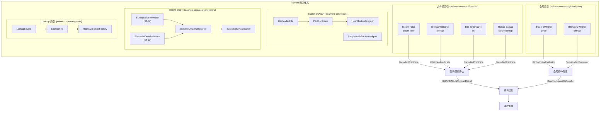

### 1.3 各索引的定位与适用场景

**为什么需要这么多索引类型？**

Paimon 面对的是 Lakehouse 场景，需要同时支持批处理和流式处理，面临多种查询模式：
- **等值查询** (WHERE col = 'x'): Bloom Filter 最优，O(1) 判断
- **低基数等值/IN/NOT IN**: Bitmap 倒排索引最优，支持行级过滤
- **范围查询** (WHERE col > 10 AND col < 100): BSI 或 Range Bitmap
- **TopN 查询** (ORDER BY col LIMIT N): Range Bitmap 特有能力
- **全文检索/向量检索**: 全局 BTree/Bitmap 索引返回全局 Row ID
- **跨分区主键去重**: Hash 索引用于动态 Bucket 分配
- **Merge-on-Read 删除标记**: DV 索引高效标记已删除行
- **流式 Lookup Join**: LookupLevels 将 SST 文件转为本地 KV 存储

**好处**: 每种索引针对特定查询模式进行了深度优化，避免一种索引承担所有场景，确保在各自场景下达到最优性能。

---

## 2. 文件内嵌索引 (File Index)

### 解决什么问题

**核心业务问题**: 在列式存储中,即使只需要过滤少量行,也必须读取整个列的数据块(Row Group/Stripe)。对于宽表(几十上百列)或大文件(GB级),这种无效读取会严重影响查询性能。

**没有文件索引的后果**:
1. **网络带宽浪费**: 从对象存储下载大量不需要的数据,S3/OSS的带宽成本高昂
2. **CPU资源浪费**: 解压缩、反序列化大量无用数据
3. **查询延迟高**: 简单的等值查询可能需要数秒甚至数十秒
4. **并发度受限**: 单个查询占用大量资源,系统整体吞吐量下降

**实际场景**:
- **用户行为分析**: 查询"user_id = 'xxx' 的所有行为记录",用户表有10亿行,分布在1000个文件中,没有索引需要读取所有文件
- **订单状态过滤**: 查询"status = 'PAID' 的订单",订单表有100个状态值,没有索引需要扫描所有数据
- **时间范围查询**: 查询"create_time BETWEEN '2024-01-01' AND '2024-01-31'",没有索引需要读取全年数据
- **NULL值过滤**: 查询"email IS NOT NULL",没有索引需要读取所有行判断

### 有什么坑

**误区1: 认为Bloom Filter可以做行级过滤**
- **问题**: Bloom Filter只能判断"文件中是否可能包含某个值",无法返回具体行号
- **后果**: 如果文件中有1亿行,只有1行匹配,仍然需要读取整个文件
- **正确做法**: 需要行级过滤时使用Bitmap索引

**误区2: 为高基数列建Bitmap索引**
- **问题**: Bitmap索引为每个不同值维护一个RoaringBitmap,高基数列(如用户ID)会导致内存爆炸
- **示例**: 1亿用户的用户ID列,Bitmap索引可能占用数GB内存
- **正确做法**: 高基数列使用Bloom Filter,低基数列(如状态、类型)使用Bitmap

**误区3: 忽略索引的写入开销**
- **问题**: BSI索引需要暂存所有值到内存,大文件写入时可能OOM
- **源码证据**: `BitSliceIndexBitmapFileIndex.Writer` 注释 "todo: Find a way to reduce the risk of out-of-memory"
- **正确做法**: 控制文件大小(`compaction.max-file-size`),避免单文件过大

**生产环境注意事项**:
1. **索引阈值配置**: `file-index-in-manifest-threshold` 默认32KB,过小会导致大量.idx文件,过大会导致Manifest膨胀
2. **索引重建**: 修改索引配置后,已有文件不会自动重建索引,需要手动触发`CALL sys.rewrite_file_index('db.table')`
3. **Map类型嵌套**: 配置`file-index.bloom-filter.columns = 'map_col[key_name]'`时,key_name必须存在,否则索引失效

**性能陷阱**:
- **过度索引**: 为所有列建索引会导致写入性能下降50%以上,索引数据可能超过原始数据
- **索引失效**: 使用函数(如`UPPER(col) = 'X'`)或类型转换会导致索引失效,必须改写为`col = 'x'`
- **Bloom Filter误判**: FPP=0.1意味着10%的文件会被误判为"可能包含",需要实际读取后才能确认

### 核心概念解释

**文件内嵌 vs 独立索引文件**:
- **内嵌模式**: 索引数据序列化后存储在`DataFileMeta.embeddedIndex`字段中,随Manifest一起持久化
- **独立模式**: 索引数据写入独立的`.idx`文件,`DataFileMeta.extraFiles`记录文件名
- **选择依据**: 索引大小 <= `file-index-in-manifest-threshold` 时内嵌,否则独立

**FileIndexFormat二进制格式**:
```
Header部分:
- magic(8B): 1493475289347502L,用于格式校验
- version(4B): 当前为V_1(1)
- head length(4B): Header总长度
- column number(4B): 列数量
- 每列信息:
  - column name(UTF): 列名
  - index number(4B): 该列的索引数量
  - 每个索引:
    - index name(UTF): 索引类型(bloom-filter/bitmap/bsi/range-bitmap)
    - start(4B): 索引数据在Body中的起始偏移
    - length(4B): 索引数据长度

Body部分:
- 各索引的序列化数据(按Header中的start/length定位)
```

**为什么设计自定义格式而非使用Protobuf/Avro?**
- **随机访问**: 通过Header可以直接seek到特定列的特定索引,无需反序列化整个文件
- **零拷贝**: 可以直接将字节数组传递给索引Reader,避免对象创建开销
- **紧凑性**: 没有schema元数据开销,纯数据存储

**与Parquet Column Index对比**:
| 特性 | Paimon File Index | Parquet Column Index |
|------|------------------|---------------------|
| 存储位置 | Manifest或独立.idx文件 | Parquet Footer |
| 索引类型 | Bloom/Bitmap/BSI/Range Bitmap | Min/Max/Null Count |
| 行级过滤 | 支持(Bitmap/BSI) | 不支持(仅Page级) |
| 扩展性 | SPI机制,可插拔 | 固定格式,不可扩展 |

### 设计理念

**为什么采用文件内嵌而非独立索引表?**

传统数据库(如MySQL)将索引存储在独立的B+树中,但在Lakehouse场景下这种方式有严重问题:
1. **一致性难保证**: 数据文件和索引文件分别管理,可能出现不一致
2. **事务复杂**: 需要两阶段提交保证数据和索引的原子性
3. **维护成本高**: 索引文件的生命周期管理、垃圾回收都需要额外机制

Paimon的文件内嵌设计巧妙地解决了这些问题:
- **原子性**: 索引随DataFileMeta一起写入Manifest,要么都成功要么都失败
- **自动清理**: 数据文件删除时,索引自动失效,无需额外的垃圾回收
- **局部性**: 索引和数据文件在逻辑上绑定,便于理解和调试

**权衡取舍**:
1. **灵活性 vs 一致性**: 牺牲了独立索引的灵活性(如全局索引),换取了强一致性保证
2. **空间 vs 性能**: 索引数据会增加存储成本,但查询性能提升10倍以上
3. **写入 vs 查询**: 索引增加写入开销(约20-30%),但查询性能提升远超写入损失

**架构演进**:
- **V1 (早期)**: 仅支持Bloom Filter,所有索引内嵌在Manifest中
- **V2 (当前)**: 支持多种索引类型,基于阈值决定内嵌或独立存储
- **V3 (规划)**: 支持列级索引统计,自动推荐最优索引类型

**SPI扩展机制的价值**:
通过`ServiceLoader<FileIndexerFactory>`,第三方可以无侵入地扩展索引类型:
- **paimon-tantivy**: 全文检索索引(基于Rust的Tantivy引擎)
- **paimon-lumina**: 向量索引(基于HNSW算法)
- **用户自定义**: 可以实现特定领域的索引(如地理空间索引、时序索引)

这种设计体现了"开闭原则":对扩展开放,对修改封闭。

### 2.1 架构概览与设计决策

**源码路径**: `paimon-common/src/main/java/org/apache/paimon/fileindex/`

**为什么采用文件内嵌模式？**

Paimon 将索引数据直接嵌入到数据文件的伴随文件（或 Manifest 元数据）中，而非维护独立的索引存储。

**好处**:
1. **数据局部性**: 索引与数据文件紧密关联，无需维护索引到数据文件的映射
2. **原子性**: 索引随数据文件一起写入/删除，不存在索引与数据不一致的风险
3. **可扩展**: 基于 SPI 机制，第三方可以扩展自己的索引类型

**核心接口体系**:

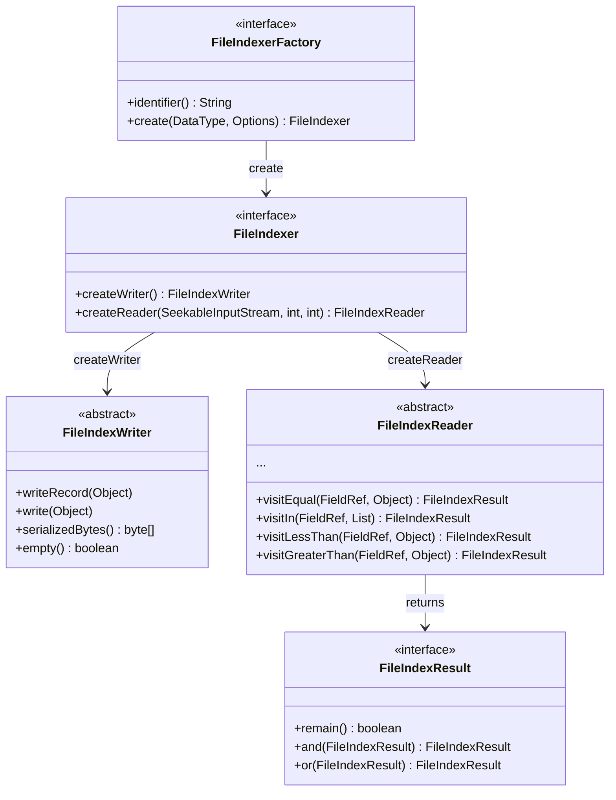

**SPI 注册的四种文件索引类型**（`META-INF/services/org.apache.paimon.fileindex.FileIndexerFactory`）:

| SPI 标识符 | 实现类 | Factory 类 |
|-----------|--------|-----------|
| `bloom-filter` | `BloomFilterFileIndex` | `BloomFilterFileIndexFactory` |
| `bitmap` | `BitmapFileIndex` | `BitmapFileIndexFactory` |
| `bsi` | `BitSliceIndexBitmapFileIndex` | `BitSliceIndexBitmapFileIndexFactory` |
| `range-bitmap` | `RangeBitmapFileIndex` | `RangeBitmapFileIndexFactory` |

### 2.2 文件索引存储格式 (FileIndexFormat)

**源码路径**: `paimon-common/src/main/java/org/apache/paimon/fileindex/FileIndexFormat.java`

**为什么自定义二进制格式而非使用通用序列化？**

Paimon 设计了一种自包含的二进制格式，支持按列、按索引类型随机访问，避免反序列化整个索引文件。

**好处**: 只需读取 Header 即可获知每个列每种索引的偏移和长度，按需 seek+read 特定索引块。

**文件格式详解**:

```
 ______________________________________    _____________________
|     magic(8B) | version(4B) | head length(4B)  |
|--------------------------------------|
|            column number(4B)         |
|--------------------------------------|
|   column 1 (UTF) | index number(4B) |         HEAD
|--------------------------------------|
|  index name 1(UTF) | start(4B) | length(4B)   |
|--------------------------------------|
|  index name 2(UTF) | start(4B) | length(4B)   |
|--------------------------------------|
|                 ...                  |
|--------------------------------------|
|  redundant length(4B) | redundant bytes        |
|--------------------------------------|    ---------------------
|                BODY                  |
|         (各索引的序列化数据)            |         BODY
|______________________________________|    _____________________
```

- **magic**: `1493475289347502L` (8字节), 用于文件格式校验
- **version**: 当前为 `V_1(1)`, 预留版本兼容
- **head length**: Header 部分的总长度（包含 magic、version、head length 本身）
- **EMPTY_INDEX_FLAG**: `-1`, 标记空索引（列无数据时的特殊标记）
- **redundant length**: 当前为 0, 预留扩展字段

**存储位置决策**: 根据 `fileIndexInManifestThreshold` 配置:
- 索引数据小于阈值 -> 嵌入 DataFileMeta（存储在 Manifest 中）
- 索引数据大于阈值 -> 写入独立的 `.idx` 文件（作为 extraFiles）

**源码路径**: `paimon-core/src/main/java/org/apache/paimon/index/FileIndexProcessor.java` (L79)

### 2.3 Bloom Filter 索引

### 解决什么问题

**核心业务问题**: 等值查询(WHERE col = 'value')是最常见的查询模式,但在分布式存储中,数据分散在成百上千个文件中,如何快速判断"某个文件是否可能包含某个值"?

**没有Bloom Filter的后果**:
1. **全文件扫描**: 查询单个用户的数据,需要读取所有文件,即使99%的文件不包含该用户
2. **网络I/O爆炸**: 从S3/OSS下载大量无用文件,带宽成本高昂
3. **查询延迟不可控**: 延迟与文件数量成正比,文件越多越慢

**实际场景**:
- **用户画像查询**: 10亿用户分布在10000个文件中,查询单个用户,没有Bloom Filter需要读取所有文件
- **订单详情查询**: 根据订单ID查询订单,订单表有1000个分区,每个分区100个文件,没有Bloom Filter需要读取10万个文件
- **日志检索**: 根据traceId查询调用链,日志表每小时一个分区,每个分区1000个文件,没有Bloom Filter需要读取全部

### 有什么坑

**误区1: 认为Bloom Filter可以100%准确**
- **问题**: Bloom Filter是概率数据结构,存在误判(False Positive),默认FPP=0.1意味着10%的文件会被误判
- **后果**: 查询时可能读取10%的无关文件,浪费I/O
- **正确做法**: 根据查询精度要求调整FPP,精度要求高的场景设置为0.01或0.001

**误区2: items参数设置不当**
- **问题**: items是预期元素数量,设置过小会导致FPP急剧上升,设置过大会浪费空间
- **示例**: 文件有100万行,items设置为10万,实际FPP可能达到50%以上
- **正确做法**: items应该略大于文件的实际行数,可以设置为`targetFileSize / avgRowSize * 1.2`

**误区3: 为所有列建Bloom Filter**
- **问题**: Bloom Filter只支持等值查询,为范围查询列(如时间戳)建Bloom Filter完全无效
- **正确做法**: 只为等值查询的高基数列建Bloom Filter

**生产环境注意事项**:
1. **FPP与空间的权衡**: FPP=0.1时每元素4.8 bits,FPP=0.01时每元素9.6 bits,空间翻倍
2. **哈希冲突**: 使用xxHash(字节类型)或Thomas Wang哈希(数值类型),冲突概率极低但非零
3. **NULL值处理**: Bloom Filter无法区分NULL和不存在,查询`col IS NULL`时索引失效

**性能陷阱**:
- **误判率累积**: 多个Bloom Filter做AND时,误判率会累积,10个FPP=0.1的索引,最终误判率接近100%
- **大字符串哈希**: 对于长字符串(如JSON),xxHash的计算开销不可忽略
- **写入内存峰值**: 构建Bloom Filter时需要维护完整的bit数组,大文件可能占用数MB内存

### 核心概念解释

**Bloom Filter原理**:
Bloom Filter是一个bit数组 + k个哈希函数:
1. **写入**: 对元素计算k个哈希值,将对应的k个bit位设置为1
2. **查询**: 对元素计算k个哈希值,检查对应的k个bit位是否都为1
3. **结果**: 都为1 -> 可能存在(可能误判),有0 -> 一定不存在(100%准确)

**FPP(False Positive Probability)计算公式**:
```
FPP = (1 - e^(-k*n/m))^k
其中:
- n: 实际元素数量
- m: bit数组大小
- k: 哈希函数个数
```

**Paimon的实现细节**:
```java
// BloomFilterFileIndex.java
private static final int DEFAULT_ITEMS = 1_000_000;    // 默认100万元素
private static final double DEFAULT_FPP = 0.1;          // 默认10%误判率

// 根据items和fpp计算最优的bit数组大小和哈希函数个数
BloomFilter64 filter = BloomFilter64.create(items, fpp);
```

**为什么使用BloomFilter64而非BloomFilter32?**
- **哈希空间更大**: 64位哈希空间为2^64,32位为2^32,冲突概率降低2^32倍
- **支持更多元素**: 32位Bloom Filter最多支持约10亿元素,64位几乎无限制
- **性能相当**: 64位哈希的计算开销与32位相差无几

**FastHash哈希策略**:
| 数据类型 | 哈希算法 | 时间复杂度 | 说明 |
|---------|---------|-----------|------|
| VARCHAR/CHAR/BINARY | xxHash | O(n) | n为字节长度 |
| INT/BIGINT/FLOAT/DOUBLE | Thomas Wang | O(1) | 整数哈希 |
| TIMESTAMP | 转换为millis/micros后哈希 | O(1) | 根据精度转换 |
| DECIMAL | toUnscaledLong()后哈希 | O(1) | 转换为长整型 |

### 设计理念

**为什么选择Bloom Filter作为默认索引?**

在所有索引类型中,Bloom Filter具有独特的优势:
1. **空间效率最高**: FPP=0.1时仅需4.8 bits/元素,1亿元素仅需60MB
2. **查询时间恒定**: O(1)时间复杂度,与数据量无关
3. **适用所有类型**: 通过FastHash统一哈希,支持所有Paimon数据类型
4. **写入开销最低**: 仅需维护一个bit数组,无需复杂的数据结构

**权衡取舍**:
1. **精度 vs 空间**: 牺牲10%的精度(误判),换取95%的空间节省(相比Bitmap)
2. **通用性 vs 功能**: 只支持等值查询,但覆盖了80%的查询场景
3. **确定性 vs 概率**: 接受概率性结果,换取极致的性能

**为什么不使用Cuckoo Filter?**
Cuckoo Filter相比Bloom Filter有以下优势:
- 支持删除操作
- 更低的FPP(相同空间下)

但Paimon选择Bloom Filter的原因:
1. **不需要删除**: 索引随文件一起创建和删除,不需要单独删除元素
2. **实现简单**: Bloom Filter实现更简单,bug更少
3. **生态成熟**: Guava/RoaringBitmap等库都提供了Bloom Filter实现

**与Parquet Bloom Filter对比**:
| 特性 | Paimon Bloom Filter | Parquet Bloom Filter |
|------|-------------------|---------------------|
| 存储位置 | Manifest或.idx文件 | Parquet Footer |
| 哈希算法 | xxHash/Thomas Wang | xxHash |
| 位数 | 64-bit | 32-bit |
| FPP配置 | 表级/列级可配置 | 写入时固定 |
| 查询接口 | FileIndexReader统一接口 | Parquet API |

**业界实践**:
- **Hudi**: 使用Bloom Filter作为默认索引,存储在.hoodie元数据中
- **Delta Lake**: 使用Data Skipping Index(基于min/max统计),不支持Bloom Filter
- **Iceberg**: 依赖Parquet的Bloom Filter,但需要Parquet格式支持

Paimon的优势在于索引与文件格式解耦,可以为任何格式(包括ORC/Avro)添加Bloom Filter。

### 2.4 Bitmap 倒排索引

### 解决什么问题

**核心业务问题**: Bloom Filter只能做文件级过滤(跳过整个文件),但很多场景需要行级过滤。例如,一个1GB的文件有1000万行,只有100行匹配查询条件,Bloom Filter无法避免读取整个文件。

**没有Bitmap索引的后果**:
1. **无效行读取**: 即使知道文件包含目标数据,仍需读取所有行,浪费CPU和内存
2. **不支持复杂查询**: NOT IN、IS NULL、IS NOT NULL等查询无法使用Bloom Filter
3. **多条件查询低效**: 多个条件的AND/OR组合无法在索引层面优化

**实际场景**:
- **状态过滤**: 订单表查询"status IN ('PAID', 'SHIPPED')",状态列有10个值,Bitmap可以精确返回匹配的行号
- **NULL值处理**: 用户表查询"email IS NOT NULL",Bitmap可以直接返回非NULL行的行号集合
- **多条件组合**: 查询"status = 'PAID' AND region = 'CN'",Bitmap可以对两个条件的行号集合做AND运算
- **TopN优化**: 查询"status = 'PAID' ORDER BY create_time LIMIT 100",Bitmap可以先过滤出PAID的行号,再读取这些行

### 有什么坑

**误区1: 为高基数列建Bitmap索引**
- **问题**: Bitmap为每个不同值维护一个RoaringBitmap,高基数列会导致内存和存储爆炸
- **示例**: 用户ID列有1亿个不同值,每个值平均出现10次,Bitmap索引可能占用数GB
- **正确做法**: 只为低基数列(基数<1000)建Bitmap索引,高基数列使用Bloom Filter

**误区2: 忽略单值优化**
- **问题**: 如果某个值只出现一次,仍然存储完整的RoaringBitmap,浪费空间
- **Paimon的优化**: 单值时存储`-1 - rowId`(负数编码),节省空间
- **源码位置**: `BitmapFileIndex.Writer.write()` (L145-150)

**误区3: 混淆VERSION_1和VERSION_2**
- **问题**: V1不支持块索引,大文件查询时需要加载整个Bitmap到内存
- **V2优化**: 增加了块索引,支持按需加载
- **正确做法**: 使用默认的VERSION_2

**生产环境注意事项**:
1. **基数评估**: 建索引前先执行`SELECT COUNT(DISTINCT col) FROM table`,基数>1000不建议使用Bitmap
2. **内存监控**: Bitmap索引的Writer会在内存中维护`Map<Object, RoaringBitmap32>`,大文件可能OOM
3. **NULL值处理**: Bitmap会为NULL值维护独立的bitmap,查询`IS NULL`时非常高效

**性能陷阱**:
- **写入内存峰值**: 构建Bitmap索引时,需要为每个不同值维护一个RoaringBitmap,内存占用与基数成正比
- **序列化开销**: RoaringBitmap的序列化/反序列化有一定开销,小文件可能得不偿失
- **位图运算成本**: 虽然RoaringBitmap做了压缩,但大规模AND/OR运算仍有开销

### 核心概念解释

**倒排索引(Inverted Index)**:
传统索引是"行号 -> 值",倒排索引是"值 -> 行号集合":
```
正排: Row 0 -> "PAID", Row 1 -> "SHIPPED", Row 2 -> "PAID"
倒排: "PAID" -> {0, 2}, "SHIPPED" -> {1}
```

**RoaringBitmap32**:
RoaringBitmap是一种压缩的位图数据结构,将32位整数空间分为2^16个块(chunk),每个块使用不同的压缩策略:
- **Array Container**: 元素<4096时,使用有序数组存储
- **Bitmap Container**: 元素>=4096时,使用位图存储
- **Run Container**: 连续区间时,使用游程编码

**为什么使用RoaringBitmap而非普通Bitmap?**
普通Bitmap的空间复杂度是O(max_value),如果最大行号是1亿,需要12.5MB空间。RoaringBitmap通过分块和压缩,空间复杂度降低到O(cardinality),稀疏场景下节省90%以上空间。

**BitmapIndexResult**:
这是`FileIndexResult`的关键子类,继承`LazyField<RoaringBitmap32>`:
```java
public class BitmapIndexResult extends LazyField<RoaringBitmap32> 
                               implements FileIndexResult {
    @Override
    public boolean remain() {
        return get() != null && !get().isEmpty();
    }
    
    @Override
    public FileIndexResult and(FileIndexResult other) {
        if (other instanceof BitmapIndexResult) {
            // 使用RoaringBitmap的原生and运算
            return new BitmapIndexResult(() -> 
                RoaringBitmap32.and(this.get(), ((BitmapIndexResult) other).get()));
        }
        return other.and(this);
    }
}
```

**支持的查询操作**:
| 操作 | 实现方式 | 时间复杂度 |
|------|---------|-----------|
| `col = 'x'` | 查找对应值的bitmap | O(1) |
| `col != 'x'` | 查找对应值的bitmap后flip | O(n) |
| `col IN ('x','y')` | 多个值的bitmap做OR | O(k) k为值的数量 |
| `col NOT IN ('x','y')` | 多个值的bitmap做OR后flip | O(k + n) |
| `col IS NULL` | 返回nullBitmap | O(1) |
| `col IS NOT NULL` | 返回nullBitmap的flip | O(n) |

### 设计理念

**为什么需要行级过滤?**

文件级过滤(Bloom Filter)只能回答"文件中是否包含某个值",但无法回答"哪些行包含某个值"。在以下场景下,行级过滤至关重要:
1. **选择率低**: 文件有1000万行,只有100行匹配,读取整个文件浪费99.999%的资源
2. **多条件组合**: `WHERE status = 'PAID' AND region = 'CN'`,两个条件的行号集合做AND运算,避免读取不匹配的行
3. **与DV联合**: Merge-on-Read场景下,需要从查询结果中扣除已删除的行

**权衡取舍**:
1. **精度 vs 空间**: Bitmap提供100%精确的行号,但空间开销是Bloom Filter的10-100倍
2. **功能 vs 性能**: 支持NOT IN/IS NULL等复杂查询,但写入和查询开销更高
3. **低基数 vs 高基数**: 只适用于低基数列,高基数列会导致索引膨胀

**为什么使用VERSION_2?**
V1的问题:
- 所有bitmap存储在一个连续的字节数组中,查询时需要加载整个数组
- 大文件(GB级)的Bitmap索引可能有数百MB,加载开销大

V2的改进:
- 增加了块索引(block index),将bitmap分块存储
- 查询时只加载需要的块,减少内存占用和加载时间
- 源码位置: `BitmapFileIndex.VERSION_2` (L56)

**单值优化的巧妙设计**:
```java
// BitmapFileIndex.Writer.write() (L145-150)
if (bitmap.getCardinality() == 1) {
    // 单值时存储 -1 - rowId,用负数编码
    out.writeInt(-1 - bitmap.first());
} else {
    // 多值时存储完整的RoaringBitmap
    bitmap.serialize(out);
}
```
这个优化在高基数列中非常有效,如果80%的值只出现一次,可以节省80%的空间。

**与Elasticsearch倒排索引对比**:
| 特性 | Paimon Bitmap | Elasticsearch Inverted Index |
|------|--------------|----------------------------|
| 存储结构 | RoaringBitmap32 | Posting List + Skip List |
| 压缩算法 | Array/Bitmap/Run Container | Frame of Reference + Bit Packing |
| 更新方式 | 不可变(随文件创建) | 可变(Segment合并) |
| 查询性能 | O(1)定位 + O(k)位运算 | O(log n)跳表 + O(k)解压 |

Paimon的优势在于不可变性带来的简单性和高性能,劣势是无法支持实时更新。

### 2.5 BSI (Bit-Sliced Index) 索引

### 解决什么问题

**核心业务问题**: 范围查询(WHERE col > 100 AND col < 1000)在OLAP场景中非常常见,但Bloom Filter不支持范围查询,Bitmap索引虽然支持但效率不高(需要遍历所有值)。

**没有BSI索引的后果**:
1. **范围查询全表扫描**: 查询"金额>1000的订单",需要读取所有文件的所有行
2. **Bitmap索引低效**: 如果用Bitmap索引,需要对1000个不同值的bitmap做OR运算,开销大
3. **无法利用数值特性**: 数值类型的大小关系无法在索引层面利用

**实际场景**:
- **金额范围查询**: 订单表查询"amount BETWEEN 100 AND 1000",金额列是连续数值
- **时间范围查询**: 日志表查询"timestamp > '2024-01-01' AND timestamp < '2024-01-31'"
- **年龄范围查询**: 用户表查询"age >= 18 AND age <= 65"
- **评分过滤**: 商品表查询"rating >= 4.0"

### 有什么坑

**误区1: 为字符串列建BSI索引**
- **问题**: BSI只支持数值类型(TinyInt/SmallInt/Int/BigInt/Date/Time/Timestamp/Decimal)
- **后果**: 配置后索引创建失败或被忽略
- **正确做法**: 字符串范围查询使用Range Bitmap索引

**误区2: 忽略正负数分离**
- **问题**: BSI将正数和负数分别建立索引,查询时需要特殊处理边界
- **示例**: 查询`col > -10`,需要同时查询负数BSI(`< 10`)和正数BSI(全部)
- **Paimon的处理**: 源码中有详细的正负数转换逻辑(L279-340)

**误区3: BSI的内存开销**
- **问题**: BSI的Writer会将所有值暂存到`List<Long>`中,大文件可能OOM
- **源码证据**: `BitSliceIndexBitmapFileIndex.Writer` 注释 "todo: Find a way to reduce the risk of out-of-memory"
- **正确做法**: 控制文件大小,避免单文件超过1GB

**生产环境注意事项**:
1. **Decimal类型**: 通过`toUnscaledLong()`转换,需要确保精度不丢失
2. **Timestamp精度**: 根据精度转换为millis或micros,不同精度的查询结果可能不同
3. **NULL值处理**: BSI支持NULL值,通过独立的bitmap存储

**性能陷阱**:
- **写入内存峰值**: 需要暂存所有值,1亿行的BIGINT列需要约800MB内存
- **位运算开销**: 范围查询需要对多个slice做位运算,slice数量=数值的位数(如BIGINT为64)
- **边界处理**: 正负数边界的转换有一定CPU开销

### 核心概念解释

**Bit-Sliced Index原理**:
BSI将数值的每一位(bit)存储为一个独立的RoaringBitmap(称为"slice"):
```
示例: 3个数值 [5, 3, 7]
二进制表示:
  Row 0: 5 = 101
  Row 1: 3 = 011  
  Row 2: 7 = 111

BSI存储:
  Slice 0 (最低位): {0, 1, 2} = 111
  Slice 1 (中间位): {1, 2}    = 011
  Slice 2 (最高位): {0, 2}    = 101
```

**范围查询算法**:
查询`col > 5`(二进制101):
1. 从最高位开始比较
2. Slice 2 = {0, 2},这些行的最高位为1,可能>5
3. 继续比较Slice 1和Slice 0,最终得到{2}(值为7)

**为什么分离正负数?**
负数的二进制表示使用补码,直接比较会出错:
```
-1的补码: 11111111...
 1的补码: 00000001...
直接比较: -1 > 1 (错误!)
```
Paimon的解决方案:
- 正数和负数分别建立BSI
- 查询时根据边界值的正负分别处理
- 源码位置: `BitSliceIndexBitmapFileIndex.Reader.visitLessThan()` (L279-340)

**BitSliceIndexRoaringBitmap**:
这是BSI的核心实现类,位于`paimon-common/utils/`:
```java
public class BitSliceIndexRoaringBitmap {
    private final List<RoaringBitmap32> slices;  // 每一位对应一个bitmap
    private final long min;  // 最小值,用于优化查询
    private final long max;  // 最大值,用于优化查询
    
    // 范围查询的核心方法
    public RoaringBitmap32 lt(long value) { ... }  // <
    public RoaringBitmap32 gt(long value) { ... }  // >
    public RoaringBitmap32 lte(long value) { ... } // <=
    public RoaringBitmap32 gte(long value) { ... } // >=
}
```

**存储格式**:
```
[version: 1B] [rowNumber: 4B]
[hasPositive: 1B] 
  [positive min: 8B] [positive max: 8B] [positive slices]
[hasNegative: 1B]
  [negative min: 8B] [negative max: 8B] [negative slices]
```

### 设计理念

**为什么选择BSI而非B+树?**

传统数据库使用B+树索引支持范围查询,但在Lakehouse场景下B+树有严重问题:
1. **不可变性**: 数据文件不可变,B+树的插入/删除操作无意义
2. **空间开销**: B+树需要存储完整的key,空间开销大
3. **随机访问**: B+树需要随机访问,对象存储的随机访问性能差

BSI的优势:
1. **顺序访问**: 所有slice都是顺序存储,对象存储友好
2. **空间高效**: 只存储bit,不存储完整的key
3. **位运算高效**: 现代CPU的位运算指令非常快

**权衡取舍**:
1. **数值 vs 字符串**: 只支持数值类型,字符串需要使用Range Bitmap
2. **精度 vs 性能**: 支持64位整数,但位数越多,查询开销越大
3. **内存 vs 磁盘**: 写入时需要暂存所有值,牺牲内存换取查询性能

**为什么不使用Zone Map?**
Zone Map(min/max统计)也能支持范围查询,但只能做文件级过滤:
- Zone Map: 文件级,只能跳过整个文件
- BSI: 行级,可以精确返回匹配的行号

Paimon同时支持两者:
- DataFileMeta中的min/max用于文件级过滤
- BSI索引用于行级过滤

**与Druid的BSI对比**:
Druid也使用BSI索引,但实现有所不同:
| 特性 | Paimon BSI | Druid BSI |
|------|-----------|----------|
| 存储位置 | 文件内嵌 | Segment内嵌 |
| 正负数处理 | 分离存储 | 统一存储(使用偏移) |
| 压缩算法 | RoaringBitmap | Concise Bitmap |
| 查询优化 | min/max边界优化 | 无 |

Paimon的正负数分离设计更加清晰,避免了复杂的偏移计算。

### 2.6 Range Bitmap 索引

**源码路径**: `paimon-common/src/main/java/org/apache/paimon/fileindex/rangebitmap/`

**为什么需要 Range Bitmap 而已有 BSI？**

Range Bitmap 在 BSI 的基础上增加了 **ChunkedDictionary**（分块字典），将原始值映射为紧凑的整数编码后再建立 BSI。

**好处**:
1. **支持更多数据类型**: 通过 `KeyFactory`，Range Bitmap 支持 VARCHAR、BINARY 等字节类型的范围查询
2. **TopN 加速**: 独有的 `visitTopN` 能力，可以在索引层面完成 `ORDER BY col LIMIT N`
3. **字典压缩**: 高基数列通过 ChunkedDictionary 压缩后再建 BSI，空间更优

**核心架构**:

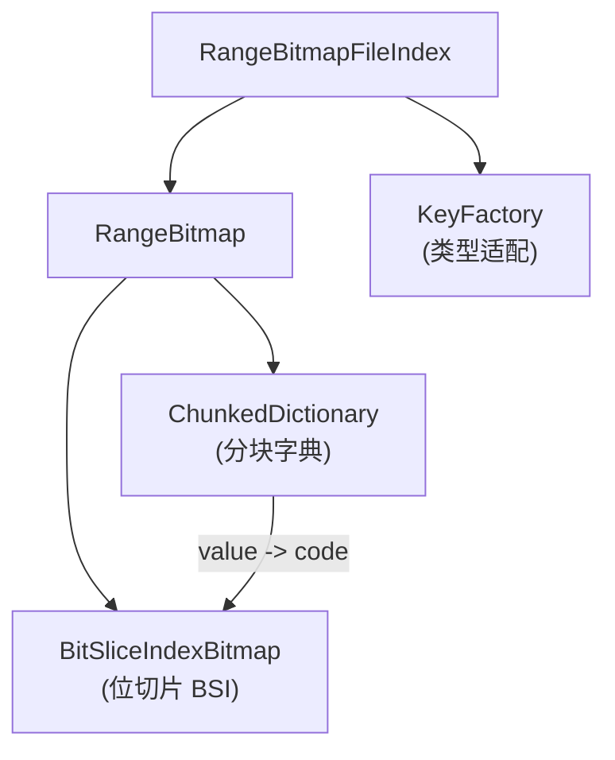

**文件格式** (`RangeBitmap.java`):
```
[headerLength: 4B]
  [version: 1B] [rid: 4B] [cardinality: 4B]
  [min] [max] [dictionaryLength: 4B]
[Dictionary Body (ChunkedDictionary)]
[BSI Body (BitSliceIndexBitmap)]
```

**TopN 查询** (`RangeBitmapFileIndex.Reader.visitTopN`, L167-183):
- 支持 `ASCENDING` -> `bitmap.bottomK(limit, ...)` 
- 支持 `DESCENDING` -> `bitmap.topK(limit, ...)`
- 可以与 foundSet 联合 (先过滤再 TopN)

**ChunkedDictionary** (`dictionary/chunked/ChunkedDictionary.java`):
- 二分查找 `find(key)` 方法，定位 key 在字典中的编码
- 分块存储（FixedLengthChunk / VariableLengthChunk），支持按需加载
- 根据 `chunk-size` 配置控制分块大小

### 2.7 文件索引 SPI 扩展机制

**源码路径**: `paimon-common/src/main/java/org/apache/paimon/fileindex/FileIndexerFactoryUtils.java`

**为什么使用 SPI 而非硬编码？**

通过 Java SPI (`ServiceLoader<FileIndexerFactory>`)，索引类型可以通过 classpath 扩展，无需修改核心代码。

**好处**: 
- 第三方模块（如 paimon-tantivy 全文检索、paimon-lumina 向量索引）可以注册自己的文件索引类型
- 核心代码零耦合

**加载机制** (L35-47):
```java
static {
    ServiceLoader<FileIndexerFactory> serviceLoader =
            ServiceLoader.load(FileIndexerFactory.class);
    for (FileIndexerFactory indexerFactory : serviceLoader) {
        factories.put(indexerFactory.identifier(), indexerFactory);
    }
}
```

---

## 3. 全局索引 (Global Index)

### 解决什么问题

**核心业务问题**: 文件内嵌索引的作用域是单个数据文件,无法支持跨文件的全局查询。全文检索、向量检索等场景需要在整个表范围内查找匹配的行,并返回全局行号(Row ID)。

**没有全局索引的后果**:
1. **全文检索不可用**: 查询"包含关键词'Paimon'的所有文档",需要扫描所有文件,无法利用倒排索引
2. **向量检索性能差**: 查询"与给定向量最相似的Top 100条记录",需要计算所有向量的相似度
3. **跨文件聚合低效**: 查询"每个用户的订单总数",需要读取所有文件后再聚合
4. **无法支持复杂查询**: 如"查找所有提到'Apache Paimon'的文档,并按相关性排序"

**实际场景**:
- **文档检索系统**: 10亿篇文档,查询"包含'Lakehouse'的文档",需要全局倒排索引
- **推荐系统**: 1亿个商品向量,查询"与用户画像最相似的100个商品",需要全局向量索引
- **日志分析**: 查询"包含ERROR关键词的所有日志",日志分散在10万个文件中
- **知识图谱**: 查询"与'Apache'相关的所有实体",需要全局图索引

### 有什么坑

**误区1: 混淆文件索引和全局索引**
- **问题**: 文件索引返回"是否跳过文件"或"文件内的行号",全局索引返回"全局Row ID"
- **区别**: 文件索引的行号范围是[0, 文件行数),全局索引的Row ID范围是[0, 表总行数)
- **正确理解**: 全局索引需要通过`offset()`方法将分片内Row ID转换为全局Row ID

**误区2: 认为全局索引可以替代文件索引**
- **问题**: 全局索引的构建和维护成本远高于文件索引,不适合所有场景
- **适用场景**: 只有全文检索、向量检索等必须跨文件查询的场景才需要全局索引
- **正确做法**: 普通的等值/范围查询使用文件索引,特殊场景才使用全局索引

**误区3: 忽略Range分片**
- **问题**: 全局索引按行范围(rowRangeStart, rowRangeEnd)分片,查询时需要合并多个分片的结果
- **性能影响**: 如果分片过多,合并开销会很大
- **正确配置**: 通过`BTREE_INDEX_RECORDS_PER_RANGE`控制每个分片的行数,默认值需要根据表大小调整

**生产环境注意事项**:
1. **索引构建成本**: 全局索引需要扫描全表数据,大表构建可能需要数小时
2. **存储开销**: 全局索引文件可能占用表数据10-30%的空间
3. **更新策略**: 数据更新后,全局索引不会自动重建,需要手动触发或定期重建

**性能陷阱**:
- **RoaringNavigableMap64开销**: 64位bitmap的内存占用和运算开销都比32位高
- **分片合并开销**: 查询结果需要合并多个分片的bitmap,分片越多开销越大
- **缓存失效**: BTree索引使用CacheManager缓存,缓存失效时需要重新加载

### 核心概念解释

**全局Row ID**:
全局Row ID是表中每一行的唯一标识,从0开始递增:
```
文件1: 100万行, Row ID范围 [0, 1000000)
文件2: 200万行, Row ID范围 [1000000, 3000000)
文件3: 150万行, Row ID范围 [3000000, 4500000)
```

**Range分片**:
全局索引按行范围分片,每个分片覆盖一定范围的Row ID:
```
分片1: rowRangeStart=0,        rowRangeEnd=10000000
分片2: rowRangeStart=10000000, rowRangeEnd=20000000
分片3: rowRangeStart=20000000, rowRangeEnd=30000000
```

**RoaringNavigableMap64**:
这是64位版本的RoaringBitmap,支持超过21亿行的表:
```java
public class RoaringNavigableMap64 {
    // 内部使用TreeMap<Integer, RoaringBitmap32>实现
    // 高32位作为key,低32位存储在RoaringBitmap32中
    private final TreeMap<Integer, RoaringBitmap32> map;
    
    public void add(long value) {
        int high = (int) (value >>> 32);
        int low = (int) value;
        map.computeIfAbsent(high, k -> new RoaringBitmap32()).add(low);
    }
}
```

**GlobalIndexResult**:
全局索引的查询结果,包含匹配的全局Row ID集合:
```java
public interface GlobalIndexResult {
    RoaringNavigableMap64 results();  // 匹配的Row ID集合
    
    GlobalIndexResult and(GlobalIndexResult other);  // AND运算
    GlobalIndexResult or(GlobalIndexResult other);   // OR运算
    GlobalIndexResult offset(long startOffset);      // 偏移转换
}
```

**与文件索引的对比**:
| 特性 | 文件索引 | 全局索引 |
|------|---------|---------|
| 作用域 | 单个文件 | 整个表 |
| 返回结果 | REMAIN/SKIP/文件内行号 | 全局Row ID |
| 构建成本 | 低(随文件写入) | 高(需要全表扫描) |
| 查询性能 | 快(单文件) | 慢(需要合并分片) |
| 适用场景 | 等值/范围查询 | 全文/向量检索 |

### 设计理念

**为什么需要全局索引?**

文件索引的局限性:
1. **作用域限制**: 只能判断"文件中是否包含某个值",无法跨文件查找
2. **无法排序**: 无法返回"全局Top K"结果
3. **不支持复杂查询**: 全文检索、向量检索等需要全局视图

全局索引的价值:
1. **全局视图**: 可以在整个表范围内查找匹配的行
2. **精确定位**: 返回全局Row ID,可以直接定位到具体的文件和行
3. **可扩展**: 通过SPI机制,可以扩展任意类型的全局索引(如图索引、地理空间索引)

**为什么采用Range分片?**

如果将整个表的索引存储在一个文件中,会有以下问题:
1. **文件过大**: 10亿行的表,索引文件可能有数GB,加载和查询都很慢
2. **无法并行**: 单个文件无法并行构建和查询
3. **更新困难**: 数据更新后,需要重建整个索引文件

Range分片的优势:
1. **并行构建**: 每个分片可以独立构建,充分利用多核CPU
2. **按需加载**: 查询时只加载相关的分片,减少内存占用
3. **增量更新**: 只需要重建变更的分片,不需要重建整个索引

**权衡取舍**:
1. **精度 vs 性能**: 全局索引提供精确的Row ID,但构建和查询开销大
2. **空间 vs 功能**: 全局索引占用额外存储,但支持文件索引无法实现的功能
3. **实时性 vs 一致性**: 全局索引不是实时更新的,可能存在延迟

**BTree vs Bitmap全局索引的选择**:
- **BTree**: 适用于高基数列,支持范围查询,空间效率高
- **Bitmap**: 适用于低基数列,支持复杂的位运算,查询速度快

Paimon的Bitmap全局索引实际上是对文件级Bitmap索引的包装,复用了成熟的实现。

### 3.1 全局索引架构设计

**源码路径**: `paimon-common/src/main/java/org/apache/paimon/globalindex/`

**为什么需要全局索引？**

文件内嵌索引的作用域是单个数据文件。而全文检索、向量检索等场景需要跨所有数据文件返回全局行 ID (Row ID)。

**好处**:
1. **全局 Row ID 定位**: 返回 `RoaringNavigableMap64`（64位 bitmap），可精确到行
2. **基于 Range 分片**: 索引按行范围 (rowRangeStart, rowRangeEnd) 分片，支持并行构建和查询
3. **可插拔**: 通过 SPI (`GlobalIndexerFactory`) 扩展

**核心接口体系**:

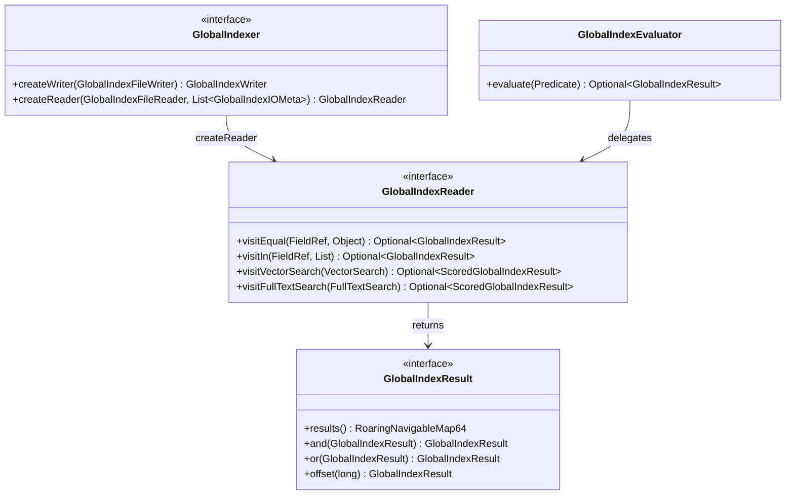

**SPI 注册**（`META-INF/services/org.apache.paimon.globalindex.GlobalIndexerFactory`）:

| SPI 标识符 | 实现类 |
|-----------|--------|
| `btree` | `BTreeGlobalIndexer` |
| `bitmap` | `BitmapGlobalIndex` |

### 3.2 BTree 全局索引

**源码路径**: `paimon-common/src/main/java/org/apache/paimon/globalindex/btree/BTreeGlobalIndexer.java`

**为什么采用 SST 之上的多层 BTree 而非内存 BTree？**

全局索引可能覆盖海量数据（数十亿行），直接构建内存 BTree 不现实。Paimon 采用 "逻辑 BTree" 策略：将数据存储在 SST 文件中，在 SST 上构建多层元数据索引。

**好处**: 显著降低内存压力，数据常驻磁盘，仅将索引元数据和热数据缓存到内存。

**架构示意** (源自 `BTreeGlobalIndexer.java` L39-57 的 Javadoc):

```
                                         BTree-Index
                                         /         \
                                        /    ...    \
                                       /             \
 +--------------------------------------+           +------------+
 |               SST File               |           |            |
 +--------------------------------------+           |            |
 |              Root Index              |           |            |
 |             /   ...    \             |    ...    |  SST File  |
 |     Leaf Index  ...  Leaf Index      |           |            |
 |     /  ...   \       /  ...   \      |           |            |
 | DataBlock       ...        DataBlock |           |            |
 +--------------------------------------+           +------------+
```

**核心组件**:
- `BTreeGlobalIndexer`: 全局索引器，管理 CacheManager
- `BTreeIndexWriter`: 写入器，将排序好的 key -> rowId 对写入 SST 文件
- `BTreeIndexReader`: 读取器，通过多层索引定位 key 对应的 Row ID
- `BTreeFileFooter`: SST 文件尾部元信息
- `KeySerializer`: 类型安全的 key 序列化
- `BTreeIndexOptions`: 配置项 (`BTREE_INDEX_CACHE_SIZE`, `BTREE_INDEX_RECORDS_PER_RANGE`, `BTREE_INDEX_HIGH_PRIORITY_POOL_RATIO`)

**构建流程** (`BTreeGlobalIndexBuilder.java`):
1. 通过 `DataEvolutionBatchScan` 扫描全表数据，提取 (indexField, _ROW_ID)
2. 使用 `BinaryExternalSortBuffer` 对 key 排序
3. 按 `recordsPerRange` 切分 Range
4. 每个 Range 通过 `GlobalIndexWriter` 写入独立的索引文件
5. 生成 `IndexFileMeta` 包含 `GlobalIndexMeta`（rowRangeStart, rowRangeEnd, indexFieldId, indexMeta）

### 3.3 Bitmap 全局索引

**源码路径**: `paimon-common/src/main/java/org/apache/paimon/globalindex/bitmap/BitmapGlobalIndex.java`

**为什么需要全局 Bitmap 索引？**

对于低基数列的全局等值查询，Bitmap 全局索引复用了文件级 `BitmapFileIndex` 的能力，通过 Wrapper 模式将文件级结果转换为全局结果。

**好处**: 代码复用，文件级 Bitmap 的成熟实现直接提升为全局能力。

**实现模式**:
```java
// BitmapGlobalIndex.java (L44-78)
public class BitmapGlobalIndex implements GlobalIndexer {
    private final BitmapFileIndex index;  // 复用文件级 BitmapFileIndex
    
    // 读取: 将 FileIndexReader 包装为 GlobalIndexReader
    public GlobalIndexReader createReader(...) {
        FileIndexReader reader = index.createReader(input, 0, (int) indexMeta.fileSize());
        return new FileIndexReaderWrapper(reader, this::toGlobalResult, input);
    }
    
    // 转换: FileIndexResult -> GlobalIndexResult
    private Optional<GlobalIndexResult> toGlobalResult(FileIndexResult result) {
        if (result instanceof BitmapIndexResult) {
            return Optional.of(GlobalIndexResult.create(
                () -> ((BitmapIndexResult) result).get().toNavigable64()));
        }
    }
}
```

### 3.4 GlobalIndexResult 与 RoaringNavigableMap64

**源码路径**: `paimon-common/src/main/java/org/apache/paimon/globalindex/GlobalIndexResult.java`

**为什么使用 RoaringNavigableMap64？**

全局 Row ID 可能超过 32 位整数范围（超过 20 亿行），需要 64 位 bitmap。`RoaringNavigableMap64` 是对 `RoaringBitmap32` 的 64 位扩展。

**好处**: 
- 支持超大表场景
- 保持 `and()` / `or()` 位图运算的高效性
- 懒计算 (`LazyField<RoaringNavigableMap64>`)，仅在需要时触发计算

**Range 偏移**: `GlobalIndexResult.offset(long startOffset)` 支持将分片内的 Row ID 偏移到全局 Row ID 空间。

### 3.5 全局索引的创建和使用流程

**创建流程**:

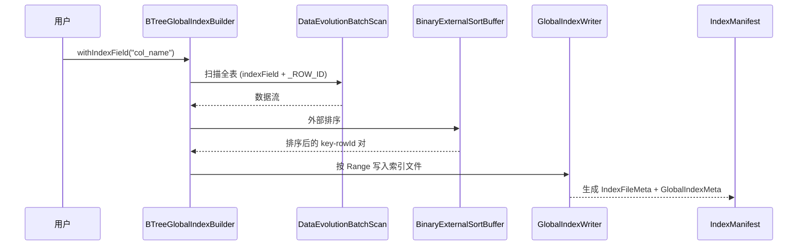

**使用流程** (`GlobalIndexScanner.java`):

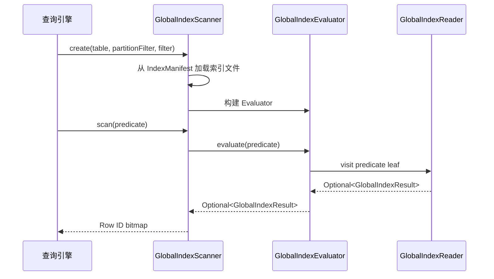

---

## 4. 哈希索引 (Hash Index / Bucket 分配)

### 解决什么问题

**核心业务问题**: Paimon的动态Bucket表(bucket = -1)需要根据主键hash动态决定记录应该写入哪个Bucket。如果没有索引记录"某个key之前被分配到哪个bucket",就会导致同一个key被分配到不同的bucket,破坏主键唯一性约束。

**没有哈希索引的后果**:
1. **主键重复**: 同一个key在不同的写入批次中被分配到不同的bucket,导致数据重复
2. **查询性能差**: 点查时需要扫描所有bucket,无法利用hash定位
3. **Compaction低效**: 无法确定哪些bucket需要合并,导致小文件问题
4. **数据倾斜**: 无法控制每个bucket的数据量,可能导致严重的数据倾斜

**实际场景**:
- **CDC同步**: 从MySQL同步数据到Paimon,需要根据主键判断是INSERT还是UPDATE,必须保证同一主键始终路由到同一bucket
- **流式写入**: Flink任务并行度为100,每个subtask独立分配bucket,需要哈希索引保证一致性
- **Upsert场景**: 用户画像表,根据user_id做upsert,必须保证同一user_id的所有更新都在同一bucket
- **去重场景**: 日志去重,根据log_id去重,需要哈希索引快速定位

### 有什么坑

**误区1: 认为哈希索引可以用于查询加速**
- **问题**: 哈希索引的目的是分配bucket,不是加速查询
- **查询加速**: 需要使用文件索引(Bloom Filter/Bitmap)或全局索引
- **正确理解**: 哈希索引是写入时使用的,查询时通过bucket裁剪优化

**误区2: 忽略targetBucketRowNumber配置**
- **问题**: 这个参数控制每个bucket的目标行数,设置不当会导致bucket数量爆炸或数据倾斜
- **过小**: 导致bucket数量过多,小文件问题严重
- **过大**: 导致单个bucket数据量过大,查询和compaction性能差
- **推荐值**: 根据表的总行数和期望的bucket数量计算,一般设置为100万-1000万

**误区3: 混淆HashBucketAssigner和SimpleHashBucketAssigner**
- **问题**: SimpleHashBucketAssigner用于overwrite场景,不加载历史索引
- **后果**: 如果在append场景使用Simple版本,会导致主键重复
- **正确做法**: append/upsert场景使用HashBucketAssigner,overwrite场景使用SimpleHashBucketAssigner

**生产环境注意事项**:
1. **索引文件清理**: 旧的hash索引文件不会自动删除,需要配置snapshot过期策略
2. **并行度设置**: numAssigners应该等于写入任务的并行度,否则会导致负载不均
3. **bucketFilter**: 在分布式场景下,每个assigner只负责部分bucket,通过bucketFilter过滤

**性能陷阱**:
- **索引加载开销**: 每次启动写入任务时,需要加载所有相关分区的hash索引,分区多时开销大
- **内存占用**: PartitionIndex使用Int2ShortHashMap存储hash->bucket映射,大表可能占用数GB内存
- **hash冲突**: 使用int32哈希,理论上存在冲突可能,但概率极低(2^32分之一)

### 核心概念解释

**动态Bucket vs 固定Bucket**:
- **固定Bucket**: 建表时指定bucket数量(如bucket=100),key通过`hash(key) % 100`分配
- **动态Bucket**: 不指定bucket数量(bucket=-1),根据数据量动态创建bucket

**Hash索引文件格式**:
```
纯int数组,每个int代表一个key的hashCode:
[hash1: 4B] [hash2: 4B] [hash3: 4B] ...
```

**为什么只存hashCode而非完整key?**
1. **空间效率**: int(4字节) vs 完整key(可能数十/数百字节)
2. **足够用**: 只需判断"这个key hash之前出现在哪个bucket",不需要完整key
3. **冲突概率低**: int32哈希空间(42亿)足够大,少量冲突不影响正确性

**PartitionIndex数据结构**:
```java
public class PartitionIndex {
    // key hash -> bucket映射,使用short节省内存(最多32767个bucket)
    private final Int2ShortHashMap hash2Bucket;
    
    // 未满bucket的计数信息,key=bucket, value=当前行数
    private final Map<Integer, Long> nonFullBucketInformation;
    
    // 所有bucket集合
    private final Set<Integer> totalBucketSet;
}
```

**分配算法四步法**:
```
1. 已见过的key -> 直接返回缓存的bucket
2. 存在未满bucket -> 分配到该bucket,计数+1
3. 可创建新bucket -> 创建新bucket(遵循bucketFilter和maxBucketsNum)
4. 超出上限 -> 随机选择现有bucket
```

**为什么使用partitionHash + keyHash双重哈希?**
```java
int assignId = BucketAssigner.computeAssigner(
    partitionHash, keyHash, numChannels, numAssigners);
```
确保同一key在分布式场景下始终路由到同一个Assigner,避免多个Assigner为同一key分配不同bucket。

### 设计理念

**为什么需要动态Bucket?**

固定Bucket的问题:
1. **预估困难**: 建表时很难预估数据量,bucket数量设置不当会导致性能问题
2. **无法扩展**: bucket数量固定后无法调整,数据增长后性能下降
3. **数据倾斜**: 某些key的数据量特别大,导致部分bucket过大

动态Bucket的优势:
1. **自动扩展**: 根据数据量自动创建新bucket,无需人工干预
2. **负载均衡**: 通过targetBucketRowNumber控制每个bucket的数据量
3. **灵活性**: 可以根据实际情况调整bucket数量

**权衡取舍**:
1. **灵活性 vs 复杂性**: 动态Bucket更灵活,但需要维护hash索引,增加了复杂性
2. **写入性能 vs 查询性能**: hash索引增加了写入开销,但通过bucket裁剪提升了查询性能
3. **内存 vs 磁盘**: hash索引需要加载到内存,但避免了全表扫描

**为什么使用Int2ShortHashMap?**
```java
// 使用short存储bucket编号,最多支持32767个bucket
private final Int2ShortHashMap hash2Bucket;
```
优势:
1. **节省内存**: short(2字节) vs int(4字节),内存占用减半
2. **足够用**: 32767个bucket对于绝大多数场景已经足够
3. **性能**: fastutil的Int2ShortHashMap比HashMap快30%以上

**overwrite场景的优化**:
overwrite场景下,旧数据会被完全覆盖,不需要加载历史索引:
```java
// SimpleHashBucketAssigner不加载历史索引
public class SimpleHashBucketAssigner implements BucketAssigner {
    @Override
    public int assign(BinaryRow partition, int hash) {
        // 直接根据hash分配,不查询历史索引
        return hash % numBuckets;
    }
}
```
这个优化避免了不必要的I/O,提升了overwrite场景的写入性能。

**与Hudi的Bucket Index对比**:
| 特性 | Paimon Hash Index | Hudi Bucket Index |
|------|------------------|------------------|
| Bucket类型 | 动态+固定 | 仅固定 |
| 索引存储 | 独立的hash索引文件 | HoodieMetadata |
| 分配算法 | 基于targetBucketRowNumber | 基于hash取模 |
| 扩展性 | 支持动态扩展 | 不支持 |

Paimon的动态Bucket设计更加灵活,适合数据量不可预估的场景。

### 4.1 动态 Bucket 分配机制

**源码路径**: `paimon-core/src/main/java/org/apache/paimon/index/`

**为什么需要哈希索引？**

Paimon 的动态 Bucket 表（`bucket = -1`）需要根据主键 hash 动态决定记录应该写入哪个 Bucket，同时保证同一个 key 始终路由到同一个 Bucket。

**好处**:
1. **自动扩缩 Bucket**: 不需要预先设定 Bucket 数量
2. **数据均衡**: 基于 `targetBucketRowNumber` 控制每个 Bucket 的数据量
3. **增量索引**: 索引文件记录 key hash -> bucket 映射，仅加载相关分区的索引

### 4.2 HashBucketAssigner 核心算法

**源码路径**: `paimon-core/src/main/java/org/apache/paimon/index/HashBucketAssigner.java`

**分配算法流程**:

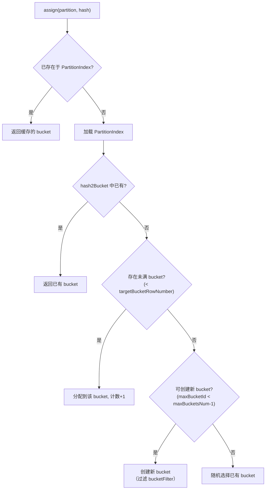

**Assigner 分配策略** (L163-168):
```java
private int computeAssignId(int partitionHash, int keyHash) {
    return BucketAssigner.computeAssigner(
        partitionHash, keyHash, numChannels, numAssigners);
}
```

**为什么使用 partitionHash + keyHash 双重哈希？**

确保同一 key 在分布式场景下始终路由到同一个 Assigner，避免多个 Assigner 为同一 key 分配不同 Bucket。

**好处**: 分布式环境下的确定性路由，无需全局协调。

### 4.3 PartitionIndex 分区索引

**源码路径**: `paimon-core/src/main/java/org/apache/paimon/index/PartitionIndex.java`

**核心数据结构**:
- `Int2ShortHashMap hash2Bucket`: key hash -> bucket 映射（使用 short 节省内存，最多 32767 个 bucket）
- `Map<Integer, Long> nonFullBucketInformation`: 未满 bucket 的计数信息
- `Set<Integer> totalBucketSet` / `List<Integer> totalBucketArray`: 所有 bucket 集合

**加载流程** (`loadIndex`, L120-154):
1. 从 `IndexFileHandler` 扫描当前分区的所有 HASH 类型 `IndexManifestEntry`
2. 逐个读取 hash 索引文件（存储 int 数组），恢复 hash -> bucket 映射
3. 同时统计每个 bucket 的行数
4. 使用 `loadFilter` 和 `bucketFilter` 过滤仅属于当前 Assigner 的数据

**分配四步法** (`assign`, L70-118):
1. 已见过的 key -> 直接返回缓存 bucket
2. 存在未满 bucket -> 分配并计数
3. 可创建新 bucket -> 创建新的（遵循 bucketFilter 和 maxBucketsNum）
4. 超出上限 -> 随机选择现有 bucket

### 4.4 SimpleHashBucketAssigner

**源码路径**: `paimon-core/src/main/java/org/apache/paimon/index/SimpleHashBucketAssigner.java`

**为什么需要 SimpleHashBucketAssigner？**

在 **overwrite** 场景下，不需要加载历史索引（因为旧数据会被完全覆盖），使用 Simple 版本避免不必要的 I/O。

**好处**: 消除 overwrite 场景下的索引加载开销。

**区别**: 不从 `IndexFileHandler` 加载历史索引，仅基于当前写入分配 bucket。

### 4.5 DynamicBucketIndexMaintainer

**源码路径**: `paimon-core/src/main/java/org/apache/paimon/index/DynamicBucketIndexMaintainer.java`

**职责**: 维护单个 (partition, bucket) 内的 key hashcode 集合，在 commit 时将变更的 hashcode 集合写入新的 hash 索引文件。

**核心机制**:
- 使用 `IntHashSet` 存储 key hash 集合
- `notifyNewRecord(KeyValue)`: 有新 key 时添加到集合，标记 `modified = true`
- `prepareCommit()`: 如果有修改，写出新的 `IndexFileMeta`

### 4.6 Hash 索引文件读写

**源码路径**: `paimon-core/src/main/java/org/apache/paimon/index/HashIndexFile.java`

**文件格式**: 纯 int 数组，每个 int 代表一个 key 的 hashCode

```java
// HashIndexFile.java
public static final String HASH_INDEX = "HASH";

public IntIterator read(IndexFileMeta file) throws IOException {
    return readInts(fileIO, pathFactory.toPath(file));
}

public IndexFileMeta write(IntIterator input) throws IOException {
    Path path = pathFactory.newPath();
    int count = writeInts(fileIO, path, input);
    return new IndexFileMeta(HASH_INDEX, path.getName(), fileSize(path), count, ...);
}
```

**为什么只存 hashCode 而非完整 key？**

1. **空间效率**: 一个 int(4字节) vs 完整 key（可能数十/数百字节）
2. **足够用**: 动态 Bucket 只需判断 "这个 key hash 之前出现在哪个 bucket"，不需要完整 key
3. **hash 冲突概率低**: Int32 哈希空间足够大，少量冲突不影响正确性（最多导致同一 bucket 的记录稍多）

---

## 5. DV 索引 (Deletion Vectors Index)

### 解决什么问题

**核心业务问题**: 在Merge-on-Read(MoR)模式下,更新和删除操作不会立即重写原始数据文件(成本太高),而是通过追加新数据+标记删除来实现。如何高效地标记"哪些行已被删除",并在读取时过滤掉这些行?

**没有DV索引的后果**:
1. **必须使用Merge-on-Write**: 每次更新/删除都需要重写整个文件,写入延迟高,吞吐量低
2. **读取性能差**: 如果用标记列(如deleted=true)标记删除,读取时需要扫描所有行
3. **存储浪费**: 标记列会占用额外的存储空间,且无法压缩
4. **Compaction压力大**: 必须频繁触发compaction清理已删除的行,否则存储膨胀

**实际场景**:
- **CDC同步**: 从MySQL同步DELETE操作到Paimon,使用DV标记删除,避免重写文件
- **GDPR合规**: 用户请求删除个人数据,使用DV快速标记删除,延迟到compaction时物理删除
- **数据更新**: 订单状态更新,先标记旧记录为删除,再插入新记录
- **流式去重**: 实时数据流中,后到的重复数据标记前面的数据为删除

### 有什么坑

**误区1: 认为DV会立即物理删除数据**
- **问题**: DV只是逻辑删除,数据仍然存在于文件中,需要compaction才能物理删除
- **后果**: 如果不配置compaction,存储会持续膨胀
- **正确做法**: 配置合理的compaction策略,定期清理已删除的数据

**误区2: 混淆32位和64位DV**
- **问题**: BitmapDeletionVector(32位)最多支持21亿行,超过会溢出
- **后果**: 大文件(>21亿行)使用32位DV会导致数据错误
- **正确做法**: 通过`dv-bitmap64`配置选择64位DV,或控制文件大小

**误区3: 忽略DV的读取开销**
- **问题**: 读取时需要加载DV并过滤已删除的行,有一定开销
- **性能影响**: 如果删除率很高(如50%),读取性能会下降明显
- **正确做法**: 及时触发compaction,保持删除率在10%以下

**生产环境注意事项**:
1. **DV文件滚动**: 通过`targetSizePerIndexFile`控制DV文件大小,避免单文件过大
2. **CRC校验**: DV数据包含CRC校验,损坏时会抛出异常,需要监控
3. **与Compaction协同**: compaction后旧文件的DV会被清理,需要确保DV和数据文件的生命周期一致

**性能陷阱**:
- **DV加载开销**: 每次读取文件时需要加载对应的DV,分区多时开销大
- **Bitmap运算开销**: 查询结果需要与DV做andNot运算,删除行数多时开销大
- **存储膨胀**: 如果删除率持续增长,DV文件会越来越大

### 核心概念解释

**Deletion Vector原理**:
DV使用RoaringBitmap存储已删除行的位置(position):
```
文件有100万行,删除了第10、100、1000行:
DV = RoaringBitmap{10, 100, 1000}

读取时:
1. 读取文件的所有行
2. 加载DV
3. 跳过DV中标记的行(10, 100, 1000)
```

**32位 vs 64位DV**:
| 特性 | BitmapDeletionVector | Bitmap64DeletionVector |
|------|---------------------|----------------------|
| 底层结构 | RoaringBitmap32 | OptimizedRoaringBitmap64 |
| 最大行数 | ~21亿(2^31) | ~9.2*10^18(2^63) |
| Magic Number | 1581511376 | 1681511377 |
| 字节序 | 大端 | 小端 |
| 兼容性 | Paimon专有 | 兼容Iceberg |

**为什么V2使用小端序?**
Iceberg的Position Delete使用小端序,Paimon为了兼容性采用了相同的字节序:
```java
// DeletionVector.read() (L97-146)
int magicNumber = dis.readInt();  // 大端序读取
if (magicNumber == BitmapDeletionVector.MAGIC_NUMBER) {
    // V1: 32-bit, 大端序
} else if (toLittleEndianInt(magicNumber) == Bitmap64DeletionVector.MAGIC_NUMBER) {
    // V2: 64-bit, 小端序(兼容Iceberg)
}
```

**DV索引文件格式**:
```
[VERSION_ID_V1: 1B]
[DV for file1: bitmapLength(4B) + bitmap data + CRC(4B)]
[DV for file2: bitmapLength(4B) + bitmap data + CRC(4B)]
...
```

**DeletionVectorMeta**:
记录每个数据文件的DV在索引文件中的位置:
```java
public class DeletionVectorMeta {
    private final String dataFileName;  // 对应的数据文件名
    private final int offset;           // 在DV索引文件中的偏移
    private final int length;           // DV数据的长度
    private final Long cardinality;     // 已删除行数
}
```

**IndexFileMeta.dvRanges**:
使用LinkedHashMap存储所有数据文件的DV元信息:
```java
// IndexFileMeta.java
private final LinkedHashMap<String, DeletionVectorMeta> dvRanges;
```
使用LinkedHashMap确保写入顺序一致,便于调试和验证。

### 设计理念

**为什么选择Bitmap而非其他数据结构?**

候选方案对比:
1. **标记列**: 在数据文件中添加deleted列,空间浪费,读取时需要扫描所有行
2. **删除列表**: 存储已删除行的列表,空间效率低,查询时需要遍历
3. **Bloom Filter**: 无法精确标记,存在误判
4. **Bitmap**: 空间高效(RoaringBitmap压缩),查询快速(O(1)判断)

Bitmap的优势:
1. **空间高效**: RoaringBitmap压缩后,1000万行中删除1万行,DV仅需约10KB
2. **查询快速**: `isDeleted(position)`是O(1)操作
3. **运算高效**: 与查询结果的bitmap做andNot运算,充分利用位运算

**为什么引入64位版本?**

32位DV的限制:
- 最大支持2^31-1 ≈ 21亿行
- Append-Only大文件场景下,单文件可能超过21亿行

64位DV的必要性:
- 支持超大文件(理论上支持2^63行)
- 兼容Iceberg的Position Delete格式

**权衡取舍**:
1. **写入延迟 vs 存储成本**: DV降低了写入延迟,但增加了存储成本(需要存储DV文件)
2. **读取性能 vs 写入性能**: DV提升了写入性能,但读取时需要加载和过滤DV
3. **实时性 vs 存储效率**: DV允许延迟物理删除,但会导致存储膨胀

**与Compaction的协同**:
```java
// BucketedDvMaintainer.java
public void removeDeletionVectorOf(String fileName) {
    // compaction后,旧文件的DV被清理
    deletionVectors.remove(fileName);
}
```
Compaction合并旧文件为新文件后,旧文件的DV不再需要,通过`removeDeletionVectorOf`清理。

**与Iceberg Position Delete对比**:
| 特性 | Paimon DV | Iceberg Position Delete |
|------|----------|------------------------|
| 存储格式 | 独立的DV索引文件 | Puffin文件 |
| 数据结构 | RoaringBitmap | Roaring64Bitmap |
| 字节序 | V1大端/V2小端 | 小端 |
| 文件粒度 | 每个数据文件一个DV | 每个数据文件一个Position Delete文件 |
| 与数据文件关系 | 通过IndexFileMeta关联 | 通过Manifest关联 |

Paimon的DV设计更加紧凑,多个数据文件的DV可以存储在一个索引文件中,减少了小文件数量。

**Rolling写入的必要性**:
```java
// DeletionVectorIndexFileWriter.java
public List<IndexFileMeta> writeWithRolling(
        Map<String, DeletionVector> input, long targetSizePerIndexFile) {
    // 按targetSizePerIndexFile滚动切分多个文件
}
```
如果所有DV写入一个文件,大表可能导致DV文件过大(数GB),加载和查询都很慢。通过rolling写入,将DV分散到多个文件中,提升性能。

### 5.1 DV 索引设计动机

**源码路径**: `paimon-core/src/main/java/org/apache/paimon/deletionvectors/`

**为什么需要 Deletion Vectors？**

Paimon 的 Merge-on-Read (MoR) 模式下，更新和删除不会立即重写原始数据文件。DV 索引记录每个数据文件中哪些行已被逻辑删除，读取时用 DV 过滤掉这些行。

**好处**:
1. **写入低延迟**: 更新/删除只需追加 DV 记录，无需重写数据文件
2. **Bitmap 高效**: 使用 RoaringBitmap 压缩存储，空间效率高
3. **文件粒度管理**: 每个数据文件有独立的 DV，compaction 时 DV 随之清理

### 5.2 DeletionVector 接口与实现

**源码路径**: `paimon-core/src/main/java/org/apache/paimon/deletionvectors/DeletionVector.java`

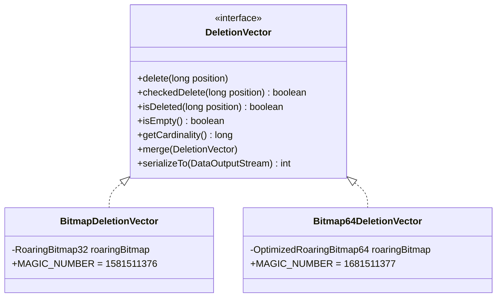

**两个实现的选择**:

| 特性 | BitmapDeletionVector (V1) | Bitmap64DeletionVector (V2) |
|------|--------------------------|----------------------------|
| 底层结构 | `RoaringBitmap32` | `OptimizedRoaringBitmap64` |
| 最大行数 | ~21 亿 | ~9.2 * 10^18 |
| Magic Number | `1581511376` | `1681511377` |
| 字节序 | 大端 | 小端 |
| 选择条件 | `dvBitmap64 = false` | `dvBitmap64 = true` |

**为什么引入 64 位版本？**

单个数据文件可能超过 21 亿行（特别是 Append-Only 大文件场景），32 位 bitmap 无法覆盖。Iceberg 也采用了类似的 64 位方案，Paimon 的 `Bitmap64DeletionVector` 注释中标注 "Mostly copied from iceberg"。

**为什么 V2 使用小端序？**

V2 的 `Bitmap64DeletionVector` 为了与 Iceberg 的 Position Delete 格式兼容，采用了小端序存储。Iceberg 使用小端序，Paimon 为了兼容性采用了相同的字节序。读取时，DataInputStream 默认以大端序读取 magic number，然后通过 `toLittleEndianInt(magicNumber)` 将其转换为小端序后再与 Bitmap64DeletionVector.MAGIC_NUMBER 比较。

**Magic Number 值**:
- V1 (BitmapDeletionVector): `1581511376`
- V2 (Bitmap64DeletionVector): `1681511377`

**反序列化** (`DeletionVector.read`, L97-146):
```java
// 通过 magic number 区分版本
int magicNumber = dis.readInt();
if (magicNumber == BitmapDeletionVector.MAGIC_NUMBER) {
    // V1: 32-bit
} else if (toLittleEndianInt(magicNumber) == Bitmap64DeletionVector.MAGIC_NUMBER) {
    // V2: 64-bit (小端序)
}
```

### 5.3 DV 索引文件组织

**源码路径**: `paimon-core/src/main/java/org/apache/paimon/deletionvectors/DeletionVectorsIndexFile.java`

**文件格式**:
```
[VERSION_ID_V1: 1B]
[DV for file1: bitmapLength(4B) + bitmap data + CRC(4B)]
[DV for file2: bitmapLength(4B) + bitmap data + CRC(4B)]
...
```

**索引类型标识**: `DELETION_VECTORS_INDEX = "DELETION_VECTORS"`

**DeletionVectorMeta** (`paimon-core/src/main/java/org/apache/paimon/index/DeletionVectorMeta.java`):
```java
public class DeletionVectorMeta {
    private final String dataFileName;  // 对应的数据文件名
    private final int offset;           // 在 DV 索引文件中的偏移
    private final int length;           // DV 数据的长度
    private final Long cardinality;     // 已删除行数
}
```

**IndexFileMeta 中的 dvRanges**:

`IndexFileMeta` 包含一个 `LinkedHashMap<String, DeletionVectorMeta> dvRanges` 字段，记录索引文件中每个数据文件的 DV 位置信息。使用 `LinkedHashMap` 确保写入顺序一致。

**Rolling 写入** (`DeletionVectorIndexFileWriter.java`):
- `writeSingleFile()`: 所有 DV 写入一个文件
- `writeWithRolling()`: 按 `targetSizePerIndexFile` 滚动切分多个文件，防止单文件过大

### 5.4 BucketedDvMaintainer 管理机制

**源码路径**: `paimon-core/src/main/java/org/apache/paimon/deletionvectors/BucketedDvMaintainer.java`

**核心职责**: 维护一个 (partition, bucket) 粒度的 DV 集合。

**关键方法**:
- `notifyNewDeletion(fileName, position)`: 标记某文件某行为删除
- `notifyNewDeletion(fileName, deletionVector)`: 整体替换某文件的 DV
- `mergeNewDeletion(fileName, deletionVector)`: 合并新的 DV
- `removeDeletionVectorOf(fileName)`: 移除某文件的 DV（compaction 后旧文件的 DV 不再需要）
- `deletionVectorOf(fileName)`: 获取某文件的 DV（读取时使用）

**与 Compaction 的协同**: 当 compaction 合并旧文件为新文件后，旧文件的 DV 通过 `removeDeletionVectorOf` 清除。

### 5.5 IndexFileHandler 统一管理

**源码路径**: `paimon-core/src/main/java/org/apache/paimon/index/IndexFileHandler.java`

**为什么需要 IndexFileHandler？**

它是 Hash Index 和 DV Index 的统一入口，管理 `IndexManifestFile` 的读写和索引文件的生命周期。

**好处**: 统一的索引管理层，所有索引类型通过 `IndexManifestEntry` 纳入 Snapshot 管理体系。

**核心能力**:
- `hashIndex(partition, bucket)`: 获取 HashIndexFile 操作对象
- `dvIndex(partition, bucket)`: 获取 DeletionVectorsIndexFile 操作对象
- `scanHashIndex(snapshot, partition, bucket)`: 扫描特定 bucket 的 hash 索引
- `scan(snapshot, indexType)`: 按类型扫描所有索引
- `readAllDeletionVectors(...)`: 读取 DV

---

## 6. Lookup 索引

### 解决什么问题

**核心业务问题**: 在Lookup Join和流式Partial-Update场景下,需要按主键进行点查(根据key查找value)。LSM Tree的数据存储在多层SST文件中,直接读取需要遍历多个文件,效率很低。

**没有Lookup索引的后果**:
1. **点查性能差**: 查询单个key需要读取多个SST文件,延迟从毫秒级变成秒级
2. **Lookup Join不可用**: Flink的Lookup Join需要毫秒级响应,LSM Tree的多层查找无法满足
3. **Partial-Update低效**: 流式更新需要先读取旧值,再合并新值,多层查找严重影响吞吐量
4. **网络I/O浪费**: 每次点查都需要从对象存储下载SST文件,带宽成本高

**实际场景**:
- **维度表Join**: 订单流Join用户维度表,根据user_id查询用户信息,需要毫秒级响应
- **实时画像更新**: 用户行为流更新用户画像,需要先读取旧画像,再合并新行为
- **CDC同步**: 从Kafka同步CDC数据到Paimon,需要根据主键判断是INSERT还是UPDATE
- **流式去重**: 根据唯一键查询是否已存在,存在则跳过,不存在则插入

### 有什么坑

**误区1: 认为Lookup索引可以用于批查询**
- **问题**: Lookup索引是为流式点查设计的,不适合批量扫描
- **适用场景**: Lookup Join、Partial-Update等需要单key查询的场景
- **不适用场景**: 批量扫描、范围查询等,应该使用文件索引

**误区2: 忽略Bloom Filter的作用**
- **问题**: Lookup文件内嵌了Bloom Filter,可以快速判断key是否存在
- **性能影响**: 如果不使用Bloom Filter,每次负查询(key不存在)都需要实际查找
- **正确理解**: Bloom Filter可以避免90%以上的无效查找

**误区3: 缓存配置不当**
- **问题**: Caffeine缓存的大小和过期时间配置不当,会导致缓存命中率低或内存占用过高
- **maxDiskSize过小**: 缓存频繁淘汰,命中率低,性能差
- **fileRetention过长**: 缓存占用过多磁盘空间,可能导致磁盘满
- **推荐配置**: maxDiskSize根据可用磁盘空间设置(如10GB),fileRetention设置为1-2小时

**生产环境注意事项**:
1. **本地磁盘空间**: Lookup文件缓存在本地磁盘,需要预留足够空间
2. **远程文件下载**: 如果其他节点已生成.lookup文件,可以直接下载,避免重复转换
3. **Schema兼容性**: 下载远程.lookup文件时,需要验证schema兼容性

**性能陷阱**:
- **冷启动慢**: 首次查询时需要下载SST文件并转换为Lookup文件,延迟较高
- **缓存淘汰**: Caffeine按LRU淘汰,热数据可能被淘汰,导致性能抖动
- **并发下载**: 多个任务同时下载同一个SST文件,可能导致网络拥塞

### 核心概念解释

**Lookup文件 vs SST文件**:
- **SST文件**: 排序的键值对,适合范围扫描,点查需要二分查找(O(log n))
- **Lookup文件**: Hash或Tree结构,适合点查,查询时间O(1)或O(log n)

**转换流程**:
```
SST文件(排序的KV对) 
  -> 读取所有KV对
  -> 构建Hash/Tree索引
  -> 写入Lookup文件
  -> 同时生成Bloom Filter
```

**Caffeine缓存架构**:
```java
Cache<String, LookupFile> cache = Caffeine.newBuilder()
    .expireAfterAccess(fileRetention)      // 访问过期(如1小时)
    .maximumWeight(maxDiskSize.getKibiBytes()) // 按磁盘大小限制(如10GB)
    .weigher(LookupFile::fileWeigh)         // 权重=文件大小(KB)
    .removalListener(LookupFile::removalCallback) // 淘汰时删除本地文件
    .build();
```

**为什么使用Caffeine而非Guava Cache?**
- **性能**: Caffeine的吞吐量是Guava Cache的3-5倍
- **命中率**: Caffeine使用W-TinyLFU算法,命中率比LRU高10-20%
- **功能**: Caffeine支持异步加载、刷新等高级功能

**RocksDB StateFactory**:
除了LookupFile,Paimon还支持使用RocksDB作为Lookup后端:
```java
// RocksDBStateFactory.java
DBOptions dbOptions = RocksDBOptions.createDBOptions(...)
    .setUseFsync(false)        // 不需要fsync(临时状态)
    .setStatsDumpPeriodSec(0)  // 禁用统计输出
    .setCreateIfMissing(true);

this.db = ttlSecs == null
    ? RocksDB.open(options, path)
    : TtlDB.open(options, path, (int) ttlSecs.getSeconds(), false);
```

**RocksDB vs LookupFile**:
| 特性 | LookupFile | RocksDB |
|------|-----------|---------|
| 存储结构 | 自定义格式 | LSM Tree |
| 查询性能 | O(1) Hash查找 | O(log n) LSM查找 |
| 内存占用 | 低(仅索引) | 高(MemTable+BlockCache) |
| 适用场景 | 只读查询 | 读写混合 |

### 设计理念

**为什么需要Lookup索引?**

LSM Tree的多层结构:
```
Level 0: [File1, File2, File3]  (最新数据)
Level 1: [File4, File5]
Level 2: [File6]
...
```
点查一个key,最坏情况需要查找所有层的所有文件,延迟不可接受。

Lookup索引的价值:
1. **O(1)查询**: 将排序的SST文件转换为Hash结构,查询时间恒定
2. **本地缓存**: 热数据常驻本地磁盘,避免重复下载
3. **Bloom Filter加速**: 负查询(key不存在)可以快速返回

**为什么不直接使用RocksDB?**

RocksDB的问题:
1. **内存占用高**: MemTable和BlockCache占用大量内存
2. **写入开销**: RocksDB需要维护WAL和Compaction,开销大
3. **复杂性**: RocksDB的配置和调优非常复杂

LookupFile的优势:
1. **只读优化**: 不需要写入,可以使用更简单的数据结构
2. **内存友好**: 只需要加载索引,不需要MemTable
3. **简单**: 实现简单,易于调试和维护

**权衡取舍**:
1. **空间 vs 性能**: Lookup文件占用额外磁盘空间,但查询性能提升10倍以上
2. **转换开销 vs 查询性能**: 首次查询需要转换SST文件,但后续查询非常快
3. **本地缓存 vs 远程存储**: 本地缓存占用磁盘,但避免了重复下载

**远程文件共享的巧妙设计**:
```java
// LookupLevels.tryToDownloadRemoteSst() (L209-233)
// 1. 检查远程是否存在.lookup文件
// 2. 验证schema兼容性
// 3. 下载到本地
// 4. 使用远程文件的schemaId和serVersion
```
这个设计避免了重复转换:
- 节点A将SST转换为Lookup文件,并上传到远程
- 节点B直接下载Lookup文件,无需重复转换
- 多节点共享Lookup文件,节省计算资源

**Bloom Filter的双重作用**:
1. **写入时**: 构建Lookup文件时,同时生成Bloom Filter
2. **查询时**: 先用Bloom Filter判断key是否可能存在,避免无效查找

```java
// LookupLevels构造时传入bfGenerator
Function<Long, BloomFilter.Builder> bfGenerator = ...;
lookupStoreFactory.createWriter(localFile, bfGenerator.apply(file.rowCount()));
```

**访问统计的价值**:
```java
// LookupFile.java
private long requestCount;  // 总请求次数
private long hitCount;      // 命中次数

// 关闭时输出统计
LOG.info("LookupFile {} closed, requests: {}, hits: {}, hit rate: {}%",
    fileName, requestCount, hitCount, hitCount * 100.0 / requestCount);
```
这个统计可以帮助:
1. **评估缓存效果**: 命中率低说明缓存配置不当
2. **识别热数据**: 请求次数多的文件应该常驻缓存
3. **优化缓存策略**: 根据统计调整maxDiskSize和fileRetention

**与Flink State Backend对比**:
| 特性 | Paimon Lookup | Flink RocksDB State |
|------|--------------|-------------------|
| 用途 | 查询Paimon表 | 存储Flink状态 |
| 数据来源 | SST文件 | 流式数据 |
| 更新方式 | 只读(定期刷新) | 读写混合 |
| 持久化 | 可选 | 必须 |
| TTL支持 | 通过缓存过期 | 通过State TTL |

Paimon的Lookup索引是专门为查询Paimon表设计的,比通用的State Backend更加轻量和高效。

### 6.1 LookupLevels 设计动机

**源码路径**: `paimon-core/src/main/java/org/apache/paimon/mergetree/LookupLevels.java`

**为什么需要 LookupLevels？**

在 Lookup Join 和流式 Partial-Update 场景下，需要按主键 (key) 进行点查。LSM Tree 的数据存储在多层 SST 文件中，直接读取效率不高。LookupLevels 将 SST 文件转换为本地 KV Lookup 文件，支持 O(1) 点查。

**好处**:
1. **O(1) 点查**: 将排序的 SST 文件转换为 hash/tree 结构的 Lookup 文件
2. **Bloom Filter 加速**: 写入 Lookup 文件时同时生成 Bloom Filter，快速判断 key 是否存在
3. **Caffeine LRU 缓存**: 基于 Caffeine 的自动缓存管理，热数据常驻本地

### 6.2 LookupFile 本地文件缓存

**源码路径**: `paimon-core/src/main/java/org/apache/paimon/mergetree/LookupFile.java`

**缓存架构**:

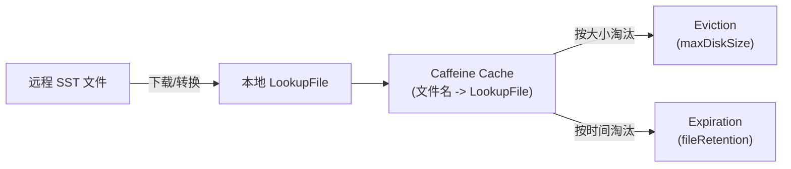

**缓存创建** (`LookupFile.createCache`, L123-132):
```java
public static Cache<String, LookupFile> createCache(
        Duration fileRetention, MemorySize maxDiskSize) {
    return Caffeine.newBuilder()
            .expireAfterAccess(fileRetention)      // 访问过期
            .maximumWeight(maxDiskSize.getKibiBytes()) // 按磁盘大小限制
            .weigher(LookupFile::fileWeigh)         // 权重 = 文件大小 (KB)
            .removalListener(LookupFile::removalCallback) // 淘汰时删除本地文件
            .executor(Runnable::run)
            .build();
}
```

**访问统计**: 每个 LookupFile 记录 `requestCount` 和 `hitCount`，关闭时输出访问统计日志。

### 6.3 RocksDB StateFactory 后端

**源码路径**: `paimon-core/src/main/java/org/apache/paimon/lookup/rocksdb/RocksDBStateFactory.java`

**为什么使用 RocksDB？**

RocksDB 是一个高性能的嵌入式 KV 存储，作为 Lookup 的另一种后端（与 LookupFile 不同），用于 `GlobalIndexAssigner` 等需要 KV 状态的场景。

**好处**:
1. **大状态支持**: RocksDB 使用磁盘存储，不受内存限制
2. **高效 Merge**: 支持 merge operator，适合状态累加
3. **TTL 支持**: 可以设置数据过期时间

**State 类型**:

| State | 实现类 | 用途 |
|-------|--------|------|
| ValueState | `RocksDBValueState` | 单值查找 |
| SetState | `RocksDBSetState` | 集合查找 |
| ListState | `RocksDBListState` | 列表查找 |

**初始化**:
```java
// RocksDBStateFactory.java (L60-88)
DBOptions dbOptions = RocksDBOptions.createDBOptions(...)
    .setUseFsync(false)        // 不需要 fsync（临时状态）
    .setStatsDumpPeriodSec(0)  // 禁用统计输出
    .setCreateIfMissing(true);

// 支持 TTL
this.db = ttlSecs == null
    ? RocksDB.open(options, path)
    : TtlDB.open(options, path, (int) ttlSecs.getSeconds(), false);
```

### 6.4 Bloom Filter 加速 Key 存在性判断

**源码路径**: `paimon-core/src/main/java/org/apache/paimon/mergetree/LookupLevels.java` (L90, L242)

在 `LookupLevels` 构造时接收 `Function<Long, BloomFilter.Builder> bfGenerator` 参数。创建 Lookup 文件时，通过 `lookupStoreFactory.createWriter(localFile, bfGenerator.apply(file.rowCount()))` 将 Bloom Filter 嵌入 Lookup 文件。

**查询流程**:
1. 序列化 key 为 bytes
2. Lookup 文件内部先用 Bloom Filter 判断 key 是否可能存在
3. 如果 Bloom Filter 返回 "可能存在"，再做实际 KV 查找
4. 如果 Bloom Filter 返回 "不存在"，直接跳过

**好处**: 对于不存在的 key（负查询），Bloom Filter 可以完全避免磁盘 I/O。

### 6.5 远程文件下载机制

**源码路径**: `paimon-core/src/main/java/org/apache/paimon/mergetree/lookup/RemoteFileDownloader.java`

**为什么需要远程下载？**

在分布式环境中，SST 文件存储在远程文件系统（HDFS/S3/OSS 等）。如果其他节点已经将 SST 转换为 Lookup 文件并上传（`.lookup` 后缀），当前节点可以直接下载而无需重新转换。

**好处**: 避免重复计算，多节点共享 Lookup 文件。

**流程** (`LookupLevels.tryToDownloadRemoteSst`, L209-233):
1. 检查远程是否存在 `.lookup` 文件
2. 验证 schema 兼容性
3. 下载到本地
4. 使用远程文件的 schemaId 和 serVersion

---

## 7. 索引与查询优化的协同

### 7.1 Predicate 路由到不同索引

Paimon 的查询谓词 (`Predicate`) 通过 Visitor 模式分别路由到不同索引层：

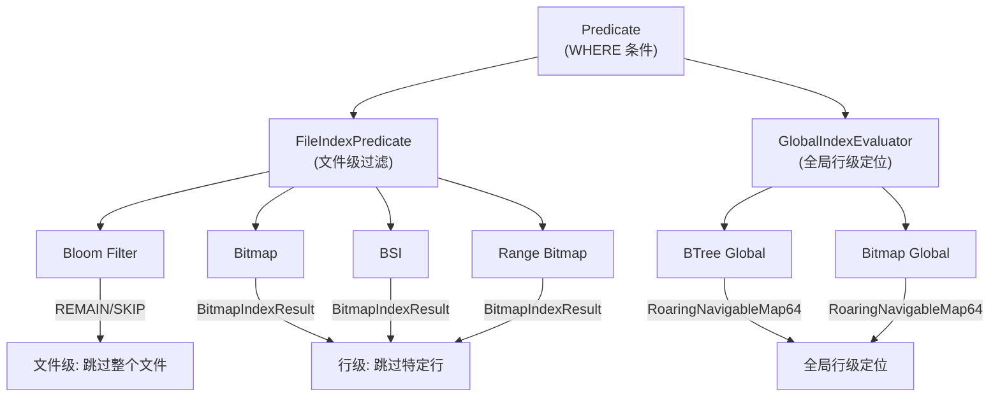

### 7.2 FileIndexPredicate 评估流程

**源码路径**: `paimon-common/src/main/java/org/apache/paimon/fileindex/FileIndexPredicate.java`

**评估流程**:

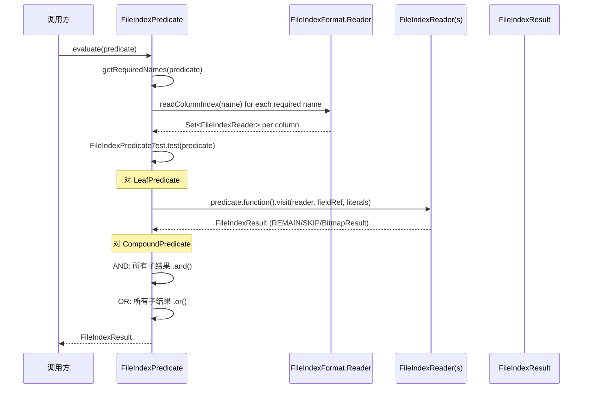

**关键实现** (`FileIndexPredicateTest.visit(LeafPredicate)`, L157-177):
```java
// 对同一列的多个索引 Reader 做 AND
for (FileIndexReader fileIndexReader : columnIndexReaders.get(fieldRef.name())) {
    compoundResult = compoundResult.and(
        predicate.function().visit(fileIndexReader, fieldRef, predicate.literals()));
    if (!compoundResult.remain()) {
        return compoundResult;  // 短路: 一旦 SKIP，立即返回
    }
}
```

### 7.3 多索引联合过滤 (AND/OR 逻辑)

**FileIndexResult 的三态逻辑**:

| 值 | 含义 | `and(X)` | `or(X)` |
|----|------|---------|---------|
| `REMAIN` | 需要保留（无法过滤） | `X` | `REMAIN` |
| `SKIP` | 可以跳过 | `SKIP` | `X` |
| `BitmapIndexResult` | 行级 bitmap | `BitmapResult.and(X)` | `BitmapResult.or(X)` |

**为什么需要三态而非简单的 true/false？**

`BitmapIndexResult` 作为第三种状态，携带了精确的行号集合。当两个 BitmapIndexResult 做 AND/OR 时，使用 RoaringBitmap 的原生位图运算，结果仍然是精确的行号集合。

**好处**: Bloom Filter (REMAIN/SKIP) 和 Bitmap (行级) 可以自然地联合工作:
- Bloom Filter 返回 REMAIN + Bitmap 返回 BitmapResult -> 结果为 BitmapResult
- Bloom Filter 返回 SKIP + Bitmap 返回 BitmapResult -> 结果为 SKIP

**CompoundPredicate 处理** (`FileIndexPredicateTest.visit(CompoundPredicate)`, L180-204):
- **AND**: 依次 `.and()` 所有子谓词结果，短路优化（一旦 `!remain()`）
- **OR**: 依次 `.or()` 所有子谓词结果

### 7.4 BitmapIndexResult 行级过滤

**源码路径**: `paimon-common/src/main/java/org/apache/paimon/fileindex/bitmap/BitmapIndexResult.java`

当查询谓词返回 `BitmapIndexResult` 时，读取引擎可以做行级过滤：

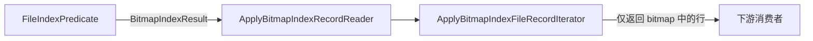

**与 DV 的联合**: `BitmapIndexResult.andNot(deletion)` 可以从行级过滤结果中扣除 DV 标记的已删除行。

---

## 8. 索引配置与最佳实践

### 8.1 文件索引配置方式

**源码路径**: `paimon-api/src/main/java/org/apache/paimon/fileindex/FileIndexOptions.java`

**配置前缀**: `file-index.<index-type>.columns = col1,col2,...`

**示例**:
```sql
-- 为 col_a 和 col_b 创建 bloom filter 索引
CREATE TABLE t (
    col_a STRING,
    col_b INT,
    col_c BIGINT
) WITH (
    'file-index.bloom-filter.columns' = 'col_a,col_b',
    'file-index.bloom-filter.col_a.fpp' = '0.05',
    'file-index.bloom-filter.col_a.items' = '2000000',
    'file-index.bitmap.columns' = 'col_a',
    'file-index.bsi.columns' = 'col_c',
    'file-index.range-bitmap.columns' = 'col_c'
);
```

**各索引类型配置参数**:

| 索引类型 | 参数 | 默认值 | 说明 |
|---------|------|--------|------|
| bloom-filter | `items` | 1,000,000 | 预期元素数量 |
| bloom-filter | `fpp` | 0.1 | 误判率 |
| bitmap | `version` | 2 | 存储格式版本 |
| bitmap | `index-block-size` | - | 块大小 |
| bsi | - | - | 无额外配置 |
| range-bitmap | `chunk-size` | 类型相关 | 字典分块大小 |

**嵌入阈值**: `file-index-in-manifest-threshold`
- 索引数据 <= 阈值: 嵌入 DataFileMeta (存储在 Manifest)
- 索引数据 > 阈值: 写入独立 .idx 文件

**Map 类型嵌套列支持**:
```sql
'file-index.bloom-filter.columns' = 'map_col[key_name]'
```

### 8.2 不同场景的索引选择策略

| 查询模式 | 推荐索引 | 理由 |
|---------|---------|------|
| 等值查询 (`col = 'x'`) | **bloom-filter** | 空间最小，O(1) 判断，最通用 |
| 等值 + 需要行级过滤 | **bitmap** | 返回精确行号，但空间较大 |
| 低基数列等值 | **bitmap** | 基数越低，bitmap 越省空间 |
| 范围查询 (`col > 10`) | **bsi** 或 **range-bitmap** | BSI 更轻量，Range Bitmap 功能更强 |
| TopN (`ORDER BY col LIMIT N`) | **range-bitmap** | 唯一支持 TopN 的索引类型 |
| 字符串范围查询 | **range-bitmap** | BSI 不支持字符串类型 |
| 全文检索 | **全局 btree** + Tantivy | 需要跨文件定位 |
| 向量检索 | **全局 btree** + Lumina | 需要跨文件定位 |
| NULL/NOT NULL 过滤 | **bitmap** / **bsi** / **range-bitmap** | Bloom Filter 不支持 |

**组合策略**: 同一列可以同时配置多种索引。查询时 FileIndexPredicate 会自动对同列的多个索引结果做 AND 运算。例如:
```sql
-- bloom-filter 做粗过滤 + bitmap 做行级精确过滤
'file-index.bloom-filter.columns' = 'user_id',
'file-index.bitmap.columns' = 'user_id'
```

### 8.3 索引对写入性能的影响

| 索引类型 | 写入开销 | 内存开销 | 说明 |
|---------|---------|---------|------|
| bloom-filter | **低** | O(bitSet size) | 仅需维护一个 bit 数组 |
| bitmap | **中-高** | O(基数 * bitmap 大小) | 需为每个不同值维护 bitmap |
| bsi | **中** | O(所有值的列表) | 需要暂存所有值后一次性构建 |
| range-bitmap | **中-高** | O(字典 + BSI) | 需要先构建字典再构建 BSI |

**注意事项**:
- BSI 的 Writer 会暂存所有值到 `List<Long>` (源码注释: "todo: Find a way to reduce the risk of out-of-memory")
- Bitmap 索引在高基数列上内存消耗与基数成正比
- 索引重建 (`FileIndexProcessor`) 会读取整个数据文件，对大文件有 I/O 开销

---

## 9. 与 Iceberg 索引能力对比

| 能力维度 | Apache Paimon | Apache Iceberg |
|---------|--------------|----------------|
| **文件级统计** | DataFileMeta 中的 min/max/nullCount | Manifest 中的 column stats (min/max/count/null_count) |
| **Bloom Filter** | 文件内嵌 bloom-filter (SPI 扩展) | Parquet/ORC 列级 Bloom Filter (NDV-Based) |
| **Bitmap 索引** | 文件内嵌 bitmap (RoaringBitmap32, 行级过滤) | 不内置 (依赖 Parquet column index) |
| **BSI / Range Bitmap** | 内置 bsi + range-bitmap | 不内置 |
| **TopN 索引加速** | Range Bitmap 的 topK/bottomK | 不支持 |
| **Deletion Vectors** | BitmapDeletionVector (32-bit) + Bitmap64DeletionVector (64-bit) | Puffin-based Position Delete (64-bit Roaring64Bitmap) |
| **全局索引** | BTree + Bitmap (基于 Row ID) | 不内置 (需外部系统) |
| **分区裁剪** | PartitionPredicate | Partition Pruning via Manifest |
| **动态 Bucket** | HashIndexFile + PartitionIndex | 无 Bucket 概念 (使用 Sort/Hash Distribute) |
| **Lookup 加速** | LookupLevels + RocksDB + Caffeine Cache | 无内置 Lookup (依赖引擎实现) |
| **索引存储位置** | Manifest 内嵌 / .idx 文件 (基于阈值) | 列统计在 Manifest, Bloom Filter 在 Puffin 文件 |
| **SPI 可扩展** | FileIndexerFactory / GlobalIndexerFactory | 无标准扩展点 |
| **索引格式** | 自定义二进制格式 (Header+Body) | Puffin 文件格式 |

**Paimon 的优势**:
1. **行级过滤能力**: Bitmap/BSI/Range Bitmap 可以返回精确的行号集合，Iceberg 的 Parquet Column Index 只能做到 Page 级
2. **多索引联合**: 同一列可叠加多种索引，AND/OR 自动运算
3. **流式特有**: Hash Index + DV + Lookup 是面向流式 Lakehouse 的独特设计
4. **TopN 优化**: Range Bitmap 的 topK/bottomK 是 Paimon 的独有能力
5. **SPI 扩展**: 文件索引和全局索引都支持 SPI 扩展

**Iceberg 的优势**:
1. **生态成熟**: Parquet/ORC 的列统计和 Bloom Filter 被广泛支持
2. **Position Delete**: 通过 Puffin 文件存储删除位置，生态兼容性更好
3. **Manifest 优化**: Manifest 文件采用 Avro 格式，自带压缩和 schema 演进

---

> 本文档基于 Paimon 1.5-SNAPSHOT (commit: 55f4fd175) 源码分析。所有代码引用均已标注源码路径，可直接定位到相关文件进行验证。
