# Apache Paimon 索引机制深度分析

> 基于 Paimon 1.5-SNAPSHOT (commit: 55f4fd175) 源码分析
> 分析日期: 2026-04-21

---

## 目录

- [1. Paimon 索引全景图](#1-paimon-索引全景图)
  - [1.1 索引分类体系](#11-索引分类体系)
  - [1.2 索引关系总览图](#12-索引关系总览图)
  - [1.3 各索引的定位与适用场景](#13-各索引的定位与适用场景)
- [2. 文件内嵌索引 (File Index)](#2-文件内嵌索引-file-index)
  - [2.1 架构概览与设计决策](#21-架构概览与设计决策)
  - [2.2 文件索引存储格式 (FileIndexFormat)](#22-文件索引存储格式-fileindexformat)
  - [2.3 Bloom Filter 索引](#23-bloom-filter-索引)
  - [2.4 Bitmap 倒排索引](#24-bitmap-倒排索引)
  - [2.5 BSI (Bit-Sliced Index) 索引](#25-bsi-bit-sliced-index-索引)
  - [2.6 Range Bitmap 索引](#26-range-bitmap-索引)
  - [2.7 文件索引 SPI 扩展机制](#27-文件索引-spi-扩展机制)
- [3. 全局索引 (Global Index)](#3-全局索引-global-index)
  - [3.1 全局索引架构设计](#31-全局索引架构设计)
  - [3.2 BTree 全局索引](#32-btree-全局索引)
  - [3.3 Bitmap 全局索引](#33-bitmap-全局索引)
  - [3.4 GlobalIndexResult 与 RoaringNavigableMap64](#34-globalindexresult-与-roaringnavigablemap64)
  - [3.5 全局索引的创建和使用流程](#35-全局索引的创建和使用流程)
- [4. 哈希索引 (Hash Index / Bucket 分配)](#4-哈希索引-hash-index--bucket-分配)
  - [4.1 动态 Bucket 分配机制](#41-动态-bucket-分配机制)
  - [4.2 HashBucketAssigner 核心算法](#42-hashbucketassigner-核心算法)
  - [4.3 PartitionIndex 分区索引](#43-partitionindex-分区索引)
  - [4.4 SimpleHashBucketAssigner](#44-simplehashbucketassigner)
  - [4.5 DynamicBucketIndexMaintainer](#45-dynamicbucketindexmaintainer)
  - [4.6 Hash 索引文件读写](#46-hash-索引文件读写)
- [5. DV 索引 (Deletion Vectors Index)](#5-dv-索引-deletion-vectors-index)
  - [5.1 DV 索引设计动机](#51-dv-索引设计动机)
  - [5.2 DeletionVector 接口与实现](#52-deletionvector-接口与实现)
  - [5.3 DV 索引文件组织](#53-dv-索引文件组织)
  - [5.4 BucketedDvMaintainer 管理机制](#54-bucketeddvmaintainer-管理机制)
  - [5.5 IndexFileHandler 统一管理](#55-indexfilehandler-统一管理)
- [6. Lookup 索引](#6-lookup-索引)
  - [6.1 LookupLevels 设计动机](#61-lookuplevels-设计动机)
  - [6.2 LookupFile 本地文件缓存](#62-lookupfile-本地文件缓存)
  - [6.3 RocksDB StateFactory 后端](#63-rocksdb-statefactory-后端)
  - [6.4 Bloom Filter 加速 Key 存在性判断](#64-bloom-filter-加速-key-存在性判断)
  - [6.5 远程文件下载机制](#65-远程文件下载机制)
- [7. 索引与查询优化的协同](#7-索引与查询优化的协同)
  - [7.1 Predicate 路由到不同索引](#71-predicate-路由到不同索引)
  - [7.2 FileIndexPredicate 评估流程](#72-fileindexpredicate-评估流程)
  - [7.3 多索引联合过滤 (AND/OR 逻辑)](#73-多索引联合过滤-andor-逻辑)
  - [7.4 BitmapIndexResult 行级过滤](#74-bitmapindexresult-行级过滤)
- [8. 索引配置与最佳实践](#8-索引配置与最佳实践)
  - [8.1 文件索引配置方式](#81-文件索引配置方式)
  - [8.2 不同场景的索引选择策略](#82-不同场景的索引选择策略)
  - [8.3 索引对写入性能的影响](#83-索引对写入性能的影响)
- [9. 与 Iceberg 索引能力对比](#9-与-iceberg-索引能力对比)

---

## 1. Paimon 索引全景图

### 1.1 索引分类体系

Paimon 拥有一套层次丰富的索引体系，从作用域和目的上可以分为五大类：

| 类别 | 索引类型 | 作用域 | 核心目的 |
|------|---------|--------|---------|
| **文件内嵌索引** | Bloom Filter / Bitmap / BSI / Range Bitmap | 单个数据文件 | 谓词下推过滤，跳过不相关的数据文件或行 |
| **全局索引** | BTree / Bitmap (Global) | 全表 | 跨文件全局查找行 ID，用于全文检索、向量检索 |
| **哈希索引** | HashIndexFile / PartitionIndex | 分区 + Bucket | 动态 Bucket 表中根据 Key Hash 分配 Bucket |
| **DV 索引** | DeletionVectorsIndexFile | 分区 + Bucket | Merge-on-Read 场景下高效标记已删除行 |
| **Lookup 索引** | LookupLevels / LookupFile | LSM Tree Level | 点查加速，将 SST 文件转换为本地 KV 查找文件 |

### 1.2 索引关系总览图

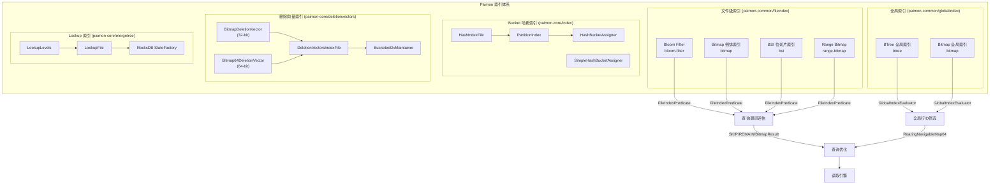

### 1.3 各索引的定位与适用场景

**为什么需要这么多索引类型？**

Paimon 面对的是 Lakehouse 场景，需要同时支持批处理和流式处理，面临多种查询模式：
- **等值查询** (WHERE col = 'x'): Bloom Filter 最优，O(1) 判断
- **低基数等值/IN/NOT IN**: Bitmap 倒排索引最优，支持行级过滤
- **范围查询** (WHERE col > 10 AND col < 100): BSI 或 Range Bitmap
- **TopN 查询** (ORDER BY col LIMIT N): Range Bitmap 特有能力
- **全文检索/向量检索**: 全局 BTree/Bitmap 索引返回全局 Row ID
- **跨分区主键去重**: Hash 索引用于动态 Bucket 分配
- **Merge-on-Read 删除标记**: DV 索引高效标记已删除行
- **流式 Lookup Join**: LookupLevels 将 SST 文件转为本地 KV 存储

**好处**: 每种索引针对特定查询模式进行了深度优化，避免一种索引承担所有场景，确保在各自场景下达到最优性能。

---

## 2. 文件内嵌索引 (File Index)

### 2.1 架构概览与设计决策

**源码路径**: `paimon-common/src/main/java/org/apache/paimon/fileindex/`

**为什么采用文件内嵌模式？**

Paimon 将索引数据直接嵌入到数据文件的伴随文件（或 Manifest 元数据）中，而非维护独立的索引存储。

**好处**:
1. **数据局部性**: 索引与数据文件紧密关联，无需维护索引到数据文件的映射
2. **原子性**: 索引随数据文件一起写入/删除，不存在索引与数据不一致的风险
3. **可扩展**: 基于 SPI 机制，第三方可以扩展自己的索引类型

**核心接口体系**:

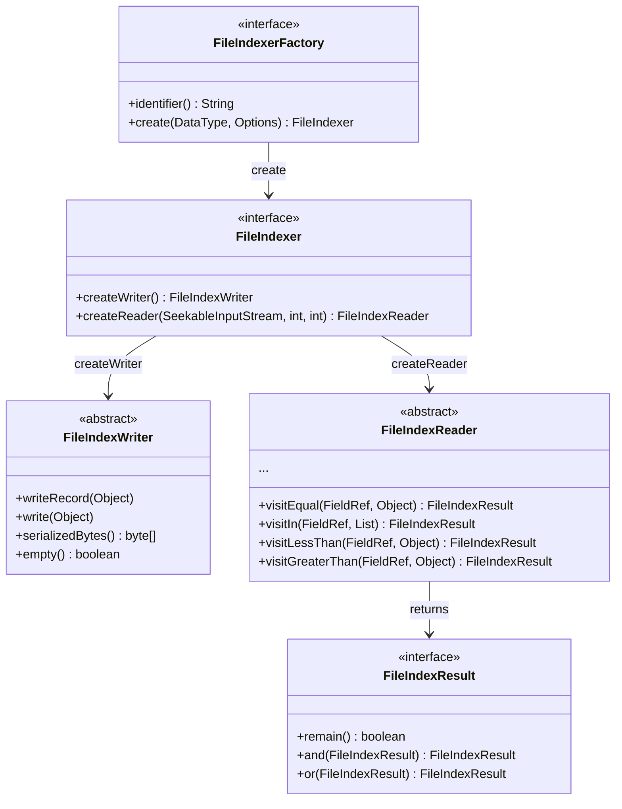

**SPI 注册的四种文件索引类型**（`META-INF/services/org.apache.paimon.fileindex.FileIndexerFactory`）:

| SPI 标识符 | 实现类 | Factory 类 |
|-----------|--------|-----------|
| `bloom-filter` | `BloomFilterFileIndex` | `BloomFilterFileIndexFactory` |
| `bitmap` | `BitmapFileIndex` | `BitmapFileIndexFactory` |
| `bsi` | `BitSliceIndexBitmapFileIndex` | `BitSliceIndexBitmapFileIndexFactory` |
| `range-bitmap` | `RangeBitmapFileIndex` | `RangeBitmapFileIndexFactory` |

### 2.2 文件索引存储格式 (FileIndexFormat)

**源码路径**: `paimon-common/src/main/java/org/apache/paimon/fileindex/FileIndexFormat.java`

**为什么自定义二进制格式而非使用通用序列化？**

Paimon 设计了一种自包含的二进制格式，支持按列、按索引类型随机访问，避免反序列化整个索引文件。

**好处**: 只需读取 Header 即可获知每个列每种索引的偏移和长度，按需 seek+read 特定索引块。

**文件格式详解**:

```
 ______________________________________    _____________________
|     magic(8B) | version(4B) | head length(4B)  |
|--------------------------------------|
|            column number(4B)         |
|--------------------------------------|
|   column 1 (UTF) | index number(4B) |         HEAD
|--------------------------------------|
|  index name 1(UTF) | start(4B) | length(4B)   |
|--------------------------------------|
|  index name 2(UTF) | start(4B) | length(4B)   |
|--------------------------------------|
|                 ...                  |
|--------------------------------------|
|  redundant length(4B) | redundant bytes        |
|--------------------------------------|    ---------------------
|                BODY                  |
|         (各索引的序列化数据)            |         BODY
|______________________________________|    _____________________
```

- **magic**: `1493475289347502L` (8字节), 用于文件格式校验
- **version**: 当前为 `V_1(1)`, 预留版本兼容
- **head length**: Header 部分的总长度（包含 magic、version、head length 本身）
- **EMPTY_INDEX_FLAG**: `-1`, 标记空索引（列无数据时的特殊标记）
- **redundant length**: 当前为 0, 预留扩展字段

**存储位置决策**: 根据 `fileIndexInManifestThreshold` 配置:
- 索引数据小于阈值 -> 嵌入 DataFileMeta（存储在 Manifest 中）
- 索引数据大于阈值 -> 写入独立的 `.idx` 文件（作为 extraFiles）

**源码路径**: `paimon-core/src/main/java/org/apache/paimon/index/FileIndexProcessor.java` (L79)

### 2.3 Bloom Filter 索引

**源码路径**: `paimon-common/src/main/java/org/apache/paimon/fileindex/bloomfilter/`

**为什么选择 Bloom Filter 作为默认索引？**

Bloom Filter 是一种空间高效的概率数据结构，能以极低的空间开销判断一个元素是否 "可能存在" 于集合中。

**好处**:
1. **空间效率极高**: 默认 FPP=0.1 时，每个元素仅需约 4.8 bits
2. **O(1) 查询时间**: 无论数据量多大，判断时间恒定
3. **适用所有数据类型**: 通过 FastHash 统一哈希

**核心实现**:

```java
// BloomFilterFileIndex.java (L50-58)
public class BloomFilterFileIndex implements FileIndexer {
    private static final int DEFAULT_ITEMS = 1_000_000;    // 默认100万元素
    private static final double DEFAULT_FPP = 0.1;          // 默认10%误判率
    private final DataType dataType;
    private final int items;
    private final double fpp;
}
```

**哈希策略** (`FastHash.java`):

- **字节类型** (VARCHAR/CHAR/BINARY): 使用 `LongHashFunction.xx()` (xxHash), O(n) 哈希
- **数值类型** (INT/BIGINT/FLOAT/DOUBLE 等): 使用 Thomas Wang 的整数哈希函数, O(1) 哈希
- **时间类型** (TIMESTAMP): 根据精度转换为 millis 或 micros 后再哈希

**写入序列化** (Writer, L83-112):
```
[numHashFunctions: 4 bytes big-endian] + [bitSet bytes]
```

**读取与查询** (Reader, L114-135):
- 仅支持 `visitEqual`: key == null 或 filter.testHash(hash) 返回 REMAIN，否则 SKIP
- 不支持范围查询、IN 查询等（默认回退为 REMAIN）

**设计决策**: 使用 `BloomFilter64`（64位哈希）而非传统 32 位 Bloom Filter，减少哈希冲突概率。

### 2.4 Bitmap 倒排索引

**源码路径**: `paimon-common/src/main/java/org/apache/paimon/fileindex/bitmap/`

**为什么需要 Bitmap 索引？**

当列的基数（不同值的数量）较低时，Bitmap 索引可以为每个不同值维护一个 RoaringBitmap，精确定位包含该值的行号集合。

**好处**:
1. **行级过滤**: 直接返回满足条件的行号集合 (`BitmapIndexResult`)，后续读取可以跳过不需要的行
2. **支持 NOT IN / IS NULL / IS NOT NULL**: Bloom Filter 无法做到
3. **支持 AND/OR 位图运算**: 多条件联合过滤时效率极高

**核心实现** (`BitmapFileIndex.java`):

- **版本**: VERSION_1 和 VERSION_2（默认 V2），V2 增加了块索引支持
- **写入流程**: 为每个值维护 `Map<Object, RoaringBitmap32>`，NULL 值有独立 bitmap
- **单值优化**: 当某个值仅出现一次时，不存储完整 bitmap，而是存储 `-1 - rowId`（负数编码），节省空间
- **懒加载**: Reader 延迟读取 meta 信息，仅在首次访问时加载

**支持的查询操作**:

| 操作 | 实现方式 |
|------|---------|
| `visitEqual` | 查找对应值的 bitmap |
| `visitNotEqual` | 查找对应值的 bitmap 后 flip |
| `visitIn` | 多个值的 bitmap 做 OR |
| `visitNotIn` | 多个值的 bitmap 做 OR，然后 flip |
| `visitIsNull` | 返回 nullBitmap |
| `visitIsNotNull` | 返回 nullBitmap 的 flip |

**BitmapIndexResult** (`bitmap/BitmapIndexResult.java`):

这是 `FileIndexResult` 的关键子类，继承 `LazyField<RoaringBitmap32>`：
- `remain()`: 基于 bitmap 是否为空判断
- `and()` / `or()`: 如果对方也是 BitmapIndexResult，则使用原生 bitmap 运算 (RoaringBitmap32.and/or)
- `andNot()`: 用于扣除已删除行
- `limit()`: 用于 TopN 场景

**行级过滤应用** (`ApplyBitmapIndexRecordReader.java`):

当查询谓词返回 BitmapIndexResult 时，Paimon 不仅在文件级过滤，还在行级做过滤。`ApplyBitmapIndexRecordReader` 将 BitmapIndexResult 应用到 RecordReader 上，仅读取 bitmap 中标记的行。

### 2.5 BSI (Bit-Sliced Index) 索引

**源码路径**: `paimon-common/src/main/java/org/apache/paimon/fileindex/bsi/BitSliceIndexBitmapFileIndex.java`

**为什么需要 BSI 索引？**

BSI 是一种专门为数值范围查询设计的索引结构，将数值的每一位 (bit) 存储为一个独立的 RoaringBitmap（称为 "slice"）。

**好处**:
1. **高效范围查询**: `<`, `>`, `<=`, `>=`, `BETWEEN` 都能通过位运算高效完成
2. **等值查询**: 也能支持 `=`, `IN`, `NOT IN`
3. **正负数分离**: 正数和负数分别建立 BSI，通过数学转换正确处理范围边界

**存储结构**:
```
[version: 1B] [rowNumber: 4B]
[hasPositive: 1B] [positive BSI (可选)]
[hasNegative: 1B] [negative BSI (可选)]
```

**支持的数据类型**: `TinyInt`, `SmallInt`, `Int`, `BigInt`, `Date`, `Time`, `Timestamp`, `Decimal`（通过 `toUnscaledLong()` 转换）

**范围查询实现** (Reader, L279-340):
- `visitLessThan(value)`: 
  - value < 0 -> `negative.gt(abs(value))`
  - value >= 0 -> `positive.lt(value) OR negative.isNotNull()`
- `visitGreaterThan(value)`:
  - value < 0 -> `positive.isNotNull() OR negative.lt(abs(value))`
  - value >= 0 -> `positive.gt(value)`

**设计决策**: 使用 `BitSliceIndexRoaringBitmap`（工具类位于 `paimon-common/utils/`），内部维护 min/max 边界以优化查询。

### 2.6 Range Bitmap 索引

**源码路径**: `paimon-common/src/main/java/org/apache/paimon/fileindex/rangebitmap/`

**为什么需要 Range Bitmap 而已有 BSI？**

Range Bitmap 在 BSI 的基础上增加了 **ChunkedDictionary**（分块字典），将原始值映射为紧凑的整数编码后再建立 BSI。

**好处**:
1. **支持更多数据类型**: 通过 `KeyFactory`，Range Bitmap 支持 VARCHAR、BINARY 等字节类型的范围查询
2. **TopN 加速**: 独有的 `visitTopN` 能力，可以在索引层面完成 `ORDER BY col LIMIT N`
3. **字典压缩**: 高基数列通过 ChunkedDictionary 压缩后再建 BSI，空间更优

**核心架构**:

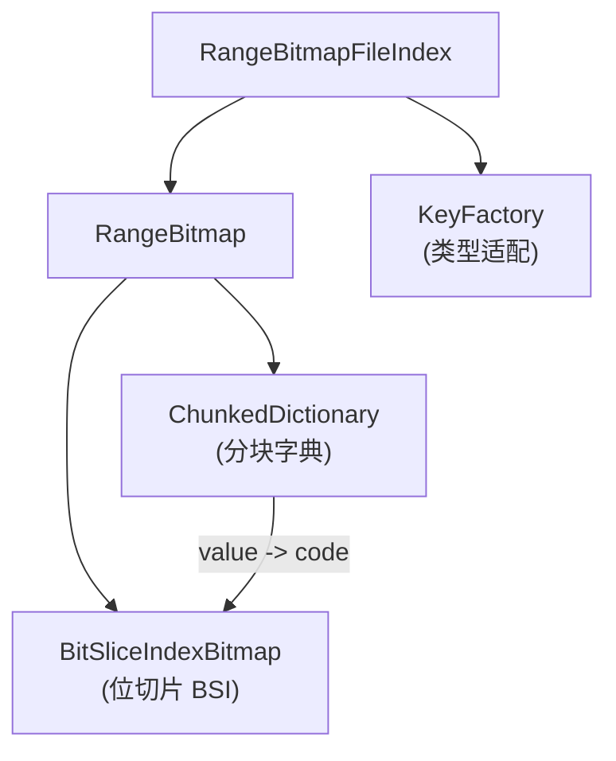

**文件格式** (`RangeBitmap.java`):
```
[headerLength: 4B]
  [version: 1B] [rid: 4B] [cardinality: 4B]
  [min] [max] [dictionaryLength: 4B]
[Dictionary Body (ChunkedDictionary)]
[BSI Body (BitSliceIndexBitmap)]
```

**TopN 查询** (`RangeBitmapFileIndex.Reader.visitTopN`, L167-183):
- 支持 `ASCENDING` -> `bitmap.bottomK(limit, ...)` 
- 支持 `DESCENDING` -> `bitmap.topK(limit, ...)`
- 可以与 foundSet 联合 (先过滤再 TopN)

**ChunkedDictionary** (`dictionary/chunked/ChunkedDictionary.java`):
- 二分查找 `find(key)` 方法，定位 key 在字典中的编码
- 分块存储（FixedLengthChunk / VariableLengthChunk），支持按需加载
- 根据 `chunk-size` 配置控制分块大小

### 2.7 文件索引 SPI 扩展机制

**源码路径**: `paimon-common/src/main/java/org/apache/paimon/fileindex/FileIndexerFactoryUtils.java`

**为什么使用 SPI 而非硬编码？**

通过 Java SPI (`ServiceLoader<FileIndexerFactory>`)，索引类型可以通过 classpath 扩展，无需修改核心代码。

**好处**: 
- 第三方模块（如 paimon-tantivy 全文检索、paimon-lumina 向量索引）可以注册自己的文件索引类型
- 核心代码零耦合

**加载机制** (L35-47):
```java
static {
    ServiceLoader<FileIndexerFactory> serviceLoader =
            ServiceLoader.load(FileIndexerFactory.class);
    for (FileIndexerFactory indexerFactory : serviceLoader) {
        factories.put(indexerFactory.identifier(), indexerFactory);
    }
}
```

---

## 3. 全局索引 (Global Index)

### 3.1 全局索引架构设计

**源码路径**: `paimon-common/src/main/java/org/apache/paimon/globalindex/`

**为什么需要全局索引？**

文件内嵌索引的作用域是单个数据文件。而全文检索、向量检索等场景需要跨所有数据文件返回全局行 ID (Row ID)。

**好处**:
1. **全局 Row ID 定位**: 返回 `RoaringNavigableMap64`（64位 bitmap），可精确到行
2. **基于 Range 分片**: 索引按行范围 (rowRangeStart, rowRangeEnd) 分片，支持并行构建和查询
3. **可插拔**: 通过 SPI (`GlobalIndexerFactory`) 扩展

**核心接口体系**:

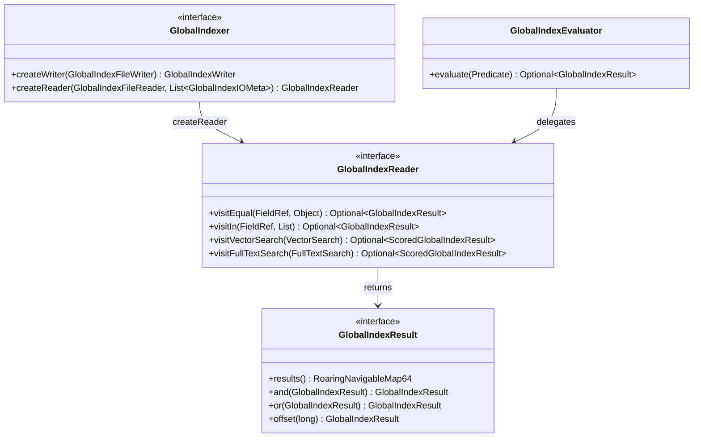

**SPI 注册**（`META-INF/services/org.apache.paimon.globalindex.GlobalIndexerFactory`）:

| SPI 标识符 | 实现类 |
|-----------|--------|
| `btree` | `BTreeGlobalIndexer` |
| `bitmap` | `BitmapGlobalIndex` |

### 3.2 BTree 全局索引

**源码路径**: `paimon-common/src/main/java/org/apache/paimon/globalindex/btree/BTreeGlobalIndexer.java`

**为什么采用 SST 之上的多层 BTree 而非内存 BTree？**

全局索引可能覆盖海量数据（数十亿行），直接构建内存 BTree 不现实。Paimon 采用 "逻辑 BTree" 策略：将数据存储在 SST 文件中，在 SST 上构建多层元数据索引。

**好处**: 显著降低内存压力，数据常驻磁盘，仅将索引元数据和热数据缓存到内存。

**架构示意** (源自 `BTreeGlobalIndexer.java` L39-57 的 Javadoc):

```
                                         BTree-Index
                                         /         \
                                        /    ...    \
                                       /             \
 +--------------------------------------+           +------------+
 |               SST File               |           |            |
 +--------------------------------------+           |            |
 |              Root Index              |           |            |
 |             /   ...    \             |    ...    |  SST File  |
 |     Leaf Index  ...  Leaf Index      |           |            |
 |     /  ...   \       /  ...   \      |           |            |
 | DataBlock       ...        DataBlock |           |            |
 +--------------------------------------+           +------------+
```

**核心组件**:
- `BTreeGlobalIndexer`: 全局索引器，管理 CacheManager
- `BTreeIndexWriter`: 写入器，将排序好的 key -> rowId 对写入 SST 文件
- `BTreeIndexReader`: 读取器，通过多层索引定位 key 对应的 Row ID
- `BTreeFileFooter`: SST 文件尾部元信息
- `KeySerializer`: 类型安全的 key 序列化
- `BTreeIndexOptions`: 配置项 (`BTREE_INDEX_CACHE_SIZE`, `BTREE_INDEX_RECORDS_PER_RANGE`, `BTREE_INDEX_HIGH_PRIORITY_POOL_RATIO`)

**构建流程** (`BTreeGlobalIndexBuilder.java`):
1. 通过 `DataEvolutionBatchScan` 扫描全表数据，提取 (indexField, _ROW_ID)
2. 使用 `BinaryExternalSortBuffer` 对 key 排序
3. 按 `recordsPerRange` 切分 Range
4. 每个 Range 通过 `GlobalIndexWriter` 写入独立的索引文件
5. 生成 `IndexFileMeta` 包含 `GlobalIndexMeta`（rowRangeStart, rowRangeEnd, indexFieldId, indexMeta）

### 3.3 Bitmap 全局索引

**源码路径**: `paimon-common/src/main/java/org/apache/paimon/globalindex/bitmap/BitmapGlobalIndex.java`

**为什么需要全局 Bitmap 索引？**

对于低基数列的全局等值查询，Bitmap 全局索引复用了文件级 `BitmapFileIndex` 的能力，通过 Wrapper 模式将文件级结果转换为全局结果。

**好处**: 代码复用，文件级 Bitmap 的成熟实现直接提升为全局能力。

**实现模式**:
```java
// BitmapGlobalIndex.java (L44-78)
public class BitmapGlobalIndex implements GlobalIndexer {
    private final BitmapFileIndex index;  // 复用文件级 BitmapFileIndex
    
    // 读取: 将 FileIndexReader 包装为 GlobalIndexReader
    public GlobalIndexReader createReader(...) {
        FileIndexReader reader = index.createReader(input, 0, (int) indexMeta.fileSize());
        return new FileIndexReaderWrapper(reader, this::toGlobalResult, input);
    }
    
    // 转换: FileIndexResult -> GlobalIndexResult
    private Optional<GlobalIndexResult> toGlobalResult(FileIndexResult result) {
        if (result instanceof BitmapIndexResult) {
            return Optional.of(GlobalIndexResult.create(
                () -> ((BitmapIndexResult) result).get().toNavigable64()));
        }
    }
}
```

### 3.4 GlobalIndexResult 与 RoaringNavigableMap64

**源码路径**: `paimon-common/src/main/java/org/apache/paimon/globalindex/GlobalIndexResult.java`

**为什么使用 RoaringNavigableMap64？**

全局 Row ID 可能超过 32 位整数范围（超过 20 亿行），需要 64 位 bitmap。`RoaringNavigableMap64` 是对 `RoaringBitmap32` 的 64 位扩展。

**好处**: 
- 支持超大表场景
- 保持 `and()` / `or()` 位图运算的高效性
- 懒计算 (`LazyField<RoaringNavigableMap64>`)，仅在需要时触发计算

**Range 偏移**: `GlobalIndexResult.offset(long startOffset)` 支持将分片内的 Row ID 偏移到全局 Row ID 空间。

### 3.5 全局索引的创建和使用流程

**创建流程**:

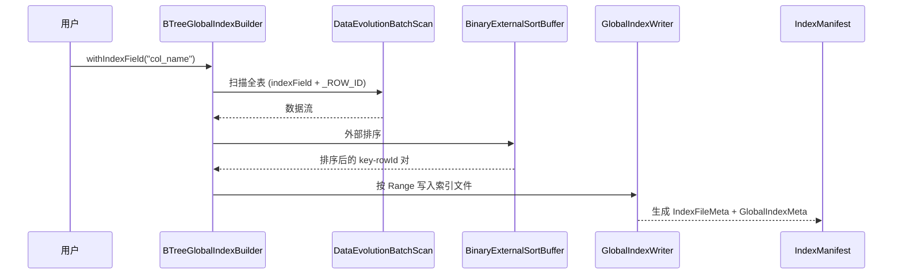

**使用流程** (`GlobalIndexScanner.java`):

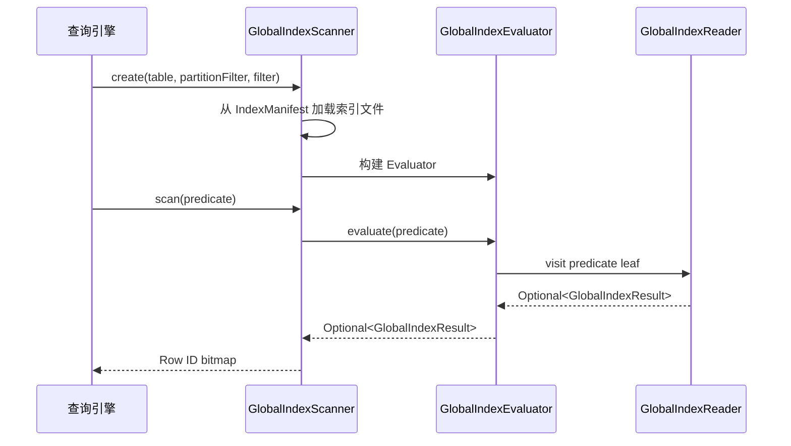

---

## 4. 哈希索引 (Hash Index / Bucket 分配)

### 4.1 动态 Bucket 分配机制

**源码路径**: `paimon-core/src/main/java/org/apache/paimon/index/`

**为什么需要哈希索引？**

Paimon 的动态 Bucket 表（`bucket = -1`）需要根据主键 hash 动态决定记录应该写入哪个 Bucket，同时保证同一个 key 始终路由到同一个 Bucket。

**好处**:
1. **自动扩缩 Bucket**: 不需要预先设定 Bucket 数量
2. **数据均衡**: 基于 `targetBucketRowNumber` 控制每个 Bucket 的数据量
3. **增量索引**: 索引文件记录 key hash -> bucket 映射，仅加载相关分区的索引

### 4.2 HashBucketAssigner 核心算法

**源码路径**: `paimon-core/src/main/java/org/apache/paimon/index/HashBucketAssigner.java`

**分配算法流程**:

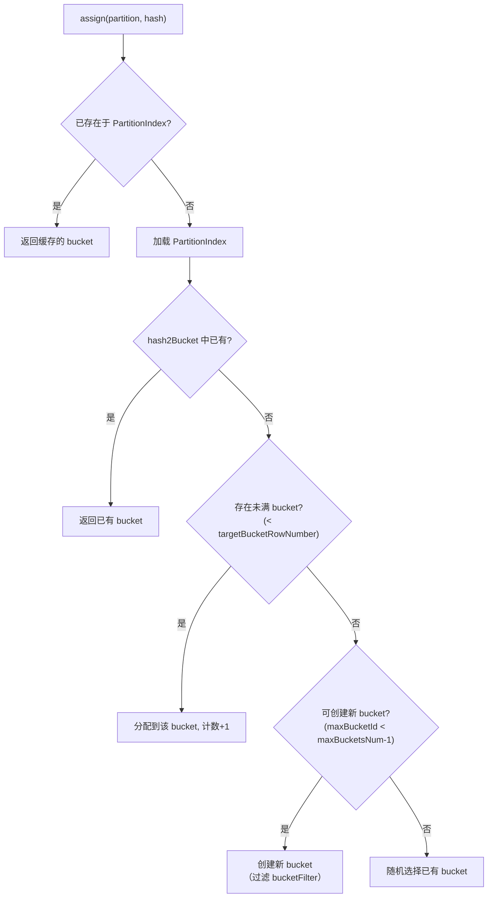

**Assigner 分配策略** (L163-168):
```java
private int computeAssignId(int partitionHash, int keyHash) {
    return BucketAssigner.computeAssigner(
        partitionHash, keyHash, numChannels, numAssigners);
}
```

**为什么使用 partitionHash + keyHash 双重哈希？**

确保同一 key 在分布式场景下始终路由到同一个 Assigner，避免多个 Assigner 为同一 key 分配不同 Bucket。

**好处**: 分布式环境下的确定性路由，无需全局协调。

### 4.3 PartitionIndex 分区索引

**源码路径**: `paimon-core/src/main/java/org/apache/paimon/index/PartitionIndex.java`

**核心数据结构**:
- `Int2ShortHashMap hash2Bucket`: key hash -> bucket 映射（使用 short 节省内存，最多 32767 个 bucket）
- `Map<Integer, Long> nonFullBucketInformation`: 未满 bucket 的计数信息
- `Set<Integer> totalBucketSet` / `List<Integer> totalBucketArray`: 所有 bucket 集合

**加载流程** (`loadIndex`, L120-154):
1. 从 `IndexFileHandler` 扫描当前分区的所有 HASH 类型 `IndexManifestEntry`
2. 逐个读取 hash 索引文件（存储 int 数组），恢复 hash -> bucket 映射
3. 同时统计每个 bucket 的行数
4. 使用 `loadFilter` 和 `bucketFilter` 过滤仅属于当前 Assigner 的数据

**分配四步法** (`assign`, L70-118):
1. 已见过的 key -> 直接返回缓存 bucket
2. 存在未满 bucket -> 分配并计数
3. 可创建新 bucket -> 创建新的（遵循 bucketFilter 和 maxBucketsNum）
4. 超出上限 -> 随机选择现有 bucket

### 4.4 SimpleHashBucketAssigner

**源码路径**: `paimon-core/src/main/java/org/apache/paimon/index/SimpleHashBucketAssigner.java`

**为什么需要 SimpleHashBucketAssigner？**

在 **overwrite** 场景下，不需要加载历史索引（因为旧数据会被完全覆盖），使用 Simple 版本避免不必要的 I/O。

**好处**: 消除 overwrite 场景下的索引加载开销。

**区别**: 不从 `IndexFileHandler` 加载历史索引，仅基于当前写入分配 bucket。

### 4.5 DynamicBucketIndexMaintainer

**源码路径**: `paimon-core/src/main/java/org/apache/paimon/index/DynamicBucketIndexMaintainer.java`

**职责**: 维护单个 (partition, bucket) 内的 key hashcode 集合，在 commit 时将变更的 hashcode 集合写入新的 hash 索引文件。

**核心机制**:
- 使用 `IntHashSet` 存储 key hash 集合
- `notifyNewRecord(KeyValue)`: 有新 key 时添加到集合，标记 `modified = true`
- `prepareCommit()`: 如果有修改，写出新的 `IndexFileMeta`

### 4.6 Hash 索引文件读写

**源码路径**: `paimon-core/src/main/java/org/apache/paimon/index/HashIndexFile.java`

**文件格式**: 纯 int 数组，每个 int 代表一个 key 的 hashCode

```java
// HashIndexFile.java
public static final String HASH_INDEX = "HASH";

public IntIterator read(IndexFileMeta file) throws IOException {
    return readInts(fileIO, pathFactory.toPath(file));
}

public IndexFileMeta write(IntIterator input) throws IOException {
    Path path = pathFactory.newPath();
    int count = writeInts(fileIO, path, input);
    return new IndexFileMeta(HASH_INDEX, path.getName(), fileSize(path), count, ...);
}
```

**为什么只存 hashCode 而非完整 key？**

1. **空间效率**: 一个 int(4字节) vs 完整 key（可能数十/数百字节）
2. **足够用**: 动态 Bucket 只需判断 "这个 key hash 之前出现在哪个 bucket"，不需要完整 key
3. **hash 冲突概率低**: Int32 哈希空间足够大，少量冲突不影响正确性（最多导致同一 bucket 的记录稍多）

---

## 5. DV 索引 (Deletion Vectors Index)

### 5.1 DV 索引设计动机

**源码路径**: `paimon-core/src/main/java/org/apache/paimon/deletionvectors/`

**为什么需要 Deletion Vectors？**

Paimon 的 Merge-on-Read (MoR) 模式下，更新和删除不会立即重写原始数据文件。DV 索引记录每个数据文件中哪些行已被逻辑删除，读取时用 DV 过滤掉这些行。

**好处**:
1. **写入低延迟**: 更新/删除只需追加 DV 记录，无需重写数据文件
2. **Bitmap 高效**: 使用 RoaringBitmap 压缩存储，空间效率高
3. **文件粒度管理**: 每个数据文件有独立的 DV，compaction 时 DV 随之清理

### 5.2 DeletionVector 接口与实现

**源码路径**: `paimon-core/src/main/java/org/apache/paimon/deletionvectors/DeletionVector.java`

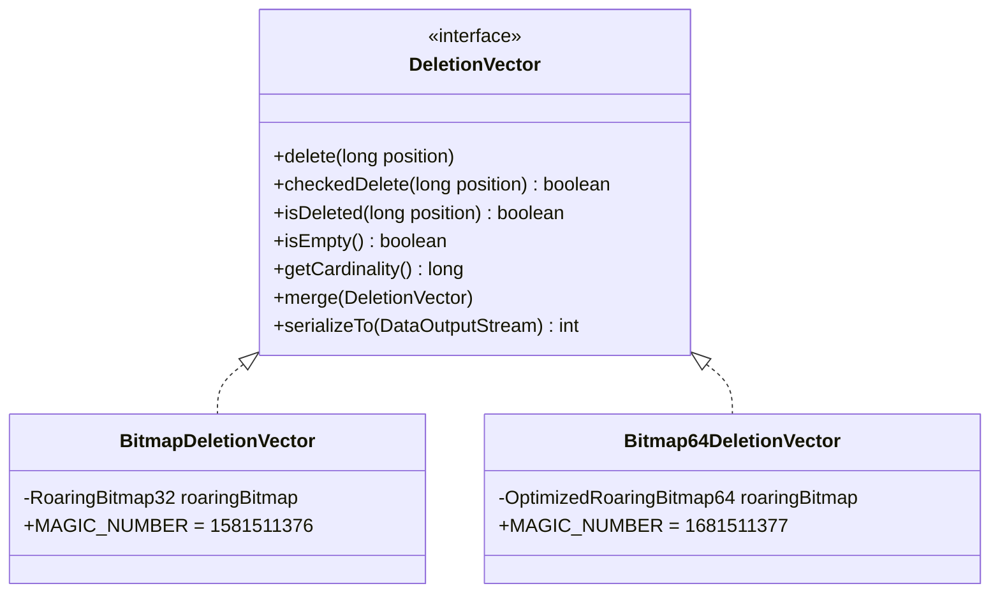

**两个实现的选择**:

| 特性 | BitmapDeletionVector (V1) | Bitmap64DeletionVector (V2) |
|------|--------------------------|----------------------------|
| 底层结构 | `RoaringBitmap32` | `OptimizedRoaringBitmap64` |
| 最大行数 | ~21 亿 | ~9.2 * 10^18 |
| Magic Number | `1581511376` | `1681511377` |
| 字节序 | 大端 | 小端 |
| 选择条件 | `dvBitmap64 = false` | `dvBitmap64 = true` |

**为什么引入 64 位版本？**

单个数据文件可能超过 21 亿行（特别是 Append-Only 大文件场景），32 位 bitmap 无法覆盖。Iceberg 也采用了类似的 64 位方案，Paimon 的 `Bitmap64DeletionVector` 注释中标注 "Mostly copied from iceberg"。

**为什么 V2 使用小端序？**

V2 的 `Bitmap64DeletionVector` 为了与 Iceberg 的 Position Delete 格式兼容，采用了小端序存储。Iceberg 使用小端序，Paimon 为了兼容性采用了相同的字节序。读取时，DataInputStream 默认以大端序读取 magic number，然后通过 `toLittleEndianInt(magicNumber)` 将其转换为小端序后再与 Bitmap64DeletionVector.MAGIC_NUMBER 比较。

**Magic Number 值**:
- V1 (BitmapDeletionVector): `1581511376`
- V2 (Bitmap64DeletionVector): `1681511377`

**反序列化** (`DeletionVector.read`, L97-146):
```java
// 通过 magic number 区分版本
int magicNumber = dis.readInt();
if (magicNumber == BitmapDeletionVector.MAGIC_NUMBER) {
    // V1: 32-bit
} else if (toLittleEndianInt(magicNumber) == Bitmap64DeletionVector.MAGIC_NUMBER) {
    // V2: 64-bit (小端序)
}
```

### 5.3 DV 索引文件组织

**源码路径**: `paimon-core/src/main/java/org/apache/paimon/deletionvectors/DeletionVectorsIndexFile.java`

**文件格式**:
```
[VERSION_ID_V1: 1B]
[DV for file1: bitmapLength(4B) + bitmap data + CRC(4B)]
[DV for file2: bitmapLength(4B) + bitmap data + CRC(4B)]
...
```

**索引类型标识**: `DELETION_VECTORS_INDEX = "DELETION_VECTORS"`

**DeletionVectorMeta** (`paimon-core/src/main/java/org/apache/paimon/index/DeletionVectorMeta.java`):
```java
public class DeletionVectorMeta {
    private final String dataFileName;  // 对应的数据文件名
    private final int offset;           // 在 DV 索引文件中的偏移
    private final int length;           // DV 数据的长度
    private final Long cardinality;     // 已删除行数
}
```

**IndexFileMeta 中的 dvRanges**:

`IndexFileMeta` 包含一个 `LinkedHashMap<String, DeletionVectorMeta> dvRanges` 字段，记录索引文件中每个数据文件的 DV 位置信息。使用 `LinkedHashMap` 确保写入顺序一致。

**Rolling 写入** (`DeletionVectorIndexFileWriter.java`):
- `writeSingleFile()`: 所有 DV 写入一个文件
- `writeWithRolling()`: 按 `targetSizePerIndexFile` 滚动切分多个文件，防止单文件过大

### 5.4 BucketedDvMaintainer 管理机制

**源码路径**: `paimon-core/src/main/java/org/apache/paimon/deletionvectors/BucketedDvMaintainer.java`

**核心职责**: 维护一个 (partition, bucket) 粒度的 DV 集合。

**关键方法**:
- `notifyNewDeletion(fileName, position)`: 标记某文件某行为删除
- `notifyNewDeletion(fileName, deletionVector)`: 整体替换某文件的 DV
- `mergeNewDeletion(fileName, deletionVector)`: 合并新的 DV
- `removeDeletionVectorOf(fileName)`: 移除某文件的 DV（compaction 后旧文件的 DV 不再需要）
- `deletionVectorOf(fileName)`: 获取某文件的 DV（读取时使用）

**与 Compaction 的协同**: 当 compaction 合并旧文件为新文件后，旧文件的 DV 通过 `removeDeletionVectorOf` 清除。

### 5.5 IndexFileHandler 统一管理

**源码路径**: `paimon-core/src/main/java/org/apache/paimon/index/IndexFileHandler.java`

**为什么需要 IndexFileHandler？**

它是 Hash Index 和 DV Index 的统一入口，管理 `IndexManifestFile` 的读写和索引文件的生命周期。

**好处**: 统一的索引管理层，所有索引类型通过 `IndexManifestEntry` 纳入 Snapshot 管理体系。

**核心能力**:
- `hashIndex(partition, bucket)`: 获取 HashIndexFile 操作对象
- `dvIndex(partition, bucket)`: 获取 DeletionVectorsIndexFile 操作对象
- `scanHashIndex(snapshot, partition, bucket)`: 扫描特定 bucket 的 hash 索引
- `scan(snapshot, indexType)`: 按类型扫描所有索引
- `readAllDeletionVectors(...)`: 读取 DV

---

## 6. Lookup 索引

### 6.1 LookupLevels 设计动机

**源码路径**: `paimon-core/src/main/java/org/apache/paimon/mergetree/LookupLevels.java`

**为什么需要 LookupLevels？**

在 Lookup Join 和流式 Partial-Update 场景下，需要按主键 (key) 进行点查。LSM Tree 的数据存储在多层 SST 文件中，直接读取效率不高。LookupLevels 将 SST 文件转换为本地 KV Lookup 文件，支持 O(1) 点查。

**好处**:
1. **O(1) 点查**: 将排序的 SST 文件转换为 hash/tree 结构的 Lookup 文件
2. **Bloom Filter 加速**: 写入 Lookup 文件时同时生成 Bloom Filter，快速判断 key 是否存在
3. **Caffeine LRU 缓存**: 基于 Caffeine 的自动缓存管理，热数据常驻本地

### 6.2 LookupFile 本地文件缓存

**源码路径**: `paimon-core/src/main/java/org/apache/paimon/mergetree/LookupFile.java`

**缓存架构**:

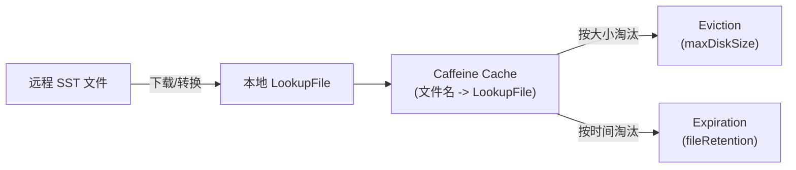

**缓存创建** (`LookupFile.createCache`, L123-132):
```java
public static Cache<String, LookupFile> createCache(
        Duration fileRetention, MemorySize maxDiskSize) {
    return Caffeine.newBuilder()
            .expireAfterAccess(fileRetention)      // 访问过期
            .maximumWeight(maxDiskSize.getKibiBytes()) // 按磁盘大小限制
            .weigher(LookupFile::fileWeigh)         // 权重 = 文件大小 (KB)
            .removalListener(LookupFile::removalCallback) // 淘汰时删除本地文件
            .executor(Runnable::run)
            .build();
}
```

**访问统计**: 每个 LookupFile 记录 `requestCount` 和 `hitCount`，关闭时输出访问统计日志。

### 6.3 RocksDB StateFactory 后端

**源码路径**: `paimon-core/src/main/java/org/apache/paimon/lookup/rocksdb/RocksDBStateFactory.java`

**为什么使用 RocksDB？**

RocksDB 是一个高性能的嵌入式 KV 存储，作为 Lookup 的另一种后端（与 LookupFile 不同），用于 `GlobalIndexAssigner` 等需要 KV 状态的场景。

**好处**:
1. **大状态支持**: RocksDB 使用磁盘存储，不受内存限制
2. **高效 Merge**: 支持 merge operator，适合状态累加
3. **TTL 支持**: 可以设置数据过期时间

**State 类型**:

| State | 实现类 | 用途 |
|-------|--------|------|
| ValueState | `RocksDBValueState` | 单值查找 |
| SetState | `RocksDBSetState` | 集合查找 |
| ListState | `RocksDBListState` | 列表查找 |

**初始化**:
```java
// RocksDBStateFactory.java (L60-88)
DBOptions dbOptions = RocksDBOptions.createDBOptions(...)
    .setUseFsync(false)        // 不需要 fsync（临时状态）
    .setStatsDumpPeriodSec(0)  // 禁用统计输出
    .setCreateIfMissing(true);

// 支持 TTL
this.db = ttlSecs == null
    ? RocksDB.open(options, path)
    : TtlDB.open(options, path, (int) ttlSecs.getSeconds(), false);
```

### 6.4 Bloom Filter 加速 Key 存在性判断

**源码路径**: `paimon-core/src/main/java/org/apache/paimon/mergetree/LookupLevels.java` (L90, L242)

在 `LookupLevels` 构造时接收 `Function<Long, BloomFilter.Builder> bfGenerator` 参数。创建 Lookup 文件时，通过 `lookupStoreFactory.createWriter(localFile, bfGenerator.apply(file.rowCount()))` 将 Bloom Filter 嵌入 Lookup 文件。

**查询流程**:
1. 序列化 key 为 bytes
2. Lookup 文件内部先用 Bloom Filter 判断 key 是否可能存在
3. 如果 Bloom Filter 返回 "可能存在"，再做实际 KV 查找
4. 如果 Bloom Filter 返回 "不存在"，直接跳过

**好处**: 对于不存在的 key（负查询），Bloom Filter 可以完全避免磁盘 I/O。

### 6.5 远程文件下载机制

**源码路径**: `paimon-core/src/main/java/org/apache/paimon/mergetree/lookup/RemoteFileDownloader.java`

**为什么需要远程下载？**

在分布式环境中，SST 文件存储在远程文件系统（HDFS/S3/OSS 等）。如果其他节点已经将 SST 转换为 Lookup 文件并上传（`.lookup` 后缀），当前节点可以直接下载而无需重新转换。

**好处**: 避免重复计算，多节点共享 Lookup 文件。

**流程** (`LookupLevels.tryToDownloadRemoteSst`, L209-233):
1. 检查远程是否存在 `.lookup` 文件
2. 验证 schema 兼容性
3. 下载到本地
4. 使用远程文件的 schemaId 和 serVersion

---

## 7. 索引与查询优化的协同

### 7.1 Predicate 路由到不同索引

Paimon 的查询谓词 (`Predicate`) 通过 Visitor 模式分别路由到不同索引层：

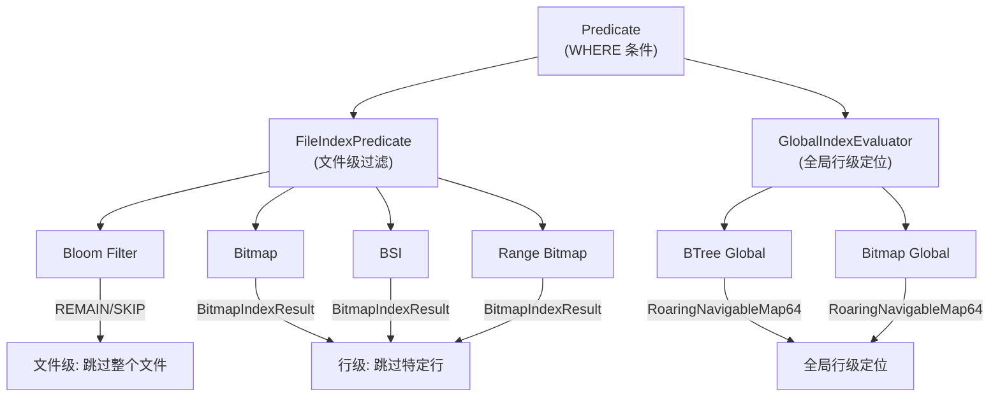

### 7.2 FileIndexPredicate 评估流程

**源码路径**: `paimon-common/src/main/java/org/apache/paimon/fileindex/FileIndexPredicate.java`

**评估流程**:

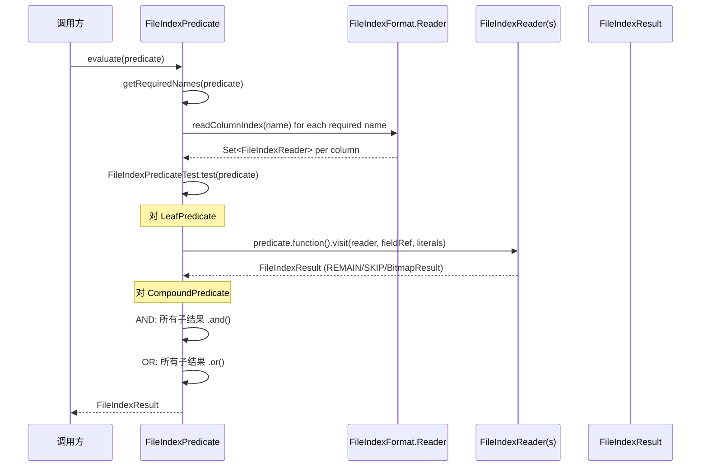

**关键实现** (`FileIndexPredicateTest.visit(LeafPredicate)`, L157-177):
```java
// 对同一列的多个索引 Reader 做 AND
for (FileIndexReader fileIndexReader : columnIndexReaders.get(fieldRef.name())) {
    compoundResult = compoundResult.and(
        predicate.function().visit(fileIndexReader, fieldRef, predicate.literals()));
    if (!compoundResult.remain()) {
        return compoundResult;  // 短路: 一旦 SKIP，立即返回
    }
}
```

### 7.3 多索引联合过滤 (AND/OR 逻辑)

**FileIndexResult 的三态逻辑**:

| 值 | 含义 | `and(X)` | `or(X)` |
|----|------|---------|---------|
| `REMAIN` | 需要保留（无法过滤） | `X` | `REMAIN` |
| `SKIP` | 可以跳过 | `SKIP` | `X` |
| `BitmapIndexResult` | 行级 bitmap | `BitmapResult.and(X)` | `BitmapResult.or(X)` |

**为什么需要三态而非简单的 true/false？**

`BitmapIndexResult` 作为第三种状态，携带了精确的行号集合。当两个 BitmapIndexResult 做 AND/OR 时，使用 RoaringBitmap 的原生位图运算，结果仍然是精确的行号集合。

**好处**: Bloom Filter (REMAIN/SKIP) 和 Bitmap (行级) 可以自然地联合工作:
- Bloom Filter 返回 REMAIN + Bitmap 返回 BitmapResult -> 结果为 BitmapResult
- Bloom Filter 返回 SKIP + Bitmap 返回 BitmapResult -> 结果为 SKIP

**CompoundPredicate 处理** (`FileIndexPredicateTest.visit(CompoundPredicate)`, L180-204):
- **AND**: 依次 `.and()` 所有子谓词结果，短路优化（一旦 `!remain()`）
- **OR**: 依次 `.or()` 所有子谓词结果

### 7.4 BitmapIndexResult 行级过滤

**源码路径**: `paimon-common/src/main/java/org/apache/paimon/fileindex/bitmap/BitmapIndexResult.java`

当查询谓词返回 `BitmapIndexResult` 时，读取引擎可以做行级过滤：


**与 DV 的联合**: `BitmapIndexResult.andNot(deletion)` 可以从行级过滤结果中扣除 DV 标记的已删除行。

---

## 8. 索引配置与最佳实践

### 8.1 文件索引配置方式

**源码路径**: `paimon-api/src/main/java/org/apache/paimon/fileindex/FileIndexOptions.java`

**配置前缀**: `file-index.<index-type>.columns = col1,col2,...`

**示例**:
```sql
-- 为 col_a 和 col_b 创建 bloom filter 索引
CREATE TABLE t (
    col_a STRING,
    col_b INT,
    col_c BIGINT
) WITH (
    'file-index.bloom-filter.columns' = 'col_a,col_b',
    'file-index.bloom-filter.col_a.fpp' = '0.05',
    'file-index.bloom-filter.col_a.items' = '2000000',
    'file-index.bitmap.columns' = 'col_a',
    'file-index.bsi.columns' = 'col_c',
    'file-index.range-bitmap.columns' = 'col_c'
);
```

**各索引类型配置参数**:

| 索引类型 | 参数 | 默认值 | 说明 |
|---------|------|--------|------|
| bloom-filter | `items` | 1,000,000 | 预期元素数量 |
| bloom-filter | `fpp` | 0.1 | 误判率 |
| bitmap | `version` | 2 | 存储格式版本 |
| bitmap | `index-block-size` | - | 块大小 |
| bsi | - | - | 无额外配置 |
| range-bitmap | `chunk-size` | 类型相关 | 字典分块大小 |

**嵌入阈值**: `file-index-in-manifest-threshold`
- 索引数据 <= 阈值: 嵌入 DataFileMeta (存储在 Manifest)
- 索引数据 > 阈值: 写入独立 .idx 文件

**Map 类型嵌套列支持**:
```sql
'file-index.bloom-filter.columns' = 'map_col[key_name]'
```

### 8.2 不同场景的索引选择策略

| 查询模式 | 推荐索引 | 理由 |
|---------|---------|------|
| 等值查询 (`col = 'x'`) | **bloom-filter** | 空间最小，O(1) 判断，最通用 |
| 等值 + 需要行级过滤 | **bitmap** | 返回精确行号，但空间较大 |
| 低基数列等值 | **bitmap** | 基数越低，bitmap 越省空间 |
| 范围查询 (`col > 10`) | **bsi** 或 **range-bitmap** | BSI 更轻量，Range Bitmap 功能更强 |
| TopN (`ORDER BY col LIMIT N`) | **range-bitmap** | 唯一支持 TopN 的索引类型 |
| 字符串范围查询 | **range-bitmap** | BSI 不支持字符串类型 |
| 全文检索 | **全局 btree** + Tantivy | 需要跨文件定位 |
| 向量检索 | **全局 btree** + Lumina | 需要跨文件定位 |
| NULL/NOT NULL 过滤 | **bitmap** / **bsi** / **range-bitmap** | Bloom Filter 不支持 |

**组合策略**: 同一列可以同时配置多种索引。查询时 FileIndexPredicate 会自动对同列的多个索引结果做 AND 运算。例如:
```sql
-- bloom-filter 做粗过滤 + bitmap 做行级精确过滤
'file-index.bloom-filter.columns' = 'user_id',
'file-index.bitmap.columns' = 'user_id'
```

### 8.3 索引对写入性能的影响

| 索引类型 | 写入开销 | 内存开销 | 说明 |
|---------|---------|---------|------|
| bloom-filter | **低** | O(bitSet size) | 仅需维护一个 bit 数组 |
| bitmap | **中-高** | O(基数 * bitmap 大小) | 需为每个不同值维护 bitmap |
| bsi | **中** | O(所有值的列表) | 需要暂存所有值后一次性构建 |
| range-bitmap | **中-高** | O(字典 + BSI) | 需要先构建字典再构建 BSI |

**注意事项**:
- BSI 的 Writer 会暂存所有值到 `List<Long>` (源码注释: "todo: Find a way to reduce the risk of out-of-memory")
- Bitmap 索引在高基数列上内存消耗与基数成正比
- 索引重建 (`FileIndexProcessor`) 会读取整个数据文件，对大文件有 I/O 开销

---

## 9. 与 Iceberg 索引能力对比

| 能力维度 | Apache Paimon | Apache Iceberg |
|---------|--------------|----------------|
| **文件级统计** | DataFileMeta 中的 min/max/nullCount | Manifest 中的 column stats (min/max/count/null_count) |
| **Bloom Filter** | 文件内嵌 bloom-filter (SPI 扩展) | Parquet/ORC 列级 Bloom Filter (NDV-Based) |
| **Bitmap 索引** | 文件内嵌 bitmap (RoaringBitmap32, 行级过滤) | 不内置 (依赖 Parquet column index) |
| **BSI / Range Bitmap** | 内置 bsi + range-bitmap | 不内置 |
| **TopN 索引加速** | Range Bitmap 的 topK/bottomK | 不支持 |
| **Deletion Vectors** | BitmapDeletionVector (32-bit) + Bitmap64DeletionVector (64-bit) | Puffin-based Position Delete (64-bit Roaring64Bitmap) |
| **全局索引** | BTree + Bitmap (基于 Row ID) | 不内置 (需外部系统) |
| **分区裁剪** | PartitionPredicate | Partition Pruning via Manifest |
| **动态 Bucket** | HashIndexFile + PartitionIndex | 无 Bucket 概念 (使用 Sort/Hash Distribute) |
| **Lookup 加速** | LookupLevels + RocksDB + Caffeine Cache | 无内置 Lookup (依赖引擎实现) |
| **索引存储位置** | Manifest 内嵌 / .idx 文件 (基于阈值) | 列统计在 Manifest, Bloom Filter 在 Puffin 文件 |
| **SPI 可扩展** | FileIndexerFactory / GlobalIndexerFactory | 无标准扩展点 |
| **索引格式** | 自定义二进制格式 (Header+Body) | Puffin 文件格式 |

**Paimon 的优势**:
1. **行级过滤能力**: Bitmap/BSI/Range Bitmap 可以返回精确的行号集合，Iceberg 的 Parquet Column Index 只能做到 Page 级
2. **多索引联合**: 同一列可叠加多种索引，AND/OR 自动运算
3. **流式特有**: Hash Index + DV + Lookup 是面向流式 Lakehouse 的独特设计
4. **TopN 优化**: Range Bitmap 的 topK/bottomK 是 Paimon 的独有能力
5. **SPI 扩展**: 文件索引和全局索引都支持 SPI 扩展

**Iceberg 的优势**:
1. **生态成熟**: Parquet/ORC 的列统计和 Bloom Filter 被广泛支持
2. **Position Delete**: 通过 Puffin 文件存储删除位置，生态兼容性更好
3. **Manifest 优化**: Manifest 文件采用 Avro 格式，自带压缩和 schema 演进

---

> 本文档基于 Paimon 1.5-SNAPSHOT (commit: 55f4fd175) 源码分析。所有代码引用均已标注源码路径，可直接定位到相关文件进行验证。
