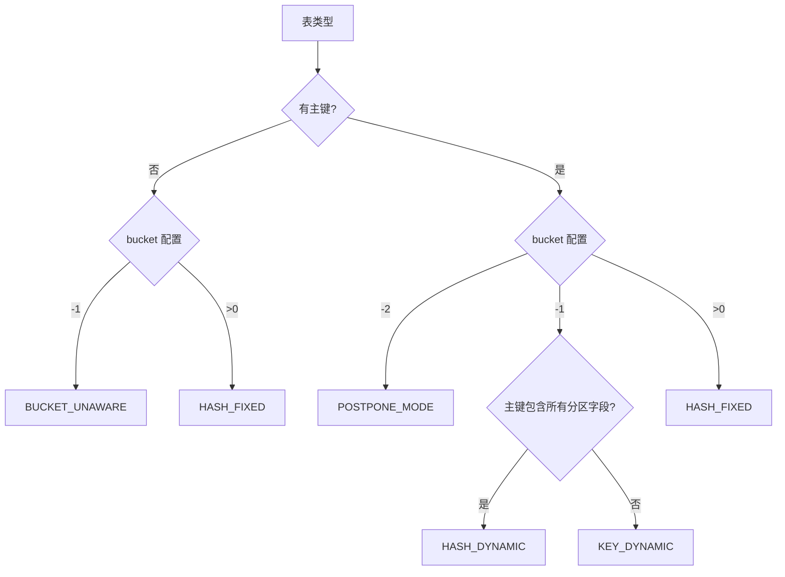
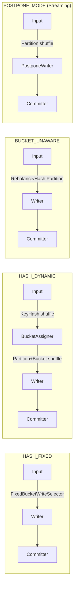

# Apache Paimon 分桶(Bucket)机制原理与实践

> **版本**：1.5-SNAPSHOT　**源码模块**：`paimon-core`（`BucketMode` 在 `paimon-common`，配置项/`TableSchema` 在 `paimon-api`，分发/Sink 在 `paimon-flink`、`paimon-spark`）　**核对日期**：2026-06

**一句话定位**：Bucket 是 Paimon 在 Partition 之下的**最小并发与存储单元**——每个 `(partition, bucket)` 是一棵独立 LSM-Tree（主键表）或一组文件（追加表），它同时决定了写并行度、主键路由、compaction 边界和桶裁剪能力。

读完本文你应能回答：
1. 五种 `BucketMode` 各自的判定条件是什么，为什么 `bucket=-1` 会分裂出 HASH_DYNAMIC 和 KEY_DYNAMIC 两种命运；
2. 固定桶 / 动态桶 / postpone 桶（`bucket=-2`）三者在"写性能、查询桶裁剪、运维灵活性、索引开销"四个维度上如何取舍；
3. `bucket-key` 该怎么选——为什么默认是 trimmedPrimaryKeys、选高基数还是低基数、什么时候用 `bucket-function.type=mod`；
4. 桶数和并行度、小文件、单桶 compaction 时长、数据倾斜之间的定量关系，怎么估算桶数；
5. rescale bucket（重分桶）到底改了什么、为什么必须整分区 overwrite、代价在哪、为什么不能在线"加桶不重写"；
6. compaction 为什么永远不跨桶，这条边界对主键唯一性和 DV 生成意味着什么；
7. 桶裁剪为什么只对 HASH_FIXED / POSTPONE_MODE 生效，动态桶为什么天生无法裁剪。

> 阅读约定：本文每个机制按"① 要解决什么问题 → ② 设计原理与取舍 → ③ 关键源码（精选片段 + `路径:行号`）→ ④ 风险/陷阱/边界 → ⑤ 收益与代价"组织。源码行号以本次核对为准；与旧稿不符处用 `（已修正）` 标注。本文是 01《核心存储引擎分析》§10「数据分布」的**深讲版**，LSM/compaction 基础与 BucketMode 概览见 01，不重复展开。

---

## 目录

- [1. 快速理解（核心问题 / 概念 / 陷阱）](#1-快速理解核心问题--概念--陷阱)
  - [1.1 核心问题：为什么要在 Partition 之下再分桶](#11-核心问题为什么要在-partition-之下再分桶)
  - [1.2 核心概念速查表](#12-核心概念速查表)
  - [1.3 高频生产陷阱](#13-高频生产陷阱)
- [2. BucketMode 五种模式与判定逻辑](#2-bucketmode-五种模式与判定逻辑)
- [3. HASH_FIXED：固定桶](#3-hash_fixed固定桶)
  - [3.1 哈希计算与 RowKeyExtractor](#31-哈希计算与-rowkeyextractor)
  - [3.2 bucket-key 怎么选](#32-bucket-key-怎么选)
  - [3.3 三种 BucketFunction](#33-三种-bucketfunction)
  - [3.4 桶数 × 并行度 × 文件数的定量关系](#34-桶数--并行度--文件数的定量关系)
  - [3.5 每桶一棵独立 LSM-Tree 与跨桶 compaction 边界](#35-每桶一棵独立-lsm-tree-与跨桶-compaction-边界)
- [4. HASH_DYNAMIC：动态桶](#4-hash_dynamic动态桶)
  - [4.1 分配算法：PartitionIndex 四步策略](#41-分配算法partitionindex-四步策略)
  - [4.2 关键参数与索引维护](#42-关键参数与索引维护)
- [5. KEY_DYNAMIC：跨分区更新](#5-key_dynamic跨分区更新)
  - [5.1 全局主键索引与跨分区更新处理](#51-全局主键索引与跨分区更新处理)
  - [5.2 Bootstrap：启动时重建索引](#52-bootstrap启动时重建索引)
- [6. BUCKET_UNAWARE：追加表无桶模式](#6-bucket_unaware追加表无桶模式)
- [7. POSTPONE_MODE：延迟分桶（bucket=-2）](#7-postpone_mode延迟分桶bucket-2)
- [8. rescale bucket：重分桶的代价与流程](#8-rescale-bucket重分桶的代价与流程)
- [9. 分桶与 Flink/Spark 并行度](#9-分桶与-flinkspark-并行度)
  - [9.1 Flink 的数据分发](#91-flink-的数据分发)
  - [9.2 Spark 的 Bucketed Scan](#92-spark-的-bucketed-scan)
  - [9.3 动态桶模式下的两级 Channel 分配](#93-动态桶模式下的两级-channel-分配)
- [10. 分桶与查询优化：桶裁剪](#10-分桶与查询优化桶裁剪)
  - [10.1 Manifest 级别的桶裁剪](#101-manifest-级别的桶裁剪)
  - [10.2 BucketSelector 谓词下推](#102-bucketselector-谓词下推)
- [11. 桶数选择最佳实践](#11-桶数选择最佳实践)
- [12. 与 Iceberg 分桶机制对比](#12-与-iceberg-分桶机制对比)
- [13. 设计决策总结](#13-设计决策总结)
- [附录：核心类索引](#附录核心类索引)

---

## 1. 快速理解（核心问题 / 概念 / 陷阱）

### 1.1 核心问题：为什么要在 Partition 之下再分桶

Partition 把数据按业务维度（如日期）切成目录，但一个分区可能仍有数十 GB——这对写入并发、单文件大小、主键去重都不友好。Bucket 是分区**内部**的二次切分，物理上落成 `partition=.../bucket-N/` 子目录。它一口气解决了三件本来需要全局协调的事：

| 它承担的职责 | 实现方式 | 没有它会怎样 |
|---|---|---|
| **写并发的最小单元** | 每个 `(partition, bucket)` 由唯一一个 Writer 负责，互不交叉 | 写入要么串行，要么需要分布式锁协调对同一文件集的追加 |
| **主键路由 = 去重的前提** | 同一主键经 `bucket-key` 哈希恒定落到同一桶 | LSM 合并只在桶内归并，跨桶无法去重；不路由则需全局索引才能保证主键唯一 |
| **compaction / 读取的隔离边界** | 合并只在桶内进行（见 §3.5），读取只扫目标桶 | 热点数据的合并会阻塞整张表，查询无法做桶裁剪 |

物理路径形如 `table_path/<partition=...>/bucket-N/data-*.{parquet,orc,avro}`。**核心设计哲学一句话：用"分区内哈希分桶"把全局协调问题降维成桶内的局部问题——每个桶是一棵独立 LSM-Tree（主键表）或一组独立文件（追加表），写、合、读全部在桶粒度并行，无需全局锁。**

> 与 01 的分工：本节及全文是 01《核心存储引擎分析》§10「数据分布：Partition + Bucket + BucketMode」的深讲；LSM、compaction、Snapshot 等基础概念见 01，本文聚焦"桶本身的取舍"。

### 1.2 核心概念速查表

| 概念 | 一句话定义 | 关键源码 |
|------|-----------|---------|
| **BucketMode** | 五种分桶模式枚举，决定数据如何落桶 | `BucketMode.java:30`（paimon-common） |
| **bucket（配置项）** | `>0`=固定桶数，`-1`=动态，`-2`=postpone；默认 `-1` | `CoreOptions.java:103` |
| **bucket-key** | 参与哈希的字段集；默认 = trimmedPrimaryKeys（无主键则整行） | `CoreOptions.java:118`、`TableSchema.java:122` |
| **BucketFunction** | 哈希→桶号的函数，三实现 DEFAULT/MOD/HIVE | `BucketFunction.java:28` |
| **RowKeyExtractor** | 从一行记录提取 bucket（Fixed/Dynamic/Postpone 三实现） | `FixedBucketRowKeyExtractor.java:71` |
| **PartitionIndex** | 动态桶的分区级索引：hash→bucket 映射 + 桶水位 | `PartitionIndex.java:42` |
| **HashBucketAssigner** | 动态桶分配器，每分区一个 PartitionIndex | `HashBucketAssigner.java:75` |
| **GlobalIndexAssigner** | KEY_DYNAMIC 的全局主键索引（RocksDB） | `GlobalIndexAssigner.java:243` |
| **BucketSelector** | 从谓词反推目标桶集合做桶裁剪 | `BucketSelector.java:60`（MAX_VALUES=1000） |
| **ChannelComputer** | 把 `(partition,bucket)` 映射到下游 channel | `ChannelComputer.java:37` |
| **RescaleAction** | 整分区 overwrite 实现重分桶的批作业 | `RescaleAction.java:45` |

### 1.3 高频生产陷阱

**陷阱 1：把 `bucket=-1` 当成"固定桶的省事写法"。** `bucket` 默认就是 `-1`（`CoreOptions.java:106`），意味着不显式配置就进了动态桶。主键表会进 HASH_DYNAMIC 或 KEY_DYNAMIC（带索引开销、不支持并发写），追加表进 BUCKET_UNAWARE（无桶裁剪）。要固定桶必须显式写 `'bucket'='N'`。

**陷阱 2：动态桶 + 多作业并发写 = 索引损坏。** HASH_DYNAMIC / KEY_DYNAMIC 的桶分配依赖单作业维护的索引，`BucketMode` 注释明确写了"cannot support multiple concurrent writes"（`BucketMode.java:42`）。两个 Flink 作业同时写同一动态桶表会产生不一致。需要并发写就用固定桶。

**陷阱 3：期望"加桶不重写"。** 固定桶数写进 schema，改桶数必须把该分区数据整体读出按新桶数重写（`rescale` 见 §8），代价 = 一次全分区 overwrite。无法像 Kafka 加分区那样只对新数据生效——因为旧数据的物理落桶位置由旧桶数决定，不重写就破坏了"同 key 同桶"。

**陷阱 4：bucket-key 选了低基数字段导致数据倾斜。** 如用 `status`（仅几个取值）做 bucket-key，绝大多数行挤进少数几个桶，单桶巨大、compaction 集中、桶裁剪几乎无效。bucket-key 应选高基数、分布均匀的字段（默认 trimmedPrimaryKeys 通常就合适）。

**陷阱 5：桶数与单桶数据量不匹配。** 单桶 = 一棵 LSM，单桶过大（经验 > 2GB）会让 compaction 单次归并耗时陡增、点查 run 数变多；桶过多则小文件与 manifest 元数据膨胀。估算见 §11，经验区间单桶 200MB–1GB（主键表偏小，追加表可偏大）。

**陷阱 6：POSTPONE_MODE 未跑 compaction 就查询。** `bucket=-2` 写入阶段数据全在 `bucket=-2` 临时目录、用 Avro 格式且无统计信息（`PostponeBucketFileStoreWrite.java:108`），compaction 前查询要全扫且无桶裁剪、无谓词下推。必须保证后台/独立 compaction 把数据"沉淀"到真实固定桶。

**陷阱 7：误以为 `mod` bucket-function 能用于多字段或字符串。** `ModBucketFunction` 强制 bucket-key 为**单个** INT/BIGINT 字段（`ModBucketFunction.java:46-56`），违反会建表报错。它的价值是对自增 ID 做 `floorMod` 得到可预测、均匀的分布；通用场景用默认的 `DefaultBucketFunction`（整行 hash）。

**陷阱 8：在多分区表上把桶数设得很大。** 桶是分区内的，总写单元 ≈ `活跃分区数 × 桶数`。100 个活跃分区 × 100 桶 = 1 万个 `(partition,bucket)`，每个都至少一个活跃文件，小文件与 manifest 压力成倍放大。多分区表应压低单分区桶数，或改用 POSTPONE_MODE 让每分区自适应。

---

## 2. BucketMode 五种模式与判定逻辑

**① 要解决什么问题**

一套分桶策略不可能同时满足所有场景：有的表数据量稳定（要确定性与桶裁剪），有的波动剧烈（要自适应），追加表根本不需要主键路由，还有跨分区更新这种需要全局唯一的硬需求。Paimon 用一个 `BucketMode` 枚举把这些需求分流到五条物理路径。

**② 设计原理与取舍**

五种模式不是用户直接选的，而是由 `bucket` 配置 + 表是否有主键 + 主键是否含全部分区字段三者**推导**出来的：

| 模式 | 触发条件 | 桶数确定时机 | 桶裁剪 | 并发写 | 额外索引 | 跨分区更新 |
|------|---------|------------|-------|-------|---------|-----------|
| HASH_FIXED | `bucket=N (>0)`（主键或追加表均可） | 建表时 | ✅ | ✅ | 无 | 否 |
| HASH_DYNAMIC | 主键表 + `bucket=-1` + 主键含全部分区字段 | 写入时增长 | ❌ | ❌ | HashIndexFile | 否 |
| KEY_DYNAMIC | 主键表 + `bucket=-1` + 主键**不**含全部分区字段 | 写入时增长 | ❌ | ❌ | RocksDB | ✅ |
| BUCKET_UNAWARE | 追加表 + `bucket=-1` | 无桶（全写 bucket-0） | ❌ | ✅ | 无 | N/A |
| POSTPONE_MODE | 主键表 + `bucket=-2` | compaction 时 | ✅（compaction 后） | ✅ | 无 | 否 |

一句话设计哲学：**把"桶数/落桶时机"这个最难预估的决策，按场景外推给三个不同的时间点——建表时（Fixed）、写入时（Dynamic）、compaction 时（Postpone）**，并据此换取不同的桶裁剪/并发/索引代价。固定 vs 动态 vs postpone 的取舍贯穿后文 §3/§4/§7，§13 有总表。

**③ 关键源码：判定逻辑分布在两个 FileStore**

主键表 `KeyValueFileStore.bucketMode()`（`KeyValueFileStore.java:91-100`，switch 分支在 `:94-99`）：

```java
int bucket = options.bucket();
switch (bucket) {
    case -2:  return BucketMode.POSTPONE_MODE;
    case -1:  return crossPartitionUpdate ? BucketMode.KEY_DYNAMIC : BucketMode.HASH_DYNAMIC;
    default:  return BucketMode.HASH_FIXED;   // bucket > 0
}
```

追加表 `AppendOnlyFileStore.bucketMode()`（`AppendOnlyFileStore.java:66-67`）：`bucket==-1 ? BUCKET_UNAWARE : HASH_FIXED`。

关键分叉是 `bucket=-1` 时由 `crossPartitionUpdate` 决定走 HASH_DYNAMIC 还是 KEY_DYNAMIC——这个布尔值在建表时根据"主键是否包含全部分区字段"算出。`BucketMode` 枚举本身定义在 `BucketMode.java:30`（**确认在 paimon-common**），两个特殊常量 `UNAWARE_BUCKET=0`、`POSTPONE_BUCKET=-2` 在 `:71-73`。

**④ 风险/边界**

- 模式由配置推导，改 `bucket` 值等于改模式，而改模式需要重写数据（schema 变更 + 物理重分布）。
- `bucket=-1` 是默认值，"没配 bucket 的主键表"默默进了动态桶——这是最隐蔽的误用（§1.3 陷阱 1）。
- 注释中标 `@since 0.9`（`BucketMode.java:27`），旧稿"0.4/0.6/0.9 逐版本引入各模式"的演进叙述无法从源码核实，**已删除**避免编造。

**⑤ 收益与代价**

收益：用户只需配一个 `bucket` 数字 + 设计好主键，系统自动选出最优物理布局。代价：五条路径各有独立的写入算子、索引维护、读取分支，是 paimon-core 复杂度的主要来源之一；且模式间迁移成本高。

判定全景（文字流程）：表有主键？→ 否：`bucket=-1`→BUCKET_UNAWARE，`>0`→HASH_FIXED；→ 是：`bucket=-2`→POSTPONE_MODE，`>0`→HASH_FIXED，`-1`→（主键含全部分区字段？是→HASH_DYNAMIC / 否→KEY_DYNAMIC）。



---

## 3. HASH_FIXED：固定桶

**① 要解决什么问题**

数据量可预测、需要稳定查询性能与可控并发的场景：用户维度表、按日分区且单分区量级稳定的订单/商品表。固定桶是唯一既支持桶裁剪、又零索引开销、又允许多作业并发写的模式——代价是桶数写死、改桶数要重写。

**② 设计原理与取舍**

核心是"确定性哈希"：`bucket = bucketFunction.bucket(bucketKey, numBuckets)`，同一 bucketKey 在桶数不变时永远落同一桶。这把"主键唯一性"从全局协调问题降成桶内 LSM 归并问题，也让查询端能从 WHERE 条件反推桶号（§10 桶裁剪）。取舍：放弃自适应换确定性。

### 3.1 哈希计算与 RowKeyExtractor

`FixedBucketRowKeyExtractor`（`FixedBucketRowKeyExtractor.java`）是固定桶的落桶入口。它从一行记录投影出 bucketKey，再交给 BucketFunction：

```java
// FixedBucketRowKeyExtractor.java:71-80（已修正：旧稿把两段方法揉成一段）
public int bucket() {
    if (reuseBucket == null) {
        reuseBucket = bucket(numBuckets);   // = bucketFunction.bucket(bucketKey(), numBuckets)
    }
    return reuseBucket;
}
```

一个值得注意的优化：构造时计算 `sameBucketKeyAndTrimmedPrimaryKey = schema.bucketKeys().equals(schema.trimmedPrimaryKeys())`（`:46`）。绝大多数表没单独配 bucket-key，此时 bucketKey 就等于 trimmedPrimaryKey，`bucketKey()` 直接复用已提取的主键（`:59-68`），省掉一次投影与内存分配。`reuseBucket` 在 `setRecord` 时清空（`:52-57`），保证按行重算。

### 3.2 bucket-key 怎么选

**默认规则**（`TableSchema.java:122-126`，确认在 paimon-api）：用户显式配 `'bucket-key'='c1,c2'` 则用之；否则回退到 trimmedPrimaryKeys；**追加表无主键时回退到整行**（`CoreOptions.java:131-132` 的描述："if there is no primary key, the full row will be used"——旧稿只提到 trimmedPrimaryKeys，**已补全**）。

为什么默认剔除分区字段（trimmed）：分区已把数据隔离到不同目录，桶内再带分区字段对哈希分布零贡献，反而浪费计算。

选 bucket-key 的实用准则（这是固定桶最容易踩坑的地方）：

| 准则 | 原因 | 反例后果 |
|---|---|---|
| **高基数** | 取值越多，哈希越能铺满所有桶 | 选 `status` 这类几值字段→数据全挤进少数桶，单桶巨大 |
| **分布均匀** | 避免热点 key | 选有明显热点的字段→热点桶 compaction 永远忙 |
| **稳定** | bucket-key 决定物理落桶，不可变 | `@Immutable`（`CoreOptions.java:117`），建表后不能改 |
| **与主键一致的同 key 行为** | 同主键必须同桶才能去重 | 自定义 bucket-key 时若同主键映射到不同 bucket-key 值，去重失效 |
| **查询常用的等值条件列** | 才能触发桶裁剪（§10） | bucket-key 不在 WHERE 里→裁剪用不上 |

### 3.3 三种 BucketFunction

由 `bucket-function.type` 选择（默认 `DEFAULT`，`CoreOptions.java:143-147`），工厂在 `BucketFunction.create()`（`BucketFunction.java:37-50`）：

| 类型 | 算法 | 约束 / 适用 |
|------|------|---------|
| `DEFAULT`（`DefaultBucketFunction.java:30-33`） | `Math.abs(row.hashCode() % numBuckets)`，对整个 BinaryRow 做 hash | 通用默认；天然支持多字段组合键 |
| `MOD`（`ModBucketFunction.java:60-73`） | `Math.floorMod(intOrLong, numBuckets)` | **强制单字段 INT/BIGINT**（构造时 `checkArgument`，`:46-56`），自增 ID 用它分布最均匀 |
| `HIVE`（`HiveBucketFunction`） | Hive 兼容哈希（`HiveHasher`） | 让 Paimon 桶与 Hive 桶一致，供 Hive 直接读分桶表 |

为什么 `DEFAULT` 用整行 `BinaryRow.hashCode()`：BinaryRow 的 hashCode 直接在底层 MemorySegment 上算 Murmur hash，无需逐字段拆解，对组合键零额外成本（详见 01 §1.2 BinaryRow）。为什么 `MOD` 用 `floorMod` 而非 `%`：`%` 对负数返回负值，`floorMod` 恒非负，避免负 ID 落到错误桶；代价是只能单数值字段。

> **风险**：`MOD` 在 bucket-key 取值与 numBuckets 不互质时会周期性空桶（如全偶数 ID + 偶数桶数 → 一半桶永远空）。换桶数前先确认 ID 分布。

### 3.4 桶数 × 并行度 × 文件数的定量关系

桶数是固定桶最重要的容量旋钮，它同时牵动四件事：

| 维度 | 关系 | 含义 |
|---------|----------|------|
| 写并行度上限 | `≤ 活跃(partition, bucket) 组合数` | 每个 `(partition,bucket)` 只能由一个 Writer 写；并行度超过组合数则多余 Writer 空转 |
| 活跃文件下限 | `≥ 活跃(partition, bucket) 组合数` | 每桶至少一个活跃文件，多分区 × 多桶 → 小文件与 manifest 条目成倍放大 |
| 单桶 compaction 时长 | `∝ 单桶数据量` | 单桶过大（经验 > 2GB）→ 单次归并 I/O/CPU 陡增、点查 run 数变多 |
| 读并行度 | `= split 数`（按文件大小切，不受桶数限制） | 桶内多文件可能并成一个 split，也可能拆成多个 |

> 桶数 ≠ 并行度。并行度可大可小于桶数：固定桶下 Paimon 对**无分区表**做了自动收口——`buildForFixedBucket()` 中若用户没显式设并行度且 `bucketNums < input.getParallelism()`，会把 Writer 并行度降到 `bucketNums`，避免空转 Writer（`FlinkSinkBuilder.java:292-301`，**已修正：旧稿标 272-287**）。多分区表不收口，因为不同分区的同号桶可由不同 Writer 承载。

估算公式与场景档位见 §11，这里只给一句经验：**桶数 ≈ 单分区峰值数据量 / 单桶目标大小（主键表 200MB–1GB，追加表可更大）**。

### 3.5 每桶一棵独立 LSM-Tree 与跨桶 compaction 边界

主键表里每个 `(partition, bucket)` 是一棵**完全独立**的 LSM-Tree（Level 0/1/2…，结构见 01 §3）。这条边界是分桶机制最深的设计点：

**compaction 永不跨桶。** `CompactManager` 以 `(partition, bucket)` 为单位调度，归并只发生在同一棵树的多个 SortedRun 之间。这带来两个直接后果：

1. **主键去重的正确性靠"同 key 同桶"兜底**——既然同主键所有版本都在同一棵树，桶内归并就能看到全部版本并正确 merge/去重，无需任何跨桶/全局协调。这正是 §1.1"主键路由 = 去重前提"的物理落点。
2. **热点隔离**——某个热桶的 compaction 再忙，也不会阻塞其他桶的读写；不同桶的 compaction 可完全并行（受 compaction 线程池约束）。

**这条边界对动态桶的影响**：HASH_DYNAMIC 给同一 key 的不同 hash 仍分到同一桶（hash2Bucket 映射保证，§4），所以去重不破。但 MOW（deletion-vectors）下 DV 也是按桶维护（`BucketedDvMaintainer`）、在桶内 compaction 阶段生成——意味着 DV 的可见性同样受单桶 compaction 进度制约（详见 01 §7.2、§1.3 陷阱 8）。

**代价**：桶是隔离单元也是僵硬单元——桶内数据无法被"借"给邻桶分担，所以一旦某桶倾斜变大，唯一的出路是 rescale 整分区重分桶（§8），而不能局部分裂单个桶。

---

## 4. HASH_DYNAMIC：动态桶

**① 要解决什么问题**

固定桶要求建表时就把桶数写死，可很多实时表的数据量根本无法预估：新业务可能从每天几 MB 涨到几十 GB。配少了单桶巨大、配多了空桶遍地，而改桶数又要全分区重写。动态桶让**桶数随写入量自动增长**——给每个分区维护一个"hash → bucket"索引，桶满了就开新桶，用户只需配 `bucket=-1`（默认值）。触发条件：主键表 + `bucket=-1` + 主键包含全部分区字段（否则走 KEY_DYNAMIC，§5）。

**② 设计原理与取舍**

核心是用一个**轻量内存索引**记住"哪个 key 落在哪个桶"，从而在桶数变化时仍保持"同 key 同桶"。两个关键决策：

- **索引键用 hash 而非完整 key**：完整主键索引在十亿级数据下内存可能上 GB，而 `int hash` 只需 4 字节。代价是哈希碰撞——不同 key 可能映射到同一桶，影响分布均匀度但不影响正确性（碰撞只是让两个 key 共桶，桶内 LSM 仍能各自去重）。
- **用 `Int2ShortHashMap` 压缩**：`int hash → short bucket`，每条 6 字节，把分区索引压到极致（`PartitionIndex.java:44`）。

代价对比固定桶：① 无法桶裁剪（hash→bucket 映射不确定，查询端无法从 key 反推桶号，§10）；② 不支持多作业并发写（索引由单作业维护，`BucketMode.java:42-44` 注释明确 "cannot support multiple concurrent writes"）；③ 每条记录多一次索引查询的 CPU 开销。一句话设计哲学：**用一份可丢弃的内存哈希索引，把"桶数预估"这个建表期决策推迟到写入期自适应完成。**

### 4.1 分配算法：PartitionIndex 四步策略

落桶入口 `HashBucketAssigner.assign(partition, hash)`（`HashBucketAssigner.java:74-99`，**已修正：旧稿源码签名错误**）先按 `(partitionHash, keyHash)` 校验记录确实属于本 Assigner（两级 shuffle 的保证，§9），再委托给分区索引 `PartitionIndex.assign`。真正的分配逻辑在 `PartitionIndex.java:70-118`：

```java
public int assign(int hash, IntPredicate bucketFilter, int maxBucketsNum, int maxBucketId) {
    // 1. 该 hash 出现过 → 返回已分配的桶（保证同 key 同桶）
    if (hash2Bucket.containsKey(hash)) { return hash2Bucket.get(hash); }
    // 2. 找一个未满的桶（行数 < targetBucketRowNumber），行数 +1
    //    ...遍历 nonFullBucketInformation，满的顺手移除...
    // 3. 没有未满桶且未达上限 → 创建新桶（编号递增，跳过不归本 Assigner 的桶）
    // 4. 达到 max-buckets 上限 → 随机塞进一个已有桶（ListUtils.pickRandomly）
}
```

四步的设计意图：步骤 1 保证幂等与去重前提；步骤 2/3 让桶按需增长、单桶趋近 `target-row-num`；步骤 4 是 `dynamic-bucket.max-buckets` 的安全阀——防止某个倾斜 key 把桶数撑到无限（默认 `-1` 无上限时，桶数超过 `Short.MAX_VALUE` 会直接抛异常提示调大 `target-row-num`，见 `:106-111`）。

> 注意 step 3 的 `bucketFilter`：动态桶下桶号是按 `numAssigners` 分片拥有的，每个 Assigner 只能创建"归自己"的桶号（`isMyBucket`），这样多个 Assigner 并行时桶号不冲突。

### 4.2 关键参数与索引维护

| 参数 | 默认值 | 作用 | 源码 |
|------|--------|------|------|
| `dynamic-bucket.target-row-num` | 2,000,000 | 单桶目标行数，达到即开新桶 | `CoreOptions.java:1422` |
| `dynamic-bucket.max-buckets` | -1（无限） | 单分区桶数上限，触发 step 4 随机溢出 | `CoreOptions.java:1437` |
| `dynamic-bucket.initial-buckets` | 无 | 分区初始桶数，影响 Assigner 初始通道 | `CoreOptions.java:1430` |
| `dynamic-bucket.assigner-parallelism` | 无 | Assigner 算子并行度；过大则部分 Assigner 空闲、索引分散 | `CoreOptions.java:1445` |

`target-row-num` 默认 200 万行 ≈ 单桶数百 MB，落在 compaction 与点查效率的平衡点：过小→桶多、索引大、小文件多；过大→单桶 compaction 慢。

**索引怎么落盘**：每条新记录的 key hashCode 被 `DynamicBucketIndexMaintainer.notifyNewRecord` 加进一个 `IntHashSet`（`DynamicBucketIndexMaintainer.java:70-77`）；`prepareCommit` 时若集合有变化，整批 hash 由 `HashIndexFile.write`（`HashIndexFile.java:48`，index 类型常量 `HASH_INDEX="HASH"` 在 `:34`）写成一个紧凑的 int 数组索引文件，随 snapshot 提交。启动时 `PartitionIndex.loadIndex`（`:120-154`）按分区扫回这些文件重建内存映射。

**④ 风险/陷阱/边界**

- **启动慢**：索引文件需在写作业启动时按分区加载，表越大、分区越多越慢；这是动态桶相对固定桶的固定成本。
- **碰撞导致轻微倾斜**：hash 碰撞让不同 key 共桶，分布不会绝对均匀；通常可忽略，但极端热点 key 仍会撑大单桶。
- **不可并发写**：两个作业同时写会各自维护索引、互相覆盖，导致桶分配不一致——要并发写只能用固定桶。
- **覆盖写场景用 `SimpleHashBucketAssigner`**（`SimpleHashBucketAssigner.java:33-34`，注释 "avoid loading index"）：INSERT OVERWRITE 时整分区重写，无需加载旧索引，直接顺序分桶。

**⑤ 收益与代价**

收益：桶数自适应，用户免于预估，新表/波动表开箱即用。代价：放弃桶裁剪与并发写、付出索引内存与启动加载成本。适用：数据量难估、单作业写、查询以全表/分区扫为主的主键表；不适用：需要桶裁剪点查、或需多作业并发写的表（用固定桶）。

---

## 5. KEY_DYNAMIC：跨分区更新

**① 要解决什么问题**

当主键**不包含全部分区字段**时（如按日期分区、主键只有 `order_id`），同一主键可能先后落到不同分区——订单今天创建、明天改状态。HASH_DYNAMIC 的索引是分区级的，看不到"这个 key 上次在哪个分区"，于是会在新旧两个分区各留一份，主键全局唯一性被破坏（这正是 01 §1.3 陷阱 4 的物理根源）。KEY_DYNAMIC 用一个**全局主键索引**记住每个 key 的当前 `(partition, bucket)`，从而支持跨分区更新：旧分区发 DELETE、新分区发 INSERT。

**② 设计原理与取舍**

它和 HASH_DYNAMIC 最根本的区别是**索引存什么、存哪里**：

| 维度 | HASH_DYNAMIC | KEY_DYNAMIC |
|------|-------------|-------------|
| 索引键 | `hash(primaryKey)`（int，有碰撞） | 完整 primaryKey（bytes，无碰撞） |
| 索引值 | bucket（short） | `(partitionId, bucketId)` |
| 存储介质 | 内存 + HashIndexFile | 本地 RocksDB（off-heap + 磁盘） |
| 跨分区更新 | 不支持 | 支持 |
| 启动开销 | 加载哈希索引文件 | 全量扫描所有 key + RocksDB bulk load |

为什么用 RocksDB 而非内存哈希表：跨分区更新必须存**完整主键**（不能像动态桶用 hash，否则碰撞会把不同 key 误判为同一个、错误地跨分区删除），完整主键索引可能远超内存，RocksDB 提供持久化、可溢出磁盘、带 TTL 的 KV 存储。代价是每条记录一次 RocksDB 查询（比固定桶慢，写延迟可能抖动）、启动要 bootstrap 全表 key。一句话设计哲学：**用一份本地 RocksDB 全局主键索引，把"主键全局唯一"从分区内提升到跨分区，代价是最重的索引与最慢的启动。**

### 5.1 全局主键索引与跨分区更新处理

`GlobalIndexAssigner` 用 RocksDB ValueState 维护 `primaryKey → (partitionId, bucketId)` 映射（`GlobalIndexAssigner.java:155-160`）：

```java
this.keyIndex = stateFactory.valueState(
        INDEX_NAME,
        new RowCompactedSerializer(keyType),    // 完整主键
        new PositiveIntIntSerializer(),          // (partitionId, bucketId)
        options.get(RocksDBOptions.LOOKUP_CACHE_ROWS));
```

核心处理逻辑 `processInput`（`GlobalIndexAssigner.java:243-272`）：查索引拿到 key 的旧位置，分三种情况——

1. **索引里没有** → 新 key，分配桶、写索引（`processNewRecord`）。
2. **旧分区 == 新分区** → 同分区更新，直接写已有桶（`collect(value, previousBucket)`）。
3. **旧分区 != 新分区** → 跨分区更新，交给 `ExistingProcessor` 处理：向旧分区发 DELETE、再决定是否在新分区写 INSERT（`processExists` 返回是否处理新记录）。

`ExistingProcessor` 按 merge-engine 不同有不同实现（如 deduplicate / first-row），这是跨分区"删旧写新"语义的落点。

### 5.2 Bootstrap：启动时重建索引

写作业启动必须先知道所有已存在 key 的位置，否则无法判断一条记录是不是跨分区更新。`IndexBootstrap` 只投影主键字段全表扫描（`withProjection(keyProjection)`），并按 `bucket % numAssigners == assignId` 把 key 分片给各 Assigner，支持 `cross-partition-upsert.index-ttl`（`CoreOptions.java:1825`）过滤掉过老的 split 以控制索引规模。

`GlobalIndexAssigner` 的两条 bootstrap 路径（`GlobalIndexAssigner.java:234-241`）：

- **批量场景（isEmpty && isEndInput）**：走 `bulkLoadBootstrapRecords`——先用 `BinaryExternalSortBuffer` 把 key 排序，再用 `RocksDBBulkLoader` 批量灌入。bulk load 跳过 WAL 与 memtable，比逐条 put 快一个数量级。
- **流式场景**：走 `bootstrapRecords`，边读历史边接新数据。

> **为什么 bootstrap 是 KEY_DYNAMIC 最大的成本**：大表启动可能到分钟甚至小时级，这段时间作业还不能正常处理新数据。这是"全局主键唯一"的硬代价。

**④ 风险/陷阱/边界**

- **不支持并发写**：和 HASH_DYNAMIC 一样，索引由单作业维护。
- **off-heap 内存与磁盘**：RocksDB 需要预留堆外内存和本地磁盘，配置不足会 OOM 或写满磁盘。
- **TTL 是双刃剑**：`index-ttl` 太短→旧 key 索引被清，跨分区更新找不到旧位置、退化成"新分区插一份"（重复）；太长→索引无限增长。需按"同一 key 两次更新的最大时间间隔"来设。
- **跨分区更新放大写入**：一次跨分区更新产生旧分区 DELETE + 新分区 INSERT 两条记录，存储与 compaction 压力翻倍。

**⑤ 收益与代价**

收益：业界少见的"湖格式内跨分区主键全局唯一"，直接支撑 CDC 全量同步、维度表跨分区迁移。代价：最重的索引（RocksDB）、最慢的启动（bootstrap 全表）、最高的单条写开销。适用：主键不含分区字段且确需全局唯一的场景；不适用：能让主键包含分区字段时——那样用 HASH_DYNAMIC/HASH_FIXED 更省。

---

## 6. BUCKET_UNAWARE：追加表无桶模式

**① 要解决什么问题**

追加表（无主键）根本不需要"同 key 同桶"——没有主键就没有去重需求。这时强制分桶只会带来坏处：写入要按 bucket-key 哈希分发，把数据局部性约束强加给一个本不需要它的负载，并把写并行度卡死在桶数上。日志、埋点、监控时序这类"只追加、要极致吞吐"的表，需要的是"想开多少 Writer 就开多少"。

**② 设计原理与取舍**

BUCKET_UNAWARE 干脆**取消分桶语义**：所有数据写进 `bucket-0`（`BucketMode.UNAWARE_BUCKET = 0`，`BucketMode.java:71`），写入端用 Rebalance/Hash 自由分发，不受桶数约束；读取端按文件大小切 split，并行度也与桶数解耦。触发条件极简单——追加表 + `bucket=-1`（`AppendOnlyFileStore.java:66-67`：`bucket==-1 ? BUCKET_UNAWARE : HASH_FIXED`）。

取舍：放弃桶裁剪（所有数据在一个逻辑桶，无桶号可裁）换最大写并行度。这对追加表是划算的——追加表的查询优化本就靠分区裁剪、文件索引（Bloom/Bitmap/BSI，详见 13 号文档）和列裁剪，不依赖桶。一句话设计哲学：**对没有去重需求的表，把"桶"这个概念彻底摘掉，让读写并行度回归数据量本身。**

> 注意：追加表若显式配 `bucket>0` 则走 HASH_FIXED，按 bucket-key 哈希分桶——这通常是为了和 Hive 分桶兼容或做 bucket join，代价是写并行度被桶数限制（§1.3 陷阱 1 的反面：追加表误配固定桶会限流）。

**④ 风险/陷阱/边界**

- **bucket-0 小文件**：无桶不等于无小文件——所有数据涌入一个目录，不跑 compaction 会让文件数爆炸，单目录文件过万后 List 变慢。追加表的小文件治理见 11 号文档。
- **读取负载均衡靠 split 切分**：文件大小不均时按大小切 split 才能均衡，这是追加表读取调优的重点。
- **误以为能桶裁剪**：所有数据同一桶，`WHERE col=x` 无法跳过任何文件，只能靠文件索引在文件内跳过 row group。

**⑤ 收益与代价**

收益：写吞吐最大化、写入路径最简单、并行度灵活。代价：无桶裁剪能力。适用：日志/事件/时序等只追加、重吞吐的无主键表；不适用：需要 bucket join 或 Hive 桶兼容时（改用追加表 + `bucket>0` 的 HASH_FIXED）。

---

## 7. POSTPONE_MODE：延迟分桶（bucket=-2）

**① 要解决什么问题**

固定桶要建表时定死桶数（要桶裁剪、要并发写就得用它），动态桶能自适应但放弃了桶裁剪与并发写——两难。更棘手的是多分区表：不同分区数据量可能差几个数量级，一个全局桶数对谁都不合适。POSTPONE_MODE（`bucket=-2`，主键表专用）的思路是**把"定桶数"这个决策从写入期推迟到 compaction 期**：写入时完全不分桶、只管快写；后台 compaction 时再按每个分区的实际数据量，把数据沉淀成真正的固定桶。

**② 设计原理与取舍**

两阶段：

1. **写入阶段**：数据全写进 `bucket=-2` 临时目录（`BucketMode.POSTPONE_BUCKET=-2`，`BucketMode.java:73`），用 **Avro** 行式格式、**关闭统计信息**（`PostponeBucketFileStoreWrite.java:106-109`：`FILE_FORMAT=avro` + `METADATA_STATS_MODE=none`）。`PostponeBucketWriter` 不做 compaction（`compact` 方法为空，`PostponeBucketWriter.java:138`），纯顺序快写。
2. **Compaction 阶段**：读出 `bucket=-2` 数据，按主键哈希分配到 `bucket-0/1/...` 固定桶并写成列式文件。`PostponeUtils.tableForFixBucketWrite` 临时把表配成 `bucket=1` + `write-only=true`（`PostponeUtils.java:57-62`）来复用固定桶写入路径，`BucketFiles.makeMessage`（`BucketFiles.java:98`）把每个真实桶的文件变更打成 `CompactIncrement` 提交。沉淀后该分区就拥有了固定桶的全部能力——桶裁剪、谓词下推。

为什么写入用 Avro 而非 Parquet/ORC：临时文件生命周期极短，只会被 compaction 顺序读一次，不需要列裁剪/谓词下推，Avro 顺序写更快、无需构建列式索引。为什么 compaction 才分桶：写入时根本不知道这个分区最终多大，等数据落地后按真实量定桶数最准。一句话设计哲学：**先无脑快写，再按真实数据量一次性定桶——把固定桶的查询红利和动态桶的免预估灵活性合并到一条两阶段流水线上。**

> **唯一文件前缀保证有序**：每个 Writer 的文件带唯一前缀 `{dataFilePrefix}-u-{commitUser}-s-{writeId}-w-`（`PostponeBucketFileStoreWrite.java:118-122`），让同一 Writer 的文件被同一个 compaction reader 按写入顺序消费，保证相同 key 的多次 update 按序合并。

**③ 已知桶数的发现**

`PostponeUtils.getKnownNumBuckets`（`PostponeUtils.java:35`）扫描已有数据文件，得到每个分区**已经沉淀过**的桶数——compaction 据此决定本轮往多少个真实桶分发，实现"每分区独立桶数"。

**④ 风险/陷阱/边界**

- **沉淀前查询很差**（§1.3 陷阱 6）：compaction 之前数据全在 `bucket=-2`、Avro 格式、无统计信息，查询要全扫且无桶裁剪、无谓词下推。**必须**保证后台或独立 compaction 把数据及时沉淀。
- **compaction 是重操作**：要读出全部临时数据、重哈希、重写列式文件，I/O/CPU 开销大；多分区同时 compaction 会争抢资源。
- **不支持跨分区更新**：postpone 只对"主键含全部分区字段"语义安全（落桶在 compaction 期按主键哈希，与固定桶一致）。

**⑤ 收益与代价**

收益：写入零分桶开销、免预估桶数、每分区桶数自适应，沉淀后又拿回固定桶的桶裁剪——是固定/动态之外的"两全"折中。代价：sink 前的查询性能差、compaction 成本高、强依赖 compaction 及时性。适用：数据量难估或多分区数据量悬殊、能接受"先快写后沉淀"的主键表；不适用：要求写入即可高效查询、或跨分区更新的场景。

> 与固定桶/动态桶的三方取舍见 §13 设计决策总结表。

---

## 8. rescale bucket：重分桶的代价与流程

**① 要解决什么问题**

固定桶的桶数写进了 schema、且 `bucket-key` 是 `@Immutable` 的。可数据量会变：去年 50 个桶够用，今年单桶涨到 5GB，compaction 单次归并几十分钟、点查 run 数飙升。这时必须改桶数——但**不能像 Kafka 加分区那样只对新数据生效**：固定桶的"同 key 同桶"靠 `bucket = f(key) % numBuckets`，桶数一变，同一个 key 的目标桶号就变了，旧数据若不挪位置，新旧记录会落在不同桶，桶内 LSM 再也合不到一起、主键去重直接失效。所以改桶数 = 必须重排该分区的全部数据。`RescaleAction` 就是这个重排的批作业（`RescaleAction.java:45`）。

**② 设计原理与取舍：为什么必须整分区 overwrite**

`RescaleAction.build()`（`RescaleAction.java:104-129`）的流程：

1. 取最新 snapshot，把 `commit.strict-mode.last-safe-snapshot` 设成它（`:92-95`）——**严格模式**：rescale 跑批期间若有别的作业提交，commit 会失败而不是默默丢数据。
2. 用 `FlinkSourceBuilder` **批量读出目标分区的全部数据**（`sourceBounded(true)` + `partitionPredicate`）。
3. 把表配置里的 `bucket` 改成新桶数（`bucketOptions.put(BUCKET.key(), newBucketNum)`，`:121`）。
4. 用 `FlinkSinkBuilder.overwrite(partition)` 按新桶数**整分区覆盖写回**（`:125-129`）。

为什么是 overwrite 整分区而非"加桶不重写"：上面 ① 已说明——桶号是 `key % numBuckets` 的函数，改 N 就改了所有 key 的归属，唯一正确做法是把旧数据全部读出、按新 N 重新哈希、原子替换整个分区。这也是为什么 rescale 是**离线批作业**而非在线操作。一句话设计哲学：**桶数是物理布局的一部分，改它等于重排物理布局，没有捷径——用一次受严格模式保护的整分区 overwrite 换取布局正确。**

> 也有 `RescaleProcedure`（Flink/Spark 各一个）作为 SQL 入口，底层同样走这条整分区 overwrite。POSTPONE 表 rescale 时必须显式给目标桶数（`:117-119`）。

**③ 代价量化**

- **I/O = 2 × 分区数据量**：读全量 + 写全量。100GB 分区 rescale ≈ 读 100GB + 写 100GB。
- **算力**：`scanParallelism` 默认取旧桶数（`currentBucketNum`，`:138-151`），`sinkParallelism` 默认取新桶数。
- **窗口期**：整个 overwrite 期间该分区数据正常可读（overwrite 是原子替换，提交前读旧、提交后读新），但**期间不能有其他作业写这个分区**（严格模式会让冲突 commit 失败）。

**④ 风险/陷阱/边界**

- **一次只 rescale 一个分区**：`RescaleAction` 按 `partition` 过滤，多分区要多次跑或脚本循环。
- **并发写冲突**：严格模式保护下，rescale 与在线写同一分区会让其中一方 commit 失败——应停掉该分区的在线写再 rescale。
- **想免 rescale 就别用固定桶**：数据量长期不可预估的表，一开始就用动态桶（§4）或 POSTPONE（§7）能彻底回避重分桶。

**⑤ 收益与代价**

收益：把固定桶的桶数从"建表定死、不可改"变成"可离线调整"，让固定桶也能应对数据增长。代价：一次全分区读写 I/O + 窗口期独占写。适用：数据量阶段性增长、平时享受固定桶的桶裁剪与并发写、偶尔停写调桶；不适用：高频调桶或无法停写的表（改用动态/postpone）。

---

## 9. 分桶与 Flink/Spark 并行度

**① 要解决什么问题**

分桶定义的是数据的**逻辑分布**，并行度是计算引擎的**物理执行**。两者必须对齐：同一 `(partition, bucket)` 的所有记录必须路由到同一个 Writer（否则两个 Writer 写同一棵 LSM 树、commit 冲突），同时各 Writer 负载又要尽量均衡。这一节讲分桶如何映射到 Flink channel / Spark partition。

**② 设计原理与取舍**

固定桶的 channel 映射用 `(startChannel(partition) + bucket) % numChannels`（`ChannelComputer.java:37`），`startChannel = abs(partition.hashCode()) % numChannels`（`:45`）。这个公式的设计意图：① 同一分区的不同桶落到相邻 channel（起点相同、按 bucket 偏移），② 不同分区起点错开、分散负载，③ 同 `(partition,bucket)` 恒定路由同一 Writer。代价：靠 `partition.hashCode` 取模，分区哈希分布不均时可能负载倾斜。

各模式的 Flink 拓扑不同，本质是"桶号在哪一步确定"：固定桶写入前就能算桶号（一级分发）；动态桶要先经 Assigner 分配桶号再按桶分发（两级 shuffle）；追加表无桶（Rebalance）。一句话设计哲学：**用确定性的 channel 公式把"同桶同 Writer"硬约束落地，再按各 BucketMode 桶号确定的早晚选择一级或两级分发。**

> **桶数 ≠ 并行度**（§1.3 陷阱、§3.4 已铺垫）：并行度可大于桶数（不同分区的同号桶由不同 Writer 承载）。无分区固定桶表上，Paimon 会把超过桶数的 Writer 并行度自动收口到桶数（`FlinkSinkBuilder.java:292-301`），避免空转 Writer。

### 9.1 Flink 的数据分发

Flink 通过 `FlinkStreamPartitioner` 将数据按 `(partition, bucket)` 分发到不同的 Writer 实例。

> 源码路径：`paimon-flink/.../sink/FlinkStreamPartitioner.java`

核心的 Channel 计算逻辑在 `ChannelComputer.select()`：

> 源码路径：`paimon-core/.../table/sink/ChannelComputer.java`

```java
static int select(BinaryRow partition, int bucket, int numChannels) {
    return (startChannel(partition, numChannels) + bucket) % numChannels;
}

static int startChannel(BinaryRow partition, int numChannels) {
    int hashCode = partition.hashCode();
    if (hashCode == Integer.MIN_VALUE) {
        hashCode = Integer.MAX_VALUE;
    }
    return Math.abs(hashCode) % numChannels;
}
```

`startChannel` 对 `Integer.MIN_VALUE` 做了特判（`Math.abs(MIN_VALUE)` 仍是负数，会算出负 channel），并注明这是为兼容 Flink 状态恢复而保留的公式（`ChannelComputer.java:50-55`）。

**各模式的 Flink Pipeline 拓扑**（区别在桶号何时确定）：



### 9.2 Spark 的 Bucketed Scan

Paimon 通过 Spark DataSource V2 API 的 `SupportsReportPartitioning` 接口向 Spark 报告分桶信息。

> 源码路径：`paimon-spark/.../spark/PaimonScan.scala`

```scala
override def outputPartitioning: Partitioning = {
    extractBucketTransform
        .map(bucket => new KeyGroupedPartitioning(Array(bucket), inputPartitions.size))
        .getOrElse(new UnknownPartitioning(0))
}
```

**启用条件**：
1. `BucketMode == HASH_FIXED`
2. `BucketFunctionType == DEFAULT`
3. **bucket key 只有一个字段**（Spark 限制）
4. Spark 配置 `spark.sql.sources.v2.bucketing.enabled = true`

**为什么限制单字段 bucket key**：Spark 的 `Expressions.bucket(num, column)` 只接受单个列作为输入，Paimon 目前未实现多列的 Transform 适配。

**DisableUnnecessaryPaimonBucketedScan 优化**：

> 源码路径：`paimon-spark/.../execution/adaptive/DisableUnnecessaryPaimonBucketedScan.scala`

当 Bucketed Scan 对查询计划没有实际帮助时（如没有 Join/Aggregate 利用分桶），自动禁用以避免不必要的约束。

```scala
// 禁用条件：
// 1. 从根到 Bucketed Scan 没有需要特定分布的算子
// 2. 从最近的需要分布的算子到 Bucketed Scan 之间有 Exchange
```

### 9.3 动态桶模式下的两级 Channel 分配

动态桶模式下 Flink 使用**两级 shuffle**：

> 源码路径：`paimon-flink/.../sink/DynamicBucketSink.java` 第 75-117 行

```
input 
  --[第1级: KeyHash shuffle]--> BucketAssigner 
  --[第2级: Partition+Bucket shuffle]--> Writer 
  --> Committer
```

第一级 shuffle（`RowAssignerChannelComputer`）：按 `(partitionHash, keyHash)` 分发，确保相同 key 到达同一个 Assigner。

> 源码路径：`paimon-core/.../index/BucketAssigner.java` 第 40-42 行

```java
static int computeAssigner(int partitionHash, int keyHash, int numChannels, int numAssigners) {
    return computeHashKey(partitionHash, keyHash, numChannels, numAssigners) % numChannels;
}
```

第二级 shuffle（`RowWithBucketChannelComputer`）：Assigner 输出 `Tuple2<Row, Bucket>`，按 `(partition, bucket)` 分发到 Writer。

**为什么需要两级**：Assigner 需要维护全局索引来分配桶号，但 Writer 需要按 `(partition, bucket)` 聚合。两个阶段的数据分发模式不同。

---

## 10. 分桶与查询优化：桶裁剪

**① 要解决什么问题**

`SELECT * FROM users WHERE user_id = 123` 这类带 bucket-key 等值/IN 条件的查询，理论上只需扫一个桶，但如果引擎不知道"123 落在哪个桶"，就得扫全部 N 个桶、I/O 放大 N 倍。桶裁剪（Bucket Pruning）利用固定桶"`bucket = f(key) % N` 确定性"的特性，**从 WHERE 条件反推目标桶号集合**，把扫描范围从全表缩到几个桶。

**② 设计原理与取舍**

桶裁剪只对**确定性映射**的模式生效——`HASH_FIXED` 和 `POSTPONE_MODE`（沉淀后）（`BucketSelectConverter.java:56`）。动态桶（HASH/KEY_DYNAMIC）的 hash→bucket 映射取决于写入顺序、不可从 key 反推，天生无法裁剪（§4 已说明）。这正是"固定桶 vs 动态桶"取舍里固定桶最大的查询红利。

裁剪分两级，先粗后细：① **Manifest 级**——`ManifestFileMeta` 记了每个 manifest 的 `[minBucket, maxBucket]`（`ManifestFileMeta.java:68-69`），不含目标桶的 manifest 整个跳过，连解析都省；② **文件级**——只读目标桶集合内的数据文件。一句话设计哲学：**把"算桶号"这件写入端做过的确定性计算，在查询端反向重做一遍，用极小的谓词计算换数量级的 I/O 削减。**

约束（`BucketSelectConverter.convert`，`:55-65`）：谓词必须覆盖**所有** bucket-key 字段的等值/IN 条件（缺一个就算不出完整哈希），且组合值数量 ≤ `MAX_VALUES=1000`（`BucketSelector.java:60`，超过则放弃裁剪以免计算反噬）。这解释了 §3.2 为何强调"bucket-key 选查询常用等值列、别配太多字段"——否则裁剪根本触发不了。

### 10.1 Manifest 级别的桶裁剪

`ManifestsReader.filterManifestFileMeta`（`ManifestsReader.java:166-177`）用 manifest 的桶范围跳过无关 manifest：`specifiedBucket` 落在 `[minBucket, maxBucket]` 之外直接 return false；`onlyReadRealBuckets && maxBucket < 0` 用于跳过 postpone/unaware 的负桶号 manifest。对上千桶的大表，这一步能大幅减少需加载解析的 manifest 数量。

> 注意桶范围跨多个 snapshot 合并后可能偏宽（保守不漏），裁剪仍正确、只是粒度变粗。

### 10.2 BucketSelector 谓词下推

`BucketSelector` 从 SQL 的 WHERE 条件中提取 bucket key 的值，预计算出目标桶号集合。

> 源码路径：`paimon-core/.../operation/BucketSelector.java`

```java
public boolean test(BinaryRow partition, Integer bucket, Integer numBucket) {
    return partitionSelectors
        .computeIfAbsent(partition, this::createPartitionSelector)
        .map(selector -> selector.test(bucket, numBucket))
        .orElse(true);
}
```

**工作原理**：
1. 从谓词中分离出分区过滤条件，用分区值替换分区字段
2. 提取剩余谓词中 bucket key 相关的 Equal/In 条件
3. 组装所有可能的 bucket key 值，通过 `BucketFunction.bucket()` 计算目标桶集合
4. 扫描时只读取目标桶集合内的数据

**转换入口**：

> 源码路径：`paimon-core/.../operation/BucketSelectConverter.java` 第 55-72 行

```java
public Optional<TriFilter<BinaryRow, Integer, Integer>> convert(Predicate predicate) {
    if (bucketMode != BucketMode.HASH_FIXED && bucketMode != BucketMode.POSTPONE_MODE) {
        return Optional.empty();
    }
    if (!predicateFields.containsAll(bucketKeyType.getFieldNames())) {
        return Optional.empty();
    }
    return Optional.of(new BucketSelector(predicate, bucketFunctionType, ...));
}
```

**约束**：
1. 只对 `HASH_FIXED` 和 `POSTPONE_MODE`（Compaction 后）有效
2. 谓词必须包含所有 bucket key 字段的等值/IN 条件
3. 组合值数量不超过 `MAX_VALUES = 1000`

**为什么只支持 HASH_FIXED 和 POSTPONE_MODE**：动态桶模式的 hash -> bucket 映射不是确定性的（取决于写入顺序），无法从 bucket key 值反推桶号。

**好处**：对于 `WHERE bucket_key = xxx` 这类查询，可以将读取范围从全表缩小到一个桶，I/O 减少 N 倍（N = 桶数）。

---

## 11. 桶数选择最佳实践

**① 要解决什么问题**

桶数是固定桶唯一却最关键的旋钮，且改它要 rescale（§8）。选错的代价是双向的：太少→单桶巨大、compaction 慢、写并行度受限；太多→小文件泛滥、manifest 膨胀、空 Writer。这一节给可操作的估算法与档位，把 §3.4 的定量关系落到实践。

**② 设计原理：单桶目标大小是核心约束**

桶数的本质是"用多少棵 LSM 树切分一个分区"。单桶目标大小（经验 200MB–1GB，主键表偏小、追加表可偏大）是 compaction 效率与读取效率的平衡点，由此倒推桶数：

```
bucket = ceil(单分区峰值数据量 / 单桶目标大小)
```

例：单分区每天 100GB、目标 500MB/桶 → `bucket ≈ 200`。

> **多分区一定要算总组合数**（§1.3 陷阱 8）：写单元 ≈ 活跃分区数 × 桶数。100 活跃分区 × 100 桶 = 1 万个 `(partition,bucket)`，每个至少一个活跃文件——多分区表应压低单分区桶数，或干脆用 POSTPONE 让每分区自适应。

档位参考（单分区量级，非整表）：

| 单分区量级 | 推荐桶数 | 说明 |
|---|---|---|
| < 1GB | 1–4 | 别过度分桶，否则全是小文件 |
| 1–10GB | 4–20 | 按 500MB–1GB/桶 估 |
| 10–100GB | 20–100 | 兼顾并行度与单桶大小 |
| > 100GB 或难预估 | 用动态桶（§4）/ POSTPONE（§7） | 免预估、免 rescale |

**③ 关键源码呼应**

桶数最终写进 schema 的 `bucket` 配置（`CoreOptions.java:103`，默认 -1）；动态桶则由 `target-row-num`（`:1422`，默认 200 万行 ≈ 数百 MB）自动控制单桶大小，无需手算。

**④ 风险/陷阱/边界**

- **桶数 ≠ 并行度**：桶数按数据量定，并行度独立调；无分区表上 Writer 并行度会被自动收口到桶数（§9）。
- **热点 key + 固定桶 = 倾斜**：bucket-key 选高基数均匀字段（§3.2）；有强热点时固定桶难均衡，考虑改 key 或换模式。
- **预留增长空间**：因 rescale 成本高，可适度多配（如按 1.5× 预估），但别过度——空桶也是小文件。

**⑤ 改桶数的两条路**

1. **固定桶 rescale**：`ALTER TABLE ... SET ('bucket'='N')` 改 schema 后，对存量数据跑 `RescaleAction`/`RescaleProcedure` 整分区 overwrite（机制与代价详见 §8）——离线、需停该分区在线写。
2. **改用 POSTPONE（`bucket=-2`）**：从源头免去定桶数与 rescale，让后台 compaction 按每分区实际量沉淀（§7）。

设计建议一句话：**数据量稳定可预估 → 固定桶（享桶裁剪与并发写）；波动大/难预估/多分区量级悬殊 → 动态桶或 POSTPONE。**

---

## 12. 与 Iceberg 分桶机制对比

**为什么放这一节**：很多人把 Paimon 的 bucket 和 Iceberg 的 `bucket(N, col)` Transform 当成一回事，选型或迁移时踩坑。本质区别一句话：**Paimon 的桶是 LSM-Tree 实例边界、是主键唯一性的物理保证；Iceberg 的桶只是一种隐藏分区 Transform，仅影响文件归组、不涉及主键语义。**

| 维度 | Paimon | Iceberg |
|------|--------|---------|
| 分桶定位 | 存储引擎核心机制，决定数据分布和主键唯一性 | 分区 Transform 的一种（`bucket(N, col)`），仅影响文件组织 |
| 与主键关系 | 分桶是主键唯一性保证的基础（同 key 同桶） | 无主键概念，分桶仅用于优化 |
| 动态调整 | HASH_DYNAMIC / POSTPONE 支持自适应 | 通过 Partition Evolution 改策略（对存量数据不追溯） |
| 桶内结构 | 每个桶是独立 LSM-Tree（主键表） | 每个桶是普通数据文件集合 |
| 并行度控制 | 固定桶下桶数直接约束写并行度 | 写并行度独立于分桶 |
| 查询裁剪 | BucketSelector 从 WHERE 反推桶号（§10） | Partition pruning 利用 bucket 值 |
| 高频更新 | 桶内 LSM merge-on-read，更新稳定 | Delete Files（Position/Equality），高频更新性能下降 |
| 桶数修改 | 需 rescale 重写或改用 POSTPONE（§8） | ALTER 改策略、新写入生效，不重写存量 |

取舍的根：Paimon 牺牲桶数灵活性（改桶要 rescale）换来 LSM 高频更新 + 主键全局/分区唯一；Iceberg 牺牲更新性能与主键语义换来 Partition Evolution 的灵活与无主键约束的简单。

选型建议：高频流式更新、要主键唯一 → Paimon；批量写、低频更新、要灵活演进分区 → Iceberg。Paimon 另有 Iceberg 兼容元数据层（详见 paimon-iceberg 模块）可被 Iceberg 引擎读。

> 其他湖格式：Hive 只有固定桶、不支持动态；Hudi 的 File Group 概念最接近 Paimon 的桶；Delta 不强制分桶、靠 Z-Ordering/Data Skipping。

---

## 13. 设计决策总结

| 决策点 | 选择 | 取舍 / 代价 | 收益 |
|---|---|---|---|
| 在 Partition 下再分桶 | 每个 `(partition,bucket)` 一棵独立 LSM/一组文件 | 桶是僵硬单元，倾斜只能整分区 rescale | 写/合/读桶粒度并行，无需全局锁 |
| `bucket=-1` 作默认 | 不配即进动态桶/无桶 | 隐蔽误用：主键表默默进动态桶、丢桶裁剪与并发写 | 开箱即用、免预估桶数 |
| 固定桶（`bucket>0`） | 建表定死、确定性哈希 | 桶数不可在线改，需 rescale | 唯一同时支持桶裁剪 + 并发写 + 零索引 |
| 动态桶 HASH_DYNAMIC | 内存 hash 索引、写入期增长 | 无桶裁剪、不可并发写、启动加载索引、hash 碰撞 | 桶数自适应、索引内存极省（6B/条） |
| 跨分区 KEY_DYNAMIC | RocksDB 全局完整主键索引 | 最重索引、bootstrap 全表、单条写最慢 | 湖格式内跨分区主键全局唯一 |
| 追加表 BUCKET_UNAWARE | 取消桶语义、全写 bucket-0 | 无桶裁剪 | 写并行度与吞吐最大化 |
| POSTPONE（`bucket=-2`） | 写入不分桶、compaction 期沉淀 | 沉淀前查询差、compaction 重 | 免预估 + 每分区自适应 + 沉淀后拿回桶裁剪 |
| bucket-key 默认剔分区字段 | 默认 = trimmedPrimaryKeys | 自定义 key 与主键不一致会破坏去重 | 哈希分布不浪费在已隔离的分区字段上 |
| BucketFunction 三选一 | DEFAULT(整行 hash)/MOD/HIVE | MOD 限单 INT/BIGINT、可能周期空桶 | 默认通用、MOD 对自增 ID 最匀、HIVE 兼容 |
| compaction 永不跨桶 | 归并限同一棵 LSM | 倾斜桶无法借邻桶分担 | 主键去重靠"同 key 同桶"兜底、热点隔离 |
| 桶裁剪仅 FIXED/POSTPONE | 确定性映射才可反推桶号 | 动态桶天生无法裁剪 | 点查 I/O 从 N 桶降到几桶 |
| 改桶数靠离线 rescale | 整分区 overwrite + 严格模式 | 2× 数据量 I/O、窗口期独占写 | 让固定桶也能应对数据增长、不丢数据 |

---

## 附录：核心类索引

| 类名 | 路径 | 职责 |
|------|------|------|
| `BucketMode` | `paimon-common/.../table/BucketMode.java` | 五种分桶模式枚举 |
| `BucketSpec` | `paimon-core/.../table/BucketSpec.java` | 桶规格（模式+键+数量） |
| `BucketFunction` | `paimon-core/.../bucket/BucketFunction.java` | 桶计算函数接口 |
| `DefaultBucketFunction` | `paimon-core/.../bucket/DefaultBucketFunction.java` | 默认哈希分桶 |
| `ModBucketFunction` | `paimon-core/.../bucket/ModBucketFunction.java` | 取模分桶 |
| `HiveBucketFunction` | `paimon-core/.../bucket/HiveBucketFunction.java` | Hive 兼容分桶 |
| `FixedBucketRowKeyExtractor` | `paimon-core/.../table/sink/FixedBucketRowKeyExtractor.java` | 固定桶模式键提取 |
| `DynamicBucketRowKeyExtractor` | `paimon-core/.../table/sink/DynamicBucketRowKeyExtractor.java` | 动态桶模式键提取 |
| `PostponeBucketRowKeyExtractor` | `paimon-core/.../table/sink/PostponeBucketRowKeyExtractor.java` | 延迟桶模式键提取 |
| `HashBucketAssigner` | `paimon-core/.../index/HashBucketAssigner.java` | 动态桶分配器 |
| `SimpleHashBucketAssigner` | `paimon-core/.../index/SimpleHashBucketAssigner.java` | 简化桶分配器（覆盖写场景） |
| `PartitionIndex` | `paimon-core/.../index/PartitionIndex.java` | 分区级桶索引 |
| `DynamicBucketIndexMaintainer` | `paimon-core/.../index/DynamicBucketIndexMaintainer.java` | 动态桶索引维护 |
| `HashIndexFile` | `paimon-core/.../index/HashIndexFile.java` | 哈希索引文件读写 |
| `GlobalIndexAssigner` | `paimon-core/.../crosspartition/GlobalIndexAssigner.java` | 全局索引分配（KEY_DYNAMIC） |
| `IndexBootstrap` | `paimon-core/.../crosspartition/IndexBootstrap.java` | 全局索引启动加载 |
| `BucketAssigner` (crosspartition) | `paimon-core/.../crosspartition/BucketAssigner.java` | 跨分区桶分配 |
| `PostponeBucketFileStoreWrite` | `paimon-core/.../postpone/PostponeBucketFileStoreWrite.java` | 延迟桶写入 |
| `PostponeBucketWriter` | `paimon-core/.../postpone/PostponeBucketWriter.java` | 延迟桶 Writer |
| `BucketFiles` | `paimon-core/.../postpone/BucketFiles.java` | 延迟桶文件管理 |
| `PostponeUtils` | `paimon-core/.../table/PostponeUtils.java` | 延迟桶工具类 |
| `ChannelComputer` | `paimon-core/.../table/sink/ChannelComputer.java` | Channel 分发计算 |
| `FlinkStreamPartitioner` | `paimon-flink/.../sink/FlinkStreamPartitioner.java` | Flink 数据分发 |
| `DynamicBucketSink` | `paimon-flink/.../sink/DynamicBucketSink.java` | 动态桶 Flink Sink |
| `BucketSelector` | `paimon-core/.../operation/BucketSelector.java` | 桶裁剪选择器 |
| `BucketSelectConverter` | `paimon-core/.../operation/BucketSelectConverter.java` | 桶裁剪谓词转换 |
| `BucketFilter` | `paimon-core/.../manifest/BucketFilter.java` | 桶过滤器 |
| `BucketEntry` | `paimon-core/.../manifest/BucketEntry.java` | 桶级元数据条目 |
| `ManifestFileMeta` | `paimon-core/.../manifest/ManifestFileMeta.java` | Manifest 元数据（含 minBucket/maxBucket） |
| `PaimonScan` | `paimon-spark/.../spark/PaimonScan.scala` | Spark 分桶扫描 |
| `DisableUnnecessaryPaimonBucketedScan` | `paimon-spark/.../execution/adaptive/DisableUnnecessaryPaimonBucketedScan.scala` | Spark 桶扫描优化 |
| `KeyValueFileStore` | `paimon-core/.../KeyValueFileStore.java` | 主键表 BucketMode 判定 |
| `AppendOnlyFileStore` | `paimon-core/.../AppendOnlyFileStore.java` | 追加表 BucketMode 判定 |
| `FlinkSinkBuilder` | `paimon-flink/.../sink/FlinkSinkBuilder.java` | Flink Sink 按模式构建 |
| `RescaleAction` / `RescaleProcedure` | `paimon-flink/.../action/RescaleAction.java`、`.../procedure/RescaleProcedure.java`（Spark 同名） | 整分区 overwrite 重分桶 |
