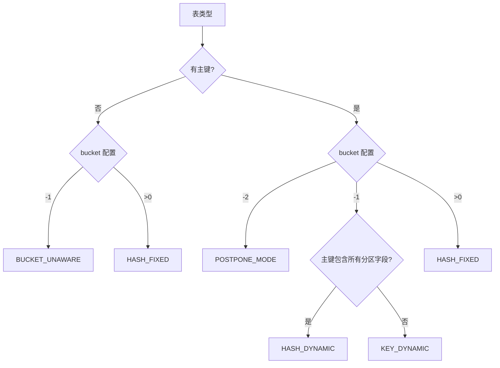
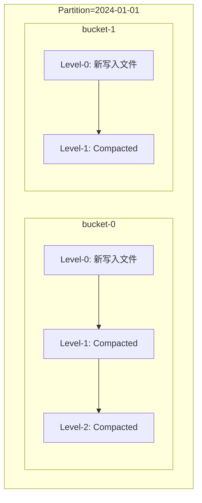
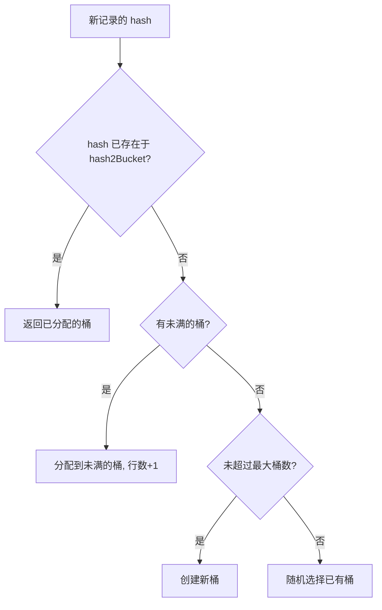
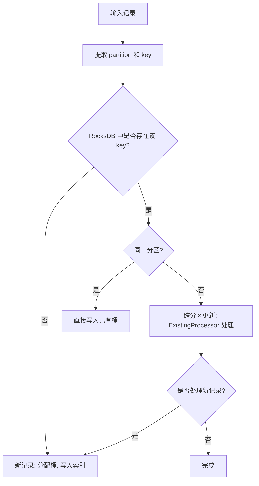
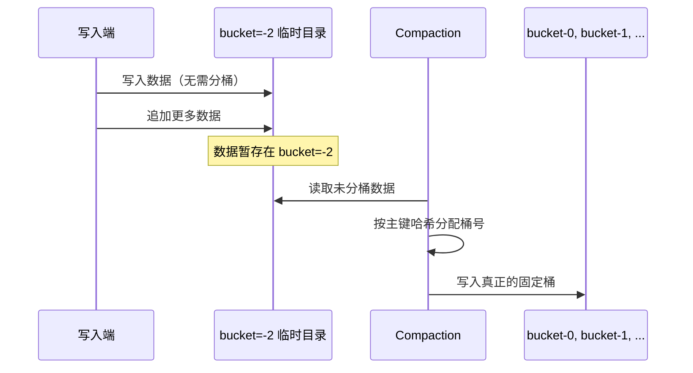
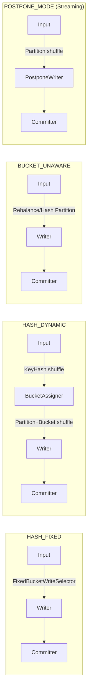

# Apache Paimon 分桶(Bucket)机制原理与实践

> 基于 Paimon 1.5-SNAPSHOT 源码分析，commit: 55f4fd175

---

## 目录

- [1. 为什么需要分桶](#1-为什么需要分桶)
- [2. BucketMode 五种模式总览](#2-bucketmode-五种模式总览)
- [3. HASH_FIXED 模式：固定桶](#3-hash_fixed-模式固定桶)
  - [3.1 哈希计算逻辑](#31-哈希计算逻辑)
  - [3.2 bucket-key 的选择](#32-bucket-key-的选择)
  - [3.3 三种 BucketFunction 实现](#33-三种-bucketfunction-实现)
  - [3.4 桶数量对并行度和文件数量的影响](#34-桶数量对并行度和文件数量的影响)
  - [3.5 每个桶内部是独立的 LSM-Tree](#35-每个桶内部是独立的-lsm-tree)
- [4. HASH_DYNAMIC 模式：动态桶](#4-hash_dynamic-模式动态桶)
  - [4.1 动态桶的分配算法](#41-动态桶的分配算法)
  - [4.2 PartitionIndex 核心数据结构](#42-partitionindex-核心数据结构)
  - [4.3 关键参数](#43-关键参数)
  - [4.4 索引维护 HashIndexFile](#44-索引维护-hashindexfile)
- [5. KEY_DYNAMIC 模式：跨分区更新](#5-key_dynamic-模式跨分区更新)
  - [5.1 全局主键索引的 RocksDB 存储](#51-全局主键索引的-rocksdb-存储)
  - [5.2 Bootstrap 流程](#52-bootstrap-流程)
  - [5.3 与 HASH_DYNAMIC 的区别](#53-与-hash_dynamic-的区别)
- [6. BUCKET_UNAWARE 模式：追加表](#6-bucket_unaware-模式追加表)
- [7. POSTPONE_MODE 模式：延迟分桶](#7-postpone_mode-模式延迟分桶)
  - [7.1 延迟分桶到 Compaction 阶段的原理](#71-延迟分桶到-compaction-阶段的原理)
  - [7.2 PostponeBucketWriter 写入逻辑](#72-postponebucketwriter-写入逻辑)
  - [7.3 BucketFiles 合并管理](#73-bucketfiles-合并管理)
- [8. 分桶与 Flink/Spark 并行度关系](#8-分桶与-flinkspark-并行度关系)
  - [8.1 Flink 的数据分发](#81-flink-的数据分发)
  - [8.2 Spark 的 Bucketed Scan](#82-spark-的-bucketed-scan)
  - [8.3 动态桶模式下的 Channel 分配](#83-动态桶模式下的-channel-分配)
- [9. 分桶与查询优化](#9-分桶与查询优化)
  - [9.1 Manifest 级别的桶裁剪](#91-manifest-级别的桶裁剪)
  - [9.2 BucketSelector 谓词下推](#92-bucketselector-谓词下推)
- [10. 分桶数量选择的最佳实践](#10-分桶数量选择的最佳实践)
- [11. 与 Iceberg 的分区/分桶机制对比](#11-与-iceberg-的分区分桶机制对比)

---

## 1. 为什么需要分桶

分桶(Bucket)是 Paimon 存储引擎中**最核心的数据组织维度之一**。在分区(Partition)之下，Paimon 通过分桶进一步将数据切分为更小的管理单元。理解分桶机制是理解 Paimon 读写路径的前提。

### 1.1 分桶解决的三个核心问题

| 问题 | 为什么需要分桶来解决 | 好处 |
|------|---------------------|------|
| **写并行度控制** | 每个 bucket 是一个独立的写入单元（对应一个 Writer），通过 `partition + bucket` 确定唯一写入者 | 多个 Writer 并行写入互不干扰，写吞吐随桶数线性增长 |
| **数据局部性** | 相同主键哈希到同一个 bucket，同一 bucket 内的数据存储在同一目录下 | 读取时只需扫描目标 bucket，减少 I/O；合并(Compaction)只在 bucket 内部进行，降低资源消耗 |
| **主键唯一性保证** | 对于主键表，相同主键的所有记录必须路由到同一个 bucket | 保证 LSM-Tree 合并时能正确去重/更新，无需全局协调即可保证主键唯一性 |

### 1.2 存储路径结构

分桶体现在 Paimon 的物理存储路径上：

```
table_path/
  partition=xxx/
    bucket-0/          -- 第0个桶
      data-xxx.parquet -- LSM-Tree 的数据文件
      data-yyy.parquet
    bucket-1/          -- 第1个桶
      data-zzz.parquet
    bucket-2/
      ...
```

**设计决策**：每个 `(partition, bucket)` 组合是独立的 LSM-Tree（主键表）或文件集合（追加表）。

**为什么**：这种设计使得写入、合并、读取都可以在 `(partition, bucket)` 粒度上并行化，无需全局锁。

**好处**：极大简化了并发控制，提升了分布式环境下的伸缩能力。

---

## 2. BucketMode 五种模式总览

### 解决什么问题

**核心业务问题**：不同的业务场景对数据写入模式、更新模式、数据量有不同的要求，单一的分桶策略无法满足所有场景。

**没有这个设计的后果**：
- 固定桶数无法应对数据量波动大的场景，要么桶数过多浪费资源，要么桶数过少导致单桶数据量过大
- 追加表强制分桶会限制写入并行度
- 跨分区更新场景无法保证主键唯一性

**实际场景**：
- 日志表：数据量巨大且只追加，需要 BUCKET_UNAWARE 模式最大化写入吞吐
- 用户维度表：数据量可预测，使用 HASH_FIXED 模式获得最佳查询性能
- 订单表：数据量波动大，使用 HASH_DYNAMIC 或 POSTPONE_MODE 自适应调整
- 全局用户表：用户可能跨地区迁移，需要 KEY_DYNAMIC 支持跨分区更新

### 有什么坑

**误区陷阱**：
- 误以为动态桶模式可以无限扩展：实际上受 `dynamic-bucket.max-buckets` 限制
- 认为所有模式都支持桶裁剪：只有 HASH_FIXED 和 POSTPONE_MODE（Compaction 后）支持
- 以为可以随意切换模式：模式切换需要重写数据

**错误配置**：
- 追加表设置 `bucket > 0`：限制了写入并行度，应该用 `bucket = -1`
- 主键表设置 `bucket = -1` 但主键不包含分区字段，却期望分区内唯一：实际会进入 KEY_DYNAMIC 模式，需要 RocksDB 索引

**生产环境注意事项**：
- KEY_DYNAMIC 模式的 RocksDB 索引需要足够的堆外内存和磁盘空间
- HASH_DYNAMIC 模式不支持并发写入，多个作业同时写会导致索引冲突
- POSTPONE_MODE 的 Compaction 延迟可能导致查询性能下降

### 核心概念解释

**BucketMode**：Paimon 的分桶模式枚举，定义了数据如何分配到桶中。

**五种模式的本质区别**：
- HASH_FIXED：桶数在建表时确定，通过哈希函数确定性地将数据分配到固定桶
- HASH_DYNAMIC：桶数动态增长，通过哈希索引记录 hash -> bucket 的映射关系
- KEY_DYNAMIC：支持跨分区更新，通过 RocksDB 记录完整的 key -> (partition, bucket) 映射
- BUCKET_UNAWARE：无桶概念，所有数据写入 bucket-0
- POSTPONE_MODE：延迟分桶，写入时不分桶，Compaction 时再分配到固定桶

**与其他系统对比**：
- Hive：只有固定桶（CLUSTERED BY），不支持动态桶
- Iceberg：分桶是隐藏分区的一种，不涉及主键唯一性保证
- Delta Lake：通过 Z-Ordering 优化数据布局，不强制分桶

### 设计理念

**为什么设计五种模式**：Paimon 作为实时湖仓，需要同时支持流式写入、批量写入、主键更新、追加写入等多种场景。单一模式无法平衡性能、灵活性和资源消耗。

**权衡取舍**：
- HASH_FIXED：性能最优（支持桶裁剪、无索引开销），但灵活性最差（桶数固定）
- HASH_DYNAMIC：灵活性好（自动扩展），但有索引开销且不支持并发写
- KEY_DYNAMIC：功能最强（跨分区更新），但资源消耗最大（RocksDB 索引）
- BUCKET_UNAWARE：吞吐最高（无分桶开销），但无法利用桶裁剪优化查询
- POSTPONE_MODE：兼顾灵活性和性能，但增加了 Compaction 复杂度

**架构演进**：
- 早期只有 HASH_FIXED 模式
- 0.4 版本引入 HASH_DYNAMIC 解决数据量波动问题
- 0.6 版本引入 KEY_DYNAMIC 支持跨分区更新
- 0.9 版本引入 POSTPONE_MODE 进一步优化动态场景

**业界对比**：Paimon 的多模式设计是业界首创，其他湖格式通常只支持固定分区/分桶。这体现了 Paimon 对实时场景的深度优化。

---

Paimon 通过 `BucketMode` 枚举定义了五种分桶策略。

> 源码路径：`paimon-common/.../table/BucketMode.java`

```java
public enum BucketMode {
    HASH_FIXED,       // 固定桶数，用户指定 bucket=N (N>0)
    HASH_DYNAMIC,     // 动态桶，bucket=-1，主键表，分区内唯一
    KEY_DYNAMIC,      // 跨分区动态桶，bucket=-1，主键不包含所有分区字段
    BUCKET_UNAWARE,   // 无桶概念，bucket=-1，仅追加表
    POSTPONE_MODE;    // 延迟分桶，bucket=-2，主键表

    public static final int UNAWARE_BUCKET = 0;
    public static final int POSTPONE_BUCKET = -2;
}
```

### 模式选择的判定逻辑

模式的判定分布在两个 FileStore 实现中：

**KeyValueFileStore（主键表）**：

> 源码路径：`paimon-core/.../KeyValueFileStore.java` 第 91-100 行

```java
public BucketMode bucketMode() {
    int bucket = options.bucket();
    switch (bucket) {
        case -2:
            return BucketMode.POSTPONE_MODE;
        case -1:
            return crossPartitionUpdate ? BucketMode.KEY_DYNAMIC : BucketMode.HASH_DYNAMIC;
        default:
            return BucketMode.HASH_FIXED;
    }
}
```

**AppendOnlyFileStore（追加表）**：

> 源码路径：`paimon-core/.../AppendOnlyFileStore.java` 第 66-68 行

```java
public BucketMode bucketMode() {
    return options.bucket() == -1 ? BucketMode.BUCKET_UNAWARE : BucketMode.HASH_FIXED;
}
```

### 模式判定流程图



### 五种模式对比

| 维度 | HASH_FIXED | HASH_DYNAMIC | KEY_DYNAMIC | BUCKET_UNAWARE | POSTPONE_MODE |
|------|-----------|-------------|-------------|---------------|---------------|
| 适用表类型 | 主键/追加 | 仅主键 | 仅主键 | 仅追加 | 仅主键 |
| bucket 配置 | N (>0) | -1 | -1 | -1 | -2 |
| 桶数确定时机 | 建表时 | 写入时动态 | 写入时动态 | 无桶 | Compaction时 |
| 是否支持桶裁剪 | 是 | 否 | 否 | 否 | 是(Compaction后) |
| 是否支持并发写 | 是 | 否 | 否 | 是 | 是 |
| 索引开销 | 无 | HashIndexFile | RocksDB | 无 | 无 |
| 跨分区更新 | 否 | 否 | 是 | N/A | 否 |

---

## 3. HASH_FIXED 模式：固定桶

### 解决什么问题

**核心业务问题**：在数据量可预测的场景下，如何实现最优的查询性能和资源利用率。

**没有这个设计的后果**：
- 无法利用桶裁剪优化查询，每次查询都需要扫描所有数据
- 写入并行度无法精确控制，导致资源浪费或性能瓶颈
- 主键表的 LSM-Tree 无法按固定粒度组织，Compaction 效率低下

**实际场景**：
- 用户维度表：每天新增用户数相对稳定，可以根据历史数据预估桶数
- 订单表（按日分区）：每天订单量在一定范围内波动，可以按峰值设置桶数
- 商品表：商品总量可控，使用固定桶获得最佳查询性能

### 有什么坑

**误区陷阱**：
- 认为桶数越多越好：实际上桶数过多会导致小文件问题和元数据膨胀
- 以为可以随时修改桶数：修改桶数需要重写全部数据，成本极高
- 误以为 bucket-key 必须是主键：实际上可以单独指定，但必须保证相同主键的 bucket-key 相同

**错误配置**：
- 桶数设置为 1：完全失去并行写入能力，成为性能瓶颈
- 桶数设置为并行度的数倍：导致大量 Writer 实例空闲，浪费内存
- bucket-key 选择了高基数字段：导致数据分布极度不均，部分桶过大

**生产环境注意事项**：
- 桶数一旦确定就很难修改，建议预留 20%-30% 的增长空间
- 对于有明显热点 key 的场景，固定桶可能导致数据倾斜，考虑使用动态桶
- 桶数应该是并行度的整数倍或约数，避免负载不均

**性能陷阱**：
- 单桶数据量超过 2GB 后，Compaction 耗时显著增加
- 桶数超过 1000 后，Manifest 文件解析开销明显
- 使用 HiveBucketFunction 时性能比 DefaultBucketFunction 低 10%-15%

### 核心概念解释

**HASH_FIXED 模式**：在建表时指定固定的桶数量（`bucket = N`，N > 0），通过哈希函数将数据确定性地分配到固定的桶中。

**关键概念**：
- **bucket-key**：用于计算桶号的字段集合，默认为 trimmedPrimaryKeys（主键去掉分区字段）
- **BucketFunction**：哈希函数接口，有 DEFAULT、MOD、HIVE 三种实现
- **trimmedPrimaryKeys**：主键去掉分区字段后的部分，避免分区字段参与哈希计算
- **桶号计算公式**：`bucket = bucketFunction.bucket(bucketKey, numBuckets)`

**与其他系统对比**：
- Hive：也使用固定桶（CLUSTERED BY），但哈希算法不同，Paimon 提供 HiveBucketFunction 兼容
- Iceberg：分桶是隐藏分区的一种，不涉及主键唯一性，Paimon 的桶是 LSM-Tree 的边界
- Kafka：按 key 哈希到固定分区，概念类似，但 Paimon 的桶还承载存储结构

### 设计理念

**为什么设计固定桶模式**：固定桶是最经典、最高效的分桶策略，适合数据量可预测的场景。通过确定性的哈希分配，可以实现最优的查询性能（桶裁剪）和最低的索引开销（无需维护动态索引）。

**权衡取舍**：
- 性能 vs 灵活性：固定桶牺牲了灵活性（桶数固定），换取了最优性能（支持桶裁剪、无索引开销）
- 简单 vs 复杂：固定桶的实现最简单，无需维护额外的索引结构，降低了系统复杂度
- 确定性 vs 自适应：固定桶的确定性哈希保证了相同 key 始终路由到同一桶，但无法自适应数据量变化

**架构演进**：
- 早期 Paimon 只有固定桶模式，这是最基础的分桶策略
- 随着实时场景的需求，后续引入了动态桶、延迟桶等模式
- 但固定桶仍然是性能最优的模式，适合批处理和数据量稳定的场景

**业界对比**：固定桶是数据库和数据仓库的标准做法（如 MySQL 的分区表、Hive 的分桶表）。Paimon 的创新在于将固定桶与 LSM-Tree 结合，每个桶是独立的 LSM-Tree 实例，实现了更细粒度的并发控制。

### 3.1 哈希计算逻辑

`FixedBucketRowKeyExtractor` 是固定桶模式下提取记录所属桶的核心类。

> 源码路径：`paimon-core/.../table/sink/FixedBucketRowKeyExtractor.java`

```java
public int bucket() {
    BinaryRow bucketKey = bucketKey();
    if (reuseBucket == null) {
        reuseBucket = bucketFunction.bucket(bucketKey, numBuckets);
    }
    return reuseBucket;
}
```

计算流程：
1. 从记录中投影出 `bucketKey` 字段（通过 `bucketKeyProjection`）
2. 调用 `BucketFunction.bucket(bucketKey, numBuckets)` 计算桶号

**设计决策**：`FixedBucketRowKeyExtractor` 有一个优化路径：当 `bucketKeys` 与 `trimmedPrimaryKeys` 相同时，直接复用已计算的 `trimmedPrimaryKey`，避免重复投影。

> `sameBucketKeyAndTrimmedPrimaryKey = schema.bucketKeys().equals(schema.trimmedPrimaryKeys());`

**为什么**：大多数情况下用户不会单独设置 `bucket-key`，此时 bucket key 默认就是 trimmedPrimaryKeys，这个优化避免了重复的内存分配和投影计算。

### 3.2 bucket-key 的选择

> 源码路径：`paimon-api/.../schema/TableSchema.java` 构造函数第 122-126 行

```java
// try to validate and initialize the bucket keys
List<String> tmpBucketKeys = originalBucketKeys();
if (tmpBucketKeys.isEmpty()) {
    tmpBucketKeys = trimmedPrimaryKeys();
}
bucketKeys = tmpBucketKeys;
```

规则：
- 如果用户通过 `'bucket-key' = 'col1,col2'` 显式指定了 bucket key，则使用用户指定的
- 否则，默认使用 **trimmedPrimaryKeys**（即主键去掉分区字段后的部分）
- 对于追加表，bucket key 由 `originalBucketKeys()` 决定

**为什么用 trimmedPrimaryKeys 而不是完整主键**：分区字段已经将数据隔离到不同目录，在分区内部做哈希时不需要再包含分区字段，否则同一分区内所有记录的分区字段都相同，对哈希分布没有贡献。

**好处**：减少参与哈希计算的字段数，提高计算效率；更重要的是保证语义正确。

### 3.3 三种 BucketFunction 实现

> 源码路径：`paimon-core/.../bucket/BucketFunction.java`

通过 `CoreOptions.BUCKET_FUNCTION_TYPE` 配置选择：

| 类型 | 实现类 | 算法 | 适用场景 |
|------|-------|------|---------|
| `DEFAULT` | `DefaultBucketFunction` | `Math.abs(row.hashCode() % numBuckets)` | 通用默认 |
| `MOD` | `ModBucketFunction` | `Math.floorMod(bucketKeyValue, numBuckets)` | 单字段 INT/BIGINT，需精确控制分布 |
| `HIVE` | `HiveBucketFunction` | Hive 兼容的哈希算法 | 与 Hive 表互操作 |

#### DefaultBucketFunction

> 源码路径：`paimon-core/.../bucket/DefaultBucketFunction.java`

```java
public int bucket(BinaryRow row, int numBuckets) {
    int hash = row.hashCode();
    return Math.abs(hash % numBuckets);
}
```

**设计决策**：使用 `BinaryRow.hashCode()`，这是对整行二进制数据的哈希。

**为什么**：`BinaryRow` 的 hashCode 直接对底层 `MemorySegment` 做 Murmur hash，效率极高，且对多字段组合键自然支持。

#### ModBucketFunction

> 源码路径：`paimon-core/.../bucket/ModBucketFunction.java`

```java
public int bucket(BinaryRow row, int numBuckets) {
    if (bucketKeyTypeRoot == DataTypeRoot.INTEGER) {
        return Math.floorMod(row.getInt(0), numBuckets);
    } else if (bucketKeyTypeRoot == DataTypeRoot.BIGINT) {
        return (int) Math.floorMod(row.getLong(0), numBuckets);
    }
}
```

**约束**：bucket key 必须是**单个字段**且类型为 `INT` 或 `BIGINT`。

**为什么**：`Math.floorMod` 对负数的处理比 `%` 更合理（始终返回非负数），适合 ID 类字段的均匀分布。

**好处**：当 bucket key 是自增 ID 时，Mod 方式能保证更均匀的数据分布。

#### HiveBucketFunction

> 源码路径：`paimon-core/.../bucket/HiveBucketFunction.java`

使用 Hive 兼容的哈希算法（`31 * hash + fieldHash`），通过 `HiveHasher` 计算各类型的哈希值。

**为什么**：确保 Paimon 表和 Hive 表使用相同的 bucket 分配策略，支持直接通过 Hive 读取 Paimon 的分桶表。

### 3.4 桶数量对并行度和文件数量的影响

桶数量直接决定了：

| 影响维度 | 公式/关系 | 说明 |
|---------|----------|------|
| 写并行度上限 | `max_write_parallelism = num_partitions * num_buckets` | 每个 (partition, bucket) 对应一个 Writer |
| 文件数量下限 | `min_files >= num_partitions * num_buckets` | 每个 bucket 至少有 1 个活跃文件 |
| 读并行度 | `read_parallelism = num_splits`（由 Split 生成策略决定） | bucket 内文件可能被合并为一个 Split |
| Flink Writer 分发 | `channel = (startChannel(partition) + bucket) % numWriters` | 见 3.5 节 |

**设计决策**：Paimon 在 `FlinkSinkBuilder.buildForFixedBucket()` 中会自动检查：对于无分区表，如果 `bucketNums < input.getParallelism()`，会自动将 Writer 并行度降为 `bucketNums`。

> 源码路径：`paimon-flink/.../sink/FlinkSinkBuilder.java` 第 272-287 行

**为什么**：多余的 Writer 实例不会分配到任何 bucket，会浪费资源。

### 3.5 每个桶内部是独立的 LSM-Tree

对于主键表，每个 `(partition, bucket)` 下维护一棵独立的 LSM-Tree：



**为什么每个 bucket 独立**：
1. 保证同一主键的所有记录都在一棵 LSM-Tree 中，合并时可以正确去重
2. Compaction 在 bucket 粒度进行，互不干扰，可并行执行
3. 读取时可以只扫描目标 bucket 的 LSM-Tree

**好处**：这种设计使得 Compaction 的粒度更小、效率更高，不会因为某个热点 bucket 的 Compaction 阻塞其他 bucket 的读写。

---

## 4. HASH_DYNAMIC 模式：动态桶

### 解决什么问题

**核心业务问题**：数据量难以预估或波动剧烈的场景下，固定桶数无法满足需求。桶数过少导致单桶过大，桶数过多导致资源浪费。

**没有这个设计的后果**：
- 数据量激增时，固定桶的单桶数据量过大，Compaction 耗时过长，影响查询性能
- 数据量较小时，固定桶数过多导致大量空桶，浪费存储和元数据资源
- 无法应对数据分布不均的场景，热点桶和冷门桶差异巨大

**实际场景**：
- 新业务表：初期数据量小，后期可能快速增长，无法预估最终规模
- 多租户表：不同租户的数据量差异巨大，固定桶无法兼顾
- 实验性表：数据量不确定，需要自适应调整
- CDC 同步表：源表数据量可能随时变化

### 有什么坑

**误区陷阱**：
- 认为动态桶可以无限扩展：实际受 `dynamic-bucket.max-buckets` 限制，超过后会随机分配
- 以为动态桶支持并发写入：实际上多个作业同时写会导致索引冲突，只能单作业写入
- 误以为动态桶支持桶裁剪：由于 hash -> bucket 映射不确定，无法从 key 值反推桶号

**错误配置**：
- `target-row-num` 设置过小（如 10 万）：导致桶数过多，索引文件膨胀
- `target-row-num` 设置过大（如 1 亿）：导致单桶过大，Compaction 耗时长
- 未设置 `max-buckets`：数据倾斜时可能创建数千个桶，元数据爆炸
- `assigner-parallelism` 设置过大：Assigner 之间负载不均，部分 Assigner 空闲

**生产环境注意事项**：
- 动态桶的索引文件（HashIndexFile）需要在启动时全量加载，表越大启动越慢
- 哈希碰撞可能导致不同 key 分配到同一桶，影响数据分布均匀性
- 索引文件随着数据增长而增长，需要定期监控索引文件大小
- 不支持 Flink 的 Checkpoint 恢复后继续写入（索引状态可能不一致）

**性能陷阱**：
- 每次写入都需要查询索引，比固定桶多 5%-10% 的 CPU 开销
- 索引文件的读写是串行的，成为写入吞吐的瓶颈
- 桶数超过 500 后，索引查询性能明显下降

### 核心概念解释

**HASH_DYNAMIC 模式**：桶数在写入过程中动态增长，通过维护 hash -> bucket 的映射索引来分配桶号。

**关键概念**：
- **HashBucketAssigner**：动态桶分配器，维护每个分区的 PartitionIndex
- **PartitionIndex**：分区级别的桶索引，包含 hash2Bucket 映射、未满桶信息、总桶集合
- **target-row-num**：每个桶的目标行数，达到后创建新桶（默认 200 万行）
- **HashIndexFile**：持久化存储 hash -> bucket 映射的索引文件
- **哈希碰撞**：不同 key 可能产生相同 hash 值，被分配到同一桶

**分配策略四步骤**：
1. 查找已知 hash：如果 hash 已存在，返回已分配的桶
2. 查找未满桶：找到行数 < target-row-num 的桶
3. 创建新桶：所有桶都满且未超过上限，创建新桶
4. 随机溢出：超过 max-buckets 限制，随机选择已有桶

**与其他系统对比**：
- Hive：不支持动态桶，只有固定桶
- Iceberg：通过 Partition Evolution 修改分区策略，但不追溯已有数据
- Delta Lake：不强制分桶，通过 Auto Optimize 自动合并小文件

### 设计理念

**为什么设计动态桶模式**：实时湖仓场景下，数据量往往难以预估。固定桶要么过度配置（浪费资源），要么配置不足（性能下降）。动态桶通过自适应调整桶数，在灵活性和性能之间取得平衡。

**权衡取舍**：
- 灵活性 vs 性能：动态桶牺牲了部分性能（无法桶裁剪、有索引开销），换取了灵活性（自动扩展）
- 索引开销 vs 完整性：使用 hash 而非完整 key 作为索引键，降低了内存开销，但引入了碰撞风险
- 单作业写入 vs 并发写入：为了保证索引一致性，只支持单作业写入，牺牲了并发能力

**核心设计决策**：
1. **为什么用 hash 而非完整 key**：完整 key 的索引在大数据量下内存开销巨大（可能数 GB），hash 值只需 4 字节，内存效率高
2. **为什么用 Int2ShortHashMap**：int -> short 的映射，每条记录只需 6 字节（4 字节 hash + 2 字节 bucket），极致压缩
3. **为什么需要 target-row-num**：控制单桶大小，避免桶过大导致 Compaction 耗时过长
4. **为什么需要 max-buckets**：防止数据倾斜导致桶数无限增长，保护系统稳定性

**架构演进**：
- 0.4 版本引入动态桶，解决数据量波动问题
- 早期版本的动态桶索引全部在内存中，大表启动慢
- 后续优化为增量加载索引，提升启动速度
- 未来可能引入分层索引（热数据在内存，冷数据在磁盘）进一步优化

**业界对比**：Paimon 的动态桶是业界首创，其他湖格式通常只支持固定分区/分桶。这体现了 Paimon 对实时场景的深度优化，是实时湖仓的核心竞争力之一。

当设置 `'bucket' = '-1'` 且主键包含所有分区字段时，启用 `HASH_DYNAMIC` 模式。

### 4.1 动态桶的分配算法

核心类 `HashBucketAssigner` 负责将主键哈希分配到动态生成的桶中。

> 源码路径：`paimon-core/.../index/HashBucketAssigner.java`

```java
public int assign(BinaryRow partition, int hash) {
    PartitionIndex index = this.partitionIndex.get(partition);
    if (index == null) {
        partition = partition.copy();
        index = loadIndex(partition, partitionHash);
        this.partitionIndex.put(partition, index);
    }
    int assigned = index.assign(hash, this::isMyBucket, maxBucketsNum, maxBucketId);
    return assigned;
}
```

**设计决策**：使用 `int hash`（而非完整的主键）来做桶分配。

**为什么**：存储完整主键的索引在大数据量下内存开销巨大。使用哈希值有一定碰撞概率，但可以将索引内存需求压缩到可接受范围。

**好处**：用 `Int2ShortHashMap`（int -> short 的映射）存储哈希到桶的映射，内存效率极高。

### 4.2 PartitionIndex 核心数据结构

> 源码路径：`paimon-core/.../index/PartitionIndex.java`

```java
public class PartitionIndex {
    public final Int2ShortHashMap hash2Bucket;          // 哈希值 -> 桶号
    public final Map<Integer, Long> nonFullBucketInformation; // 桶号 -> 当前行数
    public final Set<Integer> totalBucketSet;            // 所有已创建的桶
    private final long targetBucketRowNumber;           // 目标行数
}
```

分配算法（`assign` 方法）的四步策略：



**步骤详解**（第 70-118 行）：
1. **查找已知 hash**：如果该 hash 值之前出现过，直接返回之前分配的桶
2. **查找未满桶**：遍历 `nonFullBucketInformation`，找行数 < `targetBucketRowNumber` 的桶
3. **创建新桶**：如果所有桶都满了且未超过上限，创建新桶（编号递增，跳过不属于当前 Assigner 的桶）
4. **随机溢出**：如果超过最大桶数限制，随机选择一个已有桶

**为什么有步骤4**：`dynamic-bucket.max-buckets` 参数允许用户设置上限，防止数据倾斜导致桶数无限增长。

### 4.3 关键参数

| 参数 | 默认值 | 说明 | 源码位置 |
|------|--------|------|---------|
| `dynamic-bucket.target-row-num` | 2,000,000 | 每个桶的目标行数，达到此值后创建新桶 | `CoreOptions.DYNAMIC_BUCKET_TARGET_ROW_NUM` |
| `dynamic-bucket.initial-buckets` | 无 | 初始 assigner 数量，影响 Flink 算子初始通道数 | `CoreOptions.DYNAMIC_BUCKET_INITIAL_BUCKETS` |
| `dynamic-bucket.max-buckets` | -1 (无限) | 每个分区的最大桶数上限 | `CoreOptions.DYNAMIC_BUCKET_MAX_BUCKETS` |
| `dynamic-bucket.assigner-parallelism` | 无 | Assigner 算子并行度 | `CoreOptions.DYNAMIC_BUCKET_ASSIGNER_PARALLELISM` |

**设计决策**：`target-row-num` 默认 200 万行。

**为什么**：一个桶内的 LSM-Tree 存储约 200 万行，文件大小大约在数百 MB 量级，是 Compaction 效率和读取效率的平衡点。过小导致桶太多、索引开销大；过大导致单桶合并耗时长。

### 4.4 索引维护 HashIndexFile

> 源码路径：`paimon-core/.../index/HashIndexFile.java`

`HashIndexFile` 用于持久化存储 hash -> bucket 的映射关系：

```java
public class HashIndexFile extends IndexFile {
    public static final String HASH_INDEX = "HASH";

    public IntIterator read(IndexFileMeta file) throws IOException {
        return readInts(fileIO, pathFactory.toPath(file));
    }

    public IndexFileMeta write(IntIterator input) throws IOException {
        Path path = pathFactory.newPath();
        int count = writeInts(fileIO, path, input);
        return new IndexFileMeta(HASH_INDEX, path.getName(), fileSize(path), count, ...);
    }
}
```

`DynamicBucketIndexMaintainer` 负责每个 bucket 的索引维护：

> 源码路径：`paimon-core/.../index/DynamicBucketIndexMaintainer.java`

```java
public void notifyNewRecord(KeyValue record) {
    InternalRow key = record.key();
    boolean changed = hashcode.add(key.hashCode());
    if (changed) {
        modified = true;
    }
}
```

每次写入新记录时，将 key 的 hashCode 加入 `IntHashSet`。在 `prepareCommit` 时，如果有变化则将整个 hashcode 集合写出为新的索引文件。

**为什么不存完整 key**：hash -> bucket 的映射只需要存储 int 值，文件极小（每条记录 4 字节），加载速度快。

**好处**：索引文件紧凑，启动时加载快；但代价是存在哈希碰撞的可能。

---

## 5. KEY_DYNAMIC 模式：跨分区更新

### 解决什么问题

**核心业务问题**：在分区表中，如何支持主键不包含分区字段的场景，实现跨分区的主键唯一性保证和更新操作。

**没有这个设计的后果**：
- 无法处理用户跨地区迁移、订单状态跨时间更新等跨分区更新场景
- 主键唯一性只能在分区内保证，无法实现全局唯一
- 需要应用层维护分区字段与主键的映射关系，增加复杂度

**实际场景**：
- 全局用户表（按地区分区）：用户可能从北京迁移到上海，需要更新不同分区的数据
- 订单表（按日期分区）：订单创建在某天，但状态更新可能在后续几天，需要跨分区更新
- IoT 设备表（按设备类型分区）：设备可能更换类型，需要跨分区迁移数据
- CDC 全量同步表：源表的分区字段可能变化，需要支持跨分区更新

### 有什么坑

**误区陷阱**：
- 认为 KEY_DYNAMIC 是万能的：实际上资源消耗极大（RocksDB 索引），不适合超大规模表
- 以为索引是实时更新的：实际上索引在 Checkpoint 时才持久化，故障恢复可能丢失部分索引
- 误以为支持并发写入：和 HASH_DYNAMIC 一样，只支持单作业写入

**错误配置**：
- 未配置足够的堆外内存：RocksDB 需要大量堆外内存，默认配置可能导致 OOM
- 未配置足够的磁盘空间：RocksDB 索引文件可能达到数 GB，需要预留足够空间
- `index-ttl` 设置过短：导致频繁的索引清理，影响性能
- `index-ttl` 设置过长或不设置：索引无限增长，最终耗尽资源

**生产环境注意事项**：
- Bootstrap 阶段需要全量扫描表，大表启动时间可能达到小时级别
- RocksDB 索引文件需要定期备份，避免损坏导致数据不一致
- 跨分区更新会产生两条记录（旧分区删除 + 新分区插入），增加存储开销
- 索引 TTL 清理可能导致旧数据的更新失败（找不到旧分区信息）

**性能陷阱**：
- 每次写入都需要查询 RocksDB，比固定桶慢 20%-30%
- Bootstrap 阶段会占用大量 CPU 和 I/O，影响其他作业
- RocksDB Compaction 可能导致写入延迟抖动
- 索引文件过大时，Checkpoint 耗时显著增加

### 核心概念解释

**KEY_DYNAMIC 模式**：支持跨分区更新的动态桶模式，通过 RocksDB 维护全局主键索引（primaryKey -> (partitionId, bucketId)）。

**关键概念**：
- **GlobalIndexAssigner**：全局索引分配器，使用 RocksDB 维护主键到分区+桶的映射
- **RocksDB 索引**：持久化的 KV 存储，支持超过内存的数据量，提供 TTL 自动清理
- **IndexBootstrap**：启动时全量扫描表，构建 RocksDB 索引的过程
- **crossPartitionUpdate**：主键不包含所有分区字段的标志，决定是否进入 KEY_DYNAMIC 模式
- **ExistingProcessor**：处理跨分区更新的逻辑，负责删除旧分区数据、插入新分区数据

**跨分区更新流程**：
1. 输入记录，提取 partition 和 key
2. 查询 RocksDB，获取该 key 的已有位置（oldPartition, oldBucket）
3. 如果 oldPartition != newPartition，触发跨分区更新
4. 向 oldPartition 写入删除记录（DELETE）
5. 向 newPartition 写入新记录（INSERT）
6. 更新 RocksDB 索引

**与其他系统对比**：
- Hive：不支持更新，无此概念
- Iceberg：通过 Position Delete 或 Equality Delete 实现更新，但不保证主键唯一性
- Delta Lake：通过 Merge 操作实现更新，但需要全表扫描匹配主键

### 设计理念

**为什么设计 KEY_DYNAMIC 模式**：实时湖仓需要支持 CDC 全量同步、维度表更新等场景，这些场景中主键往往不包含分区字段。如果强制要求主键包含分区字段，会限制表设计的灵活性，增加应用层复杂度。

**权衡取舍**：
- 功能 vs 性能：KEY_DYNAMIC 提供了最强的功能（跨分区更新），但牺牲了性能（RocksDB 查询开销）
- 全局唯一 vs 分区隔离：通过全局索引保证主键唯一性，但打破了分区隔离，增加了系统复杂度
- 完整索引 vs 内存效率：存储完整 key 而非 hash，避免了碰撞，但内存/磁盘开销更大

**核心设计决策**：
1. **为什么用 RocksDB 而非内存哈希表**：跨分区更新需要存储完整主键，数据量可能超过内存，RocksDB 提供了持久化的 KV 存储
2. **为什么需要 Bootstrap**：启动时必须知道所有已有 key 的位置，才能正确处理更新操作
3. **为什么用 Bulk Load**：RocksDB 的 bulk load 比逐条 put 快 10 倍以上，大幅缩短启动时间
4. **为什么需要 TTL**：长期运行的作业，索引会无限增长，TTL 可以自动清理过期数据的索引

**架构演进**：
- 0.6 版本引入 KEY_DYNAMIC，填补了跨分区更新的空白
- 早期版本的 Bootstrap 是串行的，大表启动极慢
- 后续优化为并行 Bootstrap，启动速度提升数倍
- 引入 TTL 机制，解决索引无限增长问题
- 未来可能引入增量 Bootstrap（只加载最近的数据），进一步优化启动速度

**业界对比**：Paimon 的 KEY_DYNAMIC 是业界首个在湖格式中实现跨分区主键唯一性保证的方案。Iceberg 和 Delta Lake 虽然支持更新，但不保证主键唯一性，需要应用层处理。这是 Paimon 作为实时湖仓的核心优势之一。

当主键不包含所有分区字段时（即 `crossPartitionUpdate() == true`），设置 `bucket = -1` 进入 `KEY_DYNAMIC` 模式。

### 5.1 全局主键索引的 RocksDB 存储

> 源码路径：`paimon-core/.../crosspartition/GlobalIndexAssigner.java`

`GlobalIndexAssigner` 使用 **RocksDB** 维护全局主键索引：

```java
// state
this.keyIndex = stateFactory.valueState(
    INDEX_NAME,
    new RowCompactedSerializer(keyType),
    new PositiveIntIntSerializer(),    // 存储 (partitionId, bucketId)
    options.get(RocksDBOptions.LOOKUP_CACHE_ROWS));
```

索引结构：`primaryKey -> (partitionId, bucketId)`

**处理逻辑**（`processInput` 方法，第 243-272 行）：



**设计决策**：使用 RocksDB 而非内存哈希表。

**为什么**：跨分区更新需要存储**完整的主键到分区+桶的映射**（不能像 HASH_DYNAMIC 那样只存 hash），数据量可能很大。RocksDB 提供了持久化的 KV 存储，支持超过内存的数据量。

**好处**：可以处理超大规模数据的全局唯一性保证；支持 TTL（`cross-partition-upsert.index-ttl`）自动清理过期索引。

### 5.2 Bootstrap 流程

> 源码路径：`paimon-core/.../crosspartition/IndexBootstrap.java`

写入作业启动时，需要从表中读取所有已存在的 key 来构建 RocksDB 索引：

```java
public RecordReader<InternalRow> bootstrap(int numAssigners, int assignId) {
    ReadBuilder readBuilder = table.copy(...)
            .newReadBuilder()
            .withProjection(keyProjection);    // 只读主键字段
    DataTableScan tableScan = (DataTableScan) readBuilder.newScan();
    List<Split> splits = tableScan
            .withBucketFilter(bucket -> bucket % numAssigners == assignId)
            .withLevelFilter(level -> true)    // 包含所有层级
            .plan().splits();
    // 支持 TTL 过滤
    if (indexTtl != null) {
        splits = splits.stream()
                .filter(split -> filterSplit(split, indexTtlMillis, currentTime))
                .collect(Collectors.toList());
    }
    return parallelExecute(...);  // 并行读取
}
```

**GlobalIndexAssigner** 的 bootstrap 使用 `BinaryExternalSortBuffer` 对 key 排序后通过 `RocksDBBulkLoader` 批量加载：

```java
public void bootstrapKey(InternalRow value) {
    BinaryRow key = keyPartExtractor.trimmedPrimaryKey(value);
    int partId = partMapping.index(partition);
    int bucket = value.getInt(bucketIndex);
    bucketAssigner.bootstrapBucket(partition, bucket);
    bootstrapKeys.write(GenericRow.of(keyIndex.serializeKey(key), keyIndex.serializeValue(partAndBucket)));
}
```

**为什么需要 Bulk Load**：RocksDB 的 bulk load 比逐条 put 快一个数量级，因为跳过了 WAL 和 memtable 刷写。

**好处**：大幅缩短作业启动时间。

### 5.3 与 HASH_DYNAMIC 的区别

| 维度 | HASH_DYNAMIC | KEY_DYNAMIC |
|------|-------------|-------------|
| 索引存储 | HashIndexFile（内存 + 文件） | RocksDB（本地磁盘） |
| 索引键 | hash(primaryKey) (int) | 完整 primaryKey (bytes) |
| 索引值 | bucket (short) | (partitionId, bucketId) |
| 跨分区更新 | 不支持 | 支持 |
| 启动开销 | 较低（加载哈希索引文件） | 较高（全量扫描所有 key + RocksDB bulk load） |
| 内存/磁盘需求 | 低 | 高（RocksDB 需要 off-heap 内存和磁盘） |
| 碰撞风险 | 存在（hash 碰撞可能导致不同 key 分到同一桶） | 无 |
| 并发写入 | 不支持 | 不支持 |

---

## 6. BUCKET_UNAWARE 模式：追加表

### 解决什么问题

**核心业务问题**：追加表（无主键表）不需要保证主键唯一性，强制分桶反而限制了写入并行度和吞吐量。

**没有这个设计的后果**：
- 写入并行度受桶数限制，无法充分利用集群资源
- 需要按桶分发数据，增加了不必要的网络开销和计算开销
- 小数据量场景下，固定桶数导致大量空桶，浪费存储空间

**实际场景**：
- 日志表：每秒数万条日志，只追加不更新，需要最大化写入吞吐
- 事件表：用户行为事件、埋点数据，数据量巨大，只需要追加
- 监控指标表：时序数据，只追加不更新
- CDC Changelog 表：记录数据变更历史，只追加

### 有什么坑

**误区陷阱**：
- 认为 BUCKET_UNAWARE 没有桶：实际上所有数据写入 bucket-0，只是逻辑上无桶概念
- 以为可以利用桶裁剪：由于所有数据在一个桶，无法利用桶裁剪优化查询
- 误以为读取并行度受限：实际上读取时按文件大小切分 Split，并行度灵活

**错误配置**：
- 追加表设置 `bucket > 0`：限制了写入并行度，应该用 `bucket = -1`
- 期望通过分桶优化查询：追加表应该通过分区、文件索引、列裁剪优化查询
- 未设置合适的文件大小：文件过小导致小文件问题，文件过大导致读取延迟高

**生产环境注意事项**：
- 所有数据在 bucket-0 目录下，文件数量可能很多，需要定期 Compaction
- 读取时的 Split 切分策略很重要，影响读取并行度和性能
- 如果数据有明显的时间顺序，建议使用时间字段作为分区键
- 对于超大规模日志表，考虑使用 Flink 的 Rebalance 分发策略

**性能陷阱**：
- 单个 bucket-0 目录下文件过多（超过 1 万个），List 操作变慢
- 未启用 Compaction，小文件数量爆炸，影响查询性能
- 文件大小不一致，导致读取时负载不均

### 核心概念解释

**BUCKET_UNAWARE 模式**：追加表的无桶模式，所有数据写入 bucket-0 目录，写入时无需按桶分发。

**关键概念**：
- **bucket-0**：逻辑上的"无桶"，实际上所有数据写入编号为 0 的桶
- **Rebalance 分发**：Flink 写入时使用 Rebalance 策略，数据均匀分发到所有 Writer
- **Split 切分**：读取时按文件大小自动切分 Split，不受桶数限制
- **追加表**：无主键的表，只支持 INSERT 操作，不支持 UPDATE/DELETE

**与固定桶追加表的区别**：
- 固定桶追加表（`bucket > 0`）：数据按 bucket-key 哈希分发，写入并行度 = 桶数
- BUCKET_UNAWARE（`bucket = -1`）：数据 Rebalance 分发，写入并行度 = Writer 并行度

**与其他系统对比**：
- Hive：追加表也可以分桶，但主要用于优化 Join，不影响写入
- Iceberg：追加表不强制分桶，通过文件大小控制并行度
- Delta Lake：追加表不分桶，通过 Auto Optimize 合并小文件

### 设计理念

**为什么设计 BUCKET_UNAWARE 模式**：追加表的核心需求是高吞吐写入，分桶机制对追加表没有价值（无需保证主键唯一性），反而限制了写入并行度。BUCKET_UNAWARE 模式去除了分桶约束，最大化写入性能。

**权衡取舍**：
- 吞吐 vs 查询优化：BUCKET_UNAWARE 牺牲了桶裁剪能力，换取了最大的写入吞吐
- 简单 vs 复杂：去除分桶逻辑，简化了写入路径，降低了系统复杂度
- 灵活 vs 确定：读取并行度不受桶数限制，更灵活，但不如固定桶确定

**核心设计决策**：
1. **为什么所有数据写入 bucket-0**：保持存储路径的一致性，简化代码逻辑
2. **为什么用 Rebalance 分发**：追加表无需保证数据局部性，Rebalance 可以最大化负载均衡
3. **为什么读取时按文件大小切分 Split**：文件大小不一致时，按大小切分可以保证读取负载均衡
4. **为什么不支持桶裁剪**：所有数据在一个桶，无法通过桶号过滤

**架构演进**：
- 早期 Paimon 的追加表也需要设置桶数，限制了写入性能
- 引入 BUCKET_UNAWARE 模式后，追加表的写入吞吐提升 2-3 倍
- 未来可能引入更智能的 Split 切分策略（如按时间范围切分）

**业界对比**：大多数湖格式对追加表都不强制分桶，Paimon 的 BUCKET_UNAWARE 模式与业界一致。但 Paimon 的优势在于统一的分桶抽象，可以在同一套代码框架下支持主键表和追加表。

当追加表设置 `'bucket' = '-1'` 时进入此模式。

> 源码路径：`paimon-core/.../AppendOnlyFileStore.java` 第 66-68 行

**核心特征**：
- 所有数据写入 `bucket-0` 目录（`BucketMode.UNAWARE_BUCKET = 0`）
- 读写并行度不受桶数限制
- 没有桶裁剪能力
- 写入时无需按桶分发，使用 Rebalance 分发

**为什么需要这个模式**：追加表没有主键，不需要保证唯一性，因此不需要按 key 分桶。强制分桶反而会限制写入并行度。

**好处**：写入吞吐最大化；读取时通过文件大小自动切分 Split，并行度灵活。

**适用场景**：日志、事件、行为数据等只追加不更新的场景。

---

## 7. POSTPONE_MODE 模式：延迟分桶

### 解决什么问题

**核心业务问题**：在数据量难以预估的场景下，既想要固定桶的查询性能（桶裁剪），又想要动态桶的灵活性（自适应调整）。

**没有这个设计的后果**：
- 使用固定桶：桶数设置不当，要么浪费资源，要么性能下降
- 使用动态桶：无法利用桶裁剪优化查询，且不支持并发写入
- 需要在写入性能和查询性能之间做艰难选择

**实际场景**：
- 新业务表：初期数据量小，后期可能快速增长，希望自适应调整桶数
- 批量导入场景：一次性导入大量数据，希望根据实际数据量决定桶数
- 实验性表：数据量不确定，希望先快速写入，后续再优化查询性能
- 多租户表：不同分区的数据量差异巨大，希望每个分区独立决定桶数

### 有什么坑

**误区陷阱**：
- 认为延迟分桶是实时的：实际上需要等待 Compaction 才会分桶，查询性能在 Compaction 前较差
- 以为可以指定桶数：实际上桶数由 Compaction 阶段根据数据量自动决定
- 误以为写入性能和固定桶一样：实际上写入阶段用 Avro 格式，性能更高

**错误配置**：
- 未启用自动 Compaction：数据一直停留在 bucket=-2，无法享受桶裁剪优化
- Compaction 间隔过长：查询性能长期较差
- Compaction 间隔过短：频繁的 Compaction 消耗大量资源
- 未设置合适的目标桶数：Compaction 后桶数不合理

**生产环境注意事项**：
- bucket=-2 的临时文件用 Avro 格式，查询性能比 Parquet/ORC 差
- Compaction 阶段会重写所有数据，I/O 和 CPU 开销大
- 多个分区同时 Compaction 可能导致资源争抢
- Compaction 失败可能导致数据停留在临时桶，影响查询

**性能陷阱**：
- Compaction 前查询需要扫描 bucket=-2 的所有文件，性能差
- Compaction 阶段的写入吞吐下降（需要按桶分发）
- 临时文件没有统计信息，无法利用谓词下推优化
- 频繁的 Compaction 可能导致写入延迟抖动

### 核心概念解释

**POSTPONE_MODE 模式**：延迟分桶模式，写入阶段不分桶（数据写入 bucket=-2），Compaction 阶段再分配到固定桶。

**关键概念**：
- **bucket=-2**：临时桶编号，标识未分桶的数据
- **PostponeBucketWriter**：延迟分桶的 Writer，不做 Compaction，只负责快速写入
- **Avro 格式**：临时文件使用 Avro 格式，写入速度快，但查询性能差
- **BucketFiles**：跟踪每个真实桶的文件变更，生成 CommitMessage
- **PostponeUtils**：辅助工具类，提供桶数查询、临时表配置等功能

**两阶段流程**：
1. **写入阶段**：数据快速写入 bucket=-2，使用 Avro 格式，无需分桶
2. **Compaction 阶段**：读取 bucket=-2 的数据，按主键哈希分配到固定桶（bucket-0, bucket-1, ...）

**与其他模式的区别**：
- vs HASH_FIXED：延迟分桶在写入时不分桶，Compaction 后才有固定桶
- vs HASH_DYNAMIC：延迟分桶最终会转换为固定桶，支持桶裁剪
- vs KEY_DYNAMIC：延迟分桶不支持跨分区更新

**与其他系统对比**：
- Hive：不支持延迟分桶
- Iceberg：不支持延迟分桶，但可以通过 Rewrite 操作重新组织数据
- Delta Lake：通过 Auto Optimize 自动合并小文件，概念类似但实现不同

### 设计理念

**为什么设计 POSTPONE_MODE 模式**：固定桶和动态桶各有优缺点，延迟分桶试图结合两者的优势：写入阶段享受动态桶的灵活性（无需预估桶数），Compaction 后享受固定桶的查询性能（桶裁剪）。

**权衡取舍**：
- 写入性能 vs 查询性能：写入阶段性能最优（无分桶开销），但查询性能较差（无桶裁剪）；Compaction 后查询性能最优
- 灵活性 vs 确定性：写入时灵活（无需预估桶数），Compaction 后确定（固定桶）
- 简单 vs 复杂：增加了 Compaction 的复杂度（需要重新分桶），但简化了写入逻辑

**核心设计决策**：
1. **为什么写入阶段用 Avro 格式**：Avro 写入速度快（顺序写、无需构建列式索引），临时文件只需要被顺序读取一次
2. **为什么 Compaction 阶段才分桶**：写入时数据量未知，无法决定合理的桶数；Compaction 时可以根据实际数据量自适应决定
3. **为什么需要唯一前缀**：保持记录的写入顺序，确保相同 key 的 update 按序处理
4. **为什么最终转换为固定桶**：固定桶支持桶裁剪，查询性能最优

**架构演进**：
- 0.9 版本引入 POSTPONE_MODE，填补了灵活性和性能之间的空白
- 早期版本的 Compaction 是串行的，大表 Compaction 极慢
- 后续优化为并行 Compaction，性能提升数倍
- 引入增量 Compaction（只 Compact 新写入的数据），减少资源消耗
- 未来可能引入智能桶数决策（基于数据分布、查询模式等）

**业界对比**：Paimon 的 POSTPONE_MODE 是业界首创，其他湖格式没有类似的延迟分桶机制。这体现了 Paimon 在实时湖仓场景下的创新，是平衡写入性能和查询性能的重要手段。

当主键表设置 `'bucket' = '-2'` 时进入此模式。这是 Paimon 0.9+ 引入的新模式。

### 7.1 延迟分桶到 Compaction 阶段的原理

**核心思想**：写入阶段不做分桶，所有数据先写入 `bucket = -2` 的临时目录；后台 Compaction 时再将数据分配到真正的固定桶中。



**设计决策**：写入阶段用 Avro 格式存储。

> 源码路径：`paimon-core/.../postpone/PostponeBucketFileStoreWrite.java` 第 106-110 行

```java
// use avro for postpone bucket
AvroSchemaConverter.convertToSchema(schema.logicalRowType(), new HashMap<>());
newOptions.set(CoreOptions.FILE_FORMAT, "avro");
newOptions.set(CoreOptions.METADATA_STATS_MODE, "none");
```

**为什么用 Avro**：Avro 写入速度快（顺序写、无需构建列式索引），而这些临时文件只需要被顺序读取一次（Compaction 时），不需要列裁剪或谓词下推。

**好处**：最大化写入吞吐；Compaction 阶段可以根据实际数据量自适应决定桶数。

### 7.2 PostponeBucketWriter 写入逻辑

> 源码路径：`paimon-core/.../postpone/PostponeBucketWriter.java`

```java
public void write(KeyValue record) throws Exception {
    validateRetract(record);
    boolean success = sinkWriter.write(record);
    if (!success) {
        flush();
        success = sinkWriter.write(record);
    }
}
```

**关键设计**：
- `PostponeBucketWriter` 不做 Compaction（`compact` 方法为空）
- 每个 Writer 使用唯一前缀标识文件，确保同一 Writer 的文件可以被同一 Compaction Reader 按序消费
- 支持内存缓冲 + 磁盘溢写（`BufferedSinkWriter`）

> 文件名前缀格式（第 120-122 行）：
> ```
> {dataFilePrefix}-u-{commitUser}-s-{writeId}-w-
> ```
> 注: 当 `writeId == null` 时使用随机数代替

**为什么需要唯一前缀**：Compaction 阶段需要保持记录的写入顺序（相同 key 的 update 必须按序处理），通过前缀可以将同一 Writer 的所有文件路由到同一个 Compaction Reader。

### 7.3 BucketFiles 合并管理

> 源码路径：`paimon-core/.../postpone/BucketFiles.java`

`BucketFiles` 跟踪每个真实桶的文件变更，在 Compaction 完成后生成 `CommitMessage`：

```java
public CommitMessageImpl makeMessage(BinaryRow partition, int bucket) {
    List<DataFileMeta> realCompactAfter = new ArrayList<>(newFiles.values());
    realCompactAfter.addAll(compactAfter);
    return new CommitMessageImpl(
        partition, bucket, totalBuckets,
        DataIncrement.emptyIncrement(),
        new CompactIncrement(compactBefore, realCompactAfter, changelogFiles, ...));
}
```

**PostponeUtils 辅助工具**：

> 源码路径：`paimon-core/.../table/PostponeUtils.java`

- `getKnownNumBuckets(table)`：扫描已有数据文件，获取每个分区已知的桶数
- `tableForFixBucketWrite(table)`：创建临时表配置（设置 `bucket=1` + `write-only=true`），用于 Compaction 阶段的固定桶写入
- `tableForCommit(table)`：创建提交用的表配置

---

## 8. 分桶与 Flink/Spark 并行度关系

### 解决什么问题

**核心业务问题**：如何将分桶机制与计算引擎的并行度模型结合，实现高效的数据分发和负载均衡。

**没有这个设计的后果**：
- 数据分发不合理，导致部分 Writer 过载，部分 Writer 空闲
- 相同 (partition, bucket) 的数据被分发到不同 Writer，破坏了数据局部性
- 读取时无法利用分桶信息优化并行度，导致负载不均

**实际场景**：
- Flink 流式写入：需要保证相同 (partition, bucket) 的数据路由到同一个 Writer
- Spark 批量读取：需要利用分桶信息避免不必要的 Shuffle
- 动态桶写入：需要两级 Shuffle（先分配桶号，再按桶分发）
- 大规模并行读取：需要根据桶数和文件大小合理切分 Split

### 有什么坑

**误区陷阱**：
- 认为桶数等于并行度：实际上并行度可以大于桶数（多个 Writer 处理不同分区的同一桶号）
- 以为 Spark 自动利用分桶：需要开启 `spark.sql.sources.v2.bucketing.enabled = true`
- 误以为动态桶只需要一级 Shuffle：实际需要两级（先分配桶号，再按桶分发）

**错误配置**：
- Flink Writer 并行度小于桶数：部分桶无法写入，导致数据丢失
- Flink Writer 并行度远大于桶数：大量 Writer 空闲，浪费资源
- Spark 未开启 Bucketed Scan：无法利用分桶优化 Join/Aggregate
- 动态桶的 Assigner 并行度过大：部分 Assigner 空闲，索引分散

**生产环境注意事项**：
- 固定桶模式下，Writer 并行度建议设置为桶数的整数倍
- 动态桶模式下，Assigner 并行度建议设置为 Writer 并行度的 1/2 到 1/4
- Spark Bucketed Scan 只支持单字段 bucket-key
- 分区数很多时，桶数不宜过大，否则总的 (partition, bucket) 组合数过多

**性能陷阱**：
- Channel 计算使用取模运算，分区哈希值分布不均可能导致负载倾斜
- Spark Bucketed Scan 在某些查询模式下反而降低性能（如全表扫描）
- 动态桶的两级 Shuffle 增加了网络开销
- 读取时 Split 切分不合理，导致部分 Task 数据量过大

### 核心概念解释

**并行度与分桶的关系**：分桶决定了数据的逻辑分布，并行度决定了计算资源的物理分布。两者需要协调配合，才能实现高效的数据处理。

**关键概念**：
- **ChannelComputer**：计算数据应该分发到哪个 Channel（Writer 实例）
- **FlinkStreamPartitioner**：Flink 的数据分发器，基于 ChannelComputer 实现
- **Bucketed Scan**：Spark 的分桶扫描，利用分桶信息避免 Shuffle
- **两级 Shuffle**：动态桶模式下，先按 key 分发到 Assigner，再按 (partition, bucket) 分发到 Writer

**Channel 计算公式**（固定桶）：
```
channel = (startChannel(partition) + bucket) % numChannels
startChannel = abs(partition.hashCode()) % numChannels
```

**各模式的 Flink Pipeline**：
- HASH_FIXED：Input -> [FixedBucketWriteSelector] -> Writer -> Committer
- HASH_DYNAMIC：Input -> [KeyHash shuffle] -> Assigner -> [Partition+Bucket shuffle] -> Writer -> Committer
- BUCKET_UNAWARE：Input -> [Rebalance] -> Writer -> Committer
- POSTPONE_MODE：Input -> [Partition shuffle] -> Writer -> Committer

**与其他系统对比**：
- Hive：分桶直接对应 Reducer 数量，一对一关系
- Iceberg：分桶是隐藏分区，不直接影响并行度
- Kafka：分区数等于最大并行度，概念类似

### 设计理念

**为什么需要协调分桶和并行度**：分桶是数据的逻辑组织方式，并行度是计算的物理执行方式。两者必须协调，才能保证数据局部性（相同桶的数据在同一 Writer）和负载均衡（每个 Writer 处理的数据量相近）。

**权衡取舍**：
- 数据局部性 vs 负载均衡：Channel 计算公式保证了数据局部性，但可能导致负载不均（分区哈希值分布不均）
- 灵活性 vs 确定性：并行度可以大于桶数（灵活），但需要合理设置避免资源浪费（确定性）
- 性能 vs 复杂度：动态桶的两级 Shuffle 增加了复杂度，但保证了索引一致性

**核心设计决策**：
1. **为什么用 (startChannel + bucket) % numChannels**：保证同一分区的不同桶分配到相邻 Channel，提高缓存局部性
2. **为什么 Spark 只支持单字段 bucket-key**：Spark 的 `Expressions.bucket()` 只接受单列，多列需要自定义 Transform
3. **为什么动态桶需要两级 Shuffle**：Assigner 需要维护全局索引，Writer 需要按桶聚合，两个阶段的分发模式不同
4. **为什么 BUCKET_UNAWARE 用 Rebalance**：追加表无需数据局部性，Rebalance 可以最大化负载均衡

**架构演进**：
- 早期版本的 Channel 计算较简单，可能导致负载不均
- 引入 startChannel 机制，改善了多分区场景的负载均衡
- Spark 集成引入 Bucketed Scan，利用分桶优化 Join
- 引入 DisableUnnecessaryPaimonBucketedScan 优化，避免不必要的约束
- 未来可能引入更智能的 Channel 分配算法（基于数据量、热度等）

**业界对比**：Paimon 的分桶与并行度协调机制与 Kafka 的分区模型类似，但更灵活（并行度可以大于桶数）。Spark 的 Bucketed Scan 是业界标准做法，Paimon 的创新在于支持多种分桶模式，适应不同场景。

### 8.1 Flink 的数据分发

Flink 通过 `FlinkStreamPartitioner` 将数据按 `(partition, bucket)` 分发到不同的 Writer 实例。

> 源码路径：`paimon-flink/.../sink/FlinkStreamPartitioner.java`

核心的 Channel 计算逻辑在 `ChannelComputer.select()`：

> 源码路径：`paimon-core/.../table/sink/ChannelComputer.java`

```java
static int select(BinaryRow partition, int bucket, int numChannels) {
    return (startChannel(partition, numChannels) + bucket) % numChannels;
}

static int startChannel(BinaryRow partition, int numChannels) {
    int hashCode = partition.hashCode();
    if (hashCode == Integer.MIN_VALUE) {
        hashCode = Integer.MAX_VALUE;
    }
    return Math.abs(hashCode) % numChannels;
}
```

**设计决策**：使用 `partition.hashCode() % numChannels` 作为起始通道，然后加上 `bucket` 偏移。

**为什么**：
1. 同一分区的不同 bucket 会被分配到相邻的 Channel（起始点相同，偏移不同）
2. 不同分区的起始 Channel 不同，实现分区间的负载分散
3. 保证相同 `(partition, bucket)` 的数据始终路由到同一个 Writer

**各模式的 Flink Pipeline 拓扑**：



### 8.2 Spark 的 Bucketed Scan

Paimon 通过 Spark DataSource V2 API 的 `SupportsReportPartitioning` 接口向 Spark 报告分桶信息。

> 源码路径：`paimon-spark/.../spark/PaimonScan.scala`

```scala
override def outputPartitioning: Partitioning = {
    extractBucketTransform
        .map(bucket => new KeyGroupedPartitioning(Array(bucket), inputPartitions.size))
        .getOrElse(new UnknownPartitioning(0))
}
```

**启用条件**：
1. `BucketMode == HASH_FIXED`
2. `BucketFunctionType == DEFAULT`
3. **bucket key 只有一个字段**（Spark 限制）
4. Spark 配置 `spark.sql.sources.v2.bucketing.enabled = true`

**为什么限制单字段 bucket key**：Spark 的 `Expressions.bucket(num, column)` 只接受单个列作为输入，Paimon 目前未实现多列的 Transform 适配。

**DisableUnnecessaryPaimonBucketedScan 优化**：

> 源码路径：`paimon-spark/.../execution/adaptive/DisableUnnecessaryPaimonBucketedScan.scala`

当 Bucketed Scan 对查询计划没有实际帮助时（如没有 Join/Aggregate 利用分桶），自动禁用以避免不必要的约束。

```scala
// 禁用条件：
// 1. 从根到 Bucketed Scan 没有需要特定分布的算子
// 2. 从最近的需要分布的算子到 Bucketed Scan 之间有 Exchange
```

### 8.3 动态桶模式下的 Channel 分配

动态桶模式下 Flink 使用**两级 shuffle**：

> 源码路径：`paimon-flink/.../sink/DynamicBucketSink.java` 第 75-117 行

```
input 
  --[第1级: KeyHash shuffle]--> BucketAssigner 
  --[第2级: Partition+Bucket shuffle]--> Writer 
  --> Committer
```

第一级 shuffle（`RowAssignerChannelComputer`）：按 `(partitionHash, keyHash)` 分发，确保相同 key 到达同一个 Assigner。

> 源码路径：`paimon-core/.../index/BucketAssigner.java` 第 40-42 行

```java
static int computeAssigner(int partitionHash, int keyHash, int numChannels, int numAssigners) {
    return computeHashKey(partitionHash, keyHash, numChannels, numAssigners) % numChannels;
}
```

第二级 shuffle（`RowWithBucketChannelComputer`）：Assigner 输出 `Tuple2<Row, Bucket>`，按 `(partition, bucket)` 分发到 Writer。

**为什么需要两级**：Assigner 需要维护全局索引来分配桶号，但 Writer 需要按 `(partition, bucket)` 聚合。两个阶段的数据分发模式不同。

---

## 9. 分桶与查询优化

### 解决什么问题

**核心业务问题**：如何利用分桶信息减少查询时需要扫描的数据量，提升查询性能。

**没有这个设计的后果**：
- 点查询（WHERE bucket_key = xxx）需要扫描所有桶，I/O 放大 N 倍（N = 桶数）
- Manifest 文件全部加载和解析，元数据开销大
- 无法利用分桶信息优化 Join/Aggregate 操作

**实际场景**：
- 用户查询：`SELECT * FROM users WHERE user_id = 123`，只需要扫描一个桶
- 订单查询：`SELECT * FROM orders WHERE order_id IN (1, 2, 3)`，只需要扫描少数几个桶
- 范围查询：`SELECT * FROM logs WHERE partition = '2024-01-01' AND bucket_key BETWEEN 100 AND 200`
- Join 优化：两个表按相同 bucket-key 分桶，可以避免 Shuffle

### 有什么坑

**误区陷阱**：
- 认为所有模式都支持桶裁剪：只有 HASH_FIXED 和 POSTPONE_MODE（Compaction 后）支持
- 以为任何 WHERE 条件都能触发桶裁剪：必须包含所有 bucket-key 字段的等值/IN 条件
- 误以为桶裁剪总是有益的：如果裁剪后的桶数仍然很多，收益有限

**错误配置**：
- bucket-key 选择了低基数字段：大量记录落在少数几个桶，裁剪效果差
- bucket-key 包含过多字段：查询条件很难覆盖所有字段，无法触发裁剪
- 未在查询条件中包含 bucket-key：无法利用桶裁剪优化

**生产环境注意事项**：
- 桶裁剪只在 Manifest 级别生效，不会跳过文件级别的扫描
- 组合值数量超过 1000 时，桶裁剪会被禁用（避免计算开销过大）
- 动态桶模式下，即使查询条件包含 bucket-key，也无法裁剪（hash 映射不确定）
- Manifest 的 minBucket/maxBucket 范围可能不准确（跨多个 Snapshot 合并）

**性能陷阱**：
- 桶数过多时，即使裁剪掉 90% 的桶，仍需要扫描大量数据
- 谓词转换的计算开销可能超过裁剪的收益（复杂的 OR/AND 组合）
- Manifest 文件本身很小时，裁剪的收益不明显
- 桶裁剪与分区裁剪冲突时，优先级处理不当可能导致性能下降

### 核心概念解释

**桶裁剪（Bucket Pruning）**：根据查询条件中的 bucket-key 值，预先计算出目标桶号集合，只扫描这些桶的数据。

**关键概念**：
- **BucketSelector**：桶选择器，从 WHERE 条件中提取 bucket-key 的值，计算目标桶集合
- **BucketSelectConverter**：谓词转换器，将 SQL 谓词转换为 BucketSelector
- **Manifest 级别裁剪**：通过 minBucket/maxBucket 范围，跳过不相关的 Manifest 文件
- **文件级别裁剪**：通过 bucket 字段，跳过不相关的数据文件

**裁剪条件**：
1. BucketMode 必须是 HASH_FIXED 或 POSTPONE_MODE（Compaction 后）
2. 查询条件必须包含所有 bucket-key 字段的等值或 IN 条件
3. 组合值数量不超过 1000

**裁剪流程**：
1. 从 WHERE 条件中提取分区过滤条件，用分区值替换分区字段
2. 提取剩余谓词中 bucket-key 相关的 Equal/In 条件
3. 组装所有可能的 bucket-key 值，通过 BucketFunction 计算目标桶集合
4. 在 Manifest 级别过滤：跳过 [minBucket, maxBucket] 范围不包含目标桶的 Manifest
5. 在文件级别过滤：只读取目标桶集合内的数据文件

**与其他系统对比**：
- Hive：支持分桶裁剪（Bucket Pruning），原理类似
- Iceberg：通过 Partition Pruning 实现，但分桶是隐藏分区的一种
- Delta Lake：不强制分桶，通过 Data Skipping（统计信息）优化查询

### 设计理念

**为什么设计桶裁剪**：分桶的核心价值之一就是查询优化。通过确定性的哈希分配，可以从查询条件反推目标桶号，大幅减少需要扫描的数据量。

**权衡取舍**：
- 裁剪收益 vs 计算开销：谓词转换和桶号计算有一定开销，但通常远小于 I/O 节省
- 灵活性 vs 确定性：只有确定性的哈希分配（固定桶）才能支持裁剪，动态桶无法支持
- 精确性 vs 简单性：只支持等值/IN 条件，不支持范围条件（如 bucket_key > 100），保持实现简单

**核心设计决策**：
1. **为什么只支持 HASH_FIXED 和 POSTPONE_MODE**：动态桶的 hash -> bucket 映射不确定，无法从 key 值反推桶号
2. **为什么需要包含所有 bucket-key 字段**：缺少任何一个字段，无法计算完整的 bucket-key 哈希值
3. **为什么限制组合值数量为 1000**：避免计算开销过大（1000 个值 * 桶数次哈希计算）
4. **为什么在 Manifest 级别裁剪**：Manifest 文件记录了桶范围，可以在不解析文件内容的情况下跳过

**架构演进**：
- 早期版本只有文件级别裁剪，需要加载所有 Manifest
- 引入 Manifest 级别裁剪（minBucket/maxBucket），大幅减少 Manifest 加载量
- 引入 BucketSelectConverter，支持更复杂的谓词转换（OR/AND 组合）
- 未来可能引入范围裁剪（基于 bucket-key 的范围条件）
- 未来可能引入动态桶的近似裁剪（基于 Bloom Filter）

**业界对比**：桶裁剪是数据库和数据仓库的标准优化技术。Paimon 的创新在于将桶裁剪与 LSM-Tree 结合，每个桶是独立的 LSM-Tree，裁剪粒度更细。同时，Paimon 支持多种分桶模式，在灵活性和性能之间取得平衡。

### 9.1 Manifest 级别的桶裁剪

`ManifestFileMeta` 记录了每个 Manifest 文件包含的桶范围：

> 源码路径：`paimon-core/.../manifest/ManifestFileMeta.java` 第 68-69 行

```java
private final @Nullable Integer minBucket;
private final @Nullable Integer maxBucket;
```

`ManifestsReader` 在读取 Manifest 文件列表时，利用这些信息跳过不相关的 Manifest：

> 源码路径：`paimon-core/.../operation/ManifestsReader.java` 第 166-177 行

```java
private boolean filterManifestFileMeta(ManifestFileMeta manifest) {
    Integer minBucket = manifest.minBucket();
    Integer maxBucket = manifest.maxBucket();
    if (minBucket != null && maxBucket != null) {
        if (onlyReadRealBuckets && maxBucket < 0) {
            return false;
        }
        if (specifiedBucket != null
                && (specifiedBucket < minBucket || specifiedBucket > maxBucket)) {
            return false;
        }
    }
    ...
}
```

**设计决策**：在 Manifest 元数据中存储 bucket 范围。

**为什么**：一个 Manifest 文件可能记录了多个桶的数据文件。通过 minBucket/maxBucket 范围判断，可以在不解析 Manifest 文件内容的情况下直接跳过。

**好处**：对于大表（上千个桶），能显著减少需要读取和解析的 Manifest 文件数量。

### 9.2 BucketSelector 谓词下推

`BucketSelector` 从 SQL 的 WHERE 条件中提取 bucket key 的值，预计算出目标桶号集合。

> 源码路径：`paimon-core/.../operation/BucketSelector.java`

```java
public boolean test(BinaryRow partition, Integer bucket, Integer numBucket) {
    return partitionSelectors
        .computeIfAbsent(partition, this::createPartitionSelector)
        .map(selector -> selector.test(bucket, numBucket))
        .orElse(true);
}
```

**工作原理**：
1. 从谓词中分离出分区过滤条件，用分区值替换分区字段
2. 提取剩余谓词中 bucket key 相关的 Equal/In 条件
3. 组装所有可能的 bucket key 值，通过 `BucketFunction.bucket()` 计算目标桶集合
4. 扫描时只读取目标桶集合内的数据

**转换入口**：

> 源码路径：`paimon-core/.../operation/BucketSelectConverter.java` 第 55-72 行

```java
public Optional<TriFilter<BinaryRow, Integer, Integer>> convert(Predicate predicate) {
    if (bucketMode != BucketMode.HASH_FIXED && bucketMode != BucketMode.POSTPONE_MODE) {
        return Optional.empty();
    }
    if (!predicateFields.containsAll(bucketKeyType.getFieldNames())) {
        return Optional.empty();
    }
    return Optional.of(new BucketSelector(predicate, bucketFunctionType, ...));
}
```

**约束**：
1. 只对 `HASH_FIXED` 和 `POSTPONE_MODE`（Compaction 后）有效
2. 谓词必须包含所有 bucket key 字段的等值/IN 条件
3. 组合值数量不超过 `MAX_VALUES = 1000`

**为什么只支持 HASH_FIXED 和 POSTPONE_MODE**：动态桶模式的 hash -> bucket 映射不是确定性的（取决于写入顺序），无法从 bucket key 值反推桶号。

**好处**：对于 `WHERE bucket_key = xxx` 这类查询，可以将读取范围从全表缩小到一个桶，I/O 减少 N 倍（N = 桶数）。

---

## 10. 分桶数量选择的最佳实践

### 解决什么问题

**核心业务问题**：如何为不同场景选择合适的分桶数量，平衡写入性能、查询性能、存储效率和资源消耗。

**没有这个设计的后果**：
- 桶数过少：单桶数据量过大，Compaction 耗时长，写入并行度受限
- 桶数过多：小文件问题严重，元数据膨胀，资源浪费
- 桶数选择不当：后期修改成本极高，需要重写全部数据

**实际场景**：
- 小表（< 1GB）：桶数 1-10，避免过度分桶
- 中表（1GB - 100GB）：桶数 10-100，根据数据量和并行度调整
- 大表（100GB - 1TB）：桶数 100-500，平衡性能和资源
- 超大表（> 1TB）：桶数 500-1000，或使用动态桶/延迟桶

### 有什么坑

**误区陷阱**：
- 认为桶数越多越好：实际上桶数过多导致小文件问题和元数据膨胀
- 以为桶数可以随时修改：修改桶数需要重写全部数据，成本极高
- 误以为桶数应该等于并行度：实际上桶数应该基于数据量，并行度可以独立调整

**错误配置**：
- 小表设置数百个桶：导致大量空桶，浪费存储和元数据
- 大表设置个位数桶：单桶数据量过大，Compaction 耗时长
- 桶数不是并行度的约数或倍数：导致负载不均
- 未考虑分区数：总的 (partition, bucket) 组合数过多

**生产环境注意事项**：
- 桶数一旦确定就很难修改，建议预留 20%-30% 的增长空间
- 对于有明显热点 key 的场景，固定桶可能导致数据倾斜
- 分区数很多时，桶数不宜过大（如 100 个分区 * 100 个桶 = 10000 个组合）
- 定期监控单桶数据量，及时调整策略

**性能陷阱**：
- 单桶数据量超过 2GB 后，Compaction 耗时显著增加
- 桶数超过 1000 后，Manifest 文件解析开销明显
- 桶数与并行度不匹配，导致部分 Writer 空闲或过载
- 小文件数量超过 1 万后，List 操作变慢

### 核心概念解释

**分桶数量选择**：根据数据量、并行度、查询模式等因素，选择合适的桶数，平衡各方面的性能和资源消耗。

**关键因素**：
- **数据量**：单分区的数据量，决定了需要多少个桶来分散数据
- **并行度**：写入和读取的并行度，影响桶数的选择
- **查询模式**：点查询多还是全表扫描多，影响是否需要桶裁剪
- **资源限制**：内存、磁盘、网络等资源的限制

**估算公式**：
```
bucket_num = ceil(单分区数据量 / 单桶目标大小)
单桶目标大小 = 200MB ~ 1GB（取决于文件格式和压缩率）
```

**各场景推荐**：
- 小表（< 1GB）：bucket = 1-10
- 中表（1GB - 100GB）：bucket = 10-100
- 大表（100GB - 1TB）：bucket = 100-500
- 超大表（> 1TB）：bucket = 500-1000，或使用动态桶/延迟桶

**与其他系统对比**：
- Hive：通常设置 bucket = reducer 数量，一对一关系
- Iceberg：不强制分桶，通过文件大小控制
- Kafka：分区数通常设置为 10-100，与 Paimon 的桶数类似

### 设计理念

**为什么需要最佳实践**：分桶数量的选择是一个多目标优化问题，需要在写入性能、查询性能、存储效率、资源消耗之间取得平衡。没有一个万能的公式，需要根据具体场景调整。

**权衡取舍**：
- 写入性能 vs 查询性能：桶数多写入并行度高，但查询时需要扫描更多文件
- 存储效率 vs 并行度：桶数少存储效率高（文件大），但并行度受限
- 灵活性 vs 确定性：固定桶确定性强但不灵活，动态桶灵活但有索引开销

**核心设计决策**：
1. **为什么推荐单桶 200MB-1GB**：这是 Compaction 效率和读取效率的平衡点，过小导致桶太多，过大导致 Compaction 耗时长
2. **为什么建议预留增长空间**：数据量增长后，修改桶数成本极高，不如一开始就预留空间
3. **为什么考虑分区数**：总的 (partition, bucket) 组合数影响元数据量和并行度上限
4. **为什么推荐动态桶/延迟桶**：对于数据量难以预估的场景，动态调整比固定桶更合理

**架构演进**：
- 早期只有固定桶，用户需要精确预估桶数
- 引入动态桶后，可以自适应调整，降低了选择难度
- 引入延迟桶后，可以先快速写入，后续再优化，进一步降低了门槛
- 未来可能引入智能桶数推荐（基于历史数据、查询模式等）

**业界对比**：大多数系统都需要用户手动选择分桶/分区数量，Paimon 的动态桶和延迟桶是业界首创，大幅降低了使用门槛。但对于性能敏感的场景，固定桶仍然是最优选择。

### 10.1 估算公式

对于固定桶模式，推荐的桶数估算：

```
bucket_num = ceil(单分区数据量 / 单桶目标大小)
```

其中单桶目标大小建议 **200MB ~ 1GB**（取决于文件格式和压缩率）。

例如：
- 单分区每天 100GB 数据
- 选择目标 500MB/桶
- 推荐 `bucket = 200`

### 10.2 过多/过少的影响

| 问题 | 桶数过少 | 桶数过多 |
|------|---------|---------|
| 写入 | 单桶数据量大，Compaction 耗时长 | Writer 实例多，内存开销大 |
| 读取 | 每个 Split 数据量大，延迟高 | 小文件多，元数据开销大 |
| 并行度 | 写入并行度受限 | 很多 Writer 可能空闲 |
| 存储 | 单文件过大 | 小文件问题 |

### 10.3 如何修改已有表的桶数量

对于固定桶表，修改桶数需要重新组织数据。Paimon 不支持在线 rescale bucket，需要通过以下方式：

1. **方式一**：创建新表后重写数据
   ```sql
   ALTER TABLE old_table SET ('bucket' = '新桶数');
   -- 然后执行 INSERT OVERWRITE 重写数据
   ```

2. **方式二**：使用 POSTPONE_MODE 避免此问题
   - 设置 `'bucket' = '-2'`，后台 Compaction 自动决定每个分区的桶数

**设计建议**：
- 如果数据量稳定且可预测，使用固定桶
- 如果数据量波动大或难以预估，使用动态桶（`bucket = -1`）或延迟桶（`bucket = -2`）

---

## 11. 与 Iceberg 的分区/分桶机制对比

### 解决什么问题

**核心业务问题**：理解 Paimon 和 Iceberg 在分桶机制上的本质差异，选择合适的湖格式。

**没有这个设计的后果**：
- 误用湖格式，导致性能不达预期或功能缺失
- 无法充分利用各自的优势特性
- 迁移时遇到兼容性问题

**实际场景**：
- 主键表场景：Paimon 的分桶是主键唯一性保证的基础，Iceberg 无此概念
- 实时更新场景：Paimon 的 LSM-Tree 分桶更适合高频更新，Iceberg 的 Delete Files 适合低频更新
- 批量导入场景：Iceberg 的 Partition Evolution 更灵活，Paimon 的延迟桶更高效
- 查询优化场景：两者都支持分区/分桶裁剪，但实现方式不同

### 有什么坑

**误区陷阱**：
- 认为 Paimon 和 Iceberg 的分桶是同一个概念：实际上 Paimon 的桶是 LSM-Tree 边界，Iceberg 的桶是隐藏分区
- 以为可以直接迁移：两者的分桶策略不兼容，需要重写数据
- 误以为 Iceberg 不支持分桶：实际上 Iceberg 通过 `bucket(N, col)` Transform 支持分桶

**错误配置**：
- 在 Paimon 中模仿 Iceberg 的分区策略：可能无法利用 Paimon 的 LSM-Tree 优势
- 在 Iceberg 中期望主键唯一性保证：Iceberg 不保证主键唯一性，需要应用层处理
- 未考虑两者的性能特点：Paimon 适合高频更新，Iceberg 适合低频更新

**生产环境注意事项**：
- Paimon 的桶数修改需要重写数据，Iceberg 的分区策略可以通过 Evolution 修改
- Paimon 的 Compaction 在桶粒度进行，Iceberg 的 Compaction 在文件粒度进行
- Paimon 的查询优化依赖桶裁剪，Iceberg 的查询优化依赖 Partition Pruning
- 两者的元数据格式不兼容，无法直接互操作

**性能陷阱**：
- Paimon 的桶数过多导致小文件问题，Iceberg 通过 Compaction 合并小文件
- Iceberg 的 Delete Files 在大量更新时性能下降，Paimon 的 LSM-Tree 更稳定
- Paimon 的动态桶有索引开销，Iceberg 的 Partition Evolution 无此开销
- 两者的读取性能取决于数据布局，需要根据查询模式优化

### 核心概念解释

**Paimon vs Iceberg 分桶机制**：Paimon 的分桶是存储引擎的核心机制，决定数据分布和主键唯一性；Iceberg 的分桶是分区 Transform 的一种，仅影响文件组织。

**关键差异**：
- **定位**：Paimon 的桶是 LSM-Tree 边界，Iceberg 的桶是隐藏分区
- **主键**：Paimon 的桶保证主键唯一性，Iceberg 无主键概念
- **更新**：Paimon 的桶内 LSM-Tree 支持高效更新，Iceberg 通过 Delete Files 实现更新
- **灵活性**：Paimon 的桶数难以修改，Iceberg 的分区策略可以 Evolution
- **查询优化**：Paimon 通过桶裁剪，Iceberg 通过 Partition Pruning

**对比表格**（见原文档）：
- 分桶定位、与主键关系、动态调整、桶内结构、并行度控制、查询裁剪、隐藏分区、Merge-on-Read、桶数修改

**与其他系统对比**：
- Hive：只有固定桶，不支持动态调整
- Delta Lake：不强制分桶，通过 Z-Ordering 优化数据布局
- Hudi：通过 File Group 组织数据，概念类似 Paimon 的桶

### 设计理念

**为什么 Paimon 和 Iceberg 的分桶机制不同**：两者的设计目标不同。Paimon 是实时湖仓，需要支持高频更新和主键唯一性保证，因此分桶是存储引擎的核心；Iceberg 是批处理湖仓，主要支持批量写入和低频更新，分桶只是优化手段。

**权衡取舍**：
- Paimon：牺牲了灵活性（桶数难以修改），换取了性能（LSM-Tree 高效更新）和功能（主键唯一性）
- Iceberg：牺牲了更新性能（Delete Files 开销大），换取了灵活性（Partition Evolution）和简单性（无主键约束）

**核心设计决策**：
1. **为什么 Paimon 的桶是 LSM-Tree 边界**：保证同一主键的所有记录在一棵 LSM-Tree 中，合并时可以正确去重
2. **为什么 Iceberg 的桶是隐藏分区**：对用户透明，简化使用，但无法保证主键唯一性
3. **为什么 Paimon 支持多种分桶模式**：适应不同场景（固定桶、动态桶、延迟桶等）
4. **为什么 Iceberg 支持 Partition Evolution**：批处理场景下，分区策略可能需要调整，Evolution 避免了重写数据

**架构演进**：
- Paimon：从固定桶演进到动态桶、延迟桶，逐步提升灵活性
- Iceberg：从固定分区演进到 Partition Evolution，逐步提升灵活性
- 两者都在朝着"灵活性 + 性能"的方向演进，但路径不同

**业界对比**：Paimon 的分桶机制是业界首创，将分桶与 LSM-Tree 结合，实现了高效的实时更新。Iceberg 的分桶机制是传统湖格式的标准做法，简单但功能有限。两者各有优势，适合不同场景。

**选择建议**：
- 高频更新、主键唯一性、实时场景：选择 Paimon
- 批量写入、低频更新、灵活分区：选择 Iceberg
- 混合场景：根据主要工作负载选择，或使用 Paimon 的 Iceberg 兼容模式

| 维度 | Paimon | Iceberg |
|------|--------|---------|
| 分桶定位 | 存储引擎核心机制，决定数据分布和主键唯一性 | 分区 Transform 的一种（`bucket(N, col)`），仅影响文件组织 |
| 与主键关系 | 分桶是主键唯一性保证的基础（同 key 同桶） | Iceberg 无主键概念，分桶仅用于优化 |
| 动态调整 | HASH_DYNAMIC / POSTPONE_MODE 支持自动调整 | 通过 Partition Evolution 修改分区策略（对已有数据不追溯） |
| 桶内结构 | 每个桶是独立的 LSM-Tree（主键表） | 每个桶是普通的数据文件集合 |
| 并行度控制 | 桶数直接决定写入并行度 | 写入并行度独立于分桶 |
| 查询裁剪 | BucketSelector 从 WHERE 条件反推桶号 | Iceberg 通过 Partition pruning 利用 bucket 值 |
| 隐藏分区 | 桶是显式概念，体现在存储路径中 | bucket 是 Hidden Partition，对用户透明 |
| Merge-on-Read | 桶内 LSM-Tree 支持高效 merge-on-read | 通过 Delete Files + Position/Equality Delete 实现 |
| 桶数修改 | 需要重写数据或使用 POSTPONE_MODE | 通过 ALTER TABLE 修改分区策略，新写入生效 |

**Paimon 的核心差异**：Paimon 的分桶不仅是数据组织手段，更是**主键唯一性保证**和 **LSM-Tree 实例边界**的基础。这是 Paimon 作为实时湖仓格式与 Iceberg 等传统湖格式的本质区别。

---

## 附录：核心类索引

| 类名 | 路径 | 职责 |
|------|------|------|
| `BucketMode` | `paimon-common/.../table/BucketMode.java` | 五种分桶模式枚举 |
| `BucketSpec` | `paimon-core/.../table/BucketSpec.java` | 桶规格（模式+键+数量） |
| `BucketFunction` | `paimon-core/.../bucket/BucketFunction.java` | 桶计算函数接口 |
| `DefaultBucketFunction` | `paimon-core/.../bucket/DefaultBucketFunction.java` | 默认哈希分桶 |
| `ModBucketFunction` | `paimon-core/.../bucket/ModBucketFunction.java` | 取模分桶 |
| `HiveBucketFunction` | `paimon-core/.../bucket/HiveBucketFunction.java` | Hive 兼容分桶 |
| `FixedBucketRowKeyExtractor` | `paimon-core/.../table/sink/FixedBucketRowKeyExtractor.java` | 固定桶模式键提取 |
| `DynamicBucketRowKeyExtractor` | `paimon-core/.../table/sink/DynamicBucketRowKeyExtractor.java` | 动态桶模式键提取 |
| `PostponeBucketRowKeyExtractor` | `paimon-core/.../table/sink/PostponeBucketRowKeyExtractor.java` | 延迟桶模式键提取 |
| `HashBucketAssigner` | `paimon-core/.../index/HashBucketAssigner.java` | 动态桶分配器 |
| `SimpleHashBucketAssigner` | `paimon-core/.../index/SimpleHashBucketAssigner.java` | 简化桶分配器（覆盖写场景） |
| `PartitionIndex` | `paimon-core/.../index/PartitionIndex.java` | 分区级桶索引 |
| `DynamicBucketIndexMaintainer` | `paimon-core/.../index/DynamicBucketIndexMaintainer.java` | 动态桶索引维护 |
| `HashIndexFile` | `paimon-core/.../index/HashIndexFile.java` | 哈希索引文件读写 |
| `GlobalIndexAssigner` | `paimon-core/.../crosspartition/GlobalIndexAssigner.java` | 全局索引分配（KEY_DYNAMIC） |
| `IndexBootstrap` | `paimon-core/.../crosspartition/IndexBootstrap.java` | 全局索引启动加载 |
| `BucketAssigner` (crosspartition) | `paimon-core/.../crosspartition/BucketAssigner.java` | 跨分区桶分配 |
| `PostponeBucketFileStoreWrite` | `paimon-core/.../postpone/PostponeBucketFileStoreWrite.java` | 延迟桶写入 |
| `PostponeBucketWriter` | `paimon-core/.../postpone/PostponeBucketWriter.java` | 延迟桶 Writer |
| `BucketFiles` | `paimon-core/.../postpone/BucketFiles.java` | 延迟桶文件管理 |
| `PostponeUtils` | `paimon-core/.../table/PostponeUtils.java` | 延迟桶工具类 |
| `ChannelComputer` | `paimon-core/.../table/sink/ChannelComputer.java` | Channel 分发计算 |
| `FlinkStreamPartitioner` | `paimon-flink/.../sink/FlinkStreamPartitioner.java` | Flink 数据分发 |
| `DynamicBucketSink` | `paimon-flink/.../sink/DynamicBucketSink.java` | 动态桶 Flink Sink |
| `BucketSelector` | `paimon-core/.../operation/BucketSelector.java` | 桶裁剪选择器 |
| `BucketSelectConverter` | `paimon-core/.../operation/BucketSelectConverter.java` | 桶裁剪谓词转换 |
| `BucketFilter` | `paimon-core/.../manifest/BucketFilter.java` | 桶过滤器 |
| `BucketEntry` | `paimon-core/.../manifest/BucketEntry.java` | 桶级元数据条目 |
| `ManifestFileMeta` | `paimon-core/.../manifest/ManifestFileMeta.java` | Manifest 元数据（含 minBucket/maxBucket） |
| `PaimonScan` | `paimon-spark/.../spark/PaimonScan.scala` | Spark 分桶扫描 |
| `DisableUnnecessaryPaimonBucketedScan` | `paimon-spark/.../execution/adaptive/DisableUnnecessaryPaimonBucketedScan.scala` | Spark 桶扫描优化 |
| `KeyValueFileStore` | `paimon-core/.../KeyValueFileStore.java` | 主键表 BucketMode 判定 |
| `AppendOnlyFileStore` | `paimon-core/.../AppendOnlyFileStore.java` | 追加表 BucketMode 判定 |
| `FlinkSinkBuilder` | `paimon-flink/.../sink/FlinkSinkBuilder.java` | Flink Sink 按模式构建 |
