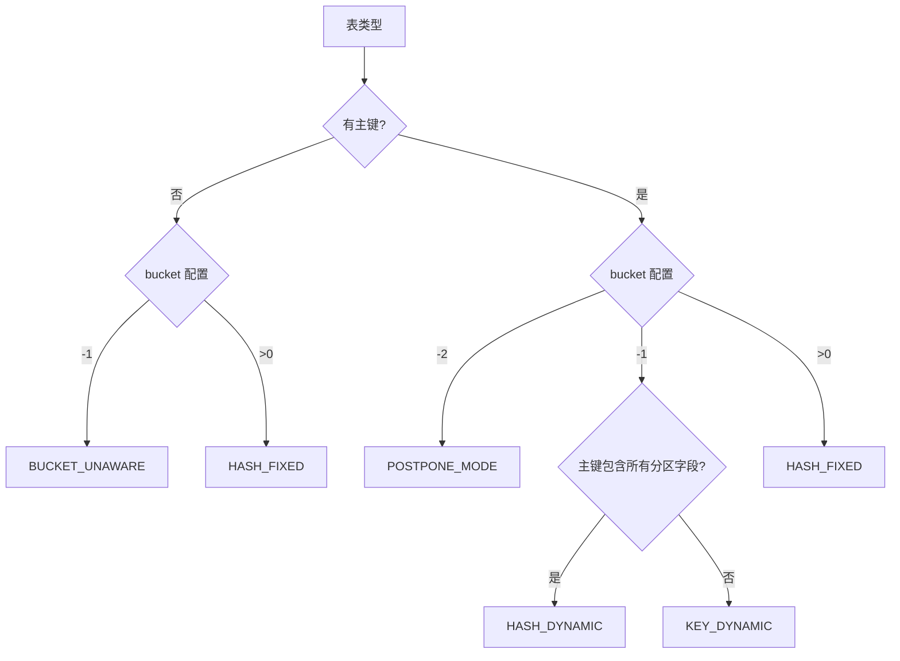
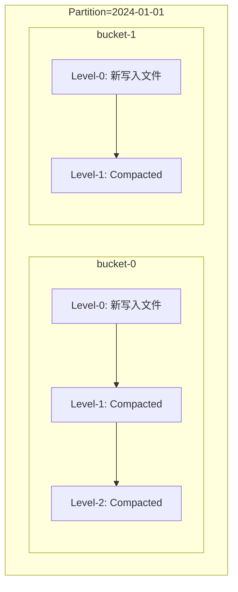
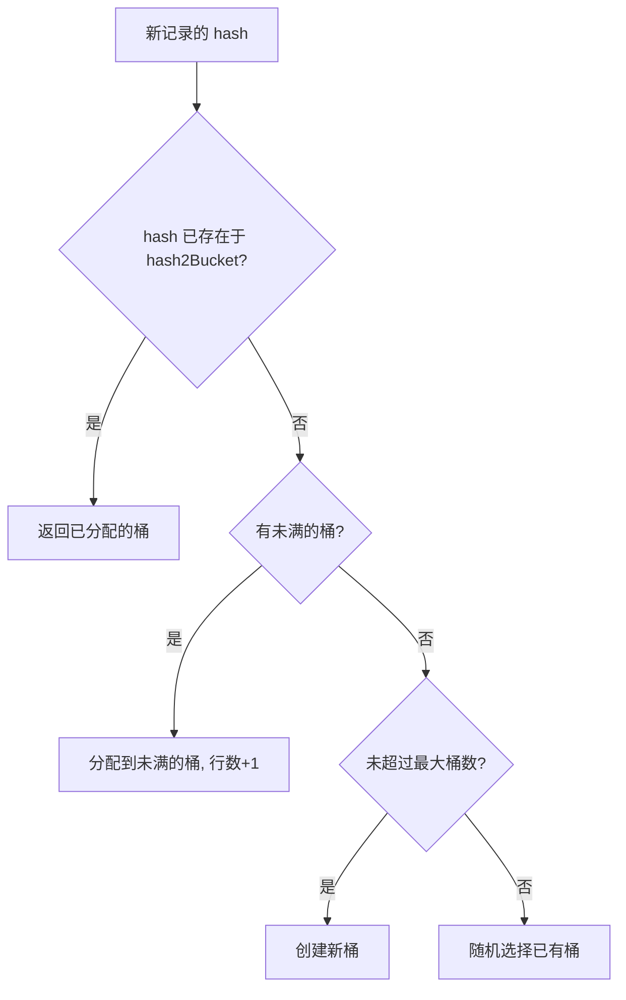
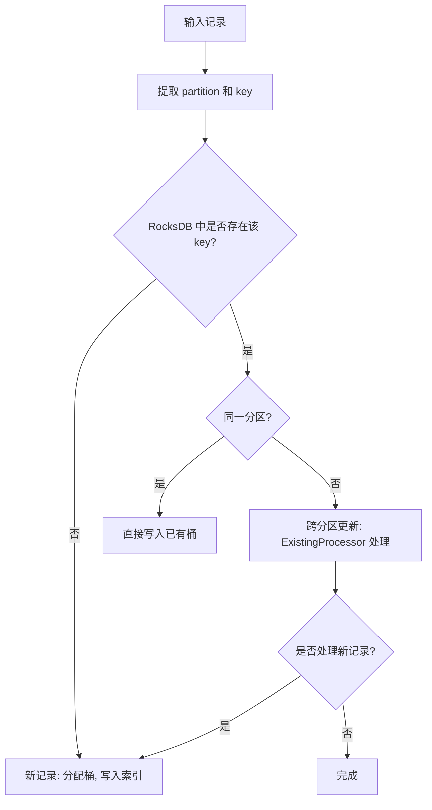
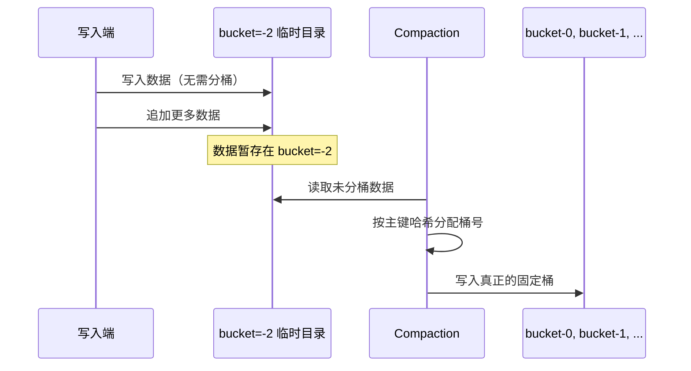
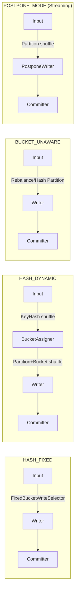

# Apache Paimon 分桶(Bucket)机制原理与实践

> 基于 Paimon 1.5-SNAPSHOT 源码分析，commit: 55f4fd175

---

## 目录

- [1. 为什么需要分桶](#1-为什么需要分桶)
- [2. BucketMode 五种模式总览](#2-bucketmode-五种模式总览)
- [3. HASH_FIXED 模式：固定桶](#3-hash_fixed-模式固定桶)
  - [3.1 哈希计算逻辑](#31-哈希计算逻辑)
  - [3.2 bucket-key 的选择](#32-bucket-key-的选择)
  - [3.3 三种 BucketFunction 实现](#33-三种-bucketfunction-实现)
  - [3.4 桶数量对并行度和文件数量的影响](#34-桶数量对并行度和文件数量的影响)
  - [3.5 每个桶内部是独立的 LSM-Tree](#35-每个桶内部是独立的-lsm-tree)
- [4. HASH_DYNAMIC 模式：动态桶](#4-hash_dynamic-模式动态桶)
  - [4.1 动态桶的分配算法](#41-动态桶的分配算法)
  - [4.2 PartitionIndex 核心数据结构](#42-partitionindex-核心数据结构)
  - [4.3 关键参数](#43-关键参数)
  - [4.4 索引维护 HashIndexFile](#44-索引维护-hashindexfile)
- [5. KEY_DYNAMIC 模式：跨分区更新](#5-key_dynamic-模式跨分区更新)
  - [5.1 全局主键索引的 RocksDB 存储](#51-全局主键索引的-rocksdb-存储)
  - [5.2 Bootstrap 流程](#52-bootstrap-流程)
  - [5.3 与 HASH_DYNAMIC 的区别](#53-与-hash_dynamic-的区别)
- [6. BUCKET_UNAWARE 模式：追加表](#6-bucket_unaware-模式追加表)
- [7. POSTPONE_MODE 模式：延迟分桶](#7-postpone_mode-模式延迟分桶)
  - [7.1 延迟分桶到 Compaction 阶段的原理](#71-延迟分桶到-compaction-阶段的原理)
  - [7.2 PostponeBucketWriter 写入逻辑](#72-postponebucketwriter-写入逻辑)
  - [7.3 BucketFiles 合并管理](#73-bucketfiles-合并管理)
- [8. 分桶与 Flink/Spark 并行度关系](#8-分桶与-flinkspark-并行度关系)
  - [8.1 Flink 的数据分发](#81-flink-的数据分发)
  - [8.2 Spark 的 Bucketed Scan](#82-spark-的-bucketed-scan)
  - [8.3 动态桶模式下的 Channel 分配](#83-动态桶模式下的-channel-分配)
- [9. 分桶与查询优化](#9-分桶与查询优化)
  - [9.1 Manifest 级别的桶裁剪](#91-manifest-级别的桶裁剪)
  - [9.2 BucketSelector 谓词下推](#92-bucketselector-谓词下推)
- [10. 分桶数量选择的最佳实践](#10-分桶数量选择的最佳实践)
- [11. 与 Iceberg 的分区/分桶机制对比](#11-与-iceberg-的分区分桶机制对比)

---

## 1. 为什么需要分桶

分桶(Bucket)是 Paimon 存储引擎中**最核心的数据组织维度之一**。在分区(Partition)之下，Paimon 通过分桶进一步将数据切分为更小的管理单元。理解分桶机制是理解 Paimon 读写路径的前提。

### 1.1 分桶解决的三个核心问题

| 问题 | 为什么需要分桶来解决 | 好处 |
|------|---------------------|------|
| **写并行度控制** | 每个 bucket 是一个独立的写入单元（对应一个 Writer），通过 `partition + bucket` 确定唯一写入者 | 多个 Writer 并行写入互不干扰，写吞吐随桶数线性增长 |
| **数据局部性** | 相同主键哈希到同一个 bucket，同一 bucket 内的数据存储在同一目录下 | 读取时只需扫描目标 bucket，减少 I/O；合并(Compaction)只在 bucket 内部进行，降低资源消耗 |
| **主键唯一性保证** | 对于主键表，相同主键的所有记录必须路由到同一个 bucket | 保证 LSM-Tree 合并时能正确去重/更新，无需全局协调即可保证主键唯一性 |

### 1.2 存储路径结构

分桶体现在 Paimon 的物理存储路径上：

```
table_path/
  partition=xxx/
    bucket-0/          -- 第0个桶
      data-xxx.parquet -- LSM-Tree 的数据文件
      data-yyy.parquet
    bucket-1/          -- 第1个桶
      data-zzz.parquet
    bucket-2/
      ...
```

**设计决策**：每个 `(partition, bucket)` 组合是独立的 LSM-Tree（主键表）或文件集合（追加表）。

**为什么**：这种设计使得写入、合并、读取都可以在 `(partition, bucket)` 粒度上并行化，无需全局锁。

**好处**：极大简化了并发控制，提升了分布式环境下的伸缩能力。

---

## 2. BucketMode 五种模式总览

Paimon 通过 `BucketMode` 枚举定义了五种分桶策略。

> 源码路径：`paimon-common/.../table/BucketMode.java`

```java
public enum BucketMode {
    HASH_FIXED,       // 固定桶数，用户指定 bucket=N (N>0)
    HASH_DYNAMIC,     // 动态桶，bucket=-1，主键表，分区内唯一
    KEY_DYNAMIC,      // 跨分区动态桶，bucket=-1，主键不包含所有分区字段
    BUCKET_UNAWARE,   // 无桶概念，bucket=-1，仅追加表
    POSTPONE_MODE;    // 延迟分桶，bucket=-2，主键表

    public static final int UNAWARE_BUCKET = 0;
    public static final int POSTPONE_BUCKET = -2;
}
```

### 模式选择的判定逻辑

模式的判定分布在两个 FileStore 实现中：

**KeyValueFileStore（主键表）**：

> 源码路径：`paimon-core/.../KeyValueFileStore.java` 第 91-100 行

```java
public BucketMode bucketMode() {
    int bucket = options.bucket();
    switch (bucket) {
        case -2:
            return BucketMode.POSTPONE_MODE;
        case -1:
            return crossPartitionUpdate ? BucketMode.KEY_DYNAMIC : BucketMode.HASH_DYNAMIC;
        default:
            return BucketMode.HASH_FIXED;
    }
}
```

**AppendOnlyFileStore（追加表）**：

> 源码路径：`paimon-core/.../AppendOnlyFileStore.java` 第 66-68 行

```java
public BucketMode bucketMode() {
    return options.bucket() == -1 ? BucketMode.BUCKET_UNAWARE : BucketMode.HASH_FIXED;
}
```

### 模式判定流程图



### 五种模式对比

| 维度 | HASH_FIXED | HASH_DYNAMIC | KEY_DYNAMIC | BUCKET_UNAWARE | POSTPONE_MODE |
|------|-----------|-------------|-------------|---------------|---------------|
| 适用表类型 | 主键/追加 | 仅主键 | 仅主键 | 仅追加 | 仅主键 |
| bucket 配置 | N (>0) | -1 | -1 | -1 | -2 |
| 桶数确定时机 | 建表时 | 写入时动态 | 写入时动态 | 无桶 | Compaction时 |
| 是否支持桶裁剪 | 是 | 否 | 否 | 否 | 是(Compaction后) |
| 是否支持并发写 | 是 | 否 | 否 | 是 | 是 |
| 索引开销 | 无 | HashIndexFile | RocksDB | 无 | 无 |
| 跨分区更新 | 否 | 否 | 是 | N/A | 否 |

---

## 3. HASH_FIXED 模式：固定桶

### 3.1 哈希计算逻辑

`FixedBucketRowKeyExtractor` 是固定桶模式下提取记录所属桶的核心类。

> 源码路径：`paimon-core/.../table/sink/FixedBucketRowKeyExtractor.java`

```java
public int bucket() {
    BinaryRow bucketKey = bucketKey();
    if (reuseBucket == null) {
        reuseBucket = bucketFunction.bucket(bucketKey, numBuckets);
    }
    return reuseBucket;
}
```

计算流程：
1. 从记录中投影出 `bucketKey` 字段（通过 `bucketKeyProjection`）
2. 调用 `BucketFunction.bucket(bucketKey, numBuckets)` 计算桶号

**设计决策**：`FixedBucketRowKeyExtractor` 有一个优化路径：当 `bucketKeys` 与 `trimmedPrimaryKeys` 相同时，直接复用已计算的 `trimmedPrimaryKey`，避免重复投影。

> `sameBucketKeyAndTrimmedPrimaryKey = schema.bucketKeys().equals(schema.trimmedPrimaryKeys());`

**为什么**：大多数情况下用户不会单独设置 `bucket-key`，此时 bucket key 默认就是 trimmedPrimaryKeys，这个优化避免了重复的内存分配和投影计算。

### 3.2 bucket-key 的选择

> 源码路径：`paimon-api/.../schema/TableSchema.java` 构造函数第 122-126 行

```java
// try to validate and initialize the bucket keys
List<String> tmpBucketKeys = originalBucketKeys();
if (tmpBucketKeys.isEmpty()) {
    tmpBucketKeys = trimmedPrimaryKeys();
}
bucketKeys = tmpBucketKeys;
```

规则：
- 如果用户通过 `'bucket-key' = 'col1,col2'` 显式指定了 bucket key，则使用用户指定的
- 否则，默认使用 **trimmedPrimaryKeys**（即主键去掉分区字段后的部分）
- 对于追加表，bucket key 由 `originalBucketKeys()` 决定

**为什么用 trimmedPrimaryKeys 而不是完整主键**：分区字段已经将数据隔离到不同目录，在分区内部做哈希时不需要再包含分区字段，否则同一分区内所有记录的分区字段都相同，对哈希分布没有贡献。

**好处**：减少参与哈希计算的字段数，提高计算效率；更重要的是保证语义正确。

### 3.3 三种 BucketFunction 实现

> 源码路径：`paimon-core/.../bucket/BucketFunction.java`

通过 `CoreOptions.BUCKET_FUNCTION_TYPE` 配置选择：

| 类型 | 实现类 | 算法 | 适用场景 |
|------|-------|------|---------|
| `DEFAULT` | `DefaultBucketFunction` | `Math.abs(row.hashCode() % numBuckets)` | 通用默认 |
| `MOD` | `ModBucketFunction` | `Math.floorMod(bucketKeyValue, numBuckets)` | 单字段 INT/BIGINT，需精确控制分布 |
| `HIVE` | `HiveBucketFunction` | Hive 兼容的哈希算法 | 与 Hive 表互操作 |

#### DefaultBucketFunction

> 源码路径：`paimon-core/.../bucket/DefaultBucketFunction.java`

```java
public int bucket(BinaryRow row, int numBuckets) {
    int hash = row.hashCode();
    return Math.abs(hash % numBuckets);
}
```

**设计决策**：使用 `BinaryRow.hashCode()`，这是对整行二进制数据的哈希。

**为什么**：`BinaryRow` 的 hashCode 直接对底层 `MemorySegment` 做 Murmur hash，效率极高，且对多字段组合键自然支持。

#### ModBucketFunction

> 源码路径：`paimon-core/.../bucket/ModBucketFunction.java`

```java
public int bucket(BinaryRow row, int numBuckets) {
    if (bucketKeyTypeRoot == DataTypeRoot.INTEGER) {
        return Math.floorMod(row.getInt(0), numBuckets);
    } else if (bucketKeyTypeRoot == DataTypeRoot.BIGINT) {
        return (int) Math.floorMod(row.getLong(0), numBuckets);
    }
}
```

**约束**：bucket key 必须是**单个字段**且类型为 `INT` 或 `BIGINT`。

**为什么**：`Math.floorMod` 对负数的处理比 `%` 更合理（始终返回非负数），适合 ID 类字段的均匀分布。

**好处**：当 bucket key 是自增 ID 时，Mod 方式能保证更均匀的数据分布。

#### HiveBucketFunction

> 源码路径：`paimon-core/.../bucket/HiveBucketFunction.java`

使用 Hive 兼容的哈希算法（`31 * hash + fieldHash`），通过 `HiveHasher` 计算各类型的哈希值。

**为什么**：确保 Paimon 表和 Hive 表使用相同的 bucket 分配策略，支持直接通过 Hive 读取 Paimon 的分桶表。

### 3.4 桶数量对并行度和文件数量的影响

桶数量直接决定了：

| 影响维度 | 公式/关系 | 说明 |
|---------|----------|------|
| 写并行度上限 | `max_write_parallelism = num_partitions * num_buckets` | 每个 (partition, bucket) 对应一个 Writer |
| 文件数量下限 | `min_files >= num_partitions * num_buckets` | 每个 bucket 至少有 1 个活跃文件 |
| 读并行度 | `read_parallelism = num_splits`（由 Split 生成策略决定） | bucket 内文件可能被合并为一个 Split |
| Flink Writer 分发 | `channel = (startChannel(partition) + bucket) % numWriters` | 见 3.5 节 |

**设计决策**：Paimon 在 `FlinkSinkBuilder.buildForFixedBucket()` 中会自动检查：对于无分区表，如果 `bucketNums < input.getParallelism()`，会自动将 Writer 并行度降为 `bucketNums`。

> 源码路径：`paimon-flink/.../sink/FlinkSinkBuilder.java` 第 272-287 行

**为什么**：多余的 Writer 实例不会分配到任何 bucket，会浪费资源。

### 3.5 每个桶内部是独立的 LSM-Tree

对于主键表，每个 `(partition, bucket)` 下维护一棵独立的 LSM-Tree：



**为什么每个 bucket 独立**：
1. 保证同一主键的所有记录都在一棵 LSM-Tree 中，合并时可以正确去重
2. Compaction 在 bucket 粒度进行，互不干扰，可并行执行
3. 读取时可以只扫描目标 bucket 的 LSM-Tree

**好处**：这种设计使得 Compaction 的粒度更小、效率更高，不会因为某个热点 bucket 的 Compaction 阻塞其他 bucket 的读写。

---

## 4. HASH_DYNAMIC 模式：动态桶

当设置 `'bucket' = '-1'` 且主键包含所有分区字段时，启用 `HASH_DYNAMIC` 模式。

### 4.1 动态桶的分配算法

核心类 `HashBucketAssigner` 负责将主键哈希分配到动态生成的桶中。

> 源码路径：`paimon-core/.../index/HashBucketAssigner.java`

```java
public int assign(BinaryRow partition, int hash) {
    PartitionIndex index = this.partitionIndex.get(partition);
    if (index == null) {
        partition = partition.copy();
        index = loadIndex(partition, partitionHash);
        this.partitionIndex.put(partition, index);
    }
    int assigned = index.assign(hash, this::isMyBucket, maxBucketsNum, maxBucketId);
    return assigned;
}
```

**设计决策**：使用 `int hash`（而非完整的主键）来做桶分配。

**为什么**：存储完整主键的索引在大数据量下内存开销巨大。使用哈希值有一定碰撞概率，但可以将索引内存需求压缩到可接受范围。

**好处**：用 `Int2ShortHashMap`（int -> short 的映射）存储哈希到桶的映射，内存效率极高。

### 4.2 PartitionIndex 核心数据结构

> 源码路径：`paimon-core/.../index/PartitionIndex.java`

```java
public class PartitionIndex {
    public final Int2ShortHashMap hash2Bucket;          // 哈希值 -> 桶号
    public final Map<Integer, Long> nonFullBucketInformation; // 桶号 -> 当前行数
    public final Set<Integer> totalBucketSet;            // 所有已创建的桶
    private final long targetBucketRowNumber;           // 目标行数
}
```

分配算法（`assign` 方法）的四步策略：



**步骤详解**（第 70-118 行）：
1. **查找已知 hash**：如果该 hash 值之前出现过，直接返回之前分配的桶
2. **查找未满桶**：遍历 `nonFullBucketInformation`，找行数 < `targetBucketRowNumber` 的桶
3. **创建新桶**：如果所有桶都满了且未超过上限，创建新桶（编号递增，跳过不属于当前 Assigner 的桶）
4. **随机溢出**：如果超过最大桶数限制，随机选择一个已有桶

**为什么有步骤4**：`dynamic-bucket.max-buckets` 参数允许用户设置上限，防止数据倾斜导致桶数无限增长。

### 4.3 关键参数

| 参数 | 默认值 | 说明 | 源码位置 |
|------|--------|------|---------|
| `dynamic-bucket.target-row-num` | 2,000,000 | 每个桶的目标行数，达到此值后创建新桶 | `CoreOptions.DYNAMIC_BUCKET_TARGET_ROW_NUM` |
| `dynamic-bucket.initial-buckets` | 无 | 初始 assigner 数量，影响 Flink 算子初始通道数 | `CoreOptions.DYNAMIC_BUCKET_INITIAL_BUCKETS` |
| `dynamic-bucket.max-buckets` | -1 (无限) | 每个分区的最大桶数上限 | `CoreOptions.DYNAMIC_BUCKET_MAX_BUCKETS` |
| `dynamic-bucket.assigner-parallelism` | 无 | Assigner 算子并行度 | `CoreOptions.DYNAMIC_BUCKET_ASSIGNER_PARALLELISM` |

**设计决策**：`target-row-num` 默认 200 万行。

**为什么**：一个桶内的 LSM-Tree 存储约 200 万行，文件大小大约在数百 MB 量级，是 Compaction 效率和读取效率的平衡点。过小导致桶太多、索引开销大；过大导致单桶合并耗时长。

### 4.4 索引维护 HashIndexFile

> 源码路径：`paimon-core/.../index/HashIndexFile.java`

`HashIndexFile` 用于持久化存储 hash -> bucket 的映射关系：

```java
public class HashIndexFile extends IndexFile {
    public static final String HASH_INDEX = "HASH";

    public IntIterator read(IndexFileMeta file) throws IOException {
        return readInts(fileIO, pathFactory.toPath(file));
    }

    public IndexFileMeta write(IntIterator input) throws IOException {
        Path path = pathFactory.newPath();
        int count = writeInts(fileIO, path, input);
        return new IndexFileMeta(HASH_INDEX, path.getName(), fileSize(path), count, ...);
    }
}
```

`DynamicBucketIndexMaintainer` 负责每个 bucket 的索引维护：

> 源码路径：`paimon-core/.../index/DynamicBucketIndexMaintainer.java`

```java
public void notifyNewRecord(KeyValue record) {
    InternalRow key = record.key();
    boolean changed = hashcode.add(key.hashCode());
    if (changed) {
        modified = true;
    }
}
```

每次写入新记录时，将 key 的 hashCode 加入 `IntHashSet`。在 `prepareCommit` 时，如果有变化则将整个 hashcode 集合写出为新的索引文件。

**为什么不存完整 key**：hash -> bucket 的映射只需要存储 int 值，文件极小（每条记录 4 字节），加载速度快。

**好处**：索引文件紧凑，启动时加载快；但代价是存在哈希碰撞的可能。

---

## 5. KEY_DYNAMIC 模式：跨分区更新

当主键不包含所有分区字段时（即 `crossPartitionUpdate() == true`），设置 `bucket = -1` 进入 `KEY_DYNAMIC` 模式。

### 5.1 全局主键索引的 RocksDB 存储

> 源码路径：`paimon-core/.../crosspartition/GlobalIndexAssigner.java`

`GlobalIndexAssigner` 使用 **RocksDB** 维护全局主键索引：

```java
// state
this.keyIndex = stateFactory.valueState(
    INDEX_NAME,
    new RowCompactedSerializer(keyType),
    new PositiveIntIntSerializer(),    // 存储 (partitionId, bucketId)
    options.get(RocksDBOptions.LOOKUP_CACHE_ROWS));
```

索引结构：`primaryKey -> (partitionId, bucketId)`

**处理逻辑**（`processInput` 方法，第 243-272 行）：



**设计决策**：使用 RocksDB 而非内存哈希表。

**为什么**：跨分区更新需要存储**完整的主键到分区+桶的映射**（不能像 HASH_DYNAMIC 那样只存 hash），数据量可能很大。RocksDB 提供了持久化的 KV 存储，支持超过内存的数据量。

**好处**：可以处理超大规模数据的全局唯一性保证；支持 TTL（`cross-partition-upsert.index-ttl`）自动清理过期索引。

### 5.2 Bootstrap 流程

> 源码路径：`paimon-core/.../crosspartition/IndexBootstrap.java`

写入作业启动时，需要从表中读取所有已存在的 key 来构建 RocksDB 索引：

```java
public RecordReader<InternalRow> bootstrap(int numAssigners, int assignId) {
    ReadBuilder readBuilder = table.copy(...)
            .newReadBuilder()
            .withProjection(keyProjection);    // 只读主键字段
    DataTableScan tableScan = (DataTableScan) readBuilder.newScan();
    List<Split> splits = tableScan
            .withBucketFilter(bucket -> bucket % numAssigners == assignId)
            .withLevelFilter(level -> true)    // 包含所有层级
            .plan().splits();
    // 支持 TTL 过滤
    if (indexTtl != null) {
        splits = splits.stream()
                .filter(split -> filterSplit(split, indexTtlMillis, currentTime))
                .collect(Collectors.toList());
    }
    return parallelExecute(...);  // 并行读取
}
```

**GlobalIndexAssigner** 的 bootstrap 使用 `BinaryExternalSortBuffer` 对 key 排序后通过 `RocksDBBulkLoader` 批量加载：

```java
public void bootstrapKey(InternalRow value) {
    BinaryRow key = keyPartExtractor.trimmedPrimaryKey(value);
    int partId = partMapping.index(partition);
    int bucket = value.getInt(bucketIndex);
    bucketAssigner.bootstrapBucket(partition, bucket);
    bootstrapKeys.write(GenericRow.of(keyIndex.serializeKey(key), keyIndex.serializeValue(partAndBucket)));
}
```

**为什么需要 Bulk Load**：RocksDB 的 bulk load 比逐条 put 快一个数量级，因为跳过了 WAL 和 memtable 刷写。

**好处**：大幅缩短作业启动时间。

### 5.3 与 HASH_DYNAMIC 的区别

| 维度 | HASH_DYNAMIC | KEY_DYNAMIC |
|------|-------------|-------------|
| 索引存储 | HashIndexFile（内存 + 文件） | RocksDB（本地磁盘） |
| 索引键 | hash(primaryKey) (int) | 完整 primaryKey (bytes) |
| 索引值 | bucket (short) | (partitionId, bucketId) |
| 跨分区更新 | 不支持 | 支持 |
| 启动开销 | 较低（加载哈希索引文件） | 较高（全量扫描所有 key + RocksDB bulk load） |
| 内存/磁盘需求 | 低 | 高（RocksDB 需要 off-heap 内存和磁盘） |
| 碰撞风险 | 存在（hash 碰撞可能导致不同 key 分到同一桶） | 无 |
| 并发写入 | 不支持 | 不支持 |

---

## 6. BUCKET_UNAWARE 模式：追加表

当追加表设置 `'bucket' = '-1'` 时进入此模式。

> 源码路径：`paimon-core/.../AppendOnlyFileStore.java` 第 66-68 行

**核心特征**：
- 所有数据写入 `bucket-0` 目录（`BucketMode.UNAWARE_BUCKET = 0`）
- 读写并行度不受桶数限制
- 没有桶裁剪能力
- 写入时无需按桶分发，使用 Rebalance 分发

**为什么需要这个模式**：追加表没有主键，不需要保证唯一性，因此不需要按 key 分桶。强制分桶反而会限制写入并行度。

**好处**：写入吞吐最大化；读取时通过文件大小自动切分 Split，并行度灵活。

**适用场景**：日志、事件、行为数据等只追加不更新的场景。

---

## 7. POSTPONE_MODE 模式：延迟分桶

当主键表设置 `'bucket' = '-2'` 时进入此模式。这是 Paimon 0.9+ 引入的新模式。

### 7.1 延迟分桶到 Compaction 阶段的原理

**核心思想**：写入阶段不做分桶，所有数据先写入 `bucket = -2` 的临时目录；后台 Compaction 时再将数据分配到真正的固定桶中。



**设计决策**：写入阶段用 Avro 格式存储。

> 源码路径：`paimon-core/.../postpone/PostponeBucketFileStoreWrite.java` 第 106-110 行

```java
// use avro for postpone bucket
AvroSchemaConverter.convertToSchema(schema.logicalRowType(), new HashMap<>());
newOptions.set(CoreOptions.FILE_FORMAT, "avro");
newOptions.set(CoreOptions.METADATA_STATS_MODE, "none");
```

**为什么用 Avro**：Avro 写入速度快（顺序写、无需构建列式索引），而这些临时文件只需要被顺序读取一次（Compaction 时），不需要列裁剪或谓词下推。

**好处**：最大化写入吞吐；Compaction 阶段可以根据实际数据量自适应决定桶数。

### 7.2 PostponeBucketWriter 写入逻辑

> 源码路径：`paimon-core/.../postpone/PostponeBucketWriter.java`

```java
public void write(KeyValue record) throws Exception {
    validateRetract(record);
    boolean success = sinkWriter.write(record);
    if (!success) {
        flush();
        success = sinkWriter.write(record);
    }
}
```

**关键设计**：
- `PostponeBucketWriter` 不做 Compaction（`compact` 方法为空）
- 每个 Writer 使用唯一前缀标识文件，确保同一 Writer 的文件可以被同一 Compaction Reader 按序消费
- 支持内存缓冲 + 磁盘溢写（`BufferedSinkWriter`）

> 文件名前缀格式（第 120-122 行）：
> ```
> {dataFilePrefix}-u-{commitUser}-s-{writeId}-w-
> ```
> 注: 当 `writeId == null` 时使用随机数代替

**为什么需要唯一前缀**：Compaction 阶段需要保持记录的写入顺序（相同 key 的 update 必须按序处理），通过前缀可以将同一 Writer 的所有文件路由到同一个 Compaction Reader。

### 7.3 BucketFiles 合并管理

> 源码路径：`paimon-core/.../postpone/BucketFiles.java`

`BucketFiles` 跟踪每个真实桶的文件变更，在 Compaction 完成后生成 `CommitMessage`：

```java
public CommitMessageImpl makeMessage(BinaryRow partition, int bucket) {
    List<DataFileMeta> realCompactAfter = new ArrayList<>(newFiles.values());
    realCompactAfter.addAll(compactAfter);
    return new CommitMessageImpl(
        partition, bucket, totalBuckets,
        DataIncrement.emptyIncrement(),
        new CompactIncrement(compactBefore, realCompactAfter, changelogFiles, ...));
}
```

**PostponeUtils 辅助工具**：

> 源码路径：`paimon-core/.../table/PostponeUtils.java`

- `getKnownNumBuckets(table)`：扫描已有数据文件，获取每个分区已知的桶数
- `tableForFixBucketWrite(table)`：创建临时表配置（设置 `bucket=1` + `write-only=true`），用于 Compaction 阶段的固定桶写入
- `tableForCommit(table)`：创建提交用的表配置

---

## 8. 分桶与 Flink/Spark 并行度关系

### 8.1 Flink 的数据分发

Flink 通过 `FlinkStreamPartitioner` 将数据按 `(partition, bucket)` 分发到不同的 Writer 实例。

> 源码路径：`paimon-flink/.../sink/FlinkStreamPartitioner.java`

核心的 Channel 计算逻辑在 `ChannelComputer.select()`：

> 源码路径：`paimon-core/.../table/sink/ChannelComputer.java`

```java
static int select(BinaryRow partition, int bucket, int numChannels) {
    return (startChannel(partition, numChannels) + bucket) % numChannels;
}

static int startChannel(BinaryRow partition, int numChannels) {
    int hashCode = partition.hashCode();
    if (hashCode == Integer.MIN_VALUE) {
        hashCode = Integer.MAX_VALUE;
    }
    return Math.abs(hashCode) % numChannels;
}
```

**设计决策**：使用 `partition.hashCode() % numChannels` 作为起始通道，然后加上 `bucket` 偏移。

**为什么**：
1. 同一分区的不同 bucket 会被分配到相邻的 Channel（起始点相同，偏移不同）
2. 不同分区的起始 Channel 不同，实现分区间的负载分散
3. 保证相同 `(partition, bucket)` 的数据始终路由到同一个 Writer

**各模式的 Flink Pipeline 拓扑**：



### 8.2 Spark 的 Bucketed Scan

Paimon 通过 Spark DataSource V2 API 的 `SupportsReportPartitioning` 接口向 Spark 报告分桶信息。

> 源码路径：`paimon-spark/.../spark/PaimonScan.scala`

```scala
override def outputPartitioning: Partitioning = {
    extractBucketTransform
        .map(bucket => new KeyGroupedPartitioning(Array(bucket), inputPartitions.size))
        .getOrElse(new UnknownPartitioning(0))
}
```

**启用条件**：
1. `BucketMode == HASH_FIXED`
2. `BucketFunctionType == DEFAULT`
3. **bucket key 只有一个字段**（Spark 限制）
4. Spark 配置 `spark.sql.sources.v2.bucketing.enabled = true`

**为什么限制单字段 bucket key**：Spark 的 `Expressions.bucket(num, column)` 只接受单个列作为输入，Paimon 目前未实现多列的 Transform 适配。

**DisableUnnecessaryPaimonBucketedScan 优化**：

> 源码路径：`paimon-spark/.../execution/adaptive/DisableUnnecessaryPaimonBucketedScan.scala`

当 Bucketed Scan 对查询计划没有实际帮助时（如没有 Join/Aggregate 利用分桶），自动禁用以避免不必要的约束。

```scala
// 禁用条件：
// 1. 从根到 Bucketed Scan 没有需要特定分布的算子
// 2. 从最近的需要分布的算子到 Bucketed Scan 之间有 Exchange
```

### 8.3 动态桶模式下的 Channel 分配

动态桶模式下 Flink 使用**两级 shuffle**：

> 源码路径：`paimon-flink/.../sink/DynamicBucketSink.java` 第 75-117 行

```
input 
  --[第1级: KeyHash shuffle]--> BucketAssigner 
  --[第2级: Partition+Bucket shuffle]--> Writer 
  --> Committer
```

第一级 shuffle（`RowAssignerChannelComputer`）：按 `(partitionHash, keyHash)` 分发，确保相同 key 到达同一个 Assigner。

> 源码路径：`paimon-core/.../index/BucketAssigner.java` 第 40-42 行

```java
static int computeAssigner(int partitionHash, int keyHash, int numChannels, int numAssigners) {
    return computeHashKey(partitionHash, keyHash, numChannels, numAssigners) % numChannels;
}
```

第二级 shuffle（`RowWithBucketChannelComputer`）：Assigner 输出 `Tuple2<Row, Bucket>`，按 `(partition, bucket)` 分发到 Writer。

**为什么需要两级**：Assigner 需要维护全局索引来分配桶号，但 Writer 需要按 `(partition, bucket)` 聚合。两个阶段的数据分发模式不同。

---

## 9. 分桶与查询优化

### 9.1 Manifest 级别的桶裁剪

`ManifestFileMeta` 记录了每个 Manifest 文件包含的桶范围：

> 源码路径：`paimon-core/.../manifest/ManifestFileMeta.java` 第 68-69 行

```java
private final @Nullable Integer minBucket;
private final @Nullable Integer maxBucket;
```

`ManifestsReader` 在读取 Manifest 文件列表时，利用这些信息跳过不相关的 Manifest：

> 源码路径：`paimon-core/.../operation/ManifestsReader.java` 第 166-177 行

```java
private boolean filterManifestFileMeta(ManifestFileMeta manifest) {
    Integer minBucket = manifest.minBucket();
    Integer maxBucket = manifest.maxBucket();
    if (minBucket != null && maxBucket != null) {
        if (onlyReadRealBuckets && maxBucket < 0) {
            return false;
        }
        if (specifiedBucket != null
                && (specifiedBucket < minBucket || specifiedBucket > maxBucket)) {
            return false;
        }
    }
    ...
}
```

**设计决策**：在 Manifest 元数据中存储 bucket 范围。

**为什么**：一个 Manifest 文件可能记录了多个桶的数据文件。通过 minBucket/maxBucket 范围判断，可以在不解析 Manifest 文件内容的情况下直接跳过。

**好处**：对于大表（上千个桶），能显著减少需要读取和解析的 Manifest 文件数量。

### 9.2 BucketSelector 谓词下推

`BucketSelector` 从 SQL 的 WHERE 条件中提取 bucket key 的值，预计算出目标桶号集合。

> 源码路径：`paimon-core/.../operation/BucketSelector.java`

```java
public boolean test(BinaryRow partition, Integer bucket, Integer numBucket) {
    return partitionSelectors
        .computeIfAbsent(partition, this::createPartitionSelector)
        .map(selector -> selector.test(bucket, numBucket))
        .orElse(true);
}
```

**工作原理**：
1. 从谓词中分离出分区过滤条件，用分区值替换分区字段
2. 提取剩余谓词中 bucket key 相关的 Equal/In 条件
3. 组装所有可能的 bucket key 值，通过 `BucketFunction.bucket()` 计算目标桶集合
4. 扫描时只读取目标桶集合内的数据

**转换入口**：

> 源码路径：`paimon-core/.../operation/BucketSelectConverter.java` 第 55-72 行

```java
public Optional<TriFilter<BinaryRow, Integer, Integer>> convert(Predicate predicate) {
    if (bucketMode != BucketMode.HASH_FIXED && bucketMode != BucketMode.POSTPONE_MODE) {
        return Optional.empty();
    }
    if (!predicateFields.containsAll(bucketKeyType.getFieldNames())) {
        return Optional.empty();
    }
    return Optional.of(new BucketSelector(predicate, bucketFunctionType, ...));
}
```

**约束**：
1. 只对 `HASH_FIXED` 和 `POSTPONE_MODE`（Compaction 后）有效
2. 谓词必须包含所有 bucket key 字段的等值/IN 条件
3. 组合值数量不超过 `MAX_VALUES = 1000`

**为什么只支持 HASH_FIXED 和 POSTPONE_MODE**：动态桶模式的 hash -> bucket 映射不是确定性的（取决于写入顺序），无法从 bucket key 值反推桶号。

**好处**：对于 `WHERE bucket_key = xxx` 这类查询，可以将读取范围从全表缩小到一个桶，I/O 减少 N 倍（N = 桶数）。

---

## 10. 分桶数量选择的最佳实践

### 10.1 估算公式

对于固定桶模式，推荐的桶数估算：

```
bucket_num = ceil(单分区数据量 / 单桶目标大小)
```

其中单桶目标大小建议 **200MB ~ 1GB**（取决于文件格式和压缩率）。

例如：
- 单分区每天 100GB 数据
- 选择目标 500MB/桶
- 推荐 `bucket = 200`

### 10.2 过多/过少的影响

| 问题 | 桶数过少 | 桶数过多 |
|------|---------|---------|
| 写入 | 单桶数据量大，Compaction 耗时长 | Writer 实例多，内存开销大 |
| 读取 | 每个 Split 数据量大，延迟高 | 小文件多，元数据开销大 |
| 并行度 | 写入并行度受限 | 很多 Writer 可能空闲 |
| 存储 | 单文件过大 | 小文件问题 |

### 10.3 如何修改已有表的桶数量

对于固定桶表，修改桶数需要重新组织数据。Paimon 不支持在线 rescale bucket，需要通过以下方式：

1. **方式一**：创建新表后重写数据
   ```sql
   ALTER TABLE old_table SET ('bucket' = '新桶数');
   -- 然后执行 INSERT OVERWRITE 重写数据
   ```

2. **方式二**：使用 POSTPONE_MODE 避免此问题
   - 设置 `'bucket' = '-2'`，后台 Compaction 自动决定每个分区的桶数

**设计建议**：
- 如果数据量稳定且可预测，使用固定桶
- 如果数据量波动大或难以预估，使用动态桶（`bucket = -1`）或延迟桶（`bucket = -2`）

---

## 11. 与 Iceberg 的分区/分桶机制对比

| 维度 | Paimon | Iceberg |
|------|--------|---------|
| 分桶定位 | 存储引擎核心机制，决定数据分布和主键唯一性 | 分区 Transform 的一种（`bucket(N, col)`），仅影响文件组织 |
| 与主键关系 | 分桶是主键唯一性保证的基础（同 key 同桶） | Iceberg 无主键概念，分桶仅用于优化 |
| 动态调整 | HASH_DYNAMIC / POSTPONE_MODE 支持自动调整 | 通过 Partition Evolution 修改分区策略（对已有数据不追溯） |
| 桶内结构 | 每个桶是独立的 LSM-Tree（主键表） | 每个桶是普通的数据文件集合 |
| 并行度控制 | 桶数直接决定写入并行度 | 写入并行度独立于分桶 |
| 查询裁剪 | BucketSelector 从 WHERE 条件反推桶号 | Iceberg 通过 Partition pruning 利用 bucket 值 |
| 隐藏分区 | 桶是显式概念，体现在存储路径中 | bucket 是 Hidden Partition，对用户透明 |
| Merge-on-Read | 桶内 LSM-Tree 支持高效 merge-on-read | 通过 Delete Files + Position/Equality Delete 实现 |
| 桶数修改 | 需要重写数据或使用 POSTPONE_MODE | 通过 ALTER TABLE 修改分区策略，新写入生效 |

**Paimon 的核心差异**：Paimon 的分桶不仅是数据组织手段，更是**主键唯一性保证**和 **LSM-Tree 实例边界**的基础。这是 Paimon 作为实时湖仓格式与 Iceberg 等传统湖格式的本质区别。

---

## 附录：核心类索引

| 类名 | 路径 | 职责 |
|------|------|------|
| `BucketMode` | `paimon-common/.../table/BucketMode.java` | 五种分桶模式枚举 |
| `BucketSpec` | `paimon-core/.../table/BucketSpec.java` | 桶规格（模式+键+数量） |
| `BucketFunction` | `paimon-core/.../bucket/BucketFunction.java` | 桶计算函数接口 |
| `DefaultBucketFunction` | `paimon-core/.../bucket/DefaultBucketFunction.java` | 默认哈希分桶 |
| `ModBucketFunction` | `paimon-core/.../bucket/ModBucketFunction.java` | 取模分桶 |
| `HiveBucketFunction` | `paimon-core/.../bucket/HiveBucketFunction.java` | Hive 兼容分桶 |
| `FixedBucketRowKeyExtractor` | `paimon-core/.../table/sink/FixedBucketRowKeyExtractor.java` | 固定桶模式键提取 |
| `DynamicBucketRowKeyExtractor` | `paimon-core/.../table/sink/DynamicBucketRowKeyExtractor.java` | 动态桶模式键提取 |
| `PostponeBucketRowKeyExtractor` | `paimon-core/.../table/sink/PostponeBucketRowKeyExtractor.java` | 延迟桶模式键提取 |
| `HashBucketAssigner` | `paimon-core/.../index/HashBucketAssigner.java` | 动态桶分配器 |
| `SimpleHashBucketAssigner` | `paimon-core/.../index/SimpleHashBucketAssigner.java` | 简化桶分配器（覆盖写场景） |
| `PartitionIndex` | `paimon-core/.../index/PartitionIndex.java` | 分区级桶索引 |
| `DynamicBucketIndexMaintainer` | `paimon-core/.../index/DynamicBucketIndexMaintainer.java` | 动态桶索引维护 |
| `HashIndexFile` | `paimon-core/.../index/HashIndexFile.java` | 哈希索引文件读写 |
| `GlobalIndexAssigner` | `paimon-core/.../crosspartition/GlobalIndexAssigner.java` | 全局索引分配（KEY_DYNAMIC） |
| `IndexBootstrap` | `paimon-core/.../crosspartition/IndexBootstrap.java` | 全局索引启动加载 |
| `BucketAssigner` (crosspartition) | `paimon-core/.../crosspartition/BucketAssigner.java` | 跨分区桶分配 |
| `PostponeBucketFileStoreWrite` | `paimon-core/.../postpone/PostponeBucketFileStoreWrite.java` | 延迟桶写入 |
| `PostponeBucketWriter` | `paimon-core/.../postpone/PostponeBucketWriter.java` | 延迟桶 Writer |
| `BucketFiles` | `paimon-core/.../postpone/BucketFiles.java` | 延迟桶文件管理 |
| `PostponeUtils` | `paimon-core/.../table/PostponeUtils.java` | 延迟桶工具类 |
| `ChannelComputer` | `paimon-core/.../table/sink/ChannelComputer.java` | Channel 分发计算 |
| `FlinkStreamPartitioner` | `paimon-flink/.../sink/FlinkStreamPartitioner.java` | Flink 数据分发 |
| `DynamicBucketSink` | `paimon-flink/.../sink/DynamicBucketSink.java` | 动态桶 Flink Sink |
| `BucketSelector` | `paimon-core/.../operation/BucketSelector.java` | 桶裁剪选择器 |
| `BucketSelectConverter` | `paimon-core/.../operation/BucketSelectConverter.java` | 桶裁剪谓词转换 |
| `BucketFilter` | `paimon-core/.../manifest/BucketFilter.java` | 桶过滤器 |
| `BucketEntry` | `paimon-core/.../manifest/BucketEntry.java` | 桶级元数据条目 |
| `ManifestFileMeta` | `paimon-core/.../manifest/ManifestFileMeta.java` | Manifest 元数据（含 minBucket/maxBucket） |
| `PaimonScan` | `paimon-spark/.../spark/PaimonScan.scala` | Spark 分桶扫描 |
| `DisableUnnecessaryPaimonBucketedScan` | `paimon-spark/.../execution/adaptive/DisableUnnecessaryPaimonBucketedScan.scala` | Spark 桶扫描优化 |
| `KeyValueFileStore` | `paimon-core/.../KeyValueFileStore.java` | 主键表 BucketMode 判定 |
| `AppendOnlyFileStore` | `paimon-core/.../AppendOnlyFileStore.java` | 追加表 BucketMode 判定 |
| `FlinkSinkBuilder` | `paimon-flink/.../sink/FlinkSinkBuilder.java` | Flink Sink 按模式构建 |
