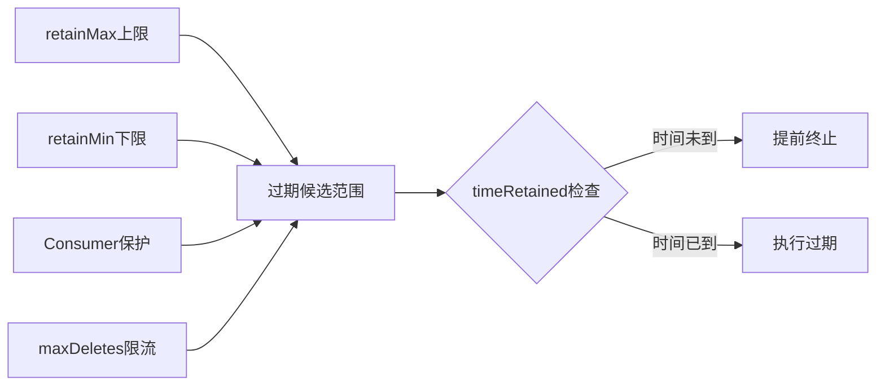

# Apache Paimon 时间旅行与版本管理机制深度分析

> 基于 Apache Paimon 1.5-SNAPSHOT 源码分析，commit: 55f4fd175

---

## 目录

- [1. Snapshot 链与时间旅行原理](#1-snapshot-链与时间旅行原理)
  - [1.1 Snapshot 数据模型](#11-snapshot-数据模型)
  - [1.2 SnapshotManager 核心机制](#12-snapshotmanager-核心机制)
  - [1.3 时间戳查询 -- 二分搜索](#13-时间戳查询----二分搜索)
  - [1.4 版本号查询与 Tag 查询](#14-版本号查询与-tag-查询)
  - [1.5 Hint 文件加速机制](#15-hint-文件加速机制)
- [2. Tag 机制](#2-tag-机制)
  - [2.1 Tag 数据模型 -- 继承 Snapshot](#21-tag-数据模型----继承-snapshot)
  - [2.2 TagManager 完整 CRUD](#22-tagmanager-完整-crud)
  - [2.3 Tag TTL (TagTimeExpire)](#23-tag-ttl-tagtimeexpire)
  - [2.4 自动 Tag 创建 (TagAutoCreation)](#24-自动-tag-创建-tagautocreation)
- [3. Branch 机制](#3-branch-机制)
  - [3.1 BranchManager 接口设计](#31-branchmanager-接口设计)
  - [3.2 分支路径规则](#32-分支路径规则)
  - [3.3 分支内独立空间](#33-分支内独立空间)
  - [3.4 FastForward 合并](#34-fastforward-合并)
  - [3.5 CatalogBranchManager 适配](#35-catalogbranchmanager-适配)
- [4. Snapshot 回滚](#4-snapshot-回滚)
  - [4.1 rollbackTo 实现原理](#41-rollbackto-实现原理)
  - [4.2 RollbackHelper 清理逻辑](#42-rollbackhelper-清理逻辑)
  - [4.3 回滚对数据文件的影响](#43-回滚对数据文件的影响)
  - [4.4 回滚对 Consumer 的影响](#44-回滚对-consumer-的影响)
- [5. Schema 回滚](#5-schema-回滚)
- [6. Consumer 机制](#6-consumer-机制)
  - [6.1 ConsumerManager 核心设计](#61-consumermanager-核心设计)
  - [6.2 Consumer 消费进度跟踪](#62-consumer-消费进度跟踪)
  - [6.3 Consumer 过期清理](#63-consumer-过期清理)
- [7. 增量读取与流式消费](#7-增量读取与流式消费)
  - [7.1 DataTableStreamScan 增量扫描](#71-datatablestreamscan-增量扫描)
  - [7.2 FollowUpScanner 策略](#72-followupscanner-策略)
  - [7.3 Flink 流式消费位点管理](#73-flink-流式消费位点管理)
- [8. ExpireSnapshots 多重保护](#8-expiresnapshots-多重保护)
  - [8.1 ExpireConfig 配置模型](#81-expireconfig-配置模型)
  - [8.2 过期算法详解](#82-过期算法详解)
  - [8.3 Tag 保护与数据安全](#83-tag-保护与数据安全)
- [9. 实战场景](#9-实战场景)
- [10. 与 Iceberg 版本管理对比](#10-与-iceberg-版本管理对比)

---

## 1. Snapshot 链与时间旅行原理

### 1.1 Snapshot 数据模型

**为什么采用这种设计**: Snapshot 是 Paimon 表在某一时刻的完整数据视图入口，它本身不存储数据，而是通过 Manifest List 间接引用所有数据文件。这种间接引用设计实现了数据和元数据的解耦，使得创建快照只需写一个小的 JSON 文件。

**好处**: 原子性提交、零拷贝快照、高效的时间旅行查询。

**源码路径**: `paimon-api/src/main/java/org/apache/paimon/Snapshot.java`

Snapshot 的核心字段：

```java
public class Snapshot implements Serializable {
    protected final int version;                   // 快照格式版本 (当前 v3)
    protected final long id;                       // 快照 ID，单调递增
    protected final long schemaId;                 // 引用的 Schema 版本
    protected final String baseManifestList;       // 基线 Manifest List（全量数据引用）
    protected final Long baseManifestListSize;     // baseManifestList 大小（可选，paimon > 1.0）
    protected final String deltaManifestList;      // 增量 Manifest List（本次变更引用）
    protected final Long deltaManifestListSize;    // deltaManifestList 大小（可选，paimon > 1.0）
    protected final String changelogManifestList;  // Changelog Manifest List（可选）
    protected final Long changelogManifestListSize;// changelogManifestList 大小（可选）
    protected final String indexManifest;          // 索引 Manifest（可选）
    protected final String commitUser;             // 提交用户标识
    protected final long commitIdentifier;         // 提交标识符（用于去重）
    protected final CommitKind commitKind;         // 提交类型: APPEND/COMPACT/OVERWRITE/ANALYZE
    protected final long timeMillis;               // 提交时间戳
    protected final long totalRecordCount;         // 所有变更的记录数
    protected final long deltaRecordCount;         // 本次变更的记录数
    protected final Long changelogRecordCount;     // Changelog 的记录数（可选）
    protected final Long watermark;                // 输入记录的 watermark（可选）
    protected final String statistics;             // 统计信息文件名（可选）
    protected final Map<String, String> properties;// 快照属性（可选）
    protected final Long nextRowId;                // 下一个行 ID（可选）
}
```

CommitKind 枚举定义了四种提交类型（第 454-470 行）：
- `APPEND`: 追加新数据文件，无数据文件删除
- `COMPACT`: Compaction 产生的变更
- `OVERWRITE`: 覆盖写入或删除现有数据文件
- `ANALYZE`: 统计信息收集

**设计决策**: Snapshot 同时记录 `baseManifestList`（全量）和 `deltaManifestList`（增量），前者用于全量读取，后者用于流式增量读取和快速过期。这种"全量+增量"双 Manifest 设计避免了在增量读取时扫描全量数据的开销。

### 1.2 SnapshotManager 核心机制

**源码路径**: `paimon-core/src/main/java/org/apache/paimon/utils/SnapshotManager.java`

SnapshotManager 是管理 Snapshot 生命周期的核心类，包括查找、读取、删除等操作。

**为什么 SnapshotManager 需要感知 Branch**: 每个分支有独立的 snapshot 目录，SnapshotManager 在构造时接收 branch 参数，并将其规范化为路径（第 84 行）。

```java
public class SnapshotManager implements Serializable {
    private final FileIO fileIO;
    private final Path tablePath;
    private final String branch;
    @Nullable private final SnapshotLoader snapshotLoader;  // REST Catalog 用
    @Nullable private final Cache<Path, Snapshot> cache;    // Caffeine 缓存

    // 快照路径: {branchPath}/snapshot/snapshot-{id}
    public Path snapshotPath(long snapshotId) {
        return new Path(branchPath(tablePath, branch) + "/snapshot/" + SNAPSHOT_PREFIX + snapshotId);
    }
}
```

**Snapshot 读取的重试机制**（SnapshotManager.java 第 761-787 行）:

当从文件系统读取 Snapshot JSON 时，如果遇到解析异常（非 FileNotFoundException），会自动重试最多 10 次，每次间隔 200ms。这是为了应对分布式文件系统的最终一致性问题。

```java
// SnapshotManager.tryFromPath
int retryNumber = 0;
Exception exception = null;
while (retryNumber++ < 10) {
    String content;
    try {
        content = fileIO.readFileUtf8(path);
    } catch (FileNotFoundException e) {
        throw e;
    }
    try {
        return Snapshot.fromJson(content);
    } catch (Exception e) {
        exception = e;
        Thread.sleep(200);  // 重试间隔
    }
}
throw new RuntimeException("Retry fail after 10 times", exception);
```

**为什么需要重试**: 在 S3/OSS 等对象存储上，文件写入后可能存在短暂的读不一致窗口。重试机制确保了在高并发写入场景下的读取稳定性。
```

**关键方法**：

| 方法 | 行号 | 功能 |
|------|------|------|
| `latestSnapshot()` | 167 | 获取最新快照，优先从 SnapshotLoader 加载，回退到文件系统 |
| `earliestSnapshot()` | 213 | 获取最早快照，带重试机制防止并发过期导致的竞态 |
| `snapshot(long id)` | 124 | 按 ID 读取快照，带 Caffeine 缓存 |
| `earlierOrEqualTimeMills()` | 291 | 按时间戳二分搜索 |
| `laterOrEqualTimeMills()` | 325 | 按时间戳正向二分搜索 |
| `earlierOrEqualWatermark()` | 354 | 按 watermark 二分搜索 |

**为什么需要 SnapshotLoader**: 当使用 REST Catalog 时，快照信息可能存储在外部服务中而非文件系统，`SnapshotLoader` 提供了一层抽象。当 REST 加载抛出 `UnsupportedOperationException` 时，回退到文件系统扫描（第 172-173 行）。

### 1.3 时间戳查询 -- 二分搜索

**为什么采用二分搜索**: Snapshot ID 单调递增，且 `timeMillis` 严格递增（提交时间），天然有序，适合二分搜索。对于大量 Snapshot 的表，二分搜索将 O(N) 降为 O(log N)。

**源码路径**: `SnapshotManager.java` 第 291-319 行

```java
public @Nullable Snapshot earlierOrEqualTimeMills(long timestampMills) {
    // 获取 earliest 和 latest 边界
    // 二分搜索
    while (earliest <= latest) {
        long mid = earliest + (latest - earliest) / 2; // 防溢出
        Snapshot snapshot = snapshot(mid);
        long commitTime = snapshot.timeMillis();
        if (commitTime > timestampMills) {
            latest = mid - 1;
        } else if (commitTime < timestampMills) {
            earliest = mid + 1;
            finalSnapshot = snapshot;
        } else {
            finalSnapshot = snapshot; // 精确匹配
            break;
        }
    }
    return finalSnapshot;
}
```

**好处**: 时间旅行查询的复杂度为 O(log N)，每次二分只需读取一个 Snapshot JSON 文件。

**Watermark 二分搜索的特殊处理**（第 354-417 行）: 因为早期快照可能没有 watermark（为 null），搜索时需要先跳过无 watermark 的快照找到第一个有 watermark 的 ID 作为搜索起点。这比时间戳搜索更复杂。

### 1.4 版本号查询与 Tag 查询

**源码路径**: `paimon-core/src/main/java/org/apache/paimon/table/source/snapshot/TimeTravelUtil.java`

TimeTravelUtil 是时间旅行的统一入口，支持五种查询方式：

```java
// 支持的 SCAN KEYS
private static final String[] SCAN_KEYS = {
    SCAN_SNAPSHOT_ID.key(),       // scan.snapshot-id
    SCAN_TAG_NAME.key(),          // scan.tag-name
    SCAN_WATERMARK.key(),         // scan.watermark
    SCAN_TIMESTAMP.key(),         // scan.timestamp
    SCAN_TIMESTAMP_MILLIS.key()   // scan.timestamp-millis
};
```

**为什么设计 scan.version 统一入口**（第 149-167 行）: `adaptScanVersion` 方法将通用的 `scan.version` 参数自适应转换为具体查询类型：
1. 如果 version 是已存在的 Tag 名称 -> `scan.tag-name`
2. 如果以 `watermark-` 前缀开头 -> `scan.watermark`
3. 如果是纯数字 -> `scan.snapshot-id`
4. 否则当做 Tag 名称，设置为 `scan.tag-name` 后抛异常（Tag 不存在）

**好处**: 用户只需指定一个统一的 `VERSION` 参数，引擎自动识别并路由到正确的时间旅行策略。

每种查询方式对应一个 StartingScanner 实现：

| Scanner | 源码路径 | 行为 |
|---------|----------|------|
| `StaticFromSnapshotStartingScanner` | `snapshot/StaticFromSnapshotStartingScanner.java` | 直接按 ID 读取快照 |
| `StaticFromTagStartingScanner` | `snapshot/StaticFromTagStartingScanner.java` | 通过 TagManager 加载 Tag 并 trimToSnapshot |
| `StaticFromTimestampStartingScanner` | `snapshot/StaticFromTimestampStartingScanner.java` | 调用 `earlierOrEqualTimeMills` 二分搜索 |
| `StaticFromWatermarkStartingScanner` | （同上模式） | 调用 `earlierOrEqualWatermark` 二分搜索 |

### 1.5 Hint 文件加速机制

**源码路径**: `paimon-core/src/main/java/org/apache/paimon/utils/HintFileUtils.java`

**为什么需要 Hint 文件**: 在分布式文件系统上列出目录下所有文件（list files）是昂贵操作。Hint 文件记录了 `EARLIEST` 和 `LATEST` 快照 ID，使得定位首尾快照不需要全量扫目录。

```
{table}/snapshot/
  EARLIEST          # 内容: 最早快照 ID
  LATEST            # 内容: 最新快照 ID
  snapshot-1
  snapshot-2
  ...
  snapshot-N
```

**Hint 的验证逻辑**（第 44-55 行）:
```java
// findLatest: 读 LATEST hint 后还会检查是否有 next snapshot 存在
// 如果存在 snapshot-(hint+1)，说明 hint 已过时，回退到 list 全量扫描
Long snapshotId = readHint(fileIO, LATEST, dir);
if (snapshotId != null && snapshotId > 0) {
    if (!fileIO.exists(file.apply(snapshotId + 1))) {
        return snapshotId;  // 确认是最新的
    }
}
return findByListFiles(fileIO, Math::max, dir, prefix); // 回退
```

**好处**: 在正常运行时避免 list 操作，只需两次 read（Hint 文件 + Snapshot 文件），大幅降低延迟。

---

## 2. Tag 机制

### 2.1 Tag 数据模型 -- 继承 Snapshot

**源码路径**: `paimon-core/src/main/java/org/apache/paimon/tag/Tag.java`

**为什么 Tag 继承 Snapshot**: Tag 本质上是一个"命名的快照引用"，它持有与 Snapshot 完全相同的元数据字段。通过继承而非组合，Tag 文件的 JSON 格式兼容 Snapshot 格式，允许旧版本（<= 0.7）的读取器直接把 Tag 当作 Snapshot 读取。

```java
@JsonIgnoreProperties(ignoreUnknown = true)
public class Tag extends Snapshot {
    @Nullable private final LocalDateTime tagCreateTime;    // Tag 创建时间
    @Nullable private final Duration tagTimeRetained;       // Tag TTL（保留时长）
}
```

**好处**:
1. 向后兼容：老版本读取器可以忽略 `tagCreateTime`/`tagTimeRetained` 字段
2. `trimToSnapshot()` 方法可以将 Tag 转换为纯 Snapshot 对象（第 149 行），用于回滚等场景
3. Tag 文件可以直接反序列化为 Snapshot，无需特殊处理

**关于 timeRetained 字段的兼容考虑**（TagManager 第 163-166 行）：
```java
// 当 timeRetained 未定义时，不写入 tagCreateTime 字段
// 以保证 <= 0.7 版本的兼容性
String content = timeRetained != null
    ? Tag.fromSnapshotAndTagTtl(snapshot, timeRetained, LocalDateTime.now()).toJson()
    : snapshot.toJson();  // 直接用 Snapshot 的 JSON
```

### 2.2 TagManager 完整 CRUD

**源码路径**: `paimon-core/src/main/java/org/apache/paimon/utils/TagManager.java`

Tag 文件存储在 `{branchPath}/tag/tag-{tagName}` 路径下。

#### Create

```java
public void createTag(Snapshot snapshot, String tagName, Duration timeRetained,
                      List<TagCallback> callbacks, boolean ignoreIfExists)
```
- 检查 tagName 非空白
- 如果已存在且 `ignoreIfExists=true`，静默返回
- 调用 `createOrReplaceTag` 实际写入
- 验证不与自动创建的 Tag 冲突（`validateNoAutoTag`）
- 写入文件后通知所有 TagCallback（包括 IcebergCommitCallback）

#### Replace

```java
public void replaceTag(Snapshot snapshot, String tagName, Duration timeRetained,
                       List<TagCallback> callbacks)
```
- 替换时只保留 `IcebergCommitCallback` 类型的回调（第 151-153 行）
- 使用 `fileIO.overwriteFileUtf8()` 原子覆盖

#### Delete

```java
public void deleteTag(String tagName, TagDeletion tagDeletion,
                      SnapshotManager snapshotManager, List<TagCallback> callbacks)
```
- 如果该 Tag 对应的 Snapshot 仍然存在于 Snapshot 链中，只删除 Tag 元文件，不清理数据文件
- 如果 Snapshot 已过期但还有其他 Tag 引用同一 Snapshot，也只删除元文件
- 只有当 Snapshot 已过期且这是最后一个引用它的 Tag 时，才清理数据文件
- 清理使用"跳过集合"机制：收集左邻 Tag 和右邻最近 Snapshot 作为跳过边界（第 284-297 行）

#### Rename

```java
public void renameTag(String tagName, String targetTagName)
```
- 使用 `fileIO.rename()` 原子重命名文件

#### Read

```java
public Optional<Tag> get(String tagName)        // 返回 Optional
public Tag getOrThrow(String tagName)           // 不存在则抛异常
public SortedMap<Snapshot, List<String>> tags()  // 获取所有 Tag，按 Snapshot ID 排序
```

**为什么 tags() 返回 SortedMap<Snapshot, List<String>>**: 一个 Snapshot 可以有多个 Tag 名称指向它。按 Snapshot ID 排序便于在过期和删除时进行二分查找。

### 2.3 Tag TTL (TagTimeExpire)

**源码路径**: `paimon-core/src/main/java/org/apache/paimon/tag/TagTimeExpire.java`

**为什么需要 Tag TTL**: 自动创建的 Tag 如果不清理会持续累积，占用存储和元数据空间。TTL 机制允许 Tag 在创建后经过指定时间自动过期。

```java
public class TagTimeExpire {
    private LocalDateTime olderThanTime;  // 全局 "older than" 阈值

    public List<String> expire() {
        for (Pair<Tag, String> pair : tagManager.tagObjects()) {
            Tag tag = pair.getLeft();
            LocalDateTime createTime = tag.getTagCreateTime();
            Duration timeRetained = tag.getTagTimeRetained();

            // 如果 Tag 没有 createTime/timeRetained（旧版本 Tag）
            // 但配置了 olderThanTime，则用文件修改时间作为 createTime
            if (createTime == null || timeRetained == null) {
                if (olderThanTime != null) {
                    createTime = DateTimeUtils.toLocalDateTime(
                        fileIO.getFileStatus(tagPath).getModificationTime());
                }
            }

            // 两个过期条件 OR 关系:
            // 1. createTime + timeRetained < now (TTL 到期)
            // 2. olderThanTime > createTime (全局 "比某时间更老")
            boolean isReachTimeRetained = timeRetained != null
                && LocalDateTime.now().isAfter(createTime.plus(timeRetained));
            boolean isOlderThan = olderThanTime != null
                && olderThanTime.isAfter(createTime);
        }
    }
}
```

**好处**: 双重过期策略提供了灵活性。`timeRetained` 是 Tag 级别的 TTL，`olderThanTime` 是全局级别的清理阈值。

### 2.4 自动 Tag 创建 (TagAutoCreation)

**源码路径**: `paimon-core/src/main/java/org/apache/paimon/tag/TagAutoCreation.java`

**为什么需要自动 Tag**: 在生产环境中，手动管理 Tag 太繁琐。自动 Tag 按时间周期（小时/天/自定义）创建，实现定期数据保护。

**核心组件协作**:

```
TagAutoManager
  ├── TagAutoCreation  (自动创建)
  │     ├── TagTimeExtractor    (时间提取: 进程时间 / Watermark)
  │     ├── TagPeriodHandler    (周期管理: DAILY / HOURLY / TWO_HOURS / 自定义)
  │     └── TagManager          (实际创建)
  └── TagTimeExpire    (TTL 过期)
```

**TagTimeExtractor 两种模式**（`tag/TagTimeExtractor.java`）:

| 模式 | 配置值 | 时间来源 | 适用场景 |
|------|--------|----------|----------|
| `ProcessTimeExtractor` | `tag.automatic-creation=process-time` | `Snapshot.timeMillis()` | 批处理或不关心事件时间 |
| `WatermarkExtractor` | `tag.automatic-creation=watermark` | `Snapshot.watermark()` | 流处理，基于数据事件时间 |

**TagPeriodHandler 周期策略**（`tag/TagPeriodHandler.java`）:

| 策略 | 周期 | Tag 名称格式 | 示例 |
|------|------|-------------|------|
| `DailyTagPeriodHandler` | 1 天 | `yyyy-MM-dd` | `2024-12-25` |
| `HourlyTagPeriodHandler` | 1 小时 | `yyyy-MM-dd HH` | `2024-12-25 14` |
| `TwoHoursTagPeriodHandler` | 2 小时 | `yyyy-MM-dd HH` | `2024-12-25 14` |
| `PeriodDurationTagPeriodHandler` | 自定义 | `yyyyMMddHHmm` | `202412251430` |

**自动创建流程**（`TagAutoCreation.run()` 第 141-156 行）:

```
1. 从 nextSnapshot 开始遍历已存在的 Snapshot
2. 对每个 Snapshot 调用 timeExtractor.extract() 获取时间
3. 如果时间 >= nextTag (减去 delay)，创建 Tag
4. 如果配置了 numRetainedMax，清理超出数量的旧 Tag
5. 更新 nextTag 和 nextSnapshot，继续循环
```

**关于 automaticCompletion**（第 173-175 行）: 如果配置了 `tag.automatic-completion=true`，当检测到应该创建 Tag 但时间已跨越多个周期时，会使用 nextTag 作为实际 Tag 时间而非当前数据时间，确保 Tag 序列连续不跳跃。

**关于 idlenessTimeout**（第 113-133 行）: 对于 Watermark 模式，当流处于空闲状态（长时间无新数据）时，如果 watermark 停滞超过 `idlenessTimeout`，会触发强制创建 Snapshot 以生成 Tag，避免因流空闲导致 Tag 延迟。

---

## 3. Branch 机制

### 3.1 BranchManager 接口设计

**源码路径**: `paimon-core/src/main/java/org/apache/paimon/utils/BranchManager.java`

**为什么 BranchManager 是接口而非类**: 分支管理需要适配不同的后端存储。FileSystem 实现直接操作文件目录，而 Catalog 实现（如 RESTCatalog）则委托给外部服务。接口设计实现了策略解耦。

```java
public interface BranchManager {
    String BRANCH_PREFIX = "branch-";

    void createBranch(String branchName);
    void createBranch(String branchName, @Nullable String tagName);
    void createBranch(String branchName, boolean ignoreIfExists);
    void createBranch(String branchName, @Nullable String tagName, boolean ignoreIfExists);
    void dropBranch(String branchName);
    void fastForward(String branchName);
    void renameBranch(String fromBranch, String toBranch);
    List<String> branches();
}
```

**分支名称校验**（第 86-99 行）:
- 不能是 main 分支名（默认 `main`）
- 不能为空白
- 不能是纯数字（避免与 Snapshot ID 混淆）

### 3.2 分支路径规则

**为什么 main 分支使用表根目录**: 兼容性。在引入 Branch 之前，所有数据都在表根目录下。main 分支映射到根目录意味着无分支意识的旧代码可以无修改地正常工作。

```java
static String branchPath(Path tablePath, String branch) {
    return isMainBranch(branch)
        ? tablePath.toString()                                      // main -> 表根目录
        : tablePath.toString() + "/branch/" + BRANCH_PREFIX + branch; // 其他分支
}
```

**目录结构示例**:

```
table/
├── snapshot/           # main 分支的快照
├── schema/             # main 分支的 schema
├── tag/                # main 分支的 tag
├── consumer/           # main 分支的 consumer
├── manifest/           # 共享的 manifest 文件（所有分支共用）
├── data/               # 共享的数据文件（所有分支共用）
└── branch/
    └── branch-dev/     # dev 分支
        ├── snapshot/   # dev 分支独立的快照
        ├── schema/     # dev 分支独立的 schema
        ├── tag/        # dev 分支独立的 tag
        └── consumer/   # dev 分支独立的 consumer
```

### 3.3 分支内独立空间

**源码路径**: `paimon-core/src/main/java/org/apache/paimon/utils/FileSystemBranchManager.java`

**为什么分支共享 data 和 manifest 而隔离 snapshot/schema/tag/consumer**: 数据文件和 manifest 文件是不可变的（immutable），多个分支引用同一文件不会产生冲突。而 snapshot/schema/tag/consumer 是分支独立演进的元数据，必须隔离。

#### 从 Tag 创建分支（第 97-128 行）

```java
public void createBranch(String branchName, String tagName, boolean ignoreIfExists) {
    // 1. 从 Tag 读取 Snapshot 引用
    Snapshot snapshot = tagManager.getOrThrow(tagName).trimToSnapshot();

    // 2. 复制 Tag 文件到分支目录
    fileIO.copyFile(tagManager.tagPath(tagName),
                    tagManager.copyWithBranch(branchName).tagPath(tagName), true);

    // 3. 复制 Snapshot 文件到分支目录
    fileIO.copyFile(snapshotManager.snapshotPath(snapshot.id()),
                    snapshotManager.copyWithBranch(branchName).snapshotPath(snapshot.id()), true);

    // 4. 复制所有 Schema 文件（从 0 到 snapshot.schemaId）
    copySchemasToBranch(branchName, snapshot.schemaId());
}
```

**好处**: 基于 Tag 创建分支是 O(schema_count) 的轻量操作，不复制数据文件。

#### 无 Tag 创建空分支（第 74-95 行）

```java
public void createBranch(String branchName, boolean ignoreIfExists) {
    // 只复制最新 Schema，不复制 Snapshot
    TableSchema latestSchema = schemaManager.latest().get();
    copySchemasToBranch(branchName, latestSchema.id());
}
```

### 3.4 FastForward 合并

**源码路径**: `FileSystemBranchManager.java` 第 156-210 行

**为什么叫 fastForward 而不是 merge**: 它不是 Git 意义上的三方合并，而是类似 Git fast-forward：将分支的所有内容覆盖到 main 分支，丢弃 main 上分叉后的变更。

```java
public void fastForward(String branchName) {
    // 1. 获取分支的最早 Snapshot ID
    Long earliestSnapshotId = snapshotManager.copyWithBranch(branchName).earliestSnapshotId();

    // 2. 删除 main 分支上 >= earliestSnapshotId 的 snapshot/schema/tag
    List<Path> deleteSnapshotPaths =
        snapshotManager.snapshotPaths(id -> id >= earliestSnapshotId);
    List<Path> deleteSchemaPaths =
        schemaManager.schemaPaths(id -> id >= earliestSchemaId);
    List<Path> deleteTagPaths =
        tagManager.tagPaths(path -> Tag.fromPath(fileIO, path).id() >= earliestSnapshotId);

    // 3. 删除 LATEST hint 文件
    snapshotManager.deleteLatestHint();

    // 4. 批量删除旧文件
    fileIO.deleteFilesQuietly(deletePaths);

    // 5. 将分支的 snapshot/schema/tag 目录内容复制到 main
    fileIO.copyFiles(branch.snapshotDir, main.snapshotDir, true);
    fileIO.copyFiles(branch.schemaDir, main.schemaDir, true);
    fileIO.copyFiles(branch.tagDir, main.tagDir, true);

    // 6. 失效缓存
    snapshotManager.invalidateCache();
}
```

**好处**: FastForward 操作是确定性的，不存在冲突解决问题，适合"在分支上进行实验性修改，确认无误后合并回 main"的场景。

**注意**: 只能从非当前分支执行 fast-forward（第 101-114 行 `fastForwardValidate`），且目标不能是 main。

### 3.5 CatalogBranchManager 适配

**源码路径**: `paimon-core/src/main/java/org/apache/paimon/utils/CatalogBranchManager.java`

**为什么需要 CatalogBranchManager**: 当使用 RESTCatalog 等外部 Catalog 服务时，分支元数据存储在 Catalog 服务端而非文件系统。`CatalogBranchManager` 通过 `CatalogLoader` 加载 Catalog 实例，将分支操作委托给 Catalog API。

```java
public class CatalogBranchManager implements BranchManager {
    private final CatalogLoader catalogLoader;
    private final Identifier identifier;

    @Override
    public void createBranch(String branchName, String tagName, boolean ignoreIfExists) {
        executePost(catalog -> {
            BranchManager.validateBranch(branchName);
            if (ignoreIfExists && catalog.listBranches(identifier).contains(branchName)) return;
            catalog.createBranch(identifier, branchName, tagName);
        });
    }
}
```

---

## 4. Snapshot 回滚

### 4.1 rollbackTo 实现原理

**源码路径**: `paimon-core/src/main/java/org/apache/paimon/table/AbstractFileStoreTable.java` 第 527-562 行

Paimon 支持两种回滚目标：按 Snapshot ID 回滚和按 Tag 名称回滚。

#### 按 Snapshot ID 回滚

```java
public void rollbackTo(long snapshotId) {
    SnapshotManager snapshotManager = snapshotManager();
    try {
        // 1. 优先尝试通过 SnapshotLoader（REST Catalog）回滚
        snapshotManager.rollback(Instant.snapshot(snapshotId));
    } catch (UnsupportedOperationException e) {
        try {
            // 2. 文件系统模式：直接读取 Snapshot 并清理
            Snapshot snapshot = snapshotManager.tryGetSnapshot(snapshotId);
            rollbackHelper().cleanLargerThan(snapshot);
        } catch (FileNotFoundException ex) {
            // 3. Snapshot 已过期但可能存在对应的 Tag
            TagManager tagManager = tagManager();
            SortedMap<Snapshot, List<String>> tags = tagManager.tags();
            for (Map.Entry<Snapshot, List<String>> entry : tags.entrySet()) {
                if (entry.getKey().id() == snapshotId) {
                    rollbackTo(entry.getValue().get(0)); // 委托给 Tag 回滚
                    return;
                }
            }
            throw new IllegalArgumentException("Snapshot doesn't exist");
        }
    }
}
```

**为什么支持"Snapshot 不存在时从 Tag 恢复"**: 在实际运行中，老的 Snapshot 可能已被过期清理，但如果用户之前创建了 Tag，Tag 保留了完整的 Snapshot 信息，可以用来恢复。

#### 按 Tag 名称回滚

```java
public void rollbackTo(String tagName) {
    try {
        snapshotManager.rollback(Instant.tag(tagName));
    } catch (UnsupportedOperationException e) {
        Snapshot taggedSnapshot = tagManager().getOrThrow(tagName).trimToSnapshot();
        RollbackHelper rollbackHelper = rollbackHelper();
        rollbackHelper.cleanLargerThan(taggedSnapshot);
        rollbackHelper.createSnapshotFileIfNeeded(taggedSnapshot);
    }
}
```

**关键**: `createSnapshotFileIfNeeded` 处理了一个边界情况 -- 如果最早的 Snapshot 已经比 Tag 对应的 Snapshot 更新（因为过期），cleanLargerThan 会删除所有 Snapshot，所以需要把 Tag 内容写回 Snapshot 目录。

### 4.2 RollbackHelper 清理逻辑

**源码路径**: `paimon-core/src/main/java/org/apache/paimon/table/RollbackHelper.java`

```java
public void cleanLargerThan(Snapshot retainedSnapshot) {
    cleanSnapshots(retainedSnapshot);        // 删除更新的 Snapshot 文件
    cleanLongLivedChangelogs(retainedSnapshot); // 删除更新的 Changelog 文件
    cleanTags(retainedSnapshot);             // 删除更新的 Tag 文件
}
```

#### cleanSnapshots（第 84-102 行）

```java
private void cleanSnapshots(Snapshot retainedSnapshot) {
    // 1. 更新 LATEST hint 指向保留的快照
    snapshotManager.commitLatestHint(retainedSnapshot.id());

    // 2. 从最新快照向前删除，直到保留快照
    long to = Math.max(earliest, retainedSnapshot.id() + 1);
    for (long i = latest; i >= to; i--) {
        if (snapshotManager.snapshotExists(i)) {
            snapshotManager.deleteSnapshot(i);
        }
    }
}
```

#### cleanTags（第 135-151 行）

从后向前遍历所有 Tag，删除 `id > retainedSnapshot.id()` 的 Tag 文件。

#### createSnapshotFileIfNeeded（第 66-82 行）

```java
public void createSnapshotFileIfNeeded(Snapshot taggedSnapshot) {
    if (!snapshotManager.snapshotExists(taggedSnapshot.id())) {
        // 将 Tag 的快照数据写入 Snapshot 目录
        fileIO.writeFile(snapshotManager.snapshotPath(taggedSnapshot.id()),
                         taggedSnapshot.toJson(), false);
        // 更新 EARLIEST hint
        snapshotManager.commitEarliestHint(taggedSnapshot.id());
    }
}
```

### 4.3 回滚对数据文件的影响

**设计决策**: 回滚操作只删除 Snapshot/Changelog/Tag **元数据文件**，不删除底层数据文件。

**为什么不删除数据文件**:
1. **安全性**: 数据文件可能被其他分支或 Tag 引用
2. **简化实现**: 不需要扫描引用关系
3. **自然清理**: 后续的 Snapshot 过期机制会自然清理不再被引用的数据文件

**好处**: 回滚操作是轻量级的元数据操作，时间复杂度与需要删除的 Snapshot 数量成正比，与数据量无关。

### 4.4 回滚对 Consumer 的影响

回滚操作不直接修改 Consumer 文件。但回滚后，Consumer 记录的 `nextSnapshot` 可能指向一个已不存在的 Snapshot。这时：

1. 如果 consumer.nextSnapshot > retainedSnapshot.id，Consumer 的流式读取会发现快照不存在
2. Flink 流式任务需要手动重启或从保存点恢复
3. 用户可以通过 `ConsumerManager.resetConsumer()` 手动重置消费位点

---

## 5. Schema 回滚

**源码路径**: `paimon-core/src/main/java/org/apache/paimon/schema/SchemaManager.java` 第 1147-1185 行

```java
public void rollbackTo(long targetSchemaId, SnapshotManager snapshotManager,
                        TagManager tagManager, ChangelogManager changelogManager) {
    // 1. 验证目标 Schema 存在
    checkArgument(schemaExists(targetSchemaId));

    // 2. 收集所有被 Snapshot/Tag/Changelog 引用的 Schema ID
    Set<Long> usedSchemaIds = new HashSet<>();
    snapshotManager.pickOrLatest(snapshot -> {
        usedSchemaIds.add(snapshot.schemaId());
        return false;
    });
    tagManager.taggedSnapshots().forEach(s -> usedSchemaIds.add(s.schemaId()));
    changelogManager.changelogs().forEachRemaining(c -> usedSchemaIds.add(c.schemaId()));

    // 3. 检查是否有引用了更新 Schema 的 Snapshot 存在
    Optional<Long> conflict = usedSchemaIds.stream()
        .filter(id -> id > targetSchemaId)
        .min(Long::compareTo);
    if (conflict.isPresent()) {
        throw new RuntimeException("Cannot rollback, schema still referenced");
    }

    // 4. 删除所有比目标更新的 Schema 文件
    List<Long> toBeDeleted = listAllIds().stream()
        .filter(id -> id > targetSchemaId)
        .collect(Collectors.toList());
    toBeDeleted.sort((o1, o2) -> Long.compare(o2, o1)); // 从大到小删
    for (Long id : toBeDeleted) {
        fileIO.delete(toSchemaPath(id), false);
    }
}
```

**为什么要检查引用关系**: Schema 回滚比 Snapshot 回滚更危险。如果有 Snapshot 引用了更新的 Schema，删除该 Schema 会导致 Snapshot 不可读。因此必须先确保没有现存引用。

**好处**: 通过严格的引用检查，确保 Schema 回滚是安全的。

**入口**（`AbstractFileStoreTable.rollbackSchema` 第 565-577 行）:

```java
public void rollbackSchema(long schemaId) {
    // 优先使用 Catalog 级别的 Schema 回滚（如果有）
    LongConsumer schemaRollback = catalogEnvironment.catalogSchemaRollback();
    if (schemaRollback != null) {
        schemaRollback.accept(schemaId);
    } else {
        schemaManager().rollbackTo(schemaId, snapshotManager(), tagManager(), changelogManager());
    }
}
```

---

## 6. Consumer 机制

### 6.1 ConsumerManager 核心设计

**源码路径**: `paimon-core/src/main/java/org/apache/paimon/consumer/ConsumerManager.java`

**为什么需要 Consumer**: Flink 流式消费需要持久化消费位点。Consumer 机制提供了一个轻量级的、基于文件系统的消费进度跟踪。

Consumer 文件存储在 `{branchPath}/consumer/consumer-{consumerId}` 路径下。

```java
public class ConsumerManager implements Serializable {
    // 文件路径
    private Path consumerPath(String consumerId) {
        return new Path(branchPath(tablePath, branch) + "/consumer/" + CONSUMER_PREFIX + consumerId);
    }

    // 核心操作
    public Optional<Consumer> consumer(String consumerId);        // 读取
    public void resetConsumer(String consumerId, Consumer c);     // 重置
    public void deleteConsumer(String consumerId);                // 删除
    public OptionalLong minNextSnapshot();                        // 所有 Consumer 的最小 nextSnapshot
    public Map<String, Long> consumers();                         // 列出所有 Consumer
}
```

### 6.2 Consumer 消费进度跟踪

**源码路径**: `paimon-core/src/main/java/org/apache/paimon/consumer/Consumer.java`

```java
public class Consumer {
    private final long nextSnapshot;  // 下一个待消费的 Snapshot ID

    public long nextSnapshot() { return nextSnapshot; }
}
```

**为什么只存储 nextSnapshot**: 最小化存储。Consumer 只需知道"下一个要消费的 Snapshot"，结合 Snapshot 链即可恢复完整状态。

**minNextSnapshot() 的关键作用**（第 82-93 行）:

```java
public OptionalLong minNextSnapshot() {
    return listOriginalVersionedFiles(fileIO, consumerDirectory(), CONSUMER_PREFIX)
        .map(this::consumer)
        .filter(Optional::isPresent)
        .map(Optional::get)
        .mapToLong(Consumer::nextSnapshot)
        .reduce(Math::min);
}
```

**为什么计算所有 Consumer 的最小值**: 这个最小值被 ExpireSnapshots 用作保护边界，确保不会过期任何 Consumer 还需要消费的 Snapshot。

### 6.3 Consumer 过期清理

**按时间过期**（第 95-109 行）:

```java
public void expire(LocalDateTime expireDateTime) {
    listVersionedFileStatus(fileIO, consumerDirectory(), CONSUMER_PREFIX)
        .forEach(status -> {
            LocalDateTime modTime = DateTimeUtils.toLocalDateTime(status.getModificationTime());
            if (expireDateTime.isAfter(modTime)) {
                fileIO.deleteQuietly(status.getPath());
            }
        });
}
```

**按名称模式清理**（第 112-138 行）: `clearConsumers(Pattern including, Pattern excluding)` 支持正则表达式匹配的批量清理。

---

## 7. 增量读取与流式消费

### 7.1 DataTableStreamScan 增量扫描

**源码路径**: `paimon-core/src/main/java/org/apache/paimon/table/source/DataTableStreamScan.java`

DataTableStreamScan 是流式扫描的核心实现，维护一个 `nextSnapshotId` 状态。

**增量扫描流程**:

```
初始化 (tryFirstPlan):
  1. StartingScanner 确定起始 Snapshot
  2. 扫描起始快照，返回初始 Plan
  3. 设置 nextSnapshotId = startingSnapshot.id + 1

后续扫描 (nextPlan):
  while (true) {
      1. NextSnapshotFetcher 获取 nextSnapshotId 对应的 Snapshot
      2. 如果不存在，返回空 Plan（等待新数据）
      3. 如果存在:
         a. OVERWRITE 类型: 特殊处理覆盖变更
         b. followUpScanner.shouldScanSnapshot(): 判断是否需要扫描
         c. followUpScanner.scan(): 读取增量数据
      4. nextSnapshotId++
  }
```

**为什么 LOOKUP/FULL_COMPACTION 模式的初始扫描要过滤 level**（第 158-167 行）:
- LOOKUP 模式: 初始扫描只读 level > 0 的数据，因为 level 0 数据会在后续 compaction 中产生 changelog
- FULL_COMPACTION 模式: 初始扫描只读最高 level（`numLevels - 1`）的数据，避免重复

### 7.2 FollowUpScanner 策略

**源码路径**: `paimon-core/src/main/java/org/apache/paimon/table/source/snapshot/FollowUpScanner.java`

| Scanner | 触发条件 | 扫描模式 | 适用场景 |
|---------|----------|----------|----------|
| `DeltaFollowUpScanner` | 仅 APPEND 类型 Snapshot | DELTA | changelog.producer=none |
| `ChangelogFollowUpScanner` | 有 changelogManifestList | CHANGELOG | changelog.producer=input/lookup/full-compaction |
| `AllDeltaFollowUpScanner` | 所有 Snapshot | DELTA | FILE_MONITOR 模式 |

**DeltaFollowUpScanner**（`snapshot/DeltaFollowUpScanner.java`）:

```java
public boolean shouldScanSnapshot(Snapshot snapshot) {
    if (snapshot.commitKind() == Snapshot.CommitKind.APPEND) {
        return true;
    }
    // COMPACT/OVERWRITE/ANALYZE 类型的 Snapshot 被跳过
    return false;
}

public SnapshotReader.Plan scan(Snapshot snapshot, SnapshotReader snapshotReader) {
    return snapshotReader.withMode(ScanMode.DELTA).withSnapshot(snapshot).read();
}
```

**为什么 DeltaFollowUpScanner 只扫描 APPEND 类型**: 在 changelog.producer=none 模式下，只有 APPEND 提交产生新数据。COMPACT/OVERWRITE 等操作不产生新的增量数据，跳过可以减少不必要的扫描。

### 7.3 Flink 流式消费位点管理

**设计链路**:

```
Flink Source -> StreamTableScan.plan() -> 获取 nextSnapshotId
                                       -> Consumer.resetConsumer(nextSnapshotId)
                   |
                   v
              checkpoint 时持久化 Consumer
                   |
                   v
              恢复时: Consumer.consumer(id) -> 获取 nextSnapshot -> 恢复扫描
```

**Consumer 位点在 ExpireSnapshots 中的保护**:

```java
// ExpireSnapshotsImpl.expire() 第 127-131 行
if (!expireConfig.isConsumerChangelogOnly()) {
    maxExclusive = Math.min(maxExclusive,
        consumerManager.minNextSnapshot().orElse(Long.MAX_VALUE));
}
```

这确保了正在消费的最小位点之前的 Snapshot 不会被过期。

---

## 8. ExpireSnapshots 多重保护

### 8.1 ExpireConfig 配置模型

**源码路径**: `paimon-api/src/main/java/org/apache/paimon/options/ExpireConfig.java`

| 参数 | 默认值 | 含义 |
|------|--------|------|
| `snapshotRetainMax` | `Integer.MAX_VALUE` | 最多保留多少个快照 |
| `snapshotRetainMin` | `10` | 最少保留多少个快照 |
| `snapshotTimeRetain` | `1 hour` | 快照最大保留时间 |
| `snapshotMaxDeletes` | `50` | 单次过期最多删除数量 |
| `changelogDecoupled` | 自动推断 | Changelog 是否独立生命周期 |
| `consumerChangelogOnly` | `false` | Consumer 是否只保护 Changelog（不保护 Snapshot） |

**changelogDecoupled 自动推断**（第 54-58 行）:
```java
this.changelogDecoupled =
    changelogRetainMax > snapshotRetainMax
    || changelogRetainMin > snapshotRetainMin
    || changelogTimeRetain.compareTo(snapshotTimeRetain) > 0;
```

当任一 changelog 保留参数大于对应的 snapshot 参数时，自动启用 changelog 独立管理。

### 8.2 过期算法详解

**源码路径**: `paimon-core/src/main/java/org/apache/paimon/table/ExpireSnapshotsImpl.java` 第 92-152 行

```
输入: latestSnapshotId, earliestId, expireConfig

Step 1: 计算保留下界 min
  min = max(latestId - retainMax + 1, earliest)
  => 确保不超过 retainMax 上限

Step 2: 计算过期上界 maxExclusive
  maxExclusive = latestId - retainMin + 1
  => 确保至少保留 retainMin 个快照

Step 3: Consumer 保护
  if (!consumerChangelogOnly) {
      maxExclusive = min(maxExclusive, consumerManager.minNextSnapshot())
  }
  => 不过期任何 Consumer 还需要消费的快照

Step 4: 过期限流保护
  maxExclusive = min(maxExclusive, earliest + maxDeletes)
  => 单次最多删除 maxDeletes 个快照

Step 5: 时间保留保护
  for (id = min; id < maxExclusive; id++) {
      if (snapshot(id).timeMillis() >= now - timeRetain) {
          return expireUntil(earliest, id)  // 提前终止
      }
  }
  => 不过期时间未超期的快照

Step 6: 执行实际过期
  return expireUntil(earliest, maxExclusive)
```

**多重保护总结**:



### 8.3 Tag 保护与数据安全

在 `expireUntil` 内部（第 191-217 行），过期时会跳过被 Tag 引用的 Snapshot 对应的数据文件：

```java
// 1. 获取所有 tagged snapshots
List<Snapshot> taggedSnapshots = tagManager.taggedSnapshots();

// 2. 对每个要过期的 Snapshot，创建 "数据文件跳过器"
Predicate<ExpireFileEntry> skipper =
    snapshotDeletion.createDataFileSkipperForTags(taggedSnapshots, id);

// 3. 使用跳过器清理数据文件（被 Tag 引用的文件不删除）
snapshotDeletion.cleanUnusedDataFiles(snapshot, skipper);
```

**为什么需要 Tag 保护**: Snapshot 过期后，其引用的数据文件可能仍被 Tag 需要。Tag 的设计初衷就是在 Snapshot 过期后仍保留数据访问能力。

**Manifest 清理的跳过集合**（第 236-260 行）: 类似地，manifest 文件清理也会构建跳过集合，保护被 Tag 和后续 Snapshot 引用的 manifest。

---

## 9. 实战场景

### 场景一: 数据回滚恢复

**问题**: 错误的 ETL 任务写入了脏数据。

**解决方案**:

```sql
-- 方案 A: 按 Snapshot ID 回滚
CALL sys.rollback_to('database_name.table_name', 42);

-- 方案 B: 按 Tag 回滚（Snapshot 已过期时）
CALL sys.rollback_to_tag('database_name.table_name', 'backup-20241225');
```

**原理**: RollbackHelper 删除目标 Snapshot 之后的所有 Snapshot/Changelog/Tag 元数据文件，并更新 LATEST hint。数据文件保持不变，后续过期会自然清理不再引用的文件。

**关键注意事项**:
- 回滚是不可逆操作（被删除的 Snapshot 元数据不可恢复）
- 回滚后需要手动重置或重启所有 Consumer/Flink 流式任务
- 建议在回滚前先创建一个 Tag 作为安全网

### 场景二: A/B 测试分支

**问题**: 需要在不影响生产数据的情况下测试新的 ETL 逻辑。

**解决方案**:

```sql
-- 1. 基于当前最新 Tag 创建实验分支
CALL sys.create_branch('db.table', 'experiment', 'daily-20241225');

-- 2. 在实验分支上运行新 ETL
-- (通过 'branch' = 'experiment' 表选项路由到分支)

-- 3. 验证通过后，fast-forward 合并回 main
CALL sys.fast_forward('db.table', 'experiment');

-- 4. 或者验证失败，直接删除分支
CALL sys.drop_branch('db.table', 'experiment');
```

**原理**: 分支创建只复制 Schema/Snapshot/Tag 元文件（不复制数据），FastForward 将分支的元数据覆盖到 main。整个过程对数据文件零拷贝。

### 场景三: 定期 Tag 备份策略

**配置示例**:

```sql
ALTER TABLE my_table SET (
    'tag.automatic-creation' = 'watermark',        -- 基于 watermark 创建
    'tag.creation-period' = 'daily',               -- 每天一个 Tag
    'tag.creation-delay' = '10 min',               -- 允许 10 分钟延迟
    'tag.num-retained-max' = '30',                 -- 最多保留 30 个自动 Tag
    'tag.default-time-retained' = '7 d'            -- 每个 Tag TTL 7 天
);
```

**运行效果**: 每天自动创建一个以日期命名的 Tag（如 `2024-12-25`），超过 30 个时删除最老的，且每个 Tag 创建 7 天后自动过期。两种清理策略取先到者。

---

## 10. 与 Iceberg 版本管理对比

| 维度 | Apache Paimon | Apache Iceberg |
|------|---------------|----------------|
| **快照模型** | Snapshot（JSON 文件，引用 ManifestList） | Snapshot（Avro/JSON，引用 ManifestList） |
| **快照 ID** | 单调递增 Long（从 1 开始） | 单调递增 Long（时间戳-based） |
| **时间旅行** | `scan.snapshot-id` / `scan.timestamp` / `scan.tag-name` / `scan.watermark` | `snapshot-id` / `as-of-timestamp` / `branch` / `tag` |
| **Tag** | 独立 Tag 文件（继承 Snapshot 格式），支持 TTL | Ref 机制，Tag 是一种 SnapshotRef（type=TAG） |
| **Branch** | 独立目录结构，共享数据文件 | Ref 机制，Branch 是一种 SnapshotRef（type=BRANCH），每个 Branch 有独立的 Snapshot 链 |
| **Branch 存储** | `{table}/branch/branch-{name}/` 独立 snapshot/schema/tag | 在同一 metadata 目录中，通过 `refs` 表区分 |
| **合并** | FastForward（覆盖式） | cherry-pick / fast-forward |
| **回滚** | 删除目标之后的元数据文件 | `rollback-to-snapshot` / `rollback-to-timestamp`，通过设置 current-snapshot-id |
| **回滚安全性** | 删除后续 Snapshot 文件（不可逆） | 只更改 current-snapshot-id 指针（可逆）|
| **Consumer** | 基于文件系统的 Consumer ID + nextSnapshot | 无内建 Consumer，依赖引擎的 checkpoint 机制 |
| **过期保护** | retainMin + retainMax + timeRetain + Consumer 保护 + expireLimit | `min-snapshots-to-keep` + `max-snapshot-age-ms` |
| **Schema 回滚** | 独立的 Schema 回滚机制（检查引用后删除） | 通过 Snapshot 回滚间接恢复（Schema 跟随 Snapshot） |
| **自动 Tag** | 内建 TagAutoCreation（process-time / watermark 模式） | 无内建自动 Tag |
| **Changelog** | 内建 Changelog 机制（与 Snapshot 解耦或绑定） | 无内建 Changelog，依赖 incremental scan |

**关键设计差异分析**:

1. **Branch 实现**: Paimon 使用物理目录隔离，每个分支有独立的 snapshot/schema/tag 子目录。Iceberg 使用逻辑引用（SnapshotRef），所有分支的 Snapshot 共享同一元数据目录。Paimon 的方式更适合文件系统场景，Iceberg 的方式更适合有事务支持的 Catalog。

2. **回滚机制**: Paimon 的回滚是物理删除（不可逆），Iceberg 的回滚是指针移动（可逆）。Paimon 选择物理删除是因为其 Snapshot ID 单调递增且被后续提交引用，不能简单跳过；Iceberg 可以指针回退因为其 metadata log 独立于 Snapshot 链。

3. **Consumer 内建**: Paimon 的 Consumer 机制直接集成在存储层，与过期机制联动。Iceberg 依赖计算引擎（如 Flink/Spark）自身的 checkpoint 机制跟踪消费位点。Paimon 的方式更内聚但引入了存储层的复杂度。

4. **自动 Tag**: Paimon 内建自动 Tag 创建和过期，Iceberg 需要外部调度来创建 Tag。这反映了 Paimon 对流式处理场景的更深度优化。
