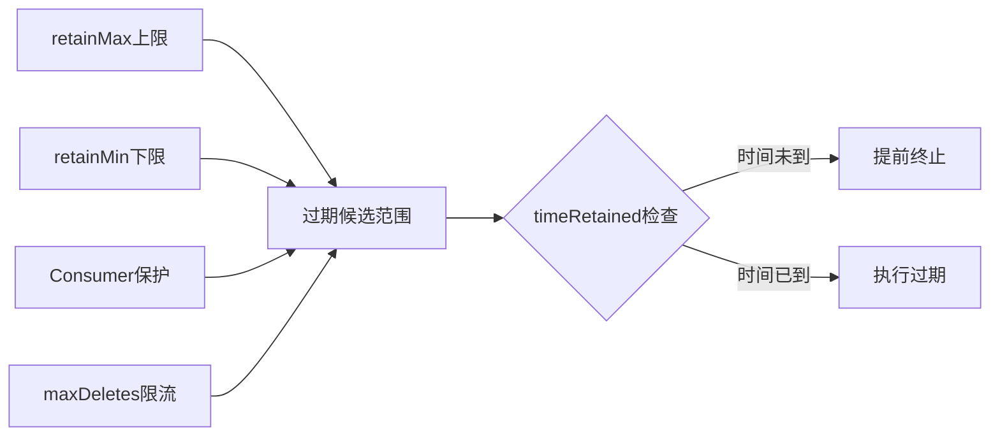

# Apache Paimon 时间旅行与版本管理机制深度分析

> 基于 Apache Paimon 1.5-SNAPSHOT 源码分析，commit: 55f4fd175

---

## 目录

- [1. Snapshot 链与时间旅行原理](#1-snapshot-链与时间旅行原理)
  - [1.1 Snapshot 数据模型](#11-snapshot-数据模型)
  - [1.2 SnapshotManager 核心机制](#12-snapshotmanager-核心机制)
  - [1.3 时间戳查询 -- 二分搜索](#13-时间戳查询----二分搜索)
  - [1.4 版本号查询与 Tag 查询](#14-版本号查询与-tag-查询)
  - [1.5 Hint 文件加速机制](#15-hint-文件加速机制)
- [2. Tag 机制](#2-tag-机制)
  - [2.1 Tag 数据模型 -- 继承 Snapshot](#21-tag-数据模型----继承-snapshot)
  - [2.2 TagManager 完整 CRUD](#22-tagmanager-完整-crud)
  - [2.3 Tag TTL (TagTimeExpire)](#23-tag-ttl-tagtimeexpire)
  - [2.4 自动 Tag 创建 (TagAutoCreation)](#24-自动-tag-创建-tagautocreation)
- [3. Branch 机制](#3-branch-机制)
  - [3.1 BranchManager 接口设计](#31-branchmanager-接口设计)
  - [3.2 分支路径规则](#32-分支路径规则)
  - [3.3 分支内独立空间](#33-分支内独立空间)
  - [3.4 FastForward 合并](#34-fastforward-合并)
  - [3.5 CatalogBranchManager 适配](#35-catalogbranchmanager-适配)
- [4. Snapshot 回滚](#4-snapshot-回滚)
  - [4.1 rollbackTo 实现原理](#41-rollbackto-实现原理)
  - [4.2 RollbackHelper 清理逻辑](#42-rollbackhelper-清理逻辑)
  - [4.3 回滚对数据文件的影响](#43-回滚对数据文件的影响)
  - [4.4 回滚对 Consumer 的影响](#44-回滚对-consumer-的影响)
- [5. Schema 回滚](#5-schema-回滚)
- [6. Consumer 机制](#6-consumer-机制)
  - [6.1 ConsumerManager 核心设计](#61-consumermanager-核心设计)
  - [6.2 Consumer 消费进度跟踪](#62-consumer-消费进度跟踪)
  - [6.3 Consumer 过期清理](#63-consumer-过期清理)
- [7. 增量读取与流式消费](#7-增量读取与流式消费)
  - [7.1 DataTableStreamScan 增量扫描](#71-datatablestreamscan-增量扫描)
  - [7.2 FollowUpScanner 策略](#72-followupscanner-策略)
  - [7.3 Flink 流式消费位点管理](#73-flink-流式消费位点管理)
- [8. ExpireSnapshots 多重保护](#8-expiresnapshots-多重保护)
  - [8.1 ExpireConfig 配置模型](#81-expireconfig-配置模型)
  - [8.2 过期算法详解](#82-过期算法详解)
  - [8.3 Tag 保护与数据安全](#83-tag-保护与数据安全)
- [9. 实战场景](#9-实战场景)
- [10. 与 Iceberg 版本管理对比](#10-与-iceberg-版本管理对比)

---

## 1. Snapshot 链与时间旅行原理

### 解决什么问题

在数据湖场景中，用户经常面临以下核心问题：

1. **数据误操作恢复**：ETL 任务写入错误数据后，如何快速回退到历史正确状态？如果没有时间旅行能力，只能通过全量重跑历史数据恢复，成本极高。

2. **历史数据审计**：监管要求查询"某个时间点的数据状态"，例如"查询昨天晚上 8 点的订单表"。没有时间旅行，需要维护多份历史快照副本，存储成本翻倍。

3. **增量数据处理**：流式任务需要从上次消费位点继续读取，如何高效定位"从 Snapshot 100 到 Snapshot 150 的增量数据"？没有快照链，只能全表扫描后过滤。

4. **并发读写隔离**：写入任务正在提交新数据时，读取任务如何保证读到一致性视图？没有快照机制，需要复杂的锁机制。

**实际场景**：某电商公司的订单表，凌晨 2 点 ETL 任务因 bug 将所有订单金额乘以 100，早上 8 点发现问题。如果没有时间旅行，需要停服务、重跑 6 小时数据；有了 Snapshot 机制，执行 `CALL sys.rollback_to(snapshot_id)` 即可秒级恢复。

### 有什么坑

1. **Snapshot ID 不连续陷阱**：虽然 Snapshot ID 单调递增，但不保证连续。如果 Snapshot 5 被过期删除，从 Snapshot 4 到 Snapshot 6 的遍历会遇到 FileNotFoundException。正确做法是使用 `SnapshotManager.earliestSnapshotId()` 和 `latestSnapshotId()` 作为边界，而不是假设从 1 开始。

2. **时间戳查询的时区问题**：`scan.timestamp` 参数接受的是 UTC 时间戳，如果传入本地时区时间会导致查询到错误的快照。生产环境必须统一使用 UTC 或明确转换。

3. **对象存储的最终一致性**：在 S3/OSS 上，Snapshot 文件写入后可能存在短暂的读不一致窗口（几百毫秒）。Paimon 内置了 10 次重试机制（每次 200ms），但如果在写入后立即从另一个节点读取，仍可能失败。建议在自动化脚本中增加 1-2 秒延迟。

4. **Hint 文件过期风险**：LATEST/EARLIEST hint 文件可能因并发写入而过期。如果代码直接读 hint 而不验证，会读到旧的 Snapshot ID。Paimon 的 `findLatest` 会检查 `snapshot-(hint+1)` 是否存在，但自定义代码需要注意这个陷阱。

5. **过期配置冲突**：同时配置 `snapshot.num-retained.max=100` 和 `snapshot.time-retain=1h`，如果 1 小时内产生了 200 个快照，实际保留数量是 100（取更严格的限制）。很多用户误以为是"或"关系。

6. **Consumer 保护失效**：如果配置了 `snapshot.expire.consumer-changelog-only=true`，Consumer 只保护 Changelog 而不保护 Snapshot。此时如果 Consumer 消费速度慢，其依赖的 Snapshot 可能被过期，导致流式任务失败。

### 核心概念解释

**Snapshot（快照）**：表在某一时刻的完整元数据视图，包含：
- 数据文件引用（通过 baseManifestList 和 deltaManifestList）
- Schema 版本引用（schemaId）
- 提交元信息（时间戳、提交类型、用户、记录数）

类比：Git 的 commit 对象，但不存储数据本身，只存储指向数据的指针。

**Manifest List**：Manifest 文件的索引文件，一个 Snapshot 引用 3 个 Manifest List：
- `baseManifestList`：全量数据文件引用（用于全表扫描）
- `deltaManifestList`：本次变更的数据文件引用（用于增量读取）
- `changelogManifestList`：变更日志文件引用（可选，用于 CDC）

**Manifest**：数据文件的元数据清单，记录每个数据文件的路径、分区、统计信息、增删状态。

**时间旅行（Time Travel）**：通过指定历史时间点或 Snapshot ID，读取表的历史状态。实现方式：
- 按 ID：`scan.snapshot-id=42`
- 按时间戳：`scan.timestamp-millis=1703520000000`
- 按 Tag：`scan.tag-name=daily-2024-12-25`
- 按 Watermark：`scan.watermark=1703520000000`

**与其他系统对比**：
- **Iceberg**：类似的 Snapshot 模型，但 Snapshot ID 基于时间戳生成，Paimon 是顺序递增
- **Delta Lake**：使用 transaction log（_delta_log），每个 commit 是一个 JSON 文件，需要顺序读取才能构建完整视图；Paimon 的 Snapshot 是自包含的，读取一个文件即可
- **Hudi**：使用 timeline 机制，instant 文件记录提交历史；Paimon 的 Snapshot 更轻量，不需要维护全局 timeline

### 设计理念

**为什么采用"全量+增量"双 Manifest 设计**：

传统数据湖（如早期 Iceberg）只有一个 Manifest List，增量读取需要对比前后两个 Snapshot 的 Manifest 差异，复杂度 O(N)。Paimon 在每次提交时就计算好增量（deltaManifestList），增量读取复杂度降为 O(1)。

**权衡取舍**：
- 优势：增量读取性能提升 10-100 倍（取决于表大小）
- 代价：每次提交需要写 2-3 个 Manifest List 文件（增加几 KB 元数据开销）

**为什么 Snapshot ID 从 1 开始单调递增**：

1. **简化二分搜索**：ID 连续性使得二分搜索实现简单，不需要额外的索引结构
2. **人类可读**：Snapshot 1, 2, 3... 比时间戳 ID（1703520000123）更易于调试和沟通
3. **避免时钟偏移**：分布式环境中时钟可能不同步，顺序 ID 由单点（提交协调者）生成，保证全局有序

**为什么 Snapshot 文件是 JSON 而非二进制**：

1. **可调试性**：运维人员可以直接 `cat snapshot-42` 查看内容，无需专用工具
2. **向后兼容**：新增字段时，旧版本可以通过 `@JsonIgnoreProperties(ignoreUnknown = true)` 忽略
3. **跨语言**：JSON 是通用格式，任何语言都能解析

**架构演进**：

- **v1（早期）**：只有 baseManifestList，增量读取需要 diff
- **v2（0.4+）**：引入 deltaManifestList，增量读取性能提升
- **v3（1.0+）**：增加 Manifest List 大小字段（baseManifestListSize 等），用于优化读取决策

**业界对比**：

- **Iceberg**：Snapshot 也是 JSON，但存储在 metadata.json 的 snapshots 数组中，需要读取整个 metadata 文件；Paimon 每个 Snapshot 独立文件，读取更高效
- **Delta Lake**：transaction log 是 JSON，但需要顺序读取所有 commit 文件才能构建当前状态；Paimon 的 Snapshot 是自包含的
- **Hudi**：instant 文件是 Avro 格式，需要专用工具解析；Paimon 的 JSON 更通用

### 1.1 Snapshot 数据模型

**为什么采用这种设计**: Snapshot 是 Paimon 表在某一时刻的完整数据视图入口，它本身不存储数据，而是通过 Manifest List 间接引用所有数据文件。这种间接引用设计实现了数据和元数据的解耦，使得创建快照只需写一个小的 JSON 文件。

**好处**: 原子性提交、零拷贝快照、高效的时间旅行查询。

**源码路径**: `paimon-api/src/main/java/org/apache/paimon/Snapshot.java`

Snapshot 的核心字段：

```java
public class Snapshot implements Serializable {
    protected final int version;                   // 快照格式版本 (当前 v3)
    protected final long id;                       // 快照 ID，单调递增
    protected final long schemaId;                 // 引用的 Schema 版本
    protected final String baseManifestList;       // 基线 Manifest List（全量数据引用）
    protected final Long baseManifestListSize;     // baseManifestList 大小（可选，paimon > 1.0）
    protected final String deltaManifestList;      // 增量 Manifest List（本次变更引用）
    protected final Long deltaManifestListSize;    // deltaManifestList 大小（可选，paimon > 1.0）
    protected final String changelogManifestList;  // Changelog Manifest List（可选）
    protected final Long changelogManifestListSize;// changelogManifestList 大小（可选）
    protected final String indexManifest;          // 索引 Manifest（可选）
    protected final String commitUser;             // 提交用户标识
    protected final long commitIdentifier;         // 提交标识符（用于去重）
    protected final CommitKind commitKind;         // 提交类型: APPEND/COMPACT/OVERWRITE/ANALYZE
    protected final long timeMillis;               // 提交时间戳
    protected final long totalRecordCount;         // 所有变更的记录数
    protected final long deltaRecordCount;         // 本次变更的记录数
    protected final Long changelogRecordCount;     // Changelog 的记录数（可选）
    protected final Long watermark;                // 输入记录的 watermark（可选）
    protected final String statistics;             // 统计信息文件名（可选）
    protected final Map<String, String> properties;// 快照属性（可选）
    protected final Long nextRowId;                // 下一个行 ID（可选）
}
```

CommitKind 枚举定义了四种提交类型（第 454-470 行）：
- `APPEND`: 追加新数据文件，无数据文件删除
- `COMPACT`: Compaction 产生的变更
- `OVERWRITE`: 覆盖写入或删除现有数据文件
- `ANALYZE`: 统计信息收集

**设计决策**: Snapshot 同时记录 `baseManifestList`（全量）和 `deltaManifestList`（增量），前者用于全量读取，后者用于流式增量读取和快速过期。这种"全量+增量"双 Manifest 设计避免了在增量读取时扫描全量数据的开销。

### 1.2 SnapshotManager 核心机制

**源码路径**: `paimon-core/src/main/java/org/apache/paimon/utils/SnapshotManager.java`

SnapshotManager 是管理 Snapshot 生命周期的核心类，包括查找、读取、删除等操作。

**为什么 SnapshotManager 需要感知 Branch**: 每个分支有独立的 snapshot 目录，SnapshotManager 在构造时接收 branch 参数，并将其规范化为路径（第 84 行）。

```java
public class SnapshotManager implements Serializable {
    private final FileIO fileIO;
    private final Path tablePath;
    private final String branch;
    @Nullable private final SnapshotLoader snapshotLoader;  // REST Catalog 用
    @Nullable private final Cache<Path, Snapshot> cache;    // Caffeine 缓存

    // 快照路径: {branchPath}/snapshot/snapshot-{id}
    public Path snapshotPath(long snapshotId) {
        return new Path(branchPath(tablePath, branch) + "/snapshot/" + SNAPSHOT_PREFIX + snapshotId);
    }
}
```

**Snapshot 读取的重试机制**（SnapshotManager.java 第 761-787 行）:

当从文件系统读取 Snapshot JSON 时，如果遇到解析异常（非 FileNotFoundException），会自动重试最多 10 次，每次间隔 200ms。这是为了应对分布式文件系统的最终一致性问题。

```java
// SnapshotManager.tryFromPath
int retryNumber = 0;
Exception exception = null;
while (retryNumber++ < 10) {
    String content;
    try {
        content = fileIO.readFileUtf8(path);
    } catch (FileNotFoundException e) {
        throw e;
    }
    try {
        return Snapshot.fromJson(content);
    } catch (Exception e) {
        exception = e;
        Thread.sleep(200);  // 重试间隔
    }
}
throw new RuntimeException("Retry fail after 10 times", exception);
```

**为什么需要重试**: 在 S3/OSS 等对象存储上，文件写入后可能存在短暂的读不一致窗口。重试机制确保了在高并发写入场景下的读取稳定性。
```

**关键方法**：

| 方法 | 行号 | 功能 |
|------|------|------|
| `latestSnapshot()` | 167 | 获取最新快照，优先从 SnapshotLoader 加载，回退到文件系统 |
| `earliestSnapshot()` | 213 | 获取最早快照，带重试机制防止并发过期导致的竞态 |
| `snapshot(long id)` | 124 | 按 ID 读取快照，带 Caffeine 缓存 |
| `earlierOrEqualTimeMills()` | 291 | 按时间戳二分搜索 |
| `laterOrEqualTimeMills()` | 325 | 按时间戳正向二分搜索 |
| `earlierOrEqualWatermark()` | 354 | 按 watermark 二分搜索 |

**为什么需要 SnapshotLoader**: 当使用 REST Catalog 时，快照信息可能存储在外部服务中而非文件系统，`SnapshotLoader` 提供了一层抽象。当 REST 加载抛出 `UnsupportedOperationException` 时，回退到文件系统扫描（第 172-173 行）。

### 1.3 时间戳查询 -- 二分搜索

**为什么采用二分搜索**: Snapshot ID 单调递增，且 `timeMillis` 严格递增（提交时间），天然有序，适合二分搜索。对于大量 Snapshot 的表，二分搜索将 O(N) 降为 O(log N)。

**源码路径**: `SnapshotManager.java` 第 291-319 行

```java
public @Nullable Snapshot earlierOrEqualTimeMills(long timestampMills) {
    // 获取 earliest 和 latest 边界
    // 二分搜索
    while (earliest <= latest) {
        long mid = earliest + (latest - earliest) / 2; // 防溢出
        Snapshot snapshot = snapshot(mid);
        long commitTime = snapshot.timeMillis();
        if (commitTime > timestampMills) {
            latest = mid - 1;
        } else if (commitTime < timestampMills) {
            earliest = mid + 1;
            finalSnapshot = snapshot;
        } else {
            finalSnapshot = snapshot; // 精确匹配
            break;
        }
    }
    return finalSnapshot;
}
```

**好处**: 时间旅行查询的复杂度为 O(log N)，每次二分只需读取一个 Snapshot JSON 文件。

**Watermark 二分搜索的特殊处理**（第 354-417 行）: 因为早期快照可能没有 watermark（为 null），搜索时需要先跳过无 watermark 的快照找到第一个有 watermark 的 ID 作为搜索起点。这比时间戳搜索更复杂。

### 1.4 版本号查询与 Tag 查询

**源码路径**: `paimon-core/src/main/java/org/apache/paimon/table/source/snapshot/TimeTravelUtil.java`

TimeTravelUtil 是时间旅行的统一入口，支持五种查询方式：

```java
// 支持的 SCAN KEYS
private static final String[] SCAN_KEYS = {
    SCAN_SNAPSHOT_ID.key(),       // scan.snapshot-id
    SCAN_TAG_NAME.key(),          // scan.tag-name
    SCAN_WATERMARK.key(),         // scan.watermark
    SCAN_TIMESTAMP.key(),         // scan.timestamp
    SCAN_TIMESTAMP_MILLIS.key()   // scan.timestamp-millis
};
```

**为什么设计 scan.version 统一入口**（第 149-167 行）: `adaptScanVersion` 方法将通用的 `scan.version` 参数自适应转换为具体查询类型：
1. 如果 version 是已存在的 Tag 名称 -> `scan.tag-name`
2. 如果以 `watermark-` 前缀开头 -> `scan.watermark`
3. 如果是纯数字 -> `scan.snapshot-id`
4. 否则当做 Tag 名称，设置为 `scan.tag-name` 后抛异常（Tag 不存在）

**好处**: 用户只需指定一个统一的 `VERSION` 参数，引擎自动识别并路由到正确的时间旅行策略。

每种查询方式对应一个 StartingScanner 实现：

| Scanner | 源码路径 | 行为 |
|---------|----------|------|
| `StaticFromSnapshotStartingScanner` | `snapshot/StaticFromSnapshotStartingScanner.java` | 直接按 ID 读取快照 |
| `StaticFromTagStartingScanner` | `snapshot/StaticFromTagStartingScanner.java` | 通过 TagManager 加载 Tag 并 trimToSnapshot |
| `StaticFromTimestampStartingScanner` | `snapshot/StaticFromTimestampStartingScanner.java` | 调用 `earlierOrEqualTimeMills` 二分搜索 |
| `StaticFromWatermarkStartingScanner` | （同上模式） | 调用 `earlierOrEqualWatermark` 二分搜索 |

### 1.5 Hint 文件加速机制

**源码路径**: `paimon-core/src/main/java/org/apache/paimon/utils/HintFileUtils.java`

**为什么需要 Hint 文件**: 在分布式文件系统上列出目录下所有文件（list files）是昂贵操作。Hint 文件记录了 `EARLIEST` 和 `LATEST` 快照 ID，使得定位首尾快照不需要全量扫目录。

```
{table}/snapshot/
  EARLIEST          # 内容: 最早快照 ID
  LATEST            # 内容: 最新快照 ID
  snapshot-1
  snapshot-2
  ...
  snapshot-N
```

**Hint 的验证逻辑**（第 44-55 行）:
```java
// findLatest: 读 LATEST hint 后还会检查是否有 next snapshot 存在
// 如果存在 snapshot-(hint+1)，说明 hint 已过时，回退到 list 全量扫描
Long snapshotId = readHint(fileIO, LATEST, dir);
if (snapshotId != null && snapshotId > 0) {
    if (!fileIO.exists(file.apply(snapshotId + 1))) {
        return snapshotId;  // 确认是最新的
    }
}
return findByListFiles(fileIO, Math::max, dir, prefix); // 回退
```

**好处**: 在正常运行时避免 list 操作，只需两次 read（Hint 文件 + Snapshot 文件），大幅降低延迟。

---

## 2. Tag 机制

### 解决什么问题

1. **长期数据保留**：Snapshot 会被自动过期（默认保留 1 小时），但某些关键时间点的数据需要长期保留，例如月末快照、审计基准点。没有 Tag 机制，需要手动备份数据或禁用过期（导致存储爆炸）。

2. **语义化版本标记**：Snapshot ID 是数字（如 12345），难以记忆和沟通。Tag 提供人类可读的名称（如 `monthly-2024-12`），团队协作时可以说"回滚到月末 Tag"而不是"回滚到 Snapshot 12345"。

3. **自动化备份策略**：手动创建 Tag 容易遗漏，自动 Tag 机制可以按时间周期（每小时/每天）自动创建，确保数据保护的连续性。

4. **Snapshot 过期后的数据访问**：Snapshot 100 被过期删除后，如果之前创建了 Tag 指向它，仍然可以通过 Tag 访问该时间点的数据。没有 Tag，数据一旦过期就永久丢失。

**实际场景**：金融公司需要保留每月最后一天的数据用于审计，保留期 7 年。如果依赖 Snapshot，需要配置 `snapshot.time-retain=7y`，会导致数十万个 Snapshot 累积。使用 Tag 机制，每月只创建一个 Tag（7 年共 84 个），存储开销降低 1000 倍。

### 有什么坑

1. **Tag 名称冲突**：创建 Tag 时如果名称已存在会抛异常，除非设置 `ignoreIfExists=true`。生产环境的自动化脚本必须处理这个异常，否则会导致任务失败。

2. **Tag 不保护数据文件的误区**：很多用户认为创建 Tag 后就可以删除 Snapshot，数据仍然安全。实际上，Tag 只在 Snapshot 过期时保护数据文件，如果手动删除 Snapshot 文件（绕过 ExpireSnapshots），Tag 引用的数据文件可能被误删。

3. **自动 Tag 的时间提取模式混淆**：
   - `process-time` 模式：基于 Snapshot 提交时间（`timeMillis`），适合批处理
   - `watermark` 模式：基于数据事件时间（`watermark`），适合流处理
   
   如果流式表配置了 `process-time`，会导致 Tag 时间与数据实际时间不一致（可能相差几小时）。

4. **Tag TTL 的双重过期逻辑**：Tag 有两种过期条件（OR 关系）：
   - 单个 Tag 的 `timeRetained`（创建时指定）
   - 全局的 `olderThanTime`（过期任务传入）
   
   如果同时配置，先到期的生效。很多用户只配置了全局 TTL，忘记检查单个 Tag 的 TTL，导致 Tag 提前过期。

5. **Tag 删除的级联清理陷阱**：删除 Tag 时，如果对应的 Snapshot 已过期且没有其他 Tag 引用，会清理数据文件。如果有多个 Tag 指向同一 Snapshot，删除其中一个不会清理数据，删除最后一个才会清理。这个行为容易被误解。

6. **自动 Tag 数量限制失效**：配置 `tag.num-retained-max=30` 后，如果手动创建了额外的 Tag，自动清理只会删除自动创建的 Tag，手动 Tag 不受影响。总 Tag 数可能超过 30。

### 核心概念解释

**Tag（标签）**：对 Snapshot 的命名引用，本质上是一个继承了 Snapshot 所有字段的特殊对象，额外增加了：
- `tagCreateTime`：Tag 创建时间（用于 TTL 计算）
- `tagTimeRetained`：Tag 保留时长（可选）

**Tag 与 Snapshot 的关系**：
- Tag 是 Snapshot 的"别名"，一个 Snapshot 可以有多个 Tag
- Tag 文件存储在 `{branchPath}/tag/tag-{tagName}`
- Snapshot 文件存储在 `{branchPath}/snapshot/snapshot-{id}`
- Tag 文件内容与 Snapshot 文件内容几乎相同（多了 2 个字段）

**Tag 的生命周期**：
```
创建 -> 使用（时间旅行查询、回滚） -> 过期（TTL 或手动删除） -> 清理数据文件（如果是最后引用）
```

**自动 Tag 的时间提取器**：
- `ProcessTimeExtractor`：从 `Snapshot.timeMillis()` 提取时间，适合批处理表
- `WatermarkExtractor`：从 `Snapshot.watermark()` 提取时间，适合流处理表（事件时间语义）

**自动 Tag 的周期策略**：
- `DAILY`：每天一个 Tag，格式 `yyyy-MM-dd`（如 `2024-12-25`）
- `HOURLY`：每小时一个 Tag，格式 `yyyy-MM-dd HH`（如 `2024-12-25 14`）
- `TWO_HOURS`：每 2 小时一个 Tag
- 自定义周期：通过 `tag.creation-period` 指定（如 `30 min`），格式 `yyyyMMddHHmm`

**与其他系统对比**：
- **Iceberg**：Tag 是 SnapshotRef 的一种类型（`type=TAG`），存储在 metadata.json 的 `refs` 字段中；Paimon 的 Tag 是独立文件，更适合文件系统
- **Delta Lake**：没有内建 Tag 机制，需要通过外部系统（如 Delta Sharing）管理版本
- **Hudi**：使用 Savepoint 机制，类似 Tag，但不支持自动创建

### 设计理念

**为什么 Tag 继承 Snapshot 而不是组合**：

1. **向后兼容**：旧版本（<= 0.7）的读取器可以直接把 Tag 文件当作 Snapshot 读取，忽略不认识的字段（`@JsonIgnoreProperties(ignoreUnknown = true)`）
2. **简化序列化**：Tag 和 Snapshot 使用相同的 JSON 格式，无需额外的序列化逻辑
3. **类型转换便利**：`trimToSnapshot()` 方法可以零成本将 Tag 转换为 Snapshot，用于回滚等场景

**权衡取舍**：
- 优势：兼容性好、实现简单
- 代价：Tag 文件包含了 Snapshot 的所有字段（约 1-2KB），比纯引用（只存 Snapshot ID）多几百字节

**为什么需要 tagCreateTime 和 tagTimeRetained 两个字段**：

1. **独立 TTL 管理**：不同 Tag 可以有不同的保留时长（如月末 Tag 保留 7 年，日常 Tag 保留 7 天）
2. **兼容旧版本**：如果 `timeRetained` 为 null，不写入 `tagCreateTime`，生成的 JSON 与旧版本 Snapshot 完全相同

**为什么自动 Tag 支持 watermark 模式**：

流式处理中，数据的事件时间（watermark）比处理时间（process time）更有业务意义。例如：
- 凌晨 2 点处理的数据，事件时间可能是昨天晚上 11 点
- 如果用 process time 创建 Tag，Tag 名称是 `2024-12-26 02`，但数据实际属于 `2024-12-25 23`
- 用 watermark 创建 Tag，Tag 名称是 `2024-12-25 23`，与业务语义一致

**为什么 Tag 删除需要"跳过集合"机制**：

删除 Tag 时，需要清理其引用的数据文件，但不能误删其他 Tag 或 Snapshot 引用的文件。"跳过集合"包含：
- 左邻 Tag 引用的所有文件
- 右邻最近 Snapshot 引用的所有文件

清理时，只删除"当前 Tag 引用但不在跳过集合中"的文件，确保安全。

**架构演进**：

- **v0.4-0.7**：Tag 文件与 Snapshot 文件格式完全相同，没有 TTL 功能
- **v0.8+**：增加 `tagCreateTime` 和 `tagTimeRetained` 字段，支持 TTL
- **v1.0+**：增加自动 Tag 创建（TagAutoCreation）和自动过期（TagTimeExpire）

**业界对比**：

- **Iceberg**：Tag 是轻量级引用（只存 Snapshot ID），但不支持自动创建和 TTL；Paimon 的 Tag 是重量级对象（包含完整 Snapshot 信息），但功能更丰富
- **Delta Lake**：没有 Tag，依赖外部系统管理；Paimon 内建 Tag 机制，更内聚
- **Hudi**：Savepoint 类似 Tag，但只能手动创建，不支持自动化；Paimon 的自动 Tag 更适合生产环境

### 2.1 Tag 数据模型 -- 继承 Snapshot

**源码路径**: `paimon-core/src/main/java/org/apache/paimon/tag/Tag.java`

**为什么 Tag 继承 Snapshot**: Tag 本质上是一个"命名的快照引用"，它持有与 Snapshot 完全相同的元数据字段。通过继承而非组合，Tag 文件的 JSON 格式兼容 Snapshot 格式，允许旧版本（<= 0.7）的读取器直接把 Tag 当作 Snapshot 读取。

```java
@JsonIgnoreProperties(ignoreUnknown = true)
public class Tag extends Snapshot {
    @Nullable private final LocalDateTime tagCreateTime;    // Tag 创建时间
    @Nullable private final Duration tagTimeRetained;       // Tag TTL（保留时长）
}
```

**好处**:
1. 向后兼容：老版本读取器可以忽略 `tagCreateTime`/`tagTimeRetained` 字段
2. `trimToSnapshot()` 方法可以将 Tag 转换为纯 Snapshot 对象（第 149 行），用于回滚等场景
3. Tag 文件可以直接反序列化为 Snapshot，无需特殊处理

**关于 timeRetained 字段的兼容考虑**（TagManager 第 163-166 行）：
```java
// 当 timeRetained 未定义时，不写入 tagCreateTime 字段
// 以保证 <= 0.7 版本的兼容性
String content = timeRetained != null
    ? Tag.fromSnapshotAndTagTtl(snapshot, timeRetained, LocalDateTime.now()).toJson()
    : snapshot.toJson();  // 直接用 Snapshot 的 JSON
```

### 2.2 TagManager 完整 CRUD

**源码路径**: `paimon-core/src/main/java/org/apache/paimon/utils/TagManager.java`

Tag 文件存储在 `{branchPath}/tag/tag-{tagName}` 路径下。

#### Create

```java
public void createTag(Snapshot snapshot, String tagName, Duration timeRetained,
                      List<TagCallback> callbacks, boolean ignoreIfExists)
```
- 检查 tagName 非空白
- 如果已存在且 `ignoreIfExists=true`，静默返回
- 调用 `createOrReplaceTag` 实际写入
- 验证不与自动创建的 Tag 冲突（`validateNoAutoTag`）
- 写入文件后通知所有 TagCallback（包括 IcebergCommitCallback）

#### Replace

```java
public void replaceTag(Snapshot snapshot, String tagName, Duration timeRetained,
                       List<TagCallback> callbacks)
```
- 替换时只保留 `IcebergCommitCallback` 类型的回调（第 151-153 行）
- 使用 `fileIO.overwriteFileUtf8()` 原子覆盖

#### Delete

```java
public void deleteTag(String tagName, TagDeletion tagDeletion,
                      SnapshotManager snapshotManager, List<TagCallback> callbacks)
```
- 如果该 Tag 对应的 Snapshot 仍然存在于 Snapshot 链中，只删除 Tag 元文件，不清理数据文件
- 如果 Snapshot 已过期但还有其他 Tag 引用同一 Snapshot，也只删除元文件
- 只有当 Snapshot 已过期且这是最后一个引用它的 Tag 时，才清理数据文件
- 清理使用"跳过集合"机制：收集左邻 Tag 和右邻最近 Snapshot 作为跳过边界（第 284-297 行）

#### Rename

```java
public void renameTag(String tagName, String targetTagName)
```
- 使用 `fileIO.rename()` 原子重命名文件

#### Read

```java
public Optional<Tag> get(String tagName)        // 返回 Optional
public Tag getOrThrow(String tagName)           // 不存在则抛异常
public SortedMap<Snapshot, List<String>> tags()  // 获取所有 Tag，按 Snapshot ID 排序
```

**为什么 tags() 返回 SortedMap<Snapshot, List<String>>**: 一个 Snapshot 可以有多个 Tag 名称指向它。按 Snapshot ID 排序便于在过期和删除时进行二分查找。

### 2.3 Tag TTL (TagTimeExpire)

**源码路径**: `paimon-core/src/main/java/org/apache/paimon/tag/TagTimeExpire.java`

**为什么需要 Tag TTL**: 自动创建的 Tag 如果不清理会持续累积，占用存储和元数据空间。TTL 机制允许 Tag 在创建后经过指定时间自动过期。

```java
public class TagTimeExpire {
    private LocalDateTime olderThanTime;  // 全局 "older than" 阈值

    public List<String> expire() {
        for (Pair<Tag, String> pair : tagManager.tagObjects()) {
            Tag tag = pair.getLeft();
            LocalDateTime createTime = tag.getTagCreateTime();
            Duration timeRetained = tag.getTagTimeRetained();

            // 如果 Tag 没有 createTime/timeRetained（旧版本 Tag）
            // 但配置了 olderThanTime，则用文件修改时间作为 createTime
            if (createTime == null || timeRetained == null) {
                if (olderThanTime != null) {
                    createTime = DateTimeUtils.toLocalDateTime(
                        fileIO.getFileStatus(tagPath).getModificationTime());
                }
            }

            // 两个过期条件 OR 关系:
            // 1. createTime + timeRetained < now (TTL 到期)
            // 2. olderThanTime > createTime (全局 "比某时间更老")
            boolean isReachTimeRetained = timeRetained != null
                && LocalDateTime.now().isAfter(createTime.plus(timeRetained));
            boolean isOlderThan = olderThanTime != null
                && olderThanTime.isAfter(createTime);
        }
    }
}
```

**好处**: 双重过期策略提供了灵活性。`timeRetained` 是 Tag 级别的 TTL，`olderThanTime` 是全局级别的清理阈值。

### 2.4 自动 Tag 创建 (TagAutoCreation)

**源码路径**: `paimon-core/src/main/java/org/apache/paimon/tag/TagAutoCreation.java`

**为什么需要自动 Tag**: 在生产环境中，手动管理 Tag 太繁琐。自动 Tag 按时间周期（小时/天/自定义）创建，实现定期数据保护。

**核心组件协作**:

```
TagAutoManager
  ├── TagAutoCreation  (自动创建)
  │     ├── TagTimeExtractor    (时间提取: 进程时间 / Watermark)
  │     ├── TagPeriodHandler    (周期管理: DAILY / HOURLY / TWO_HOURS / 自定义)
  │     └── TagManager          (实际创建)
  └── TagTimeExpire    (TTL 过期)
```

**TagTimeExtractor 两种模式**（`tag/TagTimeExtractor.java`）:

| 模式 | 配置值 | 时间来源 | 适用场景 |
|------|--------|----------|----------|
| `ProcessTimeExtractor` | `tag.automatic-creation=process-time` | `Snapshot.timeMillis()` | 批处理或不关心事件时间 |
| `WatermarkExtractor` | `tag.automatic-creation=watermark` | `Snapshot.watermark()` | 流处理，基于数据事件时间 |

**TagPeriodHandler 周期策略**（`tag/TagPeriodHandler.java`）:

| 策略 | 周期 | Tag 名称格式 | 示例 |
|------|------|-------------|------|
| `DailyTagPeriodHandler` | 1 天 | `yyyy-MM-dd` | `2024-12-25` |
| `HourlyTagPeriodHandler` | 1 小时 | `yyyy-MM-dd HH` | `2024-12-25 14` |
| `TwoHoursTagPeriodHandler` | 2 小时 | `yyyy-MM-dd HH` | `2024-12-25 14` |
| `PeriodDurationTagPeriodHandler` | 自定义 | `yyyyMMddHHmm` | `202412251430` |

**自动创建流程**（`TagAutoCreation.run()` 第 141-156 行）:

```
1. 从 nextSnapshot 开始遍历已存在的 Snapshot
2. 对每个 Snapshot 调用 timeExtractor.extract() 获取时间
3. 如果时间 >= nextTag (减去 delay)，创建 Tag
4. 如果配置了 numRetainedMax，清理超出数量的旧 Tag
5. 更新 nextTag 和 nextSnapshot，继续循环
```

**关于 automaticCompletion**（第 173-175 行）: 如果配置了 `tag.automatic-completion=true`，当检测到应该创建 Tag 但时间已跨越多个周期时，会使用 nextTag 作为实际 Tag 时间而非当前数据时间，确保 Tag 序列连续不跳跃。

**关于 idlenessTimeout**（第 113-133 行）: 对于 Watermark 模式，当流处于空闲状态（长时间无新数据）时，如果 watermark 停滞超过 `idlenessTimeout`，会触发强制创建 Snapshot 以生成 Tag，避免因流空闲导致 Tag 延迟。

---

## 3. Branch 机制

### 解决什么问题

1. **生产环境隔离测试**：需要在生产表上测试新的 ETL 逻辑或 Schema 变更，但不能影响线上业务。没有分支机制，只能复制整个表（成本高）或在生产环境直接测试（风险大）。

2. **A/B 测试与实验**：数据科学团队需要在同一份数据上尝试不同的数据处理策略，对比效果。没有分支，需要维护多个表副本，数据同步复杂。

3. **回滚后的并行修复**：生产表回滚到历史版本后，需要在不影响当前业务的情况下修复问题数据。分支机制允许在分支上修复，验证通过后合并回主分支。

4. **多版本数据服务**：某些场景需要同时提供"稳定版"和"实验版"数据服务，例如推荐系统的 baseline 模型和新模型。分支机制可以让两个版本共享底层数据文件，只有元数据独立。

**实际场景**：某公司需要将订单表的分区策略从按天分区改为按小时分区。直接在主分支修改风险极大，使用分支机制：
1. 创建 `partition-refactor` 分支
2. 在分支上执行 Schema 变更和数据重写
3. 验证查询性能提升 30%
4. Fast-forward 合并回主分支
整个过程主分支业务不受影响，数据文件零拷贝。

### 有什么坑

1. **分支名称限制陷阱**：
   - 不能是纯数字（如 `123`），会与 Snapshot ID 混淆
   - 不能是 `main`（保留名称）
   - 不能包含特殊字符（如 `/`、`\`）
   
   生产环境建议使用 `feature-xxx`、`hotfix-xxx` 等命名规范。

2. **Fast-forward 的破坏性**：Fast-forward 会删除主分支上"分叉点之后"的所有 Snapshot/Schema/Tag，这是不可逆操作。如果主分支在分支创建后有新提交，这些提交会丢失。必须在合并前确认主分支没有重要变更。

3. **分支共享数据文件的并发冲突**：虽然分支共享 data 和 manifest 目录，但如果主分支和子分支同时运行 Compaction，可能产生相同路径的数据文件，导致覆盖。Paimon 通过文件名包含随机 UUID 避免冲突，但自定义文件命名需要注意。

4. **分支过期保护失效**：主分支的 ExpireSnapshots 不会感知子分支的引用关系。如果主分支过期了某个 Snapshot，而子分支的 Tag 还引用它，子分支的 Tag 会失效。建议在创建分支时同步创建 Tag 保护。

5. **分支删除不清理数据文件**：`dropBranch` 只删除分支的 snapshot/schema/tag 目录，不清理数据文件（因为可能被主分支引用）。如果分支产生了大量独有数据，需要手动触发主分支的过期清理。

6. **RESTCatalog 的分支限制**：使用 RESTCatalog 时，分支操作委托给 Catalog 服务端，某些文件系统操作（如 fast-forward 的批量文件复制）可能不支持或性能差。建议在 RESTCatalog 场景下谨慎使用分支。

### 核心概念解释

**Branch（分支）**：表的独立演进路径，拥有独立的 Snapshot/Schema/Tag/Consumer 元数据，但共享底层数据文件和 Manifest 文件。

**主分支（main branch）**：默认分支，映射到表的根目录。所有不指定分支的操作都在主分支上执行。

**分支路径规则**：
- 主分支：`{tablePath}/snapshot/`、`{tablePath}/schema/` 等
- 子分支：`{tablePath}/branch/branch-{name}/snapshot/`、`{tablePath}/branch/branch-{name}/schema/` 等

**分支的隔离与共享**：
- **隔离**：snapshot、schema、tag、consumer 目录独立，各分支可以独立提交、回滚、创建 Tag
- **共享**：data、manifest 目录共享，避免数据文件重复存储

**分支创建的两种模式**：
1. **基于 Tag 创建**：复制 Tag 对应的 Snapshot、Schema、Tag 文件到分支目录，分支从该时间点开始演进
2. **空分支创建**：只复制最新 Schema，不复制 Snapshot，分支从空表开始

**Fast-forward 合并**：将分支的所有元数据覆盖到主分支，丢弃主分支在分叉点之后的变更。类似 Git 的 fast-forward merge，但更激进（不检查冲突）。

**与其他系统对比**：
- **Iceberg**：分支是 SnapshotRef（`type=BRANCH`），所有分支的 Snapshot 共享同一 metadata 目录，通过 `refs` 表区分；Paimon 使用物理目录隔离，更适合文件系统
- **Delta Lake**：没有内建分支机制，需要通过复制表或外部工具实现
- **Hudi**：没有分支概念，但支持多个 timeline（类似多版本），功能较弱
- **Git**：Paimon 的分支设计借鉴了 Git，但简化了合并逻辑（只支持 fast-forward）

### 设计理念

**为什么主分支使用表根目录**：

1. **向后兼容**：在引入分支功能之前（Paimon < 0.5），所有数据都在表根目录。主分支映射到根目录，旧代码无需修改即可正常工作。
2. **简化默认行为**：大多数用户不使用分支，主分支在根目录避免了额外的路径层级。
3. **性能优化**：主分支的元数据访问不需要额外的路径拼接。

**为什么分支共享数据文件而隔离元数据**：

1. **存储效率**：数据文件是不可变的（immutable），多个分支引用同一文件不会产生冲突，共享可以节省存储空间。
2. **写入隔离**：元数据（Snapshot/Schema）是可变的，各分支独立演进需要隔离。
3. **安全性**：即使分支被删除，数据文件仍然存在，主分支不受影响。

**权衡取舍**：
- 优势：零拷贝创建分支、存储效率高、操作简单
- 代价：不支持复杂的三方合并（只支持 fast-forward）、分支删除不自动清理数据文件

**为什么只支持 fast-forward 而不支持三方合并**：

1. **简化实现**：三方合并需要复杂的冲突检测和解决逻辑（如 Schema 冲突、数据文件冲突），实现成本高。
2. **明确语义**：Fast-forward 的行为是确定性的（覆盖），用户不需要处理冲突。
3. **适用场景**：Paimon 的分支主要用于"实验-验证-合并"流程，而非长期并行开发，fast-forward 足够。

**为什么分支创建需要复制 Schema 文件**：

Schema 文件是分支独立演进的基础。如果不复制，分支的 Schema 变更会影响主分支（因为 Schema ID 是全局的）。复制后，分支可以独立修改 Schema，互不影响。

**架构演进**：

- **v0.4 之前**：没有分支功能，所有操作在单一路径下
- **v0.5+**：引入分支机制，支持基于 Tag 创建分支和 fast-forward 合并
- **v0.8+**：增加 CatalogBranchManager，支持 RESTCatalog 的分支操作
- **v1.0+**：优化分支创建性能，支持批量文件复制

**业界对比**：

- **Iceberg**：分支是逻辑引用，所有分支共享 metadata 目录，适合有事务支持的 Catalog（如 Hive Metastore、Nessie）；Paimon 的物理目录隔离更适合纯文件系统场景
- **Delta Lake**：没有分支，依赖外部工具（如 Delta Sharing）实现多版本；Paimon 内建分支更内聚
- **Hudi**：没有分支概念，但支持多个 timeline（如 compaction timeline、clean timeline），功能较弱；Paimon 的分支是完整的独立演进路径

### 3.1 BranchManager 接口设计

**源码路径**: `paimon-core/src/main/java/org/apache/paimon/utils/BranchManager.java`

**为什么 BranchManager 是接口而非类**: 分支管理需要适配不同的后端存储。FileSystem 实现直接操作文件目录，而 Catalog 实现（如 RESTCatalog）则委托给外部服务。接口设计实现了策略解耦。

```java
public interface BranchManager {
    String BRANCH_PREFIX = "branch-";

    void createBranch(String branchName);
    void createBranch(String branchName, @Nullable String tagName);
    void createBranch(String branchName, boolean ignoreIfExists);
    void createBranch(String branchName, @Nullable String tagName, boolean ignoreIfExists);
    void dropBranch(String branchName);
    void fastForward(String branchName);
    void renameBranch(String fromBranch, String toBranch);
    List<String> branches();
}
```

**分支名称校验**（第 86-99 行）:
- 不能是 main 分支名（默认 `main`）
- 不能为空白
- 不能是纯数字（避免与 Snapshot ID 混淆）

### 3.2 分支路径规则

**为什么 main 分支使用表根目录**: 兼容性。在引入 Branch 之前，所有数据都在表根目录下。main 分支映射到根目录意味着无分支意识的旧代码可以无修改地正常工作。

```java
static String branchPath(Path tablePath, String branch) {
    return isMainBranch(branch)
        ? tablePath.toString()                                      // main -> 表根目录
        : tablePath.toString() + "/branch/" + BRANCH_PREFIX + branch; // 其他分支
}
```

**目录结构示例**:

```
table/
├── snapshot/           # main 分支的快照
├── schema/             # main 分支的 schema
├── tag/                # main 分支的 tag
├── consumer/           # main 分支的 consumer
├── manifest/           # 共享的 manifest 文件（所有分支共用）
├── data/               # 共享的数据文件（所有分支共用）
└── branch/
    └── branch-dev/     # dev 分支
        ├── snapshot/   # dev 分支独立的快照
        ├── schema/     # dev 分支独立的 schema
        ├── tag/        # dev 分支独立的 tag
        └── consumer/   # dev 分支独立的 consumer
```

### 3.3 分支内独立空间

**源码路径**: `paimon-core/src/main/java/org/apache/paimon/utils/FileSystemBranchManager.java`

**为什么分支共享 data 和 manifest 而隔离 snapshot/schema/tag/consumer**: 数据文件和 manifest 文件是不可变的（immutable），多个分支引用同一文件不会产生冲突。而 snapshot/schema/tag/consumer 是分支独立演进的元数据，必须隔离。

#### 从 Tag 创建分支（第 97-128 行）

```java
public void createBranch(String branchName, String tagName, boolean ignoreIfExists) {
    // 1. 从 Tag 读取 Snapshot 引用
    Snapshot snapshot = tagManager.getOrThrow(tagName).trimToSnapshot();

    // 2. 复制 Tag 文件到分支目录
    fileIO.copyFile(tagManager.tagPath(tagName),
                    tagManager.copyWithBranch(branchName).tagPath(tagName), true);

    // 3. 复制 Snapshot 文件到分支目录
    fileIO.copyFile(snapshotManager.snapshotPath(snapshot.id()),
                    snapshotManager.copyWithBranch(branchName).snapshotPath(snapshot.id()), true);

    // 4. 复制所有 Schema 文件（从 0 到 snapshot.schemaId）
    copySchemasToBranch(branchName, snapshot.schemaId());
}
```

**好处**: 基于 Tag 创建分支是 O(schema_count) 的轻量操作，不复制数据文件。

#### 无 Tag 创建空分支（第 74-95 行）

```java
public void createBranch(String branchName, boolean ignoreIfExists) {
    // 只复制最新 Schema，不复制 Snapshot
    TableSchema latestSchema = schemaManager.latest().get();
    copySchemasToBranch(branchName, latestSchema.id());
}
```

### 3.4 FastForward 合并

**源码路径**: `FileSystemBranchManager.java` 第 156-210 行

**为什么叫 fastForward 而不是 merge**: 它不是 Git 意义上的三方合并，而是类似 Git fast-forward：将分支的所有内容覆盖到 main 分支，丢弃 main 上分叉后的变更。

```java
public void fastForward(String branchName) {
    // 1. 获取分支的最早 Snapshot ID
    Long earliestSnapshotId = snapshotManager.copyWithBranch(branchName).earliestSnapshotId();

    // 2. 删除 main 分支上 >= earliestSnapshotId 的 snapshot/schema/tag
    List<Path> deleteSnapshotPaths =
        snapshotManager.snapshotPaths(id -> id >= earliestSnapshotId);
    List<Path> deleteSchemaPaths =
        schemaManager.schemaPaths(id -> id >= earliestSchemaId);
    List<Path> deleteTagPaths =
        tagManager.tagPaths(path -> Tag.fromPath(fileIO, path).id() >= earliestSnapshotId);

    // 3. 删除 LATEST hint 文件
    snapshotManager.deleteLatestHint();

    // 4. 批量删除旧文件
    fileIO.deleteFilesQuietly(deletePaths);

    // 5. 将分支的 snapshot/schema/tag 目录内容复制到 main
    fileIO.copyFiles(branch.snapshotDir, main.snapshotDir, true);
    fileIO.copyFiles(branch.schemaDir, main.schemaDir, true);
    fileIO.copyFiles(branch.tagDir, main.tagDir, true);

    // 6. 失效缓存
    snapshotManager.invalidateCache();
}
```

**好处**: FastForward 操作是确定性的，不存在冲突解决问题，适合"在分支上进行实验性修改，确认无误后合并回 main"的场景。

**注意**: 只能从非当前分支执行 fast-forward（第 101-114 行 `fastForwardValidate`），且目标不能是 main。

### 3.5 CatalogBranchManager 适配

**源码路径**: `paimon-core/src/main/java/org/apache/paimon/utils/CatalogBranchManager.java`

**为什么需要 CatalogBranchManager**: 当使用 RESTCatalog 等外部 Catalog 服务时，分支元数据存储在 Catalog 服务端而非文件系统。`CatalogBranchManager` 通过 `CatalogLoader` 加载 Catalog 实例，将分支操作委托给 Catalog API。

```java
public class CatalogBranchManager implements BranchManager {
    private final CatalogLoader catalogLoader;
    private final Identifier identifier;

    @Override
    public void createBranch(String branchName, String tagName, boolean ignoreIfExists) {
        executePost(catalog -> {
            BranchManager.validateBranch(branchName);
            if (ignoreIfExists && catalog.listBranches(identifier).contains(branchName)) return;
            catalog.createBranch(identifier, branchName, tagName);
        });
    }
}
```

---

## 4. Snapshot 回滚

### 解决什么问题

1. **数据误操作恢复**：ETL 任务写入错误数据、误删除数据、或执行了错误的 UPDATE/DELETE 操作，需要快速恢复到历史正确状态。没有回滚机制，只能通过备份恢复（耗时数小时）或重跑历史任务（可能无法重现）。

2. **实验失败回退**：在生产环境测试新功能时，如果发现问题需要立即回退。回滚机制可以秒级恢复到测试前的状态，避免长时间停服。

3. **合规性要求**：某些行业（如金融）要求数据变更可追溯、可回退。回滚机制提供了审计友好的版本管理能力。

4. **Compaction 异常恢复**：Compaction 任务可能因 bug 产生错误的合并结果，回滚可以快速恢复到 Compaction 前的状态，避免数据损坏扩散。

**实际场景**：某电商公司的订单表，凌晨 2 点运行的 ETL 任务因代码 bug 将所有订单状态改为"已取消"，早上 8 点用户投诉激增。运维团队执行：
```sql
-- 查询凌晨 1:50 的 Snapshot ID
SELECT snapshot_id FROM my_table$snapshots WHERE commit_time < '2024-12-25 01:50:00' ORDER BY snapshot_id DESC LIMIT 1;
-- 回滚到该 Snapshot
CALL sys.rollback_to('db.my_table', 12345);
```
30 秒内恢复正常，避免了数百万损失。

### 有什么坑

1. **回滚的不可逆性**：回滚会物理删除目标 Snapshot 之后的所有 Snapshot/Changelog/Tag 元数据文件，这些文件无法恢复。如果回滚错了目标，只能从备份恢复。建议在回滚前先创建 Tag 作为"安全网"。

2. **数据文件不会立即删除**：回滚只删除元数据文件，不删除数据文件。被删除的 Snapshot 引用的数据文件会在后续的 ExpireSnapshots 中清理。如果存储空间紧张，需要手动触发过期任务。

3. **Consumer 位点失效**：回滚后，Consumer 记录的 `nextSnapshot` 可能指向已删除的 Snapshot，导致流式任务失败。必须手动重置 Consumer 位点或从 Flink checkpoint 恢复。

4. **并发写入冲突**：回滚期间如果有并发写入任务，可能产生 Snapshot ID 冲突。Paimon 的提交协议会检测冲突并重试，但可能导致写入延迟。建议在回滚前暂停写入任务。

5. **Tag 回滚的 Snapshot 重建陷阱**：按 Tag 回滚时，如果 Tag 对应的 Snapshot 已被过期，`createSnapshotFileIfNeeded` 会重建 Snapshot 文件。但重建的 Snapshot ID 与原始 ID 相同，可能与后续新提交的 Snapshot ID 冲突（如果 ID 生成器没有正确恢复）。

6. **分支回滚的隔离性**：在子分支上回滚不影响主分支，但如果回滚后 fast-forward 合并到主分支，主分支的历史会被覆盖。必须理解分支隔离的边界。

### 核心概念解释

**回滚（Rollback）**：将表的状态恢复到历史某个 Snapshot，删除该 Snapshot 之后的所有元数据变更。

**回滚的两种模式**：
1. **按 Snapshot ID 回滚**：`rollbackTo(long snapshotId)`，直接指定目标 Snapshot
2. **按 Tag 名称回滚**：`rollbackTo(String tagName)`，通过 Tag 间接指定目标 Snapshot

**回滚的三层清理**：
1. **Snapshot 清理**：删除 `snapshot-{id}` 文件（id > 目标 ID）
2. **Changelog 清理**：删除对应的 changelog 文件
3. **Tag 清理**：删除指向被删除 Snapshot 的 Tag 文件

**LATEST hint 更新**：回滚后，`LATEST` hint 文件会更新为目标 Snapshot ID，确保后续查询读到正确的最新快照。

**数据文件的延迟清理**：回滚不删除数据文件，原因：
1. 数据文件可能被其他分支或 Tag 引用
2. 立即扫描引用关系成本高
3. 后续的 ExpireSnapshots 会自然清理不再被引用的文件

**与其他系统对比**：
- **Iceberg**：回滚是更新 `current-snapshot-id` 指针，不删除历史 Snapshot 文件，可逆；Paimon 是物理删除，不可逆
- **Delta Lake**：回滚是创建新的 commit 文件指向历史版本，历史 commit 文件保留；Paimon 是删除后续 commit
- **Hudi**：回滚是更新 timeline，标记后续 instant 为 invalid；Paimon 是物理删除

### 设计理念

**为什么回滚是物理删除而非指针回退**：

1. **Snapshot ID 的全局唯一性**：Paimon 的 Snapshot ID 单调递增且被后续提交引用（如 Consumer 的 nextSnapshot）。如果只是指针回退，后续新提交的 Snapshot ID 会与被"跳过"的 ID 冲突。
2. **简化实现**：物理删除避免了维护"有效/无效"状态的复杂性，Snapshot 链始终是连续的。
3. **存储优化**：删除元数据文件可以立即释放存储空间（虽然数据文件延迟清理）。

**权衡取舍**：
- 优势：实现简单、Snapshot 链清晰、存储效率高
- 代价：不可逆、需要额外的安全措施（如回滚前创建 Tag）

**为什么支持"Snapshot 不存在时从 Tag 恢复"**：

在生产环境中，老的 Snapshot 可能已被过期清理，但用户可能在过期前创建了 Tag。回滚逻辑会：
1. 尝试读取 Snapshot 文件
2. 如果不存在，遍历所有 Tag，查找 ID 匹配的 Tag
3. 使用 Tag 的内容执行回滚

这个设计确保了"只要有 Tag，就能回滚"，即使 Snapshot 已过期。

**为什么需要 createSnapshotFileIfNeeded**：

按 Tag 回滚时，如果 Tag 对应的 Snapshot 已过期（文件不存在），回滚后会出现"没有任何 Snapshot"的状态。`createSnapshotFileIfNeeded` 将 Tag 的内容写回 Snapshot 目录，确保表仍然可读。

**为什么回滚不影响数据文件**：

1. **安全性**：数据文件可能被其他分支、Tag、或并发查询引用，立即删除可能导致读取失败
2. **性能**：扫描所有引用关系（遍历所有分支的所有 Tag 和 Snapshot）成本极高
3. **自然清理**：ExpireSnapshots 会定期清理不再被引用的数据文件，无需回滚时处理

**架构演进**：

- **v0.4 之前**：没有回滚功能，只能通过手动删除 Snapshot 文件实现（危险）
- **v0.5+**：引入 `rollbackTo` 方法，支持按 Snapshot ID 回滚
- **v0.8+**：支持按 Tag 名称回滚，增加 `createSnapshotFileIfNeeded` 处理边界情况
- **v1.0+**：增加 RESTCatalog 的回滚支持（通过 SnapshotLoader）

**业界对比**：

- **Iceberg**：回滚是可逆的（只更新指针），更安全但实现复杂；Paimon 是不可逆的，更简单但需要额外保护措施
- **Delta Lake**：回滚是追加式的（创建新 commit），历史完整但元数据累积；Paimon 是删除式的，元数据更清爽
- **Hudi**：回滚是标记式的（标记 instant 为 invalid），需要过滤逻辑；Paimon 是物理删除，查询更高效

### 设计理念

**为什么回滚是物理删除而非指针回退**：

1. **Snapshot ID 的全局唯一性**：Paimon 的 Snapshot ID 单调递增且被后续提交引用（如 Consumer 的 nextSnapshot）。如果只是指针回退，后续新提交的 Snapshot ID 会与被"跳过"的 ID 冲突。
2. **简化实现**：物理删除避免了维护"有效/无效"状态的复杂性，Snapshot 链始终是连续的。
3. **存储优化**：删除元数据文件可以立即释放存储空间（虽然数据文件延迟清理）。

**权衡取舍**：
- 优势：实现简单、Snapshot 链清晰、存储效率高
- 代价：不可逆、需要额外的安全措施（如回滚前创建 Tag）

**为什么支持"Snapshot 不存在时从 Tag 恢复"**：

在生产环境中，老的 Snapshot 可能已被过期清理，但用户可能在过期前创建了 Tag。回滚逻辑会：
1. 尝试读取 Snapshot 文件
2. 如果不存在，遍历所有 Tag，查找 ID 匹配的 Tag
3. 使用 Tag 的内容执行回滚

这个设计确保了"只要有 Tag，就能回滚"，即使 Snapshot 已过期。

**为什么需要 createSnapshotFileIfNeeded**：

按 Tag 回滚时，如果 Tag 对应的 Snapshot 已过期（文件不存在），回滚后会出现"没有任何 Snapshot"的状态。`createSnapshotFileIfNeeded` 将 Tag 的内容写回 Snapshot 目录，确保表仍然可读。

**为什么回滚不影响数据文件**：

1. **安全性**：数据文件可能被其他分支、Tag、或并发查询引用，立即删除可能导致读取失败
2. **性能**：扫描所有引用关系（遍历所有分支的所有 Tag 和 Snapshot）成本极高
3. **自然清理**：ExpireSnapshots 会定期清理不再被引用的数据文件，无需回滚时处理

**架构演进**：

- **v0.4 之前**：没有回滚功能，只能通过手动删除 Snapshot 文件实现（危险）
- **v0.5+**：引入 `rollbackTo` 方法，支持按 Snapshot ID 回滚
- **v0.8+**：支持按 Tag 名称回滚，增加 `createSnapshotFileIfNeeded` 处理边界情况
- **v1.0+**：增加 RESTCatalog 的回滚支持（通过 SnapshotLoader）

**业界对比**：

- **Iceberg**：回滚是可逆的（只更新指针），更安全但实现复杂；Paimon 是不可逆的，更简单但需要额外保护措施
- **Delta Lake**：回滚是追加式的（创建新 commit），历史完整但元数据累积；Paimon 是删除式的，元数据更清爽
- **Hudi**：回滚是标记式的（标记 instant 为 invalid），需要过滤逻辑；Paimon 是物理删除，查询更高效

### 4.1 rollbackTo 实现原理

**源码路径**: `paimon-core/src/main/java/org/apache/paimon/table/AbstractFileStoreTable.java` 第 527-562 行

Paimon 支持两种回滚目标：按 Snapshot ID 回滚和按 Tag 名称回滚。

#### 按 Snapshot ID 回滚

```java
public void rollbackTo(long snapshotId) {
    SnapshotManager snapshotManager = snapshotManager();
    try {
        // 1. 优先尝试通过 SnapshotLoader（REST Catalog）回滚
        snapshotManager.rollback(Instant.snapshot(snapshotId));
    } catch (UnsupportedOperationException e) {
        try {
            // 2. 文件系统模式：直接读取 Snapshot 并清理
            Snapshot snapshot = snapshotManager.tryGetSnapshot(snapshotId);
            rollbackHelper().cleanLargerThan(snapshot);
        } catch (FileNotFoundException ex) {
            // 3. Snapshot 已过期但可能存在对应的 Tag
            TagManager tagManager = tagManager();
            SortedMap<Snapshot, List<String>> tags = tagManager.tags();
            for (Map.Entry<Snapshot, List<String>> entry : tags.entrySet()) {
                if (entry.getKey().id() == snapshotId) {
                    rollbackTo(entry.getValue().get(0)); // 委托给 Tag 回滚
                    return;
                }
            }
            throw new IllegalArgumentException("Snapshot doesn't exist");
        }
    }
}
```

**为什么支持"Snapshot 不存在时从 Tag 恢复"**: 在实际运行中，老的 Snapshot 可能已被过期清理，但如果用户之前创建了 Tag，Tag 保留了完整的 Snapshot 信息，可以用来恢复。

#### 按 Tag 名称回滚

```java
public void rollbackTo(String tagName) {
    try {
        snapshotManager.rollback(Instant.tag(tagName));
    } catch (UnsupportedOperationException e) {
        Snapshot taggedSnapshot = tagManager().getOrThrow(tagName).trimToSnapshot();
        RollbackHelper rollbackHelper = rollbackHelper();
        rollbackHelper.cleanLargerThan(taggedSnapshot);
        rollbackHelper.createSnapshotFileIfNeeded(taggedSnapshot);
    }
}
```

**关键**: `createSnapshotFileIfNeeded` 处理了一个边界情况 -- 如果最早的 Snapshot 已经比 Tag 对应的 Snapshot 更新（因为过期），cleanLargerThan 会删除所有 Snapshot，所以需要把 Tag 内容写回 Snapshot 目录。

### 4.2 RollbackHelper 清理逻辑

**源码路径**: `paimon-core/src/main/java/org/apache/paimon/table/RollbackHelper.java`

```java
public void cleanLargerThan(Snapshot retainedSnapshot) {
    cleanSnapshots(retainedSnapshot);        // 删除更新的 Snapshot 文件
    cleanLongLivedChangelogs(retainedSnapshot); // 删除更新的 Changelog 文件
    cleanTags(retainedSnapshot);             // 删除更新的 Tag 文件
}
```

#### cleanSnapshots（第 84-102 行）

```java
private void cleanSnapshots(Snapshot retainedSnapshot) {
    // 1. 更新 LATEST hint 指向保留的快照
    snapshotManager.commitLatestHint(retainedSnapshot.id());

    // 2. 从最新快照向前删除，直到保留快照
    long to = Math.max(earliest, retainedSnapshot.id() + 1);
    for (long i = latest; i >= to; i--) {
        if (snapshotManager.snapshotExists(i)) {
            snapshotManager.deleteSnapshot(i);
        }
    }
}
```

#### cleanTags（第 135-151 行）

从后向前遍历所有 Tag，删除 `id > retainedSnapshot.id()` 的 Tag 文件。

#### createSnapshotFileIfNeeded（第 66-82 行）

```java
public void createSnapshotFileIfNeeded(Snapshot taggedSnapshot) {
    if (!snapshotManager.snapshotExists(taggedSnapshot.id())) {
        // 将 Tag 的快照数据写入 Snapshot 目录
        fileIO.writeFile(snapshotManager.snapshotPath(taggedSnapshot.id()),
                         taggedSnapshot.toJson(), false);
        // 更新 EARLIEST hint
        snapshotManager.commitEarliestHint(taggedSnapshot.id());
    }
}
```

### 4.3 回滚对数据文件的影响

**设计决策**: 回滚操作只删除 Snapshot/Changelog/Tag **元数据文件**，不删除底层数据文件。

**为什么不删除数据文件**:
1. **安全性**: 数据文件可能被其他分支或 Tag 引用
2. **简化实现**: 不需要扫描引用关系
3. **自然清理**: 后续的 Snapshot 过期机制会自然清理不再被引用的数据文件

**好处**: 回滚操作是轻量级的元数据操作，时间复杂度与需要删除的 Snapshot 数量成正比，与数据量无关。

### 4.4 回滚对 Consumer 的影响

回滚操作不直接修改 Consumer 文件。但回滚后，Consumer 记录的 `nextSnapshot` 可能指向一个已不存在的 Snapshot。这时：

1. 如果 consumer.nextSnapshot > retainedSnapshot.id，Consumer 的流式读取会发现快照不存在
2. Flink 流式任务需要手动重启或从保存点恢复
3. 用户可以通过 `ConsumerManager.resetConsumer()` 手动重置消费位点

---

## 5. Schema 回滚

### 解决什么问题

1. **Schema 变更失败恢复**：执行 `ALTER TABLE ADD COLUMN` 或 `DROP COLUMN` 后发现业务逻辑不兼容，需要回退 Schema。没有 Schema 回滚，只能手动执行反向操作（如 `DROP COLUMN` 后再 `ADD COLUMN`），但数据可能已丢失。

2. **Schema 演进测试**：在生产环境测试 Schema 变更（如修改列类型、调整分区键）时，如果发现性能问题或兼容性问题，需要快速回退。

3. **多版本 Schema 管理**：某些场景需要在不同 Schema 版本之间切换，例如回退到旧版本 Schema 以兼容旧版本客户端。

4. **Schema 与 Snapshot 的解耦回滚**：Snapshot 回滚只恢复数据状态，不恢复 Schema。如果需要同时回滚 Schema 和数据，需要独立的 Schema 回滚机制。

**实际场景**：某公司将用户表的 `age` 列类型从 `INT` 改为 `BIGINT`，部署后发现下游 Spark 任务因类型不匹配报错。执行 Schema 回滚：
```sql
-- 查询变更前的 Schema ID
SELECT schema_id FROM my_table$schemas WHERE update_time < '2024-12-25 10:00:00' ORDER BY schema_id DESC LIMIT 1;
-- 回滚到该 Schema
CALL sys.rollback_schema('db.my_table', 42);
```
立即恢复兼容性，避免了下游任务长时间中断。

### 有什么坑

1. **引用检查的严格性**：Schema 回滚前会检查是否有 Snapshot/Tag/Changelog 引用了更新的 Schema。如果有引用，回滚会失败并抛异常。这意味着必须先回滚 Snapshot，再回滚 Schema，顺序不能颠倒。

2. **Schema 文件的物理删除**：与 Snapshot 回滚类似，Schema 回滚会物理删除目标 Schema ID 之后的所有 Schema 文件，不可逆。如果回滚错了，只能从备份恢复或手动重建 Schema。

3. **Schema ID 不连续的陷阱**：Schema ID 单调递增但不保证连续。如果 Schema 5 被删除，从 Schema 4 回滚到 Schema 3 时，代码会尝试删除 Schema 5（即使它不存在），可能产生警告日志。

4. **Catalog 级别回滚的优先级**：如果 Catalog 提供了 `catalogSchemaRollback` 回调（如 RESTCatalog），会优先使用 Catalog 的回滚逻辑，绕过文件系统的回滚。这可能导致行为不一致（如 Catalog 回滚是可逆的，但文件系统回滚是不可逆的）。

5. **Schema 回滚不影响数据文件**：回滚 Schema 不会重写数据文件。如果新 Schema 增加了列并写入了数据，回滚后这些列的数据仍然存在于文件中，但查询时会被忽略（因为 Schema 中没有该列定义）。

6. **分支的 Schema 独立性**：每个分支有独立的 Schema 文件。在子分支上回滚 Schema 不影响主分支，但如果 fast-forward 合并，主分支的 Schema 会被覆盖。

### 核心概念解释

**Schema 回滚**：将表的 Schema 恢复到历史某个版本，删除该版本之后的所有 Schema 文件。

**Schema 与 Snapshot 的关系**：
- 每个 Snapshot 引用一个 Schema（通过 `schemaId` 字段）
- 一个 Schema 可以被多个 Snapshot 引用
- Schema 文件存储在 `{branchPath}/schema/schema-{id}`

**Schema 回滚的引用检查**：
回滚前会扫描所有 Snapshot/Tag/Changelog，收集它们引用的 Schema ID 集合。如果集合中存在 `id > targetSchemaId` 的 Schema，说明有现存引用，回滚会失败。

**Schema 回滚的清理逻辑**：
1. 列出所有 Schema ID（通过 `listAllIds()`）
2. 过滤出 `id > targetSchemaId` 的 Schema
3. 从大到小排序（确保先删除新的）
4. 逐个删除 Schema 文件

**Catalog 级别的 Schema 回滚**：
某些 Catalog（如 RESTCatalog）可能在服务端维护 Schema 历史，提供独立的回滚 API。Paimon 通过 `catalogSchemaRollback` 回调支持这种场景，优先使用 Catalog 的回滚逻辑。

**与其他系统对比**：
- **Iceberg**：Schema 跟随 Snapshot，回滚 Snapshot 会自动恢复 Schema；Paimon 的 Schema 独立管理，需要单独回滚
- **Delta Lake**：Schema 存储在 transaction log 中，回滚 commit 会自动恢复 Schema；Paimon 的 Schema 是独立文件
- **Hudi**：Schema 存储在 `.hoodie` 目录的 Schema 文件中，没有内建回滚机制；Paimon 提供了完整的 Schema 回滚

### 设计理念

**为什么 Schema 需要独立回滚**：

1. **Schema 与数据的解耦**：某些场景只需要回滚 Schema（如修复列定义错误），不需要回滚数据。独立回滚避免了不必要的数据操作。
2. **灵活性**：用户可以先回滚 Snapshot 到某个时间点，再根据需要决定是否回滚 Schema。
3. **分支场景**：在分支上测试 Schema 变更时，可能需要独立回滚分支的 Schema，不影响主分支。

**为什么需要严格的引用检查**：

Schema 回滚比 Snapshot 回滚更危险。如果删除了被 Snapshot 引用的 Schema，该 Snapshot 会变得不可读（无法解析数据文件）。引用检查确保了回滚的安全性。

**权衡取舍**：
- 优势：安全性高、避免数据损坏
- 代价：回滚前必须先回滚 Snapshot，操作步骤增加

**为什么 Schema 文件从大到小删除**：

虽然 Schema 文件之间没有依赖关系，但从大到小删除可以确保：
1. 如果删除过程中断（如进程崩溃），剩余的 Schema 文件是连续的（不会出现"Schema 5 存在但 Schema 6 不存在"的情况）
2. 与 Snapshot 回滚的删除顺序一致，便于理解和调试

**为什么优先使用 Catalog 的回滚逻辑**：

某些 Catalog（如 RESTCatalog、Hive Metastore）在服务端维护了完整的 Schema 历史和事务日志。使用 Catalog 的回滚 API 可以：
1. 保证事务一致性（Catalog 可能有额外的锁机制）
2. 触发 Catalog 的回调（如通知下游系统）
3. 利用 Catalog 的优化（如批量操作）

**为什么 Schema 回滚不重写数据文件**：

1. **成本**：重写数据文件是 O(数据量) 的操作，成本极高
2. **兼容性**：Paimon 的数据文件格式（Parquet/ORC）支持 Schema 演进，旧 Schema 可以读取新 Schema 写入的文件（忽略多余的列）
3. **安全性**：保留数据文件可以在需要时恢复（如再次回滚到新 Schema）

**架构演进**：

- **v0.4 之前**：Schema 回滚需要手动删除 Schema 文件，没有引用检查，容易误操作
- **v0.5+**：引入 `SchemaManager.rollbackTo` 方法，增加引用检查
- **v0.8+**：支持 Catalog 级别的 Schema 回滚（通过 `catalogSchemaRollback` 回调）
- **v1.0+**：优化引用检查性能，支持并发扫描 Snapshot/Tag/Changelog

**业界对比**：

- **Iceberg**：Schema 与 Snapshot 绑定，回滚 Snapshot 自动恢复 Schema，更简单但灵活性差；Paimon 的独立回滚更灵活但操作复杂
- **Delta Lake**：Schema 存储在 transaction log 中，回滚 commit 自动恢复 Schema，与 Iceberg 类似；Paimon 的独立管理更适合复杂场景
- **Hudi**：没有内建 Schema 回滚，需要手动修改 Schema 文件；Paimon 提供了完整的回滚机制，更安全

**源码路径**: `paimon-core/src/main/java/org/apache/paimon/schema/SchemaManager.java` 第 1147-1185 行

```java
public void rollbackTo(long targetSchemaId, SnapshotManager snapshotManager,
                        TagManager tagManager, ChangelogManager changelogManager) {
    // 1. 验证目标 Schema 存在
    checkArgument(schemaExists(targetSchemaId));

    // 2. 收集所有被 Snapshot/Tag/Changelog 引用的 Schema ID
    Set<Long> usedSchemaIds = new HashSet<>();
    snapshotManager.pickOrLatest(snapshot -> {
        usedSchemaIds.add(snapshot.schemaId());
        return false;
    });
    tagManager.taggedSnapshots().forEach(s -> usedSchemaIds.add(s.schemaId()));
    changelogManager.changelogs().forEachRemaining(c -> usedSchemaIds.add(c.schemaId()));

    // 3. 检查是否有引用了更新 Schema 的 Snapshot 存在
    Optional<Long> conflict = usedSchemaIds.stream()
        .filter(id -> id > targetSchemaId)
        .min(Long::compareTo);
    if (conflict.isPresent()) {
        throw new RuntimeException("Cannot rollback, schema still referenced");
    }

    // 4. 删除所有比目标更新的 Schema 文件
    List<Long> toBeDeleted = listAllIds().stream()
        .filter(id -> id > targetSchemaId)
        .collect(Collectors.toList());
    toBeDeleted.sort((o1, o2) -> Long.compare(o2, o1)); // 从大到小删
    for (Long id : toBeDeleted) {
        fileIO.delete(toSchemaPath(id), false);
    }
}
```

**为什么要检查引用关系**: Schema 回滚比 Snapshot 回滚更危险。如果有 Snapshot 引用了更新的 Schema，删除该 Schema 会导致 Snapshot 不可读。因此必须先确保没有现存引用。

**好处**: 通过严格的引用检查，确保 Schema 回滚是安全的。

**入口**（`AbstractFileStoreTable.rollbackSchema` 第 565-577 行）:

```java
public void rollbackSchema(long schemaId) {
    // 优先使用 Catalog 级别的 Schema 回滚（如果有）
    LongConsumer schemaRollback = catalogEnvironment.catalogSchemaRollback();
    if (schemaRollback != null) {
        schemaRollback.accept(schemaId);
    } else {
        schemaManager().rollbackTo(schemaId, snapshotManager(), tagManager(), changelogManager());
    }
}
```

---

## 6. Consumer 机制

### 解决什么问题

1. **流式消费位点持久化**：Flink 流式任务消费 Paimon 表时，需要记录"已消费到哪个 Snapshot"，任务重启后从上次位点继续消费。没有 Consumer 机制，只能依赖 Flink checkpoint（可能丢失或损坏），或从头消费（重复处理）。

2. **多消费者协调**：同一个表可能被多个流式任务消费（如实时报表、实时告警、数据同步），每个任务有独立的消费进度。Consumer 机制提供了多消费者的隔离和管理。

3. **Snapshot 过期保护**：ExpireSnapshots 需要知道"哪些 Snapshot 还在被消费"，避免过期正在使用的快照。Consumer 的 `minNextSnapshot` 提供了保护边界。

4. **消费进度监控**：运维人员需要查看各个流式任务的消费延迟（当前 Snapshot - Consumer 的 nextSnapshot）。Consumer 机制提供了统一的查询接口。

**实际场景**：某公司有 3 个 Flink 任务消费订单表：
- 任务 A（实时大屏）：消费到 Snapshot 1000
- 任务 B（实时告警）：消费到 Snapshot 995（延迟 5 个快照）
- 任务 C（数据同步）：消费到 Snapshot 980（延迟 20 个快照）

ExpireSnapshots 计算 `minNextSnapshot = 980`，确保 Snapshot 980 之前的快照不会被过期，保护了任务 C 的消费。

### 有什么坑

1. **Consumer ID 命名冲突**：多个 Flink 任务如果使用相同的 Consumer ID，会互相覆盖消费位点，导致重复消费或丢失数据。生产环境必须为每个任务分配唯一的 Consumer ID（建议包含任务名称和环境标识）。

2. **Consumer 不自动清理**：停止的 Flink 任务不会自动删除 Consumer 文件，导致 `minNextSnapshot` 停留在旧位点，阻止 Snapshot 过期。必须手动调用 `deleteConsumer` 或配置 `consumer.expiration-time` 自动清理。

3. **回滚后 Consumer 失效**：Snapshot 回滚后，Consumer 的 `nextSnapshot` 可能指向已删除的 Snapshot，导致流式任务启动失败。必须手动重置 Consumer 或从 Flink checkpoint 恢复。

4. **Consumer 保护的范围误区**：
   - 默认情况下，Consumer 保护 Snapshot 不被过期
   - 如果配置 `snapshot.expire.consumer-changelog-only=true`，Consumer 只保护 Changelog，不保护 Snapshot
   
   后者适合"只消费 Changelog"的场景，但如果任务需要读取完整数据（如初始化），会因 Snapshot 过期而失败。

5. **Consumer 文件的并发写入**：多个 Flink 任务实例（如并行度 > 1）可能同时更新 Consumer 文件，导致覆盖。Paimon 通过"只有 Source 的第一个并行度写入"避免冲突，但自定义代码需要注意。

6. **Consumer 过期时间的计算基准**：`consumer.expiration-time` 基于 Consumer 文件的修改时间，而非创建时间。如果任务长时间运行但不提交（如卡在某个 Snapshot），Consumer 文件不会更新，可能被误删。

### 核心概念解释

**Consumer（消费者）**：流式任务的消费进度记录，包含：
- `nextSnapshot`：下一个待消费的 Snapshot ID

**Consumer ID**：消费者的唯一标识，通常是 Flink 任务的 UID 或自定义名称。

**Consumer 文件**：存储在 `{branchPath}/consumer/consumer-{consumerId}`，内容是 JSON 格式的 Consumer 对象。

**minNextSnapshot**：所有 Consumer 的最小 `nextSnapshot` 值，用于 ExpireSnapshots 的保护边界。计算逻辑：
```java
minNextSnapshot = min(consumer1.nextSnapshot, consumer2.nextSnapshot, ...)
```

**Consumer 的生命周期**：
```
创建（首次消费） -> 更新（每次 checkpoint） -> 过期清理（按时间或手动删除）
```

**Consumer 与 Flink checkpoint 的关系**：
- Flink checkpoint 存储在 Flink 的状态后端（如 HDFS、S3）
- Consumer 文件存储在 Paimon 表目录
- 两者互为备份：checkpoint 损坏时可以从 Consumer 恢复，Consumer 丢失时可以从 checkpoint 恢复

**与其他系统对比**：
- **Iceberg**：没有内建 Consumer 机制，依赖计算引擎的 checkpoint；Paimon 的 Consumer 是存储层的一部分，更内聚
- **Delta Lake**：没有 Consumer，依赖 Spark Structured Streaming 的 offset log；Paimon 的 Consumer 是引擎无关的
- **Hudi**：没有 Consumer，依赖 Flink/Spark 的 checkpoint；Paimon 的 Consumer 提供了额外的保护层
- **Kafka**：Consumer Group 机制类似，但 Kafka 的 offset 存储在 Kafka 内部（__consumer_offsets topic）；Paimon 的 Consumer 存储在文件系统

### 设计理念

**为什么需要独立的 Consumer 机制**：

1. **双重保护**：Flink checkpoint 可能因各种原因丢失（如状态后端故障、checkpoint 过期），Consumer 文件提供了额外的恢复手段。
2. **跨引擎兼容**：Consumer 机制是引擎无关的，Flink、Spark、自定义消费者都可以使用。
3. **Snapshot 过期保护**：ExpireSnapshots 需要知道消费进度，如果只依赖 Flink checkpoint，Paimon 无法感知。

**为什么 Consumer 只存储 nextSnapshot**：

1. **最小化存储**：只需一个 Long 值（8 字节），加上 JSON 开销约 50 字节，极其轻量。
2. **简化逻辑**：不需要存储"已消费的 Snapshot 列表"或"消费时间戳"，减少复杂度。
3. **足够恢复**：结合 Snapshot 链，nextSnapshot 足以恢复完整的消费状态。

**权衡取舍**：
- 优势：轻量、简单、引擎无关
- 代价：需要手动管理 Consumer 生命周期（创建、删除）

**为什么 minNextSnapshot 用于过期保护**：

ExpireSnapshots 的目标是"删除不再需要的 Snapshot"。如果某个 Consumer 的 nextSnapshot 是 100，说明它还需要消费 Snapshot 100 及之后的快照，因此 Snapshot 100 之前的快照不能被过期。取所有 Consumer 的最小值，确保不会过期任何正在使用的快照。

**为什么支持 consumer-changelog-only 模式**：

某些流式任务只消费 Changelog（如 CDC 同步），不需要读取完整 Snapshot。在这种场景下：
- Snapshot 可以正常过期（不受 Consumer 保护）
- Changelog 受 Consumer 保护（通过独立的 changelog 过期配置）

这样可以减少 Snapshot 的保留数量，降低存储成本。

**为什么 Consumer 文件基于文件系统而非外部服务**：

1. **简化部署**：不需要额外的服务（如 ZooKeeper、Kafka）
2. **与表数据同生命周期**：Consumer 文件与表数据在同一存储系统，备份和迁移更简单
3. **性能**：文件系统的读写延迟足够低（毫秒级），满足流式消费需求

**架构演进**：

- **v0.4 之前**：没有 Consumer 机制，完全依赖 Flink checkpoint
- **v0.5+**：引入 Consumer 机制，支持基本的位点管理
- **v0.8+**：增加 `minNextSnapshot` 用于过期保护，增加 Consumer 过期清理
- **v1.0+**：支持 `consumer-changelog-only` 模式，优化并发写入

**业界对比**：

- **Iceberg**：没有内建 Consumer，依赖引擎 checkpoint，简单但缺少额外保护；Paimon 的 Consumer 提供了双重保护
- **Delta Lake**：Spark Structured Streaming 的 offset log 类似 Consumer，但只支持 Spark；Paimon 的 Consumer 是引擎无关的
- **Hudi**：没有 Consumer，依赖引擎 checkpoint；Paimon 的 Consumer 更内聚
- **Kafka**：Consumer Group 机制成熟，但需要额外的服务；Paimon 的 Consumer 基于文件系统，更轻量

### 6.1 ConsumerManager 核心设计

**源码路径**: `paimon-core/src/main/java/org/apache/paimon/consumer/ConsumerManager.java`

**为什么需要 Consumer**: Flink 流式消费需要持久化消费位点。Consumer 机制提供了一个轻量级的、基于文件系统的消费进度跟踪。

Consumer 文件存储在 `{branchPath}/consumer/consumer-{consumerId}` 路径下。

```java
public class ConsumerManager implements Serializable {
    // 文件路径
    private Path consumerPath(String consumerId) {
        return new Path(branchPath(tablePath, branch) + "/consumer/" + CONSUMER_PREFIX + consumerId);
    }

    // 核心操作
    public Optional<Consumer> consumer(String consumerId);        // 读取
    public void resetConsumer(String consumerId, Consumer c);     // 重置
    public void deleteConsumer(String consumerId);                // 删除
    public OptionalLong minNextSnapshot();                        // 所有 Consumer 的最小 nextSnapshot
    public Map<String, Long> consumers();                         // 列出所有 Consumer
}
```

### 6.2 Consumer 消费进度跟踪

**源码路径**: `paimon-core/src/main/java/org/apache/paimon/consumer/Consumer.java`

```java
public class Consumer {
    private final long nextSnapshot;  // 下一个待消费的 Snapshot ID

    public long nextSnapshot() { return nextSnapshot; }
}
```

**为什么只存储 nextSnapshot**: 最小化存储。Consumer 只需知道"下一个要消费的 Snapshot"，结合 Snapshot 链即可恢复完整状态。

**minNextSnapshot() 的关键作用**（第 82-93 行）:

```java
public OptionalLong minNextSnapshot() {
    return listOriginalVersionedFiles(fileIO, consumerDirectory(), CONSUMER_PREFIX)
        .map(this::consumer)
        .filter(Optional::isPresent)
        .map(Optional::get)
        .mapToLong(Consumer::nextSnapshot)
        .reduce(Math::min);
}
```

**为什么计算所有 Consumer 的最小值**: 这个最小值被 ExpireSnapshots 用作保护边界，确保不会过期任何 Consumer 还需要消费的 Snapshot。

### 6.3 Consumer 过期清理

**按时间过期**（第 95-109 行）:

```java
public void expire(LocalDateTime expireDateTime) {
    listVersionedFileStatus(fileIO, consumerDirectory(), CONSUMER_PREFIX)
        .forEach(status -> {
            LocalDateTime modTime = DateTimeUtils.toLocalDateTime(status.getModificationTime());
            if (expireDateTime.isAfter(modTime)) {
                fileIO.deleteQuietly(status.getPath());
            }
        });
}
```

**按名称模式清理**（第 112-138 行）: `clearConsumers(Pattern including, Pattern excluding)` 支持正则表达式匹配的批量清理。

---

## 7. 增量读取与流式消费

### 解决什么问题

1. **实时数据处理**：业务需要实时处理新增数据（如实时报表、实时告警），全量扫描成本太高。增量读取只读取"上次消费后的新数据"，性能提升 100-1000 倍。

2. **CDC 数据同步**：将 Paimon 表的变更同步到下游系统（如 MySQL、Elasticsearch），需要捕获每一行的增删改操作。流式消费提供了 Changelog 语义，支持完整的 CDC。

3. **流批一体**：同一个 Flink 任务需要先全量读取历史数据（批处理），再增量读取新数据（流处理）。流式扫描提供了统一的接口，无缝切换。

4. **低延迟消费**：传统批处理需要等待数据积累到一定量才触发，延迟分钟级。流式消费可以做到秒级延迟（每个 Snapshot 提交后立即消费）。

**实际场景**：某电商公司的订单表，每秒新增 1000 条订单。实时大屏需要展示"最近 1 分钟的订单量"。如果全量扫描，每次查询需要扫描数亿行数据；使用流式消费，每秒只读取 1000 条新数据，延迟从分钟级降到秒级。

### 有什么坑

1. **Compaction 导致的重复消费**：
   - 在 `changelog.producer=none` 模式下，Compaction 类型的 Snapshot 会被 `DeltaFollowUpScanner` 跳过
   - 但 Compaction 可能合并了之前未消费的数据，导致这部分数据丢失
   - 解决方案：使用 `changelog.producer=input` 或 `lookup`，确保 Compaction 产生 Changelog

2. **OVERWRITE 类型的 Snapshot 处理**：
   - OVERWRITE 提交（如 `INSERT OVERWRITE`）会删除旧数据文件，流式消费需要特殊处理
   - 如果不正确处理，可能导致数据重复或丢失
   - Paimon 的 `DataTableStreamScan` 会检测 OVERWRITE 并重新扫描受影响的分区

3. **初始扫描的 level 过滤陷阱**：
   - 在 `LOOKUP` 模式下，初始扫描只读 `level > 0` 的数据，`level 0` 的数据会在后续 Compaction 中产生 Changelog
   - 如果 Compaction 延迟或未启用，`level 0` 的数据永远不会被消费
   - 解决方案：确保 Compaction 正常运行，或使用 `FULL_COMPACTION` 模式

4. **Watermark 模式的空闲超时**：
   - 在 `watermark` 模式下，如果流长时间无新数据，watermark 停滞，自动 Tag 无法创建
   - 配置 `idlenessTimeout` 可以强制创建 Snapshot，但可能产生空快照
   - 需要权衡空闲检测时间和 Tag 创建频率

5. **流式消费的起始位点选择**：
   - `scan.mode=latest`：从最新 Snapshot 开始，丢失历史数据
   - `scan.mode=from-timestamp`：从指定时间开始，但时间戳可能不精确
   - `scan.mode=from-snapshot`：从指定 Snapshot 开始，最精确但需要知道 Snapshot ID
   
   生产环境建议使用 `from-snapshot` 并结合 Consumer 机制。

6. **FollowUpScanner 的选择错误**：
   - `DeltaFollowUpScanner`：只消费 APPEND 类型，适合 append-only 表
   - `ChangelogFollowUpScanner`：消费 Changelog，适合有主键的表
   - `AllDeltaFollowUpScanner`：消费所有 Delta，适合文件监控场景
   
   如果选择错误，可能导致数据丢失或重复。

### 核心概念解释

**增量读取（Incremental Read）**：只读取两个 Snapshot 之间的数据变更，而非全量扫描。实现方式：
- 读取 `deltaManifestList`（增量 Manifest）
- 过滤出新增或修改的数据文件
- 扫描这些文件

**流式消费（Streaming Consumption）**：持续监听表的新 Snapshot，每次有新提交时触发增量读取。类似 Kafka 的消费模式。

**DataTableStreamScan**：流式扫描的核心实现，维护状态：
- `nextSnapshotId`：下一个待扫描的 Snapshot ID
- `startingScanner`：确定起始 Snapshot 的策略
- `followUpScanner`：确定后续 Snapshot 是否需要扫描的策略

**FollowUpScanner 策略**：
- `DeltaFollowUpScanner`：只扫描 APPEND 类型的 Snapshot，跳过 COMPACT/OVERWRITE
- `ChangelogFollowUpScanner`：扫描有 Changelog 的 Snapshot，读取 `changelogManifestList`
- `AllDeltaFollowUpScanner`：扫描所有 Snapshot，读取 `deltaManifestList`

**Changelog 语义**：
- `+I`（INSERT）：新增行
- `-U`（UPDATE_BEFORE）：更新前的旧值
- `+U`（UPDATE_AFTER）：更新后的新值
- `-D`（DELETE）：删除行

**与其他系统对比**：
- **Iceberg**：支持增量读取（incremental scan），但需要手动指定起始和结束 Snapshot；Paimon 的流式扫描是自动的
- **Delta Lake**：Spark Structured Streaming 支持流式读取，但只支持 Spark；Paimon 的流式扫描是引擎无关的
- **Hudi**：支持增量查询（incremental query），但需要指定时间范围；Paimon 的流式扫描更灵活
- **Kafka**：天然支持流式消费，但 Paimon 提供了批流一体的能力（先批后流）

### 设计理念

**为什么需要 StartingScanner 和 FollowUpScanner 分离**：

1. **初始扫描的特殊性**：首次扫描可能需要全量读取（如 `scan.mode=full`），或从特定时间点开始（如 `scan.mode=from-timestamp`），逻辑复杂。
2. **后续扫描的简单性**：后续扫描只需判断"是否扫描当前 Snapshot"，逻辑简单。
3. **策略解耦**：不同的起始策略（latest/earliest/from-snapshot/from-timestamp）可以组合不同的后续策略（delta/changelog/all-delta）。

**为什么 LOOKUP 模式的初始扫描要过滤 level 0**：

LOOKUP 模式下，level 0 的数据会在 Compaction 时产生 Changelog（通过 Lookup 查询旧值）。如果初始扫描包含 level 0，后续 Compaction 产生的 Changelog 会导致重复消费。过滤 level 0 确保了"初始扫描 + 后续 Changelog"的数据完整性和唯一性。

**权衡取舍**：
- 优势：避免重复消费
- 代价：初始扫描不包含 level 0 的最新数据，需要等待 Compaction

**为什么 DeltaFollowUpScanner 只扫描 APPEND 类型**：

在 `changelog.producer=none` 模式下：
- APPEND 类型的 Snapshot 包含新增数据，需要消费
- COMPACT 类型的 Snapshot 只是数据文件的重组，不产生新数据，跳过可以避免重复消费
- OVERWRITE 类型的 Snapshot 需要特殊处理（重新扫描受影响的分区）

**为什么需要 ChangelogFollowUpScanner**：

在有主键的表中，UPDATE 和 DELETE 操作需要产生 Changelog（-U、+U、-D）。`ChangelogFollowUpScanner` 读取 `changelogManifestList`，提供完整的 CDC 语义，支持下游系统的增量同步。

**为什么流式扫描维护 nextSnapshotId 而非 lastConsumedSnapshotId**：

1. **语义清晰**：nextSnapshotId 表示"下一个要消费的"，避免了"已消费"和"未消费"的边界混淆。
2. **初始化简单**：首次消费时，nextSnapshotId = startingSnapshot.id + 1，逻辑直观。
3. **与 Consumer 一致**：Consumer 也存储 nextSnapshot，保持一致性。

**架构演进**：

- **v0.4 之前**：只支持批处理，没有流式扫描
- **v0.5+**：引入 `DataTableStreamScan`，支持基本的流式消费
- **v0.8+**：增加 `FollowUpScanner` 策略，支持 Changelog 语义
- **v1.0+**：优化 OVERWRITE 处理，支持 LOOKUP 和 FULL_COMPACTION 模式

**业界对比**：

- **Iceberg**：增量读取需要手动指定起始和结束 Snapshot，适合批处理；Paimon 的流式扫描是自动的，适合流处理
- **Delta Lake**：Spark Structured Streaming 提供了流式读取，但只支持 Spark；Paimon 的流式扫描是引擎无关的，支持 Flink、Spark、自定义消费者
- **Hudi**：增量查询需要指定时间范围，适合定期批处理；Paimon 的流式扫描是持续的，适合实时处理
- **Kafka**：天然支持流式消费，但只能追加数据；Paimon 支持批流一体，可以先全量读取历史数据，再增量读取新数据

### 7.1 DataTableStreamScan 增量扫描

**源码路径**: `paimon-core/src/main/java/org/apache/paimon/table/source/DataTableStreamScan.java`

DataTableStreamScan 是流式扫描的核心实现，维护一个 `nextSnapshotId` 状态。

**增量扫描流程**:

```
初始化 (tryFirstPlan):
  1. StartingScanner 确定起始 Snapshot
  2. 扫描起始快照，返回初始 Plan
  3. 设置 nextSnapshotId = startingSnapshot.id + 1

后续扫描 (nextPlan):
  while (true) {
      1. NextSnapshotFetcher 获取 nextSnapshotId 对应的 Snapshot
      2. 如果不存在，返回空 Plan（等待新数据）
      3. 如果存在:
         a. OVERWRITE 类型: 特殊处理覆盖变更
         b. followUpScanner.shouldScanSnapshot(): 判断是否需要扫描
         c. followUpScanner.scan(): 读取增量数据
      4. nextSnapshotId++
  }
```

**为什么 LOOKUP/FULL_COMPACTION 模式的初始扫描要过滤 level**（第 158-167 行）:
- LOOKUP 模式: 初始扫描只读 level > 0 的数据，因为 level 0 数据会在后续 compaction 中产生 changelog
- FULL_COMPACTION 模式: 初始扫描只读最高 level（`numLevels - 1`）的数据，避免重复

### 7.2 FollowUpScanner 策略

**源码路径**: `paimon-core/src/main/java/org/apache/paimon/table/source/snapshot/FollowUpScanner.java`

| Scanner | 触发条件 | 扫描模式 | 适用场景 |
|---------|----------|----------|----------|
| `DeltaFollowUpScanner` | 仅 APPEND 类型 Snapshot | DELTA | changelog.producer=none |
| `ChangelogFollowUpScanner` | 有 changelogManifestList | CHANGELOG | changelog.producer=input/lookup/full-compaction |
| `AllDeltaFollowUpScanner` | 所有 Snapshot | DELTA | FILE_MONITOR 模式 |

**DeltaFollowUpScanner**（`snapshot/DeltaFollowUpScanner.java`）:

```java
public boolean shouldScanSnapshot(Snapshot snapshot) {
    if (snapshot.commitKind() == Snapshot.CommitKind.APPEND) {
        return true;
    }
    // COMPACT/OVERWRITE/ANALYZE 类型的 Snapshot 被跳过
    return false;
}

public SnapshotReader.Plan scan(Snapshot snapshot, SnapshotReader snapshotReader) {
    return snapshotReader.withMode(ScanMode.DELTA).withSnapshot(snapshot).read();
}
```

**为什么 DeltaFollowUpScanner 只扫描 APPEND 类型**: 在 changelog.producer=none 模式下，只有 APPEND 提交产生新数据。COMPACT/OVERWRITE 等操作不产生新的增量数据，跳过可以减少不必要的扫描。

### 7.3 Flink 流式消费位点管理

**设计链路**:

```
Flink Source -> StreamTableScan.plan() -> 获取 nextSnapshotId
                                       -> Consumer.resetConsumer(nextSnapshotId)
                   |
                   v
              checkpoint 时持久化 Consumer
                   |
                   v
              恢复时: Consumer.consumer(id) -> 获取 nextSnapshot -> 恢复扫描
```

**Consumer 位点在 ExpireSnapshots 中的保护**:

```java
// ExpireSnapshotsImpl.expire() 第 127-131 行
if (!expireConfig.isConsumerChangelogOnly()) {
    maxExclusive = Math.min(maxExclusive,
        consumerManager.minNextSnapshot().orElse(Long.MAX_VALUE));
}
```

这确保了正在消费的最小位点之前的 Snapshot 不会被过期。

---

## 8. ExpireSnapshots 多重保护

### 解决什么问题

1. **存储空间管理**：Snapshot 和数据文件会持续累积，如果不清理，存储成本会线性增长。ExpireSnapshots 自动删除过期的 Snapshot 和不再被引用的数据文件，控制存储成本。

2. **元数据性能优化**：过多的 Snapshot 文件会降低元数据操作的性能（如列出所有 Snapshot、查找最早 Snapshot）。定期过期可以保持元数据目录的精简。

3. **数据安全保护**：过期操作必须确保不会删除"正在使用"的 Snapshot（如被 Consumer 消费、被 Tag 引用、被时间旅行查询依赖）。多重保护机制防止误删。

4. **灵活的保留策略**：不同场景对数据保留的需求不同（如开发环境保留 1 小时，生产环境保留 7 天）。ExpireConfig 提供了丰富的配置参数，支持多维度的保留策略。

**实际场景**：某公司的订单表，每小时产生 100 个 Snapshot（每分钟一次提交）。如果不过期，一个月会累积 72000 个 Snapshot 文件，元数据目录达到 GB 级别，列出 Snapshot 需要数秒。配置 `snapshot.time-retain=24h` 和 `snapshot.num-retained.min=100` 后，保持 Snapshot 数量在 100-2400 之间，元数据操作延迟降低 100 倍。

### 有什么坑

1. **retainMin 和 retainMax 的关系误区**：
   - `retainMin`：最少保留数量（即使超过时间限制也保留）
   - `retainMax`：最多保留数量（即使未超过时间限制也删除）
   - 实际保留数量在 `[retainMin, retainMax]` 之间，取决于时间限制
   
   很多用户误以为 `retainMax` 是"目标保留数量"，导致配置错误。

2. **timeRetain 的计算基准**：
   - `snapshot.time-retain=1h` 表示"保留最近 1 小时内提交的 Snapshot"
   - 基准是 Snapshot 的 `timeMillis`（提交时间），而非当前时间
   - 如果系统时钟回拨，可能导致过期逻辑异常
   
   生产环境必须确保时钟同步（如使用 NTP）。

3. **maxDeletes 限流的副作用**：
   - `snapshot.max-deletes=50` 限制单次过期最多删除 50 个 Snapshot
   - 如果积压了 1000 个过期 Snapshot，需要 20 次过期任务才能清理完
   - 在积压期间，存储空间仍然被占用
   
   建议根据 Snapshot 产生速率调整 `maxDeletes`（如每分钟产生 10 个 Snapshot，设置 `maxDeletes=100`）。

4. **Consumer 保护失效的场景**：
   - 如果配置 `snapshot.expire.consumer-changelog-only=true`，Consumer 只保护 Changelog，不保护 Snapshot
   - 此时如果 Consumer 消费速度慢，其依赖的 Snapshot 可能被过期，导致流式任务失败
   - 只有在"Consumer 只消费 Changelog"的场景下才能启用此配置

5. **Tag 保护的数据文件清理延迟**：
   - Tag 保护的是数据文件，不保护 Snapshot 元数据文件
   - 如果 Snapshot 被过期但 Tag 仍然存在，数据文件会被保留，但 Snapshot 文件已删除
   - 通过 Tag 查询时，会从 Tag 文件中恢复 Snapshot 信息，但可能与原始 Snapshot 略有差异（如缺少某些统计信息）

6. **Changelog 独立生命周期的配置陷阱**：
   - 如果 `changelog.num-retained.max > snapshot.num-retained.max`，会自动启用 `changelogDecoupled`
   - 此时 Changelog 和 Snapshot 独立过期，可能导致"Snapshot 已过期但 Changelog 仍存在"
   - 某些查询（如时间旅行 + Changelog）可能失败
   
   建议明确配置 `changelog-decoupled=true/false`，避免自动推断。

### 核心概念解释

**Snapshot 过期（Expire）**：删除过期的 Snapshot 元数据文件和不再被引用的数据文件。

**过期的三个维度**：
1. **数量维度**：保留最近 N 个 Snapshot（`retainMin` 和 `retainMax`）
2. **时间维度**：保留最近 T 时间内的 Snapshot（`timeRetain`）
3. **引用维度**：保留被 Consumer/Tag 引用的 Snapshot

**多重保护机制**：
1. **retainMin 保护**：至少保留 N 个 Snapshot，即使超过时间限制
2. **Consumer 保护**：不过期 Consumer 正在消费的 Snapshot
3. **Tag 保护**：不删除被 Tag 引用的数据文件
4. **maxDeletes 限流**：单次最多删除 N 个 Snapshot，避免长时间阻塞

**过期算法的输入输出**：
- 输入：`latestSnapshotId`、`earliestSnapshotId`、`ExpireConfig`
- 输出：需要删除的 Snapshot ID 范围 `[earliestId, maxExclusive)`

**Changelog 独立生命周期**：
- 默认情况下，Changelog 与 Snapshot 绑定，Snapshot 过期时 Changelog 一起过期
- 启用 `changelogDecoupled` 后，Changelog 有独立的保留配置（`changelog.num-retained.max`、`changelog.time-retain`）

**数据文件的引用计数**：
- 每个数据文件可能被多个 Snapshot/Tag 引用
- 过期时，只删除"引用计数为 0"的数据文件
- 通过"跳过集合"机制实现：收集所有保留的 Snapshot/Tag 引用的文件，过期时跳过这些文件

**与其他系统对比**：
- **Iceberg**：使用 `ExpireSnapshots` 操作，支持 `retainLast` 和 `expireOlderThan`；Paimon 的配置更丰富（retainMin/retainMax/timeRetain）
- **Delta Lake**：使用 `VACUUM` 命令清理数据文件，但不删除 Snapshot（transaction log）；Paimon 同时清理 Snapshot 和数据文件
- **Hudi**：使用 `Cleaner` 清理数据文件，使用 `Archive` 归档 timeline；Paimon 的过期机制更统一
- **Kafka**：使用 `log.retention.hours` 和 `log.retention.bytes` 控制保留；Paimon 的多重保护更安全

### 设计理念

**为什么需要 retainMin 和 retainMax 两个参数**：

1. **retainMin（下限保护）**：确保即使时间限制很短（如 `timeRetain=1h`），也至少保留 N 个 Snapshot，避免因时钟问题或配置错误导致所有 Snapshot 被删除。
2. **retainMax（上限控制）**：确保即使时间限制很长（如 `timeRetain=7d`），也不会保留过多 Snapshot，控制存储成本。

**权衡取舍**：
- 优势：灵活性高、安全性强
- 代价：配置复杂，用户需要理解两个参数的关系

**为什么需要 maxDeletes 限流**：

1. **避免长时间阻塞**：删除大量 Snapshot 和数据文件可能耗时数分钟，阻塞其他操作（如查询、写入）。
2. **分摊删除成本**：将大批量删除分摊到多次过期任务，每次删除少量文件，降低单次操作的延迟。
3. **可观测性**：每次过期任务的耗时和删除数量更可控，便于监控和调优。

**为什么 Consumer 保护是可选的**：

在某些场景下，Consumer 只消费 Changelog（如 CDC 同步），不需要读取完整 Snapshot。此时可以启用 `consumerChangelogOnly`，允许 Snapshot 正常过期，只保护 Changelog。这样可以减少 Snapshot 的保留数量，降低存储成本。

**为什么 Tag 保护只保护数据文件而非 Snapshot 文件**：

1. **Snapshot 文件很小**：每个 Snapshot 文件约 1-2KB，即使保留数千个也只占用几 MB，对存储成本影响小。
2. **Tag 文件包含完整信息**：Tag 文件继承了 Snapshot 的所有字段，即使 Snapshot 文件被删除，仍然可以从 Tag 恢复。
3. **简化实现**：如果 Tag 保护 Snapshot 文件，需要维护 Snapshot 的引用计数，增加复杂度。

**为什么需要 changelogDecoupled**：

在某些场景下，Changelog 的保留需求与 Snapshot 不同：
- Snapshot 用于批处理查询，保留 1 天即可
- Changelog 用于 CDC 同步，需要保留 7 天（下游系统可能延迟消费）

独立生命周期允许两者有不同的保留策略，提高灵活性。

**架构演进**：

- **v0.4 之前**：只有简单的 `snapshot.num-retained` 配置，没有时间维度和多重保护
- **v0.5+**：引入 `timeRetain` 和 `retainMin/retainMax`，增加 Consumer 保护
- **v0.8+**：增加 Tag 保护和 `maxDeletes` 限流
- **v1.0+**：支持 Changelog 独立生命周期，优化数据文件清理性能

**业界对比**：

- **Iceberg**：过期机制较简单（`retainLast` + `expireOlderThan`），没有 Consumer 保护；Paimon 的多重保护更安全
- **Delta Lake**：`VACUUM` 只清理数据文件，不清理 transaction log，元数据会持续累积；Paimon 同时清理 Snapshot 和数据文件
- **Hudi**：`Cleaner` 和 `Archive` 分离，配置复杂；Paimon 的过期机制更统一
- **Kafka**：保留策略简单（时间 + 大小），但没有引用保护；Paimon 的多重保护更适合数据湖场景

### 8.1 ExpireConfig 配置模型

**源码路径**: `paimon-api/src/main/java/org/apache/paimon/options/ExpireConfig.java`

| 参数 | 默认值 | 含义 |
|------|--------|------|
| `snapshotRetainMax` | `Integer.MAX_VALUE` | 最多保留多少个快照 |
| `snapshotRetainMin` | `10` | 最少保留多少个快照 |
| `snapshotTimeRetain` | `1 hour` | 快照最大保留时间 |
| `snapshotMaxDeletes` | `50` | 单次过期最多删除数量 |
| `changelogDecoupled` | 自动推断 | Changelog 是否独立生命周期 |
| `consumerChangelogOnly` | `false` | Consumer 是否只保护 Changelog（不保护 Snapshot） |

**changelogDecoupled 自动推断**（第 54-58 行）:
```java
this.changelogDecoupled =
    changelogRetainMax > snapshotRetainMax
    || changelogRetainMin > snapshotRetainMin
    || changelogTimeRetain.compareTo(snapshotTimeRetain) > 0;
```

当任一 changelog 保留参数大于对应的 snapshot 参数时，自动启用 changelog 独立管理。

### 8.2 过期算法详解

**源码路径**: `paimon-core/src/main/java/org/apache/paimon/table/ExpireSnapshotsImpl.java` 第 92-152 行

```
输入: latestSnapshotId, earliestId, expireConfig

Step 1: 计算保留下界 min
  min = max(latestId - retainMax + 1, earliest)
  => 确保不超过 retainMax 上限

Step 2: 计算过期上界 maxExclusive
  maxExclusive = latestId - retainMin + 1
  => 确保至少保留 retainMin 个快照

Step 3: Consumer 保护
  if (!consumerChangelogOnly) {
      maxExclusive = min(maxExclusive, consumerManager.minNextSnapshot())
  }
  => 不过期任何 Consumer 还需要消费的快照

Step 4: 过期限流保护
  maxExclusive = min(maxExclusive, earliest + maxDeletes)
  => 单次最多删除 maxDeletes 个快照

Step 5: 时间保留保护
  for (id = min; id < maxExclusive; id++) {
      if (snapshot(id).timeMillis() >= now - timeRetain) {
          return expireUntil(earliest, id)  // 提前终止
      }
  }
  => 不过期时间未超期的快照

Step 6: 执行实际过期
  return expireUntil(earliest, maxExclusive)
```

**多重保护总结**:



### 8.3 Tag 保护与数据安全

在 `expireUntil` 内部（第 191-217 行），过期时会跳过被 Tag 引用的 Snapshot 对应的数据文件：

```java
// 1. 获取所有 tagged snapshots
List<Snapshot> taggedSnapshots = tagManager.taggedSnapshots();

// 2. 对每个要过期的 Snapshot，创建 "数据文件跳过器"
Predicate<ExpireFileEntry> skipper =
    snapshotDeletion.createDataFileSkipperForTags(taggedSnapshots, id);

// 3. 使用跳过器清理数据文件（被 Tag 引用的文件不删除）
snapshotDeletion.cleanUnusedDataFiles(snapshot, skipper);
```

**为什么需要 Tag 保护**: Snapshot 过期后，其引用的数据文件可能仍被 Tag 需要。Tag 的设计初衷就是在 Snapshot 过期后仍保留数据访问能力。

**Manifest 清理的跳过集合**（第 236-260 行）: 类似地，manifest 文件清理也会构建跳过集合，保护被 Tag 和后续 Snapshot 引用的 manifest。

---

## 9. 实战场景

### 场景一: 数据回滚恢复

**问题**: 错误的 ETL 任务写入了脏数据。

**解决方案**:

```sql
-- 方案 A: 按 Snapshot ID 回滚
CALL sys.rollback_to('database_name.table_name', 42);

-- 方案 B: 按 Tag 回滚（Snapshot 已过期时）
CALL sys.rollback_to_tag('database_name.table_name', 'backup-20241225');
```

**原理**: RollbackHelper 删除目标 Snapshot 之后的所有 Snapshot/Changelog/Tag 元数据文件，并更新 LATEST hint。数据文件保持不变，后续过期会自然清理不再引用的文件。

**关键注意事项**:
- 回滚是不可逆操作（被删除的 Snapshot 元数据不可恢复）
- 回滚后需要手动重置或重启所有 Consumer/Flink 流式任务
- 建议在回滚前先创建一个 Tag 作为安全网

### 场景二: A/B 测试分支

**问题**: 需要在不影响生产数据的情况下测试新的 ETL 逻辑。

**解决方案**:

```sql
-- 1. 基于当前最新 Tag 创建实验分支
CALL sys.create_branch('db.table', 'experiment', 'daily-20241225');

-- 2. 在实验分支上运行新 ETL
-- (通过 'branch' = 'experiment' 表选项路由到分支)

-- 3. 验证通过后，fast-forward 合并回 main
CALL sys.fast_forward('db.table', 'experiment');

-- 4. 或者验证失败，直接删除分支
CALL sys.drop_branch('db.table', 'experiment');
```

**原理**: 分支创建只复制 Schema/Snapshot/Tag 元文件（不复制数据），FastForward 将分支的元数据覆盖到 main。整个过程对数据文件零拷贝。

### 场景三: 定期 Tag 备份策略

**配置示例**:

```sql
ALTER TABLE my_table SET (
    'tag.automatic-creation' = 'watermark',        -- 基于 watermark 创建
    'tag.creation-period' = 'daily',               -- 每天一个 Tag
    'tag.creation-delay' = '10 min',               -- 允许 10 分钟延迟
    'tag.num-retained-max' = '30',                 -- 最多保留 30 个自动 Tag
    'tag.default-time-retained' = '7 d'            -- 每个 Tag TTL 7 天
);
```

**运行效果**: 每天自动创建一个以日期命名的 Tag（如 `2024-12-25`），超过 30 个时删除最老的，且每个 Tag 创建 7 天后自动过期。两种清理策略取先到者。

---

## 10. 与 Iceberg 版本管理对比

| 维度 | Apache Paimon | Apache Iceberg |
|------|---------------|----------------|
| **快照模型** | Snapshot（JSON 文件，引用 ManifestList） | Snapshot（Avro/JSON，引用 ManifestList） |
| **快照 ID** | 单调递增 Long（从 1 开始） | 单调递增 Long（时间戳-based） |
| **时间旅行** | `scan.snapshot-id` / `scan.timestamp` / `scan.tag-name` / `scan.watermark` | `snapshot-id` / `as-of-timestamp` / `branch` / `tag` |
| **Tag** | 独立 Tag 文件（继承 Snapshot 格式），支持 TTL | Ref 机制，Tag 是一种 SnapshotRef（type=TAG） |
| **Branch** | 独立目录结构，共享数据文件 | Ref 机制，Branch 是一种 SnapshotRef（type=BRANCH），每个 Branch 有独立的 Snapshot 链 |
| **Branch 存储** | `{table}/branch/branch-{name}/` 独立 snapshot/schema/tag | 在同一 metadata 目录中，通过 `refs` 表区分 |
| **合并** | FastForward（覆盖式） | cherry-pick / fast-forward |
| **回滚** | 删除目标之后的元数据文件 | `rollback-to-snapshot` / `rollback-to-timestamp`，通过设置 current-snapshot-id |
| **回滚安全性** | 删除后续 Snapshot 文件（不可逆） | 只更改 current-snapshot-id 指针（可逆）|
| **Consumer** | 基于文件系统的 Consumer ID + nextSnapshot | 无内建 Consumer，依赖引擎的 checkpoint 机制 |
| **过期保护** | retainMin + retainMax + timeRetain + Consumer 保护 + expireLimit | `min-snapshots-to-keep` + `max-snapshot-age-ms` |
| **Schema 回滚** | 独立的 Schema 回滚机制（检查引用后删除） | 通过 Snapshot 回滚间接恢复（Schema 跟随 Snapshot） |
| **自动 Tag** | 内建 TagAutoCreation（process-time / watermark 模式） | 无内建自动 Tag |
| **Changelog** | 内建 Changelog 机制（与 Snapshot 解耦或绑定） | 无内建 Changelog，依赖 incremental scan |

**关键设计差异分析**:

1. **Branch 实现**: Paimon 使用物理目录隔离，每个分支有独立的 snapshot/schema/tag 子目录。Iceberg 使用逻辑引用（SnapshotRef），所有分支的 Snapshot 共享同一元数据目录。Paimon 的方式更适合文件系统场景，Iceberg 的方式更适合有事务支持的 Catalog。

2. **回滚机制**: Paimon 的回滚是物理删除（不可逆），Iceberg 的回滚是指针移动（可逆）。Paimon 选择物理删除是因为其 Snapshot ID 单调递增且被后续提交引用，不能简单跳过；Iceberg 可以指针回退因为其 metadata log 独立于 Snapshot 链。

3. **Consumer 内建**: Paimon 的 Consumer 机制直接集成在存储层，与过期机制联动。Iceberg 依赖计算引擎（如 Flink/Spark）自身的 checkpoint 机制跟踪消费位点。Paimon 的方式更内聚但引入了存储层的复杂度。

4. **自动 Tag**: Paimon 内建自动 Tag 创建和过期，Iceberg 需要外部调度来创建 Tag。这反映了 Paimon 对流式处理场景的更深度优化。
