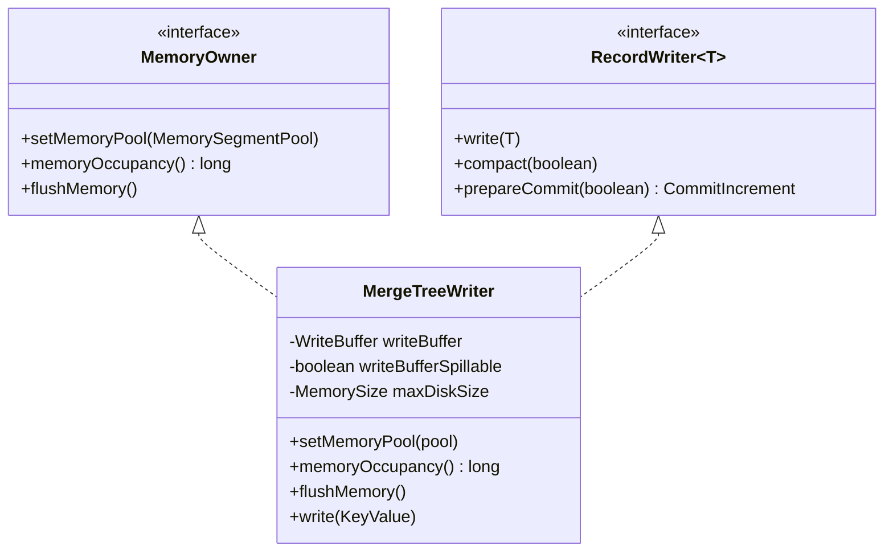
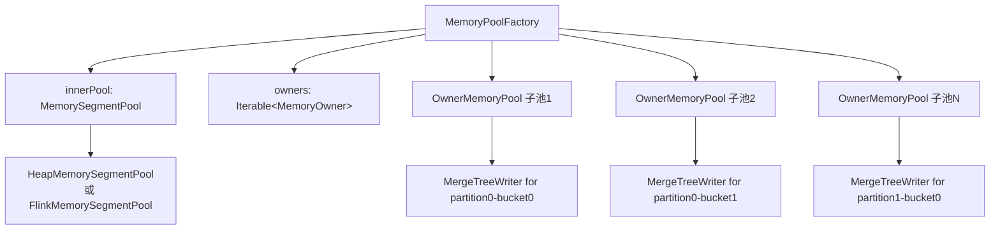
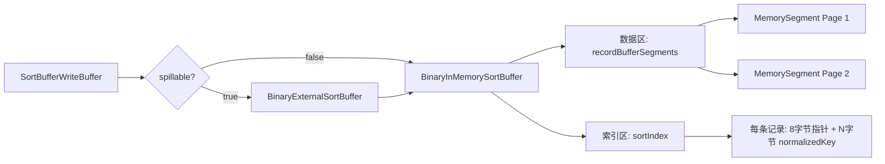
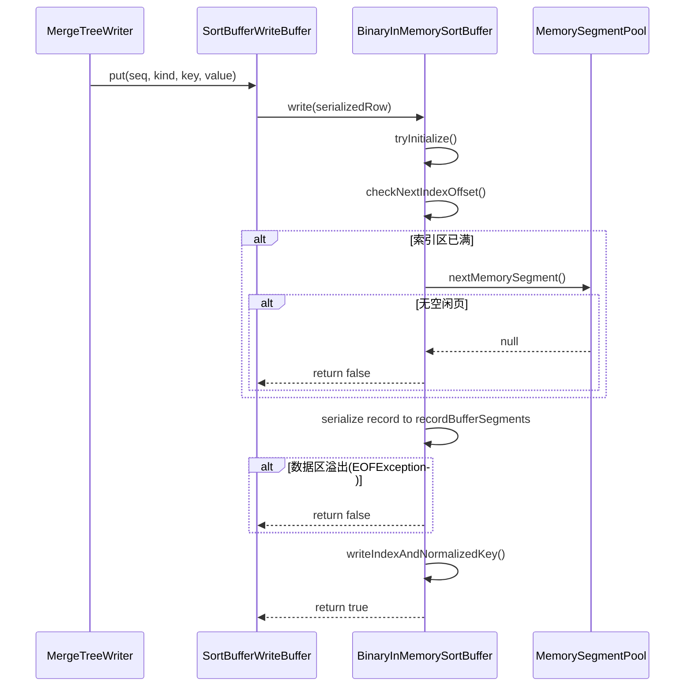
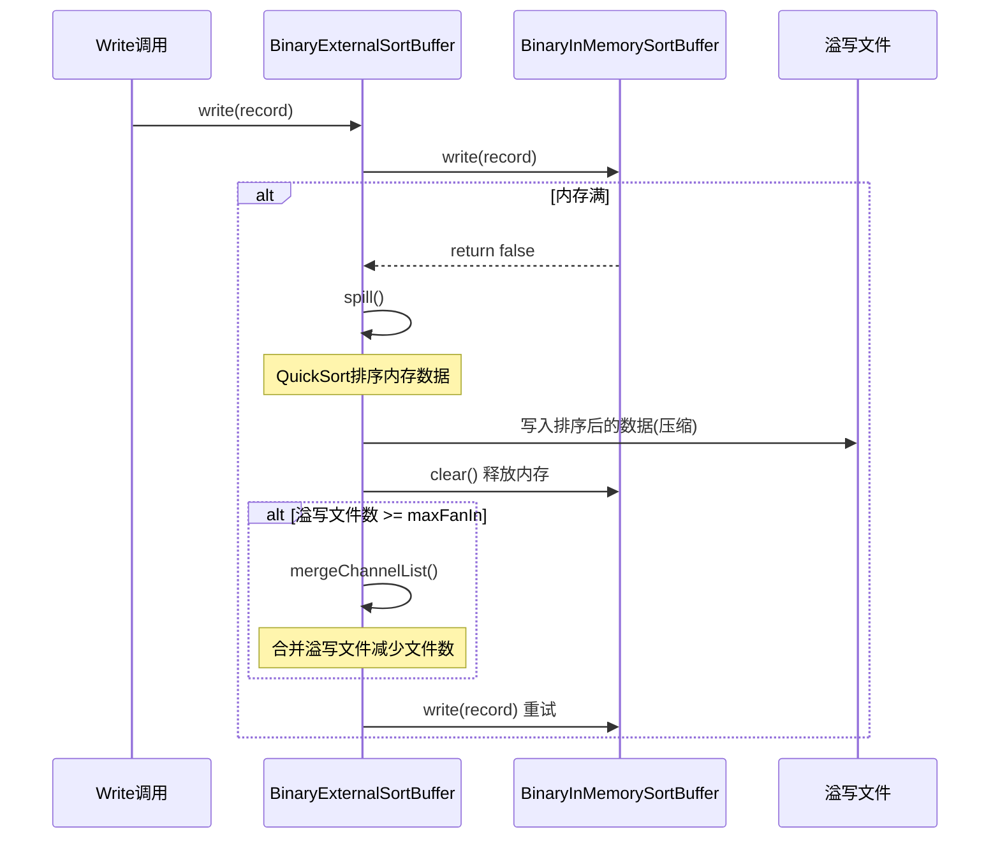
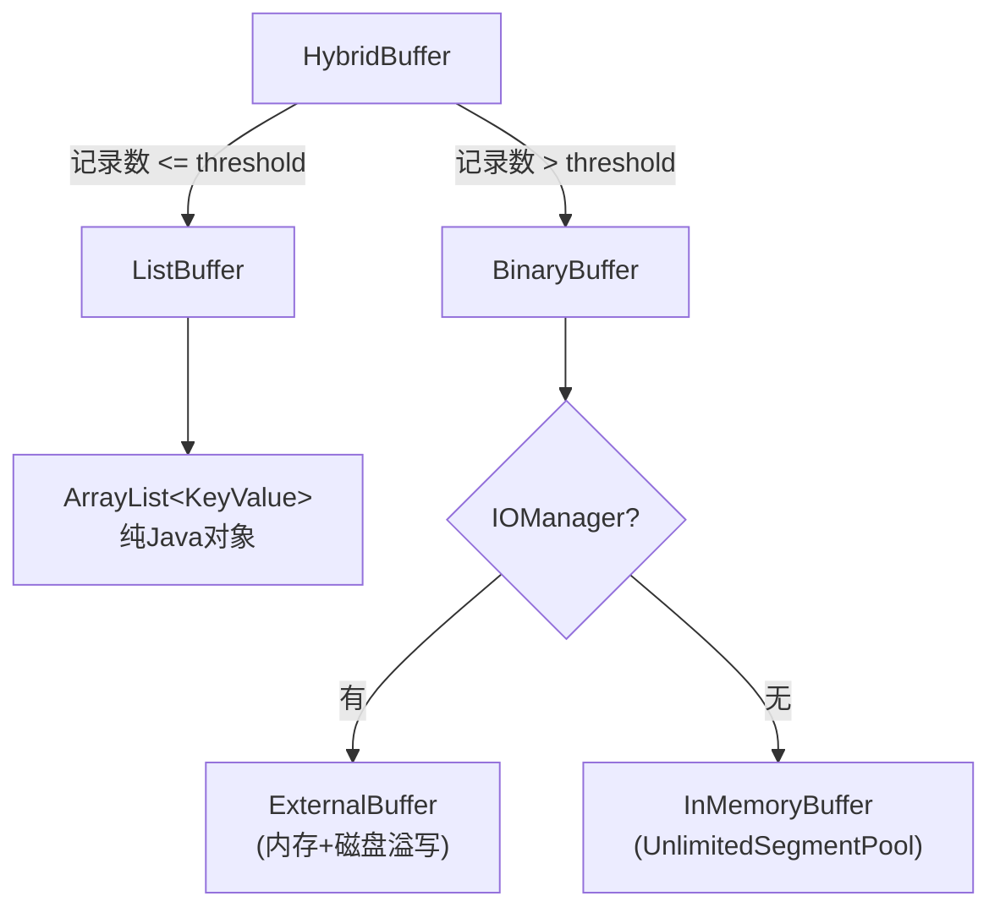
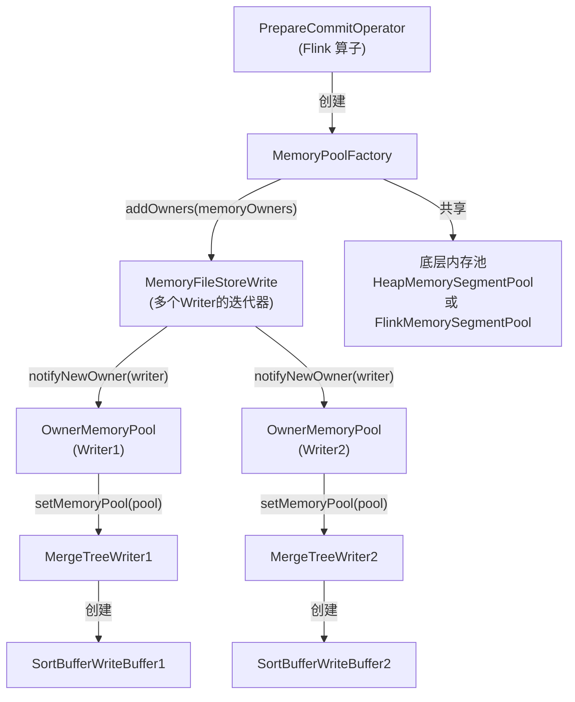
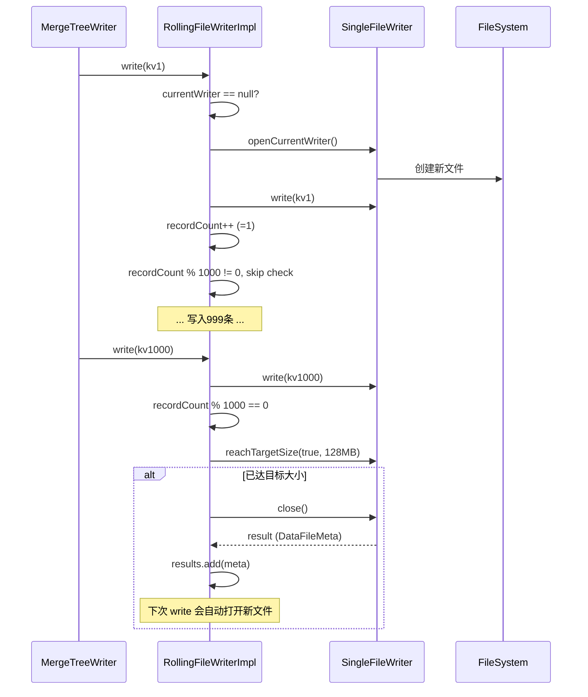
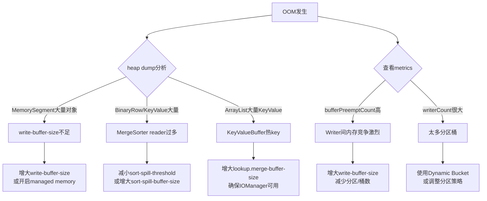
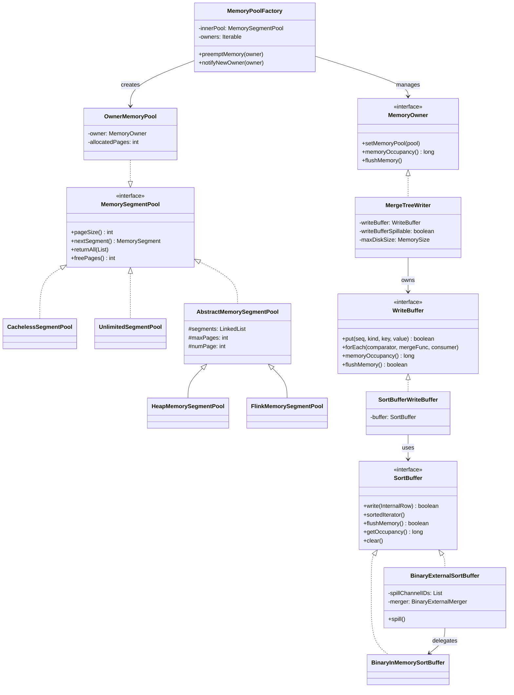

# Apache Paimon 内存管理与溢写机制深度分析

> 基于 Paimon 1.5-SNAPSHOT (master 分支, commit: 55f4fd175)

---

## 目录

- [1. MemoryOwner 接口体系](#1-memoryowner-接口体系)
- [2. MemoryPoolFactory - 内存池与抢占机制](#2-memorypoolFactory---内存池与抢占机制)
- [3. SortBufferWriteBuffer - 内存排序缓冲区](#3-sortbufferwritebuffer---内存排序缓冲区)
- [4. 磁盘溢写 (Spill) 机制](#4-磁盘溢写-spill-机制)
- [5. MergeSorter 的外部排序](#5-mergesorter-的外部排序)
- [6. KeyValueBuffer - 混合缓冲](#6-keyvaluebuffer---混合缓冲)
- [7. Flink 内存集成](#7-flink-内存集成)
- [8. RollingFileWriter - 文件滚动写入](#8-rollingfilewriter---文件滚动写入)
- [9. OOM 场景分析](#9-oom-场景分析)
- [10. 与 Flink State Backend 内存管理的对比](#10-与-flink-state-backend-内存管理的对比)

---

## 1. MemoryOwner 接口体系

### 解决什么问题

**核心业务问题**: 在流式写入场景下，一个 Flink Subtask 可能同时写入多个分区和桶（例如100个分区 × 10个桶 = 1000个写入器），如何在这些写入器之间公平地分配和动态调配有限的内存资源？

**没有这个设计的后果**:
- 每个写入器独立申请内存，可能导致某些写入器占用大量内存而其他写入器饿死
- 无法在内存不足时主动释放内存，只能等待 OOM
- 无法感知全局内存使用情况，难以做出合理的内存分配决策

**实际场景**:
```java
// 场景：电商订单表按日期分区，按用户ID哈希分桶
// 高峰期可能同时写入：
// - 30天的分区（历史数据补录）
// - 每个分区256个桶
// = 7680个 MergeTreeWriter 实例
// 如果每个 Writer 独占 10MB，需要 75GB 内存！
```

### 有什么坑

**陷阱1: 分区桶数爆炸**
```java
// 错误配置
CREATE TABLE orders (
    order_id BIGINT,
    user_id BIGINT,
    order_date STRING,
    ...
) PARTITIONED BY (order_date)  -- 365个分区
WITH (
    'bucket' = '512'  -- 每个分区512个桶
);
// 结果：365 × 512 = 186,880 个潜在 Writer
// 即使 write-buffer-size=1GB，每个 Writer 只能分到 5KB！
```

**解决方案**: 使用 Dynamic Bucket 模式或减少桶数
```sql
WITH (
    'bucket' = '-1',  -- Dynamic Bucket
    'dynamic-bucket.target-row-num' = '2000000'
);
```

**陷阱2: 误以为 memoryOccupancy() 是实时的**
```java
// 错误理解：认为 memoryOccupancy() 会立即反映每次 write 的内存变化
// 实际：只在抢占时被调用，不是实时监控指标
```

**陷阱3: flushMemory() 失败被忽略**
```java
// 生产环境问题：磁盘配额用完后 flushMemory() 返回 false
// 如果上层没有正确处理，会导致内存持续增长
// Paimon 的处理：MergeTreeWriter 会 fallback 到 flushWriteBuffer()
```

### 核心概念解释

**MemoryOwner（内存所有者）**: 一个需要使用内存的组件，能够报告自己的内存使用量并在需要时释放内存。类似于操作系统中的"进程"概念，但更轻量。

**内存抢占（Memory Preemption）**: 当内存不足时，系统主动选择一个占用内存最多的 Owner，强制其释放内存（通过调用 flushMemory()）。这是一种"协作式"内存管理，不同于操作系统的"强制式"页面置换。

**与其他系统对比**:
- **Flink RocksDB State Backend**: 使用 RocksDB 的 Block Cache，基于 LRU 被动淘汰，无主动抢占
- **Spark Tungsten**: 使用 MemoryConsumer 接口，也有类似的 spill 机制，但 Spark 是基于 Task 级别的内存管理
- **Paimon 的特点**: 更细粒度（Writer 级别），支持跨 Writer 的动态内存调配

### 设计理念

**为什么选择接口而非抽象类？**
- `MergeTreeWriter` 已经实现了 `RecordWriter` 接口，Java 不支持多继承
- 接口提供了最大的灵活性，未来可以让其他组件（如 Reader）也实现 MemoryOwner

**为什么是三个方法？**
1. `setMemoryPool()`: 依赖注入模式，解耦内存来源（堆内存 vs Flink Managed Memory）
2. `memoryOccupancy()`: 决策依据，必须快速返回（不能有 I/O 操作）
3. `flushMemory()`: 执行动作，允许有 I/O 操作（写磁盘）

**权衡取舍**:
- **优点**: 简单直接，易于理解和实现
- **缺点**: 抢占操作是同步的，可能阻塞写入线程
- **为什么接受这个代价**: 内存不足是低频事件，偶尔的阻塞可以接受；异步抢占会增加复杂度和并发问题

**架构演进**: 早期版本可能没有统一的内存管理，每个 Writer 独立管理内存。引入 MemoryOwner 接口后，实现了全局内存调配，这是向"资源统一管理"演进的关键一步。

### 1.1 接口定义

```java
// paimon-core/.../memory/MemoryOwner.java
public interface MemoryOwner {
    void setMemoryPool(MemorySegmentPool memoryPool);
    long memoryOccupancy();
    void flushMemory() throws Exception;
}
```

**源码路径**: `paimon-core/src/main/java/org/apache/paimon/memory/MemoryOwner.java`

### 1.2 三个方法的语义

| 方法 | 语义 | 为什么需要 |
|------|------|-----------|
| `setMemoryPool(pool)` | 为该 Owner 注入一个内存池代理 | 解耦内存分配和使用者。Owner 不关心内存来自堆还是 Flink Managed Memory，只通过池接口申请页 |
| `memoryOccupancy()` | 返回当前占用的内存字节数 | **内存抢占的决策依据**。MemoryPoolFactory 遍历所有 Owner，找到占用最大的进行 flush |
| `flushMemory()` | 将内存中的数据刷写到磁盘，释放内存页 | 在内存不足时被调用，是"让出内存"的核心动作 |

### 1.3 谁实现了 MemoryOwner

**核心实现者**: `MergeTreeWriter`

```java
// paimon-core/.../mergetree/MergeTreeWriter.java (第58行)
public class MergeTreeWriter implements RecordWriter<KeyValue>, MemoryOwner {
```

`MergeTreeWriter` 是主键表 (Primary Key Table) 的写入器，每个分区-桶的写入器都是一个 `MemoryOwner`。

**实现细节**:

- `setMemoryPool()` (第149行): 使用注入的内存池创建 `SortBufferWriteBuffer`
- `memoryOccupancy()` (第197行): 委托给 `writeBuffer.memoryOccupancy()`，返回 sort buffer 中数据 + 索引占用的字节数
- `flushMemory()` (第202行): 先尝试 `writeBuffer.flushMemory()`（溢写到本地磁盘），如果失败（例如磁盘配额已满），则调用 `flushWriteBuffer()` 将整个 buffer 排序合并后写出为 LSM 数据文件

### 1.4 设计决策

**为什么让 RecordWriter 实现 MemoryOwner？**

- **好处1**: 一个 Flink Subtask 可能写入多个分区和桶，每个桶有自己的 MergeTreeWriter。通过 MemoryOwner 接口，内存池可以在这些 Writer 之间动态调配内存。
- **好处2**: Writer 可以被外部（MemoryPoolFactory）强制要求释放内存，实现了"内存抢占"机制，避免某个桶的 Writer 独占所有内存导致其他桶无法写入。

### 1.5 类关系图



---

## 2. MemoryPoolFactory - 内存池与抢占机制

### 解决什么问题

**核心业务问题**: 如何让多个 Writer 共享一个内存池，同时避免某个 Writer 独占所有内存导致其他 Writer 无法工作？

**没有这个设计的后果**:
- 静态分配内存：每个 Writer 预分配固定内存，导致内存利用率低（某些 Writer 空闲时内存浪费）
- 无限制分配：先到先得，可能导致后来的 Writer 完全无法获得内存
- 无法应对动态负载：无法根据实际写入压力动态调整内存分配

**实际场景**:
```java
// 场景：实时数仓 ETL 任务
// - 凌晨0-6点：只写入少量实时数据（10个活跃分区）
// - 白天8-18点：大量历史数据回填（100个活跃分区）
// 
// 使用 MemoryPoolFactory 后：
// - 凌晨：10个 Writer 平均每个可用 25MB（总256MB）
// - 白天：100个 Writer 共享256MB，通过抢占机制动态平衡
// - 热点分区的 Writer 可以占用更多内存，冷分区被抢占后释放
```

### 有什么坑

**陷阱1: 抢占风暴（Preemption Storm）**
```java
// 问题场景：所有 Writer 内存占用都很接近
// Writer1: 10MB, Writer2: 10MB, Writer3: 10MB, ...
// 当内存不足时，每次只抢占一个 Writer（10MB）
// 但新的 write 可能需要 50MB，导致连续抢占多个 Writer
// 
// 现象：bufferPreemptCount 指标暴增，写入延迟抖动
```

**解决方案**: 增大 `write-buffer-size` 或减少并发 Writer 数量

**陷阱2: 自己抢占自己的死锁风险**
```java
// Paimon 已经避免了这个问题（第172行检查 other != owner）
// 但如果自己实现类似机制，容易犯这个错误：
if (other.memoryOccupancy() > maxMemory) {  // 忘记检查 other != owner
    max = other;
}
// 结果：Writer 在 write() 过程中触发自己的 flushMemory()
// 导致 SortBuffer 状态不一致
```

**陷阱3: 误解 freePages() 的含义**
```java
// 错误理解：认为 OwnerMemoryPool.freePages() 返回全局剩余页数
// 实际：返回的是 totalPages - allocatedPages
// 这是该 Owner 的"视图"，不是全局真实剩余

// 影响：初始化检查时可能误判
if (pool.freePages() < 3) {
    throw new Exception("Not enough memory");
}
// 实际上全局可能还有很多空闲页，只是这个 Owner 还没分配
```

### 核心概念解释

**内存池工厂（MemoryPoolFactory）**: 不是真正的"池"，而是一个"代理工厂"。它将一个底层内存池（innerPool）包装成多个 OwnerMemoryPool，每个 Owner 通过自己的代理池访问共享的底层池。

**OwnerMemoryPool**: 一个轻量级的代理，记录该 Owner 已分配的页数，但实际内存分配仍然从共享的 innerPool 中获取。类似于"虚拟内存"的概念，每个进程看到的是独立的地址空间，但物理内存是共享的。

**抢占策略对比**:
| 策略 | Paimon 实现 | 优点 | 缺点 |
|------|------------|------|------|
| 抢占最大 Owner | ✓ | 释放内存最多，减少抢占次数 | 可能对大任务不公平 |
| 抢占最老 Owner | ✗ | 公平性好 | 释放内存可能很少 |
| 抢占随机 Owner | ✗ | 实现简单 | 效率低，可能多次抢占 |
| LRU 抢占 | ✗ | 符合局部性原理 | 需要维护访问时间戳 |

### 设计理念

**为什么选择"共享池 + 抢占"而非"配额制"？**

**配额制方案**（未采用）:
```java
// 每个 Owner 预分配固定配额
OwnerMemoryPool pool1 = new OwnerMemoryPool(quota = 10MB);
OwnerMemoryPool pool2 = new OwnerMemoryPool(quota = 10MB);
// 问题：pool1 空闲时，pool2 无法使用 pool1 的配额
```

**共享池方案**（Paimon 采用）:
```java
// 所有 Owner 共享同一个池，无预分配配额
// 好处：内存利用率高，动态适应负载变化
// 代价：需要抢占机制来避免饥饿
```

**为什么抢占最大 Owner？**
- **数学依据**: 假设需要释放 M 字节内存，抢占最大 Owner（占用 X 字节）的期望抢占次数为 M/X。如果抢占小 Owner（占用 Y 字节，Y << X），期望抢占次数为 M/Y，远大于 M/X。
- **工程实践**: 减少抢占次数意味着减少 I/O 操作（flush 到磁盘），提升整体吞吐。

**权衡取舍**:
- **优点**: 内存利用率高，实现简单，适应动态负载
- **缺点**: 可能出现"大 Writer 被频繁抢占"的不公平现象
- **为什么接受**: 在流式写入场景下，写入压力通常是均匀分布的；如果某个分区持续高负载，应该通过增加并行度而非独占内存来解决

**与业界对比**:
- **Spark Tungsten**: 使用 TaskMemoryManager，基于 Task 级别的内存管理，也有 spill 机制，但粒度更粗
- **Flink MemoryManager**: 提供 MemorySegment 分配，但不负责抢占逻辑，由上层算子自行实现
- **Paimon 的创新**: 在 Writer 级别实现细粒度的内存管理和抢占，填补了 Flink 内存管理的空白

### 2.1 核心架构

**源码路径**: `paimon-core/src/main/java/org/apache/paimon/memory/MemoryPoolFactory.java`



### 2.2 内存分配策略

`MemoryPoolFactory` 是一个**共享内存池工厂**，它将一个底层内存池（`innerPool`）代理为多个 `OwnerMemoryPool`，分配给不同的 `MemoryOwner`。

**关键设计**: 所有 Owner 共享同一个底层内存池，采用"先到先得 + 被动抢占"策略。

```java
// OwnerMemoryPool.nextSegment() (第140-150行)
public MemorySegment nextSegment() {
    MemorySegment segment = innerPool.nextSegment();
    if (segment == null) {
        preemptMemory(owner);          // 内存不足时触发抢占
        segment = innerPool.nextSegment(); // 抢占后重试
    }
    if (segment != null) {
        allocatedPages++;
    }
    return segment;
}
```

**OwnerMemoryPool 的内存视图**:

```java
// OwnerMemoryPool.freePages() 返回全局剩余页数
public int freePages() {
    return totalPages - allocatedPages;  // 返回该Owner的剩余配额
}
```

**设计要点**:
- `innerPool`: 全局共享的底层内存池（所有 Owner 共享）
- `allocatedPages`: 该 Owner 已分配的页数（独立计数）
- `totalPages`: 全局总页数（在 MemoryPoolFactory 构造时记录）
- `freePages()`: 返回**该 Owner 的剩余配额**（totalPages - allocatedPages）

**为什么返回 Owner 的剩余配额？**
- Paimon 采用"无配额"的共享内存模型，但每个 Owner 独立计数已分配页数
- `freePages()` 用于初始化检查（如 `BinaryInMemorySortBuffer` 要求至少 3 页），需要检查该 Owner 是否有足够空间
- **好处**: 简化实现，避免复杂的配额管理和碎片问题
- **代价**: 可能出现某个 Owner 独占大部分内存的情况（通过抢占机制缓解）

### 2.3 内存抢占机制

**算法**: 遍历所有 Owner，找到**内存占用最大的（但不是自己）**，对其调用 `flushMemory()`。

```java
// preemptMemory() (第73-93行)
private void preemptMemory(MemoryOwner owner) {
    long maxMemory = 0;
    MemoryOwner max = null;
    for (MemoryOwner other : owners) {
        // 不抢占自己！同时写和flush可能导致不一致状态
        if (other != owner && other.memoryOccupancy() > maxMemory) {
            maxMemory = other.memoryOccupancy();
            max = other;
        }
    }
    if (max != null) {
        max.flushMemory();
        ++bufferPreemptCount;
    }
}
```

**为什么不抢占自己？**
- 注释明确说明: "Don't preempt yourself! Write and flush at the same time, which may lead to inconsistent state"
- 一个 Writer 如果正在 write 过程中触发自己的 flush，可能导致排序缓冲区状态不一致。

**为什么选择占用最大的 Owner？**
- **好处**: 最大 occupancy 的 Owner flush 后能释放最多内存，减少抢占次数。
- **好处**: 避免频繁抢占小 Owner 导致的 "内存颠簸"（thrashing）。

### 2.4 底层内存池类型

| 实现类 | 源码路径 | 特点 |
|--------|----------|------|
| `HeapMemorySegmentPool` | `paimon-common/.../memory/HeapMemorySegmentPool.java` | 堆内存分配，有回收缓存（继承 `AbstractMemorySegmentPool`） |
| `FlinkMemorySegmentPool` | `paimon-flink/.../memory/FlinkMemorySegmentPool.java` | 从 Flink Managed Memory 分配 off-heap 内存 |
| `CachelessSegmentPool` | `paimon-common/.../memory/CachelessSegmentPool.java` | 无缓存堆内存池，归还时仅减计数，由 GC 回收 |
| `UnlimitedSegmentPool` | `paimon-common/.../memory/UnlimitedSegmentPool.java` | 无限制堆分配，`freePages()` 返回 `Integer.MAX_VALUE` |

**`AbstractMemorySegmentPool`** 的核心实现（第40-49行）:
```java
public MemorySegment nextSegment() {
    if (this.segments.size() > 0) {
        return this.segments.poll();    // 优先从归还的段中取
    } else if (numPage < maxPages) {
        numPage++;
        return allocateMemory();         // 不超限则新分配
    }
    return null;                         // 无可用内存
}
```

**为什么有回收缓存？**
- **好处**: 避免反复 allocate/GC 的开销。`LinkedList<MemorySegment>` 作为空闲列表，归还后的 segment 直接复用。

**`CachelessSegmentPool` vs `HeapMemorySegmentPool`**:
- CachelessSegmentPool 归还时只减计数不缓存，适用于 MergeSorter 等场景，内存段用完即弃（由 GC 回收），因为 sort-merge 读取的数据生命周期与 buffer 不同。

---

## 3. SortBufferWriteBuffer - 内存排序缓冲区

### 解决什么问题

**核心业务问题**: 主键表需要对相同 key 的多次更新进行合并（merge），如何在内存中高效地组织和排序数据，以便后续的 merge 操作？

**没有这个设计的后果**:
- 使用 HashMap 存储：无法保证顺序，merge 时需要额外排序，内存占用大（Java 对象开销）
- 直接写入文件：每次 write 都触发 I/O，性能极差
- 无序缓冲：merge 时需要全量扫描，时间复杂度 O(n²)

**实际场景**:
```java
// 场景：用户行为表，频繁更新同一用户的最新状态
// 输入数据（乱序）：
// user_id=1001, action=login,  seq=100
// user_id=1002, action=click,  seq=101
// user_id=1001, action=logout, seq=102  // 同一用户的后续更新
// user_id=1001, action=login,  seq=103
// 
// SortBufferWriteBuffer 的处理：
// 1. 写入时不排序，直接序列化到内存页（快速写入）
// 2. flush 时排序：按 user_id + seq 排序
//    -> user_id=1001, seq=100, action=login
//    -> user_id=1001, seq=102, action=logout
//    -> user_id=1001, seq=103, action=login
//    -> user_id=1002, seq=101, action=click
// 3. merge 时相同 key 的记录相邻，可以流式合并
//    -> user_id=1001: 最终状态 login (seq=103)
//    -> user_id=1002: 最终状态 click (seq=101)
```

### 有什么坑

**陷阱1: 最少3页内存的硬性要求**
```java
// 错误配置
WITH (
    'write-buffer-size' = '128KB',  -- 只有2页（64KB/页）
    'bucket' = '100'
);
// 结果：每个 Writer 分不到3页，初始化失败
// 错误信息：BinaryInMemorySortBuffer requires at least 3 pages

// 计算公式：write-buffer-size >= bucket数 × 3 × page-size
// 正确配置：128KB × 100 × 3 × 64KB = 19.2MB（最少）
```

**陷阱2: 排序字段顺序理解错误**
```java
// 错误理解：认为只按主键排序
// 实际排序字段：key fields → user-defined-seq → system seq

// 场景：partial-update 表，用户定义 sequence.field = 'update_time'
CREATE TABLE user_profile (
    user_id BIGINT PRIMARY KEY NOT ENFORCED,
    name STRING,
    age INT,
    update_time BIGINT
) WITH (
    'merge-engine' = 'partial-update',
    'fields.age.sequence-group' = 'age_group',
    'sequence.field' = 'update_time'
);

// 排序顺序：
// 1. user_id (主键)
// 2. update_time (用户定义序列)
// 3. system sequence (写入顺序)

// 如果只按 user_id 排序，无法正确处理乱序到达的更新
```

**陷阱3: normalized key 的长度限制**
```java
// 问题：normalized key 只取前 N 字节（通常8-16字节）
// 对于长字符串主键，normalized key 可能相同
// 导致排序时频繁回退到完整记录比较

// 示例：主键是 UUID 字符串（36字节）
// normalized key 只取前8字节，碰撞概率高
// 
// 优化建议：使用数值型主键（BIGINT）而非字符串
```

### 核心概念解释

**排序缓冲区（Sort Buffer）**: 一个内存中的数据结构，支持快速写入和排序后遍历。类似于数据库的"排序区"（Sort Area），但 Paimon 的实现更紧凑。

**二进制序列化（Binary Serialization）**: 将 Java 对象（InternalRow）序列化为紧凑的二进制格式，存储在 MemorySegment 中。好处是内存占用小（无 Java 对象头开销），CPU cache 友好。

**Normalized Key**: 从完整记录中提取的固定长度前缀，用于快速比较。类似于数据库索引中的"前缀索引"。

**数据结构对比**:
| 方案 | 内存占用 | 写入性能 | 排序性能 | Paimon 是否采用 |
|------|---------|---------|---------|----------------|
| ArrayList<KeyValue> | 高（对象开销大） | 快 | 慢（对象比较） | 否 |
| TreeMap<Key, Value> | 高（红黑树节点） | 慢（插入时排序） | 无需排序 | 否 |
| 页式数组 + 索引 | 低（紧凑二进制） | 快（顺序写入） | 快（索引排序） | ✓ |

### 设计理念

**为什么选择"延迟排序"而非"插入时排序"？**

**插入时排序**（如 TreeMap）:
- 每次插入需要 O(log n) 时间查找插入位置
- 需要维护树结构，内存开销大
- 适合需要实时查询的场景

**延迟排序**（Paimon 采用）:
- 写入时 O(1)，直接追加到内存页
- 排序时一次性 QuickSort，平均 O(n log n)
- 适合批量写入、批量读取的场景

**为什么选择 QuickSort + HeapSort 混合？**
- QuickSort 平均性能最好，但最坏情况 O(n²)
- HeapSort 保证 O(n log n)，但常数因子较大
- 混合策略（Introsort）：结合两者优点，避免最坏情况

**为什么需要 normalized key？**
```java
// 没有 normalized key 的比较（慢）：
// 1. 根据索引条目的指针，定位到数据页
// 2. 反序列化完整记录
// 3. 逐字段比较

// 有 normalized key 的比较（快）：
// 1. 直接比较索引条目中的 normalized key（纯内存操作）
// 2. 只有 normalized key 相同时才回退到完整比较

// 性能提升：对于数值型主键，90%+ 的比较只需要 normalized key
```

**权衡取舍**:
- **优点**: 内存紧凑，写入快速，排序高效
- **缺点**: 不支持随机查询（必须排序后遍历），不适合 OLTP 场景
- **为什么接受**: Paimon 是 OLAP 系统，写入是批量的，不需要实时查询

**架构演进**: 早期版本可能使用 Java 集合类（如 ArrayList），后来为了降低内存占用和提升性能，演进为页式二进制存储。这是典型的"从易用性到性能"的演进路径。

### 3.1 职责

**源码路径**: `paimon-core/src/main/java/org/apache/paimon/mergetree/SortBufferWriteBuffer.java`

`SortBufferWriteBuffer` 是主键表写入的核心缓冲层，负责:
1. 接收 KeyValue 记录，序列化为二进制格式存入内存页
2. 维护排序索引，支持按 key + sequence 排序遍历
3. 在内存满时支持溢写到磁盘（如果 spillable=true）

### 3.2 核心结构



### 3.3 排序字段设计

```java
// 构造函数中的排序字段顺序 (第79-91行)
// 1. key fields (所有主键字段)
IntStream sortFields = IntStream.range(0, keyType.getFieldCount());
// 2. 用户自定义序列字段 (如果有)
if (userDefinedSeqComparator != null) {
    IntStream udsFields =
            IntStream.of(userDefinedSeqComparator.compareFields())
                    .map(operand -> operand + keyType.getFieldCount() + 2);
    sortFields = IntStream.concat(sortFields, udsFields);
}
// 3. sequence field (系统序列号)
sortFields = IntStream.concat(sortFields, IntStream.of(keyType.getFieldCount()));
```

**序列化后的 Row 结构**:

| 字段索引 | 字段类型 | 说明 |
|---------|---------|------|
| 0 ~ keyFieldCount-1 | key fields | 主键字段 |
| keyFieldCount | BigInt | 系统 sequence 字段 |
| keyFieldCount+1 | TinyInt | valueKind 字段 (INSERT/UPDATE_BEFORE/UPDATE_AFTER/DELETE) |
| keyFieldCount+2 ~ end | value fields | 值字段 |

**排序字段索引映射**:
- 主键字段: 直接使用索引 `0 ~ keyFieldCount-1`
- 系统 sequence: 索引 `keyFieldCount`
- 用户自定义序列字段: 原始索引在 value 中，映射到序列化 row 中需要 `+keyFieldCount+2`

**为什么按这个顺序排序？**
- 主键字段优先：确保相同 key 的记录相邻
- 用户自定义序列字段次之：支持用户定义的去重逻辑
- 系统 sequence 字段最后：同一 key 同一用户序列下，按写入顺序排列

**好处**: 排序后遍历时，相同 key 的记录自然分组，可以直接进行 merge（`MergeIterator`），无需额外的 hash 或 group-by 操作。

### 3.4 写入流程 (put)

```java
// SortBufferWriteBuffer.put() (第130-133行)
public boolean put(long sequenceNumber, RowKind valueKind, InternalRow key, InternalRow value)
        throws IOException {
    return buffer.write(serializer.toRow(key, sequenceNumber, valueKind, value));
}
```

底层调用 `BinaryInMemorySortBuffer.write()` (第165-189行):



**为什么最少需要3页内存？** (第106-109行)
- 1页用于排序索引区（sortIndex）
- 1页用于数据存储区（recordBufferSegments）
- 1页作为序列化缓冲（SimpleCollectingOutputView 跨页写入时需要）

### 3.5 排序算法

`BinaryInMemorySortBuffer.sortedIterator()` (第246-251行):

```java
public final MutableObjectIterator<BinaryRow> sortedIterator() {
    if (numRecords > 0) {
        new QuickSort().sort(this);
    }
    return iterator();
}
```

**排序算法: QuickSort + HeapSort 混合**

**源码路径**: `paimon-core/src/main/java/org/apache/paimon/sort/QuickSort.java`

| 条件 | 算法 | 原因 |
|------|------|------|
| 元素数 < 13 | 插入排序 | 小数据量下插入排序常数因子低于快排 |
| 递归深度 > 2*ceil(log(n)) | HeapSort | 避免快排在最坏情况下退化为 O(n^2) |
| 其他 | 三点取中快排 | 平均 O(nlogn)，原地排序无额外内存 |

**为什么选择这种混合排序？**
- **好处**: 结合了快排的平均性能优势和堆排的最坏情况保证，即 Introsort 策略
- **好处**: 排序操作直接在索引区上进行（swap 只交换索引条目），数据区零拷贝

**Normalized Key 优化**:
- 每个索引条目包含 `8字节数据指针 + N字节normalizedKey`
- 比较时优先比较 normalizedKey（纯内存字节比较），只有 normalizedKey 无法确定顺序时才回退到完整记录比较
- **好处**: 大幅减少反序列化和跨页随机读取次数

### 3.6 forEach - 排序合并遍历

`forEach()` (第151-164行) 是 flush 时的核心方法：

```java
public void forEach(
        Comparator<InternalRow> keyComparator,
        MergeFunction<KeyValue> mergeFunction,
        @Nullable KvConsumer rawConsumer,
        KvConsumer mergedConsumer) throws IOException {
    MergeIterator mergeIterator =
            new MergeIterator(rawConsumer, buffer.sortedIterator(), keyComparator, mergeFunction);
    while (mergeIterator.hasNext()) {
        mergedConsumer.accept(mergeIterator.next());
    }
}
```

**MergeIterator** 是一个内部类（第176行），在排序后的迭代器上做同 key 合并：
- 读取下一条记录，与前一条比较 key
- 相同 key 的记录放入 MergeFunction 进行合并
- 不同 key 时输出合并结果并开始新的一组

**为什么在 flush 时做合并？**
- **好处**: 减少写出到文件的数据量（同 key 的多次更新合并为一条）
- **好处**: 降低后续 compaction 的压力

### 3.7 clear

`clear()` 调用 `buffer.clear()`，将所有内存页归还给 MemorySegmentPool，重置所有偏移量。`BinaryInMemorySortBuffer.clear()` (第126-139行) 调用 `returnToSegmentPool()` 将排序索引和数据区的页面全部归还。

---

## 4. 磁盘溢写 (Spill) 机制

### 解决什么问题

**核心业务问题**: 当写入速度超过内存容量时，如何避免 OOM，同时保证数据不丢失？

**没有这个设计的后果**:
- 内存不足时直接 OOM，任务失败
- 或者强制 flush 为数据文件，产生大量小文件，严重影响后续查询性能
- 无法处理超大批次的数据写入（如历史数据回填）

**实际场景**:
```java
// 场景1：历史数据回填
// - 需要导入 1TB 历史数据
// - 内存只有 10GB
// - 如果不溢写，只能写入 10GB 就 OOM

// 场景2：流式写入高峰
// - 正常流量：1万条/秒，内存足够
// - 突发流量：10万条/秒（如促销活动）
// - 溢写机制：自动将部分数据写入磁盘，平滑处理峰值

// 场景3：多表并发写入
// - 100个表同时写入
// - 总内存 10GB，平均每表 100MB
// - 某个热点表突然涌入大量数据
// - 溢写机制：热点表溢写到磁盘，其他表继续使用内存
```

### 有什么坑

**陷阱1: 磁盘空间不足导致溢写失败**
```java
// 配置了溢写，但磁盘空间不足
WITH (
    'write-buffer-spillable' = 'true',
    'write-buffer-spill.max-disk-size' = '100GB'  // 但实际磁盘只有50GB
);

// 现象：
// 1. 内存满，触发溢写
// 2. 磁盘写满，flushMemory() 返回 false
// 3. MergeTreeWriter fallback 到 flushWriteBuffer()
// 4. 产生大量小文件（每个只有几MB）
// 5. 后续 compaction 压力巨大，查询性能下降

// 监控指标：
// - 溢写文件数量突增
// - 数据文件数量突增
// - 平均文件大小骤降
```

**解决方案**: 
- 监控磁盘空间，预留足够的溢写空间
- 或者调大 `write-buffer-size`，减少溢写频率

**陷阱2: 溢写文件数量超过 max-num-file-handles**
```java
// 场景：长时间运行的流式任务，持续溢写
// 默认 max-num-file-handles = 128
// 如果溢写文件数超过128，会触发中间合并

// 问题：中间合并是 I/O 密集操作，可能导致：
// 1. 写入延迟突增（合并时阻塞写入）
// 2. 磁盘 I/O 打满
// 3. 如果合并速度 < 溢写速度，文件数持续增长

// 监控：spillChannelIDs.size() 指标
```

**解决方案**:
- 增大 `local-sort.max-num-file-handles`（如256）
- 增大 `write-buffer-size`，减少溢写频率
- 优化写入速度，避免长时间积压

**陷阱3: 压缩算法选择不当**
```java
// 默认 spill-compression = 'zstd'，压缩率高但 CPU 开销大
// 如果 CPU 是瓶颈，溢写速度慢，反而加剧内存压力

// 场景：CPU 密集型任务（如复杂的 UDF 计算）
// 建议改用 lz4：
WITH (
    'spill-compression' = 'lz4'  // 压缩率略低，但速度快3-5倍
);

// 权衡：
// - zstd: 压缩率 ~3x，速度 ~500MB/s
// - lz4:  压缩率 ~2x，速度 ~2GB/s
```

### 核心概念解释

**溢写（Spill）**: 将内存中的数据临时写入磁盘，释放内存空间。与"flush"的区别：
- **Spill**: 写入临时文件，数据仍在"处理中"状态，后续会读回来合并
- **Flush**: 写入最终的数据文件，数据进入"已提交"状态

**外部排序（External Sort）**: 当数据量超过内存时，分批排序后写入磁盘，最后通过归并排序合并。经典算法，广泛应用于数据库和大数据系统。

**N-way Merge**: 同时打开 N 个已排序的文件，使用优先级队列（小顶堆）进行归并。时间复杂度 O(K log N)，K 为总记录数，N 为文件数。

**溢写策略对比**:
| 策略 | Paimon 实现 | 优点 | 缺点 |
|------|------------|------|------|
| 排序后溢写 | ✓ (BinaryExternalSortBuffer) | 溢写文件有序，归并简单 | 溢写前需要排序，延迟略高 |
| 直接溢写 | ✓ (ExternalBuffer) | 溢写快速，零拷贝 | 归并时需要排序 |
| 压缩溢写 | ✓ (可配置) | 节省磁盘空间 | CPU 开销增加 |

### 设计理念

**为什么需要两层溢写？**

**第一层：WriteBuffer 级别**（BinaryExternalSortBuffer）
- 目的：避免内存 OOM
- 触发条件：内存池无空闲页
- 溢写内容：排序后的内存数据
- 溢写位置：本地临时目录

**第二层：MergeTreeWriter 级别**（flushWriteBuffer）
- 目的：避免溢写文件过多或磁盘空间不足
- 触发条件：flushMemory() 返回 false
- 溢写内容：整个 buffer 的数据
- 溢写位置：最终的数据文件（LSM 文件）

**为什么在溢写前排序？**
```java
// 方案1：不排序直接溢写（未采用）
// - 溢写快，但归并时需要全量排序
// - 如果有10个溢写文件，需要排序10次

// 方案2：排序后溢写（Paimon 采用）
// - 溢写略慢，但每个文件内部有序
// - 归并时只需 N-way merge，无需排序
// - 总体 I/O 量更少

// 数学分析：
// 假设数据量 D，内存 M，溢写文件数 N = D/M
// 方案1：排序成本 = N × (D/N) × log(D/N) = D × log(D/N)
// 方案2：排序成本 = D × log(D/M) + 归并成本 D × log(N)
//       = D × log(D/M) + D × log(D/M) = 2D × log(D/M)
// 当 N 较大时，方案2 更优
```

**为什么需要中间合并？**
- 限制同时打开的文件句柄数（避免"Too many open files"错误）
- 减少最终归并的复杂度（N-way merge 的 N 越小越快）
- 类似于 LSM-tree 的 tiered compaction 策略

**权衡取舍**:
- **优点**: 支持超大数据量写入，避免 OOM，内存利用率高
- **缺点**: 溢写和归并增加 I/O 开销，延迟略高
- **为什么接受**: 对于批处理场景，吞吐量比延迟更重要；对于流式场景，溢写是低频事件

**与业界对比**:
- **Spark Shuffle**: 也使用外部排序，但 Spark 的溢写是基于 Partition 的，粒度更粗
- **Flink Sort**: Flink 的 sort 算子也有类似机制，但 Paimon 的溢写是 Writer 级别的，更细粒度
- **RocksDB**: RocksDB 的 memtable flush 也是一种溢写，但 RocksDB 是 LSM-tree 的一部分，而 Paimon 的溢写是临时的

### 4.1 溢写的触发条件

溢写涉及两个层面：

**层面1: WriteBuffer 级别的溢写** (SortBufferWriteBuffer → BinaryExternalSortBuffer)

当 `writeBufferSpillable=true` 且 IOManager 不为空时，SortBufferWriteBuffer 内部使用 `BinaryExternalSortBuffer` 而非纯内存的 `BinaryInMemorySortBuffer`。

```java
// SortBufferWriteBuffer 构造函数 (第115-127行)
this.buffer = ioManager != null && spillable
    ? new BinaryExternalSortBuffer(...)
    : inMemorySortBuffer;
```

**层面2: MergeTreeWriter 级别的 flush**

当 `writeBuffer.flushMemory()` 返回 false（磁盘配额已满）时，MergeTreeWriter 将整个 buffer 排序后写成 LSM 数据文件:

```java
// MergeTreeWriter.flushMemory() (第202-207行)
public void flushMemory() throws Exception {
    boolean success = writeBuffer.flushMemory();
    if (!success) {
        flushWriteBuffer(false, false);  // 写出为数据文件
    }
}
```

### 4.2 关键配置参数

| 参数 | 默认值 | 作用 | 源码位置 |
|------|--------|------|----------|
| `write-buffer-spillable` | `true` | 是否允许 WriteBuffer 溢写到本地磁盘 | CoreOptions 第672-676行 |
| `write-buffer-spill.max-disk-size` | `MemorySize.MAX_VALUE` (无限) | 单个 Writer 溢写文件的最大磁盘用量 | CoreOptions 第664-670行 |
| `local-sort.max-num-file-handles` | `128` | 外部排序的最大文件句柄数（fan-in） | CoreOptions 第692-699行 |
| `spill-compression` | `"zstd"` | 溢写文件压缩算法 | CoreOptions 第620-625行 |
| `spill-compression.zstd-level` | `1` | zstd 压缩级别 | CoreOptions 第627-632行 |

### 4.3 BinaryExternalSortBuffer 溢写流程

**源码路径**: `paimon-core/src/main/java/org/apache/paimon/sort/BinaryExternalSortBuffer.java`



**spill() 方法** (第248-278行):
1. 创建新的 FileIOChannel
2. 在内存中 QuickSort 排序当前数据
3. 通过 `writeToOutput()` 按排序顺序写出
4. 支持压缩（默认 zstd，block size 64KB）
5. 清空内存缓冲区

**为什么在 spill 前排序？**
- **好处**: 每个溢写文件内部有序，后续归并时只需 N-way merge，无需再排序
- 这是经典的外部排序 (External Sort) 模式

### 4.4 flushMemory() 的磁盘容量检查

```java
// BinaryExternalSortBuffer.flushMemory() (第166-174行)
public boolean flushMemory() throws IOException {
    boolean isFull = getDiskUsage() >= maxDiskSize.getBytes();
    if (isFull) {
        return false;   // 磁盘配额用完，返回false
    } else {
        spill();
        return true;
    }
}
```

**为什么有磁盘容量限制？**
- **好处**: 防止无限溢写导致本地磁盘被打满
- 当返回 false 时，上层 MergeTreeWriter 会将整个 buffer 写成 LSM 数据文件，这是最终的"兜底"策略

### 4.5 溢写文件合并

当溢写文件数达到 `maxNumFileHandles` (默认128) 时，触发中间合并:

```java
// BinaryExternalSortBuffer.write() (第194-214行)
if (spillChannelIDs.size() >= maxNumFileHandles) {
    List<ChannelWithMeta> merged = merger.mergeChannelList(spillChannelIDs);
    spillChannelIDs.clear();
    spillChannelIDs.addAll(merged);
}
```

`AbstractBinaryExternalMerger.mergeChannelList()` (第118-157行) 使用分层合并策略：
- 计算需要的合并轮次: `scale = ceil(log_maxFanIn(channelCount)) - 1`
- 先执行不完整的合并轮（partial round），再执行完整的 maxFanIn-way 合并
- **好处**: 最小化中间 I/O 量，类似 LSM Compaction 的"tiered merge"

### 4.6 溢写文件的读取

读取使用 `BinaryMergeIterator`，基于 `PartialOrderPriorityQueue`（小顶堆）进行 N-way 归并排序:

**源码路径**: `paimon-core/src/main/java/org/apache/paimon/sort/BinaryMergeIterator.java`

```java
// BinaryMergeIterator 核心逻辑 (第58-73行)
public Entry next() throws IOException {
    if (currHead != null) {
        if (currHead.noMoreHead()) {
            this.heap.poll();
        } else {
            this.heap.adjustTop();
        }
    }
    if (this.heap.size() > 0) {
        currHead = this.heap.peek();
        return currHead.getHead();
    }
    return null;
}
```

**为什么用优先级队列做 N-way merge？**
- **好处**: 时间复杂度 O(total_records * log(N))，N 为流数量，远优于两两合并的 O(total_records * N)

### 4.7 SpillChannelManager

**源码路径**: `paimon-core/src/main/java/org/apache/paimon/sort/SpillChannelManager.java`

管理溢写文件的生命周期，区分"已创建但未打开"和"已打开"的 channel，在 `reset()` 时统一清理。

**为什么需要独立管理？**
- **好处**: 异常恢复时确保溢写的临时文件被清理，防止磁盘泄漏

---

## 5. MergeSorter 的外部排序

### 解决什么问题

**核心业务问题**: 在 compaction 阶段，需要合并大量的 SST 文件（SortedRun），如何避免同时打开过多文件导致的资源耗尽（文件句柄、内存）？

**没有这个设计的后果**:
- 同时打开所有 SST 文件：可能触发"Too many open files"错误
- 每个文件的 reader 需要解压缓冲区、列缓存等，内存占用巨大
- 无法处理大规模 compaction（如 Level 0 积压了数百个文件）

**实际场景**:
```java
// 场景：Level 0 文件积压
// - 写入速度：10GB/小时
// - Compaction 延迟：由于资源不足，compaction 跟不上写入
// - Level 0 文件数：500个（每个128MB）
// 
// 不使用 MergeSorter 溢写：
// - 需要同时打开500个文件
// - 每个 reader 需要 ~10MB 内存（解压缓冲区 + 列缓存）
// - 总内存需求：500 × 10MB = 5GB
// - 结果：OOM 或文件句柄耗尽

// 使用 MergeSorter 溢写（spillThreshold=50）:
// - 将最小的450个文件溢写到磁盘（合并为1个临时文件）
// - 只需同时打开 50 个原始文件 + 1 个溢写文件
// - 内存需求：51 × 10MB = 510MB
// - 结果：成功完成 compaction
```

### 有什么坑

**陷阱1: spillThreshold 设置过小**
```java
// 错误配置
WITH (
    'sort-spill-threshold' = '5'  // 只要超过5个文件就溢写
);

// 问题：
// 1. 频繁溢写，I/O 开销大
// 2. 小文件溢写效率低（I/O 开销 > 内存节省）
// 3. 溢写文件本身也需要读取，可能得不偿失

// 建议：根据内存大小和文件大小计算
// spillThreshold = (可用内存 / 单文件内存占用) × 0.8
// 例如：2GB 内存，单文件 10MB，threshold = 2048/10 × 0.8 = 163
```

**陷阱2: 误以为 MergeSorter 会排序**
```java
// 错误理解：认为 MergeSorter 会对溢写的数据排序
// 实际：MergeSorter 只是将 reader 的数据序列化到磁盘
//       原始 SST 文件本身已经有序，无需再排序

// 区别：
// - BinaryExternalSortBuffer: 溢写前排序（因为内存数据无序）
// - MergeSorter: 溢写时不排序（因为 SST 文件已有序）
```

**陷阱3: 优先溢写小文件的反直觉**
```java
// 直觉：应该溢写大文件，节省更多内存
// 实际：Paimon 优先溢写小文件

// 为什么？
// 1. 小文件读取快，溢写开销低
// 2. 大文件直接保留在 reader 中，避免二次 I/O
// 3. 溢写的目的是减少文件句柄数，不是减少内存占用

// 数学分析：
// 假设需要溢写 N 个文件，总大小 S
// 方案1：溢写最大的 N 个文件
//   - 溢写时间：T_large × N
//   - 读取时间：T_large × N（后续归并时读取）
//   - 总时间：2 × T_large × N
// 方案2：溢写最小的 N 个文件
//   - 溢写时间：T_small × N
//   - 读取时间：T_small × N
//   - 总时间：2 × T_small × N
// 显然 T_small < T_large，方案2 更优
```

### 核心概念解释

**MergeSorter**: 用于 compaction 读取阶段的外部排序器，与 BinaryExternalSortBuffer 不同，它处理的是已排序的 SST 文件，而非无序的内存数据。

**SortedRun**: LSM-tree 中的一个有序文件序列。在 Paimon 中，每个 SST 文件就是一个 SortedRun。

**Reader Spill**: 将 reader 的数据序列化到磁盘，释放文件句柄。与 Buffer Spill 的区别：
- **Buffer Spill**: 溢写内存中的无序数据，需要排序
- **Reader Spill**: 溢写文件中的有序数据，无需排序

**CachelessSegmentPool**: 无缓存的内存池，归还时只减计数不缓存。适用于一次性使用的场景（如 sort-merge 读取）。

**对比表**:
| 特性 | BinaryExternalSortBuffer | MergeSorter |
|------|-------------------------|-------------|
| 使用场景 | 写入路径（WriteBuffer） | 读取路径（Compaction） |
| 输入数据 | 无序的内存数据 | 有序的 SST 文件 |
| 溢写前排序 | 是 | 否 |
| 内存池类型 | HeapMemorySegmentPool | CachelessSegmentPool |
| 溢写目的 | 避免内存 OOM | 减少文件句柄数 |

### 设计理念

**为什么需要独立的 MergeSorter？**

**方案1：复用 BinaryExternalSortBuffer**（未采用）
- 问题：BinaryExternalSortBuffer 假设输入数据无序，会在溢写前排序
- 对于已排序的 SST 文件，这是浪费

**方案2：独立的 MergeSorter**（Paimon 采用）
- 针对已排序数据优化，溢写时零拷贝
- 使用 CachelessSegmentPool，避免内存碎片
- 优先溢写小文件，减少 I/O 开销

**为什么使用 CachelessSegmentPool？**
```java
// HeapMemorySegmentPool: 归还时缓存到 LinkedList
public void returnAll(List<MemorySegment> segments) {
    this.segments.addAll(segments);  // 缓存复用
}

// CachelessSegmentPool: 归还时只减计数
public void returnAll(List<MemorySegment> segments) {
    numPage -= segments.size();  // 不缓存，由 GC 回收
}

// 为什么 MergeSorter 用 CachelessSegmentPool？
// 1. sort-merge 读取是流式的，内存段用完即弃
// 2. 不需要频繁申请/归还，缓存意义不大
// 3. 及时释放给 GC，避免内存碎片
```

**为什么优先溢写小文件？**
- **I/O 效率**: 小文件读写快，溢写开销低
- **内存效率**: 大文件保留在 reader 中，避免二次 I/O 的内存开销
- **工程实践**: 在 LSM-tree 中，小文件通常是 Level 0 的新文件，大文件是 Level N 的老文件。优先溢写小文件，保留大文件的 reader，符合"热数据在内存"的原则。

**权衡取舍**:
- **优点**: 支持大规模 compaction，避免文件句柄耗尽，内存占用可控
- **缺点**: 溢写增加 I/O 开销，compaction 延迟略高
- **为什么接受**: compaction 是后台任务，延迟可以接受；避免 OOM 和文件句柄耗尽是更高优先级

**与业界对比**:
- **RocksDB Compaction**: RocksDB 也有类似的文件句柄限制（max_open_files），但 RocksDB 通过 Table Cache 管理，而非溢写
- **LevelDB**: LevelDB 的 compaction 没有溢写机制，依赖操作系统的文件缓存
- **Paimon 的创新**: 显式的 reader spill 机制，更可控，适合大规模数据

### 5.1 角色定位

**源码路径**: `paimon-core/src/main/java/org/apache/paimon/mergetree/MergeSorter.java`

`MergeSorter` 用于 **compaction 读取阶段**，当需要合并的 SST 文件（SortedRun）数量超过阈值时，将部分 reader 的数据溢写到磁盘，减少同时打开的 reader 数量。

**注意**: 这与写入路径上的 `BinaryExternalSortBuffer` 是不同的溢写场景。

### 5.2 触发条件

```java
// mergeSort() (第112-125行)
public <T> RecordReader<T> mergeSort(
        List<SizedReaderSupplier<KeyValue>> lazyReaders,
        Comparator<InternalRow> keyComparator,
        @Nullable FieldsComparator userDefinedSeqComparator,
        MergeFunctionWrapper<T> mergeFunction) throws IOException {
    if (ioManager != null && lazyReaders.size() > spillThreshold) {
        return spillMergeSort(...);
    }
    return mergeSortNoSpill(...);
}
```

**`spillThreshold`** 默认值 = `options.sortSpillThreshold()` (由 `sort-spill-threshold` 配置，无默认值时使用 `numSortedRunStopTrigger + 1`)

### 5.3 溢写策略

```java
// spillMergeSort() (第148-165行)
private <T> RecordReader<T> spillMergeSort(...) throws IOException {
    // 1. 按文件大小升序排列
    sortedReaders.sort(Comparator.comparingLong(SizedReaderSupplier::estimateSize));
    int spillSize = inputReaders.size() - spillThreshold;

    // 2. 将最小的 spillSize 个 reader 溢写
    List<ReaderSupplier<KeyValue>> readers = new ArrayList<>(
        sortedReaders.subList(spillSize, sortedReaders.size()));  // 大文件保留在内存
    for (ReaderSupplier<KeyValue> supplier : sortedReaders.subList(0, spillSize)) {
        readers.add(spill(supplier));  // 小文件溢写
    }

    // 3. 使用 SortMergeReader 合并（此时reader数量 <= spillThreshold）
    return mergeSortNoSpill(readers, ...);
}
```

**为什么优先溢写小文件？**
- **好处**: 小文件读取快、溢写开销低
- **好处**: 大文件直接保留在 reader 中读取，减少大文件的 I/O 倍增

### 5.4 单个 reader 的溢写过程

```java
// spill() (第167-198行)
private ReaderSupplier<KeyValue> spill(ReaderSupplier<KeyValue> readerSupplier) throws IOException {
    FileIOChannel.ID channel = ioManager.createChannel();
    KeyValueWithLevelNoReusingSerializer serializer = ...;
    BlockCompressionFactory compressFactory = BlockCompressionFactory.create(compression);

    // 将reader数据序列化写入临时文件
    ChannelWriterOutputView out = FileChannelUtil.createOutputView(...);
    try (RecordReader<KeyValue> reader = readerSupplier.get()) {
        RecordIterator<KeyValue> batch;
        KeyValue record;
        while ((batch = reader.readBatch()) != null) {
            while ((record = batch.next()) != null) {
                serializer.serialize(record, out);
            }
            batch.releaseBatch();
        }
    }
    return new SpilledReaderSupplier(channelWithMeta, ...);
}
```

**注意**: 溢写后的 reader 不需要排序，因为原始 SST 文件本身已有序。溢写只是将数据从"按需读取文件"转为"一次性读取然后缓存"，目的是释放文件句柄。

### 5.5 MergeSorter 的内存池

```java
// 构造函数 (第83-84行)
this.memoryPool = new CachelessSegmentPool(options.sortSpillBufferSize(), options.pageSize());
```

- 使用 `CachelessSegmentPool`（默认 64MB / 64KB 页）
- 这个内存池**独立于 WriteBuffer 的内存池**

**为什么用 CachelessSegmentPool？**
- sort-merge 的读取是流式的，内存段用完即释放，无需缓存复用
- **好处**: 减少内存碎片，GC 可及时回收

### 5.6 相关参数

| 参数 | 默认值 | 作用 |
|------|--------|------|
| `sort-spill-threshold` | `numSortedRunStopTrigger + 1` | reader 数超过此值触发溢写 |
| `sort-spill-buffer-size` | `64 MB` | MergeSorter 独立内存池大小 |
| `sort-engine` | `LOSER_TREE` | SortMergeReader 的排序引擎 |

---

## 6. KeyValueBuffer - 混合缓冲

### 解决什么问题

**核心业务问题**: 在 Lookup Merge（如 partial-update、aggregation）场景下，需要缓存同一 key 在不同层级的多个版本，如何高效地存储这些版本，同时避免内存爆炸？

**没有这个设计的后果**:
- 使用 ArrayList 存储所有版本：小 key 浪费内存（对象开销），大 key 可能 OOM
- 使用二进制序列化存储所有版本：小 key 浪费 CPU（序列化开销）
- 无法处理热 key（某个 key 有数万个版本）

**实际场景**:
```java
// 场景1：用户画像表（partial-update）
// - 大部分用户：1-3个版本（正常更新）
// - 少数热点用户：数千个版本（如测试账号、爬虫）
// 
// 不使用 HybridBuffer：
// - 方案A：全部用 ArrayList
//   → 1亿用户 × 2个版本 × 200字节/对象 = 40GB
// - 方案B：全部用 BinaryBuffer
//   → 序列化开销大，CPU 成为瓶颈
// 
// 使用 HybridBuffer：
// - 普通用户（99.9%）：ArrayList，快速访问
// - 热点用户（0.1%）：BinaryBuffer + 溢写，避免 OOM
// - 总内存：~5GB（大部分是 ArrayList，少量 BinaryBuffer）

// 场景2：实时聚合表（aggregation）
// - 统计每个商品的销量（sum）
// - 大部分商品：每分钟1-2次更新
// - 爆款商品：每秒数百次更新
// 
// HybridBuffer 的处理：
// - 普通商品：ListBuffer，快速累加
// - 爆款商品：超过1024个版本后升级为 BinaryBuffer
//   → 溢写到磁盘，避免内存爆炸
```

### 有什么坑

**陷阱1: threshold 设置过小**
```java
// 错误配置
WITH (
    'lookup.merge-records-threshold' = '10'  // 超过10个版本就升级
);

// 问题：
// 1. 大量 key 被升级为 BinaryBuffer
// 2. 序列化/反序列化开销大，CPU 成为瓶颈
// 3. 内存占用反而增加（BinaryBuffer 的元数据开销）

// 建议：根据业务特点调整
// - 版本数通常 < 10：threshold = 100
// - 版本数通常 < 100：threshold = 1000（默认）
// - 版本数可能 > 1000：threshold = 10000
```

**陷阱2: 无 IOManager 时的无限内存**
```java
// 场景：Spark batch 模式，无 IOManager
// 配置：lookup.merge-buffer-size = 8MB（被忽略）
// 实际：使用 UnlimitedSegmentPool，无内存限制

// 问题：
// - 热 key 可能占用数 GB 内存
// - 无溢写机制，只能依赖 JVM 堆
// - 如果堆不够，直接 OOM

// 解决方案：
// 1. 增大 JVM 堆内存
// 2. 或者使用 Flink streaming 模式（有 IOManager）
// 3. 或者优化数据，减少热 key 的版本数
```

**陷阱3: spillToBinary() 的性能陷阱**
```java
// spillToBinary() 会将 ListBuffer 中的所有 KeyValue 序列化
// 如果 threshold = 1024，意味着需要序列化1024个对象

// 问题：
// - 序列化是同步操作，阻塞写入线程
// - 如果 KeyValue 很大（如包含大字段），序列化时间长
// - 可能导致写入延迟突增

// 监控：
// - 写入延迟 P99 突增
// - CPU 使用率突增
// - GC 频率增加（大量临时对象）

// 优化：
// - 增大 threshold，减少升级频率
// - 优化数据模型，减少大字段
```

### 核心概念解释

**Lookup Merge**: 在 merge 时需要查找历史版本的合并策略。与 Deduplicate（只保留最新版本）不同，Lookup Merge 需要读取多个版本进行计算。

**HybridBuffer**: 混合缓冲策略，根据数据量动态选择存储方式：
- 小数据量：ListBuffer（Java 对象）
- 大数据量：BinaryBuffer（二进制序列化）

**LazyField**: 延迟初始化模式，只有在需要时才创建 BinaryBuffer。避免为每个 key 都创建重量级资源。

**三层缓冲架构**:
```
HybridBuffer (智能调度层)
    ↓
ListBuffer (快速访问层，适合小数据)
    ↓
BinaryBuffer (紧凑存储层，适合大数据)
    ↓
InMemoryBuffer / ExternalBuffer (内存/磁盘层)
```

**对比表**:
| 特性 | ListBuffer | BinaryBuffer (InMemory) | BinaryBuffer (External) |
|------|-----------|------------------------|------------------------|
| 存储方式 | ArrayList<KeyValue> | MemorySegment | MemorySegment + 磁盘 |
| 内存占用 | 高（对象开销） | 中（紧凑二进制） | 低（可溢写） |
| 访问速度 | 快（直接访问） | 中（需反序列化） | 慢（需读磁盘） |
| 适用场景 | 版本数 < 1024 | 版本数 > 1024 | 版本数极多 |

### 设计理念

**为什么需要三层架构？**

**单层方案的问题**:
- 只用 ArrayList：内存占用大，无法处理热 key
- 只用 BinaryBuffer：CPU 开销大，小 key 性能差
- 只用 ExternalBuffer：I/O 开销大，所有 key 都慢

**三层方案的优势**:
- 90% 的 key（小数据）：ListBuffer，快速访问
- 9% 的 key（中等数据）：InMemoryBuffer，平衡性能和内存
- 1% 的 key（大数据）：ExternalBuffer，避免 OOM

**为什么 threshold 默认是 1024？**
```java
// 假设每个 KeyValue 平均 200 字节
// ListBuffer: 1024 × 200 = 204KB（可接受）
// 如果 threshold = 10000: 10000 × 200 = 2MB（单个 key 占用过多）

// 经验值：threshold 应该使得 ListBuffer 的内存占用 < 1MB
// 对于大对象（如包含 BLOB 字段），应该减小 threshold
```

**为什么 Spark 场景用 UnlimitedSegmentPool？**
- Spark batch 模式下，任务是短期的，不需要长期运行
- 内存管理由 Spark 的 TaskMemoryManager 负责
- 简化实现，避免不必要的溢写开销

**为什么 Flink 场景限制为 8MB？**
- Flink streaming 模式下，任务是长期运行的
- 需要保护整体内存，避免某个热 key 占用过多
- 8MB 是经验值：足够存储数千个版本，同时不会过度占用内存

**权衡取舍**:
- **优点**: 自适应存储策略，兼顾性能和内存，支持热 key
- **缺点**: 实现复杂，有升级开销（spillToBinary）
- **为什么接受**: 在 Lookup Merge 场景下，热 key 是常见问题，必须有应对机制

**与业界对比**:
- **Flink State Backend**: 使用 RocksDB 存储状态，所有数据都序列化，无分层策略
- **Spark Aggregation**: 使用 HashMap + spill，但没有 HybridBuffer 的自适应策略
- **Paimon 的创新**: 三层混合缓冲，针对 Lookup Merge 的特点优化

### 6.1 使用场景

**源码路径**: `paimon-core/src/main/java/org/apache/paimon/mergetree/compact/KeyValueBuffer.java`

`KeyValueBuffer` 用于 `LookupMergeFunction` 中，缓存同一 key 在不同层级的候选记录。当用 Lookup 方式做 merge 时（例如 partial-update、aggregation），需要缓存多个版本的值。

### 6.2 三层缓冲架构



### 6.3 HybridBuffer 设计

```java
// HybridBuffer.put() (第86-94行)
public void put(KeyValue kv) {
    if (binaryBuffer != null) {
        binaryBuffer.put(kv);
    } else {
        listBuffer.put(kv);
        if (listBuffer.list.size() > threshold) {
            spillToBinary();     // 超阈值时转换为二进制格式
        }
    }
}
```

**`threshold`** = `lookup.merge-records-threshold` (默认 1024)

**为什么先用 ListBuffer 再升级为 BinaryBuffer？**
- **好处**: 绝大多数 key 的候选版本数很少（通常1-3个），用 ArrayList 存储开销最低
- **好处**: 只有热 key（大量版本聚集）才会触发二进制序列化和潜在的磁盘溢写
- **好处**: LazyField 延迟创建 BinaryBuffer，避免为每个 key 都创建重量级资源

### 6.4 BinaryBuffer 的内存配置

```java
// KeyValueBuffer.createBinaryBuffer() (第203-226行)
static BinaryBuffer createBinaryBuffer(CoreOptions options, ..., @Nullable IOManager ioManager) {
    MemorySegmentPool pool = ioManager == null
        ? new UnlimitedSegmentPool(options.pageSize())    // 无IOManager: 无限内存
        : new HeapMemorySegmentPool(
            options.lookupMergeBufferSize(),               // 有IOManager: 限制为8MB
            options.pageSize());
    RowBuffer buffer = ioManager == null
        ? new InMemoryBuffer(pool, serializer)
        : new ExternalBuffer(ioManager, pool, serializer,
            options.writeBufferSpillDiskSize(), options.spillCompressOptions());
    return new BinaryBuffer(buffer, kvSerializer);
}
```

| 场景 | 内存池 | RowBuffer | 溢写能力 |
|------|--------|-----------|----------|
| 无 IOManager (Spark batch) | UnlimitedSegmentPool | InMemoryBuffer | 无 |
| 有 IOManager (Flink streaming) | HeapMemorySegmentPool (8MB) | ExternalBuffer | 有 |

**为什么 Spark 场景用无限内存？**
- Spark batch 模式下不需要流式处理的内存约束
- **好处**: 简化实现，避免不必要的磁盘 I/O

**为什么 Flink 场景限制为 8MB？**
- 每个 key 的缓冲独立分配，如果不限制可能导致某个热 key 消耗大量内存
- **好处**: 超出 8MB 后溢写到磁盘，保护整体内存

### 6.5 ExternalBuffer 溢写

**源码路径**: `paimon-core/src/main/java/org/apache/paimon/disk/ExternalBuffer.java`

`ExternalBuffer` 的溢写不同于 `BinaryExternalSortBuffer`，它**不排序**，而是零拷贝地将内存段直接写入磁盘:

```java
// ExternalBuffer.spill() (第147-182行)
private void spill() throws IOException {
    for (int i = 0; i < numRecordBuffers; i++) {
        MemorySegment segment = segments.get(i);
        int bufferSize = i == numRecordBuffers - 1
                ? inMemoryBuffer.getNumBytesInLastBuffer()
                : segment.size();
        channelWriterOutputView.write(segment, 0, bufferSize);  // 零拷贝!
    }
}
```

**为什么不排序就溢写？**
- KeyValueBuffer 存的是同一 key 的不同版本，不需要全局排序
- **好处**: 零拷贝溢写极快，内存页直接序列化到文件

---

## 7. Flink 内存集成

### 解决什么问题

**核心业务问题**: Paimon 作为 Flink 的 Sink，如何与 Flink 的内存管理体系集成，避免内存配置冲突和资源竞争？

**没有这个设计的后果**:
- Paimon 独立管理堆内存，与 Flink 的内存管理割裂
- 可能导致 JVM 堆内存不足（Paimon 占用过多）
- 或者 Flink Managed Memory 空闲（Paimon 未使用）
- 多表写入时，无法按 Flink 算子权重分配内存

**实际场景**:
```java
// 场景1：单表写入（Heap 模式）
// Flink 配置：
// - taskmanager.memory.task.heap: 4GB
// - taskmanager.memory.managed.size: 2GB（未使用）
// 
// Paimon 配置：
// - write-buffer-size: 256MB（从 task heap 分配）
// 
// 问题：Paimon 的内存与 Flink 的 State Backend 竞争 task heap

// 场景2：多表写入（Managed Memory 模式）
// Flink 配置：
// - taskmanager.memory.managed.size: 2GB
// 
// Paimon 配置：
// - sink.use-managed-memory-allocator: true
// 
// 3个 Paimon Sink 算子，权重比例 1:2:1
// 内存分配：
// - Sink1: 2GB × 1/4 = 512MB
// - Sink2: 2GB × 2/4 = 1GB
// - Sink3: 2GB × 1/4 = 512MB
// 
// 好处：内存按负载自动分配，无需手动配置

// 场景3：混合负载（State + Paimon）
// - RocksDB State Backend: 使用 Managed Memory
// - Paimon Sink: 也使用 Managed Memory
// - Flink 自动按算子权重分配
// 
// 好处：统一内存管理，避免 OOM
```

### 有什么坑

**陷阱1: 误以为 Managed Memory 模式总是更好**
```java
// 错误认知：Managed Memory 是 off-heap，不影响 GC，应该总是开启

// 实际：Managed Memory 模式有额外开销
// 1. 反射访问 Flink MemorySegment（性能略低）
// 2. 需要通过 MemoryManager 分配（有锁竞争）
// 3. 页大小固定为 Flink 的页大小（通常32KB，小于 Paimon 默认的64KB）

// 建议：
// - 单表写入 + 堆内存充足：使用 Heap 模式（默认）
// - 多表写入 + 需要精细内存管理：使用 Managed Memory 模式
// - State Backend 占用大量内存：使用 Managed Memory 模式
```

**陷阱2: 页大小不匹配**
```java
// Paimon 默认 page-size = 64KB
// Flink MemoryManager 默认 page-size = 32KB

// 使用 Managed Memory 模式时：
// - Paimon 实际使用 32KB 页
// - 如果代码中硬编码了 64KB 的假设，可能出错

// 解决方案：
// 1. Paimon 的代码已经适配，使用 pool.pageSize() 而非硬编码
// 2. 用户无需关心，但需要知道实际页大小可能不同
```

**陷阱3: 内存分配失败的静默降级**
```java
// 问题：如果 Flink Managed Memory 不足，allocate() 可能阻塞或失败
// Paimon 的处理：
// - FlinkMemorySegmentPool 会调用 memoryManager.allocatePages()
// - 如果失败，返回 null
// - 触发 MemoryPoolFactory 的抢占机制

// 监控：
// - 如果 bufferPreemptCount 很高，可能是 Managed Memory 不足
// - 增大 taskmanager.memory.managed.size
```

### 核心概念解释

**Flink Managed Memory**: Flink 管理的 off-heap 内存，用于批处理排序、RocksDB State Backend、Python UDF 等。特点：
- 不在 JVM 堆中，不影响 GC
- 由 Flink MemoryManager 统一分配
- 按算子权重动态分配

**FlinkMemorySegmentPool**: Paimon 对 Flink MemoryManager 的适配层，将 Flink 的 MemorySegment 转换为 Paimon 的 MemorySegment。

**MemorySegmentAllocator**: 桥接层，负责从 Flink MemoryManager 分配内存，并通过反射获取底层 ByteBuffer。

**两种模式对比**:
| 特性 | Heap 模式 | Managed Memory 模式 |
|------|----------|---------------------|
| 内存来源 | JVM 堆 | Flink off-heap |
| 配置参数 | write-buffer-size | taskmanager.memory.managed.size |
| 页大小 | page-size (64KB) | Flink 页大小 (32KB) |
| GC 影响 | 有 | 无 |
| 多表写入 | 需手动配置每表内存 | 自动按权重分配 |
| 性能 | 略快（直接分配） | 略慢（需通过 MemoryManager） |
| 适用场景 | 单表、简单配置 | 多表、精细管理 |

### 设计理念

**为什么需要两种模式？**

**Heap 模式的优势**:
- 简单直接，无需理解 Flink 内存模型
- 性能略好（无反射开销）
- 适合单表写入的简单场景

**Managed Memory 模式的优势**:
- 与 Flink 内存管理统一，避免冲突
- 支持多表写入的自动内存分配
- off-heap，对 GC 友好

**为什么默认使用 Heap 模式？**
- 向后兼容：早期版本只有 Heap 模式
- 简单易用：用户只需配置 `write-buffer-size`
- 性能略好：对于单表写入，Heap 模式足够

**为什么需要反射访问 offHeapBuffer？**
```java
// Flink 的 MemorySegment 接口没有暴露底层 ByteBuffer
// 但 Paimon 需要 ByteBuffer 来创建自己的 MemorySegment

// 方案1：复制数据（未采用）
// - 从 Flink MemorySegment 复制到 Paimon MemorySegment
// - 问题：双倍内存占用，性能差

// 方案2：反射访问（Paimon 采用）
// - 通过反射获取 Flink MemorySegment 的 offHeapBuffer 字段
// - 直接包装为 Paimon MemorySegment
// - 问题：依赖内部实现，可能在 Flink 版本升级时失效
// - 好处：零拷贝，性能好

// 风险缓解：
// - 在多个 Flink 版本上测试
// - 如果反射失败，fallback 到 Heap 模式
```

**为什么保持 allocatedSegments 引用？**
```java
// Flink MemoryManager 的 release 需要原始 segment 引用
// 如果只保存 Paimon 的 MemorySegment，无法归还给 Flink

// 设计：
// - allocatedSegments: List<Flink MemorySegment>（用于 release）
// - 返回给上层：Paimon MemorySegment（包装 ByteBuffer）
// 
// 生命周期：
// 1. allocate(): Flink MemorySegment → ByteBuffer → Paimon MemorySegment
// 2. 使用：上层使用 Paimon MemorySegment
// 3. release(): 通过 allocatedSegments 归还给 Flink
```

**权衡取舍**:
- **优点**: 灵活支持两种模式，适应不同场景
- **缺点**: 实现复杂，需要维护两套内存池
- **为什么接受**: 内存管理是核心功能，值得投入复杂度

**与业界对比**:
- **Flink 内置算子**: 大多只支持 Managed Memory 模式
- **Spark**: 使用 Tungsten 的 MemoryManager，与 Flink 不同
- **Paimon 的创新**: 同时支持 Heap 和 Managed Memory，兼顾易用性和灵活性

### 7.1 内存来源决策

**源码路径**: `paimon-flink/.../flink/sink/PrepareCommitOperator.java` (第74-89行)

```java
MemorySegmentPool memoryPool;
if (options.get(SINK_USE_MANAGED_MEMORY)) {
    // 使用 Flink Managed Memory (off-heap)
    MemoryManager memoryManager = containingTask.getEnvironment().getMemoryManager();
    memoryAllocator = new MemorySegmentAllocator(containingTask, memoryManager);
    memoryPool = new FlinkMemorySegmentPool(
            computeManagedMemory(this),
            memoryManager.getPageSize(),
            memoryAllocator);
} else {
    // 使用 JVM 堆内存
    CoreOptions coreOptions = new CoreOptions(options);
    memoryPool = new HeapMemorySegmentPool(
            coreOptions.writeBufferSize(),    // 默认 256MB
            coreOptions.pageSize());           // 默认 64KB
}
memoryPoolFactory = new MemoryPoolFactory(memoryPool);
```

### 7.2 两种模式对比

| 特性 | Heap 模式 (默认) | Managed Memory 模式 |
|------|-------------------|---------------------|
| 配置 | `write-buffer-size` | `sink.use-managed-memory-allocator=true` |
| 内存类型 | JVM 堆内存 | Flink off-heap 管理内存 |
| 页大小 | `page-size` (64KB) | Flink MemoryManager 页大小 (32KB) |
| 内存上限 | 由 `write-buffer-size` 固定 | 由 Flink 算子权重动态分配 |
| GC 影响 | 占用堆空间，影响 GC | 不在堆中，GC 友好 |
| 适用场景 | 简单配置，单表写入 | 多表写入，需要精细内存管理 |

### 7.3 FlinkMemorySegmentPool 实现

**源码路径**: `paimon-flink/.../flink/memory/FlinkMemorySegmentPool.java`

```java
public class FlinkMemorySegmentPool extends AbstractMemorySegmentPool {
    private final MemorySegmentAllocator allocator;

    @Override
    protected MemorySegment allocateMemory() {
        return allocator.allocate();
    }
}
```

继承 `AbstractMemorySegmentPool`，利用父类的 `LinkedList<MemorySegment>` 做空闲列表缓存，只在需要新页时调用 `allocator.allocate()`。

### 7.4 MemorySegmentAllocator - Flink 到 Paimon 的桥接

**源码路径**: `paimon-flink/.../flink/memory/MemorySegmentAllocator.java`

```java
public MemorySegment allocate() {
    segments.clear();
    memoryManager.allocatePages(owner, segments, 1);
    org.apache.flink.core.memory.MemorySegment segment = segments.remove(0);
    checkArgument(segment.isOffHeap(), "Segment is not off heap from memory manager.");
    allocatedSegments.add(segment);
    // 通过反射获取 Flink MemorySegment 的底层 ByteBuffer
    return MemorySegment.wrapOffHeapMemory((ByteBuffer) offHeapBufferField.get(segment));
}
```

**为什么用反射？**
- Flink 的 `MemorySegment.getOffHeapBuffer()` 方法在某些版本中不可用（参见 FLINK-32213）
- **好处**: 通过反射访问 `offHeapBuffer` 字段实现跨版本兼容

**为什么保持 `allocatedSegments` 引用？**
- Flink MemoryManager 需要通过原始 segment 引用来 release
- `release()` 方法将所有分配的段归还给 Flink MemoryManager

### 7.5 内存从 MemoryPoolFactory 到 Writer 的流转



**`MemoryFileStoreWrite.withMemoryPoolFactory()`** (第85-88行):
```java
public FileStoreWrite<T> withMemoryPoolFactory(MemoryPoolFactory memoryPoolFactory) {
    this.writeBufferPool = memoryPoolFactory.addOwners(this::memoryOwners);
    return this;
}
```

**`memoryOwners()`** (第90-108行) 返回所有活跃 Writer 的 lazy 迭代器，确保 MemoryPoolFactory 抢占时总能获得最新的 Owner 列表。

**如果没有外部传入 MemoryPoolFactory？**

在 `notifyNewWriter()` (第120-128行) 中创建默认的:
```java
if (writeBufferPool == null) {
    writeBufferPool = new MemoryPoolFactory(
        new HeapMemorySegmentPool(
            options.writeBufferSize(), options.pageSize()))
        .addOwners(this::memoryOwners);
}
```

---

## 8. RollingFileWriter - 文件滚动写入

### 解决什么问题

**核心业务问题**: 如何控制单个数据文件的大小，避免文件过大或过小，影响查询性能和存储效率？

**没有这个设计的后果**:
- 文件过大：查询时需要读取大量无关数据，I/O 浪费；compaction 时内存占用大
- 文件过小：文件数量爆炸，元数据开销大；查询时需要打开大量文件，性能差
- 无法适应不同的写入模式（批量 vs 流式）

**实际场景**:
```java
// 场景1：批量导入（无 RollingFileWriter）
// - 一次性导入 10GB 数据到一个分区
// - 结果：生成 1 个 10GB 的文件
// 
// 查询影响：
// - SELECT * WHERE id = 123
// - 需要扫描整个 10GB 文件（即使只需要1条记录）
// - 查询时间：数十秒

// 场景1：批量导入（有 RollingFileWriter，target-file-size=128MB）
// - 一次性导入 10GB 数据
// - 结果：生成 80 个 128MB 的文件
// 
// 查询影响：
// - SELECT * WHERE id = 123
// - 通过文件级别的统计信息（min/max），只需扫描 1-2 个文件
// - 查询时间：毫秒级

// 场景2：流式写入（无 RollingFileWriter）
// - 每秒写入 1000 条记录
// - 每分钟 checkpoint 一次
// - 结果：每分钟生成 1 个 ~1MB 的文件
// - 1小时后：60 个小文件
// - 1天后：1440 个小文件
// 
// 元数据开销：
// - 每个文件的元数据 ~1KB（DataFileMeta）
// - 1440 个文件 = 1.4MB 元数据
// - 查询时需要加载所有元数据，延迟增加

// 场景2：流式写入（有 RollingFileWriter，target-file-size=128MB）
// - 当累积到 128MB 时自动滚动
// - 结果：文件数量可控，元数据开销低
```

### 有什么坑

**陷阱1: target-file-size 设置过大**
```java
// 错误配置
WITH (
    'target-file-size' = '1GB'  // 过大
);

// 问题：
// 1. 查询时需要读取大量无关数据（即使有 filter）
// 2. Compaction 时内存占用大（需要同时读取多个 1GB 文件）
// 3. 文件级别的统计信息（min/max）覆盖范围大，过滤效果差

// 建议：
// - 主键表：128MB（默认）
// - Append-only 表：256MB（默认）
// - 大宽表（字段多）：可适当增大到 512MB
```

**陷阱2: target-file-size 设置过小**
```java
// 错误配置
WITH (
    'target-file-size' = '10MB'  // 过小
);

// 问题：
// 1. 文件数量爆炸，元数据开销大
// 2. 查询时需要打开大量文件，文件句柄耗尽
// 3. Compaction 压力大（需要频繁合并小文件）

// 建议：
// - 最小不低于 64MB
// - 如果写入量小，可以通过 compaction 合并小文件
```

**陷阱3: 误以为每条记录都检查文件大小**
```java
// 错误理解：认为每次 write() 都会检查文件大小
// 实际：每 1000 条检查一次（CHECK_ROLLING_RECORD_CNT = 1000）

// 影响：
// - 实际文件大小可能略超过 target-file-size
// - 超出量取决于最后 1000 条记录的大小
// - 如果单条记录很大（如包含 BLOB），可能超出较多

// 示例：
// - target-file-size = 128MB
// - 单条记录 = 1MB
// - 最后 1000 条 = 1GB
// - 实际文件大小可能达到 129MB（128MB + 1MB）

// 解决方案：
// - 对于大记录场景，适当减小 target-file-size
// - 或者拆分大字段到单独的表
```

### 核心概念解释

**文件滚动（File Rolling）**: 当当前文件达到目标大小时，关闭当前文件并打开新文件继续写入。类似于日志文件的滚动（log rotation）。

**目标文件大小（Target File Size）**: 期望的单个数据文件大小。不是硬性限制，实际文件大小可能略有偏差。

**采样检查（Sampling Check）**: 不是每次写入都检查文件大小，而是每 N 条记录检查一次。权衡检查开销和精度。

**FormatWriter**: 底层的文件格式写入器（如 ParquetWriter、OrcWriter），负责实际的数据序列化和压缩。

**对比表**:
| 检查策略 | 检查频率 | 精度 | 开销 | Paimon 是否采用 |
|---------|---------|------|------|----------------|
| 每条检查 | 100% | 高 | 高 | 否 |
| 采样检查 | 0.1% (1/1000) | 中 | 低 | ✓ |
| 定时检查 | 按时间 | 低 | 低 | 否 |
| 不检查 | 0% | 无 | 无 | 否 |

### 设计理念

**为什么需要文件滚动？**

**LSM-tree 的特点**:
- 数据按 key 范围分布在不同文件中
- 查询时通过文件级别的统计信息（min/max key）过滤文件
- 文件大小影响过滤效果和 I/O 效率

**文件大小的权衡**:
- **太大**: 过滤效果差，I/O 浪费，compaction 内存占用大
- **太小**: 文件数量多，元数据开销大，文件句柄耗尽
- **合适**: 平衡查询性能、存储效率、compaction 开销

**为什么主键表默认 128MB，Append-only 表默认 256MB？**
```java
// 主键表：
// - 需要频繁 compaction（合并相同 key 的更新）
// - 较小的文件有利于降低 compaction 的 I/O 和内存占用
// - 128MB 是经验值：单个文件包含 ~100万条记录（假设每条 128 字节）

// Append-only 表：
// - 不需要频繁 compaction（只有 minor compaction 合并小文件）
// - 较大的文件可以减少文件数量，降低元数据开销
// - 256MB 是经验值：平衡文件数量和查询性能
```

**为什么采样检查而非每条检查？**
```java
// 每条检查的开销：
// 1. 调用 FormatWriter.getLength()
// 2. 对于 Parquet：需要统计所有列的缓冲区大小
// 3. 对于 ORC：需要查询 stripe 的大小
// 4. 可能触发 flush 操作（获取准确大小）

// 采样检查的好处：
// 1. 减少 99.9% 的检查开销
// 2. 精度损失可接受（最多偏差 0.1% × 平均记录大小 × 1000）
// 3. 对于大多数场景，偏差 < 1MB

// 为什么是 1000 而非 100 或 10000？
// - 100：检查频率过高，开销仍然较大
// - 10000：精度损失较大，可能偏差数十 MB
// - 1000：经验值，平衡开销和精度
```

**为什么 writeBundle() 强制检查？**
```java
// writeBundle() 用于批量写入（如 compaction 的输出）
// 一次 bundle 可能包含数万条记录

// 如果不强制检查：
// - 可能一次 bundle 就超过 target-file-size 很多
// - 例如：target-file-size = 128MB，bundle = 50MB
//   → 文件可能达到 178MB（超出 39%）

// 强制检查的好处：
// - 在 bundle 写入前检查，避免大幅超出
// - 如果已接近目标大小，先滚动再写入
```

**权衡取舍**:
- **优点**: 控制文件大小，优化查询性能，降低 compaction 开销
- **缺点**: 采样检查有精度损失，实际文件大小可能略有偏差
- **为什么接受**: 精度损失很小（通常 < 1%），对查询性能影响可忽略

**与业界对比**:
- **Parquet**: 通过 row group size 控制，但不跨文件
- **ORC**: 通过 stripe size 控制，但不跨文件
- **RocksDB**: 通过 target_file_size_base 控制 SST 文件大小
- **Paimon 的实现**: 类似 RocksDB，在写入层控制文件大小，与文件格式解耦

### 8.1 滚动写入机制

**源码路径**: `paimon-core/src/main/java/org/apache/paimon/io/RollingFileWriterImpl.java`

`RollingFileWriter` 控制单个数据文件的最大大小，当文件大小达到 `targetFileSize` 时关闭当前文件并打开新文件。

### 8.2 CHECK_ROLLING_RECORD_CNT = 1000 的采样检查

```java
// RollingFileWriter 接口 (第43行)
int CHECK_ROLLING_RECORD_CNT = 1000;

// RollingFileWriterImpl.rollingFile() (第64-67行)
private boolean rollingFile(boolean forceCheck) throws IOException {
    return currentWriter.reachTargetSize(
            forceCheck || recordCount % CHECK_ROLLING_RECORD_CNT == 0, targetFileSize);
}
```

**为什么每1000条检查一次而非每条都检查？**

`reachTargetSize()` 需要查询底层 `FormatWriter`/`OutputStream` 的当前字节数，这个操作涉及:
- 文件格式（Parquet/ORC）的内部统计查询
- 可能的 flush 操作来获取准确字节数

**好处**:
- 减少检查开销，对于 Parquet 等列式格式，估算文件大小需要统计列缓冲区
- 1000条的采样率在大多数场景下足够精确（每个文件通常有数万到数百万条记录）

**forceCheck 参数**:
- `writeBundle()` 方法传入 `forceCheck=true`，因为 bundle 写入的记录数可能很大，一次 bundle 可能使文件超过目标大小很多
- 普通 `write()` 方法传入 `forceCheck=false`，依赖 `recordCount % 1000 == 0` 的采样

### 8.3 targetFileSize 配置

| 表类型 | 默认值 | 配置项 |
|--------|--------|--------|
| 主键表 | 128 MB | `target-file-size` |
| Append-only 表 | 256 MB | `target-file-size` |

```java
// CoreOptions.targetFileSize() (第2895行)
public long targetFileSize(boolean hasPrimaryKey) {
    return options.getOptional(TARGET_FILE_SIZE)
            .orElse(hasPrimaryKey ? VALUE_128_MB : VALUE_256_MB)
            .getBytes();
}
```

**为什么主键表默认较小？**
- 主键表需要频繁 compaction，较小的文件有利于降低单次 compaction 的 I/O 量和内存占用
- **好处**: 128MB 在 compaction 延迟和写入吞吐之间取得平衡

### 8.4 写入流程



---

## 9. OOM 场景分析

### 解决什么问题

**核心业务问题**: 在生产环境中，如何快速定位和解决 OOM 问题，避免任务失败和数据丢失？

**没有这个设计的后果**:
- OOM 发生时无法快速定位根因，只能盲目增加内存
- 无法预防性地发现潜在的 OOM 风险
- 缺乏系统化的排查方法，依赖经验和运气

**实际场景**:
```java
// 场景1：电商大促期间 OOM
// - 正常流量：1万订单/秒，内存使用 60%
// - 大促流量：10万订单/秒，内存使用 100% → OOM
// 
// 根因分析：
// 1. 订单表按日期分区，大促期间所有订单写入同一分区
// 2. 分区内 256 个桶，每个桶一个 Writer
// 3. 256 个 Writer 共享 256MB 内存
// 4. 流量增加 10 倍，每个 Writer 的内存需求增加 10 倍
// 5. 内存不足，触发频繁抢占，最终 OOM
// 
// 解决方案：
// - 增大 write-buffer-size 到 2GB
// - 或使用 Dynamic Bucket 减少 Writer 数量

// 场景2：历史数据回填 OOM
// - 回填 3 年历史数据（1000 个分区）
// - 每个分区 100 个桶
// - 100,000 个潜在 Writer
// - 即使 write-buffer-size = 10GB，每个 Writer 只有 100KB
// 
// 根因分析：
// - 分区数过多，Writer 数量爆炸
// - 内存被稀释，每个 Writer 分不到足够内存
// 
// 解决方案：
// - 分批回填，每次只回填部分分区
// - 或使用 Append-only 表（无需 Writer per bucket）
```

### 有什么坑

**陷阱1: 只看 heap dump，不看 metrics**
```java
// 错误排查方式：
// 1. OOM 发生
// 2. 下载 heap dump（数 GB）
// 3. 用 MAT 分析（耗时数小时）
// 4. 发现大量 MemorySegment 对象
// 5. 结论：内存不足，增大内存

// 问题：
// - 没有看 Paimon 的 metrics（bufferPreemptCount, writerCount）
// - 没有分析为什么需要这么多 MemorySegment
// - 只是治标不治本

// 正确排查方式：
// 1. 先看 metrics：
//    - writerCount = 10000（异常高！）
//    - bufferPreemptCount = 100000/min（频繁抢占）
// 2. 分析根因：分区桶数过多
// 3. 解决方案：减少桶数或使用 Dynamic Bucket
// 4. 验证：writerCount 降到 100，OOM 消失
```

**陷阱2: 误以为增加内存总能解决问题**
```java
// 场景：OOM 后增加内存 10 倍
// - 原配置：write-buffer-size = 256MB → OOM
// - 新配置：write-buffer-size = 2.5GB → 仍然 OOM

// 根因：不是内存不足，而是内存泄漏
// - 某个 Writer 没有正确释放内存
// - 或者溢写文件没有清理
// - 或者 KeyValueBuffer 的热 key 无限增长

// 排查方法：
// 1. 对比两次 heap dump，找出增长的对象
// 2. 检查 spillChannelIDs 是否持续增长
// 3. 检查 KeyValueBuffer 的大小分布
```

**陷阱3: 忽略 GC 日志**
```java
// 现象：OOM 前 GC 频率暴增
// - Full GC 每秒触发一次
// - 每次 Full GC 回收 < 10% 内存
// - 最终 OOM

// 根因：不是内存不足，而是内存碎片
// - 大量小对象（如 KeyValue）频繁创建和销毁
// - 堆内存碎片化，无法分配大对象

// 解决方案：
// - 使用 Managed Memory 模式（off-heap，无 GC）
// - 或调整 GC 参数（如使用 G1GC）
// - 或增大 Young Gen 大小
```

### 核心概念解释

**OOM（Out Of Memory）**: JVM 堆内存耗尽，无法分配新对象。分为两类：
- **Java heap space**: 堆内存不足
- **GC overhead limit exceeded**: GC 占用过多 CPU 时间

**Heap Dump**: JVM 堆内存的快照，包含所有对象及其引用关系。用于分析内存占用和泄漏。

**Memory Leak**: 内存泄漏，对象不再使用但未被释放，导致内存持续增长。

**Memory Pressure**: 内存压力，内存使用率高但未 OOM。可能导致频繁 GC 和性能下降。

**排查工具对比**:
| 工具 | 用途 | 优点 | 缺点 |
|------|------|------|------|
| Heap Dump + MAT | 分析内存占用 | 详细，可看到所有对象 | 文件大，分析慢 |
| Flink Metrics | 监控运行时指标 | 实时，轻量 | 信息有限 |
| GC 日志 | 分析 GC 行为 | 低开销，持续监控 | 需要经验解读 |
| JProfiler | 实时性能分析 | 交互式，易用 | 有性能开销 |

### 设计理念

**为什么需要系统化的 OOM 排查方法？**

**传统方法的问题**:
- 依赖经验：不同人排查结果不同
- 效率低：需要反复尝试和验证
- 治标不治本：只增加内存，不解决根因

**系统化方法的优势**:
- 标准化流程：任何人都能按流程排查
- 快速定位：通过 metrics 快速缩小范围
- 根因分析：找到真正的问题所在

**为什么提供多个场景的分析？**
```java
// 不同场景的 OOM 根因不同：
// 1. Writer 数量过多 → 减少分区桶数
// 2. 热 key 内存占用大 → 增大 lookup.merge-buffer-size
// 3. 溢写文件过多 → 增大 max-num-file-handles
// 4. 内存泄漏 → 修复代码 bug
// 5. GC 压力大 → 使用 Managed Memory

// 提供场景分析的好处：
// - 用户可以对号入座，快速找到类似场景
// - 避免盲目尝试，节省时间
```

**为什么强调 metrics 优先？**
```java
// Metrics 的优势：
// 1. 实时：无需等待 OOM 发生
// 2. 轻量：无性能开销
// 3. 针对性：直接反映 Paimon 的内部状态

// 关键 metrics：
// - writerCount: Writer 数量（过多说明分区桶数问题）
// - bufferPreemptCount: 抢占次数（过多说明内存不足）
// - spillChannelIDs.size(): 溢写文件数（过多说明溢写压力大）
// - memoryOccupancy: 内存占用（持续增长说明可能泄漏）

// Heap dump 的劣势：
// 1. 文件大（数 GB），下载和分析耗时
// 2. 只是快照，看不到历史趋势
// 3. 信息过载，难以找到关键问题
```

**为什么提供调优参数汇总？**
- 不同场景需要调整不同参数
- 参数之间有关联（如 write-buffer-size 和 page-size）
- 提供默认值和建议值，方便用户参考

**权衡取舍**:
- **优点**: 系统化排查，快速定位，提供解决方案
- **缺点**: 需要理解 Paimon 内部机制，学习成本高
- **为什么接受**: OOM 是生产环境的严重问题，值得投入学习成本

**与业界对比**:
- **Flink 官方文档**: 主要讲 Flink 自身的内存管理，对 Sink 的 OOM 分析较少
- **Spark 文档**: 提供 OOM 排查指南，但针对 Spark 内部组件
- **Paimon 的创新**: 针对 Paimon 特定的 OOM 场景，提供详细的排查流程和解决方案

### 9.1 常见 OOM 场景

#### 场景1: 分区/桶过多导致 Writer 数量爆炸

**触发条件**: 写入高基数分区 + 大桶数时，每个分区-桶组合创建一个 MergeTreeWriter，所有 Writer **共享同一个内存池**。

**为什么 OOM**: 
- 每个 Writer 的 SortBufferWriteBuffer 最少需要 3 页内存（3 * 64KB = 192KB）
- 100个分区 * 100个桶 = 10000个 Writer，最少需要 ~1.9GB
- 默认 `write-buffer-size` 只有 256MB

**调优方法**:
- 增大 `write-buffer-size`
- 减少桶数量
- 使用 Dynamic Bucket 模式
- 开启 `write-buffer-spillable`（默认已开启）

#### 场景2: sort-spill-threshold 不当导致 Reader 过多

**触发条件**: Compaction 读取阶段，SortedRun 数量极多时（例如积压了大量 Level 0 文件）。

**为什么 OOM**: 
- 每个 SST 文件的 reader 需要解压缓冲区、列缓存等
- `MergeSorter.spillThreshold` 控制最多同时打开多少 reader
- 如果阈值过大或未配置溢写（无 IOManager），所有 reader 同时打开

**调优方法**:
- 设置合理的 `sort-spill-threshold`
- 增大 `sort-spill-buffer-size`（默认 64MB）
- 确保 compaction 及时执行，避免 Level 0 文件堆积

#### 场景3: Lookup merge 热 key

**触发条件**: 使用 partial-update 或 aggregation merge，某个 key 的历史版本数极多。

**为什么 OOM**: 
- `KeyValueBuffer.HybridBuffer` 默认阈值1024，超过后转为 BinaryBuffer
- 无 IOManager 时 BinaryBuffer 使用 `UnlimitedSegmentPool`，无内存上限
- 有 IOManager 时限制为 `lookup.merge-buffer-size`（默认8MB），但如果值很大仍可能导致问题

**调优方法**:
- 增大 `lookup.merge-buffer-size`
- 确保 Flink 模式下 IOManager 可用
- 控制 key 的版本数（及时 compaction）

#### 场景4: writeBufferSpillable=false 且内存不足

**触发条件**: 关闭溢写时，write buffer 内存用完无法释放。

**为什么 OOM**:
- `BinaryInMemorySortBuffer.flushMemory()` 返回 false（不支持溢写）
- 但底层内存池已无空闲页
- MemoryPoolFactory 抢占其他 Owner 也无法释放足够内存
- 最终 `nextSegment()` 返回 null，write 返回 false

**实际不会 OOM**: MergeTreeWriter 会调用 `flushWriteBuffer()` 写出数据文件。但频繁 flush 会产生大量小文件，增加 compaction 压力。

#### 场景5: Compaction 期间 ClusteringFileRewriter 的 key bytes

**触发条件**: commit: 55f4fd175 修复的问题 — `ClusteringFileRewriter.sortAndRewriteFile()` 中排序的 key bytes 可能 OOM。

**调优方法**: 已在最新版本中修复。

### 9.2 关键调优参数汇总

| 参数 | 默认值 | 调优建议 |
|------|--------|----------|
| `write-buffer-size` | 256 MB | 分区桶多时增大到 512MB-1GB |
| `write-buffer-spillable` | true | 保持开启 |
| `write-buffer-spill.max-disk-size` | infinite | 磁盘空间有限时设置上限 |
| `page-size` | 64 KB | 一般无需调整 |
| `local-sort.max-num-file-handles` | 128 | 溢写文件多时可增大 |
| `sort-spill-threshold` | numSortedRunStopTrigger+1 | Reader多时减小 |
| `sort-spill-buffer-size` | 64 MB | 溢写时增大可减少 I/O |
| `spill-compression` | zstd | lz4 更快但压缩率低 |
| `target-file-size` | 128MB/256MB | 根据查询模式调整 |
| `sink.use-managed-memory-allocator` | false | 多表写入建议开启 |
| `write-max-writers-to-spill` | 10 | 批量插入时 Writer 数超过此值开启缓冲溢写 |
| `lookup.merge-buffer-size` | 8 MB | 热 key 场景增大 |
| `lookup.merge-records-threshold` | 1024 | 控制升级为 BinaryBuffer 的阈值 |

### 9.3 排查流程



---

## 10. 与 Flink State Backend 内存管理的对比

### 解决什么问题

**核心业务问题**: 为什么 Paimon 不直接使用 Flink State Backend 的内存管理，而是自己实现一套？两者的设计有何不同？

**没有这个对比的后果**:
- 用户混淆 Paimon 和 Flink State Backend 的内存配置
- 无法理解为什么需要同时配置两者的内存
- 难以在两者之间做出合理的内存分配

**实际场景**:
```java
// 场景1：Flink 任务同时使用 State 和 Paimon Sink
// 
// Flink 配置：
// - taskmanager.memory.managed.size: 4GB
// 
// 问题：4GB 如何分配？
// - RocksDB State Backend: 需要多少？
// - Paimon Sink: 需要多少？
// 
// 不理解两者区别的后果：
// - 方案A：全部给 State Backend
//   → Paimon Sink 使用 Heap 模式，可能 OOM
// - 方案B：全部给 Paimon Sink
//   → State Backend 内存不足，性能下降
// 
// 正确方案：
// - 理解两者的内存使用模式
// - 根据实际负载合理分配
// - 或者 State 用 Managed Memory，Paimon 用 Heap

// 场景2：从 Flink State 迁移到 Paimon
// 
// 原架构：Flink State Backend 存储中间状态
// 新架构：Paimon 表存储中间状态
// 
// 问题：内存配置如何调整？
// - State Backend 的 Block Cache 对应 Paimon 的什么？
// - State Backend 的 Write Buffer 对应 Paimon 的什么？
// 
// 理解对比后：
// - Block Cache → 无直接对应（Paimon 依赖文件系统缓存）
// - Write Buffer → write-buffer-size
// - 可以合理地迁移内存配置
```

### 有什么坑

**陷阱1: 误以为两者可以互相替代**
```java
// 错误认知：Paimon 可以完全替代 Flink State Backend

// 实际区别：
// 1. State Backend: 用于算子内部状态（如 window、aggregation）
//    - 支持随机读写
//    - 支持 checkpoint 和 savepoint
//    - 与 Flink 生命周期绑定
// 
// 2. Paimon: 用于持久化数据（如 sink、维表）
//    - 主要是顺序写入
//    - 支持跨任务共享数据
//    - 独立于 Flink 生命周期

// 适用场景：
// - 算子内部状态：必须用 State Backend
// - 持久化输出：用 Paimon
// - 维表 Join：可以用 Paimon（替代 State Backend 的维表缓存）
```

**陷阱2: 混淆内存配置参数**
```java
// 错误配置：
// Flink 配置：
state.backend.rocksdb.memory.managed: true
state.backend.rocksdb.memory.write-buffer-ratio: 0.5
state.backend.rocksdb.memory.high-prio-pool-ratio: 0.1

// Paimon 配置：
write-buffer-size: 256MB  // 这是 Heap 模式的配置
sink.use-managed-memory-allocator: false  // 没有使用 Managed Memory

// 问题：
// - RocksDB 使用 Managed Memory
// - Paimon 使用 Heap Memory
// - 两者竞争不同的内存池，配置不一致

// 正确配置：
// 方案A：都用 Managed Memory
state.backend.rocksdb.memory.managed: true
sink.use-managed-memory-allocator: true

// 方案B：都用 Heap（不推荐）
state.backend.rocksdb.memory.managed: false
sink.use-managed-memory-allocator: false
```

**陷阱3: 忽略两者的内存竞争**
```java
// 场景：大状态 + 大吞吐量写入
// - State Backend: 10GB 状态
// - Paimon Sink: 1GB/s 写入速度
// 
// 配置：
// - taskmanager.memory.managed.size: 4GB
// - 两者都使用 Managed Memory
// 
// 问题：
// - State Backend 需要 ~3GB（Block Cache + Write Buffer）
// - Paimon Sink 需要 ~2GB（write-buffer-size）
// - 总需求 5GB > 可用 4GB
// - 结果：频繁抢占，性能下降

// 解决方案：
// - 增大 Managed Memory 到 6GB
// - 或者 Paimon 使用 Heap 模式
// - 或者减少 State 大小（如使用 TTL）
```

### 核心概念解释

**Flink State Backend**: Flink 算子的状态存储后端，支持 MemoryStateBackend、FsStateBackend、RocksDBStateBackend。主要用于：
- Window 状态
- Keyed State（ValueState, ListState, MapState）
- Operator State

**Paimon Sink**: Paimon 的写入组件，将数据持久化到 Paimon 表。主要用于：
- 数据湖写入
- 实时数仓
- 维表构建

**内存管理对比**:
| 维度 | Flink RocksDB State Backend | Paimon 内存管理 |
|------|----------------------------|----------------|
| **用途** | 算子内部状态 | 数据持久化 |
| **访问模式** | 随机读写 | 顺序写入为主 |
| **内存结构** | Block Cache + Write Buffer + Index | MemorySegment 页式管理 |
| **排序** | SkipList（插入时排序） | QuickSort（延迟排序） |
| **溢写** | Memtable flush 到 SST | Buffer spill 到临时文件 |
| **压缩** | Snappy/LZ4/ZSTD | ZSTD/LZ4 |
| **GC 影响** | 无（off-heap） | Heap 模式有，Managed 模式无 |
| **配置复杂度** | 高（多个参数） | 中（主要是 write-buffer-size） |

### 设计理念

**为什么 Paimon 不直接使用 RocksDB？**

**RocksDB 的优势**:
- 成熟稳定，久经考验
- 支持随机读写，适合 State Backend
- 丰富的配置选项

**RocksDB 的劣势（对于 Paimon）**:
- 过于重量级：Paimon 主要是顺序写入，不需要 RocksDB 的复杂功能
- 内存管理复杂：Block Cache、Write Buffer、Index Cache 等多个内存池
- 性能开销：SkipList 的插入开销高于延迟排序
- 依赖问题：引入 RocksDB 会增加依赖和部署复杂度

**Paimon 自研内存管理的优势**:
- 轻量级：只实现必要的功能（排序缓冲 + 溢写）
- 针对性优化：针对顺序写入优化，性能更好
- 灵活性：可以根据 Paimon 的需求定制（如 MemoryOwner 接口）
- 可控性：完全掌控内存分配和释放逻辑

**为什么两者的排序策略不同？**

**RocksDB SkipList**（插入时排序）:
- 适合随机写入：每次插入都需要查找位置
- 支持并发：多线程可以并发插入
- 内存开销大：每个节点有多级指针

**Paimon QuickSort**（延迟排序）:
- 适合批量写入：写入时不排序，flush 时一次性排序
- 单线程：每个 Writer 对应一个桶，无并发需求
- 内存紧凑：页式数组，无指针开销

**为什么 Paimon 支持 Heap 和 Managed Memory 两种模式？**
```java
// Flink State Backend: 只支持 Managed Memory（RocksDB 模式）
// 
// Paimon: 支持两种模式
// 
// 原因：
// 1. 向后兼容：早期版本只有 Heap 模式
// 2. 简单场景：单表写入用 Heap 模式更简单
// 3. 复杂场景：多表写入用 Managed Memory 更灵活
// 4. 跨引擎：Spark 等引擎没有 Managed Memory 概念
```

**为什么 Paimon 的抢占机制是主动的？**

**Flink State Backend（RocksDB）**:
- 被动淘汰：Block Cache 使用 LRU，满了自动淘汰
- 无需上层干预

**Paimon**:
- 主动抢占：MemoryPoolFactory 主动选择 Owner 进行 flush
- 需要 MemoryOwner 接口配合

**为什么选择主动抢占？**
- 更可控：可以选择抢占哪个 Owner（如占用最大的）
- 更透明：通过 metrics 可以看到抢占次数
- 更灵活：可以根据业务逻辑定制抢占策略

**权衡取舍**:
- **优点**: 轻量级，针对性优化，灵活可控
- **缺点**: 需要自己实现和维护，功能不如 RocksDB 丰富
- **为什么接受**: Paimon 的需求相对简单，自研可以获得更好的性能和可控性

**与业界对比**:
- **Spark Tungsten**: 也是自研内存管理，使用 MemoryConsumer 接口
- **Presto**: 使用 MemoryPool 管理算子内存
- **ClickHouse**: 使用 Arena 分配器，针对 OLAP 优化
- **Paimon 的定位**: 类似 Spark Tungsten，针对数据湖写入场景优化

### 10.1 架构对比

| 维度 | Paimon 内存管理 | Flink RocksDB State Backend |
|------|----------------|----------------------------|
| **内存模型** | 页式管理 (MemorySegment) | Block Cache + Write Buffer + Index Cache |
| **分配粒度** | 固定大小页 (默认64KB) | RocksDB 自行管理，block 大小可配 |
| **共享方式** | 多 Writer 共享 MemoryPoolFactory | 多 Column Family 共享 Block Cache |
| **抢占机制** | 主动抢占最大 Owner 的 flush | 被动 LRU 淘汰 |
| **溢写** | 显式溢写到本地磁盘 (排序后写入) | RocksDB flush memtable 到 SST |
| **排序** | 写入时排序 (QuickSort/HeapSort) | Memtable 内 SkipList 排序 |
| **压缩** | zstd/lz4 (溢写文件) | Snappy/LZ4/ZSTD (SST文件) |
| **GC 影响** | Heap模式影响大，Managed模式无影响 | off-heap，对 GC 无影响 |

### 10.2 设计哲学差异

**Paimon**:
- **"协作式内存管理"**: 通过 MemoryOwner 接口让各 Writer 主动报告内存使用并配合释放
- **好处**: 简单直接，内存使用透明，支持灵活的溢写策略
- **代价**: 抢占操作可能导致 flush 抖动

**Flink RocksDB**:
- **"委托式内存管理"**: 将内存管理委托给 RocksDB 的 Block Cache / Write Buffer Manager
- **好处**: 利用 RocksDB 成熟的缓存淘汰策略
- **代价**: 内存使用不够透明，难以精确控制

### 10.3 Paimon 使用 Flink Managed Memory 时的对比

当 `sink.use-managed-memory-allocator=true` 时:

```
Flink TaskManager
├── Managed Memory Pool (off-heap)
│   ├── 分配给 Paimon Writer Operator (权重比例)
│   │   └── FlinkMemorySegmentPool → MemoryPoolFactory → N个 MergeTreeWriter
│   ├── 分配给 RocksDB State Backend
│   │   └── Block Cache + Write Buffer Manager
│   └── 分配给其他算子
└── JVM Heap
    └── 框架开销、用户代码对象等
```

**为什么 Paimon 也支持 Managed Memory？**
- **好处1**: 与 Flink 内存模型统一，TaskManager 可以准确控制总内存
- **好处2**: off-heap 分配避免 GC 压力
- **好处3**: 多表写入时，内存按算子权重自动分配

### 10.4 排序对比

| 特性 | Paimon SortBuffer | RocksDB Memtable |
|------|-------------------|-------------------|
| 数据结构 | 页式数组 + 索引 | SkipList |
| 排序时机 | 写入时不排序，读取/flush时 QuickSort | 插入时排序（有序跳表） |
| 内存效率 | 紧凑二进制，无指针开销 | 每节点有多级指针 |
| 并发写入 | 单线程 | 支持并发插入 |

**Paimon 为什么选择"延迟排序"？**
- Paimon 的 WriteBuffer 是单线程写入的（每个 Writer 对应一个桶），不需要并发排序能力
- 延迟排序（QuickSort）在数据量确定后一次性排序，平均性能优于逐条插入有序结构
- **好处**: 紧凑的二进制存储节省内存，对 CPU cache 更友好

---

## 附录: 核心类关系总览


