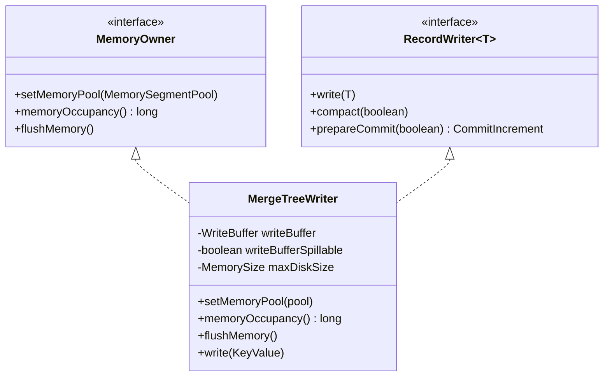
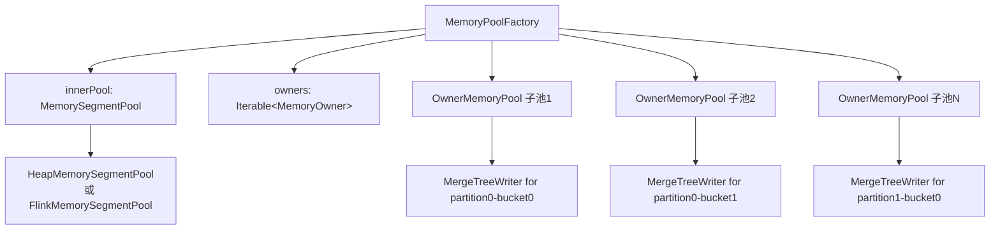
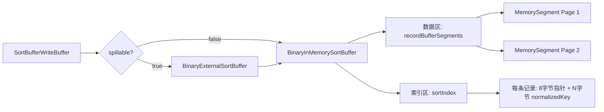
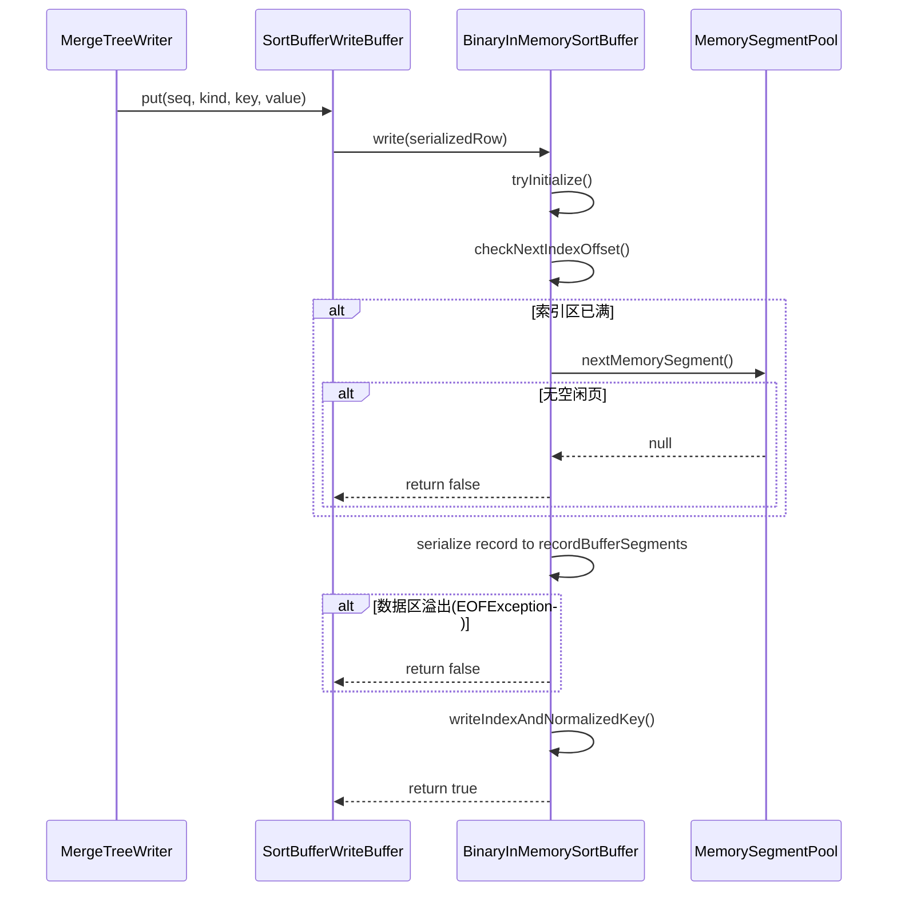
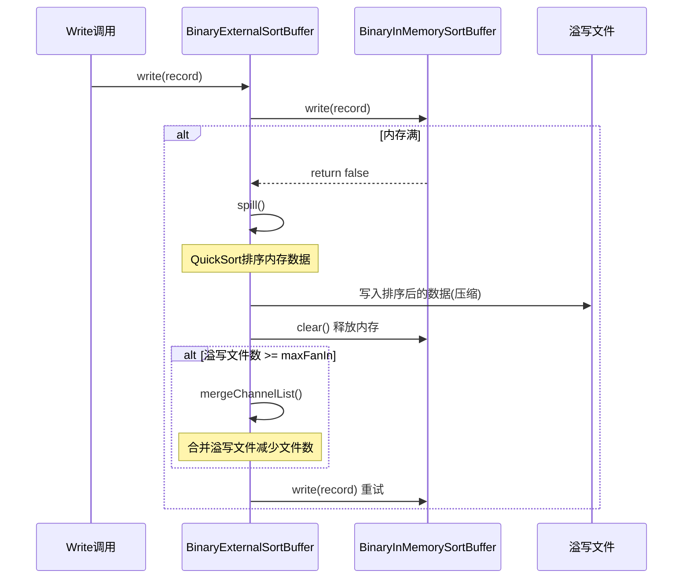
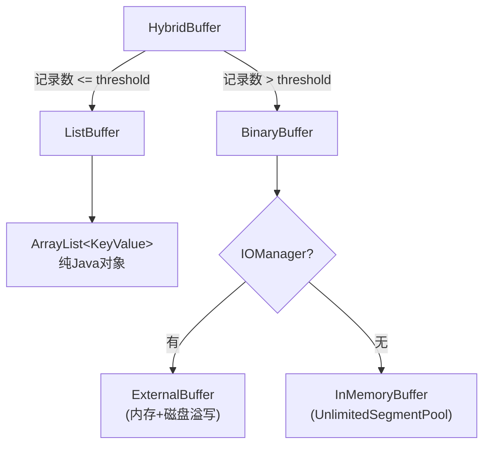
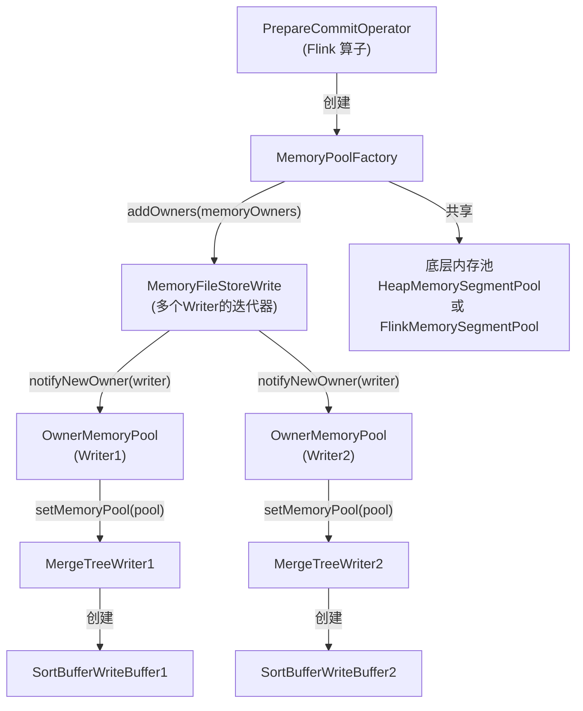
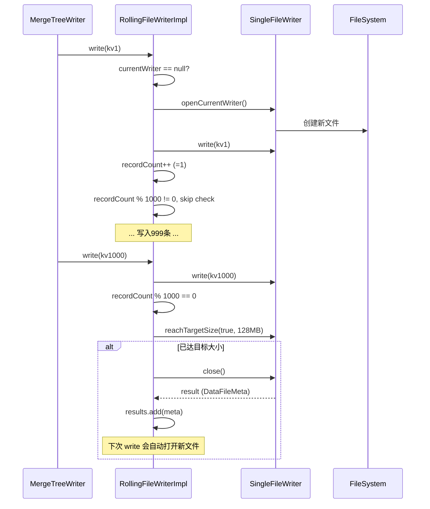
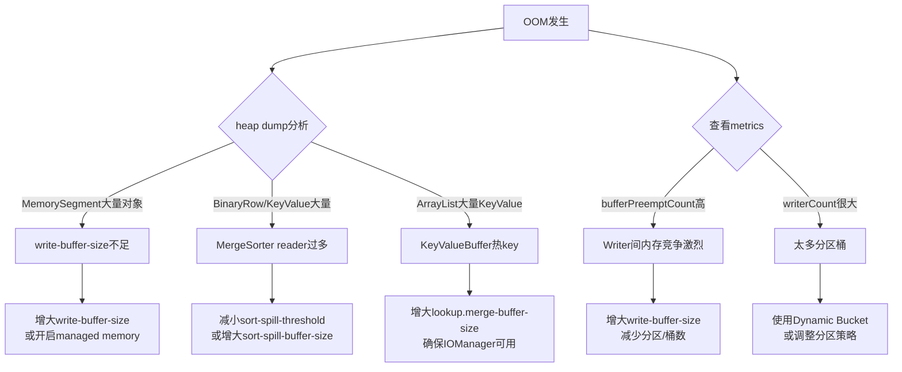
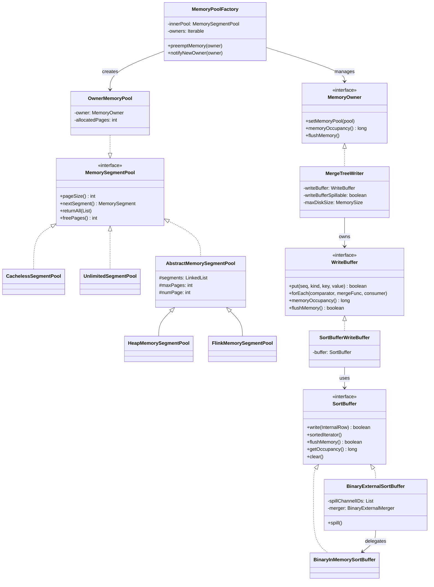

# Apache Paimon 内存管理与溢写机制深度分析

> 基于 Paimon 1.5-SNAPSHOT (master 分支, commit: 55f4fd175)

---

## 目录

- [1. MemoryOwner 接口体系](#1-memoryowner-接口体系)
- [2. MemoryPoolFactory - 内存池与抢占机制](#2-memorypoolFactory---内存池与抢占机制)
- [3. SortBufferWriteBuffer - 内存排序缓冲区](#3-sortbufferwritebuffer---内存排序缓冲区)
- [4. 磁盘溢写 (Spill) 机制](#4-磁盘溢写-spill-机制)
- [5. MergeSorter 的外部排序](#5-mergesorter-的外部排序)
- [6. KeyValueBuffer - 混合缓冲](#6-keyvaluebuffer---混合缓冲)
- [7. Flink 内存集成](#7-flink-内存集成)
- [8. RollingFileWriter - 文件滚动写入](#8-rollingfilewriter---文件滚动写入)
- [9. OOM 场景分析](#9-oom-场景分析)
- [10. 与 Flink State Backend 内存管理的对比](#10-与-flink-state-backend-内存管理的对比)

---

## 1. MemoryOwner 接口体系

### 1.1 接口定义

```java
// paimon-core/.../memory/MemoryOwner.java
public interface MemoryOwner {
    void setMemoryPool(MemorySegmentPool memoryPool);
    long memoryOccupancy();
    void flushMemory() throws Exception;
}
```

**源码路径**: `paimon-core/src/main/java/org/apache/paimon/memory/MemoryOwner.java`

### 1.2 三个方法的语义

| 方法 | 语义 | 为什么需要 |
|------|------|-----------|
| `setMemoryPool(pool)` | 为该 Owner 注入一个内存池代理 | 解耦内存分配和使用者。Owner 不关心内存来自堆还是 Flink Managed Memory，只通过池接口申请页 |
| `memoryOccupancy()` | 返回当前占用的内存字节数 | **内存抢占的决策依据**。MemoryPoolFactory 遍历所有 Owner，找到占用最大的进行 flush |
| `flushMemory()` | 将内存中的数据刷写到磁盘，释放内存页 | 在内存不足时被调用，是"让出内存"的核心动作 |

### 1.3 谁实现了 MemoryOwner

**核心实现者**: `MergeTreeWriter`

```java
// paimon-core/.../mergetree/MergeTreeWriter.java (第58行)
public class MergeTreeWriter implements RecordWriter<KeyValue>, MemoryOwner {
```

`MergeTreeWriter` 是主键表 (Primary Key Table) 的写入器，每个分区-桶的写入器都是一个 `MemoryOwner`。

**实现细节**:

- `setMemoryPool()` (第149行): 使用注入的内存池创建 `SortBufferWriteBuffer`
- `memoryOccupancy()` (第197行): 委托给 `writeBuffer.memoryOccupancy()`，返回 sort buffer 中数据 + 索引占用的字节数
- `flushMemory()` (第202行): 先尝试 `writeBuffer.flushMemory()`（溢写到本地磁盘），如果失败（例如磁盘配额已满），则调用 `flushWriteBuffer()` 将整个 buffer 排序合并后写出为 LSM 数据文件

### 1.4 设计决策

**为什么让 RecordWriter 实现 MemoryOwner？**

- **好处1**: 一个 Flink Subtask 可能写入多个分区和桶，每个桶有自己的 MergeTreeWriter。通过 MemoryOwner 接口，内存池可以在这些 Writer 之间动态调配内存。
- **好处2**: Writer 可以被外部（MemoryPoolFactory）强制要求释放内存，实现了"内存抢占"机制，避免某个桶的 Writer 独占所有内存导致其他桶无法写入。

### 1.5 类关系图



---

## 2. MemoryPoolFactory - 内存池与抢占机制

### 2.1 核心架构

**源码路径**: `paimon-core/src/main/java/org/apache/paimon/memory/MemoryPoolFactory.java`



### 2.2 内存分配策略

`MemoryPoolFactory` 是一个**共享内存池工厂**，它将一个底层内存池（`innerPool`）代理为多个 `OwnerMemoryPool`，分配给不同的 `MemoryOwner`。

**关键设计**: 所有 Owner 共享同一个底层内存池，采用"先到先得 + 被动抢占"策略。

```java
// OwnerMemoryPool.nextSegment() (第140-150行)
public MemorySegment nextSegment() {
    MemorySegment segment = innerPool.nextSegment();
    if (segment == null) {
        preemptMemory(owner);          // 内存不足时触发抢占
        segment = innerPool.nextSegment(); // 抢占后重试
    }
    if (segment != null) {
        allocatedPages++;
    }
    return segment;
}
```

**OwnerMemoryPool 的内存视图**:

```java
// OwnerMemoryPool.freePages() 返回全局剩余页数
public int freePages() {
    return innerPool.freePages();  // 直接返回底层池的剩余页数
}
```

**设计要点**:
- `innerPool`: 全局共享的底层内存池（所有 Owner 共享）
- `allocatedPages`: 该 Owner 已分配的页数（独立计数）
- `freePages()`: 返回**全局剩余页数**，而非该 Owner 的剩余配额

**为什么不返回 Owner 的剩余配额？**
- Paimon 采用"无配额"的共享内存模型，所有 Owner 平等竞争
- `freePages()` 用于初始化检查（如 `BinaryInMemorySortBuffer` 要求至少 3 页），需要全局视图
- **好处**: 简化实现，避免复杂的配额管理和碎片问题
- **代价**: 可能出现某个 Owner 独占大部分内存的情况（通过抢占机制缓解）
```

### 2.3 内存抢占机制

**算法**: 遍历所有 Owner，找到**内存占用最大的（但不是自己）**，对其调用 `flushMemory()`。

```java
// preemptMemory() (第73-93行)
private void preemptMemory(MemoryOwner owner) {
    long maxMemory = 0;
    MemoryOwner max = null;
    for (MemoryOwner other : owners) {
        // 不抢占自己！同时写和flush可能导致不一致状态
        if (other != owner && other.memoryOccupancy() > maxMemory) {
            maxMemory = other.memoryOccupancy();
            max = other;
        }
    }
    if (max != null) {
        max.flushMemory();
        ++bufferPreemptCount;
    }
}
```

**为什么不抢占自己？**
- 注释明确说明: "Don't preempt yourself! Write and flush at the same time, which may lead to inconsistent state"
- 一个 Writer 如果正在 write 过程中触发自己的 flush，可能导致排序缓冲区状态不一致。

**为什么选择占用最大的 Owner？**
- **好处**: 最大 occupancy 的 Owner flush 后能释放最多内存，减少抢占次数。
- **好处**: 避免频繁抢占小 Owner 导致的 "内存颠簸"（thrashing）。

### 2.4 底层内存池类型

| 实现类 | 源码路径 | 特点 |
|--------|----------|------|
| `HeapMemorySegmentPool` | `paimon-common/.../memory/HeapMemorySegmentPool.java` | 堆内存分配，有回收缓存（继承 `AbstractMemorySegmentPool`） |
| `FlinkMemorySegmentPool` | `paimon-flink/.../memory/FlinkMemorySegmentPool.java` | 从 Flink Managed Memory 分配 off-heap 内存 |
| `CachelessSegmentPool` | `paimon-common/.../memory/CachelessSegmentPool.java` | 无缓存堆内存池，归还时仅减计数，由 GC 回收 |
| `UnlimitedSegmentPool` | `paimon-common/.../memory/UnlimitedSegmentPool.java` | 无限制堆分配，`freePages()` 返回 `Integer.MAX_VALUE` |

**`AbstractMemorySegmentPool`** 的核心实现（第40-49行）:
```java
public MemorySegment nextSegment() {
    if (this.segments.size() > 0) {
        return this.segments.poll();    // 优先从归还的段中取
    } else if (numPage < maxPages) {
        numPage++;
        return allocateMemory();         // 不超限则新分配
    }
    return null;                         // 无可用内存
}
```

**为什么有回收缓存？**
- **好处**: 避免反复 allocate/GC 的开销。`LinkedList<MemorySegment>` 作为空闲列表，归还后的 segment 直接复用。

**`CachelessSegmentPool` vs `HeapMemorySegmentPool`**:
- CachelessSegmentPool 归还时只减计数不缓存，适用于 MergeSorter 等场景，内存段用完即弃（由 GC 回收），因为 sort-merge 读取的数据生命周期与 buffer 不同。

---

## 3. SortBufferWriteBuffer - 内存排序缓冲区

### 3.1 职责

**源码路径**: `paimon-core/src/main/java/org/apache/paimon/mergetree/SortBufferWriteBuffer.java`

`SortBufferWriteBuffer` 是主键表写入的核心缓冲层，负责:
1. 接收 KeyValue 记录，序列化为二进制格式存入内存页
2. 维护排序索引，支持按 key + sequence 排序遍历
3. 在内存满时支持溢写到磁盘（如果 spillable=true）

### 3.2 核心结构



### 3.3 排序字段设计

```java
// 构造函数中的排序字段顺序 (第80-93行)
// 1. key fields (所有主键字段)
IntStream sortFields = IntStream.range(0, keyType.getFieldCount());
// 2. 用户自定义序列字段 (如果有)
if (userDefinedSeqComparator != null) { ... }
// 3. sequence field (系统序列号)
sortFields = IntStream.concat(sortFields, IntStream.of(keyType.getFieldCount()));
```

**序列化后的 Row 结构**:

| 字段索引 | 字段类型 | 说明 |
|---------|---------|------|
| 0 ~ keyFieldCount-1 | key fields | 主键字段 |
| keyFieldCount | BigInt | 系统 sequence 字段 |
| keyFieldCount+1 | TinyInt | valueKind 字段 (INSERT/UPDATE_BEFORE/UPDATE_AFTER/DELETE) |
| keyFieldCount+2 ~ end | value fields | 值字段 |

**排序字段索引映射**:
- 主键字段: 直接使用索引 `0 ~ keyFieldCount-1`
- 系统 sequence: 索引 `keyFieldCount`
- 用户自定义序列字段: 原始索引在 value 中，映射到序列化 row 中需要 `+keyFieldCount+2`

**为什么按这个顺序排序？**
- 主键字段优先：确保相同 key 的记录相邻
- 用户自定义序列字段次之：支持用户定义的去重逻辑
- 系统 sequence 字段最后：同一 key 同一用户序列下，按写入顺序排列

**好处**: 排序后遍历时，相同 key 的记录自然分组，可以直接进行 merge（`MergeIterator`），无需额外的 hash 或 group-by 操作。

### 3.4 写入流程 (put)

```java
// SortBufferWriteBuffer.put() (第130-133行)
public boolean put(long sequenceNumber, RowKind valueKind, InternalRow key, InternalRow value)
        throws IOException {
    return buffer.write(serializer.toRow(key, sequenceNumber, valueKind, value));
}
```

底层调用 `BinaryInMemorySortBuffer.write()` (第165-189行):



**为什么最少需要3页内存？** (第106-109行)
- 1页用于排序索引区（sortIndex）
- 1页用于数据存储区（recordBufferSegments）
- 1页作为序列化缓冲（SimpleCollectingOutputView 跨页写入时需要）

### 3.5 排序算法

`BinaryInMemorySortBuffer.sortedIterator()` (第246-251行):

```java
public final MutableObjectIterator<BinaryRow> sortedIterator() {
    if (numRecords > 0) {
        new QuickSort().sort(this);
    }
    return iterator();
}
```

**排序算法: QuickSort + HeapSort 混合**

**源码路径**: `paimon-core/src/main/java/org/apache/paimon/sort/QuickSort.java`

| 条件 | 算法 | 原因 |
|------|------|------|
| 元素数 < 13 | 插入排序 | 小数据量下插入排序常数因子低于快排 |
| 递归深度 > 2*ceil(log(n)) | HeapSort | 避免快排在最坏情况下退化为 O(n^2) |
| 其他 | 三点取中快排 | 平均 O(nlogn)，原地排序无额外内存 |

**为什么选择这种混合排序？**
- **好处**: 结合了快排的平均性能优势和堆排的最坏情况保证，即 Introsort 策略
- **好处**: 排序操作直接在索引区上进行（swap 只交换索引条目），数据区零拷贝

**Normalized Key 优化**:
- 每个索引条目包含 `8字节数据指针 + N字节normalizedKey`
- 比较时优先比较 normalizedKey（纯内存字节比较），只有 normalizedKey 无法确定顺序时才回退到完整记录比较
- **好处**: 大幅减少反序列化和跨页随机读取次数

### 3.6 forEach - 排序合并遍历

`forEach()` (第151-164行) 是 flush 时的核心方法：

```java
public void forEach(
        Comparator<InternalRow> keyComparator,
        MergeFunction<KeyValue> mergeFunction,
        @Nullable KvConsumer rawConsumer,
        KvConsumer mergedConsumer) throws IOException {
    MergeIterator mergeIterator =
            new MergeIterator(rawConsumer, buffer.sortedIterator(), keyComparator, mergeFunction);
    while (mergeIterator.hasNext()) {
        mergedConsumer.accept(mergeIterator.next());
    }
}
```

**MergeIterator** 是一个内部类（第176行），在排序后的迭代器上做同 key 合并：
- 读取下一条记录，与前一条比较 key
- 相同 key 的记录放入 MergeFunction 进行合并
- 不同 key 时输出合并结果并开始新的一组

**为什么在 flush 时做合并？**
- **好处**: 减少写出到文件的数据量（同 key 的多次更新合并为一条）
- **好处**: 降低后续 compaction 的压力

### 3.7 clear

`clear()` 调用 `buffer.clear()`，将所有内存页归还给 MemorySegmentPool，重置所有偏移量。`BinaryInMemorySortBuffer.clear()` (第126-139行) 调用 `returnToSegmentPool()` 将排序索引和数据区的页面全部归还。

---

## 4. 磁盘溢写 (Spill) 机制

### 4.1 溢写的触发条件

溢写涉及两个层面：

**层面1: WriteBuffer 级别的溢写** (SortBufferWriteBuffer → BinaryExternalSortBuffer)

当 `writeBufferSpillable=true` 且 IOManager 不为空时，SortBufferWriteBuffer 内部使用 `BinaryExternalSortBuffer` 而非纯内存的 `BinaryInMemorySortBuffer`。

```java
// SortBufferWriteBuffer 构造函数 (第115-127行)
this.buffer = ioManager != null && spillable
    ? new BinaryExternalSortBuffer(...)
    : inMemorySortBuffer;
```

**层面2: MergeTreeWriter 级别的 flush**

当 `writeBuffer.flushMemory()` 返回 false（磁盘配额已满）时，MergeTreeWriter 将整个 buffer 排序后写成 LSM 数据文件:

```java
// MergeTreeWriter.flushMemory() (第202-207行)
public void flushMemory() throws Exception {
    boolean success = writeBuffer.flushMemory();
    if (!success) {
        flushWriteBuffer(false, false);  // 写出为数据文件
    }
}
```

### 4.2 关键配置参数

| 参数 | 默认值 | 作用 | 源码位置 |
|------|--------|------|----------|
| `write-buffer-spillable` | `true` | 是否允许 WriteBuffer 溢写到本地磁盘 | CoreOptions 第672行 |
| `write-buffer-spill.max-disk-size` | `infinite` (Long.MAX_VALUE) | 单个 Writer 溢写文件的最大磁盘用量 | CoreOptions 第665行 |
| `local-sort.max-num-file-handles` | `128` | 外部排序的最大文件句柄数（fan-in） | CoreOptions 第692行 |
| `spill-compression` | `"zstd"` | 溢写文件压缩算法 | CoreOptions 第620行 |
| `spill-compression.zstd-level` | `1` | zstd 压缩级别 | CoreOptions 第627行 |

### 4.3 BinaryExternalSortBuffer 溢写流程

**源码路径**: `paimon-core/src/main/java/org/apache/paimon/sort/BinaryExternalSortBuffer.java`



**spill() 方法** (第248-278行):
1. 创建新的 FileIOChannel
2. 在内存中 QuickSort 排序当前数据
3. 通过 `writeToOutput()` 按排序顺序写出
4. 支持压缩（默认 zstd，block size 64KB）
5. 清空内存缓冲区

**为什么在 spill 前排序？**
- **好处**: 每个溢写文件内部有序，后续归并时只需 N-way merge，无需再排序
- 这是经典的外部排序 (External Sort) 模式

### 4.4 flushMemory() 的磁盘容量检查

```java
// BinaryExternalSortBuffer.flushMemory() (第166-174行)
public boolean flushMemory() throws IOException {
    boolean isFull = getDiskUsage() >= maxDiskSize.getBytes();
    if (isFull) {
        return false;   // 磁盘配额用完，返回false
    } else {
        spill();
        return true;
    }
}
```

**为什么有磁盘容量限制？**
- **好处**: 防止无限溢写导致本地磁盘被打满
- 当返回 false 时，上层 MergeTreeWriter 会将整个 buffer 写成 LSM 数据文件，这是最终的"兜底"策略

### 4.5 溢写文件合并

当溢写文件数达到 `maxNumFileHandles` (默认128) 时，触发中间合并:

```java
// BinaryExternalSortBuffer.write() (第194-214行)
if (spillChannelIDs.size() >= maxNumFileHandles) {
    List<ChannelWithMeta> merged = merger.mergeChannelList(spillChannelIDs);
    spillChannelIDs.clear();
    spillChannelIDs.addAll(merged);
}
```

`AbstractBinaryExternalMerger.mergeChannelList()` (第118-157行) 使用分层合并策略：
- 计算需要的合并轮次: `scale = ceil(log_maxFanIn(channelCount)) - 1`
- 先执行不完整的合并轮（partial round），再执行完整的 maxFanIn-way 合并
- **好处**: 最小化中间 I/O 量，类似 LSM Compaction 的"tiered merge"

### 4.6 溢写文件的读取

读取使用 `BinaryMergeIterator`，基于 `PartialOrderPriorityQueue`（小顶堆）进行 N-way 归并排序:

**源码路径**: `paimon-core/src/main/java/org/apache/paimon/sort/BinaryMergeIterator.java`

```java
// BinaryMergeIterator 核心逻辑 (第58-73行)
public Entry next() throws IOException {
    if (currHead != null) {
        if (currHead.noMoreHead()) {
            this.heap.poll();
        } else {
            this.heap.adjustTop();
        }
    }
    if (this.heap.size() > 0) {
        currHead = this.heap.peek();
        return currHead.getHead();
    }
    return null;
}
```

**为什么用优先级队列做 N-way merge？**
- **好处**: 时间复杂度 O(total_records * log(N))，N 为流数量，远优于两两合并的 O(total_records * N)

### 4.7 SpillChannelManager

**源码路径**: `paimon-core/src/main/java/org/apache/paimon/sort/SpillChannelManager.java`

管理溢写文件的生命周期，区分"已创建但未打开"和"已打开"的 channel，在 `reset()` 时统一清理。

**为什么需要独立管理？**
- **好处**: 异常恢复时确保溢写的临时文件被清理，防止磁盘泄漏

---

## 5. MergeSorter 的外部排序

### 5.1 角色定位

**源码路径**: `paimon-core/src/main/java/org/apache/paimon/mergetree/MergeSorter.java`

`MergeSorter` 用于 **compaction 读取阶段**，当需要合并的 SST 文件（SortedRun）数量超过阈值时，将部分 reader 的数据溢写到磁盘，减少同时打开的 reader 数量。

**注意**: 这与写入路径上的 `BinaryExternalSortBuffer` 是不同的溢写场景。

### 5.2 触发条件

```java
// mergeSort() (第112-125行)
public <T> RecordReader<T> mergeSort(
        List<SizedReaderSupplier<KeyValue>> lazyReaders,
        Comparator<InternalRow> keyComparator,
        @Nullable FieldsComparator userDefinedSeqComparator,
        MergeFunctionWrapper<T> mergeFunction) throws IOException {
    if (ioManager != null && lazyReaders.size() > spillThreshold) {
        return spillMergeSort(...);
    }
    return mergeSortNoSpill(...);
}
```

**`spillThreshold`** 默认值 = `numSortedRunStopTrigger + 1` (由 `sort-spill-threshold` 配置)

### 5.3 溢写策略

```java
// spillMergeSort() (第148-165行)
private <T> RecordReader<T> spillMergeSort(...) throws IOException {
    // 1. 按文件大小升序排列
    sortedReaders.sort(Comparator.comparingLong(SizedReaderSupplier::estimateSize));
    int spillSize = inputReaders.size() - spillThreshold;

    // 2. 将最小的 spillSize 个 reader 溢写
    List<ReaderSupplier<KeyValue>> readers = new ArrayList<>(
        sortedReaders.subList(spillSize, sortedReaders.size()));  // 大文件保留在内存
    for (ReaderSupplier<KeyValue> supplier : sortedReaders.subList(0, spillSize)) {
        readers.add(spill(supplier));  // 小文件溢写
    }

    // 3. 使用 SortMergeReader 合并（此时reader数量 <= spillThreshold）
    return mergeSortNoSpill(readers, ...);
}
```

**为什么优先溢写小文件？**
- **好处**: 小文件读取快、溢写开销低
- **好处**: 大文件直接保留在 reader 中读取，减少大文件的 I/O 倍增

### 5.4 单个 reader 的溢写过程

```java
// spill() (第167-198行)
private ReaderSupplier<KeyValue> spill(ReaderSupplier<KeyValue> readerSupplier) throws IOException {
    FileIOChannel.ID channel = ioManager.createChannel();
    KeyValueWithLevelNoReusingSerializer serializer = ...;
    BlockCompressionFactory compressFactory = BlockCompressionFactory.create(compression);

    // 将reader数据序列化写入临时文件
    ChannelWriterOutputView out = FileChannelUtil.createOutputView(...);
    try (RecordReader<KeyValue> reader = readerSupplier.get()) {
        RecordIterator<KeyValue> batch;
        KeyValue record;
        while ((batch = reader.readBatch()) != null) {
            while ((record = batch.next()) != null) {
                serializer.serialize(record, out);
            }
            batch.releaseBatch();
        }
    }
    return new SpilledReaderSupplier(channelWithMeta, ...);
}
```

**注意**: 溢写后的 reader 不需要排序，因为原始 SST 文件本身已有序。溢写只是将数据从"按需读取文件"转为"一次性读取然后缓存"，目的是释放文件句柄。

### 5.5 MergeSorter 的内存池

```java
// 构造函数 (第83-84行)
this.memoryPool = new CachelessSegmentPool(options.sortSpillBufferSize(), options.pageSize());
```

- 使用 `CachelessSegmentPool`（默认 64MB / 64KB 页）
- 这个内存池**独立于 WriteBuffer 的内存池**

**为什么用 CachelessSegmentPool？**
- sort-merge 的读取是流式的，内存段用完即释放，无需缓存复用
- **好处**: 减少内存碎片，GC 可及时回收

### 5.6 相关参数

| 参数 | 默认值 | 作用 |
|------|--------|------|
| `sort-spill-threshold` | `numSortedRunStopTrigger + 1` | reader 数超过此值触发溢写 |
| `sort-spill-buffer-size` | `64 MB` | MergeSorter 独立内存池大小 |
| `sort-engine` | `LOSER_TREE` | SortMergeReader 的排序引擎 |

---

## 6. KeyValueBuffer - 混合缓冲

### 6.1 使用场景

**源码路径**: `paimon-core/src/main/java/org/apache/paimon/mergetree/compact/KeyValueBuffer.java`

`KeyValueBuffer` 用于 `LookupMergeFunction` 中，缓存同一 key 在不同层级的候选记录。当用 Lookup 方式做 merge 时（例如 partial-update、aggregation），需要缓存多个版本的值。

### 6.2 三层缓冲架构



### 6.3 HybridBuffer 设计

```java
// HybridBuffer.put() (第86-94行)
public void put(KeyValue kv) {
    if (binaryBuffer != null) {
        binaryBuffer.put(kv);
    } else {
        listBuffer.put(kv);
        if (listBuffer.list.size() > threshold) {
            spillToBinary();     // 超阈值时转换为二进制格式
        }
    }
}
```

**`threshold`** = `lookup.merge-records-threshold` (默认 1024)

**为什么先用 ListBuffer 再升级为 BinaryBuffer？**
- **好处**: 绝大多数 key 的候选版本数很少（通常1-3个），用 ArrayList 存储开销最低
- **好处**: 只有热 key（大量版本聚集）才会触发二进制序列化和潜在的磁盘溢写
- **好处**: LazyField 延迟创建 BinaryBuffer，避免为每个 key 都创建重量级资源

### 6.4 BinaryBuffer 的内存配置

```java
// KeyValueBuffer.createBinaryBuffer() (第203-226行)
static BinaryBuffer createBinaryBuffer(CoreOptions options, ..., @Nullable IOManager ioManager) {
    MemorySegmentPool pool = ioManager == null
        ? new UnlimitedSegmentPool(options.pageSize())    // 无IOManager: 无限内存
        : new HeapMemorySegmentPool(
            options.lookupMergeBufferSize(),               // 有IOManager: 限制为8MB
            options.pageSize());
    RowBuffer buffer = ioManager == null
        ? new InMemoryBuffer(pool, serializer)
        : new ExternalBuffer(ioManager, pool, serializer,
            options.writeBufferSpillDiskSize(), options.spillCompressOptions());
    return new BinaryBuffer(buffer, kvSerializer);
}
```

| 场景 | 内存池 | RowBuffer | 溢写能力 |
|------|--------|-----------|----------|
| 无 IOManager (Spark batch) | UnlimitedSegmentPool | InMemoryBuffer | 无 |
| 有 IOManager (Flink streaming) | HeapMemorySegmentPool (8MB) | ExternalBuffer | 有 |

**为什么 Spark 场景用无限内存？**
- Spark batch 模式下不需要流式处理的内存约束
- **好处**: 简化实现，避免不必要的磁盘 I/O

**为什么 Flink 场景限制为 8MB？**
- 每个 key 的缓冲独立分配，如果不限制可能导致某个热 key 消耗大量内存
- **好处**: 超出 8MB 后溢写到磁盘，保护整体内存

### 6.5 ExternalBuffer 溢写

**源码路径**: `paimon-core/src/main/java/org/apache/paimon/disk/ExternalBuffer.java`

`ExternalBuffer` 的溢写不同于 `BinaryExternalSortBuffer`，它**不排序**，而是零拷贝地将内存段直接写入磁盘:

```java
// ExternalBuffer.spill() (第147-182行)
private void spill() throws IOException {
    for (int i = 0; i < numRecordBuffers; i++) {
        MemorySegment segment = segments.get(i);
        int bufferSize = i == numRecordBuffers - 1
                ? inMemoryBuffer.getNumBytesInLastBuffer()
                : segment.size();
        channelWriterOutputView.write(segment, 0, bufferSize);  // 零拷贝!
    }
}
```

**为什么不排序就溢写？**
- KeyValueBuffer 存的是同一 key 的不同版本，不需要全局排序
- **好处**: 零拷贝溢写极快，内存页直接序列化到文件

---

## 7. Flink 内存集成

### 7.1 内存来源决策

**源码路径**: `paimon-flink/.../flink/sink/PrepareCommitOperator.java` (第74-89行)

```java
MemorySegmentPool memoryPool;
if (options.get(SINK_USE_MANAGED_MEMORY)) {
    // 使用 Flink Managed Memory (off-heap)
    MemoryManager memoryManager = containingTask.getEnvironment().getMemoryManager();
    memoryAllocator = new MemorySegmentAllocator(containingTask, memoryManager);
    memoryPool = new FlinkMemorySegmentPool(
            computeManagedMemory(this),
            memoryManager.getPageSize(),
            memoryAllocator);
} else {
    // 使用 JVM 堆内存
    CoreOptions coreOptions = new CoreOptions(options);
    memoryPool = new HeapMemorySegmentPool(
            coreOptions.writeBufferSize(),    // 默认 256MB
            coreOptions.pageSize());           // 默认 64KB
}
memoryPoolFactory = new MemoryPoolFactory(memoryPool);
```

### 7.2 两种模式对比

| 特性 | Heap 模式 (默认) | Managed Memory 模式 |
|------|-------------------|---------------------|
| 配置 | `write-buffer-size` | `sink.use-managed-memory-allocator=true` |
| 内存类型 | JVM 堆内存 | Flink off-heap 管理内存 |
| 页大小 | `page-size` (64KB) | Flink MemoryManager 页大小 (32KB) |
| 内存上限 | 由 `write-buffer-size` 固定 | 由 Flink 算子权重动态分配 |
| GC 影响 | 占用堆空间，影响 GC | 不在堆中，GC 友好 |
| 适用场景 | 简单配置，单表写入 | 多表写入，需要精细内存管理 |

### 7.3 FlinkMemorySegmentPool 实现

**源码路径**: `paimon-flink/.../flink/memory/FlinkMemorySegmentPool.java`

```java
public class FlinkMemorySegmentPool extends AbstractMemorySegmentPool {
    private final MemorySegmentAllocator allocator;

    @Override
    protected MemorySegment allocateMemory() {
        return allocator.allocate();
    }
}
```

继承 `AbstractMemorySegmentPool`，利用父类的 `LinkedList<MemorySegment>` 做空闲列表缓存，只在需要新页时调用 `allocator.allocate()`。

### 7.4 MemorySegmentAllocator - Flink 到 Paimon 的桥接

**源码路径**: `paimon-flink/.../flink/memory/MemorySegmentAllocator.java`

```java
public MemorySegment allocate() {
    segments.clear();
    memoryManager.allocatePages(owner, segments, 1);
    org.apache.flink.core.memory.MemorySegment segment = segments.remove(0);
    checkArgument(segment.isOffHeap(), "Segment is not off heap from memory manager.");
    allocatedSegments.add(segment);
    // 通过反射获取 Flink MemorySegment 的底层 ByteBuffer
    return MemorySegment.wrapOffHeapMemory((ByteBuffer) offHeapBufferField.get(segment));
}
```

**为什么用反射？**
- Flink 的 `MemorySegment.getOffHeapBuffer()` 方法在某些版本中不可用（参见 FLINK-32213）
- **好处**: 通过反射访问 `offHeapBuffer` 字段实现跨版本兼容

**为什么保持 `allocatedSegments` 引用？**
- Flink MemoryManager 需要通过原始 segment 引用来 release
- `release()` 方法将所有分配的段归还给 Flink MemoryManager

### 7.5 内存从 MemoryPoolFactory 到 Writer 的流转



**`MemoryFileStoreWrite.withMemoryPoolFactory()`** (第85-88行):
```java
public FileStoreWrite<T> withMemoryPoolFactory(MemoryPoolFactory memoryPoolFactory) {
    this.writeBufferPool = memoryPoolFactory.addOwners(this::memoryOwners);
    return this;
}
```

**`memoryOwners()`** (第90-108行) 返回所有活跃 Writer 的 lazy 迭代器，确保 MemoryPoolFactory 抢占时总能获得最新的 Owner 列表。

**如果没有外部传入 MemoryPoolFactory？**

在 `notifyNewWriter()` (第120-128行) 中创建默认的:
```java
if (writeBufferPool == null) {
    writeBufferPool = new MemoryPoolFactory(
        new HeapMemorySegmentPool(
            options.writeBufferSize(), options.pageSize()))
        .addOwners(this::memoryOwners);
}
```

---

## 8. RollingFileWriter - 文件滚动写入

### 8.1 滚动写入机制

**源码路径**: `paimon-core/src/main/java/org/apache/paimon/io/RollingFileWriterImpl.java`

`RollingFileWriter` 控制单个数据文件的最大大小，当文件大小达到 `targetFileSize` 时关闭当前文件并打开新文件。

### 8.2 CHECK_ROLLING_RECORD_CNT = 1000 的采样检查

```java
// RollingFileWriter 接口 (第43行)
int CHECK_ROLLING_RECORD_CNT = 1000;

// RollingFileWriterImpl.rollingFile() (第64-67行)
private boolean rollingFile(boolean forceCheck) throws IOException {
    return currentWriter.reachTargetSize(
            forceCheck || recordCount % CHECK_ROLLING_RECORD_CNT == 0, targetFileSize);
}
```

**为什么每1000条检查一次而非每条都检查？**

`reachTargetSize()` 需要查询底层 `FormatWriter`/`OutputStream` 的当前字节数，这个操作涉及:
- 文件格式（Parquet/ORC）的内部统计查询
- 可能的 flush 操作来获取准确字节数

**好处**:
- 减少检查开销，对于 Parquet 等列式格式，估算文件大小需要统计列缓冲区
- 1000条的采样率在大多数场景下足够精确（每个文件通常有数万到数百万条记录）

**forceCheck 参数**:
- `writeBundle()` 方法传入 `forceCheck=true`，因为 bundle 写入的记录数可能很大，一次 bundle 可能使文件超过目标大小很多
- 普通 `write()` 方法传入 `forceCheck=false`，依赖 `recordCount % 1000 == 0` 的采样

### 8.3 targetFileSize 配置

| 表类型 | 默认值 | 配置项 |
|--------|--------|--------|
| 主键表 | 128 MB | `target-file-size` |
| Append-only 表 | 256 MB | `target-file-size` |

```java
// CoreOptions.targetFileSize() (第2895行)
public long targetFileSize(boolean hasPrimaryKey) {
    return options.getOptional(TARGET_FILE_SIZE)
            .orElse(hasPrimaryKey ? VALUE_128_MB : VALUE_256_MB)
            .getBytes();
}
```

**为什么主键表默认较小？**
- 主键表需要频繁 compaction，较小的文件有利于降低单次 compaction 的 I/O 量和内存占用
- **好处**: 128MB 在 compaction 延迟和写入吞吐之间取得平衡

### 8.4 写入流程



---

## 9. OOM 场景分析

### 9.1 常见 OOM 场景

#### 场景1: 分区/桶过多导致 Writer 数量爆炸

**触发条件**: 写入高基数分区 + 大桶数时，每个分区-桶组合创建一个 MergeTreeWriter，所有 Writer **共享同一个内存池**。

**为什么 OOM**: 
- 每个 Writer 的 SortBufferWriteBuffer 最少需要 3 页内存（3 * 64KB = 192KB）
- 100个分区 * 100个桶 = 10000个 Writer，最少需要 ~1.9GB
- 默认 `write-buffer-size` 只有 256MB

**调优方法**:
- 增大 `write-buffer-size`
- 减少桶数量
- 使用 Dynamic Bucket 模式
- 开启 `write-buffer-spillable`（默认已开启）

#### 场景2: sort-spill-threshold 不当导致 Reader 过多

**触发条件**: Compaction 读取阶段，SortedRun 数量极多时（例如积压了大量 Level 0 文件）。

**为什么 OOM**: 
- 每个 SST 文件的 reader 需要解压缓冲区、列缓存等
- `MergeSorter.spillThreshold` 控制最多同时打开多少 reader
- 如果阈值过大或未配置溢写（无 IOManager），所有 reader 同时打开

**调优方法**:
- 设置合理的 `sort-spill-threshold`
- 增大 `sort-spill-buffer-size`（默认 64MB）
- 确保 compaction 及时执行，避免 Level 0 文件堆积

#### 场景3: Lookup merge 热 key

**触发条件**: 使用 partial-update 或 aggregation merge，某个 key 的历史版本数极多。

**为什么 OOM**: 
- `KeyValueBuffer.HybridBuffer` 默认阈值1024，超过后转为 BinaryBuffer
- 无 IOManager 时 BinaryBuffer 使用 `UnlimitedSegmentPool`，无内存上限
- 有 IOManager 时限制为 `lookup.merge-buffer-size`（默认8MB），但如果值很大仍可能导致问题

**调优方法**:
- 增大 `lookup.merge-buffer-size`
- 确保 Flink 模式下 IOManager 可用
- 控制 key 的版本数（及时 compaction）

#### 场景4: writeBufferSpillable=false 且内存不足

**触发条件**: 关闭溢写时，write buffer 内存用完无法释放。

**为什么 OOM**:
- `BinaryInMemorySortBuffer.flushMemory()` 返回 false（不支持溢写）
- 但底层内存池已无空闲页
- MemoryPoolFactory 抢占其他 Owner 也无法释放足够内存
- 最终 `nextSegment()` 返回 null，write 返回 false

**实际不会 OOM**: MergeTreeWriter 会调用 `flushWriteBuffer()` 写出数据文件。但频繁 flush 会产生大量小文件，增加 compaction 压力。

#### 场景5: Compaction 期间 ClusteringFileRewriter 的 key bytes

**触发条件**: commit: 55f4fd175 修复的问题 — `ClusteringFileRewriter.sortAndRewriteFile()` 中排序的 key bytes 可能 OOM。

**调优方法**: 已在最新版本中修复。

### 9.2 关键调优参数汇总

| 参数 | 默认值 | 调优建议 |
|------|--------|----------|
| `write-buffer-size` | 256 MB | 分区桶多时增大到 512MB-1GB |
| `write-buffer-spillable` | true | 保持开启 |
| `write-buffer-spill.max-disk-size` | infinite | 磁盘空间有限时设置上限 |
| `page-size` | 64 KB | 一般无需调整 |
| `local-sort.max-num-file-handles` | 128 | 溢写文件多时可增大 |
| `sort-spill-threshold` | numSortedRunStopTrigger+1 | Reader多时减小 |
| `sort-spill-buffer-size` | 64 MB | 溢写时增大可减少 I/O |
| `spill-compression` | zstd | lz4 更快但压缩率低 |
| `target-file-size` | 128MB/256MB | 根据查询模式调整 |
| `sink.use-managed-memory-allocator` | false | 多表写入建议开启 |
| `write-max-writers-to-spill` | 10 | 批量插入时 Writer 数超过此值开启缓冲溢写 |
| `lookup.merge-buffer-size` | 8 MB | 热 key 场景增大 |
| `lookup.merge-records-threshold` | 1024 | 控制升级为 BinaryBuffer 的阈值 |

### 9.3 排查流程



---

## 10. 与 Flink State Backend 内存管理的对比

### 10.1 架构对比

| 维度 | Paimon 内存管理 | Flink RocksDB State Backend |
|------|----------------|----------------------------|
| **内存模型** | 页式管理 (MemorySegment) | Block Cache + Write Buffer + Index Cache |
| **分配粒度** | 固定大小页 (默认64KB) | RocksDB 自行管理，block 大小可配 |
| **共享方式** | 多 Writer 共享 MemoryPoolFactory | 多 Column Family 共享 Block Cache |
| **抢占机制** | 主动抢占最大 Owner 的 flush | 被动 LRU 淘汰 |
| **溢写** | 显式溢写到本地磁盘 (排序后写入) | RocksDB flush memtable 到 SST |
| **排序** | 写入时排序 (QuickSort/HeapSort) | Memtable 内 SkipList 排序 |
| **压缩** | zstd/lz4 (溢写文件) | Snappy/LZ4/ZSTD (SST文件) |
| **GC 影响** | Heap模式影响大，Managed模式无影响 | off-heap，对 GC 无影响 |

### 10.2 设计哲学差异

**Paimon**:
- **"协作式内存管理"**: 通过 MemoryOwner 接口让各 Writer 主动报告内存使用并配合释放
- **好处**: 简单直接，内存使用透明，支持灵活的溢写策略
- **代价**: 抢占操作可能导致 flush 抖动

**Flink RocksDB**:
- **"委托式内存管理"**: 将内存管理委托给 RocksDB 的 Block Cache / Write Buffer Manager
- **好处**: 利用 RocksDB 成熟的缓存淘汰策略
- **代价**: 内存使用不够透明，难以精确控制

### 10.3 Paimon 使用 Flink Managed Memory 时的对比

当 `sink.use-managed-memory-allocator=true` 时:

```
Flink TaskManager
├── Managed Memory Pool (off-heap)
│   ├── 分配给 Paimon Writer Operator (权重比例)
│   │   └── FlinkMemorySegmentPool → MemoryPoolFactory → N个 MergeTreeWriter
│   ├── 分配给 RocksDB State Backend
│   │   └── Block Cache + Write Buffer Manager
│   └── 分配给其他算子
└── JVM Heap
    └── 框架开销、用户代码对象等
```

**为什么 Paimon 也支持 Managed Memory？**
- **好处1**: 与 Flink 内存模型统一，TaskManager 可以准确控制总内存
- **好处2**: off-heap 分配避免 GC 压力
- **好处3**: 多表写入时，内存按算子权重自动分配

### 10.4 排序对比

| 特性 | Paimon SortBuffer | RocksDB Memtable |
|------|-------------------|-------------------|
| 数据结构 | 页式数组 + 索引 | SkipList |
| 排序时机 | 写入时不排序，读取/flush时 QuickSort | 插入时排序（有序跳表） |
| 内存效率 | 紧凑二进制，无指针开销 | 每节点有多级指针 |
| 并发写入 | 单线程 | 支持并发插入 |

**Paimon 为什么选择"延迟排序"？**
- Paimon 的 WriteBuffer 是单线程写入的（每个 Writer 对应一个桶），不需要并发排序能力
- 延迟排序（QuickSort）在数据量确定后一次性排序，平均性能优于逐条插入有序结构
- **好处**: 紧凑的二进制存储节省内存，对 CPU cache 更友好

---

## 附录: 核心类关系总览


