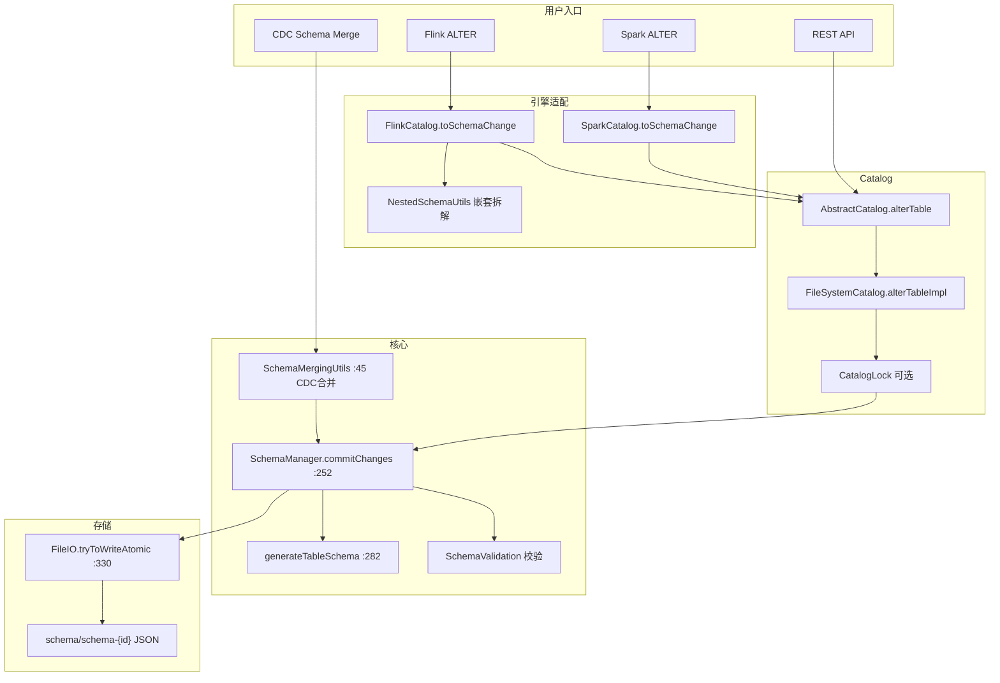
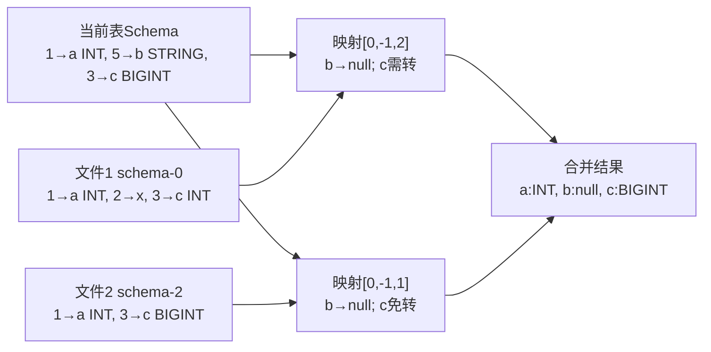

# Apache Paimon Schema 演进机制深度分析

> **版本**：1.5-SNAPSHOT　**源码模块**：`paimon-api`（`Schema`/`TableSchema`/`SchemaChange`/`DataTypeCasts`）+ `paimon-core`（`SchemaManager` 及演进/合并/验证工具）+ 引擎适配（`paimon-flink`/`paimon-spark`）　**核对日期**：2026-06

**一句话定位**：Schema 演进让 Paimon 表能在**不重写历史数据**的前提下增删改列、变更类型——靠"文件即元数据 + 乐观锁版本文件"管理 schema 版本，靠"字段 ID 映射 + 读时类型转换"让旧数据文件按新 schema 正确读出。

读完本文你应能回答：① 一条 `ALTER TABLE ... ADD COLUMN` 从引擎到落盘 `schema-N` 文件经历了什么，并发时怎么保证只有一个赢；② 为什么用字段 ID 而非列名关联新旧 schema，`highestFieldId` 为什么必须独立存储；③ 12 种 `SchemaChange` 各自能改什么、被什么约束挡住（分区键/主键/类型/可空性/不可变选项）；④ 旧数据文件按新 schema 读时，`SchemaEvolutionUtil` 如何构建索引映射 + 类型转换，恒等映射优化省了什么；⑤ 类型变更要同时过 `DataTypeCasts.supportsCast` 与 `CastExecutors.resolve` 两关，缺一会怎样；⑥ CDC 自动演进（`SchemaMergingUtils.mergeSchemas`）和手动 ALTER 走的是不是同一条路，为什么新字段强制 nullable；⑦ Schema Rollback 删版本文件为什么要从大 ID 往小删；⑧ 哪些变更只改元数据（秒级），哪些会留下"读时开销"或"占着旧空间"的长尾代价。

> 阅读约定：本文每个机制按"① 要解决什么问题 → ② 设计原理与取舍 → ③ 关键源码（精选片段 + `路径:行号`）→ ④ 风险/陷阱/边界 → ⑤ 收益与代价"组织。源码行号以本次核对（1.5-SNAPSHOT）为准；与旧稿不符处用 `（已修正）` 标注。数据类型系统本身详见 **19-数据类型系统**；CDC 场景的 schema 自动同步应用详见 **14-局部列更新与CDC数据集成**，本文只讲演进引擎本身。

---

## 目录

- [1. 快速理解（核心问题 / 概念 / 陷阱）](#1-快速理解核心问题--概念--陷阱)
  - [1.1 核心问题：怎样改表结构而不重写 PB 级历史数据](#11-核心问题怎样改表结构而不重写-pb-级历史数据)
  - [1.2 核心概念速查表](#12-核心概念速查表)
  - [1.3 高频生产陷阱](#13-高频生产陷阱)
- [2. 数据模型：Schema / TableSchema / 字段 ID](#2-数据模型schema--tableschema--字段-id)
  - [2.1 Schema 与 TableSchema 的分层](#21-schema-与-tableschema-的分层)
  - [2.2 字段 ID 与 highestFieldId 不变式](#22-字段-id-与-highestfieldid-不变式)
  - [2.3 Schema 文件存储结构](#23-schema-文件存储结构)
- [3. SchemaChange：12 种变更类型](#3-schemachange12-种变更类型)
  - [3.1 三类变更与完整清单](#31-三类变更与完整清单)
  - [3.2 Move 位置指定与 JSON 多态](#32-move-位置指定与-json-多态)
- [4. SchemaManager：乐观锁并发控制](#4-schemamanager乐观锁并发控制)
- [5. generateTableSchema：变更如何被应用](#5-generatetableschema变更如何被应用)
  - [5.1 整体流程与原子性](#51-整体流程与原子性)
  - [5.2 AddColumn / RenameColumn / DropColumn / UpdateColumnType](#52-addcolumn--renamecolumn--dropcolumn--updatecolumntype)
  - [5.3 嵌套列修改机制 NestedColumnModifier](#53-嵌套列修改机制-nestedcolumnmodifier)
  - [5.4 选项重命名级联更新](#54-选项重命名级联更新)
- [6. 列操作约束体系](#6-列操作约束体系)
  - [6.1 分区键 / 主键约束](#61-分区键--主键约束)
  - [6.2 类型转换与可空性约束](#62-类型转换与可空性约束)
  - [6.3 不可变选项与 bucket / DV 约束](#63-不可变选项与-bucket--dv-约束)
  - [6.4 完整约束汇总表](#64-完整约束汇总表)
- [7. SchemaValidation：提交前的全面验证](#7-schemavalidation提交前的全面验证)
- [8. 读路径上的 Schema Evolution](#8-读路径上的-schema-evolution)
  - [8.1 基于字段 ID 的索引映射](#81-基于字段-id-的索引映射)
  - [8.2 IndexCastMapping 与类型转换链](#82-indexcastmapping-与类型转换链)
  - [8.3 谓词退化与嵌套 Cast 链](#83-谓词退化与嵌套-cast-链)
  - [8.4 schemaId：数据文件与快照的锚点](#84-schemaid数据文件与快照的锚点)
- [9. CDC 自动 Schema 演进（SchemaMergingUtils）](#9-cdc-自动-schema-演进schemamergingutils)
- [10. 嵌套列演进（NestedSchemaUtils）](#10-嵌套列演进nestedschemautils)
- [11. Schema Rollback 机制](#11-schema-rollback-机制)
- [12. 引擎适配：Flink / Spark ALTER TABLE](#12-引擎适配flink--spark-alter-table)
- [13. 类型转换规则体系（DataTypeCasts）](#13-类型转换规则体系datatypecasts)
- [14. 与 Iceberg Schema Evolution 对比](#14-与-iceberg-schema-evolution-对比)
- [15. 设计决策总结](#15-设计决策总结)
- [16. 架构与读路径全景图](#16-架构与读路径全景图)
- [附录：源码索引 / 配置项 / 变更类型速查](#附录源码索引--配置项--变更类型速查)

---

## 1. 快速理解（核心问题 / 概念 / 陷阱）

### 1.1 核心问题：怎样改表结构而不重写 PB 级历史数据

**① 要解决什么问题**

数据湖里表结构是高频变化对象：CDC 上游 MySQL 一天可能 DDL 多次、SaaS 多租户字段持续膨胀、业务初期 INT 存金额后期要改 DECIMAL。难点在于约束彼此冲突：

- 历史数据可能是 PB 级，**任何变更都不能要求重写全量旧文件**；
- Paimon 定位"无服务器依赖的 Lake Format"，**不能把 schema 托管给外部 Metastore**（否则引入单点和运维成本）；
- 多个 Flink/Spark 作业可能**并发改同一张表**，对象存储上又没有可靠的分布式锁原语。

**② 设计原理与取舍**

Paimon 的答案分两层，各自解一个问题：

| 子问题 | 方案 | 取舍 |
|--------|------|------|
| 元数据怎么存、并发怎么控 | **文件即元数据**：每个版本一个 `schema/schema-{id}` JSON 文件；`tryToWriteAtomic`（写临时文件 + rename）做乐观锁 CAS | 放弃数据库的强一致与高并发，换零外部依赖、天然适配对象存储；schema 变更低频（通常 < 10 次/天），冲突概率极低，可接受 |
| 旧数据怎么按新 schema 读 | **字段 ID + 读时演进**：列靠全局唯一、永不复用的字段 ID 关联；旧文件不重写，读时按 ID 构建索引映射 + 类型转换链 | 列重命名/重排零成本（只改名不改 ID）；代价是读路径多一层映射/转换，但恒等映射时退化为零开销 |

一句话设计哲学：**用"版本化的小 JSON 文件 + 字段 ID 稳定锚点"，把"改 schema"和"重写数据"彻底解耦——前者秒级、后者永不强制。**

**与同类格式横向对比**（理解 Paimon 定位的关键）：

| 维度 | Paimon | Iceberg | Hudi | Delta Lake |
|------|--------|---------|------|-----------|
| 列标识 | 字段 ID | 字段 ID | 字段名 | 字段名 |
| Schema 存储 | 独立 `schema-{id}` 文件 | 嵌入 `metadata.json` | 嵌入 commit 文件 | 嵌入 `_delta_log` |
| 并发控制 | 文件 rename 乐观锁（+ 可选 CatalogLock） | `metadata.json` 乐观锁 | Timeline 乐观锁 | Delta Log 乐观锁 |
| 列重命名免重写 | 是（基于 ID） | 是（基于 ID） | 否（基于名） | 否（基于名） |
| 显式收窄类型转换 | 支持（需配置开启） | 不支持（仅安全宽化） | 有限 | 支持 |
| CDC 自动演进 | 内置 `SchemaMergingUtils` | 需外部工具 | 内置（Avro 规则） | 需外部工具 |
| 分区键演进 | 不支持 | 支持（分区演进） | 不支持 | 不支持 |

Paimon 的差异点：Iceberg 把全部元数据塞进一个 `metadata.json`，任何修改都竞争同一文件；Paimon 每个 schema 版本独立成文件，只有同一个 `id` 的两次并发写才冲突，冲突面更小。但 Iceberg 有分区演进，Paimon 没有。

**一次 ALTER TABLE 的全生命周期（串起全文各章）**：以 `ADD COLUMN coupon STRING` 为例——

```
1. 引擎层转换    Flink TableChange / Spark TableChange → Paimon SchemaChange（§12）
2. Catalog 调度  AbstractCatalog.alterTable → FileSystemCatalog.alterTableImpl
                 可选 CatalogLock 包一层悲观锁减少无效重试（§4）
3. 乐观锁循环    SchemaManager.commitChanges（:252）while(true)：读 latest → 应用变更 → 提交（§4）
4. 应用变更      generateTableSchema（:282）在 fields 副本上逐个 apply，校验约束，
                 AddColumn 强制 nullable、分配 highestFieldId+1（§5/§6）
5. 提交校验      commit（:1083）→ validateTableSchema + validateFallbackBranch（§7）
                 → tryToWriteAtomic 写 schema-{old.id+1}；文件已存在则 false→重试（§4）
6. 后续读取      旧文件不含 coupon：SchemaEvolutionUtil 按字段 ID 映射，coupon 列返回 null（§8）
                 新文件写入时才真正带 coupon 列；旧文件直到 compaction 才物理对齐
```

这条链贯穿全文：改得快（秒级写 JSON）、读得对（ID 映射 + 类型转换）、并发安全（rename CAS）、长尾代价可控（读时映射 + 旧文件惰性对齐）。

### 1.2 核心概念速查表

| 概念 | 一句话定义 | 关键源码 |
|------|-----------|---------|
| **Schema** | 用户接口层表结构：字段 + 分区键 + 主键 + 选项，不含版本信息 | `Schema.java`（paimon-api） |
| **TableSchema** | 存储层完整表结构：额外含 `id`/`highestFieldId`/`version`/`timeMillis`，可序列化为 JSON | `TableSchema.java:50`（版本常量） |
| **字段 ID** | 全局唯一、创建时分配、永不复用的列标识；读取按 ID 而非名匹配 | `DataField.id()` |
| **highestFieldId** | 历史分配过的最大字段 ID，删列后不回退，保证新列 ID 不撞已删列 | `TableSchema.java:62` |
| **SchemaChange** | 12 种变更的多态接口，`@JsonTypeInfo` 多态序列化（供 REST Catalog 传输） | `SchemaChange.java:85` |
| **SchemaManager** | schema 版本文件的读写与乐观锁并发控制器 | `SchemaManager.java`（paimon-core） |
| **commitChanges** | 乐观锁主循环：读 latest → generateTableSchema → commit，失败重试 | `SchemaManager.java:252` |
| **generateTableSchema** | 在旧 schema 副本上应用变更列表、做约束校验、产出新 TableSchema | `SchemaManager.java:282` |
| **SchemaEvolutionUtil** | 读路径核心：按字段 ID 建索引映射 + 类型转换链 | `SchemaEvolutionUtil.java:80` |
| **SchemaMergingUtils** | CDC 自动演进：把目标 RowType 合并进当前 schema，分配新 ID | `SchemaMergingUtils.java:45` |
| **DataTypeCasts** | 类型转换静态规则（Implicit/Explicit/Compatible 三级） | `DataTypeCasts.java:192` |

> **路径修正**：`Schema`/`TableSchema`/`SchemaChange`/`DataTypeCasts`/`CoreOptions` 均在 **`paimon-api`** 模块（旧稿把分析范围写成"paimon-common"含混，已修正——`SchemaManager`/`SchemaEvolutionUtil`/`SchemaMergingUtils`/`SchemaValidation`/`NestedSchemaUtils` 才在 paimon-core）。
> **跨文档核对**：14 文档曾提到 `canConvert` 返回三态 `ConvertAction`（CONVERT/IGNORE/EXCEPTION）。本次核对当前源码 `DataTypeCasts` **不存在该 API**，类型转换判定走 `supportsCast(source, target, allowExplicit)`（布尔）+ `supportsCompatibleCast`（CDC 合并用）。14 的该描述疑为旧版本或其他来源，本文以现源码为准（§13）。

### 1.3 高频生产陷阱

**陷阱 1：误以为重命名/删除列会重写数据。** 重命名只改 `DataField.name`、不动 `id`（`SchemaManager.java:381` RenameColumn）；删列只是把该 ID 从 fields 移除，旧文件里那一列**仍占着空间**，读时被忽略、写时不再产生，只有 compaction 重写后才物理消失。把"DROP COLUMN 大字段"当成"立刻回收存储"会落空。

**陷阱 2：新增列必须 nullable。** `AddColumn` 强制 `dataType().isNullable()`（`SchemaManager.java:341`）。原因：旧文件无此列、读出只能填 null，NOT NULL 会让旧数据违约。想加非空列只能新建表或先加 nullable 再回填。

**陷阱 3：nullable → NOT NULL 默认被禁。** `alter-column-null-to-not-null.disabled` 默认 `true`（`CoreOptions.java:2108`）。旧文件若已有 null，强转 NOT NULL 读时违约。确认旧数据无 null 后才设 `false` 开启。

**陷阱 4：改类型只过了 DataTypeCasts、没有 CastExecutor 就会失败。** 类型变更要同时满足 `DataTypeCasts.supportsCast(...)` 且 `CastExecutors.resolve(...) != null`（`SchemaManager.java` UpdateColumnType 分支）。理论可转但缺运行时转换器（如某些 STRING↔BYTES）会被拦下，报 "cannot be converted ... without loosing information"。

**陷阱 5：收窄类型（BIGINT→INT）默认禁止，开了会静默溢出。** `disable-explicit-type-casting` 默认 `false`（即默认禁显式收窄；`CoreOptions.java:2116`）。设 `true` 之后做 BIGINT→INT，超 INT 范围的旧值在读时溢出成错误值，不报错——这是数据正确性陷阱，开启前务必确认值域。

**陷阱 6：在非空表上删主键、改 bucket。** `DropPrimaryKey` 仅空表允许（`SchemaManager.java:559` "Cannot drop primary keys on a non-empty table."）；`bucket` 不能从 -1 改、也不能改成 -1（`:1202`/`:1205`），动态桶与固定桶是不同写入模式，已有数据无法自动迁移。

**陷阱 7：关 deletion-vectors 不做 full-compaction 会数据重复。** `deletion-vectors.enabled` 默认不可改（受 `deletion-vectors.modifiable` 控制，默认 `false`，`CoreOptions.java:1870`）。直接关 DV 会让被 DV 标删的行重新可见。DV 机制详见 **04-DeletionVectors与文件索引**。

**陷阱 8：频繁单字段变更放大读时映射开销。** 每个数据文件按其写入时的 `schemaId` 与当前 schema 比对、构建 `IndexCastMapping`；schema 版本越多、文件越杂，映射构建越频繁。建议批量变更后 `CALL sys.compact` 统一文件 schema 版本，让多数文件走恒等映射（零开销）。

---

## 2. 数据模型：Schema / TableSchema / 字段 ID

### 2.1 Schema 与 TableSchema 的分层

**① 要解决什么问题**　用户建表只想声明"有哪些列、谁是分区键/主键、加什么选项"，不该被迫去填 schema 版本号、字段 ID 这些系统内部账本；而系统又必须把这些账本持久化才能做版本管理和读时演进。两类需求用两个类隔离。

| 类名 | 模块 | 角色 | 含什么 / 不含什么 |
|------|------|------|------|
| `Schema` | paimon-api | **用户接口层** | 字段 + 分区键 + 主键 + 选项；**不含** `id`/`highestFieldId`/`version` |
| `TableSchema` | paimon-api | **存储层完整元数据** | 在 Schema 基础上 + `id`、`highestFieldId`、`version`、`timeMillis`、推导出的 `bucketKeys`/`numBucket`；可序列化为 JSON 落盘 |

**② 设计原理与取舍**　`TableSchema` 的字段都是不可变的（`fields` 用 `Collections.unmodifiableList` 包装），任何变更都得**构造一个全新 TableSchema** 而非原地改——这是乐观锁与原子提交的基础（旧对象永远不被污染）。三个关键字段各司其职：

- `version`（`TableSchema.java:55`）：schema JSON **格式**版本，`PAIMON_07_VERSION=1`/`PAIMON_08_VERSION=2`/`CURRENT_VERSION=3`（`:50-52`）。让新版 Paimon 能读旧格式 schema。注意它和下面的 `id` 是两回事。
- `id`（`:57`）：schema **版本号**，从 0 单调递增，新版 = 旧版 + 1。乐观锁靠它、Snapshot 靠它定位写入时的 schema。
- `highestFieldId`（`:62`）：字段 ID 的水位线，见 §2.2。

> **易混点（已修正）**：旧稿把格式 `version` 和版本 `id` 混在一段讲。二者独立：一张表生命周期里 `id` 从 0 涨到几百，而 `version` 长期固定为 3，只有 Paimon 大版本升级才会动。

### 2.2 字段 ID 与 highestFieldId 不变式

**① 要解决什么问题**　如果靠**列名**关联新旧 schema，那"重命名列"就等于"删一列 + 加一列"，旧数据全废。Paimon 给每列一个**全局唯一、创建时分配、永不复用**的整数 ID，读取一律按 ID 匹配——重命名只改名不改 ID，旧文件照样认得。

**② 设计原理与取舍**　关键不变式：**新列的 ID 必须比历史上分配过的任何 ID 都大，即便那列早被删了**。所以 `highestFieldId` 必须独立存储、删列不回退，而**不能**从当前 fields 的最大 ID 现推。反例：

```
初始 fields [1->a, 2->b, 3->c]，highestFieldId=3
删除列 c    fields [1->a, 2->b]，highestFieldId 仍=3（不回退）
若从 fields 现推 → 得 2 → 新列拿到 ID 3 → 与旧文件里 c(ID=3) 撞车 → 读 c 的旧数据被错认成新列
```

复合类型（ROW/ARRAY/MAP）的**子字段也各占一个 ID**，所以加一个嵌套列时 `highestFieldId` 会跳跃增长。分配逻辑统一走 `ReassignFieldId.reassign(dataType, highestFieldId)`：递归遍历类型树，给每个需要 ID 的节点发号并推高水位线（`SchemaManager.java:346`、`SchemaMergingUtils.java:231`）。

### 2.3 Schema 文件存储结构

每个版本一个独立 JSON 文件，命名 `schema-{id}`，内容即 `TableSchema.toString()`：

```
table_root/schema/
    schema-0   schema-1   schema-2 ...        # 主分支
table_root/branch/branch-<name>/schema/
    schema-0 ...                              # 分支有独立 schema 序列
```

**为什么 JSON 而非二进制？** schema 文件通常几 KB，序列化不是瓶颈；可读性才是关键——运维能直接 `cat schema-5` 看结构、排障。`latest()` 只需在该目录找最大 id 文件，版本比较退化成数值比较。

**④ 风险/陷阱**　手动 `rm schema-3` 而保留 `schema-4` 会造成版本断层：`latest()` 仍返回 schema-4，但被 schema-3 引用的快照再也读不出。清理历史版本必须走 `SchemaManager.rollbackTo`（§11），它带引用安全检查。

**⑤ 收益与代价**　收益：零外部依赖、对象存储友好、可审计。代价：schema 版本文件只增不自动减，频繁变更会堆积小文件，需定期 rollback 清理。

---

## 3. SchemaChange：12 种变更类型

**① 要解决什么问题**　ALTER TABLE 的语义五花八门（加列、改类型、改注释、设选项……），既要类型安全地表达，又要能通过 REST Catalog 走 HTTP 传输。Paimon 用一个 `SchemaChange` 接口 + 12 个 `final class` 实现，配合 Jackson 多态序列化解决。

**源码位置**：`paimon-api/.../schema/SchemaChange.java`（接口 `:85`）。

### 3.1 三类变更与完整清单

12 种变更分三类。下表是核对源码后的完整清单（行号已核对）：

| # | 类型 | 类别 | 行号 | 作用 | 核心约束 |
|---|------|------|------|------|----------|
| 1 | `SetOption` | 表级 | `:175` | 设置/改表选项 | 已有快照时触发 `checkAlterTableOption`，挡不可变选项 |
| 2 | `RemoveOption` | 表级 | `:224` | 重置选项为默认 | 不可变选项、`bucket` 不允许 reset |
| 3 | `UpdateComment` | 表级 | `:261` | 改/删表注释 | `comment=null` 即删除（省一个类） |
| 4 | `AddColumn` | 列级 | `:300` | 加列（支持嵌套路径 + Move） | **必须 nullable**（`:341`） |
| 5 | `RenameColumn` | 列级 | `:381` | 改列名（支持嵌套） | 禁分区键、禁 BLOB 列（`:913`） |
| 6 | `DropColumn` | 列级 | `:435` | 删列（支持嵌套） | 禁分区键/主键；不能删光所有列（`:446`） |
| 7 | `UpdateColumnType` | 列级 | `:474` | 改列类型（支持嵌套） | 禁分区键/主键；过 `supportsCast`+`CastExecutors` 双关；`keepNullability` 开关 |
| 8 | `UpdateColumnPosition` | 列级 | `:537` | 改列逻辑位置（Move） | 仅展示顺序，不动物理存储 |
| 9 | `UpdateColumnNullability` | 列级 | `:662` | 改可空性（支持嵌套） | null→NOT NULL 默认禁；主键不能转 nullable |
| 10 | `UpdateColumnComment` | 列级 | `:716` | 改列注释（支持嵌套） | 纯元数据 |
| 11 | `UpdateColumnDefaultValue` | 列级 | `:769` | 改列默认值（支持嵌套） | `validateDefaultValue` 校验与类型兼容 |
| 12 | `DropPrimaryKey` | 约束级 | `:821` | 删主键约束 | **仅空表允许**（`:559`） |

> **修正**：旧稿正文按"SetOption=1 … RenameColumn=5"等手工编号叙述，与源码声明顺序（上表行号顺序）不完全一致；这里按源码实际声明顺序重排并核对行号。`UpdateColumnDefaultValue` 旧稿编号为 10，实际声明在 `UpdateColumnNullability`/`Comment` 之后（`:769`）。

几个关键约束的"为什么"（其余在 §6 集中讲）：

- **AddColumn 强制 nullable**：旧文件无此列、读出填 null，NOT NULL 会让旧数据违约。这是读时演进正确性的地基。
- **RenameColumn 只改名不改 ID**：所以重命名零数据成本；但禁止重命名分区键（分区目录路径含列名，如 `dt=2024-01-01`，改名会让旧分区路径对不上）。
- **DropColumn 不真删数据**：只把该 ID 移出 fields，旧文件那一列读时被忽略、写时不再产生；BLOB 列允许删但禁止重命名。

### 3.2 Move 位置指定与 JSON 多态

`Move`（`SchemaChange.java:575`）支持四种位置策略，由 `MoveType` 枚举（`:577-582`）定义：`FIRST` / `AFTER` / `BEFORE` / `LAST`，工厂方法 `first/after/before/last`（`:584-598`）。注意：**Flink 与 Spark 引擎实际只透传 FIRST/AFTER**（§12.3），BEFORE/LAST 是 Paimon 内核能力但引擎入口未暴露。

多态序列化用 Jackson 的 `@JsonTypeInfo(use=NAME, include=PROPERTY, property=action)` + `@JsonSubTypes`（`SchemaChange.java:48-82`）按 `action` 字段名区分 12 个子类型。**为什么需要它？** REST Catalog 的 ALTER 请求要把 SchemaChange 序列化成 JSON 经 HTTP 传输，反序列化时靠 `action` 还原成正确的子类。

---

## 4. SchemaManager：乐观锁并发控制

**① 要解决什么问题**　多个 Flink/Spark 作业可能并发 ALTER 同一张表（典型：CDC 作业自动加列 + 人工改类型），而对象存储上没有可靠的分布式锁原语。如何保证：并发提交只有一个成功、失败者能感知并重试、schema 文件写入原子（不会写一半崩溃留下坏 JSON）？

**源码位置**：`paimon-core/.../schema/SchemaManager.java`。

**② 设计原理与取舍**　答案是**乐观锁 + 文件 rename 的 CAS 语义**，不引入任何外部锁服务。

| 方案 | 优点 | 缺点 | Paimon 取舍 |
|------|------|------|------------|
| 悲观锁（ZK/DB 锁） | 无重试、强一致 | 外部依赖、单点、运维成本 | 不作为必选 |
| **乐观锁 + rename CAS** | 零依赖、对象存储友好 | 冲突时重试 | **默认**：schema 变更低频，冲突概率极低 |
| 乐观锁 + 可选 CatalogLock | 高并发下减少无效重试 | 多一个可选组件 | **增强**：配了 Hive/JDBC 锁时叠加 |

核心机制：新 schema 文件名固定为 `schema-{oldId+1}`（`SchemaManager.java:579`）。`tryToWriteAtomic` 先写临时隐藏文件再 `rename` 到目标名；**若目标已存在（说明别人先提交了同一 id）则 rename 失败返回 false**——这就是天然的 CAS。失败方回到循环头重读 `latest()` 再算一遍。

一句话哲学：**把"谁赢"这件事下放给文件系统的 rename 原子性，应用层只管 while(true) 重试。**

**③ 关键源码**

并发主循环（建表与变更同构，都是"读 latest → 生成新 schema → commit → 失败重试"）：

```java
// SchemaManager.java:252  commitChanges
public TableSchema commitChanges(List<SchemaChange> changes) {
    LazyField<Boolean> hasSnapshots = new LazyField<>(() -> snapshotManager.latestSnapshot() != null);
    while (true) {
        TableSchema oldTableSchema = latest().orElseThrow(...);
        TableSchema newTableSchema = generateTableSchema(oldTableSchema, changes, hasSnapshots, ...);
        if (commit(newTableSchema)) {          // 成功即返回
            return newTableSchema;
        }
        // 失败=有人抢先写了同 id 文件，循环重读 latest 再算
    }
}
```

提交即"校验 + 原子写"，乐观锁的成败完全压在最后一行 `tryToWriteAtomic` 上：

```java
// SchemaManager.java:1083  commit
public boolean commit(TableSchema newSchema) throws Exception {
    SchemaValidation.validateTableSchema(newSchema);        // §7 全面校验
    SchemaValidation.validateFallbackBranch(this, newSchema);
    Path schemaPath = toSchemaPath(newSchema.id());         // schema-{id}
    return fileIO.tryToWriteAtomic(schemaPath, newSchema.toString());
}
```

原子写本体（`FileIO.java:330`）：写临时文件 → `rename` → 失败清理临时文件。`rename` 的原子性 + "目标已存在则失败"共同提供 CAS。`hasSnapshots` 用 `LazyField` 包裹，只有真正需要判断"表是否空表"（如 DropPrimaryKey）时才触发一次快照扫描，避免每次变更都扫快照。

CatalogLock 双重保护（可选）：`FileSystemCatalog.alterTableImpl` 用 `runWithLock(identifier, () -> schemaManager.commitChanges(changes))` 包一层。配了 Hive/JDBC 锁时，外层悲观锁先串行化、减少内层乐观锁的无效重试；没配则退化为 `Lock.empty()`，纯靠乐观锁兜底。

**④ 风险/陷阱/边界**

- **对象存储 rename 非真原子**：S3/OSS 的 rename 实为 copy+delete，原子性弱于 HDFS/本地 FS。高并发下建议叠加 CatalogLock，或用支持原子 rename 的 FileIO 实现。
- **`while(true)` 无重试上限**：正常 1-2 次即成功，但极端高并发可能长时间空转。应监控 schema 变更耗时/失败率。
- **临时文件残留**：`tryToWriteAtomic` 失败会 `deleteQuietly` 清理，但进程硬崩可能留下隐藏临时文件，需运维兜底清理。
- **大宽表序列化成本**：每次变更都把整个 TableSchema 序列化为 JSON，千列表会有可观开销，建议控制单表字段数。

**⑤ 收益与代价**　收益：零外部依赖、任何支持 rename 的 FS 都能用、并发面小（只有同 id 才冲突）。代价：高冲突场景下重试浪费、依赖 FS rename 语义的强弱、schema 文件只增不减。

---

## 5. generateTableSchema：变更如何被应用

`generateTableSchema`（`SchemaManager.java:282`）接收旧 schema 和变更列表，产出新 TableSchema。它是 §4 乐观锁循环里"算一遍"的那一步。

### 5.1 整体流程与原子性

**① 要解决什么问题**　一次 ALTER 可能携带多条变更（如 `ADD COLUMN a, ADD COLUMN b`），要么全成、要么全不落盘，中途校验失败不能留下半成品。

**② 设计原理**　所有变更都在**旧 schema 的内存副本**（`newFields` 是 ArrayList 拷贝、`newOptions` 是 Map 拷贝）上逐个 apply，原始 schema 全程不动。任一变更校验抛异常就直接中断、整个 `generateTableSchema` 失败，副本被丢弃——天然原子。全部成功后才 `new TableSchema(oldId+1, ...)`（`:579`）。

流程：① 拷贝旧 options/fields/primaryKeys → ② 读三个配置开关 → ③ 遍历 changes 逐个 apply + 校验 → ④ 处理主键/选项随列重命名的级联 → ⑤ 构造 `id=old.id+1` 的新 TableSchema。

初始化读取的三个开关（默认值已核对 `CoreOptions.java`）：

| 配置项 | 默认 | 行号 | 作用 |
|--------|------|------|------|
| `alter-column-null-to-not-null.disabled` | `true` | `:2108` | 禁止 nullable→NOT NULL |
| `disable-explicit-type-casting` | `false` | `:2116` | 为 true 时禁显式收窄转换 |
| `add-column-before-partition` | `false` | `:2124` | 新增列自动插到分区列之前（仅分区表生效） |

### 5.2 AddColumn / RenameColumn / DropColumn / UpdateColumnType

四种核心列变更的处理要点（行号已核对，逻辑见 `SchemaManager.java` 对应分支）：

| 变更 | 关键步骤 | 易错点 |
|------|----------|--------|
| **AddColumn** | 校验 nullable（`:341`）→ `ReassignFieldId.reassign` 分配 ID（含嵌套子字段，`:346`）→ 按 Move / `addColumnBeforePartition`（`:389`）/ 末尾 定位 → 查重名 | 必须 nullable；嵌套类型加列会跳号 |
| **RenameColumn** | 禁分区键、禁 BLOB（`assertNotRenamingBlobColumn` `:913`）→ 定位 → 只改 name 保留 id/类型/默认值 → 替换 | 只改名不改 ID，旧文件零成本 |
| **DropColumn** | `dropColumnValidation` 禁分区键/主键（`:874`）→ 定位 → 移除 → 校验不能删光（`:446`） | 嵌套列删除不校验分区/主键（`:874` 处 `if (length>1) return`，因嵌套列不可能是分区/主键） |
| **UpdateColumnType** | 禁分区键/主键类型 → `getRootType` 钻取到目标类型 → 处理 `keepNullability` → 双关校验（`supportsCast`+`CastExecutors.resolve`）→ 嵌套则 `getArrayMapTypeWithTargetTypeRoot` 重建类型树 | 双关缺一即失败；ARRAY/MAP 内改类型走重建 |

**`addColumnBeforePartition` 插入逻辑**（`:389` 起，已核对）：找到第一个分区列的下标，把新列插在它前面，否则追加末尾。动机：大数据场景分区列常在表尾，新列追加末尾会混进分区列之间不利阅读。

**UpdateColumnType 的"钻取 + 重建"**：改 `ARRAY<MAP<STRING, ARRAY<INT>>>` 里的 INT→BIGINT 时，`updateFieldNames=[v, element, value, element]`，`getRootType` 递归向下钻到 INT，`getArrayMapTypeWithTargetTypeRoot` 再递归向上重建出 `ARRAY<MAP<STRING, ARRAY<BIGINT>>>`。

### 5.3 嵌套列修改机制 NestedColumnModifier

**① 要解决什么问题**　AddColumn/Rename/Drop/UpdateType 都可能作用在 ROW 内层、甚至 ARRAY/MAP 包裹的 ROW 内层。需要一套统一的"按路径定位到目标层级、改完逐层重建外层类型"的机制，而不是每种变更各写一遍递归。

**② 设计原理**　`NestedColumnModifier`（`SchemaManager.java:926`）是抽象内部类，模板方法：`updateIntermediateColumn` 递归下钻定位，到达最后一级调用子类实现的 `updateLastColumn`（各变更子类填具体改法）。

难点在 **ARRAY/MAP 没有 DataField 结构**：Flink 里 ARRAY 元素用虚拟字段名 `element`、MAP 值用 `value` 引用。`extractRowDataFields`（`:985`）按类型根决定"吃掉"几层路径：

```java
// SchemaManager.java:985  返回值=本类型消耗的路径深度
case ROW:   nestedFields.addAll(((RowType) type).getFields()); return 1;
case ARRAY: return extractRowDataFields(((ArrayType) type).getElementType(), nestedFields) + 1;
case MAP:   return extractRowDataFields(((MapType) type).getValueType(), nestedFields) + 1;
default:    return 1;
```

例如改 `ARRAY<ROW<a INT>>` 里的 `a`，路径是 `[col, element, a]`，但 ARRAY 本身没 DataField，`extractRowDataFields` 会跳过 ARRAY 层直达内部 ROW 再取出字段。

### 5.4 选项重命名级联更新

**① 要解决什么问题**　很多表选项的 key 或 value 里**嵌着列名**（`bucket-key=col_a`、`fields.col_a.aggregate-function=sum`、`sequence.field=col_a`）。只改列名不改这些引用，相关功能（分桶、聚合、序列字段）会因找不到列而失效。

**② 设计**　`applyRenameColumnsToOptions`（`SchemaManager.java:745`）在重命名时同步改三类选项：① 固定 key、value 含列名（`bucket-key`、`sequence.field`）；② key 含列名（`fields.{name}.*`）；③ key 和 value 都含列名（`fields.{names}.sequence-group`、`nested-key`）。这保证重命名是"完整操作"，用户无需手工同步选项。主键若被重命名也会在 `:575` 处级联更新主键名列表。

**⑤ 收益与代价**　收益：单条 ALTER 内多变更原子、嵌套与级联自动处理、用户心智负担低。代价：嵌套深时递归定位有 CPU 成本（深层嵌套类型上频繁改类型应避免）。

---

## 6. 列操作约束体系

**① 要解决什么问题**　读时演进的正确性建立在一组"不能碰"的红线上：碰了分区键名会让旧分区路径失效、碰了主键类型会让 LSM 排序错乱、把 nullable 强转 NOT NULL 会让旧 null 违约。约束就是把这些会破坏正确性的变更在 `generateTableSchema` 阶段提前拦下。

### 6.1 分区键 / 主键约束

| 操作 | 普通列 | 分区键 | 主键 | 源码/原因 |
|------|--------|--------|------|-----------|
| 重命名 | 允许 | **禁** | 允许 | 分区路径含列名（`dt=…`），`assertNotUpdatingPartitionKeys` |
| 删除 | 允许 | **禁** | **禁** | `dropColumnValidation`（`:874`）："Cannot drop partition key or primary key"（`:883`） |
| 更新类型 | 允许 | **禁** | **禁** | 分区路径计算变 / LSM 排序依赖类型；`assertNotUpdatingPartitionKeys`（`:887`）、`assertNotUpdatingPrimaryKeys`（`:900`） |
| 改为 nullable | 允许 | 允许 | **禁** | 主键不允许 null |
| 删除主键约束 | — | — | **仅空表** | `DropPrimaryKey` 改变存储结构，非空表禁（`:559`） |

> **修正**：旧稿 DropPrimaryKey 报错文案写作 "Cannot drop primary key when the table contains snapshots"；源码实际抛 **"Cannot drop primary keys on a non-empty table."**（`SchemaManager.java:559`）。

### 6.2 类型转换与可空性约束

**类型转换双关**：UpdateColumnType 必须同时满足两条，缺一即拒：

```java
// 静态规则 + 运行时转换器，二者皆备才放行
checkState(
    DataTypeCasts.supportsCast(srcRoot, tgtRoot, !disableExplicitTypeCasting)
        && CastExecutors.resolve(srcRoot, tgtRoot) != null,
    "Column type %s[%s] cannot be converted to %s without loosing information.");
```

`DataTypeCasts` 管"类型系统层面允不允许"（如 INT→BIGINT），`CastExecutors.resolve` 管"运行时有没有实现"。理论可转但缺实现的（某些 STRING↔BYTES）会被第二关挡住。规则细节见 §13。

**可空性变更**（`assertNullabilityChange` `SchemaManager.java:640`）：

| 方向 | 是否允许 | 说明 |
|------|----------|------|
| NOT NULL → NULL | 允许 | 安全宽化 |
| NULL → NOT NULL | **默认禁** | 旧文件若有 null 会违约；设 `alter-column-null-to-not-null.disabled=false` 才开 |
| 同向（无变化） | 允许 | — |

### 6.3 不可变选项与 bucket / DV 约束

部分 `CoreOptions` 标了 `@Immutable`，表一旦有数据就不允许改。`IMMUTABLE_OPTIONS` 通过反射收集所有带 `@Immutable` 注解的 ConfigOption（`CoreOptions.java`）。`checkAlterTableOption`（`SchemaManager.java:1187`）在已有快照时拦截：

| 选项 | 约束 | 原因 |
|------|------|------|
| `bucket` | 不能从 -1 改、不能改成 -1（`:1202`/`:1205`） | 动态桶与固定桶是不同写入模式，已有数据无法迁移；reset 也禁 |
| `deletion-vectors.enabled` | 默认不可改（受 `deletion-vectors.modifiable` 控制，默认 false，`CoreOptions.java:1870`） | 直接关 DV 会让被标删行重新可见 → 数据重复 |
| `ignore-delete` | 不能 true→false | 已丢弃的 delete 消息无法恢复 |
| `ignore-update-before` | 不能 true→false | 已丢弃的 update-before 无法恢复 |

DV 相关机制详见 **04-DeletionVectors与文件索引**；bucket 模式详见 **01/16**。

### 6.4 完整约束汇总表

```
操作 \ 列类别     普通列    分区键    主键      BLOB列    嵌套列
AddColumn        √(NULL)   -         -         √(NULL)   √(NULL)
RenameColumn     √         ✗         √         ✗         √
DropColumn       √         ✗         ✗         √         √
UpdateType       √(双关)   ✗         ✗         -         √(双关)
UpdateNullable   √(†)      √(†)      ✗(→NULL)  √(†)      √(†)
UpdateComment    √         √         √         √         √
UpdateDefault    √         √         √         √         √
UpdatePosition   √         √         √         √         -
DropPrimaryKey   -         -         仅空表    -         -

√(NULL) = 仅允许 nullable 类型
双关     = 过 DataTypeCasts.supportsCast + CastExecutors.resolve
(†)      = NULL→NOT NULL 默认禁，可配置开启
```

---

## 7. SchemaValidation：提交前的全面验证

**① 要解决什么问题**　§6 的约束防住"变更本身合不合法"，但还有一类问题是"整张新 schema 作为整体合不合法"：主键是否都是原始类型、聚合函数配的列存不存在、列名是否撞了系统保留字、fallback 分支 schema 是否兼容。这些在 `commit` 写盘前由 `SchemaValidation` 统一兜底。

**源码位置**：`paimon-core/.../schema/SchemaValidation.java`。`validateTableSchema` 在每次 `commit`（`SchemaManager.java:1084`）被调用——**无论建表还是变更都过这一关**，所以它是 schema 正确性的最后防线。

**③ 关键校验项**（`validateTableSchema` 覆盖，节选要点）：

- 主键、分区键、upsert-key **只能是原始类型**（不许 Map/Array/Row/Multiset）；upsert-key 与 primary-key 不能并存；
- bucket 配置、启动模式（`scan-mode` 与 `scan-timestamp`/`scan-snapshot-id` 的一致性）；
- `fields.*` 前缀选项有效性、序列字段、合并函数、changelog-producer 与主键的一致性；
- 快照保留 `min <= max`、文件格式与列类型兼容；
- **列名不能是系统保留字**（`_KEY_`、`_VALUE_STATS` 等）、不能以 `_KEY_` 前缀开头；
- 删除向量配置、向量字段类型、Row Tracking、增量聚簇、Chain Table 等专项校验。

**Fallback Branch 校验**（`validateFallbackBranch`）：① `scan.fallback-branch` 与 `scan.primary-branch` 不能同设；② **fallback 分支的字段名必须是当前 schema 字段名的超集**。原因：fallback 机制在主分支读不到数据时回退备用分支，备用分支若缺字段，回退读取会出错。

**④ 边界**　`validateTableSchema` 是"整体校验"、`generateTableSchema` 里的约束是"逐变更校验"，二者互补：前者可能因某条历史变更累积出的非法组合而失败，即使每条变更单看都合法。

---

## 8. 读路径上的 Schema Evolution

**① 要解决什么问题**　这是整个 Schema 演进的"兑现"环节：表加了列/改了类型/重命名后，那些**用旧 schema 写下、再也不重写**的数据文件，怎么按当前 schema 正确读出来？要解决四件事——旧文件无新列（补 null）、列重命名（认 ID 不认名）、类型变了（运行时转换）、查询谓词怎么下推到旧文件。

**源码位置**：`paimon-core/.../schema/SchemaEvolutionUtil.java`。核心思想是**读时演进（schema-on-read）**：旧文件原样不动，读时按字段 ID 动态构建"位置映射 + 类型转换"。

**② 设计原理与取舍**

| 方案 | 写时演进（重写旧文件对齐） | **读时演进（Paimon）** |
|------|--------------------------|----------------------|
| schema 变更耗时 | 与数据量正相关（PB 级要数天） | 秒级（只写 schema JSON） |
| 写入阻塞 | 变更期间阻塞 | 不阻塞 |
| 读取开销 | 零（已对齐） | 索引映射 + 类型转换（恒等时退化为零） |
| 旧空间回收 | 立即 | 惰性（compaction 时） |

Paimon 选读时演进，把成本从"变更时一次性巨额"挪到"读取时分摊的小额"，且用**恒等映射优化**让没演进的文件零开销。一句话：**演进的代价不该由写入承担，而该由真正读到旧文件的查询按需分摊。**

### 8.1 基于字段 ID 的索引映射

**③ 关键源码**　`createIndexMapping`（`SchemaEvolutionUtil.java:80`）把"当前表字段下标"映射到"数据文件字段下标"，按字段 ID 匹配：

```java
// SchemaEvolutionUtil.java:80  节选
for (DataField f : dataFields) fieldIdToIndex.put(f.id(), index++);  // 文件字段: id→下标
for (int i = 0; i < tableFields.size(); i++) {
    Integer di = fieldIdToIndex.get(tableFields.get(i).id());
    indexMapping[i] = (di != null) ? di : NULL_FIELD_INDEX;          // -1 = 文件里没有此列
}
// 若结果是 [0,1,2,...] 恒等映射，返回 null（不需要重排）
```

`NULL_FIELD_INDEX = -1`（`:60`）。映射结果示例：

| 场景 | 当前表（id→列） | 数据文件（id→列） | 映射 |
|------|----------------|------------------|------|
| 无变化 | `1→a,2→b,3→c` | `1→a,2→b,3→c` | `null`（恒等） |
| 加了列 d | `1→a,2→b,3→c,4→d` | `1→a,2→b,3→c` | `[0,1,2,-1]` |
| 删了列 b | `1→a,3→c` | `1→a,2→b,3→c` | `[0,2]` |
| 重命名 a→x | `1→x,2→b,3→c` | `1→a,2→b,3→c` | `null`（ID 没变，恒等！） |
| 重排 | `3→c,1→a,2→b` | `1→a,2→b,3→c` | `[2,0,1]` |

**为什么基于 ID**：第 4 行重命名场景一眼说明——列名变了但 ID 没变，映射仍是恒等，旧数据零成本读出。这正是字段 ID 方案的价值兑现点。**恒等映射优化**（返回 null）让绝大多数"没演进过"的文件免去 `int[]` 分配和间接寻址，是读路径的关键省钱处。

### 8.2 IndexCastMapping 与类型转换链

位置映射只解决"列在哪"，类型变更（INT→BIGINT）还要"值怎么转"。`createIndexCastMapping`（`:107`）把二者打包：

```java
// SchemaEvolutionUtil.java:107
int[] indexMapping = createIndexMapping(tableFields, dataFields);
CastFieldGetter[] castMapping = createCastFieldGetterMapping(tableFields, dataFields, indexMapping);
```

`CastFieldGetter` = `FieldGetter`（怎么从行取值）+ `CastExecutor`（怎么把旧类型值转新类型值）。若所有字段类型都匹配，`castMapping` 返回 null，跳过运行时转换开销——又一处恒等优化。

### 8.3 谓词退化与嵌套 Cast 链

**谓词退化**（`devolveFilters` `:140`）：查询谓词基于**当前** schema，但要下推到按**旧** schema 写的文件。处理：按字段 ID 找到旧文件里的列；新增列（旧文件没有）的谓词按 `keepNewFieldFilter` 决定保留/丢弃；字面量值从新类型转回旧类型；用旧文件的下标/名/类型重建谓词。为什么转字面量：旧文件里 age 还是 INT，而当前 schema 已是 BIGINT，谓词里的 BIGINT 字面量要转成 INT 才能和旧文件统计/值正确比较。新增列谓词常因旧文件无统计而下推无效，丢弃它换取实现简洁（代价是多读些数据，正确性不受影响）。

**嵌套 Cast 链**（`createCastExecutor` `:252`）：ROW/ARRAY/MAP 递归构建转换器——同类型 ROW 递归处理内部字段、ARRAY 处理元素、MAP 处理 value。**MAP 的 key 类型不允许变**（查找依赖 key 一致）。ROW 的转换分两步：`ProjectedRow`（字段重排）+ `CastedRow`（类型转换）。

### 8.4 schemaId：数据文件与快照的锚点

读时演进能跑起来，靠两处记录了"按哪个 schema 写的"：

- **DataFileMeta**：每个数据文件元数据带 `_SCHEMA_ID` 字段（`DataFileMeta` 字段定义）。读文件时据此 `SchemaManager.schema(id)` 加载写入时的 schema，才能与当前 schema 比对建映射。
- **Snapshot**：每个快照带 `schemaId`（`Snapshot.java`）。作用：确定该快照的整体 schema 上下文、时间旅行查询取对应时点 schema、Schema Rollback 时判断哪些 schema 版本被引用（§11）。

时间旅行/版本管理详见 **17-时间旅行与版本管理**。

**⑤ 收益与代价**　收益：变更秒级、不阻塞写、列重命名零成本、恒等优化让无演进文件零开销。代价：读到"演进过且类型变了"的旧文件时有映射 + 转换 CPU 开销；schema 版本/文件越杂开销越分散，靠 compaction 收敛。

---

## 9. CDC 自动 Schema 演进（SchemaMergingUtils）

**① 要解决什么问题**　CDC 同步时上游（MySQL/Kafka）表结构会变：新增字段、类型宽化、多源 Topic schema 不一致。需要 Paimon **自动**把目标 schema 合并进当前 schema，而不是写入失败、等人工 ALTER。

> 本节只讲**演进引擎本身**（合并算法、ID 分配、委托机制）。CDC 同步作业怎么调用它、整库同步链路、字段过滤等**应用层**内容是 **14-局部列更新与CDC数据集成** 的主场，详见之。

**源码位置**：`paimon-core/.../schema/SchemaMergingUtils.java`。

**② 设计原理与取舍**　CDC 自动演进和手动 ALTER 最终都落到 schema 版本文件，但走两条不同入口：手动 ALTER 走 `SchemaChange` 列表 + `generateTableSchema`；CDC 走 `mergeSchemas`（把整个目标 RowType 合并）。两者通过**委托模式**（§9.4）可以收敛到同一条 `alterTable` 路径，复用全部校验。

两个保守策略是安全性的关键取舍：① **合并时保持当前 schema 的 nullability**（不被目标覆盖）——CDC 源的 nullability 常不准，强转 NOT NULL 危险；② **新字段强制 nullable**（`field.copy(true)`）——旧数据无此列只能填 null，与 AddColumn 约束一致。

### 9.1 mergeSchemas 与递归合并算法

`mergeSchemas`（`SchemaMergingUtils.java:45`）：当前 schema 不变则原样返回；否则递归合并产出 `id+1` 的新 TableSchema。递归核心 `merge`（`:71` 起）：

```java
// SchemaMergingUtils.java:98  比较时统一忽略 nullability
DataType base = base0.copy(true);
DataType update = update0.copy(true);
// 相等→返回 base（保留原 nullability）
// 都是 RowType→已有字段递归 merge；base 独有保留；update 独有追加(分配新 ID + 强制 nullable, :140-141)
// MapType→分别 merge key/value；ArrayType/MultisetType→merge 元素
// DecimalType→scale 必须相同，precision 取大
// 可转换原始类型→非显式转换要求新类型属性(length/precision) >= 旧
// 否则报错
```

**为什么 Decimal 合并要求 scale 相同**：不同 scale 是不同的小数位语义（如金额 `DECIMAL(10,2)` vs `(10,3)`），自动合并会改变数据含义。

### 9.2 新字段 ID 分配

`assignIdForNewField`（`SchemaMergingUtils.java:231`）：先 `ReassignFieldId.reassign` 处理嵌套子字段 ID，再给字段本身发号。顺序保证 `highestFieldId` 在分配后反映所有已发 ID，不与历史删除列冲突（同 §2.2 不变式）。

### 9.3 diffSchemaChanges 差异检测

`diffSchemaChanges`（`:245`）比对新旧 schema 产出 `SchemaChange` 列表：新增列→`addColumn`；类型变了且都是 ROW→递归 `diffFields`；否则→`updateColumnType(keepNullability=true)`。它服务于委托模式（§9.4）。

### 9.4 SchemaModification 委托机制

`SchemaManager.mergeSchema`（`SchemaManager.java:719`）两种模式：

- **直接模式**（`schemaModification == null`）：`commit(update)` 直接写 schema 文件，用于 FileSystemCatalog。
- **委托模式**：`diffSchemaChanges` 生成变更列表，回调 `schemaModification.alterSchema(changes)` 交给 Catalog 走统一 `alterTable`。用于需要同步外部 Metastore 的场景（如 Hive Catalog 要同步更新 HMS）。

**④ 风险/陷阱**

- `allowExplicitCast=true` 允许收窄合并（BIGINT→INT），有数据丢失风险，慎开。
- 高频合并会快速推高 `highestFieldId` 并产生大量 schema 版本，建议批量。
- 委托模式每次合并触发一次 Catalog 调用（可能含网络），高频场景应聚合后再提交。
- `SchemaMergingUtils` **只处理新增和类型变更，不处理删除**——上游删字段不会被自动同步掉。

---

## 10. 嵌套列演进（NestedSchemaUtils）

**① 要解决什么问题**　Flink 的 `ALTER TABLE MODIFY COLUMN` 可能把一个 ROW/ARRAY/MAP 列整体换成新类型。Paimon 不能粗暴整列替换（会丢字段 ID、破坏嵌套读时演进），而要把"新旧嵌套类型的差异"拆解成一串细粒度 `SchemaChange`。`NestedSchemaUtils.generateNestedColumnUpdates`（`NestedSchemaUtils.java:55`）干这件事。

**② 设计与源码**　按类型根分派（`:62`/`:64`/`:66`）：

- **ROW**（`handleRowTypeUpdate` `:78`）：校验新类型也是 ROW、已有字段相对顺序不变、无字段被删；对新增子字段生成 `AddColumn`、对类型变化的子字段递归 `generateNestedColumnUpdates`、处理可空性变化。
- **ARRAY**（`handleArrayTypeUpdate` `:164`）：路径追加虚拟名 `element`，递归处理元素类型。
- **MAP**（`handleMapTypeUpdate` `:188`）：**key 类型必须不变**（断言），路径追加 `value` 递归处理 value 类型。
- **MULTISET**（`:222`）/ **原始类型**（`handlePrimitiveTypeUpdate` `:247`，最终生成 `updateColumnType`）/ **可空性**（`handleNullabilityChange` `:260`）。

**为什么 MAP key 不能改**：MAP 查找依赖 key 类型一致，改了 key 类型已有数据的 MAP 无法正确查找。**为什么 ROW 不许删字段/乱序**：嵌套字段同样靠 ID 关联旧数据，这条路径是"增量演进"而非"整列重写"。

---

## 11. Schema Rollback 机制

**① 要解决什么问题**　误操作改坏了 schema、或测试后想清掉一堆中间版本——需要安全地把 schema 回退到某个历史版本，且**不能删掉仍被快照/标签/changelog 引用的版本**（否则那些数据再也读不出）。

**源码位置**：`SchemaManager.rollbackTo`（`SchemaManager.java:1147`）。

**② 设计与源码**

```java
// SchemaManager.java:1147  rollbackTo 关键步骤
checkArgument(schemaExists(targetSchemaId), ...);          // 1. 目标存在
// 2. 收集所有被引用的 schemaId：快照 + 标签快照 + changelog
// 3. 若有任何被引用的 id > target → 报错，禁止回滚
// 4. 列出所有 id > target 的 schema 文件，从大到小删除
toBeDeleted.sort((a, b) -> Long.compare(b, a));            // 降序
for (Long id : toBeDeleted) fileIO.delete(toSchemaPath(id), false);
```

引用安全检查覆盖三类来源：

| 来源 | 检查方式 | 为什么 |
|------|----------|--------|
| Snapshot | 遍历快照的 `schemaId` | 快照引用的 schema 删了就读不出数据 |
| Tag | 遍历标记快照的 `schemaId` | Tag 是快照的命名引用 |
| Changelog | 遍历 changelog 的 `schemaId` | changelog 也按某 schema 写 |

**③ 关键设计：从大 ID 往小删**。`latest()` 返回最大 id 的 schema，从大到小删除保证删除过程中**任意时刻 `latest()` 都指向一个有效且连续的版本**；若反过来从小往大删，会出现"中间版本没了但最新还在"的断层。

**④ 边界**　rollback 删的是 schema 版本文件，不回退数据；通常与 Snapshot Rollback 配合使用（详见 **17-时间旅行与版本管理**）。

---

## 12. 引擎适配：Flink / Spark ALTER TABLE

**① 要解决什么问题**　Flink 有自己的 `TableChange`、Spark 有自己的 `TableChange`，语义和能力都不完全等同于 Paimon 的 `SchemaChange`。引擎适配层负责"翻译"，并处理各自的特性（Flink 的非物理列、Spark 默认 nullable 的类型系统）。

### 12.1 转换入口

- **Flink**（`FlinkCatalog.alterTable`）有两个重载：① 纯属性修改——对比新旧 options 生成 `SetOption`/`RemoveOption`；② 完整 ALTER——先处理非物理列（watermark/计算列）变更，再把 Flink `TableChange` 经 `toSchemaChange` 翻译成 Paimon `SchemaChange`，最后 `catalog.alterTable`。
- **Spark**（`SparkCatalog.alterTable`）更简洁（无非物理列概念）：`Arrays.stream(changes).map(this::toSchemaChange)` 后 `catalog.alterTable`，再 `loadTable` 取最新 schema。

### 12.2 TableChange → SchemaChange 映射（关键差异）

| Flink TableChange | Spark TableChange | → Paimon SchemaChange | 注意 |
|-------------------|-------------------|----------------------|------|
| `AddColumn` | `AddColumn` | `addColumn` | Flink 只处理物理列；Spark 校验无默认值 |
| `DropColumn` | `DeleteColumn` | `dropColumn` | Flink 跳过非物理列 |
| `ModifyColumnName` | `RenameColumn` | `renameColumn` | — |
| `ModifyPhysicalColumnType` | `UpdateColumnType` | `updateColumnType` | **keepNullability 差异，见下** |
| `ModifyColumnPosition` | `UpdateColumnPosition` | `updateColumnPosition` | 均仅 FIRST/AFTER，不支持嵌套路径 |
| `ModifyColumnComment` | `UpdateColumnComment` | `updateColumnComment` | — |
| `SetOption`/`ResetOption` | `SetProperty`/`RemoveProperty` | `setOption`/`removeOption` 或 `updateComment` | COMMENT 特殊处理 |
| `AddWatermark`/`DropWatermark` | （无） | 多个 `setOption`/`removeOption` | Flink 水印存 options |
| `DropConstraint` | （无） | `dropPrimaryKey` | Flink 仅支持删主键约束 |
| （无） | `UpdateColumnNullability` | `updateColumnNullability` | Spark 独立处理可空性 |
| （无） | `UpdateColumnDefaultValue` | `updateColumnDefaultValue` | Spark 3.4+ |

### 12.3 两个关键差异

**keepNullability：Flink=false，Spark=true。** Flink 的 `ModifyPhysicalColumnType` 携带完整新 DataType（含 nullability），意图是整体替换，故 `keepNullability=false`（经 `handlePrimitiveTypeUpdate` 生成）；Spark 的 `UpdateColumnType` 只传类型、nullability 由独立的 `UpdateColumnNullability` 管，故设 `keepNullability=true` 避免改类型时意外动了可空性。

**非物理列（仅 Flink）。** Flink 的计算列、watermark 等元数据列不落数据文件，而是存进 options（`FlinkCatalogPropertiesUtil.nonPhysicalColumns` 识别）。增删这类列实际是改 options 而非真正的 schema 字段变更。Paimon schema 只认物理列。

**嵌套列变更入口差异。** Flink 经 `NestedSchemaUtils.generateNestedColumnUpdates`（§10）把整列类型变更拆成细粒度变更；Spark 直接透传嵌套路径给 SchemaChange。

---

## 13. 类型转换规则体系（DataTypeCasts）

**① 要解决什么问题**　UpdateColumnType 和 CDC 合并都要回答"源类型能否变成目标类型"。INT→BIGINT 安全、BIGINT→INT 会溢出、STRING→INT 根本不兼容——需要一套统一、可配置的规则，让 Flink/Spark/CDC 行为一致。

> 类型定义、`DataTypeRoot`/`DataTypeFamily` 体系本身详见 **19-数据类型系统**；本节只讲"转换规则"。

**源码位置**：`paimon-api/.../types/DataTypeCasts.java`。核对：当前源码暴露 `supportsCast(source, target, allowExplicit)`（`:192`，返回布尔）与 `supportsCompatibleCast`（`:209`，CDC 合并用）。**不存在** `canConvert`/`ConvertAction` 三态 API（已修正——见 §1.2 跨文档核对注）。

**② 三级规则与判定**　`CastingRuleBuilder` 为每个目标类型维护三套源类型集合：`implicitSourceTypes` / `explicitSourceTypes` / `compatibleSourceTypes`（`:256-258`）。

| 级别 | 含义 | 使用场景 | 安全性 |
|------|------|----------|--------|
| **Implicit 隐式** | 无信息丢失（INT→BIGINT、FLOAT→DOUBLE） | 手动 ALTER 默认、CDC 合并 | 安全 |
| **Explicit 显式** | 可能丢失（BIGINT→INT、VARCHAR→CHAR） | 手动 ALTER 开关后 | 有风险 |
| **Compatible 兼容** | 同一"底层数据结构"内（CHAR↔VARCHAR；其余多为自反） | CDC 类型合并判定 | 安全 |

判定逻辑（`supportsCasting` `:221`）：先查"源与目标忽略 nullability 后是否相等"；再查 `implicitCastingRules`；`allowExplicit` 时再查 `explicitCastingRules`；否则 false。**注意首段**（`:225`）：源 nullable、目标 NOT NULL 且非 explicit 时直接拒——这与 §6.2 的可空性约束呼应。

**Compatible 为何比 Implicit 严**：`supportsCompatibleCast`（`:209`）要求"相同底层数据结构"，INT 与 BIGINT 虽同属 NUMERIC 族但一个 4 字节一个 8 字节，**不兼容**；两个 Decimal 仅当 precision 和 scale 都相同才兼容。Implicit 则允许跨此类边界宽化（INT→BIGINT 是 implicit 但非 compatible）。这是 CDC 合并比手动 ALTER 更保守的原因。

**③ 转换矩阵速记**

```
数值隐式链:  TINYINT → SMALLINT → INT → BIGINT → DECIMAL → FLOAT → DOUBLE
字符:       CHAR → VARCHAR(隐式);  VARCHAR → CHAR(显式);  多数类型 → CHAR/VARCHAR(显式)
二进制:     BINARY → VARBINARY(隐式);  VARBINARY → BINARY(显式)
时间:       同类型内 precision 可升(隐式); TIMESTAMP↔DATE 不支持
Compatible: CHAR↔VARCHAR、BINARY↔VARBINARY 互兼容; 其余基本自反(TINYINT 只兼容 TINYINT…)
```

**④ 陷阱**　① 显式收窄（开 `disable-explicit-type-casting=false` 后）做 BIGINT→INT，超范围旧值读时静默溢出成错值，不报错——开启前务必确认值域；② Decimal 改 scale、TIMESTAMP↔DATE 这类不支持的转换会被 `supportsCast` 直接拒；③ 过了 `supportsCast` 还要过 `CastExecutors.resolve`（§6.2 双关）。

---

## 14. 与 Iceberg Schema Evolution 对比

> 横向对比是理解 Paimon 设计取舍的参照系。结论先行：**字段标识两者趋同（都用 ID），并发与存储 Paimon 更去中心化，类型演进 Paimon 更灵活（含显式收窄）但 Iceberg 多了分区演进。**

### 14.1 架构对比

| 维度 | Paimon | Iceberg |
|------|--------|---------|
| Schema 存储 | 文件系统上的 JSON 文件 (`schema/schema-{id}`) | 表元数据 JSON 中的 schemas 数组 |
| 版本管理 | 独立的 Schema 版本文件 | 嵌入在 metadata.json 中 |
| 元数据服务依赖 | 可选（可纯文件系统） | 需要 metadata.json（可选 catalog） |
| Schema 与数据的关联 | DataFileMeta.schemaId + Snapshot.schemaId | Manifest 中 ManifestFile.content.schema_id |

### 14.2 字段标识策略

| 维度 | Paimon | Iceberg |
|------|--------|---------|
| 字段 ID 分配 | `highestFieldId` 递增 | `last-column-id` 递增 |
| 嵌套字段 ID | 通过 `ReassignFieldId` 递归分配 | 同样递归分配 |
| ID 复用 | **不复用**（删除列后 ID 永不重用） | **不复用** |
| 读取时匹配 | 基于字段 ID | 基于字段 ID |

**两者在字段标识策略上高度一致**，都选择了基于 ID 的方案。这是现代 Lake Format 的共识。

### 14.3 并发控制对比

| 维度 | Paimon | Iceberg |
|------|--------|---------|
| 锁机制 | 文件 rename 乐观锁 + 可选 CatalogLock | metadata.json 乐观锁 + 可选 Lock |
| 原子性保证 | `tryToWriteAtomic`（rename） | `commit`（atomic replace metadata.json） |
| 冲突检测 | 新 schema 文件已存在 | metadata.json 版本不匹配 |
| 重试策略 | `while(true)` 无限重试 | 可配置重试次数 |

**关键差异**: Paimon 为每个 Schema 版本创建独立文件，并发冲突的概率更低（只有同一个 id 的两次并发写入才冲突）。Iceberg 的所有元数据（包括多个 Schema 版本、Snapshot 信息等）都在一个 metadata.json 中，任何元数据修改都可能冲突。

### 14.4 类型演进能力对比

| 能力 | Paimon | Iceberg |
|------|--------|---------|
| 添加列 | 支持（必须 nullable） | 支持（必须 optional/nullable） |
| 删除列 | 支持 | 支持（通过 soft delete） |
| 重命名列 | 支持 | 支持 |
| 重排列 | 支持（Move FIRST/AFTER/BEFORE/LAST） | 支持（Spark SQL） |
| 修改类型 | 支持（宽化+显式） | 支持（仅宽化：int->long, float->double, decimal(P1,S)->decimal(P2,S) where P2>P1） |
| 修改可空性 | 支持（双向，可配置） | 支持（仅 required->optional） |
| 嵌套列演进 | 支持（ROW、ARRAY、MAP） | 支持（struct、list、map） |
| 修改分区键 | 禁止 | 支持（分区演进） |
| 默认值 | 支持 | 支持（Iceberg v2） |
| Schema Rollback | 支持 | 通过 metadata rollback 实现 |
| CDC 自动演进 | 内置 `SchemaMergingUtils` | 需要外部工具（如 Flink CDC） |

### 14.5 优劣势总结

**Paimon 的优势**：
1. **更灵活的类型转换**: 支持显式类型转换（需配置开启），如 BIGINT -> INT
2. **内置 CDC 自动演进**: `SchemaMergingUtils` 和 `mergeSchema` 方法原生支持
3. **Schema 独立文件**: 变更不影响其他元数据，并发性更好
4. **选项级联更新**: 重命名列时自动更新相关选项（bucket-key、sequence-field 等）
5. **列位置灵活控制**: 支持 FIRST、AFTER、BEFORE、LAST 四种位置策略

**Iceberg 的优势**：
1. **分区演进**: 支持修改分区策略，无需重写数据
2. **元数据统一管理**: 所有元数据在单个 metadata.json 中，事务语义更强
3. **更严格的类型安全**: 只允许安全的宽化转换，减少数据损坏风险
4. **Soft Delete**: 删除列不是真正删除，而是标记为不可见，更安全
5. **REST Catalog 生态**: 成熟的 REST Catalog 规范

---

## 15. 设计决策总结

| 决策点 | 选择 | 取舍/代价 | 收益 |
|--------|------|-----------|------|
| 元数据存哪 | **文件即元数据**：`schema/schema-{id}` 独立 JSON | 放弃 Metastore 强一致；schema 文件只增不减需 rollback 清理 | 零外部依赖、对象存储友好、可审计 |
| 并发控制 | **乐观锁 + rename CAS**（可选叠 CatalogLock） | 高冲突场景重试；依赖 FS rename 语义强弱（S3 弱） | 无锁服务、并发面小（仅同 id 冲突） |
| schema 版本号 | `long` 简单递增（`oldId+1`，`SchemaManager.java:579`） | 不能分布式生成 ID | `latest()` 取最大、版本即数值比较、文件名即时序 |
| 列标识 | **字段 ID**（全局唯一、永不复用） | 多维护 `highestFieldId` 一项元数据 | 列重命名/重排零数据成本 |
| highestFieldId | **独立存储、删列不回退** | 一个额外字段 | 新列 ID 不撞已删列，旧文件列不被错认（§2.2） |
| 演进时机 | **读时演进**（旧文件不重写） | 读到演进过旧文件有映射+转换开销 | 变更秒级、不阻塞写；恒等映射时零开销 |
| 新增列约束 | **强制 nullable**（`:341`） | 不能直接加非空列 | 旧文件读出填 null 不违约，免回填 |
| 类型转换校验 | **双关**：`supportsCast` + `CastExecutors.resolve` | 多一次检查 | 拦下"理论可转但无运行时实现"，避免运行时崩 |
| 显式收窄转换 | **默认禁**（`disable-explicit-type-casting=false`） | 想收窄要显式开 | 默认防 BIGINT→INT 溢出等误操作 |
| CDC 合并 nullability | **保 base、新字段强制 nullable** | 可能与上游不一致 | CDC 源 nullability 不准时更安全 |
| Decimal 合并 | **scale 必须相同、precision 取大** | 不同 scale 不能自动合 | 避免小数位语义被悄悄改变 |
| Rollback 删除序 | **从大 ID 往小删** | — | 删除过程中 `latest()` 始终有效连续（§11） |
| 重命名级联 | **自动改 options 里的列名引用** | 实现略复杂 | bucket-key/sequence-field/聚合配置不失效 |
| SchemaChange 归属 | 放 **paimon-api**（非 core） | — | 引擎/REST 直接依赖、保持模块单向依赖 |

---

## 16. 架构与读路径全景图

**ALTER TABLE 全链路（组件视图）**：



**读时演进（数据视图，体现字段 ID 映射 + 类型转换）**：



---

## 附录：源码索引 / 配置项 / 变更类型速查

**核心源码文件**（行号以 1.5-SNAPSHOT 核对）：

| 文件 | 模块 | 职责 |
|------|------|------|
| `SchemaChange.java` | paimon-api | 12 种变更类型（接口 `:85`，子类 `:175`–`:821`） |
| `Schema.java` / `TableSchema.java` | paimon-api | 用户层 / 存储层表结构（版本常量 `:50`） |
| `DataTypeCasts.java` | paimon-api | 三级转换规则（`supportsCast :192`） |
| `CoreOptions.java` | paimon-api | 演进相关配置（`:1870`/`:2108`/`:2116`/`:2124`） |
| `SchemaManager.java` | paimon-core | 乐观锁 + 变更应用（`commitChanges :252`、`generateTableSchema :282`、`commit :1083`、`rollbackTo :1147`、`mergeSchema :719`） |
| `SchemaValidation.java` | paimon-core | 提交前全面校验 |
| `SchemaEvolutionUtil.java` | paimon-core | 读路径映射+转换（`createIndexMapping :80`、`devolveFilters :140`） |
| `SchemaMergingUtils.java` | paimon-core | CDC 合并（`mergeSchemas :45`、`diffSchemaChanges :245`） |
| `NestedSchemaUtils.java` | paimon-core | 嵌套列变更拆解（`generateNestedColumnUpdates :55`） |
| `FileIO.java` | paimon-common | 原子写（`tryToWriteAtomic :330`） |
| `FlinkCatalog.java` / `SparkCatalog.java` | paimon-flink / paimon-spark | 引擎 ALTER 适配 |

**关键配置项**：

| 配置项 | 默认 | 行号 | 说明 |
|--------|------|------|------|
| `alter-column-null-to-not-null.disabled` | `true` | `CoreOptions.java:2108` | 禁 nullable→NOT NULL |
| `disable-explicit-type-casting` | `false` | `:2116` | 为 true 时禁显式收窄 |
| `add-column-before-partition` | `false` | `:2124` | 新增列插到分区列前（仅分区表） |
| `deletion-vectors.modifiable` | `false` | `:1870` | 是否允许改 DV 开关 |

**12 种 SchemaChange 速查**（声明顺序）：

```
SchemaChange (paimon-api)
├── SetOption                  设置表选项
├── RemoveOption               删除表选项（重置默认）
├── UpdateComment              改/删表注释（null=删）
├── AddColumn                  加列（嵌套 + Move；强制 nullable）
├── RenameColumn               改列名（嵌套；禁分区键/BLOB）
├── DropColumn                 删列（嵌套；禁分区键/主键）
├── UpdateColumnType           改类型（嵌套；双关校验；keepNullability）
├── UpdateColumnPosition       改逻辑位置（Move）
├── UpdateColumnNullability     改可空性（嵌套；null→NOT NULL 默认禁）
├── UpdateColumnComment        改列注释（嵌套）
├── UpdateColumnDefaultValue   改默认值（嵌套）
└── DropPrimaryKey             删主键约束（仅空表）
```
