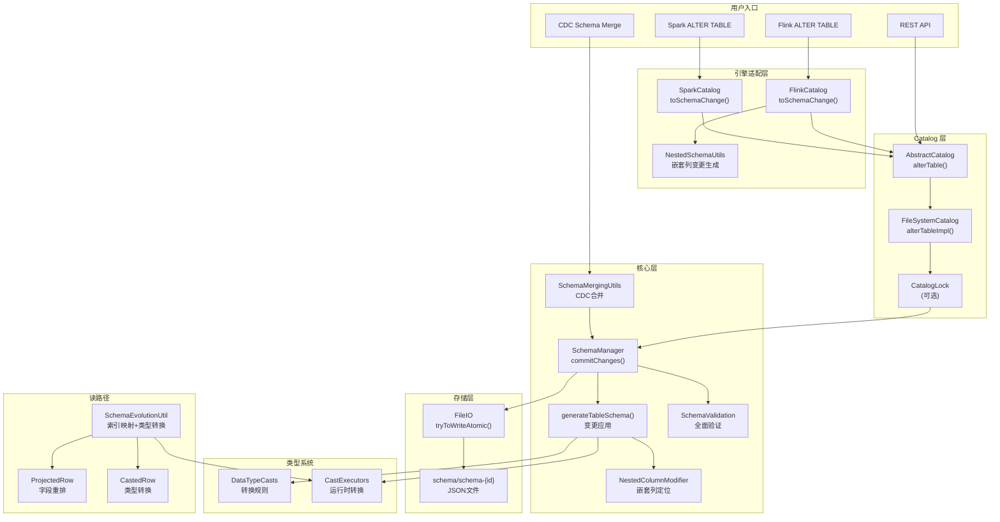
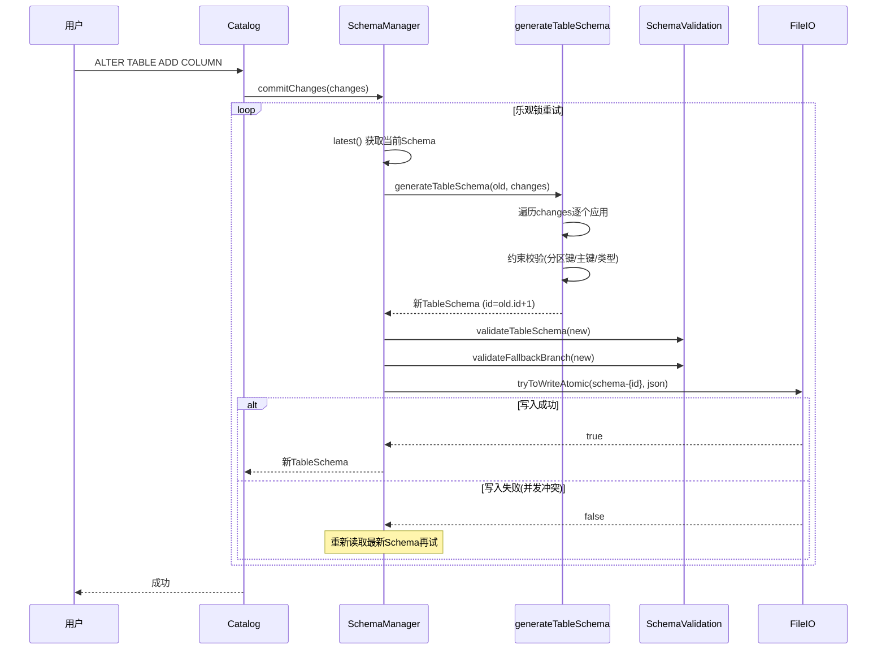
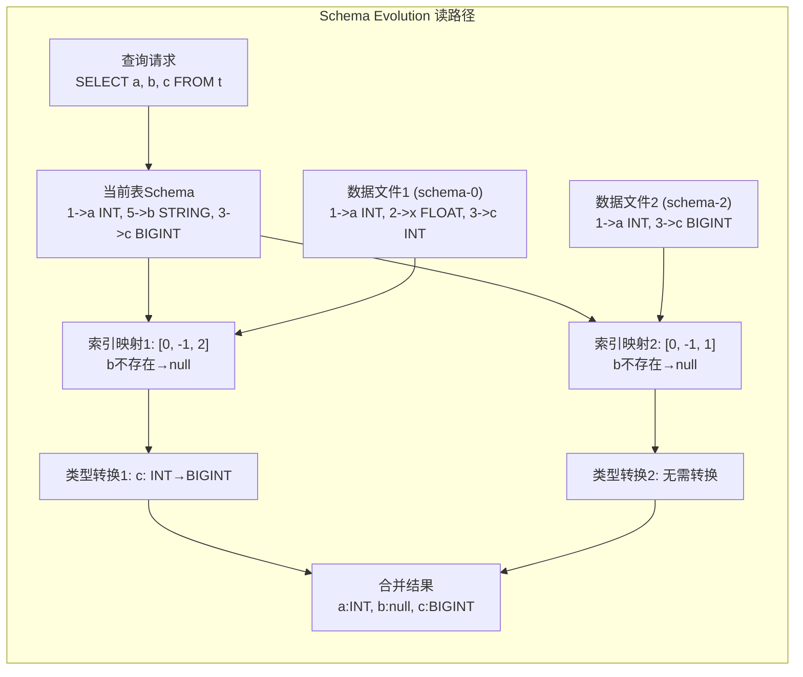

# Apache Paimon Schema 演进机制深度分析

> **基于源码版本**: Apache Paimon 1.5-SNAPSHOT (commit: 55f4fd175)
> **分析日期**: 2026-04-21
> **分析范围**: paimon-api、paimon-core、paimon-common、paimon-flink、paimon-spark 模块中 Schema 演进相关的全部核心代码

---

## 目录

- [1. 概述与设计哲学](#1-概述与设计哲学)
- [2. 核心数据模型](#2-核心数据模型)
  - [2.1 Schema 与 TableSchema 的区别](#21-schema-与-tableschema-的区别)
  - [2.2 TableSchema 字段详解](#22-tableschema-字段详解)
  - [2.3 Schema 文件存储结构](#23-schema-文件存储结构)
- [3. SchemaChange 的 12 种变更类型](#3-schemachange-的-12-种变更类型)
  - [3.1 表级别变更](#31-表级别变更)
  - [3.2 列级别变更](#32-列级别变更)
  - [3.3 约束级别变更](#33-约束级别变更)
  - [3.4 Move 位置指定机制](#34-move-位置指定机制)
  - [3.5 JSON 多态序列化](#35-json-多态序列化)
- [4. SchemaManager 乐观锁并发控制](#4-schemamanager-乐观锁并发控制)
  - [4.1 乐观锁实现原理](#41-乐观锁实现原理)
  - [4.2 createTable 的乐观锁循环](#42-createtable-的乐观锁循环)
  - [4.3 commitChanges 的乐观锁循环](#43-commitchanges-的乐观锁循环)
  - [4.4 tryToWriteAtomic 原子写入](#44-trytowriteatomic-原子写入)
  - [4.5 CatalogLock 双重保护](#45-cataloglock-双重保护)
- [5. generateTableSchema 核心流程](#5-generatetableschema-核心流程)
  - [5.1 整体流程概览](#51-整体流程概览)
  - [5.2 AddColumn 处理流程](#52-addcolumn-处理流程)
  - [5.3 RenameColumn 处理流程](#53-renamecolumn-处理流程)
  - [5.4 DropColumn 处理流程](#54-dropcolumn-处理流程)
  - [5.5 UpdateColumnType 处理流程](#55-updatecolumntype-处理流程)
  - [5.6 嵌套列修改机制 (NestedColumnModifier)](#56-嵌套列修改机制-nestedcolumnmodifier)
  - [5.7 选项重命名级联更新](#57-选项重命名级联更新)
- [6. 列操作约束体系](#6-列操作约束体系)
  - [6.1 分区键约束](#61-分区键约束)
  - [6.2 主键约束](#62-主键约束)
  - [6.3 类型转换约束](#63-类型转换约束)
  - [6.4 可空性约束](#64-可空性约束)
  - [6.5 不可变选项约束](#65-不可变选项约束)
  - [6.6 删除向量约束](#66-删除向量约束)
  - [6.7 Bucket 约束](#67-bucket-约束)
  - [6.8 完整约束汇总表](#68-完整约束汇总表)
- [7. SchemaValidation 全面验证](#7-schemavalidation-全面验证)
  - [7.1 建表时验证](#71-建表时验证)
  - [7.2 变更时验证](#72-变更时验证)
  - [7.3 Fallback Branch 验证](#73-fallback-branch-验证)
- [8. Schema Evolution 在读路径的影响](#8-schema-evolution-在读路径的影响)
  - [8.1 基于字段 ID 的索引映射](#81-基于字段-id-的索引映射)
  - [8.2 IndexCastMapping 机制](#82-indexcastmapping-机制)
  - [8.3 谓词下推的 Schema 适配](#83-谓词下推的-schema-适配)
  - [8.4 嵌套类型的 Cast 链](#84-嵌套类型的-cast-链)
  - [8.5 DataFileMeta 中的 schemaId](#85-datafilemeta-中的-schemaid)
  - [8.6 Snapshot 与 Schema 的关系](#86-snapshot-与-schema-的关系)
- [9. CDC 自动 Schema 演进 (SchemaMergingUtils)](#9-cdc-自动-schema-演进-schemamergingutils)
  - [9.1 mergeSchema 整体流程](#91-mergeschema-整体流程)
  - [9.2 递归类型合并算法](#92-递归类型合并算法)
  - [9.3 新字段 ID 分配](#93-新字段-id-分配)
  - [9.4 diffSchemaChanges 差异检测](#94-diffschemachanges-差异检测)
  - [9.5 SchemaModification 委托机制](#95-schemamodification-委托机制)
- [10. 嵌套列演进 (NestedSchemaUtils)](#10-嵌套列演进-nestedschemautils)
  - [10.1 ROW 类型嵌套演进](#101-row-类型嵌套演进)
  - [10.2 ARRAY/MAP/MULTISET 类型演进](#102-arraymapultiset-类型演进)
- [11. Schema Rollback 机制](#11-schema-rollback-机制)
  - [11.1 rollbackTo 实现原理](#111-rollbackto-实现原理)
  - [11.2 安全检查机制](#112-安全检查机制)
- [12. Flink ALTER TABLE 实现](#12-flink-alter-table-实现)
  - [12.1 FlinkCatalog.alterTable 两种重载](#121-flinkcatalogaltertable-两种重载)
  - [12.2 toSchemaChange 转换逻辑](#122-toschemachange-转换逻辑)
  - [12.3 非物理列处理](#123-非物理列处理)
- [13. Spark ALTER TABLE 实现](#13-spark-alter-table-实现)
  - [13.1 SparkCatalog.alterTable](#131-sparkcatalogaltertable)
  - [13.2 toSchemaChange 转换逻辑](#132-toschemachange-转换逻辑)
  - [13.3 Flink 与 Spark 实现差异对比](#133-flink-与-spark-实现差异对比)
- [14. 类型转换规则体系 (DataTypeCasts)](#14-类型转换规则体系-datatypecasts)
  - [14.1 三级转换规则](#141-三级转换规则)
  - [14.2 具体类型转换矩阵](#142-具体类型转换矩阵)
- [15. 与 Iceberg Schema Evolution 对比](#15-与-iceberg-schema-evolution-对比)
  - [15.1 架构对比](#151-架构对比)
  - [15.2 字段标识策略](#152-字段标识策略)
  - [15.3 并发控制对比](#153-并发控制对比)
  - [15.4 类型演进能力对比](#154-类型演进能力对比)
  - [15.5 优劣势总结](#155-优劣势总结)
- [16. 设计决策分析](#16-设计决策分析)
- [17. 整体架构图](#17-整体架构图)

---

## 1. 概述与设计哲学

Apache Paimon 的 Schema 演进机制是其作为 Lakehouse 存储格式的核心能力之一。在数据湖场景下，表结构的变更是一个高频操作——上游数据源的字段变更、业务需求的调整、数据类型的优化都需要对表结构进行修改。Paimon 设计了一套 **基于文件系统的乐观锁并发控制 + 基于字段 ID 的读时演进** 方案，在不依赖外部元数据服务的前提下，实现了安全、高效的 Schema 演进。

**核心设计哲学**：

1. **文件即元数据**：Schema 以 JSON 文件形式直接存储在表目录的 `schema/` 子目录下，不依赖外部数据库，天然支持对象存储
2. **版本化管理**：每次 Schema 变更都生成一个新的版本文件（`schema-0`, `schema-1`, ...），历史版本可追溯
3. **字段 ID 驱动**：通过全局递增的字段 ID（而非字段名）来关联新旧 Schema 中的列，保证列重命名后数据仍然正确关联
4. **读时演进**：旧数据文件不需要重写，在读取时通过 `SchemaEvolutionUtil` 动态适配当前 Schema
5. **乐观锁并发**：利用文件系统 rename 的原子性实现乐观并发控制，避免分布式锁的复杂性

**为什么选择这种设计？** 因为 Paimon 定位为无服务器依赖的 Lake Format，如果依赖 Metastore 做 Schema 管理，就会引入额外的运维成本和单点故障风险。基于文件的方案虽然在并发性能上不如数据库方案，但在数据湖场景下 Schema 变更的频率远低于数据写入，这个权衡是合理的。

---

## 2. 核心数据模型

### 2.1 Schema 与 TableSchema 的区别

Paimon 中有两个容易混淆的 Schema 类：

| 类名 | 所在模块 | 角色 | 特点 |
|------|---------|------|------|
| `Schema` | paimon-api | **用户接口层**的表结构定义 | 不含 schemaId、highestFieldId；用于建表和 API 交互 |
| `TableSchema` | paimon-api | **存储层**的完整表结构 | 包含 schemaId、highestFieldId、version、timeMillis；可序列化为 JSON 文件 |

**为什么需要两个类？** `Schema` 是面向用户的简洁接口，只需要声明字段、分区键、主键和选项即可。`TableSchema` 是系统内部使用的完整元数据，包含了版本管理所需的全部信息。这种分层设计遵循了接口隔离原则——用户不需要关心内部的 schemaId 分配和字段 ID 管理。

**源码位置**：
- `Schema`: `paimon-api/src/main/java/org/apache/paimon/schema/Schema.java`
- `TableSchema`: `paimon-api/src/main/java/org/apache/paimon/schema/TableSchema.java`

### 2.2 TableSchema 字段详解

```java
// TableSchema.java
public class TableSchema implements Serializable {
    public static final int PAIMON_07_VERSION = 1;
    public static final int PAIMON_08_VERSION = 2;
    public static final int CURRENT_VERSION = 3;

    private final int version;             // Schema 格式版本号（当前为3）
    private final long id;                 // Schema 版本ID，从0递增
    private final List<DataField> fields;  // 字段列表（不可变）
    private final int highestFieldId;      // 历史最大字段ID
    private final List<String> partitionKeys;  // 分区键名列表
    private final List<String> primaryKeys;    // 主键名列表
    private final List<String> bucketKeys;     // Bucket键（计算得出）
    private final int numBucket;               // Bucket数量（从选项计算）
    private final Map<String, String> options; // 表选项
    private final @Nullable String comment;    // 表注释
    private final long timeMillis;             // Schema创建时间戳
}
```

**各字段的设计原因**：

| 字段 | 为什么需要 | 好处 |
|------|-----------|------|
| `version` | 标识 Schema JSON 格式的版本 | 支持跨版本升级，新版本 Paimon 可以读取旧版本 Schema |
| `id` | Schema 的全局单调递增版本号 | 实现乐观锁（新版本 = 旧版本 + 1）；Snapshot 通过 schemaId 引用写入时的 Schema |
| `highestFieldId` | 追踪历史分配过的最大字段 ID | 即使删除列后，新增列的 ID 也不会与已删除列冲突，保证数据文件中的字段 ID 全局唯一 |
| `fields` | 使用 `Collections.unmodifiableList` 包装 | 不可变性保证了线程安全，任何修改都必须创建新的 TableSchema |
| `bucketKeys` | 从 primaryKeys 或 options 中的 `bucket-key` 推导 | 避免重复计算，构造时即完成验证 |
| `timeMillis` | 使用 `System.currentTimeMillis()` 记录 | 支持按时间查询 Schema 历史，方便调试和审计 |

**特别注意 `highestFieldId`**：当执行 `AddColumn` 时，新字段的 ID 从 `highestFieldId + 1` 开始分配。如果字段是复合类型（如 ROW），其内部子字段也需要分配 ID，因此 `highestFieldId` 可能跳跃增长。这是通过 `ReassignFieldId.reassign()` 实现的——该方法递归遍历 DataType 树，为每个需要 ID 的节点分配新 ID，并更新 `AtomicInteger highestFieldId`。

### 2.3 Schema 文件存储结构

```
table_root/
  schema/
    schema-0       # 初始 Schema (JSON)
    schema-1       # 第一次变更后的 Schema
    schema-2       # 第二次变更后的 Schema
    ...
```

**对于分支 (Branch) 的情况**：

```
table_root/
  branch/
    branch-feature1/
      schema/
        schema-0   # 分支的独立 Schema 版本
```

Schema 文件以 JSON 格式存储，内容就是 `TableSchema.toString()` 的输出。命名格式为 `schema-{id}`，其中 id 与 `TableSchema.id` 对应。

**为什么选择 JSON 文件而非二进制格式？** 可读性是首要考虑——运维人员可以直接查看和理解 Schema 文件内容，便于问题诊断。JSON 的反序列化性能在 Schema 场景下不是瓶颈（Schema 文件通常只有几 KB）。

---

## 3. SchemaChange 的 12 种变更类型

`SchemaChange` 是 Paimon Schema 演进的核心抽象，定义在 `paimon-api` 模块中，以 `interface` + 内部 `final class` 的方式实现多态。

**源码位置**: `paimon-api/src/main/java/org/apache/paimon/schema/SchemaChange.java`

### 3.1 表级别变更

#### 1. SetOption — 设置表选项

```java
final class SetOption implements SchemaChange {
    private final String key;
    private final String value;
}
```

**用途**: 设置或修改表的配置选项（如 `write-buffer-size`、`merge-engine` 等）。
**约束**: 如果表已有 Snapshot，会触发 `checkAlterTableOption` 检查不可变选项（如 `bucket-key`、`merge-engine`）。
**好处**: 运行时调优无需重建表，极大降低了运维成本。

#### 2. RemoveOption — 删除表选项

```java
final class RemoveOption implements SchemaChange {
    private final String key;
}
```

**用途**: 移除表的某个配置选项，恢复为默认值。
**约束**: 不可变选项不允许 reset；`bucket` 选项不允许 reset。

#### 3. UpdateComment — 更新表注释

```java
final class UpdateComment implements SchemaChange {
    private final @Nullable String comment;  // null 表示删除注释
}
```

**用途**: 修改或删除表的注释说明。
**设计巧妙之处**: `comment` 为 `null` 时表示删除注释，避免了额外定义一个 `RemoveComment` 类型。

### 3.2 列级别变更

#### 4. AddColumn — 添加列

```java
final class AddColumn implements SchemaChange {
    private final String[] fieldNames;  // 支持嵌套路径
    private final DataType dataType;
    private final String description;
    private final Move move;            // 列位置指定
}
```

**关键约束**: 新增列**必须是 nullable** 的（第 341 行 `checkArgument(addColumn.dataType().isNullable())`）。
**为什么必须 nullable？** 因为已有的数据文件中不包含新列的数据，读取时会填充 null。如果允许 NOT NULL，那么旧数据读出来就会违反约束。这是保证读时演进正确性的基础性约束。
**嵌套支持**: `fieldNames` 是数组，支持通过路径（如 `["address", "city"]`）向嵌套 ROW 类型中添加字段。

#### 5. RenameColumn — 重命名列

```java
final class RenameColumn implements SchemaChange {
    private final String[] fieldNames;  // 支持嵌套路径
    private final String newName;
}
```

**约束**: 不能重命名分区键；不能重命名 BLOB 类型列。
**为什么不能重命名分区键？** 分区键的名称直接影响目录结构和分区过滤逻辑，重命名会导致分区路径不匹配。

#### 6. DropColumn — 删除列

```java
final class DropColumn implements SchemaChange {
    private final String[] fieldNames;  // 支持嵌套路径
}
```

**约束**: 不能删除分区键或主键；不能删除所有字段（至少保留一个）。
**为什么允许删除列？** 因为 Paimon 基于字段 ID 做索引映射，删除列后读取旧数据文件时，该列对应的 ID 会映射到 `NULL_FIELD_INDEX = -1`，返回 null 值。新写入的数据文件则不再包含该列。

#### 7. UpdateColumnType — 更新列类型

```java
final class UpdateColumnType implements SchemaChange {
    private final String[] fieldNames;
    private final DataType newDataType;
    private final boolean keepNullability;  // 是否保持原有可空性
}
```

**约束**: 不能更新分区键和主键的类型；必须通过 `DataTypeCasts.supportsCast()` 检查并通过 `CastExecutors.resolve()` 确认有对应的转换器。
**`keepNullability` 的作用**: Spark 的 `UpdateColumnType` 会自动将类型的 nullability 设置为 true（因为 Spark 的类型系统默认 nullable），但实际上用户可能只想改类型不改 nullability。设置 `keepNullability = true` 可以保持原列的可空性不变。

#### 8. UpdateColumnNullability — 更新列可空性

```java
final class UpdateColumnNullability implements SchemaChange {
    private final String[] fieldNames;
    private final boolean newNullability;
}
```

**约束**: 默认禁止将 nullable 改为 NOT NULL（通过 `alter-column-null-to-not-null.disabled` 选项控制）；主键列不能改为 nullable。
**为什么默认禁止 null 转 NOT NULL？** 如果旧数据文件中已经存在 null 值，将列改为 NOT NULL 后读取这些数据会违反约束。这是一个有破坏性的操作，需要用户明确开启。

#### 9. UpdateColumnComment — 更新列注释

```java
final class UpdateColumnComment implements SchemaChange {
    private final String[] fieldNames;
    private final String newDescription;
}
```

**说明**: 纯元数据操作，不影响数据文件的读写。

#### 10. UpdateColumnDefaultValue — 更新列默认值

```java
final class UpdateColumnDefaultValue implements SchemaChange {
    private final String[] fieldNames;
    private final String newDefaultValue;
}
```

**约束**: 通过 `validateDefaultValue(field.type(), update.newDefaultValue())` 验证默认值与列类型的兼容性。
**作用**: 当写入数据缺少某列的值时，使用默认值填充。

#### 11. UpdateColumnPosition — 更新列位置

```java
final class UpdateColumnPosition implements SchemaChange {
    private final Move move;
}
```

**说明**: 仅影响逻辑展示顺序，不影响数据文件的物理存储。因为读取时依靠字段 ID 而非位置。

### 3.3 约束级别变更

#### 12. DropPrimaryKey — 删除主键

```java
final class DropPrimaryKey implements SchemaChange {
    // 无字段，仅标识操作类型
}
```

**关键约束**: **只有在表没有任何 Snapshot（即空表）时才允许删除主键**（第 557-559 行）。
**为什么有这个限制？** 主键直接决定了数据的存储结构（KeyValue 还是 AppendOnly）。已有数据如果是按主键组织的 LSM 树，删除主键后无法正确读取。

### 3.4 Move 位置指定机制

`Move` 类支持四种位置指定策略：

```java
class Move implements Serializable {
    public enum MoveType {
        FIRST,   // 移到最前
        AFTER,   // 移到某列之后
        BEFORE,  // 移到某列之前
        LAST     // 移到最后
    }
    
    private final String fieldName;
    private final String referenceFieldName;  // AFTER/BEFORE 时需要
    private final MoveType type;
}
```

**好处**: 提供了灵活的列排序能力，用户可以精确控制列的逻辑展示顺序。

### 3.5 JSON 多态序列化

SchemaChange 使用 Jackson 的 `@JsonTypeInfo` + `@JsonSubTypes` 实现多态序列化：

```java
@JsonTypeInfo(
    use = JsonTypeInfo.Id.NAME,
    include = JsonTypeInfo.As.PROPERTY,
    property = SchemaChange.Actions.FIELD_ACTION
)
@JsonSubTypes({
    @JsonSubTypes.Type(value = SetOption.class, name = "setOption"),
    @JsonSubTypes.Type(value = AddColumn.class, name = "addColumn"),
    // ... 共12种
})
public interface SchemaChange extends Serializable { ... }
```

**为什么需要 JSON 序列化？** 因为 Paimon 支持 REST Catalog，Schema 变更请求需要通过 HTTP API 传输。通过 `action` 属性区分不同类型的变更，实现了类型安全的反序列化。

---

## 4. SchemaManager 乐观锁并发控制

`SchemaManager` 是 Schema 演进的核心管理器，负责 Schema 的创建、变更、版本管理和并发控制。

**源码位置**: `paimon-core/src/main/java/org/apache/paimon/schema/SchemaManager.java`

### 4.1 乐观锁实现原理

Paimon 的 Schema 并发控制采用**乐观锁 + CAS（Compare And Swap）**模式，其核心原理是：

1. 读取当前最新的 Schema 版本（例如 `schema-5`）
2. 基于当前版本生成新版本（`schema-6`）
3. 尝试原子性地写入新版本文件
4. 如果写入失败（说明有其他并发修改），回到步骤 1 重试

这个机制不依赖任何分布式锁服务，利用的是文件系统 `rename` 操作的原子性。

**为什么选择乐观锁？**
- Schema 变更是低频操作（通常每天几次），冲突概率很低
- 不需要额外的锁服务，降低了部署复杂度
- 在对象存储（S3、OSS）环境下，没有可靠的分布式锁原语，文件原子 rename 是最佳选择

### 4.2 createTable 的乐观锁循环

```java
// SchemaManager.java 第 185-209 行
public TableSchema createTable(Schema schema, boolean externalTable) throws Exception {
    while (true) {
        Optional<TableSchema> latest = latest();
        if (latest.isPresent()) {
            // 表已存在的处理
            if (externalTable) {
                checkSchemaForExternalTable(latestSchema.toSchema(), schema);
                return latestSchema;
            } else {
                throw new IllegalStateException("Schema in filesystem exists, creation is not allowed.");
            }
        }
        
        TableSchema newSchema = TableSchema.create(0, schema);  // 初始ID为0
        FileStoreTableFactory.create(fileIO, tableRoot, newSchema).store();  // 验证
        boolean success = commit(newSchema);
        if (success) {
            return newSchema;
        }
        // 失败则重试——可能有并发创建
    }
}
```

**关键细节**：
- 初始 Schema 的 ID 固定为 0
- 建表前通过 `FileStoreTableFactory.create(...).store()` 验证配置的有效性
- `while(true)` 循环保证了在并发建表场景下只有一个成功

### 4.3 commitChanges 的乐观锁循环

```java
// SchemaManager.java 第 252-280 行
public TableSchema commitChanges(List<SchemaChange> changes) {
    SnapshotManager snapshotManager = new SnapshotManager(fileIO, tableRoot, branch, null, null);
    LazyField<Boolean> hasSnapshots = new LazyField<>(() -> snapshotManager.latestSnapshot() != null);
    
    while (true) {
        TableSchema oldTableSchema = latest().orElseThrow(...);
        TableSchema newTableSchema = generateTableSchema(
            oldTableSchema, changes, hasSnapshots, lazyIdentifier);
        try {
            boolean success = commit(newTableSchema);
            if (success) {
                return newTableSchema;
            }
        } catch (Exception e) {
            throw new RuntimeException(e);
        }
        // commit失败说明有并发修改，重新读取最新Schema再试
    }
}
```

**乐观锁的核心在于 `commit` 方法**：

```java
// SchemaManager.java 第 1083-1088 行
public boolean commit(TableSchema newSchema) throws Exception {
    SchemaValidation.validateTableSchema(newSchema);
    SchemaValidation.validateFallbackBranch(this, newSchema);
    Path schemaPath = toSchemaPath(newSchema.id());
    return fileIO.tryToWriteAtomic(schemaPath, newSchema.toString());
}
```

新 Schema 的 ID = 旧 Schema 的 ID + 1（第 579 行 `oldTableSchema.id() + 1`）。如果并发修改已经创建了 `schema-{id}` 文件，`tryToWriteAtomic` 会 rename 失败返回 false，触发重试。

### 4.4 tryToWriteAtomic 原子写入

```java
// FileIO.java 第 330-343 行
default boolean tryToWriteAtomic(Path path, String content) throws IOException {
    Path tmp = path.createTempPath();  // 创建临时隐藏文件路径
    boolean success = false;
    try {
        writeFile(tmp, content, false);  // 先写临时文件
        success = rename(tmp, path);     // 原子 rename
    } finally {
        if (!success) {
            deleteQuietly(tmp);          // 失败时清理临时文件
        }
    }
    return success;
}
```

**为什么使用 rename 而非直接写？**
1. **原子性**: 大多数文件系统的 rename 操作是原子的（特别是同目录下的 rename）
2. **唯一性**: 如果目标文件已存在，rename 操作会失败，天然实现了 CAS 语义
3. **完整性**: 避免了写入中途崩溃导致的不完整文件

**在对象存储上的行为**: S3 等对象存储的 rename 实际上是 copy + delete，但 Paimon 利用了 "如果目标已存在则失败" 的语义来实现并发控制。不同的 FileIO 实现（HadoopFileIO、S3FileIO 等）可能有不同的原子性保证。

### 4.5 CatalogLock 双重保护

在 `FileSystemCatalog` 中，Schema 变更还可以使用 CatalogLock 进行额外保护：

```java
// FileSystemCatalog.java 第 167-180 行
protected void alterTableImpl(Identifier identifier, List<SchemaChange> changes) {
    SchemaManager schemaManager = schemaManager(identifier);
    try {
        runWithLock(identifier, () -> schemaManager.commitChanges(changes));
    } catch (...) { ... }
}

public <T> T runWithLock(Identifier identifier, Callable<T> callable) throws Exception {
    Optional<CatalogLockFactory> lockFactory = lockFactory();
    try (Lock lock = lockFactory
            .map(factory -> factory.createLock(lockContext().orElse(null)))
            .map(l -> Lock.fromCatalog(l, identifier))
            .orElseGet(Lock::empty)) {
        return lock.runWithLock(callable);
    }
}
```

**为什么需要双重保护？**
- 乐观锁（文件 rename）是基础保障，任何环境下都可用
- CatalogLock 是可选的增强，当配置了 Hive Metastore 等外部锁服务时，可以减少无效的乐观重试
- 两层保护叠加，即使外部锁失效，乐观锁仍能保证正确性

---

## 5. generateTableSchema 核心流程

`generateTableSchema` 是 Schema 变更的核心处理方法，它接收旧 Schema 和变更列表，生成新的 TableSchema。

**源码位置**: `SchemaManager.java` 第 282-586 行

### 5.1 整体流程概览

```
┌─────────────────────────────────────────────────────────┐
│                generateTableSchema                       │
├─────────────────────────────────────────────────────────┤
│ 1. 复制旧 Schema 的 options、fields、primaryKeys          │
│ 2. 读取配置开关（disableNullToNotNull 等）                  │
│ 3. 遍历 changes 列表，逐个应用变更                         │
│ 4. 构造新的 Schema（处理主键重命名、选项重命名）             │
│ 5. 创建新 TableSchema（id = old.id + 1）                  │
└─────────────────────────────────────────────────────────┘
```

**关键设计**: 所有变更操作都在内存中的 `newFields`（ArrayList 副本）上执行，**不修改原始 Schema**。只有在所有变更都成功应用后，才创建新的 TableSchema。这保证了变更的原子性——要么全部成功，要么完全回滚。

初始化阶段读取的三个关键配置开关：

| 配置项 | 默认值 | 作用 |
|-------|--------|------|
| `alter-column-null-to-not-null.disabled` | `true` | 是否禁止将 nullable 改为 NOT NULL |
| `disable-explicit-type-casting` | `false` | 是否禁止显式类型转换（收窄转换） |
| `add-column-before-partition` | `false` | 新增列是否自动放在分区列之前 |

### 5.2 AddColumn 处理流程

AddColumn 的处理最为复杂，因为需要支持嵌套路径和多种位置指定：

```
AddColumn 处理流程:
1. 校验新列必须是 nullable
2. 分配新的字段 ID (highestFieldId + 1)
3. 如果数据类型是复合类型，递归分配内部字段 ID (ReassignFieldId)
4. 通过 NestedColumnModifier 定位目标位置:
   a. 如果指定了 Move，按 Move 策略插入
   b. 如果配置了 addColumnBeforePartition，插入到分区列之前
   c. 否则追加到末尾
5. 校验列名不重复
```

**分区列前插入的特殊逻辑**（第 389-399 行）：

```java
if (addColumnBeforePartition && !partitionKeys.isEmpty() 
    && addColumn.fieldNames().length == 1) {
    int insertIndex = newFields.size();
    for (int i = 0; i < newFields.size(); i++) {
        if (partitionKeys.contains(newFields.get(i).name())) {
            insertIndex = i;
            break;
        }
    }
    newFields.add(insertIndex, dataField);
}
```

**为什么有 `addColumnBeforePartition` 选项？** 在很多大数据场景中，分区键通常放在表的最后几列。新增列如果总是追加到末尾，会混在分区列之后，不利于阅读。这个选项让新列自动插入到分区列之前，保持列的逻辑分组。

### 5.3 RenameColumn 处理流程

```
RenameColumn 处理流程:
1. 校验不能重命名分区键
2. 校验不能重命名 BLOB 类型列
3. 通过 NestedColumnModifier 定位目标字段
4. 校验旧列名存在，新列名不存在
5. 创建新的 DataField（保持原 ID、类型、描述、默认值，只改名称）
6. 替换字段列表中的对应位置
```

**关键点**: 重命名只改变 `DataField.name`，不改变 `DataField.id`。这意味着旧数据文件仍然可以通过 ID 与新 Schema 关联，不需要重写数据。

### 5.4 DropColumn 处理流程

```
DropColumn 处理流程:
1. dropColumnValidation 校验:
   - 不能删除分区键
   - 不能删除主键
2. 通过 NestedColumnModifier 定位目标字段
3. 校验字段存在
4. 从 newFields 列表中移除
5. 校验至少保留一个字段
```

**为什么嵌套列删除不校验分区键和主键？**（第 876-878 行 `if (change.fieldNames().length > 1) return`）因为分区键和主键只能是顶层列，嵌套列不可能是分区键或主键。

### 5.5 UpdateColumnType 处理流程

```
UpdateColumnType 处理流程:
1. 校验不能更新分区键类型
2. 校验不能更新主键类型
3. 获取字段在嵌套深度处的根类型 (getRootType)
4. 处理 keepNullability:
   - true: 保持原可空性
   - false: 使用新类型的可空性，但需要通过 assertNullabilityChange 校验
5. 校验类型转换可行性:
   - DataTypeCasts.supportsCast() 检查转换规则
   - CastExecutors.resolve() 确认存在对应的运行时转换器
6. 如果是嵌套在 ARRAY/MAP 中的类型，通过 getArrayMapTypeWithTargetTypeRoot 递归重建类型树
```

**`getRootType` 和 `getArrayMapTypeWithTargetTypeRoot` 的配合**：

```java
// 例如: ARRAY<MAP<STRING, ARRAY<INT>>>
// 要把 INT 改为 BIGINT
// updateFieldNames = [v, element, value, element]
// maxDepth = 4

// getRootType 递归"向下钻取"到 INT
// getArrayMapTypeWithTargetTypeRoot 递归"向上重建" ARRAY<MAP<STRING, ARRAY<BIGINT>>>
```

**为什么不能更新分区键和主键的类型？**
- 分区键类型改变会导致分区路径计算方式变化，旧分区数据无法正确读取
- 主键类型改变会导致 LSM 树的排序和查找逻辑不一致

### 5.6 嵌套列修改机制 (NestedColumnModifier)

`NestedColumnModifier` 是一个抽象内部类，通过模板方法模式处理嵌套列的定位和修改：

```java
private abstract static class NestedColumnModifier {
    private final String[] updateFieldNames;  // 嵌套路径
    
    // 核心方法：递归定位到目标层级
    private void updateIntermediateColumn(
        List<DataField> newFields, List<DataField> previousFields, 
        int depth, int prevDepth) {
        if (depth == updateFieldNames.length - 1) {
            updateLastColumn(depth, newFields, updateFieldNames[depth]);
            return;
        }
        // 递归向下：
        // 1. 找到当前层级对应的字段
        // 2. extractRowDataFields 提取子字段列表
        // 3. 递归进入下一层级
        // 4. 用修改后的子字段列表重建当前字段
    }
    
    // 子类实现具体的修改逻辑
    protected abstract void updateLastColumn(
        int depth, List<DataField> newFields, String fieldName);
}
```

**`extractRowDataFields` 方法的深度处理**：

```java
private int extractRowDataFields(DataType type, List<DataField> nestedFields) {
    switch (type.getTypeRoot()) {
        case ROW:    nestedFields.addAll(((RowType) type).getFields()); return 1;
        case ARRAY:  return extractRowDataFields(((ArrayType) type).getElementType(), nestedFields) + 1;
        case MAP:    return extractRowDataFields(((MapType) type).getValueType(), nestedFields) + 1;
        default:     return 1;
    }
}
```

**为什么 ARRAY 和 MAP 需要额外的深度处理？** 在 Flink 中，ARRAY 类型的元素通过虚拟字段名 `element` 引用，MAP 类型的值通过虚拟字段名 `value` 引用。例如，修改 `ARRAY<ROW<a INT>>` 中的 `a` 字段，updateFieldNames 会是 `[col, element, a]`。但 ARRAY 本身没有 DataField 结构，所以需要跳过 ARRAY/MAP 层级，直接到达内部的 ROW 类型。

### 5.7 选项重命名级联更新

当重命名列时，相关的表选项也需要同步更新。`applyRenameColumnsToOptions` 方法处理了三类选项：

**Case 1: 固定 key，value 含字段名**

```java
// bucket-key, sequence.field
String bucketKeysStr = options.get(BUCKET_KEY.key());
// "col_a,col_b" -> "col_a_new,col_b" (如果 col_a 被重命名为 col_a_new)
```

**Case 2: key 含字段名，value 不含**

```java
// fields.{fieldName}.aggregate-function, fields.{fieldName}.ignore-retract 等
// "fields.col_a.aggregate-function" -> "fields.col_a_new.aggregate-function"
```

**Case 3: key 和 value 都含字段名**

```java
// fields.{fieldNames}.sequence-group = {fieldNames}
// fields.{fieldNames}.nested-key = {fieldNames}
```

**为什么需要级联更新选项？** 如果只重命名了列但不更新选项中的列名引用，相关功能（如聚合函数、序列字段）会因为找不到对应列而失效。这种级联更新保证了重命名操作的完整性。

---

## 6. 列操作约束体系

### 6.1 分区键约束

| 操作 | 是否允许 | 源码位置 | 原因 |
|------|---------|---------|------|
| 重命名分区键 | **禁止** | `assertNotUpdatingPartitionKeys` L887-898 | 分区路径依赖列名 |
| 删除分区键 | **禁止** | `dropColumnValidation` L874-885 | 破坏分区结构 |
| 更新分区键类型 | **禁止** | `assertNotUpdatingPartitionKeys` L887-898 | 分区路径计算方式变化 |
| 更新分区键可空性 | 允许 | - | 不影响分区路径 |
| 更新分区键注释 | 允许 | - | 纯元数据操作 |

### 6.2 主键约束

| 操作 | 是否允许 | 源码位置 | 原因 |
|------|---------|---------|------|
| 更新主键类型 | **禁止** | `assertNotUpdatingPrimaryKeys` L900-911 | LSM 树排序依赖类型 |
| 删除主键列 | **禁止** | `dropColumnValidation` L874-885 | 破坏数据唯一性约束 |
| 主键改为 nullable | **禁止** | L496-497 | 主键不允许 null 值 |
| 删除主键约束 | **仅空表允许** | L557-559 | 改变存储结构 |

### 6.3 类型转换约束

类型转换需要同时满足两个条件：

1. **DataTypeCasts.supportsCast(source, target, allowExplicit)** — 静态规则检查
2. **CastExecutors.resolve(source, target) != null** — 运行时转换器存在

```java
checkState(
    DataTypeCasts.supportsCast(sourceRootType, targetRootType, !disableExplicitTypeCasting)
    && CastExecutors.resolve(sourceRootType, targetRootType) != null,
    "Column type %s[%s] cannot be converted to %s without loosing information."
);
```

**为什么需要两重检查？** `DataTypeCasts` 定义的是类型系统层面的转换规则（如 INT -> BIGINT），而 `CastExecutors` 提供的是实际的运行时转换实现。理论上可转换但缺少实现的情况需要被拦截。

### 6.4 可空性约束

```java
// SchemaManager.java L640-653
private static void assertNullabilityChange(
    boolean oldNullability, boolean newNullability,
    String fieldName, boolean disableNullToNotNull) {
    if (disableNullToNotNull && oldNullability && !newNullability) {
        throw new UnsupportedOperationException(
            "Cannot update column type from nullable to non nullable for " + fieldName + "...");
    }
}
```

可空性变更规则：
- NULL -> NOT NULL: 默认**禁止**，需要设置 `alter-column-null-to-not-null.disabled = false` 开启
- NOT NULL -> NULL: **允许**（安全的宽化操作）
- NULL -> NULL 或 NOT NULL -> NOT NULL: **允许**（无变化）

### 6.5 不可变选项约束

通过 `@Immutable` 注解标记的 CoreOptions 不允许在表有数据后修改：

```java
// CoreOptions.java L4108-4122
public static final Set<String> IMMUTABLE_OPTIONS =
    Arrays.stream(CoreOptions.class.getFields())
        .filter(f -> ConfigOption.class.isAssignableFrom(f.getType())
                  && f.getAnnotation(Immutable.class) != null)
        .map(f -> ((ConfigOption<?>) f.get(CoreOptions.class)).key())
        .collect(Collectors.toSet());
```

**`checkAlterTableOption` 方法**（L1187-1266）检查的特殊规则：

| 选项 | 约束 | 原因 |
|------|------|------|
| `bucket` | 不允许从 -1 改变；不允许改为 -1 | 动态 bucket 和固定 bucket 是不同的写入模式 |
| `deletion-vectors.enabled` | 默认禁止改变 | 可能导致数据重复，需先做 full-compaction |
| `ignore-delete` | 不允许从 true 改为 false | 已丢弃的删除消息无法恢复 |
| `ignore-update-before` | 不允许从 true 改为 false | 已丢弃的 update-before 消息无法恢复 |
| `clustering-columns` | 当 `pk-clustering-override` 启用时禁止修改 | 与主键聚簇冲突 |

### 6.6 删除向量约束

```java
if (DELETION_VECTORS_ENABLED.key().equals(key)) {
    boolean dvModifiable = Boolean.parseBoolean(
        options.getOrDefault(DELETION_VECTORS_MODIFIABLE.key(), ...));
    if (!dvModifiable) {
        // 禁止修改
    }
}
```

**为什么修改删除向量模式需要谨慎？** 如果在没有做 full-compaction 的情况下关闭删除向量，原来被删除向量标记为删除的行会重新变为可见，导致数据重复。

### 6.7 Bucket 约束

```java
// checkAlterTableOption L1194-1207
if (CoreOptions.BUCKET.key().equals(key)) {
    int oldBucket = oldValue == null ? CoreOptions.BUCKET.defaultValue() : Integer.parseInt(oldValue);
    int newBucket = Integer.parseInt(newValue);
    if (oldBucket == -1) throw "Cannot change bucket when it is -1.";
    if (newBucket == -1) throw "Cannot change bucket to -1.";
}

// checkResetTableOption L1274-1276
if (CoreOptions.BUCKET.key().equals(key)) {
    throw "Cannot reset bucket.";
}
```

**为什么 bucket=-1（动态 bucket）不能和固定 bucket 互转？** 动态 bucket 模式使用完全不同的数据分布策略（基于 hash 动态分配），已有数据的 bucket 分配无法自动迁移。

### 6.8 完整约束汇总表

```
┌─────────────────┬──────────┬──────────┬──────────┬──────────┬──────────┐
│      操作        │ 普通列   │ 分区键   │ 主键     │ BLOB列   │ 嵌套列   │
├─────────────────┼──────────┼──────────┼──────────┼──────────┼──────────┤
│ AddColumn       │ √(NULL)  │ -        │ -        │ √(NULL)  │ √(NULL)  │
│ RenameColumn    │ √        │ ✗        │ √        │ ✗        │ √        │
│ DropColumn      │ √        │ ✗        │ ✗        │ √        │ √        │
│ UpdateType      │ √(1)(2)  │ ✗        │ ✗        │ -        │ √(1)(2)  │
│ UpdateNullable  │ √(3)     │ √(3)     │ ✗(→NULL) │ √(3)     │ √(3)     │
│ UpdateComment   │ √        │ √        │ √        │ √        │ √        │
│ UpdateDefault   │ √        │ √        │ √        │ √        │ √        │
│ UpdatePosition  │ √        │ √        │ √        │ √        │ -        │
│ DropPrimaryKey  │ -        │ -        │ 仅空表    │ -        │ -        │
└─────────────────┴──────────┴──────────┴──────────┴──────────┴──────────┘

(1) 需通过 DataTypeCasts 转换检查
(2) 需存在对应的 CastExecutor
(3) NULL→NOT NULL 默认禁止，可配置开启
√(NULL) = 只允许 nullable 类型
```

---

## 7. SchemaValidation 全面验证

**源码位置**: `paimon-core/src/main/java/org/apache/paimon/schema/SchemaValidation.java`

### 7.1 建表时验证

`validateTableSchema` 方法在每次 Schema 提交前被调用（`SchemaManager.commit` 第 1084 行），执行以下验证：

1. **主键、分区键、upsert-key 只能包含原始类型**（不允许 Map、Array、Row、Multiset）
2. **upsert-key 和 primary-key 不能同时定义**
3. **Bucket 配置验证**
4. **启动模式验证**（scan-mode 与 scan-timestamp、scan-snapshot-id 的一致性）
5. **fields 前缀选项验证**（聚合函数配置的有效性）
6. **序列字段验证**
7. **合并函数验证**
8. **Changelog 生产者与主键的一致性**
9. **快照保留配置的合理性**（min <= max）
10. **文件格式与列类型的兼容性**
11. **列名不能是系统保留字段**（`_KEY_`、`_VALUE_STATS` 等）
12. **列名不能以 `_KEY_` 前缀开头**
13. **删除向量配置验证**
14. **向量字段类型验证**（必须是 VECTOR 类型）
15. **Row Tracking 验证**
16. **增量聚簇验证**
17. **Chain Table 验证**

### 7.2 变更时验证

在 `generateTableSchema` 执行过程中，对每种变更类型有针对性的验证（参见第 6 节的约束体系）。

### 7.3 Fallback Branch 验证

```java
// SchemaValidation.java L289-310
public static void validateFallbackBranch(SchemaManager schemaManager, TableSchema schema) {
    // 1. scan.fallback-branch 和 scan.primary-branch 不能同时设置
    // 2. Fallback 分支的 Schema 字段名必须是当前 Schema 字段名的超集
}
```

**为什么要校验 Fallback Branch 的 Schema？** Fallback Branch 机制允许从主分支读不到数据时回退到备用分支。如果备用分支的 Schema 缺少主分支的字段，回退读取时会出错。

---

## 8. Schema Evolution 在读路径的影响

Schema Evolution 的核心思想是**读时演进**：旧数据文件保持不变，在读取时动态适配当前 Schema。

**源码位置**: `paimon-core/src/main/java/org/apache/paimon/schema/SchemaEvolutionUtil.java`

### 8.1 基于字段 ID 的索引映射

这是 Schema Evolution 在读路径上最关键的机制：

```java
// SchemaEvolutionUtil.java L80-104
public static int[] createIndexMapping(
    List<DataField> tableFields,   // 当前表的 Schema 字段
    List<DataField> dataFields) {  // 数据文件写入时的 Schema 字段
    
    int[] indexMapping = new int[tableFields.size()];
    Map<Integer, Integer> fieldIdToIndex = new HashMap<>();
    for (int i = 0; i < dataFields.size(); i++) {
        fieldIdToIndex.put(dataFields.get(i).id(), i);  // 按字段ID建索引
    }
    
    for (int i = 0; i < tableFields.size(); i++) {
        int fieldId = tableFields.get(i).id();
        Integer dataFieldIndex = fieldIdToIndex.get(fieldId);
        if (dataFieldIndex != null) {
            indexMapping[i] = dataFieldIndex;
        } else {
            indexMapping[i] = NULL_FIELD_INDEX;  // -1: 数据文件中不存在此字段
        }
    }
    
    // 优化：如果映射是恒等映射（0,1,2,...），返回 null 表示不需要映射
    for (int i = 0; i < indexMapping.length; i++) {
        if (indexMapping[i] != i) return indexMapping;
    }
    return null;
}
```

**示例**：

| 场景 | 当前表 Schema | 数据文件 Schema | 索引映射 |
|------|-------------|----------------|---------|
| 无变化 | `1->a, 2->b, 3->c` | `1->a, 2->b, 3->c` | `null`（恒等） |
| 添加了列 | `1->a, 2->b, 3->c, 4->d` | `1->a, 2->b, 3->c` | `[0, 1, 2, -1]` |
| 删除了列 | `1->a, 3->c` | `1->a, 2->b, 3->c` | `[0, 2]` |
| 重命名了列 | `1->x, 2->b, 3->c` | `1->a, 2->b, 3->c` | `null`（ID未变，恒等） |
| 重排了列 | `3->c, 1->a, 2->b` | `1->a, 2->b, 3->c` | `[2, 0, 1]` |

**为什么基于字段 ID 而非字段名？** 如果使用字段名，列重命名后就无法关联旧数据。字段 ID 是全局唯一且稳定的，只在添加列时分配，永不复用。这是 Paimon、Iceberg 等现代 Lake Format 的共同设计选择。

**恒等映射优化**: 当索引映射是 `[0, 1, 2, ...]` 时返回 `null`，避免不必要的内存分配和间接访问。这是读路径上的重要性能优化。

### 8.2 IndexCastMapping 机制

除了位置映射，还需要处理类型变更（如 INT -> BIGINT）：

```java
// SchemaEvolutionUtil.java L107-125
public static IndexCastMapping createIndexCastMapping(
    List<DataField> tableFields, List<DataField> dataFields) {
    int[] indexMapping = createIndexMapping(tableFields, dataFields);
    CastFieldGetter[] castMapping = 
        createCastFieldGetterMapping(tableFields, dataFields, indexMapping);
    return new IndexCastMapping() { ... };
}
```

`CastFieldGetter` 数组中每个元素包含：
- **FieldGetter**: 从数据行中获取字段值的方法
- **CastExecutor**: 将旧类型值转换为新类型值的执行器

如果没有类型变更（所有字段类型都匹配），`castMapping` 返回 `null`，避免运行时的类型转换开销。

### 8.3 谓词下推的 Schema 适配

当表的 Schema 发生变化后，查询时的过滤条件需要"退化"到数据文件写入时的 Schema 版本：

```java
// SchemaEvolutionUtil.java L140-187
public static List<Predicate> devolveFilters(
    List<DataField> tableFields,    // 当前表 Schema
    List<DataField> dataFields,     // 数据文件 Schema
    List<Predicate> filters,
    boolean keepNewFieldFilter) {
    // 对每个过滤谓词：
    // 1. 通过字段 ID 找到数据文件中对应的字段
    // 2. 如果字段不存在（新增列）：
    //    - keepNewFieldFilter=true: 保留谓词（需后续处理）
    //    - keepNewFieldFilter=false: 丢弃谓词
    // 3. 将字面量值从新类型转换为旧类型
    // 4. 用数据文件中的字段索引、名称、类型重建谓词
}
```

**为什么需要"退化"过滤器？** 数据文件中的列可能类型不同（如旧文件中是 INT，新 Schema 中已改为 BIGINT），过滤条件中的字面量需要转换为数据文件中的类型才能正确比较。

### 8.4 嵌套类型的 Cast 链

对于嵌套类型（ROW、ARRAY、MAP），Schema Evolution 需要递归构建 Cast 链：

```java
// SchemaEvolutionUtil.java L252-268
private static CastExecutor<?, ?> createCastExecutor(DataType inputType, DataType targetType) {
    if (targetType.equalsIgnoreNullable(inputType)) {
        return CastExecutors.identityCastExecutor();  // 无需转换
    } else if (inputType instanceof RowType && targetType instanceof RowType) {
        return createRowCastExecutor(...);  // 递归处理 ROW 内部字段
    } else if (inputType instanceof ArrayType && targetType instanceof ArrayType) {
        return createArrayCastExecutor(...);  // 处理数组元素类型变更
    } else if (inputType instanceof MapType && targetType instanceof MapType) {
        return createMapCastExecutor(...);  // 处理 Map 值类型变更
    } else {
        return CastExecutors.resolve(inputType, targetType);  // 原始类型转换
    }
}
```

**ROW 类型的 Cast 链**包括两步：
1. **ProjectedRow**: 处理字段位置映射（新增/删除/重排）
2. **CastedRow**: 处理字段类型转换

**MAP 类型的约束**: Key 类型不允许变更（第 304-308 行），因为 Map 的 key 需要保持一致才能正确查找。

### 8.5 DataFileMeta 中的 schemaId

每个数据文件都记录了写入时的 Schema 版本：

```java
// DataFileMeta.SCHEMA 第 75 行
new DataField(9, "_SCHEMA_ID", new BigIntType(false))
```

**为什么数据文件需要记录 schemaId？** 读取数据文件时，需要知道该文件是按哪个 Schema 版本写入的，才能正确构建索引映射和类型转换链。通过 `DataFileMeta.schemaId()` 可以从 `SchemaManager` 中加载对应版本的 Schema。

### 8.6 Snapshot 与 Schema 的关系

每个 Snapshot 也记录了提交时的 Schema 版本：

```java
// Snapshot.java 第 80 行
@JsonProperty(FIELD_SCHEMA_ID)
protected final long schemaId;
```

**Snapshot.schemaId 的作用**：
1. 确定该快照数据的整体 Schema 上下文
2. Schema Rollback 时检查哪些 Schema 版本被快照引用
3. 时间旅行查询时使用对应时间点的 Schema

---

## 9. CDC 自动 Schema 演进 (SchemaMergingUtils)

Paimon 支持从 CDC 数据源（MySQL、Kafka 等）同步数据时自动演进表 Schema。当上游数据源的表结构发生变化时，Paimon 会自动检测差异并更新 Schema。

**源码位置**: `paimon-core/src/main/java/org/apache/paimon/schema/SchemaMergingUtils.java`

### 9.1 mergeSchema 整体流程

```java
// SchemaMergingUtils.java L42-66
public static TableSchema mergeSchemas(
    TableSchema currentTableSchema, RowType targetType, boolean allowExplicitCast) {
    RowType currentType = currentTableSchema.logicalRowType();
    if (currentType.equals(targetType)) {
        return currentTableSchema;  // 无变化，直接返回
    }
    
    AtomicInteger highestFieldId = new AtomicInteger(currentTableSchema.highestFieldId());
    RowType newRowType = mergeSchemas(currentType, targetType, highestFieldId, allowExplicitCast);
    
    if (newRowType.equals(currentType)) {
        return currentTableSchema;  // 只有 nullability 变化，忽略
    }
    
    return new TableSchema(
        currentTableSchema.id() + 1,
        newRowType.getFields(),
        highestFieldId.get(),
        currentTableSchema.partitionKeys(),
        currentTableSchema.primaryKeys(),
        currentTableSchema.options(),
        currentTableSchema.comment());
}
```

**关键设计决策**：
- 合并时**保持当前 Schema 的 nullability**（不被目标类型的 nullability 覆盖）
- 新增字段使用目标类型但强制设为 nullable（`field.copy(true)`）
- Schema ID 自增 1

### 9.2 递归类型合并算法

`merge` 方法实现了一个递归的类型合并算法：

```
merge(base, update):
  1. 忽略 nullability 比较（都设为 true）
  2. 如果相等，返回 base（保持原 nullability）
  3. 如果都是 RowType:
     a. 对已有字段：递归 merge 类型
     b. 保留 base 中存在但 update 中不存在的字段
     c. 追加 update 中存在但 base 中不存在的字段（分配新 ID，强制 nullable）
  4. 如果都是 MapType: 分别 merge key 和 value
  5. 如果都是 ArrayType: merge 元素类型
  6. 如果都是 MultisetType: merge 元素类型
  7. 如果都是 DecimalType:
     a. scale 必须相同
     b. precision 取较大值
  8. 如果是可转换的原始类型:
     a. 比较 length/precision 属性
     b. 非显式转换时要求新类型的属性 >= 旧类型
  9. 否则报错
```

**为什么 Decimal 合并要求 scale 相同？** 不同 scale 的 Decimal 代表不同的精度含义（如价格的小数位数），自动合并不同 scale 可能导致数据语义错误。

**为什么新字段强制 nullable？** CDC 场景下，旧数据中不存在新字段，读取时只能返回 null。这与 AddColumn 的约束一致。

### 9.3 新字段 ID 分配

```java
// SchemaMergingUtils.java L228-236
private static DataField assignIdForNewField(DataField field, AtomicInteger highestFieldId) {
    DataType dataType = ReassignFieldId.reassign(field.type(), highestFieldId);
    return new DataField(
        highestFieldId.incrementAndGet(),
        field.name(),
        dataType,
        field.description(),
        field.defaultValue());
}
```

**注意**: `ReassignFieldId.reassign` 先处理嵌套类型内部的 ID 分配（如 ROW 类型的子字段），然后再给字段本身分配 ID。这保证了 `highestFieldId` 在分配后反映了所有已分配的 ID。

### 9.4 diffSchemaChanges 差异检测

`diffSchemaChanges` 方法用于比较新旧 Schema 的差异，生成 SchemaChange 列表：

```java
// SchemaMergingUtils.java L242-282
public static List<SchemaChange> diffSchemaChanges(
    TableSchema oldSchema, TableSchema newSchema) {
    List<SchemaChange> changes = new ArrayList<>();
    diffFields(
        oldSchema.logicalRowType().getFields(),
        newSchema.logicalRowType().getFields(),
        new String[0],
        changes);
    return changes;
}

private static void diffFields(
    List<DataField> oldFields, List<DataField> newFields,
    String[] parentNames, List<SchemaChange> changes) {
    for (DataField newField : newFields) {
        DataField oldField = oldFieldMap.get(newField.name());
        if (oldField == null) {
            // 新增列
            changes.add(SchemaChange.addColumn(fieldNames, newField.type(), ...));
        } else if (!oldField.type().equals(newField.type())) {
            if (oldField.type() instanceof RowType && newField.type() instanceof RowType) {
                diffFields(...);  // 递归比较嵌套 ROW
            } else {
                changes.add(SchemaChange.updateColumnType(fieldNames, newField.type(), true));
            }
        }
    }
}
```

**为什么需要 diffSchemaChanges？** 在 `SchemaModification` 委托模式下（见 9.5），CDC 不直接修改 Schema 文件，而是生成 SchemaChange 列表交给 Catalog 处理。这样可以走统一的 `alterTable` 流程，复用所有验证逻辑。

### 9.5 SchemaModification 委托机制

```java
// SchemaManager.java L719-743
public boolean mergeSchema(
    RowType rowType, boolean allowExplicitCast,
    @Nullable SchemaModification schemaModification) {
    TableSchema current = latest().orElseThrow(...);
    TableSchema update = SchemaMergingUtils.mergeSchemas(current, rowType, allowExplicitCast);
    if (current.equals(update)) {
        return false;  // 无变化
    }
    
    if (schemaModification != null) {
        // 委托模式：生成 SchemaChange 列表交给外部处理
        List<SchemaChange> changes = SchemaMergingUtils.diffSchemaChanges(current, update);
        schemaModification.alterSchema(changes);
        return true;
    } else {
        // 直接模式：直接提交新 Schema
        return commit(update);
    }
}
```

**为什么有两种模式？**
- **直接模式**: 用于简单的 FileSystemCatalog，直接写 Schema 文件
- **委托模式**: 用于需要通过 Catalog API 处理 Schema 变更的场景（如 Hive Catalog 需要同步更新 Hive Metastore），通过 `SchemaModification.alterSchema` 回调委托给 Catalog 处理

---

## 10. 嵌套列演进 (NestedSchemaUtils)

**源码位置**: `paimon-core/src/main/java/org/apache/paimon/schema/NestedSchemaUtils.java`

### 10.1 ROW 类型嵌套演进

当 Flink 的 `ALTER TABLE MODIFY COLUMN` 涉及 ROW 类型时，`NestedSchemaUtils.generateNestedColumnUpdates` 会：

1. 检查旧 ROW 中字段的相对顺序是否保持
2. 检查旧 ROW 中的字段是否被删除
3. 为新增的子字段生成 `AddColumn` 变更
4. 为类型变化的子字段递归调用 `generateNestedColumnUpdates`
5. 处理可空性变化

```java
// NestedSchemaUtils.java L78-76
private static void handleRowTypeUpdate(
    List<String> fieldNames, DataType oldType, DataType newType,
    List<SchemaChange> schemaChanges) {
    // 验证新类型也是 ROW
    // 检查已有字段的顺序不变
    // 检查没有字段被删除
    // 生成新增字段的 AddColumn
    // 递归处理类型变化的字段
}
```

### 10.2 ARRAY/MAP/MULTISET 类型演进

对于 ARRAY 类型，通过虚拟字段名 `element` 构建嵌套路径：

```java
private static void handleArrayTypeUpdate(...) {
    List<String> nestedNames = new ArrayList<>(fieldNames);
    nestedNames.add("element");
    generateNestedColumnUpdates(nestedNames, oldElementType, newElementType, schemaChanges);
}
```

对于 MAP 类型，只允许修改 value 类型（key 类型通过断言检查不变）：

```java
private static void handleMapTypeUpdate(...) {
    // key 类型必须相同
    List<String> nestedNames = new ArrayList<>(fieldNames);
    nestedNames.add("value");
    generateNestedColumnUpdates(nestedNames, oldValueType, newValueType, schemaChanges);
}
```

**为什么 MAP key 不允许修改？** MAP 的查找操作依赖 key 类型的一致性。如果 key 类型改变，已有数据中的 MAP 将无法正确查找。

---

## 11. Schema Rollback 机制

Paimon 提供了 Schema Rollback 能力，允许将 Schema 回滚到历史版本。

**源码位置**: `SchemaManager.java` 第 1147-1185 行

### 11.1 rollbackTo 实现原理

```java
public void rollbackTo(
    long targetSchemaId,
    SnapshotManager snapshotManager,
    TagManager tagManager,
    ChangelogManager changelogManager) throws IOException {
    
    // 1. 验证目标 Schema 存在
    checkArgument(schemaExists(targetSchemaId), "Schema %s does not exist.", targetSchemaId);
    
    // 2. 收集所有被引用的 schemaId
    Set<Long> usedSchemaIds = new HashSet<>();
    snapshotManager.pickOrLatest(snapshot -> {
        usedSchemaIds.add(snapshot.schemaId());
        return false;
    });
    tagManager.taggedSnapshots().forEach(s -> usedSchemaIds.add(s.schemaId()));
    changelogManager.changelogs().forEachRemaining(c -> usedSchemaIds.add(c.schemaId()));
    
    // 3. 检查是否有被引用的 Schema 比目标新
    Optional<Long> conflict = usedSchemaIds.stream()
        .filter(id -> id > targetSchemaId).min(Long::compareTo);
    if (conflict.isPresent()) {
        throw new RuntimeException("Cannot rollback...");
    }
    
    // 4. 删除所有比目标新的 Schema 文件
    List<Long> toBeDeleted = listAllIds().stream()
        .filter(id -> id > targetSchemaId)
        .collect(Collectors.toList());
    toBeDeleted.sort((o1, o2) -> Long.compare(o2, o1));  // 从大到小删除
    for (Long id : toBeDeleted) {
        fileIO.delete(toSchemaPath(id), false);
    }
}
```

### 11.2 安全检查机制

回滚前会检查三类引用：

| 引用来源 | 检查方式 | 原因 |
|---------|---------|------|
| Snapshot | 遍历所有快照的 schemaId | 快照引用的 Schema 不能被删除，否则无法读取数据 |
| Tag | 遍历所有标记的快照 | Tag 是快照的命名引用 |
| Changelog | 遍历所有变更日志 | Changelog 也引用 Schema |

**删除顺序**: 从大 ID 到小 ID 删除，确保在任何中间状态下 `latest()` 方法都能返回一个有效的 Schema。如果从小到大删除，可能出现最新的 Schema 已删除但更旧的还在的不一致状态。

**为什么需要 Schema Rollback？** 常见场景：
1. 误操作修改了 Schema，需要恢复
2. 测试环境中 Schema 频繁变更后需要清理
3. 与 Snapshot Rollback 配合使用

---

## 12. Flink ALTER TABLE 实现

### 12.1 FlinkCatalog.alterTable 两种重载

FlinkCatalog 提供了两个 `alterTable` 方法：

**重载 1: 纯属性修改**（第 686-731 行）

```java
public void alterTable(ObjectPath tablePath, CatalogBaseTable newTable, boolean ignoreIfNotExists) {
    // 比较新旧 options，生成 SetOption/RemoveOption 变更
    for (Map.Entry<String, String> entry : newTable.getOptions().entrySet()) {
        if (!Objects.equals(value, oldProperties.get(key))) {
            changes.add(SchemaChange.setOption(key, value));
        }
    }
    oldProperties.keySet().forEach(k -> {
        if (!newTable.getOptions().containsKey(k)) {
            changes.add(SchemaChange.removeOption(k));
        }
    });
    catalog.alterTable(toIdentifier(tablePath), changes, ignoreIfNotExists);
}
```

**重载 2: 完整 ALTER TABLE**（第 734-809 行）

```java
public void alterTable(ObjectPath tablePath, CatalogBaseTable newTable,
    List<TableChange> tableChanges, boolean ignoreIfNotExists) {
    // 1. 处理非物理列（watermark、computed column）变更
    // 2. 将 Flink 的 TableChange 转换为 Paimon 的 SchemaChange
    // 3. 调用 catalog.alterTable
}
```

### 12.2 toSchemaChange 转换逻辑

Flink 的 `TableChange` 到 Paimon 的 `SchemaChange` 的完整映射：

| Flink TableChange | Paimon SchemaChange | 特殊处理 |
|-------------------|--------------------|---------| 
| `AddColumn` | `SchemaChange.addColumn` | 只处理物理列；转换 Move |
| `DropColumn` | `SchemaChange.dropColumn` | 跳过非物理列 |
| `ModifyColumnName` | `SchemaChange.renameColumn` | 跳过非物理列 |
| `ModifyPhysicalColumnType` | 嵌套更新 | 调用 `generateNestedColumnUpdates` |
| `ModifyColumnPosition` | `SchemaChange.updateColumnPosition` | 跳过非物理列 |
| `ModifyColumnComment` | `SchemaChange.updateColumnComment` | 跳过非物理列 |
| `SetOption` | `SchemaChange.setOption` / `updateComment` | COMMENT_PROP 特殊处理 |
| `ResetOption` | `SchemaChange.removeOption` / `updateComment(null)` | COMMENT_PROP 特殊处理 |
| `AddWatermark` | `SchemaChange.setOption` (多个) | 水印存储在 options 中 |
| `DropWatermark` | `SchemaChange.removeOption` (多个) | 移除水印 options |
| `DropConstraint` | `SchemaChange.dropPrimaryKey` | 仅支持删除主键约束 |
| `ModifyRefreshStatus` | `SchemaChange.setOption` | 物化表专属 |
| `ModifyRefreshHandler` | `SchemaChange.setOption` | 物化表专属 |

### 12.3 非物理列处理

Flink 特有的非物理列（计算列、元数据列）通过 options 存储：

```java
Map<String, Integer> oldTableNonPhysicalColumnIndex =
    FlinkCatalogPropertiesUtil.nonPhysicalColumns(
        table.options(), table.rowType().getFieldNames());
```

在处理 `AddColumn`、`DropColumn` 等操作时，会检查是否是非物理列，非物理列的变更通过 options 的增删改来实现，而非真正的 Schema 字段变更。

**为什么 Flink 的非物理列存在 options 里？** Paimon 的 Schema 只支持物理列。Flink 的计算列和水印等元数据不需要持久化到数据文件中，存储在 options 是一种轻量级的扩展方式。

---

## 13. Spark ALTER TABLE 实现

### 13.1 SparkCatalog.alterTable

```java
// SparkCatalog.java L342-354
public Table alterTable(Identifier ident, TableChange... changes) throws NoSuchTableException {
    List<SchemaChange> schemaChanges =
        Arrays.stream(changes).map(this::toSchemaChange).collect(Collectors.toList());
    try {
        catalog.alterTable(toIdentifier(ident, catalogName), schemaChanges, false);
        return loadTable(ident);  // 重新加载表以获取最新 Schema
    } catch (Catalog.TableNotExistException e) {
        throw new NoSuchTableException(ident);
    }
}
```

Spark 的实现比 Flink 简洁，因为 Spark 没有非物理列的概念。

### 13.2 toSchemaChange 转换逻辑

| Spark TableChange | Paimon SchemaChange | 特殊处理 |
|-------------------|--------------------|---------| 
| `SetProperty` | `SchemaChange.setOption` / `updateComment` | COMMENT 特殊处理 |
| `RemoveProperty` | `SchemaChange.removeOption` / `updateComment(null)` | COMMENT 特殊处理 |
| `AddColumn` | `SchemaChange.addColumn` | 校验无默认值；支持嵌套路径 |
| `RenameColumn` | `SchemaChange.renameColumn` | 支持嵌套路径 |
| `DeleteColumn` | `SchemaChange.dropColumn` | 支持嵌套路径 |
| `UpdateColumnType` | `SchemaChange.updateColumnType` | **keepNullability=true** |
| `UpdateColumnNullability` | `SchemaChange.updateColumnNullability` | - |
| `UpdateColumnComment` | `SchemaChange.updateColumnComment` | 支持嵌套路径 |
| `UpdateColumnPosition` | `SchemaChange.updateColumnPosition` | 仅支持 FIRST/AFTER |
| `UpdateColumnDefaultValue` | `SchemaChange.updateColumnDefaultValue` | Spark 3.4+ |

### 13.3 Flink 与 Spark 实现差异对比

| 特性 | Flink | Spark |
|------|-------|-------|
| 非物理列支持 | 有（watermark、computed column） | 无 |
| 嵌套列变更入口 | `generateNestedColumnUpdates` | 直接传递嵌套路径 |
| 类型更新 keepNullability | **false**（会改变 nullability） | **true**（保持原 nullability） |
| Move 类型 | FIRST, AFTER | FIRST, AFTER |
| BEFORE/LAST Move | 不支持 | 不支持 |
| 主键删除 | 通过 DropConstraint | 不支持 |
| 默认值 | 不支持 | 通过 metadata 传递 |
| 物化表支持 | 有 | 无 |
| 水印支持 | 有（通过 options） | 无 |
| `primary-key` 属性检查 | 无 | `validateAlterProperty` 禁止修改 |

**为什么 Flink 和 Spark 的 keepNullability 不同？** Flink 的 `ModifyPhysicalColumnType` 携带完整的新 DataType（包含 nullability），用户意图是完全替换类型。而 Spark 的 `UpdateColumnType` 只传递新的 DataType，nullability 变更由独立的 `UpdateColumnNullability` 处理。Spark 设置 `keepNullability=true` 避免了类型更新时意外改变可空性。

---

## 14. 类型转换规则体系 (DataTypeCasts)

**源码位置**: `paimon-api/src/main/java/org/apache/paimon/types/DataTypeCasts.java`

### 14.1 三级转换规则

DataTypeCasts 定义了三级类型转换规则：

| 级别 | 说明 | 使用场景 | 安全性 |
|------|------|---------|--------|
| **Implicit (隐式)** | 无信息丢失的安全转换 | Schema Merge（CDC） | 最安全 |
| **Explicit (显式)** | 可能丢失信息的转换 | 手动 ALTER TABLE | 中等 |
| **Compatible (兼容)** | 类型族内的宽化转换 | 类型合并 | 安全 |

```java
// 方法签名
public static boolean supportsCast(DataType source, DataType target, boolean allowExplicit) {
    if (implicitCastingRules contains (source -> target)) return true;
    if (allowExplicit && explicitCastingRules contains (source -> target)) return true;
    return false;
}

public static boolean supportsCompatibleCast(DataType source, DataType target) {
    return compatibleCastingRules contains (source -> target);
}
```

### 14.2 具体类型转换矩阵

**数值类型隐式转换链**：

```
TINYINT → SMALLINT → INTEGER → BIGINT → DECIMAL → FLOAT → DOUBLE
                                  ↑
                              (所有都可隐式转到 DECIMAL)
```

**字符串类型**：

```
CHAR → VARCHAR  (隐式)
VARCHAR → CHAR  (显式)
几乎所有类型 → CHAR/VARCHAR (显式)
```

**时间类型**：

```
TIME → TIME (仅相同)
TIMESTAMP → TIMESTAMP (隐式，precision 可升)
TIMESTAMP_LTZ → TIMESTAMP_LTZ (隐式，precision 可升)
```

**二进制类型**：

```
BINARY → VARBINARY (隐式)
VARBINARY → BINARY (显式)
```

**Compatible 规则**（用于 CDC 合并）：

| 源类型 | 可兼容的目标类型 |
|-------|---------------|
| CHAR | CHAR, VARCHAR |
| VARCHAR | CHAR, VARCHAR |
| BOOLEAN | BOOLEAN |
| BINARY | BINARY, VARBINARY |
| VARBINARY | BINARY, VARBINARY |
| TINYINT | TINYINT |
| SMALLINT | SMALLINT |
| INTEGER | INTEGER |
| BIGINT | BIGINT |
| FLOAT | FLOAT |
| DOUBLE | DOUBLE |

**为什么 Compatible 规则比 Implicit 规则更严格？** Compatible 规则用于判断两个类型是否可以安全地合并为一个公共类型（如 CDC 场景），要求类型必须在同一个"类型族"内。而 Implicit 规则允许跨类型族的宽化（如 INT -> FLOAT）。

---

## 15. 与 Iceberg Schema Evolution 对比

### 15.1 架构对比

| 维度 | Paimon | Iceberg |
|------|--------|---------|
| Schema 存储 | 文件系统上的 JSON 文件 (`schema/schema-{id}`) | 表元数据 JSON 中的 schemas 数组 |
| 版本管理 | 独立的 Schema 版本文件 | 嵌入在 metadata.json 中 |
| 元数据服务依赖 | 可选（可纯文件系统） | 需要 metadata.json（可选 catalog） |
| Schema 与数据的关联 | DataFileMeta.schemaId + Snapshot.schemaId | Manifest 中 ManifestFile.content.schema_id |

### 15.2 字段标识策略

| 维度 | Paimon | Iceberg |
|------|--------|---------|
| 字段 ID 分配 | `highestFieldId` 递增 | `last-column-id` 递增 |
| 嵌套字段 ID | 通过 `ReassignFieldId` 递归分配 | 同样递归分配 |
| ID 复用 | **不复用**（删除列后 ID 永不重用） | **不复用** |
| 读取时匹配 | 基于字段 ID | 基于字段 ID |

**两者在字段标识策略上高度一致**，都选择了基于 ID 的方案。这是现代 Lake Format 的共识。

### 15.3 并发控制对比

| 维度 | Paimon | Iceberg |
|------|--------|---------|
| 锁机制 | 文件 rename 乐观锁 + 可选 CatalogLock | metadata.json 乐观锁 + 可选 Lock |
| 原子性保证 | `tryToWriteAtomic`（rename） | `commit`（atomic replace metadata.json） |
| 冲突检测 | 新 schema 文件已存在 | metadata.json 版本不匹配 |
| 重试策略 | `while(true)` 无限重试 | 可配置重试次数 |

**关键差异**: Paimon 为每个 Schema 版本创建独立文件，并发冲突的概率更低（只有同一个 id 的两次并发写入才冲突）。Iceberg 的所有元数据（包括多个 Schema 版本、Snapshot 信息等）都在一个 metadata.json 中，任何元数据修改都可能冲突。

### 15.4 类型演进能力对比

| 能力 | Paimon | Iceberg |
|------|--------|---------|
| 添加列 | 支持（必须 nullable） | 支持（必须 optional/nullable） |
| 删除列 | 支持 | 支持（通过 soft delete） |
| 重命名列 | 支持 | 支持 |
| 重排列 | 支持（Move FIRST/AFTER/BEFORE/LAST） | 支持（Spark SQL） |
| 修改类型 | 支持（宽化+显式） | 支持（仅宽化：int->long, float->double, decimal(P1,S)->decimal(P2,S) where P2>P1） |
| 修改可空性 | 支持（双向，可配置） | 支持（仅 required->optional） |
| 嵌套列演进 | 支持（ROW、ARRAY、MAP） | 支持（struct、list、map） |
| 修改分区键 | 禁止 | 支持（分区演进） |
| 默认值 | 支持 | 支持（Iceberg v2） |
| Schema Rollback | 支持 | 通过 metadata rollback 实现 |
| CDC 自动演进 | 内置 `SchemaMergingUtils` | 需要外部工具（如 Flink CDC） |

### 15.5 优劣势总结

**Paimon 的优势**：
1. **更灵活的类型转换**: 支持显式类型转换（需配置开启），如 BIGINT -> INT
2. **内置 CDC 自动演进**: `SchemaMergingUtils` 和 `mergeSchema` 方法原生支持
3. **Schema 独立文件**: 变更不影响其他元数据，并发性更好
4. **选项级联更新**: 重命名列时自动更新相关选项（bucket-key、sequence-field 等）
5. **列位置灵活控制**: 支持 FIRST、AFTER、BEFORE、LAST 四种位置策略

**Iceberg 的优势**：
1. **分区演进**: 支持修改分区策略，无需重写数据
2. **元数据统一管理**: 所有元数据在单个 metadata.json 中，事务语义更强
3. **更严格的类型安全**: 只允许安全的宽化转换，减少数据损坏风险
4. **Soft Delete**: 删除列不是真正删除，而是标记为不可见，更安全
5. **REST Catalog 生态**: 成熟的 REST Catalog 规范

---

## 16. 设计决策分析

### 决策 1: 为什么 SchemaChange 定义在 paimon-api 而非 paimon-core？

**决策**: SchemaChange 接口及其 12 种实现类都在 `paimon-api` 模块中。

**原因**: 
- SchemaChange 是公开 API（标注了 `@Public`），Flink、Spark 等引擎直接依赖它来构建变更请求
- REST Catalog 需要通过 HTTP 传输 SchemaChange（因此需要 JSON 序列化支持）
- 如果放在 paimon-core，会导致 paimon-flink 和 paimon-spark 需要额外依赖 paimon-core

**好处**: 保持了模块依赖的单向性（api <- core，api <- flink/spark），符合分层架构原则。

### 决策 2: 为什么 highestFieldId 要独立存储，不从 fields 推算？

**决策**: TableSchema 单独存储 `highestFieldId`，而非从当前 fields 的最大 ID 推算。

**原因**: 字段删除后，如果只看当前 fields 的最大 ID，新分配的 ID 可能与已删除列的 ID 冲突。例如：
1. 初始 fields: `[1->a, 2->b, 3->c]`，highestFieldId=3
2. 删除列 c：fields: `[1->a, 2->b]`，highestFieldId=3
3. 如果从 fields 推算 highestFieldId=2，新增列会得到 ID 3，与已删除的 c 冲突

**好处**: 保证了字段 ID 的全局唯一性，使得旧数据文件中的列 c（ID=3）不会与新列混淆。

### 决策 3: 为什么新增列必须是 nullable？

**决策**: AddColumn 强制要求 `dataType.isNullable() == true`。

**原因**: 已有的数据文件中不包含新列的数据。读取旧数据时，新列的值只能是 null。如果允许 NOT NULL，读取旧数据就会违反约束。

**好处**: 保证了读时演进的正确性，不需要回填旧数据文件。

### 决策 4: 为什么 Schema ID 采用简单递增而非 UUID？

**决策**: Schema ID 使用 `long` 类型的简单递增（`oldTableSchema.id() + 1`）。

**原因**: 
- 简单递增天然实现了版本顺序
- 文件名 `schema-{id}` 按名称排序就是时间顺序
- 通过 rename 的 CAS 语义保证唯一性

**好处**: 
- 易于理解和调试
- `latest()` 方法只需要找最大 ID
- 版本比较只需要数值比较

### 决策 5: 为什么 commit 使用 tryToWriteAtomic 而非分布式锁？

**决策**: Schema 提交通过 `fileIO.tryToWriteAtomic()` 实现，即先写临时文件再 rename。

**原因**: 
- Paimon 的核心定位是无外部依赖的 Lake Format
- 对象存储（S3、OSS）没有可靠的分布式锁原语
- Schema 变更频率低（通常每天几次），乐观锁的冲突概率极低

**好处**: 
- 零外部依赖
- 适用于任何支持 rename 的文件系统
- 通过可选的 CatalogLock 可以在高并发场景下增强

### 决策 6: 为什么 SchemaMergingUtils 合并时忽略 nullability？

**决策**: `merge` 方法在比较类型时忽略 nullability（`base0.copy(true)` 和 `update0.copy(true)`），最终使用 base 的 nullability。

**原因**: 
- CDC 数据源的 nullability 信息可能不准确
- 已有数据可能有 null 值，将列改为 NOT NULL 是危险操作
- 保守策略更安全

**好处**: 避免了 CDC 自动演进时意外改变列的可空性，减少数据不一致的风险。

### 决策 7: 为什么 Schema Rollback 从大到小删除？

**决策**: `rollbackTo` 方法的删除顺序是从最大 ID 开始向下删除。

**原因**: `latest()` 方法返回最大 ID 的 Schema。如果从小 ID 开始删除：
1. 当前 latest 是 schema-5
2. 删除 schema-3
3. 此时 latest 仍是 schema-5（一致）
4. 但如果同时有读取操作，看到 schema-3 不存在会困惑

从大到小删除时：
1. 删除 schema-5
2. 此时 latest 变为 schema-4（一致）
3. 继续删除 schema-4
4. 最终 latest 是目标版本

**好处**: 在删除过程中的任何时刻，`latest()` 都返回一个有效且连续的 Schema 版本。

### 决策 8: 为什么重命名列时要级联更新选项？

**决策**: `applyRenameColumnsToOptions` 方法在重命名列时自动更新 bucket-key、sequence.field、聚合函数配置等选项中的列名引用。

**原因**: 如果只重命名了列但不更新引用该列名的选项：
- `bucket-key = old_name` 会变成无效引用
- `fields.old_name.aggregate-function = sum` 会失效
- `sequence.field = old_name` 会找不到序列字段

**好处**: 重命名操作的完整性得到保证，用户不需要手动更新所有相关选项。

---

## 17. 整体架构图







---

## 附录 A: 核心源码文件索引

| 文件 | 模块 | 职责 |
|------|------|------|
| `SchemaChange.java` | paimon-api | 12种变更类型定义 |
| `Schema.java` | paimon-api | 用户层表结构定义 |
| `TableSchema.java` | paimon-api | 存储层完整表结构 |
| `DataTypeCasts.java` | paimon-api | 三级类型转换规则 |
| `SchemaManager.java` | paimon-core | 乐观锁并发控制 + 变更应用 |
| `SchemaValidation.java` | paimon-core | 全面验证逻辑 |
| `SchemaEvolutionUtil.java` | paimon-core | 读路径索引映射和类型转换 |
| `SchemaMergingUtils.java` | paimon-core | CDC 自动Schema合并 |
| `NestedSchemaUtils.java` | paimon-core | 嵌套列变更生成 |
| `FileIO.java` | paimon-common | tryToWriteAtomic 原子写入 |
| `FlinkCatalog.java` | paimon-flink | Flink ALTER TABLE 实现 |
| `SparkCatalog.java` | paimon-spark | Spark ALTER TABLE 实现 |
| `FileSystemCatalog.java` | paimon-core | 文件系统Catalog的alterTable实现 |
| `AbstractCatalog.java` | paimon-core | Catalog抽象层的alterTable调度 |
| `Snapshot.java` | paimon-api | 快照与schemaId的关联 |
| `DataFileMeta.java` | paimon-core | 数据文件元数据中的schemaId |

## 附录 B: 关键配置项

| 配置项 | 默认值 | 说明 |
|-------|--------|------|
| `alter-column-null-to-not-null.disabled` | `true` | 禁止将nullable改为NOT NULL |
| `disable-explicit-type-casting` | `false` | 禁止显式类型转换（收窄） |
| `add-column-before-partition` | `false` | 新增列放在分区列之前 |
| `deletion-vectors.modifiable` | `false` | 是否允许修改删除向量开关 |

## 附录 C: 完整变更类型速查

```
SchemaChange (interface)
├── SetOption          — 设置表选项
├── RemoveOption       — 删除表选项
├── UpdateComment      — 更新表注释
├── AddColumn          — 添加列 (支持嵌套, 支持Move)
├── RenameColumn       — 重命名列 (支持嵌套)
├── DropColumn         — 删除列 (支持嵌套)
├── UpdateColumnType   — 更新列类型 (支持嵌套, keepNullability)
├── UpdateColumnNullability — 更新列可空性 (支持嵌套)
├── UpdateColumnComment    — 更新列注释 (支持嵌套)
├── UpdateColumnDefaultValue — 更新列默认值 (支持嵌套)
├── UpdateColumnPosition   — 更新列位置 (Move)
└── DropPrimaryKey         — 删除主键约束 (仅空表)
```
