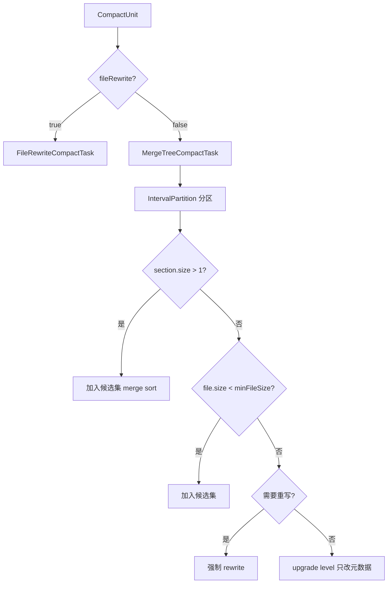
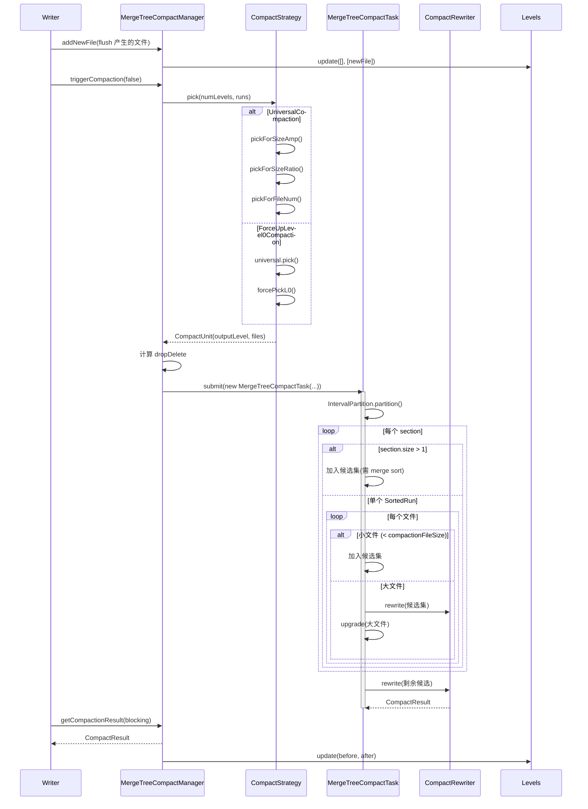
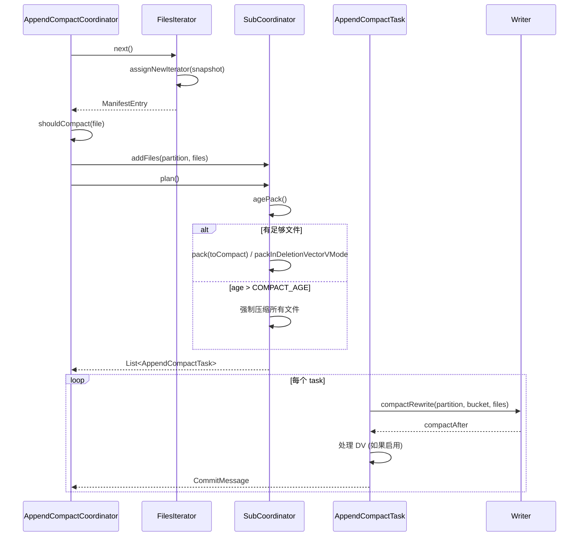
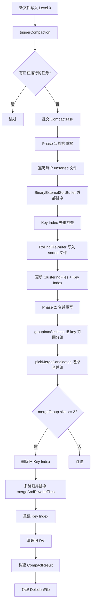
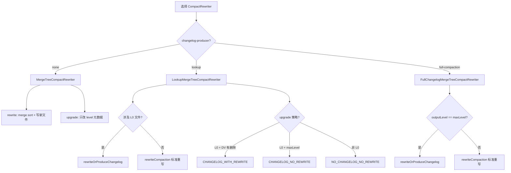

# Apache Paimon Compaction 全链路深度分析

> 基于 Paimon 1.5-SNAPSHOT 源码（commit: 55f4fd175），全面剖析 Compaction 机制的架构设计、策略选择、执行流程与工程细节。
> 分析日期: 2026-04-21

---

## 目录

- [1. Compaction 概述与设计哲学](#1-compaction-概述与设计哲学)
  - [1.1 为什么需要 Compaction](#11-为什么需要-compaction)
  - [1.2 Paimon 的 Compaction 分类体系](#12-paimon-的-compaction-分类体系)
  - [1.3 核心设计原则](#13-核心设计原则)
- [2. 核心抽象层：CompactManager 体系](#2-核心抽象层compactmanager-体系)
  - [2.1 CompactManager 接口](#21-compactmanager-接口)
  - [2.2 CompactFutureManager 基类](#22-compactfuturemanager-基类)
  - [2.3 CompactTask 执行单元](#23-compacttask-执行单元)
  - [2.4 CompactUnit 与 CompactResult](#24-compactunit-与-compactresult)
- [3. LSM-Tree 数据结构基础](#3-lsm-tree-数据结构基础)
  - [3.1 Levels：多层文件管理](#31-levels多层文件管理)
  - [3.2 SortedRun 与 LevelSortedRun](#32-sortedrun-与-levelsortedrun)
  - [3.3 IntervalPartition：区间分区算法](#33-intervalpartition区间分区算法)
- [4. 主键表 Compaction：MergeTreeCompactManager](#4-主键表-compactionmergetreecompactmanager)
  - [4.1 整体架构](#41-整体架构)
  - [4.2 触发机制：triggerCompaction](#42-触发机制triggercompaction)
  - [4.3 反压控制：shouldWaitForLatestCompaction](#43-反压控制shouldwaitforlatestcompaction)
  - [4.4 结果收集与 Levels 更新](#44-结果收集与-levels-更新)
  - [4.5 Deletion Vector 集成](#45-deletion-vector-集成)
- [5. CompactStrategy 策略体系](#5-compactstrategy-策略体系)
  - [5.1 策略接口设计](#51-策略接口设计)
  - [5.2 UniversalCompaction：核心策略](#52-universalcompaction核心策略)
  - [5.3 ForceUpLevel0Compaction：Lookup 模式策略](#53-forceuplevel0compaction-lookup-模式策略)
  - [5.4 EarlyFullCompaction：提前全量压缩](#54-earlyfullcompaction提前全量压缩)
  - [5.5 OffPeakHours：低峰期自适应策略](#55-offpeakhours低峰期自适应策略)
  - [5.6 Full Compaction：全量压缩](#56-full-compaction全量压缩)
- [6. Compact Task 执行层](#6-compact-task-执行层)
  - [6.1 MergeTreeCompactTask：主压缩任务](#61-mergetreecompacttask主压缩任务)
  - [6.2 FileRewriteCompactTask：文件级重写任务](#62-filerewritecompacttask文件级重写任务)
  - [6.3 upgrade 与 rewrite 的区分逻辑](#63-upgrade-与-rewrite-的区分逻辑)
- [7. CompactRewriter 重写器体系](#7-compactrewriter-重写器体系)
  - [7.1 继承层次总览](#71-继承层次总览)
  - [7.2 MergeTreeCompactRewriter：标准重写器](#72-mergetreecompactrewriter标准重写器)
  - [7.3 ChangelogMergeTreeRewriter：变更日志重写器](#73-changelogmergetreerewriter变更日志重写器)
  - [7.4 LookupMergeTreeCompactRewriter：Lookup 重写器](#74-lookupmergetreecompactrewriter-lookup-重写器)
  - [7.5 FullChangelogMergeTreeCompactRewriter](#75-fullchangelogmergetreecompactrewriter)
- [8. Append-Only 表 Compaction](#8-append-only-表-compaction)
  - [8.1 BucketedAppendCompactManager](#81-bucketedappendcompactmanager)
  - [8.2 AppendCompactCoordinator：Unaware-Bucket 协调器](#82-appendcompactcoordinatorunaware-bucket-协调器)
  - [8.3 AppendCompactTask：独立压缩任务](#83-appendcompacttask独立压缩任务)
  - [8.4 AppendPreCommitCompactCoordinator](#84-appendprecommitcompactcoordinator)
- [9. Clustering Compaction：聚簇压缩](#9-clustering-compaction聚簇压缩)
  - [9.1 ClusteringCompactManager 整体设计](#91-clusteringcompactmanager-整体设计)
  - [9.2 Phase 1：排序重写](#92-phase-1排序重写)
  - [9.3 Phase 2：合并重写](#93-phase-2合并重写)
  - [9.4 ClusteringFiles 文件管理](#94-clusteringfiles-文件管理)
  - [9.5 Spill 机制与内存管理](#95-spill-机制与内存管理)
- [10. Manifest 文件 Compaction](#10-manifest-文件-compaction)
  - [10.1 MinorCompaction：增量合并](#101-minorcompaction增量合并)
  - [10.2 FullCompaction：全量压缩](#102-fullcompaction全量压缩)
- [11. Compaction 配置参数全景](#11-compaction-配置参数全景)
  - [11.1 主键表核心参数](#111-主键表核心参数)
  - [11.2 Append 表参数](#112-append-表参数)
  - [11.3 高级调优参数](#113-高级调优参数)
- [12. Compaction Metrics 监控体系](#12-compaction-metrics-监控体系)
- [13. 设计决策深度剖析](#13-设计决策深度剖析)
- [14. 全链路流程图](#14-全链路流程图)

---

## 1. Compaction 概述与设计哲学

### 1.1 为什么需要 Compaction

Paimon 的存储引擎基于 LSM-Tree（Log-Structured Merge-Tree）架构。这种架构的核心特征是：写入操作首先进入内存中的 Write Buffer（MemTable），当 MemTable 写满后 flush 到磁盘上形成一个新的有序文件（SSTable/Sorted Run）。随着写入不断进行，磁盘上会积累大量文件。

**不做 Compaction 会产生三个问题：**

1. **读放大（Read Amplification）**：查询时需要扫描所有层级的文件，合并出最终结果。文件越多，读取开销越大。
2. **空间放大（Space Amplification）**：同一条记录可能在多个文件中存在不同版本（INSERT、UPDATE、DELETE），占用额外存储空间。
3. **写放大（Write Amplification）**：Compaction 本身会重写数据，但不做 Compaction 会导致后续的合并代价更大。

**Compaction 的本质是以可控的写放大换取读放大和空间放大的降低。**

### 1.2 Paimon 的 Compaction 分类体系

Paimon 根据表类型和使用场景，设计了四大类 Compaction：

| 类别 | 适用场景 | 核心管理器 | 策略 |
|------|---------|-----------|------|
| **MergeTree Compaction** | 主键表（KeyValueFileStore） | `MergeTreeCompactManager` | `UniversalCompaction` / `ForceUpLevel0Compaction` |
| **Append Compaction** | Append-Only 表（有 Bucket） | `BucketedAppendCompactManager` | 基于文件数/大小的 BestEffort |
| **Unaware-Bucket Compaction** | Append-Only 表（无 Bucket） | `AppendCompactCoordinator` | 基于分区的协调式压缩 |
| **Clustering Compaction** | 主键表（聚簇列优化） | `ClusteringCompactManager` | 两阶段：排序 + 合并 |
| **Manifest Compaction** | 元数据层 | `ManifestFileMerger` | Minor + Full Compaction |

### 1.3 核心设计原则

**为什么采用异步执行模型？**

Paimon 的 Compaction 全部通过 `ExecutorService` 提交到独立线程执行。这样做的好处是：
- 写入线程不会被 Compaction 阻塞（除非触发反压）
- 可以控制并发度，避免资源争用
- 支持取消正在执行的任务（`cancelCompaction()`）

**为什么采用策略模式？**

`CompactStrategy` 接口允许不同场景使用不同的文件选择逻辑，而执行层（`CompactTask`）和管理层（`CompactManager`）保持不变。这种解耦使得添加新策略（如 `EarlyFullCompaction`、`OffPeakHours`）不需要修改已有代码。

---

## 2. 核心抽象层：CompactManager 体系

### 2.1 CompactManager 接口

**源码位置**：`paimon-core/src/main/java/org/apache/paimon/compact/CompactManager.java`

```java
public interface CompactManager extends Closeable {
    boolean shouldWaitForLatestCompaction();
    boolean shouldWaitForPreparingCheckpoint();
    void addNewFile(DataFileMeta file);
    Collection<DataFileMeta> allFiles();
    void triggerCompaction(boolean fullCompaction);
    Optional<CompactResult> getCompactionResult(boolean blocking)
            throws ExecutionException, InterruptedException;
    void cancelCompaction();
    boolean compactNotCompleted();
}
```

**为什么这样设计？**

这个接口定义了 Compaction 管理器的完整生命周期协议。每个方法都有明确的职责：

| 方法 | 职责 | 为什么需要 |
|------|------|-----------|
| `shouldWaitForLatestCompaction()` | 写入反压判断 | 防止 sorted run 数量失控导致读性能退化 |
| `shouldWaitForPreparingCheckpoint()` | Checkpoint 前的等待判断 | 确保数据一致性，避免 checkpoint 时有过多未压缩文件 |
| `addNewFile()` | 新文件注册 | flush 后告知 CompactManager 有新文件需要参与压缩 |
| `triggerCompaction()` | 触发压缩 | 由外部（Writer 的 flush 或 commit）驱动 |
| `getCompactionResult()` | 获取结果 | 支持阻塞/非阻塞两种模式，灵活适配不同场景 |
| `cancelCompaction()` | 取消任务 | 支持优雅停机和任务切换 |
| `compactNotCompleted()` | 完成状态检查 | 用于 Lookup 模式下确保 level 0 文件被消费 |

### 2.2 CompactFutureManager 基类

**源码位置**：`paimon-core/src/main/java/org/apache/paimon/compact/CompactFutureManager.java`

```java
public abstract class CompactFutureManager implements CompactManager {
    protected Future<CompactResult> taskFuture;

    @Override
    public void cancelCompaction() {
        if (taskFuture != null && !taskFuture.isCancelled()) {
            taskFuture.cancel(true);
        }
    }

    @Override
    public boolean compactNotCompleted() {
        return taskFuture != null;
    }

    protected final Optional<CompactResult> innerGetCompactionResult(boolean blocking)
            throws ExecutionException, InterruptedException {
        if (taskFuture != null) {
            if (blocking || taskFuture.isDone()) {
                CompactResult result;
                try {
                    result = obtainCompactResult();
                } catch (CancellationException e) {
                    return Optional.empty();
                } finally {
                    taskFuture = null;
                }
                return Optional.of(result);
            }
        }
        return Optional.empty();
    }
}
```

**为什么设计 `blocking` 参数？**

- **blocking=true**：用于 commit 前、checkpoint 前等必须等待压缩完成的场景。
- **blocking=false**：用于 triggerCompaction 后的轮询检查，不阻塞写入线程。

**为什么 `cancelCompaction()` 后 `taskFuture` 不立即置 null？**

这是一个值得注意的设计：取消后 `taskFuture` 仍然非 null，只有在 `innerGetCompactionResult()` 中 catch 到 `CancellationException` 后才清理。这确保了不会丢失正在执行中（已完成但未获取结果）的 CompactResult。源码中的 TODO 注释也指出了潜在的孤儿文件问题。

### 2.3 CompactTask 执行单元

**源码位置**：`paimon-core/src/main/java/org/apache/paimon/compact/CompactTask.java`

```java
public abstract class CompactTask implements Callable<CompactResult> {
    @Override
    public CompactResult call() throws Exception {
        MetricUtils.safeCall(this::startTimer, LOG);
        try {
            long startMillis = System.currentTimeMillis();
            CompactResult result = doCompact();
            // 上报 metrics：耗时、输入/输出大小、完成计数
            MetricUtils.safeCall(() -> {
                if (metricsReporter != null) {
                    metricsReporter.reportCompactionTime(System.currentTimeMillis() - startMillis);
                    metricsReporter.increaseCompactionsCompletedCount();
                    metricsReporter.reportCompactionInputSize(...);
                    metricsReporter.reportCompactionOutputSize(...);
                }
            }, LOG);
            return result;
        } finally {
            MetricUtils.safeCall(this::stopTimer, LOG);
            MetricUtils.safeCall(this::decreaseCompactionsQueuedCount, LOG);
        }
    }

    protected abstract CompactResult doCompact() throws Exception;
}
```

**为什么实现 `Callable<CompactResult>` 而非 `Runnable`？**

`Callable` 支持返回值和异常传播。CompactTask 需要返回 `CompactResult`（包含压缩前后的文件列表），并且执行中的异常需要传播给调用者以触发重试或失败处理。

**为什么 metrics 上报使用 `MetricUtils.safeCall()`？**

metrics 上报不应该因为异常导致压缩任务失败。`safeCall()` 会 catch 异常并仅记录日志，保证核心逻辑不受影响。

### 2.4 CompactUnit 与 CompactResult

**CompactUnit** 描述了一次压缩任务的输入：

```java
public class CompactUnit {
    private final int outputLevel;        // 输出到哪个 level
    private final List<DataFileMeta> files; // 参与压缩的文件列表
    private final boolean fileRewrite;     // 是否是文件级重写（非 merge sort）
}
```

**为什么需要 `fileRewrite` 标志？**

Full Compaction 中某些文件只需要单独重写（例如清理过期记录或 Deletion Vector），不需要与其他文件做 merge sort。`fileRewrite=true` 时会创建 `FileRewriteCompactTask` 而非 `MergeTreeCompactTask`，避免不必要的排序开销。

**CompactResult** 描述了压缩的输出：

```java
public class CompactResult {
    private final List<DataFileMeta> before;   // 被压缩的原始文件
    private final List<DataFileMeta> after;    // 压缩产生的新文件
    private final List<DataFileMeta> changelog; // 压缩产生的 changelog 文件
    @Nullable private CompactDeletionFile deletionFile; // Deletion Vector 变更
}
```

**为什么 `before` 和 `after` 都用 mutable List？**

`CompactResult` 支持 `merge()` 方法，将多个结果合并。`MergeTreeCompactTask.doCompact()` 中，多个 section 的 rewrite 结果会逐步 merge 到一个 CompactResult 中，因此需要 mutable list。

---

## 3. LSM-Tree 数据结构基础

### 3.1 Levels：多层文件管理

**源码位置**：`paimon-core/src/main/java/org/apache/paimon/mergetree/Levels.java`

`Levels` 是 LSM-Tree 的核心数据结构，管理所有层级的文件。

```java
public class Levels {
    private final Comparator<InternalRow> keyComparator;
    private final TreeSet<DataFileMeta> level0;   // Level 0：每个文件一个 SortedRun
    private final List<SortedRun> levels;          // Level 1+：每个 level 一个 SortedRun
}
```

**Level 0 的特殊性：**

Level 0 使用 `TreeSet` 存储，排序规则为：
1. 首先按 `maxSequenceNumber` 降序（新文件在前）
2. 其次按 `minSequenceNumber` 升序
3. 再按 `creationTime` 排序
4. 最后按 `fileName` 排序（确保 TreeSet 唯一性）

**为什么 Level 0 使用 TreeSet 而非 List？**

- 保证文件按 sequence number 有序，方便 Compaction 选择策略判断
- 多 Writer 并发写入时可能产生相同 maxSequenceNumber 的文件，TreeSet 的多级比较器避免了误去重

**为什么 Level 1+ 每个 level 只有一个 SortedRun？**

这是 Universal Compaction 的核心不变量：除了 Level 0 外，每个 level 最多有一个 SortedRun（内部文件 key 范围不重叠）。这大幅简化了读取时的合并逻辑。

**`numberOfSortedRuns()` 的计算逻辑：**

```java
public int numberOfSortedRuns() {
    int numberOfSortedRuns = level0.size();   // 每个 L0 文件算一个 run
    for (SortedRun run : levels) {
        if (run.nonEmpty()) {
            numberOfSortedRuns++;              // 每个非空高层 level 算一个 run
        }
    }
    return numberOfSortedRuns;
}
```

这个值直接关系到触发压缩（`numSortedRunCompactionTrigger`）和写入反压（`numSortedRunStopTrigger`）的判断。

**`update()` 方法——原子更新 Levels：**

```java
public void update(List<DataFileMeta> before, List<DataFileMeta> after) {
    Map<Integer, List<DataFileMeta>> groupedBefore = groupByLevel(before);
    Map<Integer, List<DataFileMeta>> groupedAfter = groupByLevel(after);
    for (int i = 0; i < numberOfLevels(); i++) {
        updateLevel(i, groupedBefore.getOrDefault(i, emptyList()),
                       groupedAfter.getOrDefault(i, emptyList()));
    }
    // 通知 DropFileCallback（用于 Lookup 缓存清理等）
    if (dropFileCallbacks.size() > 0) {
        Set<String> droppedFiles = before.stream().map(DataFileMeta::fileName).collect(toSet());
        after.stream().map(DataFileMeta::fileName).forEach(droppedFiles::remove);
        for (DropFileCallback callback : dropFileCallbacks) {
            droppedFiles.forEach(callback::notifyDropFile);
        }
    }
}
```

**为什么需要 DropFileCallback？**

在 Lookup 模式下，`LookupLevels` 会为每个文件维护本地索引缓存。当文件被 Compaction 替换后，需要清理对应的缓存。`DropFileCallback` 提供了这个通知机制。

### 3.2 SortedRun 与 LevelSortedRun

**SortedRun** 是一组按 key 排序且 key 范围不重叠的文件集合：

```java
public class SortedRun {
    private final List<DataFileMeta> files;  // 不可变列表
    private final long totalSize;
}
```

**为什么 SortedRun 的 files 是不可变的？**

不可变性保证了在 Compaction 读取文件列表的过程中不会被并发修改。所有对 SortedRun 的变更都通过创建新的 SortedRun 实例完成。

**LevelSortedRun** 为 SortedRun 附加了 level 信息：

```java
public class LevelSortedRun {
    private final int level;
    private final SortedRun run;
}
```

`Levels.levelSortedRuns()` 方法返回从 Level 0 到最高层的所有 LevelSortedRun 列表，这是 CompactStrategy 的输入。

### 3.3 IntervalPartition：区间分区算法

**源码位置**：`paimon-core/src/main/java/org/apache/paimon/mergetree/compact/IntervalPartition.java`

IntervalPartition 是 `MergeTreeCompactTask` 中将参与压缩的文件分成不重叠 section 的核心算法。

**算法步骤：**

1. 将所有文件按 `(minKey, maxKey)` 排序
2. 遍历文件，当新文件的 minKey > 当前 section 的右边界时，切分出新 section
3. 在每个 section 内部，使用贪心算法将文件分配到最少数量的 SortedRun

**为什么需要区间分区？**

同一次 Compaction 选中的文件可能覆盖不同的 key 范围。区间分区将它们划分为独立的 section，每个 section 可以独立进行 merge sort。这有两个好处：
1. **减少合并规模**：不需要一次性合并所有文件
2. **支持部分 upgrade**：对于单个 SortedRun 的 section，可以直接 upgrade level 而不需要 rewrite

---

## 4. 主键表 Compaction：MergeTreeCompactManager

### 4.1 整体架构

**源码位置**：`paimon-core/src/main/java/org/apache/paimon/mergetree/compact/MergeTreeCompactManager.java`

`MergeTreeCompactManager` 是主键表（KeyValueFileStore）的压缩管理器，负责协调 Compaction 的触发、执行和结果收集。

```
MergeTreeCompactManager
├── executor: ExecutorService          -- 压缩任务执行线程池
├── levels: Levels                     -- 多层文件结构
├── strategy: CompactStrategy          -- 文件选择策略
├── keyComparator                      -- key 比较器
├── compactionFileSize: long           -- 文件大小阈值（targetFileSize * 0.7）
├── numSortedRunStopTrigger: int       -- 写入反压阈值
├── rewriter: CompactRewriter          -- 文件重写器
├── dvMaintainer                       -- Deletion Vector 维护器
├── recordLevelExpire                  -- 记录级过期处理
├── needLookup: boolean                -- 是否为 Lookup 模式
├── forceRewriteAllFiles: boolean      -- 是否强制重写所有文件
└── forceKeepDelete: boolean           -- 是否强制保留删除标记
```

### 4.2 触发机制：triggerCompaction

```java
public void triggerCompaction(boolean fullCompaction) {
    Optional<CompactUnit> optionalUnit;
    List<LevelSortedRun> runs = levels.levelSortedRuns();

    if (fullCompaction) {
        // 全量压缩：使用静态方法 pickFullCompaction
        optionalUnit = CompactStrategy.pickFullCompaction(
                levels.numberOfLevels(), runs, recordLevelExpire,
                dvMaintainer, forceRewriteAllFiles);
    } else {
        if (taskFuture != null) return;  // 已有任务运行中，跳过
        // 增量压缩：使用策略选择
        optionalUnit = strategy.pick(levels.numberOfLevels(), runs)
                .filter(unit -> !unit.files().isEmpty())
                .filter(unit -> unit.files().size() > 1
                        || unit.files().get(0).level() != unit.outputLevel());
    }

    optionalUnit.ifPresent(unit -> {
        boolean dropDelete = !forceKeepDelete
                && unit.outputLevel() != 0
                && (unit.outputLevel() >= levels.nonEmptyHighestLevel()
                    || dvMaintainer != null);
        submitCompaction(unit, dropDelete);
    });
}
```

**为什么 `fullCompaction` 不检查 `taskFuture != null`？**

Full Compaction 前有 `Preconditions.checkState(taskFuture == null)` 断言。这意味着 Full Compaction 必须在没有正在运行的任务时才能触发。这是因为 Full Compaction 涉及所有文件，不能与部分文件的增量压缩并行。

**dropDelete 的判断逻辑深度分析：**

```
dropDelete = !forceKeepDelete                        // 不强制保留删除
          && outputLevel != 0                        // 不是输出到 L0
          && (outputLevel >= nonEmptyHighestLevel     // 输出到最高层（无更老数据）
              || dvMaintainer != null)                // 或启用了 DV（DV 可以表示删除）
```

**为什么输出到最高层可以 dropDelete？**

如果压缩输出到当前最高的非空层级或更高，意味着没有比这些数据更老的版本存在。此时删除标记可以安全丢弃，因为不再需要标记"这条记录已删除"。

**为什么启用 DV 也可以 dropDelete？**

Deletion Vector 提供了更精确的行级删除语义。即使存在更老的数据，DV 也能正确标记被删除的行，不需要在数据文件中保留 delete 记录。

### 4.3 反压控制：shouldWaitForLatestCompaction

```java
@Override
public boolean shouldWaitForLatestCompaction() {
    return levels.numberOfSortedRuns() > numSortedRunStopTrigger;
}

@Override
public boolean shouldWaitForPreparingCheckpoint() {
    return levels.numberOfSortedRuns() > (long) numSortedRunStopTrigger + 1;
}
```

**为什么需要两个不同的等待阈值？**

- `shouldWaitForLatestCompaction()`：当 sorted run 数量超过 stop trigger 时，写入线程必须等待当前压缩完成。这是硬反压。
- `shouldWaitForPreparingCheckpoint()`：checkpoint 前的阈值比 stop trigger 多 1。这给了一个缓冲，避免频繁在 checkpoint 时阻塞。

**默认值关系**：
- `numSortedRunCompactionTrigger` = 5（触发压缩）
- `numSortedRunStopTrigger` = `compactionTrigger + 3` = 8（反压写入）
- checkpoint 阈值 = `stopTrigger + 1` = 9

**为什么 `shouldWaitForPreparingCheckpoint()` 用 `(long)` 强转？**

源码注释说明：cast to long to avoid Numeric overflow。当 `numSortedRunStopTrigger` 为 `Integer.MAX_VALUE` 时，+1 会溢出。

### 4.4 结果收集与 Levels 更新

```java
@Override
public Optional<CompactResult> getCompactionResult(boolean blocking)
        throws ExecutionException, InterruptedException {
    Optional<CompactResult> result = innerGetCompactionResult(blocking);
    result.ifPresent(r -> {
        levels.update(r.before(), r.after());      // 更新 Levels 数据结构
        MetricUtils.safeCall(this::reportMetrics, LOG);
    });
    return result;
}
```

**为什么在 `getCompactionResult()` 而非 `doCompact()` 中更新 Levels？**

`doCompact()` 在独立线程中执行，而 `Levels` 不是线程安全的（对 level0 的 TreeSet 操作不加锁）。通过在调用线程（Writer 线程）中更新 Levels，避免了并发问题。

### 4.5 Deletion Vector 集成

```java
private void submitCompaction(CompactUnit unit, boolean dropDelete) {
    Supplier<CompactDeletionFile> compactDfSupplier = () -> null;
    if (dvMaintainer != null) {
        compactDfSupplier = lazyGenDeletionFile
                ? () -> CompactDeletionFile.lazyGeneration(dvMaintainer)
                : () -> CompactDeletionFile.generateFiles(dvMaintainer);
    }

    CompactTask task;
    if (unit.fileRewrite()) {
        task = new FileRewriteCompactTask(rewriter, unit, dropDelete, metricsReporter);
    } else {
        task = new MergeTreeCompactTask(
                keyComparator, compactionFileSize, rewriter, unit,
                dropDelete, levels.maxLevel(), metricsReporter,
                compactDfSupplier, recordLevelExpire, forceRewriteAllFiles);
    }
    taskFuture = executor.submit(task);
}
```

**为什么 DeletionFile 使用 Supplier 延迟生成？**

`lazyGenDeletionFile` 模式下，DeletionFile 在 Compaction 完成后才生成，而非执行前。这避免了在压缩过程中 DV 信息过时（因为同一时间可能有其他写入修改了 DV）。

**`compactNotCompleted()` 在 Lookup 模式下的特殊处理：**

```java
@Override
public boolean compactNotCompleted() {
    return super.compactNotCompleted() || (needLookup && !levels().level0().isEmpty());
}
```

**为什么 Lookup 模式需要确保 L0 为空？**

Lookup 模式下，查询需要通过点查索引快速定位记录。L0 文件的 key 范围可能重叠，不适合构建高效索引。因此必须确保所有 L0 文件都被压缩到高层。

---

## 5. CompactStrategy 策略体系

### 5.1 策略接口设计

**源码位置**：`paimon-core/src/main/java/org/apache/paimon/mergetree/compact/CompactStrategy.java`

```java
public interface CompactStrategy {
    Optional<CompactUnit> pick(int numLevels, List<LevelSortedRun> runs);

    static Optional<CompactUnit> pickFullCompaction(
            int numLevels, List<LevelSortedRun> runs,
            @Nullable RecordLevelExpire recordLevelExpire,
            @Nullable BucketedDvMaintainer dvMaintainer,
            boolean forceRewriteAllFiles) { ... }
}
```

**为什么 `pickFullCompaction` 是静态方法而非实例方法？**

Full Compaction 的逻辑与具体策略无关，它总是选择所有文件。作为静态方法避免了在每个 CompactStrategy 实现中重复。

**`pickFullCompaction` 的智能优化：**

当只有最高层的一个 run 时，不是简单地返回全部文件，而是按需筛选：

```java
if (runs.size() == 1 && runs.get(0).level() == maxLevel) {
    for (DataFileMeta file : runs.get(0).run().files()) {
        if (forceRewriteAllFiles) {
            filesToBeCompacted.add(file);
        } else if (recordLevelExpire != null && recordLevelExpire.isExpireFile(file)) {
            filesToBeCompacted.add(file);
        } else if (dvMaintainer != null
                && dvMaintainer.deletionVectorOf(file.fileName()).isPresent()) {
            filesToBeCompacted.add(file);
        }
    }
}
```

**为什么要这样优化？**

当数据已经全部在最高层时，Full Compaction 本该是空操作。但有三种情况仍需重写：
1. 强制重写所有文件（外部路径同步场景）
2. 文件包含过期记录（Record Level Expire）
3. 文件有 Deletion Vector（需要物化删除）

这样避免了不必要的全量重写，显著减少了写放大。

### 5.2 UniversalCompaction：核心策略

**源码位置**：`paimon-core/src/main/java/org/apache/paimon/mergetree/compact/UniversalCompaction.java`

UniversalCompaction 是 Paimon 的默认压缩策略，借鉴自 RocksDB 的 Universal Compaction。

```java
public class UniversalCompaction implements CompactStrategy {
    private final int maxSizeAmp;                 // 空间放大比例阈值（默认 200%）
    private final int sizeRatio;                   // 大小比率阈值（默认 1%）
    private final int numRunCompactionTrigger;     // 触发压缩的 run 数量
    @Nullable private final EarlyFullCompaction earlyFullCompact;
    @Nullable private final OffPeakHours offPeakHours;
}
```

**`pick()` 方法的四级决策逻辑：**

```java
public Optional<CompactUnit> pick(int numLevels, List<LevelSortedRun> runs) {
    int maxLevel = numLevels - 1;

    // 第 0 级：尝试 EarlyFullCompaction
    if (earlyFullCompact != null) {
        Optional<CompactUnit> unit = earlyFullCompact.tryFullCompact(numLevels, runs);
        if (unit.isPresent()) return unit;
    }

    // 第 1 级：检查空间放大
    CompactUnit unit = pickForSizeAmp(maxLevel, runs);
    if (unit != null) return Optional.of(unit);

    // 第 2 级：检查大小比率
    unit = pickForSizeRatio(maxLevel, runs);
    if (unit != null) return Optional.of(unit);

    // 第 3 级：检查文件数量
    if (runs.size() > numRunCompactionTrigger) {
        int candidateCount = runs.size() - numRunCompactionTrigger + 1;
        return Optional.ofNullable(pickForSizeRatio(maxLevel, runs, candidateCount));
    }

    return Optional.empty();
}
```

**为什么是这个优先级顺序？**

```
EarlyFullCompaction > SizeAmplification > SizeRatio > FileNum
```

1. **EarlyFullCompaction 最优先**：时间触发或大小触发的全量压缩是用户显式配置的需求，必须最先检查
2. **SizeAmplification 次之**：空间放大过大直接影响存储成本，需要优先处理
3. **SizeRatio 第三**：按大小比率合并相邻 run，优化读取效率
4. **FileNum 最后**：兜底策略，当 run 数量过多时强制合并

#### 5.2.1 pickForSizeAmp：空间放大控制

```java
CompactUnit pickForSizeAmp(int maxLevel, List<LevelSortedRun> runs) {
    if (runs.size() < numRunCompactionTrigger) return null;

    long candidateSize = runs.subList(0, runs.size() - 1).stream()
            .map(LevelSortedRun::run).mapToLong(SortedRun::totalSize).sum();
    long earliestRunSize = runs.get(runs.size() - 1).run().totalSize();

    // 空间放大 = 除最大 run 外所有 run 的总大小 / 最大 run 的大小
    if (candidateSize * 100 > maxSizeAmp * earliestRunSize) {
        return CompactUnit.fromLevelRuns(maxLevel, runs); // 全量压缩
    }
    return null;
}
```

**为什么用最后一个 run（最大/最老的）作为基准？**

在 Universal Compaction 中，runs 是从新到老排列的。最后一个 run 通常是最大的基线数据。如果其他 run（增量数据）的总大小超过基线大小的 `maxSizeAmp%`，说明空间放大过大，需要全量压缩将增量合并到基线中。

**默认 maxSizeAmp=200 的含义**：增量数据最多占基线数据的 2 倍。即如果基线是 1GB，增量超过 2GB 时触发全量压缩。

#### 5.2.2 pickForSizeRatio：大小比率合并

```java
public CompactUnit pickForSizeRatio(
        int maxLevel, List<LevelSortedRun> runs, int candidateCount, boolean forcePick) {
    long candidateSize = candidateSize(runs, candidateCount);
    for (int i = candidateCount; i < runs.size(); i++) {
        LevelSortedRun next = runs.get(i);
        // 关键判断：候选集的总大小 * (100 + sizeRatio + offPeakRatio) / 100 < 下一个 run 的大小
        if (candidateSize * (100.0 + sizeRatio + ratioForOffPeak()) / 100.0
                < next.run().totalSize()) {
            break;  // 下一个 run 太大，不值得合并
        }
        candidateSize += next.run().totalSize();
        candidateCount++;
    }

    if (forcePick || candidateCount > 1) {
        return createUnit(runs, maxLevel, candidateCount);
    }
    return null;
}
```

**为什么这个算法能控制写放大？**

通过 `sizeRatio` 阈值，只有当相邻 run 的大小"差不多"时才合并它们。这避免了将小 run 与大 run 合并（写放大大），也避免了大量小 run 堆积（读放大大）。

**`sizeRatio=1` 的默认含义**：如果候选集的大小至少是下一个 run 大小的 1/101（约 1%），则将下一个 run 也纳入候选集。

#### 5.2.3 createUnit：输出 level 的确定

```java
CompactUnit createUnit(List<LevelSortedRun> runs, int maxLevel, int runCount) {
    int outputLevel;
    if (runCount == runs.size()) {
        outputLevel = maxLevel;          // 全量合并，输出到最高层
    } else {
        outputLevel = Math.max(0, runs.get(runCount).level() - 1); // 下一个 run 的 level - 1
    }

    if (outputLevel == 0) {
        // 不允许输出到 level 0，继续向后扫描
        for (int i = runCount; i < runs.size(); i++) {
            LevelSortedRun next = runs.get(i);
            runCount++;
            if (next.level() != 0) {
                outputLevel = next.level();
                break;
            }
        }
    }

    if (runCount == runs.size()) {
        outputLevel = maxLevel;
    }
    return CompactUnit.fromLevelRuns(outputLevel, runs.subList(0, runCount));
}
```

**为什么不允许输出到 Level 0？**

Level 0 的语义是"未排序的新写入文件"。Compaction 的输出是已排序的，应该放到 Level 1 或更高层。如果输出到 Level 0，会打破 Level 0 "每个文件一个 SortedRun" 的不变量。

### 5.3 ForceUpLevel0Compaction：Lookup 模式策略

**源码位置**：`paimon-core/src/main/java/org/apache/paimon/mergetree/compact/ForceUpLevel0Compaction.java`

```java
public class ForceUpLevel0Compaction implements CompactStrategy {
    private final UniversalCompaction universal;
    @Nullable private final Integer maxCompactInterval;
    @Nullable private final AtomicInteger compactTriggerCount;

    @Override
    public Optional<CompactUnit> pick(int numLevels, List<LevelSortedRun> runs) {
        Optional<CompactUnit> pick = universal.pick(numLevels, runs);
        if (pick.isPresent()) return pick;

        if (maxCompactInterval == null || compactTriggerCount == null) {
            return universal.forcePickL0(numLevels, runs);  // 激进模式：总是强制刷 L0
        }

        compactTriggerCount.getAndIncrement();
        if (compactTriggerCount.compareAndSet(maxCompactInterval, 0)) {
            return universal.forcePickL0(numLevels, runs);  // 温和模式：每 N 次触发一次
        } else {
            return Optional.empty();
        }
    }
}
```

**为什么 Lookup 需要特殊策略？**

Lookup 模式下，查询通过本地索引对文件进行点查。Level 0 文件的 key 范围可能重叠，查询需要遍历所有 L0 文件，降低了查询效率。因此 Lookup 策略的目标是尽快将 L0 文件推到高层。

**`RADICAL` vs `GENTLE` 模式**（对应 `LookupCompactMode` 枚举）：

| 模式 | 行为 | 适用场景 |
|------|------|---------|
| `RADICAL`（默认） | `maxCompactInterval=null`，每次都强制 compact L0 | 需要低延迟查询 |
| `GENTLE` | `maxCompactInterval` 控制频率 | 写入压力大，可接受一定查询延迟 |

**`forcePickL0()` 的实现：**

```java
Optional<CompactUnit> forcePickL0(int numLevels, List<LevelSortedRun> runs) {
    int candidateCount = 0;
    for (int i = candidateCount; i < runs.size(); i++) {
        if (runs.get(i).level() > 0) break;
        candidateCount++;
    }
    return candidateCount == 0 ? Optional.empty()
            : Optional.of(pickForSizeRatio(numLevels - 1, runs, candidateCount, true));
}
```

注意 `forcePick=true`，这意味着即使只有一个 L0 文件也会被选中压缩。

### 5.4 EarlyFullCompaction：提前全量压缩

**源码位置**：`paimon-core/src/main/java/org/apache/paimon/mergetree/compact/EarlyFullCompaction.java`

EarlyFullCompaction 提供了三种触发 Full Compaction 的条件：

```java
public class EarlyFullCompaction {
    @Nullable private final Long fullCompactionInterval;    // 时间间隔触发
    @Nullable private final Long totalSizeThreshold;        // 总大小阈值触发
    @Nullable private final Long incrementalSizeThreshold;  // 增量大小阈值触发
    @Nullable private Long lastFullCompaction;              // 上次 Full Compaction 时间

    public Optional<CompactUnit> tryFullCompact(int numLevels, List<LevelSortedRun> runs) {
        if (runs.size() == 1) return Optional.empty();  // 只有一个 run，不需要压缩

        // 条件 1：时间间隔
        if (fullCompactionInterval != null) {
            if (lastFullCompaction == null
                    || currentTimeMillis() - lastFullCompaction > fullCompactionInterval) {
                updateLastFullCompaction();
                return Optional.of(CompactUnit.fromLevelRuns(maxLevel, runs));
            }
        }

        // 条件 2：总大小 < 阈值（小表可以频繁全量压缩）
        if (totalSizeThreshold != null) {
            long totalSize = runs.stream().mapToLong(r -> r.run().totalSize()).sum();
            if (totalSize < totalSizeThreshold) {
                return Optional.of(CompactUnit.fromLevelRuns(maxLevel, runs));
            }
        }

        // 条件 3：增量大小 > 阈值（增量太多，需要全量压缩）
        if (incrementalSizeThreshold != null) {
            long incrementalSize = runs.stream()
                    .filter(r -> r.level() != maxLevel)
                    .mapToLong(r -> r.run().totalSize()).sum();
            if (incrementalSize > incrementalSizeThreshold) {
                return Optional.of(CompactUnit.fromLevelRuns(maxLevel, runs));
            }
        }

        return Optional.empty();
    }
}
```

**为什么需要这三个条件？**

| 条件 | 配置项 | 使用场景 |
|------|--------|---------|
| 时间间隔 | `compaction.optimization-interval` | 保证读优化系统表的查询时效性 |
| 总大小阈值 | `compaction.total-size-threshold` | 小表频繁 Full Compaction 成本低，减少读放大 |
| 增量大小阈值 | `compaction.incremental-size-threshold` | 增量过多时及时合并，控制空间放大 |

**`updateLastFullCompaction()` 的调用时机：**

不仅在 `EarlyFullCompaction.tryFullCompact()` 中调用，还在 `UniversalCompaction.pickForSizeAmp()` 和 `createUnit(runCount == runs.size())` 时调用。这确保了所有导致全量压缩的路径都会更新时间戳。

### 5.5 OffPeakHours：低峰期自适应策略

**源码位置**：`paimon-core/src/main/java/org/apache/paimon/mergetree/compact/OffPeakHours.java`

```java
public class OffPeakHours {
    private final int startHour;
    private final int endHour;
    private final int compactOffPeakRatio;

    public int currentRatio(int targetHour) {
        boolean isOffPeak;
        if (startHour <= endHour) {
            isOffPeak = startHour <= targetHour && targetHour < endHour;
        } else {
            isOffPeak = targetHour < endHour || startHour <= targetHour; // 跨午夜
        }
        return isOffPeak ? compactOffPeakRatio : 0;
    }
}
```

**为什么需要低峰期策略？**

在集群负载低的时段（如凌晨 2 点到上午 6 点），可以适当放宽 `sizeRatio` 的阈值，让更多的 run 被合并。这样在不影响业务高峰期性能的前提下，通过低峰期的额外压缩来降低整体读放大。

**集成方式：** 在 `UniversalCompaction.pickForSizeRatio()` 中：

```java
if (candidateSize * (100.0 + sizeRatio + ratioForOffPeak()) / 100.0 < next.run().totalSize()) {
    break;
}
```

低峰期时 `ratioForOffPeak()` 返回配置的 offPeakRatio，使阈值更宽松。

### 5.6 Full Compaction：全量压缩

Full Compaction 由 `CompactStrategy.pickFullCompaction()` 静态方法实现（已在 5.1 节分析）。触发场景包括：

1. **commit.force-compact=true**：每次 commit 前强制全量压缩
2. **full-compaction.delta-commits**：流式写入每 N 次 commit 触发一次
3. **EarlyFullCompaction** 的三种条件
4. **SizeAmplification** 超过阈值
5. **用户通过 Flink Action 或 Spark Procedure 手动触发**

---

## 6. Compact Task 执行层

### 6.1 MergeTreeCompactTask：主压缩任务

**源码位置**：`paimon-core/src/main/java/org/apache/paimon/mergetree/compact/MergeTreeCompactTask.java`

这是主键表 Compaction 的核心执行逻辑。

```java
public class MergeTreeCompactTask extends CompactTask {
    private final long minFileSize;                           // compactionFileSize
    private final CompactRewriter rewriter;
    private final int outputLevel;
    private final List<List<SortedRun>> partitioned;          // IntervalPartition 的结果
    private final boolean dropDelete;
    private final int maxLevel;
    @Nullable private final RecordLevelExpire recordLevelExpire;
    private final boolean forceRewriteAllFiles;
}
```

**`doCompact()` 的详细流程：**

```java
protected CompactResult doCompact() throws Exception {
    List<List<SortedRun>> candidate = new ArrayList<>();
    CompactResult result = new CompactResult();

    for (List<SortedRun> section : partitioned) {
        if (section.size() > 1) {
            // 多个 SortedRun 重叠，需要 merge sort
            candidate.add(section);
        } else {
            SortedRun run = section.get(0);
            for (DataFileMeta file : run.files()) {
                if (file.fileSize() < minFileSize) {
                    // 小文件：加入候选集，与前面的文件一起重写
                    candidate.add(singletonList(SortedRun.fromSingle(file)));
                } else {
                    // 大文件：先重写已有候选，然后 upgrade 大文件
                    rewrite(candidate, result);
                    upgrade(file, result);
                }
            }
        }
    }
    rewrite(candidate, result);
    result.setDeletionFile(compactDfSupplier.get());
    return result;
}
```

**核心设计决策——为什么区分大文件和小文件？**

这是一个写放大优化的关键设计：

- **大文件**（>= `compactionFileSize`，即 `targetFileSize * 0.7`）：直接 upgrade level，只修改元数据（DataFileMeta 的 level 字段），不重写数据。这避免了大量无效 I/O。
- **小文件**（< `compactionFileSize`）：加入候选集一起重写，将多个小文件合并成一个大文件。

**`compactionFileSize = targetFileSize * 0.7` 的设计意图：**

使用 70% 的 targetFileSize 作为阈值是因为压缩算法对文件大小的估算不完全精确（压缩率影响）。如果阈值与 targetFileSize 完全相等，可能导致同一个文件在连续两次 Compaction 中被反复重写。70% 提供了一个安全余量。

#### upgrade 方法的深层逻辑

```java
private void upgrade(DataFileMeta file, CompactResult toUpdate) throws Exception {
    if ((outputLevel == maxLevel && containsDeleteRecords(file))
            || forceRewriteAllFiles
            || containsExpiredRecords(file)) {
        // 不能简单 upgrade，必须重写
        List<List<SortedRun>> candidate = new ArrayList<>();
        candidate.add(singletonList(SortedRun.fromSingle(file)));
        rewriteImpl(candidate, toUpdate);
        return;
    }

    if (file.level() != outputLevel) {
        CompactResult upgradeResult = rewriter.upgrade(outputLevel, file);
        toUpdate.merge(upgradeResult);
        upgradeFilesNum++;
    }
}
```

**三种必须重写的情况：**

1. **输出到最高层且包含删除记录**：最高层的删除记录需要被真正删除（dropDelete），不能保留
2. **强制重写所有文件**：用于外部路径同步等场景
3. **包含过期记录**：Record Level Expire 需要物理删除过期数据

### 6.2 FileRewriteCompactTask：文件级重写任务

**源码位置**：`paimon-core/src/main/java/org/apache/paimon/mergetree/compact/FileRewriteCompactTask.java`

```java
public class FileRewriteCompactTask extends CompactTask {
    @Override
    protected CompactResult doCompact() throws Exception {
        CompactResult result = new CompactResult();
        for (DataFileMeta file : files) {
            rewriteFile(file, result);
        }
        return result;
    }

    private void rewriteFile(DataFileMeta file, CompactResult toUpdate) throws Exception {
        List<List<SortedRun>> candidate = singletonList(singletonList(SortedRun.fromSingle(file)));
        toUpdate.merge(rewriter.rewrite(outputLevel, dropDelete, candidate));
    }
}
```

**为什么需要单独的 FileRewriteCompactTask？**

当 `CompactUnit.fileRewrite()=true` 时（Full Compaction 中仅最高层有文件需要单独重写的场景），不需要 IntervalPartition 和 merge sort 的复杂流程。`FileRewriteCompactTask` 逐文件调用 `rewriter.rewrite()`，简单高效。

### 6.3 upgrade 与 rewrite 的区分逻辑



---

## 7. CompactRewriter 重写器体系

### 7.1 继承层次总览

```
CompactRewriter (interface)
└── AbstractCompactRewriter (abstract)
    └── MergeTreeCompactRewriter (default)
        └── ChangelogMergeTreeRewriter (abstract)
            ├── LookupMergeTreeCompactRewriter
            └── FullChangelogMergeTreeCompactRewriter
```

| 重写器 | 适用场景 | 特殊能力 |
|--------|---------|---------|
| `MergeTreeCompactRewriter` | 标准主键表（无 changelog） | merge sort + 写入新文件 |
| `LookupMergeTreeCompactRewriter` | `changelog-producer=lookup` | 通过 LookupLevels 查找旧值，生成 changelog |
| `FullChangelogMergeTreeCompactRewriter` | `changelog-producer=full-compaction` | Full Compaction 时生成 changelog |

### 7.2 MergeTreeCompactRewriter：标准重写器

**源码位置**：`paimon-core/src/main/java/org/apache/paimon/mergetree/compact/MergeTreeCompactRewriter.java`

```java
protected CompactResult rewriteCompaction(
        int outputLevel, boolean dropDelete, List<List<SortedRun>> sections) throws Exception {
    RollingFileWriter<KeyValue, DataFileMeta> writer =
            writerFactory.createRollingMergeTreeFileWriter(outputLevel, FileSource.COMPACT);
    RecordReader<KeyValue> reader = null;
    try {
        reader = readerForMergeTree(sections, new ReducerMergeFunctionWrapper(mfFactory.create()));
        if (dropDelete) {
            reader = new DropDeleteReader(reader);
        }
        writer.write(new RecordReaderIterator<>(reader));
    } finally {
        IOUtils.closeAll(reader, writer);
    }
    List<DataFileMeta> before = extractFilesFromSections(sections);
    List<DataFileMeta> after = writer.result();
    return new CompactResult(before, after);
}
```

**为什么使用 RollingFileWriter？**

`RollingFileWriter` 在写入过程中会根据 `targetFileSize` 自动切分文件。这确保了压缩输出的每个文件大小都接近目标值，避免产生过大或过小的文件。

**upgrade 方法的默认实现：**

```java
// AbstractCompactRewriter
public CompactResult upgrade(int outputLevel, DataFileMeta file) throws Exception {
    return new CompactResult(file, file.upgrade(outputLevel));
}
```

`file.upgrade(outputLevel)` 只创建一个新的 DataFileMeta 对象，将 level 字段改为 outputLevel，物理文件不变。这是零 I/O 操作。

### 7.3 ChangelogMergeTreeRewriter：变更日志重写器

**源码位置**：`paimon-core/src/main/java/org/apache/paimon/mergetree/compact/ChangelogMergeTreeRewriter.java`

这是一个抽象类，定义了生成 changelog 的 Compaction 框架：

```java
@Override
public CompactResult rewrite(
        int outputLevel, boolean dropDelete, List<List<SortedRun>> sections) throws Exception {
    if (rewriteChangelog(outputLevel, dropDelete, sections)) {
        return rewriteOrProduceChangelog(outputLevel, sections, dropDelete, true);
    } else {
        return rewriteCompaction(outputLevel, dropDelete, sections);
    }
}
```

**为什么需要 `rewriteChangelog()` 判断？**

并非所有 Compaction 都需要生成 changelog。例如：
- Lookup 模式只在涉及 L0 文件时生成 changelog
- Full-Compaction 模式只在输出到最高层时生成 changelog

**`rewriteOrProduceChangelog()` 的双写流程：**

```java
private CompactResult rewriteOrProduceChangelog(...) {
    CloseableIterator<ChangelogResult> iterator = readerForMergeTree(sections, createMergeWrapper(outputLevel)).toCloseableIterator();
    RollingFileWriter<KeyValue, DataFileMeta> compactFileWriter = ...;
    RollingFileWriter<KeyValue, DataFileMeta> changelogFileWriter = ...;

    while (iterator.hasNext()) {
        ChangelogResult result = iterator.next();
        KeyValue keyValue = result.result();
        if (compactFileWriter != null && keyValue != null && (!dropDelete || keyValue.isAdd())) {
            compactFileWriter.write(keyValue);
        }
        if (produceChangelog) {
            for (KeyValue kv : result.changelogs()) {
                changelogFileWriter.write(kv);
            }
        }
    }
    // ...
}
```

**`UpgradeStrategy` 枚举——升级时的行为选择：**

```java
protected enum UpgradeStrategy {
    NO_CHANGELOG_NO_REWRITE(false, false),    // 无 changelog，不重写
    CHANGELOG_NO_REWRITE(true, false),         // 生成 changelog，不重写数据
    CHANGELOG_WITH_REWRITE(true, true);        // 生成 changelog 且重写数据
}
```

### 7.4 LookupMergeTreeCompactRewriter：Lookup 重写器

**源码位置**：`paimon-core/src/main/java/org/apache/paimon/mergetree/compact/LookupMergeTreeCompactRewriter.java`

```java
@Override
protected boolean rewriteChangelog(int outputLevel, boolean dropDelete, List<List<SortedRun>> sections) {
    return rewriteLookupChangelog(outputLevel, sections);
}

// ChangelogMergeTreeRewriter 中的实现
protected boolean rewriteLookupChangelog(int outputLevel, List<List<SortedRun>> sections) {
    if (outputLevel == 0) return false;
    for (List<SortedRun> runs : sections) {
        for (SortedRun run : runs) {
            for (DataFileMeta file : run.files()) {
                if (file.level() == 0) return true;  // 涉及 L0 文件则生成 changelog
            }
        }
    }
    return false;
}
```

**`upgradeStrategy()` 的复杂决策：**

```java
protected UpgradeStrategy upgradeStrategy(int outputLevel, DataFileMeta file) {
    if (file.level() != 0) return NO_CHANGELOG_NO_REWRITE;
    // L0 文件需要特殊处理

    // 不同文件格式需要重写
    if (!level2FileFormat.apply(file.level()).equals(level2FileFormat.apply(outputLevel))) {
        return CHANGELOG_WITH_REWRITE;
    }
    // DV 模式下有删除记录需要重写
    if (dvMaintainer != null && file.deleteRowCount().map(cnt -> cnt > 0).orElse(true)) {
        return CHANGELOG_WITH_REWRITE;
    }
    // 输出到最高层，不需要重写
    if (outputLevel == maxLevel) return CHANGELOG_NO_REWRITE;
    // DEDUPLICATE 引擎无序列字段时不需要重写
    if (mergeEngine == MergeEngine.DEDUPLICATE && noSequenceField) {
        return CHANGELOG_NO_REWRITE;
    }
    // 其他情况必须重写
    return CHANGELOG_WITH_REWRITE;
}
```

**为什么 DEDUPLICATE + 无序列字段可以不重写？**

DEDUPLICATE 引擎保留最新记录。没有序列字段时，"最新"的定义是文件的 sequence number 最大。upgrade（只改 level）不会改变 sequence number，因此不影响最终结果。

**`notifyRewriteCompactBefore()` 和 `notifyRewriteCompactAfter()`：**

```java
@Override
protected void notifyRewriteCompactBefore(List<DataFileMeta> files) {
    if (dvMaintainer != null) {
        files.forEach(file -> dvMaintainer.removeDeletionVectorOf(file.fileName()));
    }
}

@Override
protected List<DataFileMeta> notifyRewriteCompactAfter(List<DataFileMeta> files) {
    if (remoteLookupFileManager == null) return files;
    List<DataFileMeta> result = new ArrayList<>();
    for (DataFileMeta file : files) {
        result.add(remoteLookupFileManager.genRemoteLookupFile(file));
    }
    return result;
}
```

**为什么在压缩前移除 DV？**

压缩后的新文件已经物化了删除（通过 merge sort 或 dropDelete），不再需要旧的 Deletion Vector。提前移除避免了旧 DV 被错误应用到新文件。

### 7.5 FullChangelogMergeTreeCompactRewriter

**源码位置**：`paimon-core/src/main/java/org/apache/paimon/mergetree/compact/FullChangelogMergeTreeCompactRewriter.java`

```java
@Override
protected boolean rewriteChangelog(int outputLevel, boolean dropDelete, List<List<SortedRun>> sections) {
    boolean changelog = outputLevel == maxLevel;
    if (changelog) {
        Preconditions.checkArgument(dropDelete, "Delete records should be dropped...");
    }
    return changelog;
}

@Override
protected UpgradeStrategy upgradeStrategy(int outputLevel, DataFileMeta file) {
    return outputLevel == maxLevel ? CHANGELOG_NO_REWRITE : NO_CHANGELOG_NO_REWRITE;
}
```

**为什么只在 outputLevel == maxLevel 时生成 changelog？**

Full-Compaction changelog 模式的语义是：只有全量压缩（输出到最高层）时才能看到完整的变更。非全量压缩不涉及所有数据，无法产生完整的 changelog。

---

## 8. Append-Only 表 Compaction

### 8.1 BucketedAppendCompactManager

**源码位置**：`paimon-core/src/main/java/org/apache/paimon/append/BucketedAppendCompactManager.java`

有 Bucket 的 Append-Only 表使用 `BucketedAppendCompactManager`，其设计比主键表的简单得多。

```java
public class BucketedAppendCompactManager extends CompactFutureManager {
    private final PriorityQueue<DataFileMeta> toCompact;  // 按 minSequenceNumber 排序
    private final int minFileNum;
    private final long targetFileSize;
    private final long compactionFileSize;
    private List<DataFileMeta> compacting;  // 当前正在压缩的文件
}
```

**为什么使用 PriorityQueue 而非 List？**

按 minSequenceNumber 排序确保了文件按写入顺序处理。优先合并较旧的文件，保持数据的时间局部性。

**自动压缩的文件选择：**

```java
Optional<List<DataFileMeta>> pickCompactBefore() {
    long totalFileSize = 0L;
    int fileNum = 0;
    LinkedList<DataFileMeta> candidates = new LinkedList<>();

    while (!toCompact.isEmpty()) {
        DataFileMeta file = toCompact.poll();
        candidates.add(file);
        totalFileSize += file.fileSize();
        fileNum++;
        if (fileNum >= minFileNum) {
            return Optional.of(candidates);
        } else if (totalFileSize >= targetFileSize * 2) {
            // 总大小过大，移除最早的文件，右移窗口
            DataFileMeta removed = candidates.pollFirst();
            totalFileSize -= removed.fileSize();
            fileNum--;
        }
    }
    toCompact.addAll(candidates);  // 不够数量，放回去
    return Optional.empty();
}
```

**滑动窗口算法的设计意图：**

当文件总大小超过 `targetFileSize * 2` 时，从头部移除最大的文件（因为按大小排序，头部是最小的，但这里按序列号排序，所以移除最老的）。这保证了候选集的总大小不会过大，同时维持足够的文件数量。

**结果处理的尾文件回收：**

```java
public Optional<CompactResult> getCompactionResult(boolean blocking) {
    Optional<CompactResult> result = innerGetCompactionResult(blocking);
    if (result.isPresent()) {
        CompactResult compactResult = result.get();
        if (!compactResult.after().isEmpty()) {
            DataFileMeta lastFile = compactResult.after().get(compactResult.after().size() - 1);
            if (lastFile.fileSize() < compactionFileSize) {
                toCompact.add(lastFile);  // 尾文件太小，放回候选队列
            }
        }
        compacting = null;
    }
    return result;
}
```

**为什么要回收尾文件？**

压缩输出的最后一个文件可能因为数据不够而较小。将其放回候选队列，让它在下一次压缩中与新文件合并，避免产生永久的小文件。

### 8.2 AppendCompactCoordinator：Unaware-Bucket 协调器

**源码位置**：`paimon-core/src/main/java/org/apache/paimon/append/AppendCompactCoordinator.java`

Unaware-Bucket 表没有固定的 Bucket 分配，需要一个中心化的协调器来扫描快照、分配压缩任务。

**核心流程：**

```java
public List<AppendCompactTask> run() {
    if (scan()) {          // 1. 扫描新文件
        return compactPlan(); // 2. 生成压缩计划
    }
    return Collections.emptyList();
}
```

**FilesIterator 的扫描机制：**

```java
class FilesIterator {
    private void assignNewIterator() {
        if (nextSnapshot == null) {
            nextSnapshot = snapshotManager.latestSnapshotId();
            snapshotReader.withMode(ScanMode.ALL);     // 首次全量扫描
        } else {
            snapshotReader.withMode(ScanMode.DELTA);   // 后续增量扫描
        }
        currentIterator = snapshotReader.withSnapshot(snapshot).readFileIterator();
    }
}
```

**为什么首次用 ALL，后续用 DELTA？**

首次启动需要扫描所有现有文件以发现需要压缩的小文件。之后只需要关注新增的文件（DELTA），避免重复处理。

**`shouldCompact()` 的判断逻辑：**

```java
private boolean shouldCompact(BinaryRow partition, DataFileMeta file) {
    return file.fileSize() < compactionFileSize || tooHighDeleteRatio(partition, file);
}
```

只有小文件或删除比例过高的文件才参与压缩。大文件不需要压缩。

**SubCoordinator 的老化机制：**

```java
class SubCoordinator {
    int age = 0;
    static final int REMOVE_AGE = 10;
    static final int COMPACT_AGE = 5;

    private List<List<DataFileMeta>> agePack() {
        List<List<DataFileMeta>> packed = pack(toCompact);
        if (packed.isEmpty()) {
            if (++age > COMPACT_AGE && toCompact.size() > 1) {
                // 5 次扫描都没凑够数量，强制压缩
                List<DataFileMeta> all = new ArrayList<>(toCompact);
                toCompact.clear();
                packed = Collections.singletonList(all);
            }
        }
        return packed;
    }

    public boolean readyToRemove() {
        return toCompact.isEmpty() || age > REMOVE_AGE; // 10 次后清除
    }
}
```

**为什么需要老化机制？**

- **COMPACT_AGE=5**：如果一个分区的文件凑不够 `minFileNum` 个，等待 5 轮后强制压缩。这避免了少量小文件永远不被处理。
- **REMOVE_AGE=10**：超过 10 轮仍然只有一个文件的分区，从内存中移除。这是内存优化，避免长时间保持不活跃分区的状态。

**DV 模式下的分组策略：**

```java
private List<List<DataFileMeta>> packInDeletionVectorVMode(Set<DataFileMeta> toCompact) {
    Map<String, List<DataFileMeta>> filesWithDV = new HashMap<>();
    Set<DataFileMeta> rest = new HashSet<>();
    for (DataFileMeta dataFile : toCompact) {
        String indexFile = dvMaintainerCache.dvMaintainer(partition).getIndexFilePath(dataFile.fileName());
        if (indexFile == null) {
            rest.add(dataFile);
        } else {
            filesWithDV.computeIfAbsent(indexFile, f -> new ArrayList<>()).add(dataFile);
        }
    }
    // 按 indexFile 分组，确保共享同一个 DV 文件的数据文件一起压缩
}
```

**为什么要按 DV indexFile 分组？**

多个数据文件可能共享同一个 DV 索引文件。如果它们分别在不同的压缩任务中处理，会导致 DV 索引文件被重复读写。按 indexFile 分组确保了共享 DV 的文件一起处理，避免索引文件冲突。

### 8.3 AppendCompactTask：独立压缩任务

**源码位置**：`paimon-core/src/main/java/org/apache/paimon/append/AppendCompactTask.java`

```java
public CommitMessage doCompact(FileStoreTable table, BaseAppendFileStoreWrite write) throws Exception {
    boolean dvEnabled = table.coreOptions().deletionVectorsEnabled();
    if (dvEnabled) {
        // DV 模式：通过 DV 维护器获取删除向量，重写时应用
        AppendDeleteFileMaintainer dvIndexFileMaintainer = ...;
        compactAfter.addAll(write.compactRewrite(partition, UNAWARE_BUCKET,
                dvIndexFileMaintainer::getDeletionVector, compactBefore));
        // 清理旧 DV 并持久化新的索引条目
        compactBefore.forEach(f -> dvIndexFileMaintainer.notifyRemovedDeletionVector(f.fileName()));
        List<IndexManifestEntry> indexEntries = dvIndexFileMaintainer.persist();
    } else {
        compactAfter.addAll(write.compactRewrite(partition, UNAWARE_BUCKET, null, compactBefore));
    }

    return new CommitMessageImpl(partition, 0, table.coreOptions().bucket(),
            DataIncrement.emptyIncrement(),
            new CompactIncrement(compactBefore, compactAfter, ...));
}
```

**为什么 bucket=0？**

Unaware-Bucket 表的所有数据逻辑上在 bucket 0 中。这是向后兼容旧设计的约定。

### 8.4 AppendPreCommitCompactCoordinator

**源码位置**：`paimon-core/src/main/java/org/apache/paimon/append/AppendPreCommitCompactCoordinator.java`

这是一个轻量级的 pre-commit 阶段压缩协调器，用于在提交前将同分区的小文件缓冲起来。

```java
public class AppendPreCommitCompactCoordinator {
    private final long targetFileSize;
    private final Map<BinaryRow, PartitionFiles> partitions;

    public Optional<Pair<BinaryRow, List<DataFileMeta>>> addFile(BinaryRow partition, DataFileMeta file) {
        PartitionFiles files = partitions.computeIfAbsent(partition, ignore -> new PartitionFiles());
        files.addFile(file);
        if (files.totalSize >= targetFileSize) {
            partitions.remove(partition);
            return Optional.of(Pair.of(partition, files.files));
        }
        return Optional.empty();
    }
}
```

**为什么需要 pre-commit 级别的压缩？**

这是一个"预防性"压缩：在 commit 之前，如果同一分区的文件总大小已经达到 targetFileSize，就立即发起压缩。这减少了后续异步压缩的压力。

---

## 9. Clustering Compaction：聚簇压缩

### 9.1 ClusteringCompactManager 整体设计

**源码位置**：`paimon-core/src/main/java/org/apache/paimon/mergetree/compact/clustering/ClusteringCompactManager.java`

Clustering Compaction 是 Paimon 独有的高级压缩模式，通过将数据按聚簇列重新排序，优化特定查询模式的读取性能。

**设计哲学：**

普通 MergeTree Compaction 按主键排序，而 Clustering Compaction 按用户指定的聚簇列排序。这意味着：
- 按聚簇列查询时，可以跳过大量不相关的文件（基于 min/max 统计）
- 相同聚簇列值的数据物理上相邻存储，提升 I/O 效率

**两阶段压缩流程：**

```java
private CompactResult compact(boolean fullCompaction) throws Exception {
    CompactResult result = new CompactResult();

    // Phase 1: 排序所有未排序文件
    List<DataFileMeta> unsortedFiles = fileLevels.unsortedFiles();
    List<DataFileMeta> existingSortedFiles = fileLevels.sortedFiles();
    for (DataFileMeta file : unsortedFiles) {
        List<DataFileMeta> sortedFiles =
                fileRewriter.sortAndRewriteFile(file, kvSerializer, kvSchemaType, keyIndex);
        result.before().add(file);
        result.after().addAll(sortedFiles);
    }

    // Phase 2: 合并已排序文件
    List<List<DataFileMeta>> mergeGroups;
    if (fullCompaction) {
        mergeGroups = singletonList(existingSortedFiles);
    } else {
        mergeGroups = fileRewriter.pickMergeCandidates(existingSortedFiles);
    }

    for (List<DataFileMeta> mergeGroup : mergeGroups) {
        if (mergeGroup.size() >= 2) {
            for (DataFileMeta file : mergeGroup) keyIndex.deleteIndex(file);
            List<DataFileMeta> mergedFiles = fileRewriter.mergeAndRewriteFiles(mergeGroup);
            for (DataFileMeta newFile : mergedFiles) keyIndex.rebuildIndex(newFile);
            if (dvMaintainer != null) {
                for (DataFileMeta file : mergeGroup) dvMaintainer.removeDeletionVectorOf(file.fileName());
            }
            result.before().addAll(mergeGroup);
            result.after().addAll(mergedFiles);
        }
    }
    return result;
}
```

**为什么要分两个阶段？**

- **Phase 1 是独立的**：每个未排序文件单独排序重写，不需要与其他文件交互
- **Phase 2 需要协调**：合并需要考虑文件间的 key 范围重叠关系

分阶段设计使得 Phase 1 可以并行处理多个文件（虽然当前实现是顺序的），Phase 2 的合并候选选择更加精确（基于 Phase 1 产生的已排序文件）。

**关键点——为什么 Phase 2 使用 Phase 1 之前的 `existingSortedFiles` 快照？**

```java
List<DataFileMeta> existingSortedFiles = fileLevels.sortedFiles(); // Phase 1 之前快照
```

Phase 1 会产生新的排序文件加入 fileLevels。如果 Phase 2 使用最新的 sortedFiles，会包含 Phase 1 刚产生的文件，导致刚写入的文件立即被合并，增加不必要的写放大。

### 9.2 Phase 1：排序重写

**源码位置**：`paimon-core/src/main/java/org/apache/paimon/mergetree/compact/clustering/ClusteringFileRewriter.java`

```java
public List<DataFileMeta> sortAndRewriteFile(
        DataFileMeta inputFile, KeyValueSerializer kvSerializer,
        RowType kvSchemaType, ClusteringKeyIndex keyIndex) throws Exception {

    // 1. 创建外部排序缓冲区
    int[] sortFieldsInKeyValue = Arrays.stream(clusteringColumns)
            .map(i -> i + keyType.getFieldCount() + 2)  // 偏移到 value 中的聚簇列
            .toArray();
    BinaryExternalSortBuffer sortBuffer = BinaryExternalSortBuffer.create(
            ioManager, kvSchemaType, sortFieldsInKeyValue, sortSpillBufferSize, ...);

    // 2. 读取所有记录写入排序缓冲区
    try (RecordReader<KeyValue> reader = valueReaderFactory.createRecordReader(inputFile)) {
        try (CloseableIterator<KeyValue> iterator = reader.toCloseableIterator()) {
            while (iterator.hasNext()) {
                KeyValue kv = iterator.next();
                sortBuffer.write(kvSerializer.toRow(kv));
            }
        }
    }

    // 3. 读取排序后的数据，检查 key 索引，写入新文件
    RollingFileWriter<KeyValue, DataFileMeta> writer = writerFactory.createRollingClusteringFileWriter();
    try {
        MutableObjectIterator<BinaryRow> sortedIterator = sortBuffer.sortedIterator();
        BinaryRow binaryRow = new BinaryRow(kvSchemaType.getFieldCount());
        while ((binaryRow = sortedIterator.next(binaryRow)) != null) {
            KeyValue kv = kvSerializer.fromRow(binaryRow);
            KeyValue copied = kv.copy(new InternalRowSerializer(keyType), new InternalRowSerializer(valueType));
            byte[] keyBytes = keySerializer.serializeToBytes(copied.key());
            if (!keyIndex.checkKey(keyBytes)) continue;  // 键索引去重
            writer.write(copied);
        }
    } finally {
        sortBuffer.clear();
        writer.close();
    }

    List<DataFileMeta> newFiles = writer.result();
    fileLevels.removeFile(inputFile);
    for (DataFileMeta newFile : newFiles) fileLevels.addNewFile(newFile);
    for (DataFileMeta sortedFile : newFiles) keyIndex.rebuildIndex(sortedFile);
    return newFiles;
}
```

**为什么要用 BinaryExternalSortBuffer？**

文件可能很大（128MB+），不能全部放入内存排序。`BinaryExternalSortBuffer` 支持内存+磁盘的外部排序，内存不够时自动溢写到临时文件。

**为什么需要 key 索引检查（`keyIndex.checkKey()`）？**

Clustering Compaction 用于 first-row merge engine 时，需要去重。key 索引维护了已知的主键集合，如果排序后发现某条记录的主键已存在于更早的文件中，则跳过该记录（或通过 DV 标记删除旧记录）。

### 9.3 Phase 2：合并重写

**合并候选选择算法：**

```java
public List<List<DataFileMeta>> pickMergeCandidates(List<DataFileMeta> sortedFiles) {
    if (sortedFiles.size() < 2) return Collections.emptyList();

    // 1. 按聚簇列范围分组（重叠的文件在同一组）
    List<List<DataFileMeta>> sections = groupIntoSections(sortedFiles);

    // 2. 合并相邻的重叠组和小组
    long smallSectionThreshold = targetFileSize / 2;
    List<List<DataFileMeta>> mergeGroups = new ArrayList<>();
    List<DataFileMeta> pending = new ArrayList<>();

    for (List<DataFileMeta> section : sections) {
        boolean needsMerge = section.size() >= 2;           // 有重叠
        boolean isSmall = sectionSize(section) < smallSectionThreshold; // 太小

        if (needsMerge || isSmall) {
            pending.addAll(section);  // 需要合并的组加入待处理
        } else {
            if (pending.size() >= 2) mergeGroups.add(new ArrayList<>(pending));
            pending.clear();          // 大的独立组作为分隔符
        }
    }
    if (pending.size() >= 2) mergeGroups.add(pending);
    return mergeGroups;
}
```

**为什么要合并相邻的小 section？**

单独合并每个小 section 会产生很多小文件。通过合并相邻的小 section（和重叠的 section），可以产生更大的文件，减少后续读取时需要打开的文件数量。

**多路归并排序实现：**

```java
public List<DataFileMeta> mergeAndRewriteFiles(List<DataFileMeta> inputFiles) throws Exception {
    // 1. 大文件保留 reader，小文件溢写到行式临时文件
    List<DataFileMeta> filesToSpill = new ArrayList<>();
    List<DataFileMeta> filesToKeep;
    if (inputFiles.size() > spillThreshold) {
        // 按大小排序，最小的溢写
        sortedBySize.sort(Comparator.comparingLong(DataFileMeta::fileSize));
        int spillCount = inputFiles.size() - spillThreshold;
        filesToSpill = sortedBySize.subList(0, spillCount);
        filesToKeep = sortedBySize.subList(spillCount, sortedBySize.size());
    } else {
        filesToKeep = inputFiles;
    }

    // 2. 使用最小堆进行多路归并
    PriorityQueue<MergeEntry> minHeap = new PriorityQueue<>((a, b) ->
            clusteringComparatorInValue.compare(a.currentKeyValue.value(), b.currentKeyValue.value()));

    // 初始化堆
    for (DataFileMeta file : filesToKeep) {
        CloseableIterator<KeyValue> iterator = valueReaderFactory.createRecordReader(file).toCloseableIterator();
        if (iterator.hasNext()) {
            minHeap.add(new MergeEntry(iterator.next().copy(...), iterator));
        }
    }
    // ... 类似处理 spilledChannels

    // 3. 归并写入
    while (!minHeap.isEmpty()) {
        MergeEntry entry = minHeap.poll();
        writer.write(entry.currentKeyValue);
        if (entry.iterator.hasNext()) {
            entry.currentKeyValue = entry.iterator.next().copy(...);
            minHeap.add(entry);
        }
    }
}
```

### 9.4 ClusteringFiles 文件管理

**源码位置**：`paimon-core/src/main/java/org/apache/paimon/mergetree/compact/clustering/ClusteringFiles.java`

```java
@ThreadSafe
public class ClusteringFiles {
    private final List<DataFileMeta> unsortedFiles = new ArrayList<>();  // Level 0
    private final List<DataFileMeta> sortedFiles = new ArrayList<>();    // Level 1
    private final Map<Integer, DataFileMeta> idToFileMap = new HashMap<>();
    private final Map<String, Integer> fileNameToIdMap = new HashMap<>();
}
```

**为什么使用 `@ThreadSafe`？**

`ClusteringCompactManager` 的 `addNewFile()` 由 Writer 线程调用，而 `compact()` 由 CompactTask 线程调用。`ClusteringFiles` 的所有方法都是 synchronized 的，确保线程安全。

**为什么不使用 Levels 而是自己管理？**

Clustering Compaction 只有两个层级（unsorted/sorted），不需要 Levels 的多层管理。此外，还需要文件 ID 映射（用于 key index），这是 Levels 不提供的。

### 9.5 Spill 机制与内存管理

```java
private SpilledChannel spillToRowBasedFile(DataFileMeta file) throws Exception {
    FileIOChannel.ID channel = ioManager.createChannel();
    KeyValueWithLevelNoReusingSerializer serializer = new KeyValueWithLevelNoReusingSerializer(keyType, valueType);
    BlockCompressionFactory compressFactory = BlockCompressionFactory.create(compression);
    int compressBlock = (int) MemorySize.parse("64 kb").getBytes();

    ChannelWriterOutputView out = FileChannelUtil.createOutputView(ioManager, channel, compressFactory, compressBlock);
    try (RecordReader<KeyValue> reader = valueReaderFactory.createRecordReader(file)) {
        RecordIterator<KeyValue> batch;
        KeyValue record;
        while ((batch = reader.readBatch()) != null) {
            while ((record = batch.next()) != null) {
                serializer.serialize(record, out);
            }
            batch.releaseBatch();
        }
    } finally {
        out.close();
    }
    return new SpilledChannel(channelWithMeta, compressFactory, compressBlock, serializer);
}
```

**为什么需要 spill 到行式临时文件？**

当合并的文件数量超过 `spillThreshold` 时，同时打开所有文件的 reader 会占用大量内存和文件句柄。通过将较小的文件先溢写到行式格式（不需要解析列式格式的复杂结构），可以减少同时打开的 reader 数量，同时保持按聚簇列排序的特性（因为每个输入文件本身已经是按聚簇列排序的）。

---

## 10. Manifest 文件 Compaction

### 10.1 MinorCompaction：增量合并

**源码位置**：`paimon-core/src/main/java/org/apache/paimon/operation/ManifestFileMerger.java`

```java
private static List<ManifestFileMeta> tryMinorCompaction(
        List<ManifestFileMeta> input, ..., long suggestedMetaSize, int suggestedMinMetaCount, ...) {
    List<ManifestFileMeta> result = new ArrayList<>();
    List<ManifestFileMeta> candidates = new ArrayList<>();
    long totalSize = 0;

    for (ManifestFileMeta manifest : input) {
        totalSize += manifest.fileSize();
        candidates.add(manifest);
        if (totalSize >= suggestedMetaSize) {
            mergeCandidates(candidates, manifestFile, result, newFilesForAbort, ...);
            candidates.clear();
            totalSize = 0;
        }
    }

    if (candidates.size() >= suggestedMinMetaCount) {
        mergeCandidates(candidates, manifestFile, result, newFilesForAbort, ...);
    } else {
        result.addAll(candidates);
    }
    return result;
}
```

**为什么需要 Manifest Minor Compaction？**

每次 commit 都会生成新的 manifest 文件。随着 commit 次数增加，manifest 文件数量会快速增长，影响快照扫描性能。Minor Compaction 将多个小 manifest 合并成大的，减少文件数量。

**合并时的 ADD/DELETE 对消：**

```java
private static void mergeCandidates(...) {
    Map<FileEntry.Identifier, ManifestEntry> map = new LinkedHashMap<>();
    FileEntry.mergeEntries(manifestFile, candidates, map, ...);
    // mergeEntries 会将 ADD + DELETE 对消，只保留最终状态
}
```

### 10.2 FullCompaction：全量压缩

```java
public static Optional<List<ManifestFileMeta>> tryFullCompaction(
        List<ManifestFileMeta> inputs, ..., long sizeTrigger, RowType partitionType, ...) {
    // 1. 判断是否需要全量压缩
    Filter<ManifestFileMeta> mustChange =
            file -> file.numDeletedFiles() > 0 || file.fileSize() < suggestedMetaSize;
    long totalDeltaFileSize = 0;
    for (ManifestFileMeta file : inputs) {
        if (mustChange.test(file)) {
            totalDeltaFileSize += file.fileSize();
        }
    }
    if (totalDeltaFileSize < sizeTrigger) return Optional.empty();

    // 2. 读取所有删除条目
    Set<FileEntry.Identifier> deleteEntries = FileEntry.readDeletedEntries(manifestFile, inputs, ...);

    // 3. 用分区过滤跳过不受影响的 base 文件
    PartitionPredicate predicate = ...;  // 只处理包含删除分区的 manifest

    // 4. 重写需要变更的 manifest 文件
    for (ManifestFileMeta file : toBeMerged) {
        for (ManifestEntry entry : manifestFile.read(file)) {
            if (entry.kind() == FileKind.DELETE) continue;    // 跳过 DELETE
            if (deleteEntries.contains(entry.identifier())) {
                requireChange = true;                          // 对消
            } else {
                entries.add(entry);                            // 保留
            }
        }
        if (requireChange) writer.write(entries);
        else result.add(file);  // 不需要变更的直接保留
    }
}
```

**为什么 Full Compaction 使用分区过滤优化？**

如果删除操作只涉及少数分区，那么其他分区的 manifest 文件不需要重写。通过分区过滤，可以跳过大量不受影响的 manifest 文件，大幅减少全量压缩的 I/O。

**触发条件**：当需要变更的 manifest 文件总大小超过 `manifest.full-compaction-threshold-size`（默认 16MB）时触发。

---

## 11. Compaction 配置参数全景

### 11.1 主键表核心参数

| 参数 | 默认值 | 说明 | 设计意图 |
|------|--------|------|---------|
| `num-sorted-run.compaction-trigger` | 5 | 触发 Compaction 的 sorted run 数量 | 平衡读/写放大。值越小读性能越好但写放大越大 |
| `num-sorted-run.stop-trigger` | trigger + 3 = 8 | 触发写入反压的阈值 | 给 Compaction 留出追赶时间，避免 sorted run 无限增长 |
| `num-levels` | trigger + 1 = 6 | 总层级数 | 确保不会输出到 level 0 |
| `target-file-size` | PK 表 128MB | 目标文件大小 | 太大导致单文件读取慢，太小导致文件过多 |
| `compaction.max-size-amplification-percent` | 200 | 空间放大触发阈值 | 200% 意味着增量数据最多是基线的 2 倍 |
| `compaction.size-ratio` | 1 | 大小比率阈值 | 1% 的灵活度，越大越激进 |
| `compaction.force-up-level-0` | false | 强制 L0 上推 | Lookup 场景自动启用 |
| `write-buffer-size` | 256MB | 写缓冲区大小 | 影响 flush 频率和 L0 文件大小 |
| `commit.force-compact` | false | commit 前强制压缩 | 批处理场景保证输出质量 |

### 11.2 Append 表参数

| 参数 | 默认值 | 说明 | 设计意图 |
|------|--------|------|---------|
| `compaction.min.file-num` | 5 | 最小压缩文件数 | 避免过于频繁的压缩 |
| `compaction.file-num-limit` | 100,000 | 扫描文件数量限制 | 防止 OOM |
| `compaction.delete-ratio-threshold` | 0.2 | 删除比例阈值 | 超过 20% 删除的文件需要压缩 |
| `target-file-size` | Append 表 256MB | 目标文件大小 | Append 表通常文件更大 |

### 11.3 高级调优参数

| 参数 | 默认值 | 说明 | 设计意图 |
|------|--------|------|---------|
| `compaction.optimization-interval` | null | 定期 Full Compaction 间隔 | 保证 read-optimized 系统表的时效性 |
| `compaction.total-size-threshold` | null | 小表全量压缩阈值 | 小表可以频繁全量压缩 |
| `compaction.incremental-size-threshold` | null | 增量大小触发阈值 | 增量过多时触发全量压缩 |
| `compaction.offpeak.start.hour` | -1 | 低峰期开始小时 | -1 禁用 |
| `compaction.offpeak.end.hour` | -1 | 低峰期结束小时 | 支持跨午夜 |
| `compaction.offpeak-ratio` | 0 | 低峰期额外比率 | 低峰期更激进压缩 |
| `full-compaction.delta-commits` | null | 流式 N 次 commit 后 Full Compaction | changelog-producer=full-compaction 必需 |
| `lookup-compact` | RADICAL | Lookup 压缩模式 | RADICAL 总是推 L0，GENTLE 有间隔 |
| `lookup-compact.max-interval` | trigger * 2 | GENTLE 模式最大间隔 | 控制 L0 推送频率 |
| `compaction.force-rewrite-all-files` | false | 强制重写所有文件 | 同步到外部路径场景 |
| `manifest.full-compaction-threshold-size` | 16MB | Manifest 全量压缩触发大小 | 控制 Manifest 压缩频率 |

---

## 12. Compaction Metrics 监控体系

**源码位置**：`paimon-core/src/main/java/org/apache/paimon/operation/metrics/CompactionMetrics.java`

Paimon 提供了丰富的 Compaction 指标：

| 指标名 | 类型 | 说明 | 监控价值 |
|--------|------|------|---------|
| `maxLevel0FileCount` | Gauge | L0 文件最大数量 | 反映压缩跟不上写入的程度 |
| `avgLevel0FileCount` | Gauge | L0 文件平均数量 | 整体压缩健康度 |
| `compactionThreadBusy` | Gauge | 压缩线程繁忙度（%） | 基于 60 秒滑动窗口 |
| `avgCompactionTime` | Gauge | 平均压缩耗时 | 最近 100 次压缩的平均值 |
| `compactionCompletedCount` | Counter | 完成的压缩次数 | 压缩吞吐量 |
| `compactionTotalCount` | Counter | 总压缩次数 | 包含排队中的 |
| `compactionQueuedCount` | Counter | 排队中的压缩数 | inc/dec 跟踪队列深度 |
| `maxCompactionInputSize` | Gauge | 最大输入大小 | 识别异常大的压缩任务 |
| `maxCompactionOutputSize` | Gauge | 最大输出大小 | 与输入对比看压缩效果 |
| `maxTotalFileSize` | Gauge | 最大总文件大小 | 存储容量监控 |
| `maxSortBufferUsedBytes` | Gauge | 排序缓冲区最大使用量 | 内存压力监控 |
| `maxSortBufferUtilisationPercent` | Gauge | 排序缓冲区利用率 | 判断是否需要调整 buffer 大小 |

**CompactTimer 的滑动窗口设计：**

```java
private static final long BUSY_MEASURE_MILLIS = 60_000; // 60 秒窗口

// compactionThreadBusy = 100% * 总压缩时间 / 60秒
DoubleStream getCompactBusyStream() {
    return compactTimers.values().stream()
            .mapToDouble(t -> 100.0 * t.calculateLength() / BUSY_MEASURE_MILLIS);
}
```

**为什么用 60 秒窗口？**

太短的窗口会导致指标波动剧烈，太长的窗口反应迟钝。60 秒是一个合理的平衡，既能反映当前状态，又不会过于敏感。

---

## 13. 设计决策深度剖析

### 13.1 为什么选择 Universal Compaction 而非 Leveled Compaction？

**RocksDB 提供了两种主要的 Compaction 策略：**

| 特性 | Universal Compaction | Leveled Compaction |
|------|---------------------|-------------------|
| 写放大 | **低**（合并相近大小的 run） | 高（每次只合并一个 level） |
| 读放大 | 中（sorted run 数量受限） | **低**（每层最多一个 run） |
| 空间放大 | 中（通过 sizeAmp 控制） | 低 |
| 适用场景 | 写密集型 | 读密集型 |

**Paimon 选择 Universal Compaction 的原因：**

1. Paimon 主要面向实时数据仓库场景，写入吞吐量是首要考量
2. 通过 `EarlyFullCompaction` 和 `OffPeakHours` 弥补读放大
3. Lookup 模式通过 `ForceUpLevel0Compaction` 保证查询性能
4. 更简单的实现——不需要维护每层的大小比例

### 13.2 为什么 dropDelete 的判断如此复杂？

```java
boolean dropDelete = !forceKeepDelete
        && unit.outputLevel() != 0
        && (unit.outputLevel() >= levels.nonEmptyHighestLevel() || dvMaintainer != null);
```

**背后的不变量：**

删除标记只有在确认"没有更老的数据版本需要用这个标记来标识删除"时才能丢弃。

- `outputLevel == 0`：不能丢弃，因为可能还有更老的高层数据
- `outputLevel >= nonEmptyHighestLevel`：可以丢弃，因为输出就是最老的层
- `dvMaintainer != null`：可以丢弃，因为 DV 会记录删除信息

### 13.3 为什么 Clustering Compaction 使用两级文件（unsorted/sorted）而非多级 Levels？

1. **语义简单**：只有"新写入未排序"和"已按聚簇列排序"两种状态
2. **Phase 2 的合并策略不适合多级**：基于 key 范围重叠的 section 划分不是 level-based 的
3. **避免多次排序**：多级 LSM 在 Compaction 时需要 merge sort，而 Clustering 的 Phase 1 已经完成排序

### 13.4 为什么 AppendCompactCoordinator 使用 Age 机制？

**核心问题**：Unaware-Bucket 表没有固定的 Writer-Bucket 绑定，无法在 Writer 端做自动压缩。中心化的 Coordinator 可能长时间收不到某个分区的新文件。

**Age 机制解决两个问题：**
1. **COMPACT_AGE=5**：避免少量文件永远凑不够 `minFileNum` 而不被压缩
2. **REMOVE_AGE=10**：避免内存中保持大量不活跃分区的状态

### 13.5 为什么 MergeTreeCompactTask 中要区分 IntervalPartition 的 section？

**不做区间分区的问题：**

假设有文件 A[1,100]、B[50,150]、C[200,300]。如果一次性 merge sort，需要读取所有三个文件。但实际上 C 与 A、B 没有 key 重叠。

**做区间分区后：**

- Section 1: {A, B}（重叠，需要 merge sort）
- Section 2: {C}（独立，可以直接 upgrade）

这减少了不必要的 I/O，尤其是当 C 是一个大文件时效果显著。

---

## 14. 全链路流程图

### 14.1 主键表 Compaction 全链路



### 14.2 Append 表 Compaction 全链路



### 14.3 Clustering Compaction 全链路



### 14.4 CompactRewriter 继承层次决策树



---

## 总结

Paimon 的 Compaction 机制是一个精心设计的多层架构体系，其核心设计决策围绕以下几个目标展开：

1. **写放大最小化**：Universal Compaction 策略、大文件 upgrade、小文件合并的区分处理
2. **读性能保证**：反压机制、EarlyFullCompaction、ForceUpLevel0Compaction
3. **灵活性**：策略模式、ChangelogProducer 适配、Clustering Compaction
4. **可观测性**：完整的 Metrics 体系、丰富的 DEBUG 日志
5. **资源效率**：异步执行、spill 机制、DV 延迟生成

理解 Compaction 机制是深入掌握 Paimon 存储引擎的关键。从 `CompactManager` 的触发协调，到 `CompactStrategy` 的文件选择，再到 `CompactTask` 的执行和 `CompactRewriter` 的数据重写，每一层都有明确的职责边界和精细的优化手段。
