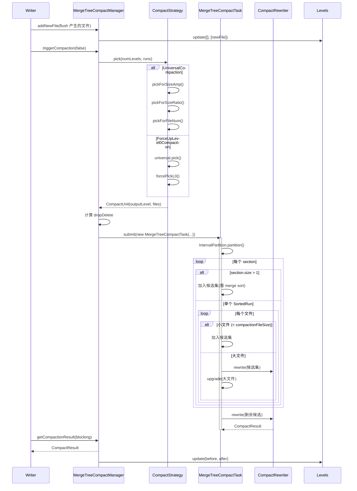
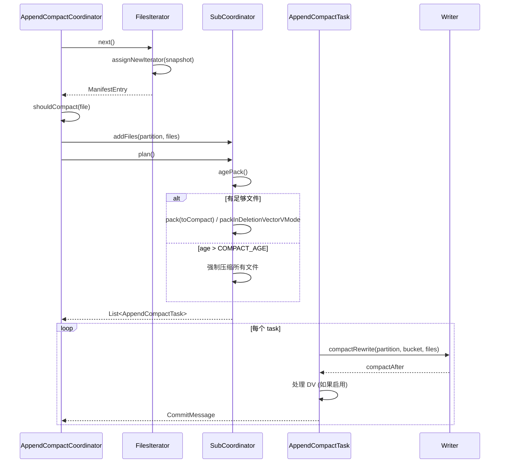
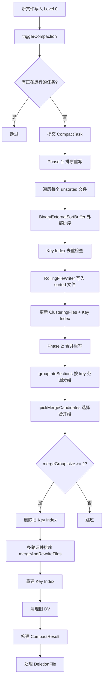
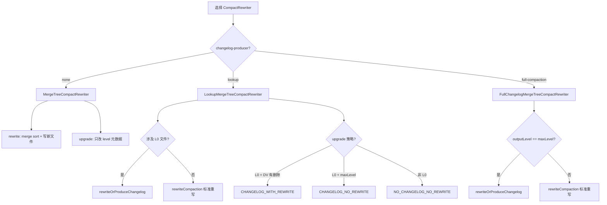

# Apache Paimon Compaction 全链路深度分析

> **版本**：1.5-SNAPSHOT　**源码模块**：`paimon-core`（`org.apache.paimon.compact` 抽象层、`org.apache.paimon.mergetree.compact` 主键表、`org.apache.paimon.append` 追加表；配置项已上移至 `paimon-api`）　**核对日期**：2026-06

**一句话定位**：Compaction 是 LSM 把"写得快"换成"读得对、存得省"的后台代偿机制——它用**可控的、可异步收敛的写放大**，去压住读放大（归并路数）和空间放大（旧版本/删除标记堆积）这两座随写入持续增长的山。

读完本文你应能回答：
- ① full compaction 与 minor（增量）compaction 的触发条件、入口和输出 level 各有什么不同？为什么 full compaction 必须断言 `taskFuture==null`？
- ② UniversalCompaction 的 `pickForSizeAmp` / `pickForSizeRatio` / `pickForFileNum` 三级各自在权衡哪个"放大"？`maxSizeAmp`、`sizeRatio` 配错分别会怎样？
- ③ 同步 compaction 与异步 compaction 的边界在哪里？反压（stop-trigger）和 checkpoint 等待阈值为什么要差 1？
- ④ `dropDelete` 那个三元判断背后的不变量是什么？为什么输出到最高层或启用 DV 才能丢删除标记？
- ⑤ 大文件 `upgrade`（只改 level 元数据，零 I/O）和小文件 `rewrite` 的分界线在哪？哪三种情况下大文件也必须被重写？
- ⑥ Lookup 模式为什么要 `ForceUpLevel0Compaction` 强清 L0？RADICAL 与 GENTLE 在权衡什么？
- ⑦ dedicated（专用/离线）compaction 与写入端内联 compaction 的取舍是什么？record-level expire 如何"搭车" full compaction 清理过期行？
- ⑧ Append 表为什么不需要 merge sort 却仍要 compaction？Unaware-Bucket 的 Age 机制解决什么死角？

> 阅读约定：本文每个机制按"① 要解决什么问题 → ② 设计原理与取舍 → ③ 关键源码（精选片段 + `路径:行号`）→ ④ 风险/陷阱/边界 → ⑤ 收益与代价"组织。源码行号以本次核对（commit 基线之上、1.5-SNAPSHOT）为准；与旧稿不符处用 `（已修正）` 标注。
>
> **与其他文档的边界**：LSM 数据结构（Levels/SortedRun）与 compaction 的"概览级"内容详见 [01-核心存储引擎分析 §3、§8](01-核心存储引擎分析.md)，本文是 compaction 机制的**主讲**，深入到策略算法与执行层；小文件治理的成因与运维处方详见 [11 小文件治理](11-小文件治理机制.md)，compaction 的运维调优（监控/手动触发/资源配比）详见 [10 运维](10-运维优化方案.md)，本文只在交叉点点到为止，不重复展开。Changelog 的四种 producer 详见 [24 Changelog 产生](24-Changelog机制全链路分析.md)，本文只讲 compaction 阶段如何"顺带"生成 changelog。

---

## 目录

- [1. 快速理解（核心问题 / 概念速查 / 高频陷阱）](#1-快速理解核心问题--概念速查--高频陷阱)
  - [1.1 核心问题：Compaction 在偿还什么"债"](#11-核心问题compaction-在偿还什么债)
  - [1.2 核心概念速查表](#12-核心概念速查表)
  - [1.3 高频生产陷阱](#13-高频生产陷阱)
  - [1.4 Compaction 分类体系](#14-compaction-分类体系)
- [2. 核心抽象层：CompactManager 体系](#2-核心抽象层compactmanager-体系)
  - [2.1 CompactManager 接口：生命周期协议](#21-compactmanager-接口生命周期协议)
  - [2.2 CompactFutureManager：异步与取消](#22-compactfuturemanager异步与取消)
  - [2.3 CompactTask / CompactUnit / CompactResult](#23-compacttask--compactunit--compactresult)
- [3. LSM 数据结构基础（交叉引用 01）](#3-lsm-数据结构基础交叉引用-01)
  - [3.1 Levels 与 numberOfSortedRuns](#31-levels-与-numberofsortedruns)
  - [3.2 IntervalPartition：区间分区](#32-intervalpartition区间分区)
- [4. 主键表 Compaction：MergeTreeCompactManager](#4-主键表-compactionmergetreecompactmanager)
  - [4.1 triggerCompaction：full vs minor 两条路](#41-triggercompactionfull-vs-minor-两条路)
  - [4.2 dropDelete：丢删除标记的不变量](#42-dropdelete丢删除标记的不变量)
  - [4.3 同步 vs 异步：反压与 checkpoint 双阈值](#43-同步-vs-异步反压与-checkpoint-双阈值)
  - [4.4 结果回收与 Deletion Vector 集成](#44-结果回收与-deletion-vector-集成)
- [5. CompactStrategy 策略体系：写/读/空间三角](#5-compactstrategy-策略体系写读空间三角)
  - [5.1 UniversalCompaction 三级决策](#51-universalcompaction-三级决策)
  - [5.2 ForceUpLevel0Compaction：Lookup 强清 L0](#52-forceuplevel0compactionlookup-强清-l0)
  - [5.3 EarlyFullCompaction：提前全量的三种触发](#53-earlyfullcompaction提前全量的三种触发)
  - [5.4 OffPeakHours：低峰期放宽阈值](#54-offpeakhours低峰期放宽阈值)
  - [5.5 Full Compaction 的入口与"空操作"优化](#55-full-compaction-的入口与空操作优化)
- [6. Compact Task 执行层：upgrade vs rewrite](#6-compact-task-执行层upgrade-vs-rewrite)
- [7. CompactRewriter：标准 / Changelog / Lookup 三系](#7-compactrewriter标准--changelog--lookup-三系)
- [8. Append-Only 表 Compaction](#8-append-only-表-compaction)
  - [8.1 BucketedAppendCompactManager：滑动窗口](#81-bucketedappendcompactmanager滑动窗口)
  - [8.2 AppendCompactCoordinator：Unaware-Bucket 与 Age 机制](#82-appendcompactcoordinatorunaware-bucket-与-age-机制)
  - [8.3 AppendCompactTask 与 pre-commit 预压缩](#83-appendcompacttask-与-pre-commit-预压缩)
- [9. Clustering Compaction：聚簇压缩](#9-clustering-compaction聚簇压缩)
- [10. Manifest 文件 Compaction（元数据层）](#10-manifest-文件-compaction元数据层)
- [11. Dedicated Compaction 与 Record-Level Expire 搭车清理](#11-dedicated-compaction-与-record-level-expire-搭车清理)
- [12. Compaction 配置参数全景](#12-compaction-配置参数全景)
- [13. Compaction Metrics 监控体系](#13-compaction-metrics-监控体系)
- [14. 设计决策总结](#14-设计决策总结)
- [15. 全链路流程图](#15-全链路流程图)

---

## 1. 快速理解（核心问题 / 概念速查 / 高频陷阱）

### 1.1 核心问题：Compaction 在偿还什么"债"

**① 要解决什么问题**

LSM 把所有写入都变成"追加一个新有序文件"，写得极快（详见 [01 §3](01-核心存储引擎分析.md)）。但这是**借债**：每追加一个文件，读取就多一路要归并的 sorted run，旧版本/删除标记也不会自动消失。不还债，三笔账会持续膨胀：

- **读放大**：查询要把所有覆盖该 key 范围的文件归并出最终值。L0 文件 key 范围互相重叠，文件从 5 个涨到 50 个，归并路数同步翻 10 倍，点查从毫秒退化到秒级。
- **空间放大**：同一主键的 INSERT/UPDATE/DELETE 多版本同时在盘，存储成本翻几倍。
- **写放大**：Compaction 本身要重写数据——但**不还的债利滚利**，越晚合并，单次要归并的数据量越大。

**② 设计原理与取舍：为什么是 Universal 而不是 Leveled**

Compaction 的本质是"**主动付一笔可控、可异步、可挑时段的写放大，去偿还无界增长的读放大与空间放大**"。问题在于按什么策略付。RocksDB 的两种策略代表两个极端，Paimon 选了写优先的 Universal：

| 维度 | Leveled（RocksDB 默认） | **Universal（Paimon 默认）** | Size-Tiered（HBase/Cassandra） |
|------|------------------------|------------------------------|--------------------------------|
| 合并触发 | 每层超阈值就把整层并入下一层 | 合并"大小相近"的相邻 run | 攒够 N 个相近大小的文件就合 |
| 写放大 | 高（同一数据被反复下推多层） | **低**（只合相近大小，单数据少被重写） | 中 |
| 读放大 | 低（每层 key 不重叠，定位快） | 中（受 run 数上限约束） | 高（run 数无硬约束） |
| 空间放大 | 低 | 中（靠 `maxSizeAmp` 兜底） | 高 |
| 适用 | 读多写少 | **写密集 + 流式更新** | 时序追加 |

一句话设计哲学：**Paimon 面向实时数仓，写吞吐是硬瓶颈，所以默认走写放大最低的 Universal；读放大的窟窿再用 `EarlyFullCompaction`（按需提前全量）、`OffPeakHours`（夜里多合）、`ForceUpLevel0Compaction`（Lookup 强清 L0）这三块补丁按场景补回来。**

**③ 关键链路（与全文各章对应）**

```
写入 flush → 落 L0 新 sorted run               §2 addNewFile / Levels.update
   ↓ run 数 > compaction-trigger(默认5)
触发 minor compaction                           §4.1 triggerCompaction(false)
   ↓ UniversalCompaction.pick 选 run
   ↓ EarlyFull > SizeAmp > SizeRatio > FileNum   §5.1 四级决策
计算 dropDelete                                  §4.2 输出最高层/启用DV才丢删除标记
   ↓ executor.submit(CompactTask) 异步执行       §2.2 / §6
IntervalPartition 切 section                     §3.2
   ↓ 大文件 upgrade(零I/O改level) / 小文件 rewrite(merge sort)  §6
   ↓ Lookup/full-compaction 模式顺带写 changelog §7
getCompactionResult → levels.update             §4.4 在Writer线程更新Levels
   ↓ run 数 > stop-trigger(默认8) → 写入反压      §4.3 同步等待
```

### 1.2 核心概念速查表

| 概念 | 一句话定义 | 关键源码 |
|------|-----------|---------|
| **CompactManager** | 压缩生命周期协议接口：触发/取结果/反压判断/取消 | `compact/CompactManager.java:29` |
| **CompactFutureManager** | 用 `Future` 封装异步执行与取消的基类 | `compact/CompactFutureManager.java:29` |
| **CompactTask** | 实现 `Callable<CompactResult>` 的执行单元，在压缩线程跑 | `compact/CompactTask.java:34` |
| **CompactUnit** | 一次压缩的输入：输出 level + 文件列表 + 是否 fileRewrite | `compact/CompactUnit.java` |
| **CompactResult** | 输出：before/after/changelog 文件 + DeletionFile | `compact/CompactResult.java` |
| **CompactStrategy** | 选哪些文件压缩的策略接口（含静态 `pickFullCompaction`） | `mergetree/compact/CompactStrategy.java:37` |
| **UniversalCompaction** | 默认策略，SizeAmp/SizeRatio/FileNum 三级决策 | `mergetree/compact/UniversalCompaction.java:42` |
| **ForceUpLevel0Compaction** | Lookup 模式策略，标准策略不动就强制推 L0 上层 | `mergetree/compact/ForceUpLevel0Compaction.java:31` |
| **dropDelete** | 安全丢弃删除标记的标志（输出最高层或有 DV 时为真） | `MergeTreeCompactManager.java:179` |
| **upgrade** | 只把 DataFileMeta 的 level 字段改高，物理文件不动（零 I/O） | `MergeTreeCompactTask.java:123` |
| **compactionFileSize** | 小文件分界线 = `targetFileSize * compaction.small-file-ratio(0.7)` | `CoreOptions.java:3042` |
| **numberOfSortedRuns** | L0 文件数 + 各非空高层 run 数，触发与反压都看它 | `Levels.numberOfSortedRuns()` |
| **BucketedAppendCompactManager** | 有桶 Append 表的滑动窗口压缩管理器 | `append/BucketedAppendCompactManager.java:52` |
| **AppendCompactCoordinator** | Unaware-Bucket 表的中心化协调器，带 Age 机制 | `append/AppendCompactCoordinator.java:70` |

### 1.3 高频生产陷阱

**陷阱 1：`num-sorted-run.compaction-trigger` 调大压不住读放大。** 该值默认 5（`CoreOptions.java:756`），它一参三用：触发 minor compaction 的 run 阈值、`pickForSizeAmp/Ratio` 的最小候选数、`num-levels` 默认值 = trigger+1。调大写更快，但查询要归并的 run 更多、单次归并峰值内存更高。和 [01 §1.3 陷阱 7](01-核心存储引擎分析.md) 同源。

**陷阱 2：把 `num-sorted-run.stop-trigger` 设成极大值关掉反压。** 该项无默认值，缺省 = `compaction-trigger + 3 = 8`（`CoreOptions.java:3068`）。它是写入硬反压闸门（`shouldWaitForLatestCompaction`）；设成 `Integer.MAX_VALUE` 后 run 数无界增长，先读退化再 OOM。源码用 `(long)` 强转防 `+1` 溢出（`MergeTreeCompactManager.java:116`）。

**陷阱 3：误以为 `compaction.size-ratio` 越小越激进。** 恰恰相反。`size-ratio`（默认 1，即 1%）是"相邻 run 大小差多少以内才合并"的容差，**越小越保守**——只有大小几乎相等的 run 才合，候选集很难扩大，反而压不动。调大才更激进。

**陷阱 4：`commit.force-compact=true` 拖垮流式写吞吐。** 每次 commit 前都强制全量压缩，批处理收尾用合理，常驻流任务上会把写吞吐打到地板。流式想控读放大应改用 `full-compaction.delta-commits`（每 N 次 commit 全量一次）或 `compaction.optimization-interval`（走 EarlyFullCompaction）。

**陷阱 5：MOW（deletion-vectors）下强行异步 compaction 致数据"刚写查不到"。** Lookup/DV 模式 L0 文件要等 compaction 推到高层、生成 DV 后才对读高效可见，`compactNotCompleted()` 会因 L0 非空返回 true 阻止 commit（`MergeTreeCompactManager.java:279`）。与 [01 §1.3 陷阱 8](01-核心存储引擎分析.md) 同源。

**陷阱 6：Append 表以为"只追加就不用压缩"。** 无主键也会小文件泛滥。有桶用 `BucketedAppendCompactManager`，无桶（Unaware-Bucket）必须有 `AppendCompactCoordinator`（独立/dedicated 压缩作业）才会自动压，否则文件无限堆积。小文件治理处方详见 [11](11-小文件治理机制.md)。

**陷阱 7：`changelog-producer=full-compaction` 不配触发间隔，changelog 数小时才出一次。** 该模式只在输出到最高层时产 changelog，若仅靠默认 `maxSizeAmp=200%` 触发全量，下游延迟极高。需配 `full-compaction.delta-commits` 或 `compaction.optimization-interval`，详见 [24 §full-compaction](24-Changelog机制全链路分析.md)。

### 1.4 Compaction 分类体系

Paimon 按表类型与场景分了五类 compaction，本文逐一展开：

| 类别 | 适用场景 | 核心管理器/入口 | 是否 merge sort |
|------|---------|----------------|-----------------|
| **MergeTree Compaction** | 主键表（KeyValueFileStore） | `MergeTreeCompactManager` + `UniversalCompaction`/`ForceUpLevel0Compaction` | 是（按主键归并） |
| **Bucketed Append** | 有桶 Append 表 | `BucketedAppendCompactManager` | 否（拼接小文件） |
| **Unaware-Bucket Append** | 无桶 Append 表 | `AppendCompactCoordinator`（中心化协调，常作为 dedicated 作业） | 否 |
| **Clustering Compaction** | 主键表聚簇列优化 | `ClusteringCompactManager` | 两阶段：排序 + 多路归并 |
| **Manifest Compaction** | 元数据层（manifest 文件） | `ManifestFileMerger` | Minor + Full，ADD/DELETE 对消 |

异步执行是共性：所有压缩都通过 `ExecutorService` 提交到独立线程，写入线程不被阻塞（除非触发反压）。策略与执行解耦（`CompactStrategy` 选文件、`CompactTask` 执行）使得新增 `EarlyFullCompaction`/`OffPeakHours` 无需改动执行层。

---

## 2. 核心抽象层：CompactManager 体系

**① 要解决什么问题**

多线程下 compaction 必须协调四方：Writer 线程触发、CompactTask 线程执行、commit/checkpoint 线程等待完成、反压机制阻塞写入。如果没有统一的管理器，每个 Writer 各自 `compact()` 会重复压同一批文件、commit 提交了未完成的状态导致丢文件。`CompactManager` 把这套生命周期收敛成一个接口协议，并通过"每个 manager 同时只跑一个任务"的约束把并发控制压到最简。

**② 设计原理与取舍**

三个关键决策：

- **接口抽象**：主键表/Append 表/聚簇表实现各异，但对外协议统一，写入侧只认 `CompactManager`。
- **异步 + Future（不是 Callback）**：`ExecutorService` 解耦写入与压缩线程；用 `Future` 而非回调，让调用方自己选阻塞还是轮询——commit 前用阻塞保一致，flush 后用非阻塞不挡写。
- **单任务串行**：`if (taskFuture != null) return;` 保证一个 manager 同时只有一个压缩任务在跑，避免多任务抢同一批文件。压缩吞吐受限，但通过多 bucket（每桶一个独立 LSM 和 manager）横向并行补回来。

### 2.1 CompactManager 接口：生命周期协议

`compact/CompactManager.java:29` 定义了完整协议。每个方法对应一个明确职责：

| 方法 | 行号 | 职责 / 为什么需要 |
|------|------|------------------|
| `shouldWaitForLatestCompaction()` | `:32` | 写入**硬反压**判断：run 数超 stop-trigger 必须等压缩 |
| `shouldWaitForPreparingCheckpoint()` | `:34` | checkpoint 前等待判断，阈值比硬反压多 1（留缓冲） |
| `addNewFile(file)` | — | flush 后注册新 L0 文件 |
| `triggerCompaction(fullCompaction)` | `:46` | 由 flush 或 commit 驱动触发 |
| `getCompactionResult(blocking)` | `:49` | 取结果，阻塞/非阻塞两种模式 |
| `cancelCompaction()` | — | 优雅停机/任务切换时取消 |
| `compactNotCompleted()` | `:59` | 完成状态检查；Lookup 模式下用它确保 L0 被消费 |

### 2.2 CompactFutureManager：异步与取消

`compact/CompactFutureManager.java:29` 用一个 `Future<CompactResult> taskFuture` 字段封装异步执行。核心是 `innerGetCompactionResult(blocking)`（`:47`）：

```java
protected final Optional<CompactResult> innerGetCompactionResult(boolean blocking) {
    if (taskFuture != null) {
        if (blocking || taskFuture.isDone()) {
            try {
                result = obtainCompactResult();      // 阻塞或已完成才取
            } catch (CancellationException e) {
                return Optional.empty();              // 被取消，吞掉
            } finally {
                taskFuture = null;                    // 只有取到结果才清空
            }
            return Optional.of(result);
        }
    }
    return Optional.empty();
}
```

**④ 风险 / 陷阱 / 边界**

- **`blocking` 参数误用**：commit/checkpoint 前必须 `blocking=true`，否则可能拿不到结果就提交、丢失已压缩文件。flush 后的轮询才用 `false`。
- **取消后 `taskFuture` 不立即置 null**：`cancelCompaction()`（`:34`）只调 `cancel(true)`，`taskFuture` 仍非 null，要等 `innerGetCompactionResult` 捕获 `CancellationException` 后才清。这是刻意的——避免丢失"已执行完但还没取结果"的 `CompactResult`。源码 TODO 也提示了取消后新文件可能已写入但未注册、成为孤儿文件的边界。

### 2.3 CompactTask / CompactUnit / CompactResult

**CompactTask**（`compact/CompactTask.java:34`）实现 `Callable<CompactResult>` 而非 `Runnable`——因为要返回压缩前后文件列表，且执行异常需传播给调用者触发重试。`call()`（`:45`）的骨架是"开计时 → `doCompact()` → 上报 metrics（耗时/输入输出大小/完成计数）→ 关计时 + 队列计数减一"，metrics 全部用 `MetricUtils.safeCall()` 包住，保证监控异常不拖垮压缩本身。子类只实现 `doCompact()`（`:116`）。

**CompactUnit**（输入）三要素：`outputLevel`（输出到哪层）、`files`（参与的文件）、`fileRewrite`（是否文件级重写而非 merge sort）。`fileRewrite=true` 时走 `FileRewriteCompactTask`（逐文件重写，免排序），用于 full compaction 中只需单独重写过期/带 DV 的最高层文件的场景（见 §5.5、§6）。

**CompactResult**（输出）四要素：`before`（被压文件）、`after`（新文件）、`changelog`（顺带产的 changelog 文件）、`deletionFile`（DV 变更）。`before`/`after` 用 mutable List 是因为 `MergeTreeCompactTask.doCompact()` 里多个 section 的结果要逐步 `merge()` 进同一个 result。

---

## 3. LSM 数据结构基础（交叉引用 01）

Levels / SortedRun / LevelSortedRun / Level 0 用 TreeSet（按 maxSequenceNumber 降序）等数据结构的设计取舍，详见 [01 §3 LSM 数据结构](01-核心存储引擎分析.md)，本文不重复展开，只补两个**直接驱动 compaction 的点**。

### 3.1 Levels 与 numberOfSortedRuns

`numberOfSortedRuns()` 是 compaction 的"血压计"：

```java
public int numberOfSortedRuns() {
    int n = level0.size();                 // 每个 L0 文件算一个 run（key 范围重叠）
    for (SortedRun run : levels) {
        if (run.nonEmpty()) n++;           // 每个非空高层 level 算一个 run（内部不重叠）
    }
    return n;
}
```

这个值同时驱动两个阈值：`numberOfSortedRuns() > compaction-trigger(5)` 触发 minor compaction，`> stop-trigger(8)` 触发写入硬反压（§4.3）。**关键不变量**：除 L0 外每层最多一个 SortedRun，这是 Universal Compaction 的核心约束，使读取归并逻辑大幅简化。

`Levels.update(before, after)` 在 **Writer 线程**（非压缩线程）中原子更新层级，并通知 `DropFileCallback`——但会先把同时出现在 before/after 的文件（即 upgrade 只改 level 的）排除，因为物理文件还在、不能通知"已删除"。这个回调是 Lookup 模式清理本地索引缓存的机制（详见 [01 §6 LookupLevels](01-核心存储引擎分析.md)）。

> **陷阱**：`update()` 非线程安全，必须只在单一 Writer 线程调用；不要直接操作 `level0()` 的 TreeSet。判断 run 总数要用 `numberOfSortedRuns()` 而非 `level0().size()`（后者漏掉高层）。

### 3.2 IntervalPartition：区间分区

`mergetree/compact/IntervalPartition.java` 是 `MergeTreeCompactTask` 把选中文件切成"互不重叠 section"的算法：按 `(minKey, maxKey)` 排序后遍历，新文件 minKey 超出当前 section 右界就切新 section，section 内用贪心装入最少数量的 SortedRun。

**为什么要切 section**：一次 compaction 选中的文件可能覆盖不同 key 范围。例如 A[1,100]、B[50,150]、C[200,300]——C 与 A/B 无重叠。不分区就得三个文件一起 merge sort；分区后 {A,B} 一个 section 做归并、{C} 单独成 section 可直接 upgrade（零 I/O）。当 C 是大文件时，省下的就是整文件重写的代价。这是 §6 大文件 upgrade 优化的前提。

---

## 4. 主键表 Compaction：MergeTreeCompactManager

`mergetree/compact/MergeTreeCompactManager.java:54` 是主键表（KeyValueFileStore）的压缩管理器，继承 `CompactFutureManager`。它把策略选择（`CompactStrategy`）、执行（`CompactTask`）、DV 维护（`BucketedDvMaintainer`）、记录级过期（`RecordLevelExpire`）协调起来。关键字段（`:62`–`:71`）：`compactionFileSize`（小文件分界）、`numSortedRunStopTrigger`（反压阈值）、`lazyGenDeletionFile`、`needLookup`、`forceRewriteAllFiles`、`forceKeepDelete`。

### 4.1 triggerCompaction：full vs minor 两条路

`triggerCompaction(boolean fullCompaction)`（`:133`）是唯一入口，但按 `fullCompaction` 分成两条完全不同的路：

```java
if (fullCompaction) {
    Preconditions.checkState(taskFuture == null,
        "A compaction task is still running while the user forces a new compaction.");
    optionalUnit = CompactStrategy.pickFullCompaction(   // 静态方法，选全部/按需文件
        levels.numberOfLevels(), runs, recordLevelExpire, dvMaintainer, forceRewriteAllFiles);
} else {
    if (taskFuture != null) return;                       // minor：已有任务就跳过
    optionalUnit = strategy.pick(levels.numberOfLevels(), runs)   // 策略选 run
        .filter(unit -> !unit.files().isEmpty())
        .filter(unit -> unit.files().size() > 1 || unit.files().get(0).level() != unit.outputLevel());
}
```

| 维度 | full compaction | minor（增量）compaction |
|------|-----------------|-------------------------|
| 入口 | `fullCompaction=true`（commit.force-compact / delta-commits / 手动 / dedicated 作业） | flush 后或常规驱动 |
| 选文件 | `CompactStrategy.pickFullCompaction`（静态，与具体策略无关） | `strategy.pick`（Universal 三级决策） |
| 并发约束 | **`checkState(taskFuture == null)`** —— 必须没有在跑的任务 | `if (taskFuture != null) return;` —— 静默跳过 |
| 输出 level | 最高层（除"空操作"优化外，见 §5.5） | 由 `createUnit` 算，绝不输出 L0 |
| 过滤 | 无 | 过滤掉空 unit 和"单文件且 level 未变"的无效 unit |

**为什么 full 必须断言 `taskFuture==null`，minor 却静默跳过？** full compaction 涉及所有文件，不能与一个只动部分文件的 minor 任务并行（会读到不一致的 Levels 视图），所以宁可抛断言失败暴露问题。minor 是"机会性"的，已有任务在跑就跳过、等下次 flush 再来，无需报错。这也意味着上层调 full 前必须先 `getCompactionResult(true)` 把在跑的任务收干净。

### 4.2 dropDelete：丢删除标记的不变量

选中 unit 后立刻算 `dropDelete`（`:179`），决定这次压缩能否把 DELETE 记录真正扔掉：

```java
boolean dropDelete = !forceKeepDelete
        && unit.outputLevel() != 0
        && (unit.outputLevel() >= levels.nonEmptyHighestLevel() || dvMaintainer != null);
```

**背后的唯一不变量**：删除标记只有在确认"没有更老的数据版本还需要用这个标记来盖掉"时才能丢。逐条拆：

- `outputLevel == 0` → **不能丢**：输出到 L0 意味着下面还压着更老的高层数据，删除标记还得留着盖它们。
- `outputLevel >= nonEmptyHighestLevel` → **可以丢**：输出就是当前最老的层，没有更老数据需要被这个 DELETE 盖掉了。
- `dvMaintainer != null`（启用 DV）→ **可以丢**：DV 用 bitmap 在行级精确标记删除，不再依赖数据文件里的 DELETE 记录（DV 机制详见 [04 DeletionVector](04-DeletionVectors与文件索引.md)、[01 §7](01-核心存储引擎分析.md)）。
- `forceKeepDelete` → 一票否决，强制保留（如下游需要看到 DELETE 的 changelog 场景）。

丢不掉删除标记的代价是空间放大——DELETE 记录占着位置直到能被推到最高层；丢错了的代价是数据错误（删了的记录又"复活"）。所以这个判断宁严勿松。

### 4.3 同步 vs 异步：反压与 checkpoint 双阈值

**异步是常态**：`submitCompaction`（`:208`）最后一句 `taskFuture = executor.submit(task)` 把任务丢进线程池，写入线程立即返回，继续写后续数据。压缩在后台跑。

**同步化的两个时机**靠反压实现（`:109`、`:114`）：

```java
public boolean shouldWaitForLatestCompaction() {
    return levels.numberOfSortedRuns() > numSortedRunStopTrigger;            // 硬反压
}
public boolean shouldWaitForPreparingCheckpoint() {
    return levels.numberOfSortedRuns() > (long) numSortedRunStopTrigger + 1; // checkpoint 前
}
```

默认值链：`compaction-trigger=5` → `stop-trigger = trigger+3 = 8`（`CoreOptions.java:3068`）→ checkpoint 阈值 `= stop+1 = 9`。

- **为什么要两个阈值、且差 1**：硬反压（`shouldWaitForLatestCompaction`）一旦 run 数 > stop-trigger，写入线程就必须等当前压缩跑完才能继续，这是防 run 数无界增长的硬闸。checkpoint 阈值多 1 是给一个缓冲带：避免每次 checkpoint 都恰好卡在硬反压边界上反复阻塞，让正常 checkpoint 更顺。
- **为什么 `(long)` 强转**：当用户把 `stop-trigger` 设成 `Integer.MAX_VALUE`（试图关反压）时，`+1` 会整型溢出变负数，强转 long 防溢出。

**同步 compaction 的强场景**：`commit.force-compact=true` 时 commit 前会触发 full compaction 并阻塞等待；MOW/Lookup 模式下 `compactNotCompleted()` 返回 true 会挡住 commit（§4.4）。同步保证了"提交即可见"，代价是写吞吐被压缩耗时拖住——这正是陷阱 4、5 的根因。

### 4.4 结果回收与 Deletion Vector 集成

`getCompactionResult(blocking)`（`:256`）取到结果后**在调用线程（Writer 线程）里**更新 Levels：

```java
result.ifPresent(r -> {
    levels.update(r.before(), r.after());   // 关键：在 Writer 线程更新，不在压缩线程
    MetricUtils.safeCall(this::reportMetrics, LOG);
});
```

**为什么不在 `doCompact()` 里更新 Levels**：`doCompact()` 跑在独立压缩线程，而 `Levels`（尤其 level0 的 TreeSet）非线程安全。把 update 收口到 Writer 单线程，就不必给 Levels 加锁。

**DV 延迟生成**：`submitCompaction`（`:208`）里若启用 DV，按 `lazyGenDeletionFile` 决定用 `CompactDeletionFile.lazyGeneration(dvMaintainer)`（压缩完成后才生成）还是 `generateFiles`（立即）。延迟生成避免压缩过程中 DV 信息被其他写入改动而过时。

**Lookup 模式的特殊完成判断**（`:279`）：

```java
public boolean compactNotCompleted() {
    return super.compactNotCompleted() || (needLookup && !levels().level0().isEmpty());
}
```

即使没有在跑的任务，只要 Lookup 模式下 L0 还非空，就认为"压缩未完成"、阻止 commit。**为什么 Lookup 必须清空 L0**：Lookup 靠本地点查索引快速定位记录，而 L0 文件 key 范围互相重叠、无法建高效索引，必须全部推到高层。这就是 §5.2 `ForceUpLevel0Compaction` 存在的理由，也是陷阱 5 的机制根源。

---

## 5. CompactStrategy 策略体系：写/读/空间三角

**① 要解决什么问题**

`pick()` 的工作是"在写放大、读放大、空间放大这个三角里，每次只付最该付的那笔账"。写密集要少合（低写放大）、读密集要快减 run（低读放大）、存储吃紧要把增量并回基线（低空间放大）、Lookup 要清 L0、低峰期可多合。一个固定算法满足不了，所以 Paimon 用 `CompactStrategy` 接口 + 四级决策 + 可叠加的辅助策略。

**② 设计原理与取舍：四级决策的优先级**

`UniversalCompaction.pick` 的优先级是 **EarlyFull > SizeAmp > SizeRatio > FileNum**，每一级对应三角里的一条边：

| 决策级 | 看什么 | 偿还哪个放大 | 不命中就降级 |
|--------|--------|--------------|--------------|
| EarlyFullCompaction | 时间/总大小/增量阈值 | 用户显式要的读优化时效性 | → SizeAmp |
| SizeAmplification | 增量总大小 / 最老 run 大小 > `maxSizeAmp(200%)` | **空间放大**（增量太多，全量并回基线） | → SizeRatio |
| SizeRatio | 相邻 run 大小是否在 `sizeRatio(1%)` 容差内 | **写放大**（只合大小相近的，少重写数据） | → FileNum |
| FileNum | run 数 > `numRunCompactionTrigger(5)` | **读放大**兜底（run 太多强制合一部分） | → 不压缩 |

一句话：**先看用户硬需求，再看最贵的空间放大，再用写放大最低的方式合相近 run，最后才用文件数兜底。** 这个顺序保证了默认行为偏向"少写、按需补读"。

### 5.1 策略接口与 pickFullCompaction

`mergetree/compact/CompactStrategy.java:37` 定义 `pick()`（实例方法，各策略不同）和 `pickFullCompaction()`（`:53`，**静态方法**）。

**为什么 full compaction 是静态方法**：全量永远选所有文件，逻辑与具体策略无关，做成静态避免每个策略重复实现。但它有一个**"空操作"优化**（`:66`）：当数据已全在最高层（`runs.size()==1 && level==maxLevel`），本该是空操作，但仍逐文件检查三种必须重写的情况——

```java
for (DataFileMeta file : runs.get(0).run().files()) {
    if (forceRewriteAllFiles) { ... }                                  // 强制重写（外部路径同步）
    else if (recordLevelExpire != null && recordLevelExpire.isExpireFile(file)) { ... } // 含过期记录
    else if (dvMaintainer != null && dvMaintainer.deletionVectorOf(file.fileName()).isPresent()) { ... } // 有 DV 需物化
}
// 若 filesToBeCompacted 为空 → Optional.empty()；否则 fromFiles(maxLevel, files, /*fileRewrite=*/true)
```

注意命中时返回的 unit `fileRewrite=true`，会走 `FileRewriteCompactTask`（§6）逐文件重写、免归并。这避免了"数据已在最高层但还要全量重写一遍"的无效写放大——也是 record-level expire 搭车 full compaction 清理过期行的入口（§11）。

### 5.2 UniversalCompaction 三级决策

`mergetree/compact/UniversalCompaction.java:42`。`pick()`（`:67`）骨架就是上面那张表的代码化，命中即返回，全 miss 返回 `Optional.empty()`。下面拆三级各自的"为什么"。

**第 1 级 `pickForSizeAmp`（`:125`）——控空间放大**

```java
long candidateSize = /* 除最后一个 run 外所有 run 的总大小 */;
long earliestRunSize = runs.get(runs.size() - 1).run().totalSize();   // 最老/最大 run 作基准
if (candidateSize * 100 > maxSizeAmp * earliestRunSize) {
    return CompactUnit.fromLevelRuns(maxLevel, runs);                  // 全量合到最高层
}
```

runs 从新到老排列，最后一个是最老的基线。"增量总大小 / 基线大小 > 200%" 意味着为存 1 字节有效数据多花了 2 字节冗余，触发全量把增量并回基线。

- **`maxSizeAmp` 配置取舍**：默认 200（`CoreOptions.java:809`）。调大 → 容忍更多增量、全量更少（写放大降）、但存储成本和读放大升；调小 → 频繁全量（写放大升）、省空间。设成极大值（如 10000）= 实质关闭空间放大控制，旧版本无限堆积。

**第 2 级 `pickForSizeRatio`（`:163`）——控写放大**

```java
for (int i = candidateCount; i < runs.size(); i++) {
    LevelSortedRun next = runs.get(i);
    if (candidateSize * (100.0 + sizeRatio + ratioForOffPeak()) / 100.0 < next.run().totalSize()) {
        break;     // 下一个 run 比候选集大太多，不值得合（合进去就是小并大、写放大大）
    }
    candidateSize += next.run().totalSize();
    candidateCount++;
}
```

从最新的 run 开始往后滚雪球：只要"候选集大小 ×(1 + sizeRatio%)"还兜得住下一个 run，就把它纳入。一旦下一个 run 大太多就停。这保证了**只合并大小相近的 run**——把小 run 合进大 run 会重写整个大 run（写放大极高），这一级专门避免它。

- **`sizeRatio` 配置取舍（反直觉，对应陷阱 3）**：默认 1（即 1% 容差，`CoreOptions.java:824`）。它是"允许相邻 run 差多少还算相近"的**容差**：越小越保守（几乎等大才合，候选集难扩大，run 容易堆积）；越大越激进（差距大也合，写放大上升但 run 数下降快）。把它设成 0 ≈ 只有完全等大才合，几乎压不动。

**第 3 级文件数兜底（`pick:97`）**

```java
if (runs.size() > numRunCompactionTrigger) {                          // run 数超阈值
    int candidateCount = runs.size() - numRunCompactionTrigger + 1;   // 至少压掉超出的部分
    return Optional.ofNullable(pickForSizeRatio(maxLevel, runs, candidateCount));
}
```

前两级都没命中、但 run 数已超 `numRunCompactionTrigger`（默认 5）时，强制以"超出数量 + 1"为起点再走一遍 SizeRatio。这是读放大的最后防线——`numRunCompactionTrigger` 一参三用（触发阈值 / SizeAmp/Ratio 最小候选数 / `num-levels` 默认值），调它的连锁影响见陷阱 1 与 [01 §1.3 陷阱 7](01-核心存储引擎分析.md)。

**`createUnit`（`:197`）——绝不输出到 L0**

输出 level = 全量则 maxLevel，否则 `下一个未纳入 run 的 level - 1`。若算出 0，会继续向后扫到第一个非 0 level 才停（`:206`）。**为什么禁止输出 L0**：L0 的语义是"未排序的新写入、每文件一个 run"，compaction 的输出是已排序的，落 L0 会打破 L0 不变量、让归并逻辑失效。

### 5.3 ForceUpLevel0Compaction：Lookup 强清 L0

`mergetree/compact/ForceUpLevel0Compaction.java:31` 是 Lookup 模式专用策略，包装一个 `UniversalCompaction`。`pick()`（`:50`）逻辑：

```java
Optional<CompactUnit> pick = universal.pick(numLevels, runs);   // 1. 先走标准策略
if (pick.isPresent()) return pick;
if (maxCompactInterval == null || compactTriggerCount == null) {
    return universal.forcePickL0(numLevels, runs);              // 2a. RADICAL：每次都强推 L0
}
compactTriggerCount.getAndIncrement();                          // 2b. GENTLE：攒够 maxInterval 次才推
if (compactTriggerCount.compareAndSet(maxCompactInterval, 0)) {
    return universal.forcePickL0(numLevels, runs);
}
return Optional.empty();
```

`forcePickL0`（`UniversalCompaction.java:109`）收集所有连续的 L0 run，以 `forcePick=true` 走 SizeRatio——即使只有一个 L0 文件也会被选中推到高层。

**为什么 Lookup 要这个**：见 §4.4，Lookup/MOW 的 `compactNotCompleted()` 因 L0 非空就挡 commit，所以必须主动清空 L0。`RADICAL`（`lookup-compact` 默认）每次强推、查询延迟最低但写放大较高；`GENTLE` 用 `lookup-compact.max-interval`（默认 `trigger*2`）控制频率，写压力大时可接受 L0 短暂存在。对应 `LookupCompactMode` 枚举。

| 模式 | maxCompactInterval | 行为 | 取舍 |
|------|--------------------|------|------|
| `RADICAL`（默认） | null | 标准策略不动就立即强推 L0 | 查询延迟最低，写放大较高 |
| `GENTLE` | 非 null（默认 trigger×2） | 每 N 次触发才强推一次 L0 | 写压力小，容忍 L0 短暂存在 |

### 5.4 OffPeakHours：低峰期放宽阈值

`mergetree/compact/OffPeakHours.java:26`。`currentRatio(hour)`（`:38`）判断当前是否在低峰时段（支持跨午夜：`startHour > endHour` 时用 `hour < endHour || startHour <= hour`），是则返回配置的 `compactOffPeakRatio`，否则 0。

它的唯一作用点是 §5.2 SizeRatio 公式里的 `ratioForOffPeak()`：低峰期把容差从 `sizeRatio` 放宽到 `sizeRatio + offPeakRatio`，于是更多 run 被纳入合并。**设计意图**：白天高峰不动（offPeakRatio 加成为 0），夜里集群闲时多合，用闲置资源提前还读放大的债，不影响业务高峰。`start.hour`/`end.hour` 默认 -1（禁用），`start==end` 也视为禁用（`:61`）。

### 5.5 Full Compaction 的入口与"空操作"优化

Full compaction 选文件逻辑已在 §5.1 讲完（`pickFullCompaction` 静态方法 + 空操作优化），这里汇总**触发它的五个入口**，便于排障定位：

1. `commit.force-compact=true`：每次 commit 前强制（批处理收尾用，流式慎用，陷阱 4）
2. `full-compaction.delta-commits=N`：流式每 N 次 commit 全量一次（`changelog-producer=full-compaction` 必需）
3. `EarlyFullCompaction` 的三种条件（时间/总大小/增量阈值，见 §5.5.1）
4. `SizeAmplification` 超 `maxSizeAmp`（§5.2 第 1 级，本质也走全量到最高层）
5. 用户经 Flink Action / Spark Procedure 手动触发，或 dedicated compaction 作业（§11）

#### 5.5.1 EarlyFullCompaction 三种触发（提前全量）

`mergetree/compact/EarlyFullCompaction.java:37`，`tryFullCompact()`（`:86`）三个条件任一命中即全量（`runs.size()==1` 直接返回空，单 run 无需压）：

```java
if (fullCompactionInterval != null && (lastFullCompaction == null
        || currentTimeMillis() - lastFullCompaction > fullCompactionInterval)) {
    updateLastFullCompaction(); return Optional.of(fromLevelRuns(maxLevel, runs)); // 条件1 时间间隔
}
if (totalSizeThreshold != null && totalSize < totalSizeThreshold) {
    updateLastFullCompaction(); return ...;                                         // 条件2 小表全量
}
if (incrementalSizeThreshold != null && incrementalSize > incrementalSizeThreshold) {
    updateLastFullCompaction(); return ...;                                         // 条件3 增量过多
}
```

| 条件 | 配置项 | 使用场景 |
|------|--------|---------|
| 时间间隔 | `compaction.optimization-interval` | 保证 read-optimized 系统表的查询时效 |
| 总大小阈值 | `compaction.total-size-threshold` | 小表频繁全量成本低、读放大最优 |
| 增量大小阈值 | `compaction.incremental-size-threshold` | 增量过多时及时并回基线、控空间放大 |

**`updateLastFullCompaction()` 的调用面**（已修正）：三个条件命中后都会调它（`:96/:106/:118`，旧稿漏了条件 2 的调用），此外 `UniversalCompaction.pickForSizeAmp`（`:141`）和 `createUnit` 全量分支（`:220`）也会调——确保**任何导致全量的路径**都刷新时间戳，时间间隔触发才准确。

---

## 6. Compact Task 执行层：upgrade vs rewrite

**① 要解决什么问题**：选好文件后，怎么用**最少的 I/O** 把它们合到目标层？核心洞见是——**不是所有文件都需要重写**。已经足够大的文件，只要把它的 level 元数据改高就行，物理数据原封不动。这是 compaction 写放大优化的关键。

### 6.1 MergeTreeCompactTask：大文件 upgrade、小文件 rewrite

`mergetree/compact/MergeTreeCompactTask.java:41`。`doCompact()`（`:82`）先经 IntervalPartition 切 section（§3.2），再对每个 section 分流：

```java
for (List<SortedRun> section : partitioned) {
    if (section.size() > 1) {
        candidate.add(section);                         // 多 run 重叠 → 必须 merge sort
    } else {
        for (DataFileMeta file : section.get(0).files()) {
            if (file.fileSize() < minFileSize) {        // 小文件 → 攒进候选集一起重写
                candidate.add(singletonList(SortedRun.fromSingle(file)));
            } else {                                    // 大文件 → 先冲刷候选，再 upgrade
                rewrite(candidate, result);
                upgrade(file, result);
            }
        }
    }
}
rewrite(candidate, result);
result.setDeletionFile(compactDfSupplier.get());        // DV 延迟生成在这里求值
```

**为什么以 `minFileSize`（= `compactionFileSize` = `targetFileSize × compaction.small-file-ratio`，默认 0.7）为界**：阈值取 0.7 而非 1.0 是关键——压缩输出文件大小受压缩率影响、由 RollingFileWriter 滚动切分，不完全精确。若界线正好等于 targetFileSize，一个刚写出的"接近目标大小"的文件可能在连续两次 compaction 里被反复判定为"不够大、重写"，来回折腾。0.7 留出安全余量，让足够大的文件稳定走零 I/O 的 upgrade（`CoreOptions.java:3042`、`:725`）。

### 6.2 upgrade：零 I/O，但三种情况下必须降级为重写

`upgrade(file)`（`:123`）默认只改 level 元数据：

```java
private void upgrade(DataFileMeta file, CompactResult toUpdate) throws Exception {
    if ((outputLevel == maxLevel && containsDeleteRecords(file))   // ① 输出最高层且含 DELETE
            || forceRewriteAllFiles                                // ② 强制重写（外部路径同步）
            || containsExpiredRecords(file)) {                     // ③ 含过期记录（record-level expire）
        rewriteImpl(/* 单文件作为一个 section */); return;          //   → 必须真重写
    }
    if (file.level() != outputLevel) {
        toUpdate.merge(rewriter.upgrade(outputLevel, file));       // 否则零 I/O：file.upgrade(level)
        upgradeFilesNum++;
    }
}
```

`rewriter.upgrade`（`AbstractCompactRewriter`）只 `new CompactResult(file, file.upgrade(outputLevel))`——新建一个 level 字段改了的 DataFileMeta，**物理文件指针不变，零字节 I/O**。

**三种必须真重写的情况（背后都是"元数据改改不掉的脏东西"）**：
1. 输出到最高层且含 DELETE 记录：最高层要 dropDelete 物理清掉删除标记，光改 level 删不掉。
2. `forceRewriteAllFiles`：外部路径同步等场景要求每个文件都新生成。
3. 含过期记录：record-level expire 要物理删掉过期行（§11），只有重写才能去掉它们。

### 6.3 FileRewriteCompactTask 与分流总览

`mergetree/compact/FileRewriteCompactTask.java` 用于 `CompactUnit.fileRewrite=true`（§5.1 空操作优化命中时）：逐文件 `rewriter.rewrite(outputLevel, dropDelete, [file])`，无 IntervalPartition、无 merge sort，简单高效——因为这些文件已在最高层、彼此不重叠，只是各自需要清过期/物化 DV。

分流决策树：

```
CompactUnit
├─ fileRewrite=true  → FileRewriteCompactTask（逐文件重写，免归并）
└─ fileRewrite=false → MergeTreeCompactTask → IntervalPartition 切 section
       ├─ section 多 run 重叠            → 候选集 merge sort
       └─ section 单 run，逐文件：
              ├─ < minFileSize           → 候选集（与邻近文件一起重写）
              └─ ≥ minFileSize：
                     ├─ 命中三种必须重写  → 强制 rewrite
                     └─ 否则             → upgrade（仅改 level，零 I/O）
```

**⑤ 收益与代价**：upgrade 让"数据已大体到位、只是分层不对"的常见情形几乎免 I/O，是 Paimon 写放大显著低于 CoW 湖格式的实现细节之一。代价是判断分支较多、`minFileSize` 配置需配合 `targetFileSize` 理解（陷阱见 §6.1）。

---

## 7. CompactRewriter：标准 / Changelog / Lookup 三系

**① 要解决什么问题**：rewrite 阶段真正干"读多个 sorted run → 归并 → 写新文件"的活，但不同 changelog-producer 还要在归并时**顺带产出 changelog**。`CompactRewriter` 用继承把"标准重写"和"重写时产 changelog"分层，changelog 的语义详见 [24 Changelog 产生](24-Changelog机制全链路分析.md)，本文只讲 compaction 阶段的部分。

```
CompactRewriter (接口)
└── AbstractCompactRewriter        upgrade() 默认实现：new CompactResult(file, file.upgrade(level))
    └── MergeTreeCompactRewriter   标准：merge sort + RollingFileWriter 写新文件（无 changelog）
        └── ChangelogMergeTreeRewriter   抽象：rewriteChangelog() 判断要不要产 changelog
            ├── LookupMergeTreeCompactRewriter            changelog-producer=lookup
            └── FullChangelogMergeTreeCompactRewriter     changelog-producer=full-compaction
```

### 7.1 MergeTreeCompactRewriter：标准重写

`mergetree/compact/MergeTreeCompactRewriter.java:47`。`rewriteCompaction()`（`:78`）核心三步：`createRollingMergeTreeFileWriter` 建按 targetFileSize 自动滚动的写出器 → `readerForMergeTree(sections, ReducerMergeFunctionWrapper)` 建归并 reader（`dropDelete` 时套一层 `DropDeleteReader` 过滤掉删除记录）→ `writer.write(iterator)`。归并链路（SortMergeReader/MergeFunction/四种 merge engine）详见 [01 §5 读取路径](01-核心存储引擎分析.md)、[08 PartialUpdate/Aggregation](08-Merge引擎与聚合函数.md)。`upgrade()` 走父类 `AbstractCompactRewriter.java:34` 的零 I/O 实现（§6.2）。

### 7.2 ChangelogMergeTreeRewriter：要不要产 changelog

`mergetree/compact/ChangelogMergeTreeRewriter.java:47`。`rewrite()`（`:103`）按 `rewriteChangelog()`（抽象，`:78`）的返回值分流：要产 changelog 走 `rewriteOrProduceChangelog()`（`:118`，归并时把每条记录的旧值与新值的差异同时写进 changelog 文件），否则退回标准 `rewriteCompaction()`。

`UpgradeStrategy` 枚举（`:214`）控制 upgrade 时的两个开关（产不产 changelog × 重不重写数据）：

| 策略 | 产 changelog | 重写数据 | 含义 |
|------|:---:|:---:|------|
| `NO_CHANGELOG_NO_REWRITE` | ✗ | ✗ | 普通 upgrade，纯改 level |
| `CHANGELOG_NO_REWRITE` | ✓ | ✗ | 只为产 changelog 读一遍，但数据文件直接 upgrade |
| `CHANGELOG_WITH_REWRITE` | ✓ | ✓ | 既产 changelog 又重写数据 |

**为什么需要"不是每次 compaction 都产 changelog"**：产 changelog 要额外读旧值、写新文件，成本不低。只在真正能看到完整变更的 compaction 上产——这也是 lookup 与 full-compaction 两个 producer 的核心差异点。

### 7.3 LookupMergeTreeCompactRewriter：涉及 L0 才产

`mergetree/compact/LookupMergeTreeCompactRewriter.java:56`。`rewriteChangelog` 转调 `rewriteLookupChangelog`（`ChangelogMergeTreeRewriter.java:85`）：`outputLevel==0` 不产；否则只要 section 里涉及任一 L0 文件就产 changelog——因为 L0 是新写入，与高层旧值归并才能算出变更前后镜像。

`upgradeStrategy()`（`:133`）的分级决策（精简）：
- `file.level() != 0` → `NO_CHANGELOG_NO_REWRITE`（非 L0 文件，无新变更）
- L0 但**跨文件格式**（`level2FileFormat` 不一致）→ `CHANGELOG_WITH_REWRITE`（格式变了必须重写）
- L0 且 **DV 模式有删除行** → `CHANGELOG_WITH_REWRITE`（要物化删除）
- L0 且输出最高层 → `CHANGELOG_NO_REWRITE`
- L0 且 **DEDUPLICATE 引擎 + 无 sequence 字段** → `CHANGELOG_NO_REWRITE`（"最新"由文件 seqNum 定，upgrade 不改 seqNum，结果不变，故免重写）
- 其余 → `CHANGELOG_WITH_REWRITE`

两个回调收尾（`:103`、`:110`）：`notifyRewriteCompactBefore` 在重写前移除旧文件的 DV（新文件已物化删除，旧 DV 不能再套到新文件上）；`notifyRewriteCompactAfter` 在启用远程 lookup 文件时把新文件包装生成 `.lookup` 远程索引文件（避免 failover 后重建本地索引，对应 [01 §1.3 陷阱 6](01-核心存储引擎分析.md)）。

### 7.4 FullChangelogMergeTreeCompactRewriter：只在最高层产

`mergetree/compact/FullChangelogMergeTreeCompactRewriter.java:43`。逻辑极简（`:72`、`:84`）：

```java
protected boolean rewriteChangelog(...) {
    boolean changelog = outputLevel == maxLevel;
    if (changelog) Preconditions.checkArgument(dropDelete, "Delete records should be dropped...");
    return changelog;
}
protected UpgradeStrategy upgradeStrategy(int outputLevel, DataFileMeta file) {
    return outputLevel == maxLevel ? CHANGELOG_NO_REWRITE : NO_CHANGELOG_NO_REWRITE;
}
```

**为什么只在 `outputLevel == maxLevel` 产**：full-compaction changelog 的语义是"全量压缩时一次性吐出完整变更"。非全量压缩不涉及所有数据，看不到某 key 的完整历史，无法产正确的 changelog。这也解释了陷阱 7——这个模式必须配 `full-compaction.delta-commits` 或 `optimization-interval` 保证全量压缩按时发生，否则 changelog 延迟可达数小时。

---

## 8. Append-Only 表 Compaction

**① 要解决什么问题**：Append 表无主键、无 UPDATE/DELETE（DV 模式除外），不需要按 key merge sort，但**小文件治理的需求一模一样**——每次 flush 一个小文件，不合并照样读爆/OOM。和主键表的关键差异：合并只是把多个小文件拼成大文件（无归并语义），且要按 Writer 是否绑定固定 bucket 分两套机制。小文件成因与运维处方详见 [11 小文件治理](11-小文件治理机制.md)，本文只讲 compaction 的执行机制。

| 表形态 | 管理器 | 触发判断 | 备注 |
|--------|--------|----------|------|
| 有桶 Append | `BucketedAppendCompactManager` | 滑动窗口：文件数 ≥ minFileNum 或总大小 ≥ targetFileSize×2 | Writer 端内联 |
| 无桶（Unaware-Bucket） | `AppendCompactCoordinator` | 中心化扫描 + Age 机制 | 常作为 dedicated 作业（§11） |

### 8.1 BucketedAppendCompactManager：滑动窗口

`append/BucketedAppendCompactManager.java:52`。待压缩文件放进 `PriorityQueue<DataFileMeta> toCompact`（`:60`，按 `minSequenceNumber` 排序，优先合并较旧文件保时间局部性）。`pickCompactBefore()`（`:204`）是滑动窗口：

```java
while (!toCompact.isEmpty()) {
    DataFileMeta file = toCompact.poll();
    candidates.add(file); totalFileSize += file.fileSize(); fileNum++;
    if (fileNum >= minFileNum) return Optional.of(candidates);          // 攒够数量就合
    else if (totalFileSize >= targetFileSize * 2) {                     // 总量太大：右移窗口
        DataFileMeta removed = candidates.pollFirst();
        totalFileSize -= removed.fileSize(); fileNum--;
    }
}
toCompact.addAll(candidates); return Optional.empty();                  // 不够，放回
```

**为什么用滑动窗口而非一次全取**：总大小卡 `targetFileSize×2` 上限，避免单次合并吞太多数据导致内存/产物过大，同时维持足够文件数。

**尾文件回收**（`getCompactionResult`，`:185`）：压缩产物的最后一个文件可能因数据不够而偏小，若 `< compactionFileSize` 就放回 `toCompact`，让它下次和新文件再合，避免留下永久小文件。

### 8.2 AppendCompactCoordinator：Unaware-Bucket 与 Age 机制

`append/AppendCompactCoordinator.java:70`。无桶表没有 Writer-bucket 绑定，需中心化协调器扫快照、分任务。`FilesIterator`（`:404`）首次用 `ScanMode.ALL` 全量扫（`:437`）、之后用 `ScanMode.DELTA` 增量扫（`:442`），避免重复处理老文件。`shouldCompact()` 只挑小文件或删除比例过高的文件。

每个分区一个 `SubCoordinator`（`:212`），其 **Age 机制**（`:72`–`:73`、`:252`）解决中心化协调的两个死角：

```java
protected static final int REMOVE_AGE = 10;
protected static final int COMPACT_AGE = 5;
// agePack(): 攒不够 minFileNum 时
if (++age > COMPACT_AGE && toCompact.size() > 1) { /* 强制压缩现有文件 */ }
// readyToRemove():
return toCompact.isEmpty() || age > REMOVE_AGE;       // 久不活跃就从内存移除
```

- `COMPACT_AGE=5`：一个分区文件数始终凑不够 minFileNum 时，等 5 轮就强制合现有文件——否则冷分区的少量小文件**永远**不会被压缩。
- `REMOVE_AGE=10`：超 10 轮仍不活跃的分区从内存清出，防止协调器内存随历史分区数无界增长。

**DV 模式按 indexFile 分组**（`packInDeletionVectorVMode`）：多个数据文件可能共享同一个 DV 索引文件，必须分到同一压缩任务，否则该索引文件被多任务重复读写、冲突。

### 8.3 AppendCompactTask 与 pre-commit 预压缩

`append/AppendCompactTask.java` 的 `doCompact()` 调 `write.compactRewrite(partition, bucket, dvGetter, compactBefore)` 拼接重写；DV 启用时先取删除向量在重写中应用，再清旧 DV、持久化新索引条目。产物封装成 `CommitMessageImpl`，**bucket 固定为 0**——Unaware-Bucket 表所有数据逻辑上在 bucket 0，是向后兼容旧设计的约定。

`append/AppendPreCommitCompactCoordinator.java` 是轻量级 pre-commit 预压缩：`addFile()` 把同分区文件缓冲，一旦累计 `≥ targetFileSize` 立即发起压缩。这是"预防性"合并，在 commit 前就把刚写的小文件并掉，减轻后续异步压缩压力。

---

## 9. Clustering Compaction：聚簇压缩

**① 要解决什么问题**：普通 MergeTree compaction 按主键排序，但很多查询按非主键列过滤（时间区间、地区、类型）。数据按主键排时，每个文件的过滤列 min/max 范围都横跨全域，谓词无法跳文件。Clustering compaction 把数据**按用户指定的聚簇列重排**，让每个文件的聚簇列范围收窄、不重叠，查询时基于 min/max 统计跳过大量文件。它是主键表的可选高级模式（`ClusteringCompactManager`），不能替代主键去重，只优化扫描。

**② 设计原理与取舍：两阶段 + 外部排序 + Spill**

`clustering/ClusteringCompactManager.java:67`，只有两层文件（unsorted=L0 / sorted=L1，由 `ClusteringFiles` 管理）。`compact()`（`:195`）分两阶段：

```java
List<DataFileMeta> existingSortedFiles = fileLevels.sortedFiles();   // Phase 2 用 Phase 1 之前的快照
for (DataFileMeta file : unsortedFiles) {                            // Phase 1：每个 unsorted 单独排序
    sortedFiles = fileRewriter.sortAndRewriteFile(file, ...);
}
mergeGroups = fullCompaction ? singletonList(existingSortedFiles)
                             : fileRewriter.pickMergeCandidates(existingSortedFiles);  // Phase 2：选合并组
for (List<DataFileMeta> g : mergeGroups) if (g.size() >= 2) {
    g.forEach(keyIndex::deleteIndex);
    merged = fileRewriter.mergeAndRewriteFiles(g);                   // 多路归并
    merged.forEach(keyIndex::rebuildIndex);
}
```

- **为什么分两阶段**：Phase 1（单文件排序）彼此独立、可并行；Phase 2（按聚簇列范围重叠分组后多路归并）需要协调。分开使两边都简单。
- **为什么 Phase 2 用 Phase 1 之前的 `existingSortedFiles` 快照**（`:204`）：否则会把 Phase 1 刚产出的文件立刻又卷进合并，平白增加写放大。
- **外部排序 + Spill**：Phase 1 用 `BinaryExternalSortBuffer`（内存不够溢写磁盘，支持大文件）；Phase 2 多路归并时若输入文件数超 `spillThreshold`，把最小的几个文件先溢写成行式临时文件，减少同时打开的 reader 数、防 OOM（每个输入文件本身已按聚簇列有序，溢写不破坏顺序）。

**③ 关键细节**
- `ClusteringFiles` 标注 `@ThreadSafe`（方法全 synchronized）：`addNewFile()`（Writer 线程）和 `compact()`（压缩线程）并发访问。不复用 `Levels` 是因为只需两层、且要额外的文件 ID 映射给 key index 用。
- `ClusteringKeyIndex` 给 first-row merge engine 做去重：Phase 1 排序后用 `keyIndex.checkKey()` 跳过主键已存在于更早文件的记录。
- `pickMergeCandidates` 会把相邻的小 section 与重叠 section 一起并，避免产出大量小文件。

**④ 风险 / 陷阱**
- 聚簇列应选**查询常用的低基数列**（时间/地区/类型）。选主键这类高基数列等于没聚簇（主键本就有序），白付写放大。
- 聚簇列过多 → 排序开销线性上升；`sort-spill-buffer-size` 过小 → 频繁溢写拖慢 Phase 1。

**⑤ 收益与代价**：聚簇列查询可跳过大量文件、I/O 大幅下降；代价是额外的排序/归并写放大，且只对命中聚簇列的查询有效。聚簇/排序写入的更多细节可参考 [11 小文件治理](11-小文件治理机制.md) 的排序压缩部分。

---

## 10. Manifest 文件 Compaction（元数据层）

**① 要解决什么问题**：每次 commit 都新增 manifest 文件（记录 DataFile 的 ADD/DELETE），commit 多了 manifest 文件爆炸，拖慢每次快照扫描的元数据读取。元数据层也要 compaction。入口 `operation/ManifestFileMerger.java`，分 Minor（增量合并）与 Full（全量对消）。

### 10.1 Minor Compaction：攒够就合

`tryMinorCompaction`（`ManifestFileMerger.java`）按顺序累加 manifest，攒够 `suggestedMetaSize` 就 `mergeCandidates` 合一批；末尾不足 `suggestedMinMetaCount` 的零头不合、原样保留。合并时 `FileEntry.mergeEntries` 会把同一 DataFile 的 **ADD + DELETE 对消**，只留最终状态——这是元数据瘦身的核心：一个文件被加又被删，两条记录抵消成零条。

### 10.2 Full Compaction：分区过滤优化

`tryFullCompaction` 三步：
1. 判断是否值得：只有 `numDeletedFiles>0 或 fileSize<suggestedMetaSize` 的"待变更" manifest，总大小超 `manifest.full-compaction-threshold-size`（默认 16MB，`CoreOptions.java:457`）才做。
2. 读出所有 DELETE 条目集合。
3. **分区过滤**：用 `PartitionPredicate` 只重写"包含被删分区"的 manifest——删除若只涉及少数分区，其他分区的 manifest 整文件原样保留，不读不写。逐条扫待变更 manifest：DELETE 条目跳过、被删 identifier 对消、其余保留；有变更才重写，无变更直接 `result.add(file)`。

**为什么分区过滤是关键优化**：全量对消若不加过滤要重写所有 manifest，I/O 与表规模成正比。分区过滤把代价降到"只和被影响分区相关"，大表上差距是数量级的。

---

## 11. Dedicated Compaction 与 Record-Level Expire 搭车清理

### 11.1 Dedicated（专用/离线）compaction：把压缩从写入里拆出来

**① 要解决什么问题**：默认 compaction 是**写入端内联**的——写任务自己跑压缩、自己被反压。但有些场景不想让压缩占用写任务资源：写任务想全力吞吐、压缩交给单独作业；或 Unaware-Bucket 表根本没有 Writer-bucket 绑定、必须有中心化作业来压。这就是 dedicated compaction。

**② 设计原理与取舍**：通过 Flink `CompactAction`（`paimon-flink-common/.../action/CompactAction.java:79`）/ `CompactProcedure` 或 Spark procedure 起一个专门的压缩作业，读表的快照、生成压缩任务、提交。关键约束（`:165`）：

```java
if (fullCompaction == null) {
    fullCompaction = !isStreaming;          // 批模式默认 full，流模式默认 minor
}
checkArgument(!(fullCompaction && isStreaming),
    "The full compact strategy is only supported in batch mode.");
```

- **批模式 dedicated 默认 full compaction**：一次性把表压到最优，适合定时离线整理。
- **流模式 dedicated 默认 minor**：持续增量压缩，full 在流模式被禁止（会无限阻塞）。
- 写任务侧应配合关闭内联 compaction（`write-only=true`），否则两边重复压、抢同一批文件冲突。

**③ 取舍**：dedicated 把压缩的资源消耗、反压与写入解耦——写吞吐更稳、压缩可独立扩缩容/挑时段；代价是多一个作业要运维、且压缩与写入异步导致读放大短期更高。运维层面的部署与资源配比详见 [10 运维](10-运维优化方案.md)。Unaware-Bucket 的 `AppendCompactCoordinator`（§8.2）就是典型的 dedicated 协调器。

### 11.2 Record-Level Expire：搭 full compaction 的车清过期行

**① 要解决什么问题**：主键表想按"行内时间字段"做 TTL（如保留最近 90 天），但 LSM 不支持原地删行。Paimon 的做法是**不单独跑一个删除作业，而是让过期清理搭 compaction 的车**——反正 compaction 要重写文件，顺手把过期行扔掉，零额外 I/O 成本。

**② 设计原理**：`io/RecordLevelExpire.java:52`，由 `record-level.expire-time` + `record-level.time-field` 两个配置启用（`CoreOptions.java:1912`、`:1922`，均无默认值，必须成对配）。它挂在 §5.1 的 `pickFullCompaction` 和 §6.2 的 `MergeTreeCompactTask.upgrade` 上：

- `isExpireFile(file)`（`:118`）：读文件 value stats 的**最小时间值**，若 `minTime < currentTime - expireTime`（`:135`），说明文件里**可能**有过期行，标记为待重写。注意是基于文件级 min 统计的粗筛，不是逐行。
- full compaction：`pickFullCompaction` 即使数据已全在最高层（本是空操作），只要某文件 `isExpireFile` 为真就把它选进来重写（§5.1）。
- 大文件 upgrade：`upgrade` 里 `containsExpiredRecords(file)` 为真就从零 I/O 的 upgrade 降级为真重写（§6.2），重写时逐行过滤掉过期记录。

**③ 关键认知（直接对应官方文档措辞）**：`record-level.expire-time` 的描述明确写着"expiration happens in compaction, there is no strong guarantee to expire records in time"——**过期是 compaction 的副作用，没有及时性保证**。一个过期行只有在它所在文件被 compaction 选中重写时才真正消失。

**④ 风险 / 陷阱**
- **过期延迟不可控**：冷数据文件长期不被 compaction 选中，过期行就一直在盘。要靠 `compaction.optimization-interval` 之类强制定期 full compaction 才能兜底清理。想要确定性的时间分区淘汰，应用 partition expire（[01 §14](01-核心存储引擎分析.md)）而非 record-level。
- **必须成对配置**：只配 `expire-time` 不配 `time-field`，`create` 会校验失败（`:73`）。
- **粗筛非精确**：`isExpireFile` 用文件级 min 统计判断，一个文件只要最老行过期就整体重写、其中未过期的行原样保留——所以代价是"可能多重写一些文件"，但保证不漏删。

---

## 12. Compaction 配置参数全景

### 12.1 主键表核心参数

| 参数 | 默认值 | 说明 | 设计意图 |
|------|--------|------|---------|
| `num-sorted-run.compaction-trigger` | 5 | 触发 Compaction 的 sorted run 数量 | 平衡读/写放大。值越小读性能越好但写放大越大；一参三用（见陷阱 1） |
| `num-sorted-run.stop-trigger` | trigger + 3 = 8 | 触发写入反压的阈值 | 给 Compaction 留出追赶时间，避免 sorted run 无限增长 |
| `num-levels` | trigger + 1 = 6 | 总层级数 | 确保不会输出到 level 0 |
| `target-file-size` | PK 表 128MB | 目标文件大小 | 太大导致单文件读取慢，太小导致文件过多 |
| `compaction.small-file-ratio` | 0.7 | 小文件分界 = target × 此值 | upgrade/rewrite 分界，留余量防同文件反复重写（§6.1） |
| `compaction.max-size-amplification-percent` | 200 | 空间放大触发阈值 | 200% 意味着增量数据最多是基线的 2 倍 |
| `compaction.size-ratio` | 1 | 大小比率容差（%） | **越小越保守**（几乎等大才合）；调大才更激进（陷阱 3） |
| `compaction.force-up-level-0` | false | 强制 L0 上推 | Lookup 场景自动启用 |
| `write-buffer-size` | 256MB | 写缓冲区大小 | 影响 flush 频率和 L0 文件大小 |
| `commit.force-compact` | false | commit 前强制压缩 | 批处理场景保证输出质量，流式慎用（陷阱 4） |

### 12.2 Append 表参数

| 参数 | 默认值 | 说明 | 设计意图 |
|------|--------|------|---------|
| `compaction.min.file-num` | 5 | 最小压缩文件数 | 避免过于频繁的压缩 |
| `compaction.file-num-limit` | 100,000 | 扫描文件数量限制 | 防止 OOM |
| `compaction.delete-ratio-threshold` | 0.2 | 删除比例阈值 | 超过 20% 删除的文件需要压缩 |
| `target-file-size` | Append 表 256MB | 目标文件大小 | Append 表通常文件更大 |

### 12.3 高级调优参数

| 参数 | 默认值 | 说明 | 设计意图 |
|------|--------|------|---------|
| `compaction.optimization-interval` | null | 定期 Full Compaction 间隔 | 保证 read-optimized 系统表的时效性、兜底 record-level expire |
| `compaction.total-size-threshold` | null | 小表全量压缩阈值 | 小表可以频繁全量压缩 |
| `compaction.incremental-size-threshold` | null | 增量大小触发阈值 | 增量过多时触发全量压缩 |
| `compaction.offpeak.start.hour` | -1 | 低峰期开始小时 | -1 禁用，start==end 也禁用 |
| `compaction.offpeak.end.hour` | -1 | 低峰期结束小时 | 支持跨午夜 |
| `compaction.offpeak-ratio` | 0 | 低峰期额外比率 | 低峰期更激进压缩 |
| `full-compaction.delta-commits` | null | 流式 N 次 commit 后 Full Compaction | changelog-producer=full-compaction 必需 |
| `lookup-compact` | RADICAL | Lookup 压缩模式 | RADICAL 总是推 L0，GENTLE 有间隔 |
| `lookup-compact.max-interval` | trigger * 2 | GENTLE 模式最大间隔 | 控制 L0 推送频率 |
| `compaction.force-rewrite-all-files` | false | 强制重写所有文件 | 同步到外部路径场景 |
| `record-level.expire-time` / `record-level.time-field` | null | 记录级过期（成对配） | 搭 compaction 清过期行，无及时性保证（§11.2） |
| `manifest.full-compaction-threshold-size` | 16MB | Manifest 全量压缩触发大小 | 控制 Manifest 压缩频率 |

---

## 13. Compaction Metrics 监控体系

**源码位置**：`paimon-core/src/main/java/org/apache/paimon/operation/metrics/CompactionMetrics.java`

Paimon 提供了丰富的 Compaction 指标：

| 指标名 | 类型 | 说明 | 监控价值 |
|--------|------|------|---------|
| `maxLevel0FileCount` | Gauge | L0 文件最大数量 | 反映压缩跟不上写入的程度 |
| `avgLevel0FileCount` | Gauge | L0 文件平均数量 | 整体压缩健康度 |
| `compactionThreadBusy` | Gauge | 压缩线程繁忙度（%） | 基于 60 秒滑动窗口 |
| `avgCompactionTime` | Gauge | 平均压缩耗时 | 最近 100 次压缩的平均值 |
| `compactionCompletedCount` | Counter | 完成的压缩次数 | 压缩吞吐量 |
| `compactionTotalCount` | Counter | 总压缩次数 | 包含排队中的 |
| `compactionQueuedCount` | Counter | 排队中的压缩数 | inc/dec 跟踪队列深度 |
| `maxCompactionInputSize` | Gauge | 最大输入大小 | 识别异常大的压缩任务 |
| `maxCompactionOutputSize` | Gauge | 最大输出大小 | 与输入对比看压缩效果 |
| `maxTotalFileSize` | Gauge | 最大总文件大小 | 存储容量监控 |
| `maxSortBufferUsedBytes` | Gauge | 排序缓冲区最大使用量 | 内存压力监控 |
| `maxSortBufferUtilisationPercent` | Gauge | 排序缓冲区利用率 | 判断是否需要调整 buffer 大小 |

**CompactTimer 的滑动窗口设计：**

```java
private static final long BUSY_MEASURE_MILLIS = 60_000; // 60 秒窗口

// compactionThreadBusy = 100% * 总压缩时间 / 60秒
DoubleStream getCompactBusyStream() {
    return compactTimers.values().stream()
            .mapToDouble(t -> 100.0 * t.calculateLength() / BUSY_MEASURE_MILLIS);
}
```

**为什么用 60 秒窗口？** 太短指标抖动剧烈，太长反应迟钝，60 秒是平衡。

**排障速查**（监控阈值与处方详见 [10 运维](10-运维优化方案.md)，此处给方向）：
- `maxLevel0FileCount` 持续高（如 >20）：压缩跟不上写入 → 加压缩并行（多 bucket）、或转 dedicated compaction（§11.1）。
- `compactionThreadBusy` 持续接近 100%：压缩线程吃满 → 资源不足或 `compaction-trigger` 太小压得太勤。
- `compactionQueuedCount` 持续非零：任务排队，线程池处理不过来。
- `maxSortBufferUtilisationPercent` 持续满：归并内存吃紧，多半是 `compaction-trigger` 调大后单次归并 run 太多（陷阱 1）。

---

## 14. 设计决策总结

| 决策点 | 选择 | 取舍 / 代价 | 收益 |
|--------|------|-------------|------|
| 整体策略 | Universal（非 Leveled） | 读放大中等、需补丁补回 | 写放大最低，契合实时数仓写优先 |
| 三级决策顺序 | EarlyFull > SizeAmp > SizeRatio > FileNum | 判断分支多 | 先还最贵的债，默认偏少写 |
| `dropDelete` 三元判断 | 仅输出最高层或有 DV 才丢 | 逻辑复杂 | 保证删除语义正确，不复活已删行 |
| 大文件 upgrade | 只改 level 元数据、零 I/O | 需配合 `small-file-ratio` 理解 | 写放大显著低于 CoW 湖格式 |
| Lookup 强清 L0 | `ForceUpLevel0Compaction` + `compactNotCompleted` 挡 commit | 写放大升、可能阻塞 | L0 清空才能高效点查 |
| 异步执行 + 双阈值反压 | trigger / stop 分离、checkpoint 阈值 +1 | 写吞吐受压缩耗时影响 | 写不被压缩长期阻塞，run 数有界 |
| 单 manager 单任务 | `taskFuture != null` 串行 | 单桶压缩吞吐受限 | 并发简单，靠多 bucket 横向扩展 |
| changelog 按需产 | lookup 涉 L0 才产 / full 仅最高层产 | 配置不当延迟高（陷阱 7） | 避免无谓的归并/写 changelog 成本 |
| record-level expire 搭车 | 挂 compaction 重写、文件级粗筛 | 无及时性保证、可能多重写 | 零额外作业、零额外扫描成本 |
| Append 区分有桶/无桶 | 有桶内联滑动窗口 / 无桶中心化 + Age | 无桶需 dedicated 作业运维 | 覆盖两种数据分布，冷分区也能清 |
| Clustering 两级文件 | unsorted/sorted 两层、自管而非 Levels | 多一套文件管理 | 语义简单、Phase 1 已排序免多级归并 |

### 14.1 几个值得记住的"为什么"

- **为什么 Universal 而非 Leveled**：Leveled 把数据反复下推多层、写放大高；Paimon 写优先，选 Universal（合相近大小 run、写放大低），读放大缺口用 EarlyFull/OffPeak/ForceUpLevel0 三块补丁按场景补。
- **为什么 dropDelete 判断不能简化**：删除标记是用来"盖住"更老版本的；只要可能还有更老数据（输出非最高层且无 DV），就必须保留，否则被删记录会从老版本里复活。
- **为什么 IntervalPartition 切 section**：让无 key 重叠的大文件走零 I/O upgrade，而不是被卷进 merge sort 整文件重写——这是 upgrade 优化能生效的前提。
- **为什么 Age 机制**：中心化协调器对冷分区可能长期收不到新文件，COMPACT_AGE 保证少量文件最终被压、REMOVE_AGE 防协调器内存随历史分区无界增长。

---

## 15. 全链路流程图

### 15.1 主键表 Compaction 全链路



### 15.2 Append 表 Compaction 全链路



### 15.3 Clustering Compaction 全链路



### 15.4 CompactRewriter 继承层次决策树



---

## 总结

Paimon 的 Compaction 机制是一个精心设计的多层架构体系，其核心设计决策围绕以下几个目标展开：

1. **写放大最小化**：Universal Compaction 策略、大文件 upgrade、小文件合并的区分处理
2. **读性能保证**：反压机制、EarlyFullCompaction、ForceUpLevel0Compaction
3. **灵活性**：策略模式、ChangelogProducer 适配、Clustering Compaction
4. **可观测性**：完整的 Metrics 体系、丰富的 DEBUG 日志
5. **资源效率**：异步执行、spill 机制、DV 延迟生成

理解 Compaction 机制是深入掌握 Paimon 存储引擎的关键。从 `CompactManager` 的触发协调，到 `CompactStrategy` 的文件选择，再到 `CompactTask` 的执行和 `CompactRewriter` 的数据重写，每一层都有明确的职责边界和精细的优化手段。
