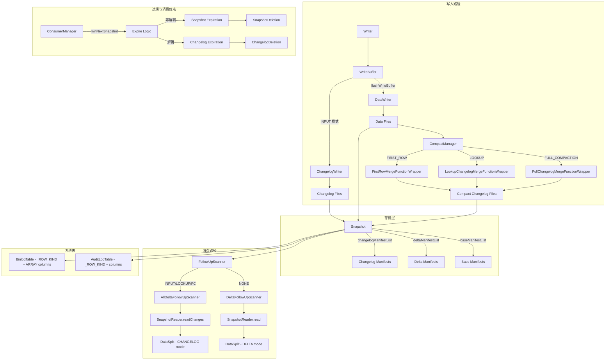

# Apache Paimon Changelog 机制全链路分析

> **代码版本**: 1.5-SNAPSHOT (master 分支, commit 7c93bd720)
> **分析日期**: 2026-04-15
> **分析范围**: Changelog 的产生、存储、消费、过期全生命周期

---

## 目录

- [1. Changelog 的核心价值](#1-changelog-的核心价值)
  - [1.1 为什么 Paimon 需要原生 Changelog](#11-为什么-paimon-需要原生-changelog)
  - [1.2 流表二象性的基础设施](#12-流表二象性的基础设施)
  - [1.3 与 Iceberg CDC Scan 方案的根本差异](#13-与-iceberg-cdc-scan-方案的根本差异)
- [2. ChangelogProducer 四种模式总览](#2-changelogproducer-四种模式总览)
  - [2.1 枚举定义与配置入口](#21-枚举定义与配置入口)
  - [2.2 四种模式对比矩阵](#22-四种模式对比矩阵)
  - [2.3 模式选择决策树](#23-模式选择决策树)
- [3. NONE 模式 — 无 Changelog](#3-none-模式--无-changelog)
  - [3.1 DeltaFollowUpScanner 的工作方式](#31-deltafollowupscanner-的工作方式)
  - [3.2 局限性与适用场景](#32-局限性与适用场景)
- [4. INPUT 模式 — 输入双写](#4-input-模式--输入双写)
  - [4.1 MergeTreeWriter.flushWriteBuffer 中的双写实现](#41-mergetreewriterflushwritebuffer-中的双写实现)
  - [4.2 changelogWriter 的创建条件](#42-changelogwriter-的创建条件)
  - [4.3 Changelog 文件的独立存储](#43-changelog-文件的独立存储)
  - [4.4 DataIncrement 中的 changelogFiles](#44-dataincrement-中的-changelogfiles)
  - [4.5 设计决策与权衡](#45-设计决策与权衡)
- [5. FULL_COMPACTION 模式 — 全压缩比对](#5-full_compaction-模式--全压缩比对)
  - [5.1 FullChangelogMergeFunctionWrapper 核心逻辑](#51-fullchangelogmergefunctionwrapper-核心逻辑)
  - [5.2 topLevelKv 与 merged 的比对算法](#52-toplevelkv-与-merged-的比对算法)
  - [5.3 何时产生 INSERT/UPDATE/DELETE](#53-何时产生-insertupdatedelete)
  - [5.4 full-compaction.delta-commits 触发频率](#54-full-compactiondelta-commits-触发频率)
  - [5.5 设计决策与权衡](#55-设计决策与权衡)
- [6. LOOKUP 模式 — 查找式 Changelog 产生](#6-lookup-模式--查找式-changelog-产生)
  - [6.1 LookupChangelogMergeFunctionWrapper 核心逻辑](#61-lookupchangelogmergefunctionwrapper-核心逻辑)
  - [6.2 与 LookupLevels/LookupMergeFunction 的交互](#62-与-lookuplevelslookupmergefunction-的交互)
  - [6.3 Deletion Vector 的协同](#63-deletion-vector-的协同)
  - [6.4 为什么延迟低于 FULL_COMPACTION](#64-为什么延迟低于-full_compaction)
  - [6.5 LookupStrategy 的角色](#65-lookupstrategy-的角色)
  - [6.6 设计决策与权衡](#66-设计决策与权衡)
- [7. FirstRow Changelog — 首行去重](#7-firstrow-changelog--首行去重)
  - [7.1 FirstRowMergeFunctionWrapper 的 contains 检查](#71-firstrowmergefunctionwrapper-的-contains-检查)
  - [7.2 为什么只产生 INSERT Changelog](#72-为什么只产生-insert-changelog)
  - [7.3 设计决策](#73-设计决策)
- [8. Changelog 的存储架构](#8-changelog-的存储架构)
  - [8.1 Snapshot 中的 changelogManifestList 字段](#81-snapshot-中的-changelogmanifestlist-字段)
  - [8.2 Changelog 文件 vs Data 文件的分离存储](#82-changelog-文件-vs-data-文件的分离存储)
  - [8.3 ChangelogManager 的职责](#83-changelogmanager-的职责)
  - [8.4 Long-Lived Changelog 的独立生命周期](#84-long-lived-changelog-的独立生命周期)
  - [8.5 DataIncrement 与 CompactIncrement 的 Changelog 路径](#85-dataincrement-与-compactincrement-的-changelog-路径)
- [9. Changelog 的消费机制](#9-changelog-的消费机制)
  - [9.1 FollowUpScanner 体系](#91-followupscanner-体系)
  - [9.2 DeltaFollowUpScanner — NONE 模式消费](#92-deltafollowupscanner--none-模式消费)
  - [9.3 AllDeltaFollowUpScanner — 含 Changelog 的消费](#93-alldeltafollowupscanner--含-changelog-的消费)
  - [9.4 ScanMode 三态模型](#94-scanmode-三态模型)
  - [9.5 SnapshotReader.readChanges 的实现](#95-snapshotreaderreadchanges-的实现)
- [10. AuditLog 和 Binlog 系统表](#10-auditlog-和-binlog-系统表)
  - [10.1 AuditLogTable 的实现](#101-auditlogtable-的实现)
  - [10.2 BinlogTable 的实现差异](#102-binlogtable-的实现差异)
  - [10.3 设计决策](#103-设计决策)
- [11. Changelog 过期机制](#11-changelog-过期机制)
  - [11.1 changelog.time-retained 等配置](#111-changelogtime-retained-等配置)
  - [11.2 ExpireConfig 的解耦设计](#112-expireconfig-的解耦设计)
  - [11.3 ChangelogDeletion 的清理逻辑](#113-changelogdeletion-的清理逻辑)
  - [11.4 与 Snapshot 过期的协同](#114-与-snapshot-过期的协同)
- [12. Consumer 机制](#12-consumer-机制)
  - [12.1 ConsumerManager 的实现](#121-consumermanager-的实现)
  - [12.2 Consumer 的位点跟踪](#122-consumer-的位点跟踪)
  - [12.3 EXACTLY_ONCE vs AT_LEAST_ONCE](#123-exactly_once-vs-at_least_once)
  - [12.4 Consumer 与 Changelog 过期的协同](#124-consumer-与-changelog-过期的协同)
- [13. 增量读取](#13-增量读取)
  - [13.1 IncrementalSplit 的结构](#131-incrementalsplit-的结构)
  - [13.2 IncrementalBetweenScanMode 四种子模式](#132-incrementalbetweenscanmode-四种子模式)
  - [13.3 before/after 文件的差异计算](#133-beforeafter-文件的差异计算)
- [14. 与 Iceberg CDC 能力的深度对比](#14-与-iceberg-cdc-能力的深度对比)
  - [14.1 架构理念差异](#141-架构理念差异)
  - [14.2 延迟/准确性/资源开销对比](#142-延迟准确性资源开销对比)
  - [14.3 选型建议](#143-选型建议)
- [15. 架构全景图](#15-架构全景图)

---

## 1. Changelog 的核心价值

### 1.1 为什么 Paimon 需要原生 Changelog

Paimon 的设计目标是构建 **Realtime Lakehouse Architecture**，核心挑战在于：主键表 (Primary Key Table) 使用 LSM 树存储数据，多次写入的同一主键记录分布在不同层级 (Level) 的文件中，最终通过合并 (Merge) 才能得到最新值。如果下游消费者只能看到合并后的结果，就无法知道一条记录是新插入的、还是更新的、还是被删除的。

**核心问题**: LSM 树的 Merge 操作会"吞噬"变更语义 — 下游无法区分 INSERT、UPDATE、DELETE。

**解决方案**: Paimon 在数据写入和压缩过程中，主动产生带有 RowKind 语义（`+I`、`-U`、`+U`、`-D`）的独立 Changelog 文件，使得下游流式消费者能够准确还原数据变更历史。

**为什么不在读取时动态计算**: 动态计算 Changelog 需要将当前合并结果与历史状态进行比对，这意味着每次读取都要额外 I/O 和计算，对于高频流式消费不可接受。预计算 Changelog 将成本前移到写入/压缩阶段，读取时零额外开销。

**好处**:
- 流式消费者直接读取预计算的 Changelog 文件，延迟低至 checkpoint 间隔级别
- Changelog 文件可独立管理生命周期，不影响数据文件的压缩策略
- 支持 Flink CDC 生态，Paimon 表可以作为一等的 CDC 源

### 1.2 流表二象性的基础设施

Paimon 的 Changelog 机制是实现**流表二象性 (Stream-Table Duality)** 的基础设施：

- **表视角**: 通过 Snapshot 读取某一时刻的完整数据（Batch Query）
- **流视角**: 通过 Changelog 读取两个 Snapshot 之间的数据变更（Stream Read）

这两种视角共享同一套底层存储，Changelog 只是在 Snapshot 之上增加了变更语义的元数据层。

**源码证据**: `ScanMode` 枚举（`paimon-core/.../table/source/ScanMode.java`）定义了三种扫描模式：
- `ALL` — 扫描 Snapshot 的全量数据文件（表视角）
- `DELTA` — 只扫描新变更的文件（增量视角，不含 RowKind 语义）
- `CHANGELOG` — 只扫描 Changelog 文件（流视角，含 RowKind 语义）

### 1.3 与 Iceberg CDC Scan 方案的根本差异

Iceberg 的增量读取（Incremental Scan）采用的是"事后推导"策略：通过比对两个 Snapshot 之间的文件变更，推导出哪些行被添加或删除。这种方式的本质是**文件级别的 diff**，而非**行级别的 CDC**。

Paimon 的 Changelog 是**行级别的预计算 CDC 流**：在写入/压缩过程中就确定了每一行的 RowKind（INSERT/UPDATE_BEFORE/UPDATE_AFTER/DELETE），下游直接消费。

关键差异在后续章节 [14. 与 Iceberg CDC 能力的深度对比](#14-与-iceberg-cdc-能力的深度对比) 中详细展开。

---

## 2. ChangelogProducer 四种模式总览

### 2.1 枚举定义与配置入口

**源码路径**: `paimon-api/src/main/java/org/apache/paimon/CoreOptions.java` (行 3948-3976)

```java
public enum ChangelogProducer implements DescribedEnum {
    NONE("none", "No changelog file."),
    INPUT("input", "Double write to a changelog file when flushing memory table, the changelog is from input."),
    FULL_COMPACTION("full-compaction", "Generate changelog files with each full compaction."),
    LOOKUP("lookup", "Generate changelog files through 'lookup' compaction.");
}
```

**配置入口** (行 902-909):
```java
public static final ConfigOption<ChangelogProducer> CHANGELOG_PRODUCER =
        key("changelog-producer")
                .enumType(ChangelogProducer.class)
                .defaultValue(ChangelogProducer.NONE)
                .withDescription("Whether to double write to a changelog file...");
```

**为什么默认是 NONE**: 不是所有场景都需要 Changelog。对于纯批处理或只关心最新快照的场景，产生 Changelog 是不必要的开销。默认 NONE 确保了零额外成本，用户根据需求显式开启。

### 2.2 四种模式对比矩阵

| 维度 | NONE | INPUT | FULL_COMPACTION | LOOKUP |
|------|------|-------|-----------------|--------|
| **Changelog 产生时机** | 不产生 | flush 写缓冲时 | 全压缩时 | Lookup 压缩时 |
| **Changelog 来源** | 无 | 原始输入 | 新旧值比对 | 查找+比对 |
| **延迟** | N/A | 最低(checkpoint 级) | 高(取决于压缩间隔) | 中等(每次 L0 压缩) |
| **准确性** | N/A | 取决于输入质量 | 精确 | 精确 |
| **写放大** | 无 | ~2x | 压缩时产生 | 压缩时产生 |
| **额外资源** | 无 | 双写 I/O | 全压缩计算 | Lookup I/O |
| **适用 MergeEngine** | 所有 | 所有(但 deduplicate 需注意) | 所有(有主键表) | 除 first-row 外 |

### 2.3 模式选择决策树

```
需要流式 CDC 消费?
├── 否 → NONE (默认，零开销)
└── 是 → 上游数据自带完整 CDC 语义 (如 MySQL CDC)?
    ├── 是 → INPUT (最低延迟，直接双写输入)
    └── 否 → 能接受较高延迟?
        ├── 是 → FULL_COMPACTION (最精确，但延迟大)
        └── 否 → LOOKUP (折中方案，延迟与准确性兼顾)
```

---

## 3. NONE 模式 — 无 Changelog

### 3.1 DeltaFollowUpScanner 的工作方式

**源码路径**: `paimon-core/.../table/source/snapshot/DeltaFollowUpScanner.java`

NONE 模式下不产生任何 Changelog 文件。流式读取使用 `DeltaFollowUpScanner`，它只关注 `APPEND` 类型的 Snapshot：

```java
@Override
public boolean shouldScanSnapshot(Snapshot snapshot) {
    if (snapshot.commitKind() == Snapshot.CommitKind.APPEND) {
        return true;
    }
    LOG.debug("Next snapshot id {} is not APPEND, but is {}, check next one.",
            snapshot.id(), snapshot.commitKind());
    return false;
}

@Override
public SnapshotReader.Plan scan(Snapshot snapshot, SnapshotReader snapshotReader) {
    return snapshotReader.withMode(ScanMode.DELTA).withSnapshot(snapshot).read();
}
```

**为什么只处理 APPEND**: COMPACT 类型的 Snapshot 不引入新数据，只是重组文件。OVERWRITE 是覆盖写，在 NONE 模式下默认不读取（除非显式开启 `streaming-read-overwrite`）。

### 3.2 局限性与适用场景

- 流式消费只能看到文件级别的增量，所有行都以 `+I` (INSERT) 形式出现
- 无法区分新插入和更新，无法产生 `-D` (DELETE) 记录
- 适用于 Append-Only 表或只需要增量文件追踪的场景

---

## 4. INPUT 模式 — 输入双写

### 4.1 MergeTreeWriter.flushWriteBuffer 中的双写实现

**源码路径**: `paimon-core/.../mergetree/MergeTreeWriter.java` (行 209-249)

INPUT 模式的核心在于 `flushWriteBuffer` 方法中的**双写 (Double Write)** 机制：

```java
private void flushWriteBuffer(boolean waitForLatestCompaction, boolean forcedFullCompaction)
        throws Exception {
    if (writeBuffer.size() > 0) {
        // ... 

        // 关键: 仅当 changelogProducer == INPUT 时创建 changelogWriter
        final RollingFileWriter<KeyValue, DataFileMeta> changelogWriter =
                changelogProducer == ChangelogProducer.INPUT
                        ? writerFactory.createRollingChangelogFileWriter(0)
                        : null;
        final RollingFileWriter<KeyValue, DataFileMeta> dataWriter =
                writerFactory.createRollingMergeTreeFileWriter(0, FileSource.APPEND);

        try {
            // 关键: forEach 同时将数据写入 dataWriter 和 changelogWriter
            writeBuffer.forEach(
                    keyComparator,
                    mergeFunction,
                    changelogWriter == null ? null : changelogWriter::write,
                    dataWriter::write);
        } finally {
            writeBuffer.clear();
            if (changelogWriter != null) {
                changelogWriter.close();
            }
            dataWriter.close();
        }

        // 收集 changelog 文件
        if (changelogWriter != null) {
            newFilesChangelog.addAll(changelogWriter.result());
        }

        // 收集数据文件并注册到 compactManager
        for (DataFileMeta fileMeta : dataWriter.result()) {
            newFiles.add(fileMeta);
            compactManager.addNewFile(fileMeta);
        }
    }
    // ...
}
```

**为什么在 flushWriteBuffer 中实现**: 这是将内存中排序好的 WriteBuffer 持久化到磁盘的唯一路径。在这个点上双写确保了：
1. Changelog 和数据文件包含完全相同的记录
2. WriteBuffer 的排序和合并操作只执行一次，结果同时输出到两个 Writer
3. 不增加额外的内存压力

### 4.2 changelogWriter 的创建条件

```java
final RollingFileWriter<KeyValue, DataFileMeta> changelogWriter =
        changelogProducer == ChangelogProducer.INPUT
                ? writerFactory.createRollingChangelogFileWriter(0)
                : null;
```

**创建条件极其简单**: 当且仅当 `changelogProducer == INPUT` 时创建。这个判断发生在每次 flush 操作中，确保非 INPUT 模式下零开销。

**为什么用 `createRollingChangelogFileWriter(0)`**: 
- `Rolling` 表示文件大小达到阈值时自动滚动创建新文件
- `Changelog` 前缀确保文件命名与数据文件区分（由 `changelog-file.prefix` 配置，默认 `"changelog-"`）
- 参数 `0` 表示 Level 0

### 4.3 Changelog 文件的独立存储

Changelog 文件通过以下配置项实现独立存储控制：

| 配置项 | 默认值 | 说明 |
|--------|--------|------|
| `changelog-file.prefix` | `"changelog-"` | 文件名前缀（行 345-349） |
| `changelog-file.format` | null (使用数据文件格式) | 独立文件格式 |
| `changelog-file.compression` | null (使用数据文件压缩) | 独立压缩算法 |
| `changelog-file.stats-mode` | null | 独立统计信息模式 |

**为什么支持独立配置**: Changelog 文件的读取模式与数据文件不同。数据文件通常做全表扫描/点查，需要列式存储；Changelog 文件通常做顺序扫描，可以选择更适合顺序读取的格式和压缩策略。

### 4.4 DataIncrement 中的 changelogFiles

**源码路径**: `paimon-core/.../io/DataIncrement.java` (行 30-56)

```java
public class DataIncrement {
    private final List<DataFileMeta> newFiles;      // 新数据文件
    private final List<DataFileMeta> deletedFiles;   // 删除的数据文件
    private final List<DataFileMeta> changelogFiles; // Changelog 文件
    private final List<IndexFileMeta> newIndexFiles;
    private final List<IndexFileMeta> deletedIndexFiles;
}
```

INPUT 模式产生的 Changelog 文件放在 `DataIncrement.changelogFiles` 中（而非 `CompactIncrement`），因为它们是在数据写入阶段产生的，与压缩无关。

### 4.5 设计决策与权衡

**为什么选择 INPUT 模式**:
- **最低延迟**: Changelog 在每次 flush 时产生，与数据写入同步，延迟等于 checkpoint 间隔
- **最小复杂度**: 不需要额外的查找或比对逻辑

**局限性**:
- INPUT 模式的 Changelog 来自输入数据，如果输入本身不携带完整 CDC 语义（如缺少 UPDATE_BEFORE），Changelog 就不完整
- 写放大约 2x — 每条记录既写入数据文件，又写入 Changelog 文件
- 不适合 INSERT-only 的输入流配合 Deduplicate 引擎（因为输入全是 `+I`，Changelog 中看不到旧值）

---

## 5. FULL_COMPACTION 模式 — 全压缩比对

### 5.1 FullChangelogMergeFunctionWrapper 核心逻辑

**源码路径**: `paimon-core/.../mergetree/compact/FullChangelogMergeFunctionWrapper.java`

这个 Wrapper 包装在 `MergeFunction` 之上，在全压缩过程中通过比对"最高层级旧值" (topLevelKv) 和"合并后新值" (merged) 来产生 Changelog。

```java
public class FullChangelogMergeFunctionWrapper implements MergeFunctionWrapper<ChangelogResult> {
    private final MergeFunction<KeyValue> mergeFunction;
    private final int maxLevel;
    @Nullable private final RecordEqualiser valueEqualiser;

    // 关键字段
    private KeyValue topLevelKv;  // 来自最高层级的旧值
    private KeyValue initialKv;   // 第一条记录
    private boolean isInitialized;
}
```

### 5.2 topLevelKv 与 merged 的比对算法

`add()` 方法分离出最高层级的 KV：

```java
@Override
public void add(KeyValue kv) {
    if (maxLevel == kv.level()) {
        Preconditions.checkState(topLevelKv == null, 
                "Top level key-value already exists!");
        topLevelKv = kv;  // 记录来自最高层级的旧值
    }
    // ... 聚合到 mergeFunction
}
```

**为什么 topLevelKv 代表"旧值"**: 在 LSM 树的全压缩中（Universal Compaction），最高层级 (maxLevel) 的文件包含的是之前压缩沉淀下来的"历史最终值"。新写入的数据在 Level 0，逐步通过压缩下沉到更高层级。因此 maxLevel 的记录就是"上次全压缩之后的值"。

### 5.3 何时产生 INSERT/UPDATE/DELETE

`getResult()` 方法的核心逻辑（行 97-126）：

```java
@Override
public ChangelogResult getResult() {
    reusedResult.reset();
    if (isInitialized) {
        KeyValue merged = mergeFunction.getResult();
        if (topLevelKv == null) {
            // 场景1: 无旧值，合并结果为 ADD → 新增记录
            if (merged.isAdd()) {
                reusedResult.addChangelog(replace(reusedAfter, RowKind.INSERT, merged));
            }
        } else {
            if (!merged.isAdd()) {
                // 场景2: 有旧值，合并结果为 RETRACT → 删除记录
                reusedResult.addChangelog(replace(reusedBefore, RowKind.DELETE, topLevelKv));
            } else if (valueEqualiser == null 
                    || !valueEqualiser.equals(topLevelKv.value(), merged.value())) {
                // 场景3: 有旧值，合并结果为 ADD，且值不同 → 更新记录
                reusedResult
                        .addChangelog(replace(reusedBefore, RowKind.UPDATE_BEFORE, topLevelKv))
                        .addChangelog(replace(reusedAfter, RowKind.UPDATE_AFTER, merged));
            }
            // 场景4: 有旧值，合并结果为 ADD，且值相同 → 无变更，不产生 Changelog
        }
        return reusedResult.setResultIfNotRetract(merged);
    } else {
        // 只有一条记录，无需合并
        if (topLevelKv == null && initialKv.isAdd()) {
            reusedResult.addChangelog(replace(reusedAfter, RowKind.INSERT, initialKv));
        }
        return reusedResult.setResultIfNotRetract(initialKv);
    }
}
```

**完整的 Changelog 产生决策矩阵**:

| topLevelKv (旧值) | merged (新值) | 产生的 Changelog |
|-------------------|--------------|-----------------|
| null | isAdd = true | `+I` (INSERT) |
| null | isAdd = false | 无 (retract 无旧值，忽略) |
| 存在 | isAdd = false | `-D` (DELETE, 使用旧值) |
| 存在 | isAdd = true, 值不同 | `-U` (旧值) + `+U` (新值) |
| 存在 | isAdd = true, 值相同 | 无 (无变更) |

**valueEqualiser 的作用**: 当配置 `changelog-producer.row-deduplicate = true` 时，`valueEqualiser` 非 null，用于比较新旧值是否相同。如果相同，则不产生多余的 UPDATE Changelog，减少下游无效处理。还可以通过 `changelog-producer.row-deduplicate-ignore-fields` 忽略某些字段的比较。

### 5.4 full-compaction.delta-commits 触发频率

**源码路径**: `CoreOptions.java` (行 1356-1362)

```java
public static final ConfigOption<Integer> FULL_COMPACTION_DELTA_COMMITS =
        key("full-compaction.delta-commits")
                .intType()
                .noDefaultValue()
                .withDescription("For streaming write, full compaction will be constantly 
                        triggered after delta commits.");
```

**为什么需要这个参数**: FULL_COMPACTION 模式的 Changelog 只在全压缩时产生。如果不控制全压缩频率，Changelog 的产生间隔可能非常长。通过 `full-compaction.delta-commits` 可以控制"每 N 次增量提交后触发一次全压缩"。

**好处**: 用户可以在 Changelog 延迟和压缩开销之间做精确权衡。例如设为 1 则每次提交都触发全压缩（最低延迟，最高成本），设为 10 则每 10 次提交触发一次（较高延迟，较低成本）。

### 5.5 设计决策与权衡

**为什么选择在全压缩时比对**:
- 全压缩是唯一能看到"所有层级数据"的时机，此时可以准确比对新旧值
- 全压缩产生的 Changelog 是**精确的**，不依赖输入数据的 CDC 语义

**局限性**:
- Changelog 延迟等于两次全压缩之间的间隔，通常为分钟级
- 全压缩本身有较高的 I/O 和 CPU 开销
- 如果全压缩频率过低，一次性产生大量 Changelog，可能导致下游压力

---

## 6. LOOKUP 模式 — 查找式 Changelog 产生

### 6.1 LookupChangelogMergeFunctionWrapper 核心逻辑

**源码路径**: `paimon-core/.../mergetree/compact/LookupChangelogMergeFunctionWrapper.java`

LOOKUP 模式的核心思想：在每次涉及 Level 0 文件的压缩中，通过查找 (Lookup) 获取旧值，与新值比对产生 Changelog。

```java
@Override
public ChangelogResult getResult() {
    // 步骤1: 找到参与合并的最高层级记录
    KeyValue highLevel = mergeFunction.pickHighLevel();
    boolean containLevel0 = mergeFunction.containLevel0();

    // 步骤2: 如果没有高层级记录，通过 lookup 查找旧值
    if (highLevel == null) {
        T lookupResult = lookup.apply(mergeFunction.key());
        if (lookupResult != null) {
            if (lookupStrategy.deletionVector) {
                // Deletion Vector 模式下的特殊处理
                // ... 记录 deletion vector 信息
                deletionVectorsMaintainer.notifyNewDeletion(fileName, rowPosition);
            } else {
                highLevel = (KeyValue) lookupResult;
            }
            if (highLevel != null) {
                mergeFunction.insertInto(highLevel, comparator);
            }
        }
    }

    // 步骤3: 计算合并结果
    KeyValue result = mergeFunction.getResult();

    // 步骤4: 当存在 Level 0 记录时产生 Changelog
    reusedResult.reset();
    if (containLevel0 && lookupStrategy.produceChangelog) {
        setChangelog(highLevel, result);
    }

    return reusedResult.setResult(result);
}
```

**关键设计决策 — 为什么只在有 Level 0 记录时产生 Changelog**: Level 0 代表新写入的数据，是"变更"的来源。如果一次压缩只涉及高层级文件（如 Level 1 到 Level 2 的升级），没有新数据参与，就没有真正的业务变更，不应该产生 Changelog。

### 6.2 与 LookupLevels/LookupMergeFunction 的交互

**LookupMergeFunction** (`paimon-core/.../mergetree/compact/LookupMergeFunction.java`):

```java
public class LookupMergeFunction implements MergeFunction<KeyValue> {
    @Nullable
    public KeyValue pickHighLevel() {
        // 遍历候选记录，选择最小 level > 0 的记录作为 highLevel
        KeyValue highLevel = null;
        try (CloseableIterator<KeyValue> iterator = candidates.iterator()) {
            while (iterator.hasNext()) {
                KeyValue kv = iterator.next();
                if (kv.level() <= 0) continue;
                if (highLevel == null || kv.level() < highLevel.level()) {
                    highLevel = kv;
                }
            }
        }
        return highLevel;
    }
}
```

**为什么选择 "最小 level > 0"**: 在 LookupMergeFunction 中，每次合并查询的是该键在更高层级的"最近已合并状态"。Level 越低越新，但 Level 0 是未合并的新数据。因此"最小的非零 Level"就是"距离当前最近的已确认历史值"。

### 6.3 Deletion Vector 的协同

当 `lookupStrategy.deletionVector = true` 时（即同时启用了 Deletion Vector），LOOKUP 模式有额外逻辑：

```java
if (lookupStrategy.deletionVector) {
    // 通知 DV Maintainer 标记旧值所在的文件和行位置
    deletionVectorsMaintainer.notifyNewDeletion(fileName, rowPosition);
}
```

**为什么需要 DV 协同**: Deletion Vector 模式下，更新一条记录不是通过写入带 RETRACT 标记的新记录，而是在索引文件中标记旧记录为"已删除"。LOOKUP 模式需要在查找旧值时同步更新 DV，确保旧值被正确标记为过期。

### 6.4 为什么延迟低于 FULL_COMPACTION

| 对比维度 | FULL_COMPACTION | LOOKUP |
|---------|-----------------|--------|
| **触发时机** | 只在全压缩时 | 每次涉及 L0 的压缩 |
| **压缩范围** | 所有层级 | 只需 L0 + 高层级查找 |
| **频率** | 由 delta-commits 控制 | 每次 L0 文件参与压缩 |
| **I/O 模式** | 全量读写 | 点查(Lookup) + 部分读写 |

**LOOKUP 的核心优势**: 不需要等待全压缩，只要 L0 文件参与任何压缩就能产生 Changelog。L0 压缩的频率远高于全压缩，因此 LOOKUP 模式的 Changelog 延迟显著低于 FULL_COMPACTION。

**代价**: 每次压缩都需要 Lookup 查找旧值，如果键空间很大，Lookup 的 I/O 开销不可忽视。但得益于 LookupLevels 的本地缓存（RocksDB/HashLookup 索引），实际 I/O 通常可控。

### 6.5 LookupStrategy 的角色

**源码路径**: `paimon-api/.../lookup/LookupStrategy.java`

```java
public class LookupStrategy {
    public final boolean needLookup;
    public final boolean isFirstRow;
    public final boolean produceChangelog;
    public final boolean deletionVector;

    private LookupStrategy(boolean isFirstRow, boolean produceChangelog, 
                           boolean deletionVector, boolean forceLookup) {
        this.isFirstRow = isFirstRow;
        this.produceChangelog = produceChangelog;
        this.deletionVector = deletionVector;
        this.needLookup = produceChangelog || deletionVector || isFirstRow || forceLookup;
    }
}
```

`LookupStrategy` 封装了"是否需要 Lookup"的决策逻辑。`needLookup = true` 的条件包括：
1. `produceChangelog = true` — LOOKUP 模式的 ChangelogProducer
2. `deletionVector = true` — 启用了 Deletion Vector
3. `isFirstRow = true` — FirstRow 合并引擎
4. `forceLookup = true` — 显式强制 Lookup

**好处**: 将 Lookup 决策集中在一个 Strategy 对象中，避免散落在各处的 if-else 判断。

### 6.6 设计决策与权衡

**为什么引入 LOOKUP 模式**:
- FULL_COMPACTION 延迟太高，INPUT 需要完整 CDC 输入
- LOOKUP 提供了一个折中方案：不依赖输入 CDC 语义（自己查找旧值），同时延迟远低于全压缩

**好处**:
- 每次 L0 压缩都能产生精确的 Changelog
- 与 Deletion Vector 自然协同
- 通过 `lookup-wait` 配置可以控制 commit 是否等待 Lookup 压缩完成

**局限性**:
- 需要维护 Lookup 索引（本地磁盘开销）
- 不适用于 FirstRow 合并引擎（FirstRow 有自己的 Wrapper）

---

## 7. FirstRow Changelog — 首行去重

### 7.1 FirstRowMergeFunctionWrapper 的 contains 检查

**源码路径**: `paimon-core/.../mergetree/compact/FirstRowMergeFunctionWrapper.java`

```java
public class FirstRowMergeFunctionWrapper implements MergeFunctionWrapper<ChangelogResult> {
    private final Filter<InternalRow> contains;  // 检查键是否已存在的过滤器
    private final FirstRowMergeFunction mergeFunction;

    @Override
    public ChangelogResult getResult() {
        reusedResult.reset();
        KeyValue result = mergeFunction.getResult();
        
        if (mergeFunction.containsHighLevel) {
            // 已有高层级记录，说明不是新键
            reusedResult.setResult(result);
            return reusedResult;
        }

        if (contains.test(result.key())) {
            // 键已存在于更高层级的 Lookup 索引中
            return reusedResult;  // 返回空结果（重复键被过滤）
        }

        // 新记录，输出 changelog
        return reusedResult.setResult(result).addChangelog(result);
    }
}
```

**contains 检查的本质**: `contains` 是一个 `Filter<InternalRow>` 函数，通常连接到 LookupLevels，用于检查给定的 key 是否已经在某个更高层级的文件中存在。

### 7.2 为什么只产生 INSERT Changelog

FirstRow 引擎的语义是"保留第一条出现的记录"。这意味着：
1. 如果一个键第一次出现 → 产生 `+I` (INSERT) Changelog
2. 如果一个键已经存在 → 忽略新记录，不产生任何 Changelog
3. 永远不会产生 UPDATE 或 DELETE

**为什么是这样**: FirstRow 引擎的设计目标是去重，只保留首次出现的记录。一旦记录被保留，它就不会被后续相同键的记录覆盖或删除。因此，只有"首次出现"这一事件需要被记录为 Changelog。

### 7.3 设计决策

**为什么 FirstRow 不使用 LookupChangelogMergeFunctionWrapper**: 

在 `LookupMergeFunction.wrap()` 中（行 130-138）：
```java
public static MergeFunctionFactory<KeyValue> wrap(...) {
    if (wrapped.create() instanceof FirstRowMergeFunction) {
        // don't wrap first row, it is already OK
        return wrapped;
    }
    return new Factory(wrapped, options, keyType, valueType);
}
```

FirstRow 不会被 LookupMergeFunction 包装，而是有自己专门的 `FirstRowMergeFunctionWrapper`。因为 FirstRow 的语义更简单：只需要检查键是否存在，不需要获取旧值做比对。

---

## 8. Changelog 的存储架构

### 8.1 Snapshot 中的 changelogManifestList 字段

**源码路径**: `paimon-api/.../Snapshot.java` (行 58-59, 106-115)

```java
protected static final String FIELD_CHANGELOG_MANIFEST_LIST = "changelogManifestList";

// a manifest list recording all changelog produced in this snapshot
// null if no changelog is produced
@JsonProperty(FIELD_CHANGELOG_MANIFEST_LIST)
@JsonInclude(JsonInclude.Include.NON_NULL)
@Nullable
protected final String changelogManifestList;
```

**三层 Manifest 结构**:

```
Snapshot
├── baseManifestList     → 全量数据的 manifest 文件列表
├── deltaManifestList    → 增量数据的 manifest 文件列表（本次 snapshot 的变更）
├── changelogManifestList → Changelog 文件的 manifest 列表（可为 null）
└── indexManifest        → 索引文件的 manifest
```

**为什么 changelogManifestList 可以为 null**: 
- NONE 模式下永远为 null
- INPUT 模式下，如果某次 commit 没有新数据写入，也为 null
- 即使是 LOOKUP/FULL_COMPACTION 模式，如果某次压缩没有产生变更，也为 null

### 8.2 Changelog 文件 vs Data 文件的分离存储

Changelog 文件和数据文件在物理上存储在同一个 bucket 目录下，但通过文件名前缀区分：

- 数据文件: `data-{uuid}.parquet`（由 `data-file.prefix` 配置）
- Changelog 文件: `changelog-{uuid}.parquet`（由 `changelog-file.prefix` 配置）

**为什么不使用独立目录**: 
- 同一 bucket 下的 changelog 和 data 文件共享分区和 bucket 的目录结构
- 在 Manifest 层面通过 `FileKind` 区分，物理存储不需要独立目录
- 简化了文件路径管理和清理逻辑

### 8.3 ChangelogManager 的职责

**源码路径**: `paimon-core/.../utils/ChangelogManager.java`

`ChangelogManager` 管理的是**长生命周期 Changelog (Long-Lived Changelog)**，存储在独立的 `changelog/` 目录下：

```java
public class ChangelogManager implements Serializable {
    public static final String CHANGELOG_PREFIX = "changelog-";
    
    private final FileIO fileIO;
    private final Path tablePath;
    private final String branch;
    
    // 核心方法
    public Path longLivedChangelogPath(long snapshotId) {
        return new Path(branchPath(tablePath, branch) + "/changelog/" + CHANGELOG_PREFIX + snapshotId);
    }
    
    public void commitChangelog(Changelog changelog, long id) throws IOException {
        fileIO.writeFile(longLivedChangelogPath(id), changelog.toJson(), true);
    }
}
```

**Long-Lived Changelog 的存储结构**:
```
table-path/
├── snapshot/
│   ├── snapshot-1  (JSON, 包含 changelogManifestList)
│   └── snapshot-2
├── changelog/       ← ChangelogManager 管理的目录
│   ├── changelog-1  (JSON, 独立的 Changelog 元数据)
│   └── changelog-2
├── manifest/
└── bucket-0/
    ├── data-xxx.parquet
    └── changelog-xxx.parquet
```

### 8.4 Long-Lived Changelog 的独立生命周期

当 Changelog 的保留时间配置 (`changelog.time-retained`) 大于 Snapshot 的保留时间时，会触发"生命周期解耦" (Decoupled Lifecycle)：

**源码路径**: `ExpireConfig.java` (行 54-57)

```java
this.changelogDecoupled =
        changelogRetainMax > snapshotRetainMax
                || changelogRetainMin > snapshotRetainMin
                || changelogTimeRetain.compareTo(snapshotTimeRetain) > 0;
```

**为什么需要解耦**: 流式消费者可能需要比批处理更长的历史数据。例如，Snapshot 只保留 1 小时用于批处理回溯，但 Changelog 需要保留 24 小时用于流式消费者的故障恢复。解耦后，Snapshot 过期不会导致相关的 Changelog 被删除。

### 8.5 DataIncrement 与 CompactIncrement 的 Changelog 路径

Changelog 文件的产生有两条路径，对应不同的 ChangelogProducer 模式：

**路径 1 — DataIncrement (INPUT 模式)**:
```
MergeTreeWriter.flushWriteBuffer()
  → changelogWriter.write(kv)
  → newFilesChangelog.addAll(changelogWriter.result())
  → drainIncrement() → DataIncrement.changelogFiles
```

**路径 2 — CompactIncrement (FULL_COMPACTION/LOOKUP 模式)**:
```
CompactManager.getCompactionResult()
  → CompactResult.changelog()
  → compactChangelog.addAll(result.changelog())
  → drainIncrement() → CompactIncrement.changelogFiles
```

这两条路径最终在 `drainIncrement()` 方法（行 280-302）中汇总：

```java
private CommitIncrement drainIncrement() {
    DataIncrement dataIncrement = new DataIncrement(
            new ArrayList<>(newFiles),
            new ArrayList<>(deletedFiles),
            new ArrayList<>(newFilesChangelog));   // INPUT 的 changelog
    CompactIncrement compactIncrement = new CompactIncrement(
            new ArrayList<>(compactBefore.values()),
            new ArrayList<>(compactAfter),
            new ArrayList<>(compactChangelog));    // COMPACT 的 changelog
    // ...
}
```

---

## 9. Changelog 的消费机制

### 9.1 FollowUpScanner 体系

`FollowUpScanner` 是流式读取的核心接口，定义了如何跟踪新 Snapshot 并读取变更数据：

**源码路径**: `paimon-core/.../table/source/snapshot/FollowUpScanner.java`

```java
public interface FollowUpScanner {
    boolean shouldScanSnapshot(Snapshot snapshot);
    Plan scan(Snapshot snapshot, SnapshotReader snapshotReader);
}
```

不同的 ChangelogProducer 模式对应不同的 FollowUpScanner 实现：

| ChangelogProducer | FollowUpScanner | 行为 |
|-------------------|-----------------|------|
| NONE | `DeltaFollowUpScanner` | 只扫描 APPEND 的 delta 文件 |
| INPUT | `AllDeltaFollowUpScanner` | 扫描所有 snapshot 的 changelog |
| FULL_COMPACTION | `AllDeltaFollowUpScanner` | 扫描所有 snapshot 的 changelog |
| LOOKUP | `AllDeltaFollowUpScanner` | 扫描所有 snapshot 的 changelog |

### 9.2 DeltaFollowUpScanner — NONE 模式消费

**源码路径**: `paimon-core/.../table/source/snapshot/DeltaFollowUpScanner.java`

```java
@Override
public boolean shouldScanSnapshot(Snapshot snapshot) {
    if (snapshot.commitKind() == Snapshot.CommitKind.APPEND) {
        return true;
    }
    return false;  // 跳过 COMPACT 和 OVERWRITE
}

@Override
public SnapshotReader.Plan scan(Snapshot snapshot, SnapshotReader snapshotReader) {
    return snapshotReader.withMode(ScanMode.DELTA).withSnapshot(snapshot).read();
}
```

使用 `ScanMode.DELTA`，只读取 delta manifest 中的新增文件，所有记录以 `+I` 形式出现。

### 9.3 AllDeltaFollowUpScanner — 含 Changelog 的消费

**源码路径**: `paimon-core/.../table/source/snapshot/AllDeltaFollowUpScanner.java`

```java
@Override
public boolean shouldScanSnapshot(Snapshot snapshot) {
    return true;  // 不跳过任何类型的 snapshot
}

@Override
public SnapshotReader.Plan scan(Snapshot snapshot, SnapshotReader snapshotReader) {
    return snapshotReader.withMode(ScanMode.DELTA).withSnapshot(snapshot).readChanges();
}
```

关键区别在于调用 `readChanges()` 而非 `read()`。`readChanges()` 会优先读取 `changelogManifestList`，如果存在的话，其中的文件携带完整的 RowKind 语义。

### 9.4 ScanMode 三态模型

**源码路径**: `paimon-core/.../table/source/ScanMode.java`

```java
public enum ScanMode {
    ALL,       // 全量数据文件
    DELTA,     // 增量变更文件
    CHANGELOG  // Changelog 文件
}
```

`DELTA` 和 `CHANGELOG` 的关键区别：
- `DELTA` 读取 `deltaManifestList`，内容是本次提交新增/删除的数据文件
- `CHANGELOG` 直接读取 `changelogManifestList`，内容是专门产生的 Changelog 文件

在 `readChanges()` 实现中，如果 `changelogManifestList != null` 则使用 CHANGELOG 模式，否则降级为 DELTA 模式。

### 9.5 SnapshotReader.readChanges 的实现

`readChanges()` 是流式消费的关键入口。它的逻辑是：
1. 检查当前 Snapshot 是否有 `changelogManifestList`
2. 如果有 → 使用 `ScanMode.CHANGELOG` 读取 Changelog 文件
3. 如果没有 → 使用 `ScanMode.DELTA` 读取增量文件（降级）

这种设计确保了：即使是 FULL_COMPACTION 模式下某些 Snapshot 没有触发全压缩（因此没有 Changelog），流式消费也不会中断，只是该 Snapshot 的记录缺少 RowKind 语义。

---

## 10. AuditLog 和 Binlog 系统表

### 10.1 AuditLogTable 的实现

**源码路径**: `paimon-core/.../table/system/AuditLogTable.java`

`AuditLogTable` 是 Paimon 的一个系统表，通过 `table_name$audit_log` 访问。它包装了底层的 `FileStoreTable`，在每行数据前添加一个 `_ROW_KIND` 字段：

```java
public class AuditLogTable implements DataTable, ReadonlyTable {
    public static final String AUDIT_LOG = "audit_log";
    
    protected final FileStoreTable wrapped;
    protected final List<DataField> specialFields;
    
    public AuditLogTable(FileStoreTable wrapped) {
        this.wrapped = wrapped;
        this.specialFields = new ArrayList<>();
        specialFields.add(SpecialFields.ROW_KIND);  // 添加 _ROW_KIND 字段
        
        // 可选: 添加 _SEQUENCE_NUMBER 字段
        boolean includeSequenceNumber = CoreOptions.fromMap(wrapped.options())
                .tableReadSequenceNumberEnabled();
        if (includeSequenceNumber) {
            specialFields.add(SpecialFields.SEQUENCE_NUMBER);
        }
    }
}
```

**Schema 结构**: `[_ROW_KIND, col1, col2, ...originalColumns...]`

其中 `_ROW_KIND` 的值为字符串类型：`"+I"`, `"-U"`, `"+U"`, `"-D"`。

### 10.2 BinlogTable 的实现差异

**源码路径**: `paimon-core/.../table/system/BinlogTable.java`

`BinlogTable` 继承自 `AuditLogTable`，通过 `table_name$binlog` 访问。它的关键差异在于 schema 结构：

```java
public class BinlogTable extends AuditLogTable {
    public static final String BINLOG = "binlog";
    
    @Override
    public RowType rowType() {
        List<DataField> fields = new ArrayList<>(specialFields);
        for (DataField field : wrapped.rowType().getFields()) {
            // 将每个字段转换为 ARRAY 类型
            fields.add(field.newType(new ArrayType(field.type().nullable())));
        }
        return new RowType(fields);
    }
}
```

**Binlog 格式**:
- INSERT: `[+I, [col1_value], [col2_value]]` — 每个字段是长度为 1 的数组
- UPDATE: `[+U, [col1_before, col1_after], [col2_before, col2_after]]` — 每个字段是长度为 2 的数组
- DELETE: `[-D, [col1_value], [col2_value]]` — 每个字段是长度为 1 的数组

**为什么 Binlog 使用数组**: 这样一条记录就能同时携带 UPDATE_BEFORE 和 UPDATE_AFTER 的值，类似于 MySQL Binlog 的 before/after image。AuditLog 则需要两条记录（-U 和 +U）来表示一次更新。

### 10.3 设计决策

**AuditLog 的优势**: 保持了流式 CDC 的标准格式，每条记录对应一个 RowKind，与 Flink 的 `RowKind` 语义完全对齐，适合直接接入 Flink CDC 管道。

**Binlog 的优势**: 一条记录携带完整的 UPDATE 前后值，减少了记录条数，适合需要同时查看前后值的审计场景。

**好处**: 两种系统表满足不同的消费需求，AuditLog 面向流处理，Binlog 面向审计分析。

---

## 11. Changelog 过期机制

### 11.1 changelog.time-retained 等配置

**源码路径**: `CoreOptions.java` (行 516-534)

```java
public static final ConfigOption<Integer> CHANGELOG_NUM_RETAINED_MIN =
        key("changelog.num-retained.min").intType().noDefaultValue();

public static final ConfigOption<Integer> CHANGELOG_NUM_RETAINED_MAX =
        key("changelog.num-retained.max").intType().noDefaultValue();

public static final ConfigOption<Duration> CHANGELOG_TIME_RETAINED =
        key("changelog.time-retained").durationType().noDefaultValue();
```

**为什么默认值为 noDefaultValue**: 当未设置 Changelog 专属过期配置时，使用 Snapshot 的过期配置作为默认值。这个降级逻辑在 `ExpireConfig.Builder.build()` 中实现：

```java
public ExpireConfig build() {
    return new ExpireConfig(
            snapshotRetainMax, snapshotRetainMin, snapshotTimeRetain, snapshotMaxDeletes,
            changelogRetainMax == null ? snapshotRetainMax : changelogRetainMax,  // 降级
            changelogRetainMin == null ? snapshotRetainMin : changelogRetainMin,  // 降级
            changelogTimeRetain == null ? snapshotTimeRetain : changelogTimeRetain, // 降级
            changelogMaxDeletes == null ? snapshotMaxDeletes : changelogMaxDeletes,
            consumerChangelogOnly);
}
```

### 11.2 ExpireConfig 的解耦设计

**源码路径**: `paimon-api/.../options/ExpireConfig.java`

```java
public class ExpireConfig {
    private final boolean changelogDecoupled;  // 关键字段
    
    // 当 changelog 的保留配置 > snapshot 时自动解耦
    this.changelogDecoupled =
            changelogRetainMax > snapshotRetainMax
                    || changelogRetainMin > snapshotRetainMin
                    || changelogTimeRetain.compareTo(snapshotTimeRetain) > 0;
}
```

**解耦 (Decoupled) 的含义**: 当 `changelogDecoupled = true` 时，Snapshot 过期不会删除相关的 Changelog 文件。Changelog 有自己独立的过期逻辑。

**为什么需要解耦**: 典型场景 — Batch 作业只需要最近 1 小时的 Snapshot，但 Streaming 消费者需要 24 小时的 Changelog 来支持故障恢复。

### 11.3 ChangelogDeletion 的清理逻辑

**源码路径**: `paimon-core/.../operation/ChangelogDeletion.java`

```java
public class ChangelogDeletion extends FileDeletionBase<Changelog> {

    @Override
    public void cleanUnusedDataFiles(Changelog changelog, Predicate<ExpireFileEntry> skipper) {
        if (changelog.changelogManifestList() != null) {
            // 有独立的 changelog manifest → 直接删除其中引用的数据文件
            deleteAddedDataFiles(changelog.changelogManifestList());
        } else {
            // 无独立 changelog manifest → 从 delta manifest 中清理
            if (manifestList.exists(changelog.deltaManifestList())) {
                cleanUnusedDataFiles(changelog.deltaManifestList(), skipper);
            }
        }
    }

    @Override
    public void cleanUnusedManifests(Changelog changelog, Set<String> skippingSet) {
        if (changelog.changelogManifestList() != null) {
            cleanUnusedManifestList(changelog.changelogManifestList(), skippingSet);
        } else {
            if (manifestList.exists(changelog.deltaManifestList())) {
                cleanUnusedManifestList(changelog.deltaManifestList(), skippingSet);
            }
            if (manifestList.exists(changelog.baseManifestList())) {
                cleanUnusedManifestList(changelog.baseManifestList(), skippingSet);
            }
        }
    }
}
```

**清理逻辑的两种路径**: 反映了 Changelog 文件存储的两种方式：
1. 有独立 `changelogManifestList` — INPUT/LOOKUP/FULL_COMPACTION 模式产生的专门 Changelog 文件
2. 无独立 `changelogManifestList` — NONE 模式下 Changelog 信息内嵌在 delta manifest 中

### 11.4 与 Snapshot 过期的协同

协同关系取决于 `changelogDecoupled`:

**非解耦模式** (`changelogDecoupled = false`):
- Snapshot 过期时同步清理其 Changelog
- Changelog 的生命周期与 Snapshot 完全绑定

**解耦模式** (`changelogDecoupled = true`):
- Snapshot 过期时，将其"提升"为 Long-Lived Changelog（通过 `ChangelogManager.commitChangelog()`）
- Long-Lived Changelog 按自己的过期策略独立清理
- Long-Lived Changelog 存储在 `changelog/` 目录下

**consumer.changelog-only** 配置 (行 1403-1409):
```java
public static final ConfigOption<Boolean> CONSUMER_CHANGELOG_ONLY =
        key("consumer.changelog-only").booleanType().defaultValue(false)
                .withDescription("If true, consumer will only affect changelog expiration "
                        + "and will not prevent snapshot from being expired.");
```

当 `consumer.changelog-only = true` 时，Consumer 的位点只阻止 Changelog 过期，不阻止 Snapshot 过期。这适用于只做流式消费、不做批处理回溯的场景。

---

## 12. Consumer 机制

### 12.1 ConsumerManager 的实现

**源码路径**: `paimon-core/.../consumer/ConsumerManager.java`

```java
public class ConsumerManager implements Serializable {
    public static final String CONSUMER_PREFIX = "consumer-";
    
    private final FileIO fileIO;
    private final Path tablePath;
    private final String branch;
    
    // 读取 consumer
    public Optional<Consumer> consumer(String consumerId) {
        return Consumer.fromPath(fileIO, consumerPath(consumerId));
    }
    
    // 重置 consumer 位点
    public void resetConsumer(String consumerId, Consumer consumer) {
        fileIO.overwriteFileUtf8(consumerPath(consumerId), consumer.toJson());
    }
    
    // 获取所有 consumer 中最小的 nextSnapshot
    public OptionalLong minNextSnapshot() {
        return listOriginalVersionedFiles(fileIO, consumerDirectory(), CONSUMER_PREFIX)
                .map(this::consumer)
                .filter(Optional::isPresent)
                .map(Optional::get)
                .mapToLong(Consumer::nextSnapshot)
                .reduce(Math::min);
    }
    
    private Path consumerPath(String consumerId) {
        return new Path(branchPath(tablePath, branch) + "/consumer/" + CONSUMER_PREFIX + consumerId);
    }
}
```

**存储结构**:
```
table-path/
└── consumer/
    ├── consumer-my-flink-job   (JSON: {"nextSnapshot": 42})
    └── consumer-another-job    (JSON: {"nextSnapshot": 38})
```

### 12.2 Consumer 的位点跟踪

**源码路径**: `paimon-core/.../consumer/Consumer.java`

```java
public class Consumer {
    private final long nextSnapshot;  // 下一个要消费的 snapshot id
    
    public long nextSnapshot() {
        return nextSnapshot;
    }
}
```

**为什么记录的是 "nextSnapshot" 而非 "lastConsumedSnapshot"**: 记录"下一个要消费的"而非"最后消费的"，可以直接用于过期判断：`minNextSnapshot() - 1` 就是所有消费者都已消费的最新 snapshot，该 snapshot 之前的 snapshot/changelog 才可以安全过期。

### 12.3 EXACTLY_ONCE vs AT_LEAST_ONCE

**源码路径**: `CoreOptions.java` (行 4268-4294)

```java
public enum ConsumerMode implements DescribedEnum {
    EXACTLY_ONCE("exactly-once",
            "Readers consume data at snapshot granularity, and strictly ensure that 
             the snapshot-id recorded in the consumer is the snapshot-id + 1 that 
             all readers have exactly consumed."),
    AT_LEAST_ONCE("at-least-once",
            "Each reader consumes snapshots at a different rate, and the snapshot 
             with the slowest consumption progress among all readers will be 
             recorded in the consumer.");
}
```

| 模式 | 语义 | Consumer 位点更新时机 | 适用场景 |
|------|------|----------------------|---------|
| EXACTLY_ONCE | 所有 reader 精确消费同一个 snapshot 后才推进 | 所有 reader 完成后 | 需要精确一次语义 |
| AT_LEAST_ONCE | 记录最慢 reader 的进度 | 每个 reader 独立推进 | 允许重复消费 |

**为什么默认 EXACTLY_ONCE**: 精确一次是大多数流处理场景的默认要求。AT_LEAST_ONCE 适用于可以容忍重复处理、但需要更高吞吐的场景。

### 12.4 Consumer 与 Changelog 过期的协同

Consumer 位点会阻止 Changelog 过期：

```java
// ConsumerManager.minNextSnapshot() 返回所有 consumer 中最小的 nextSnapshot
// 过期逻辑会确保不删除 nextSnapshot 及之后的 changelog
```

`consumer.changelog-only = true` 时，Consumer 只阻止 Changelog 过期，不阻止 Snapshot 过期。这意味着：
- Snapshot 可以正常按时间/数量策略过期
- 但 Changelog 会一直保留到最慢的 Consumer 消费完毕

**好处**: 分离了批处理和流处理的过期需求。批处理不需要长期保留 Snapshot，但流处理需要更长的 Changelog 保留。

---

## 13. 增量读取

### 13.1 IncrementalSplit 的结构

**源码路径**: `paimon-core/.../table/source/IncrementalSplit.java`

```java
public class IncrementalSplit implements Split {
    private long snapshotId;
    private BinaryRow partition;
    private int bucket;
    private int totalBuckets;

    private List<DataFileMeta> beforeFiles;          // 起始 snapshot 的文件
    @Nullable private List<DeletionFile> beforeDeletionFiles;

    private List<DataFileMeta> afterFiles;           // 结束 snapshot 的文件
    @Nullable private List<DeletionFile> afterDeletionFiles;

    private boolean isStreaming;
}
```

**为什么同时保留 before 和 after 文件**: `IncrementalSplit` 用于增量 diff 读取。通过比对 before 和 after 两组文件，可以计算出两个 snapshot 之间的差异。这种设计支持 `incremental-between-scan-mode = diff` 模式。

### 13.2 IncrementalBetweenScanMode 四种子模式

**源码路径**: `CoreOptions.java` (行 4036-4061)

```java
public enum IncrementalBetweenScanMode implements DescribedEnum {
    AUTO("auto", "Scan changelog files for the table which produces changelog files. 
                  Otherwise, scan newly changed files."),
    DELTA("delta", "Scan newly changed files between snapshots."),
    CHANGELOG("changelog", "Scan changelog files between snapshots."),
    DIFF("diff", "Get diff by comparing data of end snapshot with data of start snapshot.");
}
```

| 模式 | 行为 | 适用场景 |
|------|------|---------|
| AUTO | 有 changelog 就读 changelog，否则读 delta | 默认选择 |
| DELTA | 只读增量变更的数据文件 | 只关心文件变更，不需要 RowKind |
| CHANGELOG | 只读 changelog 文件 | 需要精确的 CDC 语义 |
| DIFF | 比对前后 snapshot 的全量数据 | 需要精确的前后差异 |

### 13.3 before/after 文件的差异计算

DIFF 模式的差异计算通过 `SnapshotReader.readIncrementalDiff(Snapshot before)` 实现。它会：

1. 读取 `before` snapshot 的全量文件列表 → `beforeFiles`
2. 读取当前 snapshot 的全量文件列表 → `afterFiles`
3. 对每个 partition + bucket 组合，生成 `IncrementalSplit`，包含 before 和 after 两组文件
4. 读取时在 reader 层面进行行级别的 diff 比对

**为什么需要 DIFF 模式**: 当表没有配置 ChangelogProducer 时（NONE 模式），无法通过 Changelog 获取精确的变更。DIFF 模式提供了一种"事后计算"的方式，但代价是需要读取两个 snapshot 的全量数据进行比对。

---

## 14. 与 Iceberg CDC 能力的深度对比

### 14.1 架构理念差异

| 维度 | Paimon | Iceberg |
|------|--------|---------|
| **CDC 实现层次** | 存储引擎原生支持 | 文件级别推导 |
| **变更语义** | 行级别 RowKind (+I, -U, +U, -D) | 文件级别 (新增文件/删除文件) |
| **产生时机** | 写入/压缩时预计算 | 读取时推导 |
| **存储开销** | 额外的 Changelog 文件 | 无额外存储 |
| **一致性保证** | 与 Snapshot 原子提交 | 依赖 Snapshot 隔离 |

**Paimon 的优势**: 行级别的精确 CDC 流，不需要下游做额外推导。特别适合 UPSERT 场景（相同主键的 INSERT 和 UPDATE 有不同的语义）。

**Iceberg 的优势**: 零额外存储开销，不需要在写入时做额外工作。适合分析场景中偶尔需要查看增量变更的需求。

### 14.2 延迟/准确性/资源开销对比

| 维度 | Paimon INPUT | Paimon LOOKUP | Paimon FULL_COMPACTION | Iceberg Incremental Scan |
|------|-------------|---------------|----------------------|------------------------|
| **延迟** | Checkpoint 级 | L0 压缩级 | 全压缩级 | 读取时计算 |
| **RowKind 准确性** | 取决于输入 | 精确 | 精确 | 只有 INSERT/DELETE |
| **UPDATE 语义** | 需要输入提供 | 自动推导 -U/+U | 自动推导 -U/+U | 无法区分(表现为 DELETE+INSERT) |
| **写入开销** | ~2x | Lookup I/O | 全压缩 I/O | 无 |
| **存储开销** | Changelog 文件 | Changelog 文件 | Changelog 文件 | 无 |
| **读取开销** | 直接读 | 直接读 | 直接读 | 需要 diff 计算 |

### 14.3 选型建议

**选择 Paimon Changelog 的场景**:
1. 需要实时 CDC 流（延迟要求 < 分钟级）
2. 需要精确的 UPDATE 语义（区分 INSERT 和 UPDATE）
3. 有 Flink 流处理下游
4. 表有主键，且有频繁的 UPSERT 操作

**选择 Iceberg Incremental Scan 的场景**:
1. 偶尔需要查看增量变更（小时级/天级）
2. 只需要"哪些文件变了"的信息
3. 不需要区分 UPDATE 和 INSERT
4. 存储预算有限，不想要额外的 Changelog 文件

---

## 15. 架构全景图



---

## 附录: 关键源码路径索引

| 类/文件 | 路径 | 核心职责 |
|---------|------|---------|
| `CoreOptions.ChangelogProducer` | `paimon-api/.../CoreOptions.java:3948` | 四种模式枚举 |
| `CoreOptions.ConsumerMode` | `paimon-api/.../CoreOptions.java:4268` | Consumer 一致性模式 |
| `CoreOptions.IncrementalBetweenScanMode` | `paimon-api/.../CoreOptions.java:4036` | 增量扫描子模式 |
| `MergeTreeWriter` | `paimon-core/.../mergetree/MergeTreeWriter.java` | 写入+双写逻辑 |
| `FullChangelogMergeFunctionWrapper` | `paimon-core/.../mergetree/compact/FullChangelogMergeFunctionWrapper.java` | 全压缩 Changelog |
| `LookupChangelogMergeFunctionWrapper` | `paimon-core/.../mergetree/compact/LookupChangelogMergeFunctionWrapper.java` | Lookup Changelog |
| `FirstRowMergeFunctionWrapper` | `paimon-core/.../mergetree/compact/FirstRowMergeFunctionWrapper.java` | FirstRow Changelog |
| `LookupMergeFunction` | `paimon-core/.../mergetree/compact/LookupMergeFunction.java` | Lookup 合并函数 |
| `FirstRowMergeFunction` | `paimon-core/.../mergetree/compact/FirstRowMergeFunction.java` | FirstRow 合并函数 |
| `ChangelogResult` | `paimon-core/.../mergetree/compact/ChangelogResult.java` | Changelog + 结果封装 |
| `MergeFunctionWrapper` | `paimon-core/.../mergetree/compact/MergeFunctionWrapper.java` | Wrapper 接口 |
| `Snapshot` | `paimon-api/.../Snapshot.java` | Snapshot 元数据 |
| `DataIncrement` | `paimon-core/.../io/DataIncrement.java` | 写入增量（含 changelog） |
| `CompactIncrement` | `paimon-core/.../io/CompactIncrement.java` | 压缩增量（含 changelog） |
| `ScanMode` | `paimon-core/.../table/source/ScanMode.java` | 扫描模式三态 |
| `FollowUpScanner` | `paimon-core/.../table/source/snapshot/FollowUpScanner.java` | 流式跟踪接口 |
| `DeltaFollowUpScanner` | `paimon-core/.../table/source/snapshot/DeltaFollowUpScanner.java` | NONE 模式扫描器 |
| `AllDeltaFollowUpScanner` | `paimon-core/.../table/source/snapshot/AllDeltaFollowUpScanner.java` | 含 Changelog 扫描器 |
| `SnapshotReader` | `paimon-core/.../table/source/snapshot/SnapshotReader.java` | 读取接口 |
| `ChangelogManager` | `paimon-core/.../utils/ChangelogManager.java` | Long-Lived Changelog 管理 |
| `ConsumerManager` | `paimon-core/.../consumer/ConsumerManager.java` | Consumer 位点管理 |
| `Consumer` | `paimon-core/.../consumer/Consumer.java` | Consumer 位点实体 |
| `ChangelogDeletion` | `paimon-core/.../operation/ChangelogDeletion.java` | Changelog 清理 |
| `ExpireConfig` | `paimon-api/.../options/ExpireConfig.java` | 过期配置 |
| `LookupStrategy` | `paimon-api/.../lookup/LookupStrategy.java` | Lookup 策略封装 |
| `AuditLogTable` | `paimon-core/.../table/system/AuditLogTable.java` | AuditLog 系统表 |
| `BinlogTable` | `paimon-core/.../table/system/BinlogTable.java` | Binlog 系统表 |
| `IncrementalSplit` | `paimon-core/.../table/source/IncrementalSplit.java` | 增量差异 Split |
| `DataSplit` | `paimon-core/.../table/source/DataSplit.java` | 数据 Split |
