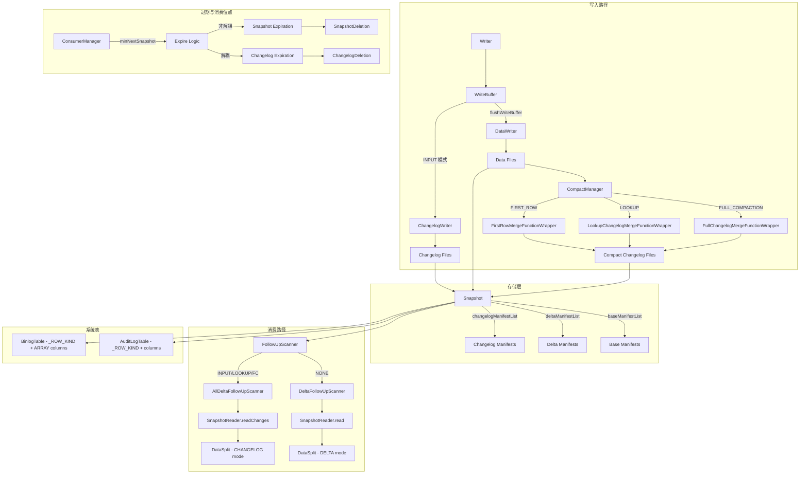

# Apache Paimon Changelog 机制全链路分析

> **代码版本**: 1.5-SNAPSHOT (master 分支, commit: 55f4fd175)
> **分析日期**: 2026-04-21
> **分析范围**: Changelog 的产生、存储、消费、过期全生命周期

---

## 目录

- [1. Changelog 的核心价值](#1-changelog-的核心价值)
  - [1.1 为什么 Paimon 需要原生 Changelog](#11-为什么-paimon-需要原生-changelog)
  - [1.2 流表二象性的基础设施](#12-流表二象性的基础设施)
  - [1.3 与 Iceberg CDC Scan 方案的根本差异](#13-与-iceberg-cdc-scan-方案的根本差异)
- [2. ChangelogProducer 四种模式总览](#2-changelogproducer-四种模式总览)
  - [2.1 枚举定义与配置入口](#21-枚举定义与配置入口)
  - [2.2 四种模式对比矩阵](#22-四种模式对比矩阵)
  - [2.3 模式选择决策树](#23-模式选择决策树)
- [3. NONE 模式 — 无 Changelog](#3-none-模式--无-changelog)
  - [3.1 DeltaFollowUpScanner 的工作方式](#31-deltafollowupscanner-的工作方式)
  - [3.2 局限性与适用场景](#32-局限性与适用场景)
- [4. INPUT 模式 — 输入双写](#4-input-模式--输入双写)
  - [4.1 MergeTreeWriter.flushWriteBuffer 中的双写实现](#41-mergetreewriterflushwritebuffer-中的双写实现)
  - [4.2 changelogWriter 的创建条件](#42-changelogwriter-的创建条件)
  - [4.3 Changelog 文件的独立存储](#43-changelog-文件的独立存储)
  - [4.4 DataIncrement 中的 changelogFiles](#44-dataincrement-中的-changelogfiles)
  - [4.5 设计决策与权衡](#45-设计决策与权衡)
- [5. FULL_COMPACTION 模式 — 全压缩比对](#5-full_compaction-模式--全压缩比对)
  - [5.1 FullChangelogMergeFunctionWrapper 核心逻辑](#51-fullchangelogmergefunctionwrapper-核心逻辑)
  - [5.2 topLevelKv 与 merged 的比对算法](#52-toplevelkv-与-merged-的比对算法)
  - [5.3 何时产生 INSERT/UPDATE/DELETE](#53-何时产生-insertupdatedelete)
  - [5.4 full-compaction.delta-commits 触发频率](#54-full-compactiondelta-commits-触发频率)
  - [5.5 设计决策与权衡](#55-设计决策与权衡)
- [6. LOOKUP 模式 — 查找式 Changelog 产生](#6-lookup-模式--查找式-changelog-产生)
  - [6.1 LookupChangelogMergeFunctionWrapper 核心逻辑](#61-lookupchangelogmergefunctionwrapper-核心逻辑)
  - [6.2 与 LookupLevels/LookupMergeFunction 的交互](#62-与-lookuplevelslookupmergefunction-的交互)
  - [6.3 Deletion Vector 的协同](#63-deletion-vector-的协同)
  - [6.4 为什么延迟低于 FULL_COMPACTION](#64-为什么延迟低于-full_compaction)
  - [6.5 LookupStrategy 的角色](#65-lookupstrategy-的角色)
  - [6.6 设计决策与权衡](#66-设计决策与权衡)
- [7. FirstRow Changelog — 首行去重](#7-firstrow-changelog--首行去重)
  - [7.1 FirstRowMergeFunctionWrapper 的 contains 检查](#71-firstrowmergefunctionwrapper-的-contains-检查)
  - [7.2 为什么只产生 INSERT Changelog](#72-为什么只产生-insert-changelog)
  - [7.3 设计决策](#73-设计决策)
- [8. Changelog 的存储架构](#8-changelog-的存储架构)
  - [8.1 Snapshot 中的 changelogManifestList 字段](#81-snapshot-中的-changelogmanifestlist-字段)
  - [8.2 Changelog 文件 vs Data 文件的分离存储](#82-changelog-文件-vs-data-文件的分离存储)
  - [8.3 ChangelogManager 的职责](#83-changelogmanager-的职责)
  - [8.4 Long-Lived Changelog 的独立生命周期](#84-long-lived-changelog-的独立生命周期)
  - [8.5 DataIncrement 与 CompactIncrement 的 Changelog 路径](#85-dataincrement-与-compactincrement-的-changelog-路径)
- [9. Changelog 的消费机制](#9-changelog-的消费机制)
  - [9.1 FollowUpScanner 体系](#91-followupscanner-体系)
  - [9.2 DeltaFollowUpScanner — NONE 模式消费](#92-deltafollowupscanner--none-模式消费)
  - [9.3 AllDeltaFollowUpScanner — 含 Changelog 的消费](#93-alldeltafollowupscanner--含-changelog-的消费)
  - [9.4 ScanMode 三态模型](#94-scanmode-三态模型)
  - [9.5 SnapshotReader.readChanges 的实现](#95-snapshotreaderreadchanges-的实现)
- [10. AuditLog 和 Binlog 系统表](#10-auditlog-和-binlog-系统表)
  - [10.1 AuditLogTable 的实现](#101-auditlogtable-的实现)
  - [10.2 BinlogTable 的实现差异](#102-binlogtable-的实现差异)
  - [10.3 设计决策](#103-设计决策)
- [11. Changelog 过期机制](#11-changelog-过期机制)
  - [11.1 changelog.time-retained 等配置](#111-changelogtime-retained-等配置)
  - [11.2 ExpireConfig 的解耦设计](#112-expireconfig-的解耦设计)
  - [11.3 ChangelogDeletion 的清理逻辑](#113-changelogdeletion-的清理逻辑)
  - [11.4 与 Snapshot 过期的协同](#114-与-snapshot-过期的协同)
- [12. Consumer 机制](#12-consumer-机制)
  - [12.1 ConsumerManager 的实现](#121-consumermanager-的实现)
  - [12.2 Consumer 的位点跟踪](#122-consumer-的位点跟踪)
  - [12.3 EXACTLY_ONCE vs AT_LEAST_ONCE](#123-exactly_once-vs-at_least_once)
  - [12.4 Consumer 与 Changelog 过期的协同](#124-consumer-与-changelog-过期的协同)
- [13. 增量读取](#13-增量读取)
  - [13.1 IncrementalSplit 的结构](#131-incrementalsplit-的结构)
  - [13.2 IncrementalBetweenScanMode 四种子模式](#132-incrementalbetweenscanmode-四种子模式)
  - [13.3 before/after 文件的差异计算](#133-beforeafter-文件的差异计算)
- [14. 与 Iceberg CDC 能力的深度对比](#14-与-iceberg-cdc-能力的深度对比)
  - [14.1 架构理念差异](#141-架构理念差异)
  - [14.2 延迟/准确性/资源开销对比](#142-延迟准确性资源开销对比)
  - [14.3 选型建议](#143-选型建议)
- [15. 架构全景图](#15-架构全景图)

---

## 1. Changelog 的核心价值

### 解决什么问题

**核心业务问题**: 在 LSM 树存储架构中，同一主键的多次更新分散在不同层级的文件中，最终通过 Merge 操作得到最新值。这个过程会"吞噬"数据的变更语义 — 下游系统无法区分一条记录是新插入的、更新的、还是被删除的。

**没有这个设计的后果**:
1. 流式消费者只能看到合并后的最终状态，无法感知数据变化过程
2. CDC 场景无法实现 — 无法将 Paimon 表作为变更数据源
3. 下游系统需要自己维护历史状态来推导变更，增加复杂度和延迟
4. 无法支持 Flink CDC 生态集成

**实际场景**:
- 电商订单表：需要区分新订单（INSERT）和订单状态更新（UPDATE）
- 用户画像表：需要追踪用户属性的变更历史
- 数据同步：将 Paimon 表的变更实时同步到 MySQL/Elasticsearch
- 审计日志：记录所有数据变更操作用于合规审计

### 有什么坑

**误区陷阱**:
1. **误以为 DELTA 模式就是 CDC**: DELTA 只是文件级别的增量，所有记录都是 `+I`，没有 UPDATE/DELETE 语义
2. **混淆 Changelog 文件和数据文件**: Changelog 文件是独立的，有自己的生命周期和过期策略
3. **认为所有 Snapshot 都有 Changelog**: FULL_COMPACTION 模式下，只有触发全压缩的 Snapshot 才有 Changelog

**错误配置**:
1. 在 Append-Only 表上开启 Changelog（浪费资源）
2. 使用 INPUT 模式但上游数据缺少完整 CDC 语义（导致 Changelog 不准确）
3. FULL_COMPACTION 模式下未配置 `full-compaction.delta-commits`（导致 Changelog 延迟过高）

**生产环境注意事项**:
1. Changelog 文件会占用额外存储空间（约等于数据文件大小）
2. INPUT 模式有 2x 写放大，需要评估 I/O 容量
3. LOOKUP 模式需要维护本地索引，占用磁盘空间
4. 需要合理配置 Changelog 过期策略，避免无限增长

**性能陷阱**:
1. FULL_COMPACTION 模式下频繁触发全压缩会导致 CPU 和 I/O 飙升
2. LOOKUP 模式在键空间很大时，Lookup I/O 开销显著
3. 未配置 Consumer 位点保护，导致 Changelog 被提前清理

### 核心概念解释

**Changelog (变更日志)**:
- 记录数据变更的独立文件，每条记录带有 RowKind 标记（`+I`/`-U`/`+U`/`-D`）
- 与数据文件分离存储，有独立的 Manifest 管理
- 通过 Snapshot 的 `changelogManifestList` 字段引用

**RowKind (行类型)**:
- `+I` (INSERT): 新插入的记录
- `-U` (UPDATE_BEFORE): 更新前的旧值
- `+U` (UPDATE_AFTER): 更新后的新值
- `-D` (DELETE): 被删除的记录

**流表二象性 (Stream-Table Duality)**:
- 表视角：通过 Snapshot 读取某一时刻的完整数据（批处理）
- 流视角：通过 Changelog 读取两个 Snapshot 之间的变更（流处理）
- 同一套存储，两种消费方式

**与其他系统对比**:
- **Kafka**: 纯流式系统，只有 Changelog，没有表视角
- **Iceberg**: 表系统，通过文件 diff 推导变更，不是原生 CDC
- **Hudi**: 支持 MOR (Merge-On-Read) 表的增量查询，但 CDC 语义不如 Paimon 精确
- **Paimon**: 原生支持行级别 CDC，流表二象性的完整实现

### 设计理念

**为什么这样设计**:
1. **预计算 vs 动态计算**: 将 Changelog 生成前移到写入/压缩阶段，读取时零额外开销。动态计算需要每次读取时比对历史状态，对高频流式消费不可接受
2. **独立存储**: Changelog 文件与数据文件分离，可以有不同的格式、压缩算法、过期策略
3. **原子性保证**: Changelog 与 Snapshot 一起提交，确保一致性
4. **多模式支持**: 不同场景有不同的延迟/成本权衡，提供 4 种模式供选择

**权衡取舍**:
- **存储 vs 性能**: 额外的 Changelog 文件换取读取时的零开销
- **写入成本 vs 读取延迟**: INPUT 模式写放大 2x，但延迟最低；FULL_COMPACTION 无额外写入，但延迟高
- **精确性 vs 复杂度**: LOOKUP 模式需要维护索引，但能自动推导精确的 UPDATE 语义

**架构演进**:
1. **早期**: 只有 NONE 和 INPUT 模式，要么无 Changelog，要么依赖上游 CDC
2. **引入 FULL_COMPACTION**: 支持自动推导 Changelog，但延迟高
3. **引入 LOOKUP**: 平衡延迟和成本，成为推荐的默认模式
4. **Long-Lived Changelog**: 解耦 Changelog 和 Snapshot 的生命周期，支持更灵活的过期策略

**业界对比**:
- **Debezium + Kafka**: 专门的 CDC 工具，但需要额外的基础设施
- **Flink CDC**: 从数据库读取 Binlog，但不支持湖存储
- **Paimon Changelog**: 将 CDC 能力内置到湖存储中，统一批流处理

### 1.1 为什么 Paimon 需要原生 Changelog

Paimon 的设计目标是构建 **Realtime Lakehouse Architecture**，核心挑战在于：主键表 (Primary Key Table) 使用 LSM 树存储数据，多次写入的同一主键记录分布在不同层级 (Level) 的文件中，最终通过合并 (Merge) 才能得到最新值。如果下游消费者只能看到合并后的结果，就无法知道一条记录是新插入的、还是更新的、还是被删除的。

**核心问题**: LSM 树的 Merge 操作会"吞噬"变更语义 — 下游无法区分 INSERT、UPDATE、DELETE。

**解决方案**: Paimon 在数据写入和压缩过程中，主动产生带有 RowKind 语义（`+I`、`-U`、`+U`、`-D`）的独立 Changelog 文件，使得下游流式消费者能够准确还原数据变更历史。

**为什么不在读取时动态计算**: 动态计算 Changelog 需要将当前合并结果与历史状态进行比对，这意味着每次读取都要额外 I/O 和计算，对于高频流式消费不可接受。预计算 Changelog 将成本前移到写入/压缩阶段，读取时零额外开销。

**好处**:
- 流式消费者直接读取预计算的 Changelog 文件，延迟低至 checkpoint 间隔级别
- Changelog 文件可独立管理生命周期，不影响数据文件的压缩策略
- 支持 Flink CDC 生态，Paimon 表可以作为一等的 CDC 源

### 1.2 流表二象性的基础设施

Paimon 的 Changelog 机制是实现**流表二象性 (Stream-Table Duality)** 的基础设施：

- **表视角**: 通过 Snapshot 读取某一时刻的完整数据（Batch Query）
- **流视角**: 通过 Changelog 读取两个 Snapshot 之间的数据变更（Stream Read）

这两种视角共享同一套底层存储，Changelog 只是在 Snapshot 之上增加了变更语义的元数据层。

**源码证据**: `ScanMode` 枚举（`paimon-core/.../table/source/ScanMode.java`）定义了三种扫描模式：
- `ALL` — 扫描 Snapshot 的全量数据文件（表视角）
- `DELTA` — 只扫描新变更的文件（增量视角，不含 RowKind 语义）
- `CHANGELOG` — 只扫描 Changelog 文件（流视角，含 RowKind 语义）

### 1.3 与 Iceberg CDC Scan 方案的根本差异

Iceberg 的增量读取（Incremental Scan）采用的是"事后推导"策略：通过比对两个 Snapshot 之间的文件变更，推导出哪些行被添加或删除。这种方式的本质是**文件级别的 diff**，而非**行级别的 CDC**。

Paimon 的 Changelog 是**行级别的预计算 CDC 流**：在写入/压缩过程中就确定了每一行的 RowKind（INSERT/UPDATE_BEFORE/UPDATE_AFTER/DELETE），下游直接消费。

关键差异在后续章节 [14. 与 Iceberg CDC 能力的深度对比](#14-与-iceberg-cdc-能力的深度对比) 中详细展开。

---

## 2. ChangelogProducer 四种模式总览

### 解决什么问题

**核心业务问题**: 不同的业务场景对 Changelog 的延迟、准确性、成本有不同的要求。单一的 Changelog 生成策略无法满足所有场景。

**没有这个设计的后果**:
1. 低延迟场景被迫接受高成本（如强制使用 INPUT 双写）
2. 成本敏感场景被迫接受高延迟（如只能用 FULL_COMPACTION）
3. 无法根据上游数据特征选择最优策略
4. 用户需要自己实现不同的 Changelog 生成逻辑

**实际场景**:
- **实时大屏**: 需要秒级延迟，可以接受 INPUT 模式的写放大
- **数据仓库同步**: 分钟级延迟可接受，希望降低写入成本
- **审计日志**: 需要精确的变更记录，但对延迟不敏感
- **去重场景**: 只需要 INSERT 语义，不需要 UPDATE/DELETE

### 有什么坑

**误区陷阱**:
1. **认为 LOOKUP 模式适用于所有场景**: FirstRow 合并引擎不支持 LOOKUP
2. **混淆模式的触发时机**: INPUT 在 flush 时产生，LOOKUP 在 L0 压缩时产生，FULL_COMPACTION 在全压缩时产生
3. **误以为可以动态切换模式**: 切换模式后，历史 Changelog 不会重新生成

**错误配置**:
1. 在 INSERT-only 流上使用 INPUT 模式配合 Deduplicate 引擎（Changelog 中看不到去重效果）
2. FULL_COMPACTION 模式下未配置触发频率（导致长时间无 Changelog）
3. LOOKUP 模式下未配置 Lookup 索引类型（默认可能不是最优）

**生产环境注意事项**:
1. 模式切换需要重启作业，且不影响历史数据
2. 不同模式的 Changelog 文件大小差异很大（INPUT ≈ 数据文件，FULL_COMPACTION 可能更小）
3. 需要监控 Changelog 产生的频率和延迟

**性能陷阱**:
1. INPUT 模式在高吞吐场景下，双写 I/O 可能成为瓶颈
2. LOOKUP 模式在键空间很大时，索引维护成本高
3. FULL_COMPACTION 模式在压缩间隔过长时，单次产生的 Changelog 过大

### 核心概念解释

**ChangelogProducer (Changelog 生成器)**:
- 控制 Changelog 的生成策略
- 通过 `changelog-producer` 配置项设置
- 四种模式：NONE、INPUT、FULL_COMPACTION、LOOKUP

**模式触发时机**:
- **NONE**: 不产生 Changelog
- **INPUT**: 每次 flush 写缓冲时产生
- **FULL_COMPACTION**: 每次全压缩时产生
- **LOOKUP**: 每次涉及 L0 的压缩时产生

**写放大 (Write Amplification)**:
- 指数据写入磁盘的次数与实际数据量的比值
- INPUT 模式：~2x（数据文件 + Changelog 文件）
- LOOKUP/FULL_COMPACTION：压缩时产生，不增加 flush 阶段的写放大

**与其他系统对比**:
- **Hudi**: 只有类似 INPUT 的模式（依赖上游 CDC）
- **Iceberg**: 无原生 Changelog，只能通过文件 diff 推导
- **Delta Lake**: 支持 CDF (Change Data Feed)，类似 Paimon 的 FULL_COMPACTION 模式

### 设计理念

**为什么提供多种模式**:
1. **延迟敏感场景**: INPUT 模式提供最低延迟（checkpoint 级别）
2. **成本敏感场景**: FULL_COMPACTION 模式无额外写入开销
3. **平衡场景**: LOOKUP 模式在延迟和成本之间取得平衡
4. **特殊场景**: NONE 模式用于不需要 CDC 的场景

**权衡取舍**:
- **INPUT**: 延迟最低，但写放大 2x，且依赖上游 CDC 质量
- **LOOKUP**: 延迟中等，需要维护索引，但能自动推导精确 CDC
- **FULL_COMPACTION**: 延迟最高，但无额外写入，适合批处理场景
- **NONE**: 零开销，但无 CDC 能力

**架构演进**:
1. **v1.0**: 只有 NONE 和 INPUT 模式
2. **v1.2**: 引入 FULL_COMPACTION 模式，支持自动推导
3. **v1.4**: 引入 LOOKUP 模式，成为推荐的默认选择
4. **未来**: 可能引入更细粒度的混合模式（如部分分区用 INPUT，部分用 LOOKUP）

**业界对比**:
- **Flink State Backend**: 也有多种实现（HashMap/RocksDB），根据场景选择
- **Kafka Compaction**: 只有一种策略，不够灵活
- **Paimon**: 提供多种策略，用户根据需求选择

### 2.1 枚举定义与配置入口

**源码路径**: `paimon-api/src/main/java/org/apache/paimon/CoreOptions.java` (行 3948-3976)

```java
public enum ChangelogProducer implements DescribedEnum {
    NONE("none", "No changelog file."),
    INPUT("input", "Double write to a changelog file when flushing memory table, the changelog is from input."),
    FULL_COMPACTION("full-compaction", "Generate changelog files with each full compaction."),
    LOOKUP("lookup", "Generate changelog files through 'lookup' compaction.");
}
```

**配置入口** (行 902-909):
```java
public static final ConfigOption<ChangelogProducer> CHANGELOG_PRODUCER =
        key("changelog-producer")
                .enumType(ChangelogProducer.class)
                .defaultValue(ChangelogProducer.NONE)
                .withDescription("Whether to double write to a changelog file...");
```

**为什么默认是 NONE**: 不是所有场景都需要 Changelog。对于纯批处理或只关心最新快照的场景，产生 Changelog 是不必要的开销。默认 NONE 确保了零额外成本，用户根据需求显式开启。

### 2.2 四种模式对比矩阵

| 维度 | NONE | INPUT | FULL_COMPACTION | LOOKUP |
|------|------|-------|-----------------|--------|
| **Changelog 产生时机** | 不产生 | flush 写缓冲时 | 全压缩时 | Lookup 压缩时 |
| **Changelog 来源** | 无 | 原始输入 | 新旧值比对 | 查找+比对 |
| **延迟** | N/A | 最低(checkpoint 级) | 高(取决于压缩间隔) | 中等(每次 L0 压缩) |
| **准确性** | N/A | 取决于输入质量 | 精确 | 精确 |
| **写放大** | 无 | ~2x | 压缩时产生 | 压缩时产生 |
| **额外资源** | 无 | 双写 I/O | 全压缩计算 | Lookup I/O |
| **适用 MergeEngine** | 所有 | 所有(但 deduplicate 需注意) | 所有(有主键表) | 除 first-row 外 |

### 2.3 模式选择决策树

```
需要流式 CDC 消费?
├── 否 → NONE (默认，零开销)
└── 是 → 上游数据自带完整 CDC 语义 (如 MySQL CDC)?
    ├── 是 → INPUT (最低延迟，直接双写输入)
    └── 否 → 能接受较高延迟?
        ├── 是 → FULL_COMPACTION (最精确，但延迟大)
        └── 否 → LOOKUP (折中方案，延迟与准确性兼顾)
```

---

## 3. NONE 模式 — 无 Changelog

### 解决什么问题

**核心业务问题**: 不是所有场景都需要 CDC 语义。对于只关心最新快照的批处理场景，或者 Append-Only 表，产生 Changelog 是不必要的开销。

**没有这个设计的后果**:
1. 所有表都被强制产生 Changelog，浪费存储和计算资源
2. 无法为纯批处理场景优化性能
3. Append-Only 表也需要承担 Changelog 的开销

**实际场景**:
- 日志表：只追加，不更新，不需要 CDC 语义
- 数据湖归档：只做批处理查询，不需要流式消费
- 临时表：短期使用，不需要变更追踪
- 测试环境：不需要完整的 CDC 能力

### 有什么坑

**误区陷阱**:
1. **认为 NONE 模式无法流式消费**: 可以通过 DeltaFollowUpScanner 消费增量文件，只是没有 RowKind 语义
2. **混淆 DELTA 和 CHANGELOG**: DELTA 是文件级别的增量，CHANGELOG 是行级别的 CDC
3. **认为 NONE 模式下 readChanges() 会失败**: 实际上会降级为读取 DELTA 文件

**错误配置**:
1. 在需要 CDC 的场景下使用 NONE 模式（导致下游无法区分变更类型）
2. 在主键表上使用 NONE 模式进行流式消费（只能看到 INSERT，看不到 UPDATE/DELETE）

**生产环境注意事项**:
1. NONE 模式下，COMPACT 类型的 Snapshot 会被跳过（不包含新数据）
2. OVERWRITE 类型的 Snapshot 默认不读取（除非开启 `streaming-read-overwrite`）
3. 流式消费只能看到文件级别的增量，无法感知行级别的变更

**性能陷阱**:
1. 在主键表上使用 NONE 模式，下游可能需要自己维护状态来推导变更（增加下游复杂度）
2. 如果后续需要切换到其他模式，历史数据不会有 Changelog

### 核心概念解释

**DeltaFollowUpScanner (增量跟踪扫描器)**:
- NONE 模式下的流式消费实现
- 只扫描 APPEND 类型的 Snapshot
- 跳过 COMPACT 和 OVERWRITE 类型的 Snapshot
- 使用 ScanMode.DELTA 模式读取增量文件

**ScanMode.DELTA (增量扫描模式)**:
- 只读取 Snapshot 的 deltaManifestList 中的文件
- 所有记录的 RowKind 都是 `+I` (INSERT)
- 不包含 UPDATE/DELETE 语义

**Snapshot.CommitKind (提交类型)**:
- **APPEND**: 新增数据的提交
- **COMPACT**: 压缩操作的提交（不包含新数据）
- **OVERWRITE**: 覆盖写的提交

**与其他系统对比**:
- **Iceberg Incremental Scan**: 类似 Paimon 的 NONE 模式，只能看到文件变更
- **Hudi Incremental Query**: 支持 MOR 表的增量查询，但也只是文件级别
- **Paimon NONE**: 最简单的增量读取，零额外开销

### 设计理念

**为什么需要 NONE 模式**:
1. **零开销原则**: 不需要的功能不应该有任何成本
2. **灵活性**: 用户可以根据需求选择是否开启 Changelog
3. **兼容性**: 支持纯批处理和 Append-Only 场景

**权衡取舍**:
- **优点**: 零额外存储和计算开销
- **缺点**: 无法提供行级别的 CDC 语义
- **适用场景**: Append-Only 表、纯批处理、不需要 CDC 的场景

**架构演进**:
1. **早期**: NONE 是唯一的模式
2. **引入 INPUT**: 支持 CDC，但需要上游提供
3. **引入 LOOKUP/FULL_COMPACTION**: 支持自动推导 CDC
4. **现在**: NONE 作为默认模式，确保零开销

**业界对比**:
- **Kafka**: 没有"无 Changelog"的概念，所有数据都是流
- **Iceberg**: 默认就是类似 NONE 的模式，需要额外工作才能获得 CDC
- **Paimon**: 提供显式的 NONE 模式，明确表达"不需要 CDC"的意图

### 3.1 DeltaFollowUpScanner 的工作方式

**源码路径**: `paimon-core/.../table/source/snapshot/DeltaFollowUpScanner.java`

NONE 模式下不产生任何 Changelog 文件。流式读取使用 `DeltaFollowUpScanner`，它只关注 `APPEND` 类型的 Snapshot：

```java
@Override
public boolean shouldScanSnapshot(Snapshot snapshot) {
    if (snapshot.commitKind() == Snapshot.CommitKind.APPEND) {
        return true;
    }
    LOG.debug("Next snapshot id {} is not APPEND, but is {}, check next one.",
            snapshot.id(), snapshot.commitKind());
    return false;
}

@Override
public SnapshotReader.Plan scan(Snapshot snapshot, SnapshotReader snapshotReader) {
    return snapshotReader.withMode(ScanMode.DELTA).withSnapshot(snapshot).read();
}
```

**为什么只处理 APPEND**: COMPACT 类型的 Snapshot 不引入新数据，只是重组文件。OVERWRITE 是覆盖写，在 NONE 模式下默认不读取（除非显式开启 `streaming-read-overwrite`）。

### 3.2 局限性与适用场景

- 流式消费只能看到文件级别的增量，所有行都以 `+I` (INSERT) 形式出现
- 无法区分新插入和更新，无法产生 `-D` (DELETE) 记录
- 适用于 Append-Only 表或只需要增量文件追踪的场景

---

## 4. INPUT 模式 — 输入双写

### 解决什么问题

**核心业务问题**: 当上游数据源已经提供了完整的 CDC 流（如 MySQL Binlog、Flink CDC），如何以最低延迟将这些 CDC 语义保留到 Paimon 表中。

**没有这个设计的后果**:
1. 需要等待压缩才能产生 Changelog，延迟高（分钟级）
2. 上游的精确 CDC 语义被丢失，需要重新推导
3. 无法支持实时 CDC 管道（如实时数据同步）
4. 增加了不必要的计算开销（重新推导已知的变更类型）

**实际场景**:
- MySQL CDC → Paimon：保留 Binlog 的 INSERT/UPDATE/DELETE 语义
- Flink CDC 管道：将上游的 CDC 流直接写入 Paimon
- 实时数据同步：秒级延迟的数据同步到下游系统
- 实时大屏：需要最低延迟的数据更新

### 有什么坑

**误区陷阱**:
1. **认为 INPUT 模式适用于所有场景**: 如果上游是 INSERT-only 流配合 Deduplicate 引擎，Changelog 中看不到去重效果
2. **混淆双写的时机**: 双写发生在 flush 写缓冲时，不是每条记录写入时
3. **认为 Changelog 文件和数据文件内容完全相同**: 它们包含相同的记录，但文件格式和压缩可能不同

**错误配置**:
1. 上游数据缺少完整 CDC 语义（如只有 INSERT，没有 UPDATE_BEFORE）
2. 未配置 Changelog 文件的独立格式和压缩（可能不是最优）
3. 在低延迟要求的场景下使用其他模式（错失 INPUT 的优势）

**生产环境注意事项**:
1. 写放大约 2x，需要评估 I/O 容量（特别是高吞吐场景）
2. Changelog 文件大小约等于数据文件大小，需要额外存储空间
3. 如果上游 CDC 质量不高（如缺少 UPDATE_BEFORE），下游消费会有问题
4. 需要监控双写的成功率，确保 Changelog 和数据文件一致

**性能陷阱**:
1. 高吞吐场景下，双写 I/O 可能成为瓶颈
2. 如果 Changelog 文件格式配置不当，可能导致写入性能下降
3. 频繁的 flush 操作会产生大量小文件（需要配合压缩策略）

### 核心概念解释

**双写 (Double Write)**:
- 在 flush 写缓冲时，同时将数据写入数据文件和 Changelog 文件
- 两个文件包含相同的记录，但用途不同
- 数据文件用于批处理查询，Changelog 文件用于流式消费

**WriteBuffer (写缓冲)**:
- 内存中的排序缓冲区，累积写入的数据
- 达到阈值或 checkpoint 时触发 flush
- flush 时将排序好的数据持久化到磁盘

**RollingFileWriter (滚动文件写入器)**:
- 当文件大小达到阈值时自动滚动创建新文件
- 避免单个文件过大
- 支持并行读取

**DataIncrement (数据增量)**:
- 封装一次提交的增量信息
- 包含新增文件、删除文件、Changelog 文件
- INPUT 模式的 Changelog 文件放在 DataIncrement 中（而非 CompactIncrement）

**与其他系统对比**:
- **Hudi Copy-On-Write**: 也是双写，但写入的是完整的新文件（不是增量）
- **Delta Lake**: 不支持类似的双写机制
- **Paimon INPUT**: 双写增量数据，保留上游 CDC 语义

### 设计理念

**为什么在 flush 时双写**:
1. **最低延迟**: flush 是数据持久化的唯一路径，在这里双写确保 Changelog 与数据同步产生
2. **一次排序**: WriteBuffer 的排序和合并只执行一次，结果同时输出到两个 Writer
3. **内存效率**: 不增加额外的内存压力，只是多一个输出目标
4. **原子性**: 两个文件在同一个事务中提交，确保一致性

**权衡取舍**:
- **优点**: 延迟最低（checkpoint 级别），保留上游 CDC 语义
- **缺点**: 写放大 2x，依赖上游 CDC 质量
- **适用场景**: 上游有完整 CDC，需要低延迟

**架构演进**:
1. **v1.0**: 引入 INPUT 模式，支持基本的双写
2. **v1.2**: 支持 Changelog 文件的独立配置（格式、压缩）
3. **v1.4**: 优化双写性能，减少内存拷贝
4. **未来**: 可能支持异步双写，进一步降低延迟

**业界对比**:
- **Debezium**: 专门的 CDC 工具，但需要额外的 Kafka 集群
- **Flink CDC**: 从数据库读取 Binlog，但不支持湖存储
- **Paimon INPUT**: 将上游 CDC 直接写入湖存储，统一批流处理

### 4.1 MergeTreeWriter.flushWriteBuffer 中的双写实现

**源码路径**: `paimon-core/.../mergetree/MergeTreeWriter.java` (行 209-249)

INPUT 模式的核心在于 `flushWriteBuffer` 方法中的**双写 (Double Write)** 机制：

```java
private void flushWriteBuffer(boolean waitForLatestCompaction, boolean forcedFullCompaction)
        throws Exception {
    if (writeBuffer.size() > 0) {
        // ... 

        // 关键: 仅当 changelogProducer == INPUT 时创建 changelogWriter
        final RollingFileWriter<KeyValue, DataFileMeta> changelogWriter =
                changelogProducer == ChangelogProducer.INPUT
                        ? writerFactory.createRollingChangelogFileWriter(0)
                        : null;
        final RollingFileWriter<KeyValue, DataFileMeta> dataWriter =
                writerFactory.createRollingMergeTreeFileWriter(0, FileSource.APPEND);

        try {
            // 关键: forEach 同时将数据写入 dataWriter 和 changelogWriter
            writeBuffer.forEach(
                    keyComparator,
                    mergeFunction,
                    changelogWriter == null ? null : changelogWriter::write,
                    dataWriter::write);
        } finally {
            writeBuffer.clear();
            if (changelogWriter != null) {
                changelogWriter.close();
            }
            dataWriter.close();
        }

        // 收集 changelog 文件
        if (changelogWriter != null) {
            newFilesChangelog.addAll(changelogWriter.result());
        }

        // 收集数据文件并注册到 compactManager
        for (DataFileMeta fileMeta : dataWriter.result()) {
            newFiles.add(fileMeta);
            compactManager.addNewFile(fileMeta);
        }
    }
    // ...
}
```

**为什么在 flushWriteBuffer 中实现**: 这是将内存中排序好的 WriteBuffer 持久化到磁盘的唯一路径。在这个点上双写确保了：
1. Changelog 和数据文件包含完全相同的记录
2. WriteBuffer 的排序和合并操作只执行一次，结果同时输出到两个 Writer
3. 不增加额外的内存压力

### 4.2 changelogWriter 的创建条件

```java
final RollingFileWriter<KeyValue, DataFileMeta> changelogWriter =
        changelogProducer == ChangelogProducer.INPUT
                ? writerFactory.createRollingChangelogFileWriter(0)
                : null;
```

**创建条件极其简单**: 当且仅当 `changelogProducer == INPUT` 时创建。这个判断发生在每次 flush 操作中，确保非 INPUT 模式下零开销。

**为什么用 `createRollingChangelogFileWriter(0)`**: 
- `Rolling` 表示文件大小达到阈值时自动滚动创建新文件
- `Changelog` 前缀确保文件命名与数据文件区分（由 `changelog-file.prefix` 配置，默认 `"changelog-"`）
- 参数 `0` 表示 Level 0

### 4.3 Changelog 文件的独立存储

Changelog 文件通过以下配置项实现独立存储控制：

| 配置项 | 默认值 | 说明 |
|--------|--------|------|
| `changelog-file.prefix` | `"changelog-"` | 文件名前缀（行 345-349） |
| `changelog-file.format` | null (使用数据文件格式) | 独立文件格式 |
| `changelog-file.compression` | null (使用数据文件压缩) | 独立压缩算法 |
| `changelog-file.stats-mode` | null | 独立统计信息模式 |

**为什么支持独立配置**: Changelog 文件的读取模式与数据文件不同。数据文件通常做全表扫描/点查，需要列式存储；Changelog 文件通常做顺序扫描，可以选择更适合顺序读取的格式和压缩策略。

### 4.4 DataIncrement 中的 changelogFiles

**源码路径**: `paimon-core/.../io/DataIncrement.java` (行 30-56)

```java
public class DataIncrement {
    private final List<DataFileMeta> newFiles;      // 新数据文件
    private final List<DataFileMeta> deletedFiles;   // 删除的数据文件
    private final List<DataFileMeta> changelogFiles; // Changelog 文件
    private final List<IndexFileMeta> newIndexFiles;
    private final List<IndexFileMeta> deletedIndexFiles;
}
```

INPUT 模式产生的 Changelog 文件放在 `DataIncrement.changelogFiles` 中（而非 `CompactIncrement`），因为它们是在数据写入阶段产生的，与压缩无关。

### 4.5 设计决策与权衡

**为什么选择 INPUT 模式**:
- **最低延迟**: Changelog 在每次 flush 时产生，与数据写入同步，延迟等于 checkpoint 间隔
- **最小复杂度**: 不需要额外的查找或比对逻辑

**局限性**:
- INPUT 模式的 Changelog 来自输入数据，如果输入本身不携带完整 CDC 语义（如缺少 UPDATE_BEFORE），Changelog 就不完整
- 写放大约 2x — 每条记录既写入数据文件，又写入 Changelog 文件
- 不适合 INSERT-only 的输入流配合 Deduplicate 引擎（因为输入全是 `+I`，Changelog 中看不到旧值）

---

## 5. FULL_COMPACTION 模式 — 全压缩比对

### 解决什么问题

**核心业务问题**: 当上游数据不包含完整 CDC 语义（如只有 INSERT），如何通过比对新旧值自动推导出精确的 INSERT/UPDATE/DELETE 语义。

**没有这个设计的后果**:
1. 只能使用 INPUT 模式，但上游数据可能不包含完整 CDC
2. 下游需要自己维护历史状态来推导变更，增加复杂度
3. 无法支持 INSERT-only 流的 CDC 化
4. 无法为批处理场景提供精确的变更记录

**实际场景**:
- INSERT-only 流 + Deduplicate 引擎：自动推导去重后的变更
- 批量导入场景：将批量数据的变更转换为 CDC 流
- 数据修复：修复历史数据后生成变更记录
- 审计日志：需要精确的变更记录，但对延迟不敏感

### 有什么坑

**误区陷阱**:
1. **认为每次提交都会产生 Changelog**: 只有全压缩时才产生，其他提交没有 Changelog
2. **混淆 topLevelKv 和 merged**: topLevelKv 是最高层级的旧值，merged 是合并后的新值
3. **认为 FULL_COMPACTION 延迟低**: 延迟取决于全压缩频率，通常为分钟级

**错误配置**:
1. 未配置 `full-compaction.delta-commits`（导致全压缩频率不可控）
2. 配置过小的 delta-commits（导致频繁全压缩，CPU 和 I/O 飙升）
3. 配置过大的 delta-commits（导致 Changelog 延迟过高）
4. 未配置 `changelog-producer.row-deduplicate`（产生冗余的 UPDATE Changelog）

**生产环境注意事项**:
1. 全压缩是重量级操作，需要读取所有层级的文件
2. 单次全压缩可能产生大量 Changelog，导致下游压力
3. 需要监控全压缩的频率和耗时
4. 某些 Snapshot 没有 Changelog，流式消费会降级为 DELTA 模式

**性能陷阱**:
1. 频繁的全压缩会导致 CPU 和 I/O 飙升
2. 全压缩期间可能阻塞写入（取决于压缩策略）
3. 如果键空间很大，valueEqualiser 的比较开销显著

### 核心概念解释

**全压缩 (Full Compaction)**:
- 将所有层级的文件合并为一个新的文件
- 在 LSM 树中称为 Universal Compaction
- 是唯一能看到"所有层级数据"的时机

**topLevelKv (最高层级键值)**:
- 来自最高层级 (maxLevel) 的记录
- 代表"上次全压缩之后的值"（旧值）
- 用于与合并后的新值比对

**merged (合并后的值)**:
- 通过 MergeFunction 合并所有层级的记录得到的最终值
- 代表"本次全压缩之后的值"（新值）
- 用于与旧值比对产生 Changelog

**valueEqualiser (值比较器)**:
- 用于比较新旧值是否相同
- 如果相同，则不产生 UPDATE Changelog（去重）
- 可以通过 `changelog-producer.row-deduplicate-ignore-fields` 忽略某些字段

**与其他系统对比**:
- **Hudi MOR**: 也是通过压缩时比对产生 Changelog，但实现不同
- **Delta Lake CDF**: 类似的机制，但只在 MERGE/UPDATE/DELETE 操作时产生
- **Paimon FULL_COMPACTION**: 在全压缩时自动推导，无需显式操作

### 设计理念

**为什么在全压缩时比对**:
1. **完整视图**: 全压缩是唯一能看到所有层级数据的时机
2. **精确推导**: 通过比对新旧值，可以精确推导 INSERT/UPDATE/DELETE
3. **无需上游 CDC**: 不依赖上游数据的 CDC 语义
4. **批处理友好**: 适合批量导入和数据修复场景

**权衡取舍**:
- **优点**: 精确的 CDC 语义，不依赖上游，无额外写入开销
- **缺点**: 延迟高（取决于全压缩频率），全压缩本身有较高开销
- **适用场景**: 对延迟不敏感，需要精确 CDC，上游无 CDC

**架构演进**:
1. **v1.2**: 引入 FULL_COMPACTION 模式
2. **v1.3**: 支持 `full-compaction.delta-commits` 控制频率
3. **v1.4**: 引入 `changelog-producer.row-deduplicate` 去重优化
4. **未来**: 可能支持增量压缩时的部分 Changelog 生成

**业界对比**:
- **Hudi Compaction**: 也在压缩时产生 Changelog，但机制不同
- **Delta Lake MERGE**: 需要显式的 MERGE 操作，不是自动的
- **Paimon FULL_COMPACTION**: 自动在全压缩时推导，无需额外操作

### 5.1 FullChangelogMergeFunctionWrapper 核心逻辑

**源码路径**: `paimon-core/.../mergetree/compact/FullChangelogMergeFunctionWrapper.java`

这个 Wrapper 包装在 `MergeFunction` 之上，在全压缩过程中通过比对"最高层级旧值" (topLevelKv) 和"合并后新值" (merged) 来产生 Changelog。

```java
public class FullChangelogMergeFunctionWrapper implements MergeFunctionWrapper<ChangelogResult> {
    private final MergeFunction<KeyValue> mergeFunction;
    private final int maxLevel;
    @Nullable private final RecordEqualiser valueEqualiser;

    // 关键字段
    private KeyValue topLevelKv;  // 来自最高层级的旧值
    private KeyValue initialKv;   // 第一条记录
    private boolean isInitialized;
}
```

### 5.2 topLevelKv 与 merged 的比对算法

`add()` 方法分离出最高层级的 KV：

```java
@Override
public void add(KeyValue kv) {
    if (maxLevel == kv.level()) {
        Preconditions.checkState(topLevelKv == null, 
                "Top level key-value already exists!");
        topLevelKv = kv;  // 记录来自最高层级的旧值
    }

    if (initialKv == null) {
        initialKv = kv;
    } else {
        if (!isInitialized) {
            merge(initialKv);
            isInitialized = true;
        }
        merge(kv);
    }
}
```

**为什么 topLevelKv 代表"旧值"**: 在 LSM 树的全压缩中（Universal Compaction），最高层级 (maxLevel) 的文件包含的是之前压缩沉淀下来的"历史最终值"。新写入的数据在 Level 0，逐步通过压缩下沉到更高层级。因此 maxLevel 的记录就是"上次全压缩之后的值"。

**注意**: 源码中 `add()` 方法还维护了 `initialKv` 和 `isInitialized` 标志，用于处理只有一条记录的情况。当只有一条记录时，不需要调用 `mergeFunction.add()`，直接在 `getResult()` 中处理。

### 5.3 何时产生 INSERT/UPDATE/DELETE

`getResult()` 方法的核心逻辑（行 97-126）：

```java
@Override
public ChangelogResult getResult() {
    reusedResult.reset();
    if (isInitialized) {
        KeyValue merged = mergeFunction.getResult();
        if (topLevelKv == null) {
            // 场景1: 无旧值，合并结果为 ADD → 新增记录
            if (merged.isAdd()) {
                reusedResult.addChangelog(replace(reusedAfter, RowKind.INSERT, merged));
            }
        } else {
            if (!merged.isAdd()) {
                // 场景2: 有旧值，合并结果为 RETRACT → 删除记录
                reusedResult.addChangelog(replace(reusedBefore, RowKind.DELETE, topLevelKv));
            } else if (valueEqualiser == null 
                    || !valueEqualiser.equals(topLevelKv.value(), merged.value())) {
                // 场景3: 有旧值，合并结果为 ADD，且值不同 → 更新记录
                reusedResult
                        .addChangelog(replace(reusedBefore, RowKind.UPDATE_BEFORE, topLevelKv))
                        .addChangelog(replace(reusedAfter, RowKind.UPDATE_AFTER, merged));
            }
            // 场景4: 有旧值，合并结果为 ADD，且值相同 → 无变更，不产生 Changelog
        }
        return reusedResult.setResultIfNotRetract(merged);
    } else {
        // 只有一条记录，无需合并
        if (topLevelKv == null && initialKv.isAdd()) {
            reusedResult.addChangelog(replace(reusedAfter, RowKind.INSERT, initialKv));
        }
        // 如果 topLevelKv != null 但只有一条记录，说明 topLevelKv 就是唯一的记录，无变更
        return reusedResult.setResultIfNotRetract(initialKv);
    }
}
```

**完整的 Changelog 产生决策矩阵**:

| topLevelKv (旧值) | merged (新值) | 产生的 Changelog |
|-------------------|--------------|-----------------|
| null | isAdd = true | `+I` (INSERT) |
| null | isAdd = false | 无 (retract 无旧值，忽略) |
| 存在 | isAdd = false | `-D` (DELETE, 使用旧值) |
| 存在 | isAdd = true, 值不同 | `-U` (旧值) + `+U` (新值) |
| 存在 | isAdd = true, 值相同 | 无 (无变更) |

**valueEqualiser 的作用**: 当配置 `changelog-producer.row-deduplicate = true` 时，`valueEqualiser` 非 null，用于比较新旧值是否相同。如果相同，则不产生多余的 UPDATE Changelog，减少下游无效处理。还可以通过 `changelog-producer.row-deduplicate-ignore-fields` 忽略某些字段的比较。

### 5.4 full-compaction.delta-commits 触发频率

**源码路径**: `CoreOptions.java` (行 1356-1362)

```java
public static final ConfigOption<Integer> FULL_COMPACTION_DELTA_COMMITS =
        key("full-compaction.delta-commits")
                .intType()
                .noDefaultValue()
                .withDescription("For streaming write, full compaction will be constantly 
                        triggered after delta commits.");
```

**为什么需要这个参数**: FULL_COMPACTION 模式的 Changelog 只在全压缩时产生。如果不控制全压缩频率，Changelog 的产生间隔可能非常长。通过 `full-compaction.delta-commits` 可以控制"每 N 次增量提交后触发一次全压缩"。

**好处**: 用户可以在 Changelog 延迟和压缩开销之间做精确权衡。例如设为 1 则每次提交都触发全压缩（最低延迟，最高成本），设为 10 则每 10 次提交触发一次（较高延迟，较低成本）。

### 5.5 设计决策与权衡

**为什么选择在全压缩时比对**:
- 全压缩是唯一能看到"所有层级数据"的时机，此时可以准确比对新旧值
- 全压缩产生的 Changelog 是**精确的**，不依赖输入数据的 CDC 语义

**局限性**:
- Changelog 延迟等于两次全压缩之间的间隔，通常为分钟级
- 全压缩本身有较高的 I/O 和 CPU 开销
- 如果全压缩频率过低，一次性产生大量 Changelog，可能导致下游压力

---

## 6. LOOKUP 模式 — 查找式 Changelog 产生

### 解决什么问题

**核心业务问题**: FULL_COMPACTION 延迟太高，INPUT 需要完整 CDC 输入。如何在不依赖上游 CDC 的情况下，提供低延迟的精确 Changelog。

**没有这个设计的后果**:
1. 只能在 INPUT 和 FULL_COMPACTION 之间二选一（延迟 vs 依赖）
2. 无法为 INSERT-only 流提供低延迟的 CDC
3. 需要等待全压缩才能获得 Changelog，延迟不可接受
4. 无法充分利用 LSM 树的 Lookup 能力

**实际场景**:
- 实时数仓：需要分钟级延迟的 CDC，但上游无 CDC
- 流式 ETL：将 INSERT-only 流转换为 CDC 流
- 实时同步：需要低延迟，但不想承担 INPUT 的写放大
- 混合场景：部分数据有 CDC，部分没有

### 有什么坑

**误区陷阱**:
1. **认为 LOOKUP 适用于所有合并引擎**: FirstRow 引擎不支持 LOOKUP（有自己的 Wrapper）
2. **混淆 Lookup 和 LookupLevels**: Lookup 是查找旧值的操作，LookupLevels 是索引结构
3. **认为 LOOKUP 无额外开销**: 需要维护本地索引，占用磁盘空间

**错误配置**:
1. 在 FirstRow 引擎上使用 LOOKUP（会被忽略）
2. 未配置 Lookup 索引类型（默认可能不是最优）
3. 未配置 `lookup-wait`（可能导致 commit 不等待 Lookup 压缩完成）
4. 在键空间很大的表上使用 LOOKUP（索引维护成本高）

**生产环境注意事项**:
1. Lookup 索引占用本地磁盘空间（通常为数据大小的 10-20%）
2. 每次 L0 压缩都会触发 Lookup，需要监控 Lookup 的性能
3. 如果 Lookup 索引损坏，需要重建（可能耗时较长）
4. 与 Deletion Vector 协同时，需要额外的 DV 维护开销

**性能陷阱**:
1. 键空间很大时，Lookup I/O 开销显著
2. 如果 Lookup 索引未命中，需要读取文件（性能下降）
3. 频繁的 L0 压缩可能导致 Lookup 成为瓶颈

### 核心概念解释

**Lookup (查找)**:
- 通过键查找该键在更高层级的旧值
- 使用 LookupLevels 索引加速查找
- 查找结果用于与新值比对产生 Changelog

**LookupLevels (查找层级)**:
- 本地索引结构，用于加速点查
- 支持 RocksDB 和 HashLookup 两种实现
- 缓存高层级文件的键值对

**LookupMergeFunction (查找合并函数)**:
- 扩展了标准的 MergeFunction
- 提供 `pickHighLevel()` 方法选择最高层级的记录
- 提供 `containLevel0()` 方法检查是否有 L0 记录

**LookupStrategy (查找策略)**:
- 封装"是否需要 Lookup"的决策逻辑
- 包含 produceChangelog、deletionVector、isFirstRow 等标志
- 统一管理 Lookup 的触发条件

**与其他系统对比**:
- **RocksDB Point Lookup**: 类似的点查机制，但用于 KV 存储
- **Hudi Merge-On-Read**: 也需要查找旧值，但实现不同
- **Paimon LOOKUP**: 利用 LSM 树的 Lookup 能力，自动推导 CDC

### 设计理念

**为什么引入 LOOKUP 模式**:
1. **平衡延迟和成本**: 不需要等待全压缩，也不需要双写
2. **利用 LSM 特性**: LSM 树天然支持点查，LOOKUP 充分利用这一能力
3. **自动推导**: 不依赖上游 CDC，自己查找旧值推导变更
4. **与 DV 协同**: 自然支持 Deletion Vector 的维护

**权衡取舍**:
- **优点**: 延迟低（L0 压缩级别），精确 CDC，不依赖上游
- **缺点**: 需要维护索引，Lookup I/O 开销
- **适用场景**: 需要低延迟 CDC，上游无 CDC，键空间不太大

**架构演进**:
1. **v1.4**: 引入 LOOKUP 模式，成为推荐的默认选择
2. **v1.5**: 优化 Lookup 索引，支持更大的键空间
3. **未来**: 可能支持远程 Lookup（分布式索引）

**业界对比**:
- **Hudi Merge-On-Read**: 也需要查找旧值，但在读取时做，不是写入时
- **Delta Lake**: 不支持类似的机制
- **Paimon LOOKUP**: 在压缩时查找旧值，产生精确 CDC

**为什么只在有 Level 0 记录时产生 Changelog**:
1. **Level 0 代表新写入**: Level 0 文件是 flush 产生的，包含最新的业务变更
2. **高层级压缩不产生业务变更**: Level 1 → Level 2 只是文件重组
3. **避免重复 Changelog**: 确保每条业务变更只产生一次 Changelog
4. **与 INPUT 语义对齐**: INPUT 也只在 flush 时产生 Changelog

### 6.1 LookupChangelogMergeFunctionWrapper 核心逻辑

**源码路径**: `paimon-core/.../mergetree/compact/LookupChangelogMergeFunctionWrapper.java`

LOOKUP 模式的核心思想：在每次涉及 Level 0 文件的压缩中，通过查找 (Lookup) 获取旧值，与新值比对产生 Changelog。

```java
@Override
public ChangelogResult getResult() {
    // 步骤1: 找到参与合并的最高层级记录
    KeyValue highLevel = mergeFunction.pickHighLevel();
    boolean containLevel0 = mergeFunction.containLevel0();

    // 步骤2: 如果没有高层级记录，通过 lookup 查找旧值
    if (highLevel == null) {
        T lookupResult = lookup.apply(mergeFunction.key());
        if (lookupResult != null) {
            if (lookupStrategy.deletionVector) {
                // Deletion Vector 模式下的特殊处理
                String fileName;
                long rowPosition;
                if (lookupResult instanceof PositionedKeyValue) {
                    PositionedKeyValue positionedKeyValue = (PositionedKeyValue) lookupResult;
                    highLevel = positionedKeyValue.keyValue();
                    fileName = positionedKeyValue.fileName();
                    rowPosition = positionedKeyValue.rowPosition();
                } else {
                    FilePosition position = (FilePosition) lookupResult;
                    fileName = position.fileName();
                    rowPosition = position.rowPosition();
                }
                deletionVectorsMaintainer.notifyNewDeletion(fileName, rowPosition);
            } else {
                highLevel = (KeyValue) lookupResult;
            }
            if (highLevel != null) {
                mergeFunction.insertInto(highLevel, comparator);
            }
        }
    }

    // 步骤3: 计算合并结果
    KeyValue result = mergeFunction.getResult();

    // 步骤4: 当存在 Level 0 记录时产生 Changelog
    reusedResult.reset();
    if (containLevel0 && lookupStrategy.produceChangelog) {
        setChangelog(highLevel, result);
    }

    return reusedResult.setResult(result);
}
```

**关键设计决策 — 为什么只在有 Level 0 记录时产生 Changelog**: 

1. **Level 0 代表新写入的数据**：Level 0 文件是 flush 写缓冲产生的，包含最新的业务变更
2. **高层级压缩不产生业务变更**：Level 1 → Level 2 的压缩只是文件重组，没有新数据参与
3. **避免重复 Changelog**：如果高层级压缩也产生 Changelog，会导致同一条记录的变更被重复记录

**设计好处**:
- 精确控制 Changelog 产生时机，避免冗余
- 确保每条业务变更只产生一次 Changelog
- 与 INPUT 模式的语义对齐（INPUT 也只在 flush 时产生 Changelog）

### 6.2 与 LookupLevels/LookupMergeFunction 的交互

**LookupMergeFunction** (`paimon-core/.../mergetree/compact/LookupMergeFunction.java`):

```java
public class LookupMergeFunction implements MergeFunction<KeyValue> {
    @Nullable
    public KeyValue pickHighLevel() {
        // 遍历候选记录，选择最小 level > 0 的记录作为 highLevel
        KeyValue highLevel = null;
        try (CloseableIterator<KeyValue> iterator = candidates.iterator()) {
            while (iterator.hasNext()) {
                KeyValue kv = iterator.next();
                if (kv.level() <= 0) continue;  // 跳过 Level 0 及以下
                if (highLevel == null || kv.level() < highLevel.level()) {
                    highLevel = kv;
                }
            }
        }
        return highLevel;
    }

    public boolean containLevel0() {
        // 检查是否存在 Level 0 记录
        try (CloseableIterator<KeyValue> iterator = candidates.iterator()) {
            while (iterator.hasNext()) {
                if (iterator.next().level() <= 0) {
                    return true;
                }
            }
        }
        return false;
    }
}
```

**为什么选择 "最小 level > 0"**: 在 LookupMergeFunction 中，每次合并查询的是该键在更高层级的"最近已合并状态"。Level 越低越新，但 Level 0 是未合并的新数据。因此"最小的正 Level"就是"距离当前最近的已确认历史值"。

### 6.3 Deletion Vector 的协同

当 `lookupStrategy.deletionVector = true` 时（即同时启用了 Deletion Vector），LOOKUP 模式有额外逻辑：

```java
if (lookupStrategy.deletionVector) {
    // 通知 DV Maintainer 标记旧值所在的文件和行位置
    deletionVectorsMaintainer.notifyNewDeletion(fileName, rowPosition);
}
```

**为什么需要 DV 协同**: Deletion Vector 模式下，更新一条记录不是通过写入带 RETRACT 标记的新记录，而是在索引文件中标记旧记录为"已删除"。LOOKUP 模式需要在查找旧值时同步更新 DV，确保旧值被正确标记为过期。

### 6.4 为什么延迟低于 FULL_COMPACTION

| 对比维度 | FULL_COMPACTION | LOOKUP |
|---------|-----------------|--------|
| **触发时机** | 只在全压缩时 | 每次涉及 L0 的压缩 |
| **压缩范围** | 所有层级 | 只需 L0 + 高层级查找 |
| **频率** | 由 delta-commits 控制 | 每次 L0 文件参与压缩 |
| **I/O 模式** | 全量读写 | 点查(Lookup) + 部分读写 |

**LOOKUP 的核心优势**: 不需要等待全压缩，只要 L0 文件参与任何压缩就能产生 Changelog。L0 压缩的频率远高于全压缩，因此 LOOKUP 模式的 Changelog 延迟显著低于 FULL_COMPACTION。

**代价**: 每次压缩都需要 Lookup 查找旧值，如果键空间很大，Lookup 的 I/O 开销不可忽视。但得益于 LookupLevels 的本地缓存（RocksDB/HashLookup 索引），实际 I/O 通常可控。

### 6.5 LookupStrategy 的角色

**源码路径**: `paimon-api/.../lookup/LookupStrategy.java`

```java
public class LookupStrategy {
    public final boolean needLookup;
    public final boolean isFirstRow;
    public final boolean produceChangelog;
    public final boolean deletionVector;

    private LookupStrategy(boolean isFirstRow, boolean produceChangelog, 
                           boolean deletionVector, boolean forceLookup) {
        this.isFirstRow = isFirstRow;
        this.produceChangelog = produceChangelog;
        this.deletionVector = deletionVector;
        this.needLookup = produceChangelog || deletionVector || isFirstRow || forceLookup;
    }
}
```

`LookupStrategy` 封装了"是否需要 Lookup"的决策逻辑。`needLookup = true` 的条件包括：
1. `produceChangelog = true` — LOOKUP 模式的 ChangelogProducer
2. `deletionVector = true` — 启用了 Deletion Vector
3. `isFirstRow = true` — FirstRow 合并引擎
4. `forceLookup = true` — 显式强制 Lookup

**好处**: 将 Lookup 决策集中在一个 Strategy 对象中，避免散落在各处的 if-else 判断。

### 6.6 设计决策与权衡

**为什么引入 LOOKUP 模式**:
- FULL_COMPACTION 延迟太高，INPUT 需要完整 CDC 输入
- LOOKUP 提供了一个折中方案：不依赖输入 CDC 语义（自己查找旧值），同时延迟远低于全压缩

**好处**:
- 每次 L0 压缩都能产生精确的 Changelog
- 与 Deletion Vector 自然协同
- 通过 `lookup-wait` 配置可以控制 commit 是否等待 Lookup 压缩完成

**局限性**:
- 需要维护 Lookup 索引（本地磁盘开销）
- 不适用于 FirstRow 合并引擎（FirstRow 有自己的 Wrapper）

---

## 7. FirstRow Changelog — 首行去重

### 解决什么问题

**核心业务问题**: FirstRow 合并引擎的语义是"保留每个键的第一条记录"。如何为这种去重场景产生合适的 Changelog。

**没有这个设计的后果**:
1. FirstRow 表无法产生 Changelog
2. 下游无法感知哪些键是新出现的
3. 去重逻辑对下游不可见
4. 无法支持 FirstRow 表的流式消费

**实际场景**:
- 用户首次行为记录：只保留用户第一次访问的记录
- 设备首次上线：只记录设备第一次上线的时间
- 去重场景：对重复数据只保留第一条
- 幂等写入：确保相同键只写入一次

### 有什么坑

**误区陷阱**:
1. **认为 FirstRow 会产生 UPDATE/DELETE**: FirstRow 只产生 INSERT，永远不会更新或删除
2. **混淆 contains 检查和 Lookup**: contains 只检查键是否存在，不获取完整的旧值
3. **认为 FirstRow 可以使用 LOOKUP 模式**: FirstRow 有自己的 Wrapper，不使用 LookupChangelogMergeFunctionWrapper

**错误配置**:
1. 在 FirstRow 表上配置 `changelog-producer=lookup`（会被忽略）
2. 期望 FirstRow 产生 UPDATE Changelog（不符合语义）

**生产环境注意事项**:
1. FirstRow 的 Changelog 只包含 INSERT，下游需要理解这个语义
2. 如果键已存在，新记录会被过滤，不产生任何 Changelog
3. contains 检查依赖 Lookup 索引，需要维护索引

**性能陷阱**:
1. 如果键空间很大，contains 检查的开销显著
2. 如果 Lookup 索引未命中，需要读取文件（性能下降）

### 核心概念解释

**FirstRow 合并引擎**:
- 保留每个键的第一条记录
- 后续相同键的记录被忽略
- 用于去重和幂等写入场景

**contains 检查**:
- 检查给定的键是否已经存在于更高层级
- 使用 `Filter<InternalRow>` 函数实现
- 通常连接到 LookupLevels 索引

**containsHighLevel 标志**:
- 表示当前合并中是否包含高层级的记录
- 如果为 true，说明键已存在，不产生 Changelog
- 如果为 false，需要进一步通过 contains 检查

**与其他系统对比**:
- **Hudi Deduplicate**: 也是去重，但在读取时做，不是写入时
- **Delta Lake**: 不支持类似的去重引擎
- **Paimon FirstRow**: 在写入时去重，产生 INSERT Changelog

### 设计理念

**为什么只产生 INSERT Changelog**:
1. **语义一致**: FirstRow 的语义是"保留第一条"，只有首次出现才是有意义的事件
2. **简化逻辑**: 不需要比对新旧值，只需要检查键是否存在
3. **性能优化**: 避免不必要的旧值查找和比对

**权衡取舍**:
- **优点**: 逻辑简单，性能高，符合去重语义
- **缺点**: 只有 INSERT，无法表达更新和删除
- **适用场景**: 去重、幂等写入、首次行为记录

**架构演进**:
1. **v1.0**: 引入 FirstRow 合并引擎
2. **v1.2**: 支持 FirstRow 的 Changelog 产生
3. **v1.4**: 优化 contains 检查性能
4. **未来**: 可能支持更复杂的去重策略

**业界对比**:
- **Flink Deduplicate**: 在流处理中去重，但不持久化
- **Hudi Deduplicate**: 在读取时去重，不是写入时
- **Paimon FirstRow**: 在写入时去重，产生 Changelog

**为什么 FirstRow 不使用 LookupChangelogMergeFunctionWrapper**:
1. **语义不同**: FirstRow 只需要检查键是否存在，不需要获取旧值
2. **性能优化**: 避免不必要的旧值查找
3. **逻辑简化**: FirstRow 的逻辑更简单，不需要复杂的比对

### 7.1 FirstRowMergeFunctionWrapper 的 contains 检查

**源码路径**: `paimon-core/.../mergetree/compact/FirstRowMergeFunctionWrapper.java`

```java
public class FirstRowMergeFunctionWrapper implements MergeFunctionWrapper<ChangelogResult> {
    private final Filter<InternalRow> contains;  // 检查键是否已存在的过滤器
    private final FirstRowMergeFunction mergeFunction;

    @Override
    public ChangelogResult getResult() {
        reusedResult.reset();
        KeyValue result = mergeFunction.getResult();
        
        if (mergeFunction.containsHighLevel) {
            // 已有高层级记录，说明不是新键
            reusedResult.setResult(result);
            return reusedResult;
        }

        if (contains.test(result.key())) {
            // 键已存在于更高层级的 Lookup 索引中
            return reusedResult;  // 返回空结果（重复键被过滤）
        }

        // 新记录，输出 changelog
        return reusedResult.setResult(result).addChangelog(result);
    }
}
```

**contains 检查的本质**: `contains` 是一个 `Filter<InternalRow>` 函数，通常连接到 LookupLevels，用于检查给定的 key 是否已经在某个更高层级的文件中存在。

### 7.2 为什么只产生 INSERT Changelog

FirstRow 引擎的语义是"保留第一条出现的记录"。这意味着：
1. 如果一个键第一次出现 → 产生 `+I` (INSERT) Changelog
2. 如果一个键已经存在 → 忽略新记录，不产生任何 Changelog
3. 永远不会产生 UPDATE 或 DELETE

**为什么是这样**: FirstRow 引擎的设计目标是去重，只保留首次出现的记录。一旦记录被保留，它就不会被后续相同键的记录覆盖或删除。因此，只有"首次出现"这一事件需要被记录为 Changelog。

### 7.3 设计决策

**为什么 FirstRow 不使用 LookupChangelogMergeFunctionWrapper**: 

在 `LookupMergeFunction.wrap()` 中（行 130-138）：
```java
public static MergeFunctionFactory<KeyValue> wrap(...) {
    if (wrapped.create() instanceof FirstRowMergeFunction) {
        // don't wrap first row, it is already OK
        return wrapped;
    }
    return new Factory(wrapped, options, keyType, valueType);
}
```

FirstRow 不会被 LookupMergeFunction 包装，而是有自己专门的 `FirstRowMergeFunctionWrapper`。因为 FirstRow 的语义更简单：只需要检查键是否存在，不需要获取旧值做比对。

---

## 8. Changelog 的存储架构

### 解决什么问题

**核心业务问题**: Changelog 文件需要与数据文件分离管理，有独立的生命周期和过期策略。如何设计存储架构来支持这种分离。

**没有这个设计的后果**:
1. Changelog 和数据文件混在一起，无法独立管理
2. Changelog 的过期策略受限于数据文件
3. 无法为 Changelog 配置独立的格式和压缩
4. 流式消费和批处理的需求冲突

**实际场景**:
- 流式消费需要 24 小时的 Changelog，但批处理只需要 1 小时的 Snapshot
- Changelog 文件需要顺序读取优化，数据文件需要列式存储优化
- Changelog 需要更长的保留时间，但不想影响数据文件的清理
- 需要独立清理 Changelog，不影响数据文件

### 有什么坑

**误区陷阱**:
1. **认为 Changelog 文件存储在独立目录**: 实际上与数据文件在同一 bucket 目录，只是文件名前缀不同
2. **混淆 changelogManifestList 和 Long-Lived Changelog**: 前者是 Snapshot 中的字段，后者是独立的 changelog/ 目录
3. **认为所有 Snapshot 都有 changelogManifestList**: NONE 模式或某些 FULL_COMPACTION 的 Snapshot 可能为 null

**错误配置**:
1. 未配置 Changelog 的独立格式和压缩（使用数据文件的配置，可能不是最优）
2. 未配置 Changelog 的过期策略（与 Snapshot 绑定，可能过早清理）
3. 未配置 Long-Lived Changelog（无法解耦生命周期）

**生产环境注意事项**:
1. Changelog 文件占用额外存储空间（约等于数据文件大小）
2. changelogManifestList 可能为 null，需要处理降级逻辑
3. Long-Lived Changelog 存储在独立的 changelog/ 目录，需要单独备份
4. Changelog 文件的清理需要与 Consumer 位点协同

**性能陷阱**:
1. 如果 Changelog 文件格式配置不当，读取性能可能下降
2. 如果 Changelog 过期策略配置不当，可能导致存储无限增长
3. Long-Lived Changelog 的 JSON 文件可能成为元数据瓶颈

### 核心概念解释

**changelogManifestList (Changelog Manifest 列表)**:
- Snapshot 中的一个字段，指向 Changelog 文件的 Manifest 列表
- 可以为 null（NONE 模式或未产生 Changelog 的 Snapshot）
- 与 baseManifestList 和 deltaManifestList 并列

**三层 Manifest 结构**:
- **baseManifestList**: 全量数据的 Manifest 文件列表
- **deltaManifestList**: 增量数据的 Manifest 文件列表
- **changelogManifestList**: Changelog 文件的 Manifest 列表

**Long-Lived Changelog (长生命周期 Changelog)**:
- 存储在独立的 changelog/ 目录下
- 有独立的生命周期，不随 Snapshot 过期而删除
- 通过 ChangelogManager 管理

**ChangelogManager (Changelog 管理器)**:
- 管理 Long-Lived Changelog 的创建和删除
- 提供 `longLivedChangelogPath()` 方法获取路径
- 提供 `commitChangelog()` 方法提交 Changelog

**与其他系统对比**:
- **Iceberg**: 没有独立的 Changelog 存储，只有 Snapshot
- **Hudi**: 有 .commit 文件记录变更，但不是独立的 Changelog 文件
- **Paimon**: 完整的 Changelog 存储架构，支持独立管理

### 设计理念

**为什么分离存储**:
1. **独立生命周期**: Changelog 和数据文件有不同的过期需求
2. **独立配置**: Changelog 和数据文件可以有不同的格式、压缩
3. **灵活管理**: 可以独立清理 Changelog，不影响数据文件
4. **批流分离**: 批处理和流处理有不同的数据保留需求

**权衡取舍**:
- **优点**: 灵活的生命周期管理，独立的配置，批流分离
- **缺点**: 额外的存储空间，更复杂的管理逻辑
- **适用场景**: 需要长期保留 Changelog，或需要独立配置

**架构演进**:
1. **v1.0**: Changelog 文件与数据文件混在一起
2. **v1.2**: 引入 changelogManifestList，分离 Manifest
3. **v1.4**: 引入 Long-Lived Changelog，解耦生命周期
4. **未来**: 可能支持远程 Changelog 存储（如 Kafka）

**业界对比**:
- **Kafka**: 纯流式存储，没有批处理视角
- **Iceberg**: 纯批处理存储，没有原生 Changelog
- **Paimon**: 统一批流存储，Changelog 和数据文件分离

**为什么 changelogManifestList 可以为 null**:
1. **NONE 模式**: 不产生 Changelog
2. **FULL_COMPACTION 模式**: 只有全压缩时产生 Changelog
3. **降级机制**: 流式消费可以降级为读取 deltaManifestList

### 8.1 Snapshot 中的 changelogManifestList 字段

**源码路径**: `paimon-api/.../Snapshot.java` (行 58-59, 106-115)

```java
protected static final String FIELD_CHANGELOG_MANIFEST_LIST = "changelogManifestList";

// a manifest list recording all changelog produced in this snapshot
// null if no changelog is produced
@JsonProperty(FIELD_CHANGELOG_MANIFEST_LIST)
@JsonInclude(JsonInclude.Include.NON_NULL)
@Nullable
protected final String changelogManifestList;
```

**三层 Manifest 结构**:

```
Snapshot
├── baseManifestList     → 全量数据的 manifest 文件列表
├── deltaManifestList    → 增量数据的 manifest 文件列表（本次 snapshot 的变更）
├── changelogManifestList → Changelog 文件的 manifest 列表（可为 null）
└── indexManifest        → 索引文件的 manifest
```

**为什么 changelogManifestList 可以为 null**: 
- NONE 模式下永远为 null
- INPUT 模式下，如果某次 commit 没有新数据写入，也为 null
- 即使是 LOOKUP/FULL_COMPACTION 模式，如果某次压缩没有产生变更，也为 null

### 8.2 Changelog 文件 vs Data 文件的分离存储

Changelog 文件和数据文件在物理上存储在同一个 bucket 目录下，但通过文件名前缀区分：

- 数据文件: `data-{uuid}.parquet`（由 `data-file.prefix` 配置）
- Changelog 文件: `changelog-{uuid}.parquet`（由 `changelog-file.prefix` 配置）

**为什么不使用独立目录**: 
- 同一 bucket 下的 changelog 和 data 文件共享分区和 bucket 的目录结构
- 在 Manifest 层面通过 `FileKind` 区分，物理存储不需要独立目录
- 简化了文件路径管理和清理逻辑

### 8.3 ChangelogManager 的职责

**源码路径**: `paimon-core/.../utils/ChangelogManager.java`

`ChangelogManager` 管理的是**长生命周期 Changelog (Long-Lived Changelog)**，存储在独立的 `changelog/` 目录下：

```java
public class ChangelogManager implements Serializable {
    public static final String CHANGELOG_PREFIX = "changelog-";
    
    private final FileIO fileIO;
    private final Path tablePath;
    private final String branch;
    
    // 核心方法
    public Path longLivedChangelogPath(long snapshotId) {
        return new Path(branchPath(tablePath, branch) + "/changelog/" + CHANGELOG_PREFIX + snapshotId);
    }
    
    public void commitChangelog(Changelog changelog, long id) throws IOException {
        fileIO.writeFile(longLivedChangelogPath(id), changelog.toJson(), true);
    }
}
```

**Long-Lived Changelog 的存储结构**:
```
table-path/
├── snapshot/
│   ├── snapshot-1  (JSON, 包含 changelogManifestList)
│   └── snapshot-2
├── changelog/       ← ChangelogManager 管理的目录
│   ├── changelog-1  (JSON, 独立的 Changelog 元数据)
│   └── changelog-2
├── manifest/
└── bucket-0/
    ├── data-xxx.parquet
    └── changelog-xxx.parquet
```

### 8.4 Long-Lived Changelog 的独立生命周期

当 Changelog 的保留时间配置 (`changelog.time-retained`) 大于 Snapshot 的保留时间时，会触发"生命周期解耦" (Decoupled Lifecycle)：

**源码路径**: `ExpireConfig.java` (行 54-57)

```java
this.changelogDecoupled =
        changelogRetainMax > snapshotRetainMax
                || changelogRetainMin > snapshotRetainMin
                || changelogTimeRetain.compareTo(snapshotTimeRetain) > 0;
```

**为什么需要解耦**: 流式消费者可能需要比批处理更长的历史数据。例如，Snapshot 只保留 1 小时用于批处理回溯，但 Changelog 需要保留 24 小时用于流式消费者的故障恢复。解耦后，Snapshot 过期不会导致相关的 Changelog 被删除。

### 8.5 DataIncrement 与 CompactIncrement 的 Changelog 路径

Changelog 文件的产生有两条路径，对应不同的 ChangelogProducer 模式：

**路径 1 — DataIncrement (INPUT 模式)**:
```
MergeTreeWriter.flushWriteBuffer()
  → changelogWriter.write(kv)
  → newFilesChangelog.addAll(changelogWriter.result())
  → drainIncrement() → DataIncrement.changelogFiles
```

**路径 2 — CompactIncrement (FULL_COMPACTION/LOOKUP 模式)**:
```
CompactManager.getCompactionResult()
  → CompactResult.changelog()
  → compactChangelog.addAll(result.changelog())
  → drainIncrement() → CompactIncrement.changelogFiles
```

这两条路径最终在 `drainIncrement()` 方法（行 280-302）中汇总：

```java
private CommitIncrement drainIncrement() {
    DataIncrement dataIncrement = new DataIncrement(
            new ArrayList<>(newFiles),
            new ArrayList<>(deletedFiles),
            new ArrayList<>(newFilesChangelog));   // INPUT 的 changelog
    CompactIncrement compactIncrement = new CompactIncrement(
            new ArrayList<>(compactBefore.values()),
            new ArrayList<>(compactAfter),
            new ArrayList<>(compactChangelog));    // COMPACT 的 changelog
    // ...
}
```

---

## 9. Changelog 的消费机制

### 解决什么问题

**核心业务问题**: 流式消费者需要持续跟踪新的 Snapshot，并读取其中的 Changelog 或增量数据。如何设计统一的消费机制来支持不同的 ChangelogProducer 模式。

**没有这个设计的后果**:
1. 不同模式需要不同的消费逻辑，增加复杂度
2. 无法自动降级（当某些 Snapshot 没有 Changelog 时）
3. 流式消费可能中断或丢失数据
4. 无法统一批流处理的读取接口

**实际场景**:
- Flink 流式作业：持续消费 Paimon 表的变更
- 实时数据同步：将 Paimon 表的变更同步到下游系统
- CDC 管道：将 Paimon 表作为 CDC 源
- 增量 ETL：只处理新增的数据

### 有什么坑

**误区陷阱**:
1. **认为 readChanges() 只读取 Changelog 文件**: 实际上会降级为读取 delta 文件（当 changelogManifestList 为 null 时）
2. **混淆 ScanMode.DELTA 和 ScanMode.CHANGELOG**: DELTA 是增量文件，CHANGELOG 是 Changelog 文件
3. **认为所有 Snapshot 都会被扫描**: DeltaFollowUpScanner 会跳过 COMPACT 和 OVERWRITE 类型的 Snapshot

**错误配置**:
1. 在 NONE 模式下期望读取 Changelog（只能读取 delta 文件）
2. 未配置 `streaming-read-overwrite`（OVERWRITE 类型的 Snapshot 会被跳过）
3. 未理解降级机制（某些 Snapshot 没有 Changelog 时的行为）

**生产环境注意事项**:
1. 降级为 DELTA 模式时，所有记录的 RowKind 都是 `+I`
2. COMPACT 类型的 Snapshot 不包含新数据，会被跳过
3. 需要监控 Changelog 的产生频率，确保流式消费不中断
4. 如果 Changelog 被提前清理，流式消费可能失败

**性能陷阱**:
1. 如果 Changelog 文件很大，读取可能成为瓶颈
2. 如果频繁降级为 DELTA 模式，下游需要处理大量 INSERT 记录
3. 如果 Snapshot 产生频率过高，消费者可能跟不上

### 核心概念解释

**FollowUpScanner (跟踪扫描器)**:
- 流式读取的核心接口
- 定义如何跟踪新 Snapshot 并读取变更数据
- 不同的 ChangelogProducer 模式对应不同的实现

**DeltaFollowUpScanner (增量跟踪扫描器)**:
- NONE 模式下的实现
- 只扫描 APPEND 类型的 Snapshot
- 使用 ScanMode.DELTA 模式读取增量文件

**AllDeltaFollowUpScanner (全增量跟踪扫描器)**:
- INPUT/LOOKUP/FULL_COMPACTION 模式下的实现
- 扫描所有类型的 Snapshot
- 调用 `readChanges()` 读取 Changelog 或降级为 delta 文件

**ScanMode (扫描模式)**:
- **ALL**: 全量数据文件
- **DELTA**: 增量变更文件
- **CHANGELOG**: Changelog 文件

**降级机制**:
- 当 changelogManifestList 为 null 时，自动降级为读取 deltaManifestList
- 确保流式消费不中断
- 降级后的记录 RowKind 全部为 INSERT

**与其他系统对比**:
- **Kafka Consumer**: 只有流式消费，没有批处理视角
- **Iceberg Incremental Scan**: 类似 Paimon 的 DELTA 模式
- **Paimon**: 统一的消费机制，支持自动降级

### 设计理念

**为什么需要统一的消费机制**:
1. **简化使用**: 用户不需要关心底层的 ChangelogProducer 模式
2. **自动降级**: 当某些 Snapshot 没有 Changelog 时，自动降级为 DELTA 模式
3. **批流统一**: 同一套接口支持批处理和流处理
4. **灵活性**: 支持不同的扫描策略

**权衡取舍**:
- **优点**: 统一接口，自动降级，批流统一
- **缺点**: 降级后的语义不同（只有 INSERT）
- **适用场景**: 所有流式消费场景

**架构演进**:
1. **v1.0**: 只有 DeltaFollowUpScanner
2. **v1.2**: 引入 AllDeltaFollowUpScanner，支持 Changelog 消费
3. **v1.4**: 优化降级机制，确保流式消费不中断
4. **未来**: 可能支持更细粒度的消费控制

**业界对比**:
- **Flink Table Source**: 也有类似的扫描机制，但不支持降级
- **Kafka Consumer**: 纯流式消费，没有批处理视角
- **Paimon**: 统一的消费机制，支持批流和降级

**为什么 readChanges() 使用 ScanMode.DELTA**:
1. **降级支持**: 当 changelogManifestList 为 null 时，可以降级为读取 deltaManifestList
2. **统一接口**: 不需要在调用层判断是否有 Changelog
3. **灵活性**: FileStoreScan 内部根据 changelogManifestList 决定读取哪种文件

### 9.1 FollowUpScanner 体系

`FollowUpScanner` 是流式读取的核心接口，定义了如何跟踪新 Snapshot 并读取变更数据：

**源码路径**: `paimon-core/.../table/source/snapshot/FollowUpScanner.java`

```java
public interface FollowUpScanner {
    boolean shouldScanSnapshot(Snapshot snapshot);
    Plan scan(Snapshot snapshot, SnapshotReader snapshotReader);
}
```

不同的 ChangelogProducer 模式对应不同的 FollowUpScanner 实现：

| ChangelogProducer | FollowUpScanner | 行为 |
|-------------------|-----------------|------|
| NONE | `DeltaFollowUpScanner` | 只扫描 APPEND 的 delta 文件 |
| INPUT | `AllDeltaFollowUpScanner` | 扫描所有 snapshot 的 changelog |
| FULL_COMPACTION | `AllDeltaFollowUpScanner` | 扫描所有 snapshot 的 changelog |
| LOOKUP | `AllDeltaFollowUpScanner` | 扫描所有 snapshot 的 changelog |

### 9.2 DeltaFollowUpScanner — NONE 模式消费

**源码路径**: `paimon-core/.../table/source/snapshot/DeltaFollowUpScanner.java`

```java
@Override
public boolean shouldScanSnapshot(Snapshot snapshot) {
    if (snapshot.commitKind() == Snapshot.CommitKind.APPEND) {
        return true;
    }
    return false;  // 跳过 COMPACT 和 OVERWRITE
}

@Override
public SnapshotReader.Plan scan(Snapshot snapshot, SnapshotReader snapshotReader) {
    return snapshotReader.withMode(ScanMode.DELTA).withSnapshot(snapshot).read();
}
```

使用 `ScanMode.DELTA`，只读取 delta manifest 中的新增文件，所有记录以 `+I` 形式出现。

### 9.3 AllDeltaFollowUpScanner — 含 Changelog 的消费

**源码路径**: `paimon-core/.../table/source/snapshot/AllDeltaFollowUpScanner.java`

```java
@Override
public boolean shouldScanSnapshot(Snapshot snapshot) {
    return true;  // 不跳过任何类型的 snapshot
}

@Override
public SnapshotReader.Plan scan(Snapshot snapshot, SnapshotReader snapshotReader) {
    return snapshotReader.withMode(ScanMode.DELTA).withSnapshot(snapshot).readChanges();
}
```

关键区别在于调用 `readChanges()` 而非 `read()`。`readChanges()` 会在内部检查 `changelogManifestList`，如果存在的话，优先读取其中的 Changelog 文件；否则降级为读取 `deltaManifestList` 中的增量文件。

### 9.4 ScanMode 三态模型

**源码路径**: `paimon-core/.../table/source/ScanMode.java`

```java
public enum ScanMode {
    ALL,       // 全量数据文件
    DELTA,     // 增量变更文件
    CHANGELOG  // Changelog 文件
}
```

`DELTA` 和 `CHANGELOG` 的关键区别：
- `DELTA` 读取 `deltaManifestList`，内容是本次提交新增/删除的数据文件
- `CHANGELOG` 直接读取 `changelogManifestList`，内容是专门产生的 Changelog 文件

在 `readChanges()` 实现中，如果 `changelogManifestList != null` 则使用 CHANGELOG 模式，否则降级为 DELTA 模式。

### 9.5 SnapshotReader.readChanges 的实现

`readChanges()` 是流式消费的关键入口。它的逻辑是：
1. 设置扫描模式为 `ScanMode.DELTA`
2. 调用 `FileStoreScan.plan()` 获取执行计划
3. 在 `FileStoreScan` 内部会检查 Snapshot 的 `changelogManifestList` 字段
4. 如果存在 changelog manifest → 读取 Changelog 文件
5. 如果不存在 → 降级为读取 `deltaManifestList` 中的增量文件

**源码实现细节** (`paimon-core/.../table/source/snapshot/SnapshotReaderImpl.java:466`):

```java
public Plan readChanges() {
    withMode(ScanMode.DELTA);  // 设置为 DELTA 模式
    FileStoreScan.Plan plan = scan.plan();
    
    // 关键: FileStoreScan.plan() 内部会检查 changelogManifestList
    // 如果存在，会优先读取 changelog 文件
    // 如果不存在，降级为读取 delta 文件
    Map<BinaryRow, Map<Integer, List<ManifestEntry>>> beforeFiles =
            groupByPartFiles(plan.files(FileKind.DELETE));
    Map<BinaryRow, Map<Integer, List<ManifestEntry>>> afterFiles =
            groupByPartFiles(plan.files(FileKind.ADD));
    // ...
}
```

**降级机制的工作方式**:
- `readChanges()` 设置 `ScanMode.DELTA` 后，实际的文件选择逻辑在 `FileStoreScan.plan()` 中
- `FileStoreScan` 会检查 Snapshot 的 `changelogManifestList` 字段
- 如果存在 changelog manifest，会读取 changelog 文件；否则读取 delta 文件
- 这种设计确保了即使某些 Snapshot 没有 Changelog（如 FULL_COMPACTION 模式下未触发全压缩），流式消费也不会中断

**重要说明**: 源码中 `readChanges()` 实际上是通过 `ScanMode.DELTA` 模式来实现的，而不是直接使用 `ScanMode.CHANGELOG`。这是因为 `readChanges()` 需要支持降级逻辑 — 当某个 Snapshot 没有 Changelog 时，自动降级为读取 delta 文件。

---

## 10. AuditLog 和 Binlog 系统表

### 解决什么问题

**核心业务问题**: 不同的下游系统对 CDC 数据的格式有不同的要求。如何提供多种 CDC 格式来满足不同的消费需求。

**没有这个设计的后果**:
1. 只有一种 CDC 格式，无法满足所有场景
2. 审计场景需要同时看到 UPDATE 前后值，但标准 CDC 需要两条记录
3. 流处理场景需要标准的 RowKind 格式，但审计场景需要更紧凑的格式
4. 用户需要自己转换 CDC 格式

**实际场景**:
- Flink CDC 管道：需要标准的 RowKind 格式（AuditLog）
- 审计日志：需要同时看到 UPDATE 前后值（Binlog）
- 数据同步：需要标准的 CDC 格式（AuditLog）
- 合规审计：需要紧凑的 before/after 格式（Binlog）

### 有什么坑

**误区陷阱**:
1. **认为 AuditLog 和 Binlog 是不同的数据**: 它们读取相同的 Changelog 文件，只是格式不同
2. **混淆 _ROW_KIND 字段和 RowKind**: _ROW_KIND 是字符串类型的字段，RowKind 是内部枚举
3. **认为 Binlog 的数组长度固定**: INSERT/DELETE 是长度 1，UPDATE 是长度 2

**错误配置**:
1. 在不需要 _SEQUENCE_NUMBER 的场景下开启（增加存储开销）
2. 未理解 Binlog 的数组格式（导致下游解析错误）

**生产环境注意事项**:
1. AuditLog 的 UPDATE 需要两条记录（-U 和 +U），Binlog 只需要一条
2. Binlog 的数组格式需要下游特殊处理
3. 系统表是只读的，不能写入
4. 系统表的 Schema 包含额外的字段（_ROW_KIND, _SEQUENCE_NUMBER）

**性能陷阱**:
1. AuditLog 的 UPDATE 记录数是 Binlog 的 2 倍
2. Binlog 的数组格式可能增加序列化开销
3. 如果开启 _SEQUENCE_NUMBER，会增加存储和传输开销

### 核心概念解释

**AuditLogTable (审计日志表)**:
- 系统表，通过 `table_name$audit_log` 访问
- 在每行数据前添加 `_ROW_KIND` 字段
- 可选添加 `_SEQUENCE_NUMBER` 字段
- Schema: `[_ROW_KIND, col1, col2, ...]`

**BinlogTable (Binlog 表)**:
- 系统表，通过 `table_name$binlog` 访问
- 继承自 AuditLogTable
- 将每个字段转换为 ARRAY 类型
- Schema: `[_ROW_KIND, [col1], [col2], ...]`

**_ROW_KIND 字段**:
- 字符串类型，值为 `"+I"`, `"-U"`, `"+U"`, `"-D"`
- 表示记录的变更类型
- 与 Flink 的 RowKind 语义对齐

**_SEQUENCE_NUMBER 字段**:
- 可选字段，表示记录的序列号
- 用于排序和去重
- 通过 `table.read.sequence-number.enabled` 配置开启

**Binlog 数组格式**:
- INSERT: `[+I, [col1_value], [col2_value]]` — 长度 1
- UPDATE: `[+U, [col1_before, col1_after], [col2_before, col2_after]]` — 长度 2
- DELETE: `[-D, [col1_value], [col2_value]]` — 长度 1

**与其他系统对比**:
- **MySQL Binlog**: 也有 before/after image，但格式不同
- **Debezium**: 也有类似的 before/after 格式
- **Paimon**: 提供两种格式，满足不同需求

### 设计理念

**为什么提供两种格式**:
1. **AuditLog**: 标准的 CDC 格式，与 Flink RowKind 对齐，适合流处理
2. **Binlog**: 紧凑的 before/after 格式，适合审计和分析

**权衡取舍**:
- **AuditLog**: 标准格式，易于集成，但 UPDATE 需要两条记录
- **Binlog**: 紧凑格式，一条记录包含前后值，但需要特殊解析

**架构演进**:
1. **v1.2**: 引入 AuditLogTable
2. **v1.3**: 引入 BinlogTable
3. **v1.4**: 支持 _SEQUENCE_NUMBER 字段
4. **未来**: 可能支持更多的 CDC 格式

**业界对比**:
- **Debezium**: 提供 JSON 格式的 before/after
- **Maxwell**: 提供 JSON 格式的 CDC
- **Paimon**: 提供两种格式，满足不同需求

**为什么 Binlog 使用数组**:
1. **紧凑性**: 一条记录包含 UPDATE 的前后值
2. **兼容性**: 类似 MySQL Binlog 的 before/after image
3. **灵活性**: 可以扩展为更多的值（如多版本）

### 10.1 AuditLogTable 的实现

**源码路径**: `paimon-core/.../table/system/AuditLogTable.java`

`AuditLogTable` 是 Paimon 的一个系统表，通过 `table_name$audit_log` 访问。它包装了底层的 `FileStoreTable`，在每行数据前添加一个 `_ROW_KIND` 字段：

```java
public class AuditLogTable implements DataTable, ReadonlyTable {
    public static final String AUDIT_LOG = "audit_log";
    
    protected final FileStoreTable wrapped;
    protected final List<DataField> specialFields;
    
    public AuditLogTable(FileStoreTable wrapped) {
        this.wrapped = wrapped;
        this.specialFields = new ArrayList<>();
        specialFields.add(SpecialFields.ROW_KIND);  // 添加 _ROW_KIND 字段
        
        // 可选: 添加 _SEQUENCE_NUMBER 字段
        boolean includeSequenceNumber = CoreOptions.fromMap(wrapped.options())
                .tableReadSequenceNumberEnabled();
        if (includeSequenceNumber) {
            specialFields.add(SpecialFields.SEQUENCE_NUMBER);
        }
    }
}
```

**Schema 结构**: `[_ROW_KIND, col1, col2, ...originalColumns...]`

其中 `_ROW_KIND` 的值为字符串类型：`"+I"`, `"-U"`, `"+U"`, `"-D"`。

### 10.2 BinlogTable 的实现差异

**源码路径**: `paimon-core/.../table/system/BinlogTable.java`

`BinlogTable` 继承自 `AuditLogTable`，通过 `table_name$binlog` 访问。它的关键差异在于 schema 结构：

```java
public class BinlogTable extends AuditLogTable {
    public static final String BINLOG = "binlog";
    
    @Override
    public RowType rowType() {
        List<DataField> fields = new ArrayList<>(specialFields);
        for (DataField field : wrapped.rowType().getFields()) {
            // 将每个字段转换为 ARRAY 类型
            fields.add(field.newType(new ArrayType(field.type().nullable())));
        }
        return new RowType(fields);
    }
}
```

**Binlog 格式**:
- INSERT: `[+I, [col1_value], [col2_value]]` — 每个字段是长度为 1 的数组
- UPDATE: `[+U, [col1_before, col1_after], [col2_before, col2_after]]` — 每个字段是长度为 2 的数组
- DELETE: `[-D, [col1_value], [col2_value]]` — 每个字段是长度为 1 的数组

**为什么 Binlog 使用数组**: 这样一条记录就能同时携带 UPDATE_BEFORE 和 UPDATE_AFTER 的值，类似于 MySQL Binlog 的 before/after image。AuditLog 则需要两条记录（-U 和 +U）来表示一次更新。

### 10.3 设计决策

**AuditLog 的优势**: 保持了流式 CDC 的标准格式，每条记录对应一个 RowKind，与 Flink 的 `RowKind` 语义完全对齐，适合直接接入 Flink CDC 管道。

**Binlog 的优势**: 一条记录携带完整的 UPDATE 前后值，减少了记录条数，适合需要同时查看前后值的审计场景。

**好处**: 两种系统表满足不同的消费需求，AuditLog 面向流处理，Binlog 面向审计分析。

---

## 11. Changelog 过期机制

### 解决什么问题

**核心业务问题**: Changelog 文件会持续增长，占用存储空间。如何设计灵活的过期策略，既能满足流式消费的需求，又能控制存储成本。

**没有这个设计的后果**:
1. Changelog 文件无限增长，存储成本失控
2. Changelog 和 Snapshot 的生命周期绑定，无法独立管理
3. 流式消费者的需求与批处理的需求冲突
4. 无法保护正在消费的 Changelog 不被删除

**实际场景**:
- 流式消费需要 24 小时的 Changelog，但批处理只需要 1 小时的 Snapshot
- 消费者延迟较大，需要保护未消费的 Changelog
- 成本优化：只保留必要的 Changelog
- 合规要求：需要长期保留审计日志

### 有什么坑

**误区陷阱**:
1. **认为 Changelog 和 Snapshot 的过期策略相同**: 可以通过解耦模式独立配置
2. **混淆 changelogDecoupled 和 consumer.changelog-only**: 前者是生命周期解耦，后者是 Consumer 位点保护范围
3. **认为 Changelog 过期后流式消费会失败**: 如果配置了 Consumer 位点保护，未消费的 Changelog 不会被删除

**错误配置**:
1. 未配置 Changelog 的过期策略（使用 Snapshot 的配置，可能不合适）
2. 未配置 Consumer 位点保护（导致 Changelog 被提前清理）
3. 配置过长的保留时间（导致存储成本过高）
4. 配置过短的保留时间（导致消费者无法恢复）

**生产环境注意事项**:
1. 解耦模式下，Snapshot 过期时会将其提升为 Long-Lived Changelog
2. Long-Lived Changelog 存储在独立的 changelog/ 目录
3. Consumer 位点会阻止 Changelog 过期
4. 需要监控 Changelog 的存储占用和过期频率

**性能陷阱**:
1. 如果 Changelog 保留时间过长，存储成本高
2. 如果 Changelog 过期频率过高，清理操作可能成为瓶颈
3. Long-Lived Changelog 的 JSON 文件可能成为元数据瓶颈

### 核心概念解释

**Changelog 过期配置**:
- `changelog.num-retained.min`: 最少保留的 Changelog 数量
- `changelog.num-retained.max`: 最多保留的 Changelog 数量
- `changelog.time-retained`: 保留的时间

**ExpireConfig (过期配置)**:
- 封装 Snapshot 和 Changelog 的过期策略
- 包含 `changelogDecoupled` 标志，表示是否解耦
- 当 Changelog 的保留配置 > Snapshot 时自动解耦

**changelogDecoupled (解耦标志)**:
- 当为 true 时，Snapshot 过期不会删除相关的 Changelog
- Changelog 有自己独立的过期逻辑
- 通过 Long-Lived Changelog 实现

**ChangelogDeletion (Changelog 删除)**:
- 负责清理过期的 Changelog 文件
- 支持两种路径：独立 changelogManifestList 或 deltaManifestList
- 与 Consumer 位点协同，保护未消费的 Changelog

**consumer.changelog-only (仅 Changelog 消费)**:
- 当为 true 时，Consumer 位点只阻止 Changelog 过期
- 不阻止 Snapshot 过期
- 适用于只做流式消费的场景

**与其他系统对比**:
- **Kafka**: 有 retention 策略，但不支持解耦
- **Iceberg**: 只有 Snapshot 过期，没有 Changelog
- **Paimon**: 支持 Changelog 和 Snapshot 的独立过期

### 设计理念

**为什么需要解耦模式**:
1. **批流分离**: 批处理和流处理有不同的数据保留需求
2. **灵活性**: 可以为 Changelog 配置更长的保留时间
3. **成本优化**: 不需要为了保留 Changelog 而保留 Snapshot
4. **消费者保护**: 确保未消费的 Changelog 不被删除

**权衡取舍**:
- **优点**: 灵活的过期策略，批流分离，消费者保护
- **缺点**: 更复杂的管理逻辑，额外的 Long-Lived Changelog 存储
- **适用场景**: 需要长期保留 Changelog，或批流需求不同

**架构演进**:
1. **v1.0**: Changelog 和 Snapshot 的生命周期绑定
2. **v1.2**: 引入独立的 Changelog 过期配置
3. **v1.4**: 引入解耦模式和 Long-Lived Changelog
4. **未来**: 可能支持更细粒度的过期策略（如按分区）

**业界对比**:
- **Kafka**: 有 retention 策略，但不支持批流分离
- **Iceberg**: 只有 Snapshot 过期，没有独立的 Changelog
- **Paimon**: 完整的解耦模式，支持批流分离

**为什么默认值为 noDefaultValue**:
1. **降级机制**: 当未设置 Changelog 专属配置时，使用 Snapshot 的配置
2. **简化配置**: 大多数场景下，Changelog 和 Snapshot 的过期策略相同
3. **灵活性**: 用户可以根据需求显式配置

### 11.1 changelog.time-retained 等配置

**源码路径**: `CoreOptions.java` (行 516-534)

```java
public static final ConfigOption<Integer> CHANGELOG_NUM_RETAINED_MIN =
        key("changelog.num-retained.min").intType().noDefaultValue();

public static final ConfigOption<Integer> CHANGELOG_NUM_RETAINED_MAX =
        key("changelog.num-retained.max").intType().noDefaultValue();

public static final ConfigOption<Duration> CHANGELOG_TIME_RETAINED =
        key("changelog.time-retained").durationType().noDefaultValue();
```

**为什么默认值为 noDefaultValue**: 当未设置 Changelog 专属过期配置时，使用 Snapshot 的过期配置作为默认值。这个降级逻辑在 `ExpireConfig.Builder.build()` 中实现：

```java
public ExpireConfig build() {
    return new ExpireConfig(
            snapshotRetainMax, snapshotRetainMin, snapshotTimeRetain, snapshotMaxDeletes,
            changelogRetainMax == null ? snapshotRetainMax : changelogRetainMax,  // 降级
            changelogRetainMin == null ? snapshotRetainMin : changelogRetainMin,  // 降级
            changelogTimeRetain == null ? snapshotTimeRetain : changelogTimeRetain, // 降级
            changelogMaxDeletes == null ? snapshotMaxDeletes : changelogMaxDeletes,
            consumerChangelogOnly);
}
```

### 11.2 ExpireConfig 的解耦设计

**源码路径**: `paimon-api/.../options/ExpireConfig.java` (行 54-57)

```java
public class ExpireConfig {
    private final boolean changelogDecoupled;  // 关键字段
    
    // 当 changelog 的保留配置 > snapshot 时自动解耦
    this.changelogDecoupled =
            changelogRetainMax > snapshotRetainMax
                    || changelogRetainMin > snapshotRetainMin
                    || changelogTimeRetain.compareTo(snapshotTimeRetain) > 0;
}
```

**解耦 (Decoupled) 的含义**: 当 `changelogDecoupled = true` 时，Snapshot 过期不会删除相关的 Changelog 文件。Changelog 有自己独立的过期逻辑。

**为什么需要解耦**: 典型场景 — Batch 作业只需要最近 1 小时的 Snapshot，但 Streaming 消费者需要 24 小时的 Changelog 来支持故障恢复。

### 11.3 ChangelogDeletion 的清理逻辑

**源码路径**: `paimon-core/.../operation/ChangelogDeletion.java`

```java
public class ChangelogDeletion extends FileDeletionBase<Changelog> {

    @Override
    public void cleanUnusedDataFiles(Changelog changelog, Predicate<ExpireFileEntry> skipper) {
        if (changelog.changelogManifestList() != null) {
            // 有独立的 changelog manifest → 直接删除其中引用的数据文件
            deleteAddedDataFiles(changelog.changelogManifestList());
        } else {
            // 无独立 changelog manifest → 从 delta manifest 中清理
            if (manifestList.exists(changelog.deltaManifestList())) {
                cleanUnusedDataFiles(changelog.deltaManifestList(), skipper);
            }
        }
    }

    @Override
    public void cleanUnusedManifests(Changelog changelog, Set<String> skippingSet) {
        if (changelog.changelogManifestList() != null) {
            cleanUnusedManifestList(changelog.changelogManifestList(), skippingSet);
        } else {
            if (manifestList.exists(changelog.deltaManifestList())) {
                cleanUnusedManifestList(changelog.deltaManifestList(), skippingSet);
            }
            if (manifestList.exists(changelog.baseManifestList())) {
                cleanUnusedManifestList(changelog.baseManifestList(), skippingSet);
            }
        }
    }
}
```

**清理逻辑的两种路径**: 反映了 Changelog 文件存储的两种方式：
1. 有独立 `changelogManifestList` — INPUT/LOOKUP/FULL_COMPACTION 模式产生的专门 Changelog 文件
2. 无独立 `changelogManifestList` — NONE 模式下 Changelog 信息内嵌在 delta manifest 中

### 11.4 与 Snapshot 过期的协同

协同关系取决于 `changelogDecoupled`:

**非解耦模式** (`changelogDecoupled = false`):
- Snapshot 过期时同步清理其 Changelog
- Changelog 的生命周期与 Snapshot 完全绑定

**解耦模式** (`changelogDecoupled = true`):
- Snapshot 过期时，将其"提升"为 Long-Lived Changelog（通过 `ChangelogManager.commitChangelog()`）
- Long-Lived Changelog 按自己的过期策略独立清理
- Long-Lived Changelog 存储在 `changelog/` 目录下

**consumer.changelog-only** 配置 (行 1403-1409):
```java
public static final ConfigOption<Boolean> CONSUMER_CHANGELOG_ONLY =
        key("consumer.changelog-only").booleanType().defaultValue(false)
                .withDescription("If true, consumer will only affect changelog expiration "
                        + "and will not prevent snapshot from being expired.");
```

当 `consumer.changelog-only = true` 时，Consumer 的位点只阻止 Changelog 过期，不阻止 Snapshot 过期。这适用于只做流式消费、不做批处理回溯的场景。

---

## 12. Consumer 机制

### 12.1 ConsumerManager 的实现

**源码路径**: `paimon-core/.../consumer/ConsumerManager.java`

```java
public class ConsumerManager implements Serializable {
    public static final String CONSUMER_PREFIX = "consumer-";
    
    private final FileIO fileIO;
    private final Path tablePath;
    private final String branch;
    
    // 读取 consumer
    public Optional<Consumer> consumer(String consumerId) {
        return Consumer.fromPath(fileIO, consumerPath(consumerId));
    }
    
    // 重置 consumer 位点
    public void resetConsumer(String consumerId, Consumer consumer) {
        fileIO.overwriteFileUtf8(consumerPath(consumerId), consumer.toJson());
    }
    
    // 获取所有 consumer 中最小的 nextSnapshot
    public OptionalLong minNextSnapshot() {
        return listOriginalVersionedFiles(fileIO, consumerDirectory(), CONSUMER_PREFIX)
                .map(this::consumer)
                .filter(Optional::isPresent)
                .map(Optional::get)
                .mapToLong(Consumer::nextSnapshot)
                .reduce(Math::min);
    }
    
    private Path consumerPath(String consumerId) {
        return new Path(branchPath(tablePath, branch) + "/consumer/" + CONSUMER_PREFIX + consumerId);
    }
}
```

**存储结构**:
```
table-path/
└── consumer/
    ├── consumer-my-flink-job   (JSON: {"nextSnapshot": 42})
    └── consumer-another-job    (JSON: {"nextSnapshot": 38})
```

### 12.2 Consumer 的位点跟踪

**源码路径**: `paimon-core/.../consumer/Consumer.java`

```java
public class Consumer {
    private final long nextSnapshot;  // 下一个要消费的 snapshot id
    
    public long nextSnapshot() {
        return nextSnapshot;
    }
}
```

**为什么记录的是 "nextSnapshot" 而非 "lastConsumedSnapshot"**: 记录"下一个要消费的"而非"最后消费的"，可以直接用于过期判断：`minNextSnapshot() - 1` 就是所有消费者都已消费的最新 snapshot，该 snapshot 之前的 snapshot/changelog 才可以安全过期。

### 12.3 EXACTLY_ONCE vs AT_LEAST_ONCE

**源码路径**: `CoreOptions.java` (行 4268-4294)

```java
public enum ConsumerMode implements DescribedEnum {
    EXACTLY_ONCE("exactly-once",
            "Readers consume data at snapshot granularity, and strictly ensure that 
             the snapshot-id recorded in the consumer is the snapshot-id + 1 that 
             all readers have exactly consumed."),
    AT_LEAST_ONCE("at-least-once",
            "Each reader consumes snapshots at a different rate, and the snapshot 
             with the slowest consumption progress among all readers will be 
             recorded in the consumer.");
}
```

| 模式 | 语义 | Consumer 位点更新时机 | 适用场景 |
|------|------|----------------------|---------|
| EXACTLY_ONCE | 所有 reader 精确消费同一个 snapshot 后才推进 | 所有 reader 完成后 | 需要精确一次语义 |
| AT_LEAST_ONCE | 记录最慢 reader 的进度 | 每个 reader 独立推进 | 允许重复消费 |

**为什么默认 EXACTLY_ONCE**: 精确一次是大多数流处理场景的默认要求。AT_LEAST_ONCE 适用于可以容忍重复处理、但需要更高吞吐的场景。

### 12.4 Consumer 与 Changelog 过期的协同

Consumer 位点会阻止 Changelog 过期：

```java
// ConsumerManager.minNextSnapshot() 返回所有 consumer 中最小的 nextSnapshot
// 过期逻辑会确保不删除 nextSnapshot 及之后的 changelog
```

`consumer.changelog-only = true` 时，Consumer 只阻止 Changelog 过期，不阻止 Snapshot 过期。这意味着：
- Snapshot 可以正常按时间/数量策略过期
- 但 Changelog 会一直保留到最慢的 Consumer 消费完毕

**好处**: 分离了批处理和流处理的过期需求。批处理不需要长期保留 Snapshot，但流处理需要更长的 Changelog 保留。

---

## 13. 增量读取

### 13.1 IncrementalSplit 的结构

**源码路径**: `paimon-core/.../table/source/IncrementalSplit.java`

```java
public class IncrementalSplit implements Split {
    private long snapshotId;
    private BinaryRow partition;
    private int bucket;
    private int totalBuckets;

    private List<DataFileMeta> beforeFiles;          // 起始 snapshot 的文件
    @Nullable private List<DeletionFile> beforeDeletionFiles;

    private List<DataFileMeta> afterFiles;           // 结束 snapshot 的文件
    @Nullable private List<DeletionFile> afterDeletionFiles;

    private boolean isStreaming;
}
```

**为什么同时保留 before 和 after 文件**: `IncrementalSplit` 用于增量 diff 读取。通过比对 before 和 after 两组文件，可以计算出两个 snapshot 之间的差异。这种设计支持 `incremental-between-scan-mode = diff` 模式。

### 13.2 IncrementalBetweenScanMode 四种子模式

**源码路径**: `CoreOptions.java` (行 4036-4061)

```java
public enum IncrementalBetweenScanMode implements DescribedEnum {
    AUTO("auto", "Scan changelog files for the table which produces changelog files. 
                  Otherwise, scan newly changed files."),
    DELTA("delta", "Scan newly changed files between snapshots."),
    CHANGELOG("changelog", "Scan changelog files between snapshots."),
    DIFF("diff", "Get diff by comparing data of end snapshot with data of start snapshot.");
}
```

| 模式 | 行为 | 适用场景 |
|------|------|---------|
| AUTO | 有 changelog 就读 changelog，否则读 delta | 默认选择 |
| DELTA | 只读增量变更的数据文件 | 只关心文件变更，不需要 RowKind |
| CHANGELOG | 只读 changelog 文件 | 需要精确的 CDC 语义 |
| DIFF | 比对前后 snapshot 的全量数据 | 需要精确的前后差异 |

### 13.3 before/after 文件的差异计算

DIFF 模式的差异计算通过 `SnapshotReader.readIncrementalDiff(Snapshot before)` 实现。它会：

1. 读取 `before` snapshot 的全量文件列表 → `beforeFiles`
2. 读取当前 snapshot 的全量文件列表 → `afterFiles`
3. 对每个 partition + bucket 组合，生成 `IncrementalSplit`，包含 before 和 after 两组文件
4. 读取时在 reader 层面进行行级别的 diff 比对

**为什么需要 DIFF 模式**: 当表没有配置 ChangelogProducer 时（NONE 模式），无法通过 Changelog 获取精确的变更。DIFF 模式提供了一种"事后计算"的方式，但代价是需要读取两个 snapshot 的全量数据进行比对。

---

## 14. 与 Iceberg CDC 能力的深度对比

### 14.1 架构理念差异

| 维度 | Paimon | Iceberg |
|------|--------|---------|
| **CDC 实现层次** | 存储引擎原生支持 | 文件级别推导 |
| **变更语义** | 行级别 RowKind (+I, -U, +U, -D) | 文件级别 (新增文件/删除文件) |
| **产生时机** | 写入/压缩时预计算 | 读取时推导 |
| **存储开销** | 额外的 Changelog 文件 | 无额外存储 |
| **一致性保证** | 与 Snapshot 原子提交 | 依赖 Snapshot 隔离 |

**Paimon 的优势**: 行级别的精确 CDC 流，不需要下游做额外推导。特别适合 UPSERT 场景（相同主键的 INSERT 和 UPDATE 有不同的语义）。

**Iceberg 的优势**: 零额外存储开销，不需要在写入时做额外工作。适合分析场景中偶尔需要查看增量变更的需求。

### 14.2 延迟/准确性/资源开销对比

| 维度 | Paimon INPUT | Paimon LOOKUP | Paimon FULL_COMPACTION | Iceberg Incremental Scan |
|------|-------------|---------------|----------------------|------------------------|
| **延迟** | Checkpoint 级 | L0 压缩级 | 全压缩级 | 读取时计算 |
| **RowKind 准确性** | 取决于输入 | 精确 | 精确 | 只有 INSERT/DELETE |
| **UPDATE 语义** | 需要输入提供 | 自动推导 -U/+U | 自动推导 -U/+U | 无法区分(表现为 DELETE+INSERT) |
| **写入开销** | ~2x | Lookup I/O | 全压缩 I/O | 无 |
| **存储开销** | Changelog 文件 | Changelog 文件 | Changelog 文件 | 无 |
| **读取开销** | 直接读 | 直接读 | 直接读 | 需要 diff 计算 |

### 14.3 选型建议

**选择 Paimon Changelog 的场景**:
1. 需要实时 CDC 流（延迟要求 < 分钟级）
2. 需要精确的 UPDATE 语义（区分 INSERT 和 UPDATE）
3. 有 Flink 流处理下游
4. 表有主键，且有频繁的 UPSERT 操作

**选择 Iceberg Incremental Scan 的场景**:
1. 偶尔需要查看增量变更（小时级/天级）
2. 只需要"哪些文件变了"的信息
3. 不需要区分 UPDATE 和 INSERT
4. 存储预算有限，不想要额外的 Changelog 文件

---

## 15. 架构全景图



---

## 16. 常见问题与最佳实践

### 16.1 为什么 LOOKUP 模式不适用于 FirstRow 合并引擎？

**原因**: FirstRow 合并引擎的语义是"保留每个键的第一条记录"，这与 LOOKUP 模式的"查找旧值生成 UPDATE_BEFORE"逻辑冲突。

**技术细节**:
- FirstRow 的 `contains` 检查只关心"键是否已存在"，不关心旧值内容
- LOOKUP 模式需要读取完整的旧值来生成 UPDATE_BEFORE，但 FirstRow 场景下旧值已被丢弃
- FirstRow 有自己的 `FirstRowMergeFunctionWrapper`，通过 `contains` 过滤器直接判断是否产生 INSERT

**最佳实践**: FirstRow 表应使用 `changelog-producer=input` 或 `changelog-producer=full-compaction`。

### 16.2 为什么高层级压缩不产生 Changelog？

**设计原因**:
1. **避免重复记录**: Level 1 → Level 2 的压缩只是文件重组，没有新的业务变更
2. **语义一致性**: 只有 Level 0（flush 产生）代表新写入的数据
3. **性能优化**: 减少不必要的 Changelog 文件生成

**验证方式**: 查看 `LookupChangelogMergeFunctionWrapper.merge()` 中的 `containLevel0` 判断逻辑。

### 16.3 FULL_COMPACTION 模式下为什么某些 Snapshot 没有 Changelog？

**原因**: FULL_COMPACTION 只在全压缩时产生 Changelog，而全压缩的触发频率远低于普通压缩。

**影响**:
- 流式消费会自动降级为 DELTA 模式读取这些 Snapshot
- 这些 Snapshot 的记录缺少 RowKind 语义（全部为 INSERT）
- 不影响数据完整性，只影响变更类型的识别

**最佳实践**: 如果需要低延迟的 Changelog，应使用 LOOKUP 模式而非 FULL_COMPACTION。

### 16.4 如何选择合适的 changelog-producer 模式？

| 模式 | 适用场景 | 优点 | 缺点 |
|------|---------|------|------|
| **NONE** | 不需要 CDC 语义 | 无额外开销 | 无 Changelog |
| **INPUT** | 上游已有完整 CDC 流 | 延迟最低，无额外计算 | 依赖上游 CDC 质量 |
| **LOOKUP** | 需要 CDC 但上游无 CDC | 延迟低（L0 压缩即产生） | 需要 Lookup 索引开销 |
| **FULL_COMPACTION** | 对延迟不敏感 | 无 Lookup 开销 | 延迟高（等待全压缩） |

**决策树**:
1. 上游有完整 CDC 流 → 选择 INPUT
2. 上游无 CDC，需要低延迟 → 选择 LOOKUP
3. 上游无 CDC，对延迟不敏感 → 选择 FULL_COMPACTION
4. 不需要 CDC → 选择 NONE

### 16.5 Long-Lived Changelog 的解耦模式有什么好处？

**传统模式的问题**:
- Changelog 文件与 Snapshot 绑定，Snapshot 过期时 Changelog 也被删除
- 如果消费者延迟较大，可能导致 Changelog 被提前清理

**解耦模式的好处**:
1. **独立过期策略**: Changelog 文件有自己的 TTL（`changelog.time-retained`）
2. **消费者保护**: 通过 `ConsumerManager` 追踪消费位点，未消费的 Changelog 不会被删除
3. **灵活性**: 可以为 Changelog 配置更长的保留时间，而不影响 Snapshot 清理

**配置示例**:
```sql
CREATE TABLE t (
  ...
) WITH (
  'changelog-producer' = 'lookup',
  'changelog.num-retained.max' = '100',  -- 最多保留 100 个 Changelog
  'changelog.time-retained' = '1 h'      -- 至少保留 1 小时
);
```

### 16.6 为什么 readChanges() 需要降级机制？

**设计原因**:
- 某些 Snapshot 可能没有 `changelogManifestList`（如 FULL_COMPACTION 模式下未触发全压缩）
- 流式消费不能因为某个 Snapshot 缺少 Changelog 就中断

**降级策略**:
1. 优先读取 `changelogManifestList` 中的 Changelog 文件
2. 如果不存在，降级为读取 `deltaManifestList` 中的增量文件
3. 降级后的记录 RowKind 全部为 INSERT

**最佳实践**: 使用 LOOKUP 模式可以确保每个 Snapshot 都有 Changelog，避免降级。

---

## 附录: 关键源码路径索引

| 类/文件 | 路径 | 核心职责 |
|---------|------|---------|
| `CoreOptions.ChangelogProducer` | `paimon-api/.../CoreOptions.java:3948` | 四种模式枚举 |
| `CoreOptions.ConsumerMode` | `paimon-api/.../CoreOptions.java:4268` | Consumer 一致性模式 |
| `CoreOptions.IncrementalBetweenScanMode` | `paimon-api/.../CoreOptions.java:4036` | 增量扫描子模式 |
| `MergeTreeWriter` | `paimon-core/.../mergetree/MergeTreeWriter.java` | 写入+双写逻辑 |
| `FullChangelogMergeFunctionWrapper` | `paimon-core/.../mergetree/compact/FullChangelogMergeFunctionWrapper.java` | 全压缩 Changelog |
| `LookupChangelogMergeFunctionWrapper` | `paimon-core/.../mergetree/compact/LookupChangelogMergeFunctionWrapper.java` | Lookup Changelog |
| `FirstRowMergeFunctionWrapper` | `paimon-core/.../mergetree/compact/FirstRowMergeFunctionWrapper.java` | FirstRow Changelog |
| `LookupMergeFunction` | `paimon-core/.../mergetree/compact/LookupMergeFunction.java` | Lookup 合并函数 |
| `FirstRowMergeFunction` | `paimon-core/.../mergetree/compact/FirstRowMergeFunction.java` | FirstRow 合并函数 |
| `ChangelogResult` | `paimon-core/.../mergetree/compact/ChangelogResult.java` | Changelog + 结果封装 |
| `MergeFunctionWrapper` | `paimon-core/.../mergetree/compact/MergeFunctionWrapper.java` | Wrapper 接口 |
| `Snapshot` | `paimon-api/.../Snapshot.java` | Snapshot 元数据 |
| `DataIncrement` | `paimon-core/.../io/DataIncrement.java` | 写入增量（含 changelog） |
| `CompactIncrement` | `paimon-core/.../io/CompactIncrement.java` | 压缩增量（含 changelog） |
| `ScanMode` | `paimon-core/.../table/source/ScanMode.java` | 扫描模式三态 |
| `FollowUpScanner` | `paimon-core/.../table/source/snapshot/FollowUpScanner.java` | 流式跟踪接口 |
| `DeltaFollowUpScanner` | `paimon-core/.../table/source/snapshot/DeltaFollowUpScanner.java` | NONE 模式扫描器 |
| `AllDeltaFollowUpScanner` | `paimon-core/.../table/source/snapshot/AllDeltaFollowUpScanner.java` | 含 Changelog 扫描器 |
| `SnapshotReader` | `paimon-core/.../table/source/snapshot/SnapshotReader.java` | 读取接口 |
| `ChangelogManager` | `paimon-core/.../utils/ChangelogManager.java` | Long-Lived Changelog 管理 |
| `ConsumerManager` | `paimon-core/.../consumer/ConsumerManager.java` | Consumer 位点管理 |
| `Consumer` | `paimon-core/.../consumer/Consumer.java` | Consumer 位点实体 |
| `ChangelogDeletion` | `paimon-core/.../operation/ChangelogDeletion.java` | Changelog 清理 |
| `ExpireConfig` | `paimon-api/.../options/ExpireConfig.java` | 过期配置 |
| `LookupStrategy` | `paimon-api/.../lookup/LookupStrategy.java` | Lookup 策略封装 |
| `AuditLogTable` | `paimon-core/.../table/system/AuditLogTable.java` | AuditLog 系统表 |
| `BinlogTable` | `paimon-core/.../table/system/BinlogTable.java` | Binlog 系统表 |
| `IncrementalSplit` | `paimon-core/.../table/source/IncrementalSplit.java` | 增量差异 Split |
| `DataSplit` | `paimon-core/.../table/source/DataSplit.java` | 数据 Split |
