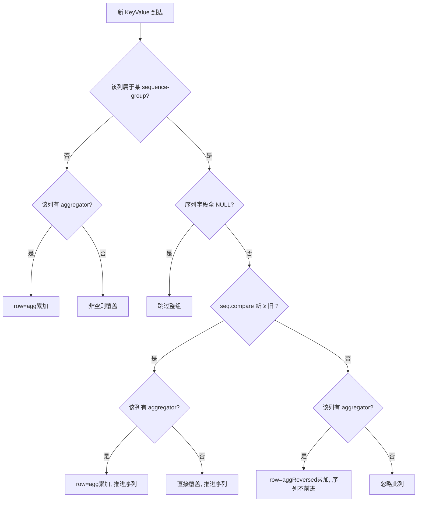
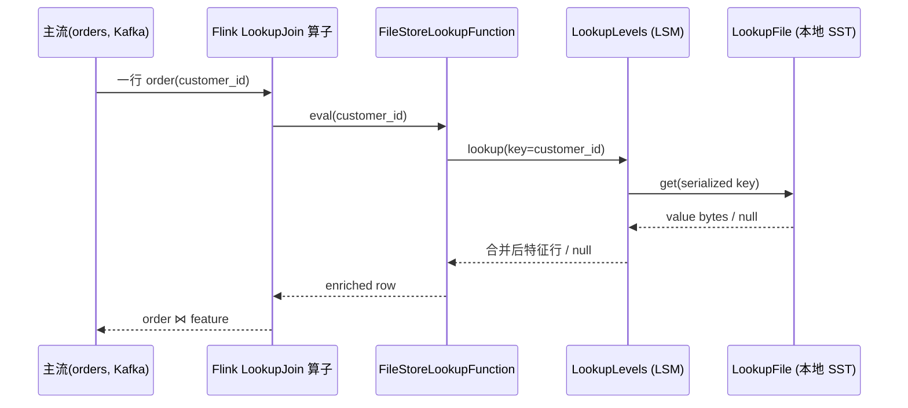
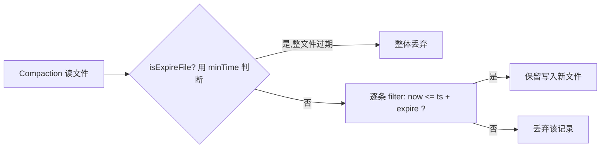

# 25 - 机器学习特征平台：架构与落地

> 版本：Apache Paimon 1.5-SNAPSHOT ｜ 基于 commit `e76fc41b7` ｜ 阅读对象：构建 ML 特征平台 / 样本数据平台的工程师与架构师
>
> 免责声明：本文所有机制、配置项、类名、方法名均以本仓库源码为准核验。**行号会随版本漂移，请以"类名#方法名"为锚点定位，行号仅作辅助。** 文中标注"(示意，非逐字源码)"的代码块为笔者为讲解而构造/简化的伪代码；标注了"类名#方法名"的片段为仓库真实源码。涉及性能的数字，凡无源码常量支撑者均显式标注"经验估算"。

---

## 目录

- [一、业务背景：什么是特征平台，它要解决什么](#一业务背景什么是特征平台它要解决什么)
  - [1.1 特征平台的核心诉求](#11-特征平台的核心诉求)
  - [1.2 在线/离线一致性难题](#12-在线离线一致性难题)
  - [1.3 为什么是 Paimon：能力映射总表](#13-为什么是-paimon能力映射总表)
- [二、特征宽表构建：partial-update + sequence-group 多源拼列](#二特征宽表构建partial-update--sequence-group-多源拼列)
  - [2.1 多源拼列的本质问题](#21-多源拼列的本质问题)
  - [2.2 PartialUpdateMergeFunction 数据流与字节视角](#22-partialupdatemergefunction-数据流与字节视角)
  - [2.3 sequence-group：版本过滤器 vs 排序键](#23-sequence-group版本过滤器-vs-排序键)
  - [2.4 算法逐步推导与不变量论证](#24-算法逐步推导与不变量论证)
  - [2.5 失败/边界路径：删除、回撤、空序列组](#25-失败边界路径删除回撤空序列组)
  - [2.6 最小可复现示例 + 系统表观察](#26-最小可复现示例--系统表观察)
- [三、存储侧聚合特征：把"计算"前置到写入路径](#三存储侧聚合特征把计算前置到写入路径)
  - [3.1 AggregateMergeFunction 总流程](#31-aggregatemergefunction-总流程)
  - [3.2 数值统计特征：sum / product / max / min](#32-数值统计特征sum--product--max--min)
  - [3.3 取值语义特征：last_value / last_non_null_value / first_value](#33-取值语义特征last_value--last_non_null_value--first_value)
  - [3.4 人群位图特征：rbm32 / rbm64](#34-人群位图特征rbm32--rbm64)
  - [3.5 基数估计特征：hll_sketch / theta_sketch](#35-基数估计特征hll_sketch--theta_sketch)
  - [3.6 序列与 KV 特征：collect / merge_map / merge_map_with_keytime / nested_update](#36-序列与-kv-特征collect--merge_map--merge_map_with_keytime--nested_update)
  - [3.7 聚合函数能力矩阵（核验版）](#37-聚合函数能力矩阵核验版)
- [四、在线特征点查：Lookup Join + LookupLevels](#四在线特征点查lookup-join--lookuplevels)
  - [4.1 维表点查的调用栈](#41-维表点查的调用栈)
  - [4.2 LookupLevels 与本地点查文件](#42-lookuplevels-与本地点查文件)
  - [4.3 Flink Lookup Join 最小示例](#43-flink-lookup-join-最小示例)
- [五、特征变更回流：changelog-producer = lookup / input](#五特征变更回流changelog-producer--lookup--input)
  - [5.1 为什么特征宽表必须配 changelog-producer](#51-为什么特征宽表必须配-changelog-producer)
  - [5.2 LookupMergeFunction 包装机制](#52-lookupmergefunction-包装机制)
  - [5.3 lookupStrategy 决策表](#53-lookupstrategy-决策表)
- [六、特征 TTL：record-level.expire-time](#六特征-ttlrecord-levelexpire-time)
  - [6.1 设计定位与不保证语义](#61-设计定位与不保证语义)
  - [6.2 RecordLevelExpire 双层过滤实现](#62-recordlevelexpire-双层过滤实现)
  - [6.3 时间字段类型与单位归一](#63-时间字段类型与单位归一)
  - [6.4 最小示例](#64-最小示例)
- [七、特征注册与发现：Catalog / REST](#七特征注册与发现catalog--rest)
- [八、训练-服务一致性（point-in-time correctness 的边界）](#八训练-服务一致性point-in-time-correctness-的边界)
- [九、端到端落地范式（可复现）](#九端到端落地范式可复现)
- [十、风险与权衡](#十风险与权衡)
- [十一、关键源码索引（类#方法表）](#十一关键源码索引类方法表)
- [十二、交叉引用](#十二交叉引用)

---

## 一、业务背景：什么是特征平台，它要解决什么

### 1.1 特征平台的核心诉求

机器学习特征平台（Feature Store / Feature Platform）的职责，是把"原始事件/维度数据"转化为"模型可直接消费的特征"，并在两个完全不同的场景里保证**同一份特征语义**：

- **离线训练（offline / batch）**：吞吐优先，按特征宽表全量/增量扫描，构造训练样本；
- **在线服务（online / serving）**：低延迟点查，按实体主键（user_id / item_id / session_id）取最新特征向量喂给在线推理。

一个典型的特征平台需要回答四个问题：

1. **特征怎么拼？** 多个上游（用户画像流、行为统计流、外部维表）各算各的列，最终拼成一张"实体宽表"。这要求**多源解耦写同一行的不同列**且互不覆盖。
2. **特征怎么算？** 很多特征本质是聚合量：累计消费额（sum）、最近一次登录（last_value）、7 日活跃人群（bitmap）、UV 估计（HLL）、最近 N 次点击序列（collect）。能否把这些聚合"沉到存储层"，避免每次都重算？
3. **在线怎么取？** 给定主键，毫秒级取回特征行。
4. **过期怎么删？** 特征有时效，过期样本应自动淘汰，避免无限膨胀。

### 1.2 在线/离线一致性难题

传统架构里，离线特征跑在数仓（Hive/Spark），在线特征写在 KV（Redis/HBase），两套代码、两套口径，极易"训练用的是 A，服务用的是 B"，导致**训练-服务偏移（training-serving skew）**。

Paimon 的价值主张是：**一份湖表既能被批/流引擎全量扫描做训练，又能被 Flink Lookup Join 做在线点查**，从而把"两套存储两套代码"收敛为"一份表一套口径"。本文聚焦把 Paimon 当作特征平台**底座**所依赖的存储侧机制。

### 1.3 为什么是 Paimon：能力映射总表

| 特征平台能力 | Paimon 机制 | 关键类 / 配置 | 现有分析篇 |
|---|---|---|---|
| 多源拼列宽表 | partial-update merge engine + sequence-group | `PartialUpdateMergeFunction`，`fields.<g>.sequence-group` | [[14-局部列更新与CDC数据集成]] [[08-Merge引擎与聚合函数]] |
| 存储侧聚合 | aggregation merge engine + 各 FieldXxxAgg | `AggregateMergeFunction`，`fields.<f>.aggregate-function` | [[08-Merge引擎与聚合函数]] |
| 人群位图 / 基数 | rbm32/64、hll_sketch、theta_sketch | `FieldRoaringBitmap32Agg` 等 | [[08-Merge引擎与聚合函数]] |
| 在线点查 | Lookup Join + LookupLevels | `FileStoreLookupFunction`，`LookupLevels` | [[05-Flink集成源码分析]] [[13-索引机制深度分析]] |
| 特征变更回流 | changelog-producer = lookup/input | `LookupMergeFunction`，`changelog-producer` | [[24-Changelog机制全链路分析]] |
| 特征 TTL | record-level.expire-time | `RecordLevelExpire`，`record-level.*` | [[23-Compaction全链路深度分析]] |
| 特征注册发现 | Catalog / REST Catalog | `Catalog`，系统表 `$schemas` 等 | [[03-Catalog与元数据管理]] |
| 训练-服务一致 | 同一份 LSM 表 + 快照隔离 | `Snapshot`，时间旅行 | [[17-时间旅行与版本管理]] |

> 本篇与 [[08-Merge引擎与聚合函数]] 在"merge engine / 聚合函数实现"上有重叠：08 篇是**机制全景**，本篇是**面向 ML 特征场景的落地范式**，对实现细节点到为止并链接到 08。样本拼接与可复现见 [[26-机器学习样本数据平台]]，PyPaimon 训练加载见 [[27-PyPaimon与训练数据加载]]，向量/多模态特征见 [[28-多模态与向量特征]]。

---

## 二、特征宽表构建：partial-update + sequence-group 多源拼列

### 2.1 多源拼列的本质问题

设想一张用户特征宽表，主键 `user_id`，有三组特征列，分别由三条独立的 Flink 流写入：

```
user_id | profile_age | profile_city | beh_clicks_7d | beh_last_visit | risk_score | risk_level
        \____ 画像流 ____/             \______ 行为流 ______/            \___ 风控流 ___/
```

三条流彼此不知道对方的进度，会出现两种麻烦：

1. **乱序覆盖**：风控流晚到的旧值，可能把行为流刚写的新值"按整行 upsert"覆盖掉。
2. **空值覆盖**：画像流写 `<user, age=30, city=BJ, NULL, NULL, NULL, NULL>`，若按整行替换，会把行为/风控列清空。

`merge-engine = partial-update` 解决"空值覆盖"（只更新非 NULL 列），`sequence-group` 解决"乱序覆盖"（每条流用自己的版本号决定本组列是否更新）。这是 Paimon 区别于普通 upsert KV 的关键能力。

### 2.2 PartialUpdateMergeFunction 数据流与字节视角

合并发生在 LSM merge-tree 同一主键的多条 KeyValue 之间。核心类 `PartialUpdateMergeFunction`（包 `org.apache.paimon.mergetree.compact`）维护一个累加行 `GenericRow row`，按字段逐列合并：

```java
// PartialUpdateMergeFunction#add （真实源码，节选）
public void add(KeyValue kv) {
    currentKey = kv.key();
    currentDeleteRow = false;
    if (kv.valueKind().isRetract()) { /* 见 2.5 删除路径 */ ... }

    latestSequenceNumber = kv.sequenceNumber();
    if (fieldSeqComparators.isEmpty()) {
        updateNonNullFields(kv);     // 无 sequence-group：纯非空覆盖
    } else {
        updateWithSequenceGroup(kv); // 有 sequence-group：分组版本控制
    }
    meetInsert = true;
    notNullColumnFilled = true;
}
```

无 sequence-group 时的逻辑极简（`PartialUpdateMergeFunction#updateNonNullFields`）：

```java
// 真实源码
private void updateNonNullFields(KeyValue kv) {
    for (int i = 0; i < getters.length; i++) {
        Object field = getters[i].getFieldOrNull(kv.value());
        if (field != null) {
            row.setField(i, field);     // 非 NULL 才覆盖
        } else {
            if (!nullables[i]) {
                throw new IllegalArgumentException("Field " + i + " can not be null");
            }
        }
    }
}
```

**累加行的内存布局（示意，非逐字源码）**：`GenericRow` 是一个 `Object[]`，每个槽位对应一列。合并就是按列 `setField`：

```
合并前 row:  [u1][age=30][city=BJ][null ][null    ][null ][null ]
行为流 kv:   [u1][null  ][null   ][clk=7][2026-... ][null ][null ]
合并后 row:  [u1][age=30][city=BJ][clk=7][2026-... ][null ][null ]   ← 非空列被填入，已有列保留
```

### 2.3 sequence-group：版本过滤器 vs 排序键

`fields.<seqField>.sequence-group = 'colA,colB'` 声明：列 `colA,colB` 受字段 `seqField` 的版本控制。声明方式与解析见 `PartialUpdateMergeFunction.Factory` 构造器：它扫描所有以 `fields.` 开头、以 `sequence-group` 结尾的 key，把"序列字段→受保护列"建成映射，序列字段自身也加入 `fieldSeqComparators`。

关键点（官方文档 `docs/docs/primary-key-table/merge-engine/partial-update.md` 明确，且与源码一致）：

- **无聚合函数时，sequence-group 是"版本过滤器"**：只有当 `seqComparator.compare(incoming, stored) >= 0`（新版本 ≥ 旧版本）时，本组列才被更新；否则整组列保持不变。
- **有聚合函数时，sequence-group 变成"排序键"**：每条非 NULL 序列值的记录都参与聚合（不论版本大小），序列值只用于决定 `last/first` 类函数谁是"最后/最先"，并仅在更大时推进存储的序列值。

核心实现见 `PartialUpdateMergeFunction#updateWithSequenceGroup`：

```java
// 真实源码，节选
Object accumulator = row.getField(i);
if (seqComparator == null) {
    // 不受 sequence-group 保护的列
    Object field = getters[i].getFieldOrNull(kv.value());
    if (aggregator != null) {
        row.setField(i, aggregator.agg(accumulator, field));
    } else if (field != null) {
        row.setField(i, field);
    }
} else {
    if (isEmptySequenceGroup(kv, seqComparator, isEmptySequenceGroup)) {
        continue; // 序列字段全 NULL ⇒ 跳过本组（见 2.5）
    }
    Object field = getters[i].getFieldOrNull(kv.value());
    if (seqComparator.compare(kv.value(), row) >= 0) {       // 新版本 ≥ 旧版本
        // ... 序列字段本身一次性整组更新
        row.setField(i, aggregator == null ? field : aggregator.agg(accumulator, field));
    } else if (aggregator != null) {
        // 旧版本但有聚合函数 ⇒ 仍要参与聚合（顺序反转）
        row.setField(i, aggregator.aggReversed(accumulator, field));
    }
}
```

这段代码精确印证了文档的两段语义：无 `aggregator`（`aggregator == null`）时，旧版本记录什么都不做（版本过滤器）；有 `aggregator` 时，旧版本仍调用 `aggReversed` 参与聚合（排序键），仅版本号不前进。



### 2.4 算法逐步推导与不变量论证

以官方示例（两组序列组）推导，验证"乱序写入仍得到正确结果"：

建表：
```sql
'fields.g_1.sequence-group' = 'a,b'   -- a,b 受 g_1 版本控制
'fields.g_2.sequence-group' = 'c,d'   -- c,d 受 g_2 版本控制
```

合并演算（主键 k=1）：

| 步骤 | 输入 (k,a,b,g_1,c,d,g_2) | 处理 | 合并后 row |
|---|---|---|---|
| 1 | (1,1,1,1,1,1,1) | 首条全部写入 | a=1,b=1,g1=1,c=1,d=1,g2=1 |
| 2 | (1,2,2,2,2,2,NULL) | g_2=NULL ⇒ c,d 整组跳过；g_1=2≥1 ⇒ a,b 更新 | a=2,b=2,g1=2,c=1,d=1,g2=1 |
| 3 | (1,3,3,1,3,3,3) | g_1=1<2 ⇒ a,b 不更新；g_2=3≥1 ⇒ c,d 更新 | a=2,b=2,g1=2,c=3,d=3,g2=3 |

最终 `(1,2,2,2,3,3,3)`，与文档输出一致。

**不变量（正确性论证）**：

- **不变量 I1（组内单调）**：对任意 sequence-group，存储行中该组列的值，总是对应"已见过的最大序列值"的记录贡献。证明：每次更新本组列时（含序列字段）必满足 `compare(incoming, stored) >= 0`，更新后存储的序列字段即 `incoming` 的序列值，单调不减；旧版本记录在无聚合场景下不修改本组任何列。∎
- **不变量 I2（组间独立）**：组 A 的更新不影响组 B 的列。证明：`updateWithSequenceGroup` 按列遍历，每列只匹配自己所属的 `seqComparator`，组间无共享状态（`isEmptySequenceGroup` 标志数组以列下标为索引，互不干扰）。∎
- **推论**：多条乱序流，只要各自维护自己的序列字段（如各流的事件时间戳），合并结果与到达顺序无关——这正是特征宽表多源解耦所需的"可交换合并"性质。

> 注意 I2 的边界：组内**只**做版本过滤无聚合时合并是幂等可交换的；一旦组内列带聚合函数（如 sum），可交换性仅对 order-independent 函数（sum/product/max/min）成立，对 order-dependent 函数（last_value 等）则依赖序列值大小，详见 2.3。

### 2.5 失败/边界路径：删除、回撤、空序列组

**(a) 默认拒绝删除**。partial-update 默认不接受 `-D`，否则抛异常（`PartialUpdateMergeFunction#add` 中的 `IllegalArgumentException`），并给出三条出路：

1. `ignore-delete`（`CoreOptions.IGNORE_DELETE`，默认 false）：忽略删除记录；
2. `partial-update.remove-record-on-delete`（`CoreOptions.PARTIAL_UPDATE_REMOVE_RECORD_ON_DELETE`，默认 false）：收到 `-D` 删整行；
3. `partial-update.remove-record-on-sequence-group`（`CoreOptions.PARTIAL_UPDATE_REMOVE_RECORD_ON_SEQUENCE_GROUP`，无默认）：当指定序列组的 `-D` 到达时删整行。

> 上述三个键均在 `CoreOptions.java` 中核验存在。三者间有互斥校验（`Factory` 构造器中的 `Preconditions.checkState`）：`remove-record-on-delete` 与 `ignore-delete` 不可同时开；`remove-record-on-delete` 与任意 `sequence-group` 不可同时开。

**(b) 空序列组跳过**。若某条记录里某序列组的**所有**序列字段都是 NULL，则该组列整体跳过（`isEmptySequenceGroup` 返回 true）。这对特征平台很关键：画像流写记录时，行为流/风控流对应的序列字段为 NULL，于是这些组自动不被触碰，实现"各流只管自己的列"。

```java
// PartialUpdateMergeFunction#isEmptySequenceGroup （真实源码，节选）
for (int fieldIndex : comparator.compareFields()) {
    if (getters[fieldIndex].getFieldOrNull(kv.value()) != null) {
        return false;     // 只要序列字段有一个非空，本组就"活跃"
    }
}
// 全 NULL：标记并跳过
```

**(c) 序列组回撤删整行**。当 `partial-update.remove-record-on-sequence-group` 命中且收到该组 `-D` 时，`retractWithSequenceGroup` 会把 `currentDeleteRow=true` 并以删除记录重建行，最终 `getResult()` 产出 `RowKind.DELETE`：

```java
// PartialUpdateMergeFunction#getResult （真实源码）
RowKind rowKind = currentDeleteRow || !meetInsert ? RowKind.DELETE : RowKind.INSERT;
return reused.replace(currentKey, latestSequenceNumber, rowKind, row);
```

注意 `!meetInsert` 的兜底：若只收到回撤、从未见过 INSERT，结果应为 DELETE（避免产生一行"幽灵"特征）。

### 2.6 最小可复现示例 + 系统表观察

Flink SQL（三流写一表，验证 2.4 推导）：

```sql
CREATE CATALOG fs WITH ('type'='paimon', 'warehouse'='file:///tmp/feature_wh');
USE CATALOG fs;

CREATE TABLE user_feature (
    user_id        BIGINT,
    profile_age    INT,
    profile_city   STRING,
    profile_ver    BIGINT,   -- 画像流序列字段
    clicks_7d      BIGINT,
    last_visit     BIGINT,
    beh_ver        BIGINT,   -- 行为流序列字段
    PRIMARY KEY (user_id) NOT ENFORCED
) WITH (
    'merge-engine' = 'partial-update',
    'fields.profile_ver.sequence-group' = 'profile_age,profile_city',
    'fields.beh_ver.sequence-group'     = 'clicks_7d,last_visit',
    'changelog-producer' = 'lookup'   -- 见第五章：宽表必须配
);

-- 画像流写入（beh_ver=NULL ⇒ 行为列自动跳过）
INSERT INTO user_feature
VALUES (1, 30, 'BJ', 100, CAST(NULL AS BIGINT), CAST(NULL AS BIGINT), CAST(NULL AS BIGINT));

-- 行为流写入（profile_ver=NULL ⇒ 画像列自动跳过）
INSERT INTO user_feature
VALUES (1, CAST(NULL AS INT), CAST(NULL AS STRING), CAST(NULL AS BIGINT), 7, 17400000, 200);

-- 画像流晚到的旧版本（profile_ver=50 < 100 ⇒ 画像列不更新）
INSERT INTO user_feature
VALUES (1, 99, 'SH', 50, CAST(NULL AS BIGINT), CAST(NULL AS BIGINT), CAST(NULL AS BIGINT));
```

**观察验证**：查询结果应为 `1, 30, 'BJ', 100, 7, 17400000, 200`（画像版本回退被忽略，两流互不覆盖）。同时用系统表确认合并确实在 LSM 内发生而非简单覆盖：

```sql
-- 每次 INSERT 提交产生一个快照
SELECT snapshot_id, schema_id, commit_kind FROM user_feature$snapshots;
-- 观察数据文件随写入累积、随 compaction 合并
SELECT file_path, level, record_count FROM user_feature$files;
-- 确认 schema 中 sequence-group 配置已写入表属性
SELECT * FROM user_feature$options WHERE `key` LIKE 'fields.%';
```

> 提示：partial-update 的合并语义在**读时**（merge-on-read）总是生效；写时是否物化取决于 compaction。`$files` 中多个 level-0 文件合并到高 level 即说明 LSM 合并触发。

---

## 三、存储侧聚合特征：把"计算"前置到写入路径

### 3.1 AggregateMergeFunction 总流程

`merge-engine = aggregation` 让每个非主键列绑定一个聚合函数（`fields.<f>.aggregate-function`），写入时即按主键 pre-aggregate。核心 `AggregateMergeFunction`（包 `...mergetree.compact.aggregate`）的合并循环：

```java
// AggregateMergeFunction#add （真实源码，节选）
boolean isRetract = kv.valueKind().isRetract();
for (int i = 0; i < getters.length; i++) {
    FieldAggregator fieldAggregator = aggregators[i];
    Object accumulator = getters[i].getFieldOrNull(row);
    Object inputField = getters[i].getFieldOrNull(kv.value());
    Object mergedField = isRetract
            ? fieldAggregator.retract(accumulator, inputField)
            : fieldAggregator.agg(accumulator, inputField);
    row.setField(i, mergedField);
}
```

聚合函数选择规则（`AggregateMergeFunction#getAggFuncName`，真实源码）：

1. 若字段是 `sequence.field` ⇒ 用 `last_value`（仅覆盖，不真正聚合）；
2. 若字段是主键 ⇒ 用 `FieldPrimaryKeyAgg`（直接返回 input，主键不变）；
3. 否则取 `fields.<f>.aggregate-function`，缺省回落到 `fields.default-aggregate-function`，再缺省最终回落到 `last_non_null_value`。

> 与 partial-update 中聚合的差异：aggregation 引擎里**所有**非主键列都有聚合函数（默认 `last_non_null_value`），无需 sequence-group；partial-update 引擎里聚合函数是可选叠加项，且非 `last_non_null_value` 的聚合函数**必须**配 sequence-group（见 `PartialUpdateMergeFunction#getAggFuncName` 的 `checkArgument`）。

`FieldAggregator` 抽象基类只有三个方法：`agg(acc, input)`、`aggReversed`（默认交换参数调 agg）、`retract`（默认抛"不支持回撤"）。每个聚合函数通过 SPI（`FieldAggregatorFactory`）按 `identifier()` 名字发现并创建，详见 [[08-Merge引擎与聚合函数]] 的 SPI 章节。

### 3.2 数值统计特征：sum / product / max / min

ML 里"累计消费额、累计点击数、最高单笔金额"等典型可加/可比特征。以 `sum` 为例（`FieldSumAgg`）：

```java
// FieldSumAgg#agg （真实源码，节选）
if (accumulator == null || inputField == null) {
    return accumulator == null ? inputField : accumulator;   // NULL 当作单位元
}
switch (fieldType.getTypeRoot()) {
    case INTEGER: sum = (int) accumulator + (int) inputField; break;
    case BIGINT:  sum = (long) accumulator + (long) inputField; break;
    case DOUBLE:  sum = (double) accumulator + (double) inputField; break;
    case DECIMAL: /* DecimalUtils.add, 校验 scale/precision 一致 */ ...
    // ...
}
```

`sum` 支持类型：DECIMAL/TINYINT/SMALLINT/INTEGER/BIGINT/FLOAT/DOUBLE。它**支持回撤**：`retract` 做减法，`negative` 处理"只有 input 无 accumulator"的回撤。这意味着上游 CDC 的 `-U/+U/-D` 能正确维护累计量——对从 CDC 构建累计特征非常重要。

**正确性要点**：sum 的可交换可结合性保证了 LSM 多文件分批合并与最终全量合并结果一致（合并次序无关），这是"存储侧聚合"可正确工作的数学前提。

### 3.3 取值语义特征：last_value / last_non_null_value / first_value

这组用于"取最近一次/最早一次"语义特征：

- `last_value`（`FieldLastValueAgg`）：`agg` 直接返回 `inputField`（含 NULL 也覆盖），`retract` 返回 null。
- `last_non_null_value`（`FieldLastNonNullValueAgg`）：`agg` 返回 `inputField==null ? accumulator : inputField`（NULL 不覆盖）。这是聚合引擎的最终默认函数，也是**唯一不需要 sequence-group 的聚合函数**（见 partial-update 的 `checkArgument`）。
- `first_value`（`FieldFirstValueAgg`）：用 `initialized` 标志，首条之后恒返回 accumulator；它依赖 `reset()` 在每个主键合并开始时清零，所以它的"first"是**一次合并会话内**的 first（结合 LSM 全量合并，等价于"最早写入的版本"）。

```java
// FieldFirstValueAgg （真实源码）
public Object agg(Object accumulator, Object inputField) {
    if (!initialized) { initialized = true; return inputField; }
    return accumulator;
}
public void reset() { this.initialized = false; }
```

> ML 用法：`last_non_null_value` 适合"用户最近一次有效城市"（忽略上游偶发 NULL）；`first_value` 适合"用户首次注册渠道"等不可变首值特征。

### 3.4 人群位图特征：rbm32 / rbm64

人群圈选（"7 日活跃用户集合"、"购买过某品类的用户集合"）是特征/营销平台高频需求。RoaringBitmap 用压缩位图表示整数集合，集合并集 = 位图 OR。

```java
// FieldRoaringBitmap32Agg#agg （真实源码，节选）
roaringBitmapAcc.deserialize(ByteBuffer.wrap((byte[]) accumulator));
roaringBitmapInput.deserialize(ByteBuffer.wrap((byte[]) inputField));
roaringBitmapAcc.or(roaringBitmapInput);     // 并集
return roaringBitmapAcc.serialize();
```

- `rbm32`（`FieldRoaringBitmap32Agg`）：列类型必须是 VARBINARY，存序列化后的 32 位 RoaringBitmap；用 `RoaringBitmap32`。
- `rbm64`（`FieldRoaringBitmap64Agg`）：64 位版本，用 `Roaring64Bitmap`，适合超大整数空间（如雪花 ID）。

**字节布局（示意，非逐字源码）**：列值就是 RoaringBitmap 的标准序列化字节流（容器分桶 + run/array/bitmap 三种编码），Paimon 不解析其内部，只做 `deserialize → or → serialize`。

```
列存储:  VARBINARY = [RoaringBitmap serialized bytes]
agg:     acc_bytes ──deserialize──► RBM_acc
         in_bytes  ──deserialize──► RBM_in
         RBM_acc.or(RBM_in)  ──serialize──► 新列值
```

**边界**：任一侧为 NULL 直接返回非空侧；`rbm32/64` **不支持 retract**（基类默认抛异常）——位图并集不可逆，圈人群属于"只增不减"语义。Paimon 不自带创建位图的 Flink UDF，需自行实现 UDF 把整数集合转成序列化字节（官方文档 `aggregation.mdx` 给出 `BitmapUDF` 样例）。

人群基数（活跃用户数）= 反序列化后 `getCardinality()`，通常用一个 `FROM_BITMAP_COUNT` UDF 在查询侧计算。

### 3.5 基数估计特征：hll_sketch / theta_sketch

当只要"近似去重计数"（UV、独立设备数）而非精确集合时，HLL / Theta sketch 比位图省得多。Paimon 基于 Apache DataSketches 实现：

```java
// FieldHllSketchAgg#agg （真实源码）
return HllSketchUtil.union((byte[]) accumulator, (byte[]) inputField);
// FieldThetaSketchAgg#agg （真实源码）
return ThetaSketch.union((byte[]) accumulator, (byte[]) inputField);
```

- `hll_sketch`（`FieldHllSketchAgg`）：HyperLogLog，更省空间、计数更准，仅支持并集（union）。
- `theta_sketch`（`FieldThetaSketchAgg`）：Theta sketch，支持并/交/差集，更灵活但更耗内存。

> 选型（官方文档结论）：只要 union + 计数用 HLL；要交集/差集（如"既买 A 又买 B 的用户数"）用 Theta。HLL 与 Theta 互不兼容、不可混合 merge。两者列类型均为 VARBINARY，均**不支持 retract**。计数同样靠查询侧 UDF（如 `HLL_SKETCH_COUNT`）反序列化取 `getEstimate()`。

**ML 价值**：把 sketch 作为特征列存储，可在**任意聚合维度（按天/按渠道/按人群）做 mergeable 的近似去重**，且训练/服务读到的是同一份 sketch，口径绝对一致。

### 3.6 序列与 KV 特征：collect / merge_map / merge_map_with_keytime / nested_update

这组用于"行为序列、KV 画像、嵌套子表"类特征：

**collect**（`FieldCollectAgg`，列类型 `ARRAY`）：把多行元素收集进数组，`fields.<f>.distinct=true` 去重。去重对构造类型（ROW 等）用 `RecordEqualiser`，对简单类型用 `HashSet`。支持 retract（按元素移除）。ML 用法：用户最近点击的 item 序列、最近搜索词序列。

```java
// FieldCollectAgg#agg （真实源码，节选）
Collection<Object> collection = distinct ? new HashSet<>() : new ArrayList<>();
collect(collection, accumulator);
collect(collection, inputField);
return new GenericArray(collection.toArray());
```

**merge_map**（`FieldMergeMapAgg`，列类型 `MAP`）：合并两个 map，同 key 以 input 为准（后写覆盖）。ML 用法：稀疏特征 KV（如 `{品类: 偏好分}`）增量更新。支持 retract（按 key 删除）。

```java
// FieldMergeMapAgg#agg （真实源码，节选）
Map<Object, Object> resultMap = new HashMap<>();
putToMap(resultMap, accumulator);   // 先放旧
putToMap(resultMap, inputField);    // 再放新 ⇒ 同 key 覆盖
return new GenericMap(resultMap);
```

**merge_map_with_keytime**（`FieldMergeMapWithKeyTimeAgg`）：带 key 级时间戳的 map 合并，类型为 `MAP<K, ROW<value, ts>>`，每个 key 保留 ts 最大的 value；`fields.<f>.ts-field` 指定 ROW 内时间字段（默认取 ROW 最后一个字段）。value 为 NULL 删 key，ts 为 NULL 跳过。这是"KV 特征的 key 级 partial-update"。

**nested_update**（`FieldNestedUpdateAgg`，列类型 `ARRAY<ROW>`，即"嵌套子表"）：把多行收集成嵌套表；`fields.<f>.nested-key` 指定嵌套表的去重主键，命中则覆盖。还有 `fields.<f>.count-limit`（`COUNT_LIMIT` 常量）限制数组上限：

```java
// FieldNestedUpdateAgg#agg （真实源码，节选）
if (acc.size() >= countLimit) {
    return accumulator;      // 已达上限不再追加
}
int remainCount = countLimit - acc.size();
// ... addNonNullRows(input, rows, remainCount) 受 remain 约束
if (keyProjection != null) { /* 按 nested-key 去重覆盖 */ }
```

ML 用法：把"用户的所有订单"作为一个嵌套子表特征列，`nested-key=order_id` 做幂等覆盖，`count-limit` 控制内存与文件膨胀。

### 3.7 聚合函数能力矩阵（核验版）

下表中"名称"列均来自各 `FieldXxxAggFactory.NAME` 常量逐一核验；"retract"列依据各 `FieldXxxAgg` 是否重写 `retract`（未重写者继承基类抛异常 = 不支持）。

| 聚合函数（NAME 常量） | 实现类 | 适用列类型（文档） | 支持 retract | ML 典型用途 |
|---|---|---|---|---|
| `sum` | FieldSumAgg | 数值 | 是 | 累计额/计数 |
| `product` | FieldProductAgg | 数值 | 是 | 连乘 |
| `max` / `min` | FieldMaxAgg / FieldMinAgg | 数值/时间/字符串 | 否 | 峰值/谷值 |
| `last_value` | FieldLastValueAgg | 全部 | 是 | 最近值（含 NULL）|
| `last_non_null_value` | FieldLastNonNullValueAgg | 全部 | 是 | 最近非空值（默认）|
| `first_value` | FieldFirstValueAgg | 全部 | 否 | 首值 |
| `first_non_null_value` | FieldFirstNonNullValueAgg | 全部 | 否 | 首个非空值 |
| `first_not_null_value`（LEGACY_NAME）| 同上(legacy 工厂) | 全部 | 否 | 兼容旧名 |
| `listagg` | FieldListaggAgg | STRING | 否 | 字符串拼接 |
| `bool_and` / `bool_or` | FieldBoolAndAgg / FieldBoolOrAgg | BOOLEAN | 否 | 全/任一为真 |
| `rbm32` / `rbm64` | FieldRoaringBitmap32Agg / 64 | VARBINARY | 否 | 人群位图 |
| `hll_sketch` | FieldHllSketchAgg | VARBINARY | 否 | UV 近似（union）|
| `theta_sketch` | FieldThetaSketchAgg | VARBINARY | 否 | UV 近似（并/交/差）|
| `collect` | FieldCollectAgg | ARRAY | 是 | 行为序列 |
| `merge_map` | FieldMergeMapAgg | MAP | 是 | 稀疏 KV 特征 |
| `merge_map_with_keytime` | FieldMergeMapWithKeyTimeAgg | MAP\<K,ROW\<v,ts>> | 否* | key 级 KV partial-update |
| `nested_update` | FieldNestedUpdateAgg | ARRAY\<ROW> | 是 | 嵌套子表（订单明细）|
| `nested_partial_update` | FieldNestedPartialUpdateAgg | ARRAY\<ROW> | — | 嵌套子表局部更新 |

> *官方文档"Retraction"小节明确：仅 `sum`、`product`、`collect`、`merge_map`、`nested_update`、`last_value`、`last_non_null_value` 支持回撤，其余不支持。`collect`/`merge_map` 的回撤是"尽力而为"，结果不保证精确（文档原文）。若某列绑定的聚合函数不支持回撤但上游又有回撤流，可对该列设 `fields.<f>.ignore-retract=true`（`IGNORE_RETRACT` 常量），由 `FieldIgnoreRetractAgg` 装饰器吞掉回撤。

---

## 四、在线特征点查：Lookup Join + LookupLevels

### 4.1 维表点查的调用栈

特征宽表既是流写的目标，也可作为 Flink 维表被 `FOR SYSTEM_TIME AS OF` 点查。Flink 侧入口是 `FileStoreLookupFunction`（包 `org.apache.paimon.flink.lookup`），它把主表 join key 转成对 Paimon 表的主键点查。



### 4.2 LookupLevels 与本地点查文件

`LookupLevels<T>`（包 `org.apache.paimon.mergetree`）是 LSM 之上的"按 key 点查"层。它把 LSM 各 level 的数据文件转换为本地**点查文件（lookup SST，后缀 `.lookup`）**，用哈希/前缀索引按 key 直接定位，避免全文件扫描：

```java
// LookupLevels#lookup（真实源码）
public T lookup(InternalRow key, int startLevel) throws IOException {
    return LookupUtils.lookup(levels, key, startLevel, this::lookup, this::lookupLevel0);
}
```

单文件点查逻辑（`LookupLevels#lookup(InternalRow, DataFileMeta)`）：先查缓存 `lookupFileCache`（Caffeine），未命中则 `createLookupFile` 把数据文件转写成本地 SST 并缓存，再用 `keySerializer.serializeToBytes(key)` 取 `valueBytes`。Bloom filter（`bfGenerator`）进一步剪枝不存在的 key。结构与索引机制详见 [[13-索引机制深度分析]]。

**与特征平台的关系**：lookup SST 是"按主键随机读"的物化形态，使 Paimon 主键表能当低延迟在线特征源用。点查文件按数据文件级别缓存，drop 文件时回调 `notifyDropFile` 失效缓存，保证一致性。

### 4.3 Flink Lookup Join 最小示例

```sql
-- 特征维表（第二章已建的 user_feature）
-- 主流：实时请求流
CREATE TEMPORARY TABLE serving_req (
    req_id BIGINT,
    user_id BIGINT,
    proc_time AS PROCTIME()
) WITH ('connector'='datagen');

-- 在线取特征：给每个请求拼上用户最新特征
SELECT r.req_id, r.user_id, f.profile_age, f.profile_city, f.clicks_7d
FROM serving_req AS r
JOIN user_feature FOR SYSTEM_TIME AS OF r.proc_time AS f
ON r.user_id = f.user_id;
```

异步与缓存可按需开启（均为 Flink 维表 hint / 表 option，核验存在于 `FlinkConnectorOptions`）：`/*+ OPTIONS('lookup.async'='true','lookup.async-thread-number'='16') */`，以及 `lookup.cache` 缓存模式。Join miss 时可用 Flink 的延迟重试 hint（`'retry-predicate'='lookup_miss'`，详见 `docs/docs/flink/sql-lookup.mdx`），等待特征写入就绪——这对"特征生成与请求几乎同时"的场景很有用。Flink 集成全貌见 [[05-Flink集成源码分析]]。

---

## 五、特征变更回流：changelog-producer = lookup / input

### 5.1 为什么特征宽表必须配 changelog-producer

特征平台常需把"特征变化"作为事件下游消费（触发重新打分、推送、级联更新另一张表）。但 partial-update / aggregation 的合并结果在写时未必物化，**流读需要正确的 changelog**。官方文档 `partial-update.md` 明确：partial-update 做流式查询时必须配 `lookup` 或 `full-compaction` changelog producer（`input` 也可，但只返回输入记录）。

`changelog-producer`（`CoreOptions.CHANGELOG_PRODUCER`，枚举 `ChangelogProducer`，默认 `NONE`）四种模式（源码核验）：

| 值 | 含义（枚举描述） |
|---|---|
| `none` | 不产生 changelog 文件 |
| `input` | flush memtable 时双写 changelog，内容即输入 |
| `full-compaction` | 每次 full compaction 比对产出 changelog |
| `lookup` | 通过 lookup compaction 产出 changelog |

特征宽表推荐 `lookup`：它在 compaction 时通过点查"旧合并值"算出准确的 `-U/+U`，时延比 `full-compaction` 低；`input` 仅在"上游已是完整变更流且无需合并语义"时适用。Changelog 全链路见 [[24-Changelog机制全链路分析]]。

### 5.2 LookupMergeFunction 包装机制

`changelog-producer=lookup`（或开启 deletion-vectors / force-lookup / first-row）会让合并函数被 `LookupMergeFunction` 包装（包 `org.apache.paimon.mergetree.compact`）。它的核心思想是：合并时不仅看 level-0 的新数据，还要把**最高层已合并的那条旧记录**纳入，以算出"变更前后"的差异：

```java
// LookupMergeFunction#getResult（真实源码，节选）
mergeFunction.reset();
KeyValue highLevel = pickHighLevel();   // 选出最小 level 的高层记录（即已合并旧值）
try (CloseableIterator<KeyValue> iterator = candidates.iterator()) {
    while (iterator.hasNext()) {
        KeyValue kv = iterator.next();
        if (kv.level() <= 0 || kv == highLevel) {  // level0 新数据 + 那条旧值
            mergeFunction.add(kv);
        }
    }
}
return mergeFunction.getResult();
```

`pickHighLevel()` 只挑 level 最小的高层记录（注释："最终合并值应来自最新高层记录"）。这样 lookup 既能产出"准确的合并后值"，又能与旧值比对生成 changelog。注意 `LookupMergeFunction.wrap` 对 `FirstRowMergeFunction` 做了短路（first-row 已天然 OK，不再包装）。

### 5.3 lookupStrategy 决策表

是否走 lookup 由 `CoreOptions#lookupStrategy()` 综合判定（真实源码）：

```java
// CoreOptions#lookupStrategy（真实源码）
return LookupStrategy.from(
        mergeEngine().equals(MergeEngine.FIRST_ROW),
        changelogProducer().equals(ChangelogProducer.LOOKUP),
        deletionVectorsEnabled(),
        options.get(FORCE_LOOKUP));     // force-lookup，默认 false
```

即四个条件任一触发即需要 lookup：merge-engine=first-row、changelog-producer=lookup、开启 deletion-vectors、显式 `force-lookup=true`。`needLookup()` 即 `lookupStrategy().needLookup`。`lookup-wait`（`CoreOptions.LOOKUP_WAIT`，默认 true，回退键 `changelog-producer.lookup-wait`）控制提交是否等待 lookup compaction 完成。

> 对特征平台的含义：开启 `changelog-producer=lookup` 后写入路径会多一次"查旧值"的开销（lookup compaction），换取准确的变更流。这是"特征变更可被精确订阅"的代价，需在吞吐与下游一致性间权衡（见第十章）。

---

## 六、特征 TTL：record-level.expire-time

### 6.1 设计定位与不保证语义

特征有时效（如"近 7 日点击"），过期记录应淘汰。Paimon 提供**记录级过期** `record-level.expire-time`（`CoreOptions.RECORD_LEVEL_EXPIRE_TIME`，durationType，无默认）+ `record-level.time-field`（`CoreOptions.RECORD_LEVEL_TIME_FIELD`）。

关键定位（配置项描述原文）：**过期发生在 compaction 期间，没有"及时过期"的强保证**。也就是说，它不是定时精确删除，而是"compaction 顺手把过期数据丢掉"。这对特征平台意味着：TTL 是"最终会过期"，不能依赖它做精确的"到点即删"。

### 6.2 RecordLevelExpire 双层过滤实现

`RecordLevelExpire`（包 `org.apache.paimon.io`）在两个粒度上过滤：

**(a) 文件级整体跳过**（`RecordLevelExpire#isExpireFile`，真实源码）：用数据文件的 min 统计值判断整文件是否已全过期：

```java
// RecordLevelExpire#isExpireFile（真实源码，节选）
long currentTime = System.currentTimeMillis() / 1000L;
Optional<Long> minTime = fieldGetter.apply(minValues);
return minTime.map(minValue -> currentTime - expireTime > minValue).orElse(false);
```

逻辑：`currentTime - expireTime > fileMinTime` 表示"连文件里时间最小的记录都过期了"⇒ 整文件过期，compaction 可整体丢弃。

**(b) 记录级过滤**（`RecordLevelExpire#wrap(RecordReader)`，真实源码）：对未整体过期的文件逐条过滤：

```java
// RecordLevelExpire#wrap（真实源码，节选）
long currentTime = System.currentTimeMillis() / 1000L;
return reader.filter(keyValue ->
        fieldGetter.apply(keyValue.value())
                .map(integer -> currentTime <= integer + expireTime)  // 未过期才保留
                .orElse(true));   // 时间字段为 NULL ⇒ 保留（不过期）
```



**不变量**：因依赖文件 min 统计（含 schema 演进/稀疏统计的 `SimpleStatsEvolution` 修正），文件级判断永不误删（min 都过期才丢整文件），保证安全；记录级过滤是精确条件 `now <= ts + expire`。时间字段为 NULL 时保留（`orElse(true)`），避免无时间戳记录被误删。

### 6.3 时间字段类型与单位归一

`record-level.time-field` 支持的类型与单位归一（`RecordLevelExpire#createFieldGetterAndConvertToSecond`，真实源码）：

- `INT`：按"秒级时间戳"直接当 long 秒；
- `BIGINT`：自动判断单位——`value >= 1_000_000_000_000L`（约 2001 年的毫秒）视为毫秒并 `/1000` 转秒，否则当秒；
- `TIMESTAMP` / `TIMESTAMP_LTZ`：取 `getMillisecond()/1000` 转秒。

其余类型抛 `IllegalArgumentException`。所有比较统一在"秒"维度。

### 6.4 最小示例

```sql
CREATE TABLE user_feature_ttl (
    user_id BIGINT,
    clicks_7d BIGINT,
    event_ts TIMESTAMP(3),   -- 记录的事件时间
    PRIMARY KEY (user_id) NOT ENFORCED
) WITH (
    'merge-engine' = 'aggregation',
    'fields.clicks_7d.aggregate-function' = 'sum',
    'record-level.expire-time' = '7 d',
    'record-level.time-field' = 'event_ts'
);
```

**观察验证**：写入若干条不同 `event_ts` 的记录后，触发 compaction（如调用 compact action 或等待自动 compaction），再查 `user_feature_ttl$files` 观察过期记录所在文件 `record_count` 下降 / 文件被丢弃。注意"何时真正删除"取决于 compaction 调度，不可依赖即时性。Compaction 调度细节见 [[23-Compaction全链路深度分析]]。

---

## 七、特征注册与发现：Catalog / REST

特征平台需要"特征表的注册、发现、血缘、权限"。Paimon 的 `Catalog`（`paimon-core` 的 `catalog/`）提供命名空间（database.table）与元数据管理：

- **FileSystemCatalog**：默认，元数据落在 warehouse 路径下的 `schema/` 目录；
- **RESTCatalog**：对接统一元数据服务（可与外部 catalog / 权限系统集成），适合多团队共享特征表的平台化场景；
- **CachingCatalog**：装饰器，缓存表元数据降低 catalog 访问开销。

特征发现可直接借助 Paimon 的**系统表**（`table/system/`）做自助式元数据查询，无需额外元数据系统：

```sql
SELECT * FROM user_feature$schemas;   -- 字段、类型、主键、演进历史
SELECT * FROM user_feature$options;   -- merge-engine / 聚合函数 / sequence-group 等全部配置
SELECT * FROM user_feature$snapshots; -- 版本/提交时间，用于训练样本可复现选点
SELECT * FROM user_feature$tags;      -- 给"训练用版本"打标签，固定快照
```

Catalog 与元数据机制全貌见 [[03-Catalog与元数据管理]]；版本/标签/时间旅行见 [[17-时间旅行与版本管理]]。

---

## 八、训练-服务一致性（point-in-time correctness 的边界）

特征平台最忌"训练用未来数据"（label leakage）与"训练/服务口径不一"。Paimon 在底座层提供两块支撑，但**完整的 point-in-time 样本拼接逻辑不在本篇展开**（见 [[26-机器学习样本数据平台]]）：

1. **同一份表两种读法**：训练侧批量扫描全表（merge-on-read 得到合并后特征），服务侧 Lookup Join 点查同一表同一主键，**合并语义完全一致**（同一套 MergeFunction）。这从根本上消除"两套存储两套代码"的偏移。
2. **快照隔离 + tag 固定**：训练时用 `$snapshots` 选定快照、或对该快照打 `tag`，保证训练数据可复现、可回溯（时间旅行）。配合 `changelog-producer`，可做增量训练。

**边界与告诫**：
- `record-level.expire-time` 会在 compaction 时删旧记录，可能影响"历史快照可读性"——若需长期可复现的训练集，应谨慎用 TTL 或配合 tag 锁定快照（tag 会保护其引用的文件不被过期清理，详见 [[17-时间旅行与版本管理]]）。
- 存储侧聚合（如 `sum`）把"截至当前的累计值"写进特征，天然是"as-of 最新"语义；要做"截至某时刻"的 point-in-time 特征，需要在样本拼接层处理（[[26-机器学习样本数据平台]]）。

---

## 九、端到端落地范式（可复现）

下面给出一个"多源特征宽表 + 存储侧聚合 + 在线点查 + TTL"的最小完整范式（Flink SQL）。

```sql
CREATE CATALOG fs WITH ('type'='paimon', 'warehouse'='file:///tmp/feature_wh');
USE CATALOG fs;

-- 1) 实体特征宽表：partial-update 拼列 + 聚合列叠加 + sequence-group + lookup changelog + TTL
CREATE TABLE user_feature (
    user_id       BIGINT,
    -- 画像组（版本过滤）
    profile_city  STRING,
    profile_ver   BIGINT,
    -- 行为组（累计聚合）
    clicks_total  BIGINT,
    clicks_ver    BIGINT,
    -- 序列特征
    recent_items  ARRAY<BIGINT>,
    event_ts      TIMESTAMP(3),
    PRIMARY KEY (user_id) NOT ENFORCED
) WITH (
    'merge-engine' = 'partial-update',
    'fields.profile_ver.sequence-group' = 'profile_city',
    'fields.clicks_ver.sequence-group'  = 'clicks_total',
    'fields.clicks_total.aggregate-function' = 'sum',     -- 组内列叠加聚合
    'fields.recent_items.aggregate-function' = 'collect',
    'changelog-producer' = 'lookup',
    'record-level.expire-time' = '30 d',
    'record-level.time-field'  = 'event_ts'
);

-- 2) 三条上游流各写各的列（示意：实际来自 Kafka/CDC）
INSERT INTO user_feature
SELECT user_id, city, ver, CAST(NULL AS BIGINT), CAST(NULL AS BIGINT),
       CAST(NULL AS ARRAY<BIGINT>), event_ts
FROM profile_source;

INSERT INTO user_feature
SELECT user_id, CAST(NULL AS STRING), CAST(NULL AS BIGINT), clicks, ver,
       ARRAY[clicked_item], event_ts
FROM behavior_source;

-- 3) 在线点查：请求流拼最新特征
SELECT q.req_id, f.profile_city, f.clicks_total, f.recent_items
FROM query_stream FOR ... AS q   -- proc_time 维表 join，见 4.3
JOIN user_feature FOR SYSTEM_TIME AS OF q.proc_time AS f
ON q.user_id = f.user_id;
```

观察链路是否生效：

```sql
SELECT snapshot_id, commit_kind FROM user_feature$snapshots;   -- changelog/compaction 提交
SELECT `key`, `value` FROM user_feature$options;               -- 确认聚合/序列组配置
SELECT level, count(*) FROM user_feature$files GROUP BY level; -- LSM 合并与 TTL 清理效果
```

---

## 十、风险与权衡

| 主题 | 风险 / 代价 | 建议 |
|---|---|---|
| sequence-group + 聚合混用 | 语义在"版本过滤器/排序键"间切换（2.3），易误判 | 累计类列用 order-independent 聚合（sum/max）；理解 order-dependent 函数对序列值的依赖 |
| 聚合函数 retract 支持有限 | 多数函数不支持回撤；collect/merge_map 回撤"尽力而为" | 上游有回撤流且列不支持时，显式 `fields.<f>.ignore-retract=true` |
| changelog-producer=lookup | 写入多一次"查旧值"开销 | 仅在需要精确变更订阅时开启；权衡 `lookup-wait` |
| record-level TTL 非即时 | compaction 才删，不保证到点 | 不用于精确到点删除；长期可复现训练集慎用或配 tag 锁快照 |
| bitmap/sketch 需自备 UDF | Paimon 不内置创建 UDF | 自实现 TO_BITMAP / HLL_SKETCH 等 UDF（文档有样例）|
| 在线点查冷启动 | 首次需把数据文件转 lookup SST | 预热缓存；合理设置 lookup 缓存 |
| 宽表列爆炸 | 单表过多稀疏列影响读放大 | 高维稀疏特征用 merge_map（MAP 列）而非平铺成列 |
| NULL 不可空列 | partial-update 对 NOT NULL 列写 NULL 直接抛异常（`updateNonNullFields`）| 特征列尽量 nullable，由合并兜底 |

---

## 十一、关键源码索引（类#方法表）

> 行号随版本漂移，以下以"类#方法"为锚点。

| 主题 | 类#方法 | 路径（相对仓库根）|
|---|---|---|
| 局部更新合并 | `PartialUpdateMergeFunction#add` / `#updateWithSequenceGroup` / `#retractWithSequenceGroup` / `#isEmptySequenceGroup` / `#getResult` | paimon-core/.../mergetree/compact/PartialUpdateMergeFunction.java |
| 局部更新聚合选择 | `PartialUpdateMergeFunction#getAggFuncName` | 同上 |
| 序列组解析 | `PartialUpdateMergeFunction.Factory`（构造器扫描 `fields.*.sequence-group`）| 同上 |
| 聚合合并 | `AggregateMergeFunction#add` / `#getAggFuncName` | paimon-core/.../mergetree/compact/aggregate/AggregateMergeFunction.java |
| 聚合基类 | `FieldAggregator#agg` / `#aggReversed` / `#retract` / `#reset` | paimon-core/.../mergetree/compact/aggregate/FieldAggregator.java |
| 聚合工厂分发 | `FieldAggregatorFactory#create`（SPI discover + ignore-retract 装饰）| paimon-core/.../mergetree/compact/aggregate/factory/FieldAggregatorFactory.java |
| sum | `FieldSumAgg#agg` / `#retract` | .../aggregate/FieldSumAgg.java |
| last_non_null | `FieldLastNonNullValueAgg#agg` | .../aggregate/FieldLastNonNullValueAgg.java |
| first_value | `FieldFirstValueAgg#agg` / `#reset` | .../aggregate/FieldFirstValueAgg.java |
| rbm32 / rbm64 | `FieldRoaringBitmap32Agg#agg` / `FieldRoaringBitmap64Agg#agg` | .../aggregate/FieldRoaringBitmap32Agg.java 等 |
| hll / theta | `FieldHllSketchAgg#agg` / `FieldThetaSketchAgg#agg` | .../aggregate/FieldHllSketchAgg.java 等 |
| collect | `FieldCollectAgg#agg` / `#retract` | .../aggregate/FieldCollectAgg.java |
| merge_map | `FieldMergeMapAgg#agg` / `#retract` | .../aggregate/FieldMergeMapAgg.java |
| nested_update | `FieldNestedUpdateAgg#agg` / `#retract` | .../aggregate/FieldNestedUpdateAgg.java |
| lookup 合并包装 | `LookupMergeFunction#getResult` / `#pickHighLevel` / `#wrap` | paimon-core/.../mergetree/compact/LookupMergeFunction.java |
| 点查层 | `LookupLevels#lookup` / `#createLookupFile` / `#notifyDropFile` | paimon-core/.../mergetree/LookupLevels.java |
| 记录级过期 | `RecordLevelExpire#isExpireFile` / `#wrap` / `#createFieldGetterAndConvertToSecond` | paimon-core/.../io/RecordLevelExpire.java |
| Flink 维表点查 | `FileStoreLookupFunction` | paimon-flink/paimon-flink-common/.../flink/lookup/FileStoreLookupFunction.java |
| 配置定义 | `CoreOptions`（MERGE_ENGINE / CHANGELOG_PRODUCER / RECORD_LEVEL_* / PARTIAL_UPDATE_* / SEQUENCE_FIELD / FIELDS_DEFAULT_AGG_FUNC）| paimon-api/.../CoreOptions.java |
| lookup 策略 | `CoreOptions#lookupStrategy` / `#needLookup` | 同上 |

**核验过的配置项（均存在于 CoreOptions.java）**：`merge-engine`、`changelog-producer`、`changelog-producer.row-deduplicate`、`fields.<f>.aggregate-function`、`fields.default-aggregate-function`、`fields.<g>.sequence-group`、`sequence.field`、`record-level.expire-time`、`record-level.time-field`、`partial-update.remove-record-on-delete`、`partial-update.remove-record-on-sequence-group`、`aggregation.remove-record-on-delete`、`ignore-delete`、`force-lookup`、`lookup-wait`。常量类：`fields.<f>.ignore-retract`（IGNORE_RETRACT）、`fields.<f>.nested-key`（NESTED_KEY）、`fields.<f>.count-limit`（COUNT_LIMIT）、`fields.<f>.distinct`（DISTINCT）、`fields.<f>.list-agg-delimiter`（LIST_AGG_DELIMITER）、`fields.<f>.ts-field`（MERGE_MAP_TS_FIELD）。

> 反例（本仓库**不存在**，请勿配置）：`compaction.force-keep-delete`、`clustering.spill-threshold`、`clustering.trigger-interval`。

---

## 十二、交叉引用

- [[08-Merge引擎与聚合函数]]：merge engine 全景与所有聚合函数实现/ SPI 注册机制（本篇聚合实现细节的权威来源）。
- [[14-局部列更新与CDC数据集成]]：partial-update 与 CDC 集成的全景（本篇 sequence-group 落地的延伸）。
- [[24-Changelog机制全链路分析]]：四种 changelog-producer 的全链路（本篇第五章的展开）。
- [[05-Flink集成源码分析]]：Flink source/sink/lookup 连接器全貌（本篇第四章的展开）。
- [[13-索引机制深度分析]]：LookupLevels / Bloom filter / 点查文件结构。
- [[23-Compaction全链路深度分析]]：compaction 调度（影响存储侧聚合物化与 TTL 生效时机）。
- [[03-Catalog与元数据管理]]：特征注册与发现的元数据层。
- [[17-时间旅行与版本管理]]：快照/标签固定训练版本，保证可复现。
- [[26-机器学习样本数据平台]]：样本拼接、point-in-time correctness、可复现（本篇第八章的展开）。
- [[27-PyPaimon与训练数据加载]]：PyPaimon 读取特征/样本进训练框架。
- [[28-多模态与向量特征]]：向量/多模态特征列与向量索引。
