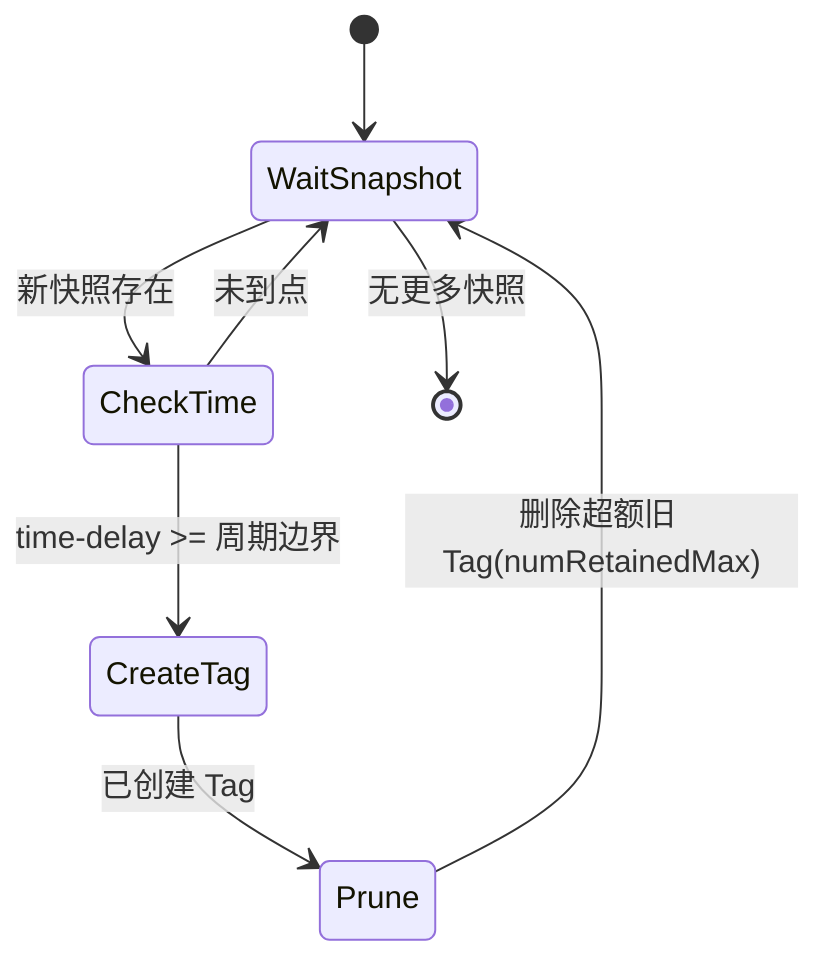
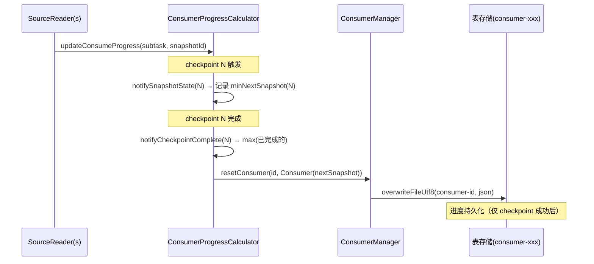
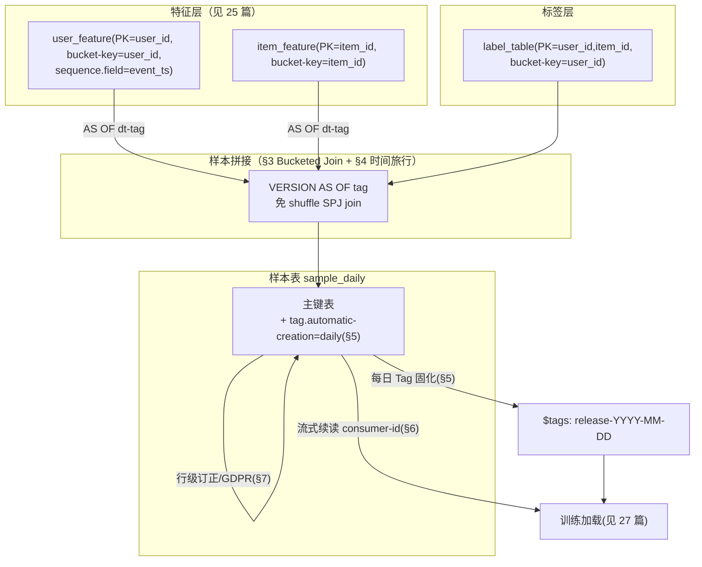

# Apache Paimon 机器学习样本数据平台：架构与落地

> 基于 Apache Paimon 1.5-SNAPSHOT 源码分析，commit: `e76fc41b7`（master 分支）
>
> **免责声明**：本文所有机制、配置项、类名、方法名均经过本仓库源码核验。**行号会随版本漂移，请以"类名#方法名"定位为准**，行号仅作辅助。性能数字若无源码常量支撑，均显式标注"经验估算"。示意代码标注"(示意，非逐字源码)"，真实片段标明类名与方法名。

---

## 目录

- [1. 业务背景：样本数据平台到底要解决什么](#1-业务背景样本数据平台到底要解决什么)
  - [1.1 从"特征值"到"训练样本"的鸿沟](#11-从特征值到训练样本的鸿沟)
  - [1.2 样本平台的五大核心诉求](#12-样本平台的五大核心诉求)
  - [1.3 与特征平台/训练加载的边界](#13-与特征平台训练加载的边界)
- [2. Paimon 能力到样本平台诉求的映射总表](#2-paimon-能力到样本平台诉求的映射总表)
- [3. 多特征源样本拼接：免 Shuffle 的 Bucketed Join](#3-多特征源样本拼接免-shuffle-的-bucketed-join)
  - [3.1 问题：拼接是样本平台最大的算力黑洞](#31-问题拼接是样本平台最大的算力黑洞)
  - [3.2 分桶是免 Shuffle 的物理前提](#32-分桶是免-shuffle-的物理前提)
  - [3.3 PaimonScan 如何向 Spark 上报 KeyGroupedPartitioning](#33-paimonscan-如何向-spark-上报-keygroupedpartitioning)
  - [3.4 outputOrdering 与 SortMergeJoin 免排序](#34-outputordering-与-sortmergejoin-免排序)
  - [3.5 端到端调用栈与时序图](#35-端到端调用栈与时序图)
  - [3.6 最小可复现示例与观察验证](#36-最小可复现示例与观察验证)
  - [3.7 失败/边界路径](#37-失败边界路径)
- [4. Point-in-Time Correctness：防止特征穿越](#4-point-in-time-correctness防止特征穿越)
  - [4.1 什么是"特征穿越"以及它为什么致命](#41-什么是特征穿越以及它为什么致命)
  - [4.2 时间旅行：scan.snapshot-id / scan.timestamp / scan.tag-name](#42-时间旅行scansnapshot-id--scantimestamp--scantag-name)
  - [4.3 sequence.field 事件时间合并：正确性的内核](#43-sequencefield-事件时间合并正确性的内核)
  - [4.4 三层合并优先级的不变量论证](#44-三层合并优先级的不变量论证)
  - [4.5 端到端范式：用 Tag 固化"截止某时刻"的样本视图](#45-端到端范式用-tag-固化截止某时刻的样本视图)
  - [4.6 样本增量：两个 Tag 之间的差异读取](#46-样本增量两个-tag-之间的差异读取)
- [5. 样本版本固化：Tag 与 Branch](#5-样本版本固化tag-与-branch)
  - [5.1 Tag 数据模型与不可变性](#51-tag-数据模型与不可变性)
  - [5.2 TagManager#createTag：固化的字节级语义](#52-tagmanagercreatetag固化的字节级语义)
  - [5.3 自动打 Tag：TagAutoCreation 状态机](#53-自动打-tagtagautocreation-状态机)
  - [5.4 Tag→Hive 分区：metastore.tag-to-partition](#54-taghive-分区metastoretag-to-partition)
  - [5.5 Branch：样本集的"实验分支"](#55-branch样本集的实验分支)
  - [5.6 最小可复现示例与观察验证](#56-最小可复现示例与观察验证)
- [6. 流式样本：Consumer 断点续读与 Exactly-Once](#6-流式样本consumer-断点续读与-exactly-once)
  - [6.1 问题：流式样本生成的"重复/丢失"两难](#61-问题流式样本生成的重复丢失两难)
  - [6.2 Consumer 数据模型：一个 long 的玄机](#62-consumer-数据模型一个-long-的玄机)
  - [6.3 ConsumerManager 的读写与重试](#63-consumermanager-的读写与重试)
  - [6.4 Exactly-Once 提交：ConsumerProgressCalculator](#64-exactly-once-提交consumerprogresscalculator)
  - [6.5 Consumer 对快照过期的保护](#65-consumer-对快照过期的保护)
  - [6.6 最小可复现示例与观察验证](#66-最小可复现示例与观察验证)
- [7. 样本行级修正：MERGE INTO / DELETE / UPDATE 与 GDPR 删除](#7-样本行级修正merge-into--delete--update-与-gdpr-删除)
  - [7.1 问题：样本平台的"脏数据"与"被遗忘权"](#71-问题样本平台的脏数据与被遗忘权)
  - [7.2 主键表 upsert 删除 vs 非主键表 Deletion Vector 删除](#72-主键表-upsert-删除-vs-非主键表-deletion-vector-删除)
  - [7.3 DeleteFromPaimonTableCommand 双路径源码剖析](#73-deletefrompaimontablecommand-双路径源码剖析)
  - [7.4 GDPR 删除的物理彻底性与权衡](#74-gdpr-删除的物理彻底性与权衡)
  - [7.5 最小可复现示例与观察验证](#75-最小可复现示例与观察验证)
- [8. Chain Table：按天全量+增量的样本快照重建](#8-chain-table按天全量增量的样本快照重建)
  - [8.1 问题：每天全量重算样本的双重浪费](#81-问题每天全量重算样本的双重浪费)
  - [8.2 snapshot/delta 双分支模型](#82-snapshotdelta-双分支模型)
  - [8.3 ChainGroupReadTable#plan：锚点查找与链式合并算法](#83-chaingroupreadtableplan锚点查找与链式合并算法)
  - [8.4 Group Partition：多维度独立链](#84-group-partition多维度独立链)
  - [8.5 最小可复现示例与观察验证](#85-最小可复现示例与观察验证)
- [9. 端到端落地范式：一个可复现的样本平台蓝图](#9-端到端落地范式一个可复现的样本平台蓝图)
  - [9.1 样本平台关键能力的实现选型对照](#91-样本平台关键能力的实现选型对照)
- [10. 风险与权衡](#10-风险与权衡)
- [11. 关键源码索引（类#方法表）](#11-关键源码索引类方法表)

---

## 1. 业务背景：样本数据平台到底要解决什么

### 1.1 从"特征值"到"训练样本"的鸿沟

特征平台（Feature Platform，见 [[25-机器学习特征平台]]）解决的是"如何稳定、低延迟地生产并服务**单个特征值**"——给定实体 ID（如 `user_id`）和时间点，返回某个特征（如 `user_7d_click_cnt`）的取值。

而**样本数据平台**（Sample / Training Data Platform）解决的是更上层的问题：把分散在多个特征源里的特征值，按**主键**对齐、按**时间点**对齐，拼接成一行行可以直接喂给模型训练的**样本（Sample / Label-Feature Row）**，并且要保证：

- 这一行样本里的每个特征，都是"在 label 产生那一刻**已经可见**"的值（防穿越）；
- 这一份样本集是**可复现**的——半年后重跑同一个训练，得到字节级一致的样本；
- 修正、删除单条样本（数据质量问题、用户行使被遗忘权）不需要全量重写。

可以用一个公式概括样本平台的核心计算：

```
sample(entity, t_label) =
    label(entity, t_label)
    ⨝  feature_src_1(entity)  AS OF t_label
    ⨝  feature_src_2(entity)  AS OF t_label
    ⨝  ...
```

这里两个动词最贵：`⨝`（拼接，join）和 `AS OF`（时间点对齐，point-in-time）。Paimon 的存储结构恰好为这两个动词提供了**物理层的加速与正确性保证**，而不仅是"存得下"。

### 1.2 样本平台的五大核心诉求

| # | 诉求 | 含义 | 不解决的代价 |
|---|------|------|--------------|
| C1 | **高效拼接** | 多个特征宽表按主键 join，避免 shuffle | 每次拼接全量 shuffle，样本 ETL 占满集群 |
| C2 | **防穿越（PIT correctness）** | 样本中的特征值必须 ≤ label 时间，且可按事件时间去重 | 线上线下不一致、AUC 虚高、模型上线即崩 |
| C3 | **版本固化与可复现** | 同一份样本集打上不可变版本号，随时重读 | 无法复现实验、无法回溯归因、无法审计 |
| C4 | **流式样本的精确一次** | 实时样本流断点续读，不重不漏 | 重复样本污染训练、丢失样本导致偏差 |
| C5 | **行级修正/删除** | 单条样本订正、GDPR 物理删除 | 全量重写、合规风险 |

本文逐一对应到 Paimon 的具体机制：C1→[第 3 章](#3-多特征源样本拼接免-shuffle-的-bucketed-join)，C2→[第 4 章](#4-point-in-time-correctness防止特征穿越)，C3→[第 5 章](#5-样本版本固化tag-与-branch)，C4→[第 6 章](#6-流式样本consumer-断点续读与-exactly-once)，C5→[第 7 章](#7-样本行级修正merge-into--delete--update-与-gdpr-删除)。第 8 章的 Chain Table 是 C3 在"每日全量快照"场景下的特化解。

### 1.3 与特征平台/训练加载的边界

为避免重复展开，本文严格限定边界：

- **特征值的生产与在线/离线服务**（点查、TTL、聚合）→ 见 [[25-机器学习特征平台]]，本文只在拼接环节引用其产物。
- **样本的训练侧加载**（PyPaimon、DataLoader、shuffle/batch 策略）→ 见 [[27-PyPaimon与训练数据加载]]，本文只产出"可被加载的样本表"。
- **多模态/向量特征的存储与检索** → 见 [[28-多模态与向量特征]]。

本文聚焦"样本集如何被**生成、拼接、版本化、修正、重建**"这一中间层。

---

## 2. Paimon 能力到样本平台诉求的映射总表

下表是全文的"导航地图"，每个能力都连到源码与现有分析篇。

| 诉求 | Paimon 能力 | 关键源码（类#方法） | 关键配置（CoreOptions 已核验） | 深入篇 |
|------|-------------|---------------------|--------------------------------|--------|
| C1 拼接 | Bucketed Join（KeyGroupedPartitioning） | `PaimonScan#outputPartitioning` / `#outputOrdering` / `#getInputPartitions` | `bucket`、`bucket-key`、Spark 端 `spark.sql.sources.v2.bucketing.enabled` | [[16-分桶机制原理与实践]] |
| C2 防穿越 | 时间旅行 | 时间旅行 scan 解析（`CoreOptions#startupMode`） | `scan.snapshot-id`、`scan.timestamp` / `scan.timestamp-millis`、`scan.tag-name`、`scan.mode` | [[17-时间旅行与版本管理]] |
| C2 防穿越 | 事件时间合并 | `UserDefinedSeqComparator#create`、`SortMergeReaderWithMinHeap`（构造器比较器） | `sequence.field`、`sequence.field.sort-order` | [[08-Merge引擎与聚合函数]]、[[24-Changelog机制全链路分析]] |
| C3 版本固化 | Tag | `TagManager#createTag`、`TagAutoCreation#tryToCreateTags` | `tag.automatic-creation`、`tag.creation-period`、`tag.num-retained-max`、`tag.default-time-retained` | [[17-时间旅行与版本管理]] |
| C3 版本固化 | Tag→Hive 分区 | `AddPartitionTagCallback#notifyCreation`、`TagPreviewCommitCallback` | `metastore.tag-to-partition`、`metastore.tag-to-partition.preview` | 本文 §5.4 |
| C3 版本固化 | Branch | `BranchManager`、`CatalogBranchManager`、`BranchManager#fastForward` | `branch`、`scan.fallback-snapshot-branch` | [[17-时间旅行与版本管理]] |
| C4 流式样本 | Consumer | `Consumer`、`ConsumerManager#resetConsumer`、`ConsumerProgressCalculator#notifyCheckpointComplete` | `consumer-id`、`consumer.expiration-time`、`consumer.mode`、`consumer.changelog-only`、`consumer.ignore-progress` | [[17-时间旅行与版本管理]] §6 |
| C5 行级修正 | DV / upsert | `DeleteFromPaimonTableCommand#run`、`MergeIntoPaimonTable` | `deletion-vectors.enabled`、`merge-engine` | [[04-DeletionVectors与文件索引]]、[[14-局部列更新与CDC数据集成]] |
| C3+C5 全量+增量 | Chain Table | `ChainGroupReadTable.ChainTableBatchScan#plan` | `chain-table.enabled`、`chain-table.chain-partition-keys`、`scan.fallback-snapshot-branch`、`scan.fallback-delta-branch` | 本文 §8 |

> 说明：表中所有配置 key 均在 `CoreOptions.java` 中以 `key("...")` 形式出现并经核验；`spark.sql.sources.v2.bucketing.enabled` 是 Spark 引擎参数，非 Paimon CoreOptions，标注以示区别。

---

## 3. 多特征源样本拼接：免 Shuffle 的 Bucketed Join

### 3.1 问题：拼接是样本平台最大的算力黑洞

样本拼接的本质是多张大宽表按相同主键做 join。以一个典型电商样本为例：

- `label_table`：曝光/点击标签，主键 `user_id, item_id, request_id`，每日数亿行；
- `user_feature`：用户画像宽表，主键 `user_id`，数十亿行；
- `item_feature`：商品画像宽表，主键 `item_id`，数千万行。

在普通 Spark/Flink 里，`label_table JOIN user_feature ON user_id` 会触发一次**全量 shuffle**：两张表都按 `user_id` 重分区，网络上洗一遍 TB 级数据。样本平台每天要跑几十个这样的 join，shuffle 占了 ETL 总耗时的大头。

**核心洞察**：如果两张表在物理存储上**已经按同一个 key 用同一种哈希分了同样数量的桶**，那么"桶 i 只可能和桶 i join"，引擎完全可以跳过 shuffle，逐桶做本地 join。这就是 Bucketed Join（Spark 中称 Storage-Partitioned Join / SPJ）。

### 3.2 分桶是免 Shuffle 的物理前提

Paimon 主键表（`HASH_FIXED` 模式）的物理布局是 `partition / bucket-N / data-*.parquet`，相同主键经哈希落到同一桶。分桶机制的完整原理见 [[16-分桶机制原理与实践]]，这里只点出对拼接生效的三个充分条件（在源码里全部可见，下一节展开）：

1. 两张表的 `bucket-key` 一致（即 join key）；
2. 两张表的桶数 `bucket` 一致；
3. 哈希函数一致（Paimon 默认 `BucketFunctionType.DEFAULT`）。

满足后，Paimon 的 Spark 连接器会向 Spark 上报"我的输出是按 bucket-key 分组的"，触发 Spark 的 SPJ 把 shuffle 消掉。

### 3.3 PaimonScan 如何向 Spark 上报 KeyGroupedPartitioning

核心在 `org.apache.paimon.spark.PaimonScan`（`paimon-spark-common`）。它实现了 Spark DataSource V2 的 `SupportsReportPartitioning` 与 `SupportsReportOrdering` 接口：

```scala
// 类：PaimonScan  (示意为节选真实源码)
case class PaimonScan(...) extends PaimonBaseScan(table)
  with SupportsReportPartitioning
  with SupportsReportOrdering {

  // Since Spark 3.3
  override def outputPartitioning: Partitioning = {
    extractBucketTransform
      .map(bucket => new KeyGroupedPartitioning(Array(bucket), inputPartitions.size))
      .getOrElse(new UnknownPartitioning(0))
  }
}
```

`extractBucketTransform` 决定能否上报分桶分区。它的判定逻辑（`PaimonScan#extractBucketTransform`）是 Bucketed Join 能否生效的"准入条件"，逐条对照 §3.1 的三个条件：

```scala
// 类：PaimonScan#extractBucketTransform  (节选真实源码逻辑)
val bucketSpec = fileStoreTable.bucketSpec()
if (bucketSpec.getBucketMode != BucketMode.HASH_FIXED
    || coreOptions.bucketFunctionType() != BucketFunctionType.DEFAULT) {
  None                                  // 只有 HASH_FIXED + DEFAULT 哈希才上报
} else if (bucketSpec.getBucketKeys.size() > 1) {
  None                                  // Spark 不支持多列 bucket transform
} else {
  // 单 bucket-key，且该列在 requiredSchema 中
  extractBucketNumber() match {
    case Some(num) =>
      val bucketKey = bucketSpec.getBucketKeys.get(0)
      if (requiredSchema.exists(f => conf.resolver(f.name, bucketKey)))
        Some(Expressions.bucket(num, quote(bucketKey)))
      else None
    case _ => None
  }
}
```

逐条解读（每条都是落地时的"坑点"）：

- **必须 `HASH_FIXED`**：动态桶（`HASH_DYNAMIC`/`KEY_DYNAMIC`）桶数会变，无法稳定上报分区，不参与 SPJ。样本特征宽表务必用固定桶。
- **哈希函数必须是 `DEFAULT`**：`BucketFunctionType` 不是 DEFAULT（例如为兼容其他引擎选了别的哈希）时不上报，因为 Spark 端的 `Expressions.bucket` 用的是 Paimon 默认哈希语义。
- **`bucket-key` 只能单列**：注释明确写 "Spark does not support bucket with several input attributes"。如果你的 join key 是复合键（如 `user_id, item_id`），单列 bucket 无法覆盖，SPJ 失效——这是样本拼接里最常见的"为什么没免 shuffle"。
- **bucket-key 必须在投影里**：`requiredSchema` 中必须包含 bucket-key 列，否则无法做 transform。

`extractBucketNumber`（`PaimonScan#extractBucketNumber`）还有一道闸：只有当所有 split 的 `totalBuckets()` 完全一致时才返回桶数，否则返回 `None`：

```scala
// 类：PaimonScan#extractBucketNumber (节选)
val deduplicated = splits.map(s => Option(s.asInstanceOf[DataSplit].totalBuckets())).distinct
deduplicated match {
  case Seq(Some(num)) => Some(num)   // 全表桶数唯一才上报
  case _ => None
}
```

这意味着：**如果你历史上 rescale 过桶数（部分分区是旧桶数、部分是新桶数），SPJ 会失效**。样本表的桶数应当一开始就规划好。

最后，`shouldDoBucketedScan` 把 Paimon 侧能力与 Spark 侧开关合并：

```scala
// 类：PaimonScan#shouldDoBucketedScan (逐字)
private def shouldDoBucketedScan: Boolean =
  !bucketedScanDisabled && conf.v2BucketingEnabled && extractBucketTransform.isDefined
```

`conf.v2BucketingEnabled` 对应 Spark 参数 `spark.sql.sources.v2.bucketing.enabled`（默认 `false`，见 `DisableUnnecessaryPaimonBucketedScan` 中 `conf.getConfString("spark.sql.sources.v2.bucketing.enabled", "false")`）。**这是最容易忘的一步：Paimon 表分桶分对了，但 Spark 端没开 SPJ 开关，依然走 shuffle。**

`getInputPartitions`（`PaimonScan#getInputPartitions`）则把 split 按 `bucket()` 分组，每个桶一个 `PaimonBucketedInputPartition`，让"桶 i ↔ 桶 i"的对齐在物理输入分区层成立：

```scala
// 类：PaimonScan#getInputPartitions (节选)
splits.map(_.asInstanceOf[DataSplit])
  .groupBy(_.bucket())
  .map { case (bucket, groupedSplits) =>
    PaimonBucketedInputPartition(groupedSplits, bucket) }
  .toSeq
```

### 3.4 outputOrdering 与 SortMergeJoin 免排序

`PaimonScan#outputOrdering`（Spark 3.4+）更进一步：在满足一组严格条件时，向 Spark 上报"我的输出已按主键有序"，让 SortMergeJoin 连本地排序都省掉。条件相当苛刻（`PaimonScan#outputOrdering` 逐字逻辑）：

```scala
// 类：PaimonScan#outputOrdering (节选)
val allSplitsKeepOrdering = inputPartitions.toSeq
  .map(_.asInstanceOf[PaimonBucketedInputPartition])
  .map(_.splits.asInstanceOf[Seq[DataSplit]])
  .forall { splits =>
    // 每个 InputPartition 只有一个 Split，且
    // Split 不可 rawConvertible（需要 merge read）或 只含一个数据文件（天然有序）
    splits.size < 2 && splits.forall {
      split => !split.rawConvertible() || split.dataFiles().size() < 2
    }
  }
if (!allSplitsKeepOrdering) return Array.empty
```

解读：只有当每个桶恰好对应一个 split、且这个 split 要么走 merge-read（输出必然按主键有序）、要么只含单个数据文件（文件内本就按 key 排序）时，才敢上报有序。多文件 + rawConvertible（追加式快路径）的桶不上报，因为多文件之间没有全局排序保证。对样本平台的启示：**充分 compaction 后的表更容易拿到"免排序"红利**（compaction 减少桶内文件数）。

#### 3.4.1 SPJ 正确性的不变量论证

免 shuffle 听起来"危险"——不洗数据怎么保证 join 不漏配？正确性建立在一条**哈希同构不变量**上。Paimon 默认哈希函数 `DefaultBucketFunction#bucket`（`bucket/DefaultBucketFunction.java`，逐字）：

```java
// 类：DefaultBucketFunction#bucket (逐字)
public int bucket(BinaryRow row, int numBuckets) {
    int hash = row.hashCode();
    return Math.abs(hash % numBuckets);
}
```

设两张表 L、R 用相同 bucket-key 列 `k`、相同桶数 `N`、相同哈希函数 `h`。对任意 join 键值 `v`：

- L 中所有 `k=v` 的行必在桶 `b = Math.abs(h(v) % N)`；
- R 中所有 `k=v` 的行也必在**同一个桶** `b`（因为 `h`、`N` 相同，确定性函数对同一输入给同一输出）。

**不变量**：`∀ v, L.bucket(v) == R.bucket(v)`。

**推论（正确性）**：任何可能匹配的行对 `(l, r)`（满足 `l.k == r.k == v`）必然落在同一桶号 `b` 的两侧。因此"桶 i 只和桶 i join"不会漏掉任何匹配——跨桶的行对必然 join 键不同，本就不该匹配。这就是 SPJ 跳过 shuffle 仍然正确的数学根据。

**这也解释了 §3.3 的全部准入条件为什么是"硬约束"而非"优化建议"**：

- 哈希函数不同（`BucketFunctionType != DEFAULT`）→ `h_L ≠ h_R` → 不变量被破坏 → 必须 shuffle，故 `extractBucketTransform` 返回 None。
- 桶数不同 → `N_L ≠ N_R` → 同一 `v` 落不同桶 → 不变量破坏，故 `extractBucketNumber` 要求全表桶数唯一。
- 复合 bucket-key 而 Spark transform 只能表达单列 → 无法向 Spark 证明同构 → 保守不上报。

任何一条不满足，Paimon 宁可退回 shuffle 也不会上报错误的分区信息——这是"正确性优先于性能"的工程取舍。

### 3.5 端到端调用栈与时序图

```
Spark SQL: SELECT ... FROM label l JOIN user_feature u ON l.user_id = u.user_id
   │
   ├─ Spark 优化器：两侧都是 PaimonScan
   │     调用 outputPartitioning ──► KeyGroupedPartitioning(bucket(N, user_id))
   │     两侧 KeyGroupedPartitioning 相同 → 满足 SPJ 的 partitioning 兼容
   │
   ├─ shouldDoBucketedScan = !disabled && v2BucketingEnabled && extractBucketTransform.isDefined
   │     ↑ 任一为 false → 退回普通 shuffle join
   │
   ├─ getInputPartitions：splits.groupBy(_.bucket()) → PaimonBucketedInputPartition(bucket=i)
   │     左表 bucket i  ↔  右表 bucket i  本地配对
   │
   └─ (Spark 3.4+) outputOrdering 上报主键有序 → SortMergeJoin 省去 sort
```

时序图（Mermaid）：

```mermaid
sequenceDiagram
    participant Opt as Spark Optimizer
    participant LScan as PaimonScan(label)
    participant RScan as PaimonScan(user_feature)
    participant Exec as SPJ Executor

    Opt->>LScan: outputPartitioning()
    LScan-->>Opt: KeyGroupedPartitioning(bucket(N, user_id))
    Opt->>RScan: outputPartitioning()
    RScan-->>Opt: KeyGroupedPartitioning(bucket(N, user_id))
    Opt->>Opt: 两侧 partitioning 兼容 + v2BucketingEnabled?
    alt 兼容
        Opt->>LScan: getInputPartitions() -> 按 bucket 分组
        Opt->>RScan: getInputPartitions() -> 按 bucket 分组
        Opt->>Exec: 提交 SPJ（无 Exchange 节点）
        Exec->>Exec: 逐桶本地 join（bucket i ↔ bucket i）
    else 不兼容
        Opt->>Exec: 插入 Exchange（shuffle）后再 join
    end
```

### 3.6 最小可复现示例与观察验证

建表时让两张特征表用**相同的 bucket-key（单列）与相同桶数**：

```sql
-- Spark SQL（需先在 catalog 下）
SET spark.sql.sources.v2.bucketing.enabled = true;   -- 关键开关

CREATE TABLE user_feature (
    user_id    BIGINT,
    age        INT,
    city       STRING,
    u_emb_norm DOUBLE
) TBLPROPERTIES (
    'primary-key' = 'user_id',
    'bucket' = '64',
    'bucket-key' = 'user_id'
);

CREATE TABLE label_table (
    user_id    BIGINT,
    item_id    BIGINT,
    label      INT,
    event_ts   TIMESTAMP
) TBLPROPERTIES (
    'primary-key' = 'user_id, item_id',   -- 复合主键
    'bucket' = '64',
    'bucket-key' = 'user_id'              -- 但 bucket-key 仍是单列 user_id（与右表一致）
);

INSERT INTO user_feature VALUES (1, 20, 'BJ', 0.1), (2, 30, 'SH', 0.2);
INSERT INTO label_table  VALUES (1, 100, 1, TIMESTAMP'2026-06-01 10:00:00');

-- 拼接
EXPLAIN FORMATTED
SELECT l.user_id, l.item_id, l.label, u.age, u.city
FROM label_table l JOIN user_feature u ON l.user_id = u.user_id;
```

**观察验证**：在 `EXPLAIN FORMATTED` 输出中确认 **join 两侧没有 `Exchange`（shuffle）节点**——这是 SPJ 生效的直接证据。如果看到 `Exchange hashpartitioning(user_id, ...)`，说明某个准入条件未满足（最常见：`bucket-key` 是复合列、桶数不一致、或忘了开 `spark.sql.sources.v2.bucketing.enabled`）。

> 注意：上例中 `label_table` 的**主键是复合的** `(user_id, item_id)`，但 **bucket-key 故意只设 `user_id`**。这是样本拼接的关键技巧——bucket-key 决定数据如何分桶，主键决定去重粒度，二者可以不同。把 bucket-key 对齐到 join key（单列）才能拿到 SPJ。

### 3.7 失败/边界路径

| 现象 | 根因 | 修复 |
|------|------|------|
| EXPLAIN 仍有 Exchange | `spark.sql.sources.v2.bucketing.enabled=false` | 开启该参数 |
| 复合 bucket-key 不上报 | `getBucketKeys.size() > 1` 直接返回 None | 把 join key 设为单列 bucket-key |
| 部分分区桶数不同导致失效 | `extractBucketNumber` 去重后非唯一 | 全表统一桶数；避免局部 rescale |
| 上报了分区但没免排序 | 桶内多文件且 rawConvertible | 触发 compaction 降低桶内文件数 |
| 动态桶表无法 SPJ | `getBucketMode != HASH_FIXED` | 样本宽表用固定桶 |

---

## 4. Point-in-Time Correctness：防止特征穿越

### 4.1 什么是"特征穿越"以及它为什么致命

**特征穿越（feature leakage / time travel leakage）**：训练样本里用到了"label 时刻还不存在的未来信息"。例如 label 是"用户在 10:00 是否点击商品 X"，而拼进去的特征 `user_7d_click_cnt` 取的是 12:00 重算后的值——这个值里已经包含了 10:00 之后（含本次点击）的行为。模型在训练集上 AUC 极高，上线后线上拿不到未来特征，效果断崖式下跌。

防穿越要在两个维度同时成立：

1. **快照维度**：读特征表时，必须读到"label 时刻"对应的那个历史版本，而不是最新版本。→ 时间旅行（§4.2）。
2. **事件时间维度**：特征表内部可能乱序写入（同一主键的多条更新到达顺序不等于事件发生顺序），合并去重必须按"事件时间"取最新，而不是按"写入到达顺序"。→ `sequence.field`（§4.3）。

### 4.2 时间旅行：scan.snapshot-id / scan.timestamp / scan.tag-name

Paimon 的每次提交产生一个不可变 Snapshot（递增 ID），读取时可指定历史版本。时间旅行的完整机制（Snapshot 链、二分查找时间戳、Hint 文件加速）见 [[17-时间旅行与版本管理]]，这里只核验样本平台要用的三个入口（均在 `CoreOptions.java` 中）：

| 配置 key | 类型 | 语义 |
|----------|------|------|
| `scan.snapshot-id` | Long | 读指定快照 ID（"from-snapshot"/"from-snapshot-full" 模式） |
| `scan.timestamp` | String | 本地时区时间字符串，自动转 unix 毫秒 |
| `scan.timestamp-millis` | Long | unix 毫秒；无更早快照时取**最早**快照 |
| `scan.tag-name` | String | 读指定 Tag（"from-snapshot" 模式） |
| `scan.mode` | enum `StartupMode` | 显式指定启动模式 |

`StartupMode.DEFAULT` 的解析逻辑（`CoreOptions.StartupMode` 枚举 javadoc 逐字）：

> "If `scan.timestamp-millis` is set the actual startup mode will be `from-timestamp`, and if `scan.snapshot-id` or `scan.tag-name` is set the actual startup mode will be `from-snapshot`. Otherwise the actual startup mode will be `latest-full`."

即默认模式下，设了上述任一参数就自动切到对应的时间旅行模式，无需显式写 `scan.mode`。

**`scan.timestamp-millis` 的边界（务必记牢）**：其描述写明 "If there is no snapshot earlier than this time, the earliest snapshot will be chosen." 也就是说，**如果你查的时间点早于表的最早快照，不会报错，而是静默返回最早快照的数据**——对样本平台这是一个隐患：你以为查的是 2025-01-01 的特征，实际可能拿到了 2025-03 的最早快照。**生产中应优先用 Tag（§5）而非裸时间戳**，因为 Tag 是显式命名、不会被这种"就近取整"语义误导。

### 4.3 sequence.field 事件时间合并：正确性的内核

这是防穿越的**最核心机制**，也是最容易被忽视的。Paimon 主键表对同一主键的多条记录做合并时，需要决定"谁是最新"。默认行为是按**写入顺序**（自增的内部 sequence number），但样本平台需要按**业务事件时间**取最新。

`sequence.field` 配置（`CoreOptions#SEQUENCE_FIELD`，逐字描述）：

> "The field that generates the sequence number for primary key table, the sequence number determines which data is the most recent."

配套的 `sequence.field.sort-order`（`CoreOptions#SEQUENCE_FIELD_SORT_ORDER`）默认 `ASCENDING`，即 sequence.field 值越大越新。

**关键源码链路一：内部 sequence number 的产生**

`MergeTreeWriter`（`paimon-core`，`mergetree/MergeTreeWriter.java`）在写入时给每条记录分配一个**单调递增**的内部 sequence number：

```java
// 类：MergeTreeWriter (节选真实字段与方法)
this.newSequenceNumber = maxSequenceNumber + 1;     // 构造时基于已有最大值续接
private long newSequenceNumber() { return newSequenceNumber++; }
// write 时：
long sequenceNumber = newSequenceNumber();
writeBuffer.put(sequenceNumber, kv.valueKind(), kv.key(), kv.value());
```

这个内部 sequence number 反映的是"**写入到达顺序**"，不是事件时间。

**关键源码链路二：用户 sequence.field 比较器的构建**

`KeyValueFileStore`（`paimon-core/KeyValueFileStore.java#newWrite`）在创建 Write 时注入用户定义的序列比较器：

```java
// 类：KeyValueFileStore#newWrite (节选)
() -> UserDefinedSeqComparator.create(valueType, options),
```

`UserDefinedSeqComparator.create`（`utils/UserDefinedSeqComparator.java`）把 `sequence.field` 列名解析成列下标，生成一个按该列比较的 `RecordComparator`：

```java
// 类：UserDefinedSeqComparator#create (节选)
List<String> fieldNames = rowType.getFieldNames();
int[] fields = sequenceFields.stream().mapToInt(fieldNames::indexOf).toArray();
RecordComparator comparator =
        CodeGenUtils.newRecordComparator(rowType.getFieldTypes(), sequenceFields, ascendingOrders);
return new UserDefinedSeqComparator(sequenceFields, comparator, isAscendingOrder);
```

**关键源码链路三：合并时的三层比较优先级**

最关键的正确性逻辑在 `SortMergeReaderWithMinHeap`（`mergetree/compact/SortMergeReaderWithMinHeap.java`）的最小堆比较器里。这是判定"同一主键下哪条记录胜出"的地方，**逐字源码**：

```java
// 类：SortMergeReaderWithMinHeap 构造器中的 PriorityQueue 比较器 (逐字节选)
this.minHeap = new PriorityQueue<>(
    (e1, e2) -> {
        int result = userKeyComparator.compare(e1.kv.key(), e2.kv.key());   // ① 先比主键
        if (result != 0) {
            return result;
        }
        if (userDefinedSeqComparator != null) {                              // ② 再比 sequence.field
            result = userDefinedSeqComparator.compare(e1.kv.value(), e2.kv.value());
            if (result != 0) {
                return result;
            }
        }
        return Long.compare(e1.kv.sequenceNumber(), e2.kv.sequenceNumber()); // ③ 最后比内部 seq
    });
```

这三层优先级是整个防穿越的数学内核：

- **① 主键**：把同一实体的所有版本聚到一起；
- **② `sequence.field`（事件时间）**：在同一主键内，按业务事件时间排序——**这一层让"事件时间晚的胜出"，而不是"写入晚的胜出"**；
- **③ 内部 sequenceNumber**：当 ② 也相等（同一事件时间）时的最终 tie-breaker，保证确定性。

### 4.4 三层合并优先级的不变量论证

**为什么这样能防穿越（正确性论证）：**

设同一主键 `k` 有两条记录 `r_a`（事件时间 `t_a`，写入到达序 `s_a`）和 `r_b`（事件时间 `t_b`，写入到达序 `s_b`），且 `t_a < t_b` 但因乱序 `s_a > s_b`（即事件早的反而晚到）。

- 不设 `sequence.field`：合并按 ③ 比较 `s_a > s_b`，`r_a` 胜出——**取到了事件时间更早的记录，错误**。
- 设 `sequence.field = event_time`：合并按 ② 比较 `t_a < t_b`（升序，越大越新），`r_b` 胜出——**取到事件时间更晚的，正确**。

**不变量**：在 `sequence.field` 升序配置下，对任意主键，merge-read 输出的"获胜记录"恒为该主键下 `sequence.field` 值最大的记录；当存在并列最大时，由 ③ 内部 sequenceNumber 唯一确定，故输出**确定且可复现**。这同时也是 §1.2 中 C3（可复现）的内核之一：只要数据文件集合不变（由 Tag/快照固定），合并结果字节级一致。

**边界路径**：

- `sequence.field` 配置了不存在的列名：`indexOf` 返回 `-1`，会在比较时越界——务必保证列名存在（建表即配）。
- `sequence.field` 列值为 NULL：比较语义由 `CodeGenUtils.newRecordComparator` 决定，NULL 的排序位置需在数据治理层规避（事件时间不应为 NULL）。
- 多列 `sequence.field`：`UserDefinedSeqComparator` 支持 `int[] fields`（多列），用于"事件时间 + 序号"复合排序，适合同一毫秒内多事件的精确去重。

### 4.5 端到端范式：用 Tag 固化"截止某时刻"的样本视图

防穿越的工程化做法是：**给特征表按时间打 Tag（§5），拼接时读对应 Tag，并对特征表配 `sequence.field`**。

```sql
-- 特征表：配事件时间序列字段 + 自动按天打 Tag
CREATE TABLE user_feature (
    user_id    BIGINT,
    f_click_7d INT,
    event_ts   BIGINT,           -- 事件时间（毫秒）
    PRIMARY KEY (user_id) NOT ENFORCED
) WITH (
    'bucket' = '64',
    'bucket-key' = 'user_id',
    'sequence.field' = 'event_ts',          -- 事件时间合并：防内部乱序
    'tag.automatic-creation' = 'process-time',
    'tag.creation-period' = 'daily'
);

-- 拼接时读"截止 2026-05-31 的特征视图"（Tag），label 取 6-01 当天
-- Spark SQL：
SELECT l.user_id, l.item_id, l.label, u.f_click_7d
FROM label_table l
JOIN user_feature VERSION AS OF '2026-05-31' u   -- 时间旅行到 Tag
  ON l.user_id = u.user_id
WHERE l.dt = '2026-06-01';
```

两道防线叠加：`VERSION AS OF` 保证读到的是 5-31 收盘时的快照（快照维度防穿越），`sequence.field` 保证那个快照内部的去重是按事件时间（事件时间维度防穿越）。

**可复现性的对抗验证（推荐落地为 CI 测试）**：要证明"同一 Tag 任意次读取字节一致"，可做一个对抗实验——在两次读取之间故意制造扰动，验证结果不变：

```sql
-- T0: 固化样本版本
CALL sys.create_tag(`table` => 'db.sample_daily', tag => 'repro-test', snapshot_id => 100);

-- 第一次读取，记录校验和
SELECT sum(crc32(concat_ws('|', user_id, item_id, label))) AS checksum_1
FROM sample_daily VERSION AS OF 'repro-test';

-- 扰动：继续往表里写新数据、触发 compaction、甚至让旧快照过期
INSERT INTO sample_daily VALUES (...);   -- 产生 snapshot 101, 102, ...
-- （可选）CALL sys.compact(...); 让文件重排

-- 第二次读取同一 Tag
SELECT sum(crc32(concat_ws('|', user_id, item_id, label))) AS checksum_2
FROM sample_daily VERSION AS OF 'repro-test';

-- 断言 checksum_1 == checksum_2
```

**为什么必然相等（不变量回顾）**：Tag 锁定的是 `repro-test` 指向快照 100 的 manifest→数据文件链（§5.1 字节布局），这条链上的文件受过期保护不会被删；新写入只产生新快照（101+），不触碰快照 100 引用的文件；compaction 产生新文件但旧文件在被 Tag 引用期间不删。叠加 §4.4 的合并确定性不变量（同一文件集合 + 同一 `sequence.field` 顺序 ⇒ 同一合并结果），两次读取的输入字节集与合并逻辑完全相同，故 `checksum_1 == checksum_2`。若该断言在生产中失败，几乎必然是**漏配 `sequence.field` 导致合并 tie-break 非确定**，或 **Tag 被误删/覆盖**——这是样本平台 CI 应当常驻的一条护栏测试。

### 4.6 样本增量：两个 Tag 之间的差异读取

样本平台另一个高频需求是"今天的样本相比昨天**变了哪些**"——用于增量训练、变更监控、数据质量回归。Paimon 提供"两个 Tag/快照之间的增量"读取，避免全量 diff。

相关配置（`CoreOptions.java`，已核验）：

| 配置 key | 语义 |
|----------|------|
| `incremental-between` | 读 `start(exclusive), end(inclusive)` 两个 snapshot 之间的变更，如 `'5,10'` |
| `incremental-between-timestamp` | 按时间戳区间，`'t1,t2'` |
| `incremental-between-scan-mode` | `IncrementalBetweenScanMode`，默认 `AUTO`（DELTA / CHANGELOG / 自动） |
| `incremental-to-auto-tag` | 指定结束 Tag，自动找更早 Tag 返回两者之间的变更（需配 `tag.creation-period`/`tag.period-formatter`） |
| `incremental-between-tag-to-snapshot` | 是否读 Tag 对应快照之间的增量 |

判定入口在 `CoreOptions` 的 startup 模式解析里（`CoreOptions.java` 中对 `INCREMENTAL_BETWEEN` / `INCREMENTAL_BETWEEN_TIMESTAMP` 的判断，节选）：

```java
// 类：CoreOptions (startup 模式判定，节选)
} else if (options.getOptional(INCREMENTAL_BETWEEN).isPresent()
        || options.getOptional(INCREMENTAL_BETWEEN_TIMESTAMP).isPresent()) {
    // → StartupMode.INCREMENTAL
}
```

`StartupMode.INCREMENTAL` 的语义（枚举 javadoc 逐字）："Read incremental changes between start and end snapshot or timestamp."

样本场景示例：

```sql
-- Spark：读 release-2026-05-31 到 release-2026-06-01 之间新增/变化的样本
SELECT * FROM paimon_incremental_query('sample_daily', '2026-05-31', '2026-06-01');

-- 或 Flink/Spark OPTIONS hint 形式
SELECT * FROM sample_daily /*+ OPTIONS('incremental-between'='42,43') */;
```

**对样本平台的价值**：增量训练只喂"变化的样本"而非全量；数据质量系统只对"今日新增样本"跑校验。注意 `incremental-between-scan-mode=AUTO` 会优先用 changelog（若表产生了 changelog，见 [[24-Changelog机制全链路分析]]），否则退化为 delta 文件差异——两者语义不同（changelog 含 UPDATE_BEFORE/UPDATE_AFTER 完整变更，delta 只是文件级新增），样本变更监控需明确区分。

---

## 5. 样本版本固化：Tag 与 Branch

### 5.1 Tag 数据模型与不可变性

Tag 是"给某个 Snapshot 起一个不可变的名字"。它继承 Snapshot 的全部元数据（manifest 引用、schemaId 等），并额外携带创建时间与 TTL。Tag 一旦创建，其指向的数据文件**不会被快照过期清理**（被 Tag 引用的文件受保护，详见 [[17-时间旅行与版本管理]] §8.3）——这正是"半年后仍能重读同一份样本"的物理保证。

`$tags` 系统表的 schema（`TagsTable.java`，逐字字段）：

| 字段 | 类型 | 含义 |
|------|------|------|
| `tag_name` | STRING NOT NULL | Tag 名 |
| `snapshot_id` | BIGINT NOT NULL | 指向的快照 |
| `schema_id` | BIGINT NOT NULL | Schema 版本 |
| `commit_time` | TIMESTAMP(3) NOT NULL | 原快照提交时间 |
| `record_count` | BIGINT | 行数 |
| `create_time` | TIMESTAMP(3) | Tag 创建时间 |
| `time_retained` | STRING | TTL |

**Tag 文件的字节布局**：`Tag`（`tag/Tag.java`）类签名是 `public class Tag extends Snapshot`——它**直接继承 Snapshot 的全部字段**，再加两个 Tag 专属字段（`Tag.java` 逐字字段名）：

```java
// 类：Tag (节选字段定义)
public class Tag extends Snapshot {
    private static final String FIELD_TAG_CREATE_TIME = "tagCreateTime";
    private static final String FIELD_TAG_TIME_RETAINED = "tagTimeRetained";
    @JsonProperty(FIELD_TAG_CREATE_TIME)  private final LocalDateTime tagCreateTime;
    @JsonProperty(FIELD_TAG_TIME_RETAINED) private final Duration tagTimeRetained;
}
```

磁盘上 `tag-{name}` 文件是一个 JSON，结构示意（非逐字，字段名取自源码常量）：

```
tag-release-2026-06-01:
┌──────────────────────────────────────────────┐
│ Snapshot 继承字段（与快照文件完全同构）        │
│   version, id, schemaId,                       │
│   baseManifestList, deltaManifestList,         │  ← 指向数据文件的不可变链
│   changelogManifestList, indexManifest,        │
│   commitUser, commitIdentifier, commitKind,    │
│   timeMillis, totalRecordCount,                │
│   deltaRecordCount, watermark, ...             │
├──────────────────────────────────────────────┤
│ Tag 专属字段（仅当带 TTL 时写入）              │
│   tagCreateTime  : Tag 创建本地时间            │
│   tagTimeRetained: Duration（TTL）             │
└──────────────────────────────────────────────┘
```

**为什么 Tag 继承 Snapshot 是关键设计**：因为 Tag 是 Snapshot 的超集，`TagManager#tags` 在读取时调用 `Tag.tryFromPath(...).trimToSnapshot()` 就能把 Tag 退化成 Snapshot 参与所有快照级逻辑（过期保护、读取规划）。这让"读 Tag"与"读快照"走完全相同的代码路径——`scan.tag-name` 解析后本质就是定位到 Tag 继承的那个 snapshot id。这也是 §4.2 中 `VERSION AS OF tagName` 能与 `scan.snapshot-id` 共享实现的根因（见 `SCAN_VERSION` 描述："We will use tag when both tag and snapshot of that version exist."）。

### 5.2 TagManager#createTag：固化的字节级语义

`TagManager#createTag`（`utils/TagManager.java`）→ `createOrReplaceTag` 是固化的入口。其内部有一个**向后兼容的字节级细节**，值得样本平台运维者知道（`createOrReplaceTag` 真实注释 + 代码）：

```java
// 类：TagManager#createOrReplaceTag (节选真实代码与注释)
// When timeRetained is not defined, please do not write the tagCreatorTime field, as this
// will cause older versions (<= 0.7) of readers to be unable to read this tag.
String content =
        timeRetained != null
                ? Tag.fromSnapshotAndTagTtl(snapshot, timeRetained, LocalDateTime.now()).toJson()
                : snapshot.toJson();                       // 不带 TTL 时直接序列化 snapshot
Path tagPath = tagPath(tagName);
fileIO.overwriteFileUtf8(tagPath, content);                // 原子覆盖写 tag 文件
```

Tag 文件路径规则（`TagManager#tagPath`）：`{branchPath}/tag/tag-{tagName}`；前缀常量 `TAG_PREFIX = "tag-"`。固化即"写一个小 JSON 文件"，开销极低（几 KB），但语义上把整条 manifest→数据文件链锁死。

Tag 的唯一性约束在 `createTag` 中：若已存在且 `ignoreIfExists=false` 直接报错（`checkArgument(ignoreIfExists, "Tag '%s' already exists.")`）——这保证了**Tag 名是不可被悄悄覆盖的版本号**。

### 5.3 自动打 Tag：TagAutoCreation 状态机

样本平台通常希望"每天收盘后自动固化一个版本"，而不是手动 `CALL create_tag`。`TagAutoCreation`（`tag/TagAutoCreation.java`）就是这个自动机。

配置入口（均在 `CoreOptions.java`，已核验）：

| 配置 | 默认 | 取值 |
|------|------|------|
| `tag.automatic-creation` | `none` | `none` / `process-time` / `watermark` / `batch`（`TagCreationMode` 枚举） |
| `tag.creation-period` | `daily` | `daily` / `hourly` / `two-hours`（`TagCreationPeriod` 枚举） |
| `tag.creation-delay` | `0 ms` | 延迟，等待迟到数据进入 Tag |
| `tag.num-retained-max` | 无 | 自动 Tag 最多保留个数 |
| `tag.default-time-retained` | 无 | 新建 Tag 的默认 TTL |
| `tag.time-expire-enabled` | `true` | 是否按 TTL 过期 Tag |

核心方法 `TagAutoCreation#run` 是一个推进式循环，逐快照判断是否到了该打 Tag 的时间（`run` 逐字节选）：

```java
// 类：TagAutoCreation#run (逐字)
public void run() {
    while (true) {
        if (snapshotManager.snapshotExists(nextSnapshot)) {
            tryToCreateTags(snapshotManager.snapshot(nextSnapshot));
            nextSnapshot++;
        } else {
            Long earliest = snapshotManager.earliestSnapshotId();
            if (earliest != null && earliest > nextSnapshot) {
                nextSnapshot = earliest;     // 跳过已过期快照
            } else {
                break;
            }
        }
    }
}
```

`tryToCreateTags`（`TagAutoCreation#tryToCreateTags`）的判定核心：从快照里抽取时间（process-time 用机器时间、watermark 用 sink watermark），若 `time - delay >= nextTag 周期边界`，则按周期归一化生成 Tag 名并调用 `tagManager.createTag(..., ignoreIfExists=true)`。同时若超过 `numRetainedMax`，自动删除最旧的自动 Tag：

```java
// 类：TagAutoCreation#tryToCreateTags (节选 numRetainedMax 逻辑)
if (numRetainedMax != null) {
    SortedMap<Snapshot, List<String>> tags = tagManager.tags(periodHandler::isAutoTag);
    if (tags.size() > numRetainedMax) {
        int toDelete = tags.size() - numRetainedMax;
        // 从最旧开始删 toDelete 个自动 Tag
        ...
    }
}
```

状态机（Mermaid）：



> 注意：`tag.creation-period` 只有 `daily` / `hourly` / `two-hours` 三个合法值（`TagCreationPeriod` 枚举，已核验）。需要其它周期时用 `tag.creation-period-duration`（设了它则 `tag.creation-period` 失效，见 `TAG_PERIOD_DURATION` 描述）。**不存在** `clustering.trigger-interval` 之类的配置，勿臆造。

### 5.4 Tag→Hive 分区：metastore.tag-to-partition

这是把"按天固化的样本版本"直接暴露成 Hive 分区的能力，让下游用惯 Hive 分区语义（`WHERE dt='2026-05-31'`）的离线数仓无缝消费样本。

配置（`CoreOptions.java`，已核验）：

- `metastore.tag-to-partition`：值是一个分区字段名（如 `dt`），把**非分区**主键表的 Tag 映射成 Hive metastore 里的分区。
- `metastore.tag-to-partition.preview`：取 `TagCreationMode`（`none`/`process-time`/`watermark`/`batch`），允许在 Tag 正式创建前就在 Hive 中预览。

实现机制是 Tag 回调。`AddPartitionTagCallback`（`metastore/AddPartitionTagCallback.java`）在 Tag 创建/删除时同步往 Hive metastore 增删分区（逐字节选）：

```java
// 类：AddPartitionTagCallback#notifyCreation (逐字)
public void notifyCreation(String tagName) {
    LinkedHashMap<String, String> partitionSpec = new LinkedHashMap<>();
    partitionSpec.put(partitionField, tagName);              // 分区字段值 = Tag 名
    partitionModification.createPartitions(Collections.singletonList(partitionSpec));
}
```

即"创建名为 `2026-05-31` 的 Tag" ⇒ "在 Hive 里出现分区 `dt=2026-05-31`"。Preview 模式则由 `TagPreviewCommitCallback`（`metastore/TagPreviewCommitCallback.java`）在快照提交时按 process-time 预创建分区，让"今天尚未收盘、Tag 还没打"的最新数据也能被 Hive 以分区形式查到（见 [[17-时间旅行与版本管理]] 中对回调体系的展开，及官方 `migration/upsert-to-partitioned.mdx`）。

> 官方文档明确约束：upsert-to-partitioned 产生的表**只能用 Hive 引擎查询**（"Only Hive Engine can be used to query these upsert-to-partitioned tables"）。样本平台若用 Spark/Flink 读，应直接用 `VERSION AS OF tagName`，不依赖这套 Hive 分区映射。

### 5.5 Branch：样本集的"实验分支"

Tag 是只读的版本快照；Branch 是可写的并行命名空间。样本平台用 Branch 做"特征实验"：从某个 Tag 拉一条分支，在分支上灌入实验特征、跑训练，验证通过后再 `fastForward` 合回主分支——全程不污染线上样本。

`BranchManager`（`utils/BranchManager.java`）接口与路径规则（逐字）：

```java
// 类：BranchManager (节选接口 + 路径规则)
void createBranch(String branchName, @Nullable String tagName);   // 从 Tag 拉分支
void fastForward(String branchName);                              // 快进合并
void mergeBranch(String sourceBranch, String targetBranch);

static String branchPath(Path tablePath, String branch) {
    return isMainBranch(branch)
            ? tablePath.toString()
            : tablePath.toString() + "/branch/" + BRANCH_PREFIX + branch;   // branch-{name}
}
```

分支校验 `validateBranch` 有两条硬约束：不能叫 `main`（默认分支名），且**不能是纯数字字符串**（`!branchName.chars().allMatch(Character::isDigit)`，避免与 snapshot-id 混淆）。`CatalogBranchManager`（`utils/CatalogBranchManager.java`）是面向 Catalog 元数据的适配实现。Branch 内部拥有独立的 snapshot / tag / consumer 目录，互不干扰。完整分支语义见 [[17-时间旅行与版本管理]] §3。

### 5.6 最小可复现示例与观察验证

```sql
-- Flink SQL：建表 + 自动按天打 Tag，保留 90 天
CREATE TABLE sample_daily (
    user_id BIGINT,
    item_id BIGINT,
    label   INT,
    PRIMARY KEY (user_id, item_id) NOT ENFORCED
) WITH (
    'bucket' = '64',
    'bucket-key' = 'user_id',
    'tag.automatic-creation' = 'process-time',
    'tag.creation-period' = 'daily',
    'tag.creation-delay' = '10 m',
    'tag.num-retained-max' = '90'
);

-- 手动固化一个版本
CALL sys.create_tag(`table` => 'db.sample_daily', tag => 'release-2026-06-01', snapshot_id => 42);

-- 从 Tag 拉实验分支（Flink/Spark 过程名见各引擎 procedure）
CALL sys.create_branch('db.sample_daily', 'exp-newfeat', 'release-2026-06-01');
```

**观察验证**（系统表，字段名已核验）：

```sql
-- 1) 确认 Tag 已固化
SELECT tag_name, snapshot_id, record_count, create_time, time_retained
FROM `db.sample_daily$tags`;

-- 2) 读固化版本（Spark）
SELECT count(*) FROM sample_daily VERSION AS OF 'release-2026-06-01';

-- 3) 确认分支存在
SELECT branch_name FROM `db.sample_daily$branches`;
```

若 `$tags` 中出现 `tag_name='release-2026-06-01'` 且 `record_count` 与原快照一致，固化成功。即使之后快照过期，该 Tag 仍可读——这是 C3（可复现）的直接观察证据。

---

## 6. 流式样本：Consumer 断点续读与 Exactly-Once

### 6.1 问题：流式样本生成的"重复/丢失"两难

实时样本（如实时点击流拼实时特征）由 Flink 长任务持续消费 Paimon 表。任务难免重启（发布、故障）。重启后必须"从上次消费到的位置继续"，否则：

- 从头读 → 历史样本重复，污染训练；
- 从最新读 → 重启窗口内的样本丢失，引入偏差。

Paimon 用 **Consumer** 机制把消费进度持久化到表自身的存储里（而非外部 KV），实现跨重启的断点续读，并与 Flink checkpoint 对齐做到精确一次。Consumer 的总体设计见 [[17-时间旅行与版本管理]] §6，本节聚焦样本平台关心的精确一次提交与快照保护。

### 6.2 Consumer 数据模型：一个 long 的玄机

`Consumer`（`consumer/Consumer.java`）的全部状态就是一个 `long`：

```java
// 类：Consumer (逐字核心)
public class Consumer {
    private static final String FIELD_NEXT_SNAPSHOT = "nextSnapshot";
    private final long nextSnapshot;            // 下一个要消费的快照 ID
    public long nextSnapshot() { return nextSnapshot; }
}
```

`nextSnapshot` 的语义是"**所有 reader 都已严格消费完的 snapshot-id 再 +1**"。这个语义直接来自 `consumer.mode = EXACTLY_ONCE` 的官方描述（`CoreOptions` 中 `ConsumerMode` 枚举）：

> EXACTLY_ONCE: "Readers consume data at snapshot granularity, and strictly ensure that the snapshot-id recorded in the consumer is the snapshot-id + 1 that all readers have **exactly** consumed."

对比 `AT_LEAST_ONCE`：记录的是所有 reader 中**消费最慢**的那个的进度。样本平台默认应保持 `EXACTLY_ONCE`（默认值即 `EXACTLY_ONCE`，见 `CONSUMER_CONSISTENCY_MODE`）。

`AT_LEAST_ONCE` 的官方描述（`ConsumerMode` 枚举逐字）："Each reader consumes snapshots at a different rate, and the snapshot with the slowest consumption progress among all readers will be recorded in the consumer." 二者差异用一个并行度为 2 的场景说明：

```
两个 reader，各自消费进度：
   reader-0: 已消费完 snapshot 100
   reader-1: 已消费完 snapshot 98（较慢）

EXACTLY_ONCE 记录 nextSnapshot:
   = "所有 reader 都已严格消费完的 id" + 1
   = min(100, 98) + 1 = 99      ← 取最慢者，保证不漏
   （ConsumerProgressCalculator 用 globalMin 实现，见 §6.4）

AT_LEAST_ONCE 记录 nextSnapshot:
   = 最慢消费进度 = 98 对应位点
   重启后可能重放 98~100 → 至少一次（可能重复）
```

**Consumer 文件字节布局**：磁盘上 `consumer-{id}` 文件是一个极小的 JSON，只含一个字段（`Consumer` 类 `FIELD_NEXT_SNAPSHOT` 常量）：

```
consumer-train_pipeline_v1:
┌────────────────────────────┐
│ { "nextSnapshot": 99 }     │   ← 全部状态就是这一个 long
└────────────────────────────┘
```

如此设计的好处：进度更新是**原子的小文件覆盖写**（`overwriteFileUtf8`），无需事务、无需外部存储（Kafka offset / ZK / 外部 KV），消费进度与表数据**同生命周期**（在同一存储、同一分支目录下，删表即删进度）。对样本平台运维而言，这意味着"消费进度"也是表元数据的一部分，可被 `$consumers` 系统表直接观测、可被 `reset_consumer` procedure 人工干预（如样本回灌时重置到指定快照）。

### 6.3 ConsumerManager 的读写与重试

`ConsumerManager`（`consumer/ConsumerManager.java`）管理 consumer 文件。路径规则：`{branchPath}/consumer/consumer-{consumerId}`，前缀 `CONSUMER_PREFIX = "consumer-"`。

写进度用原子覆盖（`ConsumerManager#resetConsumer`，逐字）：

```java
// 类：ConsumerManager#resetConsumer (逐字)
public void resetConsumer(String consumerId, Consumer consumer) {
    fileIO.overwriteFileUtf8(consumerPath(consumerId), consumer.toJson());
}
```

读进度有**10 次重试**（`Consumer#fromPath`，逐字节选）——这是为对象存储最终一致性兜底：

```java
// 类：Consumer#fromPath (节选)
int retryNumber = 0;
while (retryNumber++ < 10) {
    Optional<String> content = fileIO.readOverwrittenFileUtf8(path);
    if (!content.isPresent()) return Optional.empty();
    try {
        return content.map(Consumer::fromJson);
    } catch (Exception e) {
        Thread.sleep(200);                  // 200ms 退避后重试
    }
}
throw new RuntimeException("Retry fail after 10 times", exception);
```

`ConsumerManager#minNextSnapshot` 汇总所有 consumer 的 `nextSnapshot` 取最小值（`reduce(Math::min)`），这是快照过期保护的输入（§6.5）。

### 6.4 Exactly-Once 提交：ConsumerProgressCalculator

Flink 侧的精确一次依赖"进度提交与 checkpoint 对齐"。`ConsumerProgressCalculator`（`paimon-flink-common`，`flink/source/ConsumerProgressCalculator.java`）负责算出"全局可安全提交的 nextSnapshot"。

核心方法 `computeMinNextSnapshotId`：对每个 subtask，取"已分配快照 ID"与"已上报消费进度"的更大值，再取所有 subtask 的最小值（逐字节选）：

```java
// 类：ConsumerProgressCalculator#computeMinNextSnapshotId (节选)
long globalMinSnapshotId = Long.MAX_VALUE;
for (int subtask = 0; subtask < parallelism; subtask++) {
    Long snapshotIdForSubtask;
    if (readersAwaitingSplit.contains(subtask)) {
        snapshotIdForSubtask = unassignedCalculationFunction.apply(subtask);
    } else {
        Long consuming = consumingSnapshotPerReader.get(subtask);
        Long assigned  = assignedSnapshotPerReader.get(subtask);
        snapshotIdForSubtask = (consuming != null && assigned != null)
                ? Math.max(consuming, assigned)
                : (consuming != null ? consuming : assigned);
    }
    if (snapshotIdForSubtask != null)
        globalMinSnapshotId = Math.min(globalMinSnapshotId, snapshotIdForSubtask);
    else
        return Optional.empty();        // 有 subtask 进度未知 → 不提交
}
return Optional.of(globalMinSnapshotId);
```

提交时机绑定 checkpoint 完成（`ConsumerProgressCalculator#notifyCheckpointComplete`，逐字）：

```java
// 类：ConsumerProgressCalculator#notifyCheckpointComplete (逐字)
public OptionalLong notifyCheckpointComplete(long checkpointId) {
    NavigableMap<Long, Long> nextSnapshots = minNextSnapshotPerCheckpoint.headMap(checkpointId, true);
    OptionalLong max = nextSnapshots.values().stream().mapToLong(Long::longValue).max();
    nextSnapshots.clear();
    return max;
}
```

**精确一次的不变量**：consumer 文件里记录的进度，只会在 Flink checkpoint **成功完成后**才推进（`notifyCheckpointComplete`）。因此任务故障回滚到上一个 checkpoint 时，consumer 进度与 Flink 算子状态严格一致——重启后从 `nextSnapshot` 继续，既不重复（已 checkpoint 的不再读）也不丢失（未 checkpoint 的会重放）。这是"snapshot 粒度 + checkpoint 对齐"两个机制叠加出的端到端 exactly-once。

时序图：



### 6.5 Consumer 对快照过期的保护

Consumer 的存在会**阻止其尚未消费的快照被过期删除**，避免"样本流还没读到，数据文件就被清了"。保护输入是 `ConsumerManager#minNextSnapshot`。

但有一个开关需要警惕：`consumer.changelog-only`（`CONSUMER_CHANGELOG_ONLY`，默认 `false`，逐字描述）：

> "If true, consumer will only affect changelog expiration and will not prevent snapshot from being expired."

即若设为 `true`，consumer **只保护 changelog、不保护 snapshot**。此时若样本流消费慢，其依赖的 snapshot 可能被过期，导致流任务报 `FileNotFoundException`。样本平台若用 consumer 做断点续读，通常应保持该值为默认 `false`（让 consumer 保护快照），并配合 `consumer.expiration-time` 清理僵尸 consumer。

相关配置（已核验）：`consumer-id`、`consumer.expiration-time`、`consumer.mode`、`consumer.ignore-progress`（新任务是否忽略已有进度，从头/最新开始）、`consumer.changelog-only`。

### 6.6 最小可复现示例与观察验证

```sql
-- Flink SQL：流式拼接生成实时样本，下游用 consumer-id 续读
SET 'execution.checkpointing.interval' = '60s';

CREATE TEMPORARY TABLE realtime_sample (
    user_id BIGINT, item_id BIGINT, label INT, ...
) WITH ('connector' = 'paimon', 'path' = '...');

-- 消费侧：声明 consumer-id，断点续读
SELECT * FROM realtime_sample /*+ OPTIONS('consumer-id'='train_pipeline_v1',
                                          'consumer.expiration-time'='7 d') */;
```

**观察验证**（`$consumers` 系统表，字段已核验：`consumer_id`、`next_snapshot_id`）：

```sql
-- 查看消费进度
SELECT consumer_id, next_snapshot_id FROM `db.realtime_sample$consumers`;
```

重启 Flink 任务后再查，`next_snapshot_id` 应**从上次值继续单调推进**，且不回退到 1——即断点续读生效。把任务 kill 在某个 checkpoint 之间再恢复，下游样本不应出现重复行（exactly-once 验证）。

---

## 7. 样本行级修正：MERGE INTO / DELETE / UPDATE 与 GDPR 删除

### 7.1 问题：样本平台的"脏数据"与"被遗忘权"

两类需求逼着样本平台支持行级写：

1. **数据质量订正**：发现某批样本 label 标错、特征算错，需要按条件 UPDATE/DELETE/MERGE 修正，不能全表重写（样本表常达 PB 级）。
2. **GDPR / 数据合规**：用户行使"被遗忘权"，需要把某 `user_id` 的所有样本**物理删除**，且要可证明已删除。

Paimon 在主键表和非主键表（追加表）上提供两套截然不同的删除路径，理解差异是落地的关键。

### 7.2 主键表 upsert 删除 vs 非主键表 Deletion Vector 删除

| 维度 | 主键表（PK upsert delete） | 非主键表 + Deletion Vector |
|------|---------------------------|----------------------------|
| 原理 | 写入一条 `RowKind.DELETE` 的墓碑记录，merge 时抵消 | 在位图中标记被删行号，读时跳过 |
| 是否重写数据文件 | 否（写墓碑），合并时清理 | 否（只更新 DV 位图/索引文件） |
| 适用 | 有主键的样本表 | 追加型样本（无主键）或开启 DV 的表 |
| 配置 | `merge-engine` | `deletion-vectors.enabled` |

Deletion Vector 的位图结构与 merge-on-read 协同见 [[04-DeletionVectors与文件索引]]，本节聚焦"行级命令如何选路"。

### 7.3 DeleteFromPaimonTableCommand 双路径源码剖析

Spark 侧 `DeleteFromPaimonTableCommand`（`paimon-spark-common`，`commands/DeleteFromPaimonTableCommand.scala`）在 `run` 里首先判定走主键 upsert 还是非主键删除（逐字节选）：

```scala
// 类：DeleteFromPaimonTableCommand#run (节选)
val commitMessages = if (usePKUpsertDelete()) {
  performPrimaryKeyDelete(sparkSession)
} else {
  performNonPrimaryKeyDelete(sparkSession)
}
writer.commit(commitMessages)
```

**主键路径**（`performPrimaryKeyDelete`）极简：给命中行打上 DELETE 的 RowKind 写回去，靠 merge 引擎抵消（逐字）：

```scala
// 类：DeleteFromPaimonTableCommand#performPrimaryKeyDelete (逐字)
val df = createDataset(sparkSession, Filter(condition, relation))
  .withColumn(ROW_KIND_COL, lit(RowKind.DELETE.toByteValue))
writer.write(df)
```

**非主键路径**（`performNonPrimaryKeyDelete`）按是否开 DV 再分叉（逐字节选）：

```scala
// 类：DeleteFromPaimonTableCommand#performNonPrimaryKeyDelete (节选)
if (deletionVectorsEnabled) {
  // 收集被删行的 deletion vector
  val deletionVectors = collectDeletionVectors(candidateDataSplits, dataFilePathToMeta,
                                               condition, relation, sparkSession)
  // 只更新 DV 与索引文件，不重写数据
  writer.persistDeletionVectors(deletionVectors, readSnapshot)
} else {
  // copy-on-write：找出被触及文件 → 只重写"保留行" → 旧文件标记删除
  val touchedFilePaths = findTouchedFiles(candidateDataSplits, condition, relation, sparkSession)
  val (touchedFiles, newRelation) = extractFilesAndCreateNewScan(...)
  val toRewriteScanRelation = Filter(Not(EqualNullSafe(condition, Literal.TrueLiteral)), newRelation)
  ...
}
```

注意非主键非 DV 路径用 `Not(EqualNullSafe(condition, true))` 而非 `Not(condition)`——真实注释解释了原因：`Not(NULL)` 求值为 NULL 会被过滤掉，导致"条件列为 NULL 的行被错误删除"。这是 SQL NULL 三值逻辑在删除语义上的正确性细节，样本平台做 `DELETE WHERE feature IS ...` 时要意识到。

`MergeIntoPaimonTable`（`commands/MergeIntoPaimonTable.scala`）与 `UpdatePaimonTableCommand` 走类似的 DV/COW 分叉，统一在 `PaimonRowLevelCommand` / `SparkDeletionVector` 体系下。MERGE INTO 的列对齐/匹配语义见 [[14-局部列更新与CDC数据集成]]。

### 7.4 GDPR 删除的物理彻底性与权衡

GDPR 要求"被遗忘"是**物理删除可证明**，这里有两个层次的权衡：

1. **逻辑删除立即生效**：无论墓碑（PK）还是 DV，删除后查询立即看不到该行。
2. **物理文件清除有延迟**：旧数据文件要等到 **compaction**（合并清理墓碑/重写）+ **snapshot 过期**（旧快照被删）后才真正从存储消失。

**Deletion Vector 的"逻辑删除"本质**：DV 是一个按数据文件维护的行号位图（bitmap），标记"文件内第几行已删"，读时跳过这些行号。它**不修改原数据文件**——被删用户的原始字节仍然躺在 parquet 里，只是被位图遮蔽。位图结构与读路径协同见 [[04-DeletionVectors与文件索引]]。对 GDPR 而言这意味着：**仅打 DV 不构成"物理删除"**——必须等 compaction 把"存活行重写到新文件 + 丢弃旧文件"后，旧字节才真正消失。因此 GDPR 合规流程必须包含强制 compaction，不能止步于 DELETE 语句返回成功。

因此 GDPR 场景需要主动收尾：

- 执行 DELETE 后，触发一次 full compaction（或等待自动 compaction）把墓碑实际消化；
- 配置/触发快照过期，让仍引用旧文件的历史快照失效；
- **关键陷阱**：如果你为可复现给样本打了 Tag（§5），那个 Tag 仍然引用着旧数据文件——`TagManager` 的 `doClean` 只在删除 Tag 时清理无引用文件。**GDPR 删除必须同步评估并删除引用待删数据的 Tag/Branch**，否则"被遗忘"的数据仍能通过历史 Tag 读到。这是版本固化（C3）与合规删除（C5）的内在张力，落地时必须显式处理。

并发安全：行级删除走标准提交流程，乐观并发控制保证原子性，冲突时重试，详见官方 `concepts/concurrency-control.md` 与 [[02-表读写路径分析]]。

### 7.5 最小可复现示例与观察验证

```sql
-- 场景 A：主键样本表订正 label（Spark SQL）
UPDATE sample_daily SET label = 0 WHERE user_id = 12345 AND item_id = 678;

-- 场景 B：GDPR 物理删除某用户全部样本（开启 DV 的表）
-- 建表时：'deletion-vectors.enabled' = 'true'
DELETE FROM sample_dv_table WHERE user_id = 12345;

-- 场景 C：MERGE INTO 批量订正
MERGE INTO sample_daily t
USING corrections c ON t.user_id = c.user_id AND t.item_id = c.item_id
WHEN MATCHED THEN UPDATE SET t.label = c.label;
```

**观察验证**：

```sql
-- 删除后立即不可见
SELECT count(*) FROM sample_dv_table WHERE user_id = 12345;   -- 应为 0

-- 观察 DV 是否生效：$files 系统表中相关数据文件应带有 deletion 信息（DV 表）
-- 观察新快照：每次行级写产生新快照，commit_kind 体现操作类型
SELECT snapshot_id, commit_kind, total_record_count FROM `db.sample_dv_table$snapshots`
ORDER BY snapshot_id DESC LIMIT 5;
```

GDPR 收尾后，确认旧快照已过期、引用待删数据的 Tag 已清除（`$tags` 中不再有指向旧快照的 Tag），方可声明物理删除完成。

---

## 8. Chain Table：按天全量+增量的样本快照重建

### 8.1 问题：每天全量重算样本的双重浪费

ODS binlog dump 是样本平台的经典上游模式：每天产出一份**全量快照**，但日间真正变化的只是一小部分。传统离线 ETL 每天"昨日全量 ⨝ 今日增量 → 今日全量"，官方 chain-table 文档直接点名两个痛点：

> "Full computation: Merge operation includes all data, and it will involve shuffle... Full storage: Store a full set of data every day, and the changed data usually accounts for a very small proportion."

即**全量计算**（每天对全表做 merge + shuffle）和**全量存储**（每天存一份全量，变化却很少）的双重浪费。Chain Table 把它变成增量计算 + 增量存储。

### 8.2 snapshot/delta 双分支模型

Chain Table（`chain-table.enabled = true`）在普通主键表之上引入两条分支：

- **snapshot 分支**：存周期性的**全量**快照（如每周一次 compact 出的全量）；
- **delta 分支**：存每天的**增量**变更。

读取时由 Paimon 自动选策略：某分区在 snapshot 分支已有全量则直接读；否则**回退（fallback）到链式合并**——找最近的全量锚点，沿 delta 增量合并出该分区的完整视图。

官方约束（chain-table.md，须知）：

- 仅支持**主键表**（必须定义 `bucket` 和 `bucket-key`）；
- 各分支 schema 必须一致；
- 目前**仅 Spark 支持**（"Only spark support now, flink will be supported later"）；
- Chain compact 暂未支持；
- **Deletion Vector 不支持 Chain Table**。

建表与分支配置（chain-table.md 示例，已核验配置 key）：

```sql
-- Spark SQL（节选官方示例）
CREATE TABLE default.t (t1 string, t2 string, t3 string)
PARTITIONED BY (`date` string)
TBLPROPERTIES (
  'chain-table.enabled' = 'true',
  'primary-key' = 'date,t1',
  'sequence.field' = 't2',           -- 链式合并同样依赖事件时间序（呼应 §4.3）
  'bucket-key' = 't1', 'bucket' = '2',
  'partition.timestamp-pattern' = '$date',
  'partition.timestamp-formatter' = 'yyyyMMdd'
);
CALL sys.create_branch('default.t', 'snapshot');
CALL sys.create_branch('default.t', 'delta');
ALTER TABLE default.t SET tblproperties
  ('scan.fallback-snapshot-branch' = 'snapshot',
   'scan.fallback-delta-branch' = 'delta');
```

配置 key 全部经核验：`chain-table.enabled`、`chain-table.chain-partition-keys`、`scan.fallback-snapshot-branch`、`scan.fallback-delta-branch`（均在 `CoreOptions.java`）。

### 8.3 ChainGroupReadTable#plan：锚点查找与链式合并算法

读侧核心是 `ChainGroupReadTable`（`table/ChainGroupReadTable.java`），它继承 `FallbackReadFileStoreTable`，把 snapshot 分支作为 `wrapped`（主）、delta 分支作为 `other`（回退）。规划逻辑在内部类 `ChainTableBatchScan#plan`。

`FallbackReadFileStoreTable`（`table/FallbackReadFileStoreTable.java`）的设计注释逐字说明了主/回退语义与写入约束：

> "When `wrappedFirst` is true, the wrapped table has read priority (fallback mode)... Write operations are always delegated to the wrapped table (current branch)."

`ChainGroupReadTable` 构造时传 `wrappedFirst=true`，并断言两个分支都是主键表（`ChainGroupReadTable` 构造器，节选）：

```java
// 类：ChainGroupReadTable 构造器 (节选)
public ChainGroupReadTable(FileStoreTable snapshotStoreTable, FileStoreTable deltaStoreTable) {
    super(snapshotStoreTable, deltaStoreTable, true);   // wrappedFirst=true：snapshot 优先
    checkArgument(snapshotStoreTable instanceof PrimaryKeyFileStoreTable);
    checkArgument(deltaStoreTable instanceof PrimaryKeyFileStoreTable);
}
```

这印证了官方"仅主键表"的约束在代码层是硬断言。规划逻辑在内部类 `ChainTableBatchScan#plan`。

算法逐步推导（基于 `plan` 真实代码 + 其 javadoc）：

1. **直读 snapshot 全量分区**：先扫 snapshot 分支（`mainScan.plan()`），命中用户分区谓词的分区被当作"完整"，直接读，每个文件标 `scanFallbackSnapshotBranch`：

```java
// 类：ChainTableBatchScan#plan (节选)
for (Split split : mainScan.plan().splits()) {
    DataSplit dataSplit = (DataSplit) split;
    for (DataFileMeta file : dataSplit.dataFiles()) {
        fileBranchMapping.put(file.fileName(), options.scanFallbackSnapshotBranch());
    }
    splits.add(new ChainSplit(dataSplit.partition(), dataSplit.dataFiles(),
                              fileBranchMapping, fileBucketPathMapping));
}
```

2. **找出只在 delta 分支存在的分区**（snapshot 没有全量的分区）：

```java
// 类：ChainTableBatchScan#plan (节选)
Set<BinaryRow> snapshotPartitions = new HashSet<>(
    newChainPartitionListingScan(true, partitionPredicate).listPartitions());
List<BinaryRow> deltaPartitions = deltaPartitionScan.listPartitions().stream()
    .filter(p -> !snapshotPartitions.contains(p))      // 只剩 delta 独有分区
    .sorted(partitionComparator).collect(Collectors.toList());
```

3. **按 group key 分组**（多维度时，见 §8.4），组内按 chain 维度（如 `date`）升序排序：

```java
BinaryRow groupKey = partitionProjector.extractGroupPartition(partition);
groupedDeltaPartitions.computeIfAbsent(groupKey, k -> new ArrayList<>()).add(partition);
```

4. **为每个 delta 分区找最近的更早全量锚点**：用一个"组字段精确匹配 AND chain < 最大值"的定向谓词去 snapshot 分支找锚点（`ChainTableUtils.createGroupChainPredicate`），再用 `findFirstLatestPartitionsWithProjector` 建立 delta→snapshot 映射。javadoc 逐字说明了为什么要绕开用户谓词找锚点：

> "The anchor search uses a targeted predicate (group fields exact-match AND chain < maxChainInGroup) that intentionally bypasses the user's partition predicate, so the correct anchor is found even when the user queries a future or non-existent partition."

这解决了一个微妙的正确性问题：用户查 `date='20250811'`（一个只有增量、甚至未来的分区），系统必须能找到 `date<='20250810'` 的全量锚点，哪怕用户谓词把它过滤掉了。

5. **构造 ChainSplit 做链式合并**：把锚点全量数据（标 snapshot 分支）与 `(锚点, 查询点]` 区间的 delta 数据（标 delta 分支）合并到一个 `ChainSplit`，交给 merge-read 按主键 + `sequence.field` 合并出完整视图。每个文件按来源标对应分支：

```java
// 类：ChainTableBatchScan#plan (节选)
String branch = snapshotFileNames.contains(file.fileName())
        ? options.scanFallbackSnapshotBranch()
        : options.scanFallbackDeltaBranch();
fileBranchMapping.put(file.fileName(), branch);
```

读侧 `Read#createReader`（内部类）断言 split 是 `ChainSplit` 并交给 fallback reader 完成实际合并。

ASCII 数据流（单组）：

```
snapshot 分支:   [date=08-10 全量]              ← 锚点 anchor
delta 分支:                  [08-11 Δ] [08-12 Δ]
查询 date=08-12  ⇒  ChainSplit = 08-10全量 ⊕ 08-11Δ ⊕ 08-12Δ
                    (按 PK + sequence.field 'merge-on-read')
                    ⇒ 等价于 08-12 的全量视图，但只存了 1 份全量 + 2 份增量
```

**逐步走一遍 `plan()` 的执行（数值示例）**，假设 snapshot 分支有全量分区 `{08-07, 08-10}`，delta 分支有增量分区 `{08-08, 08-09, 08-11, 08-12}`，用户查 `date=08-12`：

1. snapshot 分支命中用户谓词 `date=08-12` 的分区为空（snapshot 只到 08-10），故第①步不产生直读 split。
2. delta 分区减去 snapshot 已有分区 → `{08-08, 08-09, 08-11, 08-12}`（单组，因为单维度分区）。
3. 组内按 chain 维度升序：`08-08 < 08-09 < 08-11 < 08-12`，`maxDeltaInGroup = 08-12`。
4. 构造锚点谓词 `chain < 08-12` 去 snapshot 分支找 → 返回 `{08-07, 08-10}`，最近的更早全量锚点是 `08-10`。
5. `findFirstLatestPartitionsWithProjector` 为每个 delta 分区映射锚点。对 `08-12`：锚点 `08-10`，需合并区间 `(08-10, 08-12]` 的 delta，即 `08-11Δ + 08-12Δ`，叠加 `08-10` 全量。
6. 按 bucket 分组构造 `ChainSplit`，每个文件标来源分支（`snapshotFileNames.contains` 判定 snapshot/delta），交 merge-read 按 PK + `sequence.field` 合并。

关键正确性点（呼应 §8.3 javadoc）：第 4 步的锚点谓词**故意绕开用户谓词**（用户查 08-12，但锚点要找 `<08-12` 的 08-10）。若不绕开，用户谓词 `date=08-12` 会把锚点 08-10 过滤掉，导致只读到增量、丢失全量基线——这正是"查未来/不存在分区时仍能正确重建"的实现保证。

### 8.4 Group Partition：多维度独立链

真实样本表常有多个分区维度（如 `region` + `date`）。不同 region 应各自维护独立的链，而不是共用一条全局链。`chain-table.chain-partition-keys` 指定哪些分区键参与链式逻辑（必须是分区键的**连续后缀**），其前面的键自动成为 group 维度。

`ChainPartitionProjector`（由 `ChainTableUtils.chainPartitionKeys` 驱动）把分区切成 group 前缀 + chain 后缀。当 `groupFieldCount == 0`（未配置该项）时，`extractGroupPartition` 返回零字段 BinaryRow，所有分区落入单一隐式组——退化为单维度行为（plan 中注释明确）。

官方示例（chain-table.md）：

```sql
PARTITIONED BY (`region` string, `date` string)
TBLPROPERTIES (
  ...
  'chain-table.chain-partition-keys' = 'date'   -- date 是链维度，region 自动成组维度
);
```

效果：`(region='CN', date='20250811')` 只会在 CN 组内找锚点 `(region='CN', date<=...)`，US 组独立解析。小时级表可设 `'chain-table.chain-partition-keys' = 'dt,hour'`。

### 8.5 最小可复现示例与观察验证

```sql
-- 续用 §8.2 建好的 chain table default.t（含 snapshot/delta 分支）
-- 全量写：写入 snapshot 分支
INSERT OVERWRITE `default`.`t$branch_snapshot` PARTITION (date = '20250810') VALUES ('1', '1', '1');
-- 增量写：写入 delta 分支
INSERT OVERWRITE `default`.`t$branch_delta` PARTITION (date = '20250811') VALUES ('2', '1', '1');

-- 全量查询：snapshot 无 08-11 全量 → 自动链式合并 08-10 全量 + 08-11 增量
SELECT t1, t2, t3 FROM default.t WHERE date = '20250811';
/* 预期（官方）:
   1 1 1    ← 来自 08-10 全量锚点
   2 1 1    ← 来自 08-11 增量
*/

-- 纯增量查询：只看 delta 分支
SELECT t1, t2, t3 FROM `default`.`t$branch_delta` WHERE date = '20250811';
/* 预期: 仅 2 1 1 */
```

**观察验证**：

```sql
-- 确认两条分支存在
SELECT branch_name FROM `default.t$branches`;
-- 分别查两分支的快照，确认全量只写到 snapshot、增量只写到 delta
SELECT snapshot_id, total_record_count FROM `default.t$branch_snapshot$snapshots`;
SELECT snapshot_id, total_record_count FROM `default.t$branch_delta$snapshots`;
```

存储验证：delta 分支每天只新增"变化部分"的数据量，snapshot 分支只在周期性 compact 时增长——对比"每天全量"可观察到存储增长曲线显著放缓（增量存储生效的直接证据）。

---

## 9. 端到端落地范式：一个可复现的样本平台蓝图

把前 8 章拼成一个完整的、可复现的样本平台数据流。



落地清单（每步对应章节）：

1. **特征表/标签表建表**：单列 `bucket-key` 对齐 join key、统一桶数、固定桶（§3.3）；特征表配 `sequence.field` = 事件时间（§4.3）。
2. **特征表自动按天打 Tag**：`tag.automatic-creation=process-time`、`tag.creation-period=daily`、`tag.num-retained-max=N`（§5.3）。
3. **拼接生成样本**：Spark 开 `spark.sql.sources.v2.bucketing.enabled=true`，特征表用 `VERSION AS OF '<dt-tag>'` 防穿越（§4.5），免 shuffle join（§3）。
4. **样本表固化版本**：每日 `create_tag release-YYYY-MM-DD`，供训练可复现地重读（§5）。
5. **实时样本**：Flink 流任务下游声明 `consumer-id` 续读，checkpoint 对齐 exactly-once（§6）。
6. **修正/合规**：UPDATE/DELETE/MERGE INTO 行级订正；GDPR 用 DV 删除并清理引用旧数据的 Tag（§7）。
7. **（可选）ODS 全量+增量**：上游是每日全量 dump 时，用 Chain Table 把全量重算变增量（§8）。

可复现性保证链：`Tag 锁定数据文件集` × `sequence.field 锁定合并顺序` × `Schema 由 schemaId 锁定` ⇒ 同一 Tag 的任意次读取，得到字节级一致的样本集。

### 9.1 样本平台关键能力的实现选型对照

把样本平台的五大诉求与"用 Paimon 哪个机制、要付什么代价"汇成一张决策表，便于落地时取舍：

| 诉求 | 首选机制 | 次选/退化 | 代价 | 何时不用 |
|------|----------|-----------|------|----------|
| C1 拼接 | Bucketed Join（固定桶 + 单列 bucket-key + 开 v2 bucketing） | 普通 shuffle join | 建表期锁定物理布局，桶数难改 | join key 是复合键且无法降为单列 |
| C2 防穿越-快照 | Tag + `VERSION AS OF` | `scan.snapshot-id` / `scan.timestamp-millis` | Tag 累积占元数据与受保护文件 | 一次性回溯查询用裸 snapshot-id 即可 |
| C2 防穿越-事件时间 | `sequence.field`（事件时间列） | 默认内部 seq（写入序） | 需保证事件时间列非空、单调可比 | 数据天然有序写入（少见） |
| C3 版本固化 | 自动 Tag（`tag.automatic-creation`） | 手动 `create_tag` | 需配过期策略防膨胀 | 临时实验用 Branch 而非 Tag |
| C3 实验隔离 | Branch + `fastForward` | 复制整表 | 分支内独立空间，合并需谨慎 | 只读实验直接用 Tag |
| C4 流式续读 | Consumer（`consumer-id` + EXACTLY_ONCE） | 外部记录 offset | Consumer 保护快照影响过期 | 纯批样本无需 Consumer |
| C5 行级删除-有主键 | upsert 写 DELETE 墓碑 | — | 合并时才物理消化 | — |
| C5 行级删除-追加/合规 | Deletion Vector | copy-on-write 重写 | DV 与 Chain Table 互斥 | 需 Chain Table 时只能 COW |
| C3+存储优化 | Chain Table（snapshot+delta 分支） | 每日全量表 | 仅 Spark；不支持 DV | 用 Flink 写 / 需 DV 删除 |

这张表的隐含主线：**Paimon 把样本平台的能力都"内建"在表存储层**（分桶决定 join 物理、Tag/快照决定时间旅行、sequence.field 决定合并语义、Consumer 决定流式语义、DV 决定行级删除），而非依赖外部系统拼装。代价是这些能力高度耦合于"建表期的物理决策"——bucket-key、桶数、sequence.field、是否开 DV、是否 Chain Table，一旦定下，事后变更代价从"改配置"到"重建表"不等。因此样本平台的核心工程纪律是：**建表 schema 评审 >> 事后调优**。

---

## 10. 风险与权衡

| 风险点 | 触发条件 | 影响 | 缓解 |
|--------|----------|------|------|
| SPJ 静默失效 | 复合 bucket-key / 桶数不一致 / 未开 v2 bucketing | 退回全量 shuffle，样本 ETL 变慢 | EXPLAIN 校验无 Exchange；建表期规划单列 bucket-key + 统一桶数（§3.7） |
| `scan.timestamp-millis` 就近取整 | 查询时间早于最早快照 | 静默返回最早快照，拿错版本 | 优先用 Tag 而非裸时间戳（§4.2） |
| 漏配 `sequence.field` | 乱序写入 | 合并取到"写入晚"而非"事件晚"，特征穿越 | 特征表强制配事件时间 sequence.field（§4.4） |
| Tag 阻止 GDPR 物理删除 | 删除数据被历史 Tag 引用 | "被遗忘"数据仍可读，合规失败 | GDPR 删除时同步清理引用旧数据的 Tag/Branch（§7.4） |
| `consumer.changelog-only=true` | 流任务消费慢 | 依赖快照被过期，FileNotFound | 保持默认 false 让 consumer 保护快照（§6.5） |
| Chain Table 限制 | 用 Flink / 开 DV / 复合非后缀链键 | 不支持/报错 | 当前仅 Spark；DV 与 Chain 互斥；chain-key 须为连续后缀（§8.2/§8.4） |
| 桶数过大 | 为 SPJ 盲目调大 bucket | 小文件爆炸、元数据膨胀 | 按数据量与并行度权衡桶数，见 [[16-分桶机制原理与实践]] §10 |
| Tag 数量失控 | 长期每日打 Tag 不清理 | 元数据与受保护文件累积、存储膨胀 | 配 `tag.num-retained-max` / `tag.default-time-retained`（§5.3） |

权衡总结：

- **可复现（C3）与可删除（C5）天然冲突**：Tag 锁文件防过期，GDPR 要清文件。落地时必须建立"删除 → 评估关联 Tag → 一并清理"的流程，二者不可只取其一而忽略另一边。
- **免 shuffle（C1）对建表 schema 有强约束**：bucket-key 单列、桶数固定且统一。这要求样本平台在建表期就锁定物理布局，事后改桶数代价很大（rescale 还会破坏 SPJ）。
- **防穿越（C2）是"配置正确性"而非"功能开关"**：`sequence.field` 漏配不会报错，只会让样本悄悄穿越。必须在建表规范与 CI 校验里强制。

---

## 11. 关键源码索引（类#方法表）

> 行号随版本漂移，以类名/方法名定位。模块前缀：`paimon-api`=A，`paimon-core`=C，`paimon-spark-common`=S，`paimon-flink-common`=F。

| 机制 | 类#方法 | 模块 | 说明 |
|------|---------|------|------|
| 配置中心 | `CoreOptions`（`SEQUENCE_FIELD`/`SCAN_*`/`TAG_*`/`CONSUMER_*`/`CHAIN_TABLE_*`/`METASTORE_TAG_TO_PARTITION`） | A | 全部样本平台配置的唯一来源 |
| 分桶 SPJ | `PaimonScan#outputPartitioning` | S | 上报 `KeyGroupedPartitioning` |
| 分桶 SPJ 准入 | `PaimonScan#extractBucketTransform` | S | HASH_FIXED + 单列 bucket-key + DEFAULT 哈希 |
| 桶数一致校验 | `PaimonScan#extractBucketNumber` | S | 全表桶数唯一才上报 |
| SPJ 总开关 | `PaimonScan#shouldDoBucketedScan` | S | `v2BucketingEnabled` && transform 定义 |
| 免排序 | `PaimonScan#outputOrdering` | S | 单 split/单文件/merge-read 才上报主键有序 |
| 桶分组 | `PaimonScan#getInputPartitions` | S | `splits.groupBy(_.bucket())` |
| 事件时间合并 | `UserDefinedSeqComparator#create` | C | 解析 `sequence.field` 为列比较器 |
| 合并优先级 | `SortMergeReaderWithMinHeap`（构造器比较器） | C | ①主键 ②sequence.field ③内部 seq |
| 内部 seq 分配 | `MergeTreeWriter#newSequenceNumber` | C | 单调递增写入序 |
| seq 注入 | `KeyValueFileStore#newWrite` | C | 注入 `UserDefinedSeqComparator` 工厂 |
| Tag 固化 | `TagManager#createTag` / `#createOrReplaceTag` | C | 原子写 `tag-{name}` 文件 |
| Tag 路径 | `TagManager#tagPath` | C | `{branchPath}/tag/tag-{name}` |
| 自动 Tag | `TagAutoCreation#run` / `#tryToCreateTags` | C | 推进式状态机 + numRetainedMax 清理 |
| Tag→分区 | `AddPartitionTagCallback#notifyCreation` | C | Tag 名映射为 Hive 分区值 |
| Tag 预览 | `TagPreviewCommitCallback` | C | 提交时按 process-time 预创建分区 |
| Branch | `BranchManager`（接口）/ `CatalogBranchManager` | C | `branch/branch-{name}`；纯数字名禁用 |
| Branch 合并 | `BranchManager#fastForward` / `#mergeBranch` | C | 分支合回主分支 |
| Consumer 模型 | `Consumer#nextSnapshot` / `#fromPath` | C | 单 long 进度 + 10 次读重试 |
| Consumer 管理 | `ConsumerManager#resetConsumer` / `#minNextSnapshot` | C | 原子写进度 / 过期保护输入 |
| 精确一次 | `ConsumerProgressCalculator#computeMinNextSnapshotId` / `#notifyCheckpointComplete` | F | checkpoint 对齐提交 |
| 行级删除选路 | `DeleteFromPaimonTableCommand#run` | S | PK upsert vs 非 PK 双路径 |
| PK 删除 | `DeleteFromPaimonTableCommand#performPrimaryKeyDelete` | S | 写 RowKind.DELETE 墓碑 |
| DV 删除 | `DeleteFromPaimonTableCommand#performNonPrimaryKeyDelete` | S | `persistDeletionVectors` |
| MERGE INTO | `MergeIntoPaimonTable` | S | 行级 upsert/delete |
| Chain 读规划 | `ChainGroupReadTable.ChainTableBatchScan#plan` | C | 锚点查找 + 链式合并 |
| Chain 分组 | `ChainPartitionProjector` / `ChainTableUtils#chainPartitionKeys` | C | group 前缀 + chain 后缀 |
| Chain 读取 | `ChainGroupReadTable.Read#createReader` | C | 处理 ChainSplit |
| 系统表 | `TagsTable` / `ConsumersTable` / `BranchesTable` / `SnapshotsTable` | C | `$tags`/`$consumers`/`$branches`/`$snapshots` 观察验证 |

### 交叉引用

- 拼接的物理基础（分桶模式、桶数选择、Spark Bucketed Scan）→ [[16-分桶机制原理与实践]]
- 时间旅行、Tag/Branch/Consumer 通用机制、快照过期保护 → [[17-时间旅行与版本管理]]
- 行级删除的 DV 位图结构与 merge-on-read → [[04-DeletionVectors与文件索引]]
- 事件时间合并所在的 Changelog/合并链路 → [[24-Changelog机制全链路分析]]、[[08-Merge引擎与聚合函数]]
- MERGE INTO 列对齐与 CDC 集成 → [[14-局部列更新与CDC数据集成]]
- 表读写路径与并发控制 → [[02-表读写路径分析]]
- 特征值生产与服务（上游）→ [[25-机器学习特征平台]]
- 训练侧样本加载（下游）→ [[27-PyPaimon与训练数据加载]]
- 多模态/向量特征 → [[28-多模态与向量特征]]

官方文档参考：`docs/docs/maintenance/manage-tags.mdx`、`manage-branches.mdx`、`manage-partitions.md`、`migration/upsert-to-partitioned.mdx`、`primary-key-table/chain-table.md`、`concepts/concurrency-control.md`。
