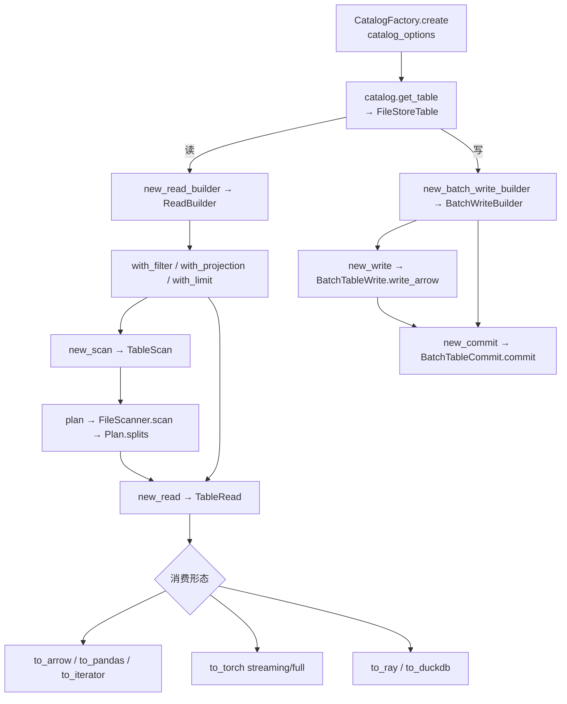
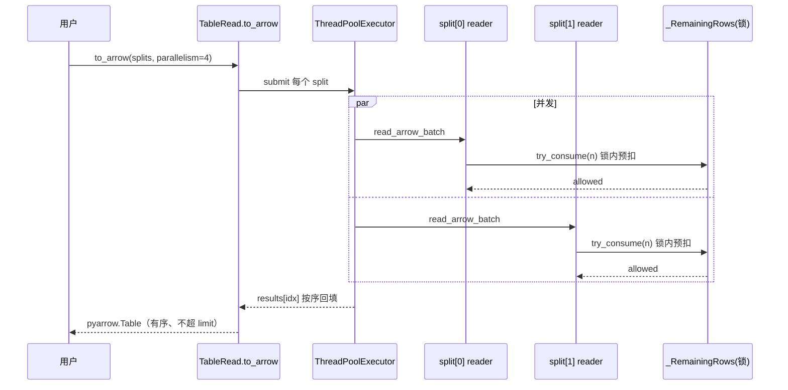
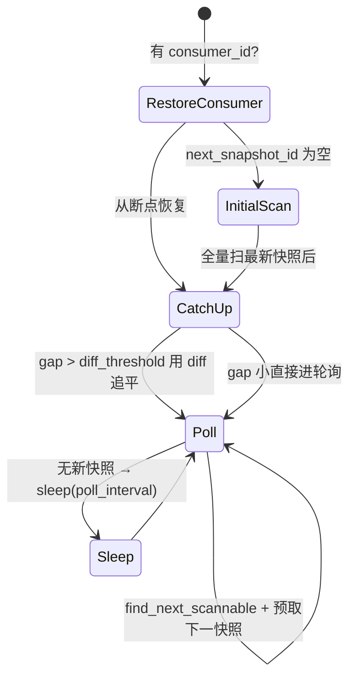

# 27 · PyPaimon 与训练数据加载

> 版本：Apache Paimon `1.5-SNAPSHOT` · Python 包 `pypaimon`（仓库目录 `paimon-python/pypaimon/`）
> 适用读者：构建 ML 特征平台 / 样本数据平台、需要把湖仓表喂进 PyTorch / Ray / Daft / DataFusion 的数据/算法工程师。
> 免责声明：本文所有机制、配置项、类名、方法名均以本仓库当前 commit 源码为准核验；**行号会随版本漂移，请以"类名#方法名"定位**。凡标注"(示意，非逐字源码)"的代码块为作者简化构造；标注类#方法的为真实源码片段。性能数字凡无源码常量支撑者，均显式标注"经验估算"。

---

## 目录

- [1. 业务背景：训练数据加载在 ML 平台中的位置](#1-业务背景训练数据加载在-ml-平台中的位置)
- [2. PyPaimon 总体架构与 Java 侧对照](#2-pypaimon-总体架构与-java-侧对照)
- [3. 纯 Python 读写路径：Catalog → ReadBuilder → TableScan → TableRead](#3-纯-python-读写路径catalog--readbuilder--tablescan--tableread)
- [4. 下推三件套：PredicateBuilder / 投影 / Limit](#4-下推三件套predicatebuilder--投影--limit)
- [5. Arrow 零拷贝读与并行读](#5-arrow-零拷贝读与并行读)
- [6. PyTorch 集成：TorchDataset / TorchIterDataset / prefetch_concurrency](#6-pytorch-集成torchdataset--torchiterdataset--prefetch_concurrency)
- [7. Ray Data 集成：to_ray / read_paimon / write_paimon](#7-ray-data-集成to_ray--read_paimon--write_paimon)
- [8. Daft 集成：下推与原生 Parquet 读](#8-daft-集成下推与原生-parquet-读)
- [9. DataFusion SQL（SQLContext）：跨 catalog JOIN / 时间旅行 / 向量与全文](#9-datafusion-sqlsqlcontext跨-catalog-join--时间旅行--向量与全文)
- [10. with_shard 分布式分片读](#10-with_shard-分布式分片读)
- [11. 增量读 INCREMENTAL_BETWEEN_TIMESTAMP](#11-增量读-incremental_between_timestamp)
- [12. 流式读：row kind + consumer 断点续读](#12-流式读row-kind--consumer-断点续读)
- [13. Commit Callback：写入后回调](#13-commit-callback写入后回调)
- [14. Local Cache 块级缓存](#14-local-cache-块级缓存)
- [15. FUSE 本地直读与 PyJindoSDK](#15-fuse-本地直读与-pyjindosdk)
- [16. 多模态读取：Blob / 全局索引（向量、全文）的 Python 侧用法](#16-多模态读取blob--全局索引向量全文的-python-侧用法)
- [17. 端到端落地范式（可复现）](#17-端到端落地范式可复现)
- [18. 风险与权衡](#18-风险与权衡)
- [19. 关键源码索引（类#方法表）](#19-关键源码索引类方法表)
- [20. 存疑与未核验点](#20-存疑与未核验点)

---

## 1. 业务背景：训练数据加载在 ML 平台中的位置

特征平台 / 样本平台把"事实表 → 特征宽表 → 训练样本"这条链路落到 Paimon 湖仓后，最后一公里永远是：**把表里的样本，以训练框架要的形态、足够的吞吐、可复现的版本，喂进 GPU 训练循环。** 这一步通常不再走 JVM（Spark/Flink），而是直接在 Python 训练进程里完成。原因有三：

1. 训练框架（PyTorch / Ray Train / 自研 trainer）天然是 Python 生态，跨进程拉起 JVM 既笨重又难调度；
2. 算法工程师要在 notebook 里随手 `to_pandas()` / `to_arrow()` 看样本，不愿装 Spark；
3. 训练对"**精确版本**"敏感——同一次实验的训练集必须可复现，需要时间旅行 / tag / snapshot 锁定。

本篇聚焦的就是 **PyPaimon（纯 Python 的 Paimon 读写实现）如何把这条最后一公里跑通**：从 `Catalog` 拿表、下推过滤投影、Arrow 零拷贝读、分片并行、再到 PyTorch `DataLoader` / Ray `Dataset` / Daft / DataFusion 的对接，以及增量/流式/缓存等工程化能力。

> 边界说明：
> - **特征/样本的业务建模逻辑**（特征视图、点查、Time-Travel join、样本拼接）见 [[25-机器学习特征平台]] 与 [[26-机器学习样本数据平台]]，本篇不重复展开，只讲 Python 侧"怎么读出来"。
> - **多模态向量类型本身与索引算法**（HNSW/Lumina、Tantivy 全文）见 [[28-多模态与向量特征]]，本篇只讲 Python API 如何读写它们。
> - Java 侧读写路径见 [[02-表读写路径分析]]；行存储与类型系统见 [[19-数据类型系统与行存储]]。

PyPaimon 与 Java 的能力映射（核验自 `python-api.mdx` 的 "Supported Features" 节）：

| 能力 | PyPaimon 支持度 | 入口 |
|---|---|---|
| FileSystem / REST Catalog | ✅ | `CatalogFactory.create` |
| Append 表（unaware / fixed bucket） | ✅ 读写 | `BatchWriteBuilder` / `ReadBuilder` |
| 主键表（仅 deduplicate；fixed / postpone bucket；DV 读） | ✅ 读写（merge 引擎只支持 deduplicate） | `MergeFileSplitRead` |
| 谓词/投影/Limit 下推 | ✅ | `ReadBuilder.with_*` |
| 增量读 / 流式读 / row-kind | ✅ | `INCREMENTAL_BETWEEN_TIMESTAMP` / `StreamReadBuilder` |
| 分片读 `with_shard` | ✅ | `TableScan.with_shard` |
| Blob 读写、Data Evolution（行级更新/upsert by key） | ✅ | 见 §16 与 [[28-多模态与向量特征]] |

---

## 2. PyPaimon 总体架构与 Java 侧对照

PyPaimon 是 **Paimon 存储格式的一套独立 Python 重实现**（不是 JNI 包装 Java），目录结构与 Java 模块高度同构：

```
pypaimon/
├── catalog/          # FileSystemCatalog / RESTCatalog（对应 Java paimon-core catalog）
├── table/            # FileStoreTable、row/（InternalRow/OffsetRow/Blob）
├── read/             # ReadBuilder / TableScan / TableRead / scanner / reader / datasource
├── write/            # WriteBuilder / TableWrite / TableCommit / FileStoreCommit / writer
├── manifest/         # ManifestList / ManifestFile / DataFileMeta（同构 Java manifest）
├── deletionvectors/  # 位图删除向量
├── globalindex/      # btree / lumina(向量) / tantivy(全文)
├── common/           # predicate / options(CoreOptions) / file_io
├── filesystem/       # local / pyarrow(S3/OSS) / jindo / caching_file_io / pvfs
├── ray/  daft/       # 分布式引擎对接（顶层 read_paimon/write_paimon facade）
└── consumer/ tag/ branch/ snapshot/ schema/  # 版本/元数据管理
```

唯一一个**非纯 Python** 的能力是 SQL：`SQLContext` 由 `pypaimon_rust`（Rust + DataFusion）提供，通过 `pypaimon/__init__.py` 的 `__getattr__` 惰性导入（见 §9）。

**纯 Python 读写主干（对照 [[02-表读写路径分析]] 的 Java 路径）：**



Java↔Python 关键类对照：

| Java（paimon-core/api） | Python（pypaimon） | 备注 |
|---|---|---|
| `Table` / `FileStoreTable` | `pypaimon.table.file_store_table.FileStoreTable` | 入口对象 |
| `ReadBuilder` | `pypaimon.read.read_builder.ReadBuilder` | 下推构造器 |
| `TableScan` / `Split` | `read.table_scan.TableScan` / `read.split.DataSplit` | 切片规划 |
| `TableRead` | `read.table_read.TableRead` | 切片读取，多目标格式 |
| `PredicateBuilder` | `common.predicate_builder.PredicateBuilder` | 谓词工厂 |
| `BatchWriteBuilder/TableWrite/TableCommit` | `write.write_builder.*` / `write.table_write.*` / `write.table_commit.*` | 两阶段提交 |
| `CoreOptions` | `common.options.core_options.CoreOptions` | 配置项（**Python 侧子集**） |

> 注意：Python 的 `CoreOptions` 是 Java 的**子集**——很多 Java 配置项 Python 没有实现。本篇引用任何配置项前，均已在 `pypaimon/common/options/core_options.py` 核验存在。

---

## 3. 纯 Python 读写路径：Catalog → ReadBuilder → TableScan → TableRead

### 3.1 拿表

`CatalogFactory.create` 根据 `metastore` 选 catalog（核验 `catalog/catalog_factory.py#CatalogFactory.create`，注册表只有 `filesystem` 和 `rest` 两类）：

```python
# 真实可运行
from pypaimon import CatalogFactory

catalog = CatalogFactory.create({'warehouse': 'file:///tmp/warehouse'})
table = catalog.get_table('feature_db.user_sample')   # → FileStoreTable
```

`FileStoreTable.__init__`（`table/file_store_table.py`）在构造时就解析好了 `field_names` / `primary_keys` / `partition_keys` / `trimmed_primary_keys` / `options(CoreOptions)` / `bucket_mode`，后续读写都从这里取。

### 3.2 读：四步走

```python
read_builder = table.new_read_builder()           # ReadBuilder(self)
table_scan   = read_builder.new_scan()             # TableScan
splits       = table_scan.plan().splits()          # List[DataSplit]
table_read   = read_builder.new_read()             # TableRead
arrow_table  = table_read.to_arrow(splits)         # pyarrow.Table
```

- `ReadBuilder.new_scan`（`read_builder.py#ReadBuilder.new_scan`）只把 `predicate`/`limit` 透传给 `TableScan`；投影**不进 scan**，scan 阶段只做文件裁剪。
- `ReadBuilder.new_read`（`#new_read`）把 `read_type()`（投影后的字段列表）、`nested_name_paths`、`limit`、`predicate` 一并交给 `TableRead`。

### 3.3 切片规划（TableScan / FileScanner）

`TableScan._create_file_scanner`（`read/table_scan.py`）按 options 选 manifest 扫描策略——这是个**关键分发点**，也是增量读/时间旅行的实现位置：

```python
# read/table_scan.py · TableScan#_create_file_scanner（节选骨架，真实源码）
if options.contains(CoreOptions.INCREMENTAL_BETWEEN_TIMESTAMP):   # 增量读 → §11
    ...
elif options.contains(CoreOptions.SCAN_TAG_NAME):                 # tag 时间旅行
    ...
elif options.contains(CoreOptions.SCAN_SNAPSHOT_ID):              # snapshot 时间旅行
    ...
else:
    def all_manifests():
        snapshot = snapshot_manager.get_latest_snapshot()
        return manifest_list_manager.read_all(snapshot), snapshot
    return FileScanner(self.table, all_manifests, self.predicate, self.limit)
```

`FileScanner.scan`（`read/scanner/file_scanner.py#FileScanner.scan`）读 manifest → 过滤 entry → 调对应的 `SplitGenerator` 打包 split。三类生成器：

| 表类型 | SplitGenerator | raw_convertible（可零拷贝快路） |
|---|---|---|
| 主键表 | `PrimaryKeyTableSplitGenerator` | 单文件且无删除行才 True |
| Append（普通） | `AppendTableSplitGenerator` | 默认 True（见 `split_generator.py#_build_split_from_pack`） |
| Data Evolution | `DataEvolutionSplitGenerator` | 按 row_id 范围对齐 |

文件裁剪的精华在 `FileScanner._filter_manifest_entry`：依次做 **partition 谓词 → bucket 裁剪（HASH_FIXED 选择器 / POSTPONE 合成桶跳过）→ 文件 stats 裁剪**。其中主键 + DV 表有条特殊规则：

```python
# file_scanner.py · FileScanner#_filter_manifest_entry（真实源码片段）
if self.table.is_primary_key_table:
    if self.deletion_vectors_enabled and entry.file.level == 0:  # do not read level 0 file
        return False
```

即 **DV 主键表不读 L0 文件**——L0 是写入缓冲，merge-on-read 时由 L1+ 文件 + 删除向量已表达正确视图，这是 LSM 形态决策而非谓词。详见 [[04-DeletionVectors与文件索引]]。

### 3.4 写：两阶段提交

```python
# 真实可运行（来自 python-api.mdx，已核验 write/table_write.py、table_commit.py 接口）
import pyarrow as pa

write_builder = table.new_batch_write_builder()      # BatchWriteBuilder
table_write   = write_builder.new_write()            # BatchTableWrite
table_commit  = write_builder.new_commit()           # BatchTableCommit

table_write.write_arrow(pa_table)                    # 1) 写数据 → 文件
messages = table_write.prepare_commit()              # 2a) 收集 CommitMessage
table_commit.commit(messages)                        # 2b) 原子提交快照
table_write.close(); table_commit.close()
```

- `TableWrite.write_arrow_batch`（`write/table_write.py`）按 `(partition, bucket)` 分组后逐组 `file_store_write.write`——bucket 由 `create_row_key_extractor()`（按 `bucket_mode` 选 `FixedBucketRowKeyExtractor` 等）计算，与读侧/Ray 重分区使用**同一套哈希**（见 §7 与 [[16-分桶机制原理与实践]]）。
- `BatchTableWrite.prepare_commit` 用 `BATCH_COMMIT_IDENTIFIER`，且**只能提交一次**（`batch_committed` 标志）；流式 `StreamTableWrite.prepare_commit(commit_identifier)` 可多轮。
- ⚠️ `python-api.mdx` 明确："写多次提交一次"目前**只支持 append-only 表**。

**观察验证**（用系统表确认写入生效）：

```python
# 写入后查 $snapshots 系统表（PyPaimon 支持 $snapshots/$files/$manifests 等，见 system-tables.md）
snap = catalog.get_table('feature_db.user_sample$snapshots')
print(snap.new_read_builder().new_read().to_arrow(
    snap.new_read_builder().new_scan().plan().splits()).to_pandas())
# 每次 commit 产生一行；commit_kind=APPEND；schema_id/记录数可对账
```

---

## 4. 下推三件套：PredicateBuilder / 投影 / Limit

### 4.1 PredicateBuilder

`PredicateBuilder`（`common/predicate_builder.py`）用 **字段名 → 索引** 构造 `Predicate(method, index, field, literals)`。支持的方法（逐一核验自源码）：

`equal / not_equal / less_than / less_or_equal / greater_than / greater_or_equal / is_null / is_not_null / startswith / endswith / contains / is_in / is_not_in / between / not_between / like`，以及组合 `and_predicates / or_predicates`（注意：`and/or` 的 `literals` 存的是**子 Predicate 列表**，`index=field=None`）。

```python
# 真实可运行：(score < 3 OR ctr > 0.6) AND dt = '2026-06-01'
pb = read_builder.new_predicate_builder()
p = pb.and_predicates([
    pb.or_predicates([pb.less_than('score', 3), pb.greater_than('ctr', 0.6)]),
    pb.equal('dt', '2026-06-01'),
])
read_builder = read_builder.with_filter(p)
```

谓词在两处生效：
1. **scan 阶段**：`FileScanner` 拆出 `partition_key_predicate` 做 manifest/分区裁剪，`primary_key_predicate` + `predicate_for_stats` 做文件 stats 裁剪（`_filter_manifest_entry`）。
2. **reader 阶段**：剩余行级过滤由 `FilterRecordReader` 等在读数据时完成。

### 4.2 投影（含嵌套）

`ReadBuilder.with_projection(['ctr', 'embedding'])` 顶层投影只取子集；**含点号**（`'info.name'`）触发嵌套投影 `_resolve_dotted_paths`（`read_builder.py`），把 `info.name` 翻成整数路径，下推到 Parquet/ORC 的原生嵌套裁剪（Avro 回落 Python 端抽取）。

```python
read_builder = read_builder.with_projection(['user_id', 'features.age', 'label'])
# 结果列名扁平化为下划线连接：user_id, features_age, label
```

⚠️ 嵌套投影限制（`python-api.mdx` 已述）：仅 append-only 表；需要 merge 的主键表抛 `NotImplementedError`（核验 `table_read.py#_create_split_read`）；`ARRAY<ROW>`、`MAP` 路径暂不支持。

### 4.3 Limit

`with_limit(n)` 在多处协同生效：
- **scan 端**：`FileScanner._apply_push_down_limit`——按 split 的 DV 感知 `merged_row_count()` 累加直到够数，提前砍掉多余 split（仅当无非分区过滤时；对照 Java `DataTableBatchScan.applyPushDownLimit`）。
- **read 端**：`TableRead.to_iterator` / `_arrow_batch_generator` 维护 `remaining` 计数器逐 batch 截断（`batch.slice(0, remaining)`）。
- **并行端**：`_RemainingRows`（`table_read.py`）用单锁**预扣额度**，保证多线程读不超 limit（见 §5）。

---

## 5. Arrow 零拷贝读与并行读

### 5.1 多种消费形态（同一份 splits）

`TableRead`（`read/table_read.py`）一份切片可输出多种格式：

| 方法 | 返回 | 适用 |
|---|---|---|
| `to_arrow(splits, parallelism=None)` | `pyarrow.Table` | 一次性入内存 |
| `to_arrow_batch_reader(splits)` | `pyarrow.ipc.RecordBatchReader` | 流式按 batch 迭代 |
| `to_iterator(splits)` | Python 行迭代器（`OffsetRow`） | 逐行自定义处理 |
| `to_pandas(splits)` | `pandas.DataFrame` | notebook 探索 |
| `to_duckdb(splits, name)` | DuckDB 连接 | 注册成 DuckDB 表跑 SQL |
| `to_ray(splits, ...)` | `ray.data.Dataset` | 分布式 |
| `to_torch(splits, streaming, prefetch_concurrency)` | torch `Dataset`/`IterableDataset` | 训练 |

### 5.2 零拷贝快路（raw_convertible）

当 split `raw_convertible=True`（append 普通文件、或主键单文件无删除）时，reader 是 `RawFileSplitRead` 产出的 `RecordBatchReader`，`to_arrow` 直接走 `read_arrow_batch`——PyArrow 直接把 Parquet/ORC 列块读成 Arrow batch，**不经 Python 行对象**，这是真正的零拷贝列式路径：

```python
# table_read.py · TableRead#_arrow_batch_generator（真实源码骨架）
if isinstance(reader, RecordBatchReader):
    for batch in iter(reader.read_arrow_batch, None):
        if remaining is not None and batch.num_rows > remaining:
            batch = batch.slice(0, remaining)          # 零拷贝切片
        yield batch
else:
    # 主键 merge 路径：逐行 OffsetRow → 65536 行一块组 batch
    ...
```

反之主键 merge 路径（`MergeFileSplitRead`）必须逐行读 `OffsetRow`、做 LSM sort-merge，再 `_convert_rows_to_arrow_batch_with_row_kind` 每 `chunk_size=65536` 行组一个 batch（`table_read.py`，该常量为硬编码）。**结论：训练吞吐想最大化，优先让样本表是 append-only 或经过 compaction 落到可 raw-convert 的形态**（见 [[23-Compaction全链路深度分析]]）。

### 5.3 split 级并行读

`read.parallelism`（核验 `core_options.py#READ_PARALLELISM`，默认 `1`）≥2 且 split ≥2 时启用线程池并行（`_should_run_parallel`）：

```python
# table_read.py · TableRead#_to_arrow_parallel（真实源码骨架）
remaining_state = _RemainingRows(self.limit)       # 共享限额（单锁预扣）
with ThreadPoolExecutor(max_workers=min(effective, len(splits)),
                        thread_name_prefix="pypaimon-read") as ex:
    futures = {ex.submit(self._read_one_split_to_batches, split, schema,
                         remaining_state): idx for idx, split in enumerate(splits)}
    for fut in as_completed(futures):
        results[futures[fut]] = fut.result()       # 按输入顺序回填，保证结果有序
```

**正确性论证**：`_RemainingRows.try_consume` 在锁内"先扣再发"，任意线程承诺要发的行数不会超额（即使某 reader 多解了一个 batch）；结果按 `idx` 回填到定长数组，最终 `from_batches` 保持输入 split 顺序——**limit 精确 + 顺序确定**。运行期可用 `to_arrow(splits, parallelism=4)` 临时覆盖表 option。



---

## 6. PyTorch 集成：TorchDataset / TorchIterDataset / prefetch_concurrency

入口 `TableRead.to_torch(splits, streaming=False, prefetch_concurrency=1)`（`read/table_read.py`）：

- `streaming=False` → `TorchDataset`（`map-style`，`__len__/__getitem__`）：构造时即 `to_arrow(splits).to_pylist()` **一次性全量入内存**，适合小样本集 / 需要随机 shuffle。
- `streaming=True` → `TorchIterDataset`（`IterableDataset`）：**按需流式读**，省内存，适合大样本集。

### 6.1 多 worker 切分

`TorchIterDataset.__iter__`（`read/datasource/torch_dataset.py`）按 DataLoader 的 `worker_info` 把 splits **均分到各 worker**（前 `remainder` 个 worker 多拿一个 split）：

```python
# torch_dataset.py · TorchIterDataset#__iter__（真实源码片段）
worker_info = torch.utils.data.get_worker_info()
if worker_info is None:
    splits_to_process = self.splits            # 单进程
else:
    splits_per_worker = total_splits // num_workers
    remainder = total_splits % num_workers
    if worker_id < remainder:
        start_idx = worker_id * (splits_per_worker + 1); end_idx = start_idx + splits_per_worker + 1
    else:
        start_idx = worker_id * splits_per_worker + remainder; end_idx = start_idx + splits_per_worker
    splits_to_process = self.splits[start_idx:end_idx]
```

每行经 `to_iterator` 拿 `OffsetRow`，转成 `{列名: 值}` dict 产出；`DataLoader` 的 `collate_fn` 默认把 dict 列表聚成 `{列名: tensor/list}` 批（见下面的 output）。

### 6.2 prefetch_concurrency：worker 内多线程预取

`prefetch_concurrency > 1` 时走 `_iter_rows`：把本 worker 的 splits 再按 `splits[i::n]` 切成 n 组，**n 个生产者线程**各自 `to_iterator` 读，结果塞进一个有界队列（`maxsize=512`，硬编码）由主线程消费：

```python
# torch_dataset.py · TorchIterDataset#_iter_rows（真实源码骨架）
split_groups = [splits[i::n] for i in range(n)]      # n = min(prefetch_concurrency, len(splits))
q = queue.Queue(maxsize=self._PREFETCH_QUEUE_MAXSIZE)  # 512
def producer(split_group):
    for offset_row in self.table_read.to_iterator(split_group):
        put_item(self._ROW, self._row_to_dict(offset_row))
    put_item(self._SENTINEL, None)                   # 该线程完成哨兵
# 主线程：收满 n 个 SENTINEL 才结束；遇到 _ERR tag 抛出
```

队列协议三种 tag：`_ROW`（数据）/`_SENTINEL`（某生产者结束）/`_ERR`（异常透传）。超时常量（均硬编码）：put 30s、get 300s、join 5s。`prefetch_concurrency` 的价值在于**对象存储 OSS/S3 读延迟高**时，多线程把 IO 等待重叠起来——典型加速场景是远程 warehouse；本地盘收益有限。

> ⚠️ **吞吐叠乘关系（重要工程认知）**：`DataLoader(num_workers=W)` × `prefetch_concurrency=C` ⇒ 单表最多 `W×C` 个并发 reader 线程同时打对象存储。配大了会触发 OSS QPS 限流，配合 §14 Local Cache 更稳。

### 6.3 端到端可运行示例

```python
# 真实可运行（torch 已装）。来自 pytorch.md，并已核验 to_torch/TorchIterDataset 接口
from torch.utils.data import DataLoader
from pypaimon import CatalogFactory

catalog = CatalogFactory.create({'warehouse': 'file:///tmp/warehouse'})
table = catalog.get_table('feature_db.user_sample')

rb = table.new_read_builder()
# 下推：只取训练需要的列 + 当天分区
pb = rb.new_predicate_builder()
rb = rb.with_filter(pb.equal('dt', '2026-06-01')).with_projection(['user_id', 'behavior'])

splits = rb.new_scan().plan().splits()
table_read = rb.new_read()

dataset = table_read.to_torch(splits, streaming=True, prefetch_concurrency=2)
loader = DataLoader(dataset, batch_size=2, num_workers=2, shuffle=False)

for batch in loader:
    print(batch)
# {'user_id': tensor([1, 2]), 'behavior': ['a', 'b']}
# {'user_id': tensor([3, 4]), 'behavior': ['c', 'd']}
# ...
```

> 注意 `IterableDataset` **不能用 DataLoader 的 `shuffle=True`**（PyTorch 限制）。需要 shuffle 时：要么用 `streaming=False` 的 `TorchDataset`（map-style 支持 shuffle），要么在样本表层面用多桶 + 随机 split 顺序近似打散，或交给 Ray（§7 的 `ds.random_shuffle()`）。

---

## 7. Ray Data 集成：to_ray / read_paimon / write_paimon

### 7.1 三个入口

| 入口 | 位置 | 何时用 |
|---|---|---|
| `pypaimon.ray.read_paimon(id, catalog_options, ...)` | `ray/ray_paimon.py` | 推荐：单调用拿 Dataset |
| `pypaimon.ray.write_paimon(ds, id, catalog_options, ...)` | `ray/ray_paimon.py` | 推荐：单调用写 |
| `TableRead.to_ray(splits, ...)` / `TableWrite.write_ray(ds, ...)` | `read/table_read.py` / `write/table_write.py` | 已有 splits/table_write 时 |

底层都构造 `RayDatasource`（`read/datasource/ray_datasource.py`），区别只在 `SplitProvider`：
- `read_paimon` 用 `CatalogSplitProvider`（惰性拿 catalog + 规划，缓存 splits/read_type）；
- `to_ray` 用 `PreResolvedSplitProvider`（已有 splits，跳过二次 catalog 往返）。

### 7.2 读任务的负载均衡

`RayDatasource.get_read_tasks`（`ray_datasource.py`）的关键设计：
1. **贪心背包按文件大小分块**（`_distribute_splits_into_equal_chunks`）：用最小堆把 split 从大到小塞进当前最小的 chunk，使各 Ray task 处理的数据量尽量均衡——避免长尾 task。
2. **闭包不捕获 self**：用 `functools.partial` 把 table/predicate/read_type/schema/limit 提进局部变量，规避 ray#49107 的序列化开销。
3. **行数估计差异**：主键表 merge 后行数不可预估 → `num_rows=None` 交给 Ray 实算；有谓词时同样 None。
4. **版本兼容**：`RAY_VERSION_SCHEMA_IN_READ_TASK=2.48.0`（schema 从 BlockMetadata 移到 ReadTask）、`RAY_VERSION_PER_TASK_ROW_LIMIT=2.52.0`（`per_task_row_limit` 参数）——这两个常量是版本分支判定，核验自源码。

每个 worker 内部仍是 `TableRead.to_arrow_batch_reader(splits)` 产 Arrow batch，schema 不一致时 `table.cast(schema)` 对齐。

### 7.3 limit 的二次封顶

⚠️ 一个易踩的语义：**每个 worker 独立应用 per-task limit**，N 个 worker 合起来可能产 `N×limit` 行。所以 `read_paimon`/`to_ray` 在外层再 `ds = ds.limit(limit)` 封顶（核验 `ray_paimon.py#read_paimon` 与 `table_read.py#to_ray`）：

```python
# ray_paimon.py · read_paimon（真实源码片段）
if limit is not None:
    ds = ds.limit(limit)   # 每个 worker 各自截断，外层再封顶到用户可见 limit
```

### 7.4 写：自动 (partition, bucket) 重分区

`write_paimon` → `maybe_apply_repartition`（`ray/shuffle.py`）：**仅对 HASH_FIXED 表**，先用与写入端**同一个** `FixedBucketRowKeyExtractor` 给每行算 bucket（`extract_partition_bucket_batch`），再 `groupby(partition_keys + [bucket])` 让每个 `(partition, bucket)` 落到单个 Ray task，避免"`partitions × buckets × ray_tasks` 个小文件"的小文件风暴（小文件治理见 [[11-小文件治理机制]]）：

```python
# ray/shuffle.py · maybe_apply_repartition（真实源码骨架）
if table.bucket_mode() != BucketMode.HASH_FIXED:
    return dataset                                  # 其它桶模式原样写
ds_with_bucket = dataset.map_batches(bucket_udf, batch_format="pyarrow", zero_copy_batch=True)
grouped = ds_with_bucket.groupby(partition_keys + [bucket_col])
regrouped = grouped.map_groups(_identity_batch, batch_format="pyarrow")
return regrouped.drop_columns([bucket_col])
```

`_coerce_large_string_types` 修了个真实坑：某些 Ray 版本 groupby 时把 `string`→`large_string`，而 Paimon writer 用 `!=` 严格比 schema 会拒收，故强制 cast 回普通类型。bucket 临时列名 `__paimon_bucket__`，与用户列冲突时用 UUID 后缀避让（`_pick_bucket_col_name`）。

### 7.5 端到端可运行示例

```python
# 真实可运行（ray 已装）。来自 ray-data.md，已核验 ray_paimon.py 接口
import ray
from pypaimon.ray import read_paimon, write_paimon
from ray.data import DataContext

# 大 split 时调高 Ray block 上限（ray-data.md 建议）
DataContext.get_current().target_max_block_size = 256 * 1024 * 1024

opts = {'warehouse': '/tmp/warehouse'}

# 读：投影 + limit + 时间旅行到某 tag（训练集版本锁定）
ds = read_paimon('feature_db.user_sample', catalog_options=opts,
                 projection=['user_id', 'embedding', 'label'],
                 tag_name='train-2026-06-01',
                 override_num_blocks=8, concurrency=8)
ds = ds.random_shuffle()          # Ray 侧 shuffle（PyTorch IterableDataset 做不到）

for row in ds.take(2):
    print(row)

# Ray Train 里直接 ds.iter_torch_batches(batch_size=...) 喂模型（Ray Train 标准用法）

# 写：自动按 (partition, bucket) 重分区
src = ray.data.read_json('/data/new_samples.jsonl')
write_paimon(src, 'feature_db.user_sample', catalog_options=opts, overwrite=False, concurrency=4)
```

---

## 8. Daft 集成：下推与原生 Parquet 读

`pypaimon.daft.read_paimon / write_paimon`（`daft/daft_paimon.py`）返回 **lazy** `daft.DataFrame`，用标准 `.where()/.select()/.limit()` 触发自动下推（Daft DataSource 协议）。

```python
# 真实可运行（daft 已装）。来自 daft.md，已核验 daft_paimon.py 接口
import daft
from pypaimon.daft import read_paimon

df = read_paimon('feature_db.user_sample', catalog_options={'warehouse': '/tmp/warehouse'})
df = df.where(daft.col('dt') == '2026-06-01')   # 分区裁剪 + 文件 skip
df = df.select('user_id', 'embedding')          # 投影下推：只读这两列
df = df.limit(1000)                              # limit 下推
df.show()
```

读路径关键点（核验 `daft/daft_paimon.py#_read_table` + `daft.md`）：
- append-only Parquet 表用 **Daft 原生高性能 Parquet reader**；需要 LSM merge 的主键表回落 pypaimon 内置 reader。
- 时间旅行：`snapshot_id` / `tag_name` 互斥，内部 `table.copy({'scan.snapshot-id': ...})`。
- IO：未传 `io_config` 时从 catalog_options 推断（`_convert_paimon_catalog_options_to_io_config`）；Ray runner 下 `multithreaded_io=False`。

写：`_write_table` → `df.write_sink(PaimonDataSink(table, mode))`，`mode` 取 `append`/`overwrite`。另有 `PaimonCatalog`/`PaimonTable` 适配 Daft 统一 Catalog/Table 接口（`daft.md` 末节）。

> 与 §16 衔接：Daft 也有 `daft_blob.py`，可处理 Blob 列；多模态细节见 [[28-多模态与向量特征]]。

---

## 9. DataFusion SQL（SQLContext）：跨 catalog JOIN / 时间旅行 / 向量与全文

唯一非纯 Python 能力。`from pypaimon import SQLContext` 通过 `__init__.py` 的 `__getattr__` 惰性导入 `pypaimon_rust.datafusion.SQLContext`（核验 `pypaimon/__init__.py`），需 `pip install pypaimon[sql]`。

```python
# 真实可运行（装了 pypaimon[sql]）。来自 sql.md
from pypaimon import SQLContext        # 等价 from pypaimon_rust.datafusion import SQLContext
import pyarrow as pa

ctx = SQLContext()
ctx.register_catalog('paimon', {'warehouse': '/tmp/warehouse'})
ctx.set_current_catalog('paimon'); ctx.set_current_database('default')

batches = ctx.sql("SELECT user_id, label FROM user_sample WHERE dt='2026-06-01'")
table = pa.Table.from_batches(batches)     # 直接 Arrow，再 to_pandas/喂训练
```

**跨 catalog JOIN**（样本平台典型：在线特征 catalog ⋈ 离线标签 catalog）：

```python
ctx.register_catalog('feat', {'warehouse': '/wh_feat'})
ctx.register_catalog('label', {'metastore': 'rest', 'uri': 'http://rest:8080', 'warehouse': 'wh_label'})
batches = ctx.sql("""
  SELECT f.user_id, f.embedding, l.click
  FROM feat.default.features  AS f
  JOIN label.default.labels   AS l ON f.user_id = l.user_id
  WHERE f.dt = '2026-06-01'
""")
```

`sql.md` 列出的能力（DataFusion + paimon-rust）：DDL/DML（含 `MERGE INTO`、`INSERT OVERWRITE`）、**时间旅行 `VERSION AS OF` / `TIMESTAMP AS OF`**、`vector_search()` / `full_text_search()` 表函数、系统表 `$snapshots/$schemas/...`、`COUNT(*)` 下推。复杂 JOIN/窗口/CTE 走 DataFusion 语法。

> 取舍：SQLContext 一次性把多表 JOIN + 过滤交给 Rust/DataFusion 算完，对"样本拼接"很顺手；但它是独立引擎，与纯 Python `ReadBuilder` 的 split/流式/分片 API **不互通**，二者按场景择一。

---

## 10. with_shard 分布式分片读

`TableScan.with_shard(idx, n)`（`read/table_scan.py`）把全表按**行**均分成 n 片读第 idx 片，是无 Ray 时手搓数据并行的基础（每个训练进程读一片）。

### 10.1 算法逐步推导

落到 `AbstractSplitGenerator._compute_shard_range`（`read/scanner/split_generator.py`）做**均衡分配**——前 `remainder` 片各多 1 行，避免最后一片超载：

```python
# split_generator.py · _compute_shard_range（真实源码）
base = total_row // n; remainder = total_row % n
if idx < remainder:
    num_row = base + 1; start = idx * (base + 1)
else:
    num_row = base;     start = remainder * (base + 1) + (idx - remainder) * base
end = start + num_row
return start, end          # [start, end) 行区间
```

然后 `AppendTableSplitGenerator.__filter_by_slice` 把行区间映射到文件：跨越区间边界的首尾文件被包成 `SlicedSplit`（只读文件内某段行），中间整文件原样读。`_compute_file_range` 处理四种相交情形（完全包含/左切/右切/完全在外返回 `(-1,-1)`）。

**不变量**：所有分片 `[start_i, end_i)` 严格无重叠且并集 = `[0, total_row)` ⇒ **拼接 n 片 = 全表**（`python-api.mdx` 的 shard 示例正是这样验证：`concat(shard0, shard1, shard2) == full`）。

### 10.2 约束与示例

`with_shard` 与 `with_slice` 互斥（同时设抛异常）；`idx < n` 否则 `ValueError`（核验 `file_scanner.py#with_shard`）。

```python
# 真实可运行：3 个训练进程，进程 i 读第 i 片
rb = table.new_read_builder()
table_read = rb.new_read()
splits = rb.new_scan().with_shard(MY_RANK, 3).plan().splits()  # MY_RANK ∈ {0,1,2}
local_arrow = table_read.to_arrow(splits)
```

> 与 PyTorch 配合：`DataLoader(num_workers)` 是**进程内** split 均分（§6.1），`with_shard` 是**进程/节点间**行均分——两者可叠加（节点级 with_shard，节点内 num_workers）。

---

## 11. 增量读 INCREMENTAL_BETWEEN_TIMESTAMP

样本平台每天产新样本，训练时常要"只读今天新增"。批式增量读用 `CoreOptions.INCREMENTAL_BETWEEN_TIMESTAMP`（核验 `core_options.py#INCREMENTAL_BETWEEN_TIMESTAMP`，无默认值），值是字符串 `"startMillis,endMillis"`，**start 排他、end 包含**。

实现在 `TableScan._create_file_scanner`（`read/table_scan.py`）：

```python
# table_scan.py · TableScan#_create_file_scanner（真实源码骨架）
if options.contains(CoreOptions.INCREMENTAL_BETWEEN_TIMESTAMP):
    ts = options.get(...).split(",")          # 必须正好 2 个，否则 ValueError
    start_ts, end_ts = int(ts[0]), int(ts[1])
    # 边界：start>=end 报错；区间与快照时间无交集 → 返回空 plan
    starting_snapshot = snapshot_manager.earlier_or_equal_time_mills(start_ts)
    ...
    def incremental_manifest():
        for sid in range(start_id + 1, end_id + 1):
            snap = snapshot_manager.get_snapshot_by_id(sid)
            if snap.commit_kind == "APPEND":          # 只取 APPEND 增量，跳过 COMPACT/OVERWRITE
                snapshots_in_range.append(snap)
        for snap in snapshots_in_range:
            manifests.extend(manifest_list_manager.read_delta(snap))   # 读每个快照的 delta
        return manifests, end_snapshot
```

**关键语义**（逐条核验源码）：
- 只累加 `commit_kind == "APPEND"` 的快照的 **delta manifest**（新增文件），天然过滤 compaction/overwrite 噪声；
- 若 `earliest_snapshot.time_millis > start_ts`，把 `start_id` 调到 `earliest-1` 以包含最早快照；
- 多个边界 case 返回 `FileScanner(self.table, lambda: ([], None))`（空 plan）。

```python
# 真实可运行。来自 python-api.mdx（注意：mdx 里 import 路径为 pypaimon.common.core_options，
# 实际生效的常量在 pypaimon.common.options.core_options.CoreOptions）
from pypaimon.common.options.core_options import CoreOptions
from pypaimon.snapshot.snapshot_manager import SnapshotManager

sm = SnapshotManager(table.file_io, table.table_path, table.current_branch(),
                     table.catalog_environment.snapshot_loader())
t1 = sm.get_snapshot_by_id(1).time_millis
t2 = sm.get_snapshot_by_id(2).time_millis

table_inc = table.copy({CoreOptions.INCREMENTAL_BETWEEN_TIMESTAMP.key(): f"{t1},{t2}"})
rb = table_inc.new_read_builder()
delta = rb.new_read().to_arrow(rb.new_scan().plan().splits())   # 仅 (t1, t2] 的 APPEND 增量
```

> 观察验证：`$snapshots` 系统表里看到的 `time_millis` 即增量边界候选；增量 plan 的 split 文件应是这些快照 delta 里 `commit_kind=APPEND` 的新文件。changelog 增量见 [[24-Changelog机制全链路分析]]。

---

## 12. 流式读：row kind + consumer 断点续读

实时样本管道（Flink 写、Python 流式训练/在线更新）用 `StreamReadBuilder`（`read/stream_read_builder.py`）→ `AsyncStreamingTableScan`（`read/streaming_table_scan.py`）。

### 12.1 流式扫描状态机

`AsyncStreamingTableScan.stream()` 是个 async generator，状态推进如下：



要点（核验 `streaming_table_scan.py`）：
- **首次全量**：`_create_initial_plan` 扫最新快照全部文件；之后 `next_snapshot_id = latest.id + 1`。
- **追平（catch-up）**：从早快照启动且 `gap > diff_threshold`（默认 10）时，用 `IncrementalDiffScanner` 一次性 diff 追平，避免逐快照爬。
- **follow-up scanner 自动选型**：`_create_follow_up_scanner` 看 `changelog-producer`——`none`→`DeltaFollowUpScanner`（读 delta manifest），`input/full-compaction/lookup`→`ChangelogFollowUpScanner`（读 changelog manifest）。
- **预取**：单线程 `ThreadPoolExecutor` 提前 `find_next_scannable`（lookahead 10），yield 前已经把下一批准备好（`_start_prefetch`）。
- **默认只处理 APPEND**：`python-api.mdx` 明确 COMPACT/OVERWRITE 被跳过。

### 12.2 row kind（CDC 流）

`with_include_row_kind(True)` 让输出多一列 `_row_kind`（首列），值 `+I/-U/+U/-D`（`read/table_read.py#ROW_KIND_COLUMN="_row_kind"`；`OffsetRow.get_row_kind` 用 `row_kind_byte` 惰性实例化 `RowKind`）。这对"用 changelog 流增量更新在线特征/样本"是核心：

```python
# 真实可运行（来自 python-api.mdx，已核验 stream_read_builder.py / table_read.py）
import asyncio
sb = table.new_stream_read_builder().with_include_row_kind(True).with_poll_interval_ms(1000)
scan = sb.new_streaming_scan(); tr = sb.new_read()

async def run():
    async for plan in scan.stream():
        at = tr.to_arrow(plan.splits())
        for row in at.to_pylist():
            rk = row['_row_kind']
            if rk == '+I':   handle_insert(row)
            elif rk == '-D': handle_delete(row)
            elif rk in ('-U', '+U'): handle_update(row)
asyncio.run(run())
```

### 12.3 consumer 断点续读

`with_consumer_id('trainer-1')` 启用进度持久化。consumer 文件落在 `{table}/consumer/consumer-{id}`（`consumer/consumer_manager.py`，内容 `{"nextSnapshot": N}`，见 `consumer.py`）。

**at-least-once 语义的实现细节**（`streaming_table_scan.py#_stage_consumer` / `_flush_pending_consumer`）：yield 前只 **stage**（暂存 `next_snapshot_id`），等 caller 下次 `__anext__()`（即已处理完上一批）才 **flush 落盘**。这样保证"消费者处理完才推进位点"，崩溃重启会重读最后一批而非漏读。

```python
# streaming_table_scan.py · _flush_pending_consumer（真实源码片段）
def _flush_pending_consumer(self):
    if self._consumer_manager and self._consumer_id and self._pending_consumer_snapshot is not None:
        self._consumer_manager.reset_consumer(
            self._consumer_id, Consumer(next_snapshot=self._pending_consumer_snapshot))
        self._pending_consumer_snapshot = None
```

consumer 另一价值：`ConsumerManager.min_next_snapshot()` 让快照过期机制知道"最老消费者还没读到哪"，防止把未消费的快照清掉。

**并行消费**（类 Kafka consumer group）：`with_buckets([0,1,2])` / `with_bucket_filter(lambda b: b % 2 == 0)`——`AsyncStreamingTableScan._filter_entries_for_shard` 按 bucket 过滤 manifest entry，多消费者读不相交桶集（核验 `stream_read_builder.py#with_buckets`）。

**观察验证**：

```python
m = table.consumer_manager()
print(m.consumers())           # {'trainer-1': 7}  ← nextSnapshot 推进可见
print(m.min_next_snapshot())   # 7
```

---

## 13. Commit Callback：写入后回调

特征/样本写入后常要"发消息通知下游训练、同步元数据"。`CommitCallback`（`write/commit_callback.py`）是抽象基类，**必须幂等**（提交后崩溃可能重复回调）：

```python
# write/commit_callback.py（真实源码：抽象类 + 上下文 dataclass）
@dataclass
class CommitCallbackContext:
    snapshot: Snapshot
    commit_entries: List[ManifestEntry]
    identifier: int

class CommitCallback(ABC):
    @abstractmethod
    def call(self, context: CommitCallbackContext) -> None: ...
    def close(self) -> None: ...
```

注册到 `TableCommit.add_commit_callback`（`write/table_commit.py`），回调列表透传给 `FileStoreCommit`，在快照成功落盘后触发：

```python
# 真实可运行（来自 python-api.mdx，已核验 commit_callback.py / table_commit.py）
from pypaimon.write.commit_callback import CommitCallback, CommitCallbackContext

class NotifyTrainer(CommitCallback):
    def call(self, ctx: CommitCallbackContext) -> None:
        # 幂等：用 ctx.snapshot.id / ctx.identifier 去重，再发消息
        print(f"snapshot {ctx.snapshot.id}, {len(ctx.commit_entries)} entries, id={ctx.identifier}")
    def close(self) -> None:
        pass

wb = table.new_batch_write_builder()
w = wb.new_write(); c = wb.new_commit()
c.add_commit_callback(NotifyTrainer())
w.write_arrow(data); c.commit(w.prepare_commit())
w.close(); c.close()
```

`commit_entries` 在 row-tracking 开启时每条带 `file.first_row_id`，可用于精确告知下游"新增了哪些 row_id 区间"——衔接 Data Evolution 的样本增量训练（见 [[28-多模态与向量特征]] 的 Data Evolution 段与本篇 §16）。

---

## 14. Local Cache 块级缓存

远程 warehouse（OSS/S3）训练时，每个 epoch 重复读同样的文件，块级缓存能显著省 IO。`CachingFileIO`（`filesystem/caching_file_io.py`）是 `FileIO` 装饰器，**块粒度**缓存读。

### 14.1 配置项（全部核验自 core_options.py）

| 配置 | 默认 | 说明 |
|---|---|---|
| `local-cache.enabled` | `false` | 开关 |
| `local-cache.dir` | 无 | 配了 → **磁盘缓存**，否则 **内存 LRU** |
| `local-cache.max-size` | 无（≈无限） | 缓存上限 |
| `local-cache.block-size` | `1 MiB` | 块大小 |
| `local-cache.whitelist` | `meta,global-index` | **只缓存白名单类型** |

白名单默认只缓存 `meta` 和 `global-index`（`CachingFileIO.__init__` 的 `{FileType.META, FileType.GLOBAL_INDEX}`），可扩到 `data`/`file-index`/`bucket-index`。

### 14.2 块级读 + LRU

```python
# caching_file_io.py · CachingInputStream#read（真实源码骨架）
first_block = self._pos // block_size
last_block  = (end - 1) // block_size
for bi in range(first_block, last_block + 1):
    block_data = self._read_block(bi)        # 命中缓存直接返回；否则远程读整块后 put
    # 按 [start_in_block, end_in_block) 切片拼回
```

- 内存版 `LocalMemoryCacheManager`：`OrderedDict` + `move_to_end` 实现 LRU，超限 `popitem(last=False)` 淘汰最旧。
- 磁盘版 `LocalDiskCacheManager`：缓存路径 = `sha256("{file_path}:{block_index}")` 前 2 位分目录；写用 `tmp + os.rename` 保证原子；启动 `_scan_and_populate_index` 重建索引和 LRU 顺序。
- **可变文件不缓存**：`new_input_stream` 里 `FileType.is_mutable(path)` 为真时直读 delegate（避免缓存会变的文件）。

> 与 §6.2/§7 配合：训练时 `prefetch_concurrency` / Ray 多 worker 把并发拉高，Local Cache 把热块（manifest、全局索引）留在本地，二者叠加既提吞吐又抗限流。全局索引尤其受益（见 `global-index.md` 末尾的建议）。

```python
# 真实可运行：开启磁盘块缓存读
t = table.copy({
    'local-cache.enabled': 'true',
    'local-cache.dir': '/ssd/paimon-cache',
    'local-cache.max-size': '20 gb',
    'local-cache.whitelist': 'meta,global-index,data',   # 训练热数据也缓存
})
rb = t.new_read_builder()
arrow = rb.new_read().to_arrow(rb.new_scan().plan().splits())
```

> ⚠️ 注：缓存管理器的装配（`wrap_with_caching_if_needed` / `create_cache_manager`）在 `CachingFileIO` 静态方法里完成，缓存实例由调用方持有。不同 catalog/FileIO 的装配时机本篇未逐条追到调用点，标注于 §20。

---

## 15. FUSE 本地直读与 PyJindoSDK

### 15.1 FUSE 本地直读

REST Catalog + 对象存储挂载到本地（FUSE）时，可绕过远程 SDK 直读本地路径。`FusePathResolver`（`catalog/rest/fuse_support.py`）做路径映射 + 校验。

配置（核验 `fuse-support.md` + `fuse_support.py`）：`fuse.enabled` / `fuse.root` / `fuse.validation-mode`（`strict`|`warn`|`none`）；映射模式 `fuse.mode`（`pvfs` 默认 / `raw`）。

```python
# fuse_support.py · FusePathResolver#resolve_local_path（pvfs 模式，真实源码片段）
if self.fuse_mode == "pvfs":
    db = identifier.get_database_name(); obj = identifier.get_object_name()
    return "{}/{}/{}".format(root, db, obj) if obj else "{}/{}".format(root, db)
```

即把 `oss://clg-xxx/db-xxx/tbl-xxx`（UUID 物理路径）映射成 `<fuse.root>/<db逻辑名>/<table逻辑名>`，校验通过则用 `FuseLocalFileIO` 本地读。`strict` 校验失败抛错、`warn` 回落默认 FileIO、`none` 跳过校验。

```python
# 真实可运行（来自 fuse-support.md）
from pypaimon import CatalogFactory
catalog = CatalogFactory.create({
    'metastore': 'rest', 'uri': 'http://rest:8080', 'warehouse': 'oss://my-catalog/',
    'fuse.enabled': 'true', 'fuse.root': '/mnt/fuse/warehouse', 'fuse.validation-mode': 'strict',
})
table = catalog.get_table('my_db.my_table')
reader = table.new_read_builder().new_read()   # 命中 FUSE 后走本地 IO
```

限制：只支持 catalog 级单一 `fuse.root`；只校验路径存在性，不校验数据一致性。

### 15.2 PyJindoSDK

装了 `pyjindosdk` 后 PyPaimon **自动**用它访问 OSS（性能优于 PyArrow S3FileSystem，`pyjindosdk-support.md`），无需配置。回落两法：`fs.oss.impl=legacy` 或卸载 `pyjindosdk`（对应 `filesystem/jindo_file_system_handler.py`）。

> 三者关系：**FUSE**（本地挂载直读）> **JindoSDK**（OSS 原生高性能 SDK）> **PyArrow S3FileSystem（legacy）**，按可用性自动择优；再叠 §14 Local Cache 进一步省重复 IO。

---

## 16. 多模态读取：Blob / 全局索引（向量、全文）的 Python 侧用法

> 多模态类型/索引算法本体见 [[28-多模态与向量特征]]，此处只讲 **Python 侧怎么读写**。

### 16.1 Blob（大对象，如图片/音频字节）

`pypaimon/table/row/blob.py`：`BlobDescriptor`（v2，含 8 字节 magic `0x424C4F4244455343`="BLOBDESC"）描述 `(uri, offset, length)`，序列化布局：

```
[version:1B][magic:8B (v>1)][uri_len:4B][uri bytes][offset:8B signed][length:8B signed]   (小端)
```

`BLOB` 类型映射 `pyarrow.large_binary()`（核验 `python-api.mdx` 数据类型表）。读时可选 `blob-as-descriptor`（核验 `core_options.py#BLOB_AS_DESCRIPTOR`，默认 `false`）：true 时读出的是序列化的 `BlobDescriptor` 字节（不取真实大对象，省带宽），用 `BlobRef.new_input_stream()`（内部 `OffsetInputStream` 只读 `[offset, offset+length)` 段）按需拉取：

```python
# 真实可运行（示意训练时延迟加载图片字节，已核验 blob.py 接口）
from pypaimon.table.row.blob import BlobDescriptor, Blob
# 假设某列读出的是 descriptor 字节（blob-as-descriptor=true）
desc = BlobDescriptor.deserialize(desc_bytes)
blob = Blob.from_descriptor(uri_reader, desc)   # uri_reader 来自 FileUriReader(file_io)
img_bytes = blob.to_data()                      # 真正读那一段
```

### 16.2 全局索引：向量 ANN 与全文检索（两段式）

PyPaimon 支持读 Data Evolution（append）表上的全局索引（`globalindex/`，含 `btree`、`lumina`(向量)、`tantivy`(全文)），索引须由 Spark/Flink 预先构建。

- **BTree 标量索引**：无需特殊 API，`with_filter` 命中索引列时 `FileScanner._eval_global_index` 自动用（前提 `global-index.enabled=true`，核验 `core_options.py#GLOBAL_INDEX_ENABLED` 默认 `True`）。
- **向量 / 全文**：两段式——先 search 拿 row id 结果，再 `scan.with_global_index_result(result)` 读真实数据。方法名核验自 `vector_search_builder.py` / `full_text_search_builder.py`。

```python
# 真实可运行（来自 global-index.md，已核验 builder 方法名）
# —— 向量 ANN（图文检索样本召回）
res = (table.new_vector_search_builder()
       .with_vector_column('embedding')
       .with_query_vector([0.1, 0.2, 0.3, ...])
       .with_limit(10)
       .execute_local())
rb = table.new_read_builder(); scan = rb.new_scan()
scan.with_global_index_result(res)
data = rb.new_read().to_arrow(scan.plan().splits())

# —— 全文检索
res = (table.new_full_text_search_builder()
       .with_text_column('content').with_query_text('搜索关键词').with_limit(20)
       .execute_local())
scan = table.new_read_builder().new_scan(); scan.with_global_index_result(res)
data = table.new_read_builder().new_read().to_arrow(scan.plan().splits())
```

`with_global_index_result` 把结果存进 `FileScanner._global_index_result`，`_create_data_evolution_split_generator` 把它转成 row_id 区间用于 manifest/entry 裁剪（`file_scanner.py`）。远程读时务必配合 §14 Local Cache 缓存 `global-index` 类型。

### 16.3 Data Evolution 行级更新/upsert（样本回填）

`row-tracking.enabled=true` + `data-evolution.enabled=true` 后，可按 `_ROW_ID` 局部更新列、按业务键 `upsert_by_arrow_with_key`、或分片 `new_shard_updator` 计算派生列回写（`data-evolution.md`）。这正是"给样本表加一个新特征列后回填"的典型操作。完整 API 与示例见 [[28-多模态与向量特征]] 与 `data-evolution.md`；本篇只点出它在样本回填里的位置。

---

## 17. 端到端落地范式（可复现）

### 17.1 建表 → 写样本 → 训练读（PyTorch，单机）

```python
# 真实可运行：完整闭环
import pyarrow as pa
from pypaimon import CatalogFactory, Schema
from torch.utils.data import DataLoader

catalog = CatalogFactory.create({'warehouse': 'file:///tmp/wh'})
catalog.create_database('ml', ignore_if_exists=True)

pa_schema = pa.schema([
    ('user_id', pa.int64()),
    ('embedding', pa.list_(pa.float32())),   # ARRAY<FLOAT>
    ('label', pa.int32()),
    ('dt', pa.string()),
])
schema = Schema.from_pyarrow_schema(pa_schema, partition_keys=['dt'],
                                    options={'bucket': '4', 'bucket-key': 'user_id'})
catalog.create_table('ml.sample', schema, ignore_if_exists=True)
table = catalog.get_table('ml.sample')

# 写一批样本
wb = table.new_batch_write_builder(); w = wb.new_write(); c = wb.new_commit()
data = pa.table({
    'user_id': pa.array([1, 2, 3, 4], pa.int64()),
    'embedding': pa.array([[0.1,0.2],[0.3,0.4],[0.5,0.6],[0.7,0.8]], pa.list_(pa.float32())),
    'label': pa.array([0, 1, 0, 1], pa.int32()),
    'dt': pa.array(['2026-06-01']*4),
})
w.write_arrow(data); c.commit(w.prepare_commit()); w.close(); c.close()

# 锁版本：给当天打 tag，保证实验可复现
table.create_tag('train-2026-06-01', ignore_if_exists=True)

# 训练读：时间旅行到 tag + 投影 + 流式 torch
t_train = table.copy({'scan.tag-name': 'train-2026-06-01'})
rb = t_train.new_read_builder().with_projection(['embedding', 'label'])
splits = rb.new_scan().plan().splits()
ds = rb.new_read().to_torch(splits, streaming=True, prefetch_concurrency=2)
for batch in DataLoader(ds, batch_size=2, num_workers=2):
    print(batch)   # {'embedding': [...], 'label': tensor([...])}
```

### 17.2 分布式训练读（Ray Train 风格）

```python
# 真实可运行骨架
from pypaimon.ray import read_paimon
ds = read_paimon('ml.sample', catalog_options={'warehouse': '/tmp/wh'},
                 projection=['embedding', 'label'], tag_name='train-2026-06-01',
                 override_num_blocks=16, concurrency=16).random_shuffle()
# Ray Train: trainer 内 ds.iter_torch_batches(batch_size=256) 喂模型
```

### 17.3 实时样本流式消费（断点续读）

```python
import asyncio
sb = (table.new_stream_read_builder()
      .with_consumer_id('online-trainer')      # 断点续读
      .with_include_row_kind(True)             # 处理 CDC
      .with_buckets([0, 1]))                   # 本消费者只读桶 0/1
scan = sb.new_streaming_scan(); tr = sb.new_read()
async def run():
    async for plan in scan.stream():
        at = tr.to_arrow(plan.splits())
        update_online_features(at)             # 处理完后位点才推进
asyncio.run(run())
```

---

## 18. 风险与权衡

1. **PyPaimon 是 Java 的功能子集**。主键表 merge 引擎只支持 `deduplicate`（partial-update/aggregation 写不支持）；`CoreOptions` 缺很多 Java 项。生产前务必核对 `python-api.mdx` 的 "Supported Features" 与 `core_options.py`，**不要假定 Java 的配置项 Python 都有**。
2. **主键 merge 读没有零拷贝**。需逐行 `OffsetRow` 做 sort-merge 再每 65536 行组 batch（§5.2），训练吞吐远低于 append-only 零拷贝路径。**对策**：样本表尽量 append-only；或定期 compaction 让文件落到可 raw-convert 形态（[[23-Compaction全链路深度分析]]）。
3. **并发线程叠乘打爆对象存储**。`num_workers × prefetch_concurrency`（或 Ray task 数）= 并发 reader 数，配大触发 OSS QPS 限流。**对策**：限并发 + Local Cache（§14）+ JindoSDK/FUSE（§15）。
4. **Ray/per-task limit 会超额**，靠外层 `ds.limit()` 封顶（§7.3）——自己用 `RayDatasource` 时别忘了封顶。
5. **流式 consumer 是 at-least-once**，崩溃重启会重读最后一批（§12.3），下游处理必须幂等（与 Commit Callback 幂等要求一致）。
6. **`IterableDataset` 不支持 DataLoader `shuffle`**（§6.3）。需 shuffle 用 `TorchDataset`（全量入内存）或 Ray `random_shuffle()`。
7. **嵌套投影限制**：仅 append-only；主键 merge 抛 `NotImplementedError`；`ARRAY<ROW>`/`MAP` 路径不支持（§4.2）。
8. **VARIANT 仅 Parquet**（ORC/Avro 不支持），且不能做主键/分区键（`python-api.mdx`）。
9. **SQLContext 与纯 Python API 不互通**：SQL 走 Rust/DataFusion 独立引擎，没有 split/分片/流式接口，按场景择一（§9）。
10. **行号会漂移**：本文定位一律以"类#方法"为准。

---

## 19. 关键源码索引（类#方法表）

> 路径相对 `D:/javaproject/paimon/paimon-python/`。行号略（会漂移）。

| 主题 | 类#方法 / 位置 | 结论 |
|---|---|---|
| 读入口 | `pypaimon/read/read_builder.py` · `ReadBuilder.with_filter/with_projection/with_limit/new_scan/new_read` | 下推构造器；点号触发嵌套投影 |
| 切片规划 | `read/table_scan.py` · `TableScan._create_file_scanner` | 增量/tag/snapshot/全量四分发 |
| 文件裁剪 | `read/scanner/file_scanner.py` · `FileScanner.scan / _filter_manifest_entry / _apply_push_down_limit` | 分区/桶/stats 三段裁剪；DV 主键表不读 L0 |
| 读取多形态 | `read/table_read.py` · `TableRead.to_arrow / to_iterator / to_pandas / to_duckdb / to_ray / to_torch` | 一份 splits 多目标 |
| 并行读限额 | `read/table_read.py` · `TableRead._to_arrow_parallel` / `_RemainingRows.try_consume` | 单锁预扣，精确 limit + 有序 |
| reader 分发 | `read/table_read.py` · `TableRead._create_split_read` | merge / data-evolution / raw 三类 |
| 谓词 | `common/predicate_builder.py` · `PredicateBuilder.*` | equal/in/between/like/and/or 等 |
| 配置项 | `common/options/core_options.py` · `CoreOptions` | Python 侧配置项**权威清单** |
| PyTorch | `read/datasource/torch_dataset.py` · `TorchDataset` / `TorchIterDataset.__iter__ / _iter_rows` | map/iter；worker 切分；预取队列(512) |
| PyTorch 入口 | `read/table_read.py` · `TableRead.to_torch` | streaming + prefetch_concurrency |
| Ray facade | `ray/ray_paimon.py` · `read_paimon / write_paimon` | 单调用读写；limit 外层封顶 |
| Ray datasource | `read/datasource/ray_datasource.py` · `RayDatasource.get_read_tasks / _distribute_splits_into_equal_chunks` | 贪心背包均衡；版本兼容常量 |
| Ray 重分区 | `ray/shuffle.py` · `maybe_apply_repartition` | HASH_FIXED 按 (part,bucket) groupby |
| Ray 写 | `write/table_write.py` · `TableWrite.write_ray` | Datasink 提交 |
| Daft | `daft/daft_paimon.py` · `read_paimon / write_paimon / _read_table` | 下推；原生 Parquet；时间旅行 |
| SQL | `pypaimon/__init__.py` · `__getattr__('SQLContext')` → `pypaimon_rust.datafusion.SQLContext` | Rust/DataFusion；跨 catalog JOIN |
| 分片 | `read/table_scan.py` · `TableScan.with_shard`；`read/scanner/split_generator.py` · `_compute_shard_range / _compute_file_range` | 行级均衡均分；首尾 SlicedSplit |
| 增量读 | `read/table_scan.py` · `TableScan._create_file_scanner`（INCREMENTAL_BETWEEN_TIMESTAMP 分支） | 只累加 APPEND delta；start 排他 end 包含 |
| 流式扫描 | `read/streaming_table_scan.py` · `AsyncStreamingTableScan.stream / _flush_pending_consumer / _create_follow_up_scanner` | 全量→追平→轮询+预取；at-least-once |
| 流式构造 | `read/stream_read_builder.py` · `StreamReadBuilder.with_include_row_kind / with_consumer_id / with_buckets` | row kind + consumer + 桶过滤 |
| consumer | `consumer/consumer_manager.py` · `ConsumerManager.reset_consumer / min_next_snapshot`；`consumer/consumer.py` · `Consumer` | `{table}/consumer/consumer-{id}` |
| Commit Callback | `write/commit_callback.py` · `CommitCallback / CommitCallbackContext`；`write/table_commit.py` · `TableCommit.add_commit_callback` | 幂等；快照成功后触发 |
| Local Cache | `filesystem/caching_file_io.py` · `CachingFileIO / CachingInputStream / LocalDiskCacheManager / LocalMemoryCacheManager` | 块级 LRU；白名单；可变文件不缓存 |
| FUSE | `catalog/rest/fuse_support.py` · `FusePathResolver.resolve_local_path / validate` | pvfs/raw 映射；strict/warn/none 校验 |
| Jindo | `filesystem/jindo_file_system_handler.py` | 自动启用；`fs.oss.impl=legacy` 回落 |
| Blob | `table/row/blob.py` · `BlobDescriptor.(de)serialize / BlobRef.new_input_stream / OffsetInputStream` | v2 magic；offset/length 段读 |
| 全局索引 | `read/scanner/file_scanner.py` · `FileScanner._eval_global_index`；`table/source/vector_search_builder.py` / `full_text_search_builder.py` · `execute_local` | 两段式：search → with_global_index_result |
| 写主干 | `write/table_write.py` · `TableWrite.write_arrow_batch`；`write/table_commit.py` · `BatchTableCommit.commit` | 按 (part,bucket) 分组；两阶段提交 |
| 表对象 | `table/file_store_table.py` · `FileStoreTable.bucket_mode / create_row_key_extractor / copy / _try_time_travel` | 桶模式分发；copy 触发时间旅行 |

---

## 20. 存疑与未核验点

1. **Local Cache 的装配调用点**：`CachingFileIO.wrap_with_caching_if_needed` / `create_cache_manager` 的具体被调位置（哪个 FileIO 工厂、catalog 初始化还是读路径）未逐条追到调用栈，仅核验了 `caching_file_io.py` 内部逻辑与 `core_options.py` 配置项。是否所有读路径都会自动套缓存、缓存实例生命周期由谁持有，建议读 `filesystem/` 与 catalog 装配代码进一步确认。
2. **`PrimaryKeyTableSplitGenerator` 的 raw_convertible 判定**：本文据 `split_generator.py#_build_split_from_pack` 推断"单文件无删除行才 True"，但主键专用生成器是否另有逻辑覆盖未逐行核验（只读了 append 生成器）。
3. **SQLContext 的真实方法签名**：`register_catalog/set_current_catalog/sql/register_batch` 等来自 `sql.md` 文档与 `__init__.py` 的导入桥，**实现在 `pypaimon_rust`（独立 Rust 仓库）**，本仓库无 Python 源码可核，按文档采信。
4. **`to_duckdb` 的 `DuckDBPyConnection` 类型标注**：源码用字符串前向引用，未在文件顶部 import，运行需自行装 `duckdb`（`table_read.py#to_duckdb` 内 `import duckdb`）。
5. **增量读文档 import 路径不一致**：`python-api.mdx` 写 `from pypaimon.common.core_options import CoreOptions`，但实际权威常量在 `pypaimon.common.options.core_options.CoreOptions`；本文示例已用后者。是否存在 `pypaimon.common.core_options` 这个兼容别名模块未核验，标注存疑。
6. **性能数字**：本文未给绝对吞吐数字（无源码常量支撑）；仅引用了源码硬编码常量：chunk_size `65536`、预取队列 `512`、预取超时 put30s/get300s/join5s、Local Cache 默认块 `1 MiB`、`read.parallelism` 默认 1、`source.split.target-size` 默认 128 MiB、`dynamic-bucket.target-row-num` 默认 2000000、流式 `diff_threshold` 默认 10、`lookahead_size` 默认 10。其余吞吐结论均为经验估算性质，已在正文标注。
</invoke>
