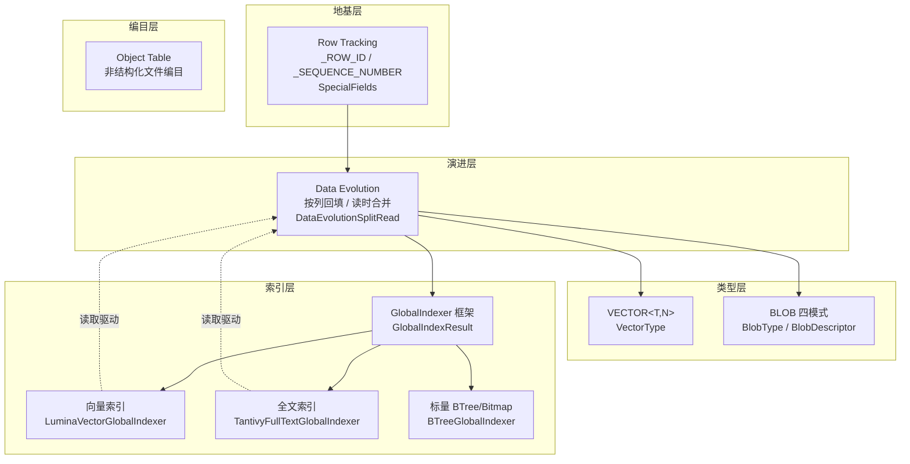
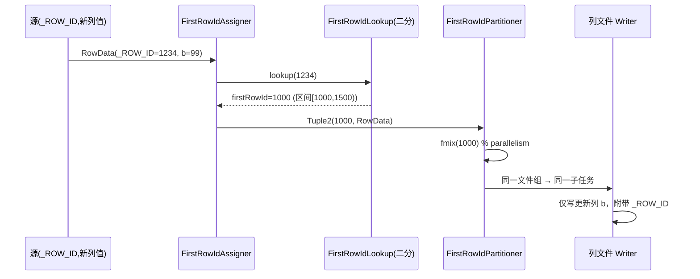
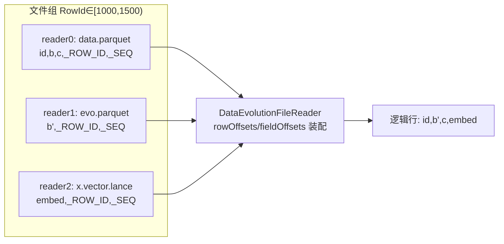
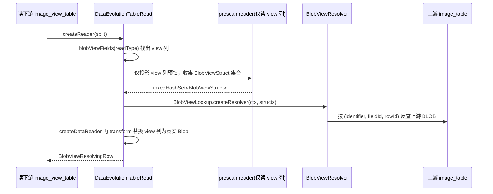
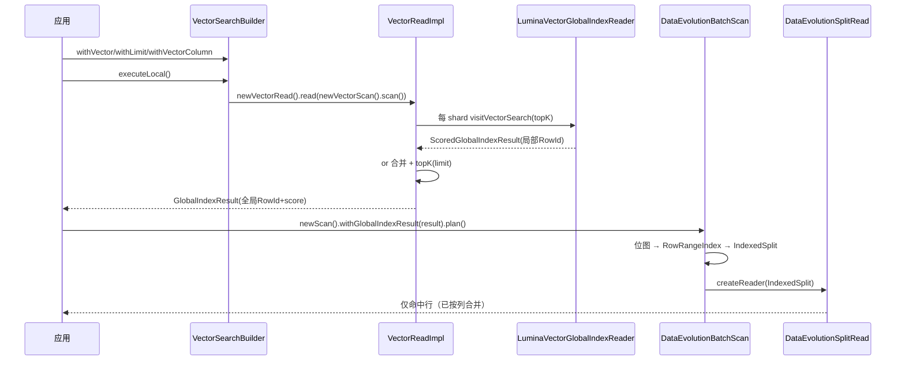

# 28-多模态与向量特征

> 面向"ML 特征平台 / 样本数据平台"读者的 Apache Paimon 源码分析专题。
> 基于仓库 `D:/javaproject/paimon`，版本 `1.5-SNAPSHOT`，分析 commit `e76fc41b7`（`master`）。
> **免责声明**：本文所有行号基于上述 commit，可能随版本漂移；阅读时请以"类名 / 方法名"为准，行号仅作定位辅助。文中标注"(示意，非逐字源码)"的代码块为作者简化构造，用于讲解原理；其余真实片段均给出对应类与方法名。性能数字若无源码常量或官方文档支撑，一律标注"经验估算"。

---

## 目录

- [一、业务背景：多模态特征与向量特征要解决什么](#一业务背景多模态特征与向量特征要解决什么)
- [二、能力地图：Paimon 把哪些 ML 诉求落到了哪些机制](#二能力地图paimon-把哪些-ml-诉求落到了哪些机制)
- [三、Row Tracking：一切多模态/演进能力的地基](#三row-tracking一切多模态演进能力的地基)
  - [3.1 `_ROW_ID` / `_SEQUENCE_NUMBER` 的语义与不变量](#31-_row_id--_sequence_number-的语义与不变量)
  - [3.2 懒分配：提交期 RowTrackingCommitUtils 如何打 RowId](#32-懒分配提交期-rowtrackingcommitutils-如何打-rowid)
  - [3.3 FirstRowIdAssigner：更新写入时如何把行映射回文件组](#33-firstrowidassigner更新写入时如何把行映射回文件组)
- [四、Data Evolution：按列回填与读时按 RowId 合并](#四data-evolution按列回填与读时按-rowid-合并)
  - [4.1 文件组（File Group）模型](#41-文件组file-group模型)
  - [4.2 写路径：只写更新列](#42-写路径只写更新列)
  - [4.3 读路径：DataEvolutionSplitRead 的列拼接](#43-读路径dataevolutionsplitread-的列拼接)
  - [4.4 DataEvolutionFileReader：rowOffsets/fieldOffsets 行装配](#44-dataevolutionfilereaderrowoffsetsfieldoffsets-行装配)
- [五、VECTOR&lt;T,N&gt; 类型与向量分离存储](#五vectortn-类型与向量分离存储)
  - [5.1 VectorType：字节布局与约束不变量](#51-vectortype字节布局与约束不变量)
  - [5.2 引擎层 ARRAY→VECTOR 映射](#52-引擎层-arrayvector-映射)
  - [5.3 lance 分离存储：vector.file.format 与 .vector.lance](#53-lance-分离存储vectorfileformat-与-vectorlance)
- [六、BLOB 大对象：四种存储模式与 BlobDescriptor 布局](#六blob-大对象四种存储模式与-blobdescriptor-布局)
  - [6.1 BlobType 与四模式总览](#61-blobtype-与四模式总览)
  - [6.2 BlobDescriptor 字节布局](#62-blobdescriptor-字节布局)
  - [6.3 BlobViewStruct 字节布局与跨表引用解析](#63-blobviewstruct-字节布局与跨表引用解析)
  - [6.4 .blob 文件格式与读写链路](#64-blob-文件格式与读写链路)
- [七、GlobalIndexer 框架：索引驱动读取](#七globalindexer-框架索引驱动读取)
  - [7.1 框架抽象：Indexer / Writer / Reader / Result](#71-框架抽象indexer--writer--reader--result)
  - [7.2 RoaringNavigableMap64 与 GlobalIndexResult](#72-roaringnavigablemap64-与-globalindexresult)
  - [7.3 索引驱动读取：withGlobalIndexResult → DataEvolutionBatchScan](#73-索引驱动读取withglobalindexresult--dataevolutionbatchscan)
  - [7.4 OffsetGlobalIndexReader：局部 RowId 到全局 RowId 的回填](#74-offsetglobalindexreader局部-rowid-到全局-rowid-的回填)
- [八、向量索引（ANN/DiskANN）：VectorSearchBuilder + Lumina](#八向量索引anndiskannvectorsearchbuilder--lumina)
- [九、全文索引：FullTextSearchBuilder + Tantivy](#九全文索引fulltextsearchbuilder--tantivy)
- [十、Object Table：非结构化样本编目](#十object-table非结构化样本编目)
- [十一、端到端落地范式（可复现）](#十一端到端落地范式可复现)
  - [11.1 范式 A：向量召回表（VECTOR + lumina 索引）](#111-范式-a向量召回表vector--lumina-索引)
  - [11.2 范式 B：多模态样本表（BLOB descriptor + 按列回填）](#112-范式-b多模态样本表blob-descriptor--按列回填)
  - [11.3 范式 C：全文检索 + 标量预过滤的混合召回](#113-范式-c全文检索--标量预过滤的混合召回)
  - [11.4 观察验证：用系统表确认机制生效](#114-观察验证用系统表确认机制生效)
- [十二、风险与权衡](#十二风险与权衡)
- [十三、关键源码索引（类#方法表）](#十三关键源码索引类方法表)
- [十四、交叉引用](#十四交叉引用)

---

## 一、业务背景：多模态特征与向量特征要解决什么

经典的特征平台（见 [[25-机器学习特征平台]]）与样本平台（见 [[26-机器学习样本数据平台]]）处理的是**结构化标量特征**：用户年龄、点击次数、品类偏好等。但近年的 ML 工作负载越来越多地面对**非结构化与高维数据**：

- **embedding 特征**：用户/物品/文本/图像的稠密向量（128、768、1536 维），用于召回、相似度排序、RAG；
- **多模态原始对象**：图片、视频、音频、PDF、模型权重——单个对象动辄数 MB 到数 GB；
- **文本特征**：商品标题、评论、日志正文，需要全文检索而非精确匹配；
- **特征频繁演进**：今天上线一个新的 embedding 版本，明天换一个文本编码器——需要给历史样本**回填新列**，而不是把整张 PB 级宽表重写一遍。

这些诉求对湖格式提出了四类挑战：

| 挑战 | 朴素方案的问题 | Paimon 的应对（本文主角） |
|---|---|---|
| 高维稠密向量的存储与点查 | `ARRAY<FLOAT>` 带 offset 数组、无长度约束、列存不友好 | `VECTOR<T,N>` 定长稠密类型 + lance 分离存储 |
| 大对象与结构化列混存 | 把 2GB 视频内联进 Parquet 行 → 投影/压缩全部失效 | `BLOB` 类型 + 独立 `.blob` 文件 + 四种存储模式 |
| 加新列要重写整文件 | Schema Evolution 仅改元数据，回填需 rewrite | Data Evolution：只写更新列，读时按 RowId 合并 |
| 相似度/全文召回要全表扫 | 没有 ANN/全文索引就只能暴力计算 | GlobalIndexer 框架：向量(DiskANN)/全文(Tantivy)/标量(BTree) 索引驱动读取 |

本文聚焦**类型、用法、读写链路**层面。索引引擎底层（JNI 桥接、DiskANN 图结构、Tantivy 倒排段结构）属于 [[35-全文检索与向量索引引擎实现]] 的范畴，本文只讲到"框架如何调用引擎"为止。纯 Python 调用方式见 [[27-PyPaimon与训练数据加载]]。

> 一个贯穿全文的关键事实：**VECTOR 分离存储、BLOB、Data Evolution、Global Index 全部建立在 Row Tracking 之上**。所以本文从 Row Tracking 讲起。

---

## 二、能力地图：Paimon 把哪些 ML 诉求落到了哪些机制



源码层面的对应关系（均已逐文件核验，详见[第十三节](#十三关键源码索引类方法表)）：

| 业务诉求 | Paimon 机制 | 入口类（已核验） | 相关已有篇 |
|---|---|---|---|
| 每行稳定身份 | Row Tracking | `SpecialFields`、`RowTrackingCommitUtils` | 本篇 §3 |
| 按列回填 | Data Evolution | `DataEvolutionSplitRead`、`DataEvolutionTableRead` | 本篇 §4，[[14-局部列更新与CDC数据集成]] |
| 稠密向量类型 | VECTOR | `VectorType`、`DataTypes#VECTOR` | [[19-数据类型系统与行存储]] |
| 向量分离存储 | lance vector-store | `vector.file.format`、`VectorType#isVectorStoreFile` | [[20-文件格式与IO层分析]] |
| 大对象存储 | BLOB | `BlobType`、`BlobDescriptor`、`Blob` | [[19-数据类型系统与行存储]] |
| 跨表对象引用 | Blob View | `BlobViewStruct`、`BlobViewResolver` | 本篇 §6.3 |
| 索引驱动读取 | Global Index | `GlobalIndexResult`、`withGlobalIndexResult` | [[13-索引机制深度分析]]、[[04-DeletionVectors与文件索引]] |
| 向量相似召回 | ANN/DiskANN | `VectorSearchBuilder`、`LuminaVectorGlobalIndexer` | [[35-全文检索与向量索引引擎实现]] |
| 全文召回 | Full-Text | `FullTextSearchBuilder`、`TantivyFullTextGlobalIndexer` | [[35-全文检索与向量索引引擎实现]] |
| 非结构化编目 | Object Table | `ObjectTable` | 本篇 §10 |

---

## 三、Row Tracking：一切多模态/演进能力的地基

### 3.1 `_ROW_ID` / `_SEQUENCE_NUMBER` 的语义与不变量

Row Tracking 由 `row-tracking.enabled` 开启（核验 `CoreOptions.ROW_TRACKING_ENABLED`，默认 `false`，标注 `@Immutable` 即建表后不可改）：

```java
// CoreOptions.java —— 字段 ROW_TRACKING_ENABLED
@Immutable
public static final ConfigOption<Boolean> ROW_TRACKING_ENABLED =
        key("row-tracking.enabled")
                .booleanType()
                .defaultValue(false)
                .withDescription("Whether enable unique row id for append table.");
```

开启后，Paimon 在表 schema 中追加两个隐藏列（核验 `SpecialFields`）：

```java
// SpecialFields.java —— 系统字段定义
public static final DataField SEQUENCE_NUMBER =
        new DataField(Integer.MAX_VALUE - 1, "_SEQUENCE_NUMBER", DataTypes.BIGINT().notNull());
public static final DataField ROW_ID =
        new DataField(Integer.MAX_VALUE - 5, "_ROW_ID", DataTypes.BIGINT().notNull());
```

两列的语义（核验官方 `docs/docs/append-table/row-tracking.md` 第 27-35 行 + `SpecialFields`）：

- **`_ROW_ID`（BIGINT，对用户 NOT NULL）**：每行在表内的全局唯一、稳定标识。行因任何原因从一个文件移动到另一个文件（compaction、列回填）时，`_ROW_ID` 必须被复制过去——这正是 Data Evolution"按 RowId 合并列"的物理前提。
- **`_SEQUENCE_NUMBER`（BIGINT）**：行的"版本号"，实际等于该行所属 snapshot 的 snapshot-id。当行内容被改写时置为新版本；若仅搬运未改内容则原样复制。

关键的字段 id 分配（核验 `SpecialFields#SYSTEM_FIELD_ID_START` = `Integer.MAX_VALUE / 2`，`isSystemField` 以此为界）：系统字段使用极大 id（`Integer.MAX_VALUE - n`），与用户字段（从 0 递增）天然不冲突，因此 `_ROW_ID` 在跨 schema 演进时 id 恒定，列拼接时可以"按 id 对齐"而非"按位置对齐"——这是 §4.4 行装配算法能成立的根因。

**核心不变量 I1（读出永不为 NULL）**：
> 从 Row Tracking 表读出时，`_ROW_ID`/`_SEQUENCE_NUMBER` 必为 NOT NULL。但**写入数据文件时它们可以是 NULL**——第一次 append 时不真正落盘，由 committer 懒分配（见 §3.2）。读取时若文件中为 NULL，则回退到 `DataFileMeta.firstRowId` + 行序号推算。

这就是为什么 `DataEvolutionSplitRead` 构造 reader 时用 `rowTypeWithRowTracking(schema, true, true)`（两个 `true` = rowId 与 sn 在文件中可空）：

```java
// DataEvolutionSplitRead#createReader(DataSplit, rowRanges, readRowType)
Builder formatBuilder =
        new Builder(
                formatDiscover,
                readRowType.getFields(),
                // file has no row id and sequence number, they are in manifest entry
                schema -> rowTypeWithRowTracking(schema.logicalRowType(), true, true).getFields(),
                ...);
```

### 3.2 懒分配：提交期 RowTrackingCommitUtils 如何打 RowId

RowId 不在写入算子产生，而在**提交（commit）阶段**统一分配，保证全局连续。核心逻辑在 `RowTrackingCommitUtils#assignRowTracking` / `assignRowTrackingMeta`：

```java
// RowTrackingCommitUtils#assignRowTrackingMeta（节选关键分支）
long start = firstRowIdStart;
long blobStartDefault = firstRowIdStart;
Map<String, Long> blobStarts = new HashMap<>();
long vectorStoreStart = firstRowIdStart;
for (ManifestEntry entry : deltaFiles) {
    ...
    if (fileSource.get().equals(FileSource.APPEND)
            && entry.file().firstRowId() == null
            && !containsRowId) {
        long rowCount = entry.file().rowCount();
        if (isBlobFile(entry.file().fileName())) {
            // .blob 文件：复用同一文件组主数据文件的 RowId 区间
            String blobFieldName = entry.file().writeCols().get(0);
            long blobStart = blobStarts.getOrDefault(blobFieldName, blobStartDefault);
            rowIdAssigned.add(entry.assignFirstRowId(blobStart));
            blobStarts.put(blobFieldName, blobStart + rowCount);
        } else if (isVectorStoreFile(entry.file().fileName())) {
            // .vector.lance 文件：同理复用主数据文件 RowId 区间
            rowIdAssigned.add(entry.assignFirstRowId(vectorStoreStart));
            vectorStoreStart += rowCount;
        } else {
            // 普通数据文件：领取一段新的 RowId 区间 [start, start+rowCount)
            rowIdAssigned.add(entry.assignFirstRowId(start));
            blobStartDefault = start;   // blob/vector 的起点对齐到这段
            blobStarts.clear();
            start += rowCount;
        }
    } else {
        rowIdAssigned.add(entry);       // compact 文件不重新分配
    }
}
```

**这段代码是理解"分离存储如何对齐"的钥匙**。一次写入里，同一批行可能落进三类物理文件：主数据 Parquet、`.blob`、`.vector.lance`。它们对外是"同一批行的不同列"，必须共享同一段 `[firstRowId, firstRowId+rowCount)` 区间：

```
主数据文件 data-x.parquet :  firstRowId = 1000, rowCount = 500  →  RowId ∈ [1000, 1500)
向量文件   data-y.vector.lance: firstRowId = 1000, rowCount = 500  →  RowId ∈ [1000, 1500)   ← 与主数据同区间
blob 文件  data-z.blob:        firstRowId = 1000, rowCount = 500  →  RowId ∈ [1000, 1500)   ← 与主数据同区间
```

代码用 `blobStartDefault`/`vectorStoreStart` 把 blob/vector 文件的起点钉死到"普通数据文件"刚分配的那段区间起点，从而**保证三类文件的 RowId 区间逐行对齐**。这正是读时能"按 RowId 合并列"的物理保证（详见 §4）。

**不变量 I2（区间不交叉自检）**：代码里对 `blobStart >= start`、`vectorStoreStart >= start` 抛 `IllegalStateException("This is a bug, ...")`——这是 Paimon 对自身分配逻辑的断言式自检：blob/vector 的起点必须严格小于下一个普通文件的起点，否则区间会交叉。

### 3.3 FirstRowIdAssigner：更新写入时如何把行映射回文件组

当用 `MERGE INTO` / `data_evolution_merge_into` 回填某些列时，写入算子拿到的是"某些 `_ROW_ID` 对应的新列值"。要把它们写成 Data Evolution 的列文件，必须知道每行属于哪个**文件组**（以 `firstRowId` 为 key）。Flink 侧由 `FirstRowIdAssigner`（`RichFlatMapFunction`）完成：

```java
// FirstRowIdAssigner#flatMap
long rowId = value.getLong(rowIdFieldIndex);
if (rowId >= 0 && rowId <= maxRowId) {
    out.collect(new Tuple2<>(firstRowIdLookup.lookup(rowId), value));
} else {
    LOG.warn("Invalid Row id {} is out of range [0, {}].", rowId, maxRowId);
}
```

- `firstRowIdLookup.lookup(rowId)`：在已排序的 `firstRowIds` 列表上做**二分查找**，把任意 `_ROW_ID` 归约到它所属文件组的 `firstRowId`（即区间起点）；越界 RowId 被直接丢弃（不是抛错），保证更新流的健壮性。
- `FirstRowIdPartitioner#partition`：按 `MurmurHashUtils.fmix(firstRowId)` 取模分区，使**同一文件组的所有更新落到同一并行子任务**，从而每个文件组的新列文件由单一 writer 产出、RowId 连续。



> `row-tracking.partition-group-on-commit`（核验 `CoreOptions.ROW_TRACKING_PARTITION_GROUP_ON_COMMIT`，默认 `true`）进一步保证：提交前按分区分组排列新文件，使每个分区内分配的 RowId 连续——其描述明确写着"if you want to build global indices on this table"，即为后续构建全局索引提供连续 RowId 前提。

---

## 四、Data Evolution：按列回填与读时按 RowId 合并

### 4.1 文件组（File Group）模型

`data-evolution.enabled`（核验 `CoreOptions.DATA_EVOLUTION_ENABLED`，默认 `false`，`@Immutable`）开启后，一次"更新部分列"不再 rewrite 整文件，而是：

- **写**：只把被更新的列写到**新文件**，原文件不动；
- **读**：把"同一段 RowId 区间"的多个文件（原文件 + 各列回填文件）按 `_ROW_ID` 合并成完整的逻辑行。

官方文档将其称为 File Group（`docs/docs/append-table/data-evolution.md` "File Group Spec"）：

> Through the RowId metadata, files are organized into a file group. When reading, the files with the same `first row id` will merge fields.

数据结构（综合 `RowTrackingCommitUtils` 与 `DataEvolutionSplitRead`）：

```
文件组（同一 [firstRowId, firstRowId+rowCount) 区间）
├── data-base.parquet        writeCols=[id, b, c]      初始全列
├── data-evo1.parquet        writeCols=[b]             第一次回填 b（新 RowId? 否，沿用区间）
├── data-evo2.parquet        writeCols=[embed-meta]    第二次回填
├── data-x.vector.lance      writeCols=[embed]         向量列分离存储
└── data-y.blob              writeCols=[image]         BLOB 列分离存储
```

读时按"列 id 最新版本胜出"的语义合并：同一列若被多个文件覆盖，取 `_SEQUENCE_NUMBER`（即 maxSequenceNumber）更大的那个。

### 4.2 写路径：只写更新列

Spark 的 `MERGE INTO ... WHEN MATCHED THEN UPDATE SET t.b = s.b` 在 Data Evolution 表上只写 `b` 列文件（官方 `data-evolution.md` 第 82 行明确："only the `b` column data is written to new files"）。Flink 无 `MERGE INTO` 语法，改用 `sys.data_evolution_merge_into` 存储过程模拟，且当前仅支持更新/新增列、不支持插入新行（官方 `data-evolution.md` 第 113 行）。

> 边界：原始数据 BLOB 列在部分列 `MERGE INTO` 更新中被拒绝；但 descriptor-based BLOB 列允许（核验 `blob.mdx` "MERGE INTO Support"）。

### 4.3 读路径：DataEvolutionSplitRead 的列拼接

`DataEvolutionSplitRead` 是 Data Evolution 读的核心。类注释明确："does not support filtering push down and deletion vectors, as they can interfere with the process of merging columns"——即**列合并读路径不支持谓词下推与 DV**（核验类头注释，`withFilter` 直接 `return this` 忽略谓词）。

整个读取分两步：**分组** → **组内拼接**。

**第一步：`mergeRangesAndSort` 把文件按 RowId 区间分组并排序**

```java
// DataEvolutionSplitRead#mergeRangesAndSort（节选）
RangeHelper<DataFileMeta> rangeHelper = new RangeHelper<>(DataFileMeta::nonNullRowIdRange);
List<List<DataFileMeta>> result = rangeHelper.mergeOverlappingRanges(files);

for (List<DataFileMeta> group : result) {
    // 拆成 dataFiles / blobFiles / vectorStoreFiles 三类
    ...
    // 数据文件按 maxSequenceNumber 倒序（新版本在前）
    dataFiles.sort(comparingLong(maxSeqF).reversed());
    checkArgument(rangeHelper.areAllRangesSame(dataFiles),
            "Data files %s should be all row id ranges same.", dataFiles);
    // blob/vector 文件按 firstRowId 再按 maxSeq 倒序
    blobFiles.sort(comparingLong(DataFileMeta::nonNullFirstRowId)
            .thenComparing(reverseOrder(comparingLong(maxSeqF))));
    ...
    group.clear();
    group.addAll(dataFiles);
    group.addAll(blobFiles);
    group.addAll(vectorStoreFiles);
}
```

- 用 `RangeHelper.mergeOverlappingRanges` 按 `nonNullRowIdRange`（即 `[firstRowId, firstRowId+rowCount)`）把重叠区间的文件归到同一组；
- 组内对**普通数据文件**断言"区间完全相同"（`areAllRangesSame`），并按版本倒序——保证后续按列对齐时同一列优先取最新版本；
- blob/vector 文件因为是分块的（一段大区间可能跨多个 `.blob`），按 `firstRowId` 升序拼接成连续区间。

**第二步：`splitFieldBunches` 把同一列的多个分块聚成一个 FieldBunch**

```java
// DataEvolutionSplitRead#splitFieldBunches（节选）
Map<Integer, SpecialFieldBunch> blobBunchMap = new HashMap<>();          // 按 blob 列 fieldId 聚合
Map<VectorStoreBunchKey, SpecialFieldBunch> vectorStoreBunchMap = new TreeMap<>();
for (DataFileMeta file : needMergeFiles) {
    if (isBlobFile(file.fileName())) {
        int fieldId = rowType.getField(file.writeCols().get(0)).id();
        blobBunchMap.computeIfAbsent(fieldId, ...).add(file);
    } else if (isVectorStoreFile(file.fileName())) {
        VectorStoreBunchKey key = new VectorStoreBunchKey(file.schemaId(), fileFormat, file.writeCols(), rowType);
        vectorStoreBunchMap.computeIfAbsent(key, ...).add(file);
    } else {
        fieldsFiles.add(new DataBunch(file));   // 普通文件一文件一 bunch
        rowCount = file.rowCount();
    }
}
```

`SpecialFieldBunch#add` 内含一组关键不变量（核验 `DataEvolutionSplitRead.SpecialFieldBunch#add`）：

- 同一 `firstRowId` 出现多个文件 → 必须按 `maxSequenceNumber` 严格递减（版本去重，老版本被跳过）；
- 非 rowIdPushDown 模式下，blob/vector 文件的 `firstRowId` 必须连续（`expectedNextFirstRowId = latestFistRowId + rowCount`），否则抛 `"Blob/vector-store file first row id should be continuous"`；
- 累计 `rowCount <= expectedRowCount`（不能超过主数据文件的行数）。

> 这组不变量保证了：一个 BLOB/向量列即使被切成多个物理文件，拼起来也恰好覆盖 `[firstRowId, firstRowId+rowCount)` 且每个 RowId 只有一个生效版本。

### 4.4 DataEvolutionFileReader：rowOffsets/fieldOffsets 行装配

分组完成后，`createUnionReader` 为每个 FieldBunch 建一个子 reader，再用 `DataEvolutionFileReader` 把多个子 reader 装配成完整行。装配靠两张映射表（核验 `DataEvolutionSplitRead#createUnionReader` 与 `DataEvolutionFileReader` 类注释）：

```java
// createUnionReader（节选）—— 按 fieldId 对齐，决定每个输出字段从哪个 reader 的哪个 offset 取
int[] readFieldIndex = allReadFields.stream().mapToInt(DataField::id).toArray();
int[] rowOffsets = new int[allReadFields.size()];   // 第 j 个输出字段来自第几个 reader
int[] fieldOffsets = new int[allReadFields.size()]; // 在该 reader 内的列偏移
Arrays.fill(rowOffsets, -1);
Arrays.fill(fieldOffsets, -1);
for (int i = 0; i < fieldsFiles.size(); i++) {
    int[] fieldIds = /* 该文件含有的字段 id（含 _ROW_ID/_SEQUENCE_NUMBER） */;
    for (int j = 0; j < readFieldIndex.length; j++) {
        for (int fieldId : fieldIds) {
            if (readFieldIndex[j] == fieldId && rowOffsets[j] == -1) {
                rowOffsets[j] = i;              // 该字段由第 i 个 reader 提供
                fieldOffsets[j] = readFields.size();
                readFields.add(allReadFields.get(j));
            }
        }
    }
}
```

注意对齐用的是 **`DataField::id`** 而不是列名或位置——这正是 §3.1 里"系统字段 id 恒定 + 用户字段 id 稳定"的回报：即使读取列顺序、schema 版本不同，也能按 id 精确把"哪一列由哪个文件提供"对应上。

最后一道校验（不变量 I3）：若某输出字段在所有文件里都找不到（`rowOffsets[i] == -1`），则该字段必须可空，否则抛 `"Field %s is not null but can't find any file contains it."`——保证未回填的列读出 NULL 而非错位。

`DataEvolutionFileReader#readBatch` 的对齐逻辑（核验类头与 `readBatch`）：

```java
// DataEvolutionFileReader#readBatch（节选）
for (int i = 0; i < readers.length; i++) {
    RecordIterator<InternalRow> batch = readers[i].readBatch();
    if (batch == null) {
        // 所有 reader 行数对齐：只要一个读完，其余必同时读完
        return null;
    }
    iterators[i] = batch;
}
return new DataEvolutionIterator(row, iterators);
```

> **不变量 I4（行对齐）**：因为所有子 reader 覆盖同一 RowId 区间、行数相同，所以可以"齐步走"——任一 reader 返回 `null`（无更多 batch）则整体结束。这把"按 RowId join"退化成了"按物理行号并排扫描"，零额外比较成本。



---

## 五、VECTOR&lt;T,N&gt; 类型与向量分离存储

### 5.1 VectorType：字节布局与约束不变量

`VectorType`（`paimon-api/types`，`@Public`，`@since 2.0.0`）表示**定长稠密向量**。核验其构造与约束：

```java
// VectorType 构造（节选）
public VectorType(boolean isNullable, int length, DataType elementType) {
    super(isNullable, DataTypeRoot.VECTOR);
    Preconditions.checkArgument(
            isValidElementType(elementType), "Invalid element type for vector: " + elementType);
    if (length < MIN_LENGTH) { /* MIN_LENGTH=1 */ ... }
    this.length = length;
}
```

约束（不变量）：

- **元素类型受限**：`isValidElementType` 只接受 `BOOLEAN/TINYINT/SMALLINT/INTEGER/BIGINT/FLOAT/DOUBLE` 七种原始类型（核验 `VectorType#isValidElementType`），与官方 `vector.md` 一致；
- **长度范围** `[MIN_LENGTH=1, MAX_LENGTH=Integer.MAX_VALUE]`（核验常量）；
- **稠密无空元素**：`defaultSize() = elementType.defaultSize() * length`——按定长稠密布局估算大小，没有 `ARRAY` 的 offset 数组开销；
- **不能作主键/分区/排序列**（官方 `vector.md` Notes；本质因为它不是可比较标量）。

数据结构对比图（与 ARRAY 的本质差别）：

```
ARRAY<FLOAT>（变长）字节布局（示意，非逐字源码）:
  [ nullBits | length(4B) | offset[] | float数据... ]   ← 有长度头与偏移，支持 null 元素

VECTOR<FLOAT,3>（定长稠密）字节布局（示意，非逐字源码）:
  [ float float float ]                                 ← 纯数据，长度由类型携带，无 offset
```

JSON 序列化（核验 `VectorType#serializeJson`）写出 `{"type":"VECTOR","element":{...},"length":n}`，`asSQLString` 输出 `VECTOR<elem, n>`（格式常量 `FORMAT = "VECTOR<%s, %d>"`）。

`DataTypes` 工厂（核验 `DataTypes#VECTOR`）：

```java
// DataTypes.java
public static VectorType VECTOR(int length, DataType element) {
    return new VectorType(length, element);
}
```

### 5.2 引擎层 ARRAY→VECTOR 映射

引擎（Flink/Spark）SQL 没有原生 VECTOR 类型，Paimon 提供配置把引擎的 `ARRAY` 映射为 `VECTOR`（核验官方 `vector.md` "Engine-Level Representation" + `CoreOptions.VECTOR_FIELD`）：

```java
// CoreOptions.java —— VECTOR_FIELD
public static final ConfigOption<String> VECTOR_FIELD =
        key("vector-field")
                .stringType()
                .noDefaultValue()
                .withDescription(
                        "Specifies column names that should be stored as vector type. "
                                + "This is used when you want to treat a ARRAY column as a VECTOR.");
```

用法（核验 `vector.md`）：

```sql
CREATE TABLE ts_table (
    id BIGINT,
    embed1 ARRAY<FLOAT>,
    embed2 ARRAY<FLOAT>
) WITH (
    'file.format' = 'lance',
    'vector-field' = 'embed1,embed2',
    'field.embed1.vector-dim' = '128',   -- 必须声明维度，否则建表失败
    'field.embed2.vector-dim' = '768'
);
```

> 边界（官方 `vector.md` Notes，已核验）：`vector-field` 列**必须**提供 `field.{name}.vector-dim`；目前**仅 Flink SQL 支持**该配置，其他引擎尚未实现。

### 5.3 lance 分离存储：vector.file.format 与 .vector.lance

向量列要发挥性能，理想的物理表示是 Arrow `FixedSizeList`，目前只有 `lance` 等格式经 `paimon-arrow` 支持。若把整表 `file.format` 设成 `lance`，会"全局影响"标量与多模态（BLOB）数据（官方 `vector.md` "Dedicated File Format for Vector"）。因此 Paimon 允许在 Data Evolution 表里**只把向量列单独存为另一种格式**：

```java
// CoreOptions.java —— VECTOR_FILE_FORMAT / VECTOR_TARGET_FILE_SIZE
public static final ConfigOption<String> VECTOR_FILE_FORMAT =
        key("vector.file.format").stringType().noDefaultValue()
                .withDescription("Specify the vector store file format.");
public static final ConfigOption<MemorySize> VECTOR_TARGET_FILE_SIZE =
        key("vector.target-file-size").memoryType().noDefaultValue()
                .withDescription("Target size of a vector-store file. Default is 10 * TARGET_FILE_SIZE.");
```

物理布局（核验 `vector.md` + `VectorType#isVectorStoreFile`）：

```
table/
├── bucket-0/
│   ├── data-uuid-0.parquet        # id 等标量列
│   ├── data-uuid-1.blob           # BLOB 列
│   └── data-uuid-2.vector.lance   # 向量列，单独用 lance
```

向量文件靠**文件名包含 `.vector.`** 来识别（核验 `VectorType#isVectorStoreFile`）：

```java
// VectorType.java
public static boolean isVectorStoreFile(String fileName) {
    return fileName.contains(".vector.");
}
```

它与 BLOB 文件一样，作为 Data Evolution 文件组的一员，被 §3.2 的 RowId 分配逻辑钉到与主数据文件相同的 RowId 区间，被 §4.3 的 `mergeRangesAndSort`/`VectorStoreBunchKey` 聚合，最终由 `DataEvolutionFileReader` 拼回完整行。

可复现示例（核验 `vector.md`）：

```sql
CREATE TABLE ts_table (
    id BIGINT,
    embed ARRAY<FLOAT>
) WITH (
    'file.format' = 'parquet',          -- 标量走 parquet
    'vector.file.format' = 'lance',     -- 向量列单独走 lance
    'vector-field' = 'embed',
    'field.embed.vector-dim' = '128',
    'row-tracking.enabled' = 'true',    -- 分离存储依赖 Data Evolution
    'data-evolution.enabled' = 'true'
);
```

> `vector.target-file-size` 默认是 `10 * target-file-size`（核验 `CoreOptions.VECTOR_TARGET_FILE_SIZE` 描述）——向量数据密度高、行小，单文件可放更多行。

---

## 六、BLOB 大对象：四种存储模式与 BlobDescriptor 布局

### 6.1 BlobType 与四模式总览

`BlobType`（`paimon-api/types`，`@Public`，`@since 1.4.0`）的 `defaultSize()` 是 `1MB`（核验 `BlobType.DEFAULT_SIZE = 1024 * 1024`）。BLOB 与普通 `BYTES` 的本质区别：**大对象单独存进 `.blob` 文件，行内只放引用**。

Paimon 支持四种 BLOB 存储模式（核验 `blob.mdx` "Storage Modes" + `CoreOptions` 各配置项）：

| 模式 | 配置项（已核验存在） | 行内存什么 | 原始字节存哪 | 典型场景 |
|---|---|---|---|---|
| ① 默认内联 | （无额外配置，仅 `blob-field`） | 由 Paimon 管理的引用 | Paimon `.blob` 文件 | 自管图片/视频 |
| ② descriptor-only | `blob-descriptor-field` | 序列化的 `BlobDescriptor` 字节 | 上游已有文件（不复制） | 复用上游对象，零拷贝 |
| ③ external-storage | `blob-external-storage-field` + `blob-external-storage-path` | 序列化的 `BlobDescriptor` 字节 | 写入期落到外部路径 | 接收原始字节但存到外部对象存储 |
| ④ blob-view | `blob-view-field` | 序列化的 `BlobViewStruct` 字节 | 上游表的 BLOB 值（读时解析） | 下游引用上游 BLOB，不复制 |

关键配置项核验（`CoreOptions.java`）：

```java
public static final ConfigOption<String> BLOB_FIELD = key("blob-field")...;                 // 把 BYTES 当 BLOB
public static final ConfigOption<Boolean> BLOB_AS_DESCRIPTOR = key("blob-as-descriptor")     // 默认 false
        .booleanType().defaultValue(false)...;                                               // 只影响读出格式
@Immutable
public static final ConfigOption<String> BLOB_DESCRIPTOR_FIELD = key("blob-descriptor-field")
        .withFallbackKeys("blob.stored-descriptor-fields")...;
@Immutable
public static final ConfigOption<String> BLOB_VIEW_FIELD = key("blob-view-field")...;
public static final ConfigOption<Boolean> BLOB_WRITE_NULL_ON_MISSING_FILE = ...defaultValue(false)...;
@Immutable
public static final ConfigOption<String> BLOB_EXTERNAL_STORAGE_PATH = key("blob-external-storage-path")...;
@Immutable
public static final ConfigOption<String> BLOB_EXTERNAL_STORAGE_FIELD = key("blob-external-storage-field")...;
public static final ConfigOption<MemorySize> BLOB_TARGET_FILE_SIZE = key("blob.target-file-size")...;
```

`blob-descriptor.` 前缀（核验 `CoreOptions.BLOB_DESCRIPTOR_PREFIX = "blob-descriptor."`）：当输入 BlobDescriptor 指向的存储与 Paimon 自身配置不同（如不同 OSS endpoint），可用该前缀为输入 descriptor 单独配 FS 参数（官方 `blob.mdx` 第 197-213 行）。

`blob-as-descriptor`（默认 `false`）**只影响读出**：`true` 返回 descriptor 字节，`false` 返回真实 blob 字节（官方 `blob.mdx` "Blob Read Output Mode"），不改变写入与物理存储。

`BlobType.fieldsInBlobFile` / `fieldsNotInBlobFile`（核验同名静态方法）决定哪些 BLOB 列真正落 `.blob` 文件——**`blob-descriptor-field` 里的列被当作普通字段（内联 descriptor 字节）处理，不写 `.blob`**：

```java
// BlobType#fieldsInBlobFile（节选）
if (type == DataTypeRoot.BLOB && !descriptorFields.contains(field.name())) {
    result.add(field);   // 只有未列入 descriptorFields 的 BLOB 列才进 .blob 文件
}
```

### 6.2 BlobDescriptor 字节布局

`BlobDescriptor`（`paimon-common/data`）是模式②③以及默认模式引用的核心载体。其字节布局有**精确文档与魔数校验**（核验类头注释与 `serialize`/`deserialize`）：

```
| Offset | Field       | Type    | Size | 说明                                  |
|--------|-------------|---------|------|---------------------------------------|
| 0      | version     | byte    | 1    | CURRENT_VERSION = 2                    |
| 1      | magicNumber | long    | 8    | 0x424C4F4244455343 ("BLOBDESC")        |
| 9      | uriLength   | int     | 4    | URI 字节数 N                           |
| 13     | uriBytes    | byte[N] | N    | UTF-8 编码 URI                         |
| 13+N   | offset      | long    | 8    | 在目标文件中的起始偏移                 |
| 21+N   | length      | long    | 8    | blob 长度                              |
```

全部多字节数值用 **Little Endian**（核验 `buffer.order(ByteOrder.LITTLE_ENDIAN)`）。`serialize` 计算总长 `1+8+4+N+8+8`。`deserialize` 与 `isBlobDescriptor`（仅查前 9 字节 version+magic）用魔数判别 byte[] 是否为合法 descriptor——这是 `Blob.fromBytes` 自动判别"输入是原始字节还是引用"的依据：

```java
// Blob#fromBytes（节选，descriptor-aware 判别）
if (BlobViewStruct.isBlobViewStruct(bytes)) {
    return fromView(BlobViewStruct.deserialize(bytes));     // 模式④
}
if (BlobDescriptor.isBlobDescriptor(bytes) || !allowBlobData) {
    BlobDescriptor descriptor = BlobDescriptor.deserialize(bytes);
    return fromDescriptor(reader, descriptor);              // 模式②③
}
return fromData(bytes);                                     // 模式① 原始字节
```

`Blob` 接口提供多种构造（核验 `Blob`）：`fromData`（内存字节→`BlobData`）、`fromLocal`/`fromFile`/`fromHttp`/`fromDescriptor`（→`BlobRef`，引用式，惰性读）、`fromInputStream`（→`BlobStream`）、`fromView`（→`BlobView`）。这让"2GB 视频不进内存、只存 descriptor"成为可能（官方 `blob.mdx` "Descriptor-Aware Write Behavior" 示例）。

### 6.3 BlobViewStruct 字节布局与跨表引用解析

模式④ blob-view 用 `BlobViewStruct`（`paimon-common/data`）记录"指向上游表某行某列"的坐标，**不复制字节**。字节布局（核验 `serialize`）：

```
| version(1B=1) | magic(8B,0x424C4F4256494557 "BLOBVIEW") | idLen(4B) | identifier(UTF-8) | fieldId(4B) | rowId(8B) |
```

- `identifier`：上游表全限定名（`database.table` 或 `catalog.database.table`），用 `Identifier.fromString` 还原；
- `fieldId`：上游 BLOB 列字段 id；
- `rowId`：上游行的 `_ROW_ID`（因此**上游表必须开 Row Tracking**，官方 `blob.mdx` "Blob View" 前置条件）。

读时由 `DataEvolutionTableRead` 触发两阶段解析（核验 `DataEvolutionTableRead#createBlobViewReader`）：



关键代码（核验 `DataEvolutionTableRead#createBlobViewReader`）：预扫只投影 view 列，把每行的 `BlobViewStruct` 收进 `LinkedHashSet`（去重），再批量建一个 `BlobViewResolver`，最后用 `reader.transform(row -> new BlobViewResolvingRow(...))` 在正式读时把 view 列解析为真实 BLOB。Flink SQL 用内置函数 `sys.blob_view(table_name, field_name, row_id)` 写入 view（官方 `blob.mdx`）。

> 边界（官方 `blob.mdx` Limitations）：blob-view 依赖上游表与行持续可读；上游被删则 view 无法解析。

### 6.4 .blob 文件格式与读写链路

`.blob` 文件格式（核验 `docs/docs/concepts/spec/fileformat.md` "BLOB" 节）：

```
+------------------+
| Blob Entry 1     |
|   Magic Number   |  4 bytes (1481511375, Little Endian)
|   Blob Data      |  变长
|   Length         |  8 bytes (Little Endian)
|   CRC32          |  4 bytes (Little Endian)    ← 每条目独立校验
+------------------+
| Blob Entry 2 ... |
+------------------+
| Index            |  变长（Delta-Varint 压缩，支持随机访问）
| Index Length     |  4 bytes
| Version          |  1 byte
+------------------+
```

特性与限制（核验 fileformat.md）：每条目带 CRC32 校验；尾部 Index 用 Delta-Varint 压缩支持随机访问；**单个 `.blob` 文件只支持一个 BLOB 列**（因此 §4.3 用 `blobBunchMap` 按列 fieldId 分桶）；不支持谓词下推与统计。

存储分离的收益（官方 `blob.mdx` Storage Layout）：读 `SELECT id, name`（非 BLOB 列）不会加载 BLOB 数据；BLOB 文件按大小独立 roll（`blob.target-file-size`，核验 `CoreOptions.BLOB_TARGET_FILE_SIZE`，默认同 `target-file-size`）；普通列存压缩更好。

> 强制前置（官方 `blob.mdx` Limitations + Required Options）：BLOB 仅支持 append 表；必须 `row-tracking.enabled=true` 且 `data-evolution.enabled=true`；BLOB 列不可用于过滤谓词、不收集统计。

---

## 七、GlobalIndexer 框架：索引驱动读取

### 7.1 框架抽象：Indexer / Writer / Reader / Result

向量索引（ANN）、全文索引、标量 BTree/Bitmap 索引共用一套 `paimon-common/globalindex` 框架。三个核心 SPI（均已核验）：

```java
// GlobalIndexer —— 工厂接口
public interface GlobalIndexer {
    GlobalIndexWriter createWriter(GlobalIndexFileWriter fileWriter) throws IOException;
    GlobalIndexReader createReader(GlobalIndexFileReader fileReader, List<GlobalIndexIOMeta> files) throws IOException;
    static GlobalIndexer create(String type, DataField dataField, Options options) {
        return GlobalIndexerFactoryUtils.load(type).create(dataField, options);
    }
}
```

实现通过 `ServiceLoader` 按 `identifier` 注册（核验 `GlobalIndexerFactoryUtils` 静态块 + `META-INF/services/...GlobalIndexerFactory`）。已核验的注册类型：

| identifier（已核验常量） | 工厂类 | 模块 | 用途 |
|---|---|---|---|
| `btree` | `BTreeGlobalIndexerFactory` | paimon-common | 标量等值/IN/范围 |
| `bitmap` | `BitmapGlobalIndexerFactory` | paimon-common | 位图索引 |
| `lumina` | `LuminaVectorGlobalIndexerFactory` | paimon-lumina | 向量 ANN（DiskANN） |
| `lumina-vector-ann` | `LegacyLuminaVectorGlobalIndexerFactory` | paimon-lumina | 旧版向量 identifier（兼容） |
| `tantivy-fulltext` | `TantivyFullTextGlobalIndexerFactory` | paimon-tantivy | 全文检索 |

`GlobalIndexReader`（核验）是一个 `FunctionVisitor<Optional<GlobalIndexResult>>`：标量谓词走 `visitEqual/visitIn/...`，向量与全文走专门的 `visitVectorSearch` / `visitFullTextSearch`，返回 `ScoredGlobalIndexResult`（带相似度分）。

`GlobalIndexWriter#finish` 返回 `List<ResultEntry>`；`GlobalIndexParallelWriter#write(key, relativeRowId)` 写入"局部 RowId"（`rowId - rangeStart`，核验接口注释）——索引内部按 0 起的相对 RowId 编址，读时再加回偏移（见 §7.4）。

### 7.2 RoaringNavigableMap64 与 GlobalIndexResult

索引召回的结果是一组 RowId，用 64 位 Roaring 位图压缩表示（核验 `GlobalIndexResult`）：

```java
// GlobalIndexResult —— 位图结果，支持惰性、AND/OR、offset
public interface GlobalIndexResult {
    RoaringNavigableMap64 results();
    default GlobalIndexResult and(GlobalIndexResult other) {
        return create(() -> RoaringNavigableMap64.and(this.results(), other.results()));
    }
    default GlobalIndexResult or(GlobalIndexResult other) { ... }
    default GlobalIndexResult offset(long startOffset) { ... }   // 整体平移 RowId
    static GlobalIndexResult fromRange(Range range) { ... }
}
```

- `create(Supplier)` 用 `LazyField` 惰性求值——索引扫描在真正需要 RowId 时才执行；
- `and`/`or` 用 Roaring 原生位运算（注释明确"Uses native bitmap AND operation"），所以"向量召回 ∩ 标量过滤"是 O(位图) 而非逐行 join。

`ScoredGlobalIndexResult`（核验）扩展出 `scoreGetter()` 与 `topK(int)`：

```java
// ScoredGlobalIndexResult#topK —— 用最小堆维护 top-k，O(n log k)
PriorityQueue<long[]> minHeap = new PriorityQueue<>(
        k + 1, Comparator.comparingDouble(a -> Float.intBitsToFloat((int) a[1])));
for (long rowId : rowIds) {
    float score = scoreGetter.score(rowId);
    if (minHeap.size() < k) minHeap.offer(...);
    else if (score > peekScore) { minHeap.poll(); minHeap.offer(...); }
}
```

> top-k 的复杂度 `O(n log k)`（注释明确）：堆头是最小分，新分更高才替换。多个 shard 的局部结果先 `or` 合并、最后统一 `topK(limit)`（见 `VectorReadImpl#read`）。

### 7.3 索引驱动读取：withGlobalIndexResult → DataEvolutionBatchScan

索引召回到一组 RowId 后，如何只读这些行？答案是 `TableScan.withGlobalIndexResult`（核验 `TableScan` / `InnerTableScan` 接口）→ 由 `DataEvolutionBatchScan` 把位图结果转成 RowId 区间，再下推到扫描计划：

```java
// DataEvolutionBatchScan#plan（节选）
if (rowRangeIndex == null) {
    Optional<GlobalIndexResult> indexResult = evalGlobalIndex();
    if (indexResult.isPresent()) {
        GlobalIndexResult result = indexResult.get();
        rowRangeIndex = RowRangeIndex.create(result.results().toRangeList());   // 位图 → 区间列表
        if (result instanceof ScoredGlobalIndexResult) {
            scoreGetter = ((ScoredGlobalIndexResult) result).scoreGetter();      // 保留分数
        }
    }
}
if (rowRangeIndex == null) return batchScan.plan();
List<Split> splits = batchScan.withRowRangeIndex(rowRangeIndex).plan().splits();
return wrapToIndexSplits(splits, rowRangeIndex, scoreGetter);                    // 包成 IndexedSplit
```

`evalGlobalIndex`（核验同类方法）的两条来源：① 调用方已通过 `withGlobalIndexResult` 注入现成结果（`executeLocal` 路径）；② 通过 `GlobalIndexScanner.create(table, partitionFilter, filter)` 自动用索引求值 filter——但需 `global-index.enabled=true`（核验 `CoreOptions.GLOBAL_INDEX_ENABLED`，默认 `true`）。

`wrapToIndexSplits` → `wrap`（核验）把每个 `DataSplit` 限定到与其 RowId 范围相交的区间，并按 RowId 顺序填充 `scores[]`，得到 `IndexedSplit`。最终由 §4.3 的 `DataEvolutionSplitRead.createReader(IndexedSplit)` 读取——**索引召回与列合并读路径在此汇合**。



> **不变量 I5（互斥下推）**：`withGlobalIndexResult` 与 `withRowRanges`/`withRowRangeIndex` 互斥——同时设置抛 `IllegalStateException`（核验 `DataEvolutionBatchScan#withGlobalIndexResult` 与 `withRowRanges`）。即"索引召回结果"与"显式 RowId 范围下推"是同一通道，二选一。

### 7.4 OffsetGlobalIndexReader：局部 RowId 到全局 RowId 的回填

索引按 shard 构建，每个 shard 内部 RowId 从 0 起（相对 RowId）。读取时必须把局部 RowId 加回该 shard 在全表的起点。`OffsetGlobalIndexReader`（核验）就是这个"平移装饰器"：

```java
// OffsetGlobalIndexReader#visitVectorSearch
@Override
public Optional<ScoredGlobalIndexResult> visitVectorSearch(VectorSearch vectorSearch) {
    return wrapped.visitVectorSearch(vectorSearch.offsetRange(this.offset, this.to))
            .map(r -> r.offset(offset));     // 召回的局部 RowId 整体 + offset → 全局 RowId
}
```

在 `VectorReadImpl#eval`（核验）里被这样使用：

```java
// VectorReadImpl#eval（节选）
return new OffsetGlobalIndexReader(reader, rowRangeStart, rowRangeEnd)
        .visitVectorSearch(vectorSearch);
```

`rowRangeStart` 即该 shard/文件组对应的全局 RowId 起点。`offset` 既向下传递给底层索引（限定搜索范围 `offsetRange(offset, to)`），又向上回填到召回结果（`r.offset(offset)`）。这与 §3.2 的 RowId 分配、§7.3 的区间下推共同构成了**RowId 在写入、索引、读取三处一致**的闭环。

> 边界：官方 `global-index.mdx` 第 45 行明确——**当索引只覆盖部分数据时，召回可能不精确**：未被索引的数据中的匹配行不会返回。这对"边写边查"的实时场景是必须告知用户的语义。

---

## 八、向量索引（ANN/DiskANN）：VectorSearchBuilder + Lumina

向量相似召回的用户入口是 `VectorSearchBuilder`（核验 `paimon-core/table/source`）：

```java
// VectorSearchBuilder —— 链式构建
public interface VectorSearchBuilder extends Serializable {
    VectorSearchBuilder withPartitionFilter(PartitionPredicate p);
    VectorSearchBuilder withFilter(Predicate p);     // 标量预过滤（pre-filter）
    VectorSearchBuilder withLimit(int limit);        // top-k
    VectorSearchBuilder withVectorColumn(String name);
    VectorSearchBuilder withVector(float[] vector);  // 查询向量
    VectorScan newVectorScan();
    VectorRead newVectorRead();
    default GlobalIndexResult executeLocal() {       // 本地执行 = scan 索引文件 + read 召回
        return newVectorRead().read(newVectorScan().scan());
    }
}
```

`VectorSearchBuilderImpl`（核验）：`withFilter` 会用 `splitPartitionPredicate` 把谓词里的分区条件抽出来同时设为分区过滤；`newVectorRead` 构造 `VectorReadImpl`。

`VectorReadImpl#read`（核验，§7.2/§7.4 已引用关键片段）的端到端流程：

1. `preFilter(splits)`：若有标量索引文件，用 `GlobalIndexScanner` 先求出标量过滤的 RowId 位图（pre-filter）；
2. 按 shard 并行（`randomlyExecuteSequentialReturn`，并发度 `global-index.thread-num`，核验 `CoreOptions.GLOBAL_INDEX_THREAD_NUM`）调用 `eval`；
3. 每个 `eval` 构造 `VectorSearch(vector, limit, column).withIncludeRowIds(preFilter)`，经 `OffsetGlobalIndexReader` 调底层索引 `visitVectorSearch`；
4. 多 shard 结果 `or` 合并，最后 `topK(limit)`。

底层引擎是 Lumina（DiskANN）。`LuminaVectorGlobalIndexer`（核验）只是把 `createWriter`/`createReader` 委派给 `LuminaVectorGlobalIndexWriter`/`Reader`。索引参数通过 `lumina.*` 配置（核验 `LuminaVectorIndexOptions`，部分默认值）：

| 配置键（已核验） | 默认值 | 含义 |
|---|---|---|
| `lumina.index.dimension` | 128 | 向量维度 |
| `lumina.index.type` | `diskann` | 索引类型 |
| `lumina.distance.metric` | `inner_product` | 距离度量（l2/cosine/inner_product） |
| `lumina.encoding.type` | `pq` | 编码（量化）类型 |
| `lumina.diskann.build.ef_construction` | 1024 | 建图候选集大小 |
| `lumina.diskann.build.neighbor_count` | 64 | 每点邻居数 |
| `lumina.diskann.search.beam_width` | 4 | 搜索 beam 宽度 |

> JNI 桥接、DiskANN 图与 PQ 量化的内部结构在 [[35-全文检索与向量索引引擎实现]] 详述，本篇不展开。

构建索引用存储过程 `create_global_index`（核验 `CreateGlobalIndexProcedure.IDENTIFIER = "create_global_index"`，Flink/Spark 均注册）：

```sql
-- 在 embedding 列上建 Lumina 向量索引（核验 global-index.mdx）
CALL sys.create_global_index(
    table => 'db.my_table',
    index_column => 'embedding',
    index_type => 'lumina',
    options => 'lumina.index.dimension=128'
);
```

查询（核验 `global-index.mdx`）：Spark 用表值函数 `vector_search('my_table','embedding', array(...), 5)`（核验 `PaimonTableValuedFunctions.VECTOR_SEARCH = "vector_search"`）；Flink 用 `CALL sys.vector_search(...)`（核验 `VectorSearchProcedure.IDENTIFIER = "vector_search"`，返回 JSON 行字符串）；Java/Python 走 `newVectorSearchBuilder().executeLocal()` + `withGlobalIndexResult`。

---

## 九、全文索引：FullTextSearchBuilder + Tantivy

全文检索入口 `FullTextSearchBuilder`（核验）：

```java
// FullTextSearchBuilder
public interface FullTextSearchBuilder extends Serializable {
    FullTextSearchBuilder withLimit(int limit);
    FullTextSearchBuilder withTextColumn(String name);
    FullTextSearchBuilder withQueryText(String queryText);
    FullTextScan newFullTextScan();
    FullTextRead newFullTextRead();
    default GlobalIndexResult executeLocal() {
        return newFullTextRead().read(newFullTextScan().scan());
    }
}
```

`FullTextSearchBuilderImpl`（核验）在 `newFullTextRead` 处做参数校验：`limit>0`、`textColumn`/`queryText` 非空，否则抛错。底层 `TantivyFullTextGlobalIndexer`（核验）委派 `TantivyFullTextGlobalIndexWriter`/`Reader`，并缓存 `ArchiveLayout` + 复用 `TantivySearcherPool`。

构建与查询（核验 `global-index.mdx`）：

```sql
-- 建全文索引
CALL sys.create_global_index(
    table => 'db.my_table',
    index_column => 'content',
    index_type => 'tantivy-fulltext'
);

-- Spark 查询：top-10 文档
SELECT * FROM full_text_search('my_table', 'content', 'paimon lake format', 10);
```

Java/Python 同样走 builder + `withGlobalIndexResult`（官方 `global-index.mdx` Java/Python 示例）。全文召回返回带相关性打分的 `ScoredGlobalIndexResult`，与向量召回共用 §7 的 topK/位图/区间下推链路。

> Tantivy（Rust 全文引擎）的倒排段、JNI 桥接细节见 [[35-全文检索与向量索引引擎实现]]。

---

## 十、Object Table：非结构化样本编目

当海量图片/视频已躺在对象存储某个目录，用 BLOB 表"搬进来"成本高。Object Table（核验 `ObjectTable`）提供"为目录里的非结构化文件建元数据索引"的能力——不复制对象，只编目：

```java
// ObjectTable.SCHEMA（已核验）
RowType SCHEMA = RowType.builder()
        .field("path", DataTypes.STRING().notNull(), "Relative path of object")
        .field("name", DataTypes.STRING().notNull(), "Name of object")
        .field("length", DataTypes.BIGINT().notNull(), "Bytes length of object")
        .field("mtime", DataTypes.BIGINT().notNull(), "Modification time of object")
        .field("atime", DataTypes.BIGINT().notNull(), "Access time of object")
        .field("owner", DataTypes.STRING().nullable(), "Owner of object")
        .build().notNull();
```

Object Table 把"对象目录"映射成一张可 SQL 查询的元数据表（`location()` 指向目录）。典型用法：编目 `oss://bucket/images/` 下所有图片，用 SQL 做"按时间/大小/owner 筛样本"，再把筛出的 `path` 配合 BLOB descriptor 模式（§6.1 模式②）惰性读取——避免把 PB 级原图灌进 Paimon。这与样本平台的"样本编目 → 抽样 → 训练读取"链路天然契合（见 [[26-机器学习样本数据平台]]）。

---

## 十一、端到端落地范式（可复现）

> 以下示例均以 Spark SQL / Flink SQL 表达，依赖均已在前文核验。运行需对应引擎模块与 paimon-lumina / paimon-tantivy bundle。

### 11.1 范式 A：向量召回表（VECTOR + lumina 索引）

```sql
-- 1) 建 Data Evolution 向量表（lance 分离存储 + Row Tracking）
CREATE TABLE rec_item (
    item_id BIGINT,
    title   STRING,
    embedding ARRAY<FLOAT>
) WITH (
    'bucket' = '-1',
    'file.format' = 'parquet',
    'vector.file.format' = 'lance',
    'vector-field' = 'embedding',
    'field.embedding.vector-dim' = '128',
    'row-tracking.enabled' = 'true',
    'data-evolution.enabled' = 'true',
    'global-index.enabled' = 'true'
);

-- 2) 写入（embedding 单独落 .vector.lance，与 parquet 同 RowId 区间）
INSERT INTO rec_item SELECT item_id, title, embedding FROM staging_item;

-- 3) 建向量索引
CALL sys.create_global_index(
    table => 'default.rec_item',
    index_column => 'embedding',
    index_type => 'lumina',
    options => 'lumina.index.dimension=128,lumina.distance.metric=cosine'
);

-- 4) top-5 相似召回（Spark 表值函数）
SELECT item_id, title
FROM vector_search('rec_item', 'embedding', array(0.1f, 0.2f, /* ...128维... */), 5);
```

### 11.2 范式 B：多模态样本表（BLOB descriptor + 按列回填）

```sql
-- 1) 建多模态样本表：image 用 descriptor 模式（复用上游对象，零拷贝）
CREATE TABLE sample_mm (
    sample_id BIGINT,
    label     INT,
    image     BYTES                 -- Flink 用 BYTES；Spark 用 BINARY
) WITH (
    'bucket' = '-1',
    'row-tracking.enabled' = 'true',
    'data-evolution.enabled' = 'true',
    'blob-field' = 'image',
    'blob-descriptor-field' = 'image'   -- image 列只存 BlobDescriptor 字节
);

-- 2) 写入：image 提供 descriptor（指向已有 oss 对象），不复制字节
INSERT INTO sample_mm SELECT sample_id, label, image_descriptor FROM raw_sample;

-- 3) 上线新 embedding 列：先 ADD COLUMN，再用 MERGE INTO 仅回填该列（不重写整文件）
ALTER TABLE sample_mm ADD COLUMN clip_embed ARRAY<FLOAT>;
-- Spark:
MERGE INTO sample_mm AS t USING new_embed AS s
ON t.sample_id = s.sample_id
WHEN MATCHED THEN UPDATE SET t.clip_embed = s.clip_embed;
-- 仅 clip_embed 列写入新文件，原 image/label 文件不动；读时按 _ROW_ID 合并
```

### 11.3 范式 C：全文检索 + 标量预过滤的混合召回

```sql
-- 文档表 + 全文索引
CREATE TABLE doc (
    doc_id BIGINT, lang STRING, content STRING
) WITH (
    'bucket' = '-1',
    'row-tracking.enabled' = 'true',
    'data-evolution.enabled' = 'true',
    'global-index.enabled' = 'true'
);
CALL sys.create_global_index(
    table => 'default.doc', index_column => 'content', index_type => 'tantivy-fulltext');

-- 全文 top-10（Spark）
SELECT * FROM full_text_search('doc', 'content', 'paimon lake format', 10);
```

Java 侧混合召回（核验 `global-index.mdx` Java 示例 + `VectorSearchBuilder.withFilter` 的 pre-filter 能力）：

```java
// 向量召回 + 标量 pre-filter（lang='zh'）—— 索引内位图 AND
GlobalIndexResult result = table.newVectorSearchBuilder()
        .withVector(queryVec)
        .withLimit(20)
        .withVectorColumn("embedding")
        .withFilter(PredicateBuilder.equal(langFieldIndex, BinaryString.fromString("zh")))
        .executeLocal();
TableScan.Plan plan = table.newReadBuilder().newScan()
        .withGlobalIndexResult(result).plan();
```

### 11.4 观察验证：用系统表确认机制生效

```sql
-- 1) 确认向量/BLOB 文件按预期分离落盘
SELECT file_path, record_count FROM `rec_item$files`;
-- 期望看到 *.parquet、*.vector.lance（甚至 *.blob）三类文件，且同组 record_count 一致

-- 2) 确认 RowId 已被 committer 懒分配且连续（Row Tracking 系统表）
SELECT sample_id, _ROW_ID, _SEQUENCE_NUMBER FROM `sample_mm$row_tracking` ORDER BY _ROW_ID LIMIT 10;
-- _ROW_ID 从 0 起连续、NOT NULL；回填后被更新行的 _SEQUENCE_NUMBER 递增

-- 3) 确认按列回填没有重写原文件（对比快照）
SELECT snapshot_id, commit_kind, total_record_count FROM `sample_mm$snapshots`;
-- 回填 MERGE INTO 后新增 snapshot，但原列文件仍被引用（manifests 中可见）

-- 4) 索引是否构建（索引文件计数 / manifest）
SELECT file_path FROM `rec_item$manifests`;
```

> 验证要点：① `$files` 中出现 `.vector.lance` / `.blob` 说明分离存储生效；② `$row_tracking` 暴露 `_ROW_ID` 且连续说明懒分配正确；③ 回填后 `$snapshots` 新增提交但未重写全量，是 Data Evolution 的可观察证据。系统表清单与含义见 [[03-Catalog与元数据管理]]、[[17-时间旅行与版本管理]]。

---

## 十二、风险与权衡

| 主题 | 权衡 / 风险 | 源码或文档依据 |
|---|---|---|
| 列合并读不支持谓词下推 / DV | `DataEvolutionSplitRead` 类注释明确："does not support filtering push down and deletion vectors"；`withFilter` 直接忽略 | 核验 `DataEvolutionSplitRead` 类头与 `withFilter` |
| 索引召回可能不精确 | 索引只覆盖部分数据时，未索引部分的匹配行不返回——实时边写边查需知晓 | 官方 `global-index.mdx` 第 45 行 |
| `vector.file.format` 仅 Flink SQL 配置可用 | `vector-field` + `vector-dim` 目前仅 Flink SQL 支持，其他引擎未实现 | 官方 `vector.md` Notes |
| VECTOR 不可作主键/分区/排序 | 类型语义限制，且 `isValidElementType` 只接受 7 种原始类型 | 核验 `VectorType#isValidElementType` + `vector.md` |
| BLOB 仅 append 表、需双开关 | 必须 `row-tracking.enabled` + `data-evolution.enabled`；不支持 PK 表、谓词、统计 | 官方 `blob.mdx` Limitations |
| external-storage 路径不做孤儿清理 | `blob-external-storage-path` 写出的原始字节不在 Paimon 孤儿清理范围，需外部管理生命周期 | 核验 `CoreOptions.BLOB_EXTERNAL_STORAGE_PATH` 描述 + `blob.mdx` |
| blob-view 依赖上游可读 | 上游表/行被删则 view 无法解析 | 官方 `blob.mdx` Limitations |
| 部分列 MERGE 拒绝原始 BLOB 列 | 原始数据 BLOB 列在部分列更新中被拒；descriptor-based 允许 | 官方 `blob.mdx` "MERGE INTO Support" |
| Flink 的 data_evolution_merge_into 能力受限 | 仅支持更新/新增列，不支持插入新行；不支持 `WHEN NOT MATCHED BY SOURCE` | 官方 `data-evolution.md` 第 86/113 行 |
| `_ROW_ID` 连续性是建索引前提 | 需要 `row-tracking.partition-group-on-commit`（默认 true）保证分区内 RowId 连续 | 核验 `CoreOptions.ROW_TRACKING_PARTITION_GROUP_ON_COMMIT` |
| RowId 区间分配是强不变量 | blob/vector 起点必须 < 下一普通文件起点，违反则抛 "This is a bug" | 核验 `RowTrackingCommitUtils#assignRowTrackingMeta` |

性能取舍说明（无源码常量者标注经验估算）：

- 列合并读把"按 RowId join"退化为"按物理行号并排扫描"（不变量 I4），理论上无额外比较成本；但每多一个回填列就多一个并行子 reader 与一次 I/O，**列文件碎片过多会拖慢读**（经验估算，需配合 compaction）。
- 向量 top-k 复杂度 `O(n log k)`（`ScoredGlobalIndexResult#topK` 注释，源码级依据），其中 n 为召回候选数。
- `vector.target-file-size` 默认 `10 × target-file-size`（核验描述），单文件容纳更多向量行以减少文件数。

---

## 十三、关键源码索引（类#方法表）

> 行号随版本漂移，定位以"类 + 方法名"为准。

| 主题 | 类#方法 | 模块/路径 | 作用 |
|---|---|---|---|
| 向量类型 | `VectorType`（构造 / `isValidElementType` / `isVectorStoreFile` / `fieldsInVectorFile`） | paimon-api/types | 定长稠密向量类型与约束 |
| 向量工厂 | `DataTypes#VECTOR` | paimon-api/types | `VECTOR(length, element)` |
| BLOB 类型 | `BlobType`（`DEFAULT_SIZE` / `fieldsInBlobFile` / `fieldsNotInBlobFile`） | paimon-api/types | 大对象类型，决定哪些列落 `.blob` |
| BLOB 引用布局 | `BlobDescriptor`（`serialize` / `deserialize` / `isBlobDescriptor`） | paimon-common/data | descriptor 字节布局 + 魔数 |
| BLOB 视图布局 | `BlobViewStruct`（`serialize` / `deserialize`） | paimon-common/data | 跨表引用坐标 |
| BLOB 构造判别 | `Blob#fromBytes` / `fromDescriptor` / `fromView` | paimon-common/data | descriptor-aware 写入 |
| 系统字段 | `SpecialFields`（`ROW_ID` / `SEQUENCE_NUMBER` / `rowTypeWithRowTracking`） | paimon-api/table | 隐藏列定义与 id 分配 |
| RowId 分配 | `RowTrackingCommitUtils#assignRowTrackingMeta` | paimon-core/operation/commit | 提交期懒分配、blob/vector 区间对齐 |
| RowId 映射 | `FirstRowIdAssigner#flatMap` / `FirstRowIdPartitioner#partition` | paimon-flink-common/dataevolution | 更新行→文件组二分定位 |
| 列合并读 | `DataEvolutionSplitRead`（`mergeRangesAndSort` / `splitFieldBunches` / `createUnionReader` / `SpecialFieldBunch#add`） | paimon-core/operation | 文件组分组与列拼接 |
| 行装配 | `DataEvolutionFileReader#readBatch` | paimon-common/reader | rowOffsets/fieldOffsets 装配 |
| 表读入口 | `DataEvolutionTableRead#createBlobViewReader` | paimon-core/table/source | blob-view 两阶段解析 |
| 索引框架 | `GlobalIndexer` / `GlobalIndexerFactoryUtils#load` | paimon-common/globalindex | SPI 注册与加载 |
| 索引读 | `GlobalIndexReader`（`visitVectorSearch` / `visitFullTextSearch`） | paimon-common/globalindex | FunctionVisitor 召回 |
| 索引结果 | `GlobalIndexResult`（`and` / `or` / `offset`）、`ScoredGlobalIndexResult#topK` | paimon-common/globalindex | 位图结果 + 打分 + topK |
| 偏移装饰 | `OffsetGlobalIndexReader#visitVectorSearch` | paimon-common/globalindex | 局部→全局 RowId 平移 |
| 索引扫描 | `DataEvolutionBatchScan#plan` / `withGlobalIndexResult` / `wrap` | paimon-core/globalindex | 位图→区间→IndexedSplit |
| 向量召回 | `VectorSearchBuilder(Impl)` / `VectorReadImpl#read` / `#eval` | paimon-core/table/source | 向量搜索链路 |
| 向量引擎 | `LuminaVectorGlobalIndexer` / `LuminaVectorIndexOptions` | paimon-lumina | DiskANN 接入（`lumina`/`lumina-vector-ann`） |
| 全文召回 | `FullTextSearchBuilder(Impl)` | paimon-core/table/source | 全文搜索链路 |
| 全文引擎 | `TantivyFullTextGlobalIndexer` | paimon-tantivy | Tantivy 接入（`tantivy-fulltext`） |
| 索引构建 | `CreateGlobalIndexProcedure`（`IDENTIFIER="create_global_index"`） | paimon-flink/paimon-spark | `sys.create_global_index` |
| 向量查询过程 | `VectorSearchProcedure`（`IDENTIFIER="vector_search"`） | paimon-flink-common | `sys.vector_search` |
| 编目 | `ObjectTable`（`SCHEMA` / `location`） | paimon-core/table/object | 非结构化文件编目 |

核验过的配置项（均以 `CoreOptions.java` 为准，确认存在）：
`row-tracking.enabled`、`row-tracking.partition-group-on-commit`、`data-evolution.enabled`、`vector.file.format`、`vector-field`、`vector.target-file-size`、`blob-field`、`blob-as-descriptor`、`blob-descriptor-field`（fallback `blob.stored-descriptor-fields`）、`blob-view-field`、`blob-write-null-on-missing-file`、`blob-external-storage-path`、`blob-external-storage-field`、`blob.target-file-size`、`blob.split-by-file-size`、`global-index.enabled`、`global-index.thread-num`、`global-index.row-count-per-shard`、`global-index.build.max-shard`、`global-index.build.max-parallelism`、`global-index.external-path`、`global-index.column-update-action`、`clustering.incremental`；`BLOB_DESCRIPTOR_PREFIX = "blob-descriptor."`。
Lumina：`lumina.index.dimension`(128)、`lumina.index.type`(diskann)、`lumina.distance.metric`(inner_product)、`lumina.encoding.type`(pq)、`lumina.diskann.build.ef_construction`(1024)、`lumina.diskann.build.neighbor_count`(64)、`lumina.diskann.search.beam_width`(4)。

---

## 十四、交叉引用

- 结构化特征宽表、partial-update、Lookup Join 点查 → [[25-机器学习特征平台]]
- 样本拼接、Point-in-Time、Tag/Branch 版本固化 → [[26-机器学习样本数据平台]]
- 纯 Python 读写、Arrow 零拷贝、训练数据加载 → [[27-PyPaimon与训练数据加载]]
- 全文/向量索引引擎底层（JNI、DiskANN 图、Tantivy 段结构） → [[35-全文检索与向量索引引擎实现]]
- 文件索引（Bloom/Bitmap/BSI）与 Deletion Vector → [[04-DeletionVectors与文件索引]]
- 索引机制总览（文件级 vs 全局） → [[13-索引机制深度分析]]
- 局部列更新与 CDC（Data Evolution 与 partial-update 的关系） → [[14-局部列更新与CDC数据集成]]
- 数据类型系统、BinaryRow/行存储（VectorType/BlobType 在类型体系中的位置） → [[19-数据类型系统与行存储]]
- 文件格式与 IO 层（lance/parquet/blob 物理格式） → [[20-文件格式与IO层分析]]
- 分支隔离做特征实验（与 Row Tracking 配合） → [[41-分支机制与特征实验隔离]]
- Catalog 与系统表（`$files`/`$snapshots`/`$row_tracking`） → [[03-Catalog与元数据管理]]、[[17-时间旅行与版本管理]]
