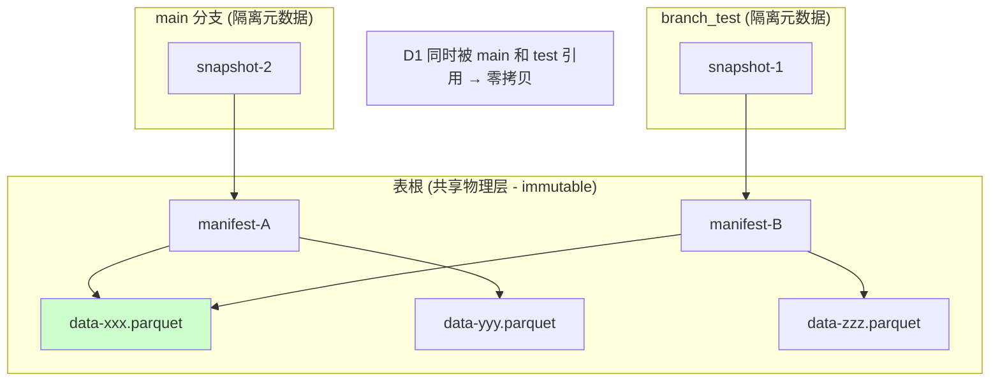
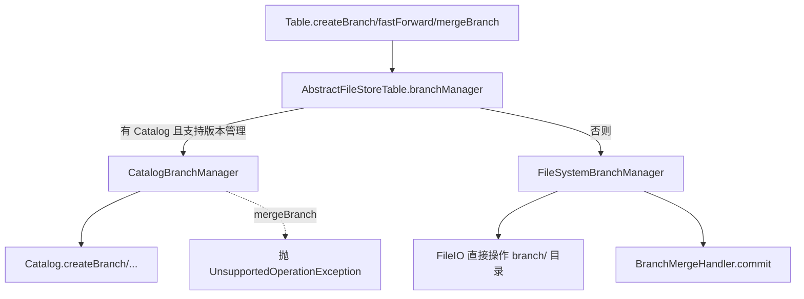
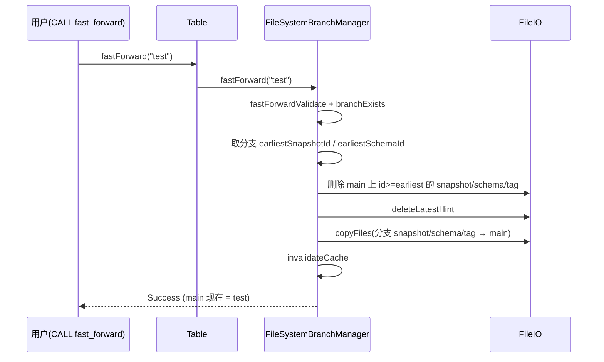
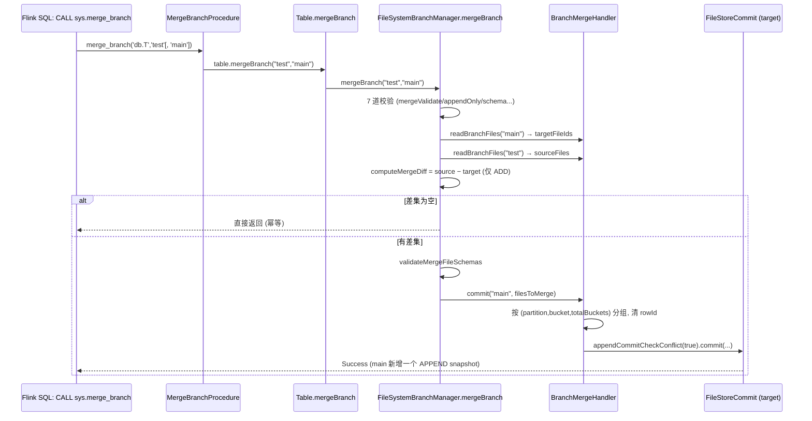

# Apache Paimon 分支(Branch)机制与特征实验隔离

> 基于 Apache Paimon 1.5-SNAPSHOT 源码分析，commit: `e76fc41b7`（master 分支）。
>
> **免责声明**：本文所有机制、配置项、类名、方法名均经过本仓库源码核验。**行号会随版本漂移，请以"类名#方法名"定位为准**，行号仅作辅助。性能数字若无源码常量支撑，均显式标注"经验估算"。示意代码标注"(示意，非逐字源码)"，真实片段标明类名与方法名。
>
> **特别提示（核验结论）**：`branch-merge.enabled` 这个表选项在 Flink 测试与官方文档中被引用（用于声称"强制纯追加历史"），但在本 commit 的 `CoreOptions.java` 与 `paimon-core` 主代码中**尚未注册为正式配置项、也没有读取/校验它的逻辑**。当前 HEAD 上 branch merge 的纯追加约束完全由 `FileSystemBranchManager` 的一组校验方法（schema 无主键、快照历史完整且全为 APPEND/ANALYZE 等）实施。详见 [9.6 节](#96-存疑点branch-mergeenabled-选项的真实状态)。

---

## 目录

- [1. 为什么需要 Branch：从"改数据"到"零拷贝实验"](#1-为什么需要-branch从改数据到零拷贝实验)
  - [1.1 Branch 解决的核心矛盾](#11-branch-解决的核心矛盾)
  - [1.2 Branch vs Tag vs Snapshot 的边界](#12-branch-vs-tag-vs-snapshot-的边界)
  - [1.3 ML 场景为什么离不开 Branch](#13-ml-场景为什么离不开-branch)
- [2. 物理布局：什么被隔离，什么被共享](#2-物理布局什么被隔离什么被共享)
  - [2.1 目录树全景图](#21-目录树全景图)
  - [2.2 路径规则的唯一真相源 BranchManager#branchPath](#22-路径规则的唯一真相源-branchmanagerbranchpath)
  - [2.3 隔离的四类元数据：snapshot/schema/tag/consumer](#23-隔离的四类元数据snapshotschematagconsumer)
  - [2.4 共享的物理资产：data/manifest/index](#24-共享的物理资产datamanifestindex)
  - [2.5 不变量与正确性论证：为什么零拷贝是安全的](#25-不变量与正确性论证为什么零拷贝是安全的)
- [3. BranchManager 接口体系与两套实现](#3-branchmanager-接口体系与两套实现)
  - [3.1 接口契约与命名校验](#31-接口契约与命名校验)
  - [3.2 FileSystemBranchManager：直连文件系统](#32-filesystembranchmanager直连文件系统)
  - [3.3 CatalogBranchManager：经由 Catalog](#33-catalogbranchmanager经由-catalog)
  - [3.4 AbstractFileStoreTable 如何选择实现](#34-abstractfilestoretable-如何选择实现)
- [4. 创建分支：基于 Tag vs 空分支](#4-创建分支基于-tag-vs-空分支)
  - [4.1 空分支：只复制 schema](#41-空分支只复制-schema)
  - [4.2 基于 Tag 分支：复制 tag+snapshot+schema](#42-基于-tag-分支复制-tagsnapshotschema)
  - [4.3 createBranch 算法逐步推导](#43-createbranch-算法逐步推导)
  - [4.4 边界与失败路径](#44-边界与失败路径)
- [5. FastForward：覆盖式快进合并](#5-fastforward覆盖式快进合并)
  - [5.1 语义定义：分支反向覆盖主线](#51-语义定义分支反向覆盖主线)
  - [5.2 算法逐步推导](#52-算法逐步推导)
  - [5.3 不变量、缓存失效与边界](#53-不变量缓存失效与边界)
- [6. Branch Merge：append-only 表的增量文件级合并（新特性）](#6-branch-mergeappend-only-表的增量文件级合并新特性)
  - [6.1 设计动机与 FastForward 的本质区别](#61-设计动机与-fastforward-的本质区别)
  - [6.2 七道校验闸门](#62-七道校验闸门)
  - [6.3 computeMergeDiff：基于 FileEntry.Identifier 的差集](#63-computemergediff基于-fileentryidentifier-的差集)
  - [6.4 BranchMergeHandler.commit：重组提交](#64-branchmergehandlercommit重组提交)
  - [6.5 冲突处理与幂等性论证](#65-冲突处理与幂等性论证)
  - [6.6 限制清单与失败路径](#66-限制清单与失败路径)
  - [6.7 端到端调用栈与时序图](#67-端到端调用栈与时序图)
- [7. scan.fallback-branch：分区级回退读](#7-scanfallback-branch分区级回退读)
  - [7.1 三个配置项的语义](#71-三个配置项的语义)
  - [7.2 FallbackReadFileStoreTable 装配](#72-fallbackreadfilestoretable-装配)
  - [7.3 分区级合并算法](#73-分区级合并算法)
  - [7.4 fail-fast 与正确性边界](#74-fail-fast-与正确性边界)
- [8. 引擎层入口：DDL / Procedure / Action](#8-引擎层入口ddl--procedure--action)
  - [8.1 分支表名寻址 t$branch_xxx](#81-分支表名寻址-tbranch_xxx)
  - [8.2 Flink Procedures 与 Actions 全表](#82-flink-procedures-与-actions-全表)
  - [8.3 Spark Procedures 全表](#83-spark-procedures-全表)
  - [8.4 $branches 系统表](#84-branches-系统表)
- [9. ML 场景落地：特征实验隔离四式](#9-ml-场景落地特征实验隔离四式)
  - [9.1 式一：特征工程 A/B（baseline vs 新特征，零拷贝并行）](#91-式一特征工程ab-baseline-vs-新特征零拷贝并行)
  - [9.2 式二：样本集隔离实验](#92-式二样本集隔离实验)
  - [9.3 式三：数据修复分支（修复-验证-合并回主线）](#93-式三数据修复分支修复-验证-合并回主线)
  - [9.4 式四：不污染线上的特征/样本探索](#94-式四不污染线上的特征样本探索)
  - [9.5 方案选型决策表：FastForward vs Merge vs Fallback](#95-方案选型决策表fastforward-vs-merge-vs-fallback)
  - [9.6 存疑点：branch-merge.enabled 选项的真实状态](#96-存疑点branch-mergeenabled-选项的真实状态)
- [10. 最小可复现示例与观察验证](#10-最小可复现示例与观察验证)
  - [10.1 端到端：创建-写入-合并-验证（Flink SQL）](#101-端到端创建-写入-合并-验证flink-sql)
  - [10.2 用目录结构验证隔离/共享](#102-用目录结构验证隔离共享)
  - [10.3 用 $branches / $snapshots 系统表验证](#103-用-branches--snapshots-系统表验证)
- [11. 源码交叉核对总表](#11-源码交叉核对总表)
- [12. 小结与交叉引用](#12-小结与交叉引用)

---

## 1. 为什么需要 Branch：从"改数据"到"零拷贝实验"

### 1.1 Branch 解决的核心矛盾

官方文档 `docs/docs/maintenance/manage-branches.mdx` 开篇即点出了 Branch 的定位：

> In streaming data processing, it's difficult to correct data for it may affect the existing data... by creating custom data branch, it can help to do experimental tests and data validating for the new job on the existing table, which doesn't need to stop the existing reading / writing workflows and **no need to copy data from the main branch**.

翻译为工程语言，Branch 同时解决三个矛盾：

1. **改数据 vs 不影响线上**：流作业正在往 `main` 分支写，此时要修复历史数据或试验新管线，直接动 `main` 会让线上读到中间态。Branch 让试验跑在独立的元数据命名空间上。
2. **隔离 vs 不浪费存储**：传统做法是"复制一张表来试验"，存储翻倍。Branch 的关键设计是**只隔离元数据指针（snapshot/schema/tag/consumer），共享底层数据文件**——这是"no need to copy data"的源码实现基础（[第 2 节](#2-物理布局什么被隔离什么被共享)）。
3. **试验 vs 回主线**：试验成功后，需要把分支成果安全地合回主线。Paimon 提供两条回归路径——**FastForward（覆盖式快进，[第 5 节](#5-fastforward覆盖式快进合并)）**与 **Branch Merge（增量文件级合并，[第 6 节](#6-branch-mergeappend-only-表的增量文件级合并新特性)）**。

### 1.2 Branch vs Tag vs Snapshot 的边界

三者都是"版本"的不同抽象，但定位完全不同（Tag/Snapshot 的完整机制见 [[17-时间旅行与版本管理]]，此处只点边界）：

| 概念 | 是否可写 | 隔离粒度 | 生命周期 | 典型用途 |
|------|---------|---------|---------|---------|
| **Snapshot** | 只读（committed 结果） | 单次提交的全量视图 | 受快照过期管理 | 时间旅行 `scan.snapshot-id` |
| **Tag** | 只读（命名的 snapshot 引用） | 一个固定 snapshot | 受 Tag TTL 管理，可长期保留 | 关键里程碑、训练样本快照 |
| **Branch** | **可写**（独立 snapshot 链） | **独立的元数据命名空间** | 显式删除 | 实验、修复、回退源 |

一句话：**Tag 是"给某个 snapshot 起名"，Branch 是"分叉出一条可独立读写的 snapshot 链"**。而且 Branch 可以**从某个 Tag 创建**（[4.2 节](#42-基于-tag-分支复制-tagsnapshotschema)），起点就是那个 Tag 指向的数据状态。

### 1.3 ML 场景为什么离不开 Branch

在特征/样本平台里，"实验隔离"是刚需。典型痛点：

- 想给线上特征表加一组新特征做 A/B，但不能影响正在被训练作业读取的 baseline 特征；
- 发现某个样本分区被脏数据污染，要在不影响在跑训练的前提下离线修复并验证；
- 想探索性地清洗/重算一批样本，验证效果后再决定是否合入主线。

这些场景的共同诉求是：**一份物理数据，多条逻辑视图，独立读写，可控合并**。Branch 的"元数据隔离 + 数据共享"恰好命中。本篇讲 Branch 的**完整机制**；样本场景下分支的**具体用法**与端到端样本平台架构见 [[26-机器学习样本数据平台]]，两篇互补，重叠处只链接不展开。

---

## 2. 物理布局：什么被隔离，什么被共享

这是理解 Branch 的**第一性原理**。一旦看懂"哪些目录隔离、哪些共享"，FastForward / Merge / Fallback 的语义就全部自洽了。

### 2.1 目录树全景图

下图是一个分区表 `T`（带 `branch_test` 分支）的实际磁盘布局。**注意 `main` 分支的元数据直接挂在表根，分支的元数据挂在 `branch/branch-<name>/` 下，而所有真实数据文件、manifest、index 都只存在于表根的分区桶目录里。**

```
warehouse/db.db/T/                          ← 表根 (tablePath)
├── snapshot/                               ← [隔离-main] main 分支的 snapshot 链
│   ├── EARLIEST
│   ├── LATEST
│   ├── snapshot-1
│   └── snapshot-2
├── schema/                                 ← [隔离-main] main 分支的 schema 历史
│   └── schema-0
├── tag/                                    ← [隔离-main] main 分支的 tag
│   └── tag-tag1
├── consumer/                               ← [隔离-main] main 分支的 consumer 位点
│   └── consumer-myid
│
├── manifest/                               ← [共享] 所有分支共用 manifest 目录
│   ├── manifest-list-...
│   └── manifest-...
├── index/                                  ← [共享] 文件索引/DV 等
│
├── pt=20240725/                            ← [共享] 分区目录
│   └── bucket-0/
│       ├── data-xxx.parquet                ← [共享] 真实数据文件
│       └── data-yyy.parquet
│
└── branch/                                 ← 分支元数据根目录
    └── branch-test/                        ← branch 'test' (BRANCH_PREFIX="branch-")
        ├── snapshot/                       ← [隔离-test] test 分支独立 snapshot 链
        │   ├── LATEST
        │   └── snapshot-1
        ├── schema/                         ← [隔离-test] test 分支独立 schema 历史
        │   └── schema-0
        ├── tag/                            ← [隔离-test] test 分支独立 tag
        └── consumer/                       ← [隔离-test] test 分支独立 consumer
```

**关键观察**：`branch/branch-test/` 下面**只有 snapshot/schema/tag/consumer**，没有 `bucket-*` 数据目录、没有 `manifest`、没有 `index`。分支的 snapshot 通过其 manifest-list 指向**表根共享的** manifest 与数据文件。这就是"零拷贝"的物理本质。

### 2.2 路径规则的唯一真相源 BranchManager#branchPath

所有"该走 main 还是该走 branch 子目录"的判断，都收敛到 `BranchManager.branchPath` 这一个静态方法：

```java
// BranchManager#branchPath（真实源码）
static String branchPath(Path tablePath, String branch) {
    return isMainBranch(branch)
            ? tablePath.toString()
            : tablePath.toString() + "/branch/" + BRANCH_PREFIX + branch;
}
```

其中 `BRANCH_PREFIX = "branch-"`，`isMainBranch` 判断 `branch.equals(DEFAULT_MAIN_BRANCH)`，而 `DEFAULT_MAIN_BRANCH = "main"`（定义在 `Identifier`，`BranchManager` 引用之）。

语义：

- `branch == "main"` → 路径 = 表根，**main 分支的元数据就放在表根**，不进 `branch/` 子目录；
- 其它分支 → 路径 = `tablePath/branch/branch-<name>`。

`SnapshotManager`、`SchemaManager`、`TagManager`、`ConsumerManager` 全部通过 `static import org.apache.paimon.utils.BranchManager.branchPath;` 复用这一个函数来拼自己的子目录，从根上保证了路径规则一致。

### 2.3 隔离的四类元数据：snapshot/schema/tag/consumer

四个 Manager 的目录方法**逐字核对**如下（均经 Read 核验）：

| Manager | 方法 | 目录路径（真实源码） |
|---------|------|---------|
| `SnapshotManager#snapshotDirectory` | — | `branchPath(tablePath, branch) + "/snapshot"` |
| `SchemaManager#schemaDirectory` | — | `branchPath() + "/schema"`（其中 `branchPath()` 内部调 `BranchManager.branchPath(tableRoot, branch)`） |
| `TagManager#tagDirectory` | — | `branchPath(tablePath, branch) + "/tag"` |
| `ConsumerManager#consumerDirectory` | — | `branchPath(tablePath, branch) + "/consumer"` |

四个 Manager 都提供 `copyWithBranch(String branchName)` 工厂方法，返回一个绑定到指定分支的同类实例，例如：

```java
// SnapshotManager#copyWithBranch（真实源码，节选）
public SnapshotManager copyWithBranch(String branchName) {
    SnapshotLoader newSnapshotLoader = null;
    if (snapshotLoader != null) {
        newSnapshotLoader = snapshotLoader.copyWithBranch(branchName);
    }
    return new SnapshotManager(fileIO, tablePath, branchName, newSnapshotLoader, cache);
}
```

构造器里统一调用 `BranchManager.normalizeBranch(branchName)`，把空串/空白归一为 `"main"`，确保"没指定分支 = main"。

**结论**：snapshot 链、schema 演进历史、tag、consumer 位点，这四类**指针/元数据**在分支间完全隔离——你在 `test` 分支建 tag、改 schema、推进 consumer，都不会污染 `main`。

### 2.4 共享的物理资产：data/manifest/index

数据/manifest/index 的路径由 `FileStorePathFactory` 决定，而它的 `root` 是 `options.path()`：

```java
// AbstractFileStore#pathFactory（真实源码，节选）
protected FileStorePathFactory pathFactory(CoreOptions options, String format) {
    return new FileStorePathFactory(
            options.path(),          // ← root = 表根，与 branch 无关
            partitionType,
            ...);
}
```

而 `CoreOptions#path()` 返回的是 `PATH` 选项（表根），与 `branch()` 互不相干：

```java
// CoreOptions（真实源码）
public Path path() { return path(options.toMap()); }   // ← 取 'path' 选项
public String branch() { return branch(options.toMap()); }  // ← 取 'branch' 选项，默认 "main"
```

`FileStorePathFactory` 里：

- `manifestPath()` = `new Path(root, MANIFEST_PATH)`
- `bucketPath(partition, bucket)` = `new Path(root, relativeBucketPath(...))`

`root` 恒为表根，**不带 branch 前缀**。因此：

> **同一份 manifest 文件、同一份数据文件，可以被 main 与任意分支的 snapshot 同时引用。** 分支的 snapshot 只是一组新的 manifest-list/manifest，指向（可能是已存在的、也可能是分支新写入的）数据文件。

这正是"创建分支几乎瞬时、不占额外空间"的原因。

### 2.5 不变量与正确性论证：为什么零拷贝是安全的

零拷贝共享的前提是**数据文件不可变（immutable）**。Paimon 的数据文件一旦写入永不原地修改，删除靠 DV（[[04-DeletionVectors与文件索引]]）、合并靠 compaction 生成新文件。由此可论证：

- **不变量 I1（引用安全）**：分支 A 引用的数据文件 `data-xxx.parquet` 不会被分支 B 的写入改写内容。因为写入只追加新文件，不改旧文件。
- **不变量 I2（删除安全）**：`dropBranch` 只删 `branch/branch-<name>/` 元数据目录，**不删任何数据文件**。官方文档明确警示：

  > The `Delete Branches` operation only deletes the metadata file. If you want to clear the data written during the branch, use `remove_orphan_files`.

  源码侧 `FileSystemBranchManager#dropBranch` 仅执行 `fileIO.delete(branchPath(branchName), true)`，删的是分支元数据目录。删除分支后，那些**只被该分支引用的**数据文件会变成孤儿文件，需 `remove_orphan_files` 单独清理——这保证了"删分支不会误删 main 还在用的文件"。
- **风险点 R1（孤儿文件回收）**：正因为数据共享，孤儿文件清理必须**跨所有分支扫描存活引用**，否则会误删某分支仍引用的文件。这是 Branch 与 orphan-files 清理之间的耦合点（机制细节见 [[11-小文件治理机制]]）。



---

## 3. BranchManager 接口体系与两套实现

### 3.1 接口契约与命名校验

`BranchManager`（`org.apache.paimon.utils.BranchManager`）是分支操作的统一契约，核心方法：

```java
// BranchManager 接口（真实源码，节选）
void createBranch(String branchName);
void createBranch(String branchName, @Nullable String tagName);
void createBranch(String branchName, boolean ignoreIfExists);
void createBranch(String branchName, @Nullable String tagName, boolean ignoreIfExists);
void dropBranch(String branchName);
void fastForward(String branchName);
void mergeBranch(String sourceBranch, String targetBranch);
void renameBranch(String fromBranch, String toBranch);
List<String> branches();
```

接口里还内置了三组静态校验（防御性编程的关键不变量）：

- **`validateBranch(branchName)`**：分支名不能等于 `main`、不能空白、**不能是纯数字串**（纯数字会与 snapshot-id/tag 寻址歧义冲突）。
- **`mergeValidate(source, target)`**：源/目标不能空白、不能自己合并自己（`Cannot merge branch '%s' into itself.`）。
- **`fastForwardValidate(branchName, currentBranch)`**：不能对 `main` 做 fast-forward、不能空白、不能从当前分支 fast-forward 自己（`Fast-forward from the current branch '%s' is not allowed.`）。

### 3.2 FileSystemBranchManager：直连文件系统

`FileSystemBranchManager` 通过 `FileIO` 直接操作上述目录，是 FileSystemCatalog（默认 Catalog）下的实现。它持有五个协作者：`fileIO`、`snapshotManager`、`tagManager`、`schemaManager`、`mergeHandler`（`BranchMergeHandler`）。它实现了**全部**分支操作，包括 `mergeBranch`。

### 3.3 CatalogBranchManager：经由 Catalog

`CatalogBranchManager` 把操作下发给 `Catalog`（用于 REST Catalog 等支持版本管理的目录），它持有 `CatalogLoader` 与 `Identifier`，每次操作都 `catalogLoader.load()` 拿一个 Catalog 实例再调用其 `createBranch / dropBranch / fastForward / renameBranch / listBranches`。

**重要差异**：`CatalogBranchManager#mergeBranch` 直接抛异常：

```java
// CatalogBranchManager#mergeBranch（真实源码）
@Override
public void mergeBranch(String sourceBranch, String targetBranch) {
    throw new UnsupportedOperationException("Branch merge is not supported via catalog.");
}
```

即：**Branch Merge 目前只在 FileSystem 路径（FileSystemBranchManager）下可用，经由 Catalog 不支持**。这是选型时必须知道的限制（见 [6.6 节](#66-限制清单与失败路径)）。

Catalog 侧的接口在 `AbstractCatalog` 中默认 `throw new UnsupportedOperationException()`（`createBranch/dropBranch/renameBranch/fastForward/listBranches`），具体由 FileSystemCatalog / RESTCatalog 等覆写实现（Catalog 体系见 [[03-Catalog与元数据管理]]）。

### 3.4 AbstractFileStoreTable 如何选择实现

`AbstractFileStoreTable#branchManager` 的选择逻辑（真实源码）：

```java
// AbstractFileStoreTable#branchManager（真实源码）
public BranchManager branchManager() {
    if (catalogEnvironment.catalogLoader() != null
            && catalogEnvironment.supportsVersionManagement()) {
        return new CatalogBranchManager(catalogEnvironment.catalogLoader(), identifier());
    }
    return new FileSystemBranchManager(
            fileIO, path, snapshotManager(), tagManager(), schemaManager(),
            new BranchMergeHandler(this::switchToBranch));   // ← merge handler 注入
}
```

规则：**有 CatalogLoader 且该 Catalog 支持版本管理 → CatalogBranchManager；否则 → FileSystemBranchManager**。注意 `BranchMergeHandler` 用 `this::switchToBranch` 作为"分支表工厂"——合并时按需切到具体分支拿 `FileStoreTable`。

`switchToBranch(branchName)`（真实源码）的作用是：读取目标分支的 latest schema、把 `CoreOptions.BRANCH` 设为目标分支、再 `FileStoreTableFactory.create(...)` 出一个绑定到该分支的表实例。这是"读写某个分支"的统一入口。



---

## 4. 创建分支：基于 Tag vs 空分支

`createBranch` 有两条语义路径：**空分支**（仅复制 schema）与**基于 Tag 的分支**（复制 tag+snapshot+schema）。两者都以 `FileSystemBranchManager` 为准（Catalog 路径下载给 Catalog 实现）。

### 4.1 空分支：只复制 schema

```java
// FileSystemBranchManager#createBranch(branchName, ignoreIfExists)（真实源码）
public void createBranch(String branchName, boolean ignoreIfExists) {
    if (ignoreIfExists && branchExists(branchName)) {
        return;
    }
    validateBranch(branchName);
    try {
        TableSchema latestSchema = schemaManager.latest().get();
        copySchemasToBranch(branchName, latestSchema.id());
    } catch (IOException e) { ... }
}
```

空分支的初始状态"像一张空表"（官方文档原话 `the initial state of the created branch is like an empty table`）——它只复制 schema（从 `schema-0` 到 latest），**不复制任何 snapshot**。所以空分支创建后没有数据，需要往 `t$branch_<name>` 写入才会产生第一个 snapshot。

`copySchemasToBranch`（真实源码）把 `[0, schemaId]` 区间所有存在的 schema 文件 `copyFile` 到分支的 schema 目录：

```java
// FileSystemBranchManager#copySchemasToBranch（真实源码）
private void copySchemasToBranch(String branchName, long schemaId) throws IOException {
    for (int i = 0; i <= schemaId; i++) {
        if (schemaManager.schemaExists(i)) {
            fileIO.copyFile(
                    schemaManager.toSchemaPath(i),
                    schemaManager.copyWithBranch(branchName).toSchemaPath(i),
                    true);
        }
    }
}
```

### 4.2 基于 Tag 分支：复制 tag+snapshot+schema

```java
// FileSystemBranchManager#createBranch(branchName, tagName, ignoreIfExists)（真实源码）
public void createBranch(String branchName, String tagName, boolean ignoreIfExists) {
    if (ignoreIfExists && branchExists(branchName)) {
        return;
    }
    validateBranch(branchName);
    Snapshot snapshot = tagManager.getOrThrow(tagName).trimToSnapshot();
    try {
        // Copy the corresponding tag, snapshot and schema files into the branch directory
        fileIO.copyFile(
                tagManager.tagPath(tagName),
                tagManager.copyWithBranch(branchName).tagPath(tagName), true);
        fileIO.copyFile(
                snapshotManager.snapshotPath(snapshot.id()),
                snapshotManager.copyWithBranch(branchName).snapshotPath(snapshot.id()), true);
        copySchemasToBranch(branchName, snapshot.schemaId());
    } catch (IOException e) { ... }
}
```

基于 Tag 的分支会把**该 Tag 对应的 tag 文件、snapshot 文件、以及 `[0, snapshot.schemaId()]` 的 schema 文件**复制到分支目录。注意：

- 复制的是**元数据文件**（tag/snapshot/schema），不是数据文件——数据文件仍共享。
- 分支的起点 = Tag 指向的那个 snapshot 的数据状态。所以"从 Tag 建分支"= "在某个历史版本上分叉"。
- snapshot 文件被复制后，分支的 snapshot 目录里就有了那一个 snapshot（id 沿用原 id），后续在分支上写入会产生 id 更大的 snapshot。

### 4.3 createBranch 算法逐步推导

以"从 tag1 创建 branch_test"为例：

1. 若 `ignoreIfExists && 已存在` → 直接返回（幂等，支持 `IF NOT EXISTS` 语义）。
2. `validateBranch`：名字合法性（非 main、非空、非纯数字、不已存在）。
3. `tagManager.getOrThrow(tag1).trimToSnapshot()` → 取出 tag1 引用的 Snapshot（trim 掉 tag 专属字段，还原成纯 Snapshot）。
4. `copyFile(tag/tag-tag1 → branch/branch-test/tag/tag-tag1)`。
5. `copyFile(snapshot/snapshot-{id} → branch/branch-test/snapshot/snapshot-{id})`。
6. `copySchemasToBranch(test, snapshot.schemaId())` → 复制 schema-0..schemaId。
7. 完成。此时 `branch/branch-test/` 下有 tag、snapshot、schema 三类元数据，data/manifest 共享表根。

### 4.4 边界与失败路径

| 场景 | 行为 | 源码依据 |
|------|------|---------|
| 分支名 = `main` | 抛 `Branch name 'main' is the default branch and cannot be used.` | `BranchManager.validateBranch` |
| 分支名纯数字（如 `123`） | 抛 `Branch name cannot be pure numeric string` | 同上 |
| 分支已存在且 `ignoreIfExists=false` | 抛 `Branch name '%s' already exists.` | `FileSystemBranchManager.validateBranch` |
| 分支已存在且 `ignoreIfExists=true` | 静默返回（幂等） | `createBranch` 首行判断 |
| Tag 不存在 | `tagManager.getOrThrow` 抛异常 | `createBranch(.., tagName, ..)` |
| 复制中途 IO 失败 | 包装成 RuntimeException，**可能残留半成品分支目录**（无事务回滚） | catch 块 |

> **风险提示**：FileSystem 路径下 createBranch 不是原子的——多个 `copyFile` 之间若 IO 失败，可能留下部分文件的分支目录。生产中建议失败后用 `delete_branch` 清理重建。

---

## 5. FastForward：覆盖式快进合并

### 5.1 语义定义：分支反向覆盖主线

FastForward 是**用分支去覆盖 main**的操作（注意方向：把分支推进到 main）。官方文档定义精准：

> Fast-Forward the custom branch to main will **delete all the snapshots, tags and schemas in the main branch that are created after the branch's initial tag**. And **copy snapshots, tags and schemas from the branch to the main branch**.

即 FastForward 是**破坏性、覆盖式**的：main 上分叉点之后的所有 snapshot/tag/schema 会被删除，然后用分支的对应元数据替换。这与 Branch Merge 的"增量、非破坏"形成鲜明对比（[第 6 节](#6-branch-mergeappend-only-表的增量文件级合并新特性)）。

### 5.2 算法逐步推导

```java
// FileSystemBranchManager#fastForward（真实源码，节选）
public void fastForward(String branchName) {
    BranchManager.fastForwardValidate(branchName, snapshotManager.branch());
    checkArgument(branchExists(branchName), "Branch name '%s' doesn't exist.", branchName);

    Long earliestSnapshotId = snapshotManager.copyWithBranch(branchName).earliestSnapshotId();
    if (earliestSnapshotId == null) {
        throw new RuntimeException("Cannot fast forward branch " + branchName + ", because it does not have snapshot.");
    }
    Snapshot earliestSnapshot = snapshotManager.copyWithBranch(branchName).snapshot(earliestSnapshotId);
    long earliestSchemaId = earliestSnapshot.schemaId();

    // 1) 删除 main 上 >= earliestSnapshotId 的 snapshot/schema/tag
    List<Path> deleteSnapshotPaths = snapshotManager.snapshotPaths(id -> id >= earliestSnapshotId);
    List<Path> deleteSchemaPaths = schemaManager.schemaPaths(id -> id >= earliestSchemaId);
    List<Path> deleteTagPaths = tagManager.tagPaths(path -> Tag.fromPath(fileIO, path).id() >= earliestSnapshotId);
    // ... 合并 deletePaths

    snapshotManager.deleteLatestHint();          // 2) 删 LATEST hint
    fileIO.deleteFilesQuietly(deletePaths);       // 3) 删除上述 main 元数据

    // 4) 把分支的 snapshot/schema/tag 目录复制覆盖到 main
    fileIO.copyFiles(snapshotManager.copyWithBranch(branchName).snapshotDirectory(),
                     snapshotManager.snapshotDirectory(), true);
    fileIO.copyFiles(schemaManager.copyWithBranch(branchName).schemaDirectory(),
                     schemaManager.schemaDirectory(), true);
    Path branchTagDirectory = tagManager.copyWithBranch(branchName).tagDirectory();
    if (fileIO.exists(branchTagDirectory)) {      // 5) 分支无 tag 时跳过（commit 5782b5e37）
        fileIO.copyFiles(branchTagDirectory, tagManager.tagDirectory(), true);
    }
    snapshotManager.invalidateCache();            // 6) 失效缓存
}
```

逐步分解：

1. **取分叉点**：分支的 `earliestSnapshotId` 即分支起点的 snapshot id，对应的 `earliestSchemaId` 是起点 schema。
2. **删除 main 上 >= 分叉点的元数据**：snapshot（id ≥ earliest）、schema（id ≥ earliestSchema）、tag（其 snapshot id ≥ earliest）。这一步抹掉 main 在分叉后的所有进展。
3. **删 LATEST hint**：避免读到失效的 LATEST 指针。
4. **覆盖复制**：把分支的整个 snapshot/schema 目录 copy 到 main。
5. **tag 容错**：若分支没有 tag 目录则跳过（这是 commit `5782b5e37` 的修复，避免分支无 tag 时报错）。
6. **失效缓存**：`invalidateCache()` 清掉 SnapshotManager 的内存缓存。

### 5.3 不变量、缓存失效与边界

- **不变量**：FastForward 后，main 的 snapshot 链 = 分支的 snapshot 链（分叉点起完全一致）。由于数据文件共享，不需要搬运任何数据。
- **方向校验**：`fastForwardValidate` 禁止 `branchName == main`（不能 fast-forward main 自己），也禁止从当前分支 fast-forward（`snapshotManager.branch()` 即当前分支）。
- **失败路径**：分支无 snapshot（如刚建的空分支没写过数据）→ 抛 `Cannot fast forward branch ..., because it does not have snapshot.`。
- **破坏性提醒**：FastForward 会**永久删除 main 分叉点之后的 snapshot/tag/schema 元数据**。这些元数据指向的数据文件若不再被任何分支引用，会成为孤儿文件。**这是覆盖式语义，不可逆**——生产前务必确认 main 在分叉后没有还需要保留的提交。
- **Spark 缓存**：官方文档提示分支若改了 schema，FastForward 后 Spark 需 `REFRESH TABLE my_table` 清缓存。



---

## 6. Branch Merge：append-only 表的增量文件级合并（新特性）

> **核验来源**：commit `f336ba868 [core][rest] Add branch merge support for append-only tables (#7882)`（核心实现）+ commit `80e022b28 [flink] Add Flink procedure and action for branch merge (#7931)`（Flink 入口）。这是**较新的特性**，下文所有语义均直接读自 `FileSystemBranchManager#mergeBranch` 与 `BranchMergeHandler`。

### 6.1 设计动机与 FastForward 的本质区别

FastForward 是"覆盖式"（用分支替换 main 分叉后历史），代价是**会删除 main 分叉后的提交**。如果 main 和分支在分叉后**各自都有新增数据**，FastForward 会丢掉 main 那部分。Branch Merge 解决的就是这个场景：

> 提交信息原文：`It adds mergeBranch, which incrementally adds data files that exist only in the source branch to the target branch, without replacing either branch.`

即 **Branch Merge = 把"只在源分支存在、目标分支没有"的数据文件，增量追加到目标分支，两个分支都不被替换**。这是非破坏性的、可双向、可多次的合并。

| 维度 | FastForward | Branch Merge |
|------|-------------|--------------|
| 语义 | 覆盖式（分支替换 main 分叉后历史） | 增量式（把源独有文件追加到目标） |
| 破坏性 | 删除 main 分叉后的 snapshot/tag/schema | 不删任何东西，只新增提交 |
| 表类型 | 任意表 | **仅 append-only 表（无主键）** |
| 方向 | 分支 → main（固定） | 源 → 目标（任意，可双向） |
| 可多次 | 否（一次性覆盖） | 是（基于差集，幂等） |
| Catalog 路径支持 | 支持 | **不支持**（仅 FileSystem） |

### 6.2 七道校验闸门

`mergeBranch` 在真正动手前要过七道校验（真实源码，按执行顺序）：

```java
// FileSystemBranchManager#mergeBranch（真实源码）
public void mergeBranch(String sourceBranch, String targetBranch) {
    BranchManager.mergeValidate(sourceBranch, targetBranch);       // 1
    validateMergeBranches(sourceBranch, targetBranch);             // 2
    validateAppendOnlyHistory(sourceBranch, targetBranch);         // 3
    validateAppendOnly(sourceBranch, targetBranch);                // 4
    validateNoDataEvolution(sourceBranch, targetBranch);           // 5
    validateRowTrackingConsistent(sourceBranch, targetBranch);     // 6
    validateLatestSchema(sourceBranch, targetBranch);              // 7

    List<ManifestEntry> filesToMerge = computeMergeDiff(sourceBranch, targetBranch);
    if (filesToMerge.isEmpty()) {
        return;   // 空差集 → 直接返回（幂等）
    }
    validateMergeFileSchemas(sourceBranch, targetBranch, filesToMerge);  // 8 (按文件)
    mergeHandler.commit(targetBranch, filesToMerge);
}
```

| # | 校验方法 | 检查内容 | 失败信息要点 |
|---|---------|---------|-------------|
| 1 | `BranchManager.mergeValidate` | 源/目标非空、不自合并 | `Cannot merge branch '%s' into itself.` |
| 2 | `validateMergeBranches` | 非 main 的分支须存在；源/目标都须有 latest snapshot | `because it does not have snapshot` |
| 3 | `validateAppendOnlyHistory` | 源/目标的快照历史**从 snapshot-1 起完整连续**，且每个 snapshot 的 commitKind ∈ {APPEND, ANALYZE} | `requires complete append-only snapshot history` |
| 4 | `validateAppendOnly` | 源/目标 latest schema **无主键**（primaryKeys 为空） | `Branch merge is only supported for append-only tables` |
| 5 | `validateNoDataEvolution` | 源/目标都未开 `data-evolution.enabled` | `not supported for data-evolution tables` |
| 6 | `validateRowTrackingConsistent` | 源/目标的 `row-tracking.enabled` 必须一致 | `row-tracking settings must match` |
| 7 | `validateLatestSchema` | 源/目标 latest schema 的 **fields 必须相同** | `schema mismatch` |
| 8 | `validateMergeFileSchemas` | 待合并文件涉及的每个 schemaId，目标分支必须有且**完全一致** | `schema history mismatch for schema id %s` |

第 3 道闸门（`validateAppendOnlyHistory` → `validateCompleteAppendOnly`）值得细看，它是 append-only 表 merge 正确性的关键不变量：

```java
// FileSystemBranchManager#validateCompleteAppendOnly（真实源码，节选）
private void validateCompleteAppendOnly(SnapshotManager sm, String branch) {
    Long earliest = sm.earliestSnapshotId();
    Long latest = sm.latestSnapshotId();
    if (earliest == null || latest == null) return;
    if (earliest != Snapshot.FIRST_SNAPSHOT_ID) {        // 必须从 snapshot-1 开始
        throw new IllegalArgumentException("... does not start at snapshot 1 ...");
    }
    for (long id = Snapshot.FIRST_SNAPSHOT_ID; id <= latest; id++) {
        if (!sm.snapshotExists(id)) {                    // 中间不能缺 snapshot
            throw new IllegalArgumentException("... snapshot %d is missing ...");
        }
        Snapshot.CommitKind kind = sm.snapshot(id).commitKind();
        if (kind != Snapshot.CommitKind.APPEND && kind != Snapshot.CommitKind.ANALYZE) {
            throw new IllegalArgumentException("... has commit kind '%s' ...");  // 不能有 COMPACT/OVERWRITE
        }
    }
}
```

源码注释直接解释了**为什么要求完整连续历史**（这是正确性论证的关键）：

> Branch merge is implemented as a conservative file-level merge. **Without persisted branch lineage metadata, we cannot reliably infer a fork point after snapshots expire.** To preserve correctness, both branches must retain complete append-only history from the first snapshot.

通俗讲：由于 Paimon **没有持久化"分支从哪个点分叉"的血缘元数据**，merge 无法可靠地推断分叉点。为了保守正确，它要求两个分支都从 `snapshot-1` 起保留**完整、连续、全为 APPEND/ANALYZE** 的历史。一旦出现 COMPACT（文件被重写）或 OVERWRITE（分区被覆盖）或快照过期导致历史断裂，文件级差集就可能产生重复或丢失，因此直接拒绝。`Snapshot.FIRST_SNAPSHOT_ID = 1`，`CommitKind` 枚举含 `APPEND/COMPACT/OVERWRITE/ANALYZE` 等。

### 6.3 computeMergeDiff：基于 FileEntry.Identifier 的差集

```java
// FileSystemBranchManager#computeMergeDiff（真实源码）
private List<ManifestEntry> computeMergeDiff(String sourceBranch, String targetBranch) {
    Set<FileEntry.Identifier> targetFileIds = mergeHandler.readBranchFiles(targetBranch).keySet();
    Map<FileEntry.Identifier, ManifestEntry> sourceFiles = mergeHandler.readBranchFiles(sourceBranch);

    List<ManifestEntry> filesToMerge = new ArrayList<>();
    for (Map.Entry<FileEntry.Identifier, ManifestEntry> entry : sourceFiles.entrySet()) {
        if (!targetFileIds.contains(entry.getKey())) {     // 源有、目标没有
            ManifestEntry manifestEntry = entry.getValue();
            if (manifestEntry.kind() == FileKind.ADD) {    // 只取 ADD 的存活文件
                filesToMerge.add(manifestEntry);
            }
        }
    }
    return filesToMerge;
}
```

`readBranchFiles` 读取一个分支 latest snapshot 的全部存活数据文件，按 `FileEntry.Identifier` 建索引（真实源码）：

```java
// BranchMergeHandler#readBranchFiles（真实源码，节选）
public Map<FileEntry.Identifier, ManifestEntry> readBranchFiles(String branch) {
    FileStoreTable branchTable = branchTableFactory.apply(branch);
    Snapshot snapshot = branchTable.snapshotManager().latestSnapshot();
    checkArgument(snapshot != null, "... it does not have any snapshot.", branch);
    ManifestList manifestList = branchTable.store().manifestListFactory().create();
    ManifestFile manifestFile = branchTable.store().manifestFileFactory().create();
    Map<FileEntry.Identifier, ManifestEntry> files = new LinkedHashMap<>();
    FileEntry.mergeEntries(manifestFile, manifestList.readDataManifests(snapshot), files, null);
    return files;
}
```

算法本质：**差集 = 源分支存活文件 − 目标分支存活文件**（按 `FileEntry.Identifier` 比较，含 partition/bucket/level/fileName 等身份信息），且只取 `FileKind.ADD`。`FileEntry.mergeEntries` 把 ADD/DELETE 抵消后得到当前存活集合。

### 6.4 BranchMergeHandler.commit：重组提交

拿到差集文件后，`BranchMergeHandler#commit` 把它们按 `(partition, bucket, totalBuckets)` 分组，重组为目标分支的一次提交（真实源码节选）：

```java
// BranchMergeHandler#commit（真实源码，节选）
public void commit(String targetBranch, List<ManifestEntry> filesToMerge) {
    FileStoreTable branchTable = branchTableFactory.apply(targetBranch);
    boolean rowTrackingEnabled = new CoreOptions(branchTable.schema().options()).rowTrackingEnabled();

    Map<MergeKey, List<DataFileMeta>> grouped = new LinkedHashMap<>();
    for (ManifestEntry entry : filesToMerge) {
        DataFileMeta file = prepareFileForTargetCommit(entry.file(), rowTrackingEnabled);
        grouped.computeIfAbsent(new MergeKey(entry.partition().copy(), entry.bucket(), entry.totalBuckets()),
                                k -> new ArrayList<>()).add(file);
    }

    String commitUser = UUID.randomUUID().toString();
    ManifestCommittable committable = new ManifestCommittable(0);
    for (Map.Entry<MergeKey, List<DataFileMeta>> e : grouped.entrySet()) {
        MergeKey key = e.getKey();
        CommitMessageImpl message = new CommitMessageImpl(
                key.partition, key.bucket, key.totalBuckets,
                new DataIncrement(e.getValue(), Collections.emptyList(), Collections.emptyList()),
                CompactIncrement.emptyIncrement());
        committable.addFileCommittable(message);
    }

    try (FileStoreCommit commit = branchTable.store().newCommit(commitUser, branchTable)) {
        commit.appendCommitCheckConflict(true).commit(committable, true);   // ← 开启 append 冲突检测
    }
}
```

关键点：

- **行 ID 处理**：若开了 row-tracking，`prepareFileForTargetCommit` 会清掉源文件已分配的 `firstRowId`（`file.newFirstRowId(null)`），让目标分支提交路径**重新分配不冲突的行 ID**。注释原文：`Clear them so the target branch commit path assigns fresh, non-overlapping row ids.`（row-tracking 见 [[30-Append表高级特性]]）。
- **以 DataIncrement 重组提交**：把差集文件包成 `CommitMessageImpl`（只有 `newFiles`，没有 compact increment），通过标准 `FileStoreCommit` 提交到目标分支——产生一个新的 APPEND snapshot。
- **`appendCommitCheckConflict(true)`**：开启 append 提交的冲突检测，这是幂等性/正确性的最后一道防线（见下）。

### 6.5 冲突处理与幂等性论证

- **幂等性**：merge 基于"源独有文件"差集。若再 merge 一次，这些文件已在目标分支 → 差集为空 → `filesToMerge.isEmpty()` 直接返回。所以 **merge 可重复执行而不重复数据**。测试 `AppendOnlySimpleTableTest#testMergeBranchMultipleTimes`、`#testMergeBranchEmptyDiff` 即验证这一点。
- **双向合并**：因为是增量追加且不替换，A→B 与 B→A 都可做。测试 `#testMergeBranchBidirectional` 验证。
- **冲突检测**：`appendCommitCheckConflict(true)` 在提交时检测目标分支是否已被并发改动到冲突状态。测试 `#testMergeBranchFailsOnStaleDuplicateCommit` 直接构造"陈旧重复提交"场景验证会失败——这说明合并不是盲目追加，而是有冲突保护的。
- **正确性边界**：差集按 `FileEntry.Identifier` 去重，依赖文件身份唯一。这要求两分支的文件命名/分区/桶语义一致，因此前置的 schema 一致性（闸门 7、8）+ append-only 历史完整（闸门 3）共同保证了差集计算的可靠性。

### 6.6 限制清单与失败路径

把所有限制汇总（合并时务必对照）：

1. **仅 append-only 表**（无主键），主键表会被闸门 4 拒绝。
2. **两分支历史必须从 snapshot-1 起完整连续，且全为 APPEND/ANALYZE**——一旦发生过 COMPACT / INSERT OVERWRITE，或快照过期断链，即被拒绝（闸门 3）。这是因为缺少分叉血缘元数据（见 [6.2 节注释](#62-七道校验闸门)）。
3. **不支持 data-evolution 表**（闸门 5）。
4. **row-tracking 设置须源/目标一致**（闸门 6）。
5. **schema 必须一致**（最新 fields 一致 + 涉及文件的 schema 历史一致，闸门 7、8）。
6. **不支持删除向量（DV）**——这是 append-only 纯追加约束的必然推论（DV 会改变文件存活语义，破坏文件级差集）。该限制在 PR 描述中明确，源码层面通过"必须是纯 APPEND 历史"间接强制。
7. **仅 FileSystem 路径支持**——`CatalogBranchManager#mergeBranch` 抛 `UnsupportedOperationException`（[3.3 节](#33-catalogbranchmanager经由-catalog)）。
8. **Spark 侧无 merge_branch procedure**——见 [8.3 节](#83-spark-procedures-全表)，目前仅 Flink 暴露了 `merge_branch` procedure/action。

### 6.7 端到端调用栈与时序图



调用栈（自顶向下）：

```
sys.merge_branch  (MergeBranchProcedure / MergeBranchAction)
  → Table.mergeBranch(source, target)              [AbstractFileStoreTable]
    → BranchManager.mergeBranch                    [FileSystemBranchManager]
      → 7 道 validate*
      → computeMergeDiff                           [readBranchFiles × 2 → FileEntry.mergeEntries]
      → BranchMergeHandler.commit                  [分组 → CommitMessageImpl → FileStoreCommit]
```

---

## 7. scan.fallback-branch：分区级回退读

### 7.1 三个配置项的语义

以 `CoreOptions.java` 为准（逐字核验）：

| 配置项 | 默认值 | 语义（源码 withDescription） |
|--------|--------|------------------------------|
| `scan.fallback-branch` | 无默认值 | 批作业读当前分支时，**若某分区在当前分支不存在，则从该回退分支读取该分区**。 |
| `scan.fallback-branch.read-fail-fast` | `false` | 读回退分支抛错时是否立即失败。默认仅记录完整堆栈并**回落到当前分支**（可能掩盖数据问题）；设为 `true` 则把回退分支错误抛给调用方。 |
| `scan.primary-branch` | 无默认值 | 批作业读时，**若分区存在于 primary 分支则从 primary 读，否则从当前分支读**。与 fallback 方向相反。 |

注意还有两个用于 chain table 的 `scan.fallback-snapshot-branch` / `scan.fallback-delta-branch`（本篇不展开，属 chain table 特性）。`scan.fallback-branch` 与 `scan.primary-branch` **不能同时设置**（`SchemaValidation#validateFallbackBranch` 校验，否则抛 `Cannot set both ... at the same time.`），且设置时**回退/primary 分支必须存在**，否则抛 `Cannot set '%s' = '%s' because the branch '%s' does not exist.`。

> **流读限制**：官方文档明确 `For streaming read jobs, this feature is currently not supported, and will only produce results from the current branch.` 回退读仅对**批读**生效。

### 7.2 FallbackReadFileStoreTable 装配

`FileStoreTableFactory#create` 在发现 `scan.fallback-branch`（或 `scan.primary-branch`）时，用 `FallbackReadFileStoreTable` 包装两张表（真实源码节选）：

```java
// FileStoreTableFactory#create（真实源码，节选）
String fallbackBranch = options.get(CoreOptions.SCAN_FALLBACK_BRANCH);
String primaryBranch = options.get(CoreOptions.SCAN_PRIMARY_BRANCH);
if (...chain table...) { ... }
else if (!isBlank(fallbackBranch)) {
    FileStoreTable otherTable = createOtherBranchTable(fileIO, tablePath, fallbackBranch, ...);
    if (otherTable != null) {
        table = new FallbackReadFileStoreTable(table, otherTable, true);   // wrappedFirst=true → 当前分支优先
    }
} else if (!isBlank(primaryBranch)) {
    FileStoreTable otherTable = createOtherBranchTable(fileIO, tablePath, primaryBranch, ...);
    if (otherTable != null) {
        table = new FallbackReadFileStoreTable(table, otherTable, false);  // wrappedFirst=false → primary 优先
    }
}
```

`FallbackReadFileStoreTable` 的类注释精确说明了 `wrappedFirst` 的含义：

> When `wrappedFirst` is true, the wrapped table has read priority (fallback mode). When `wrappedFirst` is false, the other table has read priority (primary mode). **Write operations are always delegated to the wrapped table (current branch).**

即：

- **fallback 模式**（wrappedFirst=true）：当前分支优先，分区缺失才回退到 fallback 分支。
- **primary 模式**（wrappedFirst=false）：primary 分支优先，分区缺失才用当前分支。
- **写永远落到当前分支**，回退/primary 分支只参与读。

装配时还会做 schema 校验（`validateSchema`）：两个分支的 row type 必须一致（忽略 nullable），否则抛错——保证两分支可以无缝拼接同一个查询结果。

### 7.3 分区级合并算法

回退读不是行级 merge，而是**分区级二选一**。核心在 `FallbackReadScan#plan`（真实源码节选）：

```java
// FallbackReadFileStoreTable.FallbackReadScan#plan（真实源码）
public TableScan.Plan plan() {
    List<Split> splits = new ArrayList<>();
    // 1) 列出"完整分区" = 优先表(main)拥有的分区集合
    Set<BinaryRow> completePartitions =
            new HashSet<>(newPartitionListingScan(true, partitionPredicate).listPartitions());
    // 2) 优先表的所有 split 直接加入(标记 isFallback=false)
    for (Split split : mainScan.plan().splits()) {
        splits.add(toFallbackSplit((DataSplit) split, false));
    }
    // 3) 回退表中，过滤掉"优先表已有"的分区，剩下的才从回退表读
    List<BinaryRow> remainingPartitions =
            newPartitionListingScan(false, partitionPredicate).listPartitions().stream()
                    .filter(p -> !completePartitions.contains(p))
                    .collect(Collectors.toList());
    if (!remainingPartitions.isEmpty()) {
        fallbackScan.withPartitionFilter(remainingPartitions);
        for (Split split : fallbackScan.plan().splits()) {
            splits.add(toFallbackSplit(split, true));    // 标记 isFallback=true
        }
    }
    return new DataFilePlan<>(splits);
}
```

算法逐步推导（fallback 模式，优先表 = 当前分支）：

1. 列出当前分支拥有的分区集合 `completePartitions`。
2. 当前分支的所有 split 全部纳入结果。
3. 列出回退分支的分区，**过滤掉当前分支已有的分区**，剩下的"当前分支没有、回退分支有"的分区，从回退分支读。
4. 合并两组 split。

方法注释点明语义：`Partitions that exist in the main branch ... are read from the main branch with the full predicate. Partitions that exist only in the fallback branch are read from the fallback branch.`

这正好对应官方文档的"昨天数据由批作业修正分区读取，今天数据（批作业还没跑）从流分支读取"的场景。

```mermaid
graph TD
    Q[批查询 SELECT * FROM T] --> P{对每个分区}
    P -->|当前分支(main)有该分区| RM[从 main 读整个分区]
    P -->|当前分支没有, 回退分支有| RF[从 fallback 分支读该分区]
    RM --> R[合并结果]
    RF --> R
```

> **粒度提醒**：回退是**分区级**的"二选一"，不是行级 merge。只要 main 有该分区（哪怕只有一行），整个分区就从 main 读，回退分支同名分区被忽略。

### 7.4 fail-fast 与正确性边界

- 默认 `read-fail-fast=false`：回退分支读出错时，记录完整堆栈并**回落到当前分支**继续读——好处是高可用，坏处是可能**静默掩盖数据问题**。
- 设 `read-fail-fast=true`：把回退分支错误直接抛给调用方，适合"宁可失败也不要错数据"的场景。该开关在 `FallbackReadFileStoreTable.Read` 构造时读取 `CoreOptions.SCAN_FALLBACK_BRANCH_READ_FAIL_FAST`，测试 `FallbackReadFileStoreTableTest` 验证两种路径。
- **删除保护**：`AbstractFileStoreTable#deleteBranch` 会拒绝删除被配置为 `scan.fallback-branch` 或 `scan.primary-branch` 的分支（`Cannot delete branch '%s' because it is configured as 'scan.fallback-branch'. Unset ... first.`），避免回退读悬空引用。

---

## 8. 引擎层入口：DDL / Procedure / Action

### 8.1 分支表名寻址 t$branch_xxx

读写某个分支的语法是把分支名编进表名：`` `t$branch_<branchName>` ``。这由 `Identifier` 解析（真实源码）：

```java
// Identifier（真实源码，节选）
public static final String SYSTEM_BRANCH_PREFIX = "branch_";
public static final String DEFAULT_MAIN_BRANCH = "main";
```

`Identifier.fromString("db.t$branch_test")` 会解析出 `branch=test`。例如：

```sql
SELECT * FROM `t$branch_test`;                 -- 读 test 分支
INSERT INTO `t$branch_test` SELECT ...;        -- 写 test 分支
ALTER TABLE `t$branch_test` SET ('bucket'='2'); -- 改 test 分支的 schema/option
```

注意分支表名里用的是**下划线** `branch_`（`SYSTEM_BRANCH_PREFIX`），而磁盘目录前缀是**连字符** `branch-`（`BRANCH_PREFIX`）——两者不同，别混淆。

Spark DataFrame 也可用 `option("branch", "branch1")` 指定分支。

### 8.2 Flink Procedures 与 Actions 全表

| 操作 | Procedure（`CALL sys.*`） | Action（flink run jar） | 实现类 |
|------|--------------------------|------------------------|--------|
| 创建分支 | `create_branch('db.T','b'[,'tag'][,ignoreIfExists])` | `create_branch` | `CreateBranchProcedure` / `CreateBranchAction` |
| 删除分支 | `delete_branch('db.T','b')` | `delete_branch` | `DeleteBranchProcedure` / `DeleteBranchAction` |
| 重命名分支 | `rename_branch('db.T','from','to')` | — | `RenameBranchProcedure` |
| 快进 | `fast_forward('db.T','b')` | `fast_forward` | `FastForwardProcedure` / `FastForwardAction` |
| 合并 | `merge_branch('db.T','src'[,'tgt'])` | `merge_branch` | `MergeBranchProcedure` / `MergeBranchAction` |

`merge_branch` 的 `target_branch` 可选，缺省为 `main`（真实源码）：

```java
// MergeBranchProcedure#call（真实源码，节选）
if (targetBranch == null) {
    targetBranch = Identifier.DEFAULT_MAIN_BRANCH;
}
Table table = catalog.getTable(Identifier.fromString(tableId));
table.mergeBranch(sourceBranch, targetBranch);
```

`create_branch` 支持 `IF NOT EXISTS` 语义的 `ignoreIfExists` 参数（commit `85b8dee50`），有多个重载（带/不带 tag、带/不带 ignoreIfExists）。

### 8.3 Spark Procedures 全表

`SparkProcedures` 注册（真实源码核验）：`create_branch`、`delete_branch`、`rename_branch`、`fast_forward`。

**Spark 没有注册 `merge_branch` procedure**——这是 Flink 独有（commit `80e022b28` 只加了 Flink 入口）。Spark 侧若要 merge，目前需走 API（`table.mergeBranch(...)`）或等后续版本补齐。

### 8.4 $branches 系统表

`BranchesTable`（`org.apache.paimon.table.system.BranchesTable`）暴露 `` `T$branches` ``，schema 为 `(branch_name STRING, create_time TIMESTAMP(3))`：

```sql
SELECT branch_name FROM `T$branches`;
SELECT branch_name FROM `T$branches` WHERE branch_name = 'b2';
SELECT branch_name FROM `T$branches` WHERE branch_name IN ('b1','b3');
```

它内部调 `branchManager.branches()` 列出分支，`create_time` 取分支目录的修改时间（`fileIO.getFileStatus(branchPath).getModificationTime()`）。`BranchesRead` 对 `branch_name = x` 和 `branch_name IN (...)` 做了下推优化（`branchExists` 直查），其余谓词走 list-all + post-filter。

`branches()` 的实现（`FileSystemBranchManager`）列 `branch/` 目录下所有 `branch-` 前缀的子目录，去前缀后返回分支名。

---

## 9. ML 场景落地：特征实验隔离四式

下面把 Branch 机制映射到特征/样本平台的四类高频实验场景。每一式都给"为什么用这个机制 + 落地步骤 + 回归方式"。样本平台整体架构见 [[26-机器学习样本数据平台]]，本节聚焦"分支怎么用"。

### 9.1 式一：特征工程 A/B（baseline vs 新特征，零拷贝并行）

**痛点**：线上特征表 `feature_table` 正被训练作业读取（baseline 特征）。要试一组新特征做 A/B，但不能影响 baseline 读取，也不想复制整张表（存储翻倍）。

**方案**：从当前 tag 创建分支 `exp_newfeat`，在分支上加列/重算特征，分支与 main 共享底层数据文件（零拷贝），两条管线并行读写互不干扰。

```sql
-- 1) 给 baseline 当前状态打 tag（便于分支起点对齐 & 回退）
CALL sys.create_tag('default.feature_table', 'baseline_v1', /*snapshotId*/ 100);

-- 2) 从 tag 创建实验分支（起点 = baseline_v1，零拷贝）
CALL sys.create_branch('default.feature_table', 'exp_newfeat', 'baseline_v1');

-- 3) 在分支上加新特征列（只改分支的 schema，不污染 main）
ALTER TABLE `feature_table$branch_exp_newfeat` ADD COLUMN new_feat DOUBLE;

-- 4) 分支上回填新特征（写入分支独立 snapshot 链）
INSERT INTO `feature_table$branch_exp_newfeat` SELECT ..., compute_new_feat(...) FROM ...;

-- 5) 两条管线并行：baseline 训练读 main，A/B 训练读分支
SELECT * FROM feature_table;                          -- baseline
SELECT * FROM `feature_table$branch_exp_newfeat`;     -- 新特征组
```

**回归**：A/B 胜出后，若 baseline 在分叉后**没有**新增需保留的提交 → 用 `fast_forward` 让 main 直接采纳分支（[第 5 节](#5-fastforward覆盖式快进合并)）；若 baseline 仍在持续追加新数据且表是 append-only → 用 `merge_branch` 把分支独有数据增量合回（[第 6 节](#6-branch-mergeappend-only-表的增量文件级合并新特性)）。

**为什么零拷贝成立**：[2.4 节](#24-共享的物理资产datamanifestindex)——分支只隔离 snapshot/schema，数据文件共享。

### 9.2 式二：样本集隔离实验

**痛点**：想试一套新的样本采样/清洗逻辑，但不能动线上样本表 `sample_table`（在跑的训练靠它）。

**方案**：建空分支或基于 tag 分支，在分支上重写样本生成逻辑，训练作业用 `t$branch_xxx` 读分支样本验证模型指标。验证完用 fallback 或 merge 决定是否采纳。

```sql
-- 空分支(初始如空表), 完全重新生成样本
CALL sys.create_branch('default.sample_table', 'exp_sampling');
-- 注意: 空分支建好后须先对齐 schema/分区/桶, 再写入
INSERT INTO `sample_table$branch_exp_sampling` SELECT ... FROM raw_events WHERE <new_filter>;

-- 训练作业读分支样本做离线评估
SELECT * FROM `sample_table$branch_exp_sampling`;
```

**回归**：评估通过 → `merge_branch`（append-only 样本表）或 `fast_forward`。

### 9.3 式三：数据修复分支（修复-验证-合并回主线）

**痛点**：发现 `sample_table` 某分区被脏数据污染，要修复但不能影响在跑训练。

**方案**：建分支 → 在分支上修复该分区 → 验证 → 用 `scan.fallback-branch` 灰度验证，或 `fast_forward` 一次性回归。这正是官方文档"by merge or replace branch operations, users can complete the correcting of data"的场景。

```sql
-- 1) 建修复分支
CALL sys.create_branch('default.sample_table', 'fix_20240725');

-- 2) 在分支上修复脏分区
INSERT OVERWRITE `sample_table$branch_fix_20240725` PARTITION (dt='20240725')
SELECT ... FROM clean_source WHERE dt='20240725';

-- 3) (可选)灰度: 让线上批读优先用修复分支补缺失分区
ALTER TABLE sample_table SET ('scan.fallback-branch' = 'fix_20240725');
SELECT * FROM sample_table WHERE dt='20240725';   -- 验证修复效果

-- 4) 验证 OK 后, 用 fast-forward 把修复结果回归 main(覆盖式)
ALTER TABLE sample_table RESET ('scan.fallback-branch');   -- 先解绑(否则不让删/有保护)
CALL sys.fast_forward('default.sample_table', 'fix_20240725');
```

**为什么用 fast_forward 而非 merge**：修复用了 `INSERT OVERWRITE`（产生 OVERWRITE 类型 snapshot），会破坏 append-only 历史，**不满足 branch merge 的纯追加约束**（[6.6 节限制 2](#66-限制清单与失败路径)），所以修复场景适合 fast_forward 覆盖式回归。

### 9.4 式四：不污染线上的特征/样本探索

**痛点**：想探索性地清洗/重算一批数据看效果，大概率会丢弃，不想留任何痕迹在 main。

**方案**：建分支随便试，试完 `delete_branch` 删掉（只删元数据），再 `remove_orphan_files` 回收分支独写的数据文件。

```sql
CALL sys.create_branch('default.feature_table', 'scratch');
INSERT INTO `feature_table$branch_scratch` SELECT ...;   -- 随便试
-- 不满意, 丢弃: 删元数据
CALL sys.delete_branch('default.feature_table', 'scratch');
-- 回收分支独写的孤儿数据文件(见 [[11-小文件治理机制]])
CALL sys.remove_orphan_files('default.feature_table');
```

**为什么安全**：[2.5 节不变量 I2](#25-不变量与正确性论证为什么零拷贝是安全的)——删分支不删数据文件，main 引用的文件不受影响；孤儿清理跨分支扫存活引用，不会误删 main 在用的文件。

### 9.5 方案选型决策表：FastForward vs Merge vs Fallback

| 诉求 | 推荐机制 | 关键前提 | 章节 |
|------|---------|---------|------|
| 分支结果整体替换 main（含 schema 变更/OVERWRITE 修复） | **FastForward** | main 分叉后无需保留的提交；破坏性、不可逆 | [5](#5-fastforward覆盖式快进合并) |
| 分支独有数据增量合回 main，两边都保留 | **Branch Merge** | 仅 append-only 表、历史完整连续纯追加、schema 一致、仅 FileSystem 路径 | [6](#6-branch-mergeappend-only-表的增量文件级合并新特性) |
| 灰度/分区级二选一读（线上读优先 X 分支，缺分区回落 Y 分支） | **scan.fallback-branch** | 仅批读；两分支 row type 一致 | [7](#7-scanfallback-branch分区级回退读) |
| 探索后丢弃 | **delete_branch + remove_orphan_files** | 删分支只删元数据 | [9.4](#94-式四不污染线上的特征样本探索) |

### 9.6 存疑点：branch-merge.enabled 选项的真实状态

**这是本篇最重要的核验结论，必须如实说明**：

- Flink 测试 `BranchSqlITCase#testBranchMerge`（建表带 `'branch-merge.enabled' = 'true'`）、`BranchActionITCase#testMergeBranch`（`options.put("branch-merge.enabled", "true")`）以及官方文档 `docs/docs/flink/procedures.md` 都引用了表选项 `branch-merge.enabled`，文档称它"强制纯追加历史（拒绝 compaction 和 INSERT OVERWRITE），且与 DV 不兼容"。
- 但在本 commit（`e76fc41b7`）的 `paimon-api/.../CoreOptions.java` 中**没有注册 `branch-merge.enabled` 这个 ConfigOption**（Grep 全仓 `branch-merge` 仅命中测试与 docs，未命中任何 main 源码的常量定义）。`paimon-core` 主代码里**也没有读取/校验该选项的逻辑**——`FileSystemBranchManager#mergeBranch` 的纯追加约束完全由 `validateAppendOnly`（无主键）、`validateAppendOnlyHistory`（历史完整连续且全为 APPEND/ANALYZE）、`validateNoDataEvolution`、`validateRowTrackingConsistent`、`validateLatestSchema` 这组校验实施，**与是否设置 `branch-merge.enabled` 无关**。
- 合理推断：`branch-merge.enabled` 是该特性的**后续 PR**计划引入的"显式开关 + 写入侧拦截（在写路径拒绝 compaction/OVERWRITE/DV）"，PR #7882 的描述提前引用了它，但该开关的注册与强制逻辑**尚未合入当前 HEAD**。测试里设置它当前不会报错（未知选项通常被宽松接受），但也不产生 PR 描述所说的"写入侧拦截"效果。

> **给读者的实操建议**：当前版本要做 append-only 表的 branch merge，**不要依赖 `branch-merge.enabled` 来保证纯追加**——它当前无强制效果。真正的保证来自"在源/目标分支上只做 INSERT（不触发 compaction、不做 INSERT OVERWRITE）"，否则会被第 3 道历史完整性闸门拒绝。后续版本若正式注册该选项，请以那时的 `CoreOptions` 为准。

---

## 10. 最小可复现示例与观察验证

### 10.1 端到端：创建-写入-合并-验证（Flink SQL）

下例对应 `BranchSqlITCase#testBranchMerge` 的真实测试（append-only 表 + merge_branch）：

```sql
-- 建 append-only 表(无主键, bucket=-1)
CREATE TABLE T (
    pt INT,
    k  INT,
    v  STRING
) PARTITIONED BY (pt) WITH (
    'bucket' = '-1',
    'branch-merge.enabled' = 'true'   -- 注: 当前 HEAD 该选项无强制效果, 见 9.6
);

-- main 写一行
INSERT INTO T VALUES (1, 10, 'a');

-- 建分支 test (空分支)
CALL sys.create_branch('default.T', 'test');

-- 往分支写独有数据
INSERT INTO `T$branch_test` VALUES (2, 20, 'b');

-- 把 test 分支独有文件增量合并回 main (target 缺省 = main)
CALL sys.merge_branch(`table` => 'default.T', source_branch => 'test');

-- 验证: main 现在同时有两行(自身的 + 合并进来的)
SELECT * FROM T;
-- 期望: (1,10,'a') 和 (2,20,'b')
```

### 10.2 用目录结构验证隔离/共享

创建分支后，用文件系统列目录直接观察"隔离 vs 共享"：

```bash
# 表根: main 的 snapshot/schema/tag 在这里, 数据文件 bucket-* 在这里
ls warehouse/default.db/T/
# → snapshot/  schema/  manifest/  pt=1/  branch/  ...

# 分支目录: 只有 snapshot/schema/tag/consumer, 没有 bucket-*/manifest/index
ls warehouse/default.db/T/branch/branch-test/
# → snapshot/  schema/   (无 bucket-* / 无 manifest)

# 证明数据文件共享: 分区桶目录在表根, 不在分支下
ls warehouse/default.db/T/pt=2/bucket-0/
# → data-*.parquet  (这些文件被 main merge 后 与 test 分支共同引用)
```

**预期观察**：分支目录下**没有** `bucket-*`、`manifest`、`index`，印证了 [2.3](#23-隔离的四类元数据snapshotschematagconsumer)/[2.4](#24-共享的物理资产datamanifestindex) 的"元数据隔离、数据共享"。

### 10.3 用 $branches / $snapshots 系统表验证

```sql
-- 1) 验证分支已创建
SELECT branch_name, create_time FROM `T$branches`;
-- → 列出 test 等分支

-- 2) 验证 main 与分支的 snapshot 链是独立的
SELECT snapshot_id, commit_kind FROM `T$snapshots`;                 -- main 的链
SELECT snapshot_id, commit_kind FROM `T$branch_test$snapshots`;     -- test 分支的链(注意 $branch_ + $snapshots 复合)

-- 3) merge 后验证 main 多了一个 APPEND snapshot
SELECT snapshot_id, commit_kind, total_record_count FROM `T$snapshots` ORDER BY snapshot_id;

-- 4) fast-forward 前后对比 main snapshot 数量变化(覆盖式: 分叉后被删, 再被分支覆盖)
```

系统表机制（`$snapshots`/`$tags` 等）见 [[17-时间旅行与版本管理]]；`$branches` 实现见 [8.4 节](#84-branches-系统表)。

---

## 11. 源码交叉核对总表

| 机制 | 类#方法 | 核验结论 |
|------|---------|---------|
| 分支路径规则 | `BranchManager#branchPath` | main→表根；其它→`tablePath/branch/branch-<name>`；`BRANCH_PREFIX="branch-"` |
| 命名校验 | `BranchManager#validateBranch` | 禁 main/空白/纯数字 |
| 合并校验 | `BranchManager#mergeValidate` | 禁空白、禁自合并 |
| 快进校验 | `BranchManager#fastForwardValidate` | 禁 main、禁从当前分支 |
| 空分支创建 | `FileSystemBranchManager#createBranch(name, ignoreIfExists)` | 仅 `copySchemasToBranch`，不复制 snapshot |
| Tag 分支创建 | `FileSystemBranchManager#createBranch(name, tag, ignoreIfExists)` | 复制 tag+snapshot+schema 元数据 |
| 删除分支 | `FileSystemBranchManager#dropBranch` | 仅 `fileIO.delete(branchPath)`，不删数据文件 |
| 快进 | `FileSystemBranchManager#fastForward` | 删 main 分叉后 snapshot/schema/tag → copy 分支元数据覆盖 → invalidateCache |
| 合并入口 | `FileSystemBranchManager#mergeBranch` | 7 道校验 + computeMergeDiff + handler.commit |
| 完整历史校验 | `FileSystemBranchManager#validateCompleteAppendOnly` | 从 FIRST_SNAPSHOT_ID(=1) 连续、全 APPEND/ANALYZE |
| append-only 校验 | `FileSystemBranchManager#validateAppendOnly` | 源/目标 schema 无主键 |
| 差集计算 | `FileSystemBranchManager#computeMergeDiff` | 源存活文件 − 目标存活文件，仅 FileKind.ADD |
| 读分支存活文件 | `BranchMergeHandler#readBranchFiles` | latest snapshot + `FileEntry.mergeEntries` |
| 合并提交 | `BranchMergeHandler#commit` | 按(partition,bucket,totalBuckets)分组；清 rowId；`appendCommitCheckConflict(true)` |
| Catalog 路径不支持 merge | `CatalogBranchManager#mergeBranch` | 抛 `UnsupportedOperationException` |
| 实现选择 | `AbstractFileStoreTable#branchManager` | 有 Catalog+版本管理→Catalog；否则 FileSystem |
| 分支表切换 | `AbstractFileStoreTable#switchToBranch` | 设 `CoreOptions.BRANCH` 重建表 |
| 回退装配 | `FileStoreTableFactory#create` | `scan.fallback-branch`→`FallbackReadFileStoreTable(table, other, true)` |
| 回退计划 | `FallbackReadFileStoreTable.FallbackReadScan#plan` | 分区级二选一：main 有则 main 读，缺则回退分支读 |
| fail-fast | `FallbackReadFileStoreTable.Read` | 读 `SCAN_FALLBACK_BRANCH_READ_FAIL_FAST`（默认 false 回落） |
| 回退/primary 互斥 & 存在性 | `SchemaValidation#validateFallbackBranch` | 不能同设；分支必须存在 |
| 删除被引用分支保护 | `AbstractFileStoreTable#deleteBranch` | 拒删 fallback/primary 分支 |
| 配置项 | `CoreOptions`：`SCAN_FALLBACK_BRANCH` / `SCAN_FALLBACK_BRANCH_READ_FAIL_FAST` / `SCAN_PRIMARY_BRANCH` / `BRANCH` | 均逐字核验；`BRANCH` 默认 "main" |
| 分支表名 | `Identifier`：`SYSTEM_BRANCH_PREFIX="branch_"`，`DEFAULT_MAIN_BRANCH="main"` | `t$branch_xxx` 寻址 |
| 系统表 | `BranchesTable` | `(branch_name, create_time)`；下推 `=`/`IN` |
| Flink 合并入口 | `MergeBranchProcedure` / `MergeBranchAction(Factory)` | target 缺省 main |
| Spark 合并入口 | `SparkProcedures` | **无 merge_branch**（仅 create/delete/rename/fast_forward） |
| **存疑：branch-merge.enabled** | 全仓 Grep | 仅命中测试+docs，**CoreOptions 未注册、core 无校验逻辑**（见 9.6） |

---

## 12. 小结与交叉引用

**一句话总览**：Paimon Branch 通过"**元数据隔离（snapshot/schema/tag/consumer 各自挂在 `branch/branch-<name>/`）+ 物理数据共享（data/manifest/index 共用表根，immutable）**"实现了零拷贝的实验隔离；回归主线有两条路——**FastForward（覆盖式、任意表、破坏性）**与 **Branch Merge（增量式、仅 append-only、非破坏、幂等、仅 FileSystem 路径）**；读侧还有 **scan.fallback-branch（批读、分区级二选一）** 做灰度。

**核心要点回顾**：

1. 路径规则唯一收敛于 `BranchManager#branchPath`，main 在表根、其它分支在 `branch/branch-<name>/`。
2. 删分支只删元数据，数据文件靠 `remove_orphan_files` 回收。
3. Branch Merge 是较新特性，七道校验严格守住"纯追加、schema 一致"，差集按 `FileEntry.Identifier` 计算，幂等可双向。
4. `branch-merge.enabled` 选项当前**未在 CoreOptions 注册、无强制逻辑**，纯追加约束实际由 merge 内部校验实施（[9.6](#96-存疑点branch-mergeenabled-选项的真实状态)）。
5. Spark 暂无 `merge_branch` procedure，merge 仅 Flink 暴露。

**交叉引用**：

- Tag / Snapshot / 时间旅行 / 回滚机制 → [[17-时间旅行与版本管理]]（本篇 Tag/Snapshot 只点边界）。
- 样本场景下分支的具体用法、样本平台端到端架构 → [[26-机器学习样本数据平台]]（本篇讲 branch 完整机制，互补）。
- Catalog 体系（FileSystemCatalog / RESTCatalog / SupportsBranches）→ [[03-Catalog与元数据管理]]。
- append-only 表特性与 row-tracking → [[30-Append表高级特性]]。
- 孤儿文件清理（删分支后回收数据）→ [[11-小文件治理机制]]。
- 删除向量为何与 branch merge 不兼容 → [[04-DeletionVectors与文件索引]]。

---

> **文档版本**：基于 commit `e76fc41b7`（master）。Branch Merge 为较新特性（PR #7882 + #7931），后续版本可能补齐 `branch-merge.enabled` 强制逻辑与 Spark merge_branch 入口，届时请以新版源码为准。
